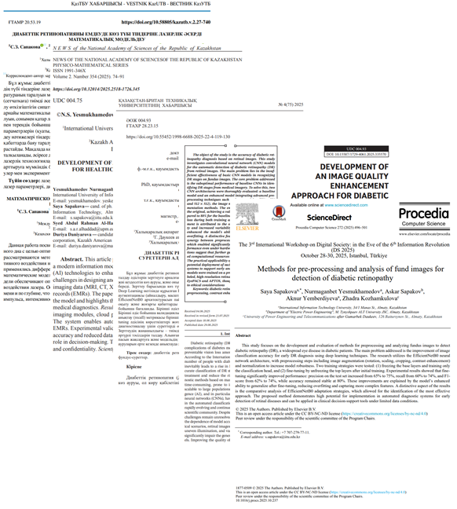
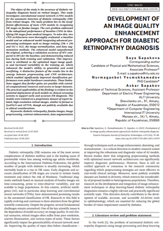
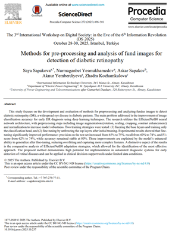
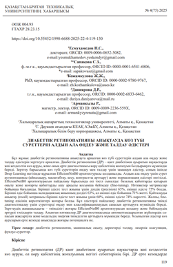
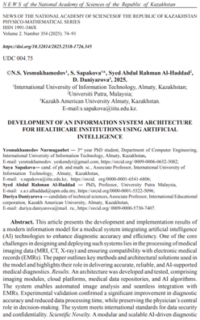
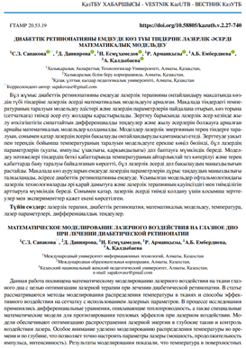

## 1. Тақырып

Жарияланымдар

---

## 2. Слайд мазмұны

**Жалпы жарияланымдар саны: 5**

**Scopus (Q3) журналы — 1:**
- Sapakova S., Yesmukhamedov N., Sapakov A. Development of an Image Quality Enhancement Approach for Diabetic Retinopathy Diagnosis // *Eastern-European J. of Enterprise Technologies*. — 2025. — Vol. 4, No. 9(136). — P. 79–88.

**ҚР БҒСБК (ВАК) журналдары — 3:**
- Yesmukhamedov N.S. et al. Methods for Preprocessing and Analysis of Fundus Images... // *Herald of KBTU*. — 2025. — No. 4(75). — P. 119–130.
- Yesmukhamedov N.S. et al. Development of an IS Architecture for Healthcare... // *News of NAN RK*. — 2025. — No. 2(354). — P. 74–91.
- Сапакова С.З. et al. Mathematical Modeling of Laser Exposure... // *Вестник КазУТБ*. — 2025. — Т. 2, No. 27-740.

**Scopus конференция — 1:**
- Sapakova S., Yesmukhamedov N. et al. Methods for Pre-processing and Analysis... // *Procedia Computer Science* (Elsevier). — 2025. — Vol. 272. — P. 496–501. (DS-2025, Istanbul)

---

## 3. Баяндаушы сөзі

Зерттеу нәтижелері бес жарияланымда апробацияланды. 

Scopus Q3 журналында бір мақала. 

ВАК журналдарында үш мақала. 

Scopus индекстелетін халықаралық конференцияда бір баяндама.
