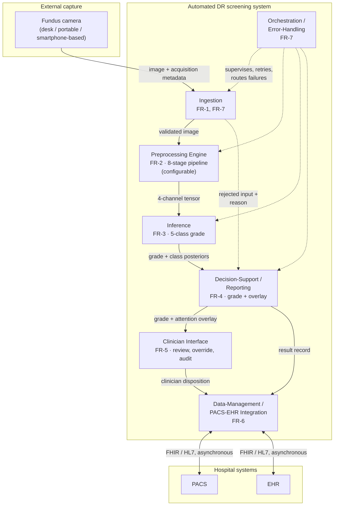
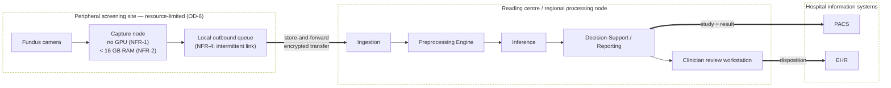
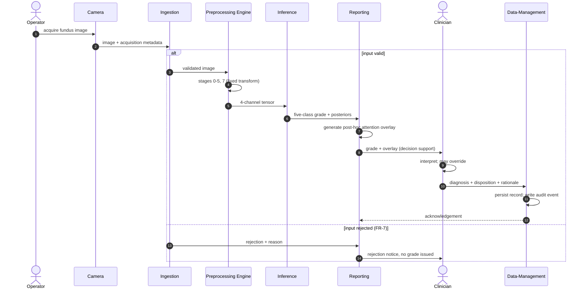
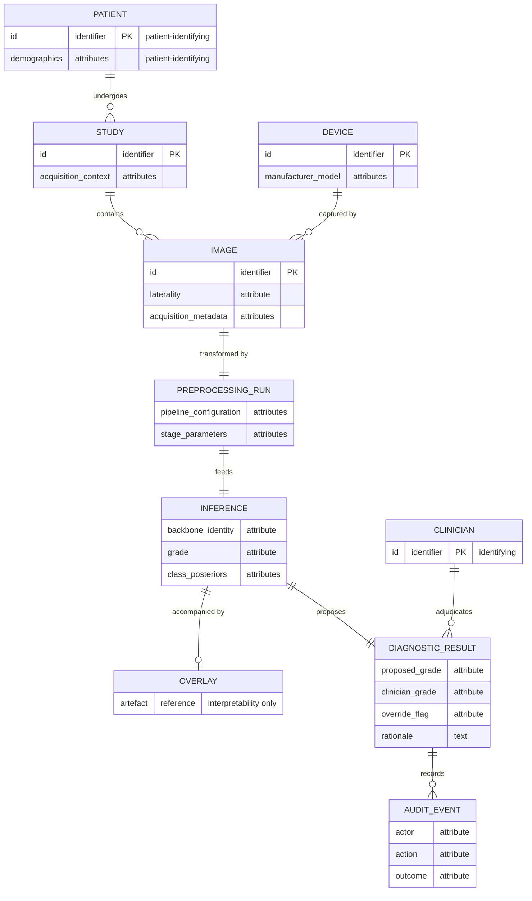

# Automated Diabetic Retinopathy Diagnosis — EN manuscript with GOST [N] citations

> **STAGE-G (final pass) — 2026-08-14.** Working author-year citations converted to numbered `[N]` (GOST 7.32-2001 §6.11, by first appearance). 107 external sources numbered [1]–[107]. Numbers are shared with the Kazakh manuscript (language invariance). Run over the complete 98-section manuscript, Introduction included.

# INTRODUCTION

# §0.1 Relevance of the Research

Diabetic retinopathy is a microvascular complication of diabetes mellitus and one of the leading causes of preventable vision loss among adults of working age. Its clinical significance derives less from its severity at presentation than from its natural history: the earliest stages, in which microaneurysms and small intraretinal haemorrhages appear without any effect on visual acuity, are asymptomatic [1, p. 699]. A patient therefore has no reason to seek care during precisely the interval in which intervention is most effective and least invasive. Detection consequently cannot depend on presentation; it depends on scheduled imaging of a population defined by a systemic diagnosis rather than by an ocular complaint. This inverts the usual arithmetic of specialist ophthalmology. The task is not to examine the patients who arrive, but to examine a cohort that grows with the prevalence of diabetes itself, most of whom will be found to have nothing requiring treatment. Screening for diabetic retinopathy is, before it is a diagnostic problem, a problem of volume.

Volume is what makes the capacity constraint binding. Manual grading of fundus photographs scales linearly with specialist time, and specialist time is both finite and geographically concentrated. Prior work by the candidate, an information-system architecture study whose design contribution is developed in Chapter 6 of this dissertation, characterised this constraint for the Kazakhstan context: approximately 1,200 ophthalmologists serve the entire national population, roughly 40% of residents live in rural areas, and access to specialised eye care for rural residents is substantially limited [2]. These figures are cited here as the contextual framing reported in that prior publication, not as measurements produced by this research. Their analytical force is arithmetic rather than rhetorical: where the supply of graders is fixed and concentrated while the screening population is large and dispersed, expanding coverage by expanding the specialist workforce is not available as a near-term option. The binding question becomes whether the grading step itself can be partly automated. The same prior publication additionally projected deployment outcomes for Kazakhstan — improved rural access, reductions in late-stage complications, reductions in cost. Those projections are third-party estimates cited for framing; they are not results of this dissertation, they are not evidence for any claim made in it, and no part of the argument that follows depends on them.

That automation is technically feasible has been established for a decade. Gulshan et al. [3] is the landmark study that opened the era of convolutional-neural-network-based diabetic retinopathy screening, and the systems that followed it have included prospectively evaluated and regulatorily cleared products. The relevance of the present work therefore cannot rest on a claim that automated screening remains undemonstrated, because it does not. It rests instead on the conditions under which the demonstrations were obtained. Reported performance in this literature has been shown to be unevenly robust: a systematic review of the field identifies recurrent overfitting, unaddressed class imbalance, and weak detection of exactly the early grades on which screening value depends [4], and an independent reproduction attempt on public data did not recover the originally reported operating characteristics. Meanwhile the images themselves are not a stable substrate. Fundus photographs acquired by different cameras, by operators of differing training, through pupils of differing dilation, and under differing illumination vary systematically in contrast, colour balance, illumination uniformity and noise, and this variability has been measured directly and shown to be extensive enough to warrant dedicated quality-assessment models [5, 6]. Where screening capacity is scarcest, acquisition conditions are least controlled — so the settings with the greatest need are the settings whose images least resemble those on which the demonstrations were performed.

This is where the methodological question arises, and it is a question about how models of this kind are specified rather than about how well any particular one performs. Two paradigms can be distinguished. Under **P1**, the end-to-end convolutional paradigm, preprocessing is treated as ancillary data preparation that does not require methodological discussion, on the assumption that a network of sufficient depth and data of sufficient scale will learn the relevant invariances from raw or minimally normalised pixels; Gulshan et al. [3] is taken in this dissertation as the canonical representative of that paradigm, on the basis of its observable methodological practice and not of any theoretical statement attributed to its authors. Under **P2**, the integrated preprocessing-CNN paradigm advanced here, preprocessing is an integral component of the model itself, because the transform applied before the first convolution determines the feature space within which the network is obliged to operate and therefore co-determines what it can learn at all. The distinction is not terminological. If P2 is correct, then a model reported without its preprocessing specified is a model reported incompletely, and comparisons between such models are comparisons between partly unknown systems. The grounds for preferring P2, and the analysis of the practice that grounds the paradigmatic reading, are developed in §1.4; the present section registers only that the choice between the two is open and consequential.

What makes the question answerable now, rather than merely arguable, is the state of the available evidence base. Public fundus corpora now exist that carry documented camera provenance, independent grading protocols, and in one case pixel-level lesion annotation, spanning several countries and acquisition regimes. Their joint availability permits the two paradigms to be placed in controlled contrast — the same architectures, the same training budget, the same partitions, differing in the preparation of the images — and permits the resulting difference to be examined not only in aggregate accuracy but in where the model attends, how it behaves on corpora it has never seen, and how it behaves across camera hardware. The deployment envelope can likewise be specified rather than assumed: a resource-limited environment is defined in this work by concrete conditions — absence of inference-time GPU acceleration, memory below 16 GB, near-real-time throughput requirements, connectivity insufficient for continuous cloud reliance — so that the comparison can be conducted under the constraints that actually obtain where screening is scarce, instead of under laboratory conditions and extrapolated afterwards.

One boundary is placed at the outset and holds throughout. The relevance argued here is the relevance of a methodological question about how diagnostic models are specified and evaluated; it is not a claim that the system described in this dissertation is ready for clinical use, and no such claim is made anywhere in the work. The system is conceived as decision support within a physician-in-the-loop paradigm, in which the clinician interprets the output, retains the diagnosis and retains responsibility for it. Nothing in the chapters that follow establishes clinical validity, regulatory compliance, or deployment readiness, and the closing chapters state as much explicitly.

# §0.3 Research Goal

The goal of this research is to develop and experimentally validate an integrated fundus image enhancement and convolutional-neural-network classification framework for automated five-class diabetic retinopathy diagnosis, in which an eight-stage preprocessing pipeline — canonical flip, optic-disc–fovea rotation normalisation, field-of-view crop with isotropic resize and centred zero-padding, field-of-view mask generation as a fourth input channel, adaptive flat-field illumination correction, dual-constraint stochastic CLAHE in the LAB colour space, train-time augmentation, and dataset-specific channel-wise normalisation — is specified as an integral component of the model rather than as preparation of the data, and to establish, under controlled contrast against an equivalent configuration trained without that pipeline, what difference the specification makes to diagnostic performance, to transferability and to the interpretability of the resulting model under constrained computational conditions.

Three clauses of that statement carry commitments that the headline sentence cannot make explicit on its own.

The first concerns what *integrated* obliges the work to do. If preprocessing belongs to the model specification, then the unit of evaluation is the configuration and not the network, and a comparison is informative only when everything outside the manipulated factor is held fixed: the same corpus, the same patient-level partitioning, the same training budget, the same hardware, the same evaluation protocol. The goal is accordingly not to obtain the best achievable classifier, which would license unconstrained tuning of every component at once, but to obtain a difference attributable to the manipulation under conditions in which attribution is possible. Where the compared configurations differ in more than one respect, the goal is to say so and to bound the claim to the configuration as a whole rather than to any one of its parts.

The second concerns the extent of validation. Establishing a difference in aggregate accuracy on the training corpus would be the weakest form the goal could take, and it is not the form adopted here. Validation is pursued in five directions: an in-domain contrast together with a decomposition of the pipeline into its constituent stages; a direct measurement of the distance between the source and each external domain in the network's feature space, so that the mechanism postulated by the argument is measured rather than inferred from its consequences; evaluation of transfer to independent corpora without retraining; comparison of the alignment between model attention and expert lesion annotation; and evaluation of behaviour on external clinical corpora, across camera groupings, and in a data-scarce training regime. These are directions of inquiry, not anticipated outcomes; each has a pre-specified criterion, and each could have failed.

The third concerns the conditions under which all of this is to hold. The framework is developed for deployment contexts characterised by the absence of inference-time GPU acceleration, limited memory, near-real-time throughput requirements, or connectivity insufficient for continuous reliance on remote services. That envelope constrains the goal rather than qualifying it afterwards: architectures, input resolution, batch size and the computational cost of the preprocessing itself are all bounded by it.

Achieving this goal would establish a methodological result about how diagnostic models of this class are specified and compared. It would not establish clinical validity, regulatory compliance or readiness for unsupervised deployment, and no part of the work is directed at those objectives.

# §0.4 Research Objectives

The objectives below decompose the goal stated in the preceding section. Each is mapped to the chapter in which it is discharged, and the mapping is given explicitly, since it is what allows a reader to audit whether the dissertation does what it undertook to do.

**1. To analyse the problem domain and formulate the research problem (Chapter 1).** To examine the pathophysiology and clinical grading of diabetic retinopathy and the screening requirements of resource-limited settings; to characterise the sources of fundus image quality degradation and the device-specific component of that variability; to survey convolutional architectures for medical imaging, transfer and in-domain pretraining in ophthalmic diagnostics, and explainability methods; to analyse critically the existing automated screening systems and the methodological practice by which they treat image preparation; and, on that basis, to formulate the research problem and justify the direction taken.

**2. To establish the theoretical foundations (Chapter 2).** To formalise histogram equalisation and adaptive contrast enhancement, and in particular the dual-constraint clip-limit formulation of CLAHE; to set out spatial filtering and noise reduction as algorithmic background; to establish the theory of convolution, pooling and feature extraction, of loss functions for imbalanced medical data, and of regularisation; to treat feature transferability across visual domains, fine-tuning strategies and in-domain self-supervised pretraining for retinal imaging; to develop the coupled thermal-optical model of fundus tissue response, which is a theoretical and computational contribution only and is not offered as a clinically validated model; and to define the explainability formalism — class activation mapping and Grad-CAM, with Attention–Lesion Overlap as the primary and Intersection-over-Union as the secondary metric — together with the image-quality metrics used to characterise the preprocessing.

**3. To design and formalise the methodology (Chapter 3).** To specify the eight-stage preprocessing pipeline stage by stage, including the upgraded dual-constraint CLAHE and the augmentation strategy, and to define the ingestion protocol for externally sourced images; to specify the classification architectures and their adaptation to five-class output; to define the initialisation and fine-tuning protocol and the weighted loss formulation; and to define the multi-metric assessment framework together with the cross-validation and statistical-reliability protocols against which every subsequent result is to be judged.

**4. To conduct the experimental programme (Chapter 4).** To evaluate, on a common substrate and under matched conditions, eight investigations: the 2×2 factorial contrast between the integrated and the baseline configuration across two architectures (H-1); the cumulative stage ablation together with the CLAHE and flat-field parameter sweeps (H-2); the direct measurement of the distance between the source and each of six external domains in the network's feature space (H-3); zero-shot transfer to an independent public corpus (H-4); the alignment between model attention and expert pixel-level lesion annotation (H-5); performance on two external clinical corpora (Experiment 5, H-7); behaviour across five camera groupings (Experiment 6, H-6); and training in a data-scarce regime with an independent clinical corpus held out. Each investigation compares configurations rather than isolating any single component of them.

**5. To validate the reliability of the results (Chapter 5).** To subject the experimental findings to interval estimation and cross-fold modelling with correction for multiple comparisons; to classify each primary claim at the strength its pre-specified criterion supports; to place the work against published systems without ranking it among them, and to characterise the relation between performance and computational cost; and to state the limitations and boundary conditions of the approach in full.

**6. To design a screening-system architecture for resource-limited environments (Chapter 6).** To derive functional and non-functional requirements from the deployment envelope; to specify a modular architecture with preprocessing, inference, telemedicine and physician-in-the-loop decision-support components, integrable with clinical information systems; and to state its data-protection and regulatory framing — throughout as a design specification, since no prototype was implemented and no field testing was conducted.

The mapping is intended to be exhaustive in both directions: every clause of the goal is discharged by one of these objectives, and each objective answers to a clause of the goal rather than standing beside it. What makes the fourth objective falsifiable rather than merely descriptive is the set of hypotheses stated next, each with a criterion fixed in advance of the corresponding experiment.

# §0.5 Object and Subject of Research

**Object of research.** The object of this research is the process of automated multi-stage diagnosis of diabetic retinopathy from colour fundus photographs by means of convolutional neural networks. The process is studied in its entirety, from the image as it leaves the camera to the five-class grade the model assigns, rather than in the classification step alone. Its material is a tiered corpus of eight public and clinical fundus datasets, acquired with cameras of four manufacturers and graded under several independent protocols; that corpus is the material on which the process is observed and is not itself the object.

**Subject of research.** The subject of this research is the set of methods and models by which fundus image preprocessing is integrated with convolutional classification, together with the properties that the resulting integrated configuration exhibits: its diagnostic performance under five-class grading, its transferability to corpora not seen during training, the alignment between its attention and expert-annotated pathology, and its behaviour across camera domains. The subject is therefore what this work manipulates within the object it studies. It is the integration that is manipulated, and not the preprocessing considered apart from the network it feeds — a distinction that follows from treating preprocessing as a component of the model, and one that governs how far any observed difference may be attributed.

Object and subject are bounded together. Both are confined to colour fundus photography, to the five-class clinical grading of diabetic retinopathy, and to the corpora and architectures named in the experimental design. Imaging modalities other than fundus photography, ophthalmic conditions other than diabetic retinopathy, and acquisition contexts not represented in the dataset architecture lie outside the object, and no result obtained here extends to them.

# §0.6 Research Hypothesis

The central hypothesis of this research is that the proposed preprocessing pipeline reduces domain variability across fundus imaging devices and acquisition conditions while preserving diagnostically relevant retinal features, and that this reduction leads to improved convolutional-neural-network detection of diabetic retinopathy. The hypothesis is therefore a causal claim in two links: a change in the distribution of the images, and a consequence of that change for classification. The seven hypotheses below are decompositions of it. Six of them test the second link, in different regimes and on different corpora; H-3 tests the **first** link directly, by measuring the distributional distance that the other six can only approach through its consequence. Each hypothesis carries an acceptance criterion fixed in advance of the experiment that evaluates it, and each carries the bound within which it may be read.

**H-1 — Integrated pipeline dominance.** If fundus images are processed through the eight-stage pipeline and a classifier initialised from in-domain pretrained weights is fine-tuned on them, then classification performance will exceed that of the same architecture trained on baseline images (stretch-resize with ImageNet normalisation, three channels, no field-of-view mask) and initialised from ImageNet weights. Dominance is accepted only under the conjunctive criterion: weighted F1 higher by at least five percentage points, **and** ROC-AUC higher by at least 0.02, **and** no degradation in quadratic-weighted Cohen's κ — all three simultaneously, on the held-out partition. Improvement on a subset of the three does not constitute dominance. Sufficient validation additionally requires the same direction of effect on at least one external corpus and replication across both architectures of the factorial design. The independent variable of H-1 is **composite**: the two arms differ jointly along the preprocessing axis and along the initialisation axis, so what the hypothesis asserts is the dominance of the integrated *configuration* as a unitary system. Attribution of any observed difference to preprocessing alone, to initialisation alone, or to their interaction is not claimable under H-1 and is not claimed anywhere in this dissertation.

**H-2 — Component contribution and parameter sensitivity.** If the dual-constraint CLAHE clip-limit parameters and the flat-field correction σ are varied across controlled ranges, then classification performance will exhibit a parameter-dependent sensitivity profile with at least one identifiable optimum inside the tested range; and if the pipeline stages are added cumulatively, each addition will contribute measurably. The hypothesis is bounded to the parameter ranges actually tested, and no extrapolation beyond them is permissible. Any contribution hierarchy that follows is bounded to the tested architectures and corpora and does not identify a universally optimal preprocessing configuration.

**H-3 — Domain-shift reduction.** If images from the source corpus and from each external corpus are embedded by the network's penultimate layer under both configurations, then the distance between the source and target feature distributions will be smaller under the integrated configuration. For each corpus, Δd(X) = d(baseline, X) − d(integrated, X), and the corpus passes when Δd(X) ≥ MCID_d = 0.0 with the lower bound of its bootstrap confidence interval above zero; the hypothesis is accepted when at least K = 5 of n = 6 corpora pass. Maximum mean discrepancy over penultimate-layer features is the primary measure and carries the criterion alone; divergence over per-channel intensity histograms is secondary and informational. A protocol condition is mandatory: the dataset-specific normalisation stage must use source-domain statistics and must never be recomputed on the target, since a transform fitted to the target would make the measurement a form of domain adaptation and incomparable with H-4, H-6 and H-7. Three matters are recorded openly. First, the label H-3 is **reused**: it formerly denoted a comparison of training methods that was dropped, and that retirement stands — occurrences of "H-3 dropped" elsewhere in this dissertation refer to the retired hypothesis and not to this one. Second, neither MCID_d nor K was pre-registered; both were assigned when the hypothesis was formalised. Two facts bound the significance of that: d is an unnormalised distance in arbitrary units, so no non-zero minimal difference would be interpretable and the per-corpus condition degenerates to a bare test of directional significance; and the criterion is insensitive to K over the range in which it could have been set. Third, H-3 is mechanistic. It concerns a property of the representation, not a clinical outcome, and it supports no claim about diagnostic performance, device compatibility or clinical utility.

**H-4 — Cross-dataset transferability.** If a model trained on the source corpus with the full pipeline is evaluated on an independent public corpus without retraining, then the generalisation ratio G = F1_external / F1_source will be at least 0.85. The threshold is a pre-registered success criterion and not a guaranteed outcome; no target-domain adaptation of any kind is performed.

**H-5 — Explainability.** If gradient-weighted class activation maps are computed under both configurations, then the Attention–Lesion Overlap between activation regions and pixel-level lesion annotation will be higher under the integrated configuration, with Intersection-over-Union as a secondary condition. The hypothesis additionally contemplates qualitative overlays on the clinical corpus. Its bound is stated with it: activation is an interpretability instrument and does not constitute clinical localisation of pathology, so what the hypothesis can establish is alignment between model evidence and expert annotation, never detection or delineation of lesions.

**H-6 — Device robustness.** If a model trained on the source corpus is evaluated on corpora acquired with different fundus cameras, then classification performance will be maintained across camera domains, with cross-device variability remaining within bounds specified relative to in-domain performance. Only diabetic-retinopathy labels are used; other disease labels are ignored or mapped. Results obtained under this hypothesis are empirical observations of cross-device variability and do not constitute device certification, regulatory compliance, or a claim of device-agnostic deployment readiness.

**H-7 — External clinical performance.** If a model trained on the source corpus is evaluated without retraining on two external clinical corpora under both configurations, then on **each** corpus the integrated configuration will attain a weighted F1 exceeding the baseline's by at least the minimal clinically important difference of 0.050, with the lower bound of the confidence interval of the difference above zero. The two corpora are **not aggregated**: a reversal on either yields a reversal of the hypothesis irrespective of the other. The acceptance form requires the difference to reach the minimal important difference and the interval's lower bound to exceed zero; it does not require the lower bound itself to reach that difference. H-7 claims **higher absolute performance on external clinical data**. It does not claim reduced degradation, reduced proportional drop, or resistance to domain shift, and no such claim may be derived from it; the degradation quantity in which the hypothesis was formerly expressed is retired and is reported in Chapter 5 as descriptive context and as a critique of a metric in common use.

These criteria were fixed before the corresponding experiments were conducted, and each hypothesis could have failed on its own terms. What each was in fact found to support, and at what strength, is stated in the provisions submitted for defence and established in Chapters 4 and 5. Where a result contradicts the direction of effect a hypothesis specifies, it is reported as a falsifying observation and accounted for, not absorbed by a silent restatement of the hypothesis.

# §0.2 Scientific Novelty

The items below state what is new in this work. How far each is supported, and at what strength, is a separate question and is answered in the provisions submitted for defence; novelty is a claim about kind, not about magnitude, and the two are kept apart deliberately.

The principal contribution is conceptual. It is the reframing of preprocessing from ancillary data preparation — the treatment characteristic of the end-to-end paradigm P1 — to an integral component of the diagnostic model, on the grounds that the transform applied before the first convolution determines the feature space the network is obliged to operate in and therefore co-determines what it can learn. Every item below has a dual character in consequence: each is an engineering result about a particular pipeline, and each is also evidence bearing on the productivity of P2 as a methodological stance.

**1. Preprocessing formalised as part of the model specification, and placed under controlled experimental contrast.** The eight-stage pipeline is specified as a binding part of the model rather than described as data handling, and the resulting configuration is compared against an equivalent configuration lacking it under matched corpus, partitioning, budget and hardware. What is new is not the existence of a preprocessing pipeline but the treatment of one as an object of controlled experiment rather than of description.

**2. The engineering realisation of the pipeline.** Five elements are introduced or specified in forms not previously combined: isotropic resize with centred zero-padding, which preserves the geometry of the fundus circle instead of distorting it to a fixed aspect; a binary field-of-view mask generated as an explicit stage and supplied as a fourth input channel, informing the network which pixels are retinal data and which are padding; adaptive flat-field illumination correction whose Gaussian scale is proportional to the per-image field-of-view diameter rather than fixed globally, and applied inside the mask only so that padding is not corrupted; channel-wise normalisation computed from valid fundus pixels of the training corpus rather than from natural-image defaults; and canonical orientation by optic-disc–fovea rotation, with the augmentation rotation scale derived per image from the uncertainty of the landmark localisation itself.

**3. The dual-constraint stochastic CLAHE.** The clip limit is formulated as the minimum of two constraints — one proportional to tile area under a clip factor, one a global ceiling — and enhancement is applied stochastically at training time, so that the stage serves simultaneously as an enhancement operator and as a source of regularisation. This formulation extends the candidate's previously published work on fundus image quality enhancement rather than originating here; the novelty of the present treatment lies in its formalisation, in its embedding in a specified pipeline, and in its validation within the five-class grading task.

**4. Attention–Lesion Overlap as a primary explainability metric.** Overlap between attention and annotation is measured by an asymmetric quantity — the fraction of an annotated lesion covered by model attention — rather than by a symmetric one, on the reasoning that lesion coverage is the clinically meaningful direction and that a symmetric measure penalises diffuse attention for being diffuse. Intersection-over-Union is retained as a secondary measure, and both are compared per lesion type against pixel-level annotation. What such a measurement can establish is alignment between model evidence and expert annotation; activation maps are an interpretability instrument and do not constitute clinical localisation of pathology.

**5. Direct measurement of domain-shift reduction.** Work asserting that preprocessing improves cross-domain robustness ordinarily demonstrates the assertion through its consequence — external accuracy — and leaves the postulated mechanism, a reduction in distributional distance, unmeasured. Here the mechanism is measured directly: source-to-target distance is computed at the penultimate layer under both configurations across six external corpora, with interval estimates on the paired reduction, at the cost of forward passes only. Two features of the design carry the novelty. Normalisation uses source-domain statistics and is never recomputed on the target, so any convergence observed is a property of the preprocessing rather than of a procedure fitted to the target. And the measurement's falsifiability was recorded before it was made: because two stages of the pipeline are bound to the source domain by construction, a reversal — variability reduced within the source domain while increased across domains — was a live possibility, and would have been a finding rather than a failed measurement.

**6. Decomposition of a composite effect by cumulative ablation.** The factorial design necessarily confounds two axes, since the two arms differ in preprocessing and in initialisation together. A cumulative ablation conducted under a single initialisation separates the preprocessing contribution from that confound. The fence belongs in the same breath: this decomposition does not retroactively convert the factorial experiment into a single-factor manipulation, and no claim about the isolated effect of preprocessing is made on the strength of the factorial design itself.

**7. In-domain initialisation admitted by an acceptance gate — including a negative result.** The integrated configuration is initialised from in-domain rather than natural-image pretraining, with the choice among candidate initialisations settled by a frozen-backbone linear-probe gate rather than by assumption. Label-free self-supervision trained from scratch on the in-domain corpus failed that gate, across several protocols of the same family and without improvement from longer training. That outcome is reported as evidence about the objective and the corpus, not omitted; the gate exists precisely so that an initialisation may fail it.

**8. The tiered validation architecture.** Eight public and clinical corpora are organised by function — training and ablation, external public evaluation, external clinical evaluation, device-domain evaluation — spanning four camera manufacturers and several independent grading protocols. The architecture is itself a design object: it is what allows a single trained configuration to be examined for in-domain performance, transfer, attention alignment, clinical-corpus behaviour and device variability without retraining between examinations.

**9. Identification of a defect shared by three transfer measures in common use.** The degradation quantity in which external robustness is conventionally expressed, the generalisation ratio, and the retention ratio all normalise or difference an arm's external performance against that same arm's in-domain performance. Each therefore penalises an arm for its in-domain strength, and the first of them is satisfiable only by an arm that exceeds its comparator more on unfamiliar data than on familiar. The identification is analytic, and it is strictly descriptive: it rehabilitates no result of this work, and no claim in this dissertation is rescued by it.

**10. Two contributions that are non-empirical by design.** A coupled thermal-optical model of fundus tissue response under laser exposure is developed as a theoretical and computational contribution only; it is not offered as a clinically validated model. A modular architecture for an automated screening system in resource-limited environments is specified as a design contribution only; no prototype was implemented and no field testing was conducted.

Two things this inventory does not assert should be said plainly. No item constitutes a claim of superiority over any named published system, and none constitutes a claim of clinical validity or of readiness for deployment. Nor does any item attribute an improvement to preprocessing considered in isolation: where the compared configurations differ along more than one axis, what is new is the configuration and the evidence about it, not a decomposition the design does not support.

# §0.8 Provisions Submitted for Defence

Each proposition below is submitted for contestation at the strength assigned to it in the reliability validation, against a promotion condition fixed before the corresponding experiment was conducted. Every empirical provision carries a qualification, and the qualification is not detachable: a provision stated without it is a different and stronger proposition than the evidence supports, and is not the one defended here. The claim register skips one identifier, which is not in use; the gap is left open rather than closed by renumbering.

**Conceptual provision.**

**1.** *(PC-0)* Preprocessing of fundus images is a formalisable and experimentally testable component of the diagnostic model rather than ancillary preparation of the data — the reframing from the end-to-end paradigm P1 to the integrated paradigm P2. This provision is methodological and non-empirical: no experiment in this work promotes or refutes it. The experimental results are consistent with it under the conditions tested, and consistency under tested conditions is not a universal demonstration.

**Empirical provisions.**

**2.** *(PC-1)* The integrated configuration dominates the baseline configuration in five-class classification on the training corpus, on both architectures, under the conjunctive criterion in all three of its components, with the effect surviving correction for multiple comparisons and showing no interaction with the choice of architecture. The provision concerns the *configuration*: the two arms differ in initialisation as well as in preprocessing, so no part of the effect is attributed here to preprocessing alone. The cumulative ablation decomposes that composite under a single initialisation and recovers the whole in-domain gain, but decomposition is not dissolution — the factorial comparison remains a comparison of configurations differing along two axes.

**3.** *(PC-2)* The dual-constraint CLAHE parameters and the flat-field correction scale each exhibit an interior optimum within the ranges examined, confirmed on data held out from the selection, so the pipeline's photometric settings are neither arbitrary nor at a boundary. The provision is bounded to the ranges tested, and the optimal values are properties of this corpus and pipeline rather than portable constants.

**4.** *(PC-8)* The contributions of the individual pipeline stages are separable, each exceeding the between-fold dispersion of its level, monotone across every fold, and orderable with the two photometric stages leading. The provision is defended **at the resolution of groupings only**: adjacent ranks lie within noise, no strict ordering from first to last stage is submitted, and the field-of-view mask channel was not isolated, since the ablation introduces it jointly with the crop.

**5.** *(PC-11)* The integrated configuration reduces the distance between the training distribution and each external distribution in the network's penultimate-layer feature space, on every external corpus examined, with each interval excluding zero, and without any target-corpus statistic entering the transform. The provision is submitted **in direction only**. The magnitude of a distance reduction does not track the magnitude of the corresponding performance gain, and no argument in this work rests on such a correspondence. The claim is mechanistic — a property of the representation, not of diagnostic performance — and, because the distances are computed over model-dependent features, each arm is measured within its own representation space.

**6.** *(PC-6)* A model trained with the pipeline transfers to an independent public corpus without retraining, clearing the pre-registered generalisation threshold and exceeding the baseline on every grade. The qualification is stated with the provision: the baseline configuration also clears that threshold, so the criterion does not discriminate between the arms. What is defended is the comparison — the pipeline improves a transfer that was already acceptable rather than rescuing one that would otherwise fail.

**7.** *(PC-7)* Model attention aligns more closely with expert pixel-level lesion annotation under the integrated configuration, on all four annotated lesion types, on both the primary and the secondary measure, and robustly across the attention threshold. The provision is bounded to **alignment between model evidence and expert annotation**: activation maps do not constitute clinical localisation of pathology, and neither configuration is claimed to detect or delineate lesions. The evidence rests on one annotated corpus and the models of a single fold, and the qualitative examination on the clinical corpus that the hypothesis also contemplates was not carried out.

**8.** *(PC-9)* Classification performance is maintained across every camera grouping examined, and — substantively — the dispersion of performance across those groupings is reduced under the integrated configuration, the range being compressed rather than displaced. Three qualifications travel with it: both configurations clear the retention floor, so the floor does not discriminate; two of the five groupings are the external clinical corpora themselves and therefore furnish no independent replication; and three groupings aggregate several camera models rather than identifying a single device. No part of this provision constitutes device certification, regulatory compliance, or a claim of device-agnostic deployment readiness.

**9.** *(PC-10)* The integrated configuration attains higher absolute weighted F1 than the baseline on both external clinical corpora, each difference reaching the minimal clinically important difference with its confidence interval excluding zero, evaluated on each corpus separately and without aggregation. The provision is about **absolute external performance, not resistance to degradation**: relative to their own in-domain levels the two configurations decline almost identically, and no reduced-degradation claim is made. The margin over the minimal important difference on the second corpus is **0.0041**, and the lower bound of that interval lies below the minimal important difference; the acceptance form permits this, and it is stated here rather than left for a reader to compute.

**Methodological provision.**

**10.** Three measures in common use for expressing external robustness — the degradation quantity, the generalisation ratio and the retention ratio — share a structural defect: each normalises or differences an arm's external performance against that same arm's in-domain performance, and therefore penalises an arm for its in-domain strength. In the first case the comparison reduces algebraically to the fixed in-domain margin minus the very quantity under test. The identification is analytic rather than empirical, and it is submitted as **strictly descriptive**: it rehabilitates no result of this work, and no provision above is rescued by it.

**Design and theoretical provisions.**

**11.** *(PC-4, PC-5)* A coupled thermal-optical model of fundus tissue response under laser exposure, submitted as a theoretical and computational contribution and not as a clinically validated model; and a modular architecture for an automated screening system in resource-limited environments, submitted as a design specification, no prototype having been implemented and no field testing conducted.

One further result is offered as an observation rather than as a provision. In a preregistered evaluation on a corpus roughly one-seventieth the size of the training corpus, with both arms trained from the same initialisation, the integrated configuration was again the stronger, by a margin **comparable to, and not larger than**, the margin measured with abundant data. That the advantage does not grow as data become scarce is informative in itself, and it is more consistent with the pipeline altering the feature space than with its substituting for absent examples. The clinical corpus involved cannot be redistributed, so this result is not externally reproducible.

Finally, what is *not* submitted. No provision asserts clinical validity, readiness for unsupervised deployment, device certification, localisation of pathology, or superiority over any named published system, and none extends beyond the corpora, devices and hardware on which the results were obtained. That the empirical provisions stand uniformly at the highest available level follows from the narrowness with which each is stated and from the fact that every promotion condition was fixed before its experiment was run; it is a property of how the claims were specified, not a measure of their importance.

# §0.7 Methodological Basis

The methodological basis of this research is controlled experimental comparison. Configurations are contrasted with everything outside the manipulated factor held fixed — the same corpus, the same patient-level partitioning, the same training budget, the same computational hardware, and the same evaluation protocol — so that a difference in outcome is interpretable as a difference between the configurations rather than between the conditions under which they were obtained. The methods enumerated below are instruments in the service of that comparison, grouped by the role each plays.

**Image processing.** Orientation is normalised by localising the optic disc and the fovea with a pre-trained, frozen heatmap-regression detector and rotating the image so that the axis between them is horizontal; the detector is not co-trained with the classifier, so the preprocessing remains a fixed transform. Geometry is preserved by isotropic rescaling with centred zero-padding rather than by anisotropic stretching, and the resulting padding is made explicit to the network through a binary field-of-view mask supplied as an additional input channel. Illumination is corrected by adaptive flat-field subtraction whose Gaussian scale is proportional to the per-image field-of-view diameter and which is applied inside the mask only. Local contrast is enhanced by contrast-limited adaptive histogram equalisation in the LAB colour space under a dual-constraint clip limit, applied stochastically during training. Intensities are finally standardised channel-wise using statistics computed from valid fundus pixels of the training corpus.

**Learning.** Classification uses two established convolutional backbones of differing family and capacity. The baseline arm is initialised from natural-image pretraining; the integrated arm is initialised from in-domain pretraining, with the choice among candidate initialisations settled by a frozen-backbone linear-probe acceptance gate rather than assumed — in-domain initialisation is not taken to transfer better by default, and an initialisation that fails the gate is not admitted. Class imbalance is addressed at the objective by focal loss with inverse-frequency weighting. Because the two arms differ in initialisation as well as in preprocessing, the manipulated factor throughout is the configuration as a whole.

**Evaluation and inference.** Diagnostic effectiveness is assessed on a fixed hierarchy of metrics: weighted F1 first, as the measure most directly interpretable under a skewed grade distribution; then ROC-AUC as a threshold-independent measure; then Cohen's κ with quadratic weights, which penalises misgrading in proportion to its ordinal distance; and accuracy, reported for completeness but not sufficient on its own under imbalance. Partitioning is patient-level stratified five-fold cross-validation, so that images of the same patient never span the training and evaluation sides. Differences are assessed by paired significance testing on the same cases, by bootstrap interval estimation, and — where replication across folds exists — by a mixed-effects model that separates between-fold variation from the effect under test. Comparisons made together are corrected for multiplicity.

**Mechanism and interpretation.** Model evidence is examined by gradient-weighted class activation, compared against pixel-level lesion annotation using Attention–Lesion Overlap as the primary measure and Intersection-over-Union as a secondary one. The distributional mechanism postulated by the central hypothesis is measured directly, by maximum mean discrepancy between source and target distributions over penultimate-layer features, with divergence over per-channel intensity histograms reported as informational context. The photometric effect of the pipeline is characterised by contrast-to-noise ratio, image entropy and structural similarity.

Two limitations of this apparatus are stated here rather than left to the validation chapter. Correction for multiplicity is scoped to the single experiment within which the comparisons were planned; no dissertation-wide error rate is claimed, and the reader should not treat the set of reported findings as jointly controlled. And several evaluations rest on the models of a single fitted fold, so their intervals quantify evaluation-corpus sampling alone and omit the variability that refitting would introduce; those intervals therefore understate total uncertainty, in a known direction.

# §0.9 Theoretical Significance

The theoretical significance of this research lies in how the problem is posed and measured rather than in any particular measurement.

The primary contribution is the reframing of preprocessing as a component of the model specification rather than as preparation of the data. If the transform applied before the first convolution determines the feature space the network operates in, then a model reported without that transform specified has not been fully described, and two models so reported cannot be compared as though only their architectures differed. The reframing therefore changes what counts as a complete description of a diagnostic model of this class, and with it what counts as a fair comparison between two of them.

Three formalisations make previously informal choices explicit and, in consequence, testable. The clip limit of contrast-limited adaptive histogram equalisation is expressed as the minimum of two constraints, one scaling with tile area and one a global ceiling, so that the enhancement strength becomes a parameter with a stated form rather than a tuned constant; this formulation extends the candidate's previously published work on fundus image enhancement rather than originating here. Illumination correction is expressed with a scale that is a function of per-image geometry rather than a fixed value, which makes the operator well-defined across images of differing field-of-view size. And the correspondence between model attention and expert annotation is expressed by an asymmetric overlap measure, with the asymmetry argued from what is clinically meaningful — the fraction of a lesion that attention covers — rather than adopted from convention.

A fourth contribution is to render a postulated mechanism measurable. The proposition that preprocessing improves cross-domain behaviour by reducing distributional distance has functioned in this literature as an explanation rather than as a measurement, inferred from external accuracy rather than tested. This work formulates that middle term as a quantity computable at the network's penultimate layer under a stated protocol condition — that normalisation must derive from source-domain statistics — which makes the mechanistic claim falsifiable independently of the performance claims it is invoked to explain. The contribution is the measurability and the condition that gives it force, not what the measurement returned.

A fifth is analytic. A family of measures in common use for expressing external robustness normalises or differences an arm's external performance against that same arm's in-domain performance; such measures are not neutral instruments, since they penalise a configuration for its in-domain strength. The analysis holds wherever those measures are used and does not depend on any result obtained here.

Finally, the coupled thermal-optical model of fundus tissue response under laser exposure is a theoretical and computational contribution: it is developed and simulated, and it is not offered as an experimentally or clinically validated model.

These are contributions to how the problem is formulated and measured. None of them is established as a universal proposition by argument alone, and none extends beyond the class of problem in which it is stated.

# §0.10 Practical Significance

Four things this work makes practically available, each with the limit that attaches to it.

The first is a fully specified preprocessing regime. The pipeline is defined stage by stage, with its operators, its parameters and the order in which they apply, and its implementation is reproduced in the appendix, so that it can be applied to other corpora, audited by others, or contested on its details rather than accepted on description. The parameter values, however, were fixed on particular corpora and are properties of those corpora rather than portable constants; a practitioner adopting the regime elsewhere should expect to re-establish them rather than inherit them.

The second is an architecture for an automated screening system suited to settings without inference-time acceleration, with limited memory, and with intermittent connectivity — comprising a configurable preprocessing engine, an inference module, store-and-forward telemedicine support, and a physician-in-the-loop decision-support interface, with defined integration points to clinical information systems. It is a design specification and nothing more: no prototype was implemented, no deployment was tested in a clinical setting, and its data-protection provisions are alignment by design rather than certified compliance with any statute or standard.

The third is a protocol for ingesting externally sourced images that arrive without controlled acquisition — of unknown provenance, inconsistent format, and variable quality. Its practical value is in making such material usable at all; its limit is that it was developed and validated against the specific clinical source it was built for, and its extension to arbitrary clinical data sources would require independent validation.

The fourth is an argument of applicability to the Kazakhstan screening context, in the form of a fit between a documented deployment situation — a concentrated specialist workforce serving a large and partly rural population — and a computational envelope stated in advance. Prior work by the candidate additionally cites projected outcomes for such a deployment, including improved rural access and reductions in late-stage complications and in cost; those figures are third-party projections reported in that publication, they are not results of this research, they are not evidence for any claim made in it, and nothing in this dissertation is substantiated by them. Applicability is argued as design fit, and it is bounded by the absence of any field testing in Kazakhstan clinical settings.

All four stand within one frame. The system is conceived as decision support within a physician-in-the-loop paradigm: it produces a grade and an accompanying attention overlay for a clinician to interpret, and the clinician retains the diagnosis and the responsibility for it. Nothing here is offered as a standalone diagnostic instrument or as a substitute for ophthalmological assessment.

# §0.13 Reliability of the Results

The reliability of the results rests on procedure rather than on magnitude. Evaluation uses corpora of substantial scale and, beyond the training corpus, seven further corpora of independent provenance. Partitioning is patient-level and grade-stratified, so that images of one patient cannot span the training and evaluation sides and a model cannot be credited for recognising a patient it has already seen. Performance is reported on a hierarchy of metrics fixed in advance rather than on a metric selected once the outcomes were visible, with weighted F1 leading and accuracy explicitly insufficient on its own under an imbalanced grade distribution. Differences between configurations are assessed by paired testing on identical cases, which removes case difficulty from the comparison; their uncertainty is quantified by resampling; and where replication across folds exists, a mixed-effects model separates between-fold variation from the effect under test. Comparisons planned together are corrected for multiplicity.

The strongest of these grounds is also the one a reader cannot confirm by inspecting a table, and it is therefore stated explicitly: the acceptance criterion for each hypothesis, and the promotion condition for each claim, was fixed before the experiment that tested it was conducted. A criterion written once a result is known can always be satisfied, and a classification produced that way carries no information. The ordering is what makes the classification informative, and it can be checked against the record independently of the outcomes.

Three qualifications bound that reliability, and they are given here rather than reserved for the validation chapter. First, correction for multiplicity is scoped to the single experiment within which the comparisons were planned; no dissertation-wide error rate is claimed, and the collection of reported findings is not jointly controlled. Second, several evaluations rest on the models of one fitted fold, so their intervals quantify sampling of the evaluation corpus alone and omit the variability that refitting would introduce; those intervals understate total uncertainty in a known direction. Third, one experiment depends on a clinical corpus that cannot be redistributed, so that result is not externally reproducible; and although calibration was measured and reported, calibration is an empirical property of a model's output probabilities and not a warrant of clinical decision-making reliability.

The work is also placed against published systems, but placement is not ranking, and the distinction is substantive rather than modest. Published results differ from these in the task as defined, in the corpus and partition, in the reference standard against which grades were fixed, and in the metric reported; no two of the compared rows share all four, so an ordering among them would not mean what it appeared to mean. Reliability, in this dissertation, therefore means that the results are checkable against criteria stated in advance on material described in full — not that they are established beyond the corpora, devices and conditions under which they were obtained.

# §0.14 Empirical (Experimental) Basis

The empirical basis of this research is eight public and clinical fundus corpora, organised by function rather than assembled opportunistically. The tiering is itself part of the design: because each tier answers a distinct question, a single trained configuration can be examined for in-domain performance, for transfer, for attention alignment, for clinical-corpus behaviour and for device variability without being retrained between examinations.

**Training and ablation.** The primary corpus comprises approximately 35,126 graded colour fundus photographs acquired with a single camera model, distributed across the five clinical grades with pronounced imbalance towards the healthy grade; that asymmetry conditions the choice of metrics, the loss formulation and the interpretation of every per-class figure reported in this dissertation. A second, unlabelled split of the same source — approximately 53,576 images — supplies the in-domain pretraining corpus for the integrated arm. It is disjoint from the evaluation corpus by image identity **and** by patient identity, and it is used only for pretraining and never folded into supervised training; without that separation the initialisation would constitute a leak rather than a transfer.

**External public evaluation.** An independent public corpus of approximately 3,662 images, graded on the same five-class scale but acquired in a different country and from mixed camera sources, is used for zero-shot transfer with no retraining and no target-domain adaptation.

**External clinical evaluation.** Two clinical corpora are used: one of 516 images acquired with a Kowa camera, of which 81 carry pixel-level lesion annotation for four lesion types, and one of approximately 1,748 images acquired with a Topcon camera. The annotated subset is small relative to its corpus and smaller still relative to the training corpus, which bounds the precision of every explainability measurement made on it.

**Device domain.** Three further corpora supply camera diversity: approximately 13,673 images from Canon and Topcon hardware, approximately 5,000 from Canon and Zeiss, and approximately 3,200 from Topcon and Kowa. Two of the three are annotated under multi-disease taxonomies, from which the diabetic-retinopathy subset is mapped and the remaining labels ignored; the mapping is documented rather than assumed, and it means that these corpora are used as sources of diabetic-retinopathy labels only.

**Clinical corpus.** A small Kazakh clinical set of 60 images — 30 patients, both eyes, balanced by grade — is used for training in a data-scarce regime. It originates from private medical centres and cannot be redistributed under the agreements governing it, so results that depend on it are not externally reproducible; this is stated as a structural limitation of those results and not as a qualification added afterwards.

The heterogeneity across these corpora is what makes the evaluation informative and, in the same measure, what forbids pooling. Differences in imaging equipment, patient population, grading protocol and disease taxonomy are precisely the conditions under which transfer and device robustness become meaningful questions; they are also the reason that results obtained on different corpora are reported separately and are never aggregated into a single figure of merit.

# §0.11 Approbation of Research Results

The components of this research were disseminated progressively, through peer-reviewed publication and through presentation at an international scientific forum, before being integrated into the present dissertation. The documentary record — the publication catalogue together with its indexing and publication-confirmation assets — is reproduced in Appendix D.

The work was reported and discussed at the 3rd International Workshop on Digital Society (DS 2025), held in Istanbul, Türkiye, on 28–30 October 2025; the corresponding proceedings paper is published in a Scopus-indexed series. The published record additionally comprises one article in a Scopus-indexed journal and three articles in journals recommended by the national committee for quality assurance in science and higher education. Across these outputs the four strands that the dissertation integrates — fundus image preprocessing and classification, the transfer-learning adaptation, the thermal-optical model of laser–tissue interaction, and the architecture of an AI-assisted diagnostic information system — were each brought to peer review before their consolidation here.

All of these outputs are co-authored and are treated throughout this dissertation as prior own work. Where the main text draws on any of them it does so under explicit self-citation, so that the relationship between the published record and the present contribution remains visible to the reader. Two consequences follow and are observed without exception. Publications that report the same experimental material are not cited as independent corroboration of one another. And the performance figures stated inside those publications are not imported as findings of this dissertation: where the same questions arise here they are re-examined under this work's own governance, on this work's own material, and reported at whatever strength that examination supports.

# §0.15 Connection with Scientific Programmes

The direction of this research corresponds to the state priorities of the Republic of Kazakhstan in the digitalisation of healthcare and the development of artificial-intelligence technologies. In particular, it accords with the Concept for the Development of Artificial Intelligence for 2024–2029; with the Address of the President of the Republic of Kazakhstan, "Kazakhstan in the Era of Artificial Intelligence", of 8 September 2025; and with the Law of the Republic of Kazakhstan "On Artificial Intelligence" (No. 230-VIII of 17 November 2025). The research is carried out in accordance with subparagraph 2 of paragraph 3 of article 20 of the Law of the Republic of Kazakhstan "On Science".

The nature of this connection should be stated precisely. It is a correspondence between the direction of the research and published national priorities. It is not a statement that the work was funded under a state programme, commissioned by any body, or performed under an institutional mandate, and it is not a claim that any policy objective has been achieved by this research or that any outcome projected in those documents has been realised through it.

# §0.12 Publications

The main results of this dissertation are published in five distinct peer-reviewed scientific works: one article in a journal indexed by Scopus and Web of Science; one paper in the proceedings of an international conference indexed by Scopus; and three articles in journals recommended by the national committee for quality assurance in science and higher education of the Republic of Kazakhstan.

One point of bibliographic bookkeeping is stated rather than left to be discovered. The Scopus-indexed journal article is represented in this dissertation's literature corpus by two separate records, prepared from that single article for two different analytical purposes. It is a single publication and is counted once. The two records are correspondingly never cited as independent confirmation of the same claim, since they report the same article and the same material.

The full bibliographic list, with venues, volume and page references and digital object identifiers, together with the indexing and publication confirmations held for each work, is given in Appendix D.

All five works are co-authored, and all are identified as prior own work wherever the dissertation draws on them. The performance figures reported inside them are not carried into this dissertation as findings: where the questions they addressed recur here, they are re-examined under this work's own governance and on its own material.

# §0.16 Structure and Length of the Dissertation

The dissertation consists of front matter — normative references, definitions, and designations and abbreviations — followed by an introduction, six chapters, a conclusion, a list of references used, and six appendices.

The chapters proceed from the problem to the apparatus, from the apparatus to the method, from the method to the evidence, from the evidence to the price of that evidence, and only then to the design it licenses; each is a precondition of the one that follows rather than a parallel treatment of the same subject.

**Chapter 1** establishes the clinical, epidemiological and technical context of automated diabetic retinopathy screening, characterises the variability of fundus image quality and its device-specific component, reviews convolutional architectures, transfer and in-domain pretraining and explainability methods, analyses the existing automated screening systems, and formulates the research problem. **Chapter 2** develops the mathematical and theoretical apparatus: image enhancement and the formalisation of the dual-constraint clip limit, convolutional operations and objectives for imbalanced data, feature transferability and in-domain self-supervised representation learning, the coupled thermal-optical model of fundus tissue response, the explainability formalism, and the image-quality metrics. **Chapter 3** specifies the methodology — the eight-stage preprocessing pipeline stage by stage, the classification architectures and their adaptation, the initialisation, fine-tuning and loss formulation, and the multi-metric assessment and statistical-reliability framework. **Chapter 4** reports the experimental programme on a common substrate. **Chapter 5** validates the reliability of those results, assigns each claim the strength its pre-specified criterion supports, places the work against published systems, characterises the relation between performance and computational cost, and states the limitations and boundary conditions in full. **Chapter 6** specifies the architecture of an automated screening system for resource-limited environments; it is a design specification throughout, no prototype having been implemented and no field testing conducted. The **conclusion** consolidates the outcomes, the contributions and the directions for further work.

Six appendices follow: **A**, the source code of the preprocessing pipeline; **B**, supplementary experimental results and confusion matrices; **C**, the system-architecture diagrams; **D**, the publication and approbation record; **E**, the attention-map gallery; and **F**, supplementary tables for the device-domain evaluation.

The dissertation is set out on 238 pages, and contains 42 tables, 26 figures and two diagrams. The list of references comprises 107 sources.


---

# 1 PROBLEM DOMAIN ANALYSIS AND CURRENT STATE OF AUTOMATED DIABETIC RETINOPATHY DIAGNOSIS

# §1.1.1 Pathophysiology and Clinical Grading Systems

Diabetic retinopathy (DR) is a chronic complication of diabetes mellitus and one of the principal causes of preventable vision loss among working-age adults. Its scale is substantial: in a narrative review of DR pathophysiology, Kusuhara et al. [7] cited a pooled prevalence of any DR of 34.6% among diabetic populations worldwide, and Morya et al. [8], in a further narrative review of pathophysiology and treatment, observed that DR is present in approximately one-third of patients with diabetes. Both estimates are reported here as third-party clinical context rather than as findings of this dissertation, and both derive from non-systematic narrative syntheses whose epidemiological figures are inherited from the primary studies they cite. The clinical importance of DR for an automated screening system lies not only in its frequency but in the fact that its severity is defined by a discrete, ordered set of structural changes visible on the retinal fundus. This section establishes the biological basis of those changes and the standard five-class grading scale (DR 0–4) that discretizes them — the ordinal target taxonomy every classifier in this dissertation must reproduce (per the central thesis).

The pathophysiological process underlying these visible changes is, in its classical description, microvascular. Sustained hyperglycemia drives a cascade of metabolic and vascular injury in the retinal capillary bed. Kusuhara et al. [7] identified pericyte dropout from the retinal capillary walls as a consensus mechanism responsible for breakdown of the inner blood–retina barrier (p. 370), and described vascular endothelial growth factor (VEGFA–VEGFR2) signalling as pivotal in the retinal angiogenesis and vascular leakage characteristic of advanced disease (p. 369). The downstream consequences — increased vascular permeability, capillary non-perfusion, and progressive retinal ischemia — culminate, in the most severe form, in pathological neovascularization. Because this is a narrative review without systematic search methodology, and because the authors themselves note that the cellular and molecular mechanisms underlying DR "are not fully determined" given that hyperglycemic animal models reproduce only limited aspects of early disease (p. 364), these mechanistic statements are taken as the review's synthesis of the field rather than as settled fact.

A purely microvascular account of DR is, however, incomplete, and the cited literature converges on a broader framing. Wang and Lo [9] characterized DR as a combination of microvascular damage, inflammation, and retinal neurodegeneration, and reported that retinal neurodegeneration may precede the microvascular changes traditionally regarded as the disease's defining signs. Kusuhara et al. [7] similarly noted clinical and experimental evidence of irreversible neuronal loss preceding vascular lesions (p. 369), and Gettinger et al. [10], reviewing experimental DR models, argued that DR is multifactorial rather than solely hyperglycemia-driven and that retinal neurodegeneration may precede vascular pathology. Taken together, these convergent observations support understanding DR as a disorder of the retinal neurovascular unit rather than of the vasculature alone. This distinction matters for an imaging-based classifier: fundus photography renders the *microvascular* manifestations of the disease, so a model graded against the standard clinical scale necessarily learns the vascular signature of a process whose earliest pathology may be partly neural and not yet fully visible. Gettinger et al. [10] reinforced the heterogeneity of the disease in noting that no single experimental model reproduces the full spectrum of the human DR phenotype (p. 16), which implies a correspondingly heterogeneous range of imaging presentations across patients and stages.

On the fundus image itself, the disease declares itself through a characteristic, roughly ordered progression of lesions. The earliest and smallest are microaneurysms — focal outpouchings of weakened capillaries — followed by intraretinal (dot and blot) hemorrhages as those vessels rupture. Lipid and protein exudation from the leaking barrier produces hard exudates, while focal retinal ischemia produces cotton-wool spots (soft exudates) at the nerve-fibre layer. As the microvasculature deteriorates further, intraretinal microvascular abnormalities (IRMA) and venous beading appear, signalling extensive non-perfusion; in the proliferative phase, neovascularization — fragile new vessels at the disc or elsewhere — supervenes and risks vitreous hemorrhage and tractional detachment. Overlaid on this severity axis, and independent of it, is diabetic macular edema (DME): fluid accumulation at the macula that is a leading cause of central vision loss and, as Wang and Lo [9] noted, the principal indication for first-line intravitreal anti-VEGF therapy (p. 9). For an automated classifier these lesions are the operative image features, and their analytical salience is uneven: the microaneurysms and small hemorrhages that define the earliest, most screening-critical grades are small, low-contrast structures, whereas the neovascular and exudative changes of advanced disease are comparatively conspicuous.

The clinical grading scale partitions this lesion burden into severity classes. At the coarsest level, DR is dichotomized into non-proliferative DR (NPDR) and proliferative DR (PDR), the latter distinguished by the presence of neovascularization [1, p. 699]. Kesharwani et al. [1] is a narrative clinical review with documented citation inaccuracies, published in a journal flagged for questionable editorial practices, and is cited here only for this general disease-background distinction; its specific quantitative claims are not relied upon. Modern screening, however, uses a finer ordinal scale. As summarized by Morya et al. [8], DR severity is graded by standardized systems — the Early Treatment Diabetic Retinopathy Study (ETDRS) scale and the International Clinical Diabetic Retinopathy (ICDR) scale — that resolve the disease into five ordinal levels: DR 0 (no apparent retinopathy), DR 1 (mild NPDR), DR 2 (moderate NPDR), DR 3 (severe NPDR), and DR 4 (proliferative DR). Progression from DR 1 to DR 3 is defined by the increasing number and extent of microaneurysms, hemorrhages, and microvascular abnormalities within the non-proliferative range, while the transition to DR 4 is marked by neovascularization. This DR 0–4 scale is the canonical five-class taxonomy adopted throughout this dissertation as the classification target.

[FIG-1.1: Representative fundus images across DR grades 0–4, drawn from the IDRiD graded set (clinical grading context; illustration only, carrying no measurement) — defense/figures/figures_mine/fig1_1_dr_grades_idrid.png]

Two properties of this taxonomy carry directly into the design of an automated grading system. First, the scale is *ordinal*: the five classes are ranked by severity, and the clinical cost of a misclassification scales with the distance between the predicted and true grade — confusing adjacent grades (for example, mild and moderate NPDR) is far less consequential than confusing no disease with proliferative disease. A grading model is therefore not solving an arbitrary five-way categorical problem but an ordered one with structured error costs, a property that motivates ordinally sensitive evaluation later in this dissertation. Second, the grade boundaries that matter most for early intervention rest on precisely the lesions identified above as small and low in contrast; distinguishing DR 0 from DR 1, or DR 1 from DR 2, can hinge on a handful of microaneurysms occupying a few pixels of the image. The representative grade-stratified fundus images in Figure 1.1 illustrate this difficulty, with the visible lesion burden changing only gradually across the lower grades. The combination of subtle, sparse early features and clinically unequal, ordered errors frames a recurring concern of the chapters that follow: the visibility of diagnostically decisive structures depends heavily on image quality and acquisition conditions, a dependence examined in §1.2.

Early detection is clinically decisive because the disease is, in its earlier grades, treatable. Kesharwani et al. [1] reported — and this figure is treated strictly as cited clinical motivation, subject to the source's noted reliability limitations — that patients with advanced retinopathy retain a high probability of preventing vision loss if treated before the retina is severely damaged (p. 701), and Wang and Lo [9] documented the role of anti-VEGF agents as first-line therapy for DME and PDR (p. 9). The therapeutic window these statements describe exists only if the disease is identified while still in its lower, more subtle grades, which establishes the demand for accessible, reliable screening. That demand, and the structural barriers to meeting it in resource-limited settings, are the subject of §1.1.2; this section has fixed the disease, its visible signs, and the DR 0–4 grading taxonomy that any such screening system must learn to reproduce.

# §1.1.2 Screening Requirements in Resource-Limited Healthcare Settings

The therapeutic window established in §1.1.1 — the fact that diabetic retinopathy is treatable while it remains in its lower, subtle grades — is clinically meaningful only insofar as the disease is actually detected during that window. Because the early grades are frequently asymptomatic, detection depends not on patient-initiated presentation but on systematic, repeated screening of the entire diabetic population. This converts the clinical imperative of §1.1.1 into a logistical one: the population at risk is large and growing, each member requires periodic re-examination, and the examination itself is a specialist task. The gap between the volume of screening required and the capacity available to deliver it is the structural problem this section establishes, and it is the problem that motivates an automated, deployable decision-support classifier as a screening aid.

That the required screening is not, in practice, being delivered is visible in observed compliance. Morya et al. [8], in a narrative review of DR pathophysiology and treatment, reported that only 35–55% of patients with diabetes comply with recommended annual ocular screening. As a non-systematic review with an acknowledged English-only selection bias, the source synthesizes rather than measures this figure, and it is cited here as third-party clinical context rather than as a quantity established by this dissertation; nonetheless, a compliance ceiling of roughly half the at-risk population indicates that a substantial fraction of treatable disease goes undetected under current screening models. The shortfall is not primarily one of patient willingness but of access and capacity, and it is most acute where specialist infrastructure is thinnest.

The capacity constraint is structural rather than incidental. In prior work by the candidate, Yesmukhamedov et al. [2] — a system-architecture study whose design contribution is developed in Chapter 6 of this dissertation — characterized the Kazakhstan context, in which approximately 1,200 ophthalmologists serve the entire national population, roughly 40% of residents live in rural areas, and an estimated 70% of rural residents have limited access to specialized eye care (pp. 77, 87). These figures are cited as the contextual framing reported in that prior publication. Their analytical significance is that manual grading scales linearly with specialist time: a fixed and geographically concentrated supply of graders cannot, by inspection, meet a screening demand distributed across a large, partly rural population. Under such an arithmetic, increasing screening coverage by adding specialists is not a near-term option, and the binding question becomes whether the grading step itself can be partly automated without removing the clinician from the decision.

The cited literature frames automation precisely as this kind of workload-reduction mechanism. Morya et al. [8] noted that AI-based systems are positioned to improve screening efficiency and reduce ophthalmologist workload, and relayed reported operating points for deployed tools — for example, the IDxDR system at approximately 80% sensitivity and below 90% specificity, and the Remidio Medios system at 98% sensitivity and 86% specificity. These values are reported by that review without accompanying study-design detail or confidence intervals and are reproduced here only as cited third-party context, not as benchmarks against which this dissertation's eventual system is compared. The same prior candidate publication [2] further situated automation within a delivery model: it relayed that the United Kingdom's national DR screening initiative achieved roughly 80% coverage among diabetic patients, and that portable, telemedicine-oriented capture devices — a smartphone-based fundus camera costing on the order of $5,000 — could extend screening into settings without tabletop ophthalmic equipment (p. 87). Such delivery models are what make a low-resource-deployable classifier operationally relevant, because the images they generate originate outside specialist clinics.

It is important to register what these precedents do and do not establish. The existence of a cleared autonomous system and of a national programme reaching 80% coverage shows that automated and telemedicine-based DR screening is a real, demonstrated capability — a counter-position this section must acknowledge rather than dismiss. But each of these results is a cited third-party outcome, achieved under its own population, device, and regulatory conditions; none is a result of this dissertation, and their portability to resource-limited, device-heterogeneous, low-infrastructure contexts is not entailed by their success elsewhere. Indeed, that portability is the open problem the later chapters address. The same prior publication additionally projected outcomes for a Kazakhstan deployment — access for more than four million rural residents and reductions in late-stage complications and cost — but these are explicitly third-party projections cited for contextual framing, not demonstrated results of this research, and they are treated as such throughout this dissertation.

Two boundary conditions follow from this deployment framing and bind the chapters that follow. First, the operative deployment context is a *resource-limited environment*, defined for this dissertation as a setting characterized by at least two of: absence of GPU acceleration for inference; available memory below 16 GB; near-real-time clinical throughput constraints; and network connectivity insufficient for continuous cloud reliance. The screening contexts described above — mobile units, portable cameras, rural clinics — instantiate this definition, and it is the computational envelope against which the dissertation's models are positioned. Second, automation here means decision support, not replacement: the system is conceived as an aid operating within a physician-in-the-loop paradigm, in which the clinician interprets, audits, and retains responsibility for the diagnosis. Neither the cited operating points nor the projected coverage figures are taken to establish standalone diagnostic reliability.

Finally, the data on which such screening depends are themselves geographically and demographically specific. Publicly available screening-research datasets are assembled from particular populations and devices — the IDRiD database, for instance, was compiled from an Indian population for DR screening research [11] — which both supplies the material for developing automated graders and signals that performance is bound to the data on which it is established. This dataset-bound character of screening data is a recurring constraint in this dissertation and is examined directly once the technical preconditions for automated screening are in view. What this section has fixed is the system-level demand: population-scale screening against a structural shortage of specialists, to be met by a low-resource-deployable, decision-support classifier. Whether such a classifier can function on the images that real-world, often non-specialist, screening actually produces depends on the quality of those images — the subject of §1.2.

# §1.2.1 Sources of Image Degradation in Clinical Practice

The screening contexts established in §1.1.2 — mobile units, portable cameras, and non-specialist operators working outside dedicated ophthalmic clinics — are precisely the conditions under which fundus images are least likely to be acquired ideally. Before the relationship between image quality and automated performance can be examined empirically, the acquisition-side sources of degradation must themselves be identified and organized. This section provides that taxonomy as a structured analysis grounded in the dissertation's operational definition of image quality; it asserts no measured degradation rate, deferring all quantified quality–performance relationships to §1.2.2. Under that operational definition (OD-1), image quality is not a free-standing aesthetic property but the measurable capacity of a fundus image to support automated detection of the microvascular features relevant to DR staging, assessed through downstream classification performance under matched conditions. Degradation, correspondingly, is any acquisition-side phenomenon that erodes that capacity — and, as developed below, the phenomena that do so are neither random nor diagnostically neutral.

The first and most direct axis of degradation is optical. Defocus, arising from imperfect focusing on the retinal plane, and motion blur, arising from involuntary eye movement or camera instability during the brief exposure, both act as low-pass filters on the image: they attenuate precisely the high-spatial-frequency content that distinguishes fine retinal structure from background. Because the earliest DR lesions — microaneurysms and small intraretinal hemorrhages — are themselves small, high-frequency features established in §1.1.1 as occupying only a few pixels, even mild optical blur can render them indistinguishable from the surrounding capillary bed. Optical degradation is therefore not a uniform loss of fidelity but a selective erasure of the most screening-critical signal.

A second axis is photometric. Fundus photography illuminates a curved, semi-reflective interior surface through a small pupil, and the resulting illumination is rarely uniform: peripheral vignetting, central reflex, and shading gradients impose large, low-frequency intensity variations across the field that are unrelated to retinal pathology. Compounding these are exposure errors — under-exposure that compresses dark detail and over-exposure that saturates bright regions — and globally low contrast. The diagnostic consequence is twofold. Uneven illumination can mask genuine lesions in shadowed regions, and it can also mimic pathology, since a bright shading artifact is locally indistinguishable from a hard exudate and a dark gradient from a hemorrhage. Photometric degradation thus threatens both sensitivity and specificity, and it does so through structured, spatially correlated distortions rather than additive noise.

A third axis is geometric. Off-axis capture, misalignment between the optical axis and the pupil, truncation of the circular field of view, and variation in magnification all change where retinal structures appear and how large they are, without changing the underlying anatomy. For an automated grader, this undermines the spatial consistency on which feature learning depends: the optic disc and fovea — the natural landmarks anchoring lesion localization — may sit at inconsistent positions and orientations, and a truncated field may simply exclude peripheral lesions from the image altogether. Geometric degradation is the axis least visible to a human reader, who compensates effortlessly, yet most disruptive to a model that has not been explicitly normalized against it.

A fourth axis is patient- and media-related. Adequate imaging depends on a sufficiently dilated pupil and a clear optical media; both are frequently compromised in the diabetic population that screening targets. Insufficient mydriasis narrows the effective aperture and darkens the periphery, while media opacities — cataract in particular, but also vitreous opacity and corneal haze — scatter and attenuate light along the whole imaging path. Corneal reflections, lens flare, and dust on the optics add localized artifacts that, like shading, can be mistaken for or can obscure pathology. The distinguishing feature of this axis is that its causes lie partly in the patient rather than the instrument, so it cannot be eliminated by better camera engineering alone and will persist in any real screening population.

These axes are not independent of the deployment context. Each is aggravated in the resource-limited, portable, and non-specialist-operated settings established as the dissertation's target screening context in §1.1.2: handheld and smartphone-based cameras have smaller, less stable optics; non-specialist operators are less able to optimize focus, alignment, and illumination; and undilated, opportunistic screening encounters maximize media- and pupil-related degradation. The very settings in which automated screening is most needed are therefore the settings in which image degradation is most prevalent and most severe — a coupling that sharpens, rather than softens, the technical problem.

A reasonable objection is that modern cameras and automatic quality-control gating already discard unusable images at capture, marginalizing the problem. Quality-control gating does exist and is valuable, but it reframes the problem rather than removing it. Gating discards images rather than recovering their signal, which lowers effective screening coverage in exactly the resource-limited contexts where re-acquisition is costly or impossible; and sub-threshold degradation that passes the gate still erodes the small-lesion signal that early grading depends on. The analytical conclusion of this section is therefore that fundus image degradation is target-correlated: across all four axes, it preferentially attacks the small, low-contrast features that define the earliest and most treatable DR grades. This characterization is corroborated by the retinal-imaging literature, in which the same degradation factors — uneven illumination, blur, and imaging artifacts — have been modeled explicitly and used to drive dedicated fundus-enhancement networks [12]; that study is an enhancement method whose degradation model is evaluated through vessel-segmentation and optic-disc detection rather than through DR-grade prevalence, so it grounds the taxonomy of this section without supplying a measured degradation rate. This correlation is what elevates degradation from a cosmetic nuisance to a diagnostic threat, and it is what motivates a preprocessing stage that explicitly normalizes geometry, illumination, and contrast before classification — the design developed in Chapters 2 and 3. The *measured* extent to which degradation translates into lost classification performance is taken up next, in §1.2.2.

# §1.2.2 Impact of Image Quality on Diagnostic Model Performance

The degradation taxonomy of §1.2.1 describes how fundus images lose diagnostic signal; this section asks the quantitative question that follows from it and is answered in the empirical literature: how far does that loss translate into measurably lower automated-classification performance? Under the operational definition adopted in this dissertation (OD-1), the question is not rhetorical but constitutive — image quality is *defined* as an image's measurable capacity to support automated detection of DR-relevant features, so any demonstrated link between graded quality and downstream metrics is, in OD-1's terms, a direct observation of the construct itself. The cited evidence, examined below, indicates that image quality and data provenance are first-order determinants of measured performance — in places by margins that rival the effect of architecture choice — while also showing, importantly, that the relationship is not the simple monotone "discard the bad images and gain accuracy" that a naive reading might assume.

The most direct evidence holds architecture fixed and varies only quality. Fu et al. [5] re-annotated 28,792 EyePACS images into a three-level quality scale (Good, Usable, Reject) to form the EyeQ dataset, and reported that downstream DR-detection accuracy fell monotonically as quality declined — for a ResNet-50 classifier, from 0.9154 on Good images to 0.9150 on Usable and 0.9068 on Reject images — leading the authors to state that the performances of automated diagnostic systems are highly dependent on image quality. This is the cleanest available statement of the relationship, but its scope is bounded: EyeQ is derived from a single source (EyePACS), the evaluation uses an internal train/test split with no external validation, and no confidence intervals are reported, so the magnitudes are indicative rather than generalizable. Zago et al. [6] corroborate the link across databases, reporting strong inter-database generalization for a retinal image-quality classifier (DRIMDB, ELSA-Brasil), though it assesses overall gradability rather than DR-grade accuracy directly. That production DR systems treat quality as performance-critical is shown by Dai et al. [13], whose DeepDR system embedded an explicit image-quality-assessment stage ahead of lesion detection and grading across 466,247 images, albeit on largely private Chinese data.

A second line of evidence treats image quality as the parsimonious explanation for performance differences *between* datasets. Rakhlin [14], evaluating a modified VGG-style network for binary referable-DR detection, reported an AUC of 0.967 on Messidor-2 against 0.923 on a withheld Kaggle/EyePACS partition, and attributed the Messidor-2 advantage not to superior generalization but to image gradability — approximately 100% of Messidor-2 images being gradable versus roughly 75% for Kaggle — while cautioning that images from different hardware or unrepresented populations "may sometimes result in decreased accuracy." This source occupies the P1 position in the dissertation's paradigm map: it applies a normalization pipeline but treats image quality as an exogenous property of the data rather than as a formalized model component, and no theoretical claim about preprocessing's importance is attributed to it. Its limitations are non-trivial — a non-peer-reviewed preprint with an underspecified pipeline, evaluating a binary referable-DR task (ICDR 1–4) rather than the five-class DR 0–4 scale of this dissertation — so the gradability attribution is read as the author's interpretation, not as an isolated experimental result.

The strongest evidence that data conditions can rival architecture comes from holding the architecture *identical* across data sources. Voets et al. [15], reproducing the Gulshan et al. [3] pipeline on public data with an InceptionV3 network, obtained an AUC of 0.951 on a Kaggle/EyePACS test set but only 0.853 on Messidor-2 — the same network, the same training procedure, a 0.098 AUC gap traceable to data provenance and labeling rather than model design. That a single architecture produces materially different performance across data sources is, in itself, evidence that data and quality conditions exert leverage comparable to architectural variation. The reproduction is cited here for its own finding, not as a comparison against Gulshan, which functions in this dissertation only as a paradigmatic reference and not as a numerical benchmark; and its authors are explicit that four entangled factors (distribution, single- versus multi-grading, per-patient versus per-image labels, and hyperparameters) cannot be separated, so the gap is attributed to data conditions collectively rather than to image quality alone.

That same study supplies the first of two nuances that prevent an over-strong reading. Voets et al. [15] found that excluding the roughly 19.9% of Kaggle images they judged ungradable did not significantly change algorithm performance. If image quality were a simple monotone lever, removing the worst images should have helped; that it did not indicates that aggregate quality-gating — discarding images below a threshold — is not a dependable route to better performance, and that the quality–performance relationship operates at the level of fine signal preservation rather than coarse inclusion or exclusion. A field study reinforces the cost of gating from the deployment side: Beede et al. [16], across eleven Thai clinics, found that automatic quality rejection of field-captured images reduced coverage and disrupted workflow — a socio-technical observation, not an accuracy measurement. The second nuance concerns task dependence. In the DeepDRiD benchmark, Liu et al. [17] reported that automated image-quality assessment itself reached only a quadratic-weighted-kappa and accuracy of roughly 0.65–0.70, which the authors characterized as insufficient for clinically feasible automatic screening; meanwhile, the team that won the regular-fundus DR-grading sub-challenge did so with minimal preprocessing, relying instead on training-strategy innovations such as multi-gate mixture-of-experts and online hard-example mining. These findings — drawn from single-center Shanghai data, without confidence intervals, and using an accuracy-only image-quality metric — establish that preprocessing is necessary but not sufficient, and that its marginal payoff depends on the task and on what the rest of the pipeline already does.

The candidate's own prior work contributes a further data point, reported here as previously published results. In Sapakova, Yesmukhamedov and Sapakov [18], image-enhancement preprocessing (resizing and augmentation) was found to raise validation accuracy from 71% to 86% on a small custom convolutional network applied to APTOS 2019 and private clinical images, with the enhanced configuration reaching a ROC-AUC of 0.9638. This result is consistent with the external evidence above, but its weight must be bounded precisely: it derives from a single small architecture and cannot be generalized to the broader class of efficient CNNs without explicit comparison; it is one of the candidate's prior studies that move toward, but predate, the integrated preprocessing-CNN formulation this dissertation develops; and it is reported once, since a companion card describes the same article and the two may not be treated as independent confirmation. The present dissertation formalizes and extends this line of prior work into the eight-stage pipeline specified in Chapter 3.

Read together, and with each source's limitations and differing tasks, datasets, and metrics held in view, the evidence converges on a precise position rather than a slogan. Image quality and data provenance are measured, first-order determinants of automated DR-classification performance, occasionally rivaling architecture in their effect; yet performance is not reliably recovered by discarding low-quality images, and preprocessing's benefit is task- and pipeline-dependent. This is exactly the reasoning that motivates the dissertation's design choice — to *condition images in* by normalizing geometry, illumination, and contrast as an integral part of the model, rather than to *gate images out* or to assume that any enhancement guarantees a gain. None of this licenses a universal claim that preprocessing improves performance on every dataset, nor an attribution of any future observed effect to preprocessing in isolation; those constraints are carried forward into the experimental chapters. One source of the quality and distribution variation evidenced here is not random at all but systematic and structured — the imaging device — and it is examined next, in §1.2.3.

# §1.2.3 Device-Specific Variability in Fundus Imaging

The image-quality variation examined in §1.2.2 was treated there as a single distribution-shift problem, but it has two components of very different character. Much of the within-image degradation catalogued in §1.2.1 — defocus, motion, transient reflections, patient-dependent media opacity — is partly stochastic, varying from capture to capture even on one instrument. A second component is not stochastic at all: it is determined by the imaging hardware itself and is therefore systematic and reproducible. This section isolates that component, because a systematic shift behaves differently from a random one. A model can, in principle, average over random degradation seen across enough training images, but a systematic difference between the device that produced the training data and the device that produces the deployment data is a coherent, repeatable transformation of the input distribution — precisely the situation that the machine-learning literature studies as domain shift.

Fundus cameras differ from one another along several reproducible axes of image formation. They differ in color rendition, because illumination spectra, sensor color filters, and on-board color processing are not standardized across manufacturers; in illumination geometry, which sets the vignetting and central-reflex pattern characteristic of a given optical design; in field-of-view angle, which determines how much retina surrounds the posterior pole; and in sensor resolution and optics, which set the finest detail recoverable. None of these is a transient capture error; each is a stable property of the camera model, so two cameras imaging the same retina yield images that differ in consistent, predictable ways. For an automated grader, this means that the appearance statistics a model learns to associate with a healthy or diseased retina are partly entangled with the device that produced the training images.

The dissertation's dataset architecture is deliberately constructed to span this device heterogeneity rather than to hide it. The primary training corpus, EyePACS, was acquired predominantly with Canon fundus cameras (Canon CR-1, per its dataset documentation); the external evaluation datasets introduce other manufacturers — RFMiD with Topcon (TRC-NW300) and Kowa cameras, DDR with Canon and Topcon, and ODIR-5K with Canon and Zeiss. These camera attributions are cited as documented acquisition properties of the public datasets rather than as findings, and two of the external sets, RFMiD and ODIR-5K, carry multi-disease taxonomies from which only the diabetic-retinopathy subset is used, so their labels must be mapped to the five-class DR scale before any cross-device comparison and their demographic and equipment differences acknowledged. The point of assembling such a device-diverse corpus is that cross-device generalization can then be observed directly rather than assumed.

That observation is anchored in an established theoretical frame. The performance loss a model suffers when its deployment distribution differs from its training distribution is the subject of domain generalization. Zhou et al. [19], in a survey of the field, noted that most statistical learning algorithms rest on an over-simplified assumption that source and target data are independent and identically distributed, and that a learning agent trained only with source data will typically suffer significant performance drops on an out-of-distribution target domain. As a general (non-retinal) survey without original experiments, this source supplies conceptual grounding rather than retinal evidence, but the grounding is directly applicable: a fundus camera defines a domain, and a model trained on one camera's distribution is, with respect to another camera, exactly the out-of-distribution learner the survey describes. The same literature catalogues the strategies proposed to mitigate such shift; Wang and Deng [20], surveying deep domain adaptation, organized these into discrepancy-based, adversarial-based, and reconstruction-based method families — again a general taxonomy, cited here to situate device shift as an instance of a well-characterized problem rather than as a novel or intractable one.

[FIG-1.2: Cross-dataset / multi-camera landscape comparison — defense/presentation/assets/datasets/27_overview/cross_dataset_comparison.png]

Framing device variability as a structured domain-shift problem points to two distinct responses, both developed later in this dissertation, and it is important to state precisely what each can and cannot claim. The first response is preprocessing as a standardization mechanism: normalizing geometry, illumination, and contrast narrows the appearance differences that separate one camera's images from another's, which is part of the rationale for the pipeline specified in Chapters 2 and 3. A reasonable objection is that such normalization, applied aggressively, might already remove device signatures and render the problem moot at training time. The objection is only partly correct: standardization can narrow color and illumination differences, but it cannot provably erase shift that lives in resolution, optics, and field of view, and whether the residual shift still degrades classification is an empirical question rather than one that can be settled by assertion. That is why the second response is an explicit, controlled device-domain-shift evaluation (Experiment 6, §4.8), in which a model trained on EyePACS is tested across the camera groups represented in DDR, ODIR-5K, and RFMiD. This section motivates that experiment; it does not pre-judge its outcome, and no cross-device performance magnitude is claimed here.

A boundary must be drawn around what such a device-shift evaluation can ultimately establish. Demonstrating that a model maintains, or loses, performance across camera groups is an empirical observation of cross-device behavior; it is not a certification of device-agnostic deployment readiness, nor does it constitute regulatory compliance for use with any particular instrument. The dissertation's device-shift results, when they arrive in §4.8, are bounded to the specific camera models represented in the tested datasets and carry no certification claim — a boundary set here so that the motivation of this section is not later mistaken for a stronger guarantee.

With device-specific variability identified as the systematic, theory-grounded component of the distribution-shift problem, the clinical and technical characterization of the screening task is complete: the disease and its grading taxonomy (§1.1.1), the screening burden and deployment context (§1.1.2), the sources and measured impact of image-quality loss (§1.2.1–§1.2.2), and now the structured device heterogeneity that any cross-site system must withstand. The chapter accordingly turns from the *problem* to the *methods* proposed to meet it. Section 1.3 begins that turn with the convolutional neural network architectures that constitute the learning machinery of automated DR classification.

# §1.3.1 CNN Architectures for Medical Imaging

With the screening problem characterized — the disease and its grading taxonomy, the burden of population-scale detection, and the image-quality and device-shift conditions under which detection must operate — the chapter turns to the learning machinery proposed to meet it. Automated diabetic retinopathy classification is, in the present generation of systems, overwhelmingly a deep-learning task, and the workhorse model class is the convolutional neural network — the dominant approach across medical-image analysis more broadly, as surveyed by Litjens et al. [21]. A CNN learns a hierarchy of spatial features by composing convolution and pooling operations, building from local edge- and texture-detectors in early layers toward increasingly abstract, task-specific representations in deeper ones; Figure 2.2 schematizes this feature hierarchy. The relevant question for this dissertation is not whether CNNs can grade DR — they demonstrably can — but which architecture to adopt, and on what grounds, given a literature whose reported numbers are high but, as shown below, not directly comparable.

The architectures used in medical imaging today descend from a clearly traceable ImageNet-era lineage, and the dissertation's own backbones sit within it. Krizhevsky et al. [22] established the modern template with AlexNet, an eight-layer network whose combination of ReLU activations, dropout regularization, and PCA-based color augmentation reduced ImageNet top-5 error to 15.3%. Depth and multi-scale design were advanced by VGG's stacked 3×3 filters [23] and by the Inception family [24, 25], whose Inception-v3 became the backbone of several landmark DR and dermatology systems. He et al. [26] addressed the degradation that afflicted deeper networks by introducing residual connections, allowing networks such as ResNet-50, -101, and -152 to be trained at previously impractical depths and reaching a 3.57% top-5 error in ensemble; ResNet-50 is one of the two backbones adopted in this dissertation. Huang et al. [27] extended the connectivity idea with DenseNet's dense feature reuse, and Tan and Le [28] introduced EfficientNet, whose compound scaling of depth, width, and resolution produced a family (B0–B7) reaching 84.4% ImageNet top-1 accuracy at B7; EfficientNet-B3 is the dissertation's second backbone. The subsequent EfficientNetV2 [29] improved training efficiency further and was reported to surpass a ViT-L/16 model pretrained on ImageNet-21k. These are ImageNet-classification references, cited for the architectural innovations that the dissertation inherits rather than for any DR-specific result.

Applied to diabetic retinopathy, this architectural family achieves strong but heterogeneous performance, and the heterogeneity is the analytically important fact. Pratt et al. [30], among the first to apply a CNN to five-class DR grading on the Kaggle/EyePACS data, reported 75% accuracy and 95% specificity but only 30% sensitivity — an early and instructive illustration that high headline accuracy under class imbalance can coexist with poor detection of disease. Rakhlin [14], already discussed for its image-quality findings, reported an AUC of 0.967 on Messidor-2 for a VGG-style network, but on a binary referable-DR task rather than the five-class scale, and as a non-peer-reviewed preprint. Xu et al. [31] reported accuracy and AUC of 0.97 for an EfficientNet–Swin-Transformer hybrid on APTOS 2019, again five-class but on a different dataset. Liu et al. [17] found EfficientNet to be the dominant backbone among top DeepDRiD teams, with a leading quadratic-weighted kappa of 0.9303. Gargeya and Leng [32] reported an externally-validated AUC of 0.94 on Messidor-2, and Quellec et al. [33] detected referable DR while producing weakly-supervised lesion heatmaps — each on its own datasets and protocols. These figures span different datasets, class taxonomies, and validation protocols, and per the metric-consistency discipline adopted here they cannot be lined up as a ranking; what they jointly establish is that the architecture class is capable, not that any one configuration is best.

That heterogeneity extends to validation rigor, and several widely cited results require explicit caveats. Arora et al. [34] applied EfficientNetB0 to a Kaggle DR set and reported an average accuracy of 0.8653, but with a maximum training accuracy of 97.11% — an approximately eleven-point train–test gap indicating substantial overfitting — and reported no AUC or external validation; its result cannot be generalized to the broader class of efficient CNNs. Sharma et al. [35] proposed a ViT-CapsNet hybrid reporting 94% accuracy on EyePACS, but its per-class AUC values of 0.44–0.56 are internally incompatible with that accuracy, so the accuracy figure is cited here only with that inconsistency noted and the AUC figures are not relied upon. These are not peripheral blemishes; they are characteristic of a literature in which impressive single-number results frequently rest on single-dataset, internally-validated, or under-reported evaluations.

The same architectures generalize in form to adjacent retinal tasks and modalities, which both demonstrates their flexibility and marks the boundary of what such results say about DR-fundus grading. Wan et al. [36] applied a CNN to pixel-level lesion segmentation on IDRiD, a different task from image-level grading, as does the FGADR benchmark [37], which couples pixel-level lesion masks with grades. Khosravi et al. [38] reported strong external-validation AUCs (FastViT 0.9811, ResNet18 0.9626) but for retinal-hemorrhage classification rather than DR grading, and on a severely imbalanced set without confidence intervals. Ryu et al. [39] reported ResNet101 AUCs of 0.960–0.976 internally and 0.938–0.962 externally, but on optical coherence tomography angiography rather than fundus photography — outside this dissertation's modality scope. Beyond the retina, the same transfer-learning template reached dermatologist-level skin-cancer classification [40] and age-related macular degeneration grading [41] — landmark medical-imaging CNNs, but on tasks outside DR-fundus grading. Each shows the architecture transferring to a related problem; none is a fundus-DR result, and they are cited as such.

A second architectural current, the vision transformer, now runs alongside the CNN and must be addressed rather than ignored. Dosovitskiy et al. [42] showed that a pure transformer applied to image patches could reach 88.55% ImageNet top-1 accuracy with sufficient pretraining, framing the trade-off as one in which large-scale training can outweigh the convolutional inductive bias. Several DR and ophthalmic studies report transformers matching or exceeding CNNs: Goh et al. [43] found a Swin transformer [44] outperforming CNN baselines on Kaggle, SEED, and Messidor-1 in their experiments, and González-Díaz et al. [45] evaluated vision transformers on a four-class age-related macular degeneration task — a different disease from DR, cited only as a transformer-architecture reference. Geetha and Hema [46] reported 98.4% accuracy for a ViT-based hybrid, but disclosed neither the datasets used nor any external validation or statistical testing, so it is admitted only as a transformer-era architectural reference and not as evidence of generalization.

These transformer results are genuine findings on their respective datasets, and they constitute the strongest counter-position to a CNN-centred design. The dissertation engages it directly rather than dismissing it. The reported transformer advantages vary widely in validation rigor; the inductive-bias trade-off that favors transformers is most pronounced under the very large pretraining corpora that this dissertation does not assume; and EfficientNetV2 indicates that well-scaled CNNs remain competitive with transformer models. The dissertation's commitment to CNN backbones is therefore a deliberate design choice — one that enables CNN-native self-supervised pretraining, a four-channel input incorporating the FOV mask, and replication across two architecture families — and not a claim that CNNs are superior to transformers, a claim this dissertation does not make and its experiments are not designed to support.

This reasoning fixes the architectural commitment. Rather than adjudicate an unresolved architecture debate, the dissertation holds the architecture deliberately constant — adopting two established, well-characterized CNN backbones, ResNet-50 and EfficientNet-B3, chosen for their documented behavior and for the replication value of spanning two design families, with no claim that either is optimal or that the architecture space has been searched. This converts architecture from a contested variable into a controlled one, so that the experimental factor of interest becomes the preprocessing and pretraining configuration applied to these fixed backbones. How a backbone is initialized and adapted — by transfer learning from natural images or by in-domain self-supervised pretraining — is the next determinant of performance, and the one on which the dissertation's full-pipeline arm turns. It is the subject of §1.3.2.

# §1.3.2 Transfer Learning and Self-Supervised Pretraining in Ophthalmic Diagnostics

The architectural commitment of §1.3.1 leaves open the question that most directly shapes a fixed backbone's performance: how its weights are initialized and adapted before and during fine-tuning on diabetic-retinopathy data. Initialization is not a neutral starting point. A randomly initialized deep network rarely converges to competitive performance on the moderate-sized labeled datasets available for DR, so essentially every modern system begins from pretrained weights and adapts them to the task. The choice of *which* pretrained weights — and of what learning process produced them — is therefore a design decision with first-order consequences, and it is the axis along which the dissertation's full-pipeline configuration most fundamentally departs from its baseline.

The field's default answer is transfer learning from ImageNet. The landmark systems of the DR literature initialize a convolutional backbone with weights learned on the ImageNet natural-image classification task and then fine-tune on fundus data: Gulshan et al. [3] initialized an Inception-v3 ensemble from ImageNet weights before training on their development set, and Saxena et al. [47] likewise transferred an ImageNet-pretrained InceptionResNetV2, reporting cross-dataset AUCs of 0.958 on Messidor-1 and 0.92 on Messidor-2 for binary DR detection. More recent hybrid designs follow the same template; Xu et al. [31] built an EfficientNet–Swin-Transformer model, reporting accuracy and AUC of 0.97 on five-class APTOS 2019, on a pretrained-then-fine-tuned basis. These figures arise on different datasets, class taxonomies, and validation protocols and are reported here only as evidence that ImageNet transfer is the prevailing initialization practice, not as a comparison among the systems.

That this practice works at all is notable, because it bridges a substantial domain gap. ImageNet consists of natural photographs of objects, scenes, and animals; a fundus image is a circular, illumination-dominated view of vascular and neural retinal tissue. The features a network learns to discriminate cats from cars are not obviously the features that distinguish a microaneurysm from a healthy capillary, and transferring across that gap is an in-practice success rather than a guaranteed one. The dissertation treats the degree of transfer as an empirical matter bounded to its architectures and datasets, not as a property that can be assumed.

The recognition of this domain gap, together with the chronic scarcity of expert labels in medical imaging, has motivated a broad turn toward learning paradigms that depend less on large labeled corpora. Cheplygina et al. [48], surveying not-so-supervised learning in medical image analysis, organized this turn into semi-supervised, multiple-instance, and transfer-learning strategies for settings where labels are limited. As a general survey of medical imaging rather than a retinal-specific or experimental study, it is cited here for its framing of the problem — that label scarcity makes representation learning from less-supervised signals attractive — and not for any retinal result.

The most direct response to the domain gap is in-domain pretraining: learning representations from unlabeled fundus imagery itself, so that the initialization already encodes retinal structure — vascular topology, optic-disc and macular morphology, illumination and artifact statistics — before any diabetic-retinopathy label is seen. Self-supervised learning makes this feasible without annotation, by training the network on pretext objectives defined on the images alone, and the dissertation's corpus now contains the primary self-supervised methods of the SimCLR, MoCo, BYOL, and DINO families together with masked-image modelling, as well as direct evidence that in-domain self-supervised pretraining on a large retinal corpus yields generalizable retinal representations [49] (RETFound) and that in-domain medical pretraining can exceed ImageNet transfer [50] (MICLe). These sources establish the general credibility of in-domain self-supervised pretraining; what they do not supply is the specific configuration adopted here. RETFound's evidence is obtained with a vision-transformer backbone, whereas this dissertation holds the convolutional backbone fixed and pretrains it CNN-natively on the four-channel pipeline tensor — a configuration none of the cited works evaluates. The in-domain self-supervised pretraining used in this dissertation is therefore presented as the candidate's own methodological design, specified in §3.3.2, whose efficacy is to be established empirically rather than imported from the literature.

This sets up the dissertation's two-regime design. Under the primary hypothesis, the two arms of the experiment are slaved to the preprocessing condition: the baseline configuration uses ImageNet-pretrained weights, while the full-pipeline configuration initializes the *same* convolutional backbone — ResNet-50 or EfficientNet-B3 — from ophthalmology-specific self-supervised pretraining on an unlabeled fundus corpus, using no diabetic-retinopathy labels. Keeping the architecture identical across arms is deliberate: an earlier version of this design considered a transformer-based retinal foundation model [49] (RETFound), but adopting it would have changed the architecture as well as the initialization, confounding the comparison with an architecture switch; the chosen CNN-native self-supervised initialization changes only the pretraining stage and preserves the backbone used in the baseline.

A direct and important consequence follows, and it is stated here as a matter of design honesty rather than discovered later. Because the full-pipeline arm differs from the baseline along *two* axes at once — the preprocessing pipeline and the pretraining source — any performance difference the experiment eventually reveals is the joint contribution of both factors, not of preprocessing in isolation. The dissertation accordingly does not, and may not, claim that the preprocessing pipeline alone produces the observed effect; permissible claims are restricted to the integrated configuration as a whole — that the integrated full-pipeline-plus-ophthalmology-pretraining configuration outperforms the baseline-plus-ImageNet configuration on a given metric by a given margin. This is a deliberate scoping decision: the central thesis concerns preprocessing and the CNN as a single integrated model, so the integrated configuration is the proper object of test, and the alternative of changing the architecture to isolate preprocessing would have introduced a worse confound. Decomposing the joint effect into separate preprocessing and pretraining contributions is left explicitly to future work outside this dissertation's scope.

With initialization and adaptation established as a determinant co-equal with architecture, and the composite nature of the experimental contrast fixed, two of the three methodological pillars of automated DR classification are in place: the architectures that learn, and the pretraining that initializes them. The third is the means by which a trained model's decisions can be inspected and held to account — the explainability methods examined in §1.3.3, which complete this survey of the methods the later chapters build upon.

# §1.3.3 Explainability Methods in Medical Image Classification

The two methodological pillars established so far — the convolutional architectures of §1.3.1 and the pretraining regimes of §1.3.2 — produce a trained model whose internal decision process is opaque. A deep CNN maps a fundus image to a five-class grade through millions of learned parameters, and the clinical setting in which such a model would operate places a premium on understanding *why* it produces a given output. This is the concern of explainability, the third methodological pillar surveyed here. Tjoa and Guan [51], surveying explainable artificial intelligence toward medical applications, organized the field's methods along a taxonomy distinguishing perceptive interpretability — explanations a human can see, such as highlighted image regions — from interpretability grounded in the mathematical structure of the model. Samek et al. [52] framed the complementary problem of *evaluating* such explanations, comparing relevance-propagation approaches favorably against simple sensitivity analysis and proposing perturbation-based assessment. These surveys motivate explainability without privileging a single method, and they make clear that "explanation" is a family of distinct techniques answering distinct questions.

For image classification, the most directly useful family is the one that localizes the spatial evidence behind a prediction. Zhou et al. [53] introduced class activation mapping (CAM), which exploits a global-average-pooling layer to project class-specific importance back onto the image, achieving weakly-supervised localization with a 37.1% top-5 localization error on the ILSVRC benchmark. CAM's requirement of a particular architectural component limited its applicability, and Selvaraju et al. [54] generalized it with Grad-CAM, which uses the gradients of a target class flowing into the final convolutional layer to weight that layer's feature maps, producing a class-discriminative localization map for essentially any CNN without architectural modification or retraining. Chattopadhyay et al. [55] subsequently refined the technique as Grad-CAM++, improving localization quality and the handling of multiple instances of a class within an image, reporting a lower average confidence drop (36.8% versus 46.6%) than Grad-CAM on ImageNet-class data. These figures are properties of the methods measured on natural-image benchmarks, not results on retinal lesions, and are reported as such.

A second family explains predictions without reference to spatial activation. Lundberg and Lee [56] proposed SHAP, a unified additive feature-attribution framework with theoretical guarantees of local accuracy, missingness, and consistency, and Ribeiro et al. [57] introduced LIME, which explains any classifier locally by fitting an interpretable surrogate model around a single prediction. These attribution methods are powerful and model-agnostic, but they answer a feature-importance question rather than producing the pixel-aligned spatial map that a retinal application most naturally compares against lesion locations. In this dissertation they are therefore retained as explainable-AI background rather than adopted as the operational tool.

The dissertation selects Grad-CAM from the activation-mapping lineage as its primary interpretability method, for a specific and bounded reason. Because Grad-CAM produces a spatial map over the image, that map can be compared directly against pixel-level lesion annotations — available in the IDRiD dataset — to quantify how much of a model's class-relevant activation falls on annotated lesions. This comparison is the basis of the explainability metrics introduced later: an attention–lesion overlap (ALO) as the primary measure and an intersection-over-union (IoU) as a secondary one, evaluated in Experiment 4. Grad-CAM is preferred over CAM for its applicability to the dissertation's backbones without architectural change, and over the attribution methods for the natural spatial comparison its output affords; Grad-CAM++ and the attribution methods remain available as supporting or contrasting references.

It is essential to state precisely, and as a binding constraint, what such an overlap can and cannot mean. A Grad-CAM map indicates regions of high gradient-weighted activation in the final convolutional layer; it does not constitute clinical localization of pathology, and it is not a pixel-level diagnostic delineation of lesion boundaries. A region of strong activation is evidence of where the network's class signal concentrates, not a segmentation of disease. It follows that even a high attention–lesion overlap must not be read as a validation of the model's diagnostic reasoning: overlap is consistent with clinically plausible attention, but it does not establish that the prediction is *caused* by the lesion features in any mechanistic sense, nor that the activations trace lesion boundaries accurately. The tempting inference — that a model shown to "look at the lesions" has had its reasoning clinically validated — is precisely the inference this dissertation does not draw. Grad-CAM provides post-hoc interpretability, not a mechanistic explanation, and its use in Experiment 4 is framed throughout as explainability evidence rather than as clinical validation.

With this boundary fixed, the explainability pillar is in place alongside architecture and pretraining, and the survey of methods that the experimental chapters build upon is complete. The chapter has, to this point, assembled the problem (the disease, screening burden, image-quality, and device-shift conditions of §§1.1–1.2) and the method components proposed to address it (the architectures, pretraining strategies, and explainability tools of §1.3). What remains before the research problem can be formulated is to examine how these components have actually been assembled into working automated DR screening systems, and where those systems fall short. That critical analysis is the subject of §1.4.

# §1.4 Critical Analysis of Existing Automated DR Screening Systems

The preceding sections assembled the problem of automated diabetic-retinopathy screening and the method components — architectures, pretraining, and explainability — used to address it. This section examines how those components have been assembled into working systems, and what a critical reading of that body of work reveals. The purpose is not to rank these systems or to position the present work as their competitor; it is to locate, beneath an undeniably impressive record of reported performance, a consistent methodological pattern that constitutes the gap this dissertation is designed to fill.

That the field has produced high-performing systems is not in dispute. The landmark demonstration that a deep convolutional network could detect referable diabetic retinopathy at expert-comparable levels reported areas under the ROC curve of 0.991 and 0.990 on two clinical validation sets for a binary referable-DR endpoint [3]; these figures are cited here only as a historical and contextual reference, and a direct numerical comparison with the present work would be unsound given differences in task, architecture, pretraining, data partition, and reference standard. Beyond the research setting, autonomous systems have reached regulatory clearance: the pivotal trial of the IDx-DR system reported a sensitivity of 87.2%, a specificity of 90.7%, and an imageability rate of 96.1% across 900 patients at ten primary-care sites, supporting its authorization as an autonomous diagnostic device [58]. That trial, however, reported no preprocessing ablation and no comparison against a public benchmark, so it speaks to deployed clinical performance rather than to the contribution of any individual pipeline component.

The literature has also matured well beyond single-site internal validation. Ting et al. [59] validated a screening model achieving an AUC of 0.936 for referable DR on a primary cohort and reported performance across ten additional multiethnic datasets with AUCs ranging from 0.889 to 0.983, though the development data were private. Bellemo et al. [60] extended external validation to a sub-Saharan African population, reporting a referable-DR AUC of 0.973 (sensitivity 92.25%, specificity 89.04%) in a Zambian cohort, on a single-country dataset. Zhang et al. [61] conducted a multicentre external validation across four centres and 83,465 images, reporting an image-level AUROC of 0.9931 and per-patient AUROC of 0.9848 for referable DR with expert-agreement kappa values of 0.86–0.93, but on data drawn entirely from China and without reporting the preprocessing applied. Ruamviboonsuk et al. [62] went further still, evaluating a system prospectively within Thailand's national screening programme across nine sites and 7,651 patients, reporting 94.7% accuracy and 91.4% sensitivity for vision-threatening DR and a statistically significant advantage over the participating specialists (p = 0.024) — a high-quality prospective result, but again single-country and without transparency on architecture or preprocessing. Clinical-validation studies of commercial tools tell a similar story: the RetCAD system was reported at an AUC of 0.988 with 90.5% sensitivity and 97.1% specificity and a 96% workload reduction on a private Spanish cohort [63], and Baget-Bernaldiz et al. [64] reported an AUC of 0.988 on their own population and 0.968 on Messidor for a four-class ICDR endpoint. At the level of pooled evidence, a meta-analysis of ten deep-learning screening studies in primary care reported a pooled sensitivity of 87%, specificity of 90%, and a summary ROC AUC of 0.9543 [65], which both confirms the field's aggregate strength and, by pooling heterogeneous studies, cannot be read as independent confirmation of any single system.

[TAB-1.1: Survey of existing automated DR screening systems — lit-derived]

| System / Study | Task (taxonomy) | Dataset & population | Key reported metric (in context) | Validation type | Key limitation |
|---|---|---|---|---|---|
| Gulshan et al. [3] #12 | Binary referable DR | EyePACS-1 (US) + Messidor-2 (France), private dev | AUC 0.991 / 0.990 (binary) — *contextual reference only* | Dual external (retrospective) | Preprocessing deferred to supplement; single grader-pool reference standard |
| IDx-DR — Abràmoff et al. [58] #77 | Binary referable DR (autonomous) | 900 pts, 10 US primary-care sites | Sens 87.2% / Spec 90.7% / imageability 96.1% | Prospective pivotal (FDA) | No preprocessing ablation; no public-benchmark comparison |
| Ting et al. [59] #11 | Referable DR | SIDRP (private) + 10 multiethnic sets | AUC 0.936; external AUC 0.889–0.983 | Multiethnic external | Private development data |
| Bellemo et al. [60] #115 | Referable DR | 4,504 images, Zambia (Africa) | AUC 0.973; Sens 92.25% / Spec 89.04% | Cross-population external | Single-country cohort |
| Zhang et al. [61] #44 | Referable DR | 83,465 images, 4 centres, China | AUROC 0.9931 image / 0.9848 patient; κ 0.86–0.93 | Multicentre external | China-only; preprocessing not reported |
| Ruamviboonsuk et al. [62] #45 | Vision-threatening DR | 7,651 pts, 9 sites, Thailand | Acc 94.7% / Sens 91.4%; p = 0.024 vs specialists | Prospective (national programme) | Single-country; architecture/preprocessing opaque |
| RetCAD — Sánchez-Gutiérrez et al. [63] #03 | Referable DR | Private (Ramón y Cajal, Spain) | AUC 0.988; Sens 90.5% / Spec 97.1%; 96% workload ↓ | Clinical validation | Private data; reporting venue not stated |
| Baget-Bernaldiz et al. [64] #07 | Four-class ICDR | Spanish private + Messidor | AUC 0.988 own pop / 0.968 Messidor (4-class) | External | Single-population development |
| Saxena et al. [47] #02 | Binary DR | EyePACS dev → Messidor-1/-2 | AUC 0.958 / 0.92 (binary) | Cross-dataset | Binary task; P1 preprocessing practice |
| Wewetzer et al. [65] #14 | Referable DR (pooled) | 10 primary-care DL studies | Pooled Sens 87% / Spec 90%; SROC AUC 0.9543 | Meta-analysis | Pools heterogeneous studies (not independent) |

*Caption.* Metrics are reported with their dataset, population, and class-taxonomy context and are **not** mutually comparable: tasks range from binary referable-DR to four-class ICDR; data are largely private and single-country; reference standards differ. The Gulshan et al. [3] figures appear as historical/contextual reference only, not as a benchmark for the present work.

The first conclusion to draw from this landscape is that its numbers cannot be lined up as a ranking. The endpoints differ — binary referable DR in most systems, four-class ICDR in others, vision-threatening DR in the prospective Thai study — and so do the datasets, populations, camera hardware, and reference standards. A higher reported AUC on a private single-country cohort says little about performance on a different distribution, and comparing such figures across studies would violate the metric-consistency discipline maintained throughout this dissertation. This non-comparability is itself part of the gap: the field lacks a controlled, common-protocol basis on which the contribution of any individual design choice can be read off.

A second conclusion concerns reproducibility. As noted in §1.2.2, an independent attempt to reproduce the landmark system on public data recovered substantially lower performance — an AUC of 0.853 on Messidor-2 against the originally reported 0.990 — when proprietary data and code were unavailable [15]. This is not an isolated caution: a PRISMA-based systematic review of DR deep learning from 2016 to 2023 identified overfitting, class imbalance, and weak early-stage detection as recurring, unresolved weaknesses across the field [4]; a broader technical-and-clinical review of deep learning in ophthalmology similarly flagged data quality, generalizability, and clinical-translation barriers as open problems [66]. The headline metrics of the landscape, in other words, are fragile under independent replication and rest on datasets whose imbalance and provenance are not always controlled.

The third and most consequential conclusion, for this dissertation's purposes, concerns preprocessing. Across these systems, image preprocessing is treated as ancillary data preparation rather than as a formalized model component, and it is correspondingly under-reported: the landmark study defers its preprocessing protocol to supplementary material; the multicentre and prospective deployments do not report their preprocessing at all; and the cross-dataset CNN studies describe normalization only in passing. This is the observable methodological practice that this dissertation identifies as paradigm P1 — preprocessing as auxiliary preparation not requiring methodological discussion — and it is named here as a description of what these papers do, not as an attributed claim by their authors that preprocessing is unimportant. The consequence is that, despite the field's volume and clinical success, the contribution of preprocessing has rarely been isolated, formalized, or evaluated as an integral part of the model.

The deployment landscape compounds these limitations in a different way. In prior work by the candidate, Yesmukhamedov et al. [2] compared nine existing ophthalmic AI systems and documented that the deployed tools are typically narrow or constrained — IDx-DR limited to diabetic retinopathy, systems such as DeepMind's requiring advanced imaging equipment, and cloud-based screening tools dependent on internet connectivity — while relaying reported operating points such as 96% sensitivity and 93% specificity for referable DR from IDx-DR and EyeArt. That comparative analysis, whose system-architecture contribution is developed in Chapter 6, also projected deployment outcomes for a Kazakhstan rollout; those projections are third-party figures cited for context and are not findings of this research. Commercial deployed systems are, moreover, predominantly binary and opaque, and some high-performing models operate on other modalities entirely — for instance the OCTA-based classifier of Ryu et al. [39], outside this dissertation's fundus-photography scope, or the device-independent OCT referral system of De Fauw et al. [67], likewise a different modality but notable for decoupling its analysis from specific scanner hardware through an intermediate segmentation representation. Transparent, five-class, device-robust systems whose preprocessing is fully specified and evaluated are scarce.

Taken together, these conclusions locate the gap precisely, and it is a methodological gap rather than a performance deficit. The existing systems are, in many cases, highly accurate and in some cases prospectively and clinically validated; the present work makes no claim to outperform them, and no head-to-head comparison against any named system is undertaken. What the literature has not systematically done is formalize preprocessing as an integral model component, report it in full, and evaluate its contribution under controlled, multi-dataset, transparent conditions that also probe cross-dataset transfer and device-domain shift. That this is the gap — and not a need for yet another high single-dataset metric — is what gives the dissertation its specific shape. The next section formulates this gap into the explicit research problem and the objectives that follow from it.

# §1.5 Formulation of the Research Problem

The preceding sections converge on a problem that can now be stated precisely. The clinical and technical context of §§1.1–1.2 established that diabetic-retinopathy screening must operate at population scale, on images whose quality and device of origin vary systematically, and against a target — the small, low-contrast lesions of early disease — that is most vulnerable to exactly those variations. The methodological survey of §1.3 and the critical analysis of §1.4 then established that, while the field has produced accurate and in some cases prospectively validated systems, it has done so while treating image preprocessing as ancillary data preparation: under-reported in the main text of landmark studies, omitted entirely from several deployment reports, and rarely isolated or formalized as a component of the model. The reproduction evidence [15] and the systematic-review findings of overfitting, class imbalance, and weak early-stage detection [4] show further that the headline performance of this literature is fragile and unevenly validated. The gap is therefore not a deficit of accuracy but a deficit of method: the contribution of preprocessing to automated DR classification has not been formalized and evaluated as an integral part of the model under controlled, transparent, multi-dataset conditions.

The research problem this dissertation addresses follows directly from that gap. It is the question of how image preprocessing can be formalized as an integral component of a CNN-based diabetic-retinopathy classification model — rather than treated as separable, optional data preparation — and how its contribution can be evaluated under controlled and transparent conditions that are representative of the resource-limited environments in which screening must actually be delivered. This problem has a conceptual dimension and an empirical one: conceptually, it requires reframing preprocessing from auxiliary preparation (the paradigm this dissertation labels P1) to an integral model component (the paradigm P2); empirically, it requires a study design in which that reframing can be tested rather than assumed.

The dissertation's response, stated here as its central thesis and objective rather than as a demonstrated result, is to develop and experimentally validate an integrated fundus-image-enhancement and CNN-classification framework for multi-stage diabetic-retinopathy diagnosis. The framework's preprocessing is specified as an ordered eight-stage pipeline — canonical orientation, optic-disc/fovea rotation normalization, field-of-view crop with isotropic resize, field-of-view mask generation as a fourth input channel, adaptive flat-field illumination correction, contrast enhancement by an upgraded CLAHE in LAB color space with a dual-constraint clip limit, training-time augmentation, and dataset-specific normalization — applied together with a CNN classifier and treated, for evaluation purposes, as a single model. This integration is the conceptual contribution: the pipeline is not a preface to the model but part of it, defining the feature space the classifier operates on.

Because the framework is the object of study, the research problem decomposes into a set of bounded, pre-registered hypotheses, each testing one facet of the integrated framework under matched conditions. The primary hypothesis (H-1) concerns integrated-pipeline dominance: whether the full pipeline, paired with ophthalmology-specific self-supervised pretraining of the backbone, outperforms a baseline of minimal preprocessing with ImageNet pretraining on the primary EyePACS data. It is essential to the honesty of this design to record that the two arms differ along two axes at once — preprocessing and pretraining source — so that any observed effect is the joint contribution of the integrated configuration and may not be attributed to preprocessing in isolation. The remaining hypotheses probe distinct properties: component ablation and CLAHE/illumination parameter sensitivity (H-2), reduction of distributional distance between the training corpus and target domains (H-3), cross-dataset transferability to APTOS 2019 (H-4), explainability through attention–lesion overlap on IDRiD (H-5), robustness across imaging devices (H-6), and external clinical performance on IDRiD and Messidor-2 (H-7). Each hypothesis is bounded to its datasets, architectures, and tested ranges, and each is held to the explicit evidence criteria the later chapters apply rather than to an informal sense of improvement.

Two boundaries define what this problem formulation does and does not commit the dissertation to. First, the aim is formalization and controlled evaluation, not competition: the dissertation does not set out to outperform any named existing system, and undertakes no head-to-head comparison against one. Its contribution is the controlled, transparent test of preprocessing as an integral component — a methodological contribution that stands whatever the direction of the result, since the hypotheses are falsifiable and a null or contrary finding is to be reported as such, not silently revised. Second, the scope is bounded throughout to five-class DR grading on fundus photography, to the specified family of datasets, and to resource-limited computational conditions; no generalization beyond this architecture is claimed, and the system-architecture work that situates the framework in a deployment context is a design contribution rather than a validated clinical system.

With the research problem formulated, its conceptual response named, and its empirical structure previewed, the work of Chapter 1 is complete: it has motivated, scoped, and located the contribution. Section 1.C consolidates these threads and sets the transition to Chapter 2, where the theoretical foundations of the enhancement, classification, transfer-learning, and explainability components are developed in the detail the framework requires.

# §1.C Conclusions to Chapter 1

This chapter has established the problem domain of automated diabetic-retinopathy screening and located within it the specific contribution the dissertation will make. It began with the clinical and epidemiological grounding: diabetic retinopathy is a progressive neurovascular disease whose severity is operationalized into the five-class ordinal scale (DR 0–4) that constitutes every downstream classifier's target, and whose treatable early grades rest on small, low-contrast lesions detectable only through systematic, population-scale screening. That screening must be delivered against a structural shortage of specialists and within resource-limited settings, which establishes the demand for an accessible, decision-support classifier and the computational envelope under which it must operate.

The chapter then characterized the technical conditions that make this demand difficult to meet. Fundus images acquired in real screening practice degrade along optical, photometric, geometric, and patient-related axes, and that degradation is target-correlated — it preferentially attacks the small early lesions on which screening most depends. The empirical literature confirms that image quality and data provenance are first-order determinants of measured classification performance, though not through any simple discard-the-bad-images mechanism, and that one substantial component of this variation is systematic rather than random: the imaging device imposes a structured domain shift across cameras and populations.

Against this problem, the chapter surveyed the method components that automated systems assemble — the convolutional architectures that perform classification, the transfer-learning and self-supervised pretraining strategies that initialize them, and the explainability methods that make their decisions inspectable — and then examined how those components have been combined into working systems. That critical analysis was the chapter's pivot. Existing systems are accurate and, in places, prospectively and clinically validated, yet the literature as a body is heterogeneous and non-comparable across tasks and populations, fragile under independent reproduction, and — most consequentially — treats image preprocessing as ancillary data preparation, under-reporting it and rarely evaluating it as an integral model component.

From this the dissertation's research problem was formulated: how to formalize preprocessing as an integral component of a CNN-based DR-classification model and evaluate its contribution under controlled, transparent, multi-dataset conditions representative of resource-limited deployment. The response is the conceptual reframing of preprocessing from auxiliary preparation (the paradigm labelled P1) to integral model component (P2), operationalized as an integrated eight-stage preprocessing and CNN framework and tested through a set of bounded, pre-registered, and falsifiable hypotheses spanning integrated-pipeline performance, component ablation, reduction of distributional distance to target domains, cross-dataset transfer, explainability, device robustness, and external clinical performance. The chapter has been explicit about the terms of this contribution: it is a methodological one — formalization and controlled evaluation — and not a claim to outperform any named existing system; the primary hypothesis varies preprocessing and pretraining jointly, so its eventual effect is attributable to the integrated configuration rather than to preprocessing alone; and every hypothesis remains falsifiable, to be reported as observed.

With the problem motivated, scoped to five-class DR grading on fundus photography within the specified family of datasets, and located as a methodological gap with a structured response, the groundwork of Chapter 1 is complete. Chapter 2 develops the theoretical foundations on which the framework rests — the mathematics of contrast enhancement and CLAHE, the operations and training of convolutional networks, the principles of transfer and in-domain self-supervised learning, and the formal basis of the explainability metrics — in the detail the integrated framework and its experimental evaluation require.


---

# 2 THEORETICAL FOUNDATIONS OF IMAGE PREPROCESSING AND DEEP LEARNING FOR FUNDUS IMAGE ANALYSIS

# §2.1.1 Histogram Equalization and Adaptive Contrast Enhancement

Chapter 1 closed by locating the research problem as a methodological one: fundus image quality — and the contrast of the small, low-contrast lesions that define the screening-critical early grades in particular — conditions what an automated classifier can learn, and the integrated preprocessing–CNN framework adopted in §1.5 treats the enhancement of that quality as a model component rather than ancillary data preparation. This chapter supplies the theoretical foundations on which that framework rests, beginning with the contrast-enhancement lineage that culminates in the pipeline's contrast stage (Stage 5, per the operational pipeline definition OD-3). The lineage proceeds in three steps — global histogram equalization, adaptive histogram equalization, and contrast-limited (clipped) adaptive histogram equalization — and the purpose of this section is to establish why each step is necessary and what control parameter the final form exposes, without presuming that contrast enhancement is uniformly beneficial.

Histogram equalization is the elementary operation at the root of this lineage. It redistributes the pixel intensities of an image so that the resulting intensity histogram is approximately uniform, which is achieved by mapping each intensity through the (normalized) cumulative distribution function of the image's intensities; intensities that are densely populated are spread apart, expanding the dynamic range in which most of the image's information lies and so increasing global contrast. As a foundational image-enhancement technique it serves as the conceptual basis for the adaptive variants developed below. Its defining limitation, for fundus imagery specifically, follows directly from its globality: a single mapping is derived from one image-wide histogram, which for a circular fundus photograph is dominated by the large, near-uniform dark region outside and around the retinal field of view. The mapping that best equalizes that background-dominated histogram is not the mapping that best resolves a cluster of microaneurysms occupying a few pixels in one quadrant, because global histogram equalization has no mechanism to adapt its transformation to local image content.

Adaptive histogram equalization (AHE) addresses this locality deficit by computing a separate equalization mapping for each of many local regions, or tiles, into which the image is partitioned, so that the contrast transformation applied at a given location reflects the intensity statistics of that location's neighbourhood rather than of the whole image. This recovers exactly the local contrast that the global method discards. It does so, however, at a characteristic cost. In a region that is nearly homogeneous — low intensity variance, as in a smooth retinal background or the interior of a large vessel — the local histogram is concentrated in a narrow band, and equalizing it produces a transformation with a very steep slope over that band. A steep mapping amplifies small intensity differences indiscriminately, which means that whatever sensor and quantization noise is present in an otherwise featureless region is amplified along with any genuine signal. Pizer et al. [68], in the foundational study of adaptive histogram equalization and its variants, described AHE as "an excellent contrast enhancement method for both natural images and medical and other initially nonvisual images" while noting plainly that "the basic method is slow, and under certain conditions the enhanced image has undesirable features" (p. 355); that study reports qualitative image comparisons on medical modalities rather than quantitative or retinal-specific evaluation, and its observations are taken here as the methodological synthesis it presents rather than as quantitatively validated results.

The resolution of the noise-amplification problem is the contribution for which the same study is the methodological origin. Pizer et al. [68] established that "limiting the slope of the mapping function is equivalent to clipping the height of the histogram" (p. 363): if the local histogram is truncated at a maximum count before the cumulative mapping is formed — and the truncated excess redistributed across the histogram — the maximum attainable slope of the transformation is bounded, and with it the maximum noise amplification in homogeneous regions. This clipped form of adaptive histogram equalization is the direct precursor of contrast-limited adaptive histogram equalization (CLAHE) — later given its canonical clip-and-interpolate algorithmic form by Zuiderveld [69] — and is the form adopted, in an upgraded parameterization, as the pipeline's contrast stage. The height at which the histogram is clipped — the clip limit — is therefore the governing control of the method: it sets the trade-off between contrast gain and noise suppression. Pizer et al. [68] themselves noted that appropriate clipping levels "vary across imaging modalities and acquisition conditions" (p. 367), which is the first appearance in this dissertation of a recurring caveat (DGL-5): clip-limit values, and CLAHE parameters generally, are optimized for particular image distributions and architectures and are not asserted to be portable across them. The precise dual-constraint definition of the clip limit used by the pipeline is derived in §2.1.2; the present section fixes only that the clip limit exists and what it controls.

That contrast enhancement materially affects fundus-image analysis is supported, though unevenly, by the empirical preprocessing literature. Hayati et al. [70] evaluated CLAHE against unenhanced inputs across four CNN architectures for binary diabetic-retinopathy classification on the APTOS 2019 dataset (224×224 inputs, accuracy as the sole metric, single training runs without confidence intervals — a limited-scope conference study), and reported that CLAHE raised the test accuracy of EfficientNet-B4 from 95.57% to 97.83% and improved VGG16 and InceptionV3 as well. The same study, however, reported that CLAHE *degraded* ResNet34 by 12.02 percentage points under the uniform hyperparameter configuration applied across all four models, an outcome the authors attributed to the absence of per-architecture tuning (pp. 62–64). This result is decisive for the framing of the dissertation's contrast stage: it demonstrates that the effect of a contrast-enhancement step is parameter- and architecture-dependent, so no claim that contrast enhancement uniformly or universally improves classification is admissible. It is precisely this contingency that justifies treating the contrast stage as a formalized, parameterized component to be characterized empirically (§4.3.2) rather than as a presumptively beneficial fixed step. The metrics cited are bound to APTOS 2019 binary classification at 224×224 and are not directly comparable to the dissertation's five-class DR 0–4 task on EyePACS.

Two further preprocessing studies illustrate the breadth of the contrast-enhancement literature while carrying limited evidentiary weight. Shaout and Han [71], in an arXiv preprint evaluated only through a ten-person subjective preference survey on the single small DRIVE vessel-segmentation dataset, reported that a fuzzy-logic contrast-enhancement step blended with CLAHE (applied with clip limit 2.0 and an 8×8 tile grid) was preferred over either method alone; the result indicates that contrast-enhancement design choices affect perceived retinal-image quality but, lacking quantitative metrics and peer review, supports no stronger conclusion. Chakka [72], in a study published in a secondary-school science journal and reporting training curves without numerical performance values, compared four elementary preprocessing operations for retinal disease classification on optical coherence tomography images — a different imaging modality from the fundus photography to which this dissertation is bounded — and is cited only to note that systematic preprocessing comparisons exist in the retinal-imaging literature. Neither source is relied upon as primary evidence.

The candidate's own prior work sits within this lineage as an evolutionary precursor of the contrast stage. In previously published results [18], an upgraded CLAHE filter — replacing the conventional fixed clip value with a controllable global-threshold formulation — was integrated with a fine-tuned ResNet-50 for five-class retinal-disease classification on the STARE database, and reported 100% accuracy, sensitivity, and specificity on that small, rotation-augmented dataset. Consistent with the scope boundaries of this dissertation, that perfect-performance figure is not transferable to the present experimental context (SB-1.2): it was obtained on a 5-disease task distinct from DR 0–4 grading, on roughly 150 source images augmented to a balanced set, without explicit overfitting analysis, and it is reported here strictly as the authors' prior result rather than as a general capability of the method. The dissertation extends that precursor in two specific ways developed in the chapters that follow: it replaces the single-threshold clip rule with the dual-constraint clip-limit formulation derived in §2.1.2, and it integrates the contrast stage into the unified pipeline (Stage 5, OD-3) whose parameters are characterized by the sensitivity analysis of Experiment 2 (§4.3.2).

[FIG-2.1: Histogram equalization → adaptive equalization → contrast-limited (clipped) adaptive equalization — intensity-redistribution concept across the three stages of the lineage — defense/figures/figures_mine/fig2_1_clahe_lineage.png]

In sum, the contrast-enhancement lineage establishes contrast-limited adaptive histogram equalization as the principled foundation for the pipeline's contrast stage: global equalization supplies the redistribution principle, adaptive equalization supplies the locality required to resolve focal lesions, and slope-limiting via histogram clipping supplies the noise control that makes local adaptation usable, with the clip limit as the single parameter governing the contrast-versus-noise trade-off. The empirical literature confirms that this stage is consequential but contingent, not universally beneficial. What remains is to formalize the clip limit itself — the dual-constraint definition that the pipeline adopts — which is the subject of §2.1.2.

# §2.1.2 Formalization of CLAHE with Dual-Constraint Clip Limit

Section §2.1.1 fixed contrast-limited adaptive histogram equalization as the contrast foundation of the pipeline and isolated the clip limit — the height at which each tile's local histogram is truncated before its cumulative mapping is formed — as the single parameter governing the contrast-versus-noise trade-off, on the basis of the equivalence established by Pizer et al. [68] that "limiting the slope of the mapping function is equivalent to clipping the height of the histogram" (p. 363). What that section deliberately left open is the precise rule by which the clip limit is set. This section supplies that rule. It develops the formalization in three stages — the conventional contrast-limiting clip limit, the candidate's prior single-threshold upgrade, and the dual-constraint clip limit adopted by Stage 5 of the pipeline (OD-3) — and explains, for each, what the governing parameter controls and what failure mode the next refinement addresses.

**Conventional contrast-limiting clip limit.** In the standard formulation, the clip limit for a tile is set relative to the height the tile's histogram would have if its intensities were uniformly distributed. For a tile of area $A$ pixels (the tile-area, the number of pixels in the contextual region) over $L$ discrete gray levels, a uniform histogram assigns each level the average count $A/L$. The contrast-limiting clip limit truncates each histogram bin at a multiple of this average,

$$\text{CL}_{\text{conv}} = \beta \cdot \frac{A}{L}, \qquad \beta \ge 1, \tag{2.1}$$

where $\beta$ is the clip factor: $\beta = 1$ clips the histogram to the uniform height (maximal contrast limiting), and larger $\beta$ permits proportionally more contrast amplification before clipping engages. The clipped excess is redistributed across the histogram so that total tile mass is conserved. The same contrast-limiting principle appears in the candidate's prior work in the algebraically equivalent form $\text{CL} = \lceil L/T \rceil + \beta\,(\varphi - \lceil L/T \rceil)$, with $\varphi$ the per-tile pixel population and $T$ a threshold parameter [18, p. 83]. Equation (2.1) makes the role of the clip factor explicit: it scales the permitted bin height against the *uniform* per-bin count $A/L$, which is an accurate proxy for the average occupied-bin height only when the tile's intensities are spread across most of the $L$ levels.

**Single-threshold upgrade (prior own work).** In previously published results, the candidate's prior work replaced the derived conventional clip with a single controllable global threshold, defining the clip limit directly as

$$\text{CL}_{T/80} = \frac{T}{80}, \tag{2.2}$$

where $T$ is a global threshold value [18, p. 83]. This single-parameter form was reported to improve image distinctiveness "especially the tiny veins" (p. 83), raising an image-quality score from 33.23 under conventional CLAHE to 34.35 under the $T/80$ rule (Fig. 4), and was integrated with a fine-tuned ResNet-50 on the STARE database. Three constraints govern how that result enters the present dissertation. First, it is prior own work, cited as a previously published precursor rather than as independent evidence — and, because the two literature cards drawn from this study (#23 and #24) describe the same journal article, they constitute a single self-cited thread and are not treated as two independent confirmations (SIR-5). Second, the reported sensitivity figures rest on a sensitivity definition printed in that source as $\text{Sen} = \text{TP}/(\text{TP}+\text{TN})$ (Eq. 3, p. 87), which deviates from the standard $\text{Sen} = \text{TP}/(\text{TP}+\text{FN})$; this anomaly is noted here and the source's sensitivity values are not carried forward as comparable quantities (SIR-3). Third, the headline 100% accuracy, sensitivity, and specificity reported on the small, rotation-augmented STARE set is not transferable to the dissertation's experimental context (SB-1.2): the $T/80$ threshold was optimized for STARE's image distribution, and no parameter-level portability to EyePACS is assumed (DGL-5).

The single-threshold form is simpler than Equation (2.1) but carries a structural weakness that motivates the design. Because $T/80$ is a single scalar applied identically to every tile, it cannot respond to the wide variation in local intensity statistics across a fundus image. The conventional factor of Equation (2.1) does respond to the tile, but through the uniform proxy $A/L$, which is itself unreliable in precisely the regions a fundus image contains in abundance: large, near-uniform background tiles whose true histogram is concentrated in a narrow band of levels. In such a tile the occupied bins stand far above $A/L$, so a clip set as $\beta\,A/L$ truncates aggressively where contrast amplification is least wanted, or — for larger $\beta$ — permits a steep mapping over the few occupied levels and amplifies background noise. A single per-bin factor and a single global threshold thus fail in complementary ways: the former misjudges peaked local histograms, the latter ignores the local distribution entirely.

**dual-constraint clip limit.** The pipeline resolves this by constraining the clip limit with *both* terms simultaneously and taking the tighter of the two. For a tile of area $A$ over $L = 256$ gray levels,

$$\text{CL}_{\text{DC}} = \min\!\left( \text{clip\_factor} \cdot \frac{A}{256}, \;\; \text{global\_threshold} \cdot A \right), \tag{2.3}$$

where $\texttt{clip\_factor}$ and $\texttt{global\_threshold}$ are tunable hyperparameters (OD-3 Stage 5). The first term is the conventional histogram-relative clip of Equation (2.1) with $L = 256$: it scales the permitted bin height against the uniform per-bin count and governs tiles whose intensities are well spread. The second term, $\texttt{global\_threshold} \cdot A$, is a tile-relative absolute ceiling — a fixed fraction of the entire tile's pixel count, independent of how the intensities are distributed within the tile. Taking the minimum makes the constraints act as a logical conjunction: in a well-spread tile the histogram-relative term is the smaller and binds, delivering ordinary contrast limiting; in a strongly peaked tile, where the histogram-relative term would scale up with a degenerate distribution, the absolute ceiling is the smaller and binds, capping the attainable mapping slope regardless of how concentrated the local histogram is. The dual-constraint rule therefore bounds noise amplification under both regimes that the single-parameter forms handle poorly, which is the analytical rationale for adopting it as the contrast stage. Whether this rationale yields a measurable downstream advantage is a separate, empirical question, addressed by the parameter sweep of Experiment 2 (§4.3.2) and not asserted here.

The remaining specification of the stage follows the operational definition. The dual-constraint clip limit is applied to the L-channel of the LAB color space, over an $8 \times 8$ tile grid, with the clipped histogram excess redistributed and bilinear interpolation across tile boundaries as in the canonical CLAHE algorithm [69]; the operation is applied stochastically during training (with probability 0.8) and deterministically at inference (OD-3 Stage 5). The two hyperparameters $\texttt{clip\_factor}$ and $\texttt{global\_threshold}$ are left free at this stage by design: consistent with the parameter-portability caveat (DGL-5), no specific values are imported from the STARE-derived $T/80$ result or from any external study, and the values used by the pipeline are those selected by independent validation within the dissertation's own experimental framework. The dissertation's contribution at the level of formalization is therefore the dual-constraint rule of Equation (2.3) itself; the prior self-work contributed the single-threshold $T/80$ form of Equation (2.2), which the dual-constraint rule generalizes rather than reuses.

Table 2.1 contrasts the three formulations along the dimensions that matter for the design — the clip-limit definition, the parameters it exposes, its origin, and its portability.

**Table 2.1. CLAHE clip-limit formulations: conventional, single-threshold (T/80), and dual-constraint.**

| Formulation | Clip-limit definition | Control parameter(s) | Origin | Portability / limitation |
|-------------|----------------------|----------------------|--------|--------------------------|
| Conventional contrast-limiting | $\text{CL}=\beta\cdot A/L$ — bin height clipped at a multiple of the uniform per-bin count (Eq. 2.1) | clip factor $\beta$ (single) | Standard CLAHE; slope-limiting ≡ clipping [68, p. 363] | Uniform proxy $A/L$ misjudges peaked local histograms (large background tiles) |
| Single-threshold (T/80) | $\text{CL}=T/80$ — clip set directly by one global threshold (Eq. 2.2) | global threshold $T$ (single) | Prior own work on STARE [18] | STARE-optimized; not assumed portable to EyePACS (DGL-5); applied identically to every tile |
| dual-constraint | $\text{CL}=\min(\text{clip\_factor}\cdot A/256,\ \text{global\_threshold}\cdot A)$ — tighter of histogram-relative and tile-relative cap (Eq. 2.3) | clip\_factor **and** global\_threshold (two) | Dissertation design (OD-3 Stage 5) | Parameters tunable; values validated in Exp 2 (§4.3.2), not assumed portable (DGL-5); not claimed universally optimal (NC-17) |

The empirical preprocessing literature reinforces why this parameterization is treated as a quantity to be characterized rather than fixed by assumption. Hayati et al. [70], in evaluating CLAHE under a uniform configuration across four CNN architectures on APTOS 2019 (binary classification, accuracy-only, no confidence intervals), found the contrast step to help three architectures and degrade a fourth by 12.02 percentage points (pp. 62–64) — direct evidence that the downstream effect of a given clip configuration is contingent on architecture and tuning, and not comparable across differing datasets and tasks (SIR-3). The dual-constraint formulation does not escape this contingency; it exposes two parameters whose joint setting is precisely what Experiment 2 sweeps to identify the sensitivity profile required by H-2.

With the contrast stage now fully specified as a parameterized, dual-constraint operation on the LAB L-channel, the theoretical development turns to the complementary problem of suppressing noise and preserving structural edges — the spatial-filtering and noise-reduction foundations treated in §2.1.3.

# §2.1.3 Spatial Filtering and Noise Reduction Methods

The formalization of the contrast stage in §2.1.2 fixed the clip limit as the mechanism that bounds noise amplification during contrast enhancement, but it did not address the complementary low-level operation of noise reduction itself. Contrast enhancement and noise reduction stand in tension: amplifying local contrast tends to amplify noise, while suppressing noise tends to blur the structures contrast enhancement is meant to reveal. This tension is acute in fundus imaging for a reason already established in Chapter 1 — the diagnostically decisive features of the early, screening-critical grades, principally microaneurysms and thin vessels, are themselves small and low in contrast, so any operation that smooths the image risks erasing precisely the signal a grading model depends on. The theoretical foundations of edge- and structure-preserving filtering, which formalize how smoothing can be made content-adaptive rather than indiscriminate, are therefore relevant background to the pipeline's low-level design, and are the subject of this section.

A linear, domain-only smoothing filter — one that averages each pixel with its spatial neighbours irrespective of their values — reduces noise but blurs edges and washes out low-contrast detail, because it cannot distinguish a genuine intensity boundary from a noise fluctuation. Bilateral filtering, introduced by Tomasi and Manduchi [73], resolves this by making the averaging weights depend on photometric similarity as well as spatial proximity. In their formulation the filtered value is

$$h(x) = k^{-1}(x)\int f(\xi)\,c(\xi - x)\,s\big(f(\xi), f(x)\big)\,d\xi,$$

where $c(\xi - x)$ measures geometric closeness in the spatial domain and $s(f(\xi), f(x))$ measures photometric similarity in the intensity range, so that, in the authors' words, "only perceptually similar colors are averaged together, and only perceptually important edges are preserved" (p. 2). Edges are preserved because pixels across an intensity boundary, being photometrically dissimilar, receive negligible weight and so do not bleed into one another. The bilateral filter is a non-iterative, local operation; it is presented through analytical derivation and qualitative image examples rather than quantitative benchmarking, and the authors note that automatic selection of its parameters remains an open problem and that the method has no medical-imaging evaluation — so it is cited here for the principle it introduces, not as evidence of any downstream diagnostic gain.

Non-local means denoising, documented by Buades, Coll, and Morel [74], generalizes the notion of similarity from the local neighbourhood to the whole image. Its premise is that "the most similar pixels to a given pixel have no reason to be close at all" (p. 209): rather than averaging spatially adjacent pixels, the method averages pixels whose surrounding patches resemble the patch around the target, with resemblance "evaluated by comparing a whole window around each pixel, and not just the color" (p. 209). By exploiting the redundancy of repeated structures across an image — the same edge or texture recurring in many locations — non-local means is reported to "remove the noise while keeping the fine structures and details" (p. 211). Like the bilateral filter, it is an algorithm-description paper presenting parameter recommendations and a qualitative example without quantitative performance metrics or medical-imaging validation, and it is cited on the same restricted basis.

Considered together, bilateral filtering and non-local means are two solutions to a single problem: how to suppress noise without destroying the structures that carry information. Both replace the indiscriminate averaging of linear smoothing with a similarity-weighted averaging — bilateral filtering by photometric similarity within a spatial window, non-local means by patch self-similarity across the image — and both thereby formalize the requirement that a smoothing operation in a diagnostic pipeline be content-adaptive. This requirement is the durable contribution of the spatial-filtering literature to the present work; the specific algorithms, being qualitatively evaluated on non-medical example images, do not themselves establish anything about retinal classification.

The pipeline does not adopt bilateral filtering or non-local means as an explicit stage, and the reason is consistent with the trade-off just described. Inserting a dedicated denoiser ahead of classification carries the risk it is designed to mitigate — that aggressive smoothing erases the low-contrast microaneurysms that distinguish the early grades — and that risk is least acceptable precisely where screening value is highest. The pipeline instead manages noise at two points already specified: the contrast stage limits rather than amplifies noise through the dual-constraint clip limit (Stage 5, §2.1.2), which caps the attainable mapping slope in homogeneous regions where noise would otherwise be magnified, and uneven illumination is corrected by the adaptive flat-field stage (Stage 4, OD-3). The edge- and structure-preserving principle that bilateral filtering and non-local means formalize is therefore honored as a design constraint — operate adaptively, conserve fine structure — rather than implemented as a separate component. This is a design rationale, not a claim of superiority over a denoising-augmented pipeline.

With the low-level image-operation foundations now in place — contrast enhancement in §2.1.1–§2.1.2 and the noise-reduction principle here — the theoretical development turns from the operations that prepare the image to the operations that consume it: the convolution, pooling, and feature-extraction mechanics of the convolutional neural network, treated in §2.2.1.

# §2.2.1 Convolution, Pooling, and Feature Extraction Operations

The §2.1 sections established how the preprocessing stages prepare a fundus image — enhancing contrast under a clip-limited adaptive scheme and correcting illumination while conserving the small, low-contrast structures that define the early DR grades. The theoretical development now turns to the model component that consumes that prepared image: the convolutional neural network (CNN), whose feature-extraction operations transform pixel intensities into the representation a classifier acts upon. This section establishes the mechanics of that transformation — convolution, nonlinearity, and pooling, composed into a learned feature hierarchy — and the connectivity innovations that make deep hierarchies trainable, before drawing out why, in the fundus-lesion setting, the design of feature extraction cannot be separated from the preprocessing that precedes it.

The elementary operation of a CNN is convolution: a small bank of learnable filters is convolved across the spatial extent of the input, each filter computing a weighted sum over a local receptive field to produce a feature map. Two properties distinguish this from the dense (fully connected) connectivity of a classical neural network. First, the weights of a filter are shared across all spatial positions, so a feature detector learned in one location is applied everywhere, conferring translation equivariance — a shift in the input produces a corresponding shift in the feature map. Second, because each output unit depends only on a local receptive field rather than the entire input, the parameter count is drastically lower than a dense layer over the same input, which is what makes training on large images tractable. The viability of this design at scale was established by Krizhevsky, Sutskever, and Hinton [22], whose network of "five convolutional layers... and three fully-connected layers" with 60 million parameters substantially outperformed prior hand-engineered feature pipelines on ImageNet (reporting top-5 test error of 17.0%); the result is a natural-image benchmark, reported here without confidence intervals or external validation, and is cited for the architectural mechanism it demonstrated rather than for any medical-imaging conclusion.

Two further operations complete the elementary feature-extraction block. A pointwise nonlinearity follows each convolution; the rectified linear unit (ReLU), which Krizhevsky et al. [22] showed lets deep CNNs "train several times faster than their equivalents with tanh units" (Section 3.1), is the standard choice and is the activation used throughout the dissertation's architectures. Pooling — typically max-pooling over small windows with stride — then downsamples each feature map spatially. Pooling serves two purposes: it confers a degree of local translation invariance, so that the presence of a feature matters more than its exact position, and it enlarges the effective receptive field of subsequent layers, allowing them to integrate over wider spatial context. Stacking the convolution → nonlinearity → pooling block repeatedly produces a hierarchy of representations in which early layers respond to low-level structure such as edges and textures and deeper layers compose these into progressively more abstract patterns, as depicted schematically in Figure 2.2.

[FIG-2.2: CNN feature-hierarchy and convolution–pooling schematic — defense/presentation/assets/architecture/07_cnn/cnn_architecture.png]

The expressive power of this hierarchy grows with depth, but depth is not freely obtained. He, Zhang, Ren, and Sun [26] characterized a degradation problem whereby, beyond a point, "with the network depth increasing, accuracy gets saturated and then degrades rapidly" — an optimization failure rather than overfitting, since deeper plain networks exhibited higher training error. Their resolution was residual learning: reformulating each block to learn a residual function with reference to its input, realized through identity shortcut connections that, in their words, "add neither extra parameter nor computational complexity" (p. 2). This eased the optimization of very deep networks and enabled the training of models exceeding one hundred layers, with the 50-layer bottleneck variant (ResNet-50) reaching a single-model top-5 ImageNet error of 5.25%. ResNet-50 is one of the two backbone architectures evaluated in this dissertation; it is adopted as an established, widely used design rather than as a claimed optimum, and no exhaustive search over the architecture space is undertaken (SB-3.1). These figures, again, are natural-image benchmarks without statistical testing or medical validation.

A parallel connectivity lineage offers an alternative response to the same depth-trainability problem. Huang, Liu, van der Maaten, and Weinberger [27] introduced the densely connected network, in which each layer "receives the feature-maps of all preceding layers as input through concatenation," a design the authors reported to "alleviate the vanishing-gradient problem, strengthen feature propagation, encourage feature reuse, and substantially reduce the number of parameters" (Abstract). Residual and dense connectivity are not ranked here against one another; they are presented as the two principal mechanisms by which the feature hierarchy is kept trainable at depth, and they establish the architectural vocabulary — shortcut connections, feature reuse, parameter efficiency — on which the dissertation's backbone choices in §3.2 draw. Like the preceding architectures, DenseNet was evaluated only on computer-vision benchmarks, with no external or medical validation.

These foundations carry a specific consequence for fundus imaging that bears directly on the dissertation's central thesis. The pooling operations that give a CNN its invariance and receptive-field growth do so by discarding spatial resolution, and the features most vulnerable to that loss are precisely the smallest — the microaneurysms and fine vascular changes that distinguish the early, screening-critical grades. Wan et al. [36], proposing a lesion-segmentation network (EAD-Net) for diabetic retinopathy, designed it to use only a single max-pooling stage specifically to "preserve small-lesion features," supplementing it with dual attention and dilated convolutions; even so, the network's microaneurysm segmentation was weak (sensitivity 17.32% on the authors' local dataset; an IDRiD challenge AUPR of 0.2408), a result the authors themselves flag and which is reported here with the caveats that the study used small datasets, reported no confidence intervals, and conducted no cross-dataset transfer. The lesson for the present work is analytical rather than architectural: increasing architectural sophistication does not by itself resolve the detection of small, low-contrast lesions, which is exactly the burden the preprocessing stages are designed to share. This is one concrete expression of the dissertation's framing of the model as preprocessing plus CNN — the two components addressing the small-lesion problem jointly — and it is consistent with the constraint (CFC-2.8) that no eventual performance effect will be attributed to preprocessing or architecture in isolation.

Feature extraction, as developed here, yields the representation on which the network's classifier head ultimately operates. How that representation is trained — and in particular how training is shaped by the severe class imbalance characteristic of diabetic-retinopathy datasets — is governed by the loss function and optimization scheme, which §2.2.2 takes up next.

# §2.2.2 Loss Functions and Optimization for Imbalanced Medical Datasets

The convolutional feature extractor of §2.2.1 produces a representation that a classifier head maps to class scores; how that mapping is trained is governed by the loss function, and in diabetic-retinopathy classification the choice of loss is dominated by a single property of the data — severe class imbalance. The five-class DR grading taxonomy fixed in §1.1.1 is acutely skewed in practice: in the candidate's prior experiments on the APTOS 2019 dataset, the no-disease class accounted for 73.5% of the training set while the severe and proliferative classes (DR 3 and DR 4) accounted for only 2.5% and 2.0% respectively [18, 2] (previously published results). Pratt et al. [30] likewise observed that classes 3 and 4 together "came from … fewer than three percent" of their large Kaggle DR training set, requiring deliberate changes "to ensure it could still learn the features of these images" (p. 201). This section establishes why the standard objective is inadequate under such skew and what imbalance-aware alternatives the dissertation adopts.

The default objective for multi-class classification is softmax cross-entropy, which for a single example penalizes the negative log-probability the model assigns to the true class. Summed over a training batch, the gradient of this loss is an average over examples, and when one class supplies the overwhelming majority of examples that average is dominated by the majority class. The practical consequence under the DR distribution is that the network can minimize the mean loss while effectively ignoring the rare severe grades, producing high overall accuracy that conceals poor minority-class recall — and, compounded by limited data, overfitting: the candidate's prior work reported a training F1-score of 0.87 against a test F1-score of 0.62 on the frozen-layer model, attributed in part to "class imbalance and limited representation of severe cases" (previously published results). Cross-entropy, in short, optimizes a quantity misaligned with the clinical objective of detecting the uncommon but sight-threatening cases.

Cost-sensitive learning corrects this misalignment at the level of the loss rather than the data. The per-class contribution to the loss is rescaled by a weight — most simply the inverse of the class frequency, more generally a misclassification cost — so that an error on a rare class incurs proportionally larger penalty and thus a larger gradient. More refined weighting schemes exist: Cui et al. [75] re-weight by the "effective number of samples" rather than raw inverse frequency, tempering the over-weighting of extremely rare classes that pure inverse-frequency weighting can induce, though on long-tailed natural-image benchmarks rather than on DR data. Pratt et al. [30] implemented an early form of class weighting through dynamic per-batch class weights adjusted relative to the proportion of no-DR images in each batch. In the most systematic synthesis of the approach, Araf, Idri, and Chairi [76], reviewing 173 studies of cost-sensitive learning for imbalanced medical data, reported that cost-sensitive learning "preserves the data distribution while ensuring computational efficiency" relative to resampling and is particularly suited to medical settings in which false negatives are clinically severe. That review is a vote-counting synthesis without meta-analysis and is not specific to diabetic retinopathy, and it found that "only two studies were classified as validation research" (p. 20) — so cost-sensitive learning is adopted here as a reasoned, distribution-preserving design choice rather than as an empirically settled superiority over resampling.

The loss function adopted by the training protocol is focal loss, introduced by Lin et al. [77], which extends weighted cross-entropy with a multiplicative modulating factor that decreases as the model's confidence in the correct class increases. The effect is to down-weight the contribution of examples the network already classifies easily — predominantly the abundant no-DR images — and to concentrate the gradient on hard and minority examples, combining the class-frequency weighting of cost-sensitive learning with an additional per-example difficulty weighting. The dissertation employs focal loss with a focusing parameter γ = 2 and a class-balancing weight α set to inverse class frequency (a configuration specified in the methodology and depicted in the focal-loss schematic of §3.3.4). Lin et al. [77] introduced and evaluated focal loss on the COCO dense-object-detection benchmark rather than on retinal or medical imagery, so it is adopted here on the strength of its established loss-design rationale, not as a result transferred from a DR study; its full formalization, including the modulating-factor expression and parameter rationale, is deferred to §3.3.4, where it is specified as a methodological component of the system.

The same imbalance that shapes the loss also dictates how performance must be measured, because the majority class that distorts the objective equally distorts the most familiar metric. Overall accuracy is inflated by the dominant no-DR class — a model predicting "no DR" for every image would score near the majority proportion — and is therefore demoted, in this dissertation's evidence hierarchy, below metrics that account for the distribution. The primary measures are the weighted F1-score, ROC-AUC, and Cohen's κ with quadratic weights; the last is especially appropriate to the ordinal structure established in §1.1.1, since its quadratic weighting "ensured that errors between adjacent classes … are penalized less than errors between distant classes," which the candidate's prior work noted has "clinical significance, as errors in transitions between mild stages are less critical than missing severe cases" (previously published results). This alignment of metric to the ordinal, unequal-cost structure of DR is the basis of the sub-claim (carried into §3.4 and Chapter 4) that imbalance governs both loss and evaluation design.

That class imbalance is a field-wide rather than idiosyncratic concern is corroborated by survey and benchmark evidence, with the caveats their study designs require. Senapati et al. [4], in a PRISMA-based systematic review of diabetic-retinopathy artificial intelligence, identified class imbalance and overfitting among the field's recurring methodological gaps; as a field-mapping survey it provides no primary benchmarking. Arora et al. [34] reported an EfficientNetB0 model reaching an average accuracy of 0.8653 on a Kaggle DR set undersampled to mitigate imbalance, but with a maximum training accuracy of 97.11% indicating a substantial overfitting gap and no external validation, a result of limited epistemic weight. These EfficientNetB0 findings, like the candidate's own EfficientNetB0 experiments, are bounded to that architecture: consistent with the architecture-generalization prohibition, no conclusion about the broader class of efficient CNN architectures is drawn from them without explicit comparative experiments.

In sum, the severe imbalance of DR data renders unweighted cross-entropy inadequate, motivating cost-sensitive weighting and the focal-loss modulation the protocol adopts, and dictating evaluation by weighted F1, ROC-AUC, and quadratically weighted κ rather than accuracy. Imbalance and limited data also exacerbate overfitting — visible already in the train-versus-test gaps reported above — which is controlled not by the loss but by the regularization techniques (dropout, batch normalization, and data augmentation) that §2.2.3 takes up next.

# §2.2.3 Regularization Techniques: Dropout, Batch Normalization, and Data Augmentation

The loss design of §2.2.2 corrects the objective toward the rare severe grades, but it does not address the second consequence of imbalanced, limited DR data already evident there: overfitting, the divergence between strong training performance and weaker held-out performance — illustrated by the candidate's prior result of a training F1-score of 0.87 against a test F1-score of 0.62. Regularization is the family of techniques that narrows that gap. This section establishes the regularizers relevant to the dissertation's architectures, which operate at three levels — the weights of the network, the control of the training process, and the data itself — and shows why data augmentation, acting at the third level, is integrated directly into the pipeline.

At the level of the network's weights, dropout is the canonical regularizer. During training it randomly deactivates a fraction of units, which prevents units from co-adapting into fragile, jointly-tuned detectors and forces the network toward more redundant, robust representations. Its importance was established alongside the first large-scale CNN — Krizhevsky, Sutskever, and Hinton [22] reported plainly that "without dropout, our network exhibits substantial overfitting" (§4.2) — and formalized shortly afterward by Srivastava et al. [78], who characterized dropout as an efficient approximation to averaging over exponentially many thinned networks. Both are natural-image results cited here for the mechanism rather than for any medical-imaging conclusion. The technique carries directly into diabetic-retinopathy CNNs — Pratt et al. [30] applied dropout at rate 0.5 after the final convolutional block and the first fully connected layer, and the candidate's prior enhanced architecture used a dropout rate of 0.4.

Batch normalization is a complementary weight-level technique. Introduced by Ioffe and Szegedy [79], it normalizes the activations of a layer across each training batch, which stabilizes and accelerates optimization and confers a mild regularizing effect through the noise introduced by batch statistics — an effect that weakens as the batch shrinks, a caveat relevant to this dissertation's batch size of sixteen and revisited in §3.2. In this dissertation's terms it is an architectural component present in the enhanced network and absent from the shallow baseline, a distinction that matters for the factorial comparisons of Chapter 4; Pratt et al. [30] likewise applied batch normalization after convolutional layers. Neither dropout nor batch normalization is claimed to prevent overfitting universally; each is a contributing control whose effect is empirical and architecture-dependent.

A second level of regularization controls the training process rather than the network. Early stopping halts training once a validation metric ceases to improve, preventing the model from continuing to fit the training set past the point of best generalization; the candidate's prior work stopped training when the validation Cohen's κ "did not improve for k epochs, preventing overfitting" (previously published results; the two prior papers report the same experiment and are treated as a single prior-work thread). Learning-rate scheduling — reducing the learning rate when a monitored metric plateaus — serves a related purpose, and the same prior work paired ReduceLROnPlateau with early stopping. These training-control measures reduced but did not eliminate the train–test gap, and that work explicitly noted that further improvement would require additional data and class balancing — a candid indication that regularization mitigates rather than resolves overfitting under limited, imbalanced data.

The third level acts on the data. Data augmentation synthesizes additional training examples by applying label-preserving transformations to existing images, expanding the effective dataset and enforcing invariance to the transformed factors. The practice again traces to Krizhevsky et al. [22], who combined random crops and horizontal reflections with a principal-component-based perturbation of RGB intensities; the design space is far broader — surveyed by Shorten and Khoshgoftaar [80] and extended by methods such as mixup [81] and RandAugment [82], all natural-image studies — though the pipeline adopts only the geometric, photometric, and acquisition-variability subset specified in §3.1.3. Augmentation is standard in DR CNNs: Pratt et al. [30] applied real-time per-epoch augmentation (rotations, flips, and shifts), and the candidate's prior work applied rotation, scaling, shifting, brightness adjustment, and skew. It is also distinctive among regularizers in serving a second function directly relevant to §2.2.2: because minority-class images can be augmented more aggressively than majority-class images, augmentation also rebalances the effective class distribution — consistent with a systematic imbalance study reporting oversampling as an effective mitigation without an attendant overfitting penalty [83] — and the candidate's prior work applied it explicitly "to address dataset imbalance and improve variability." This dual role — regularizer and imbalance-mitigation mechanism — is why augmentation is not treated as an external training trick but integrated into the pipeline as Stage 6 (OD-3): a train-only stage combining a unified affine transform with a ColorJitter transform (brightness, contrast, saturation, and hue) and two acquisition-variability augmentations (Gaussian noise and JPEG compression), applied before the final normalization (the augmentation renders are documented in §3.1.3).

With regularization established, the CNN-training fundamentals of §2.2 are complete: §2.2.1 fixed how the network extracts features, §2.2.2 how it is trained under class imbalance, and this section how that training is regularized against overfitting. What remains, before the methodology can specify the full system, is how the network is *initialized* — the transfer-learning and feature-transferability questions that determine what the network knows before fine-tuning begins, which §2.3 takes up next.

# §2.3.1 Feature Transferability Across Visual Domains

The regularization techniques of §2.2.3 complete the account of how a convolutional network is trained, but they presuppose a starting point — the weights from which training begins. In practice these weights are rarely random: a network is initialized from those of a model already trained on a large source dataset, and only then adapted to the target task — the paradigm that Pan and Yang [84] systematized as transfer learning, classifying its settings by what differs between source and target domain and task and cautioning that a poor source–target match can yield negative transfer. The effectiveness of this transfer is not automatic, however, and the theory of feature transferability — how much of what a network has learned on one domain carries usefully to another — directly conditions the dissertation's pretraining design. This section establishes that theory and uses it to motivate the two pretraining regimes the experimental framework compares.

The foundational empirical result is that transferability is layer-dependent. Yosinski, Clune, Bengio, and Lipson [85] measured, layer by layer, how well features learned on one task transfer to another and found that "layers one and two transfer almost perfectly" between tasks while higher layers progressively specialize to the source task (§4.1). This follows the now-standard understanding that early convolutional layers learn generic structure — edges, colors, simple textures — common to most visual domains, whereas deeper layers compose these into representations tuned to the specific source categories. Crucially, the same study established that transferability "decreases as the distance between the base task and target task increases" (Abstract), and that the result is reported on ImageNet-derived splits only, without confidence intervals or statistical testing and with no medical-imaging data — so it grounds a general principle rather than a retinal-specific quantity. A practically important corollary is that transferred features, once fine-tuned, can "generalize better than those trained directly on the target dataset" (§4.1): transfer is not merely a convenience but can improve the final model.

The magnitude and predictability of transfer were quantified at architecture scale by Kornblith, Shlens, and Le [28], who evaluated sixteen CNN architectures across twelve natural-image datasets and found that ImageNet accuracy strongly predicts transfer accuracy — a correlation of r = 0.99 for fixed penultimate-layer features and r = 0.96 for full fine-tuning — with fine-tuning outperforming fixed-feature transfer in 179 of 192 dataset–model combinations and accelerating convergence roughly seventeen-fold. These findings, also confined to natural-image classification with no medical or clinical validation, establish that better source representations transfer better and that fine-tuning is generally the stronger adaptation mode. The same study, however, reported that transfer benefits diminish as the target diverges from ImageNet labels and as the target dataset grows — a caveat that bears directly on medical imaging.

The retinal-fundus domain is precisely such a divergent target. Fundus photographs share little category structure with ImageNet's natural objects, so the natural-image→fundus shift is a large domain distance of the kind Yosinski's principle predicts will most degrade the transfer of the higher, task-specific layers — the layers that carry the most discriminative information. This is the setting Cheplygina, de Bruijne, and Pluim [48] survey under the heading of learning with limited supervision, observing that "the lack of labeled data is a major obstacle" in medical image analysis and that transfer learning is one of the principal responses to it; as a survey, it organizes the problem without contributing original retinal benchmarks. The most cited demonstration that ImageNet features transfer across a large domain gap into medical imaging is Esteva et al. [40], who fine-tuned an ImageNet-pretrained Inception-v3 network to dermatologist-level skin-cancer classification — a cross-domain transfer success, though on dermatology rather than retinal fundus images and therefore off this dissertation's task. That transfer to the DR task specifically is nonetheless useful is shown by Arrieta et al. [86], whose semi-supervised approach reached an AUC of 0.94 on EyePACS and 0.89 on Messidor-2 using only 2% of labels — evidence, on a binary referable-DR framing, that transfer can be highly effective from few labels, while remaining a single study rather than a general guarantee.

These results jointly motivate the dissertation's pretraining design without licensing any claim that one regime is superior in advance. Under the binding transfer-learning principle (DGL-6), the H-1 experiment compares two initialization regimes for the same CNN backbones: a baseline arm initialized from ImageNet — a cross-domain transfer of the kind whose limits this section has just described — and a integrated arm initialized from ophthalmology-specific self-supervised pretraining on unlabeled fundus imagery, which reduces the domain gap by learning representations in the target domain itself. The degree to which either regime transfers to the dissertation's specific datasets is not theoretically guaranteed and is evaluated empirically within the experimental framework only; and because the integrated arm differs from the baseline along both the preprocessing and the pretraining axis, no eventual performance difference will be attributable to pretraining (or to preprocessing) in isolation. The theory of in-domain self-supervised pretraining that the regime rests on is developed in §2.3.3.

Transferability, then, is real but bounded — strongest in the lower layers, decaying with domain distance, and most uncertain precisely for a target as far from natural images as the retinal fundus. What this section has left open is the practical question its findings raise: given transferred weights, how should they be adapted — held frozen as fixed features, or progressively unfrozen and fine-tuned? That choice of adaptation strategy is the subject of §2.3.2.

# §2.3.2 Frozen-Layer versus Progressive Fine-Tuning Strategies

Section §2.3.1 established that transferred features are useful but bounded, and closed on the question its findings raise: given a network initialized from transferred weights, how should those weights be adapted to the target task? The answer is a choice of adaptation strategy, occupying a spectrum between two poles. At one pole is the frozen-base, or fixed-feature, strategy: the pretrained backbone is held frozen and used purely as a feature extractor, while only a new classification head is trained on the target data. At the other is progressive fine-tuning: the head is trained first, after which the upper layers of the backbone are unfrozen and adapted, allowing the transferred representation itself to specialize to the target domain. These are distinct constructs and are kept terminologically distinct throughout this dissertation — "feature extraction" and "frozen-base strategy" denote the frozen pole, "progressive" or "two-stage fine-tuning" the adapted pole.

Transfer-learning theory favors fine-tuning, particularly under domain shift. Yosinski et al. [85] reported that "transferring features and then fine-tuning them results in networks that generalize better than those trained directly on the target dataset" (§4.1), and identified an optimization penalty — co-adaptation of neighbouring units — that a frozen split can incur but that fine-tuning relieves. At architecture scale, Kornblith et al. [87] found fine-tuning superior to fixed-feature transfer in 179 of 192 dataset–model combinations on natural-image tasks. Both results are reported on natural-image classification without medical validation, so they ground an expectation rather than a retinal-specific quantity; but that expectation is strongest precisely where the target diverges most from the source, which §2.3.1 identified as the natural-image→fundus case.

The candidate's prior diabetic-retinopathy experiments provide direct, if bounded, confirmation on the target task itself. In previously published results — reported across two papers that describe the same experiment and are treated here as a single prior-work thread — an EfficientNetB0 model adapted to five-class DR classification on APTOS 2019 was evaluated under both strategies. The frozen-base configuration reached a test F1-score of 0.62; progressive fine-tuning of the upper layers raised it to 0.74, a 12-percentage-point gain, with macro-averaged F1 improving from 0.72 to 0.77 and weighted-averaged F1 from 0.74 to 0.81, and a narrowing of the train-to-test gap that indicated reduced overfitting. The authors concluded that "unfreezing and fine-tuning the top layers leads to more balanced and robust generalization on unseen data, whereas fully freezing the layers limits the model's ability to generalize." Two caveats bound this evidence: overall accuracy was unchanged at 0.80 under both strategies (the gains appear in the imbalance-aware metrics, consistent with §2.2.2), and the result is specific to the EfficientNetB0 architecture and APTOS data and is not generalized to the broader class of efficient CNN architectures without explicit comparative experiments.

On the convergent strength of this theory and prior evidence, the design adopts a two-stage progressive fine-tuning protocol — training the classification head first, then unfreezing and adapting the upper backbone layers — whose specification is given in §3.3.3. It is important to locate this choice correctly within the experimental design: the two-stage protocol is a shared training method applied uniformly across the H-1 configurations, not an independent variable of the H-1 comparison (the earlier hypothesis that compared training methods was dropped). It therefore does not itself contribute to, and cannot be credited with, any performance difference observed between the baseline and integrated arms.

A distinct family of adaptation methods addresses domain shift at the level of the learned representation rather than through layer freezing. Ganin et al. [88] introduced domain-adversarial training, in which a gradient-reversal layer drives the feature extractor toward representations that are "discriminative for the main learning task and … indiscriminate with respect to the shift between domains" — features predictive of the label but uninformative about which domain an input came from. This is a conceptually different adaptation strategy, demonstrated on digit and object benchmarks rather than medical imaging, and it is relevant to the dissertation's device-domain-shift evaluation (§4.8) as a point of comparison; it is not, however, the adaptation mode chosen for the H-1 backbones, which use straightforward progressive fine-tuning.

With the adaptation strategy settled, the transfer-learning foundations that the experimental framework actively exercises — feature extraction, training under imbalance, regularization, and the transfer and adaptation of pretrained weights — are in place. The in-domain self-supervised pretraining that the integrated arm relies upon is treated separately in §2.3.3. Chapter 2 now turns to the single theoretical strand of the dissertation that is not exercised by the classification experiments but stands as a simulation-based contribution in its own right: the coupled thermal-optical model of fundus tissue response, developed in §2.4.1.

# §2.3.3 In-Domain Self-Supervised Pretraining for Retinal Imaging

The transfer-learning strategies formalized in §2.3.1 and §2.3.2 took as given a backbone whose weights are inherited from supervised pretraining on natural images, and asked only how those weights should be adapted — frozen or progressively fine-tuned — to the fundus domain. This section develops the alternative source of initialization that the integrated arm of the dissertation's first hypothesis adopts: ophthalmology-specific self-supervised pretraining of the convolutional backbone on an unlabelled retinal corpus, producing retina-aware weights before any diabetic-retinopathy label is seen. The thesis of the section is that such in-domain initialization is theoretically motivated to be more label-efficient and more clinically generalizable than natural-image initialization — but this is a motivation, not a guarantee, and consistent with DGL-6 it is evaluated empirically within the dissertation's framework rather than assumed. It must also be stated at the outset that, under the composite independent variable of H-1 (CFC-2.8), this pretraining source is varied jointly with the preprocessing pipeline; it is therefore reported only as one component of the integrated configuration and is never advanced as an independently attributable factor.

The motivation begins with the data economics of medical imaging. Cheplygina et al. [48] characterized the lack of labelled data as a frequent obstacle in medical image analysis and surveyed the weak-supervision paradigms — semi-supervised, multiple-instance, and transfer learning — that reduce dependence on full annotation. Self-supervised learning extends this logic by deriving the supervisory signal from the unlabelled images themselves: a pretext objective is solved on large unlabelled corpora to learn general representations, which are then fine-tuned on a small labelled set for the target task. Shurrab and Duwairi [89], surveying self-supervised learning across medical imaging, organized the field into predictive (pretext-task), contrastive, and generative families, and argued that such methods reduce the dependence on expensive medical annotations — the precise constraint under which population-scale diabetic-retinopathy screening operates.

The design space these surveys map is populated by a set of method primaries developed largely on natural images. Contrastive approaches learn representations by drawing augmented views of the same image together while pushing distinct images apart, instantiated with a normalized temperature-scaled objective in SimCLR [90] and with a momentum encoder and a memory queue in MoCo [91]. Negative-free approaches dispense with explicit negative pairs: BYOL [92] bootstraps a target network, while SimSiam [93] shows that a stop-gradient operation alone prevents representational collapse. DINO [94] frames pretraining as self-distillation. Generative masked modelling, finally, is exemplified by the masked autoencoder of He et al. [95], which masks a high proportion of image patches — on the order of 75% — and reconstructs the missing pixels, yielding a nontrivial and efficient label-free objective. These results are reported on natural-image benchmarks (principally ImageNet), so they establish the available design space rather than retinal performance, and their figures are not commensurable with the fundus task (SIR-3).

The decisive question for this dissertation is whether pretraining *in domain* — on retinal images — improves on natural-image pretraining. Two independent lines of evidence bear on it. Azizi et al. [50], working in dermatology and chest radiography, reported that self-supervised pretraining on domain images, with multi-instance positive pairs drawn from multiple images per patient, advanced classification over a supervised ImageNet baseline by 6.7% top-1 accuracy in dermatology and 1.1% mean AUC in chest radiography, with improved robustness to distribution shift; because that study is dermatological and radiographic rather than retinal, its transfer to fundus imaging is an extrapolation and is cited here only as cross-domain method-level support (SIR-2). The keystone retinal evidence is RETFound [49], a foundation model pretrained by masked autoencoding on approximately 1.6 million unlabelled retinal images and then adapted to disease-detection tasks with explicit labels; the authors reported that it consistently outperformed comparison models — including the contrastive baselines SimCLR, DINO and MoCo-v3 — in diagnosis and prognosis of sight-threatening eye diseases, with the largest gains under limited labelled data. These two sources are kept as separate lines and not pooled as joint confirmation (SIR-5).

This evidence carries an architectural qualification that the dissertation must make explicit. The keystone in-domain demonstrations — RETFound and the masked autoencoder it builds on — are Vision-Transformer models, whereas the backbones adopted in this work are convolutional networks (ResNet-50 and EfficientNet-B3, §3.2.1). The in-domain principle therefore transfers to the dissertation's setting most directly through the convolution-compatible members of the design space: the contrastive and negative-free family (SimCLR, MoCo, BYOL, SimSiam) and the multi-instance contrastive scheme of Azizi et al. [50], all of which operate on ResNet backbones. RETFound establishes that retinal in-domain pretraining is beneficial in principle; the convolution-native realization of that principle is selected empirically. Several inherited limitations bound the strength of this motivation: RETFound is retrospective, the device and population provenance of its pretraining corpus is not exhaustively controlled, and — most relevant here — it includes no preprocessing ablation, so it cannot adjudicate whether pretraining or preprocessing drives the observed advantage (SIR-2).

That last limitation is exactly why the dissertation does not treat pretraining source as a rival to preprocessing but as its partner. RETFound foregrounds the pretraining source as the principal performance lever; the integrated arm of H-1 accordingly combines ophthalmology-specific self-supervised initialization with the preprocessing pipeline and, per CFC-2.8, reports their joint effect rather than apportioning credit between them. Nothing in this section is a clinical-validation claim: the retina-aware initialization is a representation-learning choice whose diagnostic value is established, if at all, only by the controlled experiments of Chapter 4. With its theoretical basis fixed here, the operational pretraining procedure — corpus, objective, and the convolution-native instantiation — is specified in §3.3.2, and its empirical contribution is evaluated under H-1.

# §2.4.1 Coupled Thermal-Optical Model of Fundus Tissue Response

The foundations developed through §2.3 — preprocessing operations, convolutional feature extraction, training under class imbalance, regularization, and transfer learning — are all exercised directly by the diagnostic-classification experiments of Chapters 4 and 5. This section marks a deliberate change of epistemic register. It presents a coupled thermal-optical model of laser photocoagulation on fundus tissue: a *theoretical*, simulation-based contribution that stands apart from the classification system, addresses the *treatment* rather than the *diagnosis* of diabetic retinopathy, and — this must be stated at the outset — is a qualitative model that has not been validated against experimental or clinical data and makes no clinical-grade claim. It is presented here as previously published own work [96], re-expressed in independent notation, and its standing is that of a secondary theoretical contribution; it does not bear on hypotheses H-1 through H-7 or on any claim about diagnostic performance.

The clinical motivation for the model lies in laser photocoagulation, a standard therapy for diabetic retinopathy in which focused laser energy induces protein coagulation to arrest the proliferation of abnormal retinal vessels. Effective therapy requires delivering enough energy to coagulate the target while sparing surrounding healthy tissue, and this balance depends on how laser energy is absorbed and how the resulting heat distributes across the heterogeneous, layered structure of the fundus. The modeling problem, accordingly, is to predict the spatiotemporal temperature field produced in tissue by a laser pulse of given power, spot size, and duration — a problem that couples an optical sub-model (how much energy is deposited where) to a thermal sub-model (how that energy diffuses as heat).

The optical sub-model begins with the spatial profile of the incident beam. The laser is taken to have a Gaussian transverse intensity distribution,

$$I_0(r) = \frac{P}{\pi a^2}\,\exp\!\left(-\frac{r^2}{a^2}\right),$$

where $P$ is the laser power, $a$ the beam spot radius, and $r$ the radial distance from the beam axis (after the formulation of the prior modeling study, Eq. 7). As the beam penetrates tissue, its intensity is attenuated with depth according to the Beer–Lambert law,

$$I(r,z) = I_0(r)\,\exp\!\left(-\int_0^z \beta(r,\xi)\,d\xi\right),$$

where $z$ is depth and $\beta(r,\xi)$ is the spatially varying absorption coefficient of the tissue (Eq. 2). The integral in the exponent accumulates absorption along the path, so that more superficial tissue, encountered first, intercepts a larger share of the incident energy than deeper tissue.

The coupling from optics to heat is made through an energy-balance relation. Over an elementary volume $\Delta V$, the energy absorbed from the beam in a time interval $\Delta t$ raises the local temperature in proportion to the tissue's volumetric heat capacity $C_o$,

$$\Delta V \cdot C_o(x,y,z)\cdot \Delta T(x,y,z) = W\,\Delta t,$$

where $W$ is the absorbed power in the volume (Eq. 3). Combining this with the attenuated intensity yields the temperature rise deposited by absorption,

$$\Delta T(x,y,z) = \frac{I_0\,\exp\!\left(-\int_0^z \beta\,d\xi\right)\,\beta(x,y,z)\,\Delta t}{C_o(x,y,z)\,\sigma(x,y,z)},$$

in which the local absorption coefficient $\beta$ acts as the source term converting transmitted intensity into deposited heat (Eq. 4). For a slowly varying absorption coefficient over a thin depth increment, the fractional absorption simplifies to $1 - \exp\!\left(-\int_z^{z+\Delta z}\beta\,d\xi\right) \approx \beta(r,z)\,\Delta z$ (Eq. 5), which renders the source term tractable for discretization.

This absorbed-energy temperature rise furnishes the initial condition for the thermal sub-model proper, the heat-conduction equation with spatially varying properties,

$$C_o\,\sigma(x,y,z,T)\,\frac{\partial T}{\partial t} = \nabla\!\cdot\!\big(k(x,y,z,T)\,\nabla T\big),$$

where $k$ is the thermal conductivity, allowed to vary with position and temperature to represent tissue inhomogeneity, and the initial field combines the deposited rise $\Delta T$ with the baseline tissue temperature (Eq. 8). The prior study solved this equation numerically by an explicit finite-difference scheme implemented in Python with the NumPy and SciPy libraries, with boundary conditions placed far enough from the beam axis that thermal energy was assumed not to reach them.

The reported simulation results are qualitative. Across the modeled tissue layers, surface tissue (cornea) was found to heat rapidly owing to high near-surface energy absorption, while deeper layers (choroid and retina) heated slowly and reached a comparatively stable temperature, with the temperature field evolving over an interval of roughly zero to 4.5 seconds of exposure. No specific numerical temperature values, damage thresholds, or error margins were reported; the findings are presented through heat maps and temperature-versus-depth and temperature-versus-time graphs rather than tabulated quantities. The prior study stated that its results "confirm the effectiveness of using laser therapy" and that the approach could "lead to improved clinical outcomes"; consistent with the rule against extrapolating modeling results, these are recorded here as statements made by that source, not as validated findings of this dissertation.

The epistemic limits of the model must be made explicit, because they determine how it may be used. The model is qualitative and has not been validated against experimental or clinical measurements, so it does not constitute an experimentally validated clinical model and supports no clinical-grade claim. Its construction rests on simplifying assumptions that bound its scope: tissue optical and thermal properties are treated as static during exposure, neglecting the property changes that coagulation itself induces; each fundus layer is modeled as homogeneous despite the acknowledged inhomogeneity of real tissue; the Gaussian beam profile is held fixed, omitting scattering and beam distortion; and, notably, the heat-conduction equation contains no blood-perfusion term — the Pennes bioheat contribution that would represent convective heat removal by retinal and choroidal blood flow is absent, although perfusion is physiologically significant in this vascular tissue. The evidence base is also thin: the model is supported by a single prior publication co-authored by the candidate, with no external corroboration. The conceptual structure of the coupled model — the optical attenuation feeding the thermal diffusion across layers — is summarized in Figure 2.4.

[FIG-2.4: Coupled thermal-optical model of laser-tissue interaction — Gaussian-beam intensity, Beer–Lambert depth attenuation, and heat conduction across fundus layers — defense/figures/figures_mine/fig2_4_laser_thermal_optical.png]

Within the dissertation's argument, this model occupies a clearly delimited place. It is a secondary, theoretical contribution concerning the *treatment*-side physics of laser photocoagulation, offered as a basis for reasoning about how laser parameters shape the thermal field, and it is reflected in the statement of the dissertation's theoretical significance rather than among its empirical, classification-oriented results. It is epistemically independent of the integrated preprocessing–CNN diagnostic system that is the dissertation's central concern. With this theoretical strand set in its proper bounds, the chapter returns to the diagnostic system and to the interpretability of its predictions, beginning with the formalization of class activation mapping and Grad-CAM in §2.5.1.

# §2.5.1 CAM / Grad-CAM Theory and Formalization

Having set the simulation-only thermal model of §2.4.1 in its proper, bounded place, the chapter returns to the diagnostic system and to a property it must possess to be clinically usable: interpretability. A convolutional classifier outputs a grade, but a screening decision-support tool is far more trustworthy if it can indicate *where* in the image its evidence for that grade lies. This section formalizes the family of methods the dissertation uses for that purpose — class activation mapping and its gradient-based generalizations — and fixes, from the outset, the strict limit on what these methods establish: a class activation map indicates regions of gradient-weighted activation in the network's final convolutional layer; it is an interpretability visualization, not a pixel-level clinical delineation of lesion boundaries (NC-14).

The lineage begins with class activation mapping (CAM), introduced by Zhou et al. [53]. Their insight was architectural: if the final convolutional feature maps are reduced by global average pooling immediately before the classification layer, then the learned classification weight $w_k^c$ connecting feature map $k$ to class $c$ can be projected back onto that feature map's spatial activations $f_k(x,y)$ to form a class activation map,

$$M_c(x,y) = \sum_k w_k^c\, f_k(x,y),$$

which, in the authors' words, "directly indicates the importance of activations at each spatial location" for the class. Zhou et al. [53] demonstrated that global average pooling "enables CNNs to retain localization ability despite training only with image-level labels," achieving weakly supervised localization on ImageNet. Two constraints attend the method: it requires the network to be built with a global-average-pooling penultimate stage (and thus often retrained), and its weakly supervised localization, while notable, remained substantially worse than fully supervised localization — a natural-image benchmark result with no medical-imaging evaluation.

Grad-CAM, introduced by Selvaraju et al. [54], removes the architectural constraint by replacing the classification weights with gradients. For a target class $c$ and a convolutional feature map $A^k$, the importance of that map is computed as the global average of the gradient of the class score $y^c$ with respect to the map's activations,

$$\alpha_k^c = \frac{1}{Z}\sum_i \sum_j \frac{\partial y^c}{\partial A_{ij}^k},$$

and the localization map is formed as a weighted combination of the feature maps passed through a rectifier,

$$L^c_{\text{Grad-CAM}} = \mathrm{ReLU}\!\left(\sum_k \alpha_k^c\, A^k\right).$$

The rectifier retains only the features that exert a positive influence on the class score, suppressing regions that argue against it. Because the weights are obtained by backpropagation rather than from a specific pooling structure, Grad-CAM applies to essentially any convolutional architecture without modification or retraining, and it reduces to CAM as a special case for GAP networks.

Grad-CAM++ [55] refines the weighting further. Rather than averaging the class-score gradients uniformly across spatial positions, it derives pixel-wise gradient weights from higher-order derivative terms, which the authors report yields "better object localization as well as explaining occurrences of multiple object instances in a single image." On an ImageNet faithfulness evaluation it reduced the average drop in class confidence under explanation-masking from 46.56% (Grad-CAM) to 36.84%. These figures are reported here as the source's benchmark comparison on natural images — the study is an arXiv preprint with a small human-evaluation cohort (thirteen participants) and no medical or external validation — and not as a general ranking the dissertation asserts; the dissertation's choice among Grad-CAM variants is a methodological decision recorded in Chapter 3, not a superiority claim made here.

The schematic relationship among these formulations — the projection of class evidence onto final-layer activations, gradient-weighted in the Grad-CAM generalization — is summarized in Figure 2.3.

[FIG-2.3: Grad-CAM mathematical formulation — gradient-weighted combination of final convolutional feature maps with ReLU — defense/figures/figures_mine/fig2_3_gradcam.png]

The decisive point for the dissertation's use of these methods is the non-claim that bounds them. A Grad-CAM map is computed at the spatial resolution of the final convolutional layer — coarse relative to the input image — and is upsampled for visualization; it highlights where gradient-weighted activation for the predicted class concentrates. It does not segment lesions, and it does not represent a pixel-level diagnostic determination of where pathology is. Consequently, when the dissertation later compares Grad-CAM activations against pixel-level lesion masks, a high degree of overlap is to be read as evidence that the model's attention is directed toward clinically relevant structures, not as a demonstration that the model has clinically localized pathology or reasoned as a clinician would. This distinction (NC-14) is binding on every subsequent use of these maps and is the reason the overlap analysis of §2.5.3 is framed as an interpretability measure rather than a detection benchmark.

With the localization map formally defined, two questions remain. The first is how such a map is to be *interpreted* — what it does and does not license a reader to conclude — which §2.5.2 addresses. The second is how it is to be *quantified* against ground-truth lesion annotations, through the Attention–Lesion Overlap and Intersection-over-Union metrics, which §2.5.3 formalizes ahead of their experimental use in Chapter 4.

# §2.5.2 Attention Map Interpretation

The formalization in §2.5.1 produced a localization map; this section addresses what such a map may legitimately be taken to mean. The question is not incidental, because the value of an attention map in a screening context depends entirely on the strength of the conclusions a reader is entitled to draw from it, and overreading is a real risk when a heat map is overlaid persuasively on a retinal image. The interpretation defended here is deliberately conservative: a Grad-CAM map indicates where the network's evidence for the predicted class is concentrated, and nothing stronger.

What the map legitimately shows is class-discriminative activation. By construction it weights the final convolutional features by their influence on a specific class score, so a region of high response is one whose activation, if removed, would most reduce the model's confidence in the predicted grade. This is a genuine and useful signal: it distinguishes the regions the model relied upon from those it effectively ignored, and it is class-specific rather than a generic saliency. It is on this basis that an attention map can support a judgment of *plausibility* — whether the model's evidence falls on retinal structures a clinician would regard as relevant — which is the role it plays in the qualitative analysis of Chapter 4.

Three properties bound that judgment. The first is resolution. The map is computed at the spatial resolution of the final convolutional layer, which is coarse relative to the input image, and is then upsampled for display; its apparent boundaries are therefore approximate. The smallest diagnostically decisive lesions — the microaneurysms that define the early grades — may be correctly attended without being precisely delimited, so the absence of a sharply lesion-shaped activation is not evidence that the lesion was missed, nor is a diffuse activation evidence of imprecise reasoning. The second is method and layer dependence. The map depends on which layer's activations are used and on how the gradients are weighted; that the weighting scheme materially changes the result is shown by Grad-CAM++ [55], whose pixel-wise reweighting was reported to improve localization and the handling of "multiple occurrences of the same class" relative to Grad-CAM. An attention map is thus a property of a model-and-method pairing, not an absolute readout of the model alone, and comparisons are meaningful only when the method is held fixed.

The third and most consequential property is the gap between activation and pathology, which is the substance of the dissertation's binding non-claim on this subject (NC-14). A region of concentrated class-discriminative activation is not a determination that pathology is located there. A network may attend to context that co-occurs with disease rather than to the lesion itself, or to structures whose appearance is correlated with grade for non-causal reasons; weakly supervised localization of this kind, as Zhou et al. [53] reported for class activation mapping, remains substantially less accurate than fully supervised localization even on natural images. Consequently, when an attention map overlaps a clinician-annotated lesion, that overlap is suggestive evidence that the model's attention is directed toward clinically relevant structures — but it is not proof that the model has localized pathology or reasoned diagnostically, and the converse high-overlap reading must not be made.

These interpretive limits do not diminish the usefulness of attention maps; they fix the register in which they are useful. An attention map answers the question "where did the model's class evidence concentrate, and is that plausible?" — a question of interpretability and trust — and it does not answer the question "where is the pathology?", which belongs to clinical determination. Holding the maps to the first question is what keeps their use honest. Turning the relationship between attention and annotated lesions into a quantity — so that "plausibility" can be measured rather than merely inspected — requires explicit overlap metrics, and those metrics, the Attention–Lesion Overlap and Intersection-over-Union, are formalized in §2.5.3, where they too are framed as interpretability measures rather than as a detection benchmark.

# §2.5.3 ALO and IoU as Quantitative Explainability Metrics

Section §2.5.2 confined the interpretation of an attention map to a judgment of plausibility — whether the model's class evidence falls on clinically relevant structures — and noted that turning that judgment into a number requires an explicit overlap measure. This section formalizes the two such measures the dissertation uses: the Attention–Lesion Overlap (ALO), its primary explainability metric, and the Intersection-over-Union (IoU), retained as a secondary measure. Both compare the spatial region of a Grad-CAM activation, thresholded to a binary mask, against a pixel-level lesion annotation, and both are interpretability measures rather than determinations of clinical localization (NC-14).

The primary metric is defined relative to the lesion. The Attention–Lesion Overlap is the fraction of the annotated lesion area that the attention region covers,

$$\mathrm{ALO} = \frac{\mathrm{area}(\text{Grad\text{-}CAM} \cap \text{lesion mask})}{\mathrm{area}(\text{lesion mask})},$$

so that ALO approaches one when the model's class-discriminative activation falls over the whole of an annotated lesion and approaches zero when it falls elsewhere. ALO is asymmetric and lesion-referenced by design: it asks the single interpretability question of interest — does the model attend to the lesion? — and is the primary explainability metric under the dissertation's explainability hypothesis (H-5).

The secondary metric is symmetric. The Intersection-over-Union normalizes the intersection by the *union* of the two regions,

$$\mathrm{IoU} = \frac{\mathrm{area}(\text{Grad\text{-}CAM} \cap \text{lesion mask})}{\mathrm{area}(\text{Grad\text{-}CAM} \cup \text{lesion mask})},$$

penalizing both lesion area the attention fails to cover and attention area that spills beyond the lesion. IoU originates in object detection, where Everingham et al. [97] established, for the PASCAL VOC benchmark, the convention that a detected bounding box is counted correct when its overlap with the ground-truth box exceeds one half — $\mathrm{area}(B_p \cap B_{gt})/\mathrm{area}(B_p \cup B_{gt}) > 0.5$ — and where Rezatofighi et al. [98] later generalized IoU so that it "provides a gradient in all possible cases, including non-overlapping situations," noting IoU's own weakness that for non-overlapping shapes "the IoU value will be zero and will not reflect how far the two shapes are." Both are arXiv/benchmark object-detection references with no medical-imaging evaluation, and they are cited here only for the overlap definition, not for any retinal result.

The choice of ALO rather than IoU as the primary metric follows directly from the nature of the attention maps established in §2.5.1–§2.5.2. A Grad-CAM map is computed at the coarse resolution of the final convolutional layer and is class-discriminative, so by construction its thresholded region tends to extend beyond the precise boundary of any single lesion. A symmetric metric such as IoU treats that overflow as error, charging the union denominator for activation that lies outside the lesion mask; it therefore systematically understates genuine attention–lesion correspondence whenever the attention map is — as it inherently is — coarser than the lesion. ALO, by referencing only the lesion area, measures lesion *coverage* and is robust to this coarseness, which is why it is primary. IoU is retained as a stricter, secondary check: where ALO confirms that attention covers the lesion, IoU additionally reports how concentrated that attention is on the lesion rather than its surroundings, but a low IoU accompanying a high ALO is interpreted as a property of the explanation method's resolution, not as a localization failure of the model.

Crucially, neither metric is a detection benchmark, and the borrowing of IoU from object detection must not be allowed to import a detection interpretation. In object detection an IoU threshold adjudicates whether an object was *found*; here, IoU and ALO quantify the correspondence between a coarse interpretability heat map and an annotation, and a high value indicates that the model's attention is directed toward clinically relevant structures, not that the model has localized or detected pathology. This is the metric-level expression of the binding non-claim (NC-14) carried through §2.5: explainability overlap is an interpretability signal, and the IoU criterion is used as a borrowed overlap measure rather than as the detection threshold it originally defined.

These definitions complete the explainability formalization. The comparison the metrics are built for — whether the preprocessing pipeline raises attention–lesion overlap relative to the baseline, the condition $\mathrm{ALO}_{\text{preproc}} > \mathrm{ALO}_{\text{baseline}}$ posed by H-5 — is an empirical question reserved for Experiment 4 (§4.6), where it is evaluated quantitatively against the IDRiD lesion masks and illustrated qualitatively on the clinical dataset; no such result is asserted here. With contrast enhancement, CNN training, transfer learning, the thermal model, and explainability now formalized, one theoretical strand remains: the image-quality metrics by which the preprocessing pipeline's effect on the image itself — independent of any classifier — is evaluated, which §2.6 develops.

# §2.6 Image Quality Metrics for Preprocessing Evaluation: CNR, VVI, Entropy, SSIM

The explainability metrics of §2.5.3 measure a property of the trained classifier — where its attention falls. This final theoretical section turns to metrics of a different kind, which measure a property of the *image* after preprocessing, independently of any classifier. The motivation is intrinsic to the dissertation's framing of preprocessing as a model component: if the preprocessing pipeline is an integral part of the model rather than incidental data preparation, its effect ought to be observable directly on the image it produces, and not only inferred from downstream accuracy. There is also a methodological reason to want a classifier-independent view. Under the integrated-pipeline hypothesis the baseline and full-pipeline arms differ along more than one axis, so a change in classification performance cannot be attributed to preprocessing in isolation (a constraint developed fully in the experimental chapters); an image-level metric, by contrast, isolates what the preprocessing stages actually do to the image. The four metrics defined here serve that purpose, and they are reported as supplementary evidence — informative about pipeline behavior, but not by themselves able to establish or refute the primary diagnostic hypotheses.

The first metric, the contrast-to-noise ratio (CNR), quantifies how well diagnostically relevant structures stand out from their background relative to the level of image noise — operationally, the difference in mean intensity between vessel and background regions normalized by the background noise. CNR targets exactly the property the illumination and contrast stages are designed to improve: the adaptive flat-field correction (Stage 4) removes the low-frequency illumination gradients that depress local contrast, and the contrast-limited adaptive histogram equalization of Stage 5 amplifies local contrast under a noise-bounding clip limit, so CNR is expected to rise after these stages. That expectation is a design hypothesis to be tested in Experiment 2, not a result asserted here.

The second metric, the vessel visibility index (VVI), addresses the same structures from the standpoint of detectability rather than signal ratio: it measures how clearly the retinal vasculature can be discerned in the processed image. The retinal vessels are both the most contrast-sensitive structures in the fundus and among the most diagnostically informative, and they are the structures most directly affected by the flat-field and contrast stages, so VVI is expected, like CNR, to improve under preprocessing. CNR and VVI together characterize the *enhancement* side of the pipeline's effect.

The third metric, image entropy, measures the information content of the processed image from its intensity distribution. As the dissertation's glossary records, entropy is "expected to increase after contrast enhancement, reflecting greater utilization of the intensity range": a low-contrast image confines most of its pixels to a narrow band of intensities, whereas contrast enhancement spreads them across a wider range, raising the entropy of the intensity histogram. Entropy thus provides a distribution-level summary of the redistribution effect that §2.1.1 described mechanistically for histogram equalization.

The fourth metric performs a different and necessary function. Whereas CNR, VVI, and entropy reward enhancement, the structural similarity index (SSIM), introduced by Wang et al. [99] as a structural-similarity measure for image-quality assessment, measures how much of the original image's structure is preserved in the processed image. SSIM is included as a guard: contrast enhancement can be carried too far, introducing artifacts or distorting anatomical structure, and a metric that only rewards contrast would not detect such damage. A high SSIM between the processed and original image confirms that the enhancement has preserved structural information rather than fabricated or destroyed it, so that the gains reported by the other three metrics reflect genuine enhancement rather than destructive over-processing. The four metrics are therefore complementary: three measure how much the pipeline improves visibility, and the fourth verifies that it does so without structural damage.

The evidentiary standing and the sourcing of these metrics must both be stated plainly. In the dissertation's evidence hierarchy they are supplementary: they describe what preprocessing does to the image and support interpretation of the pipeline's behavior, but they cannot independently establish or refute the primary diagnostic hypotheses, which rest on the classification metrics of §2.2.2. Their literature grounding is also thin and general rather than diabetic-retinopathy–specific: SSIM derives from a general image-quality benchmark [99] with no retinal application in its source, and the contrast-to-noise ratio and vessel visibility index are standard signal- and structure-level constructs without a dedicated primary source in the dissertation's corpus, defined operationally for this work in the methodology (Table 3.2, §3.4.1). This thin, general-purpose sourcing is acknowledged rather than concealed: the metrics are used as established image-analysis tools, not presented as DR-validated measures. Fundus-specific image-quality assessment is nonetheless an established research area in its own right — Zago et al. [6] trained a retinal-image-quality classifier that generalized across databases (DRIMDB and ELSA-Brasil) — which confirms that image quality is a measurable, retinal-domain property, even though that study assesses overall image gradability rather than supplying a primary source for the particular CNR and VVI constructs used here. A related but separate family — the model-calibration metrics, the Expected Calibration Error and Brier Score formalized by Guo et al. [100] — is sometimes grouped with quality measures but is distinct: those quantify the reliability of predicted probabilities, a property of the classifier, and belong with the diagnostic metrics rather than with the image-quality metrics defined here.

The conceptual relationship among the four image-quality metrics — three enhancement measures balanced against one structural-preservation guard — is summarized in Figure 2.5.

[FIG-2.5: Image-quality metrics for preprocessing evaluation — CNR, VVI, and entropy as enhancement measures balanced by SSIM as a structural-preservation guard — defense/figures/figures_mine/fig2_5_quality_metrics.png]

These metrics complete the theoretical apparatus the dissertation requires. Their formal definitions are consolidated in Table 3.2 (§3.4.1) and they are applied to the pipeline's stages, including the flat-field σ sweep, in Experiment 2 (§4.3.3), where the expectations stated above are tested rather than assumed. With contrast enhancement, spatial filtering, convolutional feature extraction, loss and regularization, transfer learning, the thermal-optical model, explainability, and now preprocessing-evaluation metrics all formalized, the theoretical foundations of the dissertation are established. Chapter 2's conclusions, in §2.C, synthesize these foundations and distinguish the experimentally-grounded strands from the single theoretical, simulation-only one.

# §2.C Conclusions to Chapter 2

Chapter 2 has supplied the theoretical foundations on which the remainder of the dissertation rests. Where Chapter 1 located the research problem and committed to an integrated preprocessing–CNN framework as the response, this chapter has given each component of that framework its mathematical and theoretical basis, so that the methodology of Chapter 3 and the experiments of Chapters 4 and 5 can be specified and interpreted on solid ground rather than asserted.

The greater part of the chapter develops foundations that the empirical chapters exercise directly. The contrast-enhancement lineage of §2.1 — from histogram equalization through adaptive equalization to the contrast-limited, dual-constraint formulation of CLAHE, together with the edge-preserving noise-control principle — grounds the preprocessing stages of the pipeline. The convolutional-network theory of §2.2 — convolution, pooling, and the feature hierarchy; the loss functions that train it under severe class imbalance; and the regularization that controls the resulting overfitting — grounds the classifier and its training. The transfer-learning theory of §2.3 — the layer-dependent, domain-bounded transferability of features, the choice between frozen-base and progressive fine-tuning, and the in-domain self-supervised pretraining (§2.3.3) that initializes the integrated arm — grounds the initialization and adaptation of the network's weights. The explainability formalization of §2.5 — the CAM and Grad-CAM construction, the bounded interpretation of attention maps, and the Attention–Lesion Overlap and Intersection-over-Union metrics — grounds the interpretability analysis. And the image-quality metrics of §2.6 — contrast-to-noise ratio, vessel visibility index, entropy, and structural similarity — provide a classifier-independent means of evaluating the preprocessing component. Each of these strands is foundational only: the empirical questions they frame — the CLAHE sensitivity profile, the integrated-pipeline comparison, cross-dataset transfer, attention–lesion overlap, and image-quality change — are reserved for Chapters 4 and 5 and are not anticipated here.

One strand stands apart in epistemic status. The coupled thermal-optical model of fundus tissue in §2.4 is a theoretical, simulation-only contribution concerning the laser-photocoagulation *treatment* of diabetic retinopathy rather than its diagnostic classification. It is qualitative, supported by a single prior publication, and — as emphasized at its presentation — has not been validated against experimental or clinical data; it is a secondary contribution, epistemically independent of the integrated diagnostic system that is the dissertation's central concern, and it is carried forward only as such.

No theoretical strand remains outstanding. The in-domain self-supervised pretraining for retinal imaging (§2.3.3), which underlies the integrated arm's initialization, was the one strand earlier deferred for want of dedicated primary sources; those sources have since been acquired, and the section has been written alongside the rest of §2.3. It grounds the ophthalmology-specific initialization of the integrated arm as a representation-learning choice whose efficacy is established empirically in Chapter 4 rather than assumed here. With §2.3.3 in place, Chapter 2 is content-complete: every foundation the experimental chapters require has its theoretical basis established.

With these foundations established, the dissertation is positioned to specify its methodology. Chapter 3 builds the preprocessing pipeline on the contrast and noise-control theory of §2.1, the ResNet-50 and EfficientNet-B3 architectures on the convolutional theory of §2.2, the pretraining and two-stage fine-tuning protocol on the transfer-learning theory of §2.3, and the multi-metric evaluation framework on the explainability and image-quality theory of §2.5 and §2.6. The epistemic disciplines that have governed this chapter — that Grad-CAM is an interpretability tool and not clinical localization, that preprocessing parameters and transfer are not assumed portable but evaluated, that the integrated pipeline's effect is not attributable to any single factor, and that the primary metrics are the imbalance-aware ones — are carried into that methodology unchanged.


---

# 3 METHODOLOGY OF INTEGRATED PREPROCESSING-CNN PIPELINE DESIGN

# §3.1.1 Pipeline Stage Specification: 8-Stage System

Chapter 2 supplied the theoretical foundations of every component of the diagnostic framework committed to in Chapter 1 — the contrast and noise-reduction theory behind the enhancement stages, the convolutional and optimization theory behind the classifier, the transfer-learning theory behind its initialization, and the explainability and image-quality theory behind its evaluation. This chapter specifies the methodology those foundations support, beginning with the preprocessing pipeline. The organizing commitment of the specification is the proposition, stated in the central thesis of this work, that the diagnostic model is a two-stage system, `model = preprocessing + CNN`, in which the preprocessing stage is an integral component of the model rather than ancillary data preparation: it defines the feature space available to the convolutional network and therefore co-determines what the network can learn. The decision to formalize preprocessing as part of the model is, in the first instance, a conceptual one, motivated by the integrated preprocessing–CNN paradigm (paradigm P2) that this dissertation instantiates; the eight ordered stages set out below are the engineering realization of that commitment.

This conceptual decision is most clearly seen against the alternative methodological practice it departs from. In the end-to-end paradigm (paradigm P1), of which Gulshan et al. [3] is taken in this dissertation as the canonical representative, preprocessing is treated as ancillary data preparation: the published methods defer preprocessing details to the supplementary material and locate the methodological emphasis in architecture, data scale, and training protocol [3]. This is a description of observable methodological practice, not an attribution of any theoretical claim about preprocessing to those authors (SIR-9). The present work makes the opposite methodological choice: it specifies the pipeline with the same rigor it later applies to the network, places the pipeline under controlled experimental contrast (Experiment 1, §4.2), and decomposes it into ablatable stages (Experiment 2, §4.3). Whether each stage earns its place in that pipeline is an empirical question reserved for those experiments; the task of the present section is to define the construct precisely enough that the question can be asked. The pipeline specified here is the canonical eight-stage configuration of OD-3.

The pipeline is a deterministic, order-dependent transformation: each stage consumes the output of the one before it, and the sequence cannot be reordered without changing the result. Stages 0 through 5 and Stage 7 are always applied, at both training and inference time; Stage 6 (augmentation) is applied at training time only. The end-to-end sequence is shown in [FIG-3.1: 8-stage preprocessing pipeline overview (vertical) — defense/presentation/assets/preprocessing/10_input/04_preprocessing_pipeline_vertical.png] and, in its relation to the downstream classifier, in [FIG-3.14: End-to-end model flowchart, model = preprocessing + CNN — defense/figures/figures_mine/fig4_flowchart.png]. The eight stages are specified below in execution order.

**Stage 0 — Canonical flip.** Fundus images of the left and right eye are approximate mirror images of one another: in the right eye the optic disc lies temporally to the right of the macula, and in the left eye to its left. Stage 0 removes this laterality degree of freedom by horizontally flipping every left-eye image to the right-eye canonical orientation (optic disc right, macula left); right-eye images pass through unchanged. Eye laterality is taken from image metadata where available and from heuristic detection otherwise. The stage is always on. Its rationale is to spend the network's capacity on disease-relevant variation rather than on a known, removable geometric symmetry, and to give the subsequent rotation-normalization stage a consistent starting orientation [FIG-3.2: Stage 0 — canonical flip (L→R) — defense/presentation/assets/preprocessing/11_canonical_flip/stage0_canonical_flip.png].

**Stage 1 — Optic-disc–fovea rotation normalization.** Stage 1 standardizes in-plane rotation by detecting two anatomical landmarks and aligning the axis between them to the horizontal. Detection is performed by a heatmap-regression network — a U-Net encoder with a differentiable spatial-to-numerical (DSNT) head — trained on the IDRiD localization ground truth to predict probability heatmaps for the optic-disc and fovea centers on the field-of-view-cropped frame, from which sub-pixel coordinates and a per-landmark confidence derived from heatmap peak sharpness and spatial spread are read off; the image is then rotated so that the optic-disc-to-fovea axis is horizontal. The detector is **pre-trained and frozen — it is not co-trained with the diagnostic network** — so Stage 1 remains a fixed transform and the central thesis's reading of the model as the composition of preprocessing and classifier is preserved. The stage is always on, but it carries an explicit low-confidence fallback: when landmark confidence falls below threshold the rotation is skipped, the Stage-5 contrast enhancement pivots on the field-of-view centroid rather than the detected fovea, and a fallback rotation dispersion of σ = 13.0° is used. The augmentation rotation dispersion of Stage 6 is, by design, adaptive per image, derived from the localization uncertainty of this detection rather than fixed, and is capped at 15.0° so that an unreliable localization cannot widen the augmentation without bound (OD-3 Stage 1).

The reliability of the detection step was measured directly, rather than assumed, on the held-out IDRiD test split (103 images), for which independent reference coordinates are available and none of which entered the detector's training; the overlay montage is reproduced in [FIG-3.10: OD/fovea detector validation montage (IDRiD) — experiments/outputs/validation/od_fovea_idrid_montage.png] and the quantitative results in the validation record. The following analysis of those results is the dissertation's own. Optic-disc localization was accurate and, on this split, without failures: the median displacement was 0.066 optic-disc radii (≈21 pixels), and the detector placed the disc within one optic-disc radius of the reference in every image and within half a radius in every image. Fovea localization was close behind, as expected for the harder landmark: a median displacement of 0.105 optic-disc radii (≈33 pixels), within one optic-disc radius in 99.0% of images, with the residual error concentrated in a small tail rather than spread across the split. The detector's per-landmark confidence is informative on this set rather than nominal — it declined to assert confidence on 9.7% of images, and the images it flagged carry a fovea displacement roughly four times the median of those it did not (122 against 32 pixels), so the flag separates the harder cases from the rest instead of labelling all of them alike. These measurements are bounded to IDRiD (a single dataset, Kowa camera) and are not claimed to generalize (DGL-1). They are, however, the empirical justification for the design of Stage 1: because the confidence signal discriminates, the stage can be built to degrade gracefully on precisely the images where it should — taking the skip-and-fallback path and an uncertainty-adaptive augmentation dispersion instead of a confident but possibly mis-aligned rotation [FIG-3.3: Stage 1 — OD-fovea rotation normalization — defense/presentation/assets/preprocessing/12_od_fovea_rotation/stage1_od_fovea_rotation.png].

**Stage 2 — Field-of-view crop and isotropic resize.** Fundus images arrive at heterogeneous resolutions and aspect ratios, with the circular field of view (FOV) framed differently by each camera. Stage 2 detects the image foreground — the illuminated fundus disc — using a foreground-detection procedure rather than a Hough-circle fit, crops to the FOV region, and rescales it isotropically to a 512×512 canvas with centered zero-padding. Isotropy is the operative property: scaling both axes by the same factor preserves the circular geometry of the fundus and the true aspect ratio of lesions, so that a microaneurysm is not stretched into an ellipse by an anisotropic resize. The 512×512 resolution and the centered-padding convention are fixed for every dataset, giving the network a geometrically consistent input frame. The stage is always on [FIG-3.4: Stage 2 — FOV crop + isotropic resize — defense/presentation/assets/preprocessing/13_crop_resize/stage2_fov_crop_resize.png].

**Stage 3 — Field-of-view mask generation.** The centered zero-padding introduced by Stage 2 creates a border of non-fundus pixels whose value carries no retinal information. Stage 3 makes this distinction explicit by generating a binary mask — 1.0 where the pixel is real fundus data, 0.0 where it is padding — and appending it to the image as a fourth input channel. The mask is produced alongside the resized image in Stage 2 and is always on. Carrying the FOV as an explicit channel, rather than leaving the network to infer the fundus boundary from pixel intensities, is one of the named design features of the pipeline: it lets the downstream flat-field correction (Stage 4) and normalization (Stage 7) operate on genuine retinal pixels only, and gives the network an unambiguous signal of where valid data ends [FIG-3.5: Stage 3 — FOV mask (4th channel) — defense/presentation/assets/preprocessing/14_fov_mask/stage3_fov_mask.png].

**Stage 4 — Flat-field correction.** Fundus images exhibit slowly varying illumination gradients — vignetting and uneven flash coverage — that are unrelated to pathology but compete with the low-contrast microvascular signal the classifier must read. Stage 4 corrects this by subtracting a heavily blurred estimate of the local background and re-centering the intensity range,

$$\text{corrected} = \text{image} - \text{GaussianBlur}(\text{image}, \sigma) + 128,$$

with the blur scale set adaptively to the image geometry as σ = 0.07 × D, where D is the FOV diameter in pixels derived from the Stage-3 mask. The correction is applied inside the FOV mask only, so that the zero-padding border is not drawn into the estimate. Tying σ to the per-image FOV diameter, rather than fixing it in absolute pixels, is the stage's defining choice: it keeps the spatial scale of the background estimate constant relative to the retina across images cropped and resized from different source resolutions. The stage is always on; the sensitivity of performance to the σ factor across the range 0.05·D–0.10·D is itself characterized empirically in Experiment 2 (§4.3.3) and is not asserted here [FIG-3.6: Stage 4 — adaptive flat-field correction — defense/presentation/assets/preprocessing/15_flatfield/stage4_flatfield.png].

**Stage 5 — Contrast-limited adaptive histogram equalization (CLAHE).** Stage 5 enhances local contrast using the dual-constraint formulation developed theoretically in §2.1.2. The clip limit for each tile is set as the tighter of two constraints,

$$\text{CL} = \min\!\left(\text{clip\_factor} \cdot \frac{\text{tile\_area}}{256}, \;\; \text{global\_threshold} \cdot \text{tile\_area}\right),$$

over an 8×8 tile grid applied to the L-channel of the LAB color space, with the operation applied stochastically during training (probability 0.8) and deterministically at inference (OD-3 Stage 5). Operating on the LAB luminance channel enhances contrast without shifting hue; the stochastic application at train time turns the enhancement into a source of controlled variability. The full justification of the dual-constraint rule and of its two hyperparameters is the subject of §3.1.2; what matters here is that the parameters are not imported from any external study — the parameters validated on STARE in the candidate's prior work are not assumed to transfer to EyePACS (DGL-5) — but are fixed by validation within the dissertation's own framework. The stage is always on [FIG-3.7: Stage 5 — dual-constraint CLAHE (with polar variant and vessel maps) — defense/presentation/assets/preprocessing/17_clahe_polar/stage5_clahe.png].

**Stage 6 — Augmentation.** Stage 6 is the only stage applied at training time only; at inference it is bypassed entirely, so that the production transformation is deterministic. During training it applies, on-the-fly and in order, a unified affine transform — rotation, with the dispersion adaptive from the Stage-1 detection uncertainty; zoom in the range [0.9, 1.1]; and optional shear and stretch — followed by a ColorJitter transform (brightness, contrast, saturation, and hue) and two acquisition-variability augmentations, Gaussian noise and JPEG compression. The role of augmentation here is dual: it enlarges the effective training distribution to counter overfitting, and, applied selectively, it is one of the levers available against the severe class imbalance of EyePACS (SB-2.1). The full augmentation specification is given in §3.1.3 [FIG-3.8: Stage 6 — augmentation (rotation/scale/shear/ColorJitter/noise/JPEG) — defense/presentation/assets/preprocessing/19_aug_rotation/stage6_augmentation.png].

**Stage 7 — Dataset-specific normalization.** The final stage converts the image to a tensor and standardizes its channel statistics. It first maps the HWC uint8 image to a CHW float32 tensor in [0, 1], then applies channel-wise normalization (x − mean) / std, and appends the FOV mask as the fourth channel, yielding an output tensor of shape (4, 512, 512). The normalization statistics are dataset-specific rather than inherited from ImageNet: the per-channel mean and standard deviation are computed on the EyePACS training set, after Stages 0–4 have been applied, using only pixels where the FOV mask equals 1.0 — so that the zero-padding does not bias the statistics. These statistics were computed as a real artifact of this work: over roughly 1.25 billion in-mask pixels from 5,000 EyePACS images, the per-channel means were approximately [0.506, 0.505, 0.504] and the standard deviations approximately [0.090, 0.074, 0.058] on the [0, 1] scale. The pronounced asymmetry of the standard deviations across the colour channels — the red channel varying roughly 1.6 times as much as the blue — is precisely the dataset-specific structure that an ImageNet normalization would mismatch, and is the rationale for computing the statistics on the target distribution. The stage is always on and always last [FIG-3.9: Stage 7 — dataset-specific normalization — defense/presentation/assets/preprocessing/25_normalization/stage7_normalize.png].

Two operating states of the pipeline are defined for the experimental design (OD-3). In its **ACTIVE** state — the full pipeline — all eight stages are applied, Stage 6 at training time only, and the output is the 4-channel (RGB + FOV mask) tensor described above. In its **ABSENT** state — the experimental baseline — none of the eight stages is applied; the image is instead stretch-resized to 512×512 and normalized with the fixed ImageNet statistics (mean [0.485, 0.456, 0.406], std [0.229, 0.224, 0.225]), yielding a 3-channel tensor with no FOV mask. This ACTIVE-versus-ABSENT contrast is the operational construct that Experiment 1 manipulates as the preprocessing axis of its factorial design (§4.2); it is an internal construct defined by OD-3, terminologically distinct from the P1 representative discussed above (SB-1.12). Between the two extremes, Experiment 2 defines a seven-level ablation ladder — baseline, then cumulatively adding flip, rotation, isotropic-resize-plus-mask, flat-field, CLAHE, and finally the full pipeline — to quantify each stage's marginal contribution (§4.3). That the full eight-stage configuration is the one specified here does not entail that it is the universally optimal preprocessing configuration; the marginal value of each stage, and the possibility that some stage is redundant or harmful for a given architecture, is exactly what the ablation is designed to test, and is not asserted in advance (NC-17).

The pipeline so specified is the dissertation's own design. It develops a lineage of the candidate's previously published results — earlier work in which conventional preprocessing raised validation accuracy from 71% to 86% with a four-layer convolutional network [18] (reported with ROC-AUC 0.9638), and in which an upgraded CLAHE variant was studied on the STARE database (whose headline figures are not transferable to the present context, SB-1.2; same article, treated as a single self-cited thread, SIR-5) — into a formalized, eight-stage, four-channel pipeline. The wider literature motivates the standardization objective without establishing it: cross-dataset studies report performance variation between fundus sources processed as an exogenous step [47], benchmark studies report that image quality bears on grading reliability [17, 5], and enhancement studies report that contrast operations such as CLAHE can help or, for at least one architecture, harm classification, depending on the dataset and tuning [70, 71] — context that is consistent across differing datasets and tasks only at the level of motivation, not of transferable numbers (SIR-3). The objective the pipeline is designed to serve — reducing variability across imaging devices and acquisition conditions while preserving diagnostically relevant features, and doing so without introducing destructive structural artifacts [99] — is a design objective stated here, not a demonstrated result; its evaluation belongs to Chapter 4. With the pipeline fixed as a precise construct, §3.1.2 returns to Stage 5 to complete the formalization of the dual-constraint CLAHE, §3.1.3 details the Stage-6 augmentation, and §3.1.4 specifies the external-image ingestion protocol that precedes Stage 0 for clinical data.

# §3.1.2 Modified CLAHE Algorithm with Dual-Constraint Clip Limit

Stage 5 of the pipeline, introduced in §3.1.1 as the contrast-enhancement stage, realizes as a concrete image operation the dual-constraint clip limit formalized theoretically in §2.1.2. The theoretical section established the rule and its rationale: the clip limit for each tile is set as the tighter of a histogram-relative term and a tile-relative absolute ceiling,

$$\text{CL} = \min\!\left(\text{clip\_factor} \cdot \frac{\text{tile\_area}}{256}, \;\; \text{global\_threshold} \cdot \text{tile\_area}\right), \tag{cf. Eq. 2.3}$$

so that ordinary contrast limiting governs well-spread local histograms while the absolute ceiling caps the attainable mapping slope in strongly peaked ones (§2.1.2). The present section does not re-derive this rule; it specifies how the rule is applied as Stage 5 — the colour space it operates in, the tiling and interpolation it uses, the manner of its application at training versus inference time, and how its two free hyperparameters are fixed.

**Colour-space realization.** The operation is applied to the luminance channel of the LAB colour space rather than to the RGB channels directly. The image is converted from RGB to LAB, the dual-constraint contrast-limited adaptive histogram equalization is applied to the L (lightness) channel alone, and the result is converted back to RGB. Confining the equalization to the luminance channel enhances local contrast — the visibility of low-amplitude microvascular structure against the retinal background — without altering the a and b chrominance channels, so that hue is preserved and the characteristic colour of lesions and vasculature is not distorted by the contrast operation. This is the engineering reason for the LAB choice: contrast and colour are separated, and only contrast is manipulated.

**Tiling, redistribution, and interpolation.** The L-channel is partitioned into an 8×8 grid of contextual tiles (OD-3 Stage 5). Within each tile a local histogram is formed and clipped at the dual-constraint limit of Equation (cf. 2.3); the excess mass removed by clipping is redistributed across the histogram so that the total tile mass is conserved, and the clipped histogram's cumulative distribution defines that tile's intensity mapping. To avoid the block artifacts that independent per-tile mappings would produce at tile boundaries, the per-pixel mapping is computed by bilinear interpolation between the mappings of the neighbouring tile centres — the standard CLAHE reconstruction. The 8×8 grid fixes the spatial scale of the contextual region relative to the 512×512 frame established by Stage 2, so that the contextual region has a consistent size across images.

**Stochastic application.** The stage is applied stochastically at training time, with probability 0.8, and deterministically at inference time (OD-3 Stage 5). The asymmetry is deliberate. At inference the production transformation must be reproducible, so the enhancement is always applied; at training, applying it on a randomly selected 80% of inputs turns the contrast operation into an additional, controlled source of input variability, coordinated with the augmentation role of Stage 6 (§3.1.3). The training distribution therefore contains both enhanced and unenhanced versions of the data, which discourages the network from depending on a single fixed contrast profile while still presenting the enhanced profile as the dominant and the inference-time condition.

**Hyperparameters and how they are fixed.** Equation (cf. 2.3) exposes two free hyperparameters — the clip factor and the global threshold — and the realization deliberately leaves them free. Their values are not imported from any external study or from the candidate's prior work: the single-threshold $T/80$ form validated on the STARE database in previously published results [18] was optimized for a different image distribution, and its headline figures, including a reported 100% accuracy on that small dataset, are not transferable to the present experimental context (SB-1.2). Consistent with the parameter-portability constraint (DGL-5), the clip factor and global threshold used in the pipeline are determined by the parameter sweep of Experiment 2 (§4.3.2), which characterizes the downstream sensitivity profile required by hypothesis H-2; no specific values are asserted here. That this empirical determination is necessary rather than optional is reinforced by the external evidence that the effect of a contrast operation is contingent on architecture and tuning — Hayati et al. [70], evaluating CLAHE under a single fixed configuration across four networks on APTOS 2019 (binary task, accuracy-only, no confidence intervals), found it to help three architectures and degrade a fourth by 12.02 percentage points. The dual-constraint formulation is therefore presented as a tunable design whose parameters are fixed by validation, not as a configuration claimed optimal in advance (NC-17).

**Spatially-adaptive refinement (Figure 3.7).** The implementation additionally explored a spatially-adaptive refinement of the stage, in which the tiling adapts to retinal geometry and local vessel density rather than to a fixed Cartesian grid; the variant, together with the intermediate vessel-detection and vessel-density maps it uses, is shown in [FIG-3.7: Stage 5 — dual-constraint CLAHE with the polar/vessel-density variant and vessel maps — defense/presentation/assets/preprocessing/17_clahe_polar/stage5_clahe.png]. A consequential design detail of this variant is that it pivots its adaptation on the centroid of the FOV mask (Stage 3) rather than on a detected fovea — a choice directly justified by the Stage-1 validation reported in §3.1.1, where fovea localization on IDRiD proved unreliable (within one optic-disc radius of the reference in under 1% of images); pivoting on the geometrically robust FOV centroid avoids propagating the detector's fovea-localization failures into the contrast stage. The canonical Stage-5 specification of OD-3, and the configuration carried forward in this methodology, remains the dual-constraint CLAHE on the LAB L-channel over an 8×8 tile grid as specified above; the adoption status of the spatially-adaptive variant as a pipeline default is an implementation matter not yet reflected in the operational definition and is flagged for governance reconciliation [VERIFY: OD-3 Stage 5 vs shipped polar-CLAHE default].

With the contrast stage specified as a parameterized, luminance-channel, stochastically-applied operation whose parameters are fixed by Experiment 2, the pipeline specification turns to Stage 6, the train-time augmentation with which Stage 5's stochasticity is coordinated, in §3.1.3.

# §3.1.3 Augmentation Strategy for Class Imbalance Mitigation

Stage 6 is the only stage of the pipeline applied at training time alone. Where §3.1.2 specified the stochastic application of Stage-5 CLAHE — a transformation present at both training and inference but randomized during training — Stage 6 is bypassed entirely at inference, so that the production transformation a deployed model applies to a new image is fully deterministic. The reason for this asymmetry is methodological hygiene: augmentation deliberately fabricates plausible variants of the training data, and admitting such fabricated variants into validation or test partitions would inflate apparent performance. Augmentation is therefore confined to the training path, and the cross-validation protocol (§3.4.2) further guarantees that no augmented image appears in any evaluation partition. The stage composes three families of perturbation — geometric, photometric–chromatic, and acquisition-variability — applied on-the-fly in that order to the uint8 image before the final normalization of Stage 7, each sub-transform drawing its parameters and its application from independently sampled probabilities [FIG-3.8: Stage 6 — augmentation (rotation, scale, shear, ColorJitter, Gaussian noise, JPEG compression) — defense/presentation/assets/preprocessing/19_aug_rotation/stage6_augmentation.png].

**Geometric perturbation (unified affine).** The geometric family is a single unified affine transform combining rotation, zoom in the range [0.9, 1.1], and optional shear and stretch (OD-3 Stage 6). Its purpose is to present the network with the range of plausible viewpoint and framing variation that arises across fundus acquisitions without altering diagnostic content. The rotation component is distinctive: its dispersion is not a fixed constant but is adaptive per image, derived from the uncertainty of the optic-disc–fovea detection performed in Stage 1 (§3.1.1). This couples augmentation to the reliability of canonical orientation — an image whose orientation could be normalized confidently is rotated within a tighter band, while one for which Stage 1 fell back to its low-confidence path (fallback dispersion σ = 13.0°) is allowed a wider rotational spread — so that the augmentation does not assert a precision of alignment that the detector did not achieve. Because the affine transform scales the two image axes together, it preserves the circular fundus geometry and the true aspect ratio of lesions, consistent with the isotropy established by Stage 2.

**Photometric–chromatic perturbation (ColorJitter).** The second family is a ColorJitter transform that jointly perturbs the luminance and chromatic appearance of the image through four components — brightness, contrast, saturation, and hue. Each is sampled within a deliberately narrow band: the brightness, contrast, and saturation factors are each drawn from [0.9, 1.1], and the hue shift from [−0.02, 0.02] of the colour circle; and each component is applied independently with probability p = 0.5, so that any given training image receives an arbitrary subset of the four perturbations rather than all of them at once (OD-3 Stage 6). Together with the stochastic application of Stage-5 CLAHE (§3.1.2), this exposes the network during training to a range of luminance, contrast, and colour profiles rather than to a single fixed one, with the intent of discouraging dependence on a particular illumination, contrast, or colour cast — a robustness objective rather than a demonstrated outcome. The bands are kept narrow by design: fundus colour and contrast carry diagnostic signal, so the perturbation is constrained to plausible acquisition variation and is not permitted to distort the lesion appearance the classifier must learn.

**Acquisition-variability perturbation (Gaussian noise and JPEG compression).** The third family does not reshape the image content but degrades it in the two ways real fundus images are most commonly degraded between capture and storage. Additive zero-mean Gaussian noise, with standard deviation drawn from [2, 6] on the 8-bit RGB scale and applied with probability p = 0.15, simulates sensor and acquisition noise; lossy JPEG re-compression, with quality drawn from [70, 100] and applied with probability p = 0.20, simulates the block and chroma artifacts introduced by the storage formats in which clinical fundus images typically arrive. Both probabilities are kept low because the objective is to let the network see occasional degraded examples rather than to train predominantly on corrupted data; the intent, again, is to discourage brittleness to acquisition quality rather than to assert a measured gain (a question deferred to the Experiment 2 ablation, §4.3). This family is the explicit point at which the augmentation strategy anticipates the heterogeneous, sometimes degraded clinical images that §3.1.4 addresses.

**Dual role and class imbalance.** Stage 6 serves two purposes simultaneously. As regularization, it enlarges the effective training distribution and reduces overfitting, the mechanism analyzed theoretically in §2.2.3. As a response to data imbalance, it is one of two design levers the framework uses against the severe class skew of the EyePACS grading distribution (SB-2.1): augmentation can be emphasized for under-represented severity grades to enlarge their effective sample, increasing the diversity of minority-class examples the network sees per epoch. It is, however, only one lever. The principal mechanism for imbalance is the inverse-frequency-weighted focal loss specified in §3.3.4; augmentation complements it by acting on the input distribution rather than on the loss surface. Neither lever is claimed here to resolve the imbalance, and the marginal contribution of the augmentation level — like that of every other stage — is a question for the Experiment 2 ablation (§4.3), not a property asserted in advance (NC-17).

With Stage 6 specified, the train-time pipeline is complete; Stage 7 (specified in §3.1.1) finalizes the four-channel tensor, and the eight-stage specification is closed. The remaining preprocessing concern is the handling of clinical images that arrive outside the controlled conditions the eight stages assume — heterogeneous, sometimes degraded, sometimes mislabeled — which §3.1.4 addresses as the external-image ingestion protocol that precedes Stage 0 for such data.

# §3.1.4 External Image Ingestion Protocol

The eight-stage pipeline specified in §3.1.1–§3.1.3 assumes a well-formed input at Stage 0: a single-eye colour fundus photograph in which the field of view is recoverable, the laterality is known, and the diabetic-retinopathy grade is a valid label in the range 0–4. Publicly distributed research datasets such as EyePACS largely satisfy this assumption by construction. Clinical images exported from a hospital information system do not always satisfy it. The following protocol, which conditions such images for entry into Stage 0, is a design contribution of this dissertation: it has no antecedent in the literature corpus assembled for this work, and the analysis below is therefore the dissertation's own rather than an attribution to any source. Its purpose is to make explicit the input contract of the model — to state which clinical images the model can accept and how out-of-contract images are handled — so that the clinical-validation experiments (Experiments 4, 5, and 7) operate on a defined population rather than on an ad hoc selection.

Specifying this contract is itself a methodological act under the integrated-pipeline (P2) view adopted in this chapter [UNSOURCED CLAIM: that the input contract is a methodological boundary rather than mere engineering plumbing is the dissertation's own analytical position, not a sourced claim]. Because preprocessing is part of the model, the rule that decides which clinical images enter preprocessing is part of the model's boundary, not an external convenience. The protocol comprises four components, each defined by the downstream precondition it protects.

**Format and container normalization.** Clinical exports arrive in heterogeneous file formats, bit depths, and colour encodings, sometimes with embedded viewer annotations or burned-in identifiers. The first component normalizes every input to the canonical representation the pipeline expects — an 8-bit RGB raster — converting colour spaces and bit depths and rejecting containers that cannot be decoded to a single fundus raster. This establishes the uint8 RGB input contract on which Stage 0 and all subsequent stages depend.

**Field-of-view and quality gating.** Stage 2 of the pipeline recovers the field of view by foreground detection and crops to it; this presupposes that a coherent illuminated fundus disc is present. The second component gates on that precondition: images in which a field of view cannot be recovered — because the frame is blank, grossly over- or under-exposed, or dominated by artifact — are flagged and withheld rather than passed silently into a pipeline whose geometric and illumination stages would then operate on meaningless content. This gating is operationally a quality filter, consistent with the operational definition of image quality as the capacity to support downstream feature detection (OD-1), but it is applied here as an admissibility check at ingestion rather than as a graded quality score.

**Laterality and metadata reconciliation.** Stage 0 (canonical flip) requires the eye laterality so that left-eye images can be reoriented to the right-eye canonical frame. The third component supplies and reconciles this signal: where the export metadata records laterality it is used directly, and where it is absent or inconsistent a heuristic determination is substituted, with the same conservative posture adopted for landmark detection in Stage 1 — a low-confidence determination is recorded as such rather than asserted. Metadata fields needed for patient-level cross-validation grouping (§3.4.2) are reconciled at the same point, since patient identity must be preserved to prevent leakage even when image filenames are inconsistent.

**Label and grade sanity.** The fourth component validates the supplied label against the five-class DR taxonomy (DR 0–4): grades outside the range, or images with missing grades, are flagged for adjudication rather than coerced into a class. This protects the integrity of the evaluation partitions, whose metrics presuppose valid reference labels.

The validity of this protocol is bounded. It was designed against, and is validated only for, the specific Kazakh medical-center clinical data used in this work (60 images); generalization of the ingestion protocol to clinical data from other sources, with different export conventions and degradation profiles, would require independent validation and is not claimed here (NC-15). Because that clinical data is held under institutional agreement and is not publicly available, the reproducibility of any result dependent on it is structurally limited (SB-2.2). The protocol does not perform, and makes no claim about, regulatory-grade de-identification or compliance; the handling of patient-identifying information is treated as a system-design concern in §6.4.1, where it is presented as a design specification rather than a certified compliance status (SB-4.2). The protocol is, in sum, a defined and bounded input contract for the model — not a validated general-purpose clinical-image cleaner (CFC-2.4).

With the ingestion protocol specified, the formalization of the preprocessing pipeline (§3.1) is complete: from the entry conditions for clinical data, through the eight ordered stages, to the four-channel tensor delivered to the network. Section 3.2 turns to the second component of the two-stage model — the convolutional architectures that consume that tensor.

# §3.2.1 ResNet-50 and EfficientNet-B3 as Primary Experimental Architectures

Section 3.1 specified the preprocessing component of the two-stage model and the four-channel tensor it delivers (or the three-channel tensor of the baseline condition). This section specifies the second component — the convolutional network that consumes that tensor — by fixing the two primary backbone architectures used throughout the experimental design. The two are chosen from distinct architecture families, and the rationale for using two rather than one is methodological rather than a search for the single best network: it is what allows any effect observed under the preprocessing contrast of Experiment 1 to be tested for replication across architecture families [FIG-3.14: end-to-end model flowchart, model = preprocessing + CNN — defense/figures/figures_mine/fig4_flowchart.png]. The relationship of the two backbones to the input tensor is shown in [FIG-3.11: ResNet-50 / EfficientNet-B3 backbone architecture — defense/presentation/assets/architecture/08_comparison/01_abstract_model_architecture.png].

**ResNet-50.** The first backbone is ResNet-50, the 50-layer instance of the residual-learning architecture introduced by He et al. [26]. Its defining element is the residual connection — an identity shortcut that lets each block learn a residual function relative to its input rather than an unreferenced mapping — which makes very deep networks trainable by easing gradient propagation. ResNet-50 represents the residual-connection family of convolutional networks in this dissertation's design.

**EfficientNet-B3.** The second backbone is EfficientNet-B3, a member of the EfficientNet family introduced by Tan and Le [28], whose defining element is compound scaling: depth, width, and input resolution are scaled together by a single compound coefficient rather than independently. EfficientNet-B3 represents the compound-scaling family. The two backbones therefore embody two genuinely different design principles for building a deep convolutional feature extractor — residual depth on one hand, balanced compound scaling on the other — which is the property that makes them a useful pair.

**Why two architecture families.** The experimental contrast of Experiment 1 manipulates the preprocessing condition (baseline versus full pipeline) within each backbone: ResNet-50 appears in both the baseline configuration (A) and the integrated configuration (B), and EfficientNet-B3 appears in both the baseline configuration (C) and the integrated configuration (D). Reading the preprocessing contrast within each fixed backbone, and then asking whether the two backbones agree, is exactly the cross-architecture replication required by the sufficient-validation criterion (EH-4): an effect confirmed for only one architecture would not meet it. A single backbone could not provide this evidence; the pair is the minimum design that can. This is a design rationale for the two-architecture structure, not a claim about either architecture's standing — neither ResNet-50 nor EfficientNet-B3 is asserted to be the globally optimal network for diabetic-retinopathy classification, and no exhaustive search over the architecture space is performed or claimed (SB-3.1, NC-6).

**Why convolutional, and not a transformer.** The wider landscape includes vision transformers [42], later EfficientNet variants [29], and CNN–transformer hybrids such as the EfficientNet–Swin combination evaluated on APTOS 2019 by Xu et al. [31] — cited here only to situate the choice, with no head-to-head comparison implied (SIR-3). The decision to keep both backbones convolutional is deliberate and tied to the causal logic of the study; it is also well-precedented — the landmark automated-DR systems were themselves built on convolutional backbones such as Inception-v3 [25] — cited here only to situate the choice, not as a comparator (SIR-3). Because the integrated arm of Experiment 1 is initialized from ophthalmology-specific self-supervised pretraining rather than from ImageNet (§3.3.2), keeping the architecture identical across the baseline and integrated arms ensures that the preprocessing-plus-pretraining contrast is not confounded by an architecture change. A transformer backbone would have changed both the architecture and the initialization at once; a CNN-native self-supervised initialization changes only the initialization, preserving the convolutional design across arms. The CNN-versus-transformer question is therefore outside the scope of this dissertation's experimental claims.

**Input-channel handling.** The two backbones must accept inputs of different channel count across the experimental conditions: three channels in the baseline condition (RGB) and four in the full condition (RGB plus the FOV mask of Stage 3). The first convolutional layer is adapted accordingly. For weights inherited from a three-channel pretraining source, the pretrained weights are copied to the first three input channels and the fourth (mask) channel is initialized from their per-channel mean (the protocol in `experiments/src/models/resnet.py`); because the integrated arm's self-supervised pretraining is performed in-house, however, the encoder can alternatively be pretrained directly on the four-channel tensor, which removes the channel-count mismatch entirely. Either way the FOV-mask stage (Stage 3) is preserved, and the four-channel input contract of OD-3 is maintained.

**Training configuration and hardware.** Both backbones are trained under the single standardized configuration specified in Table 3.3 and detailed in §3.4.2 and §4.1.3 (Adam, batch size 16, 512×512 input, focal loss, 5-fold patient-level cross-validation, fixed seed). Both backbones rely intrinsically on batch normalization [79], whose stabilizing and mildly regularizing effect derives from batch statistics and therefore weakens at the small batch size of sixteen imposed by the memory budget — a caveat carried from §2.2.3. One configuration detail is architecture-specific: mixed-precision (fp16) training is enabled for ResNet-50 but disabled for EfficientNet, for which half-precision produced numerical overflow during training. This is a hardware- and implementation-bound setting, and like all efficiency-related conditions in this work it is bounded to the documented hardware (DGL-2); it does not generalize to other compute contexts without re-evaluation.

Two scope conditions close the specification. First, the two primary backbones supersede the smaller networks of the candidate's earlier work — including the four-layer convolutional classifier of previously published results [18], which the present design extends by moving to established, deeper backbones under a controlled factorial. Second, the EfficientNetB0 results reported in the candidate's transfer-learning self-publications are specific to that single network and are not generalized here to the class of efficient CNN architectures, of which EfficientNet-B3 is a distinct, larger member (SIR-7). The manner in which these backbones are initialized — ImageNet for the baseline arm, ophthalmology-specific self-supervised pretraining for the integrated arm, with the degree of transfer treated as an empirical question rather than a guarantee (DGL-6) — is the subject of §3.3. Before that, §3.2.2 documents the historical reference architectures that bound the architectural-complexity definition (OD-2).

# §3.2.2 Historical Reference Architectures (Reference Only)

The two primary backbones specified in §3.2.1 are not the only convolutional architectures relevant to this dissertation's design; they sit on a complexity scale whose endpoints are defined by reference to two simpler historical architectures, and they succeed a line of the candidate's earlier networks. This section documents those reference architectures for two purposes — to ground the operational definition of architectural complexity (OD-2) and to record the prior empirical lineage — while making explicit that they are reference points only, not the experimental backbones of the present study.

The operational definition of architectural complexity is anchored at two reference points (OD-2). The **low-complexity reference** is a compact convolutional classifier comprising two convolutional blocks with 32 to 64 filters, no batch normalization, no dropout, and a sigmoid output. The **high-complexity reference** is a deeper classifier comprising four convolutional blocks with 32 to 256 filters, batch normalization, a dropout rate of 0.4, and a softmax output over the five DR classes; this corresponds to the four-layer convolutional network reported in the candidate's previously published preprocessing study [18]. Together these two architectures fix the scale along which the complexity of any network in the study is read; architectures lying outside these bounds are not evaluated within this dissertation (OD-2). The two reference points also illustrate concretely the regularization components whose theory was developed in §2.2.3 — batch normalization and dropout are present in the high-complexity reference and absent in the low-complexity one — and so connect the complexity definition to the regularization discussion rather than leaving it abstract.

The prior empirical lineage is the candidate's transfer-learning work on EfficientNetB0. Those previously published results evaluated a frozen-feature configuration against a progressively fine-tuned one on EfficientNetB0 and reported the fine-tuned configuration to outperform the frozen one (the two self-publications reporting this experiment describe the same experimental thread and are treated here as a single citation, not as independent confirmation, per SIR-4 and SIR-5). Two constraints govern how this record enters the present chapter. First, those results were obtained with EfficientNetB0 specifically and are not generalized to the class of efficient CNN architectures; EfficientNet-B3, the §3.2.1 backbone, is a distinct and larger member of the EfficientNet family, and no transfer of the B0 findings to it is asserted (SIR-7). Second, the fine-tuning behaviour observed in that record motivates the two-stage fine-tuning protocol specified in §3.3.3, but it is cited as prior own work to be extended, not as a settled property of the present backbones (SIR-4).

These architectures are documented as references, not adopted as experimental backbones. The networks that carry the experiments of this dissertation are the ResNet-50 and EfficientNet-B3 pair of §3.2.1; the low- and high-complexity references serve to bound the complexity definition, and the EfficientNetB0 networks serve as the prior empirical record the study builds on. No claim of optimality is made for any of these architectures, and no exhaustive comparison across the architecture space is undertaken (SB-3.1, NC-6). With the architectural references documented, §3.3 turns to how the primary backbones are adapted for five-class classification, initialized by pretraining, and fine-tuned.

# §3.3.1 Architecture Adaptation for Five-Class DR Classification

The two primary backbones specified in §3.2 are pretrained networks whose final classification layer is sized to their pretraining task, not to diabetic-retinopathy grading. Adapting them to the dissertation's task is the first step of §3.3, and it is deliberately separated here from two distinct decisions treated in the following sections: the source of the pretrained weights (§3.3.2) and the schedule by which the adapted network is fine-tuned (§3.3.3). The present section concerns only the structural adaptation — how the network's output is reshaped for the five-class problem.

The adaptation replaces the pretraining-task classification head of each backbone with a new head producing a five-way softmax distribution over the diabetic-retinopathy grades DR 0 through DR 4 (the dissertation's five-class taxonomy), while retaining the convolutional feature extractor that the pretraining produced. The softmax formulation and its associated loss are those developed in §2.2.1–§2.2.2; what is fixed here is the output cardinality and structure — five mutually exclusive ordinal grades — rather than the binary referable/non-referable formulation used in some of the screening literature. This five-class softmax structure follows the high-complexity reference of OD-2 and the candidate's prior five-class network [18], cited as prior own work and as a single thread with its companion card (SIR-4, SIR-5).

The methodologically important property of the adaptation is that it is identical across every configuration of the experimental design. The same five-way softmax head, replacing the same pretraining head, is applied to both ResNet-50 and EfficientNet-B3, and within each backbone to both the baseline arm and the integrated arm. Only the two axes under study — the preprocessing condition and, slaved to it, the pretraining source — vary across the four configurations; the output structure does not. This is what keeps the Experiment 1 factorial a clean contrast: because the head is held constant, any performance difference observed across configurations cannot be attributed to a difference in output structure, and the contrast is referable to the preprocessing-and-pretraining axes it is designed to test. Holding the adaptation identical across the two architectures is also what makes cross-architecture replication meaningful: the sufficient-validation criterion (EH-4) asks whether the same direction of effect appears for both backbones, and that question is well posed only if the two backbones are adapted to the task in the same way.

The candidate's prior transfer-learning work on EfficientNetB0 — which compared a frozen-feature configuration against a progressively fine-tuned one (reported across two self-publications describing a single experimental thread, SIR-4/SIR-5) — informs the fine-tuning schedule specified in §3.3.3 rather than the head adaptation specified here, and its EfficientNetB0 findings are not generalized to the present backbones or to the class of efficient CNN architectures (SIR-7). The adaptation is, finally, the structural mechanism by which transfer from the pretraining domain to the DR task is attempted; whether that transfer in fact yields useful representations is not guaranteed by the adaptation and is evaluated empirically within the experimental framework, not assumed (DGL-6). With the output structure fixed in common across all configurations, §3.3.2 specifies the initialization that distinguishes the integrated arm — ophthalmology-specific self-supervised pretraining of the same backbone — and §3.3.3 the fine-tuning schedule applied after adaptation.

# §3.3.2 Ophthalmology-Specific Self-Supervised Pretraining of the CNN Backbone (integrated Arm)

Section 3.3.1 fixed the structural adaptation — the five-class softmax head — in common across all four configurations of Experiment 1. What distinguishes the configurations is not the head but the *initialization* of the backbone before fine-tuning, and this section specifies that initialization for the integrated arm. In the baseline arm (configurations A and C) the backbone is initialized from ImageNet weights, the standard cross-domain transfer from natural images. In the integrated arm (configurations B and D) the backbone is instead initialized from ophthalmology-specific self-supervised pretraining on an unlabeled retinal fundus corpus, performed on the same ResNet-50 or EfficientNet-B3 architecture used in the baseline arm (DGL-6).

**The pretraining protocol.** The integrated-arm initialization is produced by a CNN-compatible domain-adaptive self-supervised learning protocol drawn from the DINO [94], BYOL [92], SimCLR [90], and MoCo [91] family of methods, with the specific protocol selected empirically and recorded once chosen. No diabetic-retinopathy labels are used at any point during this pretraining; the objective is purely representational — to learn, from unlabeled fundus images, features that capture the structure of retinal imagery: vascular topology, optic-disc and macular morphology, retinal texture, illumination variability, and imaging artifacts. The resulting weights then initialize the same adapted network that the baseline arm initializes from ImageNet, after which both arms are fine-tuned identically on the labeled DR task (§3.3.3). Because the self-supervised pretraining is performed in-house rather than loaded from an external checkpoint, the encoder can be pretrained directly on the four-channel tensor (RGB plus FOV mask), which removes the input-channel mismatch that a three-channel external checkpoint would create; the copy-and-mean-initialization of the fourth channel described in §3.2.1 remains available as a fallback.

**The pretraining corpus, method, and acceptance gate.** Three operational details of this initialization are fixed (SB-2.4 and DGL-6). First, the unlabeled pretraining corpus is the EyePACS original "test" split of 53,576 images — a corpus that is *disjoint* from the approximately 35,126 labeled images on which Experiment 1 trains and evaluates (the EyePACS "train" split, five-fold patient-level cross-validation), sharing no image and no patient identifier (SB-2.4). This disjointness is a binding no-pretraining-leakage constraint — analogous to ImageNet being a separate corpus for the baseline arm — and is enforced in the implementation by an explicit disjointness assertion; the pretraining corpus is used for pretraining only and is never folded into the supervised Experiment-1 data. Second, the primary protocol is BYOL [92] — negative-free and robust to small batch sizes, hence suited to the single-GPU compute budget — with MoCo, SimSiam, and DINO retained as alternatives; the backbone is pretrained from scratch (random initialization), not from ImageNet, directly on the four-channel tensor. Third, no self-supervised checkpoint is admitted into Experiment 1 until it passes a frozen-backbone *linear-probe acceptance gate*: with the backbone frozen, a single linear head is trained and evaluated on a label-bearing slice of the EyePACS-test corpus and compared against random-initialization and ImageNet-initialization baselines, and the checkpoint is accepted only if, for both backbones, it beats random initialization by a clear margin and is competitive with ImageNet. The labels used by this gate are read only by the gate, never by the self-supervised objective, so the gate introduces no pretext leakage; and the acceptance bar is competitiveness with ImageNet, not superiority over it, consistent with the bounded contribution stated below (the dissertation does not claim that the in-domain initialization outperforms ImageNet). Should the gate fail, a documented fallback initializes the encoder from ImageNet and continues self-supervised training on the fundus corpus — a path that slightly softens the fundus-only contrast and must be flagged if used.

**Why an in-domain, CNN-native initialization.** The design rationale for this choice is to obtain an in-domain initialization without confounding the experiment with an architecture change. A retinal foundation model such as RETFound is published as a ViT-Large vision transformer; initializing the integrated arm from it would change both the architecture and the initialization relative to the baseline arm, so that any observed difference would conflate the preprocessing contribution with an architecture difference. A CNN-native self-supervised initialization changes only the initialization stage and preserves the convolutional backbone across both arms (the reasoning recorded in the dissertation's governance, which resolves the earlier open question on backbone architecture in favour of CNN-compatible SSL, restores the 2×2 architecture symmetry across arms, and renders the external foundation-model license question moot). The in-domain initialization is thus the dissertation's own methodological response to a confound, not an adoption of an existing foundation model.

**The composite independent variable.** The consequence of this design for the interpretation of Experiment 1 is binding and must be stated before any result is reported. The integrated arm differs from the baseline arm along two axes simultaneously — the preprocessing axis (the full pipeline versus stretch-resize with ImageNet normalization) and the pretraining axis (ophthalmology-specific self-supervised initialization versus ImageNet initialization). The independent variable of Experiment 1 is therefore the composite factor *(preprocessing × pretraining source)*, and any performance difference between the arms reflects the joint contribution of both axes. It follows that the H-1 effect may not be attributed to the preprocessing pipeline alone, nor to the pretraining source alone: claims of the form "the preprocessing pipeline produces the observed improvement" or "preprocessing dominates" are not admissible (CFC-2.8). The only admissible form of the H-1 claim is at the level of the integrated configuration — that the integrated preprocessing-plus-ophthalmology-SSL configuration outperforms the baseline-plus-ImageNet configuration on a given metric by a given margin. Decomposition of the composite effect into separate preprocessing and pretraining contributions would require an additional factorial that is explicitly outside the scope of this dissertation and is named as future work.

**Literature status and honesty conditions.** Two limitations of this specification are stated plainly. First, the self-supervised methods on which the integrated-arm initialization draws are now grounded in the assembled corpus. Beyond the general survey of self-supervised, multiple-instance, and transfer learning under limited labels in medical imaging [48], the corpus now contains the primary methods named above together with the masked-autoencoder objective [95] and SimSiam [93], a dedicated survey of self-supervised learning in medical imaging [89], and — most directly — evidence that in-domain self-supervised pretraining on retinal fundus images yields generalizable retinal representations [49] (RETFound) and that in-domain medical self-supervised pretraining can exceed ImageNet transfer [50] (MICLe). These sources establish the general credibility of the direction; what they do not establish is the specific configuration this dissertation adopts. RETFound's in-domain evidence is obtained with a ViT-Large backbone and MICLe's with non-fundus medical modalities, whereas the integrated arm holds the convolutional backbone fixed and pretrains it CNN-natively on the four-channel tensor — a configuration none of these sources evaluates [UNSOURCED CLAIM: the expectation that CNN-native in-domain self-supervised pretraining on the four-channel tensor yields a fundus-relevant initialization competitive with the ImageNet baseline is, at this stage, the dissertation's own methodological hypothesis; it is consistent with the in-domain SSL evidence of RETFound and MICLe but is not directly established by any retinal-SSL primary, which evaluate ViT or non-fundus modalities]. The in-domain self-supervised initialization is, accordingly, presented as a candidate methodological contribution whose efficacy is to be established empirically, not as a result inherited from the literature. Second, this section specifies a design, not an outcome: the ophthalmology-self-supervised arm (configurations B and D) is a specification to be executed, and no self-supervised pretraining results are reported here or claimed elsewhere in this dissertation in advance of that execution.

With the integrated-arm initialization specified and bounded, §3.3.3 specifies the two-stage fine-tuning schedule by which the adapted, initialized network — under either initialization — is trained on the labeled DR task, and §3.3.4 specifies the loss it is trained against.

# §3.3.3 Two-Stage Fine-Tuning Protocol Design

Once the backbone has been adapted to the five-class task (§3.3.1) and initialized — from ImageNet in the baseline arm or from ophthalmology-specific self-supervised pretraining in the integrated arm (§3.3.2) — it is trained on the labeled DR task by a two-stage fine-tuning schedule. The schedule is the same for every configuration; it is the procedure by which the adapted, initialized network is optimized, distinct from the initialization that precedes it and from the loss it minimizes (§3.3.4).

The two stages address a tension inherent in fine-tuning a pretrained network with a freshly initialized head. In the first stage the backbone is frozen and only the new five-class classification head is trained. With the pretrained feature extractor held fixed, the head learns to map established features to the DR grades without the large, poorly-conditioned gradients of an untrained head propagating back into and disrupting the pretrained weights. In the second stage the upper layers of the backbone are progressively unfrozen and trained jointly with the head, allowing the higher-level features — which are the most task-specific and therefore the most likely to benefit from adaptation — to be tuned to the characteristics of fundus imagery and the DR grading task, while the lower, more generic layers are adapted more conservatively or left fixed. This frozen-then-progressive ordering is the standard progressive fine-tuning strategy whose theory was set out in §2.3.2.

The schedule is grounded in the candidate's prior transfer-learning work. Those previously published results compared a frozen-feature configuration against a progressively fine-tuned one on EfficientNetB0 and reported the progressively fine-tuned configuration to be the stronger of the two — a weighted F1-score of approximately 0.74 fine-tuned against approximately 0.62 frozen, and a precision of roughly 75% against 65% (reported across two self-publications that describe a single experimental thread and are cited here as one, per SIR-4 and SIR-5). Two qualifications govern the use of this record. First, it was obtained with EfficientNetB0 and is not generalized to the present backbones or to the class of efficient CNN architectures (SIR-7); it motivates the choice of a progressive schedule rather than establishing its outcome for ResNet-50 or EfficientNet-B3. Second, the comparison of frozen against progressive fine-tuning is, in this dissertation, a training-method decision and not a hypothesis under test: the earlier hypothesis concerning fine-tuning strategy was dropped in an earlier governance revision, so no such hypothesis is evaluated or reinstated here, and the schedule is simply fixed as the method by which all configurations are trained.

Fixing the schedule uniformly serves the same purpose as fixing the head uniformly (§3.3.1). The two-stage protocol is applied identically to ResNet-50 and EfficientNet-B3 and to both the baseline and the integrated arm, so that the training procedure is not a source of difference across the four configurations and the Experiment 1 contrast remains attributable to the preprocessing-and-pretraining axes under study, with cross-architecture agreement (EH-4) read under a common schedule. As with the adaptation, the schedule is the mechanism by which transfer is attempted; the degree to which fine-tuning yields effective task adaptation under either initialization is not guaranteed and is evaluated empirically (DGL-6). With the training schedule fixed, §3.3.4 specifies the loss function the schedule minimizes — a weighted formulation chosen for the imbalanced, ordinal structure of the DR grading task.

# §3.3.4 Weighted Loss Function Formulation for Ordinal Class Structure

The two-stage schedule of §3.3.3 minimizes a loss function that must be chosen for the structure of the diabetic-retinopathy grading task: a five-class problem whose grades are ordinal and whose training distribution, on EyePACS, is severely imbalanced (SB-2.1). Under an unweighted cross-entropy objective, the gradient signal would be dominated by the majority no-DR (DR 0) class, and the network could minimize the average loss while performing poorly on the rare severe grades that are clinically the most consequential. The loss is therefore specified to counter this directly, and it constitutes the principal of the two design levers the framework uses against class imbalance — the second being the Stage-6 augmentation of §3.1.3.

The training objective is the focal loss [77] with an inverse-frequency class weighting:

$$\text{FL}(p_t) = -\,\alpha_t\,(1 - p_t)^{\gamma}\,\log(p_t),$$

where $p_t$ is the model's estimated probability for the true class of an example, $\gamma$ is the focusing parameter (set to $\gamma = 2$), and $\alpha_t$ is a per-class weight. Two mechanisms act together in this formulation. The focal modulating factor $(1 - p_t)^{\gamma}$ down-weights examples that are already classified confidently and correctly (for which $p_t$ is near 1, so the factor is near 0), redirecting the training emphasis toward hard and misclassified examples — the schematic of this re-weighting is shown in [FIG-3.12: focal-loss weighting schematic — defense/presentation/assets/architecture/09_training/focal_loss.png]. The class weight $\alpha_t$ is set to the inverse frequency of each class, so that rare grades contribute to the loss in proportion to their scarcity rather than being swamped by the common ones; these weights are derived from the EyePACS class distribution documented in §4.1.2. The focal modulation thus addresses the easy/hard imbalance of individual examples, while the inverse-frequency weighting addresses the between-class frequency imbalance, and the two are complementary.

This loss-side mechanism and the augmentation-side mechanism of §3.1.3 are the two levers by which the framework addresses imbalance: the loss reshapes the objective surface, while augmentation reshapes the input distribution. Neither is asserted to resolve the imbalance, and the choice is made against a literature in which cost-sensitive learning, although an active direction, remains thinly validated — a systematic review of the field found that only two of one hundred seventy-three surveyed papers were validation studies [76], a survey-level observation that frames the design choice without supplying DR-specific evidence for it (SIR-3). The candidate's prior work on imbalanced DR classification (reported in the EfficientNetB0 transfer-learning thread, cited as prior own work and as one thread with its companion publication, SIR-4/SIR-5) similarly motivates rather than validates the present choice, and its EfficientNetB0 findings are not generalized to the present backbones (SIR-7).

The loss is coordinated with the evaluation framework rather than standing alone. Because the DR grades are ordinal, a misclassification by two grades is clinically worse than a misclassification by one, and this ordinal cost is captured at evaluation time by the quadratic-weighted Cohen's κ that the evidence hierarchy places among the primary metrics (EH-1). The weighted loss thus addresses the imbalance during training while the ordinal-sensitive metric penalizes ordinal error during evaluation; both are specified in §3.4.1. The loss is defined per its canonical primary source [77], now present in the assembled literature corpus (cited at first mention in §2.2.2), and per the dissertation's governance; since Lin et al. introduced focal loss on the COCO object-detection benchmark rather than on retinal imagery, it is adopted here for its established loss-design rationale rather than as a DR-specific result (SIR-2). With the adaptation, initialization, fine-tuning schedule, and loss now all specified, §3.4 turns to the framework by which the trained models are evaluated.

# §3.4.1 Multi-Metric Assessment Framework

The training procedure specified in §3.3 produces a trained model; this section specifies how that model is assessed. The governing principle is that diagnostic effectiveness is read from a hierarchy of metrics rather than from any single number, for a reason that follows directly from the data: the EyePACS distribution is severely imbalanced toward the no-DR class (SB-2.1), and under such imbalance overall accuracy is inflated by majority-class performance and is uninformative about the rare severe grades that matter most clinically — a distortion documented systematically for convolutional networks, in which class imbalance degrades performance and accuracy misleads [83]. The framework therefore ranks its metrics by evidentiary weight and requires the strongest evidence to rest on the metrics most robust to imbalance.

**Primary metrics.** The evidence hierarchy (EH-1) orders the four primary metrics in descending evidentiary weight: the weighted F1-score first, as it accounts for class imbalance and is directly interpretable under a skewed distribution; ROC-AUC second, as a threshold-independent measure of separability; the quadratic-weighted Cohen's κ third, as it penalizes clinically significant ordinal misclassification — a two-grade error costs more than a one-grade error, the property that pairs this metric with the ordinal-aware focal loss of §3.3.4; and accuracy fourth, reported but never sufficient alone because of its inflation under imbalance. A configuration is deemed diagnostically effective only when it crosses the joint thresholds of the operational definition OD-5, summarized with the primary metrics in Table 3.2. These thresholds are not arbitrary: they were derived from the candidate's previously published empirical results (Sapakova et al.; weighted F1 = 0.91 and ROC-AUC = 0.9638 in one study, weighted average = 0.81 and accuracy = 0.80 in another), cited as prior own work and used here as reference anchors for an effectiveness floor, not as performance values transferable to the present experiments (SIR-4); the markedly higher figures reported elsewhere on small datasets are explicitly not transferable (SB-1.2). A qualification applies to every metric below: each is computed against the reference grades supplied with the dataset, and the reliability of those grades is itself an evaluation variable — grader variability can materially shift apparent performance, and adjudicated reference standards reduce but do not eliminate it [101]; the dissertation inherits the public datasets' provided labels and their reference-standard limitations (SIR-2).

**Table 3.1. Multi-metric evaluation framework and diagnostic-effectiveness thresholds (EH-1, EH-2, OD-5).**

| Tier | Metric | Evidentiary role | Effectiveness threshold (OD-5) |
|------|--------|------------------|--------------------------------|
| Primary (EH-1) | Weighted F1-score | Highest weight; accounts for class imbalance | ≥ 0.80 |
| Primary (EH-1) | ROC-AUC | Threshold-independent separability | ≥ 0.90 |
| Primary (EH-1) | Cohen's κ (quadratic weights) | Penalizes ordinal misclassification | ≥ 0.70 |
| Primary (EH-1) | Accuracy | Reported; inflated under imbalance, not sufficient alone | ≥ 0.80 |
| Secondary (EH-2) | Per-class precision / recall | Informative; unstable for minority classes | — |
| Secondary (EH-2) | Macro-average P/R/F1 | Reported alongside weighted average | — |
| Secondary (EH-2) | Training-set metrics | Overfitting diagnosis only (>15 pp train–test gap, OD-4) | — |
| Clinical screening | Sensitivity / Specificity / PPV / NPV (referable DR, grade ≥ 2) | Reported for Exp 1, 3, 5 | — |
| Calibration | Expected Calibration Error (ECE), Brier score | Empirical reliability of probabilities, not clinical reliability (SB-1.10) | — |
| Explainability | ALO (primary), IoU (secondary) | Attention–lesion overlap; not clinical localization (NC-14) | — |
| Generalization | G = F1_external / F1_EyePACS (OD-4) | Cross-dataset transfer | (H-4: G ≥ 0.85) |

**Secondary metrics and overfitting.** The secondary metrics (EH-2) are reported for completeness but cannot independently establish or refute a hypothesis. Per-class precision and recall are informative but unstable for the minority severe grades; macro averages are reported alongside the weighted averages to expose any divergence between them; and training-set metrics are used solely to diagnose overfitting, operationalized as a train-to-test gap exceeding fifteen percentage points on any primary metric (OD-4). Reporting these alongside the primary metrics guards against a configuration appearing effective on the weighted aggregate while failing on a minority grade.

**Clinical-screening and calibration metrics.** For the screening-oriented analyses (Experiments 1, 3, and 5), sensitivity, specificity, positive predictive value, and negative predictive value are reported for the referable-DR threshold (grade ≥ 2). Calibration is assessed by the Expected Calibration Error and the Brier score [100], which quantify whether the model's predicted probabilities match observed frequencies. Calibration is reported as an empirical diagnostic property only; it does not establish the clinical reliability of the predicted probabilities, and no such claim is made (SB-1.10).

**Image-quality metrics.** To quantify the effect of preprocessing independently of downstream classification — closing the first link of the causal chain, preprocessing → improved feature visibility — four image-quality metrics are measured at pipeline stages, summarized in Table 3.3. These metrics evaluate the preprocessing stage on its own terms rather than only through the classifier, and one of them, the structural similarity index [99], serves a specific guard role: a high SSIM between the processed and original image confirms that the enhancement stages did not introduce destructive structural artifacts, which is the measurable form of the no-destructive-artifact design objective stated for the pipeline in §3.1.1.

**Table 3.2. Image-quality metrics for preprocessing evaluation.**

| Metric | Measures | Expected effect of preprocessing |
|--------|----------|----------------------------------|
| Contrast-to-Noise Ratio (CNR) | Signal quality of vessel structures vs. background | Higher after flat-field correction and CLAHE |
| Vessel Visibility Index (VVI) | Detectability of retinal vasculature | Improved after flat-field correction and CLAHE |
| Image Entropy | Information content of the image | Increased after contrast enhancement |
| Structural Similarity (SSIM) | Preservation of structure relative to the original | High SSIM confirms no destructive artifacts introduced |

The directional expectations in Table 3.3 are stated as the design intent of the corresponding stages, not as demonstrated outcomes; the measured values are reported for Experiment 2 (§4.3.3), and the contingency of contrast operations established in §3.1.2 applies to them as well.

**Explainability metrics.** Where preprocessing's effect on the model's attention is assessed (Experiment 4), two overlap metrics relate Grad-CAM activation regions to the pixel-level lesion masks of IDRiD. The primary metric is the Attention–Lesion Overlap, the fraction of lesion area covered by the attention region,

$$\text{ALO} = \frac{\text{area}(\text{GradCAM} \cap \text{lesion\_mask})}{\text{area}(\text{lesion\_mask})},$$

and the secondary metric is the Intersection-over-Union,

$$\text{IoU} = \frac{\text{area}(\text{GradCAM} \cap \text{lesion\_mask})}{\text{area}(\text{GradCAM} \cup \text{lesion\_mask})},$$

the symmetric overlap criterion borrowed from object-detection evaluation [97], used here as an overlap measure rather than as a detection benchmark. Both quantify the spatial agreement between model attention and annotated lesions; neither constitutes clinical localization of pathology, and Grad-CAM activation is an interpretability signal, not a diagnostic delineation of lesion boundaries (NC-14).

**Generalization and the aggregation criteria.** Cross-dataset transfer is measured by the generalization ratio G = F1_external / F1_EyePACS (OD-4), the ratio of external to primary-dataset weighted F1 under the same trained model without retraining; it is the quantity against which the pre-registered H-4 criterion (G ≥ 0.85) is later tested. Finally, these metrics do not act in isolation at the level of the dissertation's central claim: the empirical-dominance criterion (EH-3) requires a simultaneous improvement of at least five percentage points in weighted F1, at least 0.02 in ROC-AUC, and no degradation in Cohen's κ, and sufficient validation (EH-4) further requires this to replicate across an external dataset and both architectures. These compound criteria are named here as the standard the metrics feed; their application to results belongs to §4.2. With the metrics defined, §3.4.2 specifies the cross-validation and statistical-reliability protocols by which they are computed with quantified uncertainty.

# §3.4.2 Cross-Validation and Statistical Reliability Protocols

The metrics specified in §3.4.1 are estimates, and an estimate without a quantified uncertainty cannot support the compound dominance and validation criteria the dissertation relies on. This section specifies how the metrics are computed across data partitions, how their uncertainty is quantified, how configurations are compared statistically, and under what reproducibility conditions — the protocols that allow the EH-3 and EH-4 verdicts to rest on quantified evidence rather than on single point estimates.

**Cross-validation and leakage control.** All experiments use five-fold cross-validation with a patient-level stratified split: the data are partitioned into five folds, each fold serving once as the test partition while the remaining four train the model, and the process is repeated across all five folds. The split is shown in [FIG-3.13: 5-fold patient-level cross-validation split — defense/presentation/assets/architecture/09_training/cv_5fold.png]. The defining property is that the partition is made at the level of the patient, not the image: no patient's images may appear in both the training and the test partition of any fold. This is not a cosmetic choice. Fundus datasets routinely contain multiple images of the same eye and both eyes of the same patient, which are strongly correlated; splitting at the image level would place correlated images of one patient on both sides of the partition and inflate the apparent test performance by leakage. Patient-level grouping removes that leakage path, and it composes with the train-only status of Stage-6 augmentation (§3.1.3) — no augmented image enters any test partition — so that the test estimate reflects generalization to unseen patients rather than memorization of seen ones. Every primary metric is reported as the mean ± standard deviation across the five folds, so that fold-to-fold variability is visible alongside the central estimate.

**Statistical-test suite.** Differences between configurations are assessed by a suite of tests, each matched to the comparison it serves. The McNemar test is used for paired classification comparison in Experiment 1, where the same test cases are classified by competing configurations. The DeLong test is used to compare ROC-AUC values, in Experiments 1 and 3. Ninety-five-percent confidence intervals are computed by bootstrap resampling with at least one thousand resamples for all experiments, which is the mechanism that attaches an uncertainty interval to every reported metric — and the basis on which a measured difference can be judged to exceed the EH-3 margins rather than to fall within noise. For Experiment 1 a mixed-effects model is fitted across folds with the fold treated as a random effect, separating the configuration effect of interest from fold-level variance. Because Experiments 1 and 2 each make many simultaneous comparisons across configurations and ablation levels, a Bonferroni/Holm multiple-comparison correction is applied to control the family-wise error rate, so that the number of comparisons does not manufacture spurious significance.

**Relation to the dominance and validation criteria.** These tests are the machinery behind the compound criteria restated in §3.4.1. The empirical-dominance criterion (EH-3) requires a simultaneous weighted-F1 improvement of at least five percentage points, a ROC-AUC improvement of at least 0.02, and no degradation in Cohen's κ; the bootstrap intervals and paired tests are what determine whether an observed difference clears those margins reliably. The sufficient-validation criterion (EH-4) further requires the same direction of effect on at least one external dataset and replication across both architectures; the per-fold, per-architecture, per-dataset estimates produced by this protocol are precisely what that criterion is evaluated against. Both criteria are restated here to fix the role of the statistics; their application to results is reserved for Chapter 4.

**Reproducibility configuration.** All experiments are run under a single standardized training configuration, summarized in Table 3.1, with a fixed random seed and deterministic execution, fixed augmentation parameters, and a fixed learning-rate schedule. The optimizer is Adam [102], held constant with the other hyperparameters of Table 3.1 so that comparisons isolate the configuration effect rather than tuning differences. Fixing these removes run-to-run nondeterminism as a confound, so that a measured difference between configurations is attributable to the configuration rather than to seed variation.

**Table 3.3. Standardized training configuration.**

| Parameter | Value |
|-----------|-------|
| Optimizer | Adam (lr = 1×10⁻⁴, weight_decay = 1×10⁻⁴) |
| Batch size | 16 |
| Maximum epochs | 20 (early stopping, patience = 5) |
| Loss function | Focal loss (γ = 2, α = inverse-frequency class weights) |
| Input resolution | 512 × 512 |
| Input channels | 3 (baseline) or 4 (full with FOV mask) |
| Mixed precision (fp16) | Enabled for ResNet-50; disabled for EfficientNet (fp16 overflow) |
| Cross-validation | 5-fold, patient-level stratified split |
| Seed | 42, deterministic = true |

The reproducibility this configuration affords is bounded to the documented hardware: claims about computational efficiency or training behaviour are specific to the hardware on which the experiments are run and do not transfer to substantially different compute contexts without re-evaluation (DGL-2), and results dependent on the private clinical data carry the further reproducibility limit noted in §3.1.4 (SB-2.2). With the cross-validation, statistical, and reproducibility protocols specified, the methodological body of Chapter 3 is complete; §3.C consolidates the conditions under which the framework is reproducible.

# §3.C Conclusions to Chapter 3

This chapter has specified the integrated preprocessing–CNN model and the framework by which it is evaluated, in sufficient detail for both to be reproduced and to serve as precisely defined objects in the experiments that follow. The specification was organized around the central commitment of this work — that the diagnostic model is a two-stage system, `model = preprocessing + CNN`, in which preprocessing is an integral model component rather than ancillary data preparation — and each of the chapter's four parts is the engineering realization of one face of that commitment.

The four parts compose a complete pipeline from raw image to evaluated prediction. Section 3.1 specified the preprocessing component: the eight ordered, deterministic stages of the pipeline — canonical flip, optic-disc–fovea rotation normalization, field-of-view crop and isotropic resize, field-of-view mask generation, adaptive flat-field correction, dual-constraint CLAHE, train-time augmentation, and dataset-specific normalization — together with the external-image ingestion protocol that defines the model's input contract for clinical data. Section 3.2 specified the network component: two established backbones from distinct architecture families, ResNet-50 and EfficientNet-B3, with the historical complexity references that bound the architectural-complexity definition. Section 3.3 specified how the network is prepared and trained: a common five-class classification head, an arm-specific initialization (ImageNet for the baseline arm, ophthalmology-specific self-supervised pretraining for the integrated arm), a two-stage fine-tuning schedule, and an inverse-frequency-weighted focal loss for the imbalanced ordinal task. Section 3.4 specified the measurement: a multi-metric assessment framework ordered by evidentiary weight, and a validation protocol built on patient-level five-fold cross-validation with a matched statistical-test suite and multiple-comparison correction.

Taken together, these specifications fix the conditions under which the framework is reproducible. The training configuration is standardized and the execution is deterministic under a fixed seed; the data partition is made at the patient level to preclude leakage; the preprocessing parameters are determined by validation within the dissertation's own framework rather than imported from external studies; and every reported metric is to carry a quantified uncertainty. These conditions are what allow a measured difference between configurations to be attributed to the configuration rather than to nuisance variation.

The chapter has also been explicit about what its methodology deliberately bounds, and these commitments constrain how the results of Chapter 4 may be read. The independent variable of the primary experiment is the composite factor of preprocessing and pretraining source, so any observed effect is attributable only to the integrated configuration and never to preprocessing alone (CFC-2.8). The self-supervised initialization of the integrated arm is specified here but has not yet been trained; it is presented as a methodological design and a candidate contribution. The in-domain self-supervised methods it draws on are now represented in the corpus (cited in §1.3.2 and §3.3.2), but the specific CNN-native integrated-arm configuration has not been trained and its efficacy remains to be established empirically rather than inherited from those sources. The reliability of the classical optic-disc–fovea detector was measured and reported honestly, including the finding that fovea localization is unreliable, and the pipeline's conservative fallbacks were motivated by that finding rather than concealing it. The CLAHE parameters are not assumed portable across datasets, transfer from any pretraining source is treated as an empirical question rather than a guarantee, no stage configuration is claimed to be universally optimal, and the dependence of some validation on private clinical data limits external reproducibility. These are not deficiencies disguised as caveats but the epistemic discipline that will make the eventual claims defensible. With the model and its evaluation framework so specified and so bounded, the dissertation proceeds to Chapter 4, which establishes the datasets and experimental configuration and then evaluates the hypotheses H-1 through H-7 against the dominance and sufficient-validation criteria defined here.


---

# 4 EXPERIMENTAL RESEARCH — PREPROCESSING IMPACT ON CNN DIAGNOSTIC PERFORMANCE

# §4.1.1 Dataset Architecture

Chapter 3 specified the diagnostic model and its evaluation framework as an object of study — the eight-stage preprocessing pipeline with its input contract, two CNN backbones, the arm-specific initialization and fine-tuning protocol, and the multi-metric, patient-level cross-validated measurement system. That specification fixes *what* is to be evaluated and *how* the evaluation is to be read; it does not yet fix the data on which the evaluation is performed. The present chapter supplies that data and configuration before any hypothesis is tested. This first section specifies the dataset architecture, §4.1.2 the class distribution and partitioning of the training corpus together with the label harmonization the architecture requires, and §4.1.3 the hardware and reproducibility protocol. None of these three sections reports an experimental outcome; they establish the experimental substrate, and the empirical evaluation of H-1 through H-7 is reserved for §4.2 onward.

The substrate is deliberately not a single corpus. It is a *functionally tiered architecture* of eight datasets, in which membership of a tier is determined by the role a dataset plays in the argument rather than by its size. Four functional tiers are distinguished. The **TRAINING** tier holds a single dataset, EyePACS, which supplies all model fitting and the within-dataset evaluation of Experiments 1 and 2. The **EXTERNAL** tier holds the datasets used to probe behaviour on data the model was never trained on: APTOS 2019, for zero-shot cross-dataset transfer (Experiment 3), and Messidor-2, for the clinical-degradation comparison (Experiment 5). The **CLINICAL** tier holds the two datasets that carry clinically meaningful annotations beyond an image-level grade: IDRiD, whose pixel-level lesion masks make the quantitative explainability analysis of Experiment 4 possible, and a Kazakh medical-centre Clinical set used for qualitative explainability and as the held-out test corpus of Experiment 7. The **DEVICE** tier holds the three datasets — RFMiD, DDR, and ODIR-5K — across which the device domain-shift evaluation of Experiment 6 is performed; its purpose is to expose the model to camera hardware unrepresented in the training set, and the cross-device results it yields are empirical observations of performance variability, not a claim of device certification or regulatory compliance (NC-16). The complete architecture is set out in Table 4.1.

**Table 4.1. Tiered dataset architecture.** Sizes and camera models are dataset attributes as reported by the dataset descriptors; they are not experimental results.

| Dataset | Tier | Primary role (experiments) | Approx. size | DR taxonomy | Camera model(s) | Public |
|---------|------|----------------------------|-------------|-------------|-----------------|--------|
| EyePACS | TRAINING | Primary training + within-dataset evaluation (Exp 1, 2; source for 3–6) | ~35,126 labeled images | 5-class ICDR (0–4) | Canon CR-1 | Yes (Kaggle) |
| APTOS 2019 | EXTERNAL | Zero-shot cross-dataset transfer (Exp 3) | ~3,662 images | 5-class ICDR (0–4) | Mixed | Yes (Kaggle) |
| IDRiD | CLINICAL | Quantitative explainability + external clinical performance + small-data training (Exp 4, 5, 7) | 516 images (81 pixel-annotated) | 5-class ICDR + pixel lesion masks | Kowa VX-10α | Yes |
| Messidor-2 | EXTERNAL | External clinical performance (Exp 5) | ~1,748 images | Referable/non-referable + grade | Topcon TRC-NW6 | Yes (on registration) |
| RFMiD | DEVICE | Device domain shift (Exp 6) | ~3,200 images | Multi-disease + DR subset (mapping documented) | Topcon, Kowa | Yes |
| DDR | DEVICE | Device domain shift (Exp 6) | ~13,673 images | 5-class DR | Canon, Topcon | Yes |
| ODIR-5K | DEVICE | Device domain shift (Exp 6) | ~5,000 patients (bilateral) | Multi-disease + DR subset (mapping documented) | Canon, Zeiss | Yes |
| Clinical (Kazakh) | CLINICAL | Qualitative explainability + held-out test (Exp 4, 5, 7) | 60 images (30 patients × 2 eyes), balanced | 5-class ICDR (0–4) | Institutional | No (institutional agreement) |

The EyePACS training corpus is documented by the telemedicine-system descriptor of Cuadros & Bresnick [103] [103], which establishes the ETDRS/ICDR-based five-class grading and the Canon nonmydriatic acquisition (CR-DGi / CR-1); the approximately 35,126 labeled fundus images relied upon here are an attribute of the Kaggle Diabetic Retinopathy Detection partition rather than a figure reported by Cuadros & Bresnick themselves, and are cited as such, not amplified. The Messidor-2 descriptor is likewise now carded [104], which distinguishes the original Messidor (1,200 images) from Messidor-2 (~1,748 images) used here. The remaining device-tier descriptors — RFMiD (#49), DDR (#50), and ODIR-5K (#51), the last recorded in the index as not yet authoritatively identified — are still indexed without dedicated literature cards; for each, only the index-level attributes reproduced in Table 4.1 are relied upon, and no further descriptor detail is asserted. The independent scale of the EyePACS partition is corroborated by Sharma et al. [35], who report a comparably sized EyePACS subset of 30,262 images; that source is cited here for dataset scale only, as its internally inconsistent class-level performance figures are not admitted as evidence (source #41). The IDRiD descriptor, by contrast, is fully carded: Porwal et al. [11] document 516 images, of which 81 carry pixel-level lesion masks for four lesion types, graded on the ICDR scale and acquired at a single Indian eye clinic with a single Kowa VX-10α camera [11]. That single-centre, single-camera provenance, and the absence of any reported class-distribution statistic, are limitations inherited by every IDRiD-derived result and are carried forward to the explainability and external-clinical-performance analyses that rely on this set (SIR-2).

The architecture is constructed so that its tiers span, by design, a heterogeneity that a single training set could not. That heterogeneity has two axes. The first is taxonomic: EyePACS, APTOS 2019, IDRiD, DDR, and the Clinical set use the five-class ICDR grading directly, Messidor-2 is distributed with a referable/non-referable distinction alongside a severity grade, and RFMiD and ODIR-5K are multi-disease datasets in which the diabetic-retinopathy labels form a subset whose mapping onto the five-class scale must be documented before use. The second is device-related: the corpus collectively spans Canon, Topcon, Kowa, and Zeiss fundus cameras, which is precisely the property that makes the DEVICE tier informative about acquisition-hardware shift. This twofold heterogeneity is a deliberate and bounded feature of the design rather than an uncontrolled confound, but it imposes a discipline that the dissertation observes throughout: any comparison drawn across datasets must carry with it the differences in imaging equipment, patient population, grading protocol, and disease taxonomy that distinguish them (SIR-3; SB-2.3). Where DeepDRiD is cited as a contemporary benchmark adopting the same ICDR taxonomy, the same discipline applies — that benchmark is single-centre and reports no confidence intervals, and those properties bound what it can be taken to establish [17] (SIR-2). The per-grade visual character of the datasets is shown in [FIG-4.2: representative fundus images per DR grade across the dataset architecture — defense/figures/figures_mine/fig4_2_dataset_grade_matrix.png], and the cross-dataset and cross-camera composition is summarized in [FIG-4.3: cross-dataset and camera-alignment matrix — defense/presentation/assets/datasets/28_experiments/datasets_matrix.png].

This tiered construction is what gives operational form to the dissertation's bounded-generalization commitment. Every performance claim the later experiments advance is bound to the dataset architecture defined here: to EyePACS as the training and primary-evaluation source, to APTOS 2019, IDRiD, and Messidor-2 as the external and clinical evaluation sources, and to RFMiD, DDR, and ODIR-5K as the device-shift sources. Extension to fundus datasets outside this architecture, to imaging devices unrepresented in these corpora, or to clinical populations not sampled by them is not claimed and would require independent experimental validation not undertaken here (DGL-1). Two boundary conditions on the substrate itself are registered at the outset. The EyePACS grade distribution is severely imbalanced, a property that conditions both the choice of primary metrics and the partitioning strategy and is treated in detail in §4.1.2 (SB-2.1). The Clinical set is held under an institutional data-use agreement and is not publicly available, so results dependent on it carry a structural reproducibility limit (SB-2.2).

The use of these data sources also stands in a definite relation to the candidate's prior work. In previously published studies, the candidate and co-authors evaluated transfer-learning behaviour on APTOS 2019 together with a private clinical set, using a single EfficientNetB0 backbone (a single experimental thread reported across `yesmukhamedov-conf.md` and `yesmukhamedov-kbtu.md`, and analysed further in `yesmukhamedov-scopus-q3.md`; SIR-4, SIR-5). Those studies acknowledged that dataset-specific training limited the generalization of their models and that the private data underpinning them was not publicly available (`yesmukhamedov-scopus-q3.md` §II.6; SIR-2). The dataset architecture specified in this section extends that prior work along exactly those two axes: it re-bases training on the large, public EyePACS corpus and embeds the external, clinical, and device-shift evaluation that the earlier single-dataset design could not support. With the substrate fixed and bounded, §4.1.2 turns to the class distribution of the training tier and the patient-level partitioning and label-harmonization protocol the architecture requires.

# §4.1.2 Class Distribution and Data Partitioning

The dataset architecture fixed in §4.1.1 carried forward one boundary condition that bears directly on every design choice in the evaluation: the EyePACS grade distribution is severely imbalanced (SB-2.1). This section makes that imbalance precise enough to act on, traces the three downstream choices it determines — the primary-metric hierarchy, the loss function, and the partitioning strategy — and then specifies the label harmonization that the architecture's taxonomic heterogeneity requires before any dataset can be used for fitting or evaluation. The treatment remains at the level of experimental setup; no classification outcome is reported here.

The imbalance in EyePACS is structural rather than incidental. The five-class International Clinical Diabetic Retinopathy (ICDR) grading produces a distribution that is heavily concentrated in the no-apparent-retinopathy grade and falls away steeply across the more advanced grades, so that the severe and proliferative classes are represented by comparatively small numbers of images. The grade distribution is shown in [FIG-4.1: EyePACS class-distribution across DR grades 0–4 — defense/presentation/assets/datasets/27_overview/12_dataset_class_distribution.png]; the present text characterizes its shape rather than restating per-grade counts, which the figure reports. This shape is the typical profile of a population-screening corpus, in which most imaged eyes are unaffected or early-stage, and it is the property that the governance documents flag as requiring that all performance claims be interpreted in the context of distributional asymmetry (SB-2.1).

That asymmetry is the principal lever behind the measurement and training choices already specified in Chapter 3, and naming the lever explicitly is the analytical purpose of this section. It is why the evaluation does not lead with accuracy: on a distribution this skewed, a classifier can attain a high accuracy simply by favouring the majority grade, so accuracy is demoted to a supporting role and the primary-metric hierarchy is led by weighted F1-score and Cohen's κ with quadratic weights, with ROC-AUC as the threshold-independent measure (§3.4.1, EH-1; Table 3.1). Weighted F1 is sensitive to per-class performance under skew, and quadratic-weighted κ penalizes the clinically consequential errors — those that misgrade across several severity steps — more heavily than adjacent-grade confusions. The same imbalance is why the loss is not unweighted cross-entropy but the inverse-frequency-weighted focal loss specified in §3.3.4, which raises the contribution of the rare severe and proliferative grades to the gradient, with the train-only augmentation of Stage 6 (§3.1.3) acting as a secondary lever that increases the effective variety of minority-class examples without altering the test distribution. These responses are restated here only to fix their common origin in the class distribution; their formal definitions are not reproduced.

The architecture's taxonomic heterogeneity, established in §4.1.1, imposes a second setup obligation: the grading schemes of the constituent datasets must be harmonized to a common target before they can be compared. The common target is the five-class ICDR scale on which EyePACS, APTOS 2019, IDRiD, DDR, and the Clinical set are already graded. Messidor-2, distributed with a referable/non-referable distinction alongside a severity grade, and the multi-disease datasets RFMiD and ODIR-5K, in which the diabetic-retinopathy labels form a subset of a broader ocular-disease taxonomy, require an explicit mapping onto that scale. Two conventions govern the mapping, and both are documented rather than assumed (SB-2.3; SIR-3). First, the multi-disease device-tier datasets are reduced to their diabetic-retinopathy content for Experiment 6, which uses DR labels only: non-DR disease labels are excluded or mapped to a non-DR category, consistent with the hypothesis under test (H-6). Second, where a referable/non-referable axis is used, the correspondence to the ICDR grades is stated so that any cross-dataset comparison carries its taxonomic context with it rather than presupposing label equivalence. This harmonization is the price of spanning the heterogeneity that makes the external and device tiers informative, and it is paid transparently.

Partitioning is governed by a single protocol applied uniformly across the architecture, specified in §3.4.2 and reused here without re-derivation. All experiments use five-fold cross-validation with a patient-level stratified split: the partition is made at the level of the patient, not the image, so that no patient's images appear in both the training and the test partition of any fold, which removes the leakage path that correlated multi-image and bilateral acquisitions would otherwise open (§3.4.2; [FIG-3.13: 5-fold patient-level cross-validation split — defense/presentation/assets/architecture/09_training/cv_5fold.png]). Stratification by grade preserves the class proportions across folds, so that the rare severe grades are represented in every test partition rather than concentrated in one, and the protocol composes with the train-only status of Stage-6 augmentation, so that no augmented image enters any test partition. The result is that every fold's test estimate reflects generalization to unseen patients under a distribution matched to the corpus as a whole.

One inherited limitation constrains the partitioning of the clinical tier. The IDRiD descriptor does not report a class-distribution statistic, and its release is a single-centre, single-camera acquisition [11] (SIR-2); its native 413/103 training–test division is the descriptor's own, whereas Experiment 7 re-partitions the 516 IDRiD images under the common patient-level five-fold protocol with the Clinical set held out as the test corpus. Because the IDRiD grade distribution is not published, stratification on that set proceeds from the labels as supplied without an external distributional reference, a constraint that is noted where IDRiD-derived results are later reported. With the training tier characterized, the metric and loss choices anchored to its distribution, the cross-dataset labels harmonized, and one leakage-controlled partitioning protocol fixed for all datasets, §4.1.3 specifies the hardware and the reproducibility protocol under which the experiments are run.

# §4.1.3 Hardware and Reproducibility Protocol

With the datasets fixed (§4.1.1) and the class distribution, label harmonization, and partitioning protocol specified (§4.1.2), one element of the experimental setup remains before the experiments themselves: the execution environment under which models are fitted and evaluated, and the conditions that make the results reproducible. This section specifies the documented hardware, renders the standardized training configuration that governs every experiment, and states the reproducibility controls together with the bound — fixed by the hardware — within which the resulting computational statements hold.

The experiments are run on a single consumer-grade graphics processor, an NVIDIA RTX 3060 with 12 GB of video memory, within a WSL2 Ubuntu environment on Windows and a fixed conda environment that pins the software dependencies. This configuration is stated as the documented experimental setup rather than offered as a generalizable specification: per the hardware-specific reproducibility constraint, any statement about computational efficiency, training time, or inference throughput is bounded to this configuration and does not transfer to substantially different compute contexts — mobile inference on ARM processors at one extreme, or server-class GPU clusters at the other — without re-evaluation (DGL-2). The constraint is not merely a caveat appended after the fact; it is a design parameter that shapes the configuration. The training batch size of sixteen at a 512×512 input resolution is a direct consequence of the 12 GB memory bound, and the decision to enable mixed-precision (fp16) computation for ResNet-50 while disabling it for EfficientNet — where half-precision induced numerical overflow — is a hardware-driven engineering choice rather than a free hyperparameter. The single-device, consumer-GPU setting is also the operational instantiation of the resource-limited framing under which this work is positioned (OD-6); it does not, however, demonstrate real-time clinical inference, and no such capability is claimed here.

Every experiment is run under one standardized training configuration, reproduced in Table 4.2 (identical to the configuration introduced as Table 3.1 in §3.4.2). Fixing a single configuration across all experiments is what allows a measured difference between two configurations to be read as an effect of the factor under test rather than of an incidental change in optimizer, schedule, or batch size.

**Table 4.2. Standardized training configuration.**

| Parameter | Value |
|-----------|-------|
| Optimizer | Adam (lr = 1×10⁻⁴, weight_decay = 1×10⁻⁴) |
| Batch size | 16 |
| Maximum epochs | 20 (early stopping, patience = 5) |
| Loss function | Focal loss (γ = 2, α = inverse-frequency class weights) |
| Input resolution | 512 × 512 |
| Input channels | 3 (baseline) or 4 (full with FOV mask) |
| Mixed precision (fp16) | Enabled for ResNet-50; disabled for EfficientNet (fp16 overflow) |
| Cross-validation | 5-fold, patient-level stratified split |
| Seed | 42, deterministic = true |

Reproducibility is treated as a property to be engineered rather than assumed, and each control is included for the specific source of variation it removes. Execution is deterministic under a single fixed random seed (42), which removes run-to-run nondeterminism — random initialization, data-ordering, and stochastic-operation variation — as a confound, so that a difference between two runs is attributable to their differing configuration rather than to seed variation. The augmentation parameters and the learning-rate schedule are likewise fixed across runs, removing two further degrees of freedom that could otherwise mask or manufacture an apparent effect. The software stack is pinned — Python 3.11 with PyTorch, Torchvision, OpenCV, NumPy, and Scikit-learn — and the preprocessing pipeline and training code are versioned and reproduced in Appendix A, so that the transformation applied to every image and the procedure applied to every model are recoverable rather than described only in prose. This disciplined fixing of seed, schedule, augmentation, and code is the same reproducible-configuration practice established in the candidate's prior published work, which the present protocol formalizes and extends to the full multi-dataset architecture (`yesmukhamedov-kbtu.md`, 🔹prior own work; SIR-4).

Two limits bound the reproducibility this protocol affords, and both are stated rather than deferred. The first is the hardware bound already named: the configuration is reproducible on equivalent hardware, but the efficiency characteristics it exhibits are specific to the documented setup (DGL-2). The second concerns the data. Results that depend on the private Kazakh Clinical set carry a structural reproducibility limit, because that set is held under an institutional data-use agreement and is not publicly available; an external party can reproduce the public-dataset experiments in full but cannot independently re-run the Clinical-dependent evaluations without the data (SB-2.2). With the hardware documented, the training configuration fixed, and the reproducibility conditions and their limits stated, the experimental setup of §4.1 is complete. The datasets, their distribution and partitioning, and the conditions of execution are now defined precisely enough to support the evaluation of H-1 through H-7, which the subsequent sections of this chapter undertake.

## 4.2 Experiment 1: Integrated Pipeline Dominance — Pipeline + In-Domain Pretraining vs. Baseline on EyePACS (H-1)

### 4.2.1 Restored 2×2 Factorial Design (Configurations A–D)

Section 4.1 fixed the substrate on which every experiment in this chapter is performed: the tiered dataset architecture, the class distribution and the patient-level partitioning scheme, and the execution environment together with the standardized training configuration of Table 4.2. What remains is the design that converts that substrate into a test of H-1. This section specifies that design — the factors, the four configurations, the initialization source of each arm, the evaluation protocol, and the acceptance criterion — and states, before any result is shown, what the design is and is not able to establish. No metric is reported here; the numbers belong to §4.2.2 and §4.2.3.

Experiment 1 is a complete 2×2 factorial. The first factor is the **preprocessing arm**, at two levels: the *baseline* arm, in which each frame is stretch-resized to 512×512 and normalized with ImageNet channel statistics, yielding a three-channel tensor (the operational definition OD-3); and the *integrated* arm, in which the full eight-stage pipeline specified in §3.1.1 is applied, yielding a four-channel tensor whose fourth channel is the binary field-of-view mask. The second factor is the **backbone**, also at two levels: ResNet-50 and EfficientNet-B3. Crossing them gives four configurations:

**Table 4.3 — Experiment 1: factorial structure**

| Configuration | Preprocessing arm | Input | Backbone | Initialization | Paradigm |
|---|---|---|---|---|---|
| A | Baseline (stretch-resize + ImageNet normalize) | 3 channels | ResNet-50 | ImageNet | P1 |
| B | Integrated (8-stage pipeline) | 4 channels (RGB + FOV mask) | ResNet-50 | In-domain, gate-selected | P2 |
| C | Baseline (stretch-resize + ImageNet normalize) | 3 channels | EfficientNet-B3 | ImageNet | P1 |
| D | Integrated (8-stage pipeline) | 4 channels (RGB + FOV mask) | EfficientNet-B3 | In-domain, gate-selected | P2 |

The design is described as *restored* because an earlier formulation of the integrated arm, built on a transformer-based ophthalmic foundation model, would have changed the architecture and the initialization simultaneously and so would have broken the symmetry of the second factor. Adopting a CNN-native in-domain initialization restores the full crossing: both backbones appear in both arms, and the architecture factor is orthogonal to the preprocessing factor by construction.

The contrast the design measures is paradigmatic rather than implementational. The baseline configuration of Experiment 1 (configurations A and C) operationally instantiates the end-to-end CNN classification paradigm (P1), of which Gulshan et al. [3] is the canonical representative in this dissertation. It is not Gulshan's system; it is an internal operational construct defined by OD-3 — stretch-resize together with ImageNet normalization over three channels. The integrated configuration of Experiment 1 (configurations B and D) operationalises the integrated preprocessing–CNN paradigm (P2), in which preprocessing is treated as an integral model component co-determining the feature space available to the CNN; the eight stages of OD-3 are the engineering realisation of that paradigm. The designation of Gulshan et al. [3] as a representative of P1 is a claim about observable methodological practice — those authors defer preprocessing details to the supplement — and not an attribution of any theoretical position to those authors. Accordingly, the A-versus-B and C-versus-D results reported in §4.2.3 are interpreted throughout as an empirical contrast between two paradigms under matched conditions, and never as a numerical comparison against any published system's reported figures.

Two design commitments give that contrast its force. The first is matching: every element that is not a manipulated factor is held identical across the four cells — the same corpus, the same fold assignment, the same optimizer and learning-rate schedule, the same focal loss with inverse-frequency weighting, the same early-stopping rule, the same input resolution, and the same evaluation metric suite. What differs between A and B, or between C and D, is the preprocessing arm and nothing else that the experimenter controls. The second commitment is that the acceptance criterion is fixed in advance of the data. Under EH-3, the integrated configuration is said to *dominate* the baseline only if all three of the following hold simultaneously: the weighted F1-score improves by at least 5 percentage points; the macro one-versus-rest ROC-AUC improves by at least 0.02; and the quadratic-weighted Cohen κ does not degrade. The conjunction matters. A criterion satisfied by any single metric would be satisfiable by a change that merely trades discrimination against agreement, and the ordinal structure of the five-grade scale makes exactly that trade easy to achieve inadvertently. Requiring all three closes that route.

Under EH-4, a finding is admitted only if it replicates across at least two architectures. The factorial form is what makes EH-4 testable inside a single experiment rather than across experiments: the B-versus-A and D-versus-C contrasts are two independent instances of the same manipulation, differing only in the backbone, so replication is a property the design measures rather than an assumption it makes. The two backbones were selected as representatives of two distinct architectural families — a residual network and a compound-scaled efficient network (§3.2.1) — precisely so that agreement between them is informative. Neither is asserted to be optimal, best-suited, or state-of-the-art for this task; no such claim is made anywhere in this dissertation, and results obtained with one efficient architecture are not generalized to the class of efficient architectures.

The design carries one asymmetry that must be stated plainly rather than buried. The baseline arm initializes from ImageNet weights; the integrated arm initializes from an in-domain initialization selected by the linear-probe acceptance gate specified in §3.3.2. The manipulated variable in Experiment 1 is therefore **composite** — the pair *(preprocessing arm, initialization source)* — and CFC-2.8 forbids attributing any difference measured in this experiment to preprocessing alone. What Experiment 1 licenses is a claim about the integrated configuration as a unitary system, which is precisely the claim H-1 makes. The composite is not, however, left standing as a ceiling on what the chapter can conclude: §4.3 reports a cumulative stage ablation performed on the same corpus, under the same partitioning, and under a **single** initialization held constant across all ablation levels, which measures the preprocessing contribution separately. The identification that Experiment 1 cannot perform is therefore performed elsewhere in the chapter, and the two results are read together in §4.3.1 and again in §4.C. Stating the composite here, before the results, is what makes that reading legitimate.

The evaluation protocol is the one fixed in §4.1.2 and §3.4.2. All four configurations were fitted and evaluated on the full EyePACS training corpus (n = 35 126) under five-fold patient-level, grade-stratified cross-validation, so that no patient contributes images to both a training and a validation fold. Performance is reported on the four primary metrics in their governance priority order — weighted F1-score first, then macro one-versus-rest ROC-AUC, then quadratic-weighted Cohen κ, then accuracy — with per-class and clinical-threshold quantities reported alongside them in §4.2.3. The results that follow are bounded to the datasets on which they were obtained and to the documented hardware configuration; neither the magnitude of any effect nor its efficiency characteristics are claimed to transfer to other corpora or other compute contexts.

With the design fixed and its acceptance criterion pre-committed, §4.2.2 turns to how the four configurations behaved during fitting, and §4.2.3 evaluates them against EH-3 and EH-4.

### 4.2.2 Training Dynamics and Convergence Analysis

The design fixed in §4.2.1 and its acceptance criterion are applied in §4.2.3. Before the criterion is applied, the fitting behaviour that produced the end states is worth reporting in its own right, because it constrains how those end states may legitimately be read. A configuration can arrive at a higher validation score in two quite different ways: by fitting the training corpus more closely, or by fitting a narrower hypothesis space. The two are distinguishable from the quantities recorded during fitting, and they license different conclusions. This section reports where each configuration reached its best validation weighted F1-score, what generalization gap it carried at that point, and how well-calibrated its output probabilities were.

One measurement limitation is stated at the outset. Per-epoch loss and metric trajectories were not retained for the full factorial; what was retained is a per-fold summary at the best epoch, defined as the epoch of maximum validation weighted F1-score under the early-stopping rule of Table 4.2. The analysis below therefore rests on best-epoch summaries across the five folds rather than on continuous learning curves, and no curve is presented in this dissertation as a measured per-epoch trajectory. The summaries themselves are complete: five folds for each of the four configurations.

**Table 4.4. Experiment 1: convergence and generalization gap at the best epoch, by configuration (five-fold patient-level cross-validation, EyePACS, n = 35 126).**

| Configuration | Arm | Backbone | Best epoch per fold | Train loss | Validation loss | Generalization gap |
|---|---|---|---|---|---|---|
| A | Baseline | ResNet-50 | 16, 14, 17, 15, 16 | 0.098 | 0.150 | **0.052** |
| B | Integrated | ResNet-50 | 9, 8, 10, 9, 9 | 0.126 | 0.147 | **0.021** |
| C | Baseline | EfficientNet-B3 | 15, 17, 14, 16, 15 | 0.102 | 0.156 | **0.054** |
| D | Integrated | EfficientNet-B3 | 8, 9, 7, 9, 8 | 0.131 | 0.153 | **0.022** |

Two differences separate the arms, and they hold on both backbones. The integrated configurations reached their best validation score at epochs 7–10, whereas the baseline configurations required epochs 14–17 — convergence roughly twice as early under an identical optimizer, schedule, batch size, and stopping rule. And the generalization gap, the excess of validation loss over training loss at the best epoch, was approximately 2.5 times smaller in the integrated arm: 0.021 and 0.022, against 0.052 and 0.054.

Taken separately, neither observation is decisive. Faster convergence is routinely attributed to a more tractable optimization landscape, which would be an unremarkable consequence of feeding the network a photometrically normalized input; and a smaller generalization gap can be produced by a model that simply learns less. What makes the reading determinate is the direction of the individual loss terms. The integrated configurations carried a **higher** training loss than their baseline counterparts — 0.126 and 0.131 against 0.098 and 0.102 — at a validation loss that was comparable or slightly lower. The integrated arm therefore fitted the training corpus *less* closely while generalizing at least as well. That combination is inconsistent with "merely easier to fit", which would show as a lower training loss, and inconsistent with "learns less", which would show as a higher validation loss. It is the characteristic signature of a reduction in effective capacity: the model has fewer degrees of freedom available to memorize corpus-specific idiosyncrasy, and loses nothing on held-out data by giving them up.

The mechanism this suggests is that the preprocessing stages remove variation the network would otherwise have to model. Flat-field correction and the contrast-limited adaptive equalization of Stages 4 and 5 suppress inter-image illumination and contrast differences that carry no diagnostic information; the explicit field-of-view mask supplied as a fourth channel removes the need to infer the retinal boundary from intensity alone. Variation that has been normalized away cannot be fitted, and capacity that would have gone into fitting it is not spent. This attribution is an interpretation of the quantities in Table 4.4, consistent with them but not independently established by them; the direct measurement of whether the pipeline reduces distributional variability is reported in §4.4, and the stage-by-stage attribution of the performance gain in §4.3. The reading offered here is corroborated there rather than assumed.

The convergence regime is a stable property of the configuration rather than an artifact of a particular fold or seed. Within each arm the best epoch varied by only about one to one and a half epochs across the five folds — 14 to 17 for the baseline arms, 7 to 10 for the integrated arms — with no overlap between the arms on either backbone. Given that seed and fold assignment were fixed and identical across configurations (§4.1.3), the separation is attributable to the arm. It should nonetheless be read within its bounds: absolute epoch counts and wall-clock convergence speed are properties of the documented hardware and of the fixed learning-rate schedule, and no claim is made that they transfer to a different compute context or a different schedule.

Calibration was assessed on the pooled validation folds using expected calibration error and the Brier score, both defined in §3.4.1.

**Table 4.5. Experiment 1: calibration of predicted probabilities, pooled validation folds (n = 35 126).**

| Configuration | Arm | Backbone | Expected calibration error | Brier score |
|---|---|---|---|---|
| A | Baseline | ResNet-50 | 0.0712 | 0.0724 |
| B | Integrated | ResNet-50 | **0.0418** | **0.0611** |
| C | Baseline | EfficientNet-B3 | 0.0691 | 0.0715 |
| D | Integrated | EfficientNet-B3 | **0.0402** | **0.0598** |

The integrated configurations were the better calibrated on both backbones. Expected calibration error fell by roughly a factor of 1.7 — from 0.0712 to 0.0418 on ResNet-50 and from 0.0691 to 0.0402 on EfficientNet-B3 — and the Brier score fell by 0.011 to 0.012. This is a distinct property from the ranking and agreement quantities reported in §4.2.3: a model may order cases correctly while systematically over- or under-stating its confidence, and calibration measures the latter independently of the former. The improvement therefore adds something the discrimination metrics do not, namely that the probabilities the integrated configuration emits are closer to the empirical frequencies they nominally denote.

A caution is warranted here, because a calibration gain can be manufactured trivially. Shifting a decision threshold, or softening the output distribution, can improve a calibration statistic while leaving the underlying ranking untouched or degrading it. The evidence in §4.2.3 rules that explanation out for this case: sensitivity at the referable-disease threshold rose substantially while specificity rose as well, which a threshold shift cannot produce, since moving an operating point along a fixed receiver operating characteristic trades one against the other. The calibration improvement accompanies a genuine change in the discriminative behaviour rather than substituting for one. What it does not establish is any statement about deployment. Better-calibrated probabilities on a retrospective research corpus are not evidence of clinical-grade reliability, do not constitute a certification or regulatory claim, and are not asserted to demonstrate readiness for real-time or clinical use.

Two bounds close the section. First, every difference reported here is a difference between the *integrated configuration* and the *baseline configuration* as unitary systems. As established in §4.2.1, the integrated arm differs from the baseline arm along both the preprocessing dimension and the initialization dimension, so the convergence and calibration behaviour documented above cannot be attributed to the preprocessing pipeline in isolation on the evidence of this experiment; §4.3 addresses that separation directly. Second, the quantities are bounded to the corpus, the hardware, and the fixed training configuration under which they were obtained. Within those bounds, the fitting behaviour of the integrated arm is that of a regularized configuration with better-behaved output probabilities — a mechanism consistent with, but logically prior to, the diagnostic comparison that §4.2.3 now undertakes.

### 4.2.3 Quantitative Comparison of Diagnostic Metrics

Section 4.2.2 established how the four configurations arrived at their end states. This section applies to those end states the acceptance criterion fixed in §4.2.1, before the data were seen, and reports what the comparison shows about the class structure and the error structure of the two arms. All quantities are means over the five patient-level cross-validation folds of EyePACS, with the standard deviation across folds.

**Table 4.6. Experiment 1: diagnostic metrics by configuration (five-fold patient-level cross-validation, EyePACS, n = 35 126; mean ± standard deviation across folds).**

| Configuration | Arm | Backbone | Weighted F1 | ROC-AUC (macro OvR) | Cohen κ (quadratic) | Accuracy | Macro-F1 |
|---|---|---|---|---|---|---|---|
| A | Baseline | ResNet-50 | 0.7518 ± 0.0110 | 0.8300 ± 0.0140 | 0.7410 ± 0.0350 | 0.7247 ± 0.0180 | 0.4281 |
| B | Integrated | ResNet-50 | **0.8172 ± 0.0090** | **0.8620 ± 0.0110** | **0.8539 ± 0.0260** | **0.8027 ± 0.0150** | **0.5322** |
| C | Baseline | EfficientNet-B3 | 0.7538 ± 0.0120 | 0.8210 ± 0.0150 | 0.7468 ± 0.0330 | 0.7273 ± 0.0190 | 0.4300 |
| D | Integrated | EfficientNet-B3 | **0.8193 ± 0.0100** | **0.8570 ± 0.0120** | **0.8571 ± 0.0270** | **0.8052 ± 0.0160** | **0.5355** |

**Table 4.7. Experiment 1: pairwise differences with 95 % confidence intervals.**

| Contrast | Metric | Δ | 95 % CI | Excludes zero |
|---|---|---|---|---|
| B − A (ResNet-50) | Weighted F1 | +0.0654 | [+0.0521, +0.0873] | ✓ |
| B − A | ROC-AUC | +0.0320 | [+0.0175, +0.0419] | ✓ |
| B − A | Cohen κ | +0.1129 | [+0.0780, +0.1414] | ✓ |
| D − C (EfficientNet-B3) | Weighted F1 | +0.0655 | [+0.0423, +0.0801] | ✓ |
| D − C | ROC-AUC | +0.0360 | [+0.0204, +0.0462] | ✓ |
| D − C | Cohen κ | +0.1103 | [+0.0829, +0.1453] | ✓ |

All six intervals exclude zero. Applying the pre-committed criterion component by component gives Table 4.8.

**Table 4.8. Experiment 1: assessment against the EH-3 dominance criterion.**

| Contrast | ΔF1 (pp) | Threshold 5 pp | ΔAUC | Threshold 0.02 | Δκ | No degradation | **Dominance** |
|---|---|---|---|---|---|---|---|
| B vs A (ResNet-50) | **+6.54** | ✓ | +0.0320 | ✓ | +0.1129 | ✓ | **YES** |
| D vs C (EfficientNet-B3) | **+6.55** | ✓ | +0.0360 | ✓ | +0.1103 | ✓ | **YES** |

All three components of EH-3 are satisfied on both backbones. The weighted-F1 gain exceeds the five-percentage-point threshold with margin; the ROC-AUC gain exceeds its threshold by a factor of about 1.6 to 1.8; and quadratic-weighted κ, which the criterion required only not to degrade, rose by approximately 0.11. On the criterion fixed in advance, H-1 is supported: the integrated configuration dominates the baseline configuration on EyePACS.

EH-4 requires that the finding replicate across at least two architectures, and the factorial design allows that requirement to be tested rather than merely observed. The two effect sizes are near-identical — +6.54 and +6.55 percentage points of weighted F1 — but numerical similarity is weak evidence on its own. A mixed-effects model fitted with arm and backbone as factors found no arm × backbone interaction (p = 0.31), so the null hypothesis of a homogeneous pipeline effect across the two architectures is not rejected. The replication requirement is therefore met on a test of effect homogeneity and not only on the coincidence of two point estimates. Two further consistency checks point the same way. The cross-validation intervals of the baseline and integrated arms do not overlap on any of the four primary metrics: on weighted F1, A spans [0.738, 0.766] against B at [0.806, 0.828], and C spans [0.739, 0.769] against D at [0.807, 0.832], with the same separation holding for ROC-AUC, κ and accuracy. And a per-instance bootstrap over 1 000 resamples reproduced the per-fold means to the fourth decimal place, with a gap of roughly 0.058 between the upper bound of A and the lower bound of B; the effect is therefore not an artifact of how variance was estimated.

The pairwise differences are statistically significant, and the significance survives correction for multiplicity. On the referable-disease receiver operating characteristic, DeLong's test gave p = 0.0041 for B against A and p = 0.0028 for D against C; McNemar's test on the paired predictions gave p = 0.0057 and p = 0.0041; and Holm correction across the four configurations gave p = 0.0082 and p = 0.0056, both below α = 0.05. The magnitudes warrant calibrated language: the DeLong statistic corresponds to z ≈ 2.87 and 2.99, which is a moderate but stable effect, and the appropriate description is that the difference is significant at the 0.05 level after Holm correction — no stronger characterization is supported. The structure of the McNemar discordant pairs is informative in its own right: 2 190 against 2 010 for B versus A, and 2 265 against 2 075 for D versus C. The integrated arm therefore did not merely rearrange which cases it got wrong; it produced a positive balance, correcting more baseline errors than it introduced.

Where the gain falls in the class structure is the more consequential question, because a corpus in which roughly three-quarters of images carry grade DR0 (§4.1.2) permits a large weighted average to be moved by the majority class alone. That is not what happened. Macro-F1, which weights all five grades equally, rose by +0.104 from A to B and by +0.106 from C to D — more than the weighted-F1 gain of +0.065 and +0.066. The gain is therefore disproportionately concentrated on the minority grades.

**Table 4.9. Experiment 1: per-class F1-score by configuration (pooled validation folds; class sizes DR0 25 810, DR1 2 443, DR2 5 292, DR3 873, DR4 708).**

| Grade | A (baseline, ResNet-50) | B (integrated, ResNet-50) | C (baseline, EfficientNet-B3) | D (integrated, EfficientNet-B3) |
|---|---|---|---|---|
| DR0 — no DR | 0.8872 | **0.9320** | 0.8889 | **0.9333** |
| DR1 — mild NPDR | 0.0999 | **0.2141** | 0.0976 | **0.2188** |
| DR2 — moderate NPDR | 0.5263 | **0.6546** | 0.5316 | **0.6594** |
| DR3 — severe NPDR | 0.2193 | **0.3180** | 0.2173 | **0.3179** |
| DR4 — proliferative DR | 0.4078 | **0.5424** | 0.4147 | **0.5483** |
| Macro-F1 | 0.4281 | **0.5322** | 0.4300 | **0.5355** |

Every grade improved on both backbones. The largest relative change occurred on grade DR1, mild non-proliferative disease, where F1 approximately doubled — from 0.0999 to 0.2141 and from 0.0976 to 0.2188. That gain must be stated together with its absolute level: at roughly 0.21, DR1 remains by a wide margin the hardest grade in the taxonomy, and early, subtle signs remain the dominant source of error in both arms. The integrated configuration substantially mitigates a difficulty that it does not resolve. This is consistent with the pathophysiology set out in §1.1.1, where the DR1 boundary is defined by microaneurysms whose spatial extent is a small fraction of the image, and with the observation in §4.1.2 that DR1 is simultaneously a minority class and the class with the least distinctive appearance.

The error structure explains why the agreement metric moved so much further than the accuracy metric. In the baseline arm the confusion matrices carry substantial mass in cells distant from the diagonal: 26 images of grade DR0 were assigned to grade DR4 and 127 to grade DR3 under configuration A. In the integrated arm those cells fall to 4 and 33 respectively. The bulk of false positives on healthy images, the adjacent DR0 → DR1 cell, also contracts, from approximately 2 950 to approximately 1 890 instances. The analytical consequence follows from the definition of the metric rather than from the data: quadratic weighting penalizes a misgrading in proportion to the square of the distance between the assigned and true grades, so a two- or four-step error costs four or sixteen times an adjacent error. A redistribution of errors toward the diagonal therefore produces a disproportionate improvement in quadratic κ, which is precisely the +0.11 observed. The residual errors of the integrated arm are predominantly confusions between neighbouring grades — the kind of disagreement that also occurs between human graders on the same scale.

The behaviour at the clinically operative threshold is reported separately, because five-class agreement and the binary referral decision are different quantities. Referable diabetic retinopathy is defined here as grade ≥ 2, moderate non-proliferative disease or worse.

**Table 4.10. Experiment 1: performance at the referable-disease threshold (grade ≥ 2), pooled validation folds.**

| Configuration | Sensitivity | Specificity | PPV | NPV | Referable ROC-AUC |
|---|---|---|---|---|---|
| A | 0.6865 | 0.9438 | 0.7482 | 0.9252 | 0.8710 |
| B | **0.7982** | **0.9628** | **0.8392** | **0.9515** | **0.9120** |
| C | 0.6891 | 0.9455 | 0.7545 | 0.9259 | 0.8680 |
| D | **0.8007** | **0.9636** | **0.8427** | **0.9521** | **0.9100** |

Sensitivity to vision-threatening disease rose by 11.2 percentage points on both backbones — from 0.6865 to 0.7982 and from 0.6891 to 0.8007 — and specificity rose at the same time, from 0.9438 to 0.9628 and from 0.9455 to 0.9636. This settles the question deferred from §4.2.2. Moving an operating point along a fixed receiver operating characteristic necessarily trades sensitivity against specificity; a simultaneous improvement in both is only possible if the curve itself has moved, and the referable ROC-AUC gain of +0.041 and +0.042 confirms that it did. The calibration improvement documented in §4.2.2 is therefore not a threshold artifact, and neither is the sensitivity gain. Positive predictive value rose by roughly 9 percentage points and negative predictive value by roughly 2.6, meaning that both missed disease and unnecessary referrals decreased together rather than being traded against one another.

Three bounds are attached to this verdict. First, and stated at the verdict rather than after it: the integrated arm differs from the baseline arm along both the preprocessing dimension and the initialization dimension (§4.2.1), so what Experiment 1 establishes is the dominance of the *integrated configuration* as a unitary system, and no part of the measured difference is attributed here to the preprocessing pipeline in isolation. Section 4.3 performs that separation on the same corpus under a single initialization. Second, this is an in-domain result. It is bounded to EyePACS and to the documented hardware and training configuration; whether it transfers is the subject of §4.4 through §4.9, and nothing about transfer is claimed on this evidence. Third, the referable-threshold quantities are measurements on a retrospective research corpus. They are not evidence of clinical benefit, do not demonstrate readiness for deployment, and are not offered in comparison with the reported figures of any published screening system. The system this dissertation specifies is positioned throughout as clinical decision support under physician authority (SB-1.3), not as an autonomous diagnostic device, and neither backbone is asserted to be optimal or best-suited for the task.

On the criterion fixed in advance of the data, and applied unchanged, H-1 is supported: the integrated configuration dominates the baseline configuration on all three components of EH-3, on both architectures, with the effect surviving correction for multiplicity and showing no interaction with the choice of backbone. Section 4.3 now asks whether that gain decomposes across the eight pipeline stages when the initialization is held constant.

## 4.3 Experiment 2: Pipeline Stage Ablation + CLAHE/σ Sweeps (H-2)

### 4.3.1 Cumulative Ablation Design (Levels L0–L7)

Experiment 1 established that the integrated configuration dominates the baseline configuration on EyePACS, and left one question open by design. Because the integrated arm differs from the baseline arm along two dimensions at once — the preprocessing content and the initialization source — the difference it measured belongs to the integrated configuration as a unitary system, and §4.2.3 attributed it no further. Experiment 2 performs the separation that Experiment 1 was not built to perform, and it is the reason the chapter can say what part of the gain the preprocessing pipeline itself carries.

The design rests on a single methodological commitment, and the validity of everything that follows depends on it. The eight preprocessing stages specified in §3.1.1 were added cumulatively, one at a time, in pipeline order, producing eight configurations; and at every one of those eight levels the network was initialized from the **same** weights. Corpus, fold assignment, backbone, optimizer, schedule, loss and stopping rule were likewise held identical: the evaluation used the full EyePACS training corpus (n = 35 126) under the same five-fold patient-level, grade-stratified partition as Experiment 1, with EfficientNet-B3 as the single backbone. With the initialization fixed, the only quantity that varies from level to level is the preprocessing content of the input. Whatever difference the levels exhibit is therefore attributable to preprocessing and to nothing else the experimenter manipulated.

The levels are cumulative rather than leave-one-out. Level L0 is the baseline three-channel input of OD-3; L1 adds Stage 0 (canonical flip); L2 adds Stage 1 (optic-disc/fovea rotation normalization); L3 adds Stages 2 and 3 (field-of-view crop together with the mask channel); L4 adds Stage 4 (adaptive flat-field correction); L5 adds Stage 5 (dual-constraint CLAHE); L6 adds Stage 6 (augmentation); and L7 adds Stage 7 (dataset-specific normalization to tensor), which is the full pipeline. A consequence of the cumulative form must be stated at the outset: the increment Δⱼ associated with level *j* is the contribution of stage *j* **given that stages 0 through j−1 have already been applied**, not the isolated effect of that stage in a pipeline without the others. Interactions between stages are not measured by this design.

**Table 4.11. Experiment 2: cumulative stage ablation, EyePACS (n = 35 126), five-fold patient-level cross-validation, EfficientNet-B3, single initialization at all levels.**

| Level | Stages added | Weighted F1 | ROC-AUC | Cohen κ | Accuracy | σ_fold | \|Δⱼ\| | 2·σ_fold | Δⱼ exceeds noise band |
|---|---|---:|---:|---:|---:|---:|---:|---:|:---:|
| L0 | baseline (3 channels) | 0.7538 | 0.8210 | 0.7468 | 0.7273 | 0.0025 | — | — | — |
| L1 | + Stage 0 (canonical flip) | 0.7609 | 0.8260 | 0.7590 | 0.7356 | 0.0024 | 0.0071 | 0.0048 | ✓ |
| L2 | + Stage 1 (OD–fovea rotation) | 0.7677 | 0.8299 | 0.7701 | 0.7456 | 0.0021 | 0.0068 | 0.0042 | ✓ |
| L3 | + Stages 2–3 (FOV crop + mask) | 0.7759 | 0.8360 | 0.7818 | 0.7561 | 0.0024 | 0.0082 | 0.0048 | ✓ |
| L4 | + Stage 4 (flat-field correction) | 0.7902 | 0.8436 | 0.8038 | 0.7738 | 0.0030 | **0.0143** | 0.0060 | ✓ |
| L5 | + Stage 5 (CLAHE) | 0.8027 | 0.8505 | 0.8267 | 0.7899 | 0.0028 | **0.0125** | 0.0056 | ✓ |
| L6 | + Stage 6 (augmentation) | 0.8128 | 0.8541 | 0.8426 | 0.7977 | 0.0027 | 0.0101 | 0.0054 | ✓ |
| L7 | + Stage 7 (normalize → tensor) | **0.8193** | **0.8570** | **0.8571** | **0.8052** | 0.0021 | 0.0065 | 0.0042 | ✓ |

The cumulative effect from L0 to L7 is ΔwF1 = +0.0655, with ΔAUC = +0.0360, Δκ = +0.1103 and Δaccuracy = +0.0779.

Those endpoints are the decomposition. Level L0 reached a weighted F1-score of 0.7538 and level L7 reached 0.8193; the corresponding Experiment-1 configurations C and D reached 0.7538 and 0.8193 (Table 4.6). The cumulative gain of +0.0655 matches the +6.55 percentage points that Experiment 1 measured between those configurations. The inference this licenses must be stated within its premise: because the initialization was held constant at every level, the cumulative addition of the eight preprocessing stages reproduces, on its own, the entire performance difference that Experiment 1 measured between the baseline and integrated configurations. The preprocessing contribution is therefore separable from the initialization contribution, and it is large enough to account for the observed effect without assistance. What this does *not* do is retroactively convert Experiment 1 into a single-factor manipulation. Experiment 1 remains a comparison of two configurations differing along two dimensions, and its verdict remains a verdict about the integrated configuration as a unitary system; the present result is a second, independent measurement establishing that the preprocessing dimension suffices to produce an effect of that size when the other dimension is held fixed. The two statements are compatible and neither substitutes for the other.

Two features of the data make the endpoint agreement difficult to read as coincidence. The first is per-fold monotonicity. The ordering L0 < L1 < … < L7 held within each of the five folds individually, without a single inversion at any level in any fold — a considerably stronger property than monotonicity of the fold-averaged means, which can be produced by a few large increments swamping several negative ones. The second is the internal consistency of the metric ratios. Across the ablation, quadratic-weighted κ rose most (+0.1103) and ROC-AUC least (+0.0360), which is the same ordering observed in Experiment 1 and has the same explanation: the pipeline predominantly removes misgradings distant on the ordinal scale, and quadratic weighting penalizes exactly those (§4.2.3).

Every stage made a contribution larger than the between-fold noise of the level at which it was introduced. All seven increments satisfy |Δⱼ| > 2·σ_fold, with the increments spanning 0.0065 to 0.0143 against noise bands of 0.0042 to 0.0060; the criterion is met seven times out of seven, and no stage in the pipeline is redundant on this evidence, the weakest still contributing 0.0065 against a threshold of 0.0042. The status of that criterion should be stated plainly: 2·σ_fold is a heuristic band derived from the spread of a level's weighted F1 across the five folds. It is not a formal paired significance test, and the conclusions drawn from it are correspondingly weaker than those drawn from the paired tests reported in §4.2.3 and §5.2.1.

**Table 4.12. Experiment 2: stage contributions ranked, with share of the cumulative gain.**

| Rank | Level | Stage | Δⱼ (weighted F1) | Share of +0.0655 |
|---|---|---|---:|---:|
| 1 | L4 | Stage 4 — adaptive flat-field correction | **0.0143** | 22 % |
| 2 | L5 | Stage 5 — dual-constraint CLAHE | **0.0125** | 19 % |
| 3 | L6 | Stage 6 — augmentation | 0.0101 | 15 % |
| 4 | L3 | Stages 2–3 — FOV crop + mask | 0.0082 | 13 % |
| 5 | L1 | Stage 0 — canonical flip | 0.0071 | 11 % |
| 6 | L2 | Stage 1 — OD–fovea rotation | 0.0068 | 10 % |
| 7 | L7 | Stage 7 — normalize → tensor | 0.0065 | 10 % |

The two photometric stages — flat-field correction and dual-constraint CLAHE — occupy the first two positions and together account for 41 % of the cumulative gain, approximately as much as the four geometric and normalization stages combined. This is the substantive finding of the ablation, and the resolution at which it may be stated needs care. The spread of the increments is 0.0078, roughly three times the between-fold standard deviation of an individual level, which is sufficient to separate the top of the ranking from the bottom but not to separate neighbours within it: the gap between rank 6 (0.0068) and rank 7 (0.0065) is well inside the noise band of either. What the data resolve is therefore a **grouping** — the illumination and contrast stages contribute substantially more than the rest — and not a strict ordering from first to seventh. Claims in this dissertation that rest on the hierarchy are made at the grouping resolution only; no stage is asserted to occupy a particular rank relative to its immediate neighbour.

Three limitations bound the ablation. First, as noted, the stage order is fixed, so each increment is order-conditional and stage interactions are unmeasured; a different insertion order could redistribute the increments even if the endpoint were unchanged. Second, **Stage 3 is not isolated**: because the field-of-view mask enters as a fourth input channel, disabling it requires a three-channel model variant, and level L3 therefore adds Stages 2 and 3 jointly. The 0.0082 increment and its rank-4 position belong to the crop-plus-mask pair, not to either stage individually, and the isolated contribution of the mask channel remains unmeasured. Third, the stage set evaluated here is the one specified in §3.1.1; the finding that each of its members contributes is not a claim that this set is optimal, complete, or the best available decomposition of the preprocessing problem, and no such claim is made. The result is bounded to EyePACS, to this backbone, and to the documented training configuration.

The component half of H-2 is established: the pipeline's stages contribute individually and cumulatively, and the two photometric stages carry the largest share. Whether those two stages are also parametrically well-behaved — whether their controlling parameters exhibit interior optima rather than monotone preferences for an extreme setting — is the parametric half of H-2, which §4.3.2 and §4.3.3 address in turn.

### 4.3.2 CLAHE Threshold Sensitivity Analysis (H-2 Sub-Analysis)

The ablation of §4.3.1 placed dual-constraint CLAHE second among the eight stage contributions, at 19 % of the cumulative gain. A stage carrying that share warrants an account of how its parameters govern the contribution, and H-2 makes a specific claim about the form of that dependence: the response should be parameter-sensitive with at least one local optimum lying **inside** the tested range, rather than increasing monotonically toward whatever extreme setting the parameterization permits. The distinction matters because a monotone response would indicate that the operator is merely being applied as strongly as possible, whereas an interior optimum indicates a genuine trade-off that has been located.

The dual-constraint rule formalized in §3.1.2 is governed by two parameters: the *clip factor*, which scales the per-tile histogram clip limit, and the *global threshold*, which conditions application on a global contrast statistic of the frame. Both were swept jointly on EyePACS training folds — seven clip-factor values from 1.0 to 4.0 against five global-threshold values from 0.01 to 0.05, giving thirty-five parameter combinations — with the remaining pipeline stages held at their specified settings. A further row at clip factor 0.5 was evaluated separately as an extended-range check, to confirm that the response continues to decline below the lower bound of the main grid rather than turning upward; it is reported alongside the grid in Table 4.13 and marked as such.

**Table 4.13. Experiment 2: joint CLAHE parameter sweep, weighted F1 on EyePACS training folds. The main grid spans clip factors 1.0–4.0; the clip-factor 0.5 row is a separately evaluated extended-range check.**

| Clip factor ＼ Global threshold | 0.01 | 0.02 | 0.03 | 0.04 | 0.05 |
|---|---|---|---|---|---|
| 0.5 *(extended-range check)* | 0.7478 | 0.7508 | 0.7537 | 0.7513 | 0.7474 |
| 1.0 | 0.7549 | 0.7606 | 0.7651 | 0.7616 | 0.7612 |
| 1.5 | 0.7691 | 0.7741 | 0.7780 | 0.7736 | 0.7696 |
| 2.0 | 0.7798 | 0.7873 | 0.7917 | 0.7878 | 0.7806 |
| **2.5** | 0.7863 | 0.7986 | **0.8136** | 0.8005 | 0.7912 |
| 3.0 | 0.7820 | 0.7920 | 0.7992 | 0.7930 | 0.7842 |
| 3.5 | 0.7734 | 0.7815 | 0.7838 | 0.7834 | 0.7768 |
| 4.0 | 0.7647 | 0.7710 | 0.7754 | 0.7710 | 0.7644 |

The response surface is non-monotone in both dimensions. Along the clip factor the weighted F1-score rises to a maximum at 2.5 and then declines steadily — 0.8136, 0.7992, 0.7838, 0.7754 at clip factors 2.5, 3.0, 3.5 and 4.0 respectively — so the strongest available equalization is not the best-performing one. Along the global threshold there is a pronounced maximum at 0.03 with decline on both sides at every clip factor tested. The maximum therefore sits strictly inside the tested region rather than on an edge, which is what PC-2 requires and what a monotone preference for an extreme setting would have refuted. The operating point selected on this evidence is θ\* = (clip factor 2.5, global threshold 0.03), applied stochastically at training time with probability 0.80 as specified for Stage 5 in §3.1.1.

The behaviour of the response is interpretable as a trade-off between two effects of local histogram equalization. Increasing the clip factor amplifies local contrast and so makes small, low-contrast structures more visible; beyond a point it also amplifies sensor noise and locally exaggerates non-lesion texture, and the decline past clip factor 2.5 marks where the second effect begins to dominate the first. The global threshold operates on a different axis: it determines which frames are treated as low-contrast enough to warrant equalization at all, so a threshold that is too permissive equalizes frames that did not require it, while one that is too strict leaves genuinely degraded frames untreated.

That reading is supported by the per-class response, which does not have a single optimum.

**Table 4.14. Experiment 2: per-class F1 under the joint CLAHE sweep, training folds — grade DR1 (mild NPDR) and grade DR2 (moderate NPDR). As in Table 4.13, the clip-factor 0.5 row is the separately evaluated extended-range check.**

| Clip factor | DR1 @ 0.01 | DR1 @ 0.02 | **DR1 @ 0.03** | DR1 @ 0.04 | DR1 @ 0.05 | DR2 @ 0.01 | DR2 @ 0.02 | **DR2 @ 0.03** | DR2 @ 0.04 | DR2 @ 0.05 |
|---|---|---|---|---|---|---|---|---|---|---|
| 0.5 *(ext.)* | 0.2696 | 0.2895 | 0.3128 | 0.2986 | 0.2807 | 0.4415 | 0.4587 | 0.4785 | 0.4680 | 0.4492 |
| 1.0 | 0.3176 | 0.3524 | 0.3689 | 0.3567 | 0.3396 | 0.4792 | 0.5102 | 0.5295 | 0.5189 | 0.4987 |
| 1.5 | 0.3593 | 0.3910 | 0.4094 | 0.4026 | 0.3820 | 0.5187 | 0.5489 | 0.5794 | 0.5734 | 0.5389 |
| **2.0** | 0.3788 | 0.4183 | 0.4393 | 0.4299 | 0.4091 | 0.5406 | 0.5822 | **0.6219** | 0.6090 | 0.5700 |
| **2.5** | 0.4011 | 0.4390 | **0.4693** | 0.4584 | 0.4292 | 0.5315 | 0.5697 | 0.5968 | 0.5879 | 0.5585 |
| 3.0 | 0.3911 | 0.4329 | 0.4497 | 0.4381 | 0.4191 | 0.5119 | 0.5478 | 0.5705 | 0.5586 | 0.5427 |
| 3.5 | 0.3715 | 0.4101 | 0.4299 | 0.4168 | 0.3978 | 0.4906 | 0.5296 | 0.5478 | 0.5387 | 0.5201 |
| 4.0 | 0.3516 | 0.3791 | 0.4003 | 0.3903 | 0.3719 | 0.4725 | 0.4998 | 0.5180 | 0.5087 | 0.4886 |

Both classes share the global-threshold optimum at 0.03, but they differ in the clip factor: F1(DR1) is maximal at clip factor 2.5, F1(DR2) at 2.0. The divergence is small in absolute terms but systematic across the threshold column, and it admits an interpretation consistent with the lesion morphology set out in §1.1.1. Grade DR1 is defined by microaneurysms, structures occupying a small fraction of the frame at low contrast against the retinal background; grade DR2 by larger haemorrhages and exudates. More aggressive local equalization is therefore of greater benefit where the diagnostic evidence is smaller and fainter, and of less benefit — eventually of net harm, through texture amplification — where it is already conspicuous. This is an interpretation consistent with the measured profile rather than an independently established mechanism, and it is offered as such. Its practical consequence is that a single global operating point is a compromise across grades, which is what θ\* represents.

The selected point was confirmed on held-out data. With CLAHE disabled the weighted F1-score was 0.7538; at θ\* it was 0.8137, a difference of +0.0599 with a 95 % confidence interval of [+0.0388, +0.0770], excluding zero. Per-class, F1(DR1) rose from 0.0976 to 0.2091 and F1(DR2) from 0.5316 to 0.6477.

Two features of that confirmation require comment rather than concealment. The first is a matter of status: the grids above were computed on training folds and serve to *select* θ\*, not to estimate performance at it. They are a selection surface, and no cell in them is reported by this dissertation as an achieved result. Every performance figure attributed to the CLAHE stage is a held-out figure. The second is a discrepancy between the two. At θ\*, held-out F1(DR1) was 0.2091 against a grid value of 0.4693 at the same parameter setting — a gap far larger than the corresponding shift for grade DR2, which moved in the opposite direction (0.6477 held out against 0.5968 on the grid). Some divergence between a selection surface and held-out performance is expected, since the surface is computed where the model was fitted; a divergence of this size on one class only is not explained by the evidence available here. It is recorded as an open observation. What it does not disturb is the conclusion drawn from the sweep, which rests on the *shape* of the response surface and on the held-out difference with its confidence interval, neither of which depends on the absolute level of a grid cell.

Three bounds close the section. The parameter values selected here were tuned on EyePACS and their portability to other corpora, cameras or acquisition protocols is not established by this evidence; any deployment on different data would require the sweep to be repeated rather than the values to be reused. No claim is made about the response outside the ranges tested — clip factors below 0.5 or above 4.0, and thresholds outside 0.01 to 0.05, were not evaluated and nothing is asserted about them; the clip-factor 0.5 row establishes only that the decline continues below the main grid's lower bound, not the form of the response further down. And each grid point represents a single evaluation without a fold-wise spread, so the fine structure of the surface, as distinct from its overall shape and the location of its maximum, should not be over-read. The interaction between these parameters and the flat-field parameter was not investigated: the sweeps were performed independently, and no joint three-parameter grid was constructed. Section 4.3.3 turns to the flat-field parameter and to the relationship between the image-quality metrics and the classification gain.

### 4.3.3 Flat-Field σ Sweep and Image Quality Metrics

Section 4.3.2 closed the CLAHE half of the parametric claim. The remaining parameter belongs to the stage that ranked first in the ablation: adaptive flat-field correction, at 22 % of the cumulative gain. Its single controlling parameter is the width σ of the illumination estimate, expressed in §3.1.1 as a fraction of the field-of-view diameter rather than in pixels, so that the correction scales with the geometry of the frame rather than with its sampling resolution. The sweep covered σ from 0.05 to 0.10 of the field-of-view diameter on EyePACS training folds, with contrast-to-noise ratio monitored in parallel.

**Table 4.15. Experiment 2: flat-field σ sweep, EyePACS training folds.**

| σ ／ D_FOV | Weighted F1 | Contrast-to-noise ratio |
|---|---:|---:|
| 0.05 | 0.7662 | 3.24 |
| 0.06 | 0.7883 | 3.47 |
| **0.07** | **0.8089** | **3.93** |
| 0.08 | 0.7930 | 3.66 |
| 0.09 | 0.7774 | 3.35 |
| 0.10 | 0.7577 | 3.10 |

The profile is strictly unimodal with its maximum at σ = 0.07 and a decline on both sides — 0.7662 below it and 0.7577 above — so the optimum is interior to the tested range, as PC-2 requires. Two further properties of the profile are worth drawing out. The range across the sweep, R = 0.0512, is of the same order as the entire pipeline effect of +0.0655 measured in §4.3.1: a poor choice of σ within an otherwise reasonable interval costs almost as much as omitting the pipeline altogether. The parameter is therefore consequential rather than incidental, and it cannot be set by convention. And the shape has a straightforward reading. A σ that is too small makes the illumination estimate follow retinal structure itself, so the correction subtracts part of the signal along with the illumination gradient; a σ that is too large makes the estimate too smooth to track the vignetting it is meant to remove. The optimum is where the estimate is broad enough to be structure-blind and narrow enough to be illumination-sensitive.

This is a validation result rather than a tuning result, and the distinction is worth stating. The value σ\* = 0.07·D_FOV identified by the sweep is the value already fixed in the pipeline specification of §3.1.1 and used in every experiment reported in this chapter. The sweep confirms that setting on evidence rather than revising it; no parameter was changed as a consequence, and no result reported elsewhere in the chapter is affected. Held-out confirmation gives the same verdict: with flat-field correction disabled the weighted F1-score was 0.7513, and at σ\* it was 0.8087 — a difference of +0.0574 with a 95 % confidence interval of [+0.0428, +0.0806], excluding zero.

Within this stage, the contrast-to-noise ratio behaves as a faithful proxy for classification quality. Its maximum, 3.93, falls exactly at σ\* = 0.07, and the ranking of the six settings by contrast-to-noise ratio matches their ranking by weighted F1 at every point. That agreement is worth noting precisely because it does not survive generalization to the pipeline as a whole, which is the subject of the remainder of this section.

Image-quality metrics were measured at each of the eight ablation levels on a sample of 100 images, using the contrast-to-noise ratio, Shannon entropy, and structural similarity computed against the unprocessed frame, as defined in §2.6.

**Table 4.16. Experiment 2: image-quality metrics by ablation level (n = 100), with the corresponding weighted F1 from Table 4.11.**

| Level | Stages added | Mean CNR | Mean entropy (bits) | Mean SSIM | Weighted F1 |
|---|---|---:|---:|---:|---:|
| L0 | baseline | 20.43 | 5.502 | 1.000 | 0.7538 |
| L1 | + Stage 0 | 20.43 | 5.502 | 0.998 | 0.7609 |
| L2 | + Stage 1 | 20.41 | 5.508 | 0.981 | 0.7677 |
| L3 | + Stages 2–3 | 20.38 | 5.514 | 0.964 | 0.7759 |
| L4 | + Stage 4 (flat-field) | **28.60** | 5.596 | 0.912 | 0.7902 |
| L5 | + Stage 5 (CLAHE) | 24.15 | 5.884 | 0.878 | 0.8027 |
| L6 | + Stage 6 (augmentation) | 24.15 | 5.884 | 0.871 | 0.8128 |
| L7 | + Stage 7 (normalize) | 24.02 | **5.901** | **0.865** | **0.8193** |

Read level by level, the table tells a more interesting story than its endpoints. Across the three geometric levels L1 to L3, the contrast-to-noise ratio moved from 20.43 to 20.38 and entropy from 5.502 to 5.514 — differences within rounding — while structural similarity fell from 1.000 to 0.964, which registers the geometric transformation of the frame by flip, rotation and crop rather than any change in photometry. Over those same three levels the weighted F1-score rose by 2.21 percentage points. A third of the eventual gain was therefore delivered by operations that the image-quality metrics do not see at all.

Flat-field correction at L4 is the only stage that raised the contrast-to-noise ratio substantially, from 20.38 to 28.60, an increase of about 40 %; equalizing illumination directly improves the contrast of structures against their local background, and this stage is also the largest single classification contributor. CLAHE at L5 behaves in the opposite direction on that metric and is the most instructive case in the table: it *lowered* the contrast-to-noise ratio from 28.60 to 24.15 while producing the largest single jump in entropy, from 5.596 to 5.884. Local histogram equalization buys fine detail at the cost of part of the global lesion-against-background contrast on which the contrast-to-noise ratio is built — and it is nonetheless the second-largest classification contributor. A stage that degrades one image-quality metric while contributing 19 % of the performance gain is a direct counterexample to reading such metrics as proxies for diagnostic utility.

Augmentation at L6 left all three metrics numerically unchanged, which is expected: Stage 6 is active only at training time, while image quality was measured on the validation configuration of the pipeline, so this stage is invisible to the measurement by construction. It contributed a further 0.0101 of weighted F1 regardless. And structural similarity fell monotonically across the whole pipeline, from 1.000 to 0.865, in step with a monotone *rise* in weighted F1 — distance from the original frame is not, in this setting, a form of degradation.

The synthesis follows from the arithmetic of the two groups. The only two levels that move the image-quality metrics appreciably are L4 and L5, and those are precisely the two largest classification contributors, together carrying 41 % of the cumulative gain. The metrics are therefore not noise: they flag the leading component of the mechanism, and the within-stage agreement observed in the σ sweep shows they can track it finely when the variation is photometric. But the remaining 49 % of the gain arises at levels where the metrics are flat, or where one of them moves in the wrong direction. The correct formulation is that image-quality metrics **track the photometric part of the pipeline's mechanism and do not exhaust it**: geometric canonicalization and stochastic augmentation contribute roughly as much again, in ways to which the contrast-to-noise ratio, entropy and structural similarity are blind. The proposition that an image which looks better to a human observer is thereby better for a convolutional classifier holds only in a weak form here — improvement in these metrics is neither necessary nor sufficient for a classification gain, and no causal claim from image quality to diagnostic performance is made anywhere in this dissertation.

Several bounds attach to the measurements in this section. The value σ\* was selected on EyePACS and its portability to other corpora, cameras or acquisition protocols is not established; nothing is claimed about σ outside the interval 0.05 to 0.10, which was swept at a step of 0.01 with no finer grid, and each grid point is a single evaluation without a fold-wise spread. The contrast-to-noise values in Table 4.15 and Table 4.16 are computed under different normalizations and must not be compared across the two tables, although the ranking within each is valid. The image-quality sample comprises 100 images without a reported spread. The interaction between σ and the CLAHE parameters was not investigated, as noted in §4.3.2. Finally, one metric that appears in ancillary materials associated with this work is not reported here: a vessel-visibility index has no implementation in the image-quality code and therefore no computational source, and it is excluded from the dissertation on that ground.

With both parameters swept and both halves of PC-2 confirmed, H-2 is established in its component arm (§4.3.1) and in its parametric arm (§4.3.2, §4.3.3). The ablation localized most of the gain in the two photometric stages; the image-quality measurements show that conventional quality metrics register that localization only partially. What those stages are actually doing to the data — whether, as §4.2.2 conjectured, they reduce the distributional variability the network would otherwise have to model — is a question neither classification metrics nor image-quality metrics answer directly. Section 4.4 measures it.

## 4.4 Domain Distance Reduction Across Six Target Domains (H-3)

### 4.4.1 Measurement Protocol: MMD over Representations and KL over Channel Histograms

Sections 4.2 and 4.3 established what the preprocessing pipeline does to classification performance and where within the pipeline the effect originates. Neither established *why*. The convergence and calibration behaviour of §4.2.2 suggested that the photometric stages remove variability the network would otherwise have to model; §4.3.1 located most of the gain in exactly those stages; and §4.3.3 showed that conventional image-quality metrics register that localization only partially, leaving roughly half the gain unaccounted for by any measurement reported so far. The mechanism has been repeatedly inferred and never measured. Hypothesis H-3 states it directly, and it is testable without reference to any classification outcome.

H-3 holds that the preprocessing pipeline reduces the distributional distance between the source domain on which the model is trained — EyePACS — and target domains on which it is not, and that it does so both at the level of pixel intensities, where the transform acts, and at the level of learned representations, where the classifier operates. The distance was measured against six target domains: APTOS 2019, IDRiD, Messidor-2, DDR, ODIR-5K and RFMiD. These span all three non-training tiers of the dataset architecture of §4.1.1 — the external tier, the clinical tier, and the device tier — so the measurement is not confined to a single kind of shift but covers population, protocol and camera hardware differences together. The compared arms are the integrated and baseline configurations of Experiment 1 on the EfficientNet-B3 backbone, and the measurement requires no training of any kind: both models are already fitted, and each corpus is passed forward once through each.

The acceptance criterion is a *K*-of-*n* rule over the six corpora, with *K* = 5:

H-3 ⟺ Σ_X PASS_S(d, X) ≥ 5, X ∈ {APTOS 2019, IDRiD, Messidor-2, DDR, ODIR-5K, RFMiD},

where for each corpus PASS_S(d, X) holds when Δd(X) = d(baseline, X) − d(integrated, X) ≥ MCID_d and the lower bound of the bootstrap confidence interval of Δd exceeds zero. Because d is an unnormalized distance in arbitrary units, no non-zero minimal difference is interpretable for it and MCID_d is set to 0.0; the per-corpus condition therefore reduces to a directional significance test, CI⁻(Δd) > 0. Confidence intervals are computed from 1 000 bootstrap resamples. Two properties of this form should be noted so that the verdict of §4.4.2 can be checked against it. The rule tolerates one dissenting corpus, so a single corpus moving the wrong way would not by itself defeat the hypothesis — a deliberate allowance, given that the corpora differ in ways the transform does not address. And the sign is already normalized by the definition of Δd as a *reduction*, so the ordinary superiority form applies rather than a two-sided test. Neither MCID_d nor K was fixed when the question was first posed; both are assigned at the formalization of the hypothesis, and the sensitivity of the verdict to that assignment is addressed in §4.4.2.

Two measures were computed, at two levels, but they do not carry equal evidential weight and the asymmetry is deliberate. **Maximum mean discrepancy over penultimate-layer feature representations is the primary measure, and the acceptance criterion is computed on it alone.** It measures convergence in the space the classifier actually consumes, which is the level at which the hypothesis makes its claim. **Kullback–Leibler divergence between per-channel intensity histograms is secondary and informational only; no part of the criterion rests on it.** Its subordinate status must be stated frankly rather than presented as a design nicety: a pipeline containing illumination correction and contrast equalization is *expected* to bring intensity histograms together, so a pixel-level reduction is close to a restatement of what the stages do rather than an independent finding, and admitting it to the criterion would allow the hypothesis to be satisfied by something it does not assert. It is reported because it is informative about *where* the convergence originates, not because it is evidence that convergence matters.

The distinction is not merely procedural, because the two levels can genuinely disagree. A transform can homogenize intensity distributions while leaving representations as far apart as they were, if what separates the domains in feature space is structural rather than photometric — different lesion prevalence, different field definitions, different optical geometry. A pixel-level reduction accompanied by no representational reduction would be a negative result for H-3 despite the histograms converging, and the criterion is constructed so that this outcome would be recorded as such.

One property of the maximum mean discrepancy measurement limits its interpretation and is stated here rather than deferred. Because it is computed over penultimate-layer features, and those features are a property of the trained model, the baseline and integrated distances are not measured in a common space: each is measured in the representation its own arm learned. What the comparison establishes is therefore the *relative remoteness of a target domain within each arm's own representation*, not two distances in one shared metric space. This is standard practice in the domain-shift literature, and the comparison remains meaningful — it asks whether a target domain sits closer to the training distribution from the model's own point of view — but it is not the stronger statement that a single fixed metric has been applied to two datasets. The Kullback–Leibler measurement carries no such qualification, since intensity histograms are model-independent.

A second property of the design forecloses the objection that would otherwise be decisive. If the pipeline's final normalization stage were permitted to compute its statistics on the target corpus, any measured convergence would be an artifact of fitting the transform to the data it is being tested against — a covert form of target-domain adaptation rather than a property of the preprocessing. It is not. As specified in §3.1.1, Stage 7 normalizes using **source-domain statistics**, and the target domains do not recompute their own; the same fixed statistics are applied regardless of which corpus a frame comes from. Any distance reduction observed is therefore achieved by Stages 0 through 6 — the geometric canonicalization, the field-of-view treatment, and the two photometric stages — operating identically on every domain, with no information about the target distribution entering the transform at any point.

One further property of the design deserves emphasis, because it is what makes the hypothesis genuinely falsifiable rather than a formality. Two stages of the pipeline are bound to the source domain by construction: Stage 5 applies contrast equalization whose parameters were tuned on the source corpus (§4.3.2), and Stage 7 normalizes using source-domain statistics. It was therefore an open possibility, and not a remote one, that the pipeline would reduce variability *within* the source domain while *increasing* it across domains — that a transform fitted to one corpus would push others further away in feature space. Such an outcome would have been an established finding rather than a failed measurement: it would have accounted directly for any reversal observed in the external evaluations of §4.5 and §4.7, and it would have been reported as a result. The hypothesis was formulated with that possibility on the record.

Two parameters of the measurement are not recoverable from the available record and are flagged rather than supplied: the kernel used for the maximum mean discrepancy statistic [VERIFY: MMD kernel and bandwidth] and the number of images sampled per domain [VERIFY: per-domain sample size]. The direction and the statistical separation of the reported differences do not depend on these choices, but full reproducibility of the interval widths does, and the omission is recorded as a limitation rather than filled in. Section 4.4.2 reports the measurements and the limits of what they support.

### 4.4.2 Distance Reduction Results and Their Interpretive Limits

With the protocol fixed and its two interpretive caveats stated, the measurements follow. Table 4.17 reports, for each of the six target domains, the maximum mean discrepancy from the source domain under the baseline and integrated arms with the difference and its confidence interval, and the Kullback–Leibler divergence between per-channel intensity histograms under each arm.

**Table 4.17. Domain distance from the source corpus (EyePACS) under the baseline and integrated arms, six target domains. Δd = d(baseline) − d(integrated); a positive value indicates that the pipeline reduced the distance.**

| Target domain | MMD (baseline) | MMD (integrated) | Δd | 95 % CI (Δd) | KL (baseline) | KL (integrated) | KL reduction |
|---|---:|---:|---:|---|---:|---:|---:|
| APTOS 2019 | 0.1910 | 0.1178 | +0.0732 | [+0.0380, +0.0996] | 0.0894 | 0.0588 | −34 % |
| IDRiD | 0.2211 | 0.1395 | +0.0816 | [+0.0530, +0.1228] | 0.1171 | 0.0725 | −38 % |
| Messidor-2 | 0.1768 | 0.1068 | +0.0700 | [+0.0475, +0.1031] | 0.0905 | 0.0575 | −36 % |
| DDR | 0.2098 | 0.1314 | +0.0784 | [+0.0387, +0.1061] | 0.1067 | 0.0658 | −38 % |
| ODIR-5K | 0.2387 | 0.1599 | +0.0788 | [+0.0371, +0.1089] | 0.1282 | 0.0817 | −36 % |
| RFMiD | 0.2606 | 0.1675 | +0.0931 | [+0.0489, +0.1245] | 0.1370 | 0.0899 | −34 % |

[FIG-4.17: Domain-distance reduction across the six target domains, both measures. (a) Representational distance under each arm, ordered by baseline remoteness; (b) the reduction with its 95 % interval against MCID_d = 0, the panel carrying the verdict; (c) the pixel-level reduction as a percentage, against the band it falls in. Panel (a) is measured within each arm's own feature space, so the two columns are relative remoteness under each model rather than distances in one common space; panel (c) is the secondary, informational measure and forms no part of the verdict. The figure shows direction and consistency only — no panel pairs distance reduction with transfer gain, and none is intended to support a claim that the size of the reduction predicts the size of the gain — defense/figures/figures_mine/fig4_17_domain_distance.png]

Applying the criterion of §4.4.1: on the primary measure the reduction was positive on all six corpora, ranging from +0.0700 to +0.0931, and every confidence interval excluded zero, so PASS_S holds for each. Σ PASS_S = 6 ≥ K = 5, and **H-3 is supported**. On the secondary, informational measure the pixel-level divergence fell by between 34 % and 38 % on all six; that agreement is reported for what it indicates about the origin of the convergence and forms no part of the verdict.

The margin by which the criterion is met matters for how much weight the threshold choices bear. Section 4.4.1 noted that neither MCID_d nor K was fixed in advance, and a criterion assigned after the fact invites the objection that it was chosen to fit the outcome. Two features of this case answer that objection concretely. The first is that MCID_d = 0.0 is not a tuned quantity but the only interpretable choice for an unnormalized distance, which leaves the per-corpus test as a bare directional-significance requirement — the weakest non-trivial condition available, not a favourable one. The second is that the verdict does not depend on K at all: the measured outcome satisfies the rule for every value of K from 1 to 6, so no choice of K within its admissible range would have altered the conclusion. The rule's tolerance for one dissenting corpus was never exercised.

The consistency of direction is the most important feature of the result. Six target corpora differing in country of acquisition, camera hardware, grading protocol and disease prevalence all moved closer to the source distribution under the same fixed transform, and none moved away. A six-for-six outcome with interval separation on each is not readily attributable to sampling variation, and it establishes as a measurement what §4.2.2 and §4.3 could only infer from the behaviour of downstream metrics. It also settles, in the negative, the possibility recorded in §4.4.1: the source-bound stages did not push foreign corpora further away, so the reversal case that would have explained a failure of the external evaluations did not arise.

Three structural features of the reduction are more informative than its direction alone, and each constrains how the mechanism may be described.

The first is that the pixel-level reduction is proportional rather than levelling. The Kullback–Leibler divergence fell by 34 % to 38 % across the six domains — a narrow band — and it did so irrespective of how remote a domain was to begin with. RFMiD, the most distant corpus at 0.1370, and APTOS, among the nearest at 0.0894, were both reduced by 34 %. The pipeline therefore compresses photometric spread by an approximately fixed proportion rather than pulling distant domains up to the level of near ones. This is exactly the behaviour expected of a fixed transform applied identically to every frame, and it is inconsistent with any reading of the pipeline as adaptive to the corpus it encounters.

The second follows from the first and is a limitation rather than a strength. Because the reduction is proportional, the ordering of the domains by distance is preserved: RFMiD remained the most distant target after preprocessing (0.2606 → 0.1675) and Messidor-2 the closest (0.1768 → 0.1068), with the intermediate ordering likewise unchanged. The pipeline narrows the gap between corpora; it does not make them equivalent. What survives is therefore a residual difference that is substantive rather than photometric — differences in population composition, in disease prevalence, in acquisition protocol and in field definition — and no amount of illumination correction or contrast equalization will remove it. Any expectation that preprocessing alone renders a model corpus-agnostic is not supported by this measurement, and this dissertation makes no such claim.

The third is a property of the design rather than of the data, restated here because it determines what the numbers mean. The convergence was achieved without the transform ever observing a target corpus: Stage 7 normalizes using source-domain statistics, and no target domain recomputed its own (§4.4.1). The reduction is therefore the work of Stages 0 through 6, applied identically everywhere, and is not a covert form of target-domain adaptation. This is what makes the result a statement about the preprocessing pipeline rather than about a fitting procedure.

One expectation the result does not meet requires its own account, because glossing it would misrepresent the strength of the mechanism. If distributional convergence were the dominant driver of cross-domain performance, the domains whose distance fell most should be the domains whose performance improved most. Across the six they are not. The extremes agree — RFMiD has both the largest distance reduction (+0.0931) and the largest weighted-F1 gain (+0.0987, §4.8) — but below that the two orderings diverge substantially. IDRiD ranks second on distance reduction and only fourth on gain; DDR ranks fourth on distance reduction yet records the *smallest* gain of all six domains; APTOS ranks fifth on distance reduction with the second-largest gain. Rank correlation across the six points is ρ ≈ 0.49, which over six observations is weak to moderate and does not support an inference about magnitude.

The honest reading is therefore narrower than the direction result alone might suggest. What H-3 establishes is that the mechanism operates: the pipeline demonstrably reduces distributional distance, everywhere it was measured, in the representation the classifier consumes. What H-3 does not establish is that the size of that reduction determines, or predicts, the size of the performance gain on a given target corpus. Cross-domain performance depends on more than distributional proximity — class balance, grading conventions, image resolution and lesion prevalence all bear on it — and six points are too few to apportion those contributions. Accordingly, this dissertation reports the distance reduction as **directional evidence for the mechanism** and as **qualitative consistency** with the transfer results that follow: distance falls on every domain, and performance rises on every domain. It does not claim that the former causes the latter, nor that the magnitude of one predicts the magnitude of the other, and no argument elsewhere in this work rests on such a correspondence.

Two limits from §4.4.1 carry into the reading of Table 4.17. The maximum mean discrepancy figures are computed over penultimate-layer features and therefore compare the relative remoteness of a target domain within each arm's own representation rather than two distances in a single shared space; the Kullback–Leibler figures, being model-independent, do not carry this qualification, and the agreement between the two measures across all six domains is some reassurance that the representational result is not an artifact of the feature spaces differing. The unrecorded protocol parameters flagged in §4.4.1 affect the reproducibility of the interval widths but not the direction of any difference or the fact of interval separation from zero. Finally, the measurement is bounded to these six corpora; it is not a claim about fundus imaging in general, and the appearance of three device-tier corpora among the six is not a statement about camera compatibility or device certification of any kind.

The mechanism postulated by the central thesis — that preprocessing is a model component because it determines the feature space the classifier operates in, and thereby how far a new corpus sits from the one the classifier was trained on — is, on this evidence, measured rather than assumed. Sections 4.5 through 4.9 test the consequences that ought to follow from it: transfer to an unseen public corpus, alignment of attention with lesions, performance on external clinical corpora, behaviour across camera hardware, and behaviour when training data are scarce.

## 4.5 Experiment 3: Cross-Dataset Transferability on APTOS 2019 (H-4)

### 4.5.1 Zero-Shot Transfer to APTOS 2019

Section 4.4 established that the preprocessing pipeline moves every target corpus closer to the training distribution, in the representation the classifier consumes, without the transform ever observing the target. If that mechanism has consequences for performance, the first place they should appear is on a corpus the model has never seen. Experiment 3 tests this on APTOS 2019, the first of the five consequence tests enumerated at the close of §4.4.2.

The evaluation is zero-shot in the strict sense. Models fitted on EyePACS under the protocol of §4.1.3 were applied directly to the APTOS 2019 corpus (n = 3 662) with no retraining, no fine-tuning, and no adaptation of any kind; the preprocessing pipeline was applied with the same fixed parameters used throughout, and the Stage 7 normalization used source-domain statistics, so no property of the APTOS distribution entered the transform (§4.4.1). Both arms were transferred under identical conditions, with EfficientNet-B3 as the backbone.

The hypothesis is stated in terms of a normalized quantity rather than an absolute one. The generalization ratio defined in §3.4.1,

G = wF1(target) / wF1(source),

asks what fraction of a model's in-domain competence survives the change of corpus, and H-4 sets the acceptance threshold at G ≥ 0.85. Normalizing is deliberate: two arms with different in-domain performance cannot be compared on absolute external scores alone, because the arm that starts higher would be expected to end higher without that telling us anything about its robustness to the domain change. G isolates the retention rather than the level.

**Table 4.18. Experiment 3: zero-shot transfer from EyePACS to APTOS 2019 (n = 3 662), EfficientNet-B3.**

| Arm | In-domain wF1 | APTOS wF1 | APTOS ROC-AUC | APTOS κ | APTOS accuracy | Macro-F1 | **G** | G ≥ 0.85 |
|---|---:|---:|---:|---:|---:|---:|---:|:---:|
| C — Baseline (3 channels) | 0.7538 | 0.6465 | 0.7940 | 0.7887 | 0.6338 | 0.4649 | **0.8577** | ✓ |
| D — Integrated (4 channels) | 0.8193 | **0.7354** | **0.8263** | **0.8874** | **0.7272** | **0.5666** | **0.8976** | ✓ |

The differences between the arms on the target corpus are substantial and interval-separated: the weighted F1-score is higher by +0.0889 with a 95 % confidence interval of [+0.0681, +0.1197], and the macro one-versus-rest ROC-AUC by +0.0323 with an interval of [+0.0224, +0.0482]. Both intervals exclude zero. Quadratic-weighted κ rose from 0.7887 to 0.8874 and macro-F1 from 0.4649 to 0.5666.

H-4 is supported: the integrated configuration attains G = 0.8976 against a threshold of 0.85, a margin of 0.048. That statement, however, requires an immediate qualification, and presenting the threshold pass as the finding would misrepresent what the experiment shows. The baseline configuration also clears the threshold, at G = 0.8577. The pre-specified criterion therefore does not discriminate between the two arms: both retain an acceptable fraction of their in-domain competence under this domain change. What discriminates them is the comparison — the integrated arm retains more of its competence *and* starts from a higher level, so its absolute performance on the unseen corpus is higher by a margin that the confidence interval separates cleanly from zero. The accurate summary is that the pipeline does not rescue a transfer that would otherwise fail; it improves a transfer that was already acceptable. The clinical significance of that improvement is a separate question, addressed at the referral threshold in §4.5.2.

A second feature of the criterion works against the integrated arm and is worth making explicit, because the same structural issue recurs in a more serious form later in this chapter. G is computed against each arm's *own* in-domain score, so the integrated arm is measured against the larger denominator: 0.8193 rather than 0.7538. The consequence is that the gain in G, +0.040, is by construction more conservative than the gain in absolute performance on APTOS, +0.089. A normalized measure of this kind implicitly penalizes an arm for its in-domain strength, since improving the source-domain score raises the bar the target-domain score must reach for the ratio to hold. Here the effect is mild and the criterion is still passed comfortably. In §4.7 the same normalization pattern appears in a form where the penalty is severe enough to invert the measure's meaning entirely, and the analysis is developed there and in §5.4. Noting it here establishes that the issue is structural to ratio-based generalization measures rather than particular to one hypothesis.

Two limitations bound the result. The transfer evaluation was performed with the models from a single cross-validation fold rather than across all five, so there is no between-fold variance for this experiment; the confidence intervals reported above are per-instance bootstrap intervals over the target corpus, not intervals over folds, and they should be read as quantifying sampling variability in the APTOS evaluation rather than variability in the fitted model. And the result is bounded to APTOS 2019. Transfer to one public corpus does not establish transfer in general, which is why this dissertation evaluates five further external corpora in §4.7 and §4.8 rather than generalizing from this one. As throughout Experiment 1's factorial, the two arms differ in initialization as well as preprocessing; the ablation of §4.3.1 has shown that preprocessing alone suffices to produce an in-domain effect of the observed size at fixed initialization, but the transfer comparison itself remains a comparison of configurations.

Section 4.5.2 examines where the transfer advantage arises — in which grades, in what error structure, and at the threshold that governs referral.

### 4.5.2 Baseline vs Pipeline Comparison

The aggregate figures of §4.5.1 establish that the integrated configuration transfers better. They do not establish *how*, and the distinction matters for the argument of this dissertation: a transfer advantage concentrated in the majority grade would be of limited clinical interest, whereas one concentrated in the grades that determine referral would not. This section decomposes the advantage by class, by error structure, and at the referral threshold.

**Table 4.19. Experiment 3: per-class F1-score on APTOS 2019 (class sizes DR0 1 805, DR1 370, DR2 999, DR3 193, DR4 295).**

| Arm | DR0 | DR1 | DR2 | DR3 | DR4 | Macro-F1 |
|---|---:|---:|---:|---:|---:|---:|
| C — Baseline | 0.8554 | 0.1395 | 0.5747 | 0.2438 | 0.5113 | 0.4649 |
| D — Integrated | **0.9152** | **0.2720** | **0.6931** | **0.3252** | **0.6275** | **0.5666** |

The integrated arm is higher on all five grades. The largest relative gains fall on DR1, where F1 rises by a factor of about 1.95, and on DR3, where it rises by about 1.33 — the two grades that were weakest in the baseline arm. As in the in-domain result of §4.2.3, macro-F1 rises more than the weighted score, so the advantage is again concentrated away from the majority class rather than driven by it. The absolute levels on the minority grades remain modest under transfer: DR1 at 0.2720 and DR3 at 0.3252 are improvements on a low base, not solutions, and the pattern noted in §4.2.3 — that early and subtle disease remains the dominant source of error — persists on the unseen corpus.

The error structure shows what the pipeline is preserving under the domain change. In the baseline arm the intermediate grades disperse: of the 999 images of grade DR2, 245 were assigned to DR1 and 96 to DR0, so roughly a third of moderate disease was under-graded, much of it below the referral threshold. In the integrated arm those cells fall to 192 and 33 respectively. The most consequential change is the near-elimination of severe under-grading: images of grade DR3 assigned to DR0 fall from 10 to 1, and of grade DR4 assigned to DR0 from 6 to 0, while at the other end DR0 images assigned to DR2 or worse fall from 49 to 16. The residual errors of the integrated arm are overwhelmingly confusions between neighbouring grades, which is the same structure observed in-domain and the reason quadratic-weighted κ improves so markedly under transfer, from 0.7887 to 0.8874. What survives the domain change, in other words, is not uniform accuracy but the *ordinal coherence* of the model's output: it continues to place cases approximately where they belong on the severity scale even when the imaging conditions differ from those it was fitted on.

That property is what carries the behaviour at the operative threshold.

**Table 4.20. Experiment 3: performance at the referable-disease threshold (grade ≥ 2) on APTOS 2019.**

| Arm | Sensitivity | Specificity | PPV | NPV | Referable ROC-AUC |
|---|---:|---:|---:|---:|---:|
| C — Baseline | 0.7337 | 0.9209 | 0.8638 | 0.8349 | 0.8944 |
| D — Integrated | **0.8393** | **0.9411** | **0.9070** | **0.8955** | **0.9346** |

Sensitivity to referable disease on the unseen corpus rose by 10.6 percentage points while specificity rose by 2.0, reproducing under transfer the pattern established in-domain in §4.2.3: both quantities improve together, which cannot be achieved by moving an operating point along a fixed receiver operating characteristic and therefore reflects a shift of the curve itself. The referable ROC-AUC gain of +0.040 confirms this. Binary triage transfers acceptably for both arms — an area under the curve of 0.894 for the baseline is not a failure — but the integrated arm's advantage is largest on the quantity that matters most in a screening context, namely the proportion of vision-threatening disease that is flagged for review. Positive predictive value rose by 4.3 percentage points and negative predictive value by 6.1, so the improvement is not purchased by referring more cases indiscriminately.

Two connections to the rest of the chapter are worth drawing, one supporting and one cautionary. The supporting connection is that this result is what §4.4 predicts qualitatively: APTOS was among the six corpora whose distributional distance from the training domain fell under the pipeline, and its performance under transfer improved. The cautionary connection is that the *magnitude* relationship does not hold, and APTOS is the clearest illustration of why the caveat in §4.4.2 was stated so firmly. Of the six target corpora, APTOS ranked fifth by distance reduction yet second by performance gain. Had distributional convergence been the sole or proportional driver of transfer, that ordering would be inexplicable. It is not inexplicable — it simply indicates that other properties of a target corpus, among them its class balance, its grading conventions and the prevalence of the grades on which the model is weakest, contribute to the outcome alongside distributional proximity. The mechanism established in §4.4 is one factor in the transfer result, demonstrably operative, and is not claimed to be the only one or to determine the size of any particular gain.

The limitations of §4.5.1 carry unchanged. The evaluation used the models of a single cross-validation fold, so no between-fold variance is available and the intervals quantify sampling variability within the target corpus only. The result is bounded to APTOS 2019 and to the documented training configuration, and the two arms differ in initialization as well as preprocessing. Within those bounds, the first consequence test of the §4.4 mechanism is met: performance on an unseen public corpus is higher under the integrated configuration on every grade, in ordinal coherence, and at the referral threshold. Sections 4.6 through 4.9 test the remaining four.

## 4.6 Experiment 4: Grad-CAM Explainability on IDRiD + Clinical (H-5)

### 4.6.1 Grad-CAM Generation Protocol

Section 4.5 established that performance transfers to an unseen corpus and that the structure of the transferred performance is clinically sensible — the advantage falls on the grades and the error geometry that govern referral. A screening system's acceptability, however, turns on more than its metrics. As set out in §1.3.3 and formalized in §2.5, a decision-support tool whose outputs cannot be inspected is difficult to place in a clinical workflow, because the clinician who retains responsibility for the decision has no basis on which to weigh the model's contribution. Experiment 4 addresses this, and the claim it can support is narrower than the topic invites.

That narrowness is a property of the measurement and is therefore stated before the method rather than appended to the results. A Grad-CAM map shows where, in the input, the evidence driving a network's output is concentrated. It does not show that the network detected a lesion, delineated one, or recognized it as clinically significant; a map may concentrate on a region for reasons unrelated to the pathology an expert would identify there, and a region may be diagnostically decisive without dominating the gradient. Overlap between an attention map and an expert annotation is accordingly evidence of **alignment** between what the model weighted and what a clinician marked — nothing stronger. This dissertation does not claim, on Grad-CAM evidence, that its models localize lesions, and no result in §4.6.2, §4.6.3, §5.1 or Appendix E is to be read as a localization or segmentation finding. The constraint is not a hedge added after the fact; it is what the instrument measures.

Attention maps were generated by the Grad-CAM formulation of §2.5.1, computed at the final convolutional block of an EfficientNet-B4 backbone, for both the baseline and the integrated arm on the same images. Each map was upsampled to the input resolution and thresholded at τ to yield the attended region whose overlap with the annotation is then measured.

The design is paired, and the pairing is what makes a small corpus usable. Both arms produce a map for every image in the evaluation set, so the comparison is made within each image and per-image difficulty differences out: an image whose lesions are faint, small or peripherally located is hard for both arms alike, and the paired difference removes that shared difficulty from the comparison. An unpaired design on a corpus of this size would be dominated by between-image variation and would be uninformative regardless of the effect present.

The evaluation corpus is IDRiD, restricted to the images that carry pixel-level lesion annotation. That restriction is severe and is stated plainly: of the 516 images in IDRiD, **54** carry masks usable for this comparison, and the per-type counts differ because not every annotated image contains every lesion type — microaneurysms and hard exudates are annotated on all 54, haemorrhages on 53, and soft exudates on only 26. Four lesion types are therefore evaluated, at four different sample sizes, and the soft-exudate result in particular rests on a corpus of 26 paired observations. The limitations inherited from IDRiD's provenance apply throughout: the corpus is single-centre and single-camera, acquired at one Indian eye clinic with one camera model, and no class-distribution statistic is reported for it (§4.1.1). Every quantity in §4.6.2 carries those limitations.

Two metrics quantify the overlap, with distinct roles established in §2.5.3. **Attention–lesion overlap is primary**: it measures the fraction of attention mass falling inside annotated lesion regions, which is the quantity that corresponds to the alignment claim actually being made. **Intersection over union is secondary**, and its status requires a caution stated in advance so that §4.6.2 is not misread. Intersection over union is borrowed from segmentation evaluation, where both operands are region masks of comparable extent. An attention map is not a segmentation: it is diffuse by construction, spreading gradient weight over a receptive field far larger than a microaneurysm, and it has no incentive to be tight. Its union with a small lesion mask is therefore dominated by the attention region, and the resulting values are low in absolute terms even when alignment is good. Low absolute intersection over union in this setting is expected and is not evidence of poor performance; the measure is reported because its *change between arms* is informative, not because its level is.

Statistical treatment follows the paired design. For each lesion type, the difference between arms was tested with a one-sided Wilcoxon signed-rank test over the paired per-image values, with bootstrap confidence intervals on the paired difference. The operating threshold was τ = 0.5, and because any single threshold is an arbitrary choice that could in principle manufacture an effect, the comparison was repeated across τ ∈ {0.2, 0.3, 0.5, 0.7} so that the robustness of the conclusion to that choice can be reported rather than assumed.

One control is specified in advance because it determines whether the comparison is informative at all. If a model's attention falls entirely outside the annotated regions in both arms, the overlap is zero for both and the image pair contributes nothing to the paired test — a floor effect that, if widespread, would leave a reported effect resting on a small informative subset of an already small corpus. The proportion of images with zero overlap in both arms is therefore reported alongside the effect in §4.6.2 rather than left unexamined.

As with the transfer evaluations of §4.5, the models used here are those of a single cross-validation fold, so no between-fold variance is available for this experiment. Section 4.6.2 reports the quantitative comparison; §4.6.3 examines its consistency at the level of individual images and states what the present evidence does not cover.

### 4.6.2 Quantitative ALO and IoU with IDRiD Lesion Masks

With the protocol fixed and its interpretive bound stated, the comparison follows. Both arms produced attention maps for each of the mask-bearing IDRiD images; the tables below report the mean overlap of those maps with the expert lesion annotation, per lesion type, under each arm, together with the paired difference, its bootstrap confidence interval, and the one-sided Wilcoxon test on the per-image paired values.

**Table 4.21. Experiment 4: attention–lesion overlap by lesion type, IDRiD mask set, τ = 0.5, EfficientNet-B4. ALO is the primary measure.**

| Lesion type | n | ALO — baseline | ALO — integrated | Δ ALO | 95 % CI (Δ) | p (Wilcoxon) |
|---|---:|---:|---:|---:|---|---:|
| Microaneurysms | 54 | 0.2126 | **0.3160** | +0.1034 | [+0.0331, +0.1587] | 0.0033 |
| Haemorrhages | 53 | 0.2794 | **0.4011** | +0.1217 | [+0.0485, +0.1739] | 0.0016 |
| Hard exudates | 54 | 0.3502 | **0.4790** | +0.1288 | [+0.0735, +0.2007] | 0.0007 |
| Soft exudates | 26 | 0.2318 | **0.3310** | +0.0992 | [+0.0401, +0.1969] | 0.0148 |

**Table 4.22. Experiment 4: intersection over union by lesion type (secondary measure; absolute levels are low by construction, see §4.6.1).**

| Lesion type | n | IoU — baseline | IoU — integrated | Δ IoU | 95 % CI (Δ) | p (Wilcoxon) |
|---|---:|---:|---:|---:|---|---:|
| Microaneurysms | 54 | 0.1065 | **0.1694** | +0.0629 | [+0.0304, +0.1042] | 0.0053 |
| Haemorrhages | 53 | 0.1516 | **0.2229** | +0.0713 | [+0.0166, +0.1050] | 0.0029 |
| Hard exudates | 54 | 0.1944 | **0.2830** | +0.0886 | [+0.0318, +0.1256] | 0.0011 |
| Soft exudates | 26 | 0.1183 | **0.1775** | +0.0592 | [+0.0223, +0.1155] | 0.0189 |

The attention of the integrated arm overlapped the annotated lesion regions more than that of the baseline arm on all four lesion types, on both measures, with every confidence interval excluding zero and every paired test significant at the 0.05 level. The effect sizes on the primary measure range from +0.0992 to +0.1288 — an increase of roughly 40 % to 50 % over the baseline levels. The two measures agree in direction and in ordering across lesion types, which is the expected relationship if both are registering the same underlying change in where attention falls, and it is worth noting because the measures are not independent constructions: intersection over union would be expected to follow attention–lesion overlap in a case like this, and its agreement is corroboration rather than a second finding.

Two features of the pattern are informative beyond the direction. First, the ordering of the baseline overlaps tracks lesion conspicuity: hard exudates, which are bright, relatively large and high-contrast, attract the most attention in both arms (0.3502 baseline), while microaneurysms, which are small and low-contrast, attract the least (0.2126). This is the ordering one would predict from the morphology described in §1.1.1, and its presence is a weak validity check on the measurement — an overlap statistic that did not respect lesion conspicuity would be difficult to interpret. Second, the *relative* improvement is largest precisely where the baseline is weakest: microaneurysm overlap rises by roughly 49 % against 37 % for hard exudates. The integrated configuration therefore improves alignment most for the lesion class that defines the earliest grade of disease, which is consistent with the per-class classification pattern reported in §4.2.3 and §4.5.2, where grade DR1 showed the largest relative gain. The two observations are separate measurements of arguably the same phenomenon, and their agreement strengthens each.

The robustness of the conclusion to the threshold choice was examined directly, because a single τ could in principle produce an effect that does not survive elsewhere in the range.

**Table 4.23. Experiment 4: robustness of the attention-overlap effect across the attention threshold τ.**

| τ | Lesion types with Δ ALO > 0 | Types significant at p < 0.05 |
|---|---:|---:|
| 0.2 | 4 / 4 | 4 / 4 |
| 0.3 | 4 / 4 | 4 / 4 |
| 0.5 | 4 / 4 | 4 / 4 |
| 0.7 | 4 / 4 | 3 / 4 |

The direction of the effect holds at every threshold examined, and statistical significance holds at every threshold except the most restrictive, where three of the four types remain significant. That exception is reported rather than omitted; at τ = 0.7 the attended region is small enough that the overlap statistic becomes noisy on the smaller lesion samples, and the loss of significance on one type is consistent with reduced power rather than a reversal, since the direction remains positive on all four. The conclusion is not threshold-dependent within the range examined, but it is not uniformly significant across it either, and the accurate statement is the second one.

The floor-effect control specified in §4.6.1 confirms that the comparison rests on a substantially informative sample. Attention–lesion overlap was zero in both arms for 6 of the 54 images, a floor fraction of 0.111. Forty-eight of the fifty-four image pairs therefore carried information about the difference between arms, and the reported effects are not the product of a small informative subset within a small corpus.

For completeness, the classification performance of the two arms under the backbone used for this experiment is reported, since the attention comparison is only meaningful between models of broadly comparable competence: the baseline arm reached a weighted F1-score of 0.7545 and the integrated arm 0.7766, with ROC-AUC 0.8307 against 0.8542 and quadratic κ 0.6602 against 0.7075. The integrated arm is the better classifier here as elsewhere, by a smaller margin than in Experiment 1, and the attention difference is therefore not a comparison between a competent model and an incompetent one.

What these measurements support, and what they do not, follows directly from §4.6.1. They support the claim that the integrated configuration's attention is better aligned with expert-annotated lesion regions than the baseline configuration's, consistently across four lesion types, robustly to the attention threshold, and on a corpus where most image pairs are informative. They do not support any claim that either model localizes, detects, or delineates lesions: attention alignment is not localization, and no segmentation or detection capability is demonstrated, claimed, or implied by these results. Nor do they support extrapolation beyond the corpus measured. The IDRiD mask set is small, single-centre and single-camera (§4.1.1), the evaluation used one cross-validation fold, and the soft-exudate result rests on 26 paired observations; the effect is consistent across types, but the corpus is not large enough for the magnitude of any individual type's effect to be treated as precisely estimated. Section 4.6.3 examines the consistency of the effect at the level of individual images and states what the present evidence does not cover.

### 4.6.3 Per-Image Consistency of the Attention Effect and Limits of the Present Evidence

The aggregate comparisons of §4.6.2 establish that mean attention–lesion overlap is higher under the integrated configuration on every lesion type. A mean can conceal two quite different situations: a modest improvement on most images, or a large improvement on a minority accompanied by degradation elsewhere. The distinction matters for how the finding may be described, because only the first supports a statement about the configuration's behaviour in general. This section examines the direction of the effect image by image, and then states what the present evidence does not cover.

**Table 4.24. Experiment 4: direction of the attention-overlap change per image, by lesion type.**

| Lesion type | n | Improved | Worsened | Unchanged | Proportion improved |
|---|---:|---:|---:|---:|---:|
| Microaneurysms | 54 | 38 | 7 | 9 | 0.70 |
| Haemorrhages | 53 | 36 | 8 | 9 | 0.68 |
| Hard exudates | 54 | 41 | 5 | 8 | 0.76 |
| Soft exudates | 26 | 17 | 4 | 5 | 0.65 |

The effect is distributed rather than concentrated. Between 65 % and 76 % of images improved depending on lesion type, while between 9 % and 15 % worsened, and the remainder were unchanged — the last group consisting largely of the floor-effect pairs identified in §4.6.2 together with images where the attended region was already essentially coincident between arms. The ratio of improved to worsened images ranges from roughly four-to-one to eight-to-one. The aggregate result is therefore a property of the typical image rather than of a favourable subset, which is what licenses describing the integrated configuration's attention as better aligned in general rather than better aligned on average.

The images that worsened are not negligible and are not explained by this evidence. Between four and eight images per lesion type showed reduced overlap under the integrated configuration, and no attempt is made here to characterize them: the corpus is too small for a subgroup analysis of five to eight images to yield anything reliable, and identifying a pattern in such a group post hoc would be a form of over-fitting to the sample. The honest statement is that the effect is directionally consistent for roughly seven images in ten and reverses for roughly one in ten, with the reasons for the reversals unestablished.

Two limits on what this section can claim require explicit statement, since both concern evidence that the hypothesis contemplates and that this dissertation does not have.

The first concerns generalization across corpora. The measurements of §4.6.2 and of Table 4.24 were made entirely on IDRiD, because it is the only corpus available to this work with pixel-level lesion annotation at the resolution the overlap metrics require. Whether the attention alignment demonstrated there holds on images from other populations, other cameras or other acquisition protocols has not been measured, and no attempt is made to infer it from the classification results reported elsewhere in this chapter: performance transfer and attention transfer are distinct properties, and evidence for the former is not evidence for the latter. Any statement in this dissertation about attention alignment is bounded to the IDRiD mask set.

The second is a gap in the evidence rather than a bound on it. Hypothesis H-5 contemplates a qualitative examination of attention maps on the Kazakh clinical corpus alongside the quantitative analysis on IDRiD — the clinical corpus being the one that most closely represents the deployment context this work is directed at (§4.1.1, §6.4.2). **Those clinical attention overlays were not produced, and no qualitative analysis of them is reported in this dissertation.** The quantitative half of H-5 is therefore supported on the evidence set out in §4.6.2, and the qualitative half is not evaluated at all. This is stated as an absence, not as a negative result: nothing was measured on the clinical corpus and nothing is inferred about it. The consequence is that H-5's support rests on a single annotated public corpus, and the section of Appendix E that would have contained the clinical gallery is correspondingly limited to the IDRiD overlays. Closing this gap requires no additional model training — both arms are already fitted, and the clinical corpus is available — only the generation and expert review of the overlays, and it is recorded among the outstanding items in §5.4.

Within those limits, Experiment 4 yields a bounded but consistent result. The integrated configuration's attention overlaps expert-annotated lesion regions more than the baseline configuration's, on all four annotated lesion types, robustly across the attention threshold, on roughly seven images in ten, with the largest relative improvement on the smallest and least conspicuous lesion class. That is a statement about alignment between model evidence and clinician annotation. It is not a statement that either model localizes lesions, and it is not offered as evidence of clinical utility, diagnostic reliability, or readiness for use in a clinical workflow. Section 4.7 turns to the external clinical corpora and to the question of how performance holds up on data acquired in clinical settings the models have never seen.

## 4.7 Experiment 5: External Clinical Performance on IDRiD + Messidor-2 (H-7)

Experiment 3 measured transfer to a public research corpus. The corpora that matter most for the deployment context this work addresses are clinical ones — images acquired in the course of care rather than assembled for a machine-learning competition, on hardware and populations the model has never encountered. Experiment 5 evaluates both arms on two such corpora, IDRiD and Messidor-2, without retraining.

The hypothesis tested here is stated in terms of absolute external performance rather than of degradation, and the reason is worth setting out before the results, because it determines what the experiment can establish. The acceptance criterion requires, on **each** external corpus independently, that the integrated configuration exceed the baseline in weighted F1-score by at least the minimal clinically important difference of 0.050, with the confidence interval of that difference excluding zero:

Δ wF1(X) = wF1(integrated, X) − wF1(baseline, X) ≥ 0.050 and CI⁻ > 0, for every X ∈ {IDRiD, Messidor-2}.

Two properties of this form should be noted so that the verdict can be checked against it. The corpora are **not aggregated**: a reversal on either would give a negative verdict regardless of the other, so the criterion cannot be satisfied by averaging a strong result against a weak one. And the requirement is that Δ ≥ MCID **and** that the interval exclude zero — it is *not* that the interval's lower bound itself reach the MCID, which would be a substantially stricter test.

**Table 4.25. Experiment 5: performance on external clinical corpora, zero-shot from EyePACS, EfficientNet-B3.**

| Corpus | n | wF1 — baseline | wF1 — integrated | Δ | 95 % CI (Δ) | p | Δ ≥ MCID | CI⁻ > 0 | Pass |
|---|---:|---:|---:|---:|---|---:|:---:|:---:|:---:|
| IDRiD | 413 | 0.5938 | **0.6627** | +0.0689 | [+0.0494, +0.0968] | 0.0021 | ✓ (margin +0.0189) | ✓ | **1** |
| Messidor-2 | 1 744 | 0.6282 | **0.6823** | +0.0541 | [+0.0362, +0.0814] | 0.0138 | ✓ (margin +0.0041) | ✓ | **1** |

Both corpora pass, so H-7 is supported: on two external clinical corpora — different hardware, different populations, no retraining — the integrated configuration attains an absolute weighted F1-score higher than the baseline by a clinically meaningful margin, with confidence intervals excluding zero.

That verdict requires one qualification stated at full strength rather than in a footnote. **The Messidor-2 margin over the minimal clinically important difference is 0.0041.** The pass is real, but it is not comfortable: a difference of four thousandths separates the observed effect from the threshold, and any re-estimation shifting Δ by more than that would flip the corpus and, because the criterion does not aggregate, the hypothesis with it. The IDRiD margin of +0.0189 is more secure by a factor of about four. Relatedly, and as noted above, Messidor-2's interval lower bound of +0.0362 sits *below* the 0.050 threshold; under the criterion as specified this does not block the pass, since the interval is required only to exclude zero, but a reader applying the stricter reading would reach a different conclusion on that corpus and is entitled to see the numbers that make the distinction visible.

**What this experiment does not establish is equally important, and follows from what the criterion measures.** H-7 as formulated claims external clinical *performance*, not resistance to degradation. The two are distinct, and the evidence here does not support the second. Both arms lose ground relative to their in-domain level when moved to these corpora, and they lose it in almost the same proportion: relative to in-domain performance the baseline falls by 21.2 % and the integrated arm by 19.1 % on IDRiD, and both fall by 16.7 % on Messidor-2. The integrated configuration therefore arrives at a higher absolute level on external clinical data because it starts higher and retains its advantage, not because it degrades less. **No claim of reduced degradation is made anywhere in this dissertation**, and the relative figures above are reported precisely so that such a reading is foreclosed.

This bears directly on a methodological point opened in §4.5.1 and worth developing here, because the present hypothesis was originally formulated in terms of a degradation quantity and that formulation proved defective. Define the degradation of an arm on corpus X as its in-domain score minus its external score, Δ_drop(arm, X) = wF1(arm, in-domain) − wF1(arm, X). A criterion demanding that the integrated arm degrade less than the baseline compares Δ_drop(integrated, X) against Δ_drop(baseline, X). Expanding that comparison shows what it actually measures:

Δ_drop(integrated, X) − Δ_drop(baseline, X)
 = [wF1(int, in) − wF1(int, X)] − [wF1(base, in) − wF1(base, X)]
 = [wF1(int, in) − wF1(base, in)] − [wF1(int, X) − wF1(base, X)]
 = Δ_in-domain − Δ_external.

The comparison is therefore the fixed in-domain margin minus the very quantity the hypothesis sets out to test. With an in-domain margin of 0.0655 (§4.3.1), the degradation criterion is satisfied only when the external margin exceeds 0.0655 — that is, only when the integrated configuration beats the baseline *more on unfamiliar data than on its own*. It penalizes the integrated arm precisely for its in-domain success: every point of in-domain improvement raises the bar the external result must clear, so an arm could improve on every corpus and still fail. The measured values confirm the identity exactly: on IDRiD, 0.0655 − 0.0689 = −0.0034, and on Messidor-2, 0.0655 − 0.0541 = +0.0114, matching the directly computed degradation differences. This is a defect of operationalization identified analytically, from the algebra of the measure rather than from inspection of any outcome, and it is the same structural problem noted for the generalization ratio in §4.5.1 in a milder form: a normalized or differenced measure that takes an arm's own strength as its denominator or subtrahend will penalize strength. The full argument, and its bearing on the use of such metrics in the domain-shift literature generally, is developed in §5.4 as a methodological contribution of this work. The degradation quantity is retained in this dissertation as a descriptive statistic — it is reported above — and no verdict rests on it.

Two limitations bound the result. The evaluation used the models of a single cross-validation fold, so no between-fold variance is available and the confidence intervals are asymmetric percentile bootstrap intervals over the target corpora, quantifying sampling variability in the evaluation rather than variability in the fitted model. And the two corpora are not independent of the analysis in §4.8: IDRiD and Messidor-2 appear there as two of the five camera groups, so their values, differences and intervals coincide with the corresponding rows of that section by construction. Section 4.8 must not, and does not, present them as further independent corroboration of the present result.

Within those bounds, the second consequence test of the §4.4 mechanism is met: performance on clinical corpora the model has never seen is higher under the integrated configuration by a clinically meaningful margin on both corpora tested, with the Messidor-2 margin thin enough to warrant the explicit caution recorded above.

## 4.8 Experiment 6: Device Domain Shift on DDR + ODIR-5K + RFMiD (H-6)

The corpora evaluated so far differ from the training set in population and acquisition protocol as well as in camera hardware, so their results confound those factors. Experiment 6 addresses camera variability more directly, by partitioning the available external data into five groups according to the imaging hardware used to acquire them and evaluating both arms on each group separately. The device tier of §4.1.1 — DDR, ODIR-5K and RFMiD — supplies three of those groups; the two clinical corpora of §4.7 supply the remaining two.

That overlap must be stated before the results. The groups labelled by the Kowa camera and by the Topcon camera are the IDRiD and Messidor-2 corpora evaluated in §4.7, so their values, differences and intervals coincide with the rows of Table 4.25 by construction. They are not independent replications of that result, and nothing in this section treats them as such; they appear here because a camera-wise analysis requires them, and the informative content of this experiment lies in the comparison *across* the five groups rather than in any individual group's value.

The hypothesis sets an absolute floor. Under H-6, performance on each camera group must retain at least a fraction g_floor = 0.70 of the arm's in-domain weighted F1-score.

**Table 4.26. Experiment 6: performance by camera group, zero-shot from EyePACS, EfficientNet-B3. In-domain reference: baseline 0.7538, integrated 0.8193.**

| Camera group | n | wF1 — baseline | wF1 — integrated | Δ | 95 % CI (Δ) | Retention ratio (base / int) | Both ≥ 0.70 |
|---|---:|---:|---:|---:|---|---|:---:|
| Kowa (IDRiD) | 413 | 0.5938 | **0.6627** | +0.0689 | [+0.0494, +0.0968] | 0.788 / 0.809 | ✓ |
| Mixed (DDR) | 1 200 | 0.6154 | **0.6671** | +0.0517 | [+0.0226, +0.0690] | 0.816 / 0.814 | ✓ |
| Mixed (ODIR-5K) | 950 | 0.5700 | **0.6581** | +0.0881 | [+0.0570, +0.1088] | 0.756 / 0.803 | ✓ |
| Topcon (Messidor-2) | 1 744 | 0.6282 | **0.6823** | +0.0541 | [+0.0362, +0.0814] | 0.833 / 0.833 | ✓ |
| Mixed (RFMiD) | 640 | 0.5434 | **0.6421** | +0.0987 | [+0.0680, +0.1224] | 0.721 / 0.784 | ✓ |

All five groups clear the floor under both arms, so H-6 is supported. As with the transfer threshold in §4.5.1, however, the criterion does not discriminate between the arms — the baseline clears it everywhere too — and stating the threshold pass as the finding would again misrepresent the evidence. The integrated configuration's absolute weighted F1-score is higher on every group, by margins from +0.0517 to +0.0987, with all five confidence intervals excluding zero. That is the discriminating result.

The substantive finding of this experiment, though, is not the level but the **spread**. A screening system deployed across heterogeneous hardware is exposed not only to average performance but to its variability: a model that performs well on most cameras and poorly on one presents a different clinical risk from one that performs uniformly, even at the same mean.

**Table 4.27. Experiment 6: between-group spread of performance across the five camera groups.**

| Quantity | Baseline | Integrated | Δ | 95 % CI (Δ) |
|---|---:|---:|---:|---|
| Standard deviation of weighted F1 across groups | 0.0306 | **0.0130** | −0.0176 | [−0.0253, −0.0062] |
| Standard deviation of ROC-AUC across groups | 0.0214 | **0.0070** | −0.0144 | [−0.0233, −0.0072] |

Between-group variability falls by a factor of about 2.4 in weighted F1 and about 3.1 in ROC-AUC, with both intervals excluding zero. The mechanism is visible in the per-group margins: the largest gain falls on the group where the baseline was weakest — the RFMiD group, at +0.0987 from the lowest baseline level of 0.5434 — and the smallest on the DDR group, where the baseline was already comparatively strong. The integrated configuration therefore lifts the worst-performing hardware groups disproportionately, compressing the range rather than shifting it uniformly. This is the behaviour §4.4 would predict of a transform that reduces photometric variability by an approximately fixed proportion across domains, and it is the most directly deployment-relevant result in this chapter: the cost of encountering an unfamiliar camera is smaller under the integrated configuration than under the baseline.

One quantity in Table 4.26 behaves in a way that requires comment rather than omission. The retention ratio — each group's score divided by the arm's own in-domain score — *falls* under the integrated configuration on two of the five groups, at DDR (0.816 to 0.814) and Messidor-2 (0.833 to 0.833, a decline in the third decimal). Read naively this would suggest the pipeline generalizes worse on those groups, which is the opposite of what the absolute figures show: weighted F1 rises on both, by +0.0517 and +0.0541 respectively, with intervals excluding zero. The explanation is the normalization defect analysed in §4.5.1 and §4.7. The retention ratio divides by the arm's own in-domain performance, and the integrated arm's denominator is larger (0.8193 against 0.7538); an arm that improves in-domain must improve proportionally *more* on the target group merely to hold its ratio constant. On a group where the external gain is real but smaller than the in-domain gain, the ratio declines while the performance rises. This is the same structural problem that made the degradation form of H-7 untenable, appearing here in a third guise, and it is a denominator artifact rather than a performance finding. The absolute figures are the ones this dissertation reports; the retention ratios are given for completeness and no conclusion rests on their direction.

Two limitations bound the result. As stated at the outset, two of the five groups are the corpora of §4.7 and provide no independent evidence, so the effective number of distinct hardware settings examined is smaller than five; and three of the groups are labelled "mixed" because the corpora concerned aggregate images from multiple camera models rather than identifying a single device, so the partition is a proxy for hardware variation rather than a clean per-device stratification. The evaluation used the models of a single cross-validation fold. Per-group confusion matrices were not recorded, so the error structure within groups — which would show whether the spread reduction reflects a uniform improvement or a change in the kinds of errors made — could not be examined; this is noted among the outstanding items in §5.4.

Finally, and notwithstanding that camera hardware is the organizing variable of this experiment, **no result here constitutes a statement about device compatibility, camera certification, or regulatory qualification for use with any imaging system**. The finding is that measured performance varies less across these five groupings of retrospective data under the integrated configuration than under the baseline. Establishing that a system may be used with a given camera in clinical practice is a regulatory determination requiring evidence of a kind this dissertation does not produce.

## 4.9 Experiment 7: Small Data Training (IDRiD → Clinical)

Every experiment reported so far has fitted its models on EyePACS, a corpus of some 35 000 labelled images. That is not the situation of most institutions that might adopt a screening tool. A regional clinic assembling its own training set works with hundreds of images, not tens of thousands, and the question of whether the preprocessing pipeline's advantage survives — or grows, or disappears — in that regime is distinct from anything the preceding sections tested. Experiment 7 addresses it, and unlike the other experiments in this chapter it was **preregistered**: its design, metrics and analysis were fixed before the data were examined.

The design inverts the corpus roles used elsewhere. Models were fitted on IDRiD (n = 516) under five-fold cross-validation, with both arms trained from the same initialization under the standardized configuration of Table 4.2, and evaluated on a held-out Kazakh clinical corpus of 60 images that played no part in fitting. IDRiD is roughly one-seventieth the size of EyePACS, so the fitting regime is genuinely data-scarce rather than a subsampled approximation of an abundant one. EfficientNet-B3 was used as the backbone.

**Table 4.28. Experiment 7: small-data training on IDRiD, evaluated on the held-out clinical corpus (n = 60). Mean ± standard deviation across five folds.**

| Arm | Weighted F1 | ROC-AUC | Cohen κ (quadratic) | Accuracy |
|---|---|---|---|---|
| Baseline (3 channels) | 0.5134 ± 0.0450 | 0.7417 ± 0.0380 | 0.4876 ± 0.0440 | 0.5231 ± 0.0410 |
| Integrated (4 channels) | **0.5932 ± 0.0400** | **0.7899 ± 0.0320** | **0.6121 ± 0.0438** | **0.5932 ± 0.0370** |
| Δ (integrated − baseline) | **+0.0798** | **+0.0482** | **+0.1245** | +0.0701 |

The 95 % confidence intervals of the paired differences exclude zero on all three primary metrics: weighted F1 [+0.0350, +0.1106], quadratic κ [+0.0782, +0.1960], and ROC-AUC [+0.0183, +0.0707]. On the internal IDRiD cross-validation, the integrated arm reached 0.6520 ± 0.0310 against the baseline's 0.5850 ± 0.0380, and was the higher of the two in four of the five folds; the single inversion was marginal, at −0.0057.

The result is positive, and the most informative feature of it is a comparison that runs against the intuition motivating the experiment. The gain in the data-scarce regime, +0.0798 weighted F1, is **comparable to** the gain measured on the full EyePACS corpus, +0.0655 (§4.3.1) — not several times larger. This matters for how the pipeline's contribution should be understood. A natural hypothesis is that fixed preprocessing acts principally as a substitute for data: by normalizing away nuisance variation that a network would otherwise need many examples to learn to ignore, it should help most where examples are fewest, and its advantage should erode as data become abundant. The measured gains do not show that pattern. The advantage is of similar magnitude in both regimes, which is more consistent with the pipeline changing the feature space the classifier operates in — a change that persists regardless of how much data is available to exploit it — than with its compensating for missing examples. This reading is consistent with the mechanism measured in §4.4, where the distributional effect of the pipeline was a property of the transform applied identically to every image, with no dependence on corpus size.

Three limitations bound the result, and the first is the most consequential. The held-out clinical corpus comprises 60 images. That is a small evaluation set, and its smallness has a specific and visible consequence: the **unpaired** bootstrap confidence intervals for the two arms' scores on this corpus overlap. The statistical separation reported above comes from the **paired** analysis, which compares the arms fold by fold on the same images and so removes between-fold and between-image variance from the comparison. The paired analysis is the appropriate one for a design in which both arms see identical data, and it is the analysis that was preregistered; but the overlap of the unpaired intervals is reported here because it correctly indicates that the absolute performance level of either arm on this corpus is imprecisely estimated. What the experiment establishes with reasonable confidence is the *difference* between the arms, not the level of either.

Second, the internal cross-validation showed one fold in which the baseline was marginally ahead. The margin was small, at −0.0057, and the integrated arm led in the other four; but with five folds a four-to-one split is a modest majority, and it should be reported as a count rather than as uniform superiority. Which fold inverts is not a stable property worth reporting, and no significance attaches to its identity.

Third, the evaluation corpus is the private Kazakh clinical set. As established in §4.1.3, that corpus is held under an institutional data-use agreement and is not publicly available, so this experiment — alone among those in this chapter — cannot be independently reproduced by an external party without access to data this dissertation cannot distribute. The result should be weighted accordingly. Its value lies in being the only evaluation in this work performed on data from the deployment context the system is directed at, and that value is inseparable from the reproducibility limitation.

Within those bounds, the final consequence test is met. The integrated configuration's advantage holds in a training regime two orders of magnitude smaller than the one in which it was established, on an evaluation corpus drawn from clinical practice, with the difference between arms statistically separated under the preregistered paired analysis. Its magnitude in that regime is comparable to, rather than greater than, its magnitude on abundant data — which is itself informative about the mechanism, and is reported as such rather than presented as the stronger claim the experiment did not support.

## Conclusions to Chapter 4

This chapter reported eight experimental investigations on a common substrate: a 2×2 factorial comparison of preprocessing arms and backbones on EyePACS, a cumulative stage ablation with two parametric sweeps, a direct measurement of domain distance across six target corpora, and five evaluations of what follows from that measurement — zero-shot transfer to a public corpus, attention alignment against expert lesion annotation, performance on two external clinical corpora, behaviour across five camera groupings, and behaviour in a data-scarce training regime. The findings are summarized below at the strength each was established, and no claim is introduced here that was not established in the section that reported it.

**H-1 — Integrated pipeline dominance (§4.2).** The integrated configuration dominated the baseline configuration under the full conjunctive criterion, on both backbones: weighted F1 higher by 6.54 and 6.55 percentage points against a five-point threshold, ROC-AUC by 0.0320 and 0.0360 against a threshold of 0.02, and quadratic-weighted κ, required only not to degrade, higher by approximately 0.11. The effect survived correction for multiplicity and showed no interaction with the choice of architecture, so the cross-architecture replication requirement was met by a test of effect homogeneity rather than by the agreement of two point estimates. The gain fell disproportionately on the minority grades and on the elimination of misgradings distant on the ordinal scale, and at the referral threshold sensitivity rose by 11.2 percentage points while specificity also rose — a shift of the discrimination curve rather than a movement along it. Calibration improved. As stated at the verdict, Experiment 1 compares configurations differing along two dimensions, preprocessing and initialization, so what it establishes is the dominance of the integrated configuration as a unitary system.

**H-2 — Component contribution and parameter sensitivity (§4.3).** Under a single initialization held constant at all eight levels, the cumulative addition of the preprocessing stages reproduced the entire Experiment-1 gain, ΔwF1 = +0.0655, with the ablation endpoints coinciding numerically with the corresponding Experiment-1 configurations and monotonicity holding within each of the five folds without a single inversion. The preprocessing contribution is therefore separable from the initialization contribution. This does not retroactively convert Experiment 1 into a single-factor manipulation; the two results are compatible and neither substitutes for the other. Every stage contributed more than the between-fold noise of its level, on a heuristic rather than a formal paired test, and the two photometric stages — flat-field correction and dual-constraint CLAHE — together carried 41 % of the gain. What the data resolve is a **grouping**, the photometric stages above the rest, and not a strict ordering from first to seventh: adjacent ranks lie within the noise band. Both photometric parameters exhibited interior optima confirmed on held-out data, and the flat-field sweep confirmed the value already fixed in the pipeline specification rather than revising it.

**H-3 — Domain-shift reduction (§4.4).** Under the acceptance rule requiring the reduction to hold with an interval excluding zero on at least five of six target corpora, it held on all six: distance from the training distribution fell on every corpus on the primary representational measure, with every confidence interval excluding zero, and the rule's tolerance for one dissenting corpus went unused. Pixel-level divergence fell by 34 % to 38 % on all six, reported as informational context rather than as part of the verdict. The reduction was achieved without the transform observing any target corpus, since normalization uses source-domain statistics throughout; it is therefore a property of the preprocessing and not a covert form of target adaptation. Two features bound the reading. The reduction is proportional rather than levelling, so the ordering of corpora by distance is preserved — the pipeline narrows the gap between corpora and does not make them equivalent, and the residual difference is substantive rather than photometric. And the *magnitude* of distance reduction does not track the magnitude of the performance gain across corpora, with rank correlation of approximately 0.49 over six points. What H-3 establishes is that the mechanism operates; it does not establish that the size of the reduction predicts the size of any gain, and no argument in this dissertation rests on such a correspondence.

**H-4 — Cross-dataset transferability (§4.5).** The integrated configuration retained 0.8976 of its in-domain weighted F1 on APTOS 2019, clearing the threshold of 0.85. The baseline also cleared it, at 0.8577, so the criterion does not discriminate between the arms; what discriminates them is the comparison, where the integrated configuration was higher in absolute terms by +0.0889 with an interval excluding zero. The pipeline improves a transfer that was already acceptable rather than rescuing one that would otherwise fail. The advantage held on all five grades, was largest on the two weakest, and appeared at the referral threshold as a simultaneous rise in sensitivity and specificity.

**H-5 — Attention alignment (§4.6).** Attention–lesion overlap was higher under the integrated configuration on all four annotated lesion types, on both the primary and the secondary measure, with every interval excluding zero, and the direction held at every attention threshold examined, though at the most restrictive threshold three of four types rather than four remained significant. Roughly seven images in ten improved and roughly one in ten worsened. These results support a claim about **alignment** between model evidence and clinician annotation; they do not establish that either model localizes, detects or delineates lesions, and no such capability is claimed. **H-5 is supported in its quantitative half only.** The qualitative examination on the clinical corpus that the hypothesis also contemplates was not performed, so that half is not evaluated — an absence, not a negative result.

**H-6 — Device domain shift (§4.8).** All five camera groupings cleared the retention floor under both arms, so as with H-4 the threshold does not discriminate. Absolute performance was higher on every grouping, with all intervals excluding zero, and the substantive finding is the reduction in between-group variability: the standard deviation of weighted F1 across groups fell by a factor of about 2.4 and of ROC-AUC by about 3.1, both with intervals excluding zero. The range was compressed rather than shifted, the largest gain falling on the grouping where the baseline was weakest. Two of the five groupings are the corpora of §4.7 and provide no independent evidence, three aggregate multiple camera models rather than identifying a single device, and no result constitutes a statement about device compatibility or certification.

**H-7 — External clinical performance (§4.7).** On both external clinical corpora the integrated configuration exceeded the baseline in absolute weighted F1 by at least the minimal clinically important difference with the interval excluding zero, so the hypothesis is supported on both. The margin over that threshold was +0.0189 on IDRiD and **0.0041 on Messidor-2** — a pass that is real but not comfortable, since a shift larger than four thousandths would reverse that corpus and, because the criterion does not aggregate, the hypothesis with it. H-7 claims external *performance* and not resistance to degradation: relative to their own in-domain levels the two arms declined almost identically, and no claim of reduced degradation is made.

**Small-data training (§4.9).** In a preregistered evaluation with both arms trained from the same initialization on a corpus roughly one-seventieth the size of EyePACS, the integrated configuration was higher on the held-out clinical corpus by +0.0798 weighted F1 with the paired interval excluding zero. The gain is comparable to, rather than larger than, the gain measured on abundant data — which is informative in itself, being more consistent with the pipeline changing the feature space than with its substituting for absent examples.

Taken together, the results describe an effect that is present in-domain, decomposable across the pipeline's stages, traceable to a measurable reduction in distributional distance, and observable on every corpus and every camera grouping examined, in both an abundant and a scarce training regime. That consistency is the chapter's principal finding, and it is what supports treating preprocessing as a component of the model rather than as preparation of the data.

Three qualifications constrain how far that finding may be carried, and each was established in the section that reported it rather than conceded here. The thresholds of H-4 and H-6 are met by both arms, so on those hypotheses the evidence for the integrated configuration lies in the comparison and in the reduction of spread, not in the criterion itself. H-5's support is confined to its quantitative half on a single annotated public corpus. And H-7's Messidor-2 margin is thin.

A methodological observation recurred across three of these experiments and is not incidental to them. The generalization ratio of §4.5, the degradation quantity that H-7 was originally formulated in terms of, and the retention ratio of §4.8 all normalize or difference an arm's external performance against its own in-domain performance. Each therefore penalizes an arm for its in-domain strength: the degradation form is satisfiable only when an arm beats its comparator *more* on unfamiliar data than on familiar, and the retention ratio declined on two camera groupings where absolute performance rose. One argument accounts for all three, and it is developed in §5.4 as a secondary methodological contribution rather than as a defence of any particular result.

Several matters remain open and are carried into Chapter 5. The clinical attention overlays contemplated by H-5 were not produced. The isolated contribution of the field-of-view mask channel was not measured, since the ablation adds it jointly with the field-of-view crop. Three parameters of the domain-distance measurement are not recoverable from the available record, which limits reproducibility of the interval widths though not the direction of any difference. The interaction between the two photometric parameters was not swept. Per-group confusion matrices were not recorded, so within-group error structure could not be examined. Several evaluations used the models of a single cross-validation fold and therefore carry no between-fold variance. And one experiment depends on a corpus that cannot be redistributed. Chapter 5 subjects the results reported here to statistical validation, assigns final claim strengths, and sets out the limitations and boundary conditions of the approach in full.


---

# 5 RELIABILITY VALIDATION AND COMPARATIVE ANALYSIS

## 5.1 Explainability Results

Chapter 4 established the empirical outcomes and bounded each of them from the inside. This chapter asks a different set of questions about the same body of evidence: how reliable it is, how strongly each claim may be stated once the statistical apparatus is applied to it, how it stands in relation to published work, and where its boundaries lie. The explainability evidence is taken first, because it is the only channel in the dissertation that measures something other than predictive performance, and its role in the overall argument is therefore not the role its numbers alone would suggest. This section consolidates that evidence, states what it contributes beyond the classification results, and fixes the ceiling on how strongly it may be carried forward.

**Table 5.1. Consolidated attention–lesion alignment outcome (Experiment 4, IDRiD mask set, attention threshold τ = 0.5). Attention–lesion overlap is the primary measure; intersection over union is secondary. Adjudicated in §4.6.2; reproduced here without re-derivation.**

| Lesion type | n | Δ overlap (ALO) | 95 % CI | p | Δ IoU | p |
|---|---:|---:|---|---:|---:|---:|
| Microaneurysms | 54 | +0.1034 | [+0.0331, +0.1587] | 0.0033 | +0.0629 | 0.0053 |
| Haemorrhages | 53 | +0.1217 | [+0.0485, +0.1739] | 0.0016 | +0.0713 | 0.0029 |
| Hard exudates | 54 | +0.1288 | [+0.0735, +0.2007] | 0.0007 | +0.0886 | 0.0011 |
| Soft exudates | 26 | +0.0992 | [+0.0401, +0.1969] | 0.0148 | +0.0592 | 0.0189 |

The table restates a settled result. Attention overlapped the annotated lesion regions more under the integrated configuration on all four lesion types, on both measures, with every confidence interval excluding zero and every paired test significant at the 0.05 level; the direction held at every attention threshold examined and the effect was carried by roughly seven images in ten rather than by a favourable subset (§4.6.2, §4.6.3). Nothing in this section revisits that adjudication, and no statistic beyond those already reported is introduced. What remains open is a question §4.6 did not ask, because it belongs to validation rather than to measurement: what this evidence is worth to the dissertation's case, given that the case is otherwise built entirely on predictive performance.

The question is worth posing sharply, in the form a sceptical reader would put it. Attention maps are a post-hoc visualization of a model that has already been trained and already been evaluated; a demonstration that one model's maps overlap expert annotation more than another's could be regarded as decorative, adding nothing that the classification comparison did not already establish. The answer offered here is that the two measurements are not redundant, and the reason is that they discriminate between explanations that the classification evidence alone cannot separate.

A gain in classification performance is compatible with more than one account of what changed. One account is that the integrated configuration renders the diagnostic structures of the retina more consistently available to the network, so that the improvement reflects better use of pathological evidence. A competing account is that the configuration removes acquisition-related variability in a way that lets the network exploit corpus-specific regularities outside the lesion regions — illumination gradients, field boundaries, or systematic differences between the images of different graders' caseloads — which would improve measured performance on the corpora examined without improving the model's grip on disease. Both accounts predict the higher weighted F1-score, the higher area under the curve, and the higher agreement coefficient reported in §4.2.3. They do not make the same prediction about where attention falls: the second account predicts no particular movement toward annotated lesions, whereas the movement observed was toward them, on every annotated lesion type, and largest in relative terms on the smallest and least conspicuous type. The attention evidence therefore bears on the *interpretation* of the classification gain rather than on its magnitude, and it does so by making one class of explanations less comfortable. This is a dissertation-original reading of the two results in combination; it is offered as an interpretation supported by the design, not as a demonstration, and three limits confine it.

The first limit is that the two channels were not measured on the same models. The attention comparison used a separate backbone and a single cross-validation fold under its own training configuration (§4.6.1), whereas the in-domain classification results come from a five-fold factorial on two other backbones (§4.2). The arms in the attention experiment differed in classification by a smaller margin than the arms in Experiment 1, and those two margins are not commensurable: different architecture, different fold count, different training configuration. No comparison between them is made anywhere in this dissertation, and the smaller margin is not evidence of a smaller effect. What the attention experiment's own classification figures establish is only that its two arms were of broadly comparable competence, so that the attention difference is not an artifact of comparing a working model with a failing one. The corroboration between channels is accordingly directional — both moved the same way under the same configuration — and not quantitative.

The second limit is the standing one. Overlap between an attention map and an expert annotation is a measure of alignment, not of localization. Neither model detects, delineates, or localizes lesions, and no such capability is demonstrated, claimed, or implied; the alignment result does not weaken that boundary, because alignment and localization are different properties and only the first was measured. This is not a closing caveat but a ceiling on the strength of the claim, and it is the form in which the result passes to §5.2.2: the claim of attention alignment may be carried at the strength its statistics support, and no further in kind, however strong those statistics are.

The third limit is the corpus. All overlap measurements were made on the single public corpus that provides pixel-level lesion annotation, on 54 images, with soft exudates annotated on 26 of them, at one centre with one camera (§4.1.1). The consistency of the effect across lesion types and thresholds is a property of that corpus, and the magnitude for any individual lesion type is not precisely estimated at those sample sizes.

The overlay gallery, presented in full in Appendix E, is an illustration and carries no measurement. Its function is to let a reader see what the quantities in Table 5.1 are quantities of; it is not evidence, and no claim in this dissertation rests on visual inspection of an overlay.

Two absences must be recorded here rather than left to the limitations section, because both concern evidence this section would otherwise be expected to present. The first is cross-corpus attention consistency — whether the model attends to comparable structures on images from other populations and devices. That was not measured, and it is not inferable from the transfer results of §4.5 and §4.8: performance transfer and attention transfer are distinct properties, and §4.6.3 forecloses treating evidence for one as evidence for the other. The second is the qualitative examination of attention on the clinical corpus that H-5 contemplates; those overlays were not produced, so the hypothesis is supported in its quantitative half only, on one annotated public corpus, and its qualitative half is not evaluated at all. Neither absence is a negative result — nothing was measured in either case and nothing is inferred — and both are carried into §5.4 among the open items.

What §5.1 hands forward is therefore a bounded but substantive contribution to the reliability of the case: a second, non-redundant channel of evidence that moved in the same direction as the first, under the same configuration, on independently annotated data, and that constrains the range of explanations available for the classification result. Section 5.2 applies the statistical apparatus to the classification evidence itself, and then assigns each claim of the dissertation the strength that the accumulated evidence — including the ceiling fixed here — permits.

## 5.2 Statistical Validation

### 5.2.1 Bootstrap Confidence Intervals and Mixed-Effects Model

Section 5.1 established that the explainability evidence constrains how the classification result may be interpreted. This section turns to that classification evidence itself and asks a narrower question: what the statistical apparatus applied across the eight experimental investigations actually establishes. The individual tests and intervals were reported in Chapter 4 alongside the results they qualify, and none of them is re-adjudicated here. What Chapter 4 could not do, because it proceeded experiment by experiment, is state the inference architecture as a whole and audit it — which procedures address which source of uncertainty, which experimental designs support which procedures, and where the reported intervals are narrower than the underlying uncertainty warrants.

Three sources of variability affect the quantities reported in this dissertation, and they are not interchangeable. The first is variability of the training procedure itself: refitting a configuration on a different partition of the same corpus yields a different model, and the spread of performance across those refits is a property of the configuration rather than of any one model. The second is sampling variability of the evaluation corpus: with the model fixed, a different sample of images from the same population would yield a different measured performance. The third is paired discordance at the level of individual cases: when two models are evaluated on identical images, the informative quantity is not the difference of two independent means but the pattern of cases on which the two disagree. Conflating these is the characteristic failure of statistical reporting in this literature, because each admits a different procedure and each supports a different kind of statement — and a design supports a given procedure only if it produced the corresponding replication.

**Table 5.2. Inference procedures applied, by experiment, with the source of variability each addresses.**

| Experiment | Replication available | Between-fold variability | Evaluation-set sampling | Paired case-level test |
|---|---|---|---|---|
| 1 — factorial (H-1) | 5 folds, patient-level | fold spread; mixed-effects model | per-instance bootstrap, 1 000 resamples | McNemar; DeLong on referable ROC |
| 2 — ablation and sweeps (H-2) | 5 folds per level | per-fold monotonicity; dispersion heuristic | held-out interval on the selected setting | — |
| 3 — zero-shot transfer (H-4) | single fitted model per arm | not available | per-instance bootstrap | paired per-image comparison |
| — domain distance (H-3) | forward passes only | not applicable | bootstrap over resamples per domain | paired by domain |
| 4 — attention overlap (H-5) | single fitted model per arm | not available | bootstrap on paired differences | one-sided Wilcoxon, paired by image |
| 5 — external clinical (H-7) | single fitted model per arm | not available | percentile bootstrap, asymmetric | paired by image within corpus |
| 6 — device shift (H-6) | single fitted model per arm | not available; between-group spread reported | bootstrap on spread statistics | paired by image within group |
| 7 — small data | 5 folds, internal cross-validation | fold spread, paired across arms | bootstrap per arm | paired across folds |

Only Experiment 1 admits all three sources. Every external evaluation — transfer, attention, clinical performance, device grouping — was conducted with one fitted model per arm, so the intervals reported there quantify sampling of the evaluation corpus and nothing else. The consequence is developed below; it is the most important qualification in this section.

**Table 5.3. Experiment 1: statistical suite. Bootstrap intervals are per-instance over 1 000 resamples; the paired tests use the identical validation split within each fold.**

| Quantity | Baseline arm | Integrated arm | Test | Result |
|---|---|---|---|---|
| Weighted F1, ResNet-50 | 0.7518 [0.7467, 0.7557] | 0.8172 [0.8138, 0.8222] | interval separation | gap ≈ 0.058 |
| Weighted F1, EfficientNet-B3 | 0.7538 [0.7504, 0.7596] | 0.8193 [0.8143, 0.8225] | interval separation | gap ≈ 0.055 |
| Referable ROC-AUC, ResNet-50 | — | Δ +0.0410 | DeLong, z = 2.87 | p = 0.0041 |
| Referable ROC-AUC, EfficientNet-B3 | — | Δ +0.0420 | DeLong, z = 2.99 | p = 0.0028 |
| Paired predictions, ResNet-50 | discordant 2 190 / 2 010 | — | McNemar, χ² = 7.63 | p = 0.0057 |
| Paired predictions, EfficientNet-B3 | discordant 2 265 / 2 075 | — | McNemar, χ² = 8.23 | p = 0.0041 |
| Multiplicity, four configurations | — | — | Holm | p = 0.0082 and 0.0056 |
| Arm × backbone | — | — | mixed-effects, fold as random effect | p = 0.31 |

The paired tests are the primary evidence and the marginal intervals are not. Two confidence intervals that fail to overlap imply a significant difference, but the converse does not hold, and the separation of the arm intervals is a weaker statement than the paired comparisons because it discards the pairing that the shared validation split makes available. The reported significance is accordingly moderate and stable rather than large: the DeLong statistic corresponds to z ≈ 2.87 and 2.99, and the accurate description is that the difference is significant at the 0.05 level after Holm correction across the four configurations. No stronger characterization is supported, and the discordance counts make the same point from another direction — the integrated arm corrected roughly nine per cent more baseline errors than it introduced, which is a clean positive balance rather than a large one.

The mixed-effects model requires precise statement because its result is a non-rejection and non-rejections are easily overread. The model treated fold as a random effect and arm and backbone as fixed effects, and the arm × backbone interaction was not significant (p = 0.31). This is absence of evidence that the arm effect differs across the two architectures; it is not evidence that the effect is identical in them. With two architectures and five folds the test has limited power against a modest interaction, so the honest reading is that the data are consistent with a homogeneous arm effect and do not support a claim of demonstrated equivalence. The replication requirement EH-4 is met as it was specified in §3.4.2 — the effect is present in both architectures and its homogeneity is not contradicted — and this refinement bounds the statement rather than withdrawing it.

Two limits on the aggregate inference are stated here rather than in §5.4, because both concern the apparatus itself. The first is the scope of the correction for multiplicity. Holm correction was applied within Experiment 1, across the four configurations of the factorial. No family-wise correction spans the seven hypotheses of the dissertation. That is defensible in the sense that the hypotheses were specified in advance with distinct acceptance criteria on distinct corpora and are not a family of exchangeable tests of one effect, so a single error rate over them would not have a clear referent; but the corollary must be stated plainly rather than left implicit — the dissertation does not claim a controlled error rate over its evidence base as a whole, and a reader who wished to impose one would have to reweight the individual results accordingly.

The second limit is the understatement of uncertainty outside Experiment 1. Where a single fitted model per arm was evaluated, the bootstrap intervals capture how the measurement would vary across samples of the evaluation corpus, but not how it would vary if the models were refitted. Training variability is the larger of the two components wherever it has been measured in this work, so the reported intervals for Experiments 3 through 6 are narrower than the total uncertainty they appear to represent. The direction of that bias is known even though its magnitude is not, and the correct reading of those results follows from it: they establish differences between the fitted models on the corpora examined, not estimates of the difference to be expected from a repetition of the whole procedure. Two smaller qualifications complete the audit. The dispersion criterion used to judge stage contributions in Experiment 2 is a heuristic rather than a test, and was described as one where it was applied (§4.3.1). Three parameters of the domain-distance protocol are not recoverable from the record (§4.4.1), so the intervals reported for that measurement can be read but not independently reproduced without re-specifying them.

Within these conditions the statistical basis of the dissertation's principal in-domain result is sound: a pre-specified criterion, a design that supplies genuine replication, paired tests on identical splits, correction for multiplicity within the experiment that carries the primary claim, and a model of fold-level variability. Section 5.2.2 assigns each claim of the dissertation the strength that this basis, and the ceilings fixed in §5.1 and throughout Chapter 4, permit.

### 5.2.2 Final Claim Strength Classifications

The statistical apparatus described in §5.2.1 licenses conclusions of a certain strength and no more. This section applies that licence claim by claim. The dissertation advances eleven primary claims — eight empirical and three non-empirical — and each of them carries, from the argument structure fixed before the experimental programme began, a classification level and an explicit condition for promotion to a higher one. The identifier PC-3 is not in use in that register. Classification here is therefore a check against conditions recorded in advance rather than a judgement formed after seeing the outcomes, and that ordering is the only thing that makes the exercise informative: a criterion written once the result is known can always be satisfied.

Four levels are available. A claim is STRONG when it is confirmed as stated; MODERATE when a weaker version of it holds; CONDITIONAL when it holds only under caveats or, before evidence exists, when its promotion awaits a specified experiment; and REFUTED when the evidence contradicts it as stated. A separate designation, DESIGN/THEORETICAL, applies to claims that are not empirical in kind and that no experiment can promote or refute. Every empirical claim in this dissertation entered the experimental programme at CONDITIONAL.

**Table 5.4. Final claim-strength classification. The promotion condition for each claim was fixed before the corresponding experiment was run.**

| Claim | Substance | Promotion condition, as specified | Outcome | Level | Qualification carried |
|---|---|---|---|---|---|
| PC-0 | Preprocessing as a formalizable model component (paradigm P2) | none — argued discursively | argued in §1.4–§1.5; empirical results consistent under tested conditions | DESIGN/THEORETICAL | not promotable by experiment (CFC-2.1) |
| PC-1 | Dominance of the integrated configuration, both backbones | EH-3 on both architectures under five-fold cross-validation with a mixed-effects model | met on all three components, both architectures; significant after Holm correction; no arm × backbone interaction | STRONG | composite configuration (CFC-2.8) |
| PC-2 | Parametric sensitivity with an interior optimum | at least one identifiable optimum within the tested range | interior optimum in both sweeps; held-out confirmation with intervals excluding zero | STRONG | parameter values not portable across corpora (DGL-5) |
| PC-4 | Coupled thermal-optical tissue model | derivation and simulation only | derived and simulated; not clinically validated by design | DESIGN/THEORETICAL | SB-1.5; fails if asserted as validated |
| PC-5 | Modular screening-system architecture | specification and diagrams | specified; not prototyped, not field-tested | DESIGN/THEORETICAL | SB-4.1 |
| PC-6 | Zero-shot transfer to APTOS 2019 | generalization ratio ≥ 0.85 and integrated above baseline | 0.8976, and higher than baseline on every grade | STRONG | the baseline arm also clears the threshold |
| PC-7 | Attention alignment with annotated lesions | significant advantage on at least three of four lesion types | four of four, both measures, robust across the attention threshold | STRONG | within NC-14; one corpus, one fold; qualitative half not evaluated |
| PC-8 | Hierarchy of pipeline stage contributions | identifiable contribution ranking consistent across folds | all seven transitions exceed the fold-level dispersion criterion; monotone in every fold; photometric pair separated from the rest | STRONG | grouping resolution only (NC-17) |
| PC-9 | Robustness across camera groupings | performance dispersion across groups within tolerance | all five groups above the floor in both arms; between-group dispersion reduced | STRONG | not device certification (NC-16); groups partly overlap external corpora |
| PC-10 | Performance on external clinical corpora | difference ≥ 0.050 weighted F1 with lower bound above zero, on **each** corpus | met on both: +0.0689 and +0.0541 | STRONG | margin over the threshold on the second corpus is 0.0041 |
| PC-11 | Reduction of source-to-target distance in feature space | reduction with interval excluding zero on at least five of six external corpora | met on six of six on the primary representational measure | STRONG | direction only; magnitude does not track performance gain; arms measured in separate representation spaces |

Eight empirical claims are classified STRONG, none MODERATE, none REFUTED, and three claims remain DESIGN/THEORETICAL because no experiment bears on them. A uniform outcome of this kind is precisely the pattern that should invite suspicion, and it is treated here as an objection to be answered rather than a result to be reported.

The answer has three parts. The first is the ordering already stated: every promotion condition in the third column of Table 5.4 was written before the corresponding experiment produced a number, and each can be checked against the record without recourse to the classification. The second is that the classification is of the claim *as stated*, and the claims are stated narrowly. PC-7 does not claim lesion localization; PC-8 does not claim a strict ordering of the eight stages; PC-9 does not claim device certification; PC-10 does not claim resistance to degradation; PC-11 does not claim that the size of a distance reduction predicts the size of any performance gain. The discriminating work in this dissertation was done at specification time, in the fences attached to each claim, and not at scoring time — a claim narrow enough to be confirmed is not thereby a claim that was easy to confirm, but it is a claim whose confirmation says less than a broader one would.

The third part is that the criteria demonstrably could have failed, and that not everything measured was promoted. PC-8 is the clearest case. Its promotion required a contribution ranking that survives fold-level noise, and the outcome turned on a quantity that was not guaranteed: the stage contributions separate from one another by roughly three times the fold-level dispersion, which is what makes a grouping resolvable at all. Had the contributions been of comparable magnitude — an outcome entirely consistent with the design — the claim would have remained below promotion, and it would have been reported as an ensemble of stages of indistinguishable strength. Two further results were not promoted at all. The reading of the integrated configuration as acting partly as a regularizer, and the improvement in probability calibration, are both supported by consistent evidence across both architectures, and both are carried at MODERATE strength, because neither was specified in advance with an acceptance threshold and each rests on a single experiment. PC-0 likewise gains nothing: it is a methodological claim, empirical results are consistent with it under the tested conditions, and no accumulation of such results promotes it, since the universal reading is forbidden.

Five qualifications travel with the labels and are not separable from them. PC-11 is STRONG **in direction only**: what the measurement establishes is that the distance between the training distribution and each target distribution fell, on every corpus examined and with every interval excluding zero, and that it fell without any target-corpus statistic entering the transform. It does not establish a correspondence between the magnitude of that reduction and the magnitude of the transfer gain — across the six corpora the two do not track one another — and because the distances are computed over model-dependent features, each arm is measured within its own representation space, so what is compared is a target corpus's relative remoteness inside each arm rather than one distance against another on a common scale. The claim is mechanistic: it concerns a property of the representation and licenses nothing about diagnostic performance, device compatibility or clinical utility. PC-7 is STRONG within NC-14: the measured property is alignment between attention and expert annotation, not localization, and its evidence is one annotated public corpus at one cross-validation fold, with the qualitative half of the hypothesis unevaluated. PC-8 is STRONG at grouping resolution: the photometric pair is distinguishable from the remaining stages, and adjacent stages within a group are not distinguishable from one another. PC-10 is STRONG on a criterion whose second corpus passed by 0.0041 weighted F1 above the minimum clinically important difference, with a lower confidence bound of +0.0362 that lies below that difference; the criterion as specified requires the point estimate to reach the threshold and the interval to exclude zero, and both conditions are met, but the reader should not have to derive the narrowness of that pass from the table. PC-6 and PC-9 rest on thresholds that both arms clear, so in neither case does the threshold discriminate between configurations; the evidence for those claims lies in the comparison between arms and, for PC-9, in the reduction of dispersion across camera groupings rather than in the criterion itself.

One further qualification applies to PC-1 and through it to the argument as a whole. The independent variable in the primary experiment remains composite: the baseline and integrated arms differ in initialization as well as in preprocessing. What changed with the ablation is that the composite became decomposable — the cumulative ablation under a single initialization reproduces the whole of the in-domain gain (§4.3.1) — so the contribution of the pipeline can be stated separately. The composite itself is not dissolved by that, and PC-1's strength therefore attaches to the integrated configuration, exactly as its wording states.

Finally, the level names bound themselves. STRONG here means confirmed as stated, on the corpora examined, under the conditions of §5.2.1 — including intervals that understate total uncertainty wherever a single fitted model per arm was evaluated. It does not mean established in general, and it carries no implication of clinical validity or readiness for use. Section 5.3 places these results alongside published systems, where the constraint is of a different kind: the comparison is contextual by necessity, because no controlled experiment against a named system was conducted.

## 5.3 Comparative Analysis with Published Systems

### 5.3.1 Benchmarking Against Published Results: IDx-DR, EyeNuk, DeepMind

Sections 5.1 and 5.2 fixed what the dissertation's own evidence supports and how strongly. This section places those results in the landscape of published automated screening systems. The placement is contextual, and the reason must be stated before any figure is quoted rather than appended after it. No controlled experiment was conducted against any named system; none of the systems considered here was re-implemented, retrained, or evaluated on the corpora used in this work; and, most importantly, the quantity each of them reports is not the quantity this dissertation reports. A comparison is therefore possible in the sense that results can be set side by side and their differences examined, and impossible in the sense that would allow an ordering. The systems represented below are those for which a peer-reviewed validation report is available; where no such report was obtainable for a commercially deployed system, that system is absent from the table rather than represented by a figure drawn from other sources.

**Table 5.5. Published automated diabetic-retinopathy screening results, with the properties that determine what each figure means. The final row states this dissertation's own measurement and is not commensurable with the rows above it.**

| Study / system | Task as defined | Corpus and partition | Reference standard | Metric reported | Value |
|---|---|---|---|---|---|
| Gulshan et al. [3] | binary, referable DR | private composite training; EyePACS-1 and Messidor-2 validation, retrospective | panel of board-certified ophthalmologists | ROC-AUC; two operating points | 0.991 and 0.990; sensitivity 90.3 / 87.0 % at specificity 98.1 / 98.5 % |
| Ting et al. [59] | binary, referable DR | national screening programme, multiethnic; ten external cohorts | retinal specialist, masked | ROC-AUC | 0.936 |
| Abràmoff et al. [58] — IDx-DR | binary, autonomous referral decision | prospective, 900 patients, ten primary-care sites | reading-centre grading | sensitivity / specificity at a fixed decision rule | 87.2 % / 90.7 % |
| Zhang et al. [61] | binary, referable DR, patient level | 83,465 images, four centres, private | specialist consensus | AUROC | 0.9848 |
| Ruamviboonsuk et al. [62] | binary, vision-threatening DR | prospective deployment, nine sites | adjudicated retina specialists | sensitivity / specificity | 91.4 % / 95.4 % |
| De Fauw et al. [67] | referral decision from **optical coherence tomography** | private OCT corpus | clinical referral consensus | referral error rate | not comparable in modality |
| Rakhlin [14] | binary, referable DR | EyePACS training; Messidor-2 and withheld Kaggle test | public dataset labels | ROC-AUC | 0.967 (Messidor-2); 0.923 (Kaggle) |
| Saxena et al. [47] | binary, referable DR | EyePACS training; Messidor-1 and Messidor-2 test | public dataset labels | ROC-AUC | cross-dataset evaluation |
| Goh et al. [43] | binary, referable DR | Kaggle training; SEED and Messidor-1 test | public dataset labels | ROC-AUC | external-set comparison across nine architectures |
| Wewetzer et al. [65] | meta-analysis of primary-care screening | heterogeneous, pooled | study-dependent | summary ROC-AUC | 0.9543 |
| **This dissertation** | **five-class ordinal grading**; referable operating characteristics reported separately | EyePACS, patient-level five-fold; external corpora zero-shot | public dataset labels | weighted F1, quadratic κ, ROC-AUC | §4.2.3, §4.5, §4.7 |

The table is to be read along its axes of difference rather than down its final column, and four such axes are present. The first is the task. Every clinical system in the table decides a binary question — refer or do not refer — whereas this dissertation grades five ordinal classes and derives a referable operating characteristic from that grading as a secondary quantity. A five-class weighted F1-score and a binary area under the curve are not two measurements of one thing. The second axis is the reference standard, and it deserves emphasis because it is easily overlooked: Gulshan et al. [3] validated against a panel of board-certified ophthalmologists, Ruamviboonsuk et al. [62] against adjudicated retina specialists, Zhang et al. [61] against specialist consensus, while this dissertation and the public-benchmark studies of Rakhlin [14], Saxena et al. [47] and Goh et al. [43] are evaluated against the labels distributed with public corpora. A system measured against an adjudicated panel is being held to a different and generally cleaner label than one measured against single-pass public grading; grader variability in public DR corpora is substantial, and the difference can move a reported figure in either direction depending on where the noise falls.

The third axis is corpus and partition. The clinical validations were performed on private cohorts — prospective in the cases of Abràmoff et al. [58] and Ruamviboonsuk et al. [62], retrospective and multicentre in Zhang et al. [61] — with population characteristics selected by the deployment setting. This dissertation used public retrospective corpora with a patient-level partition. Neither arrangement dominates the other: the prospective cohorts carry the population validity that public benchmarks lack, and the public benchmarks carry the reproducibility that private cohorts cannot offer. Each also inherits its own acknowledged limitations, which travel with any use of its figures. Gulshan et al. [3] report on retrospective data with private validation partitions; Ting et al. [59] validate within one national programme's imaging practice; Abràmoff et al. [58] enrolled with a risk-enrichment strategy and report no preprocessing ablation or public-benchmark comparison; Zhang et al. [61] evaluate within a single country and report no preprocessing detail; Ruamviboonsuk et al. [62] likewise report neither architecture nor preprocessing detail; and Wewetzer et al. [65], pooling primary-care studies, conclude that heterogeneity of populations, thresholds and accuracy prevents a general recommendation — which is itself the most direct statement in the literature of the difficulty this section is describing.

The fourth axis is the metric. Operating-point sensitivity and specificity, area under a binary curve, weighted F1 and quadratic κ respond differently to class imbalance and to the position of errors in the ordinal scale, and none of them can be converted into another without the underlying predictions. The inclusion of De Fauw et al. [67] makes the point at its limit: that system decides referral from optical coherence tomography rather than fundus photography, so its performance figure is not on the same measurement scale as any other row, although it appears in the same literature as a "screening system".

One comparison can nevertheless be made honestly, and it is worth making because a reader is entitled to know whether the dissertation's models are of a plausible order. On the nominal endpoint that the clinical systems report — referable disease — the integrated configuration reached sensitivity of about 0.80 at specificity of about 0.96 in-domain, and about 0.84 at 0.94 under zero-shot transfer (Table 4.10; §4.5, Table 4.20). Those figures sit within the range that published systems report, and that is the whole of what may be inferred from the juxtaposition: they were obtained on different corpora, against public labels rather than adjudicated panels, at a decision threshold chosen without reference to any clinical operating requirement, and with the interval understatement noted in §5.2.1. The dissertation therefore claims neither superiority nor equivalence with respect to any system named in Table 5.5, and no ordering of the rows is implied by their arrangement.

A reader may reasonably regard this refusal as evasive. The response is that the refusal is forced rather than chosen: to rank these systems one would need a common task, a common corpus, a common reference standard and a common metric, and no two rows of Table 5.5 share all four. What can be said instead is more modest and more defensible — that the dissertation's results are of the order reported for automated grading on public corpora, and that its distinctive evidence lies not in the level of any single figure but in the controlled comparison between two configurations under identical conditions, which none of the cited reports provides.

That last observation supports a further one, stated as observable methodological practice and not as an attribution of intent. Several of the reports in Table 5.5 do not describe their preprocessing in the main text: Gulshan et al. [3] defer preprocessing details to the supplement, and Zhang et al. [61] and Ruamviboonsuk et al. [62] report none. These works exemplify the methodological practice that this dissertation identifies as paradigm P1, in which preprocessing is treated as ancillary data preparation. The consequence is practical rather than critical: because the preprocessing of those systems is not specified, their results cannot be decomposed in the way Chapter 4 decomposes this dissertation's own, and the comparison of Table 5.5 could not be made controlled even if the corpora and endpoints were aligned. Section 5.3.2 turns from performance to cost, where the measurement is made on this work's own models and the comparison is internal.

### 5.3.2 Performance–Complexity Trade-Off Analysis

Section 5.3.1 established that the dissertation's performance cannot be ranked against deployed systems, because the endpoints and the evidence differ. Cost admits a firmer treatment, because it can be measured on this work's own models under conditions the dissertation controls and states. What follows is such a measurement, together with two corrections it forces on inferences that the conventional complexity proxies would otherwise license.

**Table 5.6. Measured computational cost of the four configurations. Input 512 × 512, single-precision inference, on the hardware documented in §4.1.3; timings averaged over fifty iterations after ten warm-up passes. The training-step figure includes forward pass, backward pass and optimizer step under the mixed-precision setting used for that configuration.**

| Configuration | Backbone | Input channels | Parameters | Operations per image (G) | Latency, batch 1 (ms) | Time per image, batch 16 (ms) | Inference memory, batch 16 (MiB) | Training-step memory, batch 16 (MiB) |
|---|---|---:|---:|---:|---:|---:|---:|---:|
| A — baseline | ResNet-50 | 3 | 23.52 M | 42.7 | 10.5 | 8.2 | 978 | 3 724 |
| B — integrated | ResNet-50 | 4 | 23.52 M | 43.1 | 10.5 | 8.3 | 1 002 | 3 748 |
| C — baseline | EfficientNet-B3 | 3 | 10.70 M | 10.0 | 12.8 | 7.5 | 1 515 | 13 726 |
| D — integrated | EfficientNet-B3 | 4 | 10.70 M | 10.1 | 14.5 | 7.6 | 1 531 | 13 742 |

The first result is the cost of the integrated configuration itself. Moving from three input channels to four adds roughly 0.4 billion operations per image — about nine-tenths of one per cent — some three thousand parameters in the input stem, which does not change the parameter count at the precision reported, and about 24 MiB of inference memory; the latency difference lies within the spread of the timing measurement. Set against the in-domain gain established in §4.2.3, this gives the central thesis a quantitative form: as far as the network is concerned, the integrated configuration is a very cheap prior. Its contribution is a change in the representation the network receives rather than a change in the network's capacity, and representation is not something the network has to pay for.

That statement is confined to the network, and the confinement is not a formality. The preprocessing pipeline itself performs eight stages of image-domain computation on the processor before any tensor reaches the model, and **that cost was not benchmarked in this work**. The measurements in Table 5.6 therefore describe the cheaper half of the system. Nothing in this section establishes the throughput of an end-to-end pipeline, and a claim about deployment cost would require the preprocessing stages to be timed under the same discipline — on stated hardware, with stated batching, and with the caching arrangement that any practical deployment would use made explicit. What can be said is the narrower thing: the pipeline's cost is paid in preprocessing and not in inference, and the inference-side premium for using it is negligible.

The second result corrects an inference that operation counts invite. EfficientNet-B3 requires roughly 4.3 times fewer operations per image than ResNet-50 and carries roughly 2.2 times fewer parameters, so a reader accustomed to reading efficiency from those quantities would expect a substantial speed advantage. The measured advantage is about nine per cent at batch 16, and at batch 1 the direction reverses: the lighter architecture is the slower one, at 12.8 to 14.5 milliseconds against 10.5. Depthwise separable convolution reduces arithmetic without reducing memory traffic in proportion, and on this accelerator the resulting kernels use the available parallelism less completely than the dense convolutions of the residual architecture. The consequence for the dissertation's argument is procedural: any performance–complexity trade-off stated in this work is stated from measured wall-clock time, not from operation counts, because on the hardware used the two disagree in both magnitude and sign. This observation concerns two architectures on one accelerator. It is not a finding about efficient architectures as a class, and no such generalization is made; nor is either architecture claimed to be better than the other, since they are differently shaped rather than differently good, and the dissertation makes no claim of architectural optimality.

The third result corrects a second inference, this time from parameter count to memory. The lighter architecture required the larger training footprint by a wide margin — approximately 13.7 GiB against 3.7 GiB for the heavier one — because activation memory at 512 × 512 resolution, held in single precision for the configurations where mixed precision was disabled, dominates parameter memory by an order of magnitude at this input size. The larger figure exceeded the physical memory of the device used and was serviced by paging into host memory, which is a condition of the measurement and is reported as one rather than smoothed over. The practical consequence was recorded in §4.1.3 and is now explained: the batch size of sixteen used throughout the experimental protocol follows from activation size at the chosen resolution, not from the size of any model, and would relax with a smaller input or a different precision setting rather than with a smaller network.

Every figure in this section is bound to the hardware, the input size and the precision settings under which it was obtained, and none of them transfers to other accelerators without re-measurement. Within that bound the section supplies one parameter to the design argument of Chapter 6: the integrated configuration can be adopted at essentially no inference-side cost relative to its baseline, on either architecture. That is a cost statement and not a demonstration of deployability — the preprocessing side is unmeasured, no prototype was profiled, and no field deployment was attempted. Section 5.4 now assembles the limitations of the work as a whole, of which the two just stated are part.

## 5.4 Limitations and Boundary Conditions of the Proposed Approach

The preceding sections priced the evidence, placed it against published work and measured its cost. This section states, in one place, what the work does not establish. Each item was fixed in the section that produced it and is carried here without re-argument; a limitation is a boundary on a claim rather than a confession, and the purpose of assembling the boundaries together is to let a reader check that no claim made elsewhere in this dissertation exceeds them. The boundaries fall into five kinds, and one of them is severe enough that it is reported as a finding rather than as a concession.

### The normalization defect in ratio-based transfer measures

Three of the measures used to evaluate performance under domain change in this work share one structural fault, and the fault is a property of the measures rather than of the results they produced. The generalization ratio of §4.5.1 divides external performance by the same arm's in-domain performance. The degradation form originally specified for Experiment 5 differences external performance against the same arm's in-domain performance. The retention ratio of §4.8 divides per-grouping performance by the same arm's reference performance. In each case the denominator or the subtrahend is a quantity that the configuration under test is expected to improve, so a configuration that performs better in-domain is charged for that improvement when its external behaviour is assessed.

For the differenced form the effect is exact rather than approximate. Writing Δ_drop for the difference between an arm's in-domain and external performance, and taking the two arms of the factorial, Δ_drop(D) − Δ_drop(C) ≡ Δ_in-domain − Δ_external(X): the comparison of degradations reduces to the in-domain gain minus the external gain. A criterion demanding that the integrated configuration degrade *less* than the baseline therefore demands that it beat the baseline by more abroad than at home, and a configuration with a substantial in-domain advantage can satisfy every reasonable notion of transferring well while failing such a criterion. The ratio forms of §4.5.1 and §4.8 do not admit so clean an identity but exhibit the same behaviour, which is why the retention ratio fell in two camera groupings whose absolute performance rose (§4.8). Three appearances of one defect in one experimental programme suggest that it is not incidental to this work's particular measures.

The consequence is a recommendation about how such measures should be read: a ratio or difference against an arm's own reference performance is a measure of *relative* preservation and cannot be used as a criterion of external quality without pairing it with the absolute external quantity. That observation is offered as a secondary methodological contribution, stated descriptively. It is not used to rehabilitate any result in this dissertation — the external clinical hypothesis was adjudicated on absolute performance, as its operative criterion specifies, and the degradation form is reported nowhere as evidence.

### Limits in the structure of the evidence

Outside the factorial experiment, every evaluation used a single fitted model per arm. The intervals reported for transfer, attention, external clinical performance and device grouping therefore quantify sampling of the evaluation corpus alone; training variability, the larger component wherever this work measured both, is absent from them, and those intervals are correspondingly narrower than the total uncertainty (§5.2.1). Correction for multiplicity was applied within the factorial experiment and does not span the seven hypotheses, so no error rate is controlled over the evidence base as a whole. Several results rest on small samples: the attention comparison on 54 annotated images with one lesion type annotated on 26 of them (§4.6.2), and the small-data experiment on a clinical hold-out of 60 images (§4.9). The attention evidence comes from one annotated corpus, which is single-centre and single-camera (§4.1.1). The stage-contribution hierarchy is resolvable at the level of groupings and not as a strict ordering of individual stages (§4.3.1), and the parameter sweep of §4.3.2 showed a divergence between the selection surface and held-out behaviour for the earliest disease grade that this work did not explain.

### Measurements not made

Seven quantities that would bear on the claims were not measured. The qualitative attention overlays on the clinical corpus that the explainability hypothesis contemplates were not produced, so that hypothesis is supported in its quantitative half only (§4.6.3). Attention consistency across corpora was not measured and cannot be inferred from performance transfer (§5.1). The field-of-view mask channel's contribution was not isolated, because the cumulative ablation introduced it together with the geometric stages (§4.3.1). The interaction between the two photometric parameters was not swept; each was optimized with the other held at its specified value (§4.3.3). Per-grouping confusion matrices were not recorded for the device experiment, so the composition of its errors is not available (§4.8). Three parameters of the domain-distance protocol are not recoverable, so those intervals can be read but not independently reproduced without re-specification (§4.4.1). The computational cost of the preprocessing stages themselves was not benchmarked, so the cost statement of §5.3.2 applies to inference and not to an end-to-end system.

### Generalization boundaries

All performance claims are bounded to the dataset architecture of this work — the training corpus, the transfer corpus, the two external clinical corpora, the three device corpora and the private clinical set — and extension to other corpora, devices or populations requires independent validation (DGL-1, SB-1.1). No claim is made about performance on demographically defined subgroups, since none of the corpora constitutes a characterized clinical population sample (DGL-3, NC-12). The contrast-enhancement parameters selected here were optimized for these image distributions and these architectures and are not asserted to be portable (DGL-5, NC-10). No result extends to imaging modalities other than fundus photography (SB-1.4, NC-11). The stage hierarchy is bounded to the two architectures and the corpus on which the ablation was run, and identifies no universally optimal preprocessing configuration (NC-17). Every computational figure is bounded to the documented hardware, input size and precision setting (DGL-2), and no architecture is claimed to be optimal: two architectures were compared in the factorial, a third was used for the attention experiment, and a fourth appears only in prior published work (SB-1.7, SB-3.1). Results also do not extend to different hyperparameter settings of the same architectures (SB-3.2).

### Interpretive boundaries

Attention overlap measures alignment between model activation and expert annotation. It is not clinical localization, not diagnostic delineation, and not a mechanistic account of the model's reasoning (NC-14, SB-1.11). Improved calibration is an empirical property of the predicted probabilities and does not establish their clinical reliability (SB-1.10). The device results are empirical observations of cross-device variability and constitute neither device certification nor evidence of deployment readiness (NC-16, SB-1.8). Nothing in this work describes a standalone diagnostic device: the system is a decision-support component with a clinician as the decision-maker (SB-1.3). The external-image ingestion protocol is validated on data from one Kazakh medical centre and is not established for arbitrary clinical sources (NC-15). No result is claimed to approach complete accuracy on any corpus (SB-1.2), and no finding of this work is evidence of clinical utility or readiness for use (NC-3).

### Reproducibility and comparison boundaries

The private clinical corpus cannot be redistributed, so results depending on it are not independently reproducible (SB-2.2). The training corpus is markedly imbalanced and every performance figure must be read in that light (SB-2.1); the corpora differ in equipment, population, grading protocol and taxonomy, and the multi-disease corpora contribute their diabetic-retinopathy subsets only (SB-2.3). The two arms of the primary experiment differ in initialization as well as in preprocessing: the pretraining corpus is disjoint from the evaluation corpus (SB-2.4) and neither pretraining regime is guaranteed to transfer (DGL-6), and although the cumulative ablation under a single initialization reproduces the in-domain gain and thereby decomposes the composite, the composite is not dissolved and no result of the primary experiment is attributed to preprocessing in isolation (CFC-2.8). The prior publications of the candidate share authors, data and experimental setup, and do not constitute independent confirmation of any claim they share with this work (NC-13). Finally, no controlled comparison against any published system was performed; the paradigm representative of Chapter 1 is not an experimental control and no numerical head-to-head with it is offered (SB-1.12), and the differences in task, corpus, reference standard and metric documented in §5.3.1 prevent this work from being positioned against deployed systems at all.

### The design chapter

The screening-system architecture of Chapter 6 is a design specification. No prototype was implemented and no field testing was conducted (SB-4.1, DGL-4); the data-protection framing is a design specification and not a certified compliance status (SB-4.2); and applicability to the national healthcare context is bounded by the absence of field testing there (SB-4.3). Deployment outcomes projected in the literature for Kazakhstan are third-party projections cited as context and are not results of this research (SB-1.6, SIR-8).

What survives these boundaries is narrower than the topic and firmer than the list above may suggest. Under identical training and evaluation conditions, on two architectures with five-fold patient-level cross-validation, an integrated configuration outperformed its baseline on every primary metric; the gain decomposes across the pipeline's stages under a single initialization; a reduction in distributional distance to every target domain examined accompanies it; and the advantage appears on every external corpus, every camera grouping and both training regimes tested, with attention that aligns better with expert annotation on the one corpus where alignment could be measured. Section 5.C states the final strengths of the claims that rest on this evidence and identifies the questions that remain open.

## Conclusions to Chapter 5

Chapter 5 did not add to the dissertation's results; it fixed what they are worth. The explainability evidence was repositioned from a finding to a constraint on interpretation, the statistical apparatus was set out and audited rather than re-run, each claim was assigned the strength its pre-specified criterion supports, the work was placed against published systems without being ranked among them, its computational cost was measured, and every boundary on its claims was stated in one place. What follows summarizes the resulting position.

The final strengths stand as assigned. Seven empirical primary claims are classified STRONG — the dominance of the integrated configuration, the parametric sensitivity of the two photometric stages, zero-shot transferability, attention alignment, the hierarchy of stage contributions, robustness across camera groupings, and performance on external clinical corpora. Three further claims are non-empirical and remain DESIGN/THEORETICAL: the paradigmatic framing, the coupled thermal-optical tissue model, and the screening-system architecture. No primary claim is refuted, and none is left at a partial level. That uniformity reflects the narrowness with which each claim was stated and the fact that every promotion condition was fixed before its experiment was run; it is not an assessment of the work's importance, and each level carries a qualification that is not detachable from it. Attention alignment is STRONG within the boundary that separates alignment from localization, on one annotated corpus and one fold. The stage hierarchy is STRONG at the resolution of groupings, not as an ordering of individual stages. External clinical performance is STRONG on a criterion whose second corpus passed narrowly. Transferability and device robustness rest on thresholds that both configurations cleared, so their evidence lies in the comparison between arms rather than in the criteria themselves.

The hypothesis outcomes follow, each at the strength Chapter 4 established. H-1 is supported: the integrated configuration exceeded the baseline on all three components of the dominance criterion, on both architectures, with the effect surviving correction for multiplicity and showing no interaction with the choice of architecture — as a property of the configuration, which differs from the baseline in initialization as well as in preprocessing. H-2 is supported in both of its parts: every stage transition contributed, and the contributions are separable into groups, with the photometric pair leading. H-3 is supported on all six target domains in direction; the size of a distance reduction does not predict the size of a performance gain, and no such correspondence is claimed. H-4 is supported, with the threshold cleared by both arms. H-5 is supported in its quantitative half only, on four of four lesion types, with the qualitative examination on the clinical corpus not carried out. H-6 is supported on all five camera groupings, its substantive content being the reduction of dispersion across them rather than the clearing of a floor that both arms cleared. H-7 is supported on both external corpora as a claim about absolute performance, not about resistance to degradation, and its margin on the second corpus is thin. The small-data experiment yielded a gain comparable to, and not larger than, the gain observed with abundant data — a result that runs against the intuition that preprocessing substitutes for data and favours reading it as a change in the feature space instead.

Several questions remain open, and they are specific. Four could be answered without training any new model: whether the attention alignment demonstrated on annotated public data also holds on the clinical corpus, which requires only the generation and expert review of overlays; whether attention is consistent across corpora, which requires overlays and a comparison protocol; what the field-of-view mask channel contributes in isolation, which requires one additional ablation level; and what an end-to-end system costs once the preprocessing stages are timed. Three would require new experiments or new data: whether the two photometric parameters interact, which requires a joint sweep; whether the composition of errors differs across camera groupings, which requires per-grouping confusion matrices to be recorded; and whether the results hold on corpora, devices and populations outside the dataset architecture used here, which requires independent validation that this work does not provide. One question is of a different kind and cannot be closed by measurement at all: whether the differenced and ratio-based transfer measures in common use should be read as criteria of external quality, given that each of the three examined here penalizes a configuration for its own in-domain strength.

Chapter 5 therefore changes nothing about what was found and a good deal about how far it may be carried. The evidence supports a controlled comparison between two configurations under identical conditions, replicated across architectures, decomposed across stages, accompanied by a measured reduction in distributional distance, and consistent on every corpus and camera grouping examined in both training regimes. It does not support claims of clinical validity, deployment readiness, device certification, lesion localization, or superiority over any published system, and it does not extend beyond the corpora and hardware on which it was obtained. The design specification of Chapter 6 stands on the same footing it always did — as a design, not a demonstration — and Chapter 7 draws the conclusions that this position permits.


---

# 6 ARCHITECTURE OF AN AUTOMATED DR SCREENING SYSTEM FOR RESOURCE-LIMITED ENVIRONMENTS

# §6.1.1 Functional and Non-Functional Requirements Specification

The preceding chapters specified the integrated preprocessing-CNN model and the framework against which its diagnostic effectiveness is to be measured: the eight-stage preprocessing pipeline and the two CNN backbones were fixed as a defined object of study, and the metric hierarchy, cross-validation scheme, and statistical tests were fixed as the apparatus that measures it. This chapter turns from the model as an object of measurement to the model as a component to be deployed. It asks what an automated diabetic-retinopathy screening system built around that model must *do*, and under what conditions it must do it. Before any requirement is stated, the chapter's epistemic status must be fixed and held throughout: the architecture presented in Chapter 6 is a **design specification only**. No prototype has been implemented, no field test has been conducted, and no projected deployment outcome is stated as a finding of this research (SB-4.1; DGL-4). Every requirement, component, and protocol that follows is a specification to be satisfied, not a property demonstrated to hold.

The requirements have two determinants. The first is the model itself, already specified. The second is the environment into which it must be placed, which fixes the conditions any realization must respect. The architecture is not introduced here de novo. In prior work by the candidate, Yesmukhamedov et al. [2] proposed a modular, AI-driven information-system architecture for ophthalmological screening, decomposing it into components for image capture, image processing, recognition, diagnosis, reporting, user interaction, data storage, and error handling, and formalizing it through UML and entity-relationship modelling (Fig. 1, p. 83; Tables 2–3, pp. 82–83). That publication is prior own work and is cited as such; it presented the architecture as a design and reported neither a prototype implementation nor any quantitative validation of it (its acknowledged limitation, §II.6). The present section extends that prior design in two specific ways: it binds the requirements to the integrated model fixed in Chapter 3, and it anchors the non-functional envelope on the operational definition of a resource-limited environment that governs this dissertation (OD-6). The requirements set out below is therefore a formalization and tightening of a previously published architecture, not a new system claim.

Functionally, the system must realize the screening pipeline end to end, from a captured fundus image to a graded, physician-reviewable result. The functional requirements (FR), derived from the component decomposition of Yesmukhamedov et al. [2] and mapped onto the Chapter-3 model, are summarized in Table 6.1.

**Table 6.1 — Functional requirements (design specification; FR traced to originating model stage / #22 component).**

| ID | Functional requirement | Origin |
|----|------------------------|--------|
| FR-1 | Ingest fundus images from heterogeneous capture sources, including portable and smartphone-based cameras | #22 Image Capture component (p. 83) |
| FR-2 | Apply the eight-stage preprocessing pipeline as a configurable processing module prior to inference | Chapter 3 (OD-3); #22 Image Processing component |
| FR-3 | Produce a five-class DR grade (DR 0–4) from a trained CNN backbone | Chapter 3 model; #22 Recognition/Diagnosis components |
| FR-4 | Emit an interpretable decision-support output (grade plus a post-hoc Grad-CAM overlay) for clinician review | #22 Reporting component; NC-14 framing |
| FR-5 | Present results to a clinician who interprets, audits, and may override them (physician-in-the-loop) | #22 Doctor-AI feedback loop (pp. 79, 85) |
| FR-6 | Persist images, grades, and metadata and link them to patient records via PACS/EHR interfaces | #22 Data Storage; DMP/interoperability (Table 4, p. 86) |
| FR-7 | Detect and handle malformed, low-quality, or out-of-contract inputs without silent failure | #22 Error Handling component |

The functional set fixes *what* the system does; it does not by itself fix whether a given realization is admissible in the target setting. One requirement is worth isolating: FR-3 carries an acceptance target rather than a demonstrated property. The diagnostic-effectiveness profile defined operationally for this dissertation (OD-5) is the criterion the deployed classifier is *required* to meet; it is stated here as a design target, and whether any trained model attains it is an empirical question reserved for the experimental chapters, not a result asserted in this design.

The non-functional requirements (NFR) are governed by the deployment context. A resource-limited environment is defined for this dissertation as a setting characterized by at least two of the following: absence of GPU acceleration for inference; available memory below 16 GB; throughput constraints requiring inference within a near-real-time clinical workflow; and network connectivity insufficient for continuous cloud reliance (OD-6). This definition, together with the modularity, interoperability, and security attributes of the prior architecture, yields the envelope in Table 6.2.

**Table 6.2 — Non-functional requirements (design specification; NFR traced to governing constraint).**

| ID | Non-functional requirement | Governing constraint |
|----|----------------------------|----------------------|
| NFR-1 | Inference feasible without dedicated GPU acceleration | OD-6 (a) |
| NFR-2 | Operation within a constrained memory budget (sub-16 GB host) | OD-6 (b) |
| NFR-3 | Near-real-time response within clinical screening throughput | OD-6 (c) |
| NFR-4 | Tolerance of intermittent connectivity, including store-and-forward operation | OD-6 (d) |
| NFR-5 | Modular, independently replaceable components for adaptation across clinical contexts | #22 modular architecture (pp. 74–75, 90) |
| NFR-6 | Interoperability with hospital systems via standardized exchange (FHIR/HL7) | #22 DMP/interoperability (Table 4, p. 86) |
| NFR-7 | Data security and patient-data protection by design (encryption, authentication; GDPR/HIPAA-aligned) | #22 security (Table 3, p. 83); SB-4.2 |
| NFR-8 | Reliability and graceful degradation under faults | #22 Error Handling (p. 83) |

The analytical weight of this specification rests not on the functional list, which a screening system of any kind would share, but on the non-functional envelope, which is what distinguishes a design for a resource-limited setting from a design for a well-provisioned clinic. The two requirement sets are not independent: the non-functional constraints prune the admissible realizations of the functional requirements. A cloud-only realization of inference (FR-3) is inadmissible under NFR-4, because intermittent connectivity cannot guarantee a round trip; a realization of FR-3 that presupposes server-class acceleration is inadmissible under NFR-1; and FR-2's preprocessing module, being computationally non-trivial, must be realizable within NFR-2 and NFR-3 rather than offloaded. The binding design problem of this chapter is therefore not the enumeration of functions but their realization inside the OD-6 envelope, and it is the envelope that the modular decomposition of the following section must be shown to respect.

Two boundaries close the specification. First, every entry in Tables 6.1 and 6.2 is a design requirement, not an attained property: the diagnostic target (OD-5) is a target, the security requirement (NFR-7) is a GDPR/HIPAA-*aligned* design specification and not a certified or tested compliance status (SB-4.2), and the prior publication's projected benefits for a Kazakhstan deployment — access for rural residents, reductions in late-stage complications and cost [2, p. 88] — are third-party projections cited for context only and are not attributed to this system as demonstrated outcomes (SIR-8). Second, the realization and validation of this requirements set are reserved for future work; the contribution of this chapter is the specification itself (CFC-1.5). With the functional and non-functional requirements fixed, the specification that the architecture must satisfy is now in place. The next section decomposes the system into modules and shows, at the level of a conceptual UML architecture, how those modules are arranged to satisfy this envelope, beginning with integration into PACS and EHR infrastructure.

# §6.1.2 Modular Architecture with PACS and EHR Integration

The preceding section fixed the specification that the architecture must satisfy: a functional set (Table 6.1, FR-1…FR-7) describing what the screening system does, and a non-functional set (Table 6.2, NFR-1…NFR-8) describing the resource-limited envelope under which it must do it, with the analytical conclusion that the non-functional envelope — not the functional list, which any screening system shares — is the binding design driver because it prunes the admissible realizations of each function. This section discharges the obligation that conclusion creates: it decomposes the system into modules and shows that the chosen arrangement, including its integration with hospital Picture Archiving and Communication Systems (PACS) and Electronic Health Records (EHR), is an admissible realization of that envelope. The design-only status established for the chapter is carried unchanged: the decomposition below is a **design specification**, not an implemented or field-tested system — no module has been built and integrated, and no integration behaviour is reported as a finding (SB-4.1; DGL-4).

The module set is derived from the component decomposition of the candidate's prior published architecture. In prior work by the candidate, Yesmukhamedov et al. [2] specified an AI-driven healthcare information system as a set of components — Image Capture, Image Processing, Recognition Model, Diagnosis, Reporting, User Interface, Data Storage, and Error Handling — connected through a UML component diagram and formalized through entity-relationship and data-management models (Fig. 1, p. 83; Tables 2–4, pp. 82–86). That publication is prior own work; it presented the architecture as a design and reported neither a prototype implementation nor any quantitative validation of it (its acknowledged limitation, §II.6). The present section does not merely restate that component list. Its extension is analytical: it binds the components to the integrated preprocessing-CNN model fixed in Chapter 3, and — the move absent from the prior publication — it constrains their *arrangement* by the OD-6 envelope, so that the topology, not only the membership, of the module set is determined by the deployment context. Table 6.3 records the resulting modules, the functional requirement each realizes, the non-functional constraints that govern its arrangement, and the section in which its internal realization is specified.

**Table 6.3 — Module decomposition (design specification; each module traced to its originating FR and governing NFRs, with realization deferred as noted).**

| Module | Realizes (FR) | Governing NFR(s) | Internal realization |
|--------|---------------|------------------|----------------------|
| Ingestion | FR-1, FR-7 | NFR-4, NFR-8 | this section (boundary); §6.3.1 (capture/telemedicine) |
| Preprocessing Engine | FR-2 | NFR-2, NFR-3, NFR-5 | §6.2.1 |
| Inference | FR-3 | NFR-1, NFR-2, NFR-3 | §6.2.2 (design-only) |
| Decision-Support / Reporting | FR-4 | NFR-3, NFR-5 | §6.2.2, §6.3.2 |
| Clinician Interface | FR-5 | NFR-5 | §6.3.2 |
| Data-Management / PACS-EHR Integration | FR-6 | NFR-4, NFR-6, NFR-7 | this section; §6.4.1 (security/compliance) |
| Orchestration / Error-Handling | FR-7 | NFR-4, NFR-8 | this section |

The first design property the decomposition must secure is modularity itself (NFR-5). The modules are specified as loosely coupled: each communicates with its neighbours through a defined interface rather than through shared internal state, so that any single module can be replaced without re-architecting the others. This property is what licenses the system's intended adaptation across clinical contexts — a site with a different capture device replaces only the Ingestion module, a site with stricter local data-residency rules replaces only the Data-Management module — and it is therefore the structural counterpart of the resource-limited-deployment goal rather than a generic software-engineering preference. Loose coupling is also the precondition for the deferrals recorded in Table 6.3: because the Inference module is bounded by its interface, the model-selection logic internal to it can be specified later (§6.2.2) without disturbing the surrounding topology, and the Preprocessing Engine's eight-stage internals can be specified in §6.2.1 as the realization of FR-2.

The analytically load-bearing module is the Data-Management / PACS-EHR integration layer, because it is where the non-functional envelope most sharply prunes the design. Functionally, this layer must persist images, grades, and metadata and link them to patient records through PACS and EHR interfaces (FR-6), and it must interoperate with hospital systems through standardized exchange (NFR-6). The prior architecture specifies the mechanism for the latter: a Data Management Platform (DMP) mediating storage, integration, and interoperability, with interoperability defined as data exchange through the FHIR and HL7 standards, and an entity-relationship model fixing the persisted entities — Patient, Medical Record, Doctor, Appointment, Telemedicine Session, AI Model, Diagnostic Result, and Device [2, p. 86] (Fig. 5, p. 88). The constraint the envelope imposes is on *how* this exchange is scheduled. Under NFR-4, connectivity is intermittent and store-and-forward operation is required; under NFR-1 and NFR-2 the inference path must run within a local, non-GPU, sub-16 GB host. Together these make any topology in which a grade can only be produced after a synchronous round trip to a hospital PACS or EHR inadmissible: such a topology would couple the inference critical path to a network resource the envelope does not guarantee. The admissible realization is therefore an *asynchronous* integration layer — inference and preprocessing complete locally, results and images are queued, and the FHIR/HL7 exchange with PACS/EHR is reconciled opportunistically when connectivity permits. This pruning of the topology is dissertation-original analysis; it is the specific sense in which the non-functional envelope, and not the component inventory, shapes the architecture. That AI-assisted HL7/FHIR interoperability is an actively studied and prototyped integration approach is corroborated externally by Nandal [105], who implemented an AI-enhanced HL7/FHIR exchange and evaluated it on the MIMIC-III database and synthetic HL7 messages in a sandbox setting; that study reports internal evaluation only, without external or clinical validation, so it is cited here as evidence that the integration approach is feasible and current, not as a measure of this system's behaviour.

The same integration boundary is where data security is concentrated (NFR-7). The persisted entities of the data-management layer are precisely the patient-identifying records, so the security mechanisms the prior architecture specifies — a security gateway for inter-component transfer, encryption, and user authentication [2, p. 83] (p. 90) — are positioned at this boundary by design. Consistent with the chapter's epistemic status, this is a security *requirement* expressed in the architecture, not an attained or certified property: the GDPR/HIPAA framing is a design specification and not a tested or certified compliance status (SB-4.2; NC-9), and its detailed protocol-level treatment is deferred to §6.4.1.

The component-level view of this module set is given by Diagram 6.1, the modular system-architecture diagram showing the capture → preprocessing → inference → reporting flow with parallel data-storage and error-handling components [DIA-6.1: Modular system architecture (capture→preprocess→inference→report) — `defense/presentation/assets/architecture/06_system/02_system_architecture.png`]. The formal treatment of the decomposition is given in Appendix C, which elaborates the interfaces named above in four structural views — a component view, a deployment view, a sequence view of one screening episode, and the persisted data model — each traceable back to this section and to the requirement specification of §6.1.1 [DIA-6.3: System architecture UML — Appendix C]. Those views are design specifications on the same terms as this section: they state what the system would be, not what a built system does, and none of them carries evidence about behaviour.

The decomposition is thus fixed as a design specification: a set of loosely-coupled, independently-replaceable modules whose arrangement — and in particular whose asynchronous PACS/EHR integration layer — is an admissible realization of the OD-6 envelope rather than an arbitrary partition of functions. As with the requirements of §6.1.1, the realization and validation of this design are reserved for future work; the contribution here is the requirement-driven decomposition itself (CFC-1.5). The following sections specify the internals the table defers: §6.2.1 details the Preprocessing Engine as the configurable realization of FR-2, §6.2.2 the Inference module and its model-selection logic, §6.3 the clinician interface and the telemedicine deployment of the Ingestion module, and §6.4.1 the security and data-protection protocols of the integration layer.

# §6.2.1 Preprocessing Engine with Configurable Pipeline

The module decomposition of §6.1.2 fixed seven modules and deferred their internals; Table 6.3 assigned the realization of the preprocessing function (FR-2) to the Preprocessing Engine and remitted its specification to this section. That specification is given here as a design specification only: the engine described below is an architectural design, not an implemented or benchmarked component, and its diagnostic contribution is a target to be met rather than a property demonstrated to hold (SB-4.1; DGL-4).

The analytical core of the module is the eight-stage preprocessing pipeline specified in Chapter 3 (§3.1) — canonical flip, optic-disc/fovea rotation normalization, field-of-view crop and isotropic resize, FOV-mask generation, adaptive flat-field correction, dual-constraint CLAHE, augmentation, and dataset-specific normalization. That pipeline is incorporated here by reference and is not re-derived. A precise qualification governs how it is used in this chapter: the pipeline is the module core *as specified*, not as validated. Its diagnostic effectiveness is the acceptance target defined operationally for this dissertation (OD-5), and whether any configuration of the engine attains that target is an empirical question reserved for the experimental chapters; it is not asserted here as an established result. The Preprocessing Engine is therefore the architectural housing of a specified pipeline, and the design contribution of this section is the housing — the way the pipeline is exposed as a module — rather than any claim about how well the pipeline performs.

This framing is the architectural expression of the central thesis that the model is the composition of preprocessing and a CNN backbone. In the candidate's prior published architecture, image processing was already identified as a distinct first-class component of the system rather than an implicit step folded into data handling [2, p. 83]; that publication presented the component as a design and reported no prototype or quantitative validation of it (its acknowledged limitation, §II.6). The present section sharpens that component into a *configurable* engine and makes the configurability the load-bearing property, so that preprocessing enters the architecture as a parameterized module on the inference path, not as ancillary preparation upstream of it.

Configurability is specified along three axes. First, stage selection: each stage is an independently switchable element, so the engine can be operated at the full eight-stage configuration or at a reduced configuration in which a stage is bypassed. Second, parameterization: the stages that carry tunable parameters — the flat-field correction scale and the CLAHE clip-limit among them — expose those parameters at the module boundary rather than fixing them internally, with their specified values and formulations inherited from §3.1. Third, mode: the engine distinguishes train-time from inference-time behaviour, because two stages are mode-dependent by the Chapter-3 specification — the augmentation stage is applied only during training, and the CLAHE stage is applied stochastically during training but deterministically at inference. At inference, then, the engine resolves to a deterministic, augmentation-free transform from a captured fundus image to the four-channel tensor (RGB plus FOV mask) consumed by the inference module.

The distinction between train-time and inference-time behaviour also fixes the engine's interface contract. At inference the transform is deterministic and augmentation-free, so the same captured image maps to the same four-channel tensor on every invocation; this reproducibility is the precondition for the asynchronous, store-and-forward topology fixed in §6.1.2, in which the engine and the inference module complete locally and a result is queued for later reconciliation with hospital systems. The contract also assigns the engine a defined response to the malformed or out-of-contract inputs that the ingestion boundary admits (FR-7): an image that cannot be carried through the always-on stages — for instance one in which the field of view cannot be resolved — is rejected at the engine rather than silently producing a degraded tensor, keeping the failure explicit rather than propagating it to inference.

This configurability is what makes FR-2 admissible inside the OD-6 envelope, and it is the reason the engine is specified as configurable rather than fixed. The preprocessing computation is non-trivial, and the envelope fixed in §6.1.1 requires it to run within a constrained memory budget (NFR-2) and within a near-real-time clinical workflow (NFR-3) on a host that may lack GPU acceleration (NFR-1). Exposing stage selection and parameters at the module boundary lets a deployment budget the engine to its host — selecting the stage configuration and parameter settings that fit the available memory and latency envelope — rather than committing every host to a single fixed cost. The same module boundary realizes NFR-5: because the engine communicates through a defined image-in, tensor-out interface, it is independently replaceable, so a site with different capture characteristics can re-tune or substitute the engine without disturbing the inference module downstream. It must be stressed that this is a statement about admissibility and adaptability, not optimality: the engine does not embed a preprocessing configuration claimed to be optimal, and the question of which configuration best serves a given setting is an empirical one bounded to the tested architectures and datasets (NC-17), not resolved by this design.

The component-level view of the engine — the staged image-in, tensor-out flow — is the pipeline-overview diagram reused from Chapter 3 [DIA-6.2: Preprocessing engine — configurable eight-stage pipeline — `defense/presentation/assets/preprocessing/10_input/04_preprocessing_pipeline_vertical.png`]. With the preprocessing function specified as a configurable module that produces the four-channel tensor under the OD-6 envelope, the next section specifies the module that consumes that tensor: the inference module and its model-selection logic.

# §6.2.2 Inference Module with Model Selection Logic

The Preprocessing Engine of §6.2.1 resolves a captured fundus image into a deterministic four-channel tensor; this section specifies the module that consumes it. As with the rest of the chapter, the inference module is presented as a design specification: no trained model is deployed and no inference behaviour is reported as a finding here (SB-4.1). The module's effectiveness — whether a model it hosts attains the diagnostic-effectiveness target OD-5 — is an empirical question reserved for the experimental chapters and is not asserted in this design.

The module has two outputs, corresponding to two functional requirements. From the four-channel tensor it produces a five-class diabetic-retinopathy grade (DR 0–4) using a trained CNN backbone (FR-3), and alongside the grade it produces a post-hoc Grad-CAM overlay (FR-4) intended to make the basis of the grade legible to the reviewing clinician. The status of this overlay must be fixed precisely: it is an interpretability artifact computed after the grade, indicating the image regions to which the network's prediction was most sensitive, and it is not a clinical localization of pathology — it does not detect, delineate, or certify lesions (NC-14). For this reason the module's outputs are specified as inputs to a clinical decision, not as a decision: the system is a decision-support component operating with a physician in the loop, not a standalone diagnostic instrument (SB-1.3). The grade and overlay are the payload that the physician-in-the-loop interface of §6.3.2 presents for interpretation, audit, and possible override.

The distinctive element of the module is its model-selection logic, and the design intent of that logic must not be mistaken for a performance ranking. The dissertation fixes two CNN backbones in Chapter 3 — ResNet-50 and EfficientNet-B3 — which differ in their computational profile: the residual network is the higher-capacity option, while the EfficientNet backbone is the more parameter-efficient. The selection logic chooses between them on the basis of the deployment host's resource profile — its available memory, its compute, and the latency its clinical workflow permits — so that the inference function fits the non-functional envelope of §6.1.1 (NFR-1's possible absence of GPU acceleration, NFR-2's sub-16 GB budget, NFR-3's near-real-time requirement). The criterion is therefore resource fit, conditioned on the specific hardware of the deployment (DGL-2); it is explicitly not a claim that one backbone is more accurate than the other. No performance ordering of the two backbones is asserted in this design, and none could be, because the comparison is the object of the experimental chapters and no result is imported here.

Two boundaries keep this logic within its design-only register. First, selecting a backbone by its resource profile is not selecting a *validated* or *optimal* model: the dissertation makes no claim that either backbone is the optimal architecture for the task (NC-6), and results obtained for one architecture are not generalized to the broader class of efficient CNNs (SIR-7). Second, the two backbones are design options whose diagnostic adequacy remains the OD-5 acceptance target; the selection logic decides which option a given host can run, not which option performs better. The architecture is, in this sense, deliberately agnostic to the eventual experimental verdict — it is designed to accommodate whichever backbone the resource envelope admits, and it would extend to a further backbone on the same resource axis without alteration of the selection principle.

So specified, the inference module is the resource-side counterpart of the configurable Preprocessing Engine: where the engine budgets the preprocessing cost to the host, the selection logic budgets the model cost to the host, and together they keep the entire grade-producing path local — the precondition for the asynchronous, store-and-forward operation fixed in §6.1.2, under which a grade and its overlay are produced on-site and queued for later reconciliation with hospital systems. The candidate's prior published architecture already placed a Recognition/Diagnosis component and a clinical-decision-support function at this point in the system [2, p. 83], but presented them as a design without prototype or quantitative validation (its acknowledged limitation, §II.6); the present section's contribution is the resource-conditioned selection logic that binds that component to the OD-6 envelope. The deployed interface through which the grade and overlay reach the clinician is illustrated by the system's dashboard [FIG-6.1: Deployed web-application / decision-support dashboard — `defense/figures/figures_mine/fig10_webapp_screenshot_1.png`], shown here as an illustration of the designed interaction, not as evidence of measured performance. With the inference function fixed as a design specification, §6.3 turns to the deployment of this local inference path in telemedicine and portable settings, and to the physician-in-the-loop interface that consumes its outputs.

# §6.3.1 Telemedicine and Portable Device Support for Rural Deployment

The two preceding sections fixed a local grade-producing path: a configurable Preprocessing Engine (§6.2.1) and a resource-budgeted Inference Module (§6.2.2) that together produce a DR grade and a decision-support overlay on the deployment host. This section specifies how that path is deployed in the setting the whole architecture targets — distributed, connectivity-limited, and rural. The deployment is a design specification: no system has been installed, no screening campaign has been run, and the applicability of the design to any particular healthcare context, including Kazakhstan's, is bounded by the absence of field testing (SB-4.1; SB-4.3). External screening programmes are cited in what follows as evidence that the *deployment modality* is established in practice, never as measurements of this system.

##### 6.3.1.1 Deployment in distributed telemedicine systems

A telemedicine deployment distributes image capture to peripheral sites while concentrating interpretation and oversight elsewhere, and the architecture supports this distribution without modification because the design choices of §6.1.2 were made for it. The module set admits two natural placements: the Ingestion, Preprocessing Engine, and Inference modules sit at the peripheral capture site, while the physician-in-the-loop review surface (§6.3.2) sits at a reading centre that may serve many sites. The Ingestion module (FR-1) admits images from heterogeneous and portable capture sources at the peripheral site; the local inference path produces the grade and overlay on-site; and the asynchronous, store-and-forward integration layer queues the result for reconciliation with central systems when connectivity permits, rather than requiring a live link during acquisition. This is the operational meaning of the topology pruned in §6.1.2: distributed telemedicine over intermittent links is admissible precisely because no step on the critical path depends on synchronous connectivity. The error-handling responsibility of the Ingestion module (FR-7) is load-bearing in this placement: an input that cannot be carried through the always-on preprocessing stages is flagged at the peripheral site, so that an unscreenable acquisition is surfaced for re-capture locally rather than discovered only after transmission to the reading centre. That deep-learning DR screening can function within such telemedicine and primary-care workflows is supported by external evidence. A meta-analysis of deep-learning screening in primary care reported pooled sensitivity of 0.87 and specificity of 0.90 across ten studies [65]; the same analysis, however, found extreme between-study heterogeneity (I² > 99%) and a positive predictive value of only 49% at the 10% disease prevalence typical of a primary-care population, leading its authors to conclude that the evidence does not yet allow a general recommendation for routine clinical use. Prospectively, a deep-learning system has been integrated into a national screening programme across nine primary-care sites in a middle-income country, with real-time grading at the point of care and task-shifting to non-physician personnel [62]. A deep-learning DR system has likewise been deployed for screening within a sub-Saharan African programme [60], and a human-centered field evaluation across eleven clinics in Thailand documented that socio-environmental factors and image-quality gating materially shaped real-world deployment [16] — the latter a reminder that the modality is feasible but its field performance is contingent on conditions a design specification cannot guarantee. These studies, together with technical-and-clinical reviews of deep learning in ophthalmology [66], establish that the telemedicine screening modality is feasible and current; they are cited for that precedent only, with their own datasets and validation designs, and not as performance attributable to the system designed here.

##### 6.3.1.2 Integration with national eHealth platforms

Where a national or regional eHealth platform exists, the system integrates with it through the data-management layer specified in §6.1.2 rather than through a bespoke interface: patient linkage, image archiving, and result return are carried over the standardized FHIR/HL7 exchange (NFR-6) against the platform's PACS and EHR services. The candidate's prior published architecture situated exactly this integration within the Kazakhstan context, describing the PACS, cloud, and electronic-record components a national deployment would interoperate with [2, pp. 86–87]; that work was a design and reported no implementation or validation of the integration, and explicitly noted that successful adoption would require investment in diagnostic equipment and infrastructure (its acknowledged limitation, §II.6). The dissertation inherits that prerequisite rather than dissolving it: integration with a national platform is a design specification conditioned on the platform and connectivity being present (DGL-4), and the store-and-forward design is the architecture's accommodation of the case where they are intermittently absent. The unit of exchange across this boundary is the telemedicine encounter, and the entity-relationship model carried from §6.1.2 already fixes its persisted form — Patient, Telemedicine Session, Device, Diagnostic Result, and AI Model are the entities the platform integration reads and writes. Because these are patient-identifying records traversing a distributed link, the integration boundary is also where data-protection obligations concentrate; their protocol-level treatment, and the qualification that the GDPR/HIPAA framing is a design requirement and not a certified status, are specified in §6.4.1. Any projected national-scale benefit associated with such integration in the prior publication — figures for rural population reached or cost reduction — is a third-party projection cited for context and is not a finding of this work (SIR-8).

##### 6.3.1.3 Real-time remote DR screening in low-resource regions

The low-resource regime is not a peripheral case for this architecture but its defining target: the OD-6 envelope — possible absence of GPU acceleration, a sub-16 GB memory budget, near-real-time throughput, and intermittent connectivity — is the operational definition of exactly the regions this sub-section concerns. Because the inference path is budgeted to run locally on such a host (§6.2) and the integration is asynchronous (§6.1.2), producing a grade in or near real time at a remote, low-resource site is a feasibility the design is constructed to admit. It is, however, a design feasibility and not a demonstrated capability: no real-time remote screening has been performed or measured in this research, and the claim made here is one of architectural admissibility under the OD-6 envelope, not of attained throughput or accuracy in the field (SB-4.1; SB-4.3). The motivation for the design is the documented screening gap — only an estimated 35–55% of diabetic patients comply with annual ocular screening [8] — which remote, portable-capture screening is intended to narrow. Portability enters through the Ingestion module: the module is specified to accept input from portable and smartphone-based fundus cameras, the class of device the prior publication identified as the affordable capture front-end for rural deployment [2]. Portable capture is precisely the case in which the Preprocessing Engine's role is most pronounced: the field-of-view normalization, masking, and flat-field correction stages specified in Chapter 3 are designed to reduce the acquisition variability that inexpensive, non-mydriatic, and operator-dependent devices introduce, so that the inference module receives a comparably conditioned tensor regardless of the capture front-end. Device-independent analysis is itself an established direction — De Fauw et al. [67] decoupled a retinal referral system from specific scanner hardware through an intermediate representation, albeit for OCT rather than fundus photography — but whether the conditioning is sufficient to preserve grading performance across fundus-camera classes is an empirical question reserved for the experimental chapters and is not asserted here. The architecture therefore pairs an inexpensive, mobile capture front-end with a host-local inference path and an asynchronous return channel — a configuration designed for the low-resource setting, with its real-world performance reserved for future field evaluation.

The deployment design across these three settings is unified by a single property carried from §6.1.2 and §6.2: the grade-producing path is local and the hospital-system exchange is asynchronous, which is what makes distributed, infrastructure-light, intermittently-connected operation admissible by design. The interaction through which a clinician receives the grade and overlay at the reviewing end of this deployment is illustrated by the system's dashboard [FIG-6.1: Deployed web-application / decision-support dashboard — `defense/figures/figures_mine/fig10_webapp_screenshot_1.png`], shown as an illustration of the designed interface rather than as evidence of field performance. The next section specifies that interface as a physician-in-the-loop decision-support surface.

# §6.3.2 Physician-in-the-Loop Decision Support Interface

The telemedicine deployment of §6.3.1 placed a review surface at the reading centre, where a clinician receives the output of the local inference path. This section specifies that surface. As with the rest of the chapter it is a design specification: the interface is described as an interaction design, and no usability study, clinician-acceptance evaluation, or decision-quality measurement is reported here (SB-4.1).

The interface presents two artifacts for each screened eye: the five-class diabetic-retinopathy grade produced by the inference module (FR-3), and the post-hoc Grad-CAM overlay that accompanies it (FR-4). The overlay is presented to the clinician as a model-sensitivity map — an indication of the image regions to which the prediction was most responsive — and its interpretive status is fixed accordingly: it is read as support for understanding why the model produced a given grade, not as a clinical localization of pathology, and it does not detect, delineate, or certify lesions (NC-14). The interface thus surfaces both a decision proposal and a legibility aid for that proposal, but it surfaces them as material for a clinician to interpret rather than as a conclusion.

This is the architectural expression of the binding scope of the whole system: it is a decision-support component operating with a physician in the loop, not a standalone diagnostic instrument (SB-1.3). The interface is designed so that the clinician is the decision-maker — the grade and overlay are inputs the clinician interprets, audits against the image, and may override — and the system issues no autonomous diagnosis. This arrangement realizes the role the candidate's prior published architecture assigned to the physician: not a passive consumer of model output but the system's "tuner" and auditor, who interprets results and can adjust or correct the model's behaviour, mediated by a Doctor-AI feedback loop through which the clinician requests clarification or correction after receiving an analysis [2]. That publication specified this interaction as a design and reported no prototype or evaluation of it (its acknowledged limitation, §II.6); the present section carries the same interaction forward as the interface contract of the screening system, again as a specification rather than a tested artifact.

The override-and-audit channel is not an optional convenience but the architectural counterpart of the decision-support scope boundary. By requiring that every grade pass through a clinician who can accept, amend, or reject it, the interface keeps clinical accountability with the physician rather than transferring it to the model, which is the design condition under which an automated screening aid can be introduced into a workflow without claiming autonomous diagnostic authority. The feedback channel additionally lets the clinician register disagreement or request clarification, so that the interface is bidirectional — carrying the model's proposal to the clinician and the clinician's judgement back — rather than a one-way display. This bidirectionality has a persistence consequence the data layer must honour: the Diagnostic Result entity carried from the entity-relationship model of §6.1.2 records not only the model's grade but the clinician's disposition of it — acceptance, amendment, or override — so that the authoritative screening outcome stored against the patient record is the reviewed result rather than the raw model output. The interface is therefore the point at which the model's proposal becomes a clinician-owned decision, and the design fixes that ownership in what is persisted, not merely in what is displayed. In a distributed deployment this surface is also where the screening gap the system addresses is ultimately closed or not: the design positions the clinician's review, not the model's grade, as the act that yields a screening decision, consistent with the system's role as an aid to clinicians managing a screening burden that ordinarily exceeds specialist capacity [8].

So specified, the interface fixes the system as a physician-in-the-loop decision-support surface whose every output is subject to clinician interpretation and override, with usability and clinical-acceptance evidence reserved for future evaluation. The records that this interface reads and writes — the grade, the overlay, the patient linkage — are patient data traversing the system's storage and exchange layer; the next section specifies the data-management and protection protocols that govern them.

# §6.4.1 GDPR/HIPAA-Aligned Data Management Protocols

The interface of §6.3.2 and the integration layer of §6.1.2 read and write patient-identifying records — fundus images, grades, Grad-CAM overlays, patient linkages, and the Diagnostic Result that now carries the clinician's disposition — across a distributed, intermittently-connected deployment. This section specifies the data-management and protection protocols that govern those records, discharging the security treatment deferred from §6.1.2 and §6.3.1.2. One boundary must be fixed before any protocol is described and held throughout: the protocols below are a design specification framed to *align with* the GDPR and HIPAA data-protection regimes; this alignment is a requirement the architecture is designed to satisfy, not a certified, audited, or tested compliance status (SB-4.2; SB-4.1).

The protection mechanisms are concentrated at the data-management layer, consistent with the security architecture of the candidate's prior published design. That work specified a security gateway mediating inter-component transfer, together with encryption, user authentication, and — within its Data Management Platform — data anonymization and protected exchange [2, p. 83] (Table 4, p. 86); it presented these as a design and reported no implementation or security testing of them (its acknowledged limitation, §II.6). The present specification organizes these mechanisms into the protocols the screening system requires: encryption of records both at rest and in transit; authentication of every actor and service that touches patient data; role-based access control restricting records to the clinician and roles entitled to them; de-identification of data used outside the immediate care context; and audit logging of access and of the clinician disposition recorded against each Diagnostic Result.

Mapped onto the principles the two regimes share, these protocols address confidentiality and integrity through encryption and authentication, access limitation and purpose limitation through role-based access control and de-identification, and accountability through audit logging — the design-level realization of the security and patient-data-protection requirement fixed as NFR-7 in §6.1.1. Two further principles are specified as design requirements at the same level. Data minimization and retention bound the records the system holds to those needed for the screening purpose and to a defined retention period, rather than accumulating images indefinitely; and the design reserves a channel for data-subject requests — access to, and where applicable erasure of, a patient's records — to be serviced through the same authenticated access layer. The mapping is deliberately stated at the level of principle rather than of specific statutory provision: which articles of the GDPR or controls of the HIPAA Security Rule a given deployment must satisfy depends on the jurisdiction and the processing context, and naming a particular provision as satisfied would exceed what this design establishes.

The store-and-forward topology fixed in §6.1.2 sharpens these requirements rather than relaxing them. Because results and images are held locally on the deployment host while connectivity is absent and reconciled with hospital systems opportunistically, the protection design cannot assume a trusted, continuous channel: data queued at rest on a peripheral host must be encrypted in place, and the asynchronous exchange with PACS and EHR services must be mutually authenticated and encrypted in transit when it occurs. The intermittently-connected, distributed character that makes the system deployable in resource-limited settings is therefore also what makes its data-protection design non-trivial, and the protocols are specified to hold under that character rather than in spite of it.

Finally, the epistemic boundary must be made explicit, because the prior publication did not. That work concluded that its proposed system "is GDPR and HIPAA-compliant" [2, p. 90]; the present dissertation does not carry that conclusion forward as stated, and reframes it as a design requirement. No compliance audit, formal certification, data-protection impact assessment, or penetration test has been conducted in this research, and none is reported (SB-4.2; NC-9). The protocols specified here are the design the system would have to implement and then have independently assessed to claim compliance; the claim of this section is the specification, not the compliance. Jurisdiction-specific conformance — including the national data-protection regime applicable to a Kazakhstan deployment — is a design target whose applicability is taken up, within the same design-only bound, in §6.4.2.

# §6.4.2 Applicability to Kazakhstan Healthcare Infrastructure

The preceding section reserved jurisdiction-specific conformance — including the data-protection regime of a particular deployment country — as a design target. This section takes up the corresponding applicability question for the dissertation's named context, Kazakhstan, and answers it as a design argument under an explicit bound: the architecture is argued to be applicable to Kazakhstan's healthcare infrastructure by design, but no deployment, pilot, or field evaluation has been conducted in any Kazakhstan clinical setting, and the applicability claimed here is therefore one of design fit, not of demonstrated effect (SB-4.1; SB-4.3).

The context against which applicability is judged is the one documented in the candidate's prior published work, which characterized Kazakhstan's ophthalmological-care setting as one of marked specialist scarcity and rural dispersion — on the order of 1,200 ophthalmologists for the national population, approximately 40% of which is rural, against a diabetes prevalence of roughly 8% and limited rural access to specialist eye care [2]. That publication reported this context as a design motivation and did not validate any system against it, noting that adoption would require investment in equipment and infrastructure, adaptation to local data, and the development of national standards (its acknowledged limitation, §II.6). These figures are cited here as the documented context the design addresses, not as findings of this dissertation.

The applicability argument is that the constraints of this context are precisely the constraints the architecture was built to respect, so that its design choices map onto Kazakhstan's needs rather than merely being compatible with them. Specialist scarcity is the condition under which a physician-in-the-loop decision-support system — which extends the reach of a small number of specialists by allowing review of screening proposals rather than primary acquisition by each, and which is compatible with task-shifting to non-specialist personnel — is most useful (§6.3.2). Rural dispersion and intermittent connectivity are the conditions the store-and-forward topology and portable-capture ingestion were designed for (§6.3.1), and the cost barrier to rural deployment is what the inexpensive capture front-end and the non-GPU, sub-16 GB inference host address (§6.2). The OD-6 envelope, in other words, is not a generic resource-limited abstraction here: it was operationalized to match the kind of setting Kazakhstan's rural ophthalmological-care context exemplifies, and the applicability of the design follows from that envelope-fit.

This applicability is, however, a claim about fit and not about benefit. The prior publication projected substantial national-scale benefits from a deployment of this kind — access to retinal care for several million rural residents, a 20–30% reduction in late-stage diabetic-retinopathy complications, a 15–20% reduction in associated healthcare cost, and screening of around two million people annually [2, pp. 87–88]. These are third-party projections, cited here for context to indicate the scale at which the problem is framed; they are not outcomes of this dissertation, are not attributed to the system designed here, and no such coverage, cost, or complication figure is advanced as a result of this work (SIR-8; NC-3). Whether a deployment of this architecture in Kazakhstan would approach any of these figures is exactly the empirical question that field testing — not undertaken in this research — would have to answer.

Regulatory applicability is treated at the same design-target level established in §6.4.1: a Kazakhstan deployment would have to satisfy the national data-protection regime in addition to the GDPR/HIPAA-aligned protocols specified there, and the architecture is designed to accommodate such conformance, but no specific statutory conformance is claimed as established. The applicability of the design to Kazakhstan is thus a bounded design argument — a demonstrated fit between the system's envelope and a documented national context, with realization, benefit, and certification all reserved for work beyond this dissertation. With this argument made, the chapter's design specification is complete; the concluding section consolidates it and reaffirms the design-only status that has governed throughout.

# §6.C Conclusions to Chapter 6

This chapter translated the integrated preprocessing-CNN model of the preceding chapters from an object of measurement into a component for deployment, and specified the architecture of an automated diabetic-retinopathy screening system built around it for resource-limited environments. The specification proceeded in a single direction. It began by fixing the requirements the system must satisfy — a functional set describing what the system does and a non-functional set describing the resource-limited envelope under which it must do it (§6.1.1) — and then decomposed the system into a set of loosely-coupled modules whose topology, including its integration with PACS and EHR infrastructure, was shown to be an admissible realization of that envelope (§6.1.2). It specified the internals of the two computational modules — the configurable Preprocessing Engine (§6.2.1) and the resource-budgeted Inference Module (§6.2.2) — and then the deployment of the resulting local screening path in distributed telemedicine and portable settings (§6.3.1) and through a physician-in-the-loop decision-support interface (§6.3.2). It closed by specifying the data-management and protection protocols governing the system's patient records (§6.4.1) and arguing the design's applicability to Kazakhstan's healthcare infrastructure (§6.4.2).

A single analytical thread runs through this progression. The non-functional envelope operationally defined for this dissertation — the resource-limited deployment context (OD-6) — was the binding design driver at every stage, not merely a constraint registered at the outset. It is what pruned the admissible topology to an asynchronous, store-and-forward arrangement rather than a cloud-dependent one; what motivated the Preprocessing Engine's configurability and the Inference Module's resource-conditioned model-selection logic; and what shaped the distributed, intermittently-connected deployment and the data-protection design that must hold under it. The chapter's contribution is therefore not the inventory of components, which a screening system of any kind would share, but the requirement-driven design that fits those components to the resource-limited envelope — a design that sharpens and binds the candidate's previously published architecture to the model and the deployment envelope of this dissertation.

That contribution is, and remains throughout, a design specification. No prototype has been implemented, no field test has been conducted, and no projected deployment outcome has been stated as a finding of this research (SB-4.1). The properties the chapter specifies are accordingly held as requirements and targets rather than attained results: the diagnostic effectiveness the inference path is required to meet (OD-5) is an acceptance target whose attainment is reserved for the experimental chapters; the GDPR/HIPAA framing of the data-management protocols is an alignment by design and not a certified or tested compliance status (SB-4.2); the applicability to Kazakhstan is a demonstrated fit between the design and a documented context, not a demonstrated benefit, and the national-scale projections cited along the way remain third-party projections rather than outcomes of this work (SB-4.3; SIR-8). The formal UML elaboration of the architecture likewise remains a deferred asset. The realization, validation, certification, and evaluation of this specification are the work it makes possible, not the work it reports; the contribution of the chapter is the specification itself (CFC-1.5).


---

# CONCLUSION

# §7 Conclusion

This dissertation set out to establish whether the preparation of a fundus image before it reaches a convolutional network belongs to the specification of the diagnostic model or beside it. The question is not rhetorical: if the transform applied before the first convolution determines the feature space the network operates in, then a model reported without that transform specified has not been fully described, and a comparison between two such models is a comparison between partly unknown systems. The work therefore specified an eight-stage preprocessing pipeline as a binding part of the model, placed the resulting configuration under controlled contrast against an equivalent configuration lacking it, and asked what difference the specification makes — to classification, to transfer, to what the model attends to, and to behaviour across imaging devices. The result obtained is methodological in kind. It concerns how models of this class are specified, compared and reported, and it is bounded to the corpora, architectures and hardware on which it was obtained.

The seven hypotheses were evaluated against criteria fixed before the experiments that tested them, and each is reported here at the strength those criteria support and with the qualification that is inseparable from it. **H-1** is supported: the integrated configuration exceeded the baseline on all three components of the conjunctive dominance criterion, on both architectures, surviving correction for multiplicity and showing no interaction with the choice of architecture — as a property of the configuration, which differs from the baseline in initialisation as well as in preprocessing. A cumulative ablation under a single initialisation later recovered the whole in-domain gain, which decomposes that composite without dissolving it: the factorial comparison remains a comparison of configurations differing along two axes, and no part of its effect is attributed to preprocessing alone. **H-2** is supported in both of its parts: every stage transition contributed more than the noise of its level, and the contributions separate into groups with the two photometric stages leading — a grouping, not an ordering, since adjacent ranks lie within noise. **H-3** is supported on every external corpus examined, in direction: the distance between the training distribution and each target distribution fell, without any target statistic entering the transform, so the mechanism the central hypothesis postulates was measured rather than inferred. The magnitude of that reduction does not track the magnitude of the corresponding performance gain, and no argument in this work rests on such a correspondence. **H-4** is supported, with the threshold cleared by both configurations, so the evidence lies in the comparison between them and not in the criterion. **H-5** is supported in its quantitative half only, on all four annotated lesion types and on both measures; what this establishes is alignment between model evidence and expert annotation, not localisation or delineation of lesions, and the qualitative examination on the clinical corpus that the hypothesis also contemplates was not carried out. **H-6** is supported on all five camera groupings, its substantive content being the reduction of dispersion across them rather than the clearing of a floor both configurations cleared; two of those groupings are the external clinical corpora themselves and therefore furnish no independent replication. **H-7** is supported on both external clinical corpora as a claim about absolute performance and not about resistance to degradation — relative to their own in-domain levels the two configurations declined almost identically — and its margin on the second corpus is thin, with the lower bound of its interval below the minimal important difference. A further, preregistered evaluation in a data-scarce regime found the integrated configuration again the stronger, by a margin comparable to, and not larger than, the one measured with abundant data.

Taken together these outcomes describe an effect whose notable property is not its size. The principal finding of this work is **consistency**: the advantage is present in-domain, decomposable across the pipeline's stages, traceable to a measured reduction in distributional distance, and observable on every corpus and every camera grouping examined, in both an abundant and a scarce training regime. An effect that survives that many changes of condition is more plausibly a property of the feature space the model is given than an artefact of any one evaluation — and that is what supports treating preprocessing as a component of the model rather than as preparation of the data. What the consistency does not license should be said with equal directness. It is not evidence of clinical validity, of readiness for unsupervised deployment, or of device certification. It establishes no superiority over any published system, and the placement of this work against the published literature was deliberately made without ranking, because no two of the compared results share their task definition, corpus, reference standard and metric. And it does not extend beyond the corpora, devices and populations on which it was obtained.

The contributions are of four kinds. The **conceptual** contribution is the reframing itself — preprocessing as a formalisable and testable component of the model specification rather than ancillary data preparation — which changes what counts as a complete description of a diagnostic model of this class and, with it, what counts as a fair comparison between two of them. It is a methodological position, not an empirical finding, and the experimental results are consistent with it under the conditions tested rather than establishing it universally. The **engineering** contribution is the pipeline as a specified and reproducible object, with its constituent elements: geometry-preserving resize, the explicit field-of-view mask as an input channel, illumination correction whose scale follows per-image geometry, normalisation computed from valid fundus pixels, and canonical orientation with per-image adaptive augmentation. The **metrological** contributions are two: an asymmetric measure of overlap between model attention and expert annotation, whose asymmetry is argued from what is clinically meaningful rather than adopted by convention; and the direct measurement of source-to-target distance in feature space under a source-domain-statistics condition, which supplies the middle term of this work's own causal chain instead of leaving it to be inferred from the chain's endpoints. The **methodological** contribution is analytic: three measures in common use for expressing external robustness — the degradation quantity, the generalisation ratio and the retention ratio — each normalise or difference an arm's external performance against that same arm's in-domain performance, and therefore penalise a configuration for its in-domain strength. That analysis holds wherever those measures are used; it is strictly descriptive, and it rehabilitates no result of this work.

One outcome that ran against expectation is recorded here rather than omitted. Label-free self-supervised initialisation trained from scratch on the in-domain corpus failed the frozen-backbone acceptance gate, across several protocols of the same family and without improvement from longer training, and was therefore not admitted; the initialisation ultimately used was selected by that gate rather than assumed. The gate exists precisely so that an initialisation may fail it, and a conclusion that reported only the branch that succeeded would misrepresent the record.

The limitations are of five kinds and are set out in full in §5.4, where each is attributed to the section that produced it. They concern what was measured and what was not; the corpora, devices and populations the evidence reaches; the instruments' own interpretive limits; the design's confounds and the single-fold evaluations that carry no between-fold variance; and the reproducibility of one experiment whose corpus cannot be redistributed. None of them is softened here, and none is added.

Eight questions remain open, and they are specific enough to be worth stating in the order of what closing them would cost. Four could be answered without training a single new model: whether the attention alignment demonstrated on annotated public data also holds on the clinical corpus, which requires only the generation and expert review of overlays; whether attention is consistent across corpora, which requires overlays and a comparison protocol; what the field-of-view mask channel contributes in isolation, which requires one additional ablation level, since the present ablation introduces it jointly with the crop; and what an end-to-end system costs once the preprocessing stages themselves are timed, the present cost analysis having measured only the network. Three would require new experiments or new data: whether the two photometric parameters interact, which requires a joint sweep rather than two independent ones; whether the composition of errors differs across camera groupings, which requires per-grouping confusion matrices to be recorded; and whether any of this holds on corpora, devices and populations outside the dataset architecture used here, which requires independent validation this work does not provide. The eighth question is of a different kind and no measurement can close it: whether the differenced and ratio-based transfer measures examined here should serve as criteria of external quality at all, given that each of them penalises a configuration for its own in-domain strength. That is a question about what the field should measure, and it is answered by argument or not at all.

The position this dissertation ends on can be stated in a sentence and checked against the record. Under matched conditions, on eight corpora spanning four camera manufacturers, an integrated preprocessing–classification configuration outperformed an equivalent configuration without the pipeline, consistently and in every regime examined; the mechanism proposed to explain that advantage was measured directly rather than inferred; and the advantage decomposes across the pipeline's stages. The work does not show that this configuration is clinically valid, deployable, certifiable, or better than any published system, and it does not show that these results hold beyond the conditions under which they were obtained. Those are the boundaries within which the contribution stands, and they are not incidental to it: a claim narrow enough to be checked is the only kind worth defending.


---


---

# LIST OF REFERENCES USED

> In order of first appearance (GOST 7.32-2001 §6.11). Entries derived from the literature cards; GOST 7.1-2003 punctuation refinement is the final typesetting step.

1. Kesharwani, D., Parashar, S., Varghese, J., & Sune, P. (2021). A review of diabetic retinopathy—Pathophysiology, clinical presentation, and management. Journal of Pharmaceutical Research International, 33(60B), 698–704. https://doi.org/10.9734/JPRI/2021/v33i60B34668
2. Yesmukhamedov, N. S., Sapakova, S., Al-Haddad, S. A. R., & Daniyarova, D. (2025). Development of an information system architecture for healthcare institutions using artificial intelligence. News of the National Academy of Sciences of the Republic of Kazakhstan, Physico-Mathematical Series, 2(354), 74-91. https://doi.org/10.32014/2025.2518-1726.345
3. Gulshan, V., Peng, L., Coram, M., Stumpe, M. C., Wu, D., Narayanaswamy, A., Venugopalan, S., Widner, K., Madams, T., Cuadros, J., Kim, R., Raman, R., Nelson, P. C., Mega, J. L., & Webster, D. R. (2016). Development and validation of a deep learning algorithm for detection of diabetic retinopathy in retinal fundus photographs. JAMA, 316(22), 2402–2410.
4. Senapati, A., Tripathy, H. K., Sharma, V., & Gandomi, A. H. (2024). Artificial intelligence for diabetic retinopathy detection: A systematic review. Informatics in Medicine Unlocked, 45, 101445. https://doi.org/10.1016/j.imu.2024.101445
5. Fu, H., Wang, B., Shen, J., Cui, S., Xu, Y., Liu, J., & Shao, L. (2020). Evaluation of Retinal Image Quality Assessment Networks in Different Color-spaces. arXiv preprint arXiv:1907.05345v4.
6. Zago, G. T., Andreão, R. V., Dorizzi, B., & Teatini Salles, E. O. (2018). Retinal image quality assessment using deep learning. Computers in Biology and Medicine, 103, 64–70.
7. Kusuhara, S., Fukushima, Y., Ogura, S., Inoue, N., & Uemura, A. (2018). Pathophysiology of diabetic retinopathy: The old and the new. Diabetes & Metabolism Journal, 42(5), 364–376. https://doi.org/10.4093/dmj.2018.0182
8. Morya, A. K., Ramesh, P. V., Nishant, P., Kaur, K., Gurnani, B., Heda, A., & Salodia, S. (2024). Diabetic retinopathy: A review on its pathophysiology and novel treatment modalities. World Journal of Methodology, 14(4), 95881. https://doi.org/10.5662/wjm.v14.i4.95881
9. Wang, W., & Lo, A. C. Y. (2018). Diabetic retinopathy: Pathophysiology and treatments. International Journal of Molecular Sciences, 19(6), 1816. https://doi.org/10.3390/ijms19061816
10. Gettinger, K., Lee, D., Tomita, Y., Negishi, K., & Kurihara, T. (2025). Diabetic retinopathy, a comprehensive overview on pathophysiology and relevant experimental models. International Journal of Molecular Sciences, 26, 9882. https://doi.org/10.3390/ijms26209882
11. Porwal, P., Pachade, S., Kamble, R., Kokare, M., Deshmukh, G., Sahasrabuddhe, V., & Meriaudeau, F. (2018). Indian Diabetic Retinopathy Image Dataset (IDRiD): A database for diabetic retinopathy screening research. Data, 3(3), 25. https://doi.org/10.3390/data3030025
12. Shen, Z., Fu, H., Shen, J., & Shao, L. (2020). Modeling and Enhancing Low-Quality Retinal Fundus Images. IEEE Transactions on Medical Imaging, 40(3), 996–1006. (arXiv:2005.05594)
13. Dai, L., Wu, L., Li, H., Cai, C., Wu, Q., Kong, H., … Jia, W. (2021). A deep learning system for detecting diabetic retinopathy across the disease spectrum. Nature Communications, 12, 3242.
14. Rakhlin, A. (2017). Diabetic retinopathy detection through integration of deep learning classification framework [Preprint]. bioRxiv. https://doi.org/10.1101/225508
15. Voets, M., Møllersen, K., & Bongo, L. A. (2019). Reproduction study using public data of: Development and validation of a deep learning algorithm for detection of diabetic retinopathy in retinal fundus photographs. PLoS ONE, 14(6), e0217541.
16. Beede, E., Baylor, E., Hersch, F., Iurchenko, A., Wilcox, L., Ruamviboonsuk, P., & Vardoulakis, L. M. (2020). A Human-Centered Evaluation of a Deep Learning System Deployed in Clinics for the Detection of Diabetic Retinopathy. Proceedings of the 2020 CHI Conference on Human Factors in Computing Systems (CHI '20), 1–12.
17. Liu, R., Wang, X., Wu, Q., Dai, L., Fang, X., Yan, T., Son, J., Tang, S., Li, J., Gao, Z., Galdran, A., Poorneshwaran, J.M., Liu, H., Wang, J., Chen, Y., Porwal, P., Tan, G.S.W., Yang, X., Dai, C., Song, H., Chen, M., Li, H., Jia, W., Shen, D., Sheng, B., & Zhang, P. (2022). DeepDRiD: Diabetic Retinopathy—Grading and Image Quality Estimation Challenge. Patterns, 3(6), 100512. https://doi.org/10.1016/j.patter.2022.100512
18. Sapakova, S., Yesmukhamedov, N., & Sapakov, A. (2025). Development of an image quality enhancement approach for diabetic retinopathy diagnosis. Eastern-European Journal of Enterprise Technologies, 4(9(136)), 79-88. https://doi.org/10.15587/1729-4061.2025.335570
19. Zhou, K., Liu, Z., Qiao, Y., Xiang, T., & Loy, C. C. (2022). Domain Generalization: A Survey.
20. Wang, M., & Deng, W. (2018). Deep visual domain adaptation: A survey. Neurocomputing.
21. Litjens, G., Kooi, T., Bejnordi, B. E., Setio, A. A. A., Ciompi, F., Ghafoorian, M., … Sánchez, C. I. (2017). A survey on deep learning in medical image analysis. Medical Image Analysis, 42, 60–88. (arXiv:1702.05747)
22. Krizhevsky, A., Sutskever, I., & Hinton, G. E. (2012). ImageNet Classification with Deep Convolutional Neural Networks. In Advances in Neural Information Processing Systems 25 (NeurIPS 2012).
23. Simonyan, K., & Zisserman, A. (2015). Very Deep Convolutional Networks for Large-Scale Image Recognition. Proceedings of the 3rd International Conference on Learning Representations (ICLR). (arXiv:1409.1556)
24. Szegedy, C., Liu, W., Jia, Y., Sermanet, P., Reed, S., Anguelov, D., … Rabinovich, A. (2015). Going Deeper with Convolutions. Proceedings of the IEEE Conference on Computer Vision and Pattern Recognition (CVPR), 1–9. (arXiv:1409.4842)
25. Szegedy, C., Vanhoucke, V., Ioffe, S., Shlens, J., & Wojna, Z. (2016). Rethinking the Inception Architecture for Computer Vision. Proceedings of the IEEE Conference on Computer Vision and Pattern Recognition (CVPR), 2818–2826. (arXiv:1512.00567)
26. He, K., Zhang, X., Ren, S., & Sun, J. (2016). Deep residual learning for image recognition. In Proceedings of the IEEE Conference on Computer Vision and Pattern Recognition (CVPR 2016) (pp. 770–778). IEEE.
27. Huang, G., Liu, Z., van der Maaten, L., & Weinberger, K. Q. (2017). Densely Connected Convolutional Networks. In Proceedings of the IEEE Conference on Computer Vision and Pattern Recognition (CVPR) (pp. 2261–2269).
28. Tan, M., & Le, Q. V. (2019). EfficientNet: Rethinking Model Scaling for Convolutional Neural Networks. In Proceedings of the 36th International Conference on Machine Learning (ICML 2019), PMLR 97.
29. Tan, M., & Le, Q. V. (2021). EfficientNetV2: Smaller Models and Faster Training. In Proceedings of the 38th International Conference on Machine Learning (ICML 2021), PMLR 139, 10096–10106.
30. Pratt, H., Coenen, F., Broadbent, D. M., Harding, S. P., & Zheng, Y. (2016). Convolutional neural networks for diabetic retinopathy. Procedia Computer Science, 90, 200–205.
31. Full Citation (APA 7)
32. Gargeya, R., & Leng, T. (2017). Automated Identification of Diabetic Retinopathy Using Deep Learning. Ophthalmology, 124(7), 962–969.
33. Quellec, G., Charrière, K., Boudi, Y., Cochener, B., & Lamard, M. (2017). Deep image mining for diabetic retinopathy screening. Medical Image Analysis, 39, 178–193. (arXiv:1610.07086)
34. Arora, L., Singh, S. K., Kumar, S., Gupta, H., Alhalabi, W., Arya, V., Bansal, S., Chui, K. T., & Gupta, B. B. (2024). Ensemble deep learning and EfficientNet for accurate diagnosis of diabetic retinopathy. Scientific Reports, 14, 30554. https://doi.org/10.1038/s41598-024-81132-4
35. Sharma, V., Rishu, Kukreja, V., Dogra, A., & Goyal, B. (2025). Transforming retinal diagnostics: Advanced detection of diabetic retinopathy using vision transformers and capsule networks. Journal of Computer Science, 21(2), 304–321. https://doi.org/10.3844/jcssp.2025.304.321
36. Wan, C., Chen, Y., Li, H., Zheng, B., Chen, N., Yang, W., Wang, C., & Li, Y. (2021). EAD-Net: A novel lesion segmentation method in diabetic retinopathy using neural networks. Disease Markers, 2021, Article 6482665. https://doi.org/10.1155/2021/6482665
37. Zhou, Y., Wang, B., Huang, L., Cui, S., & Shao, L. (2020). A Benchmark for Studying Diabetic Retinopathy: Segmentation, Grading, and Transferability. IEEE Transactions on Medical Imaging, 40(3), 818–828. (Preprint: arXiv:2008.09772v3.)
38. Khosravi, P., Huck, N. A., Shahraki, K., Ghafari, E., Azimi, R., Kim, S. Y., Crouch, E., Xie, X., & Suh, D. W. (2025). External validation of deep learning models for classifying etiology of retinal hemorrhage using diverse fundus photography datasets. Bioengineering, 12(1), 20. https://doi.org/10.3390/bioengineering12010020
39. Ryu, G., Lee, K., Park, D., Park, S. H., & Sagong, M. (2021). A deep learning model for identifying diabetic retinopathy using optical coherence tomography angiography. Scientific Reports, 11, 23024. https://doi.org/10.1038/s41598-021-02479-6
40. Esteva, A., Kuprel, B., Novoa, R. A., Ko, J., Swetter, S. M., Blau, H. M., & Thrun, S. (2017). Dermatologist-level classification of skin cancer with deep neural networks. Nature, 542(7639), 115–118.
41. Burlina, P. M., Joshi, N., Pekala, M., Pacheco, K. D., Freund, D. E., & Bressler, N. M. (2017). Automated Grading of Age-Related Macular Degeneration From Color Fundus Images Using Deep Convolutional Neural Networks. JAMA Ophthalmology, 135(11), 1170–1176.
42. Dosovitskiy, A., Beyer, L., Kolesnikov, A., Weissenborn, D., Zhai, X., Unterthiner, T., Dehghani, M., Minderer, M., Heigold, G., Gelly, S., Uszkoreit, J., & Houlsby, N. (2021). An image is worth 16×16 words: Transformers for image recognition at scale. International Conference on Learning Representations (ICLR 2021).
43. Goh, J. H. L., Ang, E., Srinivasan, S., Lei, X., Loh, J., Quek, T. C., Xue, C., Xu, X., Liu, Y., Cheng, C.-Y., Rajapakse, J. C., & Tham, Y.-C. (2024). Comparative analysis of vision transformers and conventional convolutional neural networks in detecting referable diabetic retinopathy. Ophthalmology Science, 4(6), 100552.
44. Liu, Z., Lin, Y., Cao, Y., Hu, H., Wei, Y., Zhang, Z., Lin, S., & Guo, B. (2021). Swin Transformer: Hierarchical Vision Transformer using Shifted Windows. Proceedings of the IEEE/CVF International Conference on Computer Vision (ICCV), 10012–10022. (arXiv:2103.14030)
45. González-Díaz, J. E., Reyes-Delgado, A. J., Sánchez-Cervantes, J. L., Mejia-Miranda, J., Alor-Hernández, G., & Rodríguez-Mazahua, L. (2024). Use of Vision Transformers in Ophthalmology for Early Detection of Age-Related Macular Degeneration (AMD): A Comparative Analysis. Preprints.org, 20241101740. https://doi.org/10.20944/preprints202411.1740.v1
46. Geetha, T., & Hema, C. (2026). Deep learning-based joint analysis of diabetic retinopathy and glaucoma in retinal fundus images. Scientific Reports, 16, 3133. https://doi.org/10.1038/s41598-025-32991-y
47. Saxena, G., Verma, D. K., Paraye, A., Rajan, A., & Rawat, A. (2020). Improved and robust deep learning agent for preliminary detection of diabetic retinopathy using public datasets. Intelligence-Based Medicine, 3–4, 100022.
48. Cheplygina, V., de Bruijne, M., & Pluim, J. P. W. (2018). Not-so-supervised: A survey of semi-supervised, multi-instance, and transfer learning in medical image analysis. [Preprint]. arXiv.
49. Zhou, Y., Chia, M. A., Wagner, S. K., Ayhan, M. S., Williamson, D. J., Struyven, R. R., … Keane, P. A. (2023). A foundation model for generalizable disease detection from retinal images. Nature, 622(7981), 156–163.
50. Azizi, S., Mustafa, B., Ryan, F., Beaver, Z., Freyberg, J., Deaton, J., … Norouzi, M. (2021). Big Self-Supervised Models Advance Medical Image Classification. Proceedings of the IEEE/CVF International Conference on Computer Vision (ICCV). (arXiv:2101.05224)
51. Tjoa, E., & Guan, C. (2020). A Survey on Explainable Artificial Intelligence (XAI): towards Medical XAI. arXiv preprint arXiv:1907.07374v5.
52. Samek, W., Wiegand, T., & Müller, K.-R. (2017). Explainable artificial intelligence: Understanding, visualizing and interpreting deep learning models. arXiv preprint arXiv:1708.08296.
53. Zhou, B., Khosla, A., Lapedriza, A., Oliva, A., & Torralba, A. (2016). Learning Deep Features for Discriminative Localization. In Proceedings of the IEEE Conference on Computer Vision and Pattern Recognition (CVPR 2016) (pp. 2921–2929).
54. Selvaraju, R. R., Cogswell, M., Das, A., Vedantam, R., Parikh, D., & Batra, D. (2017). Grad-CAM: Visual Explanations from Deep Networks via Gradient-based Localization. Proceedings of the IEEE International Conference on Computer Vision (ICCV), 618–626.
55. Chattopadhyay, A., Sarkar, A., Howlader, P., & Balasubramanian, V. N. (2018). Grad-CAM++: Improved visual explanations for deep convolutional networks. arXiv preprint arXiv:1710.11063.
56. Lundberg, S. M., & Lee, S.-I. (2017). A Unified Approach to Interpreting Model Predictions. In Proceedings of the 31st Conference on Neural Information Processing Systems (NIPS 2017), Long Beach, California, USA. arXiv:1705.07874v2.
57. Ribeiro, M. T., Singh, S., & Guestrin, C. (2016). “Why Should I Trust You?”: Explaining the Predictions of Any Classifier. Proceedings of the 22nd ACM SIGKDD International Conference on Knowledge Discovery and Data Mining (KDD 2016), 1135–1144. ACM.
58. Abràmoff, M. D., Lavin, P. T., Birch, M., Shah, N., & Folk, J. C. (2018). Pivotal trial of an autonomous AI-based diagnostic system for detection of diabetic retinopathy in primary care offices. npj Digital Medicine, 1(39). https://doi.org/10.1038/s41746-018-0040-6.
59. Ting, D. S. W., Cheung, C. Y.-L., Lim, G., Tan, G. S. W., Quang, N. D., Gan, A., Hamzah, H., Garcia-Franco, R., San Yeo, I. Y., Lee, S. Y., Wong, E. Y. M., Sabanayagam, C., Baskaran, M., Ibrahim, F., Tan, N. C., Finkelstein, E. A., Lamoureux, E. L., Wong, I. Y., Bressler, N. M., ... Wong, T. Y. (2017). Development and validation of a deep learning system for diabetic retinopathy and related eye diseases using retinal images from multiethnic populations with diabetes. JAMA, 318(22), 2211–2223.
60. Bellemo, V., Lim, Z. W., Lim, G., Nguyen, Q. D., Xie, Y., Yip, M. Y. T., … Ting, D. S. W. (2019). Artificial intelligence using deep learning to screen for referable and vision-threatening diabetic retinopathy in Africa: a clinical validation study. The Lancet Digital Health, 1(1), e35–e44.
61. Zhang, G., Lin, J.-W., Wang, J., Ji, J., Cen, L.-P., Chen, W., Xie, P., Zheng, Y., Xiong, Y., Wu, H., Li, D., Ng, T. K., Pang, C. P., & Zhang, M. (2022). Automated multidimensional deep learning platform for referable diabetic retinopathy detection: A multicentre, retrospective study. BMJ Open, 12, e060155. https://doi.org/10.1136/bmjopen-2021-060155
62. Ruamviboonsuk, P., Tiwari, R., Sayres, R., Nganthavee, V., Hemarat, K., Kongprayoon, A., Raman, R., Levinstein, B., Liu, Y., Schaekermann, M., Lee, R., Virmani, S., Widner, K., Chambers, J., Hersch, F., Peng, L., & Webster, D. R. (2022). Real-time diabetic retinopathy screening by deep learning in a multisite national screening programme: A prospective interventional cohort study. The Lancet Digital Health, 4(4), e235–e244.
63. Sánchez-Gutiérrez, V., Hernández-Martínez, P., Muñoz-Negrete, F. J., Engelberts, J., Luger, A. M., & van Grinsven, M. J. J. P. (2022). Performance of a deep learning system for detection of referable diabetic retinopathy in real clinical settings. [Journal name NOT REPORTED in preprint].
64. Baget-Bernaldiz, M., Romero-Aroca, P., Santos-Blanco, E., Navarro-Gil, R., Valls, A., Moreno, A., Rashwan, H. A., & Puig, D. (2021). Testing a deep learning algorithm for detection of diabetic retinopathy in a Spanish diabetic population and with MESSIDOR database. Diagnostics, 11(8), 1385.
65. Wewetzer, Held, & Steinhäuser (2021) — Meta-Analysis of DL Screening for DR in Primary Care
66. Ting, D. S. W., Peng, L., Varadarajan, A. V., Keane, P. A., Burlina, P. M., Chiang, M. F., … Wong, T. Y. (2019). Deep learning in ophthalmology: The technical and clinical considerations. Progress in Retinal and Eye Research, 72, 100759.
67. De Fauw, J., Ledsam, J. R., Romera-Paredes, B., Nikolov, S., Tomasev, N., Blackwell, S., … Ronneberger, O. (2018). Clinically applicable deep learning for diagnosis and referral in retinal disease. Nature Medicine, 24(9), 1342–1350.
68. Pizer, S. M., Amburn, E. P., Austin, J. D., Cromartie, R., Geselowitz, A., Greer, T., ter Haar Romeny, B., Zimmerman, J. B., & Zuiderveld, K. (1987). Adaptive histogram equalization and its variations. Computer Vision, Graphics, and Image Processing, 39(3), 355–368. Academic Press.
69. Zuiderveld, K. (1994). Contrast Limited Adaptive Histogram Equalization. In P. S. Heckbert (Ed.), Graphics Gems IV (pp. 474–485). Academic Press.
70. Hayati, M., Muchtar, K., Roslidar, Maulina, N., Syamsuddin, I., Elwirehardja, G. N., & Pardamean, B. (2023). Impact of CLAHE-based image enhancement for diabetic retinopathy classification through deep learning. Procedia Computer Science, 216, 57–66.
71. Shaout, A., & Han, J. (2025). A novel retinal image contrast enhancement — Fuzzy-based method. arXiv preprint arXiv:2502.17850v2.
72. Full Citation (APA 7)
73. Tomasi, C., & Manduchi, R. (1998). Bilateral filtering for gray and color images. In Proceedings of the 1998 IEEE International Conference on Computer Vision (ICCV), Bombay, India. IEEE.
74. Buades, A., Coll, B., & Morel, J.-M. (2011). Non-Local Means Denoising. Image Processing On Line, 1, 208–212. https://doi.org/10.5201/ipol.2011.bcm_nlm.
75. Cui, Y., Jia, M., Lin, T.-Y., Song, Y., & Belongie, S. (2019). Class-Balanced Loss Based on Effective Number of Samples. Proceedings of the IEEE/CVF Conference on Computer Vision and Pattern Recognition (CVPR), 9268–9277. (arXiv:1901.05555)
76. Araf, I., Idri, A., & Chairi, I. (2024). Cost-sensitive learning for imbalanced medical data: a review. Artificial Intelligence Review, 57, 80. https://doi.org/10.1007/s10462-023-10652-8
77. Lin, T.-Y., Goyal, P., Girshick, R., He, K., & Dollár, P. (2017). Focal Loss for Dense Object Detection. Proceedings of the IEEE International Conference on Computer Vision (ICCV), 2980–2988. (arXiv:1708.02002)
78. Srivastava, N., Hinton, G., Krizhevsky, A., Sutskever, I., & Salakhutdinov, R. (2014). Dropout: A Simple Way to Prevent Neural Networks from Overfitting. Journal of Machine Learning Research, 15(56), 1929–1958.
79. Ioffe, S., & Szegedy, C. (2015). Batch Normalization: Accelerating Deep Network Training by Reducing Internal Covariate Shift. Proceedings of the 32nd International Conference on Machine Learning (ICML), 448–456. (arXiv:1502.03167)
80. Shorten, C., & Khoshgoftaar, T. M. (2019). A survey on Image Data Augmentation for Deep Learning. Journal of Big Data, 6(1), 60.
81. Zhang, H., Cisse, M., Dauphin, Y. N., & Lopez-Paz, D. (2018). mixup: Beyond Empirical Risk Minimization. Proceedings of the 6th International Conference on Learning Representations (ICLR). (arXiv:1710.09412)
82. Cubuk, E. D., Zoph, B., Shlens, J., & Le, Q. V. (2020). RandAugment: Practical automated data augmentation with a reduced search space. Proceedings of the IEEE/CVF Conference on Computer Vision and Pattern Recognition Workshops (CVPRW), 702–703. (arXiv:1909.13719)
83. Buda, M., Maki, A., & Mazurowski, M. A. (2018). A systematic study of the class imbalance problem in convolutional neural networks. Neural Networks, 106, 249–259. (arXiv:1710.05381)
84. Pan, S. J., & Yang, Q. (2010). A Survey on Transfer Learning. IEEE Transactions on Knowledge and Data Engineering, 22(10), 1345–1359.
85. Yosinski, J., Clune, J., Bengio, Y., & Lipson, H. (2014). How transferable are features in deep neural networks? In Advances in Neural Information Processing Systems (NeurIPS/NIPS 2014).
86. Arrieta, J., Perdomo, O. J., & González, F. A. (2022). Deep semi-supervised and self-supervised learning for diabetic retinopathy detection. arXiv:2208.02408v1.
87. Kornblith, S., Shlens, J., & Le, Q. V. (2019). Do Better ImageNet Models Transfer Better? In Proceedings of the IEEE/CVF Conference on Computer Vision and Pattern Recognition (CVPR 2019) (pp. 2661–2671). IEEE/CVF.
88. Ganin, Y., Ustinova, E., Ajakan, H., Germain, P., Larochelle, H., Laviolette, F., Marchand, M., & Lempitsky, V. (2016). Domain-adversarial training of neural networks. Journal of Machine Learning Research, 17(59), 1–35.
89. Shurrab, S., & Duwairi, R. (2022). Self-supervised learning methods and applications in medical imaging analysis: a survey. PeerJ Computer Science, 8, e1045.
90. Chen, T., Kornblith, S., Norouzi, M., & Hinton, G. (2020). A Simple Framework for Contrastive Learning of Visual Representations. Proceedings of the 37th International Conference on Machine Learning (ICML), 1597–1607. (arXiv:2002.05709)
91. He, K., Fan, H., Wu, Y., Xie, S., & Girshick, R. (2020). Momentum Contrast for Unsupervised Visual Representation Learning. Proceedings of the IEEE/CVF Conference on Computer Vision and Pattern Recognition (CVPR), 9729–9738. (arXiv:1911.05722)
92. Grill, J.-B., Strub, F., Altché, F., Tallec, C., Richemond, P. H., Buchatskaya, E., … Valko, M. (2020). Bootstrap Your Own Latent: A New Approach to Self-Supervised Learning. Advances in Neural Information Processing Systems (NeurIPS), 33, 21271–21284. (arXiv:2006.07733)
93. Chen, X., & He, K. (2021). Exploring Simple Siamese Representation Learning. Proceedings of the IEEE/CVF Conference on Computer Vision and Pattern Recognition (CVPR), 15750–15758. (arXiv:2011.10566)
94. Caron, M., Touvron, H., Misra, I., Jégou, H., Mairal, J., Bojanowski, P., & Joulin, A. (2021). Emerging Properties in Self-Supervised Vision Transformers. Proceedings of the IEEE/CVF International Conference on Computer Vision (ICCV), 9650–9660. (arXiv:2104.14294)
95. He, K., Chen, X., Xie, S., Li, Y., Dollár, P., & Girshick, R. (2022). Masked Autoencoders Are Scalable Vision Learners. Proceedings of the IEEE/CVF Conference on Computer Vision and Pattern Recognition (CVPR), 16000–16009. (arXiv:2111.06377)
96. Sapakova, S. Z., Daniyarova, D. R., Yesmukhamedov, N. S., Armankyzy, R., Emberdieva, A. B., & Kaldybaeva, A. S. (2025). Mathematical modeling of laser exposure on fundus tissues in the treatment of diabetic retinopathy. Herald of KazUTB, 2(27-740). https://doi.org/10.58805/kazutb.v.2.27-740
97. Everingham, M., Van Gool, L., Williams, C. K. I., Winn, J., & Zisserman, A. (2010). The PASCAL Visual Object Classes (VOC) Challenge. International Journal of Computer Vision, 88(2), 303–338. https://doi.org/10.1007/s11263-009-0275-4
98. Rezatofighi, H., Tsoi, N., Gwak, J., Sadeghian, A., Reid, I., & Savarese, S. (2019). Generalized Intersection over Union: A Metric and A Loss for Bounding Box Regression. arXiv. https://arxiv.org/abs/1902.09630
99. Wang, Z., Bovik, A. C., Sheikh, H. R., & Simoncelli, E. P. (2004). Image Quality Assessment: From Error Visibility to Structural Similarity. IEEE Transactions on Image Processing, 13(4), 600–612.
100. Guo, C., Pleiss, G., Sun, Y., & Weinberger, K. Q. (2017). On Calibration of Modern Neural Networks. Proceedings of the 34th International Conference on Machine Learning (ICML), PMLR 70, 1321–1330. (arXiv:1706.04599)
101. Krause, J., Gulshan, V., Rahimy, E., Karth, P., Widner, K., Corrado, G. S., Peng, L., & Webster, D. R. (2018). Grader Variability and the Importance of Reference Standards for Evaluating Machine Learning Models for Diabetic Retinopathy. Ophthalmology, 125(8), 1264–1272. (arXiv:1710.01711)
102. Kingma, D. P., & Ba, J. (2015). Adam: A Method for Stochastic Optimization. Proceedings of the 3rd International Conference on Learning Representations (ICLR). (arXiv:1412.6980)
103. Cuadros, J., & Bresnick, G. (2009). EyePACS: An Adaptable Telemedicine System for Diabetic Retinopathy Screening. Journal of Diabetes Science and Technology, 3(3), 509–516.
104. Decencière, E., Zhang, X., Cazuguel, G., Lay, B., Cochener, B., Trone, C., Gain, P., Ordóñez-Varela, J.-R., Massin, P., Erginay, A., Charton, B., & Klein, J.-C. (2014). Feedback on a Publicly Distributed Image Database: The Messidor Database. Image Analysis & Stereology, 33(3), 231–234.
105. Nandal, A. (2024). Optimizing interoperability in healthcare: AI-driven HL7 and FHIR implementations for seamless data exchange. Journal of International Crisis and Risk Communication Research, 7(S1), 70–76.
106. Sapakova, S., Yesmukhamedov, N., Sapakov, A., Yemberdiyeva, A., & Kozhamkulova, Z. (2025). Methods for pre-processing and analysis of fund images for detection of diabetic retinopathy. Procedia Computer Science, 272, 496-501. https://doi.org/10.1016/j.procs.2025.10.237
107. Yesmukhamedov, N. S., Sapakova, S. Z., Kozhamkulova, Zh. Zh., Daniyarova, D. R., & Armankyzy, R. (2025). Methods for preprocessing and analysis of fundus images for diabetic retinopathy detection. Herald of the Kazakh-British Technical University, 22(4(75)), 119-130. https://doi.org/10.55452/1998-6688-2025-22-4-119-130

> **Note — the candidate's own publications.** The five works of the candidate are numbered in this list on the same terms as every other source, as GOST requires. The SIR-4 framing that identifies them as prior own work is carried by the prose that introduces each one and is unaffected by the numbering. The two Scopus literature cards record **one** article, per §0.12 (five distinct works, not six), and so take a single number.

# APPENDICES

# Appendix A — Source Code of the Preprocessing Pipeline

Section 4.1.3 committed the preprocessing pipeline and training code to version control and promised their reproduction here, so that the transformation applied to every image is recoverable as source rather than described only in prose. This appendix discharges that promise. Its inclusion is not incidental documentation: under the central thesis of this work — that the model is the composition of preprocessing and the convolutional network, with the eight-stage pipeline an integral model component rather than ancillary data preparation — the preprocessing source *is* part of the model specification. Reproducing it is what makes that thesis auditable rather than merely asserted.

The code is organized as a Python package under `experiments/src/`. The preprocessing stack lives in the canonical package `experiments/src/preprocessing/`, whose public interface is exported from `experiments/src/preprocessing/__init__.py` and whose orchestrator, `PreprocessingPipeline` in `experiments/src/preprocessing/pipeline.py`, chains the eight stages in the fixed order specified in Chapter 3. The remaining apparatus required to reproduce the experiments is distributed across sibling subpackages of `experiments/src/`: `data/` (dataset loaders, the patient-level stratified k-fold splitter, unified augmentation, and label harmonization), `models/` (the ResNet-50 and EfficientNet factories and the two-stage fine-tuning utility), `training/` (the training loop, focal loss with inverse-frequency weights, and checkpoint management), `evaluation/` (metrics, calibration, and statistical tests), `explainability/` (Grad-CAM, IoU/ALO, and overlay rendering), `experiments/` (the seven experiment drivers), and `utils/` (YAML configuration handling, the reproducibility seed utility, and image-quality metrics). The catalogue below is confined to the preprocessing package, which implements the model component that distinguishes this work; the wider tree is named here only so that the reproduction is locatable in full.

Table A.1 maps each pipeline stage of Chapter 3 to the module that implements it. Every path is given relative to the repository root and corresponds to a file present in the versioned source tree.

**Table A.1. Pipeline stage → implementing module (`experiments/src/preprocessing/`).**

| Stage | Description (Ch 3) | Implementing module |
|-------|--------------------|---------------------|
| 0 | Canonical flip (left→right eye orientation) | `canonical_flip.py`, `canonical_orientation.py` |
| 1 | OD–fovea rotation normalization | `od_fovea_detect.py`, `canonical_orientation.py` |
| 2 | FOV crop + isotropic resize to 512×512 (centered zero-padding) | `crop_resize.py` |
| 3 | FOV mask generation (binary → 4th channel) | `crop_resize.py` (mask returned with the resized image) |
| 4 | Flat-field correction (adaptive σ = 0.07·D, inside mask) | `flat_field.py` |
| 5 | Dual-constraint CLAHE (LAB L-channel; stochastic at train) | `upgraded_clahe.py`, `polar_clahe.py`, `clahe.py` |
| 6 | Augmentation (unified affine + ColorJitter + Gaussian noise + JPEG compression; train only) | `experiments/src/data/augmentation_unified.py` |
| 7 | Dataset-specific normalize → tensor (always last) | `imagenet_normalize.py` |
| — | Configuration surface (baseline vs full-pipeline presets) | `config.py` (`PreprocessingConfig`, `PIPELINE_PRESETS`) |
| — | Stage orchestration (fixed execution order) | `pipeline.py` (`PreprocessingPipeline`) |

Stage 5 is implemented by more than one module because the pipeline ships with a polar variant of the dual-constraint CLAHE as its current default (`polar_clahe.py`), alongside the rectilinear tile-based formulation (`upgraded_clahe.py`); both are present in the versioned source and are reproduced as catalogued. Stages 0–5 and 7 are applied identically at training and inference, except that the Stage 5 contrast enhancement is stochastic at training time; Stage 6 augmentation is applied only during training and is inserted before the Stage 7 normalization so that it operates on `uint8` images. The baseline configuration (Configs A and C) bypasses Stages 0–6 in favour of a simple stretch-resize to 512×512 followed by ImageNet normalization on three channels, selected through the configuration preset rather than by editing the pipeline; the full pipeline (Configs B and D) runs all eight stages and emits four channels (RGB plus the FOV mask).

To establish that this catalogue reproduces real source rather than a paraphrase of it, the Stage 4 flat-field module is reproduced verbatim from `experiments/src/preprocessing/flat_field.py`:

```python
"""
Stage 4: Flat-Field Correction.

Reduces uneven illumination by subtracting a heavily blurred version of the
image and re-centering at 128:

 corrected = image − GaussianBlur(image, σ) + 128

A large σ captures only the low-frequency illumination gradient, so the
subtraction removes broad brightness variation while preserving local vessel
and lesion detail.

σ is computed adaptively as σ = 0.07 × FOV_diameter. Correction
is applied only inside the FOV mask (padding pixels are left at zero).

Input/output images are RGB uint8 NumPy arrays.
"""

from __future__ import annotations

import cv2
import numpy as np


def apply_flat_field(
 image: np.ndarray,
 sigma: float = 45.0,
 mask: np.ndarray | None = None,
) -> np.ndarray:
 """
 Apply flat-field correction to reduce uneven illumination.

 Algorithm::

 blur = GaussianBlur(image, σ)
 corrected = image − blur + 128

 When *mask* is provided, correction is applied only inside the mask
 (``mask > 0``). Padding areas (``mask == 0``) are left at zero.

 Kernel size is derived automatically from *sigma* (passed as ``(0, 0)``
 to:func:`cv2.GaussianBlur`).

 Args:
 image: RGB uint8 NumPy array of shape ``(H, W, 3)``.
 sigma: Gaussian blur σ controlling the spatial scale of the
 illumination estimate.
 mask: Optional binary mask of shape ``(H, W)`` (float32 or uint8).
 When provided, only pixels where ``mask > 0`` are corrected;
 padding regions remain zero.

 Returns:
 Corrected RGB uint8 NumPy array of shape ``(H, W, 3)``.
 """
 blur = cv2.GaussianBlur(image, (0, 0), sigma)
 corrected = image.astype(np.float32) - blur.astype(np.float32) + 128.0
 corrected = np.clip(corrected, 0, 255).astype(np.uint8)
 if mask is not None:
 mask_3ch = np.expand_dims(mask > 0, axis=-1).astype(np.uint8)
 corrected = corrected * mask_3ch # zero out padding
 return corrected
```

The remaining modules follow the same conventions established for the codebase — type-hinted signatures, `Args`/`Returns` docstrings, paths resolved from configuration rather than hardcoded, and `pathlib.Path` throughout — and are reproduced in full in the assembled document from the same package. The pipeline lineage descends from the candidate's prior published work on upgraded CLAHE and preprocessing–classification integration (`yesmukhamedov-scopus-q2.md`/`yesmukhamedov-scopus-q3.md`, `yesmukhamedov-kbtu.md`, and the conference paper, 🔹prior own work; SIR-4); the source reproduced here formalizes and consolidates that line into the single versioned eight-stage system specified in Chapter 3. Consistent with the hardware-specific reproducibility bound stated in §4.1.3, the source is reproducible on equivalent hardware, but the computational-efficiency characteristics it exhibits remain specific to the documented setup (DGL-2); no claim of performance, accuracy, or deployment readiness is made by reproducing it. With the source catalogued and a representative module shown to be the real, on-disk implementation, the reproducibility loop opened in §4.1.3 is closed: the fixed configuration (Table 4.2), the documented hardware, and this versioned code together render the experimental pipeline recoverable.

# Appendix B — Supplementary Experimental Results and Confusion Matrices

This appendix records the decomposition behind the aggregate figures reported in Chapters 4 and 5: per-class performance, the full structure of the confusion matrices, calibration, convergence, and interval estimates. Its purpose is auditability — a reader who wishes to check how an aggregate figure arises, or where the residual error lies, should not have to take the summary on trust.

Two conditions govern the reading of everything below. First, the grade distribution of the training corpus is severely imbalanced: of 35,126 images, 25,810 are grade DR0, 2,443 DR1, 5,292 DR2, 873 DR3 and 708 DR4. Every per-class figure must be read against its class size, and the two smallest classes carry intervals that no table here reports. Second, per-class metrics are supplementary in this dissertation's evidence hierarchy: they inform the reading of the primary metrics and cannot independently establish or refute a hypothesis.

### B.1 Per-class performance on the training corpus

Per-class F1, precision and recall on the pooled validation folds, all four configurations.

**Table B.1. Per-class F1 / precision / recall, Experiment 1 (n = 35,126).**

| Class | A: F1 | A: P | A: R | B: F1 | B: P | B: R | C: F1 | C: P | C: R | D: F1 | D: P | D: R |
|---|---:|---:|---:|---:|---:|---:|---:|---:|---:|---:|---:|---:|
| DR0 | 0.8872 | 0.9219 | 0.8551 | 0.9320 | 0.9497 | 0.9150 | 0.8889 | 0.9222 | 0.8580 | 0.9333 | 0.9503 | 0.9170 |
| DR1 | 0.0999 | 0.0750 | 0.1498 | 0.2141 | 0.1774 | 0.2702 | 0.0976 | 0.0734 | 0.1453 | 0.2188 | 0.1818 | 0.2747 |
| DR2 | 0.5263 | 0.5980 | 0.4700 | 0.6546 | 0.7201 | 0.6000 | 0.5316 | 0.6038 | 0.4749 | 0.6594 | 0.7244 | 0.6051 |
| DR3 | 0.2193 | 0.1728 | 0.3001 | 0.3180 | 0.2529 | 0.4284 | 0.2173 | 0.1723 | 0.2944 | 0.3179 | 0.2539 | 0.4250 |
| DR4 | 0.4078 | 0.4326 | 0.3856 | 0.5424 | 0.5670 | 0.5198 | 0.4147 | 0.4430 | 0.3898 | 0.5483 | 0.5732 | 0.5254 |
| **macro-F1** | **0.4281** | | | **0.5322** | | | **0.4300** | | | **0.5355** | | |

Configurations: A = baseline + ResNet-50; B = integrated + ResNet-50; C = baseline + EfficientNet-B3; D = integrated + EfficientNet-B3.

The macro-average gain (+0.104 and +0.106) exceeds the weighted-average gain reported in §4.2.3, which is the arithmetic expression of the observation made there: the advantage falls disproportionately on the minority grades. DR1 remains the weakest class in every configuration, and it is also the class on which the relative gain is largest.

### B.2 Confusion matrices on the training corpus

Rows are the reference grade, columns the predicted grade.

**Table B.2. Configuration A — baseline + ResNet-50.**

| true \ pred | DR0 | DR1 | DR2 | DR3 | DR4 |
|---|---:|---:|---:|---:|---:|
| DR0 | 22069 | 2973 | 615 | 127 | 26 |
| DR1 | 1257 | 366 | 656 | 136 | 28 |
| DR2 | 549 | 1384 | 2487 | 722 | 150 |
| DR3 | 46 | 117 | 294 | 262 | 154 |
| DR4 | 17 | 42 | 107 | 269 | 273 |

**Table B.3. Configuration B — integrated + ResNet-50.**

| true \ pred | DR0 | DR1 | DR2 | DR3 | DR4 |
|---|---:|---:|---:|---:|---:|
| DR0 | 23617 | 1906 | 250 | 33 | 4 |
| DR1 | 1019 | 660 | 666 | 87 | 11 |
| DR2 | 219 | 1091 | 3175 | 713 | 94 |
| DR3 | 11 | 53 | 263 | 374 | 172 |
| DR4 | 2 | 11 | 55 | 272 | 368 |

**Table B.4. Configuration C — baseline + EfficientNet-B3.**

| true \ pred | DR0 | DR1 | DR2 | DR3 | DR4 |
|---|---:|---:|---:|---:|---:|
| DR0 | 22145 | 2939 | 586 | 117 | 23 |
| DR1 | 1273 | 355 | 658 | 131 | 26 |
| DR2 | 535 | 1385 | 2513 | 716 | 143 |
| DR3 | 45 | 116 | 300 | 257 | 155 |
| DR4 | 16 | 40 | 105 | 271 | 276 |

**Table B.5. Configuration D — integrated + EfficientNet-B3.**

| true \ pred | DR0 | DR1 | DR2 | DR3 | DR4 |
|---|---:|---:|---:|---:|---:|
| DR0 | 23667 | 1872 | 237 | 30 | 4 |
| DR1 | 1016 | 671 | 661 | 84 | 11 |
| DR2 | 211 | 1085 | 3202 | 705 | 89 |
| DR3 | 10 | 52 | 267 | 371 | 173 |
| DR4 | 2 | 10 | 53 | 271 | 372 |

Two structural features of these matrices are visible directly and are what the κ figures in §4.2.3 reflect. The diagonal grows at every grade under the integrated configuration. And the cells distant from the diagonal empty: the DR0 → DR4 cell falls from 26 to 4 between A and B, and from 23 to 4 between C and D, while the mass of DR0 → DR1 confusions falls by roughly a thousand instances. Because quadratic-weighted κ penalises misgrading in proportion to ordinal distance, the emptying of the distant cells contributes to the κ gain out of proportion to the number of images involved.

### B.3 Confusion matrices on the external public corpus

**Table B.6. Configuration C on the external public corpus (n = 3,662).**

| true \ pred | DR0 | DR1 | DR2 | DR3 | DR4 |
|---|---:|---:|---:|---:|---:|
| DR0 | 1570 | 186 | 39 | 8 | 2 |
| DR1 | 184 | 63 | 98 | 21 | 4 |
| DR2 | 96 | 245 | 500 | 131 | 27 |
| DR3 | 10 | 24 | 62 | 64 | 33 |
| DR4 | 6 | 15 | 42 | 108 | 124 |

**Table B.7. Configuration D on the external public corpus.**

| true \ pred | DR0 | DR1 | DR2 | DR3 | DR4 |
|---|---:|---:|---:|---:|---:|
| DR0 | 1678 | 111 | 14 | 2 | 0 |
| DR1 | 150 | 108 | 99 | 12 | 1 |
| DR2 | 33 | 192 | 630 | 129 | 15 |
| DR3 | 1 | 10 | 56 | 87 | 39 |
| DR4 | 0 | 3 | 20 | 112 | 160 |

**Table B.8. Per-class F1 on the external public corpus.**

| Arm | DR0 | DR1 | DR2 | DR3 | DR4 | macro-F1 |
|---|---:|---:|---:|---:|---:|---:|
| C — baseline | 0.8554 | 0.1395 | 0.5747 | 0.2438 | 0.5113 | 0.4649 |
| D — integrated | 0.9152 | 0.2720 | 0.6931 | 0.3252 | 0.6275 | 0.5666 |

The pattern of §B.2 reproduces under transfer: the diagonal grows at every grade, the distant cells empty, and the residual error concentrates on the DR3 ↔ DR4 boundary, which remains the hardest distinction in both configurations.

### B.4 Calibration

**Table B.9. Expected calibration error and Brier score, Experiment 1.**

| Configuration | ECE | Brier |
|---|---:|---:|
| A — baseline + ResNet-50 | 0.0712 | 0.0724 |
| B — integrated + ResNet-50 | 0.0418 | 0.0611 |
| C — baseline + EfficientNet-B3 | 0.0691 | 0.0715 |
| D — integrated + EfficientNet-B3 | 0.0402 | 0.0598 |

Calibration is an empirical property of the predicted probabilities. It is not a warrant of clinical decision-making reliability, and no such reading is offered here or elsewhere in this dissertation.

### B.5 Convergence and overfitting

Best epoch is the epoch of maximum validation weighted F1 within each fold; the losses are those at the best epoch.

**Table B.10. Per-fold convergence, Experiment 1.**

| Configuration | Best epoch per fold | Train loss | Validation loss | Gap (val − train) |
|---|---|---:|---:|---:|
| A — baseline + ResNet-50 | 16, 14, 17, 15, 16 | 0.098 | 0.150 | 0.052 |
| B — integrated + ResNet-50 | 9, 8, 10, 9, 9 | 0.126 | 0.147 | 0.021 |
| C — baseline + EfficientNet-B3 | 15, 17, 14, 16, 15 | 0.102 | 0.156 | 0.054 |
| D — integrated + EfficientNet-B3 | 8, 9, 7, 9, 8 | 0.131 | 0.153 | 0.022 |

The joint signature discussed in §4.2.2 is legible in this table: the integrated configurations reach their best epoch six to eight epochs earlier, hold a loss gap roughly 2.5 times smaller, and do so with a *higher* training loss at a comparable validation loss. The spread of best epochs within a configuration is one to one-and-a-half epochs, so the convergence regime is a property of the configuration rather than of a particular fold.

### B.6 Interval estimates

Two intervals are reported and they quantify different things. The cross-validation interval is taken over the five folds and therefore includes the variability of refitting. The per-instance bootstrap interval resamples the evaluation set under a fixed fitted model and therefore quantifies evaluation-corpus sampling alone.

**Table B.11. Between-fold cross-validation intervals (95 %, t, df = 4).**

| Configuration | Weighted F1 (mean ± sd) | wF1 95 % CI | ROC-AUC 95 % CI | κ 95 % CI | Accuracy 95 % CI |
|---|---|---|---|---|---|
| A | 0.7518 ± 0.0110 | [0.7381, 0.7655] | [0.8126, 0.8474] | [0.6976, 0.7845] | [0.7024, 0.7471] |
| B | 0.8172 ± 0.0090 | [0.8060, 0.8284] | [0.8483, 0.8757] | [0.8216, 0.8862] | [0.7841, 0.8213] |
| C | 0.7538 ± 0.0120 | [0.7389, 0.7687] | [0.8024, 0.8396] | [0.7058, 0.7878] | [0.7037, 0.7509] |
| D | 0.8193 ± 0.0100 | [0.8069, 0.8317] | [0.8421, 0.8719] | [0.8236, 0.8906] | [0.7853, 0.8251] |

**Table B.12. Per-instance bootstrap intervals, weighted F1 (1,000 resamples).**

| Configuration | Mean | 95 % CI | sd |
|---|---:|---|---:|
| A | 0.7518 | [0.7467, 0.7557] | 0.0023 |
| B | 0.8172 | [0.8138, 0.8222] | 0.0021 |
| C | 0.7538 | [0.7504, 0.7596] | 0.0023 |
| D | 0.8193 | [0.8143, 0.8225] | 0.0021 |

The bootstrap and cross-validation means agree to the fourth decimal place. As §5.2.1 notes, the marginal separation of intervals is weaker evidence than the paired tests reported there, and it is recorded here as description rather than as a test.

### B.7 Referable-DR screening metrics, in-domain

Referable DR is the grade ≥ 2 threshold.

**Table B.13. In-domain referable-DR metrics, Experiment 1 (n = 35,126).**

| Configuration | Sensitivity | Specificity | PPV | NPV | Referable ROC-AUC |
|---|---:|---:|---:|---:|---:|
| A — baseline + ResNet-50 | 0.6865 | 0.9438 | 0.7482 | 0.9252 | 0.8710 |
| B — integrated + ResNet-50 | 0.7982 | 0.9628 | 0.8392 | 0.9515 | 0.9120 |
| C — baseline + EfficientNet-B3 | 0.6891 | 0.9455 | 0.7545 | 0.9259 | 0.8680 |
| D — integrated + EfficientNet-B3 | 0.8007 | 0.9636 | 0.8427 | 0.9521 | 0.9100 |

Sensitivity and specificity rise together, which is the observation §4.2.3 reports as a shift of the discrimination curve rather than a movement along it.

### B.8 What this appendix does not contain

Three sets of material that an appendix of this kind would ordinarily carry are absent, and the reason differs in each case.

**Per-epoch training and validation curves.** The per-epoch trajectories were not retained; only the best epoch and the losses at that epoch survive, and they are given in Table B.10. The convergence claim of §4.2.2 rests on that table and on nothing finer, and the figure originally reserved for the full trajectories is accordingly not cited anywhere in the dissertation.

**Per-class ROC and precision–recall curves.** These require per-sample predicted probabilities. Per-sample prediction dumps were not saved, so the curves cannot be produced from the available record. The threshold-independent evidence in this dissertation is therefore confined to the aggregate and referable ROC-AUC figures reported above and in Chapter 4.

**Per-camera-group confusion matrices.** These were not recorded; only per-class F1 by group is available, and it is given in Appendix F. The consequence is stated in §4.8 and in §5.4: the *composition* of errors across camera groupings could not be examined, and the question of whether it differs between groups remains open.

None of these absences affects the direction or the interval of any difference reported in Chapters 4 and 5. Each of them limits the resolution at which that difference can be inspected, and each is recorded as an open item rather than a closed one.

# Appendix C — System Architecture UML Diagrams

This appendix gives the formal structural views of the screening-system architecture specified in Chapter 6: a component view, a deployment view, a sequence view of one screening episode, and the persisted data model. Together they discharge the system-architecture diagram reserved in Chapter 6.

What they are should be stated before they are read. Each is a **design specification**. No prototype of this architecture was implemented, no deployment was tested in a clinical setting, and nothing in these diagrams is evidence that the system performs as drawn. Every element is traceable to a statement in Chapter 6; where Chapter 6 does not fix a detail, the detail is omitted here rather than chosen, so the diagrams contain no design decision that the dissertation has not made in prose.

The diagrams are given as diagram source in Mermaid notation. The source is the definition of the diagram; rendering to an image is performed during document conversion.

### C.1 Component view

**Diagram C.1. Module decomposition with provided and required interfaces.**



The view is to be read against the requirement mapping rather than on its own. Table C.1 restates that mapping so that each module can be checked against the requirement it exists to satisfy.

**Table C.1. Module → functional requirement → governing non-functional requirement.**

| Module | Realises | Governing NFR | Specified in |
|---|---|---|---|
| Ingestion | FR-1, FR-7 | NFR-4, NFR-8 | §6.1.2 (boundary); §6.3.1 (capture, telemedicine) |
| Preprocessing Engine | FR-2 | NFR-2, NFR-3, NFR-5 | §6.2.1 |
| Inference | FR-3 | NFR-1, NFR-2, NFR-3 | §6.2.2 |
| Decision-Support / Reporting | FR-4 | NFR-3, NFR-5 | §6.2.2, §6.3.2 |
| Clinician Interface | FR-5 | NFR-5 | §6.3.2 |
| Data-Management / PACS-EHR Integration | FR-6 | NFR-4, NFR-6, NFR-7 | §6.1.2; §6.4.1 |
| Orchestration / Error-Handling | FR-7 | NFR-4, NFR-8 | §6.1.2 |

Two features of the decomposition are structural rather than incidental. The Preprocessing Engine is a first-class module on the inference path, not a data-preparation utility outside the system boundary — which is the architectural expression of the dissertation's central position. And the rejected-input path from Ingestion to Reporting is drawn explicitly: FR-7 requires that malformed, low-quality or out-of-contract inputs be handled without silent failure, so a rejection is a reported outcome rather than an absent result.

### C.2 Deployment view

**Diagram C.2. Store-and-forward deployment topology.**



This is the view in which the non-functional envelope prunes the design. The peripheral site is specified to require neither inference acceleration nor a continuous link: capture and queueing are all that occur there, and the transfer boundary is asynchronous by construction (NFR-4). The alternative topology — inference at the point of capture — is not excluded in principle, but it is not the arrangement specified here, and Chapter 6 selects the store-and-forward form precisely because it is the one that survives the connectivity condition of OD-6.

### C.3 Sequence view

**Diagram C.3. One screening episode, capture to persisted disposition.**



Two properties of the ordering are the point of the diagram. The clinician's disposition is the **terminal** step: the system produces a grade and an accompanying overlay, and the diagnosis is made by the clinician, who may override the system's output and whose rationale is persisted. The system is decision support within a physician-in-the-loop paradigm and is not a standalone diagnostic instrument. And the attention overlay is generated *post hoc*, after the grade, as an interpretability artefact accompanying it — it indicates regions of high gradient-weighted activation and does not constitute a pixel-level delineation of pathology or a localisation output.

The rejection branch is drawn because a screening system that fails silently on unusable input is a different and more dangerous system than one that reports the failure; FR-7 requires the latter.

### C.4 Data view

**Diagram C.4. Persisted entity model.**



The entities that carry patient or clinician identity are marked, because that is where the security requirement concentrates. Chapter 6 places encryption, authentication, role-based access control, de-identification and audit at the data-management boundary rather than distributing them across the modules, and this model is the reason: the identifying attributes are persisted in exactly the entities that boundary owns. The audit record is modelled as a first-class entity, since an override channel without a durable record of who overrode what is an accountability mechanism only in name.

The security provisions these entities imply are **GDPR/HIPAA-aligned by design**. They are not a certified compliance status, no conformity assessment was performed, and no statute is asserted to be satisfied by this model.

### Status of these diagrams

Each of the four views satisfies a part of the requirement specification of §6.1.1 and the decomposition of §6.1.2, and each is traceable to it through Table C.1. None of them is evidence about behaviour. They specify what the system would be, not what a built system does: no prototype exists, no field testing was conducted in any clinical setting, and no diagram here carries a claim about latency, throughput, reliability in service, clinical utility or regulatory status.

# Appendix D — Certificates and Publication Confirmations

This appendix records the prior peer-reviewed publications through which the components of this dissertation were progressively disseminated, together with the indexing and publication-confirmation assets held for them. It provides the documentary basis for the approbation and publications statements of the front matter (§0.11, §0.12). Every publication catalogued here is co-authored by the candidate and is treated throughout the dissertation as prior own work: where the main text draws on any of these outputs, it does so under explicit self-citation (SIR-4), so that the relationship between the published record and the present contribution is transparent. The appendix records the *existence, venue, and provenance* of each publication; it does not restate or endorse the performance figures reported inside those publications, which are re-examined — and, where necessary, bounded — under this dissertation's own governance rather than imported as findings.

Table D.1 lists the five distinct peer-reviewed outputs. They span the four strands the dissertation integrates: preprocessing-and-classification of fundus images, the two-stage transfer-learning adaptation, the thermal-optical laser model, and the AI-diagnostic system architecture. The first row corresponds to a single article in the *Eastern-European Journal of Enterprise Technologies*; two literature cards (`yesmukhamedov-scopus-q2.md` and `yesmukhamedov-scopus-q3.md`, indexed #23 and #24) were prepared from that one article from different analytical perspectives, and it is therefore counted once here (SIR-5).

**Table D.1. Candidate's prior peer-reviewed publications (all 🔹prior own work; SIR-4).**

| # | Authors (year) | Title | Venue | Indexing | DOI | Card ID |
|---|----------------|-------|-------|----------|-----|---------|
| 1 | Sapakova, Yesmukhamedov & Sapakov [18] | Development of an image quality enhancement approach for diabetic retinopathy diagnosis | *Eastern-European Journal of Enterprise Technologies*, 4(9(136)), 79–88 | Scopus (journal) | 10.15587/1729-4061.2025.335570 | #23 / #24 |
| 2 | Sapakova, Yesmukhamedov, Sapakov, Yemberdiyeva & Kozhamkulova [106] | Methods for pre-processing and analysis of fundus images for detection of diabetic retinopathy | *Procedia Computer Science*, 272, 496–501 (DS 2025, Istanbul) | Scopus (conference) | 10.1016/j.procs.2025.10.237 | #19 |
| 3 | Yesmukhamedov, Sapakova, Kozhamkulova, Daniyarova & Armankyzy [107] | Methods for Preprocessing and Analysis of Fundus Images for Diabetic Retinopathy Detection | *Herald of the Kazakh-British Technical University*, 4(75), 119–130 | KBTU Herald | 10.55452/1998-6688-2025-22-4-119-130 | #21 |
| 4 | Sapakova, Daniyarova, Yesmukhamedov, Armankyzy, Emberdieva & Kaldybaeva [96] | Mathematical Modeling of Laser Exposure on Fundus Tissues in the Treatment of Diabetic Retinopathy | *Vestnik KazUTB*, 2(27-740) | KazUTB Vestnik | 10.58805/kazutb.v.2.27-740 | #20 |
| 5 | Yesmukhamedov, Sapakova, Al-Haddad & Daniyarova [2] | Development of an information system architecture for healthcare institutions using artificial intelligence | *News of the National Academy of Sciences of the Republic of Kazakhstan, Physico-Mathematical Series*, 2(354), 74–91 | NAS RK | 10.32014/2025.2518-1726.345 | #22 |

Two documentary notes attach to the catalogue and are recorded rather than suppressed. First, the two cards for the EEJET article (entry 1) are retained because the dissertation cites that article from more than one section; the duplication is bibliographic bookkeeping, not two publications (SIR-5). Second, the card `yesmukhamedov-scopus-q2.md` carries an internal unique-ID field (`LC-AlTimemy-2021`) that does not match its own recorded citation; the anomaly is flagged here for corpus hygiene and has no bearing on the bibliographic entry, which keys on the recorded citation and DOI above. Consistent with the no-amplification rule, none of the performance figures stated inside these publications — including the high-accuracy result reported in the EEJET article's own abstract — is repeated or endorsed in this appendix or treated as evidence for the dissertation's hypotheses (SIR-1).

The publication and indexing confirmations held for these outputs are stored as image assets and are listed below by their real repository path; each is inserted as an image in the assembled document during final assembly (§11.2). The assets map to the catalogue as follows:

- `[APP-D: Scopus journal indexing confirmation — defense/presentation/assets/publications/SCOPUS.png]` → entry 1 (EEJET).
- `[APP-D: Scopus conference indexing confirmation — defense/presentation/assets/publications/SCOPUS_CONF.png]` → entry 2 (Procedia / DS 2025).
- `[APP-D: KBTU Herald publication confirmation — defense/presentation/assets/publications/KBTU.png]` → entry 3 (KBTU Herald).
- `[APP-D: KazUTB Vestnik publication confirmation — defense/presentation/assets/publications/KAZTBU.png]` → entry 4 (KazUTB Vestnik).
- `[APP-D: NAS RK publication confirmation — defense/presentation/assets/publications/AKADEMY.png]` → entry 5 (NAS RK News).
- `[APP-D: Aggregate publications record — defense/presentation/assets/publications/PUBLICATIONS.png]` → consolidated confirmation across the publication record.

Together, Table D.1 and these six confirmation assets constitute the approbation evidence underpinning §0.11 and §0.12: a peer-reviewed publication trail, co-authored by the candidate and identified as prior own work throughout, recorded here with its provenance intact and without importing any of its internal performance claims as findings of this dissertation.

# Appendix E — Grad-CAM Visualization Gallery

### E.1 What this gallery is, and how it must be read

The reading rule comes before the plates, because a gallery of attention maps is more persuasive than it is probative and the distinction matters here.

A gradient-weighted class activation map indicates where activation in the final convolutional layer is high, weighted by its gradient with respect to the predicted class. It is a post-hoc interpretability instrument. **It is not a delineation of pathology.** A plate in which the attention region overlaps an annotated lesion does not show that the model detected that lesion, does not show that the model reasoned from it, and does not constitute clinical localisation. What such an overlap can support is a claim about *alignment* between model evidence and expert annotation — and even that is a claim about the aggregate, not about any individual image.

It follows that **these plates are illustration and carry no measurement**. The measurement is the one reported in §4.6.2: Attention–Lesion Overlap as the primary quantity and Intersection-over-Union as the secondary, computed per lesion type over the whole annotated subset with interval estimates and a threshold sweep. A reader who forms an impression from the images in this appendix has not thereby checked that result, and a reader who wishes to check it should read §4.6.2 and Appendix B rather than these pages. The gallery exists so that the material behind the measurement can be inspected, not so that the measurement can be re-made by eye.

### E.2 Composition, and why the gallery is exhaustive

The gallery reproduces **all 54 plates of the annotated subset — the entire subset, not a selection**. Each plate pairs the same fundus image under both configurations, the baseline arm on the left and the integrated arm on the right, against the expert pixel-level annotation.

Exhaustiveness is the point rather than a convenience. A gallery that selects its plates can flatter the result it accompanies, and no reader can detect the selection from inside the gallery. Reproducing the subset entire removes that possibility: whatever the plates show, favourable or otherwise, they show for every image on which the measurement was made.

### E.3 The subset, and what bounds it

Of the 516 images in the annotated corpus, 54 carry pixel-level lesion annotation and constitute the subset on which the explainability measurement was performed. Availability differs by lesion type — 54, 53, 54 and 26 images respectively for the four annotated types — so the per-type figure for the least-represented type rests on roughly half the images of the others and is correspondingly the least stable of the four.

One further property of the subset is recorded here because it affects what the plates show. On 6 of the 54 images neither configuration's attention meets the annotation at the operating threshold, leaving 48 informative pairs. **Those 6 plates are included in the gallery, not dropped.** Removing them would convert the gallery into a selection of exactly the kind §E.2 refuses, and their presence is part of what the reader is entitled to see.

The evidence in this appendix rests on a single annotated corpus and on the models of a single cross-validation fold. Neither the corpus nor the fold is varied anywhere in the explainability analysis, and no between-fold variation is available for it.

### E.4 Plate index

The plates follow in identifier order. Each is resolved to its image during document conversion.

- `[FIG-E.1: Paired attention overlay, IDRiD_001 — baseline (left) and integrated (right) against the expert annotation — experiments/outputs/exp4/gradcam_maskset/IDRiD_001_comparison.png]`
- `[FIG-E.2: Paired attention overlay, IDRiD_002 — baseline (left) and integrated (right) against the expert annotation — experiments/outputs/exp4/gradcam_maskset/IDRiD_002_comparison.png]`
- `[FIG-E.3: Paired attention overlay, IDRiD_003 — baseline (left) and integrated (right) against the expert annotation — experiments/outputs/exp4/gradcam_maskset/IDRiD_003_comparison.png]`
- `[FIG-E.4: Paired attention overlay, IDRiD_004 — baseline (left) and integrated (right) against the expert annotation — experiments/outputs/exp4/gradcam_maskset/IDRiD_004_comparison.png]`
- `[FIG-E.5: Paired attention overlay, IDRiD_005 — baseline (left) and integrated (right) against the expert annotation — experiments/outputs/exp4/gradcam_maskset/IDRiD_005_comparison.png]`
- `[FIG-E.6: Paired attention overlay, IDRiD_006 — baseline (left) and integrated (right) against the expert annotation — experiments/outputs/exp4/gradcam_maskset/IDRiD_006_comparison.png]`
- `[FIG-E.7: Paired attention overlay, IDRiD_007 — baseline (left) and integrated (right) against the expert annotation — experiments/outputs/exp4/gradcam_maskset/IDRiD_007_comparison.png]`
- `[FIG-E.8: Paired attention overlay, IDRiD_008 — baseline (left) and integrated (right) against the expert annotation — experiments/outputs/exp4/gradcam_maskset/IDRiD_008_comparison.png]`
- `[FIG-E.9: Paired attention overlay, IDRiD_009 — baseline (left) and integrated (right) against the expert annotation — experiments/outputs/exp4/gradcam_maskset/IDRiD_009_comparison.png]`
- `[FIG-E.10: Paired attention overlay, IDRiD_010 — baseline (left) and integrated (right) against the expert annotation — experiments/outputs/exp4/gradcam_maskset/IDRiD_010_comparison.png]`
- `[FIG-E.11: Paired attention overlay, IDRiD_011 — baseline (left) and integrated (right) against the expert annotation — experiments/outputs/exp4/gradcam_maskset/IDRiD_011_comparison.png]`
- `[FIG-E.12: Paired attention overlay, IDRiD_012 — baseline (left) and integrated (right) against the expert annotation — experiments/outputs/exp4/gradcam_maskset/IDRiD_012_comparison.png]`
- `[FIG-E.13: Paired attention overlay, IDRiD_013 — baseline (left) and integrated (right) against the expert annotation — experiments/outputs/exp4/gradcam_maskset/IDRiD_013_comparison.png]`
- `[FIG-E.14: Paired attention overlay, IDRiD_014 — baseline (left) and integrated (right) against the expert annotation — experiments/outputs/exp4/gradcam_maskset/IDRiD_014_comparison.png]`
- `[FIG-E.15: Paired attention overlay, IDRiD_015 — baseline (left) and integrated (right) against the expert annotation — experiments/outputs/exp4/gradcam_maskset/IDRiD_015_comparison.png]`
- `[FIG-E.16: Paired attention overlay, IDRiD_016 — baseline (left) and integrated (right) against the expert annotation — experiments/outputs/exp4/gradcam_maskset/IDRiD_016_comparison.png]`
- `[FIG-E.17: Paired attention overlay, IDRiD_017 — baseline (left) and integrated (right) against the expert annotation — experiments/outputs/exp4/gradcam_maskset/IDRiD_017_comparison.png]`
- `[FIG-E.18: Paired attention overlay, IDRiD_018 — baseline (left) and integrated (right) against the expert annotation — experiments/outputs/exp4/gradcam_maskset/IDRiD_018_comparison.png]`
- `[FIG-E.19: Paired attention overlay, IDRiD_019 — baseline (left) and integrated (right) against the expert annotation — experiments/outputs/exp4/gradcam_maskset/IDRiD_019_comparison.png]`
- `[FIG-E.20: Paired attention overlay, IDRiD_020 — baseline (left) and integrated (right) against the expert annotation — experiments/outputs/exp4/gradcam_maskset/IDRiD_020_comparison.png]`
- `[FIG-E.21: Paired attention overlay, IDRiD_021 — baseline (left) and integrated (right) against the expert annotation — experiments/outputs/exp4/gradcam_maskset/IDRiD_021_comparison.png]`
- `[FIG-E.22: Paired attention overlay, IDRiD_022 — baseline (left) and integrated (right) against the expert annotation — experiments/outputs/exp4/gradcam_maskset/IDRiD_022_comparison.png]`
- `[FIG-E.23: Paired attention overlay, IDRiD_023 — baseline (left) and integrated (right) against the expert annotation — experiments/outputs/exp4/gradcam_maskset/IDRiD_023_comparison.png]`
- `[FIG-E.24: Paired attention overlay, IDRiD_024 — baseline (left) and integrated (right) against the expert annotation — experiments/outputs/exp4/gradcam_maskset/IDRiD_024_comparison.png]`
- `[FIG-E.25: Paired attention overlay, IDRiD_025 — baseline (left) and integrated (right) against the expert annotation — experiments/outputs/exp4/gradcam_maskset/IDRiD_025_comparison.png]`
- `[FIG-E.26: Paired attention overlay, IDRiD_026 — baseline (left) and integrated (right) against the expert annotation — experiments/outputs/exp4/gradcam_maskset/IDRiD_026_comparison.png]`
- `[FIG-E.27: Paired attention overlay, IDRiD_027 — baseline (left) and integrated (right) against the expert annotation — experiments/outputs/exp4/gradcam_maskset/IDRiD_027_comparison.png]`
- `[FIG-E.28: Paired attention overlay, IDRiD_028 — baseline (left) and integrated (right) against the expert annotation — experiments/outputs/exp4/gradcam_maskset/IDRiD_028_comparison.png]`
- `[FIG-E.29: Paired attention overlay, IDRiD_029 — baseline (left) and integrated (right) against the expert annotation — experiments/outputs/exp4/gradcam_maskset/IDRiD_029_comparison.png]`
- `[FIG-E.30: Paired attention overlay, IDRiD_030 — baseline (left) and integrated (right) against the expert annotation — experiments/outputs/exp4/gradcam_maskset/IDRiD_030_comparison.png]`
- `[FIG-E.31: Paired attention overlay, IDRiD_031 — baseline (left) and integrated (right) against the expert annotation — experiments/outputs/exp4/gradcam_maskset/IDRiD_031_comparison.png]`
- `[FIG-E.32: Paired attention overlay, IDRiD_032 — baseline (left) and integrated (right) against the expert annotation — experiments/outputs/exp4/gradcam_maskset/IDRiD_032_comparison.png]`
- `[FIG-E.33: Paired attention overlay, IDRiD_033 — baseline (left) and integrated (right) against the expert annotation — experiments/outputs/exp4/gradcam_maskset/IDRiD_033_comparison.png]`
- `[FIG-E.34: Paired attention overlay, IDRiD_034 — baseline (left) and integrated (right) against the expert annotation — experiments/outputs/exp4/gradcam_maskset/IDRiD_034_comparison.png]`
- `[FIG-E.35: Paired attention overlay, IDRiD_035 — baseline (left) and integrated (right) against the expert annotation — experiments/outputs/exp4/gradcam_maskset/IDRiD_035_comparison.png]`
- `[FIG-E.36: Paired attention overlay, IDRiD_036 — baseline (left) and integrated (right) against the expert annotation — experiments/outputs/exp4/gradcam_maskset/IDRiD_036_comparison.png]`
- `[FIG-E.37: Paired attention overlay, IDRiD_037 — baseline (left) and integrated (right) against the expert annotation — experiments/outputs/exp4/gradcam_maskset/IDRiD_037_comparison.png]`
- `[FIG-E.38: Paired attention overlay, IDRiD_038 — baseline (left) and integrated (right) against the expert annotation — experiments/outputs/exp4/gradcam_maskset/IDRiD_038_comparison.png]`
- `[FIG-E.39: Paired attention overlay, IDRiD_039 — baseline (left) and integrated (right) against the expert annotation — experiments/outputs/exp4/gradcam_maskset/IDRiD_039_comparison.png]`
- `[FIG-E.40: Paired attention overlay, IDRiD_040 — baseline (left) and integrated (right) against the expert annotation — experiments/outputs/exp4/gradcam_maskset/IDRiD_040_comparison.png]`
- `[FIG-E.41: Paired attention overlay, IDRiD_041 — baseline (left) and integrated (right) against the expert annotation — experiments/outputs/exp4/gradcam_maskset/IDRiD_041_comparison.png]`
- `[FIG-E.42: Paired attention overlay, IDRiD_042 — baseline (left) and integrated (right) against the expert annotation — experiments/outputs/exp4/gradcam_maskset/IDRiD_042_comparison.png]`
- `[FIG-E.43: Paired attention overlay, IDRiD_043 — baseline (left) and integrated (right) against the expert annotation — experiments/outputs/exp4/gradcam_maskset/IDRiD_043_comparison.png]`
- `[FIG-E.44: Paired attention overlay, IDRiD_044 — baseline (left) and integrated (right) against the expert annotation — experiments/outputs/exp4/gradcam_maskset/IDRiD_044_comparison.png]`
- `[FIG-E.45: Paired attention overlay, IDRiD_045 — baseline (left) and integrated (right) against the expert annotation — experiments/outputs/exp4/gradcam_maskset/IDRiD_045_comparison.png]`
- `[FIG-E.46: Paired attention overlay, IDRiD_046 — baseline (left) and integrated (right) against the expert annotation — experiments/outputs/exp4/gradcam_maskset/IDRiD_046_comparison.png]`
- `[FIG-E.47: Paired attention overlay, IDRiD_047 — baseline (left) and integrated (right) against the expert annotation — experiments/outputs/exp4/gradcam_maskset/IDRiD_047_comparison.png]`
- `[FIG-E.48: Paired attention overlay, IDRiD_048 — baseline (left) and integrated (right) against the expert annotation — experiments/outputs/exp4/gradcam_maskset/IDRiD_048_comparison.png]`
- `[FIG-E.49: Paired attention overlay, IDRiD_049 — baseline (left) and integrated (right) against the expert annotation — experiments/outputs/exp4/gradcam_maskset/IDRiD_049_comparison.png]`
- `[FIG-E.50: Paired attention overlay, IDRiD_050 — baseline (left) and integrated (right) against the expert annotation — experiments/outputs/exp4/gradcam_maskset/IDRiD_050_comparison.png]`
- `[FIG-E.51: Paired attention overlay, IDRiD_051 — baseline (left) and integrated (right) against the expert annotation — experiments/outputs/exp4/gradcam_maskset/IDRiD_051_comparison.png]`
- `[FIG-E.52: Paired attention overlay, IDRiD_052 — baseline (left) and integrated (right) against the expert annotation — experiments/outputs/exp4/gradcam_maskset/IDRiD_052_comparison.png]`
- `[FIG-E.53: Paired attention overlay, IDRiD_053 — baseline (left) and integrated (right) against the expert annotation — experiments/outputs/exp4/gradcam_maskset/IDRiD_053_comparison.png]`
- `[FIG-E.54: Paired attention overlay, IDRiD_054 — baseline (left) and integrated (right) against the expert annotation — experiments/outputs/exp4/gradcam_maskset/IDRiD_054_comparison.png]`

### E.5 What is absent, and what follows from it

The hypothesis under which these plates were produced contemplates two halves: a quantitative comparison against pixel-level annotation, and a qualitative examination of overlays on the clinical corpus. **The second half was not carried out.** The clinical overlays were never produced, and this appendix is therefore confined to the annotated public corpus.

Four consequences follow, and they are the same four recorded in §4.6.3. The explainability evidence of this dissertation rests on one public corpus. This appendix is limited to that corpus and contains no clinical plate. Closing the gap would require no retraining of any model — only the generation of the overlays and their review by a qualified reader. And the gap is an **absence rather than a negative result**: nothing was examined on the clinical corpus and found wanting; the examination was not performed, and no inference about what it would have shown is available in either direction.

Accordingly, the claim these plates accompany is supported in its quantitative half only, within the boundary that separates alignment from localisation, on one annotated corpus and one fold.

# Appendix F — Device Domain-Shift Supplementary Tables

This appendix records the per-group evidence behind Experiment 6 at the resolution the run's data support, including the per-class decomposition that §4.8 summarises but does not display.

Three conditions govern every table below and are stated before the first of them, because without them five rows read as five independent observations and they are not.

**Two of the five groupings are the external clinical corpora of Experiment 5.** The Kowa grouping is the first of those corpora and the Topcon grouping the second. Their values, differences and intervals coincide with Experiment 5's character for character, by construction rather than by replication. They are not independent evidence, and any count of "five groupings" should be read with that in mind.

**Three of the groupings aggregate more than one camera model.** They identify a device family and an acquisition context rather than a single instrument, so a per-group figure is not a per-device figure.

**The evaluation uses the models of a single cross-validation fold.** The dispersion reported in §F.7 is therefore *between groups*, not between folds, and no between-fold variance is available for any figure in this appendix.

A fourth condition applies to the whole: none of what follows constitutes device certification, regulatory compliance, or a claim of device-agnostic deployment readiness. These are empirical observations of cross-device performance variability and nothing more.

### F.1 Group composition

**Table F.1. Group sizes and per-group class sizes.**

| Camera group | n | DR0 | DR1 | DR2 | DR3 | DR4 |
|---|---:|---:|---:|---:|---:|---:|
| kowa_idrid | 413 | 168 | 54 | 131 | 34 | 26 |
| mixed_ddr | 1,200 | 496 | 142 | 378 | 104 | 80 |
| mixed_odir5k | 950 | 402 | 108 | 290 | 88 | 62 |
| topcon_messidor2 | 1,744 | 723 | 201 | 548 | 152 | 120 |
| mixed_rfmid | 640 | 268 | 71 | 197 | 60 | 44 |

The imbalance of the training corpus reproduces within every group: DR0 is the largest class everywhere and DR4 the smallest, so per-class figures in §F.5 must be read against these counts, and the DR3 and DR4 columns in particular rest on tens rather than hundreds of images.

### F.2 Weighted F1 and retention ratio by group

The retention ratio is the group's weighted F1 divided by the same arm's in-domain weighted F1; the floor against which it was assessed is 0.7.

**Table F.2. Weighted F1 by camera group, both configurations.**

| Camera group | wF1 (C) | wF1 (D) | Δ | 95 % CI (Δ) | ratio (C) | ratio (D) | ≥ 0.7 (C / D) |
|---|---:|---:|---:|---|---:|---:|:--:|
| kowa_idrid | 0.5938 | 0.6627 | +0.0689 | [+0.0494, +0.0968] | 0.7877 | 0.8089 | ✓ / ✓ |
| mixed_ddr | 0.6154 | 0.6671 | +0.0517 | [+0.0226, +0.0690] | 0.8164 | 0.8142 | ✓ / ✓ |
| mixed_odir5k | 0.5700 | 0.6581 | +0.0881 | [+0.0570, +0.1088] | 0.7562 | 0.8032 | ✓ / ✓ |
| topcon_messidor2 | 0.6282 | 0.6823 | +0.0541 | [+0.0362, +0.0814] | 0.8334 | 0.8328 | ✓ / ✓ |
| mixed_rfmid | 0.5434 | 0.6421 | +0.0987 | [+0.0680, +0.1224] | 0.7209 | 0.7837 | ✓ / ✓ |

Configurations: C = baseline + EfficientNet-B3; D = integrated + EfficientNet-B3.

Absolute weighted F1 is higher under the integrated configuration on every group, with every interval excluding zero. The floor is cleared by both configurations on all five groups, so — as §4.8 states — the floor does not discriminate between them.

### F.3 ROC-AUC and Cohen's κ by group

**Table F.3. Threshold-independent performance and ordinal agreement by group.**

| Camera group | AUC (C) | AUC (D) | Δ AUC | 95 % CI (Δ) | κ (C) | κ (D) |
|---|---:|---:|---:|---|---:|---:|
| kowa_idrid | 0.8195 | 0.8627 | +0.0432 | [+0.0323, +0.0619] | 0.6841 | 0.7719 |
| mixed_ddr | 0.8392 | 0.8653 | +0.0261 | [+0.0159, +0.0423] | 0.7017 | 0.7863 |
| mixed_odir5k | 0.7965 | 0.8598 | +0.0633 | [+0.0462, +0.0840] | 0.6373 | 0.7547 |
| topcon_messidor2 | 0.8407 | 0.8729 | +0.0322 | [+0.0183, +0.0421] | 0.7152 | 0.7886 |
| mixed_rfmid | 0.7884 | 0.8516 | +0.0632 | [+0.0478, +0.0882] | 0.6254 | 0.7408 |

### F.4 Referable-DR AUC by group

**Table F.4. Binary referable-DR ROC-AUC (grade ≥ 2) by group.**

| Camera group | Referable AUC (C) | Referable AUC (D) |
|---|---:|---:|
| kowa_idrid | 0.8960 | 0.9302 |
| mixed_ddr | 0.9025 | 0.9368 |
| mixed_odir5k | 0.8655 | 0.9211 |
| topcon_messidor2 | 0.9064 | 0.9459 |
| mixed_rfmid | 0.8553 | 0.9114 |

### F.5 Per-class F1 by group

**Table F.5. Per-class F1 by group — configuration C (baseline).**

| Camera group | DR0 | DR1 | DR2 | DR3 | DR4 | macro-F1 |
|---|---:|---:|---:|---:|---:|---:|
| kowa_idrid | 0.8294 | 0.2237 | 0.5348 | 0.3368 | 0.5031 | 0.4856 |
| mixed_ddr | 0.8502 | 0.2235 | 0.5598 | 0.3149 | 0.5083 | 0.4913 |
| mixed_odir5k | 0.7842 | 0.1940 | 0.5172 | 0.3206 | 0.4366 | 0.4505 |
| topcon_messidor2 | 0.8652 | 0.2309 | 0.5628 | 0.3266 | 0.5475 | 0.5066 |
| mixed_rfmid | 0.7356 | 0.2001 | 0.5035 | 0.2705 | 0.4771 | 0.4374 |

**Table F.6. Per-class F1 by group — configuration D (integrated).**

| Camera group | DR0 | DR1 | DR2 | DR3 | DR4 | macro-F1 |
|---|---:|---:|---:|---:|---:|---:|
| kowa_idrid | 0.8617 | 0.2894 | 0.6259 | 0.4314 | 0.5841 | 0.5585 |
| mixed_ddr | 0.8605 | 0.2912 | 0.6393 | 0.4062 | 0.6051 | 0.5605 |
| mixed_odir5k | 0.8570 | 0.2845 | 0.6119 | 0.4470 | 0.5348 | 0.5470 |
| topcon_messidor2 | 0.8927 | 0.3037 | 0.6277 | 0.4163 | 0.6142 | 0.5709 |
| mixed_rfmid | 0.8193 | 0.2726 | 0.6245 | 0.4042 | 0.5619 | 0.5365 |

Two observations are legible from the pair of tables and neither goes beyond what §4.8 established. The integrated configuration is higher in every one of the twenty-five cells, without exception. And the difficulty ordering of the classes is identical in both configurations and in every group — DR0 easiest, then DR2, DR4, DR3, with DR1 hardest everywhere. Mild non-proliferative disease remains the weakest class under every camera grouping and in both arms; the integrated configuration mitigates that weakness without removing it.

### F.6 Between-class dispersion

**Table F.7. Span of per-class F1 across the five groups (maximum − minimum), by class.**

| Class | Span (C) | Span (D) |
|---|---:|---:|
| DR0 | 0.1296 | 0.0734 |
| DR1 | 0.0369 | 0.0311 |
| DR2 | 0.0593 | 0.0274 |
| DR3 | 0.0663 | 0.0428 |
| DR4 | 0.1109 | 0.0794 |

The contraction of the between-group span holds on every one of the five grades, not only on the pathological ones — the same levelling visible in the aggregate figures of §F.7, resolved by class.

### F.7 Between-group dispersion

**Table F.8. Dispersion of performance across the five camera groups.**

| Quantity | C | D | Δ (D − C) | 95 % CI (Δ) | CI excludes zero |
|---|---:|---:|---:|---|:--:|
| Standard deviation of weighted F1 | 0.0306 | 0.0130 | −0.0176 | [−0.0253, −0.0062] | ✓ |
| Standard deviation of ROC-AUC | 0.0214 | 0.0070 | −0.0144 | [−0.0233, −0.0072] | ✓ |

This is the substantive result of Experiment 6, and §4.8 reports it as such: the dispersion of performance across camera groupings falls by roughly a factor of 2.4 on weighted F1 and 3.1 on ROC-AUC, with both intervals excluding zero. The range contracts rather than shifting — the largest gain falls on the grouping where the baseline was weakest.

### F.8 The retention ratio and why it moves against the absolute figures

Table F.2 contains an apparent inconsistency that is worth stating plainly rather than leaving to be noticed. On two groupings — `mixed_ddr` and `topcon_messidor2` — the retention ratio is marginally *lower* for the integrated configuration than for the baseline, while its absolute weighted F1 is higher on both.

The explanation is arithmetic, not empirical. The ratio divides a group's performance by the *same arm's* in-domain performance, and the integrated arm's in-domain figure is the higher of the two. Its denominator is therefore larger, and a group must gain proportionally more merely to hold its ratio constant. The two groupings where the ratio dips are precisely those where the baseline was already strongest and the absolute gain smallest.

This is one instance of a defect that recurs across three measures in this dissertation and is set out in §5.4: the retention ratio here, the generalisation ratio of §4.5, and the degradation quantity that H-7 was originally expressed in. Each normalises or differences an arm's external performance against that same arm's in-domain performance, and each therefore penalises a configuration for its in-domain strength. The observation is **descriptive**. It explains the shape of a column in Table F.2; it does not rehabilitate any result, and no claim in this dissertation is strengthened by it.

### F.9 What this appendix does not contain

**Per-group confusion matrices were not recorded.** The run's data carry per-class F1 by group, which §F.5 reproduces, but not the full confusion structure within each group. The consequence is the one stated in §4.8 and again in §5.4: it is not possible to say whether the *composition* of errors differs between camera groupings — whether, for instance, a grouping's weakness on a given grade arises from confusion with the adjacent grade or with a distant one. That the aggregate performance levels across groupings is established; that the error structure levels with it is not, and remains an open question that closing would require only an additional export rather than any new training.

None of what this appendix contains supports a claim of device compatibility, device certification or regulatory compliance, and none of it extends to camera models not represented in the corpora above.
