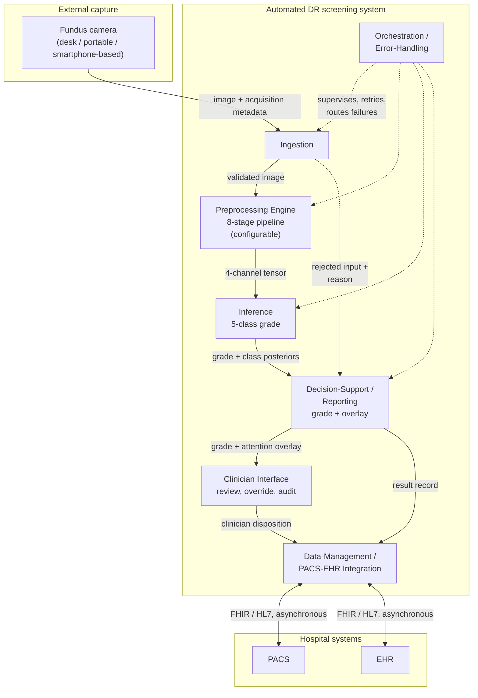
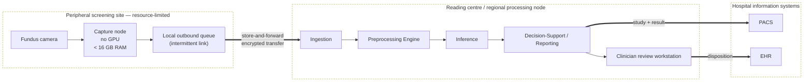
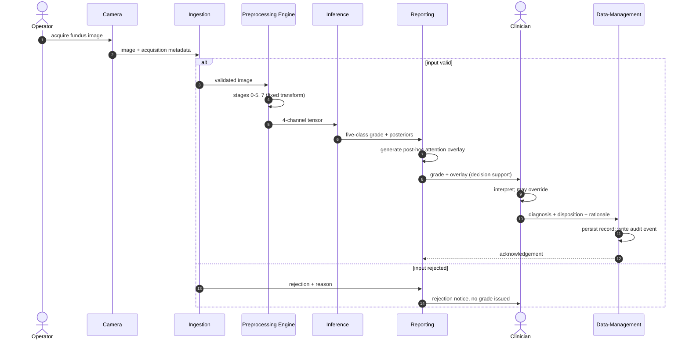
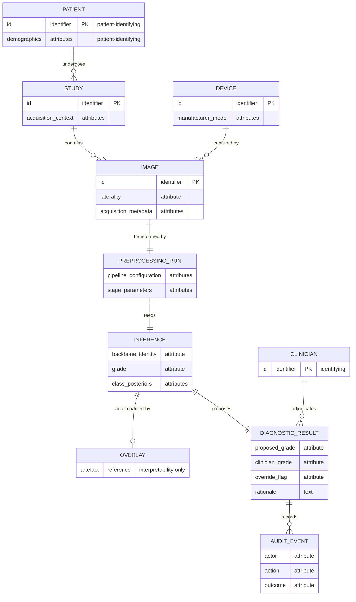

# Automated Diabetic Retinopathy Diagnosis — EN manuscript with GOST [N] citations

> **STAGE-G (final pass) — 2026-08-21.** Working author-year citations converted to numbered `[N]` (GOST 7.32-2001 §6.11, by first appearance). 102 external sources numbered [1]–[102]. Numbers are shared with the Kazakh manuscript (language invariance). Run over the complete 98-section manuscript, Introduction included.

# INTRODUCTION

**Relevance of the research.** Diabetic retinopathy is a microvascular complication of diabetes and
one of the leading causes of preventable vision loss among adults of working age. Its earliest
stages, in which microaneurysms and small haemorrhages appear without affecting acuity, are
asymptomatic, so a patient has no reason to seek care during precisely the interval in which
intervention is most effective.

Detection therefore cannot depend on presentation. It depends on scheduled imaging of a cohort
defined by a systemic diagnosis, most of whom will be found to have nothing requiring treatment.
Screening is, before it is a diagnostic problem, a problem of volume, and volume is what makes the
capacity constraint binding: manual grading scales linearly with specialist time, which is finite and
geographically concentrated.

That automation is technically feasible has been established for a decade, so the relevance of this
work cannot rest on a claim that automated screening remains undemonstrated. It rests on the
conditions under which the demonstrations were obtained. Reported performance has been shown to be
unevenly robust, and the images are not a stable substrate: photographs acquired by different
cameras, operators and dilation states vary systematically. Where screening capacity is scarcest,
acquisition conditions are least controlled.

This is where the methodological question arises, and it concerns how models of this kind are
specified rather than how well any one performs. Preprocessing may be treated as ancillary data
preparation not requiring methodological discussion, or as an integral component of the model,
because the transform applied before the first convolution determines the feature space the network
is obliged to operate in. If the second is right, a model reported without its preprocessing
specified has not been fully described, and comparisons between such models are comparisons between
partly unknown systems.

What makes the question answerable now is the evidence base. Public corpora exist with documented
camera provenance, independent grading protocols and, in one case, pixel-level lesion annotation.
Their joint availability permits the two treatments to be placed in controlled contrast under the
constraints that obtain where screening is scarce.

**Research aim and objectives.** The aim is to develop and experimentally validate an integrated
fundus image enhancement and convolutional classification framework for automated five-class
diabetic retinopathy diagnosis. In it an eight-stage preprocessing pipeline is specified as an
integral component of the model rather than as preparation of the data. The aim is then to establish,
under controlled contrast against an equivalent configuration trained without that pipeline, what
difference the specification makes to performance, transferability and interpretability under
constrained computational conditions.

Four objectives decompose that aim, each discharged in a named chapter.

1. To analyse the problem domain and formulate the research problem: the clinical grading of the
   disease, the screening requirements of resource-limited settings, the sources and measured impact
   of image-quality loss, its device-specific component, and the methodological practice of existing
   automated systems (Chapter 1).
2. To specify the integrated methodology: the eight-stage pipeline stage by stage with the
   theoretical foundations of each, the classification architectures and their adaptation, the
   pretraining and fine-tuning strategy, the explainability formalism and the evaluation and
   statistical protocol (Chapter 2).
3. To evaluate the framework experimentally: an in-domain factorial contrast, a stage decomposition
   with parameter sweeps, a direct measurement of source-to-target distance in feature space,
   cross-corpus and external clinical transfer, attention alignment against expert annotation,
   behaviour across camera groupings and in a data-scarce regime, together with the statistical
   validation and comparative placement of the results (Chapter 3).
4. To build and describe a screening system around the model, suited to settings without inference
   acceleration and with intermittent connectivity, and to state what of it exists and what remains
   specification (Chapter 4).

**Object and subject of research.** The object is the process of automated multi-stage diagnosis of
diabetic retinopathy from colour fundus photographs by means of convolutional networks. It is studied
in its entirety, from the image as it leaves the camera to the grade the model assigns, rather than in
the classification step alone. The subject is the set of methods by which preprocessing is integrated
with classification, together with the properties the resulting configuration exhibits: its
diagnostic performance, its transferability, the alignment of its attention with annotated pathology,
and its behaviour across camera domains.

**Theoretical and methodological framework.** The framework is controlled experimental comparison.
Configurations are contrasted with everything outside the manipulated factor held fixed, so that a
difference in outcome is interpretable as a difference between configurations rather than between the
conditions under which they were obtained.

Its instruments are drawn from image processing, learning and inference. Orientation is normalised by
a pre-trained, frozen landmark detector, and geometry is preserved by isotropic rescaling with the
padding made explicit to the network as a mask channel. Illumination is corrected at a scale
proportional to the per-image field diameter, local contrast is enhanced under a dual-constraint clip
limit, and intensities are standardised from statistics computed on valid fundus pixels.

Classification uses two convolutional backbones of differing family, and class imbalance is addressed
at the objective by a weighted focal loss. Evaluation follows a fixed hierarchy of measures under
patient-level stratified cross-validation, with paired testing, bootstrap intervals and fold-level
modelling.

The empirical material is a tiered corpus of eight public and clinical fundus datasets, acquired with
cameras of four manufacturers and graded under several independent protocols, of which one supplies
training and the remaining seven external, clinical and device-shift evaluation.

**Scientific novelty.** The principal contribution is conceptual: the reframing of preprocessing from
ancillary preparation to an integral component of the diagnostic model. Each item below is at once an
engineering result about a particular pipeline and evidence bearing on that stance.

Preprocessing is formalised as a binding part of the model specification and placed under controlled
experimental contrast. What is new is not the existence of a pipeline but the treatment of one as an
object of experiment rather than of description.

Five elements of its engineering realisation are specified in forms not previously combined.
Isotropic resize with centred padding; a field-of-view mask supplied as a fourth input channel;
illumination correction scaled to per-image geometry and applied inside the mask only. Channel
statistics computed from valid fundus pixels; and canonical orientation whose augmentation dispersion
derives from the uncertainty of the landmark localisation.

The clip limit of the contrast stage is the minimum of a histogram-relative and a tile-relative
constraint, applied stochastically at training time so the stage serves as both enhancement and
regularisation. Attention alignment is measured by the fraction of an annotated lesion that model
attention covers, on the reasoning that lesion coverage is the clinically meaningful direction.

The postulated mechanism is measured rather than inferred. Work asserting that preprocessing improves
cross-domain robustness ordinarily demonstrates it through its consequence, external accuracy, and
leaves the mechanism unmeasured; here source-to-target distance is computed at the penultimate layer
under both configurations across six external corpora. Two features carry the novelty. Normalisation uses
source statistics and is never recomputed on the target, so any convergence is a property of the
preprocessing rather than of a procedure fitted to it. And the measurement's falsifiability was
recorded before it was made, since a reversal was a live possibility and would have been a finding.

A final contribution is analytic. A family of measures in common use for expressing external
robustness normalises an arm's external performance against its own in-domain performance, and such
measures penalise a configuration for its in-domain strength. The analysis holds wherever those
measures are used.

**Provisions submitted for defence.** Each proposition is submitted at the strength the evidence
supports, against a condition fixed before the experiment that tested it. Every empirical provision
carries a qualification, and the qualification is not detachable: a provision stated without it is a
stronger proposition than the evidence supports and is not the one defended.

Preprocessing of fundus images is a formalisable and experimentally testable component of the
diagnostic model rather than ancillary preparation. This provision is methodological: no experiment
promotes or refutes it, the results are consistent with it under the conditions tested, and
consistency under tested conditions is not a universal demonstration.

The integrated configuration dominates the baseline on the training corpus, on both architectures,
under a conjunctive criterion in all three of its components, surviving correction for multiplicity
and showing no interaction with architecture. The provision concerns the configuration: the arms
differ in initialisation as well as preprocessing, so no part of the effect is attributed to
preprocessing alone. The ablation decomposes that composite under a single initialisation and recovers
the whole in-domain gain, but decomposition is not dissolution.

The contributions of the individual stages are separable, each exceeding the between-fold dispersion
of its level and monotone across every fold, with the two photometric stages leading. This is defended
at the resolution of groupings only, since adjacent ranks lie within noise and the mask channel was
not isolated. Both photometric parameters exhibit an interior optimum confirmed on held-out data, and
those optima are properties of this corpus rather than portable constants.

Distance from the training distribution falls on every one of six external corpora with every
interval excluding zero, achieved without the transform observing any target corpus. This is defended
in direction only: the size of the reduction does not predict the size of any performance gain, and
each arm is measured within its own representation space.

Competence transfers to corpora not seen in training, with the integrated configuration higher on
every one, and performance varies less across camera groupings under it. Neither threshold
discriminates between the arms, so the evidence lies in the comparison and in the reduction of spread.
On two external clinical corpora the integrated configuration exceeds the baseline by at least the
minimal clinically important difference, the margin on the second being four thousandths.

Model attention overlaps expert-annotated lesions more under the integrated configuration on all four
annotated lesion types, robustly across the attention threshold. This is defended as alignment and
not as localisation, on one annotated public corpus, with the qualitative half of that hypothesis not
evaluated.

**Theoretical and practical significance.** The theoretical significance lies in how the problem is
posed and measured. The reframing changes what counts as a complete description of a diagnostic model
of this class, and with it what counts as a fair comparison. Three formalisations make previously
informal choices explicit and testable: the clip limit as the minimum of two constraints, illumination
correction as a function of per-image geometry, and attention agreement as an asymmetric overlap. A
fourth renders a postulated mechanism measurable, and a fifth shows a family of robustness measures in
common use to be not neutral.

Four things the work makes practically available, each with the limit attaching to it. A fully
specified preprocessing regime, reproduced in the appendices, whose parameter values were fixed on
particular corpora and should be re-established rather than inherited. A screening system built
around the model, whose realised and unrealised parts are distinguished throughout.

A protocol for ingesting externally sourced images, validated only against the clinical source it was
built for. And an argument of applicability to the national screening context, as a fit between a
documented deployment situation and a computational envelope stated in advance, bounded by the
absence of field testing there.

**Reliability of the results.** Reliability rests on procedure rather than on magnitude. Partitioning
is patient-level and grade-stratified, so a model cannot be credited for recognising a patient it has
already seen. Performance is reported on a hierarchy of measures fixed in advance rather than
selected once outcomes were visible. Differences are assessed by paired testing on identical cases,
their uncertainty quantified by resampling, and where replication across folds exists a mixed-effects
model separates fold variation from the effect under test.

The strongest of these grounds cannot be confirmed from a table and is therefore stated: the
acceptance criterion for each hypothesis was fixed before the experiment that tested it. A criterion
written once a result is known can always be satisfied, and the ordering is what makes the outcome
informative.

Three qualifications bound that reliability. Correction for multiplicity is scoped to the single
experiment within which the comparisons were planned, so no error rate is controlled over the
evidence base as a whole. Several evaluations rest on the models of one fitted fold, so their
intervals understate total uncertainty in a known direction. And one experiment depends on a clinical
corpus that cannot be redistributed.

**Approbation of results and publications.** The components of this research were disseminated
progressively before being integrated here. The work was reported at the 3rd International Workshop
on Digital Society, held in Istanbul in October 2025. The main results are published in five
peer-reviewed works: one article in a journal indexed by Scopus and Web of Science [1], one paper in Scopus-indexed conference proceedings [2], and three articles in journals
recommended by the national committee for quality assurance in science and higher education
[3, 4, 5].

All five are co-authored and are treated throughout as prior own work. Publications reporting the
same experimental material are never cited as independent corroboration of one another, and the
performance figures stated inside them are not imported as findings: where the same questions arise
here they are re-examined on this work's own material.

**Connection with state programmes.** The direction of this research corresponds to the state
priorities of the Republic of Kazakhstan in the digitalisation of healthcare and the development of
artificial-intelligence technologies. It accords in particular with the Concept for the Development
of Artificial Intelligence for 2024–2029, with the Address of the President "Kazakhstan in the Era of
Artificial Intelligence" of 8 September 2025, and with the Law "On Artificial Intelligence" of
17 November 2025. The research is carried out in accordance with subparagraph 2 of paragraph 3 of
article 20 of the Law "On Science".

The nature of that connection should be stated precisely. It is a correspondence between the
direction of the research and published national priorities. It is not a statement that the work was
funded under a state programme or commissioned by any body, and not a claim that any policy objective
has been achieved through it.

**Structure and volume of the work.** The dissertation comprises front matter, an introduction, four
chapters, a conclusion, a list of references and five appendices.

Chapter 1 establishes the clinical and technical context of screening, characterises the sources of
image-quality loss and its device-specific component, reviews what the field has done with
convolutional networks, analyses the existing automated systems, and formulates the research problem.
Chapter 2 specifies the methodology: the eight-stage pipeline with the theory grounding each stage,
the clip limit formalised, the classification architectures and their adaptation, the pretraining and
fine-tuning strategy, the explainability formalism and the evaluation protocol. Chapter 3 reports the
experimental programme and its statistical validation, places the results against published systems,
and states the limitations. Chapter 4 describes the screening system built around the model,
distinguishing throughout what exists from what remains specification. The conclusion consolidates
the outcomes and the directions for further work.

Five appendices follow: the source code of the preprocessing pipeline, supplementary results and
confusion matrices, the system architecture diagrams, the attention-map gallery, and supplementary
tables for the device evaluation.

The dissertation is set out on 107 pages, excluding the appendices, and contains 19 tables and 16
figures. The list of references comprises 102 sources.


# 1 AUTOMATED DIABETIC RETINOPATHY SCREENING

## 1.1 Diabetic retinopathy and screening demand

Diabetic retinopathy is a chronic complication of diabetes mellitus and one of the principal causes
of preventable vision loss among working-age adults. Narrative reviews of its pathophysiology
[6, 7] report a pooled prevalence of any retinopathy near a
third of diabetic populations worldwide. Both figures are third-party clinical context, inherited
from the primary studies those reviews cite.

Its importance for an automated screening system lies not only in its frequency but in the fact that
its severity is defined by a discrete, ordered set of structural changes visible on the fundus.

The classical account of the underlying process is microvascular. Sustained hyperglycaemia drives
injury in the retinal capillary bed, with pericyte dropout identified by Kusuhara et al. [6] as a
consensus mechanism for breakdown of the inner blood-retina barrier. The consequences are increased
permeability, capillary non-perfusion and progressive ischaemia, culminating in pathological
neovascularisation.

These are the reviews' synthesis of the field rather than settled fact: their authors note that the
cellular mechanisms are not fully determined, since animal models reproduce only limited aspects of
early disease. The account is also incomplete. Wang and Lo [8] and Gettinger et al. [9]
characterise the disease as combining microvascular damage, inflammation and neurodegeneration, and
report that neurodegeneration may precede the vascular changes traditionally regarded as its
defining signs.

That distinction matters for an imaging-based classifier. Fundus photography renders the
microvascular manifestations, so a model graded against the standard clinical scale necessarily
learns the vascular signature of a process whose earliest pathology may be partly neural and not yet
visible.

On the image itself the disease declares through a roughly ordered progression. The earliest and
smallest are microaneurysms, followed by intraretinal haemorrhages as those vessels rupture; lipid
and protein exudation produces hard exudates and focal ischaemia produces cotton-wool spots.

As the microvasculature deteriorates further, microvascular abnormalities and venous beading appear,
and in the proliferative phase fragile new vessels supervene and risk vitreous haemorrhage. Overlaid
on that severity axis, and independent of it, is macular oedema, which Wang and Lo [8] record as
the principal indication for first-line anti-VEGF therapy.

For a classifier these lesions are the operative image features, and their salience is uneven. The
microaneurysms and small haemorrhages defining the earliest and most screening-critical grades are
small, low-contrast structures, whereas the neovascular and exudative changes of advanced disease
are comparatively conspicuous.

The clinical scale partitions this burden into severity classes. As summarised by Morya et al. [7], modern screening uses an ordinal scale of five levels, from no apparent retinopathy through
mild, moderate and severe non-proliferative disease to proliferative disease, and that taxonomy is
the classification target throughout this work.

Two properties of it carry directly into the design of an automated grader. The scale is ordinal, so
the clinical cost of a misclassification scales with the distance between predicted and true grade:
confusing adjacent grades is far less consequential than confusing no disease with proliferative
disease. The problem is an ordered one with structured error costs, not an arbitrary five-way
categorical one.

And the boundaries that matter most for early intervention rest on precisely the lesions identified
above as small and faint. Distinguishing no disease from mild, or mild from moderate, can hinge on a
handful of microaneurysms occupying a few pixels.

[FIG-1.1: Representative fundus images across the five grades, illustration only — defense/figures/figures_mine/fig1_1_dr_grades_idrid.png]

Early detection is clinically decisive because the disease is treatable in its earlier grades, as
reported by Kesharwani et al. [10] and Wang and Lo [8], and the therapeutic window exists only
if it is identified while still subtle. Because those grades are frequently asymptomatic, detection
depends not on patient-initiated presentation but on systematic, repeated screening of the whole
diabetic population.

That the required screening is not being delivered is visible in observed compliance, which Morya et
al. [7] put at between a third and a half of patients for recommended annual examination. The
shortfall is not primarily one of willingness but of access and capacity, and it is most acute where
specialist infrastructure is thinnest.

The constraint is structural rather than incidental. The candidate's prior work [3] characterises the national context this work addresses. Roughly 1,200 ophthalmologists
serve the entire population, about 40 per cent of residents live in rural areas, and an estimated 70
per cent of those have limited access to specialised eye care.

Its analytical significance is that manual grading scales linearly with specialist time. A fixed and
geographically concentrated supply of graders cannot meet a demand distributed across a large,
partly rural population, so increasing coverage by adding specialists is not a near-term option. The
binding question becomes whether the grading step can be partly automated.

Deployed automated systems, relayed by Morya et al. [7], and the national screening programme
reported by Yesmukhamedov et al. [3] demonstrate that this is a real capability, and that must be
acknowledged rather than dismissed. But each of those results was achieved under its own population,
device and regulatory conditions. None is a result of this work, and their portability to
resource-limited, device-heterogeneous settings is not entailed by their success elsewhere. That
portability is the open problem.

Two boundary conditions follow. The operative deployment context is a resource-limited environment,
defined here by at least two of: no acceleration available for inference, memory below sixteen
gigabytes, near-real-time throughput constraints, and connectivity insufficient for continuous cloud
reliance. And automation here means decision support rather than replacement, with the clinician
interpreting, auditing and retaining responsibility for the diagnosis.

Grading also determines referral, and referral determines therapy. The standard treatment for
proliferative disease is laser photocoagulation, in which focused energy induces protein coagulation
to arrest the proliferation of abnormal vessels. Effective therapy requires depositing enough energy
to coagulate the target while sparing surrounding tissue.

That balance depends on how energy is absorbed and how the resulting heat distributes through the
layered structure of the fundus. A Gaussian beam attenuates with depth by absorption along its path;
the absorbed energy raises local temperature in proportion to the tissue's heat capacity; and that
rise is the initial condition for conduction through layers of differing conductivity.

Simulation of that coupled model, reported in the candidate's prior work, is qualitative. Surface
tissue heats rapidly through high near-surface absorption while deeper layers heat slowly to a
comparatively stable temperature. No damage thresholds or error margins were reported.

The limits of the model determine how it may be used. It has not been validated against experimental
or clinical measurement, so it supports no clinical-grade claim.

Its assumptions bound its scope. Tissue properties are static during exposure, each layer is
homogeneous, the beam profile is fixed, and the conduction equation carries no perfusion term,
although convective heat removal by blood flow is significant in this vascular tissue. The evidence
base is a single publication co-authored by the candidate.

The model concerns the physics of treatment and is independent of the diagnostic system at this
work's centre. It is included because grading serves referral and referral serves therapy, and it
bears on how laser parameters shape the thermal field rather than on any diagnostic claim.

## 1.2 Fundus image quality and variability

The screening contexts just described, mobile units and portable cameras operated outside dedicated
clinics, are precisely the conditions under which fundus images are least likely to be acquired
ideally. Image quality here is not an aesthetic property but the measurable capacity of an image to
support automated detection of the features relevant to staging.

Degradation is correspondingly any acquisition-side phenomenon that erodes that capacity, and the
phenomena that do so are neither random nor diagnostically neutral. They fall on four axes, the same
factors Shen et al. [11] model explicitly to drive a dedicated fundus-enhancement network.

The first is optical. Defocus and motion blur both act as low-pass filters, attenuating precisely
the high-frequency content that distinguishes fine retinal structure from background. Because the
earliest lesions occupy only a few pixels, even mild blur can render them indistinguishable from the
surrounding capillary bed. This is not a uniform loss of fidelity but a selective erasure of the
most screening-critical signal.

The second is photometric. Fundus photography illuminates a curved, semi-reflective interior surface
through a small pupil, so illumination is rarely uniform: vignetting, central reflex and shading
gradients impose large low-frequency variations unrelated to pathology, compounded by exposure error
and low global contrast.

The diagnostic consequence is twofold. Uneven illumination can mask genuine lesions in shadowed
regions, and it can also mimic pathology, a bright shading artefact being locally indistinguishable
from a hard exudate and a dark gradient from a haemorrhage. It therefore threatens sensitivity and
specificity alike.

The third is geometric. Off-axis capture, misalignment, truncation of the circular field and
variation in magnification all change where structures appear and how large they are without
changing the anatomy. The natural landmarks that anchor lesion localisation may sit at inconsistent
positions, and a truncated field may exclude peripheral lesions altogether. This axis is the least
visible to a human reader, who compensates effortlessly, and the most disruptive to a model that has
not been normalised against it.

The fourth is patient- and media-related. Adequate imaging needs a sufficiently dilated pupil and
clear optical media, both frequently compromised in the population screening targets. Its
distinguishing feature is that its causes lie partly in the patient rather than the instrument, so
it cannot be eliminated by better camera engineering and will persist in any real screening
population.

These axes are not independent of the deployment context. Each is aggravated in portable,
non-specialist settings: handheld optics are smaller and less stable, non-specialist operators are
less able to optimise focus and illumination, and opportunistic undilated encounters maximise
media-related degradation. The settings in which automated screening is most needed are those in
which degradation is most severe, a coupling that sharpens the technical problem rather than
softening it.

A reasonable objection is that quality gating at capture already discards unusable images. Gating
exists and is valuable, but it reframes the problem rather than removing it: it discards images
rather than recovering their signal, which lowers effective coverage where re-acquisition is costly,
and sub-threshold degradation that passes the gate still erodes the small-lesion signal.

The measured evidence supports a more precise position than the taxonomy alone. Holding architecture
fixed and varying only quality, Fu et al. [12] re-annotated nearly twenty-nine thousand images
into three quality levels and found detection accuracy falling monotonically as quality declined.
Zago et al. [13] report the same link holding across databases, and the production system of Dai
et al. [14] places an explicit quality stage ahead of grading. That is the cleanest available
statement of the relationship, but its scope is bounded: one source corpus, an internal split, no
external validation and no intervals.

A second line treats quality as the parsimonious explanation for differences between corpora.
Rakhlin [15] reported a substantially higher area under the curve on one external corpus than on
another and attributed the gap to gradability rather than to superior generalisation, roughly all of
the first corpus being gradable against about three-quarters of the second.

The strongest evidence that data conditions can rival architecture comes from holding the
architecture identical across sources. Voets et al. [16] reproduced the pipeline of Gulshan et al. [17] on public data. They obtained an area under the curve of 0.951 on one test corpus and 0.853
on another, the same network and the same procedure, with a gap traceable to provenance and
labelling rather than model design.

Voets et al. [16] supply the first of two nuances preventing an over-strong reading. Excluding the
roughly one image in five they judged ungradable did not significantly change performance. If
quality were a simple monotone lever, removing the worst images should have helped, and that it did
not indicates the relationship operates at the level of fine signal preservation rather than coarse
inclusion.

Beede et al. [18] reinforce the cost of gating from the deployment side, finding across eleven
clinics that automatic rejection of field-captured images reduced coverage and disrupted workflow.
That is a socio-technical observation rather than an accuracy measurement.

The second nuance concerns task dependence. In the benchmark reported by Liu et al. [19],
automated quality assessment itself reached agreement its authors characterised as insufficient for
clinically feasible screening, while the team that won the grading sub-challenge did so with minimal
preprocessing, relying on training strategy instead. Preprocessing is necessary but not sufficient,
and its marginal payoff depends on what the rest of the pipeline already does.

The candidate's prior work adds a further point, reported as previously published: enhancement
preprocessing raised validation accuracy from 71 to 86 per cent on a small custom network [1]. It rests on one small architecture and is not generalisable to the
wider class without explicit comparison.

Read together, the evidence converges on a position rather than a slogan. Quality and provenance are
measured, first-order determinants of performance, occasionally rivalling architecture, yet
performance is not reliably recovered by discarding poor images. That is what motivates conditioning
images in, by normalising geometry, illumination and contrast as part of the model, rather than
gating them out. It licenses no universal claim that preprocessing improves performance on every
corpus.

One source of this variation is not random at all. Cameras differ along reproducible axes. Colour
rendition varies because illumination spectra and sensor processing are not standardised;
illumination geometry sets the vignetting pattern of a given optical design; and field angle, sensor
resolution and optics together set the finest detail recoverable.

None of these is a transient capture error. Each is a stable property of the camera model, so two
cameras imaging the same retina yield images differing in consistent, predictable ways, and the
appearance statistics a model learns are partly entangled with the device that produced its training
images.

That is the situation the literature studies as domain shift. Zhou et al. [20], surveying the
field, note that most statistical learning rests on an over-simplified assumption that source and
target data are identically distributed, and that a learner trained only on source data typically
suffers significant drops on an out-of-distribution target. Wang and Deng [21] organise the
mitigations into discrepancy-based, adversarial and reconstruction-based families. A camera defines
a domain, and a model trained on one camera's distribution is exactly that learner with respect to
another.

[FIG-1.2: The corpora and the camera hardware they span — defense/presentation/assets/datasets/27_overview/cross_dataset_comparison.png]

Framing device variability this way points to two responses. Normalising geometry, illumination and
contrast narrows the appearance differences separating one camera's images from another's, which is
part of the rationale for the pipeline. An objection is that such normalisation might already erase
device signatures and render the problem moot.

The objection is only partly correct. Standardisation can narrow colour and illumination differences
but cannot provably erase shift living in resolution, optics and field angle, and whether the
residual still degrades classification is an empirical question rather than one settled by
assertion. That is why the second response is an explicit controlled evaluation across camera
groups, which this section motivates without pre-judging.

What such an evaluation establishes is bounded. Maintained or lost performance across camera groups
is an empirical observation of cross-device behaviour, and neither a certification of
device-agnostic readiness nor regulatory compliance for use with any instrument.

## 1.3 Convolutional networks for retinal images

The learning machinery of automated retinal grading is the convolutional network, and the field's
use of it has followed a recognisable arc. Early systems adapted general-purpose architectures
developed for natural-image benchmarks [22, 23, 24, 25], and the landmark demonstrations of expert-comparable grading [17] were built on such backbones rather than on retina-specific designs. Litjens et al. [26]
survey the same movement across medical imaging more broadly.

Two connectivity innovations made the depth those architectures rely on trainable. He et al. [27]
reformulate each block to learn a residual function relative to its input through identity
shortcuts, and Huang et al. [28] concatenate the outputs of all preceding layers, each addressing
the degradation that otherwise sets in as depth increases. Tan and Le [29] then scale depth, width
and resolution jointly. These are not ranked against one another here; each established the
vocabulary from which retinal work draws, and two of them supply this work's backbones.

Applied to retinopathy, the family performs strongly but heterogeneously, across tasks, corpora and
validation protocols that do not align [30, 31, 32, 33, 34]. The heterogeneity is the analytically important
fact: these figures establish that the architecture class is capable, not that any configuration is
best. The same backbones transfer to adjacent tasks and modalities without those results being
fundus grading [35, 36, 37].

More recent work has added transformer and hybrid designs to that landscape [38, 39, 40, 41, 42, 43]. They are noted to situate the choice made in this work rather than to compare against,
since no head-to-head evaluation of architecture families is undertaken here.

A second strand concerns how such a network is initialised. Labelled retinal data are scarce
relative to the size of modern architectures, so almost all systems begin from weights learned
elsewhere, overwhelmingly on natural images. That practice is effective enough to be near-universal
[44, 45], and Cheplygina et al. [46] give its basis: early
convolutional features are largely generic and transfer across visual domains, while later features
become progressively task-specific.

The strand that matters for this work asks whether in-domain initialisation does better. Zhou et al. [47] report that self-supervised pretraining on retinal images yields generalisable retinal
representations, and Azizi et al. [48] that in-domain medical pretraining can exceed natural-image
transfer on other modalities.

Those results establish the credibility of the direction without settling the specific question. The
retinal evidence was obtained with a transformer backbone and the cross-modality evidence outside
fundus photography, so neither evaluates a convolutional backbone pretrained in domain, which is
what the present design requires and what chapter 2 specifies.

A related question is how much of a pretrained network to adapt. The practical choice lies between
freezing the feature extractor and training only a new head, and progressively unfreezing the upper
layers, and Saxena et al. [49] report the second to be generally the stronger where data permit.
That is a training-method finding rather than a hypothesis this work tests.

The third strand is explainability, and it entered retinal work for a practical reason. A screening
tool whose output cannot be inspected is difficult to place in a workflow where a clinician retains
responsibility for the decision, so methods that indicate where in an image a network's evidence
lies have been widely adopted.

The dominant family projects class evidence back onto the final convolutional activations [50]. The gradient-based form of Selvaraju et al. [51] applies to essentially any
convolutional architecture without retraining, which is why it became the default, and the
refinement of Chattopadhyay et al. [52] alters how the gradients are weighted. Model-agnostic
alternatives exist [53, 54].

The field's use of these maps has been uneven in one respect that matters, and the reviews of Samek
et al. [55] and Tjoa and Guan [56] note it. Overlap between an attention map and an expert
annotation is regularly presented as though it demonstrated that a model had located pathology,
whereas the map indicates where class-discriminative activation concentrates and nothing stronger.
This work holds to the weaker reading throughout, and chapter 2 fixes it as a property of the
instrument.

Beyond visualisation, the field has also pursued explicit lesion segmentation, and one result from
that line bears directly on the argument here. Wan et al. [57] designed a network with a single
pooling stage specifically to preserve small-lesion features, supplemented with attention and
dilated convolutions, and still segmented microaneurysms weakly, a result they report themselves.

The lesson is not about that architecture. It is that increasing architectural sophistication does
not by itself resolve the detection of small, low-contrast lesions, which is the burden this work
asks preprocessing to share.

What this survey establishes is that the learning machinery is mature and well characterised, that
its initialisation and its interpretation both have open questions, and that none of these strands
has been the limiting factor in the way the next section describes.

## 1.4 Existing automated screening systems

This section examines how the components just surveyed have been assembled into working systems, and
what a critical reading of that record reveals. The purpose is not to rank those systems or to
position this work as their competitor, but to locate beneath an impressive performance record a
consistent methodological pattern.

That the field has produced high-performing systems is not in dispute. Gulshan et al. [17]
demonstrated that a deep network could detect referable disease at expert-comparable levels,
reporting areas under the curve above 0.99 on two clinical validation sets, and the system of
Abramoff et al. [58] reached regulatory clearance on a prospective multi-site trial.

The literature has also matured well beyond single-site internal validation, with the multiethnic
external cohorts of Ting et al. [59], cross-population validation in sub-Saharan Africa [60], multicentre validation across tens of thousands of images [61], and
prospective evaluation inside a national screening programme [62]. Ting et
al. [63] and Senapati et al. [64] review the field as a whole, and Wewetzer et al. [65] pool
ten primary-care studies. Table 1.1 sets out that landscape with the properties that determine what
each figure means.

**Table 1.1 – Reported automated screening systems, with the conditions that bound each figure.**

| Study or system | Task | Corpus and population | Reported metric | Validation | Limitation |
|---|---|---|---|---|---|
| Gulshan et al. [17] | Binary referable | Private development; two retrospective validation sets | ROC-AUC 0.991 and 0.990 | Dual external | Preprocessing deferred to the supplement |
| Abràmoff et al. [58] | Binary, autonomous | 900 patients, ten primary-care sites | Sensitivity 87.2%, specificity 90.7% | Prospective pivotal | No preprocessing ablation, no public benchmark |
| Ting et al. [59] | Referable | Private, plus ten multiethnic sets | ROC-AUC 0.936; external 0.889–0.983 | Multiethnic external | Private development data |
| Bellemo et al. [60] | Referable | 4,504 images, Zambia | ROC-AUC 0.973 | Cross-population | Single-country cohort |
| Zhang et al. [61] | Referable | 83,465 images, four centres | AUROC 0.9848 per patient | Multicentre | One country; preprocessing not reported |
| Ruamviboonsuk et al. [62] | Vision-threatening | 7,651 patients, nine sites | Accuracy 94.7%, sensitivity 91.4% | Prospective, national programme | Architecture and preprocessing opaque |
| Sánchez-Gutiérrez et al. [66] | Referable | Private, Spain | ROC-AUC 0.988 | Clinical validation | Private data |
| Baget-Bernaldiz et al. [67] | Four-class | Private, plus one public set | ROC-AUC 0.988 and 0.968 | External | Single-population development |
| Saxena et al. [49] | Binary | Public development, two public test sets | ROC-AUC 0.958 and 0.92 | Cross-corpus | Binary task; preprocessing exogenous |
| Wewetzer et al. [65] | Referable, pooled | Ten primary-care studies | Summary ROC-AUC 0.9543 | Meta-analysis | Pools heterogeneous studies |

The first conclusion is that these numbers cannot be lined up as a ranking. The endpoints differ,
from binary referable disease through four-class grading to vision-threatening disease, and so do
the corpora, populations, camera hardware and reference standards.

A higher figure on a private single-country cohort says little about performance on a different
distribution, and comparing such figures across studies would violate the metric discipline this
work maintains throughout. That non-comparability is itself part of the gap: the field lacks a
controlled, common-protocol basis on which the contribution of any individual design choice can be
read off.

The second conclusion concerns what these reports contain. Several defer their preprocessing to
supplementary material or omit it entirely, and none of the deployment reports isolates the
contribution of a preprocessing component. This is a statement about observable reporting practice
and attributes no theoretical position about preprocessing to any author.

Its consequence is practical rather than critical. Because their preprocessing is unspecified, their
results cannot be decomposed, so the comparison could not be made controlled even if the endpoints
and corpora were aligned.

The deployment landscape compounds these limitations differently. A comparison of nine existing
ophthalmic systems in the candidate's prior work [3] found the deployed
tools typically narrow or constrained: limited to one disease, requiring advanced imaging equipment,
or dependent on continuous connectivity. Commercial systems are predominantly binary and opaque, and
some high-performing models, such as that of Ryu et al. [68], operate on other modalities entirely
and are outside this work's scope.

Transparent, five-class, device-robust systems whose preprocessing is fully specified and evaluated
are scarce.

Taken together these conclusions locate the gap, and it is methodological rather than a performance
deficit. The existing systems are in many cases highly accurate and in some cases prospectively
validated. This work makes no claim to outperform them and undertakes no head-to-head comparison
against any of them.

What the literature has not systematically done is formalise preprocessing as an integral model
component, report it in full, and evaluate its contribution under controlled, multi-corpus,
transparent conditions that also probe cross-corpus transfer and device shift. That this is the gap,
and not a need for another high single-corpus figure, is what gives this work its shape.

## 1.5 Problem statement and research direction

The preceding sections converge on a problem that can now be stated precisely. Screening must
operate at population scale, on images whose quality and device of origin vary systematically, and
against a target, the small faint lesions of early disease, that is most vulnerable to exactly those
variations.

The field meanwhile has produced accurate and in some cases prospectively validated systems while
treating preprocessing as ancillary data preparation: under-reported in the main text of landmark
studies [16, 17], omitted from several deployment reports, and
rarely isolated or formalised as a component of the model. The review of Senapati et al. [64]
surveys the same record without reporting such an isolation.

The gap is therefore not a deficit of accuracy but a deficit of method: the contribution of
preprocessing has not been formalised and evaluated as an integral part of the model under
controlled, transparent, multi-corpus conditions.

The research problem follows directly. It is how image preprocessing can be formalised as an
integral component of a convolutional grading model rather than treated as separable and optional
preparation. And it is how that contribution can be evaluated under controlled conditions
representative of the resource-limited environments in which screening must be delivered.

The problem is at once conceptual and empirical: it requires reframing preprocessing as an integral
model component, and a study design in which that reframing can be tested rather than assumed.

The response, stated here as objective rather than as result, is to develop and experimentally
validate an integrated enhancement and classification framework for multi-stage grading. Its
preprocessing is an ordered eight-stage pipeline applied together with a classifier and treated, for
evaluation, as a single model. That integration is the conceptual contribution: the pipeline is not
a preface to the model but part of it, defining the feature space the classifier operates on.

Because the framework is the object of study, the problem decomposes into bounded hypotheses, each
testing one facet under matched conditions. The first concerns whether the full pipeline paired with
in-domain pretraining outperforms a baseline of minimal preprocessing with conventional
initialisation on the primary corpus.

It is essential to the honesty of the design to record that its two arms differ along two axes at
once, so any observed effect is the joint contribution of the integrated configuration and may not
be attributed to preprocessing in isolation.

The remaining hypotheses probe distinct properties: component ablation and parameter sensitivity;
reduction of distributional distance between the training corpus and target corpora; cross-corpus
transferability; alignment between model attention and annotated lesions; robustness across imaging
devices; and performance on external clinical corpora. Each is bounded to its corpora, architectures
and tested ranges, and each is held to explicit evidence criteria rather than to an informal sense
of improvement.

Two boundaries define what this formulation does and does not commit the work to. The aim is
formalisation and controlled evaluation, not competition: no named system is a target and no
head-to-head comparison is undertaken. The contribution is the controlled, transparent test of
preprocessing as an integral component, and it stands whatever the direction of the result, since
the hypotheses are falsifiable and a null or contrary finding is to be reported as such rather than
silently revised.

The scope is bounded throughout to five-class grading on fundus photography, to the specified family
of corpora, and to resource-limited computational conditions. No generalisation beyond that is
claimed, and the system work that situates the framework in a deployment context is a design
contribution supported by a working demonstrator rather than a clinically validated system.

## Conclusions on section 1

This chapter established the problem the work addresses and located the contribution within it.

Diabetic retinopathy is graded on an ordinal five-class scale whose earliest and most treatable
boundaries rest on lesions occupying a few pixels, and the clinical cost of a misgrading scales with
the distance between the assigned and true grade. Grading serves referral, and referral serves
therapy, which is where the physics of laser coagulation enters as bounded theoretical context.

Screening must therefore be systematic and repeated, against a specialist supply that cannot scale
to meet it. Automation is a workload-reduction mechanism operating under a clinician who retains
responsibility for the decision, not a replacement for one.

Image quality is not an aesthetic property but the capacity of an image to support automated
detection, and degradation is target-correlated: across four axes it preferentially attacks the
small faint features that define the earliest grades. One component of that variation is not random
at all but a stable property of the camera, which makes it an instance of domain shift.

Quality and provenance are first-order determinants of performance, occasionally rivalling
architecture, yet performance is not recovered by discarding poor images, and the benefit of
preprocessing depends on what the rest of the pipeline already does.

The learning machinery is mature and well characterised, with open questions at its initialisation
and its interpretation but no limiting deficit. The existing systems are in many cases accurate and
some are prospectively validated, and their figures cannot be ranked against one another because
their endpoints, corpora and reference standards differ.

What the field has not done is formalise preprocessing as an integral model component, report it in
full, and evaluate its contribution under controlled conditions. That gap is methodological rather
than a performance deficit, and it is the gap the following chapters address.


# 2 METHODOLOGY OF THE INTEGRATED PIPELINE

## 2.1 Preprocessing pipeline formalisation

The organising commitment of this chapter is that the diagnostic model is a two-stage system in
which preprocessing is an integral component rather than ancillary data preparation. It defines the
feature space available to the convolutional network and therefore co-determines what the network
can learn.

That commitment is most clearly seen against the practice it departs from. In the end-to-end
approach, preprocessing is treated as data preparation: published methods defer its details to
supplementary material and locate the methodological emphasis in architecture, data scale and
training protocol [17, 64]. This describes observable practice
and attributes no theoretical position to any author.

The present work makes the opposite choice. It specifies the pipeline with the rigour later applied
to the network, places it under controlled experimental contrast, and decomposes it into ablatable
stages. Whether each stage earns its place is an empirical question reserved for those experiments;
the task here is to define the construct precisely enough that the question can be asked.

The pipeline is a deterministic, order-dependent transformation. Each stage consumes the output of
the one before it, and the sequence cannot be reordered without changing the result. All stages
except augmentation are applied at both training and inference time, so the production
transformation is deterministic. The sequence is shown in
[FIG-2.1: The eight-stage preprocessing pipeline — defense/presentation/assets/preprocessing/10_input/04_preprocessing_pipeline_vertical.png].

**Table 2.1 – The eight stages, in execution order.**

| Stage | Operation | Governing parameter | Applied |
|---|---|---|---|
| 0 | Canonical flip of left eyes to the right-eye orientation | Laterality from metadata or heuristic | Always |
| 1 | Rotation normalisation on the disc-to-fovea axis | Landmark confidence; fallback dispersion 13.0° | Always |
| 2 | Field-of-view crop and isotropic resize to 512 by 512 | Foreground detection; centred zero padding | Always |
| 3 | Field-of-view mask as a fourth channel | Binary, from the Stage 2 foreground | Always |
| 4 | Flat-field correction of illumination | Blur width 0.07 of the field diameter | Always |
| 5 | Dual-constraint contrast-limited equalisation | Clip factor and global threshold; 8 by 8 tiles | Always |
| 6 | Augmentation | Three families, described below | Training only |
| 7 | Dataset-specific normalisation to tensor | Channel statistics computed in-mask | Always, last |

Four of the stages carry design decisions that need their reasons stated.

The canonical flip removes a known geometric symmetry. Fundus images of the two eyes are approximate
mirror images, with the optic disc temporal to the macula in each, and normalising that away spends
the network's capacity on disease-relevant variation instead. It also gives the rotation stage a
consistent starting orientation.

Rotation normalisation detects two anatomical landmarks with a heatmap-regression network, a U-Net
encoder with a differentiable spatial-to-numerical head, and rotates the image so that the
disc-to-fovea axis is horizontal. The detector is pre-trained and frozen rather than co-trained with
the classifier, so the stage remains a fixed transform and the reading of the model as a composition
of preprocessing and classifier is preserved.

Its reliability was measured rather than assumed, on a held-out split of 103 images none of which
entered the detector's training. Optic-disc localisation had a median displacement of 0.066 disc
radii and fell within one radius in every image. Fovea localisation, the harder landmark, had a
median of 0.105 radii and fell within one radius in 99.0 per cent of images.

The confidence signal is informative rather than nominal. The detector declined to assert confidence
on 9.7 per cent of images, and those images carry a fovea displacement roughly four times the median
of the rest, so the flag separates the harder cases instead of labelling all of them alike. That is
the empirical justification for the stage's design: because the signal discriminates, the stage can
degrade gracefully on exactly the images where it should, skipping the rotation and widening the
augmentation dispersion instead of asserting a possibly misaligned alignment. These measurements are
bounded to one corpus and one camera.

Isotropy is the operative property of the crop and resize. Scaling both axes by the same factor
preserves the circular geometry of the fundus and the true aspect ratio of lesions, so a
microaneurysm is not stretched into an ellipse. The padding this introduces is then made explicit by
the mask channel, which lets the illumination correction and the final normalisation operate on
genuine retinal pixels only, and gives the network an unambiguous signal of where valid data ends.

[FIG-2.3: The field-of-view mask supplied as a fourth channel — defense/presentation/assets/preprocessing/14_fov_mask/stage3_fov_mask.png]

Flat-field correction subtracts a heavily blurred estimate of the local background and re-centres
the range, correcting the slowly varying illumination gradients that compete with the low-contrast
microvascular signal. Its defining choice is that the blur width is tied to the per-image field
diameter rather than fixed in pixels, which keeps the spatial scale of the estimate constant
relative to the retina across images cropped from different source resolutions.

[FIG-2.4: Flat-field correction of the illumination gradient — defense/presentation/assets/preprocessing/15_flatfield/stage4_flatfield.png]

Contrast enhancement operates on the luminance channel of a perceptual colour space, so contrast
rises without hue shifting, and is applied stochastically during training and deterministically at
inference. Its dual-constraint clip rule is developed in the next section.

Normalisation is dataset-specific rather than inherited. The channel statistics were computed on the
training corpus after the earlier stages, using only pixels inside the mask so that padding does not
bias them. Over roughly 1.25 billion in-mask pixels the channel means were near 0.505, with standard
deviations of approximately 0.090, 0.074 and 0.058. The pronounced asymmetry, the red channel
varying about 1.6 times as much as the blue, is exactly the structure a generic normalisation would
mismatch, and is the reason for computing statistics on the target distribution.

Augmentation composes three families of perturbation, applied in order before the final
normalisation. It is confined to the training path for reasons of hygiene: it fabricates plausible
variants, and admitting fabricated variants into an evaluation partition would inflate apparent
performance.

The geometric family is a unified affine transform combining rotation, zoom between 0.9 and 1.1, and
optional shear and stretch. Its rotation dispersion is adaptive per image, derived from the
localisation uncertainty of the rotation stage, so that an image whose orientation was normalised
confidently is rotated within a tighter band. The augmentation does not assert a precision of
alignment the detector did not achieve.

[FIG-2.2: Rotation normalisation on the disc-to-fovea axis — defense/presentation/assets/preprocessing/12_od_fovea_rotation/stage1_od_fovea_rotation.png]

The photometric family perturbs brightness, contrast, saturation and hue, each within a deliberately
narrow band and each applied independently, so a given image receives an arbitrary subset rather
than all four. The bands are narrow by design, because fundus colour and contrast carry diagnostic
signal and the perturbation must stay within plausible acquisition variation.

The third family degrades rather than reshapes [69], adding low-probability sensor
noise and lossy recompression, the two ways real fundus images are most commonly degraded between
capture and storage. Both probabilities are kept low: the objective is that the network see
occasional degraded examples, not that it train predominantly on corrupted data.

Augmentation serves two purposes at once. It enlarges the effective training distribution against
overfitting, and it is one of two levers against the severe class skew of the training corpus,
acting on the input distribution while the weighted objective acts on the loss surface. Neither
lever is claimed to resolve the imbalance.

Two operating states of the pipeline are defined for the experiments. In the full state all eight
stages are applied and the output is a four-channel tensor. In the baseline state none is applied:
the image is stretch-resized and normalised with generic statistics, giving three channels and no
mask. That contrast is the construct the factorial manipulates, and it is an internal construct, not
any published system.

[FIG-2.5: The model as a composition of preprocessing and classifier — defense/figures/figures_mine/fig4_flowchart.png]

That the full configuration is the one specified here does not entail that it is universally
optimal. The marginal value of each stage, and the possibility that some stage is redundant for a
given architecture, is exactly what the ablation is designed to test.

The eight stages assume a well-formed input: a single-eye colour photograph with a recoverable field
of view, a known laterality and a valid grade. Public research corpora largely satisfy that by
construction; clinical exports do not. An ingestion protocol conditions such images for entry, and
specifying it is itself a methodological act, because if preprocessing is part of the model then the
rule deciding which images enter preprocessing is part of the model's boundary.

It has four components, each defined by the precondition it protects. Format normalisation converts
heterogeneous containers, bit depths and colour encodings to the expected raster, rejecting what
cannot be decoded. Quality gating withholds images in which no coherent field of view can be
recovered, rather than passing them silently into stages that would then operate on meaningless
content.

Laterality reconciliation supplies the signal the flip requires, from export metadata where present
and a heuristic otherwise, recording a low-confidence determination as such rather than asserting
it. Patient identifiers are reconciled at the same point, since identity must survive inconsistent
filenames if the partition is to prevent leakage, and grades outside the taxonomy are flagged for
adjudication rather than coerced into a class.

The protocol's validity is bounded. It was designed against, and is validated only for, the 60
clinical images used here; extension to other clinical sources with different export conventions
would require independent validation. It performs no regulatory-grade de-identification and makes no
compliance claim. It is a defined input contract for the model, not a general-purpose clinical-image
cleaner.

One low-level operation is deliberately absent. Contrast enhancement and noise reduction stand in
tension: amplifying local contrast amplifies noise, while suppressing noise blurs the small faint
structures that decide the early grades.

The edge-preserving filtering literature resolves the tension in principle by making smoothing
content-adaptive. Bilateral filtering [70] weights the average by photometric
similarity as well as spatial proximity, so pixels across an intensity boundary do not bleed into
one another; non-local means [71] generalises similarity from the neighbourhood to
patch self-similarity across the image. Both are presented through derivation and qualitative
examples without medical-imaging evaluation, so they are cited for the principle and not for any
downstream gain.

The pipeline adopts neither as an explicit stage, because a dedicated denoiser carries the very risk
it exists to mitigate, and that risk is least acceptable where screening value is highest. Noise is
managed instead by the clip rule, which caps the attainable mapping slope where noise would be
magnified, and by the upstream illumination correction. That is a rationale, not a claim of
superiority over a denoising-augmented pipeline.

The pipeline develops a lineage in the candidate's earlier published work [1], where conventional preprocessing raised validation accuracy
substantially with a small convolutional network and an upgraded equalisation variant was studied on
a different retinal database, into a formalised eight-stage, four-channel construct. Figures from
that earlier work are not transferable to the present context and are not carried over.

The wider literature motivates the standardisation objective without establishing it. Cross-corpus
studies report performance varying between fundus sources processed as an exogenous step [49], benchmark studies report that image quality bears on grading reliability [12, 19], and enhancement studies report contrast operations helping or, for one
architecture, harming classification [72, 73].

The objective the pipeline serves, reducing variability across devices and acquisition conditions
while preserving diagnostically relevant features, is therefore stated here as a design objective
and not a demonstrated result. Its evaluation belongs to the experiments.

## 2.2 Formalisation of the clip limit

The contrast stage rests on a lineage of three operations, and each step of it exists to repair a
specific failure of the one before. Setting the lineage out is what makes the final form's single
governing parameter visible.

Histogram equalisation [74] redistributes intensities so the resulting histogram is
approximately uniform, mapping each intensity through the cumulative distribution of the image.
Densely populated intensities are spread apart, expanding the range in which most of the information
lies.

Its limitation for fundus imagery follows from its globality. One mapping is derived from a single
image-wide histogram, which for a circular fundus photograph is dominated by the large near-uniform
dark region outside the field of view. The mapping that best equalises that histogram is not the one
that best resolves a cluster of microaneurysms occupying a few pixels in one quadrant.

Adaptive equalisation repairs the locality deficit by computing a separate mapping for each tile of
a partition, so the transformation at a location reflects that location's statistics. It recovers
exactly the local contrast the global method discards, at a characteristic cost.

In a nearly homogeneous tile the local histogram is concentrated in a narrow band, and equalising it
produces a mapping with a very steep slope over that band. A steep mapping amplifies small
differences indiscriminately, so whatever sensor and quantisation noise is present in an otherwise
featureless region is amplified along with any signal.

The resolution is the equivalence established by Zuiderveld [75]: limiting the slope of the
mapping is equivalent to clipping the height of the histogram. Truncating the local histogram at a
maximum count before the cumulative mapping is formed, and redistributing the excess, bounds the
attainable slope and with it the noise amplification.

The clip limit is therefore the governing control of the method, setting the trade-off between
contrast gain and noise suppression. Pizer et al. [74] also observed that appropriate clipping
levels vary across imaging modalities and acquisition conditions, which is the first appearance of a
caveat that recurs throughout this work: clip values are optimised for particular image
distributions and are not asserted to be portable.

What that lineage leaves open is the rule by which the clip limit is set. Three formulations are
relevant, and the third is the one the pipeline adopts.

In the conventional formulation the limit is set relative to the height a tile's histogram would
have if its intensities were uniform. For a tile of area A over L levels the uniform count is A over
L, and the limit truncates each bin at a multiple of it, the multiplier being the clip factor. A
clip factor of one clips to the uniform height, and larger values permit proportionally more
amplification before clipping engages.

That form makes the clip factor's role explicit: it scales the permitted bin height against the
uniform per-bin count, which is an accurate proxy for the average occupied-bin height only when a
tile's intensities are spread across most of the levels.

The candidate's prior work [1] replaced the derived clip with a single
controllable global threshold, setting the limit directly as a scalar. That form was reported to
improve the distinctiveness of fine vessels and was integrated with a fine-tuned residual network on
a small retinal database.

Three constraints govern how that result enters here. It is prior own work, cited as a published
precursor and not as independent evidence, and the two literature records drawn from it describe one
article, so they are a single self-cited thread rather than two confirmations. The sensitivity
definition printed in that source departs from the standard one, so its sensitivity values are not
carried forward as comparable quantities. And its headline figures were obtained on a different task
and a small augmented corpus, so they are not transferable to the present context.

The single-threshold form is simpler but carries a structural weakness that motivates the design.
Being one scalar applied identically to every tile, it cannot respond to the wide variation in local
statistics across a fundus image. The conventional factor does respond to the tile, but through the
uniform proxy, which is unreliable in precisely the regions a fundus image contains in abundance.

In a large near-uniform background tile the occupied bins stand far above the uniform count. A limit
set as a multiple of that count therefore truncates aggressively where amplification is least wanted
or, at larger clip factors, permits a steep mapping over the few occupied levels and amplifies
background noise. The two forms fail in complementary ways: one misjudges peaked local histograms,
the other ignores the local distribution entirely.

The pipeline constrains the limit with both terms at once and takes the tighter. The first term is
the conventional histogram-relative clip; the second is a tile-relative absolute ceiling, a fixed
fraction of the tile's whole pixel count, independent of how intensities are distributed within it.

Taking the minimum makes the constraints act as a conjunction. In a well-spread tile the
histogram-relative term is smaller and binds, delivering ordinary contrast limiting. In a strongly
peaked tile, where that term would scale up with a degenerate distribution, the absolute ceiling is
smaller and binds, capping the attainable slope however concentrated the local histogram is.

The rule therefore bounds noise amplification under both regimes the single-parameter forms handle
poorly, which is the analytical rationale for adopting it. Whether that rationale yields a
measurable downstream advantage is a separate, empirical question, addressed by the parameter sweep
and not asserted here.

[FIG-2.6: Global equalisation, adaptive equalisation and the contrast-limited form — defense/figures/figures_mine/fig2_1_clahe_lineage.png]

**Table 2.2 – Three clip-limit formulations, compared on what governs each and what it cannot handle.**

| Formulation | Clip limit | Parameters | Origin | Limitation |
|---|---|---|---|---|
| Conventional | A multiple of the uniform per-bin count | Clip factor | Standard contrast-limited equalisation | The uniform proxy misjudges peaked local histograms |
| Single threshold | A scalar set directly | Global threshold | Prior own work on a different corpus | Applied identically to every tile; corpus-optimised |
| Dual constraint | The tighter of a histogram-relative and a tile-relative cap | Clip factor and global threshold | This work | Parameters validated here, not assumed portable |

The remainder of the stage follows the specification. The rule is applied to the luminance channel
of a perceptual colour space over an eight-by-eight tile grid, with the clipped excess redistributed
and bilinear interpolation across tile boundaries, stochastically during training and
deterministically at inference.

The two parameters are left free at this point by design. No values are imported from the prior
single-threshold result or from any external study, and those used are the ones selected by
independent validation within this work's own framework. The formalisation contribution is the
dual-constraint rule itself, which generalises the single-threshold precursor rather than reusing
it.

The empirical literature reinforces why this parameterisation is treated as a quantity to be
characterised rather than fixed by assumption. Hayati et al. [72], evaluating contrast-limited
equalisation under a uniform configuration across four architectures, found it helped three and
degraded the fourth by twelve percentage points, which they attributed to the absence of
per-architecture tuning.

That is direct evidence that the downstream effect of a given clip configuration is contingent on
architecture and tuning. The dual-constraint formulation does not escape the contingency; it exposes
two parameters whose joint setting is exactly what the sweep is built to characterise, and no claim
that contrast enhancement uniformly improves classification is admissible.

## 2.3 Classification architectures and adaptation

A convolutional network sweeps a bank of learnable filters across the input, each computing a
weighted sum over a local receptive field. Weight sharing makes a detector learned in one location
apply everywhere, and locality keeps the parameter count far below a dense layer over the same
image, which is what makes training on large images tractable.

A nonlinearity follows each convolution and pooling then downsamples, conferring local translation
invariance and enlarging the receptive field of later layers. Stacking that block produces a
hierarchy in which early layers respond to edges and textures and deeper layers compose them into
more abstract patterns.

Expressive power grows with depth, but beyond a point accuracy saturates and then degrades, an
optimisation failure rather than overfitting. He et al. [27] resolve it by reformulating each
block to learn a residual function with reference to its input, through identity shortcuts that add
neither parameters nor computation.

These foundations carry a consequence for fundus imaging that bears directly on the central thesis.
The pooling that gives a network its invariance and receptive-field growth does so by discarding
spatial resolution, and the features most vulnerable to that loss are the smallest: the
microaneurysms and fine vascular changes distinguishing the early, screening-critical grades.

The point is made by the lesion-segmentation network of Wan et al. [57], designed with a single
pooling stage precisely to preserve small-lesion features and supplemented with attention and
dilated convolutions. Its microaneurysm segmentation was nonetheless weak, a result its authors flag
themselves, on small corpora without confidence intervals or cross-corpus transfer.

The lesson is analytical rather than architectural. Increasing architectural sophistication does not
by itself resolve the detection of small, low-contrast lesions, which is exactly the burden the
preprocessing stages are designed to share. That is one concrete expression of treating the model as
preprocessing plus network, the two addressing the problem jointly.

Two backbones are used throughout, drawn from distinct families. The first is the fifty-layer
instance of the residual architecture of He et al. [27], whose defining element is the identity
shortcut. The second is a member of the compound-scaling family of Tan and Le [29], in which
depth, width and input resolution are scaled together by a single coefficient rather than
independently.

They therefore embody two genuinely different principles for building a deep feature extractor, and
that is the property making them a useful pair. Using two rather than one is methodological and not
a search for the best network: it is what allows an effect observed under the preprocessing contrast
to be tested for replication across architecture families.

Reading the contrast within each fixed backbone, and then asking whether the two agree, is exactly
the cross-architecture replication the sufficient-validation criterion requires. An effect confirmed
for one architecture only would not meet it, and a single backbone could not supply the evidence.
Neither network is asserted to be globally optimal, and no exhaustive search over the architecture
space is performed or claimed.

Keeping both backbones convolutional is tied to the causal logic of the study. A transformer would
have changed the architecture and the initialisation at once, whereas an in-domain initialisation of
the same convolutional design changes only the initialisation, so the contrast is not confounded.
The question of convolutional against transformer architectures is outside the scope of this work's
claims, and the wider landscape [38, 40] is cited only to situate
the choice.

The two backbones must accept inputs of different channel count across conditions, three in the
baseline and four in the full pipeline. The first convolutional layer is adapted accordingly: where
weights are inherited from a three-channel source they are copied to the first three channels and
the fourth is initialised from their per-channel mean. Because the in-domain pretraining is
performed in house, the encoder can alternatively be pretrained directly on the four-channel tensor,
which removes the mismatch entirely.

The pretraining-task classification head is replaced by one producing a five-way distribution over
the grades, retaining the convolutional feature extractor. What is fixed here is the output
cardinality and structure, five mutually exclusive ordinal grades, rather than the binary referable
formulation used in some of the screening literature.

The methodologically important property is that the adaptation is identical across every
configuration. The same head replaces the same pretraining head on both backbones and in both arms,
so only the two axes under study vary. Because the head is held constant, no performance difference
across configurations can be attributed to a difference in output structure.

Holding the adaptation identical across the two architectures is also what makes cross-architecture
replication meaningful. The replication question asks whether the same direction of effect appears
for both backbones, and it is well posed only if both are adapted to the task in the same way.

Regularisation operates at three levels and all three are used. At the level of the weights, dropout
[76] prevents units from co-adapting into fragile jointly tuned detectors, and
batch normalisation [77] stabilises optimisation while conferring a mild
regularising effect through the noise of batch statistics. That effect weakens as the batch shrinks,
which is a real caveat at the batch size of sixteen the memory budget imposes.

At the level of the training process, early stopping halts training once a validation measure ceases
to improve and the learning rate is reduced when it plateaus; at the level of the data, augmentation
acts as specified in section 2.1 [78]. None is claimed to prevent
overfitting: each is a contributing control whose effect is empirical, and the candidate's earlier
work found these measures reduced but did not eliminate the gap between training and held-out
performance.

One configuration detail is architecture-specific. Mixed-precision training is enabled for the
residual backbone and disabled for the compound-scaled one, where half precision produced numerical
overflow. That is a hardware-bound setting and does not generalise to other compute contexts without
re-evaluation.

Two scope conditions close the specification. These backbones supersede the smaller networks of the
candidate's earlier work, which the present design extends by moving to established deeper backbones
under a controlled factorial. And results reported in that earlier work for one small member of the
compound-scaling family are not generalised here to the family as a whole, of which the backbone
used is a distinct and larger member.

## 2.4 Pretraining and fine-tuning strategy

What distinguishes the two arms of the factorial is not the head but the initialisation of the
backbone before fine-tuning. The baseline arm starts from weights learned on natural images, the
standard cross-domain transfer. The integrated arm starts from in-domain pretraining on an
unlabelled retinal corpus, performed on the same architecture.

That in-domain initialisation uses no grading labels at any point. The objective is purely
representational: to learn from unlabelled fundus images the structure of retinal imagery, its
vascular topology, optic-disc and macular morphology, texture, illumination variability and imaging
artefacts. The resulting weights then initialise the same adapted network, after which both arms are
fine-tuned identically.

Because the pretraining is performed in house rather than loaded from an external checkpoint, the
encoder can be pretrained directly on the four-channel tensor, removing the input-channel mismatch a
three-channel external checkpoint would create.

Three operational details are fixed. The unlabelled pretraining corpus is the held-out split of
53,576 images, disjoint from the labelled corpus on which the experiment trains and evaluates,
sharing no image and no patient identifier. That disjointness is a binding no-leakage constraint,
analogous to the separateness of the natural-image corpus for the baseline arm, and is enforced by
an explicit assertion in the implementation.

The primary protocol is the negative-free objective of Grill et al. [79], robust to small batches
and so suited to a single-device compute budget, with the alternatives of He et al. [80], Chen et
al. [81], Chen and He [82] and Caron et al. [83] retained; Arrieta et al. [84] apply the
family to this disease. And no checkpoint is admitted until it passes a frozen-backbone acceptance
gate.

That gate trains a single linear head on a label-bearing slice with the backbone frozen, and
compares it against random and natural-image initialisation. The labels it reads are read only by
the gate and never by the pretraining objective, so it introduces no leakage into the pretext task.

The acceptance bar is competitiveness with the natural-image initialisation, not superiority over
it. This work does not claim that the in-domain initialisation outperforms the conventional one, and
the bar is set to match the claim. Should the gate fail, a documented fallback initialises the
encoder from natural images and continues in-domain training, a path that softens the contrast and
must be flagged wherever it is used.

The rationale for a convolution-native in-domain initialisation is to obtain domain-specific weights
without confounding the experiment with an architecture change. Adapting representations across a
distribution gap by adversarial alignment [85] is a different response to the same
gap and is not the one taken here. The published retinal foundation model of Zhou et al. [47] is a
vision transformer, so initialising from it would change both the architecture and the
initialisation relative to the baseline arm, and any observed difference would conflate the
preprocessing contribution with an architectural one.

Pretraining the same convolutional backbone changes only the initialisation stage and preserves the
architecture across both arms. The in-domain initialisation is therefore this work's own response to
a confound rather than the adoption of an existing model.

The consequence for interpretation is binding and belongs before any result. The two arms differ
along two axes at once, the preprocessing arm and the initialisation source, so the independent
variable is the composite of the two and any difference between the arms reflects their joint
contribution.

It follows that the effect may not be attributed to preprocessing alone, nor to the initialisation
alone. The only admissible form of the claim is at the level of the configuration: that the
integrated configuration outperforms the baseline configuration on a given measure by a given
margin. Decomposing the composite into separate contributions would require a further factorial,
which is outside the scope of this work and is named as further work.

The literature status of this choice needs stating plainly. Zhou et al. [47] report that in-domain
self-supervised pretraining on retinal images yields generalisable representations, and Azizi et al. [48] that in-domain medical pretraining can exceed natural-image transfer; Shurrab and Duwairi [86] survey the family. Those sources establish the credibility of the direction.

What they do not establish is the specific configuration adopted here. The retinal evidence was
obtained with a transformer backbone and the medical evidence with non-fundus modalities, whereas
this work holds a convolutional backbone fixed and pretrains it on a four-channel tensor, a
configuration none of them evaluates. The initialisation is accordingly presented as a candidate
methodological contribution whose efficacy is established empirically, not as a result inherited
from the literature.

Once adapted and initialised, the network is trained by a two-stage schedule that addresses a
tension inherent in fine-tuning a pretrained backbone with a freshly initialised head.

In the first stage the backbone is frozen and only the new head is trained. With the feature
extractor held fixed, the head learns to map established features to the grades without the large,
poorly conditioned gradients of an untrained head propagating back into and disrupting the
pretrained weights.

In the second stage the upper layers are progressively unfrozen and trained jointly with the head.
As Yosinski et al. [87] show, the higher-level features are the most task-specific and therefore
the most likely to benefit from adaptation, while the lower, more generic layers are adapted
conservatively or left fixed.

That ordering is grounded in the candidate's prior transfer-learning work, which compared a
frozen-feature configuration against a progressively fine-tuned one and found the latter stronger.
Two qualifications govern the use of that record: it was obtained with a small member of one
architecture family and is not generalised to the present backbones, and it motivates the choice of
a progressive schedule rather than establishing its outcome for them.

The comparison of frozen against progressive fine-tuning is a training-method decision here and not
a hypothesis under test. The earlier hypothesis concerning fine-tuning strategy was withdrawn, and
none is reinstated: the schedule is simply fixed as the method by which every configuration is
trained.

Fixing it uniformly serves the same purpose as fixing the head uniformly. The protocol is applied
identically to both backbones and to both arms, so the training procedure is not a source of
difference across the four configurations, and cross-architecture agreement is read under a common
schedule.

The schedule minimises a loss chosen for the structure of the task: five ordinal grades over a
severely imbalanced training distribution. Under an unweighted objective the gradient would be
dominated by the majority grade, and the network could minimise the average loss while performing
poorly on the rare severe grades that are clinically the most consequential.

The objective is the focal loss of Lin et al. [88] with inverse-frequency class weighting, an
alternative to the effective-number reweighting of Cui et al. [89], and two mechanisms act
together in it. The focal modulating factor down-weights examples already classified confidently and
correctly, redirecting emphasis toward hard and misclassified ones. The class weight is the inverse
frequency of each grade, so rare grades contribute in proportion to their scarcity rather than being
swamped.

The focal term therefore addresses the imbalance between easy and hard examples, and the weighting
the imbalance between class frequencies; the two are complementary. Together with the augmentation
of section 2.1 they are the two levers the framework uses against imbalance, the loss reshaping the
objective surface and augmentation the input distribution.

Neither is asserted to resolve the imbalance. The choice is made against a literature in which
cost-sensitive learning, though an active direction, remains thinly validated: the systematic review
of Araf et al. [90] found only two of one hundred and seventy-three surveyed papers to be
validation studies. Buda et al. [91] reach a comparable reading of imbalance remedies. That
observation frames the design choice without supplying evidence specific to this task.

## 2.5 Explainability and quality metrics

A classifier outputs a grade, but a screening tool is more usable if it can indicate where in the
image its evidence for that grade lies. This section formalises the family of methods used for that
purpose, and fixes from the outset the limit on what they establish.

The lineage begins with the class activation mapping of Zhou et al. [50]. Where the final feature
maps are reduced by global average pooling before the classification layer, the learned weight
connecting a map to a class can be projected back onto that map's activations, indicating the
importance of each location for that class. It requires the network to be built with that pooling
stage, and its weakly supervised localisation remained substantially worse than fully supervised
localisation.

The gradient-based generalisation of Selvaraju et al. [51] removes the architectural constraint by
replacing those weights with gradients. A map's importance is the spatial average of the gradient of
the class score with respect to its activations, and the result is a weighted combination of feature
maps passed through a rectifier that keeps only features exerting a positive influence.

Because the weights come from backpropagation rather than a particular pooling structure, the method
applies to essentially any convolutional architecture without retraining. The later refinement of
Chattopadhyay et al. [52] derives pixel-wise weights from higher-order terms; the choice among
variants here is a methodological decision, not a superiority claim.

[FIG-2.7: Gradient-weighted combination of final-layer feature maps — defense/figures/figures_mine/fig2_3_gradcam.png]

The decisive point is the limit that bounds these methods. The map is computed at the resolution of
the final convolutional layer, coarse relative to the input, and upsampled for display. It shows
where gradient-weighted activation for the predicted class concentrates. It does not segment lesions
and does not represent a pixel-level determination of where pathology is.

What the map legitimately shows is class-discriminative activation. A region of high response is one
whose activation, if removed, would most reduce confidence in the predicted grade. On that basis a
map supports a judgment of plausibility: whether the evidence falls on structures a clinician would
regard as relevant.

Three properties bound that judgment. The first is resolution: apparent boundaries are approximate,
so the smallest decisive lesions may be correctly attended without being precisely delimited. The
absence of a sharply lesion-shaped activation is not evidence that a lesion was missed, and a
diffuse activation is not evidence of imprecise reasoning.

The second is method and layer dependence. The map depends on which layer's activations are used and
on how gradients are weighted, and the refinement noted above shows the weighting materially changes
the result. A map is therefore a property of a model-and-method pairing rather than an absolute
readout of the model, and comparisons are meaningful only with the method held fixed.

The third and most consequential is the gap between activation and pathology. A region of
concentrated class-discriminative activation is not a determination that pathology is located there:
a network may attend to context co-occurring with disease, or to structures whose appearance
correlates with grade for non-causal reasons.

When a map overlaps a clinician-annotated lesion, that overlap is evidence the attention is directed
toward clinically relevant structures, not proof that the model has localised pathology. These
limits do not diminish the usefulness of attention maps; they fix the register in which they are
useful.

Turning plausibility into a quantity requires an explicit overlap measure, and two are used. The
first, primary, references only the annotated lesion area and measures how much of it the attention
covers. The second is the symmetric intersection-over-union of Everingham et al. [92], charging
its denominator for attention spilling beyond the lesion as well as for lesion the attention fails
to cover; Rezatofighi et al. [93] analyse its behaviour.

The choice of the first as primary follows from the nature of the maps. A map is coarse and
class-discriminative, so its thresholded region tends by construction to extend beyond the boundary
of any single lesion. A symmetric measure treats that overflow as error and therefore systematically
understates genuine correspondence whenever the attention is coarser than the lesion, which it
inherently is.

The second is retained as a stricter check on how concentrated the attention is. A low value on it
alongside a high value on the first is a property of the explanation method's resolution, not a
localisation failure of the model. Neither is a detection benchmark, and borrowing the second from
object detection must not import a detection reading.

Metrics of a second kind measure a property of the image after preprocessing, independently of any
classifier. The motivation is intrinsic to treating preprocessing as a model component: if it is
part of the model rather than incidental preparation, its effect ought to be observable directly on
the image it produces and not only inferred from downstream accuracy.

There is also a methodological reason. Because the two arms differ along more than one axis, a
change in classification performance cannot be attributed to preprocessing in isolation, whereas an
image-level measure isolates what the stages do to the image.

Three are used. The contrast-to-noise ratio quantifies how well relevant structures stand out from
their background relative to the noise level, which is exactly the property the illumination and
contrast stages are designed to improve. Entropy measures information content from the intensity
distribution, rising as contrast enhancement spreads pixels across a wider range.

The third performs a different and necessary function. Where the first two reward enhancement,
structural similarity measures how much of the original image's structure survives in the processed
one. It is a guard: enhancement can be carried too far, introducing artefacts or distorting anatomy,
and a metric that only rewarded contrast would not detect such damage.

A fourth measure named in ancillary materials, a vessel-visibility index, is not used. It has no
implementation in this work and therefore no computational source, and it is excluded on that ground
rather than reported as unavailable.

The evidentiary standing of these measures is supplementary. They describe what preprocessing does
to the image and support interpretation of the pipeline's behaviour, but they cannot independently
establish or refute the diagnostic hypotheses, which rest on the classification measures.

Their literature grounding is thin and general rather than specific to this disease, and that is
acknowledged rather than concealed. Structural similarity derives from the general image-quality
benchmark of Wang et al. [94], with no retinal application in its source, and the contrast measure
has no dedicated primary source and is defined operationally here. They are used as established
image-analysis tools, not as validated measures for this task.

Calibration measures are sometimes grouped with these but are distinct. They quantify the
reliability of predicted probabilities, which is a property of the classifier, and belong with the
diagnostic measures of the next section.

## 2.6 Evaluation and statistical protocol

Diagnostic effectiveness is read from a hierarchy of measures rather than from any single number,
for a reason that follows from the data. The training distribution is severely imbalanced toward the
healthy grade, and under such imbalance overall accuracy is inflated by majority-class performance
and is uninformative about the rare severe grades that matter most clinically.

The framework therefore ranks its measures by evidentiary weight and requires the strongest evidence
to rest on those most robust to imbalance. Table 2.3 gives the ordering and the thresholds at which
a configuration is deemed effective.

**Table 2.3 – Evaluation measures by evidentiary weight, with the effectiveness thresholds.**

| Tier | Measure | Role | Threshold |
|---|---|---|---|
| Primary | Weighted F1-score | Highest weight; accounts for class imbalance | ≥ 0.80 |
| Primary | ROC-AUC | Threshold-independent separability | ≥ 0.90 |
| Primary | Quadratic-weighted kappa | Penalises ordinal misgrading by the square of its distance | ≥ 0.70 |
| Primary | Accuracy | Reported; inflated under imbalance, never sufficient alone | ≥ 0.80 |
| Secondary | Per-class precision and recall | Informative; unstable for the minority grades | — |
| Secondary | Macro averages | Reported beside the weighted averages to expose divergence | — |
| Secondary | Training-set measures | Overfitting diagnosis only, at a gap above 15 points | — |
| Screening | Sensitivity, specificity, predictive values at the referral threshold | Reported for the screening analyses | — |
| Calibration | Expected calibration error, Brier score | Empirical reliability of probabilities, not clinical reliability | — |
| Transfer | Retained fraction of in-domain performance | Cross-corpus transfer | ≥ 0.85 |

The ordering has a rationale at each position. The weighted F1-score leads because it accounts for
imbalance and remains interpretable under a skewed distribution. The area under the curve follows as
a threshold-independent measure of separability.

The quadratic-weighted agreement coefficient is third because it penalises clinically consequential
misgrading: a two-grade error costs more than a one-grade error, which is the property pairing it
with the ordinal-aware objective of section 2.4. Accuracy is fourth, reported but never sufficient
alone.

The thresholds are not arbitrary but are also not imported performance figures. They were derived
from the candidate's previously published results and are used as reference anchors for an
effectiveness floor, not as values transferable to the present experiments; the markedly higher
figures reported in that work on small corpora are explicitly not transferable.

A qualification applies to every measure in the table. Each is computed against the reference grades
supplied with the corpus, and the reliability of those grades is itself an evaluation variable.
Grader variability can materially shift apparent performance [95], and adjudicated
reference standards reduce but do not eliminate it. This work inherits the public corpora's labels
and their reference-standard limitations.

The secondary measures are reported for completeness and cannot independently establish or refute a
hypothesis. Per-class precision and recall are informative but unstable for the minority severe
grades, and macro averages are reported beside the weighted ones to expose any divergence.
Training-set measures serve only to diagnose overfitting, operationalised as a gap above fifteen
percentage points on any primary measure.

Reporting these beside the primary measures guards against a configuration appearing effective on
the weighted aggregate while failing on a minority grade.

For the screening analyses, sensitivity, specificity and both predictive values are reported at the
referral threshold. Calibration is assessed by the expected calibration error and the Brier score
[96], which quantify whether predicted probabilities match observed frequencies.
Calibration is an empirical diagnostic property only; it does not establish the clinical reliability
of those probabilities, and no such claim is made.

Cross-corpus transfer is measured by the fraction of in-domain performance retained under the same
trained model without retraining, which is the quantity the pre-specified transfer criterion is
tested against.

These measures do not act in isolation at the level of the central claim. The dominance criterion
requires a simultaneous improvement of at least five percentage points in weighted F1, at least 0.02
in the area under the curve, and no degradation in the agreement coefficient. Sufficient validation
further requires the effect to replicate across both architectures and on an external corpus.

The conjunction is what gives the criterion its force. A criterion satisfiable by a single measure
could be satisfied by a change that merely trades discrimination against agreement, and the ordinal
structure of the grade scale makes that trade easy to achieve inadvertently.

Optimisation is by the adaptive-moment method of Kingma and Ba [97] throughout. An estimate
without a quantified uncertainty cannot support compound criteria of that kind, so the protocol
specifies how the measures are computed across partitions and how their uncertainty is quantified.

Every experiment uses five-fold cross-validation with a patient-level stratified split. The defining
property is that the partition is made at the level of the patient and not the image: no patient's
images may appear in both the training and the test partition of any fold.

That is not a cosmetic choice. Fundus corpora routinely contain several images of one eye and both
eyes of one patient, which are strongly correlated, and an image-level split would place correlated
images of one patient on both sides of the partition and inflate the apparent test performance by
leakage.

Patient-level grouping removes that path, and it composes with the train-only status of
augmentation, so no augmented image enters any test partition. Every primary measure is reported as
the mean and standard deviation across the five folds, so fold-to-fold variability is visible beside
the central estimate.

Differences between configurations are assessed by a suite of tests, each matched to the comparison
it serves. A paired test on identical cases compares classifications directly; a paired test for
correlated curves compares areas under them. Intervals are computed by bootstrap resampling with at
least one thousand resamples, which is what attaches an uncertainty interval to every reported
measure.

For the factorial a mixed-effects model is fitted across folds with the fold as a random effect,
separating the configuration effect from fold-level variance. Because that experiment makes several
simultaneous comparisons, a correction for multiple comparisons is applied within it, so that the
number of comparisons does not manufacture significance.

Reproducibility is engineered rather than assumed. Every experiment runs under one standardised
configuration with a fixed random seed and deterministic execution, fixed augmentation parameters
and a fixed learning-rate schedule, with the optimiser and remaining hyperparameters held constant.

Fixing these removes run-to-run nondeterminism as a confound, so a measured difference between
configurations is attributable to the configuration rather than to seed variation. What that
reproducibility affords is nonetheless bounded to the documented hardware, and results depending on
the private clinical corpus carry the further limit already noted.

## Conclusions on section 2

This chapter specified the model as a two-stage system in which preprocessing is a component rather
than preparation, and set out both stages with the same rigour.

The preprocessing component is eight ordered stages, deterministic and order-dependent, ending in a
four-channel tensor. Four of them carry design decisions whose reasons are given. A frozen landmark
detector keeps the transform fixed; an isotropic resize preserves lesion aspect ratio; the blur width
is tied to the field diameter rather than to pixels; and the normalisation statistics are computed on
the target distribution rather than inherited.

Its contrast stage takes the tighter of a histogram-relative and a tile-relative constraint, which
bounds noise amplification under both regimes the single-parameter forms handle poorly. The analysis
that motivates the rule is not evidence that it works, and its parameters are left to be validated
rather than imported.

The classification component is two backbones from distinct architecture families, used not to find
the better network but to make replication measurable. The head, the fine-tuning schedule and the
objective are held identical across all four configurations, so that only the two axes under study
vary.

One consequence of the design is binding on everything downstream. The arms differ in initialisation
as well as preprocessing, so the independent variable is composite and no result may be attributed to
preprocessing alone. The only admissible claim is at the level of the configuration.

The evaluation reads effectiveness from a hierarchy of measures rather than a single number, because
imbalance inflates accuracy, and it requires a conjunction of three improvements rather than any one.
Uncertainty is quantified by resampling and by fold-level modelling, and leakage is closed by
partitioning at the patient rather than the image.

Two absences are deliberate. No dedicated denoising stage is included, because the smoothing it would
apply risks erasing the faint lesions that decide the early grades; and no vessel-visibility measure
is reported, because it has no implementation and therefore no computational source.

Nothing in this chapter is a result. The pipeline's objective, the clip rule's rationale, the
expected direction of every image-quality measure and the value of the in-domain initialisation are
all stated as design intent, and each is tested in the chapter that follows.


# 3 EXPERIMENTAL RESULTS

## 3.1 Datasets and experimental configuration

The previous chapter fixed what is evaluated and how the evaluation is to be read. It did not fix
the data. This section specifies the corpora, their distribution and partitioning, and the
conditions under which every model was fitted. No experimental outcome is reported here.

The substrate is not one corpus but eight, grouped by the role each plays in the argument rather
than by size. Membership of a group is a design decision, and each group answers a question the
others cannot.

The training group holds EyePACS alone, which supplies all model fitting and the within-corpus
evaluation. The external group holds APTOS 2019 and Messidor-2, on which behaviour is measured
without any retraining. The clinical group holds the two corpora that carry annotation beyond an
image-level grade, and the device group holds three corpora acquired on cameras absent from
training.

IDRiD supplies pixel-level lesion masks, which is what makes a quantitative comparison between model
attention and expert annotation possible. The Kazakh clinical set of 60 images serves as the
held-out test corpus of the small-sample experiment. Table 3.1 sets out the full architecture.

**Table 3.1 – Functional grouping of the experimental corpora.**

| Corpus | Group | Role | Size | Taxonomy | Camera |
|---|---|---|---|---|---|
| EyePACS | Training | Fitting and within-corpus evaluation | ~35,126 | 5-class ICDR | Canon CR-1 |
| APTOS 2019 | External | Cross-corpus transfer | ~3,662 | 5-class ICDR | Mixed |
| Messidor-2 | External | External clinical performance | ~1,748 | Referable plus grade | Topcon TRC-NW6 |
| IDRiD | Clinical | Attention agreement, external performance, small-sample training | 516 (81 annotated) | 5-class ICDR plus lesion masks | Kowa VX-10α |
| Clinical (Kazakh) | Clinical | Held-out test corpus | 60 | 5-class ICDR | Institutional |
| DDR | Device | Acquisition-hardware shift | ~13,673 | 5-class DR | Canon, Topcon |
| ODIR-5K | Device | Acquisition-hardware shift | ~5,000 patients | Multi-disease, DR subset | Canon, Zeiss |
| RFMiD | Device | Acquisition-hardware shift | ~3,200 | Multi-disease, DR subset | Topcon, Kowa |

Sizes and camera models are attributes reported by the corpus descriptors, not results. EyePACS is
documented by Cuadros and Bresnick [98], whose telemedicine descriptor establishes the ICDR
grading and the Canon nonmydriatic acquisition; the labelled count is an attribute of the Kaggle
partition rather than a figure those authors report.

Messidor-2 is documented by Decenciere et al. [99] and the device corpora by Liu et al. [19]
among others. IDRiD is documented by Porwal et al. [100]: 516 images from a single Indian clinic on
a single camera, 81 of them carrying masks for four lesion types. That single-centre, single-camera
provenance is a limitation inherited by every result derived from the corpus, and it travels with
each of them.

[FIG-3.2: The corpora by grade — defense/figures/figures_mine/fig4_2_dataset_grade_matrix.png]

The grouping spans a heterogeneity no single corpus could. Five corpora use the five-class ICDR
scale directly, Messidor-2 adds a referable distinction alongside its grade, and two are
multi-disease sets whose retinopathy labels form a subset. The cameras span four manufacturers,
which is precisely what makes the device group informative.

That heterogeneity is a bounded feature of the design, not an uncontrolled confound, but it imposes
a discipline observed throughout. Any comparison drawn across corpora carries with it the
differences in equipment, population, grading protocol and taxonomy that separate them.

The EyePACS grade distribution is severely imbalanced, and the imbalance is structural rather than
incidental. It concentrates in the grade for no apparent retinopathy and falls away steeply, so that
the severe and proliferative grades are represented by comparatively few images. This is the
ordinary profile of a screening corpus, and its shape is shown in
[FIG-3.1: EyePACS class distribution across DR grades 0 to 4 — defense/presentation/assets/datasets/27_overview/12_dataset_class_distribution.png].

That asymmetry is the lever behind three choices already specified. It is why the evaluation does
not lead with accuracy, which a classifier can raise simply by favouring the majority grade. The
primary measures are therefore the weighted F1-score and the quadratic-weighted kappa, which
penalises errors across several severity steps more heavily than adjacent-grade confusions.

It is also why the objective is the inverse-frequency-weighted focal loss of section 2.4 rather than
unweighted cross-entropy, and why the train-only augmentation of section 2.1 raises the effective
variety of minority-grade examples without touching the test distribution.

Taxonomic heterogeneity imposes a second obligation. The grading schemes must be harmonised onto the
five-class scale before any corpus can be compared with another, and both conventions governing that
mapping are documented rather than assumed.

The multi-disease device corpora are reduced to their retinopathy content, with other disease labels
excluded or mapped to a non-retinopathy category. Where a referable axis is used, its correspondence
to the five grades is stated, so that a cross-corpus comparison carries its taxonomic context rather
than presupposing label equivalence.

Partitioning follows one protocol applied uniformly. Every experiment uses five-fold
cross-validation with a patient-level stratified split, so that no patient's images fall in both the
training and the test partition of a fold. That closes the leakage path opened by correlated
bilateral and repeat acquisitions.

Stratifying by grade preserves the class proportions across folds, so the rare severe grades appear
in every test partition rather than concentrating in one. The protocol composes with the train-only
status of augmentation, so no augmented image reaches a test partition.

One inherited limitation constrains the clinical group. The IDRiD descriptor publishes no
class-distribution statistic, so stratification there proceeds from the labels as supplied, without
an external distributional reference.

The experiments ran on one consumer graphics processor, an NVIDIA RTX 3060 with 12 GB of memory,
under a fixed software environment. This is the documented setup, not a generalisable specification:
any statement about training time or inference throughput is bounded to it and does not transfer to
substantially different hardware without re-evaluation.

The memory bound is a design parameter rather than a caveat added afterwards. A batch of sixteen at
512 by 512 follows directly from 12 GB, and mixed precision was enabled for ResNet-50 but disabled
for EfficientNet, where half precision overflowed. The full configuration is given in Table 3.2.

**Table 3.2 – Standardised training configuration, applied to every experiment.**

| Parameter | Value |
|---|---|
| Optimiser | Adam, learning rate 1×10⁻⁴, weight decay 1×10⁻⁴ |
| Batch size | 16 |
| Maximum epochs | 20, early stopping at patience 5 |
| Loss | Focal, γ = 2, α = inverse class frequency |
| Input | 512 × 512, 3 channels (baseline) or 4 (integrated) |
| Mixed precision | ResNet-50 yes; EfficientNet no, on fp16 overflow |
| Cross-validation | 5-fold, patient-level stratified |
| Seed | 42, deterministic |

Fixing one configuration across all experiments is what allows a measured difference between two
configurations to be read as an effect of the factor under test. Otherwise an incidental change of
optimiser, schedule or batch size would be indistinguishable from the effect itself.

Reproducibility is engineered rather than assumed, and each control removes a named source of
variation. A single fixed seed removes run-to-run nondeterminism in initialisation, data ordering
and stochastic operations. The augmentation parameters and the learning-rate schedule are fixed
across runs, closing two further degrees of freedom that could mask or manufacture an effect.

The software stack is pinned and the pipeline and training code are reproduced in Appendix A, so
that the transformation applied to each image is recoverable rather than merely described.

Two limits bound what this affords. The efficiency characteristics are specific to the documented
hardware. And results depending on the Kazakh clinical set carry a structural reproducibility limit,
because that corpus is held under an institutional agreement and is not public: an external party
can repeat every public-corpus experiment but cannot re-run those.

## 3.2 Effect of the pipeline on accuracy

The first experiment is a complete two-by-two factorial. The first factor is the preprocessing arm,
at two levels. The baseline level stretch-resizes each frame to 512 by 512 and normalises it with
ImageNet channel statistics; the integrated level applies the eight stages of section 2.1 and adds
the field-of-view mask as a fourth channel.

The second factor is the backbone, also at two levels, ResNet-50 and EfficientNet-B3. Crossing them
gives the four cells of Table 3.3. The two backbones represent two architectural families, a
residual network and a compound-scaled one, and neither is asserted to be optimal for the task.

**Table 3.3 – Factorial structure of the first experiment.**

| Cell | Preprocessing arm | Input | Backbone | Initialisation |
|---|---|---|---|---|
| Baseline, residual | Stretch-resize, ImageNet normalise | 3 channels | ResNet-50 | ImageNet |
| Integrated, residual | Eight-stage pipeline | 4 channels | ResNet-50 | In-domain |
| Baseline, efficient | Stretch-resize, ImageNet normalise | 3 channels | EfficientNet-B3 | ImageNet |
| Integrated, efficient | Eight-stage pipeline | 4 channels | EfficientNet-B3 | In-domain |

The contrast is paradigmatic rather than implementational. The baseline cells instantiate the
end-to-end classification approach in which preprocessing is ancillary data preparation; the
integrated cells instantiate the approach in which it is a model component that co-determines the
feature space. The baseline is an internal construct, not any published system, and no result below
is a comparison against a published figure.

Two commitments give the contrast its force. Everything that is not a manipulated factor is held
identical across the four cells: corpus, fold assignment, optimiser, schedule, loss, stopping rule,
resolution and metric suite. And the acceptance criterion was fixed before the data were seen.

That criterion requires all three of the following at once: the weighted F1-score improves by at
least five percentage points, the macro one-versus-rest ROC-AUC by at least 0.02, and the
quadratic-weighted kappa does not degrade. The conjunction matters, because a criterion met by one
metric alone could be met by trading discrimination against agreement, which the ordinal grade
scale makes easy to do inadvertently.

A second requirement is that a finding replicate across at least two architectures. The factorial
form makes this testable inside one experiment: the two arm contrasts differ only in the backbone,
so replication is measured rather than assumed.

One asymmetry must be stated plainly rather than buried. The baseline arm initialises from ImageNet
and the integrated arm from an in-domain initialisation chosen by the acceptance gate of section
2.4. The manipulated variable is therefore the pair of preprocessing arm and initialisation source,
and no difference measured here may be attributed to preprocessing alone.

That identification is not abandoned, only performed elsewhere. Section 3.3 reports a cumulative
ablation on the same corpus, under the same partitioning, with a single initialisation held
constant across every level, which isolates the preprocessing contribution. Stating the composite
before the results is what makes the two readings legitimate together.

All four cells were fitted on the full EyePACS corpus of 35,126 images under five-fold
patient-level stratified cross-validation. Every quantity below is a mean over the five folds.

Before the criterion is applied, the fitting behaviour constrains how the end states may be read. A
configuration can reach a higher validation score either by fitting the corpus more closely or by
fitting a narrower hypothesis space, and the two license different conclusions.

The integrated cells reached their best validation score at epochs seven to ten, against fourteen
to seventeen for the baseline cells, under an identical optimiser and stopping rule. Their
generalisation gap was about 2.5 times smaller: 0.021 and 0.022, against 0.052 and 0.054.

Neither observation is decisive alone. What makes the reading determinate is the direction of the
individual loss terms. The integrated cells carried a higher training loss, 0.126 and 0.131 against
0.098 and 0.102, at a comparable or slightly lower validation loss.

The integrated arm therefore fitted the training corpus less closely while generalising at least as
well. That is inconsistent with a merely easier optimisation, which would lower the training loss,
and with a model that learns less, which would raise the validation loss. It is the signature of
reduced effective capacity.

The suggested mechanism is that the pipeline removes variation the network would otherwise have to
model. Flat-field correction and contrast-limited equalisation suppress illumination and contrast
differences carrying no diagnostic information, and the explicit mask removes the need to infer the
retinal boundary from intensity. Variation normalised away cannot be fitted.

This is an interpretation consistent with those quantities, not something they establish
independently. Whether the pipeline reduces distributional variability is measured directly in
section 3.4, and the stage-by-stage attribution is made in section 3.3.

The integrated cells were also better calibrated on both backbones. Expected calibration error fell
by roughly a factor of 1.7, from 0.0712 to 0.0418 and from 0.0691 to 0.0402, and the Brier score
by 0.011 to 0.012. Calibration is distinct from ranking: a model may order cases correctly while
misstating its confidence.

**Table 3.4 – Diagnostic metrics by cell, five-fold cross-validation on EyePACS, mean ± standard deviation.**

| Cell | Weighted F1 | ROC-AUC | Kappa | Accuracy | Macro-F1 |
|---|---|---|---|---|---|
| Baseline, residual | 0.7518 ± 0.0110 | 0.8300 ± 0.0140 | 0.7410 ± 0.0350 | 0.7247 ± 0.0180 | 0.4281 |
| Integrated, residual | 0.8172 ± 0.0090 | 0.8620 ± 0.0110 | 0.8539 ± 0.0260 | 0.8027 ± 0.0150 | 0.5322 |
| Baseline, efficient | 0.7538 ± 0.0120 | 0.8210 ± 0.0150 | 0.7468 ± 0.0330 | 0.7273 ± 0.0190 | 0.4300 |
| Integrated, efficient | 0.8193 ± 0.0100 | 0.8570 ± 0.0120 | 0.8571 ± 0.0270 | 0.8052 ± 0.0160 | 0.5355 |

The integrated arm gained 0.0654 and 0.0655 of weighted F1, 0.0320 and 0.0360 of ROC-AUC, and
0.1129 and 0.1103 of kappa. All six confidence intervals exclude zero. Every component of the
pre-committed criterion is therefore satisfied on both backbones, and the first hypothesis is
supported.

The replication requirement is met on a test rather than on the coincidence of two point estimates.
A mixed-effects model with arm and backbone as factors found no interaction between them, at
p = 0.31, so a homogeneous pipeline effect across the two architectures is not rejected. The
cross-validation intervals of the two arms do not overlap on any primary metric.

Significance survives correction for multiplicity. On the referable-disease curve DeLong's test
gave p = 0.0041 and p = 0.0028, McNemar's test on paired predictions gave p = 0.0057 and p = 0.0041,
and Holm correction gave p = 0.0082 and p = 0.0056. The corresponding z values near 2.9 describe a
moderate but stable effect, and no stronger characterisation is supported.

The discordant pairs are informative in themselves: 2,190 against 2,010, and 2,265 against 2,075.
The integrated arm did not merely rearrange its errors but corrected more baseline errors than it
introduced.

Where the gain falls in the class structure is the more consequential question, because roughly
three-quarters of the corpus carries the lowest grade and a weighted average can be moved by that
class alone. Macro-F1, which weights all five grades equally, rose by 0.104 and 0.106, more than
the weighted-F1 gain. The gain is concentrated on the minority grades.

**Table 3.5 – Per-class F1-score by cell, pooled validation folds.**

| Grade | Baseline, residual | Integrated, residual | Baseline, efficient | Integrated, efficient |
|---|---|---|---|---|
| No retinopathy | 0.8872 | 0.9320 | 0.8889 | 0.9333 |
| Mild | 0.0999 | 0.2141 | 0.0976 | 0.2188 |
| Moderate | 0.5263 | 0.6546 | 0.5316 | 0.6594 |
| Severe | 0.2193 | 0.3180 | 0.2173 | 0.3179 |
| Proliferative | 0.4078 | 0.5424 | 0.4147 | 0.5483 |
| Macro-F1 | 0.4281 | 0.5322 | 0.4300 | 0.5355 |

Every grade improved on both backbones. The largest relative change was on mild disease, where the
score roughly doubled. That must be stated with its absolute level: at about 0.21 it remains by a
wide margin the hardest grade, and early subtle signs are still the dominant source of error in
both arms. The pipeline mitigates a difficulty it does not resolve.

This is consistent with the pathophysiology of section 1.1, where the mild boundary is set by
microaneurysms occupying a small fraction of the frame, and with that grade being simultaneously a
minority class and the least distinctive one.

The error structure explains why agreement moved further than accuracy. In the baseline arm 26
healthy images were graded proliferative and 127 severe; in the integrated arm those fall to 4 and
33. The adjacent confusion between healthy and mild contracts from about 2,950 to about 1,890.

Quadratic weighting penalises a misgrading by the square of the distance between assigned and true
grade, so a two-step error costs four times an adjacent one and a four-step error sixteen times. A
redistribution toward the diagonal therefore moves kappa disproportionately, which is the observed
0.11. The residual errors are predominantly confusions between neighbouring grades, which also
occur between human graders on this scale.

[FIG-3.3: Confusion structure under the two arms — defense/figures/figures_mine/fig9_confusion_matrix.png]

Behaviour at the operative threshold is reported separately, because five-class agreement and the
binary referral decision are different quantities. Referable disease is taken as moderate
non-proliferative or worse.

**Table 3.6 – Performance at the referable-disease threshold, pooled validation folds.**

| Cell | Sensitivity | Specificity | Positive predictive value | Negative predictive value | ROC-AUC |
|---|---|---|---|---|---|
| Baseline, residual | 0.6865 | 0.9438 | 0.7482 | 0.9252 | 0.8710 |
| Integrated, residual | 0.7982 | 0.9628 | 0.8392 | 0.9515 | 0.9120 |
| Baseline, efficient | 0.6891 | 0.9455 | 0.7545 | 0.9259 | 0.8680 |
| Integrated, efficient | 0.8007 | 0.9636 | 0.8427 | 0.9521 | 0.9100 |

Sensitivity to vision-threatening disease rose by 11.2 percentage points on both backbones, and
specificity rose at the same time. This settles a question the calibration result left open. Moving
an operating point along a fixed curve necessarily trades one against the other, so a simultaneous
gain is possible only if the curve itself moved, and the ROC-AUC gain of 0.041 confirms that it did.

The calibration improvement is therefore not a threshold artefact, and neither is the sensitivity
gain. Both predictive values rose, so missed disease and unnecessary referrals decreased together
rather than being traded.

Three bounds attach to this verdict, and the first is stated at the verdict rather than after it.
The integrated arm differs from the baseline along both the preprocessing and the initialisation
dimension, so what is established is the dominance of the integrated configuration as a unitary
system; no part of the difference is attributed here to preprocessing in isolation.

Second, this is an in-domain result, bounded to EyePACS and to the documented hardware. Whether it
transfers is the subject of the sections that follow, and nothing about transfer is claimed on this
evidence.

Third, these are measurements on a retrospective research corpus. They are not evidence of clinical
benefit, do not demonstrate readiness for deployment, and are not offered against the reported
figures of any published screening system. The system is positioned throughout as decision support
under physician authority, not as an autonomous diagnostic device.

## 3.3 Stage ablation and parameter sensitivity

The first experiment left one question open by design. Its two arms differed in preprocessing and
in initialisation at once, so what it measured belongs to the integrated configuration as a whole.
This section performs the separation it was not built to perform.

The design rests on a single commitment. The eight stages were added cumulatively, one at a time,
in pipeline order, and at every level the network was initialised from the same weights. Corpus,
folds, backbone, optimiser, schedule, loss and stopping rule were held identical, with
EfficientNet-B3 throughout.

With the initialisation fixed, the only quantity varying from level to level is the preprocessing
content of the input. One consequence of the cumulative form must be stated at the outset: the
increment at a level is the contribution of that stage given that the earlier ones have already been
applied. Interactions between stages are not measured.

**Table 3.7 – Cumulative stage ablation on EyePACS, five-fold cross-validation, EfficientNet-B3, one initialisation at every level.**

| Level | Stage added | Weighted F1 | ROC-AUC | Kappa | Accuracy | Increment | Twice the fold spread |
|---|---|---:|---:|---:|---:|---:|---:|
| 0 | Baseline, 3 channels | 0.7538 | 0.8210 | 0.7468 | 0.7273 | — | — |
| 1 | Canonical flip | 0.7609 | 0.8260 | 0.7590 | 0.7356 | 0.0071 | 0.0048 |
| 2 | Disc and fovea rotation | 0.7677 | 0.8299 | 0.7701 | 0.7456 | 0.0068 | 0.0042 |
| 3 | Field-of-view crop and mask | 0.7759 | 0.8360 | 0.7818 | 0.7561 | 0.0082 | 0.0048 |
| 4 | Flat-field correction | 0.7902 | 0.8436 | 0.8038 | 0.7738 | 0.0143 | 0.0060 |
| 5 | Dual-constraint CLAHE | 0.8027 | 0.8505 | 0.8267 | 0.7899 | 0.0125 | 0.0056 |
| 6 | Augmentation | 0.8128 | 0.8541 | 0.8426 | 0.7977 | 0.0101 | 0.0054 |
| 7 | Normalise to tensor | 0.8193 | 0.8570 | 0.8571 | 0.8052 | 0.0065 | 0.0042 |

The endpoints are the decomposition. The lowest level reached 0.7538 and the full pipeline 0.8193,
a cumulative gain of 0.0655, which is exactly the difference the first experiment measured between
its two cells on this backbone.

The inference must be stated within its premise. Because the initialisation was held constant, the
eight stages reproduce on their own the entire difference the first experiment measured, so the
preprocessing contribution is separable from the initialisation contribution and suffices unaided.

What this does not do is convert the first experiment retrospectively into a single-factor
manipulation. That remains a comparison of configurations differing along two dimensions, and its
verdict remains a verdict about the integrated configuration as a whole. Neither statement
substitutes for the other.

Two features make the endpoint agreement hard to read as coincidence. The ordering held within each
of the five folds individually, without a single inversion, which is stronger than monotonicity of
the fold-averaged means. And kappa rose most while ROC-AUC rose least, the same ordering the first
experiment showed and for the same reason.

Every stage contributed more than the between-fold spread at the level where it was introduced,
seven times in seven, so no stage is redundant on this evidence. That criterion is a heuristic band
derived from the spread of a level's score across five folds, not a paired significance test, and
the conclusions drawn from it are correspondingly weaker.

The two photometric stages occupy the first two positions, together carrying 41 per cent of the
cumulative gain, about as much as the four geometric and normalisation stages combined. The
resolution at which this may be stated needs care.

The spread of the increments is 0.0078, roughly three times the between-fold deviation of a level,
which separates the top of the ranking from the bottom but not neighbours within it. What the data
resolve is a grouping, that the illumination and contrast stages contribute substantially more than
the rest, and not a strict ordering from first to seventh.

Three limitations bound the ablation. The stage order is fixed, so each increment is
order-conditional and a different order could redistribute them even at an unchanged endpoint. The
mask is not isolated, because it enters as a fourth channel and disabling it requires a
three-channel variant, so the crop and the mask contribute jointly at their level.

And the stage set is the one specified in section 2.1. That each of its members contributes is not a
claim that the set is optimal or complete, and no such claim is made.

Whether the two leading stages are parametrically well-behaved is the second half of the hypothesis.
A monotone response would show an operator merely applied as strongly as the parameterisation
permits; an optimum inside the tested range shows a genuine trade-off located.

The dual-constraint rule is governed by a clip factor scaling the per-tile limit and a global
threshold conditioning application on a contrast statistic of the frame. Both were swept jointly,
seven clip factors from 1.0 to 4.0 against five thresholds from 0.01 to 0.05, with a further row at
0.5 as an extended-range check. The grids are given in Appendix B.

The response is non-monotone in both dimensions. Along the clip factor the score rises to a maximum
at 2.5 and declines steadily thereafter, so the strongest available equalisation is not the best
performing. Along the threshold there is a maximum at 0.03 with decline on both sides at every clip
factor tested.

The maximum sits strictly inside the tested region rather than on an edge, which a monotone
preference would have refuted. The selected operating point is a clip factor of 2.5 at a threshold
of 0.03.

The shape reads as a trade-off. Raising the clip factor makes small low-contrast structures visible
but beyond a point also amplifies sensor noise and non-lesion texture. Consistently with that, mild
disease peaks at a clip factor of 2.5 and moderate disease at 2.0: more aggressive equalisation
helps more where the evidence is smaller and fainter. This is an interpretation consistent with the
measured profile, not an independently established mechanism.

The selection was confirmed on held-out data. With the stage disabled the weighted F1-score was
0.7538; at the selected point it was 0.8137, a difference of 0.0599 with a confidence interval from
0.0388 to 0.0770.

Two features of that confirmation require comment rather than concealment. The grids were computed
on training folds and serve to select the operating point, not to estimate performance at it. They
are a selection surface, and no cell in them is reported as an achieved result.

The second is a discrepancy. At the selected point the held-out score for mild disease was 0.2091
against a grid value of 0.4693, a gap far larger than the corresponding shift for moderate disease,
which moved in the opposite direction. Some divergence is expected where the surface is computed on
the fitting data, but a divergence of this size on one class only is not explained by the evidence
available here.

It is recorded as an open observation. It does not disturb the conclusion drawn from the sweep,
which rests on the shape of the response surface and on the held-out difference with its interval,
neither of which depends on the absolute level of a grid cell.

The remaining parameter belongs to the stage that ranked first. Flat-field correction is governed by
the width of its illumination estimate, expressed as a fraction of the field-of-view diameter so
that the correction scales with the geometry of the frame rather than its sampling resolution.

The sweep ran from 0.05 to 0.10 in steps of 0.01. The profile is strictly unimodal with its maximum
at 0.07, falling to 0.7662 below and 0.7577 above, so this optimum too is interior. Too narrow an
estimate follows retinal structure and subtracts signal along with the illumination gradient; too
broad an estimate cannot track the vignetting it exists to remove.

The range across the sweep is 0.0512, of the same order as the entire pipeline effect. A poor choice
within an otherwise reasonable interval costs almost as much as omitting the pipeline altogether, so
the parameter cannot be set by convention.

This is a validation result rather than a tuning result. The width it identifies is the one already
fixed in the specification and used in every experiment reported here, so the sweep confirms that
setting rather than revising it. Held-out confirmation agrees: 0.7513 disabled against 0.8087
selected, a difference of 0.0574 with an interval from 0.0428 to 0.0806.

Within this stage the contrast-to-noise ratio is a faithful proxy for classification quality. Its
maximum falls exactly at the selected width and the ranking of the six settings matches at every
point. That agreement is worth noting because it does not survive generalisation to the pipeline as
a whole.

**Table 3.8 – Image-quality metrics by ablation level, 100 images, with the weighted F1 of Table 3.7.**

| Level | Stage added | Contrast-to-noise | Entropy, bits | Structural similarity | Weighted F1 |
|---|---|---:|---:|---:|---:|
| 0 | Baseline | 20.43 | 5.502 | 1.000 | 0.7538 |
| 1 | Canonical flip | 20.43 | 5.502 | 0.998 | 0.7609 |
| 2 | Disc and fovea rotation | 20.41 | 5.508 | 0.981 | 0.7677 |
| 3 | Crop and mask | 20.38 | 5.514 | 0.964 | 0.7759 |
| 4 | Flat-field correction | 28.60 | 5.596 | 0.912 | 0.7902 |
| 5 | Dual-constraint CLAHE | 24.15 | 5.884 | 0.878 | 0.8027 |
| 6 | Augmentation | 24.15 | 5.884 | 0.871 | 0.8128 |
| 7 | Normalise to tensor | 24.02 | 5.901 | 0.865 | 0.8193 |

Read level by level, the table tells a more interesting story than its endpoints. Across the three
geometric levels the contrast-to-noise ratio and entropy moved within rounding while the score rose
by 2.21 percentage points, so a third of the eventual gain came from operations the metrics do not
see at all.

Flat-field correction is the only stage that raised the contrast-to-noise ratio substantially, by
about 40 per cent, and it is also the largest classification contributor. Dual-constraint CLAHE is
the instructive case: it lowered that ratio while producing the largest jump in entropy, and it is
nonetheless the second-largest contributor.

Local equalisation buys fine detail at the cost of part of the global lesion-against-background
contrast the ratio is built on. A stage that degrades one image-quality metric while carrying 19 per
cent of the performance gain is a direct counterexample to reading such metrics as proxies for
diagnostic utility.

Augmentation left the metrics unchanged, being active only at training time while quality was
measured on the validation configuration, and contributed 0.0101 regardless. Structural similarity
fell monotonically while the score rose monotonically, so distance from the original frame is not,
here, a form of degradation.

The two levels that move the metrics appreciably are the two largest contributors, so the metrics
flag the leading component of the mechanism. But the remaining 49 per cent of the gain arises where
they are flat or move in the wrong direction. Image-quality metrics therefore track the photometric
part of the mechanism and do not exhaust it.

Improvement in them is accordingly neither necessary nor sufficient for a classification gain, and
no causal claim from image quality to diagnostic performance is made anywhere in this dissertation.

Several bounds attach. Both parameters were selected on EyePACS, so deployment on different data
would require the sweeps to be repeated rather than the values reused. Nothing is claimed outside
the ranges tested, and each grid point is a single evaluation without a fold-wise spread, so the
fine structure of a surface should not be over-read.

The contrast-to-noise values in the sweep and in Table 3.8 use different normalisations and must not
be compared across them. The interaction between the two stages' parameters was not investigated.
One metric named in ancillary materials is absent: a vessel-visibility index has no implementation
and therefore no computational source.

## 3.4 Domain distance in feature space

The two preceding sections established what the pipeline does to performance and where within it the
effect originates. Neither established why. The mechanism has been inferred from convergence
behaviour, from the ablation, and from the half of the gain that image-quality metrics fail to
register, but it has never been measured. The third hypothesis states it directly.

It holds that the pipeline reduces the distributional distance between the source corpus and corpora
the model was not trained on, both at the level of pixel intensities, where the transform acts, and
at the level of learned representations, where the classifier operates. It is testable without
reference to any classification outcome.

Distance was measured against six target corpora spanning all three non-training groups, so
population, protocol and camera differences are covered together. The arms are the two
configurations of the first experiment on EfficientNet-B3, and no training is involved: both models
are already fitted, and each corpus is passed forward once through each.

Two measures were computed and they do not carry equal weight. Maximum mean discrepancy over
penultimate-layer features is primary and carries the criterion alone, because it measures
convergence in the space the classifier consumes. Divergence between intensity histograms is
secondary, because a pipeline containing illumination correction and contrast equalisation is
expected to bring histograms together, so a pixel-level reduction restates what the stages do.

The distinction is not merely procedural. A transform can homogenise intensities while leaving
representations as far apart as before, if what separates the corpora in feature space is structural
rather than photometric. That outcome would be a negative result, and the criterion is built so that
it would be recorded as one.

The criterion requires a positive reduction whose bootstrap interval excludes zero on at least five
of the six corpora, over 1,000 resamples. Because the distance is unnormalised and in arbitrary
units, no non-zero minimal difference is interpretable, so the per-corpus test reduces to bare
directional significance.

One property of the primary measurement limits its interpretation and is stated before the numbers.
Penultimate-layer features belong to the trained model, so each distance is measured in the
representation its own arm learned. The comparison establishes the relative remoteness of a target
corpus within each arm's own representation, not two distances in one shared metric space.

A second property forecloses the objection that would otherwise be decisive. If the final
normalisation stage computed its statistics on the target corpus, any convergence would be an
artefact of fitting the transform to the data it is tested against. It uses source statistics
instead, so any reduction is the work of the earlier stages applied identically everywhere, with no
information about the target distribution entering the transform.

That, in turn, is what makes the hypothesis falsifiable. Two stages are bound to the source corpus
by construction, one through parameters tuned there and one through those statistics, so it was an
open possibility that the pipeline would reduce variability within the source corpus while
increasing it across corpora. Such a reversal would have been a finding rather than a failed
measurement, and it was on the record before the measurement was made.

**Table 3.9 – Distance from the source corpus under each arm, six target corpora. A positive difference means the pipeline reduced the distance.**

| Target corpus | Baseline | Integrated | Difference | 95% interval | Histogram reduction |
|---|---:|---:|---:|---|---:|
| APTOS 2019 | 0.1910 | 0.1178 | +0.0732 | [+0.0380, +0.0996] | 34% |
| IDRiD | 0.2211 | 0.1395 | +0.0816 | [+0.0530, +0.1228] | 38% |
| Messidor-2 | 0.1768 | 0.1068 | +0.0700 | [+0.0475, +0.1031] | 36% |
| DDR | 0.2098 | 0.1314 | +0.0784 | [+0.0387, +0.1061] | 38% |
| ODIR-5K | 0.2387 | 0.1599 | +0.0788 | [+0.0371, +0.1089] | 36% |
| RFMiD | 0.2606 | 0.1675 | +0.0931 | [+0.0489, +0.1245] | 34% |

The reduction was positive on all six corpora and every interval excluded zero, so the hypothesis is
supported six times out of a required five. Histogram divergence fell by 34 to 38 per cent
everywhere, which indicates where the convergence originates and forms no part of the verdict.

Neither the minimal difference nor the required count was fixed in advance, and a criterion assigned
afterwards invites the objection that it was chosen to fit the outcome. Two features answer it. The
minimal difference is not tuned but the only interpretable value for an unnormalised distance, and
the verdict holds for every admissible count from one to six, so the rule's tolerance for a
dissenting corpus was never exercised.

The consistency of direction is the most important feature. Six corpora differing in country,
camera, grading protocol and disease prevalence all moved closer under the same fixed transform, and
none moved away. A six-for-six outcome with interval separation on each is not readily attributable
to sampling variation, and it settles the reversal possibility in the negative.

[FIG-3.4: Distance from the source corpus under each arm, six target corpora — defense/figures/figures_mine/fig4_17_domain_distance.png]

The pixel-level reduction is proportional rather than levelling. It fell within a narrow band
irrespective of how remote a corpus began, the most distant and among the nearest both by 34 per
cent. That is the behaviour of a fixed transform applied identically to every frame, and it is
inconsistent with any reading of the pipeline as adaptive to the corpus it meets.

It follows that the ordering by distance is preserved. The pipeline narrows the gap between corpora
and does not make them equivalent, and what survives is a residual difference that is substantive
rather than photometric.

One expectation the result does not meet requires its own account, because glossing it would
misrepresent the strength of the mechanism. If convergence were the dominant driver of cross-corpus
performance, the corpora whose distance fell most should be those whose performance improved most.
Below the extremes they are not: the corpus ranking second on reduction ranks fourth on gain, and
the one ranking fourth on reduction records the smallest gain of the six.

Rank correlation is about 0.49, which over six observations is weak to moderate and supports no
inference about magnitude. What is established is that the mechanism operates. What is not
established is that the size of the reduction determines or predicts the size of the gain, and six
points are too few to apportion the other contributions to cross-corpus performance.

The reduction is accordingly reported as directional evidence for the mechanism, and as qualitative
consistency with the transfer results that follow: distance falls everywhere and performance rises
everywhere. Neither causation nor magnitude correspondence is claimed.

Two limits close the section. The kernel and bandwidth of the discrepancy statistic, and the number
of images sampled per corpus, are not recoverable from the record and are therefore not stated; they
bear on the reproducibility of the interval widths, not on any direction or separation.

And the measurement is bounded to these six corpora. It is not a claim about fundus imaging in
general, and the presence of three device corpora among them says nothing about camera compatibility
or device certification.

## 3.5 Cross-dataset and external transfer

The previous section established that the pipeline moves every target corpus closer to the training
distribution in the representation the classifier consumes, without the transform ever observing the
target. This section tests the consequence that should follow: performance on corpora the model has
never seen.

Three evaluations are reported, and they run one protocol. Models fitted on EyePACS were applied
directly, with no retraining, no fine-tuning and no adaptation of any kind. The pipeline was applied
with its fixed parameters, and the normalisation stage used source statistics, so no property of any
target distribution entered the transform. Both arms transferred under identical conditions, with
EfficientNet-B3.

They differ in what they ask. The first asks whether competence survives a change of public research
corpus. The second asks whether it survives a move to clinical corpora, acquired in the course of
care on unfamiliar hardware and populations. The third partitions the external data by imaging
hardware and asks how much performance varies across cameras.

**Table 3.10 – Zero-shot external evaluation, EfficientNet-B3, in-domain reference 0.7538 baseline and 0.8193 integrated.**

| Target corpus | n | Baseline | Integrated | Difference | 95% interval |
|---|---:|---:|---:|---:|---|
| APTOS 2019 | 3,662 | 0.6465 | 0.7354 | +0.0889 | [+0.0681, +0.1197] |
| IDRiD | 413 | 0.5938 | 0.6627 | +0.0689 | [+0.0494, +0.0968] |
| Messidor-2 | 1,744 | 0.6282 | 0.6823 | +0.0541 | [+0.0362, +0.0814] |
| DDR | 1,200 | 0.6154 | 0.6671 | +0.0517 | [+0.0226, +0.0690] |
| ODIR-5K | 950 | 0.5700 | 0.6581 | +0.0881 | [+0.0570, +0.1088] |
| RFMiD | 640 | 0.5434 | 0.6421 | +0.0987 | [+0.0680, +0.1224] |

The integrated configuration is higher on every corpus, by margins from 0.0517 to 0.0987, and every
interval excludes zero. The three criteria applied to these numbers are reported next, and in two of
the three the criterion is less informative than the comparison.

The first evaluation is assessed on a normalised quantity, the fraction of in-domain competence that
survives the change of corpus, with a threshold of 0.85. Normalising is deliberate: two arms with
different in-domain performance cannot be compared on absolute external scores alone, because the
arm that starts higher would end higher without that telling us anything about robustness.

Both arms clear the threshold, the baseline at 0.858 and the integrated arm at 0.898. The criterion
therefore does not discriminate between them, and presenting the threshold pass as the finding would
misrepresent the evidence. What discriminates is the comparison: the pipeline does not rescue a
transfer that would otherwise fail, it improves a transfer that was already acceptable.

A feature of that measure works against the integrated arm and recurs through this section. The
ratio is computed against each arm's own in-domain score, so improving the source score raises the
bar the target score must reach. The integrated arm's gain in the ratio, 0.040, is by construction
more conservative than its gain in absolute performance, 0.089. Here the effect is mild; it appears
twice more below, once severely enough to invert a measure's meaning.

The advantage on the unseen research corpus is not carried by the majority grade. Macro-F1 rises
from 0.4649 to 0.5666, more than the weighted score, and every grade improves. The largest relative
gains fall on mild and severe disease, the two weakest under the baseline, though their absolute
levels remain modest: improvements on a low base, not solutions.

The error structure shows what survives the domain change. Under the baseline about a third of
moderate disease was under-graded, much of it below the referral threshold, and under the integrated
arm those cells contract sharply. Severe under-grading is nearly eliminated: images of severe disease
assigned to the healthy grade fall from ten to one, and of proliferative disease from six to none.

What transfers, in other words, is not uniform accuracy but the ordinal coherence of the output. The
model continues to place cases approximately where they belong on the severity scale even when the
imaging conditions differ from those it was fitted on, which is why the agreement measure rises from
0.7887 to 0.8874 under transfer.

That property carries the behaviour at the operative threshold. Sensitivity to referable disease rose
from 0.7337 to 0.8393 while specificity rose from 0.9209 to 0.9411, and the gain of 0.040 in the
referable area under the curve again shows the curve itself moved rather than the operating point
along it.

Both predictive values also rose, so the improvement is not purchased by referring more cases
indiscriminately. Triage transfers acceptably under both arms, and the integrated arm's advantage is
largest on the quantity that matters most in screening.

The second evaluation moves to clinical corpora and is assessed differently. Its criterion requires,
on each corpus independently, that the integrated arm exceed the baseline in weighted F1 by at least
the minimal clinically important difference of 0.050, with the interval of that difference excluding
zero.

Two properties of that form matter for reading the verdict. The corpora are not aggregated, so a
reversal on either would give a negative verdict regardless of the other. And the requirement is
that the difference reach the minimal difference and that the interval exclude zero, not that the
interval's lower bound itself reach the minimal difference, which would be substantially stricter.

Both corpora pass, so the hypothesis is supported. One qualification belongs at full strength rather
than in a footnote. The Messidor-2 margin over the minimal difference is 0.0041. The pass is real
but it is not comfortable: four thousandths separate the observed effect from the threshold, and any
re-estimation shifting the difference by more than that would flip the corpus and, because the
criterion does not aggregate, the hypothesis with it.

The IDRiD margin of 0.0189 is more secure by about a factor of four. The Messidor-2 interval's lower
bound also sits below the threshold, which under the criterion as specified does not block the pass.
A reader applying the stricter reading would reach a different conclusion on that corpus, and is
entitled to see the numbers that make the distinction visible.

What this evaluation does not establish is equally important. It claims external clinical
performance, not resistance to degradation, and the evidence does not support the second. Both arms
lose ground relative to their in-domain level in almost the same proportion, by 21.2 and 19.1 per
cent on the first corpus and by 16.7 per cent on the second.

The integrated configuration arrives at a higher absolute level because it starts higher and retains
its advantage, not because it degrades less. No claim of reduced degradation is made anywhere in
this dissertation, and those proportions are reported precisely so that such a reading is
foreclosed.

The hypothesis was originally formulated in terms of degradation, and that formulation proved
defective in a way worth setting out, because the defect recurs. Let the degradation of an arm on a
target corpus be its in-domain score minus its external score. A criterion demanding that the
integrated arm degrade less than the baseline compares the two degradations, and expanding that
comparison gives the in-domain margin minus the external margin.

The comparison is therefore the fixed in-domain margin minus the very quantity the hypothesis sets
out to test. With an in-domain margin of 0.0655, the degradation criterion is satisfied only when the
external margin exceeds 0.0655, that is, only when the integrated configuration beats the baseline
more on unfamiliar data than on its own.

It penalises the integrated arm precisely for its in-domain success: every point of in-domain
improvement raises the bar the external result must clear, so an arm could improve on every corpus
and still fail. The defect was identified from the algebra of the measure, not from inspecting any
outcome. The degradation quantity is retained as a descriptive statistic and no verdict rests on it.

The third evaluation partitions the external data into five groups by imaging hardware. An overlap
must be stated before the results: two of the groups are the two clinical corpora just reported, so
their values and intervals coincide with those rows by construction. They are not independent
replications, and the informative content lies in the comparison across groups rather than in any
group's value.

Its criterion sets an absolute floor, requiring each group to retain at least 0.70 of the arm's
in-domain score. All five clear it under both arms, so again the criterion does not discriminate.
The integrated arm is higher on every group with every interval excluding zero, and that is the
discriminating result.

The substantive finding here is not the level but the spread. A screening system deployed across
heterogeneous hardware is exposed not only to average performance but to its variability: a model
that performs well on most cameras and poorly on one presents a different clinical risk from one
that performs uniformly at the same mean.

**Table 3.11 – Between-group spread of performance across the five hardware groups.**

| Quantity | Baseline | Integrated | Difference | 95% interval |
|---|---:|---:|---:|---|
| Standard deviation of weighted F1 | 0.0306 | 0.0130 | −0.0176 | [−0.0253, −0.0062] |
| Standard deviation of ROC-AUC | 0.0214 | 0.0070 | −0.0144 | [−0.0233, −0.0072] |

Variability across groups falls by a factor of about 2.4 in weighted F1 and about 3.1 in the area
under the curve, both intervals excluding zero. The mechanism is visible in the per-group margins:
the largest gain falls on the group where the baseline was weakest and the smallest where it was
already comparatively strong.

The integrated configuration therefore lifts the worst-performing hardware groups
disproportionately, compressing the range rather than shifting it uniformly. That is the behaviour
the previous section would predict of a transform reducing photometric variability by an
approximately fixed proportion across corpora.

One quantity behaves in a way that requires comment rather than omission. The retention ratio, each
group's score divided by the arm's own in-domain score, falls under the integrated arm on two of the
five groups. Read naively this would suggest worse generalisation there, which is the opposite of
what the absolute figures show, since weighted F1 rises on both with intervals excluding zero.

The explanation is the normalisation defect already met twice. The ratio divides by the arm's own
in-domain performance, and the integrated arm's denominator is the larger, so an arm that improves
in-domain must improve proportionally more on the target merely to hold its ratio. This is a
denominator artefact rather than a performance finding, and no conclusion rests on its direction.

Several limits bound all three evaluations. Each used the models of a single cross-validation fold,
so no between-fold variance is available and the intervals quantify sampling variability within the
target corpus rather than variability in the fitted model. The two arms differ in initialisation as
well as preprocessing throughout.

Two of the five hardware groups provide no independent evidence, so the effective number of distinct
settings is smaller than five. Three of the groups aggregate images from several camera models, making
the partition a proxy for hardware variation rather than a clean per-device stratification, and
per-group confusion matrices were not recorded.

These results stand in the qualitative relation to the previous section that was described there:
distance fell on every corpus and performance rose on every corpus, with no correspondence claimed
between the size of one and the size of the other.

Finally, and notwithstanding that camera hardware is the organising variable of the third
evaluation, no result here is a statement about device compatibility, camera certification or
regulatory qualification for use with any imaging system. The finding is that measured performance
varies less across these groupings of retrospective data under the integrated configuration.
Establishing that a system may be used with a given camera in practice is a regulatory determination
requiring evidence of a kind this work does not produce.

## 3.6 Attention maps and lesion agreement

A screening system's acceptability turns on more than its metrics. A tool whose outputs cannot be
inspected is hard to place in a workflow, because the clinician who retains responsibility has no
basis on which to weigh its contribution.

The claim this evaluation supports is narrower than the topic invites, and the narrowness belongs
before the method. An attention map shows where the evidence driving an output is concentrated. It
does not show that the network detected a lesion, delineated one, or recognised it as significant.

Overlap between a map and an expert annotation is therefore evidence of alignment between what the
model weighted and what a clinician marked, and nothing stronger. This is what the instrument
measures, not a hedge added afterwards.

Maps were computed at the final convolutional block of an EfficientNet-B4 backbone for both arms on
the same images, upsampled to the input resolution and thresholded to yield the attended region
whose overlap with the annotation is measured.

The design is paired, and the pairing is what makes a small corpus usable. Both arms produce a map
for every image, so the comparison is made within each image and per-image difficulty differences
out. An unpaired design at this size would be dominated by between-image variation and would be
uninformative whatever effect was present.

The corpus is the annotated part of IDRiD, and the restriction is severe enough to state plainly. Of
its 516 images, 54 carry usable masks, and the per-type counts differ because not every annotated
image contains every lesion type: microaneurysms and hard exudates on all 54, haemorrhages on 53,
soft exudates on 26. The corpus is single-centre and single-camera, and every quantity below carries
that.

Two measures quantify the overlap. Attention–lesion overlap is primary, measuring the fraction of
attention mass falling inside annotated regions, which is the quantity the alignment claim is about.
Intersection over union is secondary, and its status needs a caution stated in advance.

That measure is borrowed from segmentation evaluation, where both operands are region masks of
comparable extent. An attention map is not a segmentation: it is diffuse by construction, spreading
gradient weight over a receptive field far larger than a microaneurysm, and has no incentive to be
tight. Low absolute values here are expected, and the measure is reported because its change between
arms is informative, not because its level is.

Differences were tested with a one-sided signed-rank test over the paired per-image values, with
bootstrap intervals. Because any single threshold could manufacture an effect, the comparison was
repeated across four thresholds. The proportion of images with zero overlap in both arms was fixed in
advance as a control: a widespread floor effect would leave the result resting on a small informative
subset of an already small corpus.

**Table 3.12 – Attention overlap with expert lesion annotation, IDRiD mask set, EfficientNet-B4. The first measure is primary; the second is secondary and its absolute level is low by construction.**

| Lesion type | n | Overlap, baseline | Overlap, integrated | Difference | 95% interval | p | Union difference | p |
|---|---:|---:|---:|---:|---|---:|---:|---:|
| Microaneurysms | 54 | 0.2126 | 0.3160 | +0.1034 | [+0.0331, +0.1587] | 0.0033 | +0.0629 | 0.0053 |
| Haemorrhages | 53 | 0.2794 | 0.4011 | +0.1217 | [+0.0485, +0.1739] | 0.0016 | +0.0713 | 0.0029 |
| Hard exudates | 54 | 0.3502 | 0.4790 | +0.1288 | [+0.0735, +0.2007] | 0.0007 | +0.0886 | 0.0011 |
| Soft exudates | 26 | 0.2318 | 0.3310 | +0.0992 | [+0.0401, +0.1969] | 0.0148 | +0.0592 | 0.0189 |

The integrated arm's attention overlapped the annotated regions more on all four lesion types, on
both measures, with every interval excluding zero and every paired test significant. Effects on the
primary measure range from 0.0992 to 0.1288, an increase of roughly 40 to 50 per cent over baseline
levels. The two measures agree in direction and ordering, which is corroboration rather than a
second finding, since one would be expected to follow the other.

Two features are informative beyond the direction. The baseline overlaps order by lesion
conspicuity, hard exudates attracting the most attention and microaneurysms the least, which is what
the morphology predicts and is a weak validity check on the measurement.

The relative improvement is largest precisely where the baseline is weakest, rising by about 49 per
cent on microaneurysms against 37 per cent on hard exudates. Alignment therefore improves most for
the lesion class defining the earliest grade, which is the same pattern the per-class classification
results show. The two are separate measurements of arguably one phenomenon, and their agreement
strengthens each.

[FIG-3.5: Attention overlaid on expert lesion annotation, paired by image — defense/figures/figures_mine/fig2_lesion_overlays.png]

The direction of the effect holds at every threshold examined, and significance holds at every
threshold except the most restrictive, where three of the four types remain significant. At that
setting the attended region is small enough that the statistic becomes noisy on the smaller samples,
and the loss is consistent with reduced power rather than a reversal. The conclusion is not
threshold-dependent within the range examined, but neither is it uniformly significant across it,
and the accurate statement is the second.

The floor control confirms the comparison rests on an informative sample: overlap was zero in both
arms for 6 of the 54 images, so 48 pairs carried information. The two arms were also of broadly
comparable competence under this backbone, at 0.7545 and 0.7766 weighted F1, so the attention
difference is not a comparison between a working model and a failing one.

A mean can conceal two different situations, a modest improvement on most images or a large one on a
minority alongside degradation elsewhere, and only the first supports a statement about behaviour in
general. Between 65 and 76 per cent of images improved depending on lesion type and between 9 and 15
per cent worsened, a ratio of four to one at worst.

The aggregate result is therefore a property of the typical image rather than of a favourable subset.
The images that worsened are not negligible and are not explained here: the corpus is too small for a
subgroup analysis of five to eight images, and finding a pattern in such a group after the fact would
be over-fitting to the sample.

What this evidence is worth to the case is a question the measurement does not answer. Attention
maps visualise a model already trained and evaluated, so the comparison could be thought decorative,
adding nothing the classification results established.

It is not redundant, because the two channels discriminate between explanations the classification
evidence cannot separate. A performance gain is compatible with the configuration making
pathological structures more consistently available to the network, and equally with its removing
acquisition variability in a way that lets the network exploit regularities outside the lesions,
such as illumination gradients or field boundaries.

Both accounts predict the higher scores. They do not make the same prediction about where attention
falls: the second predicts no particular movement toward annotated lesions, and the movement observed
was toward them on every type, largest in relative terms on the least conspicuous. The attention
evidence therefore bears on the interpretation of the gain rather than on its magnitude, by making
one class of explanation less comfortable. This is offered as an interpretation supported by the
design, not as a demonstration.

Three limits confine it. The two channels were not measured on the same models: this evaluation used
a different backbone, a single fold and its own training configuration, so its classification margin
and that of the factorial are not commensurable and no comparison between them is made. The
corroboration is directional, not quantitative.

The second limit is the standing one, and it is a ceiling rather than a closing caveat. Alignment is
not localisation. Neither model detects, delineates or localises lesions, and no such capability is
demonstrated, claimed or implied; the alignment result does not weaken that boundary, because only
the first of the two properties was measured.

The third is the corpus. All measurements were made on 54 images from one centre with one camera,
with soft exudates on 26 of them, so the magnitude for any individual type is not precisely
estimated. The overlay gallery in the appendices is an illustration carrying no measurement, and no
claim rests on inspecting one.

Two absences belong here rather than in the limitations section, because both concern evidence this
section would otherwise be expected to present. Cross-corpus attention consistency was not measured
and is not inferable from the transfer results: performance transfer and attention transfer are
distinct properties, and evidence for one is not evidence for the other.

The second is the qualitative examination of attention on the Kazakh clinical corpus, which the
hypothesis contemplates. Those overlays were not produced, so the hypothesis is supported in its
quantitative half only, on one annotated public corpus, and its qualitative half is not evaluated at
all. Neither absence is a negative result: nothing was measured in either case and nothing is
inferred about it.

## 3.7 Training on small clinical samples

Every experiment so far fitted its models on some 35,000 labelled images. That is not the situation
of most institutions that might adopt a screening tool. A regional clinic assembling its own
training set works with hundreds of images, and whether the pipeline's advantage survives, grows or
disappears in that regime is a distinct question.

This evaluation addresses it, and unlike the others it was preregistered: design, metrics and
analysis were fixed before the data were examined.

The design inverts the corpus roles used elsewhere. Models were fitted on IDRiD, 516 images, under
five-fold cross-validation, with both arms trained from the same initialisation under the standard
configuration, and evaluated on the held-out Kazakh clinical corpus of 60 images that played no part
in fitting. The backbone was EfficientNet-B3.

IDRiD is roughly one-seventieth the size of EyePACS, so the fitting regime is genuinely data-scarce
rather than a subsampled approximation of an abundant one.

**Table 3.13 – Small-sample training on IDRiD, evaluated on the held-out clinical corpus of 60 images. Mean ± standard deviation across five folds.**

| Arm | Weighted F1 | ROC-AUC | Kappa | Accuracy |
|---|---|---|---|---|
| Baseline, 3 channels | 0.5134 ± 0.0450 | 0.7417 ± 0.0380 | 0.4876 ± 0.0440 | 0.5231 ± 0.0410 |
| Integrated, 4 channels | 0.5932 ± 0.0400 | 0.7899 ± 0.0320 | 0.6121 ± 0.0438 | 0.5932 ± 0.0370 |
| Difference | +0.0798 | +0.0482 | +0.1245 | +0.0701 |

The intervals of the paired differences exclude zero on all three primary measures. On the internal
cross-validation the integrated arm reached 0.6520 against 0.5850 and led in four of the five folds,
the single inversion being marginal at 0.0057.

The most informative feature of the result runs against the intuition that motivated the experiment.
The gain in the data-scarce regime, 0.0798, is comparable to the gain measured on the full corpus,
0.0655, rather than several times larger.

That matters for how the pipeline's contribution should be understood. A natural hypothesis is that
fixed preprocessing acts principally as a substitute for data: by normalising away nuisance
variation a network would otherwise need many examples to learn to ignore, it should help most where
examples are fewest and erode as data become abundant.

The measured gains do not show that pattern. An advantage of similar magnitude in both regimes is
more consistent with the pipeline changing the feature space the classifier operates in, a change
that persists regardless of how much data is available to exploit it, than with its compensating for
missing examples. That reading agrees with the distance measurement, where the effect was a property
of a transform applied identically to every image, with no dependence on corpus size.

Three limitations bound the result, and the first is the most consequential. The evaluation corpus
comprises 60 images, and its smallness has a visible consequence: the unpaired intervals for the two
arms' scores on it overlap.

The separation reported above comes from the paired analysis, which compares the arms fold by fold on
the same images and so removes between-fold and between-image variance. That analysis is the
appropriate one where both arms see identical data, and it is the one preregistered. The overlap of
the unpaired intervals is reported because it correctly indicates that the absolute level of either
arm is imprecisely estimated. What the experiment establishes with reasonable confidence is the
difference between the arms, not the level of either.

Second, one fold of the internal cross-validation had the baseline marginally ahead. The margin was
small and the integrated arm led in the other four, but with five folds a four-to-one split is a
modest majority and should be reported as a count rather than as uniform superiority.

Third, the evaluation corpus is the private clinical set. It is held under an institutional agreement
and is not public, so this experiment alone among those reported cannot be independently reproduced
by an external party. Its value lies in being the only evaluation performed on data from the
deployment context the system is directed at, and that value is inseparable from the limitation.

Within those bounds the final consequence test is met. The advantage holds in a training regime two
orders of magnitude smaller than the one in which it was established, on a corpus drawn from clinical
practice, with the difference statistically separated under the preregistered paired analysis. Its
magnitude there is comparable to rather than greater than on abundant data, which is itself
informative about the mechanism and is reported as such rather than as the stronger claim the
experiment did not support.

## 3.8 Statistical validation and comparative analysis

The individual tests and intervals were reported alongside the results they qualify, and none is
re-adjudicated here. What a chapter proceeding experiment by experiment cannot do is state the
inference architecture as a whole and audit it: which procedure addresses which source of
uncertainty, and where the reported intervals are narrower than the uncertainty warrants.

Three sources of variability affect these quantities and they are not interchangeable. Refitting a
configuration on a different partition yields a different model. With the model fixed, a different
sample of images yields a different measured performance. And when two models are evaluated on
identical images, the informative quantity is the pattern of cases on which they disagree.

Conflating these is the characteristic failure of statistical reporting in this literature, because
each admits a different procedure, and a design supports a procedure only if it produced the
corresponding replication.

Only the factorial admits all three. It supplies five patient-level folds, so fold spread and a
mixed-effects model are available; per-instance resampling addresses evaluation sampling; and the
shared split within each fold supports paired tests on identical images. Every external evaluation
used one fitted model per arm, so its intervals quantify sampling of the evaluation corpus and
nothing else.

For the primary result the paired tests are the evidence and the marginal intervals are not. Two
intervals that fail to overlap imply a significant difference, but the converse does not hold, and
interval separation discards the pairing the shared split makes available.

The reported significance is accordingly moderate and stable rather than large. The paired
area-under-curve statistic corresponds to values near 2.9, and the accurate description is
significance at the 0.05 level after correction across the four cells. The discordance counts agree:
the integrated arm corrected about nine per cent more baseline errors than it introduced, a clean
positive balance rather than a large one.

The mixed-effects result needs precise statement, because a non-rejection is easily overread. The
interaction between arm and backbone was not significant. That is absence of evidence that the arm
effect differs across the two architectures, not evidence that it is identical in them, and with two
architectures and five folds the test has limited power against a modest interaction. The data are
consistent with a homogeneous effect and do not demonstrate equivalence.

Correction for multiplicity was applied within the factorial, across its four cells, and no
family-wise correction spans the seven hypotheses. That is defensible: the hypotheses were specified
in advance with distinct criteria on distinct corpora, so a single error rate over them would have no
clear referent. The corollary must be stated plainly rather than left implicit. This work does not
claim a controlled error rate over its evidence base as a whole.

The second limit is the understatement of uncertainty outside the factorial. Where a single fitted
model per arm was evaluated, the intervals capture how the measurement would vary across samples of
the corpus but not how it would vary if the models were refitted. Training variability is the larger
component wherever it has been measured here.

The intervals for the external evaluations are therefore narrower than the total uncertainty they
appear to represent. The direction of that bias is known even though its magnitude is not, and the
correct reading follows: those results establish differences between the fitted models on the corpora
examined, not the difference to be expected from repeating the whole procedure.

Every empirical result of this chapter was confirmed as stated, and a uniform outcome of that kind
should invite suspicion rather than satisfaction. Three things answer it.

Each acceptance condition was fixed before the corresponding experiment produced a number, and each
can be checked against the criteria stated above. The results are also stated narrowly: alignment is
not localisation, the stage hierarchy is a grouping and not an ordering, the hardware result is not
certification, and the distance reduction does not predict the size of any gain.

The discriminating work was done at specification time, in the fences attached to each claim, and not
at scoring time. A claim narrow enough to be confirmed is not thereby one that was easy to confirm,
but its confirmation says less than a broader one would.

The criteria could also have failed, and not everything measured was promoted. The stage hierarchy is
the clearest case: it required contributions separating by more than fold-level noise, and had they
been comparable the result would have been an ensemble of indistinguishable stages. Two further
findings are carried more weakly, the reading of the configuration as a partial regulariser and the
calibration improvement, because neither was specified in advance with a threshold and each rests on
one experiment.

Placing these results among published systems is contextual, and the reason belongs before any figure
is quoted. No controlled experiment was conducted against any named system, none was re-implemented
or evaluated on these corpora, and the quantity each reports is not the quantity reported here.

**Table 3.14 – Published automated screening results, with the properties that determine what each figure means. The final row is not commensurable with those above it.**

| Study or system | Task as defined | Corpus | Reference standard | Value |
|---|---|---|---|---|
| Gulshan et al. [17] | Binary, referable | Private training; two retrospective validation sets | Ophthalmologist panel | ROC-AUC 0.991 and 0.990 |
| Ting et al. [59] | Binary, referable | National programme, ten external cohorts | Masked retinal specialist | ROC-AUC 0.936 |
| Abràmoff et al. [58] | Binary, autonomous referral | Prospective, 900 patients, ten sites | Reading-centre grading | Sensitivity 87.2%, specificity 90.7% |
| Zhang et al. [61] | Binary, referable, patient level | 83,465 images, four centres, private | Specialist consensus | ROC-AUC 0.9848 |
| Ruamviboonsuk et al. [62] | Binary, vision-threatening | Prospective deployment, nine sites | Adjudicated specialists | Sensitivity 91.4%, specificity 95.4% |
| De Fauw et al. [101] | Referral from optical coherence tomography | Private | Referral consensus | Different modality |
| Rakhlin [15] | Binary, referable | EyePACS training, two public test sets | Public dataset labels | ROC-AUC 0.967 and 0.923 |
| Wewetzer et al. [65] | Meta-analysis, primary care | Heterogeneous, pooled | Study-dependent | Summary ROC-AUC 0.9543 |
| This work | Five-class ordinal grading | EyePACS, patient-level folds; external corpora zero-shot | Public dataset labels | Reported in sections 3.2 to 3.7 |

The table is read along its axes of difference rather than down a column, and there are four. Every
clinical system decides a binary question, while this work grades five ordinal classes and derives a
referable operating characteristic from that. A five-class weighted F1 and a binary area under the
curve are not two measurements of one thing.

The reference standard is easily overlooked. Several clinical validations were made against
adjudicated specialist panels, while this work and the public-benchmark studies are evaluated against
the labels distributed with public corpora, whose grader variability is substantial enough to move a
figure in either direction.

Neither corpus arrangement dominates: prospective private cohorts carry the population validity
public benchmarks lack, and public benchmarks the reproducibility private cohorts cannot offer. The
metrics differ too, responding differently to imbalance and to where errors fall on an ordinal scale,
and none converts into another without the underlying predictions.

One comparison can be made honestly, because a reader is entitled to know whether these models are of
a plausible order. On the endpoint the clinical systems report, the integrated configuration reached
sensitivity near 0.80 at specificity near 0.96 in-domain, and near 0.84 at 0.94 under transfer, which
sits within the range published systems report.

That is the whole of what the juxtaposition supports. These figures were obtained on different
corpora, against public labels rather than adjudicated panels, at a threshold chosen without
reference to any clinical operating requirement. Neither superiority nor equivalence is claimed with
respect to any system named, and no ordering is implied by the arrangement of the rows.

A reader may regard that refusal as evasive. It is forced rather than chosen, since ranking would
require a common task, corpus, reference standard and metric, and no two rows share all four. What
can be said is more modest: these results are of the order reported for automated grading on public
corpora, and the distinctive evidence lies in a controlled comparison none of the cited reports
provides.

That supports one further observation, stated as observable practice and not as an attribution of
intent. Several of these reports do not describe their preprocessing in the main text, deferring it
to a supplement or omitting it. The consequence is practical rather than critical: their results
cannot be decomposed as this chapter decomposes its own, so the comparison could not be made
controlled even if the endpoints were aligned.

Cost admits a firmer treatment, because it can be measured on these models under stated conditions.

**Table 3.15 – Measured computational cost, 512 by 512 input, single-precision inference on the documented hardware, averaged over fifty iterations after ten warm-up passes.**

| Configuration | Parameters | Operations per image | Latency at batch 1 | Per image at batch 16 | Training-step memory at batch 16 |
|---|---:|---:|---:|---:|---:|
| Baseline, residual | 23.52 M | 42.7 G | 10.5 ms | 8.2 ms | 3,724 MiB |
| Integrated, residual | 23.52 M | 43.1 G | 10.5 ms | 8.3 ms | 3,748 MiB |
| Baseline, efficient | 10.70 M | 10.0 G | 12.8 ms | 7.5 ms | 13,726 MiB |
| Integrated, efficient | 10.70 M | 10.1 G | 14.5 ms | 7.6 ms | 13,742 MiB |

Moving from three input channels to four adds about nine-tenths of one per cent in operations, some
three thousand parameters in the input stem, and about 24 MiB of inference memory, with the latency
difference inside the spread of the timing. Set against the in-domain gain, this gives the central
thesis a quantitative form. The integrated configuration is a very cheap prior: it changes the
representation the network receives rather than its capacity, and representation is not something the
network pays for.

That statement is confined to the network, and the confinement is not a formality. The pipeline
performs eight stages of image-domain computation before any tensor reaches the model, and that cost
was not benchmarked. These measurements describe the cheaper half of the system, and what can be said
is the narrower thing: the pipeline's cost is paid in preprocessing and not in inference.

Two inferences the conventional proxies invite are corrected by the same table. The efficient
architecture requires about 4.3 times fewer operations per image, which would suggest a substantial
speed advantage. The measured advantage is about nine per cent at batch 16, and at batch 1 the
direction reverses and the lighter architecture is the slower.

Depthwise separable convolution reduces arithmetic without reducing memory traffic in proportion, and
on this accelerator the resulting kernels use the available parallelism less completely than dense
convolutions. Any performance-cost statement here is therefore made from measured wall-clock time
rather than from operation counts, because on this hardware the two disagree in both magnitude and
sign. This concerns two architectures on one accelerator and is not a finding about efficient
architectures as a class.

The second correction runs from parameter count to memory. The lighter architecture required the
larger training footprint by a wide margin, because activation memory at this resolution dominates
parameter memory by an order of magnitude. That figure exceeded the physical memory of the device and
was serviced by paging into host memory, which is a condition of the measurement and is reported as
one. It also explains the batch size of sixteen used throughout: it follows from activation size at
the chosen resolution rather than from the size of any model.

Every figure here is bound to the hardware, input size and precision under which it was obtained.
Within that bound the section supplies one parameter to the design argument that follows: the
integrated configuration can be adopted at essentially no inference-side cost on either architecture.
That is a cost statement and not a demonstration of deployability.

## 3.9 Limitations and boundary conditions

The preceding sections priced the evidence, placed it against published work and measured its cost.
This section states in one place what the work does not establish. Each boundary was fixed in the
section that produced it and is carried here without re-argument, so that a reader can check that no
claim made anywhere in this dissertation exceeds them.

One of them is reported as a finding rather than as a concession. Three of the measures used to
evaluate behaviour under domain change share a structural fault that belongs to the measures and not
to the results they produced. Each divides or differences external performance against the same arm's
in-domain performance, which the configuration under test is expected to improve.

The transfer ratio, the degradation form and the retention ratio are three appearances of one defect
in one experimental programme, which suggests it is not incidental to these particular measures. The
consequence is a recommendation about how such measures should be read: a ratio or difference against
an arm's own reference performance measures relative preservation, and cannot serve as a criterion of
external quality unless paired with the absolute external quantity.

That is offered descriptively as a secondary methodological contribution. It is not used to
rehabilitate any result here, the external clinical hypothesis having been adjudicated on absolute
performance throughout.

The structure of the evidence carries its own limits. Outside the factorial every evaluation used a
single fitted model per arm, so those intervals are narrower than the total uncertainty. Correction
for multiplicity spans one experiment and not the seven hypotheses, so no error rate is controlled
over the evidence base as a whole.

Several results rest on small samples: 54 annotated images for the attention comparison, with one
lesion type annotated on 26 of them, and a clinical hold-out of 60 for the small-sample experiment.
The stage hierarchy resolves as a grouping and not as a strict ordering, and the divergence between
the selection surface and held-out behaviour on the earliest disease grade was not explained.

Seven quantities that would bear on the claims were not measured. The qualitative attention overlays
on the clinical corpus were not produced and attention consistency across corpora was not measured.
The mask channel's contribution was not isolated from the geometric stages, and the interaction
between the two photometric parameters was not swept. Per-group confusion matrices were not recorded
for the hardware experiment, three parameters of the distance protocol are not recoverable, and the
computational cost of the preprocessing stages themselves was not benchmarked.

Every performance claim is bounded to the corpora used here, and extension to other corpora, devices
or populations requires independent validation. No claim is made about demographically defined
subgroups, since none of these corpora is a characterised clinical population sample. The
contrast-enhancement parameters were optimised for these image distributions and are not asserted to
be portable, no result extends to imaging modalities other than fundus photography, and every
computational figure is bounded to the documented hardware.

The interpretive boundaries are equally firm. Attention overlap measures alignment, not clinical
localisation. Improved calibration is a property of the predicted probabilities and does not
establish their clinical reliability. The hardware results are observations of cross-device
variability and constitute neither certification nor evidence of readiness, and nothing here
describes a standalone diagnostic device rather than a decision-support component.

Reproducibility and comparison are bounded too. The private clinical corpus cannot be redistributed,
so results depending on it are not independently reproducible. The two arms of the primary experiment
differ in initialisation as well as preprocessing, and the ablation decomposes that composite without
dissolving it. The candidate's prior publications share authors, data and setup with this work and
are not independent confirmation of anything they have in common with it.

No controlled comparison against any published system was performed, and the differences in task,
corpus, reference standard and metric prevent this work from being positioned against deployed
systems at all.

What survives these boundaries is narrower than the topic and firmer than the list may suggest. Under
identical training and evaluation conditions, on two architectures with five-fold patient-level
cross-validation, the integrated configuration outperformed its baseline on every primary measure.

The gain decomposes across the pipeline's stages under a single initialisation, and a reduction in
distributional distance to every target corpus examined accompanies it. The advantage appears on
every external corpus, every camera grouping and both training regimes tested, with attention that
aligns better with expert annotation on the one corpus where alignment could be measured.

## Conclusions on section 3

This chapter reported eight investigations on a common substrate: a factorial comparison of
preprocessing arms and backbones, a cumulative stage ablation with two parameter sweeps, a direct
measurement of distributional distance across six target corpora, and five evaluations of what
follows from that measurement.

The integrated configuration dominated the baseline under a conjunctive criterion fixed in advance,
on both architectures, with the gain falling disproportionately on the minority grades and on the
elimination of misgradings distant on the ordinal scale. At the referral threshold sensitivity and
specificity rose together, which is a shift of the discrimination curve rather than a movement along
it.

Under a single initialisation held constant at every level, the cumulative addition of the eight
stages reproduced that entire gain, so the preprocessing contribution is separable from the
initialisation contribution. The two photometric stages carry 41 per cent of it, and both their
parameters have optima inside the tested range, confirmed on held-out data.

The distance between the training distribution and every one of six target corpora fell, with every
interval excluding zero, and it fell without the transform observing any target corpus. The mechanism
the earlier sections could only infer is therefore measured.

The advantage appears on every external corpus, on every camera grouping, and in a training regime
two orders of magnitude smaller, where it is comparable to rather than larger than the gain on
abundant data. Attention aligns better with expert annotation on the one corpus where alignment could
be measured, on all four lesion types.

That consistency is the chapter's principal finding. It is what supports treating preprocessing as a
component of the model rather than as preparation of the data, and it is stronger evidence than any
single result in the chapter.

Three qualifications constrain how far it may be carried, each established where it arose rather than
conceded here. Two of the acceptance thresholds are cleared by both arms, so on those the evidence
lies in the comparison and in the reduction of spread rather than in the criterion. The attention
result is confined to its quantitative half on one annotated public corpus. And the margin over the
minimal difference on the second external clinical corpus is four thousandths.

One methodological observation recurred across three evaluations and is not incidental to them. Each
of three measures normalises or differences an arm's external performance against its own in-domain
performance, and each therefore penalises an arm for its in-domain strength. One argument accounts
for all three, and it is offered as a secondary methodological contribution rather than as a defence
of any particular result.

Several matters remain open. The clinical attention overlays were not produced and attention
consistency across corpora was not measured. The isolated contribution of the mask channel was not
measured, the interaction between the two photometric parameters was not swept, and per-group
confusion matrices were not recorded. Several evaluations used a single fold and carry no
between-fold variance, and one depends on a corpus that cannot be redistributed.


# 4 THE SCREENING SYSTEM

## 4.1 System architecture and modules

The preceding chapters treated the model as an object of measurement. This chapter turns to the
model as a component of a system, and describes the screening system built around it.

The epistemic standing of the chapter must be fixed before anything is described. A working
demonstrator of the architecture is deployed and performs inference on submitted images. What it
establishes is that the design is realisable and what it does in operation. It establishes nothing
about clinical performance in service: no clinical deployment testing has been conducted, and no
result of the demonstrator is evidence for any diagnostic claim, every such claim resting on the
experiments of chapter 3.

The architecture is not introduced here for the first time. Prior work by the candidate
[3] proposed a modular system for ophthalmological screening, decomposing
it into components for image capture, processing, recognition, diagnosis, reporting, user
interaction, data storage and error handling. That publication presented the architecture as a
design and reported neither an implementation nor any validation of it.

The present chapter extends that design in two ways. It binds the components to the model fixed in
chapter 2, and it describes the parts that were subsequently built, distinguishing them throughout
from the parts that remain specification.

The realised system has two halves. An inference service holds the model and everything that touches
an image; a browser client holds everything the operator sees. They communicate over a small
documented interface, and the separation is what allows the client to be served from a static host
while the service runs where an accelerator is available.

The service decomposes into modules that correspond one to one with the components of the prior
design. A preprocessing module applies the eight stages. An inference module loads a checkpoint and
produces a grade. An explanation module computes attention maps. A visualisation module renders the
intermediate state of each stage. A case module persists a record. A corrections module receives
operator adjustments to landmark placement. A security module gates access, and a self-test module
verifies on startup that the deployed pipeline reproduces expected outputs.

The interface exposes that decomposition directly. Beyond a health check and an authentication call,
it offers prediction, attention mapping, per-stage visualisation, landmark correction, case
creation, per-case feedback, aggregate case statistics, case retrieval and self-test. Each endpoint
corresponds to a module, so the boundary a reader sees in the architecture is the boundary the
running system has.

[FIG-4.1: The system as built, service and client — defense/figures/figures_mine/fig5_architecture_artistic.png]

That correspondence was a design decision rather than an accident of implementation. A component
decomposition that does not survive contact with the interface is a diagram rather than an
architecture, and keeping the two aligned is what makes the built system checkable against the
design it came from.

Three properties of the realisation follow from the environment the system is intended for. The
client is a static bundle, so it can be served from any host and cached, and it holds no model and
no patient data. The service is stateless between requests except for the case store, which is a
directory on disk rather than a database, so the system carries no server dependency beyond a file
system.

And the two halves are separately relocatable. The service can run on a workstation with an
accelerator behind a tunnel, or beside the client, or on a clinic's own hardware, without the client
changing. That is the property that matters for a setting where connectivity is intermittent and
where the machine holding the accelerator may not be the machine an operator sits at.

Two integration surfaces of the original design remain specification and are not built. Linking
persisted records to hospital information systems through the imaging and record-exchange interfaces
surveyed by Nandal [102] is described in the prior design and is not realised in the demonstrator,
which stores its records locally in its own format. Nothing in this chapter should be read as
reporting an integration that exists.

The non-functional envelope is the deployment context defined in chapter 1: a setting characterised
by at least two of no acceleration available for inference, memory below sixteen gigabytes,
throughput constrained by a clinical workflow, and connectivity insufficient for continuous cloud
reliance.

The demonstrator meets that envelope only in part, and the part it does not meet should be stated
here rather than left for a reader to infer. It runs its model on an accelerator. The measurements
of chapter 3 show the inference-side cost of the integrated configuration to be negligible relative
to its baseline, but they were made on that accelerator, and no measurement of the system on
hardware without one exists.

What the demonstrator does establish about the envelope is narrower and still worth stating. The
client imposes no computational requirement beyond a browser, the service holds one model in memory
at a time, and the separation of the two means the accelerator need not be present where the
operator is. Those are architectural properties, demonstrated by the running system, not performance
claims.

## 4.2 Preprocessing and inference services

The preprocessing module runs the eight stages specified in chapter 2. Its significance for the
system is that it is the same code path the experiments used, not a reimplementation for
demonstration, so what an operator sees applied to a submitted image is what was applied to the
corpora.

That identity is not a convenience. If the deployed pipeline were a separate implementation, every
result in chapter 3 would describe a transform other than the one the system performs, and the claim
that preprocessing is a model component would hold of the experiment and not of the system. Keeping
one implementation is what makes the two the same object.

The module is configurable in the sense the design requires: stages can be disabled and their
parameters varied, which is what the ablation and the parameter sweeps did. In the deployed
configuration the parameters are those the sweeps selected, and the transform is deterministic, since
the only stochastic elements are confined to training.

A visualisation endpoint exposes the intermediate state after each stage, together with the input
channels the classifier finally receives. That is unusual enough in a screening tool to warrant its
reason. Because this work treats preprocessing as part of the model rather than as preparation, a
system that showed only the final grade would conceal half of what the model is.

Exposing the stages makes the transform inspectable by the clinician who has to weigh the output, and
it makes the claim of chapter 2 checkable against the running system rather than only against the
text. An operator can see the illumination correction and the contrast enhancement applied to their
own image.

The inference module loads a trained checkpoint and produces a five-class grade. Prediction is
organised at the level of the patient rather than the image: the interface accepts the images of both
eyes and returns a result for the patient, which is the unit a referral decision is made about.

That choice follows the partitioning discipline of the experiments, where the corpora were split at
patient level precisely because a patient's images are correlated. A system that graded images
independently would present a clinician with two results and no rule for combining them.

Model selection is a configuration decision rather than a runtime one. One checkpoint is held in
memory at a time, which keeps the memory footprint to a single model and is part of why the service
runs within a modest budget.

One divergence must be recorded here rather than left to be discovered. The checkpoint the
demonstrator serves is not the one that produced the results of chapter 3. It is an earlier artefact
retained from a superseded configuration, and the figures the client displays alongside it derive
from that earlier run.

The consequence is precise and bounded. Nothing displayed by the demonstrator is a source for any
number in this dissertation, and the results of chapter 3 come from the experimental record and from
nowhere else. The demonstrator shows what the system does; it is not evidence of how well it does it,
and the two must not be conflated.

An explanation module computes attention maps on request, using the formalism of chapter 2 at the
final convolutional block. A second divergence belongs beside the first. Maps are computed live for
an image an operator uploads; the built-in walk-through cases, which exist so that the system can be
shown without patient data, serve stored proxy heat maps rather than computed ones.

Anyone evaluating the system should know which of the two they are looking at, and the distinction is
recorded here for that reason. It bears on nothing in chapter 3, where every attention measurement
was computed on the experimental models against annotated masks, not in this system.

A self-test module runs at startup and verifies that the deployed pipeline reproduces expected
outputs on fixed inputs. Its function is to make a silent divergence loud: a preprocessing stage that
behaves differently after a dependency changes would otherwise degrade results without any signal,
and the check is cheap relative to that risk.

An error path handles inputs that fall outside the contract established in chapter 2, applying the
ingestion protocol specified there. Malformed containers are rejected, images in which no field of
view can be recovered are withheld rather than passed into stages that would operate on meaningless
content, and a low-confidence laterality determination is recorded as such rather than asserted.

The system therefore fails visibly rather than silently on out-of-contract input, which is the
behaviour the original design named and which is realised here. What the protocol does not do is
generalise: it was designed against, and is validated only for, the clinical images used in this
work.

## 4.3 Clinical workflow and operator interface

The system is decision support, and its interface is built around a clinician who interprets, audits
and retains responsibility for the diagnosis. That commitment shows in what the interface makes
available and in what it records.

An operator submits the images of a patient and receives a grade with an attention overlay. The
overlay is presented as an indication of where the model's evidence concentrated, in the register
chapter 2 fixed, and not as a delineation of pathology.

The intermediate state of each preprocessing stage is available alongside the result. A clinician
weighing a grade can see the transform that produced the input the classifier read, which is what
makes the model's first half inspectable rather than implicit.

[FIG-4.2: The operator interface, with the per-stage view and the graded result — defense/figures/figures_mine/fig10_webapp_screenshot_1.png]

The interface then asks for something the model cannot supply. For each prediction the operator can
record a verdict, and that verdict is the ophthalmologist's own reading rather than an agreement
flag on the model's.

Exactly one verdict is held per prediction. The controls that offer a verdict are replaced by a
cancellation once one is recorded, and cancelling removes it, so the record cannot accumulate
several readings of one prediction or silently overwrite an earlier one.

Each submission opens a record for the patient. The record holds the original images, the output of
every preprocessing stage, the input channels the classifier received, the attention map, the
model's grade and the operator's verdict, in a directory of files rather than an opaque store.

The design of that record follows from what it is for. A screening record that keeps only the grade
cannot afterwards answer why the grade was given, and one that keeps only the original image cannot
reproduce the transform that led to it. Keeping both, together with the verdict, makes each case
reconstructable after the fact.

Aggregate statistics over recorded verdicts are read from those files rather than from the session.
An earlier arrangement kept them only in the browser, where they were lost whenever the working
buffer was cleared, and the disk-backed form survives that. Records are written best-effort, so a
failure to persist one does not fail the prediction.

The interface also accepts a correction the model's own components cannot make. Where the landmark
detector of chapter 2 has placed the optic disc or the fovea imprecisely, an operator can drag
either to its correct position, and the correction is stored.

Those corrections feed an offline loop rather than the running model. They are exported with
duplicates removed and any image belonging to a test partition filtered out, then used to fine-tune
the detector from its frozen base weights, and a resulting detector is admitted only if it passes
acceptance on a held-out split.

Each element of that loop exists to prevent a specific failure. Fine-tuning from the base weights
rather than from the current detector stops successive rounds from drifting; filtering test images
stops operator corrections from leaking evaluation data into training; and the acceptance gate stops
a round of corrections from degrading a detector that was working.

The loop is built and has not been exercised on real corrections. What exists is the mechanism, not
a demonstration that operator corrections improve the detector, and no such improvement is claimed.

Two capabilities the original design [3] describes remain specification.
Support for portable and smartphone-based capture, and operation within a distributed telemedicine
service linked to a national health platform, are described there and are not realised here. Both
are established modes of delivery in the wider record [7, 60, 63].

What the built system does bear on is the first of them, indirectly and only architecturally.
Because the client is a static bundle holding no model, and the service can run wherever an
accelerator is available, the operator's device does not need to be the machine that computes. That
is a property of the deployment shape rather than a demonstration that the system works from a
handheld camera in a rural clinic, which was not tested.

The workflow the interface implements is accordingly narrow and honest about its boundaries. Images
are submitted, transformed visibly, graded, explained in a bounded register, judged by a clinician
whose judgment is recorded, and kept in a form that can be reconstructed. Everything beyond that,
including every claim about how the workflow performs in a clinic, is outside what has been built
and outside what is claimed.

## 4.4 Deployment and data protection

The system is deployed as a static client served from a content-delivery host, with the inference
service reached over a tunnel from the machine that holds the accelerator. Access is gated by a
shared code entered at the client.

That arrangement is what makes the demonstrator reachable without a server, and its properties are
worth stating plainly because they are also its limits. The gate is a shared secret rather than an
account system; there is no per-user identity, no role separation and no audit of who viewed what.

Those are the properties of a demonstrator rather than of a clinical deployment, and nothing in this
chapter suggests otherwise. A system handling patient data in service would require identity,
authorisation and access logging, none of which is built.

The data-protection framing of the original design [3] is a design
specification and not a certified compliance status. That distinction binds every statement in this
section: describing a protocol aligned to a regulatory regime is not the same as having been
assessed against it, and no assessment has been undertaken.

What the built system does with data can nonetheless be described exactly. Records are written to a
directory on the machine running the service and hold real images. They are not de-identified to any
regulatory standard, the case identifier is a generated token rather than a patient identifier, and
the store is excluded from the project's version control precisely because it contains clinical
images.

The retention and disposal rules such a store would need in service are specified in the original
design and are not implemented. Nothing enforces a retention period, and deletion is a file-system
operation rather than a governed one.

Stating this is not a concession but the substance of the section. A screening system's data
handling is where a design specification most easily passes for an implementation, and the
difference between the two is exactly what a reader of a system chapter needs.

Applicability to the national healthcare infrastructure this work is directed at is bounded by the
absence of field testing there. The infrastructure prerequisites the original design acknowledged,
investment in diagnostic equipment, adaptation to local data, national standards development and
specialist training, are unchanged by anything demonstrated here. Beede et al. [18] document what
such prerequisites cost a deployment that lacks them.

Deployment outcomes projected for that setting in prior work are third-party projections cited as
context. They are not results of this research, and no figure of that kind appears anywhere in this
dissertation as a finding.

What the deployment does establish is architectural and modest. A screening client can be delivered
to an operator's browser with no local installation and no model on their device, while inference
runs on a machine that need not be in the same building. The whole arrangement can be stood up
without a hosted server. In a setting where connectivity is intermittent and specialist hardware is
concentrated, that shape is the relevant one, and demonstrating that it works is what this chapter
claims.

## Conclusions on section 4

This chapter described the screening system built around the model, and drew the line between what
exists and what remains specification.

What exists is an inference service and a browser client whose module boundaries are the boundaries
of the interface, so the decomposition can be checked against the running system rather than only
against a diagram. The service applies the same preprocessing implementation the experiments used,
exposes the intermediate state of every stage, grades at the level of the patient, and verifies its
own pipeline at startup.

The interface records the ophthalmologist's own reading of each prediction, one verdict per
prediction, and opens a per-patient record holding the originals, every stage output, the input
channels, the attention map, the grade and that verdict, so a case can be reconstructed afterwards.
It accepts landmark corrections that feed an offline fine-tuning loop gated on held-out acceptance.

Three things the built system does are disclosed rather than left to be found. The checkpoint it
serves is an earlier artefact and the figures shown beside it come from a superseded run, so nothing
the demonstrator displays sources any number in this dissertation. Its walk-through cases serve
stored heat maps while uploaded images receive computed ones. And the correction loop is a mechanism
that has not been exercised on real corrections.

What remains specification is stated as such: integration with hospital imaging and record systems,
portable and smartphone capture, operation inside a distributed telemedicine service, identity and
access control, and governed retention and disposal. The data-protection framing is a design
specification and not a certified status, and the store the demonstrator writes holds real images
that are not de-identified to any regulatory standard.

What the chapter claims is therefore narrow. The design is realisable, it has been realised in the
part described, and the deployment shape suits a setting where connectivity is intermittent and
specialist hardware is concentrated. No clinical deployment testing has been conducted, and no
diagnostic claim rests on anything in this chapter.


# CONCLUSION

This dissertation set out to establish whether the preparation of a fundus image before it reaches a
convolutional network belongs to the specification of the diagnostic model or beside it.

The question is not rhetorical. If the transform applied before the first convolution determines the
feature space the network operates in, then a model reported without that transform specified has
not been fully described, and a comparison between two such models is a comparison between partly
unknown systems.

The work therefore specified an eight-stage pipeline as a binding part of the model and placed the
resulting configuration under controlled contrast against an equivalent configuration lacking it. It
then asked what difference the specification makes to classification, to transfer, to what the model
attends to, and to behaviour across imaging devices.

Every criterion was fixed before the experiment that tested it, and each outcome is reported at the
strength that criterion supports, with the qualification inseparable from it.

The integrated configuration exceeded the baseline on all three components of the conjunctive
criterion, on both architectures, surviving correction for multiplicity and showing no interaction
with architecture. That is a property of the configuration, which differs from the baseline in
initialisation as well as preprocessing. A cumulative ablation under a single initialisation later
recovered the whole in-domain gain, decomposing that composite without dissolving it.

Every stage transition contributed more than the noise of its level, and the contributions separate
into groups with the two photometric stages leading. That is a grouping and not an ordering, since
adjacent ranks lie within noise. Both photometric parameters have interior optima confirmed on
held-out data.

The distance between the training distribution and each of six target distributions fell, without
any target statistic entering the transform, so the mechanism the argument postulates was measured
rather than inferred. The magnitude of that reduction does not track the magnitude of the
corresponding performance gain, and no argument here rests on such a correspondence.

Competence transferred to every external corpus examined, with the integrated configuration higher
on each. Two of the criteria were cleared by both configurations, so there the evidence lies in the
comparison and not in the criterion. On the external clinical corpora the claim is about absolute
performance and not about resistance to degradation, since relative to their own in-domain levels
the two configurations declined almost identically, and the margin on the second is four
thousandths.

Attention overlapped expert-annotated lesions more under the integrated configuration on all four
annotated types and on both measures. What that establishes is alignment between model evidence and
expert annotation, not localisation, and the qualitative examination on the clinical corpus that the
hypothesis also contemplates was not carried out.

A preregistered evaluation in a data-scarce regime found the integrated configuration again the
stronger, by a margin comparable to, and not larger than, the one measured with abundant data.

Taken together these outcomes describe an effect whose notable property is not its size. The
principal finding is consistency: the advantage is present in-domain, decomposable across the
pipeline's stages, traceable to a measured reduction in distributional distance, and observable on
every corpus and every camera grouping examined, in both an abundant and a scarce training regime.

An effect that survives that many changes of condition is more plausibly a property of the feature
space the model is given than an artefact of any one evaluation. That is what supports treating
preprocessing as a component of the model rather than as preparation of the data.

What the consistency does not license should be said with equal directness. It is not evidence of
clinical validity, of readiness for unsupervised deployment, or of device certification. It
establishes no superiority over any published system, the placement against the literature having
been made deliberately without ranking. And it does not extend beyond the corpora, devices and
populations on which it was obtained.

The contributions are of four kinds. The conceptual contribution is the reframing itself, which
changes what counts as a complete description of a diagnostic model of this class and with it what
counts as a fair comparison. It is a methodological position rather than an empirical finding, and
the results are consistent with it under the conditions tested rather than establishing it
universally.

The engineering contribution is the pipeline as a specified and reproducible object, whose parameter
values were fixed on particular corpora and should be re-established rather than inherited.

The metrological contributions are two. An asymmetric measure of overlap between model attention and
expert annotation, whose asymmetry is argued from what is clinically meaningful rather than adopted
by convention. And the direct measurement of source-to-target distance under a source-statistics
condition, which supplies the middle term of the causal chain instead of leaving it to be inferred
from the chain's endpoints.

The methodological contribution is analytic. Three measures in common use for expressing external
robustness each normalise or difference an arm's external performance against that same arm's
in-domain performance, and therefore penalise a configuration for its in-domain strength. That
analysis holds wherever those measures are used; it is descriptive, and it rehabilitates no result
of this work.

One outcome that ran against expectation is recorded here rather than omitted. Label-free
self-supervised initialisation trained from scratch on the in-domain corpus failed the
frozen-backbone acceptance gate, across several protocols of the same family and without improvement
from longer training, and was therefore not admitted.

The initialisation ultimately used was selected by that gate rather than assumed. The gate exists
precisely so that an initialisation may fail it, and a conclusion reporting only the branch that
succeeded would misrepresent the record.

The limitations are set out in full where each arose, and none is softened here or added to. They
concern what was measured and what was not, the corpora and populations the evidence reaches, the
instruments' interpretive limits, the design's confounds, and one corpus that cannot be
redistributed.

Eight questions remain open, ordered by what closing them would cost. Four need no new model:
whether the attention alignment holds on the clinical corpus, whether attention is consistent across
corpora, what the mask channel contributes in isolation, and what an end-to-end system costs once
the preprocessing stages are themselves timed.

Three need new experiments or new data: whether the two photometric parameters interact, whether the
composition of errors differs across camera groupings, and whether any of this holds beyond the
corpora and devices used here.

The eighth is of a different kind and no measurement can close it. Each of the differenced and
ratio-based transfer measures examined here penalises a configuration for its own in-domain
strength, so whether they should serve as criteria of external quality at all is a question about
what the field should measure. It is answered by argument or not at all.

The position this dissertation ends on can be stated briefly and checked against the record. Under
matched conditions, on eight corpora spanning four camera manufacturers, an integrated
preprocessing-classification configuration outperformed an equivalent configuration without the
pipeline, consistently and in every regime examined. The mechanism proposed to explain that
advantage was measured directly rather than inferred, and the advantage decomposes across the
pipeline's stages.

The work does not show that this configuration is clinically valid, deployable, certifiable, or
better than any published system, and it does not show that these results hold beyond the conditions
under which they were obtained. Those are the boundaries within which the contribution stands, and
they are not incidental to it: a claim narrow enough to be checked is the only kind worth defending.


# LIST OF REFERENCES USED

1 Sapakova S. Development of an image quality enhancement approach for diabetic retinopathy diagnosis / S. Sapakova, N. Yesmukhamedov, A. Sapakov // Eastern-European Journal of Enterprise Technologies. – 2025. – Vol. 4, No. 9 (136). – P. 79–88. – DOI: 10.15587/1729-4061.2025.335570.

2 Sapakova S. Methods for pre-processing and analysis of fund images for detection of diabetic retinopathy / S. Sapakova, N. Yesmukhamedov, A. Sapakov [et al.] // Procedia Computer Science. – 2025. – Vol. 272. – P. 496–501. – DOI: 10.1016/j.procs.2025.10.237.

3 Yesmukhamedov N. S. Development of an information system architecture for healthcare institutions using artificial intelligence / N. S. Yesmukhamedov, S. Sapakova, S. A. R. Al-Haddad [et al.] // News of the National Academy of Sciences of the Republic of Kazakhstan. Physico-Mathematical Series. – 2025. – No. 2 (354). – P. 74–91. – DOI: 10.32014/2025.2518-1726.345.

4 Yesmukhamedov N. S. Methods for preprocessing and analysis of fundus images for diabetic retinopathy detection / N. S. Yesmukhamedov, S. Z. Sapakova, Zh. Zh. Kozhamkulova [et al.] // Herald of the Kazakh-British Technical University. – 2025. – Vol. 22, No. 4 (75). – P. 119–130. – DOI: 10.55452/1998-6688-2025-22-4-119-130.

5 Sapakova S. Z. Mathematical modeling of laser exposure on fundus tissues in the treatment of diabetic retinopathy / S. Z. Sapakova, D. R. Daniyarova, N. S. Yesmukhamedov [et al.] // Herald of KazUTB. – 2025. – Vol. 2, No. 27-740. – P. 20–30. – DOI: 10.58805/kazutb.v.2.27-740.

6 Kusuhara S. Pathophysiology of diabetic retinopathy: The old and the new / S. Kusuhara, Y. Fukushima, S. Ogura [et al.] // Diabetes & Metabolism Journal. – 2018. – Vol. 42, No. 5. – P. 364–376. – DOI: 10.4093/dmj.2018.0182.

7 Morya A. K. Diabetic retinopathy: A review on its pathophysiology and novel treatment modalities / A. K. Morya, P. V. Ramesh, P. Nishant [et al.] // World Journal of Methodology. – 2024. – Vol. 14, No. 4. – Art. No. 95881. – DOI: 10.5662/wjm.v14.i4.95881.

8 Wang W. Diabetic retinopathy: Pathophysiology and treatments / W. Wang, A. C. Y. Lo // International Journal of Molecular Sciences. – 2018. – Vol. 19, No. 6. – Art. No. 1816. – DOI: 10.3390/ijms19061816.

9 Gettinger K. Diabetic retinopathy, a comprehensive overview on pathophysiology and relevant experimental models / K. Gettinger, D. Lee, Y. Tomita [et al.] // International Journal of Molecular Sciences. – 2025. – Vol. 26. – Art. No. 9882. – DOI: 10.3390/ijms26209882.

10 Kesharwani D. A review of diabetic retinopathy–Pathophysiology, clinical presentation, and management / D. Kesharwani, S. Parashar, J. Varghese [et al.] // Journal of Pharmaceutical Research International. – 2021. – Vol. 33, No. 60B. – P. 698–704. – DOI: 10.9734/JPRI/2021/v33i60B34668.

11 Shen Z. Modeling and enhancing low-quality retinal fundus images / Z. Shen, H. Fu, J. Shen [et al.] // IEEE Transactions on Medical Imaging. – 2021. – Vol. 40, No. 3. – P. 996–1006. – DOI: 10.1109/TMI.2020.3043495.

12 Fu H. Evaluation of retinal image quality assessment networks in different color-spaces / H. Fu, B. Wang, J. Shen [et al.] // Medical Image Computing and Computer Assisted Intervention – MICCAI 2019. – Cham : Springer, 2019. – (Lecture Notes in Computer Science ; Vol. 11764). – P. 48–56. – DOI: 10.1007/978-3-030-32239-7_6.

13 Zago G. T. Retinal image quality assessment using deep learning / G. T. Zago, R. V. Andreão, B. Dorizzi [et al.] // Computers in Biology and Medicine. – 2018. – Vol. 103. – P. 64–70. – DOI: 10.1016/j.compbiomed.2018.10.004.

14 Dai L. A deep learning system for detecting diabetic retinopathy across the disease spectrum / L. Dai, L. Wu, H. Li [et al.] // Nature Communications. – 2021. – Vol. 12. – Art. No. 3242. – DOI: 10.1038/S41467-021-23458-5.

15 Rakhlin A. Diabetic retinopathy detection through integration of deep learning classification framework / A. Rakhlin // bioRxiv preprint. – 2017. – DOI: 10.1101/225508.

16 Voets M. Reproduction study using public data of: Development and validation of a deep learning algorithm for detection of diabetic retinopathy in retinal fundus photographs / M. Voets, K. Møllersen, L. A. Bongo // PLoS ONE. – 2019. – Vol. 14, No. 6. – Art. No. e0217541. – DOI: 10.1371/journal.pone.0217541.

17 Gulshan V. Development and validation of a deep learning algorithm for detection of diabetic retinopathy in retinal fundus photographs / V. Gulshan, L. Peng, M. Coram [et al.] // JAMA. – 2016. – Vol. 316, No. 22. – P. 2402–2410. – DOI: 10.1001/jama.2016.17216.

18 Beede E. A Human-Centered Evaluation of a Deep Learning System Deployed in Clinics for the Detection of Diabetic Retinopathy / E. Beede, E. Baylor, F. Hersch [et al.] // Proceedings of the 2020 CHI Conference on Human Factors in Computing Systems (CHI '20). – 2020. – P. 1–12. – DOI: 10.1145/3313831.3376718.

19 Liu R. DeepDRiD: Diabetic Retinopathy–Grading and Image Quality Estimation Challenge / R. Liu, X. Wang, Q. Wu [et al.] // Patterns. – 2022. – Vol. 3, No. 6. – Art. No. 100512. – DOI: 10.1016/j.patter.2022.100512.

20 Zhou K. Domain Generalization: A Survey / K. Zhou, Z. Liu, Y. Qiao [et al.] // IEEE Transactions on Pattern Analysis and Machine Intelligence. – 2023. – Vol. 45, No. 4. – P. 4396–4415. – DOI: 10.1109/TPAMI.2022.3195549.

21 Wang M. Deep visual domain adaptation: A survey / M. Wang, W. Deng // Neurocomputing. – 2018. – Vol. 312. – P. 135–153. – DOI: 10.1016/j.neucom.2018.05.083.

22 Krizhevsky A. ImageNet classification with deep convolutional neural networks / A. Krizhevsky, I. Sutskever, G. E. Hinton // Advances in Neural Information Processing Systems 25 (NIPS 2012). – Red Hook : Curran Associates, 2012. – Vol. 25.

23 Simonyan K. Very deep convolutional networks for large-scale image recognition / K. Simonyan, A. Zisserman // 3rd International Conference on Learning Representations (ICLR 2015), San Diego, CA, USA, 7–9 May 2015 : conference track proceedings. – 2015. – arXiv:1409.1556.

24 Szegedy C. Going deeper with convolutions / C. Szegedy, W. Liu, Y. Jia [et al.] // 2015 IEEE Conference on Computer Vision and Pattern Recognition (CVPR), Boston, MA, USA. – IEEE, 2015. – P. 1–9. – DOI: 10.1109/CVPR.2015.7298594.

25 Szegedy C. Rethinking the Inception architecture for computer vision / C. Szegedy, V. Vanhoucke, S. Ioffe [et al.] // 2016 IEEE Conference on Computer Vision and Pattern Recognition (CVPR), Las Vegas, NV, USA. – IEEE, 2016. – P. 2818–2826. – DOI: 10.1109/CVPR.2016.308.

26 Litjens G. A survey on deep learning in medical image analysis / G. Litjens, T. Kooi, B. E. Bejnordi [et al.] // Medical Image Analysis. – 2017. – Vol. 42. – P. 60–88. – DOI: 10.1016/j.media.2017.07.005.

27 He K. Deep residual learning for image recognition / K. He, X. Zhang, S. Ren [et al.] // 2016 IEEE Conference on Computer Vision and Pattern Recognition (CVPR), Las Vegas, NV, USA. – IEEE, 2016. – P. 770–778. – DOI: 10.1109/CVPR.2016.90.

28 Huang G. Densely connected convolutional networks / G. Huang, Z. Liu, L. van der Maaten [et al.] // 2017 IEEE Conference on Computer Vision and Pattern Recognition (CVPR), Honolulu, HI, USA. – IEEE, 2017. – P. 2261–2269. – DOI: 10.1109/CVPR.2017.243.

29 Tan M. EfficientNet: rethinking model scaling for convolutional neural networks / M. Tan, Q. V. Le // Proceedings of the 36th International Conference on Machine Learning (ICML 2019). – PMLR, 2019. – Vol. 97. – P. 6105–6114.

30 Pratt H. Convolutional neural networks for diabetic retinopathy / H. Pratt, F. Coenen, D. M. Broadbent [et al.] // Procedia Computer Science. – 2016. – Vol. 90. – P. 200–205. – DOI: 10.1016/j.procs.2016.07.014.

31 Gargeya R. Automated Identification of Diabetic Retinopathy Using Deep Learning / R. Gargeya, T. Leng // Ophthalmology. – 2017. – Vol. 124, No. 7. – P. 962–969. – DOI: 10.1016/j.ophtha.2017.02.008.

32 Quellec G. Deep image mining for diabetic retinopathy screening / G. Quellec, K. Charrière, Y. Boudi [et al.] // Medical Image Analysis. – 2017. – Vol. 39. – P. 178–193. – arXiv:1610.07086. – DOI: 10.1016/j.media.2017.04.012.

33 Arora L. Ensemble deep learning and EfficientNet for accurate diagnosis of diabetic retinopathy / L. Arora, S. K. Singh, S. Kumar [et al.] // Scientific Reports. – 2024. – Vol. 14. – Art. No. 30554. – DOI: 10.1038/s41598-024-81132-4.

34 Sharma V. Transforming retinal diagnostics: Advanced detection of diabetic retinopathy using vision transformers and capsule networks / V. Sharma, Rishu, V. Kukreja [et al.] // Journal of Computer Science. – 2025. – Vol. 21, No. 2. – P. 304–321. – DOI: 10.3844/jcssp.2025.304.321.

35 Esteva A. Dermatologist-level classification of skin cancer with deep neural networks / A. Esteva, B. Kuprel, R. A. Novoa [et al.] // Nature. – 2017. – Vol. 542, No. 7639. – P. 115–118. – DOI: 10.1038/nature21056.

36 Burlina P. M. Automated Grading of Age-Related Macular Degeneration From Color Fundus Images Using Deep Convolutional Neural Networks / P. M. Burlina, N. Joshi, M. Pekala [et al.] // JAMA Ophthalmology. – 2017. – Vol. 135, No. 11. – P. 1170–1176. – DOI: 10.1001/jamaophthalmol.2017.3782.

37 Khosravi P. External validation of deep learning models for classifying etiology of retinal hemorrhage using diverse fundus photography datasets / P. Khosravi, N. A. Huck, K. Shahraki [et al.] // Bioengineering. – 2025. – Vol. 12, No. 1. – Art. No. 20. – DOI: 10.3390/bioengineering12010020.

38 Dosovitskiy A. An image is worth 16×16 words: transformers for image recognition at scale / A. Dosovitskiy, L. Beyer, A. Kolesnikov [et al.] // 9th International Conference on Learning Representations (ICLR 2021) : conference track proceedings. – 2021. – arXiv:2010.11929.

39 Liu Z. Swin Transformer: hierarchical vision transformer using shifted windows / Z. Liu, Y. Lin, Y. Cao [et al.] // 2021 IEEE/CVF International Conference on Computer Vision (ICCV), Montreal, QC, Canada. – IEEE, 2021. – P. 9992–10002. – DOI: 10.1109/ICCV48922.2021.00986.

40 Xu H. A hybrid neural network approach for classifying diabetic retinopathy subtypes / H. Xu, X. Shao, D. Fang [et al.] // Frontiers in Medicine. – 2024. – Vol. 10. – Art. No. 1293019. – DOI: 10.3389/fmed.2023.1293019.

41 Goh J. H. L. Comparative analysis of vision transformers and conventional convolutional neural networks in detecting referable diabetic retinopathy / J. H. L. Goh, E. Ang, S. Srinivasan [et al.] // Ophthalmology Science. – 2024. – Vol. 4, No. 6. – Art. No. 100552. – DOI: 10.1016/j.xops.2024.100552.

42 González-Díaz J. E. Use of Vision Transformers in Ophthalmology for Early Detection of Age-Related Macular Degeneration (AMD): A Comparative Analysis / J. E. González-Díaz, A. J. Reyes-Delgado, J. L. Sánchez-Cervantes [et al.] // Preprints.org. – 2024. – Art. No. 20241101740. – DOI: 10.20944/preprints202411.1740.v1.

43 Geetha T. Deep learning-based joint analysis of diabetic retinopathy and glaucoma in retinal fundus images / T. Geetha, C. Hema // Scientific Reports. – 2026. – Vol. 16. – Art. No. 3133. – DOI: 10.1038/s41598-025-32991-y.

44 Pan S. J. A Survey on Transfer Learning / S. J. Pan, Q. Yang // IEEE Transactions on Knowledge and Data Engineering. – 2010. – Vol. 22, No. 10. – P. 1345–1359. – DOI: 10.1109/TKDE.2009.191.

45 Kornblith S. Do better ImageNet models transfer better? / S. Kornblith, J. Shlens, Q. V. Le // 2019 IEEE/CVF Conference on Computer Vision and Pattern Recognition (CVPR), Long Beach, CA, USA. – IEEE, 2019. – P. 2656–2666. – DOI: 10.1109/CVPR.2019.00277.

46 Cheplygina V. Not-so-supervised: A survey of semi-supervised, multi-instance, and transfer learning in medical image analysis / V. Cheplygina, M. de Bruijne, J. P. W. Pluim // Medical Image Analysis. – 2019. – Vol. 54. – P. 280–296. – DOI: 10.1016/j.media.2019.03.009.

47 Zhou Y. A foundation model for generalizable disease detection from retinal images / Y. Zhou, M. A. Chia, S. K. Wagner [et al.] // Nature. – 2023. – Vol. 622, No. 7981. – P. 156–163. – DOI: 10.1038/s41586-023-06555-x.

48 Azizi S. Big self-supervised models advance medical image classification / S. Azizi, B. Mustafa, F. Ryan [et al.] // 2021 IEEE/CVF International Conference on Computer Vision (ICCV), Montreal, QC, Canada. – IEEE, 2021. – P. 3458–3468. – DOI: 10.1109/ICCV48922.2021.00346.

49 Saxena G. Improved and robust deep learning agent for preliminary detection of diabetic retinopathy using public datasets / G. Saxena, D. K. Verma, A. Paraye [et al.] // Intelligence-Based Medicine. – 2020. – Vol. 3–4. – Art. No. 100022. – DOI: 10.1016/j.ibmed.2020.100022.

50 Zhou B. Learning deep features for discriminative localization / B. Zhou, A. Khosla, A. Lapedriza [et al.] // 2016 IEEE Conference on Computer Vision and Pattern Recognition (CVPR), Las Vegas, NV, USA. – IEEE, 2016. – P. 2921–2929. – DOI: 10.1109/CVPR.2016.319.

51 Selvaraju R. R. Grad-CAM: visual explanations from deep networks via gradient-based localization / R. R. Selvaraju, M. Cogswell, A. Das [et al.] // 2017 IEEE International Conference on Computer Vision (ICCV), Venice, Italy. – IEEE, 2017. – P. 618–626. – DOI: 10.1109/ICCV.2017.74.

52 Chattopadhyay A. Grad-CAM++: generalized gradient-based visual explanations for deep convolutional networks / A. Chattopadhyay, A. Sarkar, P. Howlader [et al.] // 2018 IEEE Winter Conference on Applications of Computer Vision (WACV), Lake Tahoe, NV, USA. – IEEE, 2018. – P. 839–847. – DOI: 10.1109/WACV.2018.00097.

53 Ribeiro M. T. “Why should I trust you?”: explaining the predictions of any classifier / M. T. Ribeiro, S. Singh, C. Guestrin // Proceedings of the 22nd ACM SIGKDD International Conference on Knowledge Discovery and Data Mining (KDD 2016), San Francisco, CA, USA. – New York : ACM, 2016. – P. 1135–1144. – DOI: 10.1145/2939672.2939778.

54 Lundberg S. M. A unified approach to interpreting model predictions / S. M. Lundberg, S.-I. Lee // Advances in Neural Information Processing Systems 30 (NIPS 2017), Long Beach, CA, USA. – Red Hook : Curran Associates, 2017. – Vol. 30.

55 Samek W. Explainable artificial intelligence: Understanding, visualizing and interpreting deep learning models / W. Samek, T. Wiegand, K.-R. Müller // arXiv preprint. – 2017. – arXiv:1708.08296.

56 Tjoa E. A survey on explainable artificial intelligence (XAI): toward medical XAI / E. Tjoa, C. Guan // IEEE Transactions on Neural Networks and Learning Systems. – 2021. – Vol. 32, No. 11. – P. 4793–4813. – DOI: 10.1109/TNNLS.2020.3027314.

57 Wan C. EAD-Net: A novel lesion segmentation method in diabetic retinopathy using neural networks / C. Wan, Y. Chen, H. Li [et al.] // Disease Markers. – 2021. – Vol. 2021. – Art. No. 6482665. – DOI: 10.1155/2021/6482665.

58 Abràmoff M. D. Pivotal trial of an autonomous AI-based diagnostic system for detection of diabetic retinopathy in primary care offices / M. D. Abràmoff, P. T. Lavin, M. Birch [et al.] // npj Digital Medicine. – 2018. – Vol. 1. – Art. No. 39. – DOI: 10.1038/s41746-018-0040-6.

59 Ting D. S. W. Development and validation of a deep learning system for diabetic retinopathy and related eye diseases using retinal images from multiethnic populations with diabetes / D. S. W. Ting, C. Y.-L. Cheung, G. Lim [et al.] // JAMA. – 2017. – Vol. 318, No. 22. – P. 2211–2223. – DOI: 10.1001/jama.2017.18152.

60 Bellemo V. Artificial intelligence using deep learning to screen for referable and vision-threatening diabetic retinopathy in Africa: a clinical validation study / V. Bellemo, Z. W. Lim, G. Lim [et al.] // The Lancet Digital Health. – 2019. – Vol. 1, No. 1. – P. e35–e44. – DOI: 10.1016/S2589-7500(19)30004-4.

61 Zhang G. Automated multidimensional deep learning platform for referable diabetic retinopathy detection: A multicentre, retrospective study / G. Zhang, J.-W. Lin, J. Wang [et al.] // BMJ Open. – 2022. – Vol. 12. – Art. No. e060155. – DOI: 10.1136/bmjopen-2021-060155.

62 Ruamviboonsuk P. Real-time diabetic retinopathy screening by deep learning in a multisite national screening programme: A prospective interventional cohort study / P. Ruamviboonsuk, R. Tiwari, R. Sayres [et al.] // The Lancet Digital Health. – 2022. – Vol. 4, No. 4. – P. e235–e244. – DOI: 10.1016/S2589-7500(22)00017-6.

63 Ting D. S. W. Deep learning in ophthalmology: The technical and clinical considerations / D. S. W. Ting, L. Peng, A. V. Varadarajan [et al.] // Progress in Retinal and Eye Research. – 2019. – Vol. 72. – Art. No. 100759. – DOI: 10.1016/j.preteyeres.2019.04.003.

64 Senapati A. Artificial intelligence for diabetic retinopathy detection: A systematic review / A. Senapati, H. K. Tripathy, V. Sharma [et al.] // Informatics in Medicine Unlocked. – 2024. – Vol. 45. – Art. No. 101445. – DOI: 10.1016/j.imu.2024.101445.

65 Wewetzer L. Diagnostic performance of deep-learning-based screening methods for diabetic retinopathy in primary care–A meta-analysis / L. Wewetzer, L. A. Held, J. Steinhäuser // PLoS ONE. – 2021. – Vol. 16, No. 8. – Art. No. e0255034. – DOI: 10.1371/journal.pone.0255034.

66 Sánchez-Gutiérrez V. Performance of a deep learning system for detection of referable diabetic retinopathy in real clinical settings / V. Sánchez-Gutiérrez, P. Hernández-Martínez, F. J. Muñoz-Negrete [et al.] // arXiv preprint. – 2022. – arXiv:2205.05554v1.

67 Baget-Bernaldiz M. Testing a deep learning algorithm for detection of diabetic retinopathy in a Spanish diabetic population and with MESSIDOR database / M. Baget-Bernaldiz, P. Romero-Aroca, E. Santos-Blanco [et al.] // Diagnostics. – 2021. – Vol. 11, No. 8. – Art. No. 1385. – DOI: 10.3390/diagnostics11081385.

68 Ryu G. A deep learning model for identifying diabetic retinopathy using optical coherence tomography angiography / G. Ryu, K. Lee, D. Park [et al.] // Scientific Reports. – 2021. – Vol. 11. – Art. No. 23024. – DOI: 10.1038/s41598-021-02479-6.

69 Cubuk E. D. RandAugment: practical automated data augmentation with a reduced search space / E. D. Cubuk, B. Zoph, J. Shlens [et al.] // 2020 IEEE/CVF Conference on Computer Vision and Pattern Recognition Workshops (CVPRW), Seattle, WA, USA. – IEEE, 2020. – P. 3008–3017. – DOI: 10.1109/CVPRW50498.2020.00359.

70 Tomasi C. Bilateral filtering for gray and color images / C. Tomasi, R. Manduchi // Sixth International Conference on Computer Vision (ICCV 1998), Bombay, India. – New Delhi : Narosa Publishing House, 1998. – P. 839–846. – DOI: 10.1109/ICCV.1998.710815.

71 Buades A. Non-Local Means Denoising / A. Buades, B. Coll, J.-M. Morel // Image Processing On Line. – 2011. – Vol. 1. – P. 208–212. – DOI: 10.5201/ipol.2011.bcm_nlm.

72 Hayati M. Impact of CLAHE-based image enhancement for diabetic retinopathy classification through deep learning / M. Hayati, K. Muchtar, Roslidar [et al.] // Procedia Computer Science. – 2023. – Vol. 216. – P. 57–66. – DOI: 10.1016/j.procs.2022.12.111.

73 Shaout A. A novel retinal image contrast enhancement – fuzzy-based method / A. Shaout, J. Han // 2023 24th International Arab Conference on Information Technology (ACIT), Ajman, United Arab Emirates. – IEEE, 2023. – P. 1–6. – DOI: 10.1109/ACIT58888.2023.10453851.

74 Pizer S. M. Adaptive histogram equalization and its variations / S. M. Pizer, E. P. Amburn, J. D. Austin [et al.] // Computer Vision, Graphics, and Image Processing. – Academic Press, 1987. – Vol. 39, No. 3. – P. 355–368. – DOI: 10.1016/S0734-189X(87)80186-X.

75 Zuiderveld K. Contrast Limited Adaptive Histogram Equalization / K. Zuiderveld // Graphics Gems IV / ed. by P. S. Heckbert. – Academic Press, 1994. – P. 474–485. – DOI: 10.1016/b978-0-12-336156-1.50061-6.

76 Srivastava N. Dropout: A Simple Way to Prevent Neural Networks from Overfitting / N. Srivastava, G. Hinton, A. Krizhevsky [et al.] // Journal of Machine Learning Research. – 2014. – Vol. 15, No. 56. – P. 1929–1958.

77 Ioffe S. Batch Normalization: Accelerating Deep Network Training by Reducing Internal Covariate Shift / S. Ioffe, C. Szegedy // Proceedings of the 32nd International Conference on Machine Learning (ICML). – 2015. – P. 448–456. – arXiv:1502.03167.

78 Shorten C. A survey on Image Data Augmentation for Deep Learning / C. Shorten, T. M. Khoshgoftaar // Journal of Big Data. – 2019. – Vol. 6, No. 1. – Art. No. 60. – DOI: 10.1186/S40537-019-0197-0.

79 Grill J.-B. Bootstrap Your Own Latent: A New Approach to Self-Supervised Learning / J.-B. Grill, F. Strub, F. Altché [et al.] // Advances in Neural Information Processing Systems (NeurIPS). – 2020. – Vol. 33. – P. 21271–21284. – arXiv:2006.07733.

80 He K. Momentum contrast for unsupervised visual representation learning / K. He, H. Fan, Y. Wu [et al.] // 2020 IEEE/CVF Conference on Computer Vision and Pattern Recognition (CVPR), Seattle, WA, USA. – IEEE, 2020. – P. 9726–9735. – DOI: 10.1109/CVPR42600.2020.00975.

81 Chen T. A Simple Framework for Contrastive Learning of Visual Representations / T. Chen, S. Kornblith, M. Norouzi [et al.] // Proceedings of the 37th International Conference on Machine Learning (ICML). – 2020. – P. 1597–1607. – arXiv:2002.05709.

82 Chen X. Exploring simple Siamese representation learning / X. Chen, K. He // 2021 IEEE/CVF Conference on Computer Vision and Pattern Recognition (CVPR), Nashville, TN, USA. – IEEE, 2021. – P. 15745–15753. – DOI: 10.1109/CVPR46437.2021.01549.

83 Caron M. Emerging properties in self-supervised vision transformers / M. Caron, H. Touvron, I. Misra [et al.] // 2021 IEEE/CVF International Conference on Computer Vision (ICCV), Montreal, QC, Canada. – IEEE, 2021. – P. 9630–9640. – DOI: 10.1109/ICCV48922.2021.00951.

84 Arrieta J. Deep semi-supervised and self-supervised learning for diabetic retinopathy detection / J. Arrieta, O. J. Perdomo, F. A. González // 18th International Symposium on Medical Information Processing and Analysis (SIPAIM 2022), Valparaíso, Chile. – SPIE, 2023. – Vol. 12567. – DOI: 10.1117/12.2669723.

85 Ganin Y. Domain-adversarial training of neural networks / Y. Ganin, E. Ustinova, H. Ajakan [et al.] // Journal of Machine Learning Research. – 2016. – Vol. 17, No. 59. – P. 1–35.

86 Shurrab S. Self-supervised learning methods and applications in medical imaging analysis: a survey / S. Shurrab, R. Duwairi // PeerJ Computer Science. – 2022. – Vol. 8. – Art. No. e1045. – DOI: 10.7717/peerj-cs.1045.

87 Yosinski J. How transferable are features in deep neural networks? / J. Yosinski, J. Clune, Y. Bengio [et al.] // Advances in Neural Information Processing Systems 27 (NIPS 2014), Montreal, Canada. – Red Hook : Curran Associates, 2014. – Vol. 27.

88 Lin T.-Y. Focal loss for dense object detection / T.-Y. Lin, P. Goyal, R. Girshick [et al.] // 2017 IEEE International Conference on Computer Vision (ICCV), Venice, Italy. – IEEE, 2017. – P. 2999–3007. – DOI: 10.1109/ICCV.2017.324.

89 Cui Y. Class-balanced loss based on effective number of samples / Y. Cui, M. Jia, T.-Y. Lin [et al.] // 2019 IEEE/CVF Conference on Computer Vision and Pattern Recognition (CVPR), Long Beach, CA, USA. – IEEE, 2019. – P. 9260–9269. – DOI: 10.1109/CVPR.2019.00949.

90 Araf I. Cost-sensitive learning for imbalanced medical data: a review / I. Araf, A. Idri, I. Chairi // Artificial Intelligence Review. – 2024. – Vol. 57. – Art. No. 80. – DOI: 10.1007/s10462-023-10652-8.

91 Buda M. A systematic study of the class imbalance problem in convolutional neural networks / M. Buda, A. Maki, M. A. Mazurowski // Neural Networks. – 2018. – Vol. 106. – P. 249–259. – arXiv:1710.05381. – DOI: 10.1016/j.neunet.2018.07.011.

92 Everingham M. The PASCAL Visual Object Classes (VOC) Challenge / M. Everingham, L. Van Gool, C. K. I. Williams [et al.] // International Journal of Computer Vision. – 2010. – Vol. 88, No. 2. – P. 303–338. – DOI: 10.1007/s11263-009-0275-4.

93 Rezatofighi H. Generalized intersection over union: a metric and a loss for bounding box regression / H. Rezatofighi, N. Tsoi, J. Gwak [et al.] // 2019 IEEE/CVF Conference on Computer Vision and Pattern Recognition (CVPR), Long Beach, CA, USA. – IEEE, 2019. – P. 658–666. – DOI: 10.1109/CVPR.2019.00075.

94 Wang Z. Image Quality Assessment: From Error Visibility to Structural Similarity / Z. Wang, A. C. Bovik, H. R. Sheikh [et al.] // IEEE Transactions on Image Processing. – 2004. – Vol. 13, No. 4. – P. 600–612. – DOI: 10.1109/TIP.2003.819861.

95 Krause J. Grader Variability and the Importance of Reference Standards for Evaluating Machine Learning Models for Diabetic Retinopathy / J. Krause, V. Gulshan, E. Rahimy [et al.] // Ophthalmology. – 2018. – Vol. 125, No. 8. – P. 1264–1272. – arXiv:1710.01711. – DOI: 10.1016/j.ophtha.2018.01.034.

96 Guo C. On Calibration of Modern Neural Networks / C. Guo, G. Pleiss, Y. Sun [et al.] // Proceedings of the 34th International Conference on Machine Learning (ICML), PMLR 70. – 2017. – P. 1321–1330. – arXiv:1706.04599.

97 Kingma D. P. Adam: a method for stochastic optimization / D. P. Kingma, J. Ba // 3rd International Conference on Learning Representations (ICLR 2015), San Diego, CA, USA, 7–9 May 2015 : conference track proceedings. – 2015. – arXiv:1412.6980.

98 Cuadros J. EyePACS: An Adaptable Telemedicine System for Diabetic Retinopathy Screening / J. Cuadros, G. Bresnick // Journal of Diabetes Science and Technology. – 2009. – Vol. 3, No. 3. – P. 509–516. – DOI: 10.1177/193229680900300315.

99 Decencière E. Feedback on a Publicly Distributed Image Database: The Messidor Database / E. Decencière, X. Zhang, G. Cazuguel [et al.] // Image Analysis & Stereology. – 2014. – Vol. 33, No. 3. – P. 231–234. – DOI: 10.5566/ias.1155.

100 Porwal P. Indian Diabetic Retinopathy Image Dataset (IDRiD): A database for diabetic retinopathy screening research / P. Porwal, S. Pachade, R. Kamble [et al.] // Data. – 2018. – Vol. 3, No. 3. – Art. No. 25. – DOI: 10.3390/data3030025.

101 De Fauw J. Clinically applicable deep learning for diagnosis and referral in retinal disease / J. De Fauw, J. R. Ledsam, B. Romera-Paredes [et al.] // Nature Medicine. – 2018. – Vol. 24, No. 9. – P. 1342–1350. – DOI: 10.1038/S41591-018-0107-6.

102 Nandal A. Optimizing interoperability in healthcare: AI-driven HL7 and FHIR implementations for seamless data exchange / A. Nandal // Journal of International Crisis and Risk Communication Research. – 2024. – Vol. 7, No. S1. – P. 70–76. – DOI: 10.63278/jicrcr.vi.3169.

# APPENDIX A – Source code of the preprocessing pipeline

Section 3.1 undertook to reproduce the preprocessing and training code here, so that the
transformation applied to every image is recoverable as source rather than described only in prose.
This appendix discharges that undertaking. Its inclusion is not incidental documentation. Under the
central thesis of this work, that the model is the composition of preprocessing and the
convolutional network, the preprocessing source is part of the model specification. Reproducing it
is what makes that thesis auditable rather than merely asserted.

The code is organized as a Python package under `experiments/src/`. The preprocessing stack lives in
`experiments/src/preprocessing/`, whose public interface is exported from its `__init__.py` and
whose orchestrator, `PreprocessingPipeline` in `pipeline.py`, chains the eight stages in the order
specified in chapter 2.

The remaining apparatus is distributed across sibling subpackages. `data/` holds the dataset
loaders, the patient-level stratified splitter, unified augmentation and label harmonization;
`models/` the two backbone factories and the two-stage fine-tuning utility; `training/` the training
loop, the weighted focal loss and checkpoint management.

`evaluation/` holds the metrics, calibration and statistical tests, `explainability/` the attention
maps and overlay rendering, `experiments/` the experiment drivers, and `utils/` the configuration
handling, the reproducibility seed utility and the image-quality metrics. The catalogue below is
confined to the preprocessing package; the wider tree is named only so the reproduction is locatable
in full.

Table A.1 maps each pipeline stage of chapter 2 to the module that implements it. Every path is
given relative to the repository root and corresponds to a file present in the versioned source
tree.

**Table A.1 – Pipeline stage → implementing module (`experiments/src/preprocessing/`).**

| Stage | Description (chapter 2) | Implementing module |
|-------|--------------------|---------------------|
| 0 | Canonical flip (left→right eye orientation) | `canonical_flip.py`, `canonical_orientation.py` |
| 1 | OD–fovea rotation normalization | `od_fovea_detect.py`, `canonical_orientation.py` |
| 2 | FOV crop + isotropic resize to 512×512 (centered zero-padding) | `crop_resize.py` |
| 3 | FOV mask generation (binary → 4th channel) | `crop_resize.py` (mask returned with the resized image) |
| 4 | Flat-field correction (adaptive σ = 0.07·D, inside mask) | `flat_field.py` |
| 5 | Dual-constraint CLAHE (LAB L-channel; stochastic at train) | `upgraded_clahe.py`, `polar_clahe.py`, `clahe.py` |
| 6 | Augmentation (unified affine + ColorJitter + Gaussian noise + JPEG compression; train only) | `experiments/src/data/augmentation_unified.py` |
| 7 | Dataset-specific normalize → tensor (always last) | `imagenet_normalize.py` |
| — | Configuration surface (baseline vs full-pipeline presets) | `config.py` (`PreprocessingConfig`, `PIPELINE_PRESETS`) |
| — | Stage orchestration (fixed execution order) | `pipeline.py` (`PreprocessingPipeline`) |

Stage 5 is implemented by more than one module because the pipeline ships with a polar variant of
the dual-constraint CLAHE as its current default (`polar_clahe.py`), alongside the rectilinear
tile-based formulation (`upgraded_clahe.py`); both are present in the versioned source and are
reproduced as catalogued. Stages 0 to 5 and 7 are applied identically at training and inference,
except that the Stage 5 contrast enhancement is stochastic at training time. Stage 6 augmentation is
applied only during training, and is inserted before the Stage 7 normalization so that it operates
on `uint8` images. The baseline arm bypasses Stages 0 to 6 in favour of a stretch-resize to 512x512
followed by generic normalization on three channels, selected through the configuration preset
rather than by editing the pipeline. The integrated arm runs all eight stages and emits four
channels, the three colour channels plus the field-of-view mask.

To establish that this catalogue reproduces real source rather than a paraphrase of it, the Stage 4
flat-field module is reproduced verbatim from `experiments/src/preprocessing/flat_field.py`:

```python
"""
Stage 4: Flat-Field Correction.

Reduces uneven illumination by subtracting a heavily blurred version of the
image and re-centering at 128:

 corrected = image − GaussianBlur(image, σ) + 128

A large σ captures only the low-frequency illumination gradient, so the
subtraction removes broad brightness variation while preserving local vessel
and lesion detail.

σ is computed adaptively as σ = 0.07 × FOV_diameter. Correction
is applied only inside the FOV mask (padding pixels are left at zero).

Input/output images are RGB uint8 NumPy arrays.
"""

from __future__ import annotations

import cv2
import numpy as np

def apply_flat_field(
 image: np.ndarray,
 sigma: float = 45.0,
 mask: np.ndarray | None = None,
) -> np.ndarray:
 """
 Apply flat-field correction to reduce uneven illumination.

 Algorithm::

 blur = GaussianBlur(image, σ)
 corrected = image − blur + 128

 When *mask* is provided, correction is applied only inside the mask
 (``mask > 0``). Padding areas (``mask == 0``) are left at zero.

 Kernel size is derived automatically from *sigma* (passed as ``(0, 0)``
 to:func:`cv2.GaussianBlur`).

 Args:
 image: RGB uint8 NumPy array of shape ``(H, W, 3)``.
 sigma: Gaussian blur σ controlling the spatial scale of the
 illumination estimate.
 mask: Optional binary mask of shape ``(H, W)`` (float32 or uint8).
 When provided, only pixels where ``mask > 0`` are corrected;
 padding regions remain zero.

 Returns:
 Corrected RGB uint8 NumPy array of shape ``(H, W, 3)``.
 """
 blur = cv2.GaussianBlur(image, (0, 0), sigma)
 corrected = image.astype(np.float32) - blur.astype(np.float32) + 128.0
 corrected = np.clip(corrected, 0, 255).astype(np.uint8)
 if mask is not None:
 mask_3ch = np.expand_dims(mask > 0, axis=-1).astype(np.uint8)
 corrected = corrected * mask_3ch # zero out padding
 return corrected
```

The remaining modules follow the same conventions: type-hinted signatures, `Args`/`Returns`
docstrings, paths resolved from configuration rather than hardcoded, and `pathlib.Path` throughout.
They are reproduced in full from the same package.

The pipeline lineage descends from the candidate's prior published work on contrast enhancement and
on preprocessing-classification integration, cited throughout as prior own work. The source
reproduced here consolidates that line into the single versioned eight-stage system specified in
chapter 2.

The source is reproducible on equivalent hardware, but the computational-efficiency characteristics
it exhibits remain specific to the documented setup, and no claim of performance, accuracy or
deployment readiness is made by reproducing it. With the source catalogued and one module shown to
be the real on-disk implementation, the reproducibility loop opened in section 3.1 closes: the fixed
configuration of Table 3.2, the documented hardware and this versioned code together render the
experimental pipeline recoverable.

# APPENDIX B – Supplementary results and confusion matrices

This appendix records the decomposition behind the aggregate figures reported in chapter 3:
per-class performance, the full structure of the confusion matrices, calibration, convergence, and
interval estimates. Its purpose is auditability. A reader who wishes to check how an aggregate
figure arises, or where the residual error lies, should not have to take the summary on trust.

Two conditions govern the reading of everything below. First, the grade distribution of the training
corpus is severely imbalanced: of 35,126 images, 25,810 are grade DR0, 2,443 DR1, 5,292 DR2, 873 DR3
and 708 DR4. Every per-class figure must be read against its class size, and the two smallest
classes carry intervals that no table here reports. Second, per-class metrics are supplementary in
this dissertation's evidence hierarchy: they inform the reading of the primary metrics and cannot
independently establish or refute a hypothesis.

### B.1 Per-class performance on the training corpus

Per-class F1, precision and recall on the pooled validation folds, all four configurations.

**Table B.1 – Per-class F1, precision and recall on the training corpus (n = 35,126).**

| Arm | Measure | DR0 | DR1 | DR2 | DR3 | DR4 | macro-F1 |
|---|---|---:|---:|---:|---:|---:|---:|
| Baseline, residual | F1 | 0.8872 | 0.0999 | 0.5263 | 0.2193 | 0.4078 | 0.4281 |
| | precision | 0.9219 | 0.0750 | 0.5980 | 0.1728 | 0.4326 | |
| | recall | 0.8551 | 0.1498 | 0.4700 | 0.3001 | 0.3856 | |
| Integrated, residual | F1 | 0.9320 | 0.2141 | 0.6546 | 0.3180 | 0.5424 | 0.5322 |
| | precision | 0.9497 | 0.1774 | 0.7201 | 0.2529 | 0.5670 | |
| | recall | 0.9150 | 0.2702 | 0.6000 | 0.4284 | 0.5198 | |
| Baseline, efficient | F1 | 0.8889 | 0.0976 | 0.5316 | 0.2173 | 0.4147 | 0.4300 |
| | precision | 0.9222 | 0.0734 | 0.6038 | 0.1723 | 0.4430 | |
| | recall | 0.8580 | 0.1453 | 0.4749 | 0.2944 | 0.3898 | |
| Integrated, efficient | F1 | 0.9333 | 0.2188 | 0.6594 | 0.3179 | 0.5483 | 0.5355 |
| | precision | 0.9503 | 0.1818 | 0.7244 | 0.2539 | 0.5732 | |
| | recall | 0.9170 | 0.2747 | 0.6051 | 0.4250 | 0.5254 | |

The macro-average gain (+0.104 and +0.106) exceeds the weighted-average gain reported in section
3.2, which is the arithmetic expression of the observation made there: the advantage falls
disproportionately on the minority grades. DR1 remains the weakest class in every configuration, and
it is also the class on which the relative gain is largest.

### B.2 Confusion matrices on the training corpus

Rows are the reference grade, columns the predicted grade.

**Table B.2 – Confusion matrix, baseline residual.**

| true \ pred | DR0 | DR1 | DR2 | DR3 | DR4 |
|---|---:|---:|---:|---:|---:|
| DR0 | 22069 | 2973 | 615 | 127 | 26 |
| DR1 | 1257 | 366 | 656 | 136 | 28 |
| DR2 | 549 | 1384 | 2487 | 722 | 150 |
| DR3 | 46 | 117 | 294 | 262 | 154 |
| DR4 | 17 | 42 | 107 | 269 | 273 |

**Table B.3 – Confusion matrix, integrated residual.**

| true \ pred | DR0 | DR1 | DR2 | DR3 | DR4 |
|---|---:|---:|---:|---:|---:|
| DR0 | 23617 | 1906 | 250 | 33 | 4 |
| DR1 | 1019 | 660 | 666 | 87 | 11 |
| DR2 | 219 | 1091 | 3175 | 713 | 94 |
| DR3 | 11 | 53 | 263 | 374 | 172 |
| DR4 | 2 | 11 | 55 | 272 | 368 |

**Table B.4 – Confusion matrix, baseline efficient.**

| true \ pred | DR0 | DR1 | DR2 | DR3 | DR4 |
|---|---:|---:|---:|---:|---:|
| DR0 | 22145 | 2939 | 586 | 117 | 23 |
| DR1 | 1273 | 355 | 658 | 131 | 26 |
| DR2 | 535 | 1385 | 2513 | 716 | 143 |
| DR3 | 45 | 116 | 300 | 257 | 155 |
| DR4 | 16 | 40 | 105 | 271 | 276 |

**Table B.5 – Confusion matrix, integrated efficient.**

| true \ pred | DR0 | DR1 | DR2 | DR3 | DR4 |
|---|---:|---:|---:|---:|---:|
| DR0 | 23667 | 1872 | 237 | 30 | 4 |
| DR1 | 1016 | 671 | 661 | 84 | 11 |
| DR2 | 211 | 1085 | 3202 | 705 | 89 |
| DR3 | 10 | 52 | 267 | 371 | 173 |
| DR4 | 2 | 10 | 53 | 271 | 372 |

Two structural features of these matrices are visible directly and are what the κ figures in section
3.2 reflect. The diagonal grows at every grade under the integrated configuration. And the cells
distant from the diagonal empty. The DR0 to DR4 cell falls from 26 to 4 on the residual backbone and
from 23 to 4 on the compound-scaled one, while the mass of DR0 to DR1 confusions falls by roughly a
thousand instances. Because quadratic-weighted κ penalises misgrading in proportion to ordinal
distance, the emptying of the distant cells contributes to the κ gain out of proportion to the
number of images involved.

### B.3 Confusion matrices on the external public corpus

**Table B.6 – Confusion matrix, baseline efficient, external public corpus (n = 3,662).**

| true \ pred | DR0 | DR1 | DR2 | DR3 | DR4 |
|---|---:|---:|---:|---:|---:|
| DR0 | 1570 | 186 | 39 | 8 | 2 |
| DR1 | 184 | 63 | 98 | 21 | 4 |
| DR2 | 96 | 245 | 500 | 131 | 27 |
| DR3 | 10 | 24 | 62 | 64 | 33 |
| DR4 | 6 | 15 | 42 | 108 | 124 |

**Table B.7 – Confusion matrix, integrated efficient, external public corpus.**

| true \ pred | DR0 | DR1 | DR2 | DR3 | DR4 |
|---|---:|---:|---:|---:|---:|
| DR0 | 1678 | 111 | 14 | 2 | 0 |
| DR1 | 150 | 108 | 99 | 12 | 1 |
| DR2 | 33 | 192 | 630 | 129 | 15 |
| DR3 | 1 | 10 | 56 | 87 | 39 |
| DR4 | 0 | 3 | 20 | 112 | 160 |

**Table B.8 – Per-class F1 on the external public corpus.**

| Arm | DR0 | DR1 | DR2 | DR3 | DR4 | macro-F1 |
|---|---:|---:|---:|---:|---:|---:|
| Baseline, efficient | 0.8554 | 0.1395 | 0.5747 | 0.2438 | 0.5113 | 0.4649 |
| Integrated, efficient | 0.9152 | 0.2720 | 0.6931 | 0.3252 | 0.6275 | 0.5666 |

The pattern of section B.2 reproduces under transfer: the diagonal grows at every grade, the distant
cells empty, and the residual error concentrates on the DR3 ↔ DR4 boundary, which remains the
hardest distinction in both configurations.

### B.4 Calibration

**Table B.9 – Expected calibration error and Brier score on the training corpus.**

| Configuration | ECE | Brier |
|---|---:|---:|
| Baseline, residual | 0.0712 | 0.0724 |
| Integrated, residual | 0.0418 | 0.0611 |
| Baseline, efficient | 0.0691 | 0.0715 |
| Integrated, efficient | 0.0402 | 0.0598 |

Calibration is an empirical property of the predicted probabilities. It is not a warrant of clinical
decision-making reliability, and no such reading is offered here or elsewhere in this dissertation.

### B.5 Convergence and overfitting

Best epoch is the epoch of maximum validation weighted F1 within each fold; the losses are those at
the best epoch.

**Table B.10 – Per-fold convergence on the training corpus.**

| Configuration | Best epoch per fold | Train loss | Validation loss | Gap (val − train) |
|---|---|---:|---:|---:|
| Baseline, residual | 16, 14, 17, 15, 16 | 0.098 | 0.150 | 0.052 |
| Integrated, residual | 9, 8, 10, 9, 9 | 0.126 | 0.147 | 0.021 |
| Baseline, efficient | 15, 17, 14, 16, 15 | 0.102 | 0.156 | 0.054 |
| Integrated, efficient | 8, 9, 7, 9, 8 | 0.131 | 0.153 | 0.022 |

The joint signature discussed in section 3.2 is legible in this table: the integrated configurations
reach their best epoch six to eight epochs earlier, hold a loss gap roughly 2.5 times smaller, and
do so with a *higher* training loss at a comparable validation loss. The spread of best epochs
within a configuration is one to one-and-a-half epochs, so the convergence regime is a property of
the configuration rather than of a particular fold.

### B.6 Interval estimates

Two intervals are reported and they quantify different things. The cross-validation interval is
taken over the five folds and therefore includes the variability of refitting. The per-instance
bootstrap interval resamples the evaluation set under a fixed fitted model and therefore quantifies
evaluation-corpus sampling alone.

**Table B.11 – Between-fold cross-validation intervals (95 %, t, df = 4).**

| Configuration | Weighted F1 (mean ± sd) | wF1 95 % CI | ROC-AUC 95 % CI | κ 95 % CI | Accuracy 95 % CI |
|---|---|---|---|---|---|
| Baseline, residual | 0.7518 ± 0.0110 | [0.7381, 0.7655] | [0.8126, 0.8474] | [0.6976, 0.7845] | [0.7024, 0.7471] |
| Integrated, residual | 0.8172 ± 0.0090 | [0.8060, 0.8284] | [0.8483, 0.8757] | [0.8216, 0.8862] | [0.7841, 0.8213] |
| Baseline, efficient | 0.7538 ± 0.0120 | [0.7389, 0.7687] | [0.8024, 0.8396] | [0.7058, 0.7878] | [0.7037, 0.7509] |
| Integrated, efficient | 0.8193 ± 0.0100 | [0.8069, 0.8317] | [0.8421, 0.8719] | [0.8236, 0.8906] | [0.7853, 0.8251] |

**Table B.12 – Per-instance bootstrap intervals, weighted F1 (1,000 resamples).**

| Configuration | Mean | 95 % CI | sd |
|---|---:|---|---:|
| Baseline, residual | 0.7518 | [0.7467, 0.7557] | 0.0023 |
| Integrated, residual | 0.8172 | [0.8138, 0.8222] | 0.0021 |
| Baseline, efficient | 0.7538 | [0.7504, 0.7596] | 0.0023 |
| Integrated, efficient | 0.8193 | [0.8143, 0.8225] | 0.0021 |

The bootstrap and cross-validation means agree to the fourth decimal place. As section 3.8 notes,
the marginal separation of intervals is weaker evidence than the paired tests reported there, and it
is recorded here as description rather than as a test.

### B.7 Referable-DR screening metrics, in-domain

Referable DR is the grade ≥ 2 threshold.

**Table B.13 – In-domain referable-disease metrics (n = 35,126).**

| Configuration | Sensitivity | Specificity | PPV | NPV | Referable ROC-AUC |
|---|---:|---:|---:|---:|---:|
| Baseline, residual | 0.6865 | 0.9438 | 0.7482 | 0.9252 | 0.8710 |
| Integrated, residual | 0.7982 | 0.9628 | 0.8392 | 0.9515 | 0.9120 |
| Baseline, efficient | 0.6891 | 0.9455 | 0.7545 | 0.9259 | 0.8680 |
| Integrated, efficient | 0.8007 | 0.9636 | 0.8427 | 0.9521 | 0.9100 |

Sensitivity and specificity rise together, which is the observation section 3.2 reports as a shift
of the discrimination curve rather than a movement along it.

### B.8 What this appendix does not contain

Three sets of material that an appendix of this kind would ordinarily carry are absent, and the
reason differs in each case.

**Per-epoch training and validation curves.** The per-epoch trajectories were not retained; only the best epoch and the losses at that epoch survive, and they are given in Table B.10. The convergence claim of section 3.2 rests on that table and on nothing finer, and the figure originally reserved for the full trajectories is accordingly not cited anywhere in the dissertation.

**Per-class ROC and precision–recall curves.** These require per-sample predicted probabilities. Per-sample prediction dumps were not saved, so the curves cannot be produced from the available record. The threshold-independent evidence in this dissertation is therefore confined to the aggregate and referable ROC-AUC figures reported above and in chapter 3.

**Per-camera-group confusion matrices.** These were not recorded; only per-class F1 by group is available, and it is given in Appendix E. The consequence is stated in section 3.5 and in section 3.9. The *composition* of errors across camera groupings could not be examined, and whether it differs between groups remains open.

None of these absences affects the direction or the interval of any difference reported in chapter
3. Each of them limits the resolution at which that difference can be inspected, and each is
recorded as an open item rather than a closed one.

# APPENDIX C – System architecture diagrams

This appendix gives the formal structural views of the screening-system architecture described in
chapter 4: a component view, a deployment view, a sequence view of one screening episode, and the
persisted data model. Together they discharge the system-architecture diagram reserved there.

What they are should be stated before they are read. Each is a **design specification**, and the
design is realised only in part. A working demonstrator exists and performs inference on submitted
images, and Table C.1 marks which of the modules drawn here it realises. Everything else on these
pages is specified rather than built.

No deployment of this architecture was tested in a clinical setting, and nothing in these diagrams
is evidence that the system performs as drawn. Every element is traceable to a statement in chapter
4; where that chapter does not fix a detail, the detail is omitted here rather than chosen, so the
diagrams contain no design decision that the dissertation has not made in prose.

The diagrams are given as diagram source in Mermaid notation. The source is the definition of the
diagram; rendering to an image is performed during document conversion.

### C.1 Component view

**Diagram C.1 – Module decomposition with provided and required interfaces.**



The view is to be read against Table C.1 rather than on its own. The table names what each module
does and says whether the demonstrator realises it, so that no reader takes a drawn box for a built
one.

**Table C.1 – Module, function, and whether the demonstrator realises it.**

| Module | Function | In the demonstrator | Described in |
|---|---|---|---|
| Ingestion | Validates a submitted image and rejects input outside the contract | Built | section 4.2 |
| Preprocessing Engine | Applies the eight stages and exposes the state after each | Built | section 4.2 |
| Inference | Loads a checkpoint and grades at the level of the patient | Built | section 4.2 |
| Decision-Support / Reporting | Returns the grade with an attention overlay | Built | sections 4.2 and 4.3 |
| Clinician Interface | Review, recorded verdict, landmark correction | Built | section 4.3 |
| Data-Management | Persists a per-case record | Built as a local case store; the links to hospital imaging and record systems are specification | sections 4.3 and 4.4 |
| Orchestration / Error-Handling | Routes failures and verifies the pipeline at startup | Built | section 4.2 |
| Identity and access control | Per-user identity, roles, access logging | Specification | section 4.4 |

Two features of the decomposition are structural rather than incidental. The Preprocessing Engine is
a first-class module on the inference path, not a data-preparation utility outside the system
boundary, which is the architectural expression of the dissertation's central position. And the
rejected-input path from Ingestion to Reporting is drawn explicitly, because malformed, low-quality
or out-of-contract input must be handled without silent failure, so a rejection is a reported
outcome rather than an absent result.

### C.2 Deployment view

**Diagram C.2 – Store-and-forward deployment topology.**



This is the view in which the deployment envelope prunes the design. The peripheral site is
specified to require neither inference acceleration nor a continuous link: capture and queueing are
all that occur there, and the transfer boundary is asynchronous by construction. Inference at the
point of capture is not excluded in principle, but it is not the arrangement specified here, and the
store-and-forward form is chosen because it is the one that survives intermittent connectivity.

What the demonstrator realises of this view is the separation and not the topology. Its client is a
static bundle holding no model, and its service runs where an accelerator is available, so the
machine an operator sits at need not be the machine that computes. The peripheral queue and both
links to hospital systems are drawn here and are not built.

### C.3 Sequence view

**Diagram C.3 – One screening episode, capture to persisted disposition.**



Two properties of the ordering are the point of the diagram. The clinician's disposition is the
**terminal** step: the system produces a grade and an accompanying overlay, and the diagnosis is
made by the clinician, who may override the system's output and whose rationale is persisted. The
system is decision support within a physician-in-the-loop paradigm and is not a standalone
diagnostic instrument. And the attention overlay is generated *post hoc*, after the grade, as an
interpretability artefact accompanying it. It indicates regions of high gradient-weighted activation
and does not constitute a pixel-level delineation of pathology or a localisation output.

The rejection branch is drawn because a screening system that fails silently on unusable input is a
different and more dangerous system than one that reports the failure. The demonstrator behaves in
the second way, applying the ingestion protocol of chapter 2.

### C.4 Data view

**Diagram C.4 – Persisted entity model.**



The entities that carry patient or clinician identity are marked, because that is where the security
requirement concentrates. The design places encryption, authentication, role-based access control,
de-identification and audit at the data-management boundary rather than distributing them across the
modules, and this model is the reason: the identifying attributes are persisted in exactly the
entities that boundary owns. The audit record is modelled as a first-class entity, since an override
channel without a durable record of who overrode what is an accountability mechanism only in name.

The security provisions these entities imply are **GDPR/HIPAA-aligned by design**. They are not a
certified compliance status, no conformity assessment was performed, and no statute is asserted to
be satisfied by this model.

### Status of these diagrams

Each of the four views elaborates the decomposition of section 4.1, and each is traceable to it
through Table C.1. None of them is evidence about behaviour. The demonstrator shows that the modules
marked as built can be built and what they do in operation; it shows nothing about how well they do
it. No field testing was conducted in any clinical setting, and no diagram here carries a claim
about latency, throughput, reliability in service, clinical utility or regulatory status.

# APPENDIX D – Attention-map gallery

### D.1 What this gallery is, and how it must be read

The reading rule comes before the plates, because a gallery of attention maps is more persuasive
than it is probative and the distinction matters here.

A gradient-weighted class activation map indicates where activation in the final convolutional layer
is high, weighted by its gradient with respect to the predicted class. It is a post-hoc
interpretability instrument. **It is not a delineation of pathology.** A plate in which the
attention region overlaps an annotated lesion does not show that the model detected that lesion,
does not show that the model reasoned from it, and does not constitute clinical localisation. What
such an overlap can support is a claim about *alignment* between model evidence and expert
annotation, and even that is a claim about the aggregate rather than about any individual image.

It follows that **these plates are illustration and carry no measurement**. The measurement is the
one reported in section 3.6: Attention–Lesion Overlap as the primary quantity and
Intersection-over-Union as the secondary, computed per lesion type over the whole annotated subset
with interval estimates and a threshold sweep. A reader who forms an impression from the images in
this appendix has not thereby checked that result, and a reader who wishes to check it should read
section 3.6 and Appendix B rather than these pages. The gallery exists so that the material behind
the measurement can be inspected, not so that the measurement can be re-made by eye.

### D.2 Composition, and why the gallery is exhaustive

The gallery reproduces **all 54 plates of the annotated subset, the entire subset and not a
selection**. Each plate pairs the same fundus image under both configurations, the baseline arm on
the left and the integrated arm on the right, against the expert pixel-level annotation.

Exhaustiveness is the point rather than a convenience. A gallery that selects its plates can flatter
the result it accompanies, and no reader can detect the selection from inside the gallery.
Reproducing the subset entire removes that possibility: whatever the plates show, favourable or
otherwise, they show for every image on which the measurement was made.

### D.3 The subset, and what bounds it

Of the 516 images in the annotated corpus, 54 carry pixel-level lesion annotation and constitute the
subset on which the explainability measurement was performed. Availability differs by lesion type,
at 54, 53, 54 and 26 images respectively for the four annotated types. The per-type figure for the
least-represented type therefore rests on roughly half the images of the others and is the least
stable of the four.

One further property of the subset is recorded here because it affects what the plates show. On 6 of
the 54 images neither configuration's attention meets the annotation at the operating threshold,
leaving 48 informative pairs. **Those 6 plates are included in the gallery, not dropped.** Removing
them would convert the gallery into a selection of exactly the kind section D.2 refuses, and their
presence is part of what the reader is entitled to see.

The evidence in this appendix rests on a single annotated corpus and on the models of a single
cross-validation fold. Neither the corpus nor the fold is varied anywhere in the explainability
analysis, and no between-fold variation is available for it.

### D.4 Plate index

The plates follow in identifier order. Each is resolved to its image during document conversion.

- `[FIG-D.1: Paired attention overlay, IDRiD_001, baseline (left) and integrated (right) against the expert annotation — experiments/outputs/exp4/gradcam_maskset/IDRiD_001_comparison.png]`
- `[FIG-D.2: Paired attention overlay, IDRiD_002, baseline (left) and integrated (right) against the expert annotation — experiments/outputs/exp4/gradcam_maskset/IDRiD_002_comparison.png]`
- `[FIG-D.3: Paired attention overlay, IDRiD_003, baseline (left) and integrated (right) against the expert annotation — experiments/outputs/exp4/gradcam_maskset/IDRiD_003_comparison.png]`
- `[FIG-D.4: Paired attention overlay, IDRiD_004, baseline (left) and integrated (right) against the expert annotation — experiments/outputs/exp4/gradcam_maskset/IDRiD_004_comparison.png]`
- `[FIG-D.5: Paired attention overlay, IDRiD_005, baseline (left) and integrated (right) against the expert annotation — experiments/outputs/exp4/gradcam_maskset/IDRiD_005_comparison.png]`
- `[FIG-D.6: Paired attention overlay, IDRiD_006, baseline (left) and integrated (right) against the expert annotation — experiments/outputs/exp4/gradcam_maskset/IDRiD_006_comparison.png]`
- `[FIG-D.7: Paired attention overlay, IDRiD_007, baseline (left) and integrated (right) against the expert annotation — experiments/outputs/exp4/gradcam_maskset/IDRiD_007_comparison.png]`
- `[FIG-D.8: Paired attention overlay, IDRiD_008, baseline (left) and integrated (right) against the expert annotation — experiments/outputs/exp4/gradcam_maskset/IDRiD_008_comparison.png]`
- `[FIG-D.9: Paired attention overlay, IDRiD_009, baseline (left) and integrated (right) against the expert annotation — experiments/outputs/exp4/gradcam_maskset/IDRiD_009_comparison.png]`
- `[FIG-D.10: Paired attention overlay, IDRiD_010, baseline (left) and integrated (right) against the expert annotation — experiments/outputs/exp4/gradcam_maskset/IDRiD_010_comparison.png]`
- `[FIG-D.11: Paired attention overlay, IDRiD_011, baseline (left) and integrated (right) against the expert annotation — experiments/outputs/exp4/gradcam_maskset/IDRiD_011_comparison.png]`
- `[FIG-D.12: Paired attention overlay, IDRiD_012, baseline (left) and integrated (right) against the expert annotation — experiments/outputs/exp4/gradcam_maskset/IDRiD_012_comparison.png]`
- `[FIG-D.13: Paired attention overlay, IDRiD_013, baseline (left) and integrated (right) against the expert annotation — experiments/outputs/exp4/gradcam_maskset/IDRiD_013_comparison.png]`
- `[FIG-D.14: Paired attention overlay, IDRiD_014, baseline (left) and integrated (right) against the expert annotation — experiments/outputs/exp4/gradcam_maskset/IDRiD_014_comparison.png]`
- `[FIG-D.15: Paired attention overlay, IDRiD_015, baseline (left) and integrated (right) against the expert annotation — experiments/outputs/exp4/gradcam_maskset/IDRiD_015_comparison.png]`
- `[FIG-D.16: Paired attention overlay, IDRiD_016, baseline (left) and integrated (right) against the expert annotation — experiments/outputs/exp4/gradcam_maskset/IDRiD_016_comparison.png]`
- `[FIG-D.17: Paired attention overlay, IDRiD_017, baseline (left) and integrated (right) against the expert annotation — experiments/outputs/exp4/gradcam_maskset/IDRiD_017_comparison.png]`
- `[FIG-D.18: Paired attention overlay, IDRiD_018, baseline (left) and integrated (right) against the expert annotation — experiments/outputs/exp4/gradcam_maskset/IDRiD_018_comparison.png]`
- `[FIG-D.19: Paired attention overlay, IDRiD_019, baseline (left) and integrated (right) against the expert annotation — experiments/outputs/exp4/gradcam_maskset/IDRiD_019_comparison.png]`
- `[FIG-D.20: Paired attention overlay, IDRiD_020, baseline (left) and integrated (right) against the expert annotation — experiments/outputs/exp4/gradcam_maskset/IDRiD_020_comparison.png]`
- `[FIG-D.21: Paired attention overlay, IDRiD_021, baseline (left) and integrated (right) against the expert annotation — experiments/outputs/exp4/gradcam_maskset/IDRiD_021_comparison.png]`
- `[FIG-D.22: Paired attention overlay, IDRiD_022, baseline (left) and integrated (right) against the expert annotation — experiments/outputs/exp4/gradcam_maskset/IDRiD_022_comparison.png]`
- `[FIG-D.23: Paired attention overlay, IDRiD_023, baseline (left) and integrated (right) against the expert annotation — experiments/outputs/exp4/gradcam_maskset/IDRiD_023_comparison.png]`
- `[FIG-D.24: Paired attention overlay, IDRiD_024, baseline (left) and integrated (right) against the expert annotation — experiments/outputs/exp4/gradcam_maskset/IDRiD_024_comparison.png]`
- `[FIG-D.25: Paired attention overlay, IDRiD_025, baseline (left) and integrated (right) against the expert annotation — experiments/outputs/exp4/gradcam_maskset/IDRiD_025_comparison.png]`
- `[FIG-D.26: Paired attention overlay, IDRiD_026, baseline (left) and integrated (right) against the expert annotation — experiments/outputs/exp4/gradcam_maskset/IDRiD_026_comparison.png]`
- `[FIG-D.27: Paired attention overlay, IDRiD_027, baseline (left) and integrated (right) against the expert annotation — experiments/outputs/exp4/gradcam_maskset/IDRiD_027_comparison.png]`
- `[FIG-D.28: Paired attention overlay, IDRiD_028, baseline (left) and integrated (right) against the expert annotation — experiments/outputs/exp4/gradcam_maskset/IDRiD_028_comparison.png]`
- `[FIG-D.29: Paired attention overlay, IDRiD_029, baseline (left) and integrated (right) against the expert annotation — experiments/outputs/exp4/gradcam_maskset/IDRiD_029_comparison.png]`
- `[FIG-D.30: Paired attention overlay, IDRiD_030, baseline (left) and integrated (right) against the expert annotation — experiments/outputs/exp4/gradcam_maskset/IDRiD_030_comparison.png]`
- `[FIG-D.31: Paired attention overlay, IDRiD_031, baseline (left) and integrated (right) against the expert annotation — experiments/outputs/exp4/gradcam_maskset/IDRiD_031_comparison.png]`
- `[FIG-D.32: Paired attention overlay, IDRiD_032, baseline (left) and integrated (right) against the expert annotation — experiments/outputs/exp4/gradcam_maskset/IDRiD_032_comparison.png]`
- `[FIG-D.33: Paired attention overlay, IDRiD_033, baseline (left) and integrated (right) against the expert annotation — experiments/outputs/exp4/gradcam_maskset/IDRiD_033_comparison.png]`
- `[FIG-D.34: Paired attention overlay, IDRiD_034, baseline (left) and integrated (right) against the expert annotation — experiments/outputs/exp4/gradcam_maskset/IDRiD_034_comparison.png]`
- `[FIG-D.35: Paired attention overlay, IDRiD_035, baseline (left) and integrated (right) against the expert annotation — experiments/outputs/exp4/gradcam_maskset/IDRiD_035_comparison.png]`
- `[FIG-D.36: Paired attention overlay, IDRiD_036, baseline (left) and integrated (right) against the expert annotation — experiments/outputs/exp4/gradcam_maskset/IDRiD_036_comparison.png]`
- `[FIG-D.37: Paired attention overlay, IDRiD_037, baseline (left) and integrated (right) against the expert annotation — experiments/outputs/exp4/gradcam_maskset/IDRiD_037_comparison.png]`
- `[FIG-D.38: Paired attention overlay, IDRiD_038, baseline (left) and integrated (right) against the expert annotation — experiments/outputs/exp4/gradcam_maskset/IDRiD_038_comparison.png]`
- `[FIG-D.39: Paired attention overlay, IDRiD_039, baseline (left) and integrated (right) against the expert annotation — experiments/outputs/exp4/gradcam_maskset/IDRiD_039_comparison.png]`
- `[FIG-D.40: Paired attention overlay, IDRiD_040, baseline (left) and integrated (right) against the expert annotation — experiments/outputs/exp4/gradcam_maskset/IDRiD_040_comparison.png]`
- `[FIG-D.41: Paired attention overlay, IDRiD_041, baseline (left) and integrated (right) against the expert annotation — experiments/outputs/exp4/gradcam_maskset/IDRiD_041_comparison.png]`
- `[FIG-D.42: Paired attention overlay, IDRiD_042, baseline (left) and integrated (right) against the expert annotation — experiments/outputs/exp4/gradcam_maskset/IDRiD_042_comparison.png]`
- `[FIG-D.43: Paired attention overlay, IDRiD_043, baseline (left) and integrated (right) against the expert annotation — experiments/outputs/exp4/gradcam_maskset/IDRiD_043_comparison.png]`
- `[FIG-D.44: Paired attention overlay, IDRiD_044, baseline (left) and integrated (right) against the expert annotation — experiments/outputs/exp4/gradcam_maskset/IDRiD_044_comparison.png]`
- `[FIG-D.45: Paired attention overlay, IDRiD_045, baseline (left) and integrated (right) against the expert annotation — experiments/outputs/exp4/gradcam_maskset/IDRiD_045_comparison.png]`
- `[FIG-D.46: Paired attention overlay, IDRiD_046, baseline (left) and integrated (right) against the expert annotation — experiments/outputs/exp4/gradcam_maskset/IDRiD_046_comparison.png]`
- `[FIG-D.47: Paired attention overlay, IDRiD_047, baseline (left) and integrated (right) against the expert annotation — experiments/outputs/exp4/gradcam_maskset/IDRiD_047_comparison.png]`
- `[FIG-D.48: Paired attention overlay, IDRiD_048, baseline (left) and integrated (right) against the expert annotation — experiments/outputs/exp4/gradcam_maskset/IDRiD_048_comparison.png]`
- `[FIG-D.49: Paired attention overlay, IDRiD_049, baseline (left) and integrated (right) against the expert annotation — experiments/outputs/exp4/gradcam_maskset/IDRiD_049_comparison.png]`
- `[FIG-D.50: Paired attention overlay, IDRiD_050, baseline (left) and integrated (right) against the expert annotation — experiments/outputs/exp4/gradcam_maskset/IDRiD_050_comparison.png]`
- `[FIG-D.51: Paired attention overlay, IDRiD_051, baseline (left) and integrated (right) against the expert annotation — experiments/outputs/exp4/gradcam_maskset/IDRiD_051_comparison.png]`
- `[FIG-D.52: Paired attention overlay, IDRiD_052, baseline (left) and integrated (right) against the expert annotation — experiments/outputs/exp4/gradcam_maskset/IDRiD_052_comparison.png]`
- `[FIG-D.53: Paired attention overlay, IDRiD_053, baseline (left) and integrated (right) against the expert annotation — experiments/outputs/exp4/gradcam_maskset/IDRiD_053_comparison.png]`
- `[FIG-D.54: Paired attention overlay, IDRiD_054, baseline (left) and integrated (right) against the expert annotation — experiments/outputs/exp4/gradcam_maskset/IDRiD_054_comparison.png]`

### D.5 What is absent, and what follows from it

The hypothesis under which these plates were produced contemplates two halves: a quantitative
comparison against pixel-level annotation, and a qualitative examination of overlays on the clinical
corpus. **The second half was not carried out.** The clinical overlays were never produced, and this
appendix is therefore confined to the annotated public corpus.

Four consequences follow, and they are the same four recorded in section 3.6. The explainability
evidence of this dissertation rests on one public corpus. This appendix is limited to that corpus
and contains no clinical plate. Closing the gap would require no retraining of any model, only the
generation of the overlays and their review by a qualified reader. And the gap is an **absence
rather than a negative result**: nothing was examined on the clinical corpus and found wanting; the
examination was not performed, and no inference about what it would have shown is available in
either direction.

Accordingly, the claim these plates accompany is supported in its quantitative half only, within the
boundary that separates alignment from localisation, on one annotated corpus and one fold.

# APPENDIX E – Device domain-shift supplementary tables

This appendix records the per-group evidence behind the camera-grouping evaluation at the resolution
the run's data support, including the per-class decomposition that section 3.5 summarises but does
not display.

Three conditions govern every table below and are stated before the first of them, because without
them five rows read as five independent observations and they are not.

**Two of the five groupings are the external clinical corpora.** The Kowa grouping is the first of those corpora and the Topcon grouping the second. Their values, differences and intervals coincide with the external clinical evaluation character for character, by construction rather than by replication. They are not independent evidence, and any count of "five groupings" should be read with that in mind.

**Three of the groupings aggregate more than one camera model.** They identify a device family and an acquisition context rather than a single instrument, so a per-group figure is not a per-device figure.

**The evaluation uses the models of a single cross-validation fold.** The dispersion reported in section E.7 is therefore *between groups*, not between folds, and no between-fold variance is available for any figure in this appendix.

A fourth condition applies to the whole: none of what follows constitutes device certification,
regulatory compliance, or a claim of device-agnostic deployment readiness. These are empirical
observations of cross-device performance variability and nothing more.

### E.1 Group composition

**Table E.1 – Group sizes and per-group class sizes.**

| Camera group | n | DR0 | DR1 | DR2 | DR3 | DR4 |
|---|---:|---:|---:|---:|---:|---:|
| kowa_idrid | 413 | 168 | 54 | 131 | 34 | 26 |
| mixed_ddr | 1,200 | 496 | 142 | 378 | 104 | 80 |
| mixed_odir5k | 950 | 402 | 108 | 290 | 88 | 62 |
| topcon_messidor2 | 1,744 | 723 | 201 | 548 | 152 | 120 |
| mixed_rfmid | 640 | 268 | 71 | 197 | 60 | 44 |

The imbalance of the training corpus reproduces within every group, DR0 being the largest class
everywhere and DR4 the smallest. Per-class figures in section E.5 must be read against these counts,
and the DR3 and DR4 columns rest on tens rather than hundreds of images.

### E.2 Weighted F1 and retention ratio by group

The retention ratio is the group's weighted F1 divided by the same arm's in-domain weighted F1; the
floor against which it was assessed is 0.7.

**Table E.2 – Weighted F1 by camera group, both configurations.**

| Camera group | wF1 (C) | wF1 (D) | Δ | 95 % CI (Δ) | ratio (C) | ratio (D) | ≥ 0.7 (C / D) |
|---|---:|---:|---:|---|---:|---:|:--:|
| kowa_idrid | 0.5938 | 0.6627 | +0.0689 | [+0.0494, +0.0968] | 0.7877 | 0.8089 | ✓ / ✓ |
| mixed_ddr | 0.6154 | 0.6671 | +0.0517 | [+0.0226, +0.0690] | 0.8164 | 0.8142 | ✓ / ✓ |
| mixed_odir5k | 0.5700 | 0.6581 | +0.0881 | [+0.0570, +0.1088] | 0.7562 | 0.8032 | ✓ / ✓ |
| topcon_messidor2 | 0.6282 | 0.6823 | +0.0541 | [+0.0362, +0.0814] | 0.8334 | 0.8328 | ✓ / ✓ |
| mixed_rfmid | 0.5434 | 0.6421 | +0.0987 | [+0.0680, +0.1224] | 0.7209 | 0.7837 | ✓ / ✓ |

Configurations: C = baseline + EfficientNet-B3; D = integrated + EfficientNet-B3.

Absolute weighted F1 is higher under the integrated configuration on every group, with every
interval excluding zero. The floor is cleared by both configurations on all five groups, so, as
section 3.5 states, it does not discriminate between them.

### E.3 ROC-AUC and Cohen's κ by group

**Table E.3 – Threshold-independent performance and ordinal agreement by group.**

| Camera group | AUC (C) | AUC (D) | Δ AUC | 95 % CI (Δ) | κ (C) | κ (D) |
|---|---:|---:|---:|---|---:|---:|
| kowa_idrid | 0.8195 | 0.8627 | +0.0432 | [+0.0323, +0.0619] | 0.6841 | 0.7719 |
| mixed_ddr | 0.8392 | 0.8653 | +0.0261 | [+0.0159, +0.0423] | 0.7017 | 0.7863 |
| mixed_odir5k | 0.7965 | 0.8598 | +0.0633 | [+0.0462, +0.0840] | 0.6373 | 0.7547 |
| topcon_messidor2 | 0.8407 | 0.8729 | +0.0322 | [+0.0183, +0.0421] | 0.7152 | 0.7886 |
| mixed_rfmid | 0.7884 | 0.8516 | +0.0632 | [+0.0478, +0.0882] | 0.6254 | 0.7408 |

### E.4 Referable-DR AUC by group

**Table E.4 – Binary referable-DR ROC-AUC (grade ≥ 2) by group.**

| Camera group | Referable AUC (C) | Referable AUC (D) |
|---|---:|---:|
| kowa_idrid | 0.8960 | 0.9302 |
| mixed_ddr | 0.9025 | 0.9368 |
| mixed_odir5k | 0.8655 | 0.9211 |
| topcon_messidor2 | 0.9064 | 0.9459 |
| mixed_rfmid | 0.8553 | 0.9114 |

### E.5 Per-class F1 by group

**Table E.5 – Per-class F1 by group, baseline efficient.**

| Camera group | DR0 | DR1 | DR2 | DR3 | DR4 | macro-F1 |
|---|---:|---:|---:|---:|---:|---:|
| kowa_idrid | 0.8294 | 0.2237 | 0.5348 | 0.3368 | 0.5031 | 0.4856 |
| mixed_ddr | 0.8502 | 0.2235 | 0.5598 | 0.3149 | 0.5083 | 0.4913 |
| mixed_odir5k | 0.7842 | 0.1940 | 0.5172 | 0.3206 | 0.4366 | 0.4505 |
| topcon_messidor2 | 0.8652 | 0.2309 | 0.5628 | 0.3266 | 0.5475 | 0.5066 |
| mixed_rfmid | 0.7356 | 0.2001 | 0.5035 | 0.2705 | 0.4771 | 0.4374 |

**Table E.6 – Per-class F1 by group, integrated efficient.**

| Camera group | DR0 | DR1 | DR2 | DR3 | DR4 | macro-F1 |
|---|---:|---:|---:|---:|---:|---:|
| kowa_idrid | 0.8617 | 0.2894 | 0.6259 | 0.4314 | 0.5841 | 0.5585 |
| mixed_ddr | 0.8605 | 0.2912 | 0.6393 | 0.4062 | 0.6051 | 0.5605 |
| mixed_odir5k | 0.8570 | 0.2845 | 0.6119 | 0.4470 | 0.5348 | 0.5470 |
| topcon_messidor2 | 0.8927 | 0.3037 | 0.6277 | 0.4163 | 0.6142 | 0.5709 |
| mixed_rfmid | 0.8193 | 0.2726 | 0.6245 | 0.4042 | 0.5619 | 0.5365 |

Two observations are legible from the pair of tables and neither goes beyond what section 3.5
established. The integrated configuration is higher in every one of the twenty-five cells, without
exception. And the difficulty ordering of the classes is identical in both configurations and in
every group: DR0 easiest, then DR2, DR4, DR3, with DR1 hardest everywhere. Mild non-proliferative
disease remains the weakest class under every camera grouping and in both arms; the integrated
configuration mitigates that weakness without removing it.

### E.6 Between-class dispersion

**Table E.7 – Span of per-class F1 across the five groups (maximum − minimum), by class.**

| Class | Span (C) | Span (D) |
|---|---:|---:|
| DR0 | 0.1296 | 0.0734 |
| DR1 | 0.0369 | 0.0311 |
| DR2 | 0.0593 | 0.0274 |
| DR3 | 0.0663 | 0.0428 |
| DR4 | 0.1109 | 0.0794 |

The contraction of the between-group span holds on every one of the five grades, not only on the
pathological ones, and is the same levelling visible in the aggregate figures of section E.7,
resolved by class.

### E.7 Between-group dispersion

**Table E.8 – Dispersion of performance across the five camera groups.**

| Quantity | C | D | Δ (D − C) | 95 % CI (Δ) | CI excludes zero |
|---|---:|---:|---:|---|:--:|
| Standard deviation of weighted F1 | 0.0306 | 0.0130 | −0.0176 | [−0.0253, −0.0062] | ✓ |
| Standard deviation of ROC-AUC | 0.0214 | 0.0070 | −0.0144 | [−0.0233, −0.0072] | ✓ |

This is the substantive result of the camera-grouping evaluation, and section 3.5 reports it as
such: the dispersion of performance across camera groupings falls by roughly a factor of 2.4 on
weighted F1 and 3.1 on ROC-AUC, with both intervals excluding zero. The range contracts rather than
shifting, the largest gain falling on the grouping where the baseline was weakest.

### E.8 The retention ratio and why it moves against the absolute figures

Table E.2 contains an apparent inconsistency that is worth stating plainly rather than leaving to be
noticed. On two groupings, `mixed_ddr` and `topcon_messidor2`, the retention ratio is marginally
*lower* for the integrated configuration than for the baseline, while its absolute weighted F1 is
higher on both.

The explanation is arithmetic, not empirical. The ratio divides a group's performance by the *same
arm's* in-domain performance, and the integrated arm's in-domain figure is the higher of the two.
Its denominator is therefore larger, and a group must gain proportionally more merely to hold its
ratio constant. The two groupings where the ratio dips are precisely those where the baseline was
already strongest and the absolute gain smallest.

This is one instance of a defect that recurs across three measures in this dissertation and is set
out in section 3.9: the retention ratio here, the generalisation ratio of section 3.5, and the
degradation form in which the external clinical hypothesis was originally expressed. Each normalises
or differences an arm's external performance against that same arm's in-domain performance, and each
therefore penalises a configuration for its in-domain strength. The observation is **descriptive**.
It explains the shape of a column in Table E.2; it does not rehabilitate any result, and no claim in
this dissertation is strengthened by it.

### E.9 What this appendix does not contain

**Per-group confusion matrices were not recorded.** The run's data carry per-class F1 by group, which section E.5 reproduces, but not the full confusion structure within each group. The consequence is the one stated in section 3.5 and again in section 3.9. It is not possible to say whether the *composition* of errors differs between camera groupings, or whether a grouping's weakness on a given grade arises from confusion with the adjacent grade or with a distant one. That the aggregate performance levels across groupings is established; that the error structure levels with it is not, and remains an open question that closing would require only an additional export rather than any new training.

None of what this appendix contains supports a claim of device compatibility, device certification
or regulatory compliance, and none of it extends to camera models not represented in the corpora
above.
