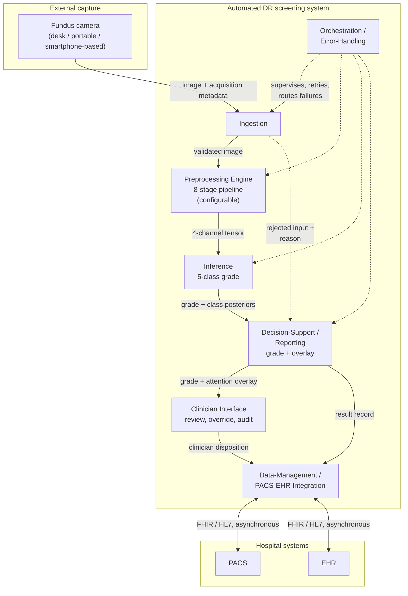
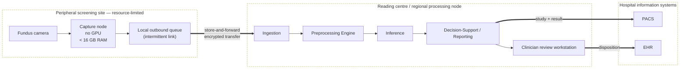
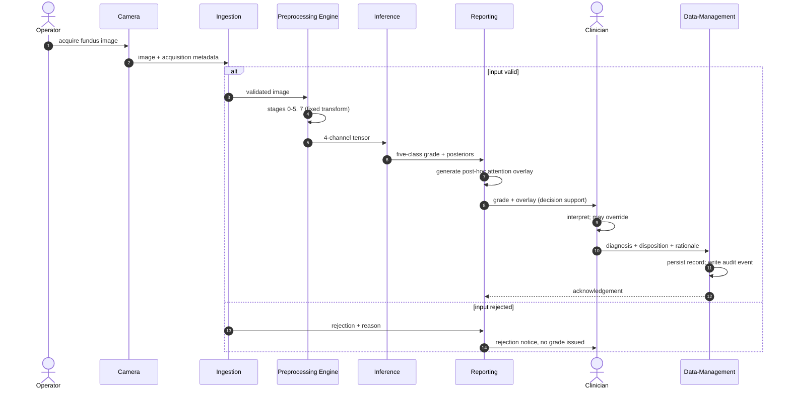
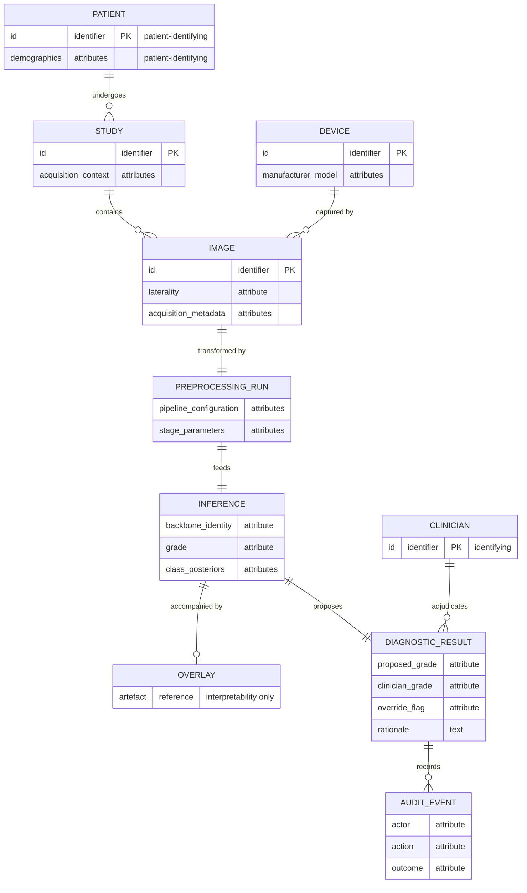

# Диабеттік ретинопатияны автоматтандырылған диагностикалау — GOST [N] дәйексөздері бар қазақ тіліндегі мәтін

> **STAGE-G (түпкі өту) — 2026-08-21.** Жұмыстық автор-жыл дәйексөздері нөмірленген `[N]` түріне түрлендірілді (GOST 7.32-2001 §6.11, алғаш кездесу ретімен). 102 сыртқы дереккөз [1]–[102] болып нөмірленді. Нөмірлер ағылшын тіліндегі мәтінмен ортақ (тіл-инварианттылық).

# КІРІСПЕ

**Зерттеудің өзектілігі.** Диабеттік ретинопатия – қант диабетінің микротамырлық асқынуы және
еңбекке қабілетті жастағы ересектер арасында алдын алуға болатын көру қабілетінен айырылудың
жетекші себептерінің бірі. Микроаневризмалар мен ұсақ қан құйылулар көру өткірлігіне әсер етпей
пайда болатын оның ең ерте сатылары асимптомды өтеді, сондықтан пациенттің араласу барынша тиімді
болатын дәл сол аралықта дәрігерге жүгінуге ешқандай себебі болмайды.

Демек, анықтау науқастың өз бетімен келуіне сүйене алмайды. Ол жүйелік диагноз бойынша
айқындалған когортаны жоспарлы түрде түсіруге сүйенеді, ал сол когортаның басым бөлігінде емдеуді
талап ететін ештеңе табылмайды. Скрининг – диагностикалық міндет болудан бұрын көлем міндеті, ал
өткізу қабілетінің шектеуін байланыстырушы етіп тұрған да осы көлем: қолмен дәрежелеу маман
уақытына сызықты түрде тәуелді, ол уақыт шектеулі әрі географиялық тұрғыдан шоғырланған.

Автоматтандырудың техникалық жүзеге асатыны он жыл бұрын дәлелденген, сондықтан бұл жұмыстың
өзектілігі автоматтандырылған скринингтің әлі көрсетілмегені туралы тұжырымға сүйене алмайды. Ол
көрсетілімдер алынған шарттарға сүйенеді. Жарияланған өнімділіктің орнықтылығы біркелкі емес
екені көрсетілген, әрі кескіндер тұрақты субстрат емес: әртүрлі камералармен, әртүрлі
операторлармен және қарашықтың әртүрлі кеңею күйінде алынған суреттер жүйелі түрде ерекшеленеді.
Скрининг қуаты барынша тапшы жерде түсіру шарттары да барынша бақылаусыз болады.

Әдіснамалық сұрақ осы тұста туындайды, әрі ол қандай да бір модельдің қаншалықты жақсы жұмыс
істейтінінде емес, мұндай модельдердің қалай сипатталатынында. Алдын ала өңдеуді әдіснамалық
талқылауды қажет етпейтін қосалқы деректер дайындығы деп те, модельдің интегралды компоненті деп
те қарауға болады, өйткені бірінші конволюцияға дейін қолданылған түрлендіру желі жұмыс істеуге
мәжбүр болатын белгілер кеңістігін айқындайды. Егер екінші көзқарас дұрыс болса, алдын ала өңдеуі
көрсетілмей жарияланған модель толық сипатталмаған, ал мұндай модельдерді салыстыру ішінара
белгісіз жүйелерді салыстыру болып шығады.

Бұл сұрақты дәл қазір жауап беруге жарамды етіп тұрған нәрсе – эмпирикалық база. Камераның
құжатталған тегі, тәуелсіз дәрежелеу хаттамалары, ал бір жағдайда пиксель деңгейіндегі зақымдану
аннотациясы бар ашық корпустар бар. Олардың қатар қолжетімді болуы екі көзқарасты скрининг тапшы
болатын жерде орын алатын шектеулер аясында бақыланатын қарама-қарсылыққа қоюға мүмкіндік береді.

**Зерттеудің мақсаты мен міндеттері.** Мақсаты – диабеттік ретинопатияны бес класс бойынша
автоматтандырылған диагностикалау үшін көз түбі кескінін жақсарту мен конволюциялық жіктеуді
біріктіретін интеграцияланған шеңберді әзірлеу және эксперименттік валидациялау. Онда сегіз
кезеңді алдын ала өңдеу конвейері деректерді дайындау емес, модельдің интегралды компоненті
ретінде айқындалады. Бұдан әрі мақсат – сол конвейерсіз оқытылған баламалы конфигурациямен
бақыланатын қарама-қарсылықта, есептеу ресурсы шектеулі жағдайда мұндай айқындаудың өнімділікке,
тасымалдану қабілетіне және түсіндірілімділікке қандай айырма беретінін анықтау.

Бұл мақсатты төрт міндет ыдыратады, әрқайсысы аталған тарауда орындалады.

1. Проблемалық саланы талдау және зерттеу мәселесін тұжырымдау: аурудың клиникалық дәрежеленуі,
   ресурсы шектеулі орталардың скринингке қоятын талаптары, кескін сапасының жоғалуының көздері
   мен өлшенген әсері, оның құрылғыға тәуелді құрамдасы және қолданыстағы автоматтандырылған
   жүйелердің әдіснамалық тәжірибесі (1-тарау).
2. Интеграцияланған әдіснаманы айқындау: сегіз кезеңді конвейерді әр кезеңнің теориялық негізімен
   бірге кезең-кезеңімен, жіктеу архитектураларын және оларды бейімдеуді, алдын ала оқыту мен
   дәлдеп баптау стратегиясын, түсіндірілімділік формализмін әрі бағалау мен статистикалық
   хаттаманы (2-тарау).
3. Шеңберді эксперименттік бағалау: домен ішіндегі факторлық қарама-қарсылық, параметрлік
   шарлаулармен бірге кезеңдік ыдырату, белгілер кеңістігінде бастапқы доменнен нысаналы доменге
   дейінгі қашықтықты тікелей өлшеу, корпусаралық және сыртқы клиникалық тасымалдау, назардың
   сарапшы аннотациясымен үйлесімі, камералық топтамалар бойынша және деректері тапшы режимдегі
   мінез-құлық, оған қоса нәтижелердің статистикалық валидациясы мен салыстырмалы орналасуы
   (3-тарау).
4. Модельдің айналасында инференсті жеделдететін аппаратурасы жоқ әрі байланысы үзілмелі
   орталарға жарамды скрининг жүйесін құру және сипаттау, әрі оның қай бөлігі бар, қай бөлігі әлі
   айқындама күйінде қалып отырғанын көрсету (4-тарау).

**Зерттеу объектісі мен пәні.** Объект – конволюциялық желілер арқылы түсті көз түбі
фотосуреттері бойынша диабеттік ретинопатияны автоматтандырылған көп кезеңді диагностикалау
үдерісі. Ол тек жіктеу қадамы шеңберінде емес, кескіннің камерадан шыққан сәтінен бастап модель
беретін дәрежеге дейін тұтастай зерттеледі. Пән – алдын ала өңдеуді жіктеумен біріктіру
әдістерінің жиынтығы және сол арқылы алынған конфигурация көрсететін қасиеттер: оның
диагностикалық өнімділігі, тасымалдану қабілеті, назарының аннотацияланған патологиямен үйлесімі
және камералық домендер бойынша мінез-құлқы.

**Теориялық және әдіснамалық негізі.** Негіз – бақыланатын эксперименттік салыстыру.
Конфигурациялар өзгертілетін фактордан тыс барлық нәрсе бекітіліп қарама-қарсы қойылады, сонда
нәтижедегі айырма олар алынған шарттардың айырмасы емес, конфигурациялардың айырмасы ретінде
түсіндіріледі.

Оның құралдары кескінді өңдеуден, машиналық оқытудан және статистикалық қорытындылаудан алынған.
Бағдар алдын ала оқытылған, қатырылған бағдарлық нүкте детекторымен қалыпқа келтіріледі, ал
геометрия желіге маска арнасы арқылы айқын жеткізілетін толықтырумен бірге изотропты масштабтау
арқылы сақталады. Жарықтандыру әр кескіндегі көру алаңының диаметріне пропорционал масштабта
түзетіледі, жергілікті контраст қос шектеулі клип-лимит аясында күшейтіледі, ал қарқындылықтар
көз түбінің жарамды пиксельдері бойынша есептелген статистикалар негізінде стандартталады.

Жіктеу үшін әртүрлі тұқымдастағы екі конволюциялық backbone қолданылады, ал класс теңгерімсіздігі
мақсат функциясының деңгейінде салмақталған focal loss арқылы шешіледі. Бағалау пациент деңгейінде
стратификацияланған кросс-валидация аясында алдын ала бекітілген өлшемдер иерархиясы бойынша
жүргізіледі, оған жұптық тексеру, bootstrap аралықтары және фолд деңгейіндегі модельдеу қосылады.

Эмпирикалық материал – төрт өндірушінің камераларымен алынған әрі бірнеше тәуелсіз хаттама
бойынша дәрежеленген сегіз ашық және клиникалық көз түбі деректер жиынтығынан тұратын деңгейлі
корпус; олардың бірі оқытуды, қалған жетеуі сыртқы, клиникалық және құрылғылық ығысу бойынша
бағалауды қамтамасыз етеді.

**Ғылыми жаңалығы.** Негізгі үлес – тұжырымдамалық: алдын ала өңдеуді қосалқы дайындықтан
диагностикалық модельдің интегралды компонентіне қайта орналастыру. Төмендегі әр тармақ бір
уақытта нақты бір конвейер туралы инженерлік нәтиже әрі осы ұстанымға қатысты дәлел болып
табылады.

Алдын ала өңдеу модель айқындамасының міндетті бөлігі ретінде формальданып, бақыланатын
эксперименттік қарама-қарсылыққа қойылады. Мұндағы жаңалық конвейердің болуында емес, конвейерді
сипаттау нысаны емес, эксперимент нысаны ретінде қарауда.

Оны инженерлік іске асырудың бес элементі бұған дейін біріктірілмеген түрде айқындалады. Ортаға
туралап толықтырылған изотропты масштабтау; төртінші кіріс арнасы ретінде берілетін көру алаңының
маскасы; әр кескіннің геометриясына сай масштабталып, тек маска ішінде қолданылатын жарықтандыруды
түзету. Көз түбінің жарамды пиксельдері бойынша есептелген арналық статистикалар; әрі
аугментациялық дисперсиясы бағдарлық нүктені локализациялау белгісіздігінен туындайтын канондық
бағдар.

Контраст кезеңінің клип-лимиті гистограммаға қатысты және торкөзге қатысты екі шектеудің минимумы
болып табылады әрі оқыту кезінде стохастикалық қолданылады, сондықтан бұл кезең әрі жақсарту, әрі
регуляризация қызметін атқарады. Назардың үйлесімі аннотацияланған зақымданудың модель назары
жабатын үлесі арқылы өлшенеді, себебі клиникалық тұрғыдан мәнді бағыт – зақымданудың қамтылуы.

Постулатталған механизм қорытындыланбай, өлшенеді. Алдын ала өңдеу домендер арасындағы орнықтылықты
арттырады деп тұжырымдайтын жұмыстар мұны әдетте оның салдары – сыртқы дәлдік арқылы көрсетеді де,
механизмнің өзін өлшеусіз қалдырады; мұнда бастапқы доменнен нысаналы доменге дейінгі қашықтық екі
конфигурацияда да алты сыртқы корпус бойынша соңының алдындағы қабатта есептеледі. Жаңалықты екі
белгі қамтиды. Нормалау бастапқы доменнің статистикаларын пайдаланады әрі ешқашан нысаналы домен
бойынша қайта есептелмейді, сондықтан кез келген жақындасу оған бейімделген рәсімнің емес, алдын
ала өңдеудің қасиеті болып қалады. Әрі өлшемнің теріске шығарылу мүмкіндігі өлшеу жүргізілгенге
дейін тіркелген, өйткені кері нәтиже нақты ықтимал болатын әрі ол да нәтиже саналатын еді.

Соңғы үлес – аналитикалық. Сыртқы орнықтылықты өрнектеу үшін жиі қолданылатын өлшемдер тобы
конфигурацияның сыртқы өнімділігін оның өз доменіндегі өнімділігіне нормалайды, ал мұндай өлшемдер
конфигурацияны өз доменіндегі күштілігі үшін жазалайды. Бұл талдау сол өлшемдер қолданылатын
барлық жерде күшінде.

**Қорғауға ұсынылатын тұжырымдар.** Әр тұжырым оны тексерген эксперимент басталғанға дейін
бекітілген шартқа қарсы, дәлелдер қолдайтын күште ұсынылады. Әрбір эмпирикалық тұжырым өз
ескертпесін алып жүреді, әрі бұл ескертпе ажыратылмайды: онсыз айтылған тұжырым дәлелдер
қолдайтыннан күштірек болады да, қорғалып отырған тұжырым болудан қалады.

Көз түбі кескіндерін алдын ала өңдеу – қосалқы дайындық емес, диагностикалық модельдің
формальдауға және эксперименттік тексеруге келетін компоненті. Бұл тұжырым әдіснамалық: оны ешбір
эксперимент дәлелдемейді де, теріске шығармайды да; нәтижелер тексерілген шарттарда оған сәйкес
келеді, ал тексерілген шарттардағы сәйкестік әмбебап дәлелдеме емес.

Интеграцияланған конфигурация оқыту корпусында, екі архитектурада да, конъюнктивті өлшемнің үш
құрамдасының үшеуінде де базалық конфигурациядан басым түседі, көптікке түзетуден кейін де
сақталады әрі архитектурамен өзара әрекеттесу көрсетпейді. Тұжырым конфигурацияға қатысты: екі
тармақ алдын ала өңдеумен қатар инициализациясымен де ерекшеленеді, сондықтан әсердің ешбір бөлігі
тек алдын ала өңдеуге телінбейді. Абляция бұл құраманы бірыңғай инициализация аясында ыдыратып,
домен ішіндегі ұтыстың бүтінін қалпына келтіреді, алайда ыдырату – жоққа шығару емес.

Жекелеген кезеңдердің үлестері ажыратылады: әрқайсысы өз деңгейіндегі фолдаралық дисперсиядан
асады әрі барлық фолдта монотонды, ал алда екі фотометриялық кезең тұр. Бұл тек топтамалар
ажыратымдылығында қорғалады, себебі көрші орындар шу шегінде жатыр әрі маска арнасы оқшауланбаған.
Екі фотометриялық параметрдің де ішкі оптимумы бар, ол бөлек ұсталған деректерде расталды, әрі бұл
оптимумдар тасымалданатын тұрақтылар емес, осы корпустың қасиеттері.

Оқыту үлестірімінен қашықтық алты сыртқы корпустың әрқайсысында төмендейді әрі әр аралық нөлді
қамтымайды, оған қоса түрлендіру бірде-бір нысаналы корпусты көрмеген. Бұл тек бағыт бойынша
қорғалады: төмендеу шамасы ешбір өнімділік ұтысының шамасын болжамайды, әрі әр тармақ өзінің
репрезентация кеңістігінде өлшенеді.

Құзірет оқытуда көрілмеген корпустарға тасымалданады, интеграцияланған конфигурация олардың
әрқайсысында жоғары, әрі оның аясында өнімділік камералық топтамалар бойынша азырақ ауытқиды.
Табалдырықтардың бірде-бірі екі тармақты ажыратпайды, сондықтан дәлел салыстырудың өзінде және
шашыраудың азаюында жатыр. Екі сыртқы клиникалық корпуста интеграцияланған конфигурация базалық
конфигурациядан кемінде минималды клиникалық маңызды айырмаға асып түседі, ал екіншісіндегі қор –
төрт мыңдық.

Модель назары интеграцияланған конфигурация аясында сарапшы аннотациялаған зақымданулармен
аннотацияланған зақымданудың төрт түрінің төртеуінде де көбірек беттеседі әрі бұл назар
табалдырығы бойынша орнықты. Бұл локализация ретінде емес, үйлесім ретінде, бір аннотацияланған
ашық корпуста қорғалады, ал сол гипотезаның сапалық жартысы бағаланбаған.

**Теориялық және практикалық маңыздылығы.** Теориялық маңыздылық мәселенің қалай қойылып, қалай
өлшенетінінде. Қайта орналастыру осы кластағы диагностикалық модельдің толық сипаттамасы деп нені
санау керектігін, онымен бірге әділ салыстыру деп нені санау керектігін өзгертеді. Үш формальдау
бұрын бейресми болып келген таңдауларды айқын әрі тексерілетін етеді: клип-лимит екі шектеудің
минимумы ретінде, жарықтандыруды түзету әр кескіннің геометриясының функциясы ретінде және назардың
келісімі асимметриялы беттесу ретінде. Төртіншісі постулатталған механизмді өлшенетін етеді, ал
бесіншісі кең қолданыстағы орнықтылық өлшемдерінің бір тобының бейтарап емес екенін көрсетеді.

Жұмыс практикалық тұрғыдан төрт нәрсені қолжетімді етеді, әрқайсысы өзіне тиесілі шектеуімен.
Қосымшаларда толық келтірілген, түбегейлі айқындалған алдын ала өңдеу режимі, оның параметр мәндері
нақты корпустарда бекітілген әрі мұра ретінде алынбай, қайта белгіленуі тиіс. Модельдің айналасында
құрылған скрининг жүйесі, оның іске асқан және асып үлгермеген бөліктері бүкіл мәтінде ажыратылады.

Сырттан келген кескіндерді қабылдау хаттамасы, ол тек өзі құрылған клиникалық дереккөзде
валидацияланған. Әрі ұлттық скрининг контекстіне қолданылу дәлелі – құжатталған орналастыру жағдайы
мен алдын ала жарияланған есептеу қоршауының өзара сәйкестігі ретінде, сол жерде далалық сынақтың
жоқтығымен шектелген.

**Нәтижелердің сенімділігі.** Сенімділік шаманың емес, рәсімнің үстінде тұр. Бөлу пациент
деңгейінде әрі дәрежесі бойынша стратификацияланған, сондықтан модель бұрын көрген пациентін
танығаны үшін баға ала алмайды. Өнімділік нәтижелер көрінгеннен кейін таңдалған емес, алдын ала
бекітілген өлшемдер иерархиясы бойынша беріледі. Айырмалар бірдей жағдайларда жұптық тексеру арқылы
бағаланады, олардың белгісіздігі қайта іріктеу арқылы сандық өлшенеді, ал фолдтар бойынша қайталау
бар жерде аралас әсерлер моделі фолдтық вариацияны тексерілетін әсерден ажыратады.

Осылардың ішіндегі ең күштісін кестеден растау мүмкін емес, сондықтан ол ашық айтылады: әр
гипотезаны қабылдау өлшемі оны тексерген эксперимент басталғанға дейін бекітілген. Нәтижесі
белгілі болғаннан кейін жазылған өлшемді әрқашан қанағаттандыруға болады, ал қорытындыны ақпаратты
ететін нәрсе – дәл осы реттілік.

Бұл сенімділікті үш ескертпе шектейді. Көптікке түзету салыстырулар жоспарланған жалғыз эксперимент
шеңберінде ғана қолданылады, сондықтан бүкіл дәлелдер базасы бойынша ешбір қателік деңгейі
бақыланбайды. Бірнеше бағалау бір ғана бапталған фолдтың модельдеріне сүйенеді, сондықтан олардың
аралықтары жалпы белгісіздікті белгілі бағытта төмен көрсетеді. Әрі бір эксперимент қайта таратуға
болмайтын клиникалық корпусқа тәуелді.

**Нәтижелердің апробациясы және жарияланымдар.** Осы зерттеудің құрамдастары мұнда біріктірілгенге
дейін кезең-кезеңімен таратылды. Жұмыс 2025 жылғы қазанда Стамбұлда өткен Цифрлық қоғам жөніндегі
3-ші халықаралық семинарда баяндалды. Негізгі нәтижелер бес рецензияланған еңбекте жарияланған:
біреуі – Scopus және Web of Science индекстейтін журналдағы мақала [1], біреуі – Scopus индекстейтін конференция жинағындағы баяндама [2], үшеуі – ғылым және жоғары білім
саласындағы сапаны қамтамасыз ету жөніндегі ұлттық комитет ұсынған журналдардағы мақалалар
[3, 4, 5].

Бесеуі де бірлескен авторлықта жазылған әрі бүкіл мәтінде бұрынғы өз жұмысы ретінде қаралады.
Бірдей эксперименттік материалды баяндайтын жарияланымдар ешқашан бір-бірінің тәуелсіз растауы
ретінде дәйексөзделмейді, ал олардың ішінде келтірілген өнімділік сандары нәтиже ретінде
көшірілмейді: сол сұрақтар мұнда қайта туындаған жерде олар осы жұмыстың өз материалында қайта
қаралады.

**Мемлекеттік бағдарламалармен байланысы.** Осы зерттеудің бағыты Қазақстан Республикасының
денсаулық сақтауды цифрландыру және жасанды интеллект технологияларын дамыту саласындағы
мемлекеттік басымдықтарына сәйкес келеді. Ол, атап айтқанда, Жасанды интеллектіні дамытудың
2024–2029 жылдарға арналған тұжырымдамасына, Президенттің 2025 жылғы 8 қыркүйектегі «Қазақстан
жасанды интеллект дәуірінде» атты Жолдауына және 2025 жылғы 17 қарашадағы «Жасанды интеллект
туралы» Заңға үндеседі. Зерттеу «Ғылым туралы» Заңның 20-бабы 3-тармағының 2) тармақшасына сәйкес
жүргізілген.

Бұл байланыстың сипатын дәл көрсеткен жөн. Бұл – зерттеу бағыты мен жарияланған ұлттық
басымдықтардың арасындағы сәйкестік. Бұл жұмыстың мемлекеттік бағдарлама аясында қаржыландырылғаны
немесе қандай да бір органның тапсырысымен орындалғаны туралы мәлімдеме емес, әрі ол арқылы қандай
да бір саяси мақсатқа қол жеткізілгені туралы тұжырым емес.

**Жұмыстың құрылымы мен көлемі.** Диссертация кіріспе алдындағы бөліктерден, кіріспеден, төрт
тараудан, қорытындыдан, пайдаланылған әдебиеттер тізімінен және бес қосымшадан тұрады.

1-тарау скринингтің клиникалық және техникалық контексін белгілейді, кескін сапасының жоғалу
көздерін және оның құрылғыға тәуелді құрамдасын сипаттайды, саланың конволюциялық желілермен не
істегеніне шолу жасайды, қолданыстағы автоматтандырылған жүйелерді талдайды әрі зерттеу мәселесін
тұжырымдайды. 2-тарау әдіснаманы айқындайды: сегіз кезеңді конвейерді әр кезеңді негіздейтін
теориямен бірге, формальданған клип-лимитті, жіктеу архитектураларын және оларды бейімдеуді, алдын
ала оқыту мен дәлдеп баптау стратегиясын, түсіндірілімділік формализмін және бағалау хаттамасын.
3-тарау эксперименттік бағдарламаны және оның статистикалық валидациясын баяндайды, нәтижелерді
жарияланған жүйелермен қатар қояды әрі шектеулерді айтады. 4-тарау модельдің айналасында құрылған
скрининг жүйесін сипаттайды, онда не бар екені мен не әлі айқындама күйінде қалып отырғаны бүкіл
мәтінде ажыратылады. Қорытынды нәтижелерді және әрі қарайғы жұмыс бағыттарын жинақтайды.

Одан кейін бес қосымша беріледі: алдын ала өңдеу конвейерінің бастапқы коды, қосымша нәтижелер мен
шатасу матрицалары, жүйе архитектурасының диаграммалары, назар карталарының галереясы және
құрылғылық бағалау бойынша қосымша кестелер.

Диссертация қосымшаларды қоспағанда 118 бетте баяндалған әрі 19 кесте мен 16 суреттен тұрады.
Пайдаланылған әдебиеттер тізімі 102 дереккөзді қамтиды.


# 1 ДИАБЕТТІК РЕТИНОПАТИЯНЫҢ АВТОМАТТАНДЫРЫЛҒАН СКРИНИНГІ

## 1.1 Диабеттік ретинопатия және скрининг қажеттілігі

Диабеттік ретинопатия – қант диабетінің созылмалы асқынуы әрі еңбекке қабілетті жастағы ересектер
арасында алдын алуға болатын көру қабілетінен айырылудың басты себептерінің бірі. Оның
патофизиологиясына арналған шолулар [6, 7]
дүние жүзіндегі диабеттік популяциялардың шамамен үштен бірінде қандай да бір ретинопатияның
біріктірілген таралымы тіркелетінін хабарлайды. Екі көрсеткіш те үшінші тараптың клиникалық
контексі болып табылады және сол шолулар сілтейтін бастапқы зерттеулерден мұраланған.

Оның автоматтандырылған скрининг жүйесі үшін маңызы жиілігінде ғана емес, ауырлық дәрежесінің көз
түбінде көрінетін дискретті, реттелген құрылымдық өзгерістер жиынымен айқындалатынында.

Астарлы үдерістің классикалық түсіндірмесі микротамырлық. Ұзаққа созылған гипергликемия торқабық
капиллярлық қабатында зақымдануды тудырады, ал Kusuhara және әріптестері [6] перициттердің
жоғалуын ішкі гематоретиналдық бөгеттің бұзылуының консенсусты механизмі ретінде көрсетеді.
Салдары – өткізгіштіктің артуы, капиллярлық перфузияның тоқтауы және үдемелі ишемия, ал ол ақыр
соңында патологиялық неоваскуляризацияға ұласады.

Бұл – бекітілген факт емес, шолулардың саланы жинақтауы: олардың авторлары жасушалық механизмдердің
толық анықталмағанын, өйткені жануар модельдері ерте кезеңдегі аурудың тек шектеулі қырларын
жаңғыртатынын ескертеді. Түсіндірме толық та емес. Wang пен Lo [8] және Gettinger және
әріптестері [9] ауруды микротамырлық зақымдану, қабыну және нейродегенерацияның қосындысы деп
сипаттайды әрі нейродегенерация дәстүрлі түрде аурудың айқындаушы белгісі саналатын тамырлық
өзгерістерден бұрын басталуы мүмкін екенін хабарлайды.

Бұл айырма кескінге негізделген жіктеуіш үшін маңызды. Көз түбі фотосуреті микротамырлық
көріністерді береді, сондықтан стандартты клиникалық шкала бойынша дәрежеленген модель ең ерте
патологиясы ішінара нейрондық әрі әлі көрінбейтін үдерістің тамырлық қолтаңбасын үйренуге мәжбүр.

Кескіннің өзінде ауру шамамен реттелген үдеріс арқылы білінеді. Ең ерте әрі ең ұсақ көрініс –
микроаневризмалар, олардан кейін сол тамырлар жарылған сайын торқабықішілік қан құйылулар пайда
болады; липидтер мен ақуыздардың экссудациясы қатты экссудаттар, ал ошақты ишемия мақта тәрізді
дақтар түзеді.

Микротамырлар одан әрі бүлінген сайын микротамырлық аномалиялар мен веналық іркілу байқалады, ал
пролиферативті сатыда сынғыш жаңа тамырлар түзіліп, шыны тәрізді денеге қан құйылу қаупін
тудырады. Осы ауырлық осіне қабаттасып, әрі одан тәуелсіз, макулярлық ісіну қатар жүреді; Wang пен
Lo [8] оны бірінші кезектегі анти-VEGF терапиясының басты көрсетілімі ретінде тіркейді.

Жіктеуіш үшін бұл зақымданулар – жұмысшы кескіндік белгілер, әрі олардың көзге түсуі біркелкі
емес. Ең ерте әрі скрининг үшін ең сын дәрежелерді айқындайтын микроаневризмалар мен ұсақ қан
құйылулар – шағын, төмен контрастты құрылымдар, ал асқынған аурудың неоваскулярлық және
экссудативті өзгерістері салыстырмалы түрде айқын көрінеді.

Клиникалық шкала бұл жүкті ауырлық кластарына бөледі. Morya және әріптестері [7] жинақтағандай,
қазіргі скрининг ретінің бес деңгейлі шкаласын қолданады: ретинопатия белгілері жоқтан бастап
жеңіл, орташа және ауыр пролиферативті емес ауру арқылы пролиферативті ауруға дейін; осы таксономия
бүкіл жұмыс бойы жіктеу нысанасы болып қалады.

Оның екі қасиеті автоматтандырылған дәрежелеуіштің жобасына тікелей әсер етеді. Шкала реттік,
сондықтан қате жіктеудің клиникалық құны болжанған және шынайы дәреженің арасындағы қашықтыққа
пропорционал: көрші дәрежелерді шатастыру аурудың жоқтығын пролиферативті аурумен шатастырудан
әлдеқайда аз зардап шектіреді. Бұл – еркін бес мүшелі категориялық емес, қателік құны құрылымды
реттелген міндет.

Ал ерте араласу үшін ең маңызды шекаралар дәл жоғарыда шағын әрі бұлыңғыр деп аталған
зақымдануларға сүйенеді. Аурудың жоқтығын жеңіл дәрежеден немесе жеңілді орташадан ажырату бірнеше
пиксель алып жатқан бірлі-жарым микроаневризмаға байланысты болуы мүмкін.

[FIG-1.1: Бес дәреже бойынша көз түбінің репрезентативті кескіндері, тек иллюстрация – defense/figures/figures_mine/fig1_1_dr_grades_idrid.png]

Ерте анықтау клиникалық тұрғыдан шешуші, өйткені Kesharwani және әріптестері [10] мен Wang пен Lo [8] хабарлағандай, ауру ерте дәрежелерінде емделеді, ал терапиялық терезе ол әлі бұлыңғыр
кезінде анықталған жағдайда ғана болады. Бұл дәрежелер жиі асимптомды өтетіндіктен, анықтау
пациенттің өз бетімен келуіне емес, бүкіл диабеттік популяцияны жүйелі әрі қайталанып скринингтен
өткізуге тәуелді.

Қажетті скринингтің жүзеге аспай отырғанын байқалған қамту көрсеткіші көрсетеді: Morya және
әріптестері [7] жыл сайынғы ұсынылған тексеруден өтетіндер үлесін пациенттердің үштен бірі мен
жартысының аралығында бағалайды. Тапшылық ең алдымен ықылас емес, қолжетімділік пен өткізу
қабілетінің тапшылығы, әрі ол мамандандырылған инфрақұрылым ең әлсіз жерде барынша өткір көрінеді.

Шектеу кездейсоқ емес, құрылымдық. Кандидаттың бұрынғы жұмысы [3] осы жұмыс қарастыратын ұлттық контексті сипаттайды. Бүкіл халыққа шамамен 1 200
офтальмолог қызмет етеді, тұрғындардың шамамен 40 пайызы ауылдық жерде тұрады, ал солардың
бағамдау бойынша 70 пайызының мамандандырылған көз көмегіне қолжетімділігі шектеулі.

Оның аналитикалық мәні – қолмен дәрежелеу маман уақытына сызықты тәуелді. Дәрежелеушілердің
шектеулі әрі географиялық шоғырланған ұсынысы үлкен, ішінара ауылдық популяцияға таралған сұранысты
қанағаттандыра алмайды, сондықтан маман санын арттыру арқылы қамтуды ұлғайту жақын мерзімдегі
нұсқа емес. Түйінді сұрақ дәрежелеу қадамын ішінара автоматтандыруға бола ма дегенге ауысады.

Morya және әріптестері [7] жеткізетін енгізілген автоматтандырылған жүйелер және Yesmukhamedov
және әріптестері [3] баяндайтын ұлттық скрининг бағдарламасы бұл нақты мүмкіндік екенін
көрсетеді, әрі оны жоққа шығармай, мойындаған жөн. Алайда бұл нәтижелердің әрқайсысы өз
популяциясының, өз құрылғысының және өз нормативтік жағдайының аясында алынған. Олардың бірде-бірі
осы жұмыстың нәтижесі емес, әрі олардың ресурсы шектеулі, құрылғылары әртекті орталарға
тасымалдануы басқа жерде табысты болғанынан туындамайды. Дәл сол тасымалдану – ашық мәселе.

Бұдан екі шекаралық шарт шығады. Жұмысшы орналастыру контексі – ресурсы шектеулі орта; ол мұнда
мыналардың кемінде екеуімен айқындалады: инференс үшін жеделдету жоқ, жады он алты гигабайттан
төмен, нақты уақытқа жуық өткізу қабілетінің шектеулері әрі бұлтқа үздіксіз сүйенуге жеткіліксіз
байланыс. Ал автоматтандыру мұнда алмастыру емес, шешім қабылдауды қолдау дегенді білдіреді:
диагнозды дәрігер түсіндіреді, тексереді әрі оған жауапты болып қалады.

Дәрежелеу сондай-ақ жолдаманы, ал жолдама терапияны айқындайды. Пролиферативті аурудың стандартты
емі – лазерлік фотокоагуляция: онда шоғырланған энергия ақуыздың ұюын тудырып, аномальды тамырлардың
өсуін тежейді. Тиімді терапия үшін айналадағы тінді аман сақтай отырып, нысананы ұйытуға жететін
энергияны жеткізу қажет.

Бұл тепе-теңдік энергияның қалай жұтылатынына және пайда болған жылудың көз түбінің қабатты
құрылымы бойынша қалай таралатынына байланысты. Гаусс шоғыры тереңдікке қарай өз жолындағы жұтылу
арқылы әлсірейді; жұтылған энергия жергілікті температураны тіннің жылу сыйымдылығына
пропорционал шамада көтереді; ал бұл көтерілу өткізгіштігі әртүрлі қабаттар арқылы жылу өткізудің
бастапқы шарты болады.

Кандидаттың бұрынғы жұмысында баяндалған осы байланысқан модельді имитациялау сапалық сипатта.
Беткі тін бетке жақын жердегі жоғары жұтылу есебінен жылдам қызады, ал терең қабаттар салыстырмалы
тұрақты температураға дейін баяу қызады. Зақымдану табалдырықтары да, қателік шектері де
хабарланбаған.

Модельдің шектеулері оны қалай пайдалануға болатынын айқындайды. Ол эксперименттік немесе
клиникалық өлшеммен валидацияланбаған, сондықтан клиникалық деңгейдегі ешқандай тұжырымды
қолдамайды.

Оның болжамдары қолданылу аясын шектейді. Тін қасиеттері әсер ету кезінде тұрақты деп алынады, әр
қабат біртекті, шоқ пішіні бекітілген, ал жылу өткізу теңдеуінде перфузия мүшесі жоқ, дегенмен қан
ағысы арқылы жылудың конвективті шығарылуы бұл тамырлы тінде елеулі. Дәлелдер базасы – кандидат
авторлығындағы жалғыз жарияланым.

Модель емдеу физикасына қатысты әрі осы жұмыстың өзегіндегі диагностикалық жүйеден тәуелсіз. Ол
дәрежелеу жолдамаға, жолдама терапияға қызмет ететіндіктен енгізілген әрі ол ешқандай
диагностикалық тұжырымға емес, лазер параметрлерінің жылулық өрісті қалай қалыптастыратынына
қатысты.

## 1.2 Көз түбі кескінінің сапасы мен вариабельділігі

Жаңа ғана сипатталған скрининг жағдайлары – жылжымалы бригадалар мен мамандандырылған клиникадан
тыс пайдаланылатын тасымалды камералар – көз түбі кескіндерінің идеалды алынуы ең екіталай
шарттар. Кескін сапасы мұнда эстетикалық қасиет емес, кескіннің саты белгілеуге қатысты
белгілерді автоматты анықтауды қолдау қабілетінің өлшенетін шамасы.

Тиісінше, деградация деп осы қабілетті кемітетін кез келген түсіру жағындағы құбылысты айтамыз, ал
мұны істейтін құбылыстар кездейсоқ та, диагностикалық тұрғыдан бейтарап та емес. Олар төрт оське
жіктеледі – Shen және әріптестері [11] арнайы көз түбін жақсарту желісін оқыту үшін дәл осы
факторларды айқын модельдейді.

Біріншісі – оптикалық. Дефокус та, қозғалыс бұлдырлығы да төмен жиілікті сүзгі ретінде әрекет
етіп, торқабықтың ұсақ құрылымын фоннан ажырататын жоғары жиілікті мазмұнды дәл сол күйінде
әлсіретеді. Ең ерте зақымданулар бірнеше пиксель ғана алатындықтан, тіпті шамалы бұлдырлық та
оларды айналасындағы капиллярлық қабаттан ажыратылмайтын етіп жіберуі мүмкін. Бұл – дәлдіктің
біркелкі жоғалуы емес, скрининг үшін ең сын сигналды таңдамалы өшіру.

Екіншісі – фотометриялық. Көз түбі фотосуреті иілген, жартылай шағылысатын ішкі бетті шағын
қарашық арқылы жарықтандырады, сондықтан жарықтандыру сирек біркелкі болады: виньеттеу, орталық
рефлекс және көлеңке градиенттері патологияға қатысы жоқ ірі төмен жиілікті вариацияларды
енгізеді, оған экспозиция қатесі мен жалпы контрастың төмендігі қосылады.

Диагностикалық салдары екі жақты. Біркелкі емес жарықтандыру көлеңкелі аймақтардағы шынайы
зақымдануларды жасыруы да, патологияға еліктеуі де мүмкін: жарық көлеңке артефактісі жергілікті
деңгейде қатты экссудаттан, ал қараңғы градиент қан құйылудан ажыратылмайды. Демек, ол сезімталдыққа
да, спецификалыққа да қатер төндіреді.

Үшіншісі – геометриялық. Оське қатысты ауытқып түсіру, дұрыс туралмау, дөңгелек алаңның қиылуы
және үлкейтудің құбылуы құрылымдардың қай жерде көрінетінін әрі қаншалықты үлкен болатынын
анатомияны өзгертпей-ақ өзгертеді. Зақымдануды локализациялауды бекітетін табиғи бағдарлық нүктелер
тұрақсыз орындарда тұруы мүмкін, ал қиылған алаң шеткері зақымдануларды мүлде сыртта қалдыруы
мүмкін. Бұл ось адам оқырманға ең аз көрінеді, ол оны еш қиналмай өтейді, әрі оған қарсы
қалыпталмаған модель үшін ең бүлдіргіш ось болып шығады.

Төртіншісі – пациентке және оптикалық ортаға байланысты. Сапалы түсіру үшін қарашықтың жеткілікті
кеңеюі мен оптикалық ортаның мөлдірлігі қажет, ал скрининг нысанасына алатын популяцияда екеуі де
жиі бұзылады. Оның ерекшелігі – себептері аспапта емес, ішінара пациенттің өзінде, сондықтан оны
камераны жетілдіру арқылы жоюға болмайды әрі ол кез келген нақты скрининг популяциясында сақталады.

Бұл остер орналастыру контексінен тәуелсіз емес. Әрқайсысы тасымалды, маман емес операторлар
жұмыс істейтін жағдайда күшейеді: қолда ұсталатын оптика ұсақтау әрі тұрақсыздау, маман емес
оператор фокус пен жарықтандыруды оңтайландыруға шамасы аз, ал қарашығы кеңейтілмеген кездейсоқ
қабылдаулар оптикалық ортаға байланысты деградацияны шегіне жеткізеді. Автоматтандырылған скрининг
ең қажет орталар – деградация ең ауыр орталар, әрі бұл байланыс техникалық мәселені
жеңілдетпейді, керісінше өткірлендіреді.

Орынды қарсылық – түсіру сәтіндегі сапа сүзгісі жарамсыз кескіндерді әлдеқашан шығарып тастайды
дегенде. Сүзгі бар әрі құнды, бірақ ол мәселені жоймайды, тек басқаша қояды: ол сигналды қалпына
келтірмей, кескіннің өзін шығарып тастайды, бұл қайта түсіру қымбат жерде тиімді қамтуды
төмендетеді, ал сүзгіден өтіп кететін табалдырық астындағы деградация ұсақ зақымдану сигналын
бәрібір кемітеді.

Өлшенген дәлелдер таксономияның өзінен гөрі нақтырақ ұстанымды қолдайды. Архитектураны бекітіп,
тек сапаны өзгерте отырып, Fu және әріптестері [12] отыз мыңға жуық кескінді үш сапа деңгейіне
қайта аннотациялап, сапа төмендеген сайын анықтау дәлдігінің монотонды түрде құлдырайтынын тапты.
Zago және әріптестері [13] дәл сол байланыстың дерекқорлар арасында да сақталатынын хабарлайды,
ал Dai және әріптестері [14] өнеркәсіптік жүйесі дәрежелеудің алдына айқын сапа кезеңін қояды.
Бұл – қатынастың қолжетімді ең таза тұжырымы, бірақ оның ауқымы шектеулі: бір бастапқы корпус, ішкі
бөлу, сыртқы валидация жоқ әрі аралықтар келтірілмеген.

Екінші бағыт сапаны корпустар арасындағы айырманың ең үнемді түсіндірмесі ретінде қарайды. Rakhlin [15] бір сыртқы корпуста қисық астындағы ауданның екіншісіндегіден едәуір жоғары болғанын
хабарлап, айырманы жоғары жалпылау қабілетіне емес, дәрежелеуге жарамдылыққа жатқызды: бірінші
корпустың іс жүзінде бәрі дәрежеленетін, ал екіншісінің шамамен төрттен үшінде ғана солай еді.

Деректер шарттарының архитектурамен бәсекелесе алатынының ең күшті дәлелі архитектураны
дереккөздер арасында дәлме-дәл бірдей ұстаудан келеді. Voets және әріптестері [16] Gulshan және
әріптестері [17] конвейерін ашық деректерде қайта жаңғыртты. Олар бір тест корпусында қисық
астындағы аудан 0,951, екіншісінде 0,853 нәтиже алды – сол желі, сол рәсім, ал айырма модель
жобасына емес, деректің тегі мен таңбалауына қатысты болды.

Voets және әріптестері [16] шамадан тыс күшті оқылымға жол бермейтін екі нюанстың бірінші
береді. Дәрежелеуге жарамсыз деп бағаланған әрбір бесінші кескінді алып тастау өнімділікті елеулі
өзгертпеді. Егер сапа қарапайым монотонды тетік болса, ең нашар кескіндерді алып тастау көмектесуі
керек еді; олай болмағаны қатынастың дөрекі іріктеу деңгейінде емес, ұсақ сигналды сақтау
деңгейінде жұмыс істейтінін көрсетеді.

Beede және әріптестері [18] сүзгінің құнын орналастыру жағынан күшейтеді: он бір клиникада
далада түсірілген кескіндерді автоматты қабылдамау қамтуды төмендетіп, жұмыс ағынын бұзғанын
тапты. Бұл – дәлдікті өлшеу емес, әлеуметтік-техникалық бақылау.

Екінші нюанс міндетке тәуелділікке қатысты. Liu және әріптестері [19] баяндаған бенчмаркта
сапаны автоматты бағалаудың өзі авторлары клиникалық орындалатын скрининг үшін жеткіліксіз деп
сипаттаған келісім деңгейіне ғана жетті, ал дәрежелеу қосалқы жарысында жеңген топ мұны ең аз
алдын ала өңдеумен, оның орнына оқыту стратегиясына сүйене отырып істеді. Алдын ала өңдеу қажет,
бірақ жеткіліксіз, әрі оның шеткі пайдасы конвейердің қалған бөлігі не істеп қойғанына тәуелді.

Кандидаттың бұрынғы жұмысы бұрын жарияланған нәтиже ретінде тағы бір тұжырым қосады: жақсартушы
алдын ала өңдеу шағын өз архитектурасында валидациялық дәлдікті 71 пайыздан 86 пайызға көтерді
[1]. Ол бір шағын архитектураға сүйенеді әрі айқын
салыстырусыз кеңірек класқа жалпыланбайды.

Бірге оқығанда дәлелдер ұранға емес, ұстанымға жинақталады. Сапа мен деректің тегі – өнімділіктің
өлшенген, бірінші реттік айқындаушылары, кейде архитектурамен бәсекелеседі, дегенмен өнімділік
нашар кескіндерді алып тастау арқылы сенімді қалпына келмейді. Кескіндерді сүзіп шығарудың орнына
геометрияны, жарықтандыруды және контрастты модельдің бөлігі ретінде қалыпқа келтіру арқылы «ішке
қарай» бейімдеуді уәждейтін де осы. Бұл алдын ала өңдеу кез келген корпуста өнімділікті арттырады
деген әмбебап тұжырымға рұқсат бермейді.

Осы вариацияның бір көзі мүлде кездейсоқ емес. Камералар қайталанатын остер бойынша ерекшеленеді.
Түс беруі әртүрлі, өйткені жарықтандыру спектрлері мен сенсорлық өңдеу стандартталмаған;
жарықтандыру геометриясы нақты оптикалық жобаның виньеттеу үлгісін белгілейді; ал алаң бұрышы,
сенсор ажыратымдылығы және оптика бірлесіп қалпына келтірілетін ең ұсақ детальды айқындайды.

Бұлардың бірде-бірі өткінші түсіру қатесі емес. Әрқайсысы – камера моделінің тұрақты қасиеті,
сондықтан бір торқабықты түсірген екі камера жүйелі әрі болжамды түрде ерекшеленетін кескіндер
береді, ал модель үйренетін көрініс статистикалары оның оқыту кескіндерін өндірген құрылғымен
ішінара шатасып жатады.

Әдебиет мұны домендік ығысу ретінде зерттейді. Zhou және әріптестері [20] саланы шолып,
статистикалық оқытудың басым бөлігі бастапқы және нысаналы деректер бірдей үлестірілген деген
шектен тыс жеңілдетілген болжамға сүйенетінін, ал тек бастапқы деректерде оқытылған үйренуші
үлестірімнен тыс нысанада әдетте елеулі құлдырауға ұшырайтынын атап өтеді. Wang пен Deng [21]
жеңілдету тәсілдерін алшақтыққа негізделген, adversarial және қайта құруға негізделген
тұқымдастарға топтастырады. Камера домен айқындайды, ал бір камераның үлестірімінде оқытылған
модель – екіншісіне қатысты дәл сол үйренуші.

[FIG-1.2: Корпустар және олар қамтитын камералық жабдық – defense/presentation/assets/datasets/27_overview/cross_dataset_comparison.png]

Құрылғылық вариабельділікті осылай қою екі жауапқа нұсқайды. Геометрияны, жарықтандыруды және
контрастты қалыпқа келтіру бір камераның кескіндерін екіншісінікінен ажырататын көріністік
айырмаларды тарылтады, ал бұл конвейердің негіздемесінің бір бөлігі. Мұндай қалыптау құрылғының
қолтаңбасын әлдеқашан өшіріп, мәселені мәнсіз етіп жіберуі мүмкін деген қарсылық бар.

Бұл қарсылық тек ішінара дұрыс. Стандарттау түс пен жарықтандыру айырмаларын тарыта алады, бірақ
ажыратымдылықта, оптикада және алаң бұрышында тұратын ығысуды өшіретінін дәлелдей алмайды, ал
қалдық ығысудың жіктеуді әлі де нашарлататыны – мәлімдемемен шешілмейтін, эмпирикалық сұрақ.
Екінші жауап – камералық топтар бойынша айқын бақыланатын бағалау; осы бөлім оны алдын ала
үкім шығармай уәждейді.

Мұндай бағалау белгілейтін нәрсе шектеулі. Камералық топтар бойынша өнімділіктің сақталуы немесе
жоғалуы – құрылғыаралық мінез-құлықтың эмпирикалық бақылауы, әрі ол құрылғыдан тәуелсіз
дайындықтың сертификаты да, кез келген аспаппен пайдалануға нормативтік сәйкестік те емес.

## 1.3 Ретинальды кескіндерге арналған конволюциялық желілер

Торқабықты автоматтандырылған дәрежелеудің оқыту машинасы – конволюциялық желі, әрі саланың оны
қолдануы айқын байқалатын доға бойымен дамыды. Ерте жүйелер табиғи кескіндер бенчмарктері үшін
жасалған жалпы мақсаттағы архитектураларды бейімдеді [22, 23, 24, 25], ал сарапшымен салыстырмалы дәрежелеудің
бетбұрысты көрсетілімдері [17] торқабыққа арнайы жобаларда емес, дәл
сол backbone-дарда құрылды. Litjens және әріптестері [26] осы қозғалысты медициналық бейнелеу
бойынша кеңірек шолады.

Ол архитектуралар сүйенетін тереңдікті оқытуға келетін етіп екі байланыс жаңалығы жасады. He және
әріптестері [27] әр блокты бірегейлік қысқа жолдары арқылы өз кірісіне қатысты қалдық функцияны
үйренетіндей қайта тұжырымдайды, ал Huang және әріптестері [28] алдыңғы қабаттардың барлығының
шығысын біріктіріп жалғайды; екеуі де тереңдік артқанда орнығатын деградацияны шешеді. Одан кейін
Tan мен Le [29] тереңдікті, енді және ажыратымдылықты бірлесіп масштабтайды. Мұнда олар
бір-бірімен салыстырылып бағаланбайды; әрқайсысы торқабықтық жұмыстар сүйенетін сөздікті
қалыптастырды, ал екеуі осы жұмыстың backbone-дарын береді.

Ретинопатияға қолданылғанда бұл тұқымдас күшті, бірақ біркелкі емес нәтиже береді – өзара
үйлеспейтін міндеттер, корпустар және валидация хаттамалары бойынша [30, 31, 32, 33, 34]. Аналитикалық тұрғыдан маңызды факт – дәл осы біркелкісіздік: бұл сандар
архитектура класының қабілетті екенін көрсетеді, әлдебір конфигурацияның ең үздік екенін емес.
Сол backbone-дар нәтижелері көз түбін дәрежелеу болмаса да, іргелес міндеттер мен модальдіктерге
тасымалданады [35, 36, 37].

Соңғы жылдардағы жұмыстар бұл ландшафтқа transformer және гибридті жобаларды қосты [38, 39, 40, 41, 42, 43]. Олар салыстыру
үшін емес, осы жұмыста жасалған таңдауды орналастыру үшін аталады, өйткені мұнда архитектура
тұқымдастарының тікелей бетпе-бет бағалауы жүргізілмейді.

Екінші желі мұндай желінің қалай инициализацияланатынына қатысты. Таңбаланған торқабық деректері
қазіргі архитектуралардың көлеміне қарағанда тапшы, сондықтан жүйелердің барлығына жуығы басқа
жерде, басым жағдайда табиғи кескіндерде үйренілген салмақтардан бастайды. Бұл тәжірибе әмбебапқа
жуық болатындай тиімді [44, 45], ал Cheplygina және
әріптестері [46] оның негізін береді: ерте конволюциялық белгілер негізінен жалпы сипатта әрі
көру домендері арасында тасымалданады, ал кейінгі белгілер бірте-бірте міндетке тән болып кетеді.

Осы жұмыс үшін маңызды желі домен ішіндегі инициализацияның артық болатын-болмайтынын сұрайды.
Zhou және әріптестері [47] торқабық кескіндерінде өздігінен бақыланатын алдын ала оқыту
жалпыланатын торқабықтық репрезентациялар беретінін, ал Azizi және әріптестері [48] домен ішіндегі
медициналық алдын ала оқытудың басқа модальдіктерде табиғи кескіндерден тасымалдаудан асып түсуі
мүмкін екенін хабарлайды.

Бұл нәтижелер бағыттың сенімділігін көрсетеді, бірақ нақты сұрақты шешпейді. Торқабықтық дәлел
transformer backbone-мен алынған, ал модальдіктер аралық дәлел көз түбі фотосуретінен тыс жерде
алынған, сондықтан екеуі де домен ішінде алдын ала оқытылған конволюциялық backbone-ды бағаламайды –
ал қазіргі жоба дәл соны талап етеді әрі оны 2-тарау айқындайды.

Іргелес сұрақ – алдын ала оқытылған желінің қанша бөлігін бейімдеу керектігі. Тәжірибелік таңдау
белгі шығарғышты қатырып, тек жаңа басты оқытудың және жоғарғы қабаттарды бірте-бірте босатудың
арасында жатыр, ал Saxena және әріптестері [49] деректер мүмкіндік берген жерде екіншісінің
әдетте күштірек болатынын хабарлайды. Бұл – осы жұмыс тексеретін гипотеза емес, оқыту әдісіне
қатысты тұжырым.

Үшінші желі – түсіндірілімділік, әрі ол торқабықтық жұмыстарға практикалық себеппен енді. Шығысын
тексеруге келмейтін скрининг құралын шешімге жауапты дәрігер жұмыс істейтін ағынға орналастыру
қиын, сондықтан желі дәлелінің кескіннің қай жерінде жатқанын көрсететін әдістер кең қолданысқа
енді.

Басым тұқымдас класс дәлелін соңғы конволюциялық активацияларға кері проекциялайды [50]. Selvaraju және әріптестері [51] ұсынған градиентке негізделген түрі кез
келген конволюциялық архитектураға қайта оқытусыз қолданылады, сондықтан ол әдепкі тәсілге
айналды, ал Chattopadhyay және әріптестері [52] нақтылауы градиенттердің қалай салмақталатынын
өзгертеді. Модельден тәуелсіз баламалар да бар [53, 54].

Саланың бұл карталарды қолдануы маңызды бір қырынан біркелкі болмады, оны Samek және әріптестері [55] мен Tjoa мен Guan [56] шолулары атап өтеді. Назар картасы мен сарапшы аннотациясының
беттесуі модельдің патологияны тапқанын дәлелдегендей ұсынылып жүр, ал шын мәнінде карта тек
класты ажырататын активацияның қай жерде шоғырланғанын көрсетеді, бұдан күштірек ештеңені емес.
Осы жұмыс бүкіл бойында әлсіздеу оқылымды ұстанады, ал 2-тарау оны аспаптың қасиеті ретінде
бекітеді.

Визуализациядан бөлек, сала зақымдануды айқын сегменттеуді де қуды, әрі сол бағыттағы бір нәтиже
мұндағы дәлелге тікелей қатысты. Wan және әріптестері [57] ұсақ зақымдану белгілерін сақтау үшін
арнайы жалғыз pooling кезеңі бар желі жобалап, оны назар мен кеңейтілген конволюциялармен
толықтырды әрі бәрібір микроаневризмаларды әлсіз сегменттеді – бұл нәтижені олар өздері хабарлайды.

Сабақ сол архитектура туралы емес. Ол – архитектуралық күрделіліктің артуы ұсақ, төмен контрастты
зақымдануларды анықтау мәселесін өздігінен шешпейтінінде, ал осы жұмыс дәл сол жүкті алдын ала
өңдеумен бөлісуді сұрайды.

Бұл шолу белгілейтін нәрсе – оқыту машинасы жетілген әрі жақсы сипатталған, оның инициализациясы
мен түсіндірілуінде ашық сұрақтар бар, әрі бұл желілердің бірде-бірі келесі бөлім сипаттайтын
мағынада шектеуші фактор болмаған.

## 1.4 Қолданыстағы автоматтандырылған скрининг жүйелері

Бұл бөлім жаңа ғана шолынған компоненттердің жұмыс істейтін жүйелерге қалай жинақталғанын әрі сол
жазбаны сын тұрғысынан оқығанда не көрінетінін қарастырады. Мақсат – сол жүйелерді дәрежелеу немесе
осы жұмысты олардың бәсекелесі ретінде орналастыру емес, әсерлі өнімділік жазбасының астынан
тұрақты әдіснамалық үлгіні табу.

Саланың жоғары өнімді жүйелер шығарғаны дауға түспейді. Gulshan және әріптестері [17] терең
желінің жолдама берілуге тиіс ауруды сарапшымен салыстырмалы деңгейде анықтай алатынын көрсетіп,
екі клиникалық валидация жиынында қисық астындағы аудан 0.99-дан жоғары болғанын хабарлады, ал
Abramoff және әріптестерінің [58] жүйесі перспективті көпорталықты сынақта нормативтік рұқсатқа
қол жеткізді.

Әдебиет сондай-ақ бір орталықтағы ішкі валидациядан әлдеқайда әрі жетілді: Ting және әріптестерінің [59] көпэтносты сыртқы когорттары, Сахарадан оңтүстіктегі Африкадағы популяцияаралық валидация
[60], ондаған мың кескін бойынша көпорталықты валидация [61] және ұлттық скрининг бағдарламасының ішіндегі перспективті бағалау
[62]. Ting және әріптестері [63] мен Senapati және әріптестері [64] саланы тұтастай шолады, ал Wewetzer және әріптестері [65] бастапқы медициналық көмек
деңгейіндегі он зерттеуді біріктіреді. 1.1-кесте бұл ландшафтты әр көрсеткіштің нені білдіретінін
айқындайтын қасиеттерімен бірге келтіреді.

**1.1-кесте – Хабарланған автоматтандырылған скрининг жүйелері және әр көрсеткішті шектейтін шарттар.**

| Зерттеу немесе жүйе | Міндет | Корпус және популяция | Хабарланған өлшем | Валидация | Шектеу |
|---|---|---|---|---|---|
| Gulshan және әріптестері [17] | Бинарлы, жолдама берілуге тиіс | Жабық әзірлеу деректері; екі ретроспективті валидация жиыны | ROC-AUC 0.991 және 0.990 | Қос сыртқы | Алдын ала өңдеу қосымша материалға шығарылған |
| Abràmoff және әріптестері [58] | Бинарлы, автономды | 900 пациент, бастапқы медициналық көмектің он алаңы | Сезімталдық 87.2%, спецификалық 90.7% | Перспективті түйінді сынақ | Алдын ала өңдеу абляциясы жоқ, ашық бенчмарк жоқ |
| Ting және әріптестері [59] | Жолдама берілуге тиіс | Жабық, оған қоса он көпэтносты жиын | ROC-AUC 0.936; сыртқы 0.889–0.983 | Көпэтносты сыртқы | Әзірлеу деректері жабық |
| Bellemo және әріптестері [60] | Жолдама берілуге тиіс | 4 504 кескін, Замбия | ROC-AUC 0.973 | Популяцияаралық | Бір елдегі когорт |
| Zhang және әріптестері [61] | Жолдама берілуге тиіс | 83 465 кескін, төрт орталық | Пациент бойынша AUROC 0.9848 | Көпорталықты | Бір ел; алдын ала өңдеу хабарланбаған |
| Ruamviboonsuk және әріптестері [62] | Көруге қауіп төндіретін | 7 651 пациент, тоғыз алаң | Дәлдік 94.7%, сезімталдық 91.4% | Перспективті, ұлттық бағдарлама | Архитектура мен алдын ала өңдеу мөлдір емес |
| Sánchez-Gutiérrez және әріптестері [66] | Жолдама берілуге тиіс | Жабық, Испания | ROC-AUC 0.988 | Клиникалық валидация | Деректер жабық |
| Baget-Bernaldiz және әріптестері [67] | Төрт класты | Жабық, оған қоса бір ашық жиын | ROC-AUC 0.988 және 0.968 | Сыртқы | Бір популяцияда әзірленген |
| Saxena және әріптестері [49] | Бинарлы | Ашық әзірлеу деректері, екі ашық тест жиыны | ROC-AUC 0.958 және 0.92 | Корпусаралық | Бинарлы міндет; алдын ала өңдеу сырттан алынған |
| Wewetzer және әріптестері [65] | Жолдама берілуге тиіс, біріктірілген | Бастапқы медициналық көмектегі он зерттеу | Жиынтық ROC-AUC 0.9543 | Мета-талдау | Әртекті зерттеулерді біріктіреді |

Бірінші қорытынды – бұл сандарды дәрежелеу тізбегіне тізуге болмайды. Ақырғы нүктелер бинарлы
жолдама берілуге тиіс аурудан бастап төрт класты дәрежелеу арқылы көруге қауіп төндіретін ауруға
дейін ерекшеленеді, корпустар, популяциялар, камералық жабдық және эталондық стандарттар да солай.

Бір елдегі жабық когортта алынған жоғарырақ көрсеткіш басқа үлестірімдегі өнімділік туралы аз
нәрсе айтады, ал мұндай көрсеткіштерді зерттеулер арасында салыстыру осы жұмыс бүкіл бойында
ұстанатын өлшемдік тәртіпті бұзған болар еді. Бұл салыстыруға келмейтіндіктің өзі – олқылықтың бір
бөлігі: салада жеке жобалық шешімнің үлесін оқып шығуға болатын бақыланатын, ортақ хаттамалы негіз
жоқ.

Екінші қорытынды осы есептердің ішінде не бар екеніне қатысты. Бірнешеуі алдын ала өңдеуін қосымша
материалға шығарады немесе мүлде түсіріп тастайды, ал орналастыру туралы есептердің бірде-бірі
алдын ала өңдеу компонентінің үлесін оқшауламайды. Бұл – байқалатын есеп беру тәжірибесі туралы
тұжырым әрі ол алдын ала өңдеуге қатысты ешбір авторға теориялық ұстаным телімейді.

Оның салдары сын емес, практикалық. Олардың алдын ала өңдеуі айқындалмағандықтан, нәтижелерін
ыдыратуға болмайды, сондықтан ақырғы нүктелер мен корпустар үйлескен күннің өзінде салыстыруды
бақыланатын етіп жасау мүмкін болмас еді.

Орналастыру ландшафты бұл шектеулерді басқаша күшейтеді. Кандидаттың бұрынғы жұмысындағы қолданыстағы
тоғыз офтальмологиялық жүйені салыстыру [3] енгізілген
құралдардың әдетте тар немесе шектеулі екенін тапты: бір аурумен шектелген, жетілдірілген бейнелеу
жабдығын талап ететін немесе үздіксіз байланысқа тәуелді. Коммерциялық жүйелер басым түрде бинарлы
әрі мөлдір емес, ал жоғары өнімді кейбір модельдер, мысалы Ryu және әріптестерінің [68] моделі,
мүлде басқа модальдіктерде жұмыс істейді әрі осы жұмыстың ауқымынан тыс.

Алдын ала өңдеуі толық айқындалған әрі бағаланған мөлдір, бес класты, құрылғыға төзімді жүйелер
тапшы.

Бірге алғанда бұл қорытындылар олқылықты орналастырады, әрі ол өнімділік тапшылығы емес,
әдіснамалық олқылық. Қолданыстағы жүйелер көп жағдайда өте дәл, ал кейбірі перспективті
валидацияланған. Осы жұмыс олардан асып түсуге ешқандай үміт артпайды әрі олардың бірде-бірімен
бетпе-бет салыстыру жүргізбейді.

Әдебиет жүйелі түрде істемеген нәрсе – алдын ала өңдеуді модельдің интегралды компоненті ретінде
формальдау, оны толық баяндау және оның үлесін корпусаралық тасымалдану мен құрылғылық ығысуды да
тексеретін бақыланатын, көпкорпусты, мөлдір шарттарда бағалау. Олқылық дәл осы екені, ал бір
корпустағы тағы бір жоғары көрсеткіштің қажеті емес екені – осы жұмыстың пішінін айқындайтын
жайт.

## 1.5 Мәселенің қойылымы және зерттеу бағыты

Алдыңғы бөлімдер енді дәл тұжырымдауға болатын мәселеге тоғысады. Скрининг популяциялық ауқымда,
сапасы мен шыққан құрылғысы жүйелі түрде құбылатын кескіндерде әрі дәл сол құбылмалылыққа ең осал
нысанаға – ерте аурудың ұсақ, бұлыңғыр зақымдануларына қарсы жұмыс істеуге тиіс.

Сала бұл кезде дәл, ал кейбір жағдайда перспективті валидацияланған жүйелер шығара отырып, алдын
ала өңдеуді қосалқы деректер дайындығы ретінде қарады: бетбұрысты зерттеулердің негізгі мәтінінде
толық баяндалмаған [16, 17], орналастыру
туралы бірнеше есепте мүлде түсіп қалған, әрі модельдің компоненті ретінде сирек оқшауланған
немесе формальданған. Senapati және әріптестерінің [64] шолуы дәл сол жазбаны қарайды әрі
мұндай оқшаулауды хабарламайды.

Демек, олқылық – дәлдік тапшылығы емес, әдіс тапшылығы: алдын ала өңдеудің үлесі модельдің
интегралды бөлігі ретінде бақыланатын, мөлдір, көпкорпусты шарттарда формальданбаған да,
бағаланбаған да.

Зерттеу мәселесі осыдан тікелей шығады. Ол – кескінді алдын ала өңдеуді ажыратуға келетін әрі
міндетті емес дайындық ретінде қарамай, конволюциялық дәрежелеу моделінің интегралды компоненті
ретінде қалай формальдауға болатыны. Әрі ол – бұл үлесті скрининг жеткізілуге тиіс ресурсы
шектеулі орталарға тән бақыланатын шарттарда қалай бағалауға болатыны.

Мәселе бір мезгілде тұжырымдамалық та, эмпирикалық та: ол алдын ала өңдеуді модельдің интегралды
компоненті ретінде қайта қоюды әрі бұл қайта қоюды тексеруге келетін, болжам ретінде қабылдамайтын
зерттеу жобасын талап етеді.

Мұнда нәтиже емес, мақсат ретінде айтылатын жауап – көп кезеңді дәрежелеу үшін кескінді жақсарту
мен жіктеуді біріктіретін интеграцияланған шеңберді әзірлеу және эксперименттік валидациялау. Оның
алдын ала өңдеуі – жіктеуішпен бірге қолданылатын әрі бағалау мақсатында бірыңғай модель ретінде
қаралатын, реттелген сегіз кезеңді конвейер. Осы интеграцияның өзі – тұжырымдамалық үлес: конвейер
модельдің кіріспесі емес, оның бөлігі, ол жіктеуіш жұмыс істейтін белгілер кеңістігін айқындайды.

Зерттеу нысаны шеңбердің өзі болғандықтан, мәселе шектеулі гипотезаларға ыдырайды, әрқайсысы
сәйкестендірілген шарттарда бір қырды тексереді. Біріншісі домен ішіндегі алдын ала оқытумен
жұптасқан толық конвейердің басты корпуста ең аз алдын ала өңдеу мен дәстүрлі инициализациядан
тұратын базалық конфигурациядан асып түсетін-түспейтініне қатысты.

Жобаның адалдығы үшін оның екі тармағы бір мезгілде екі ось бойынша ерекшеленетінін тіркеу
маңызды, сондықтан байқалған кез келген әсер интеграцияланған конфигурацияның бірлескен үлесі
болып табылады әрі оны алдын ала өңдеуге оқшау телуге болмайды.

Қалған гипотезалар өзге қасиеттерді тексереді: компоненттік абляция мен параметрлік сезімталдық;
оқыту корпусы мен нысаналы корпустар арасындағы үлестірімдік қашықтықтың азаюы; корпусаралық
тасымалдану қабілеті; модель назары мен аннотацияланған зақымданулардың үйлесімі; бейнелеу
құрылғылары бойынша орнықтылық; әрі сыртқы клиникалық корпустардағы өнімділік. Әрқайсысы өз
корпустарымен, архитектураларымен және тексерілген диапазондарымен шектелген, әрі әрқайсысы
жақсару туралы бейресми түйсікке емес, айқын дәлел өлшемдеріне бағынады.

Бұл қойылымның жұмысты неге міндеттейтінін, неге міндеттемейтінін екі шекара айқындайды. Мақсат –
бәсекелесу емес, формальдау және бақыланатын бағалау: ешбір аталған жүйе нысана емес әрі бетпе-бет
салыстыру жүргізілмейді. Үлес – алдын ала өңдеуді интегралды компонент ретінде бақыланатын, мөлдір
тексеру, әрі ол нәтиженің бағытына қарамастан күшінде қалады, өйткені гипотезалар теріске
шығарылуға келеді, ал нөлдік немесе қарама-қарсы нәтиже үнсіз түзетілмей, сол күйінде
хабарлануға тиіс.

Ауқым бүкіл бойында көз түбі фотосуреті бойынша бес класты дәрежелеумен, айқындалған корпустар
тұқымдасымен және есептеу ресурсы шектеулі шарттармен шектелген. Одан тыс ешқандай жалпылау
мәлімделмейді, ал шеңберді орналастыру контексіне қоятын жүйелік жұмыс – клиникалық валидацияланған
жүйе емес, жұмыс істейтін демонстратормен қолдау тапқан жобалық үлес.

## 1-бөлім бойынша қорытындылар

Бұл тарау жұмыс шешетін мәселені белгіледі әрі үлесті сол мәселенің ішінде орналастырды.

Диабеттік ретинопатия реттік бес класты шкала бойынша дәрежеленеді, ал оның ең ерте әрі ең жақсы
емделетін шекаралары бірнеше пиксель алып жатқан зақымдануларға сүйенеді; қате дәрежелеудің
клиникалық құны берілген және шынайы дәреженің арасындағы қашықтыққа қарай өседі. Дәрежелеу
жолдамаға, ал жолдама терапияға қызмет етеді – лазерлік коагуляция физикасы шектеулі теориялық
контекст ретінде осы тұста кіреді.

Демек, скрининг жүйелі әрі қайталанып жүргізілуге тиіс, ал маман ұсынысы оны қанағаттандыратындай
масштабталмайды. Автоматтандыру – шешімге жауапты болып қалатын дәрігердің қарауындағы жүктемені
азайту тетігі, оны алмастыратын нәрсе емес.

Кескін сапасы – эстетикалық қасиет емес, кескіннің автоматты анықтауды қолдау қабілеті, ал
деградация нысанамен байланысты: төрт ось бойынша да ол ең ерте дәрежелерді айқындайтын ұсақ,
бұлыңғыр белгілерге басым шабуыл жасайды. Осы вариацияның бір құрамдасы мүлде кездейсоқ емес,
камераның тұрақты қасиеті, ал бұл оны домендік ығысудың бір көрінісі етеді.

Сапа мен деректің тегі – өнімділіктің бірінші реттік айқындаушылары, кейде архитектурамен
бәсекелеседі, дегенмен өнімділік нашар кескіндерді алып тастау арқылы қалпына келмейді, ал алдын
ала өңдеудің пайдасы конвейердің қалған бөлігі не істеп қойғанына тәуелді.

Оқыту машинасы жетілген әрі жақсы сипатталған; оның инициализациясы мен түсіндірілуінде ашық
сұрақтар бар, бірақ шектеуші кемістік жоқ. Қолданыстағы жүйелер көп жағдайда дәл, ал кейбірі
перспективті валидацияланған, әрі олардың көрсеткіштерін бір-бірімен дәрежелеуге болмайды, өйткені
ақырғы нүктелері, корпустары және эталондық стандарттары әртүрлі.

Саланың істемеген нәрсесі – алдын ала өңдеуді модельдің интегралды компоненті ретінде формальдау,
оны толық баяндау және оның үлесін бақыланатын шарттарда бағалау. Бұл олқылық өнімділік тапшылығы
емес, әдіснамалық олқылық, әрі келесі тараулар дәл соны қарастырады.


# 2 ИНТЕГРАЦИЯЛАНҒАН КОНВЕЙЕР ӘДІСНАМАСЫ

## 2.1 Алдын ала өңдеу конвейерін формальдау

Бұл тарауды ұйымдастырушы міндеттеме – диагностикалық модель екі кезеңді жүйе, онда алдын ала өңдеу
қосалқы деректер дайындығы емес, интегралды компонент. Ол конволюциялық желіге қолжетімді белгілер
кеңістігін айқындайды әрі сол арқылы желінің нені үйрене алатынын бірге айқындайды.

Бұл міндеттеме ол ажырап шығатын тәжірибенің аясында барынша айқын көрінеді. Ұштан-ұшқа (end-to-end)
тәсілде алдын ала өңдеу деректерді дайындау деп қаралады: жарияланған әдістер оның егжей-тегжейін
қосымша материалға шығарады да, әдіснамалық екпінді архитектураға, деректер ауқымына және оқыту
хаттамасына қояды [17, 64]. Бұл байқалатын
тәжірибені сипаттайды әрі ешбір авторға теориялық ұстаным телімейді.

Қазіргі жұмыс қарама-қарсы таңдау жасайды. Ол конвейерді кейін желіге қолданылатын қатаңдықпен
айқындайды, оны бақыланатын эксперименттік қарама-қарсылыққа қояды әрі абляциялауға келетін
кезеңдерге ыдыратады. Әр кезең өз орнын ақтай ма деген – сол эксперименттерге қалдырылған эмпирикалық
сұрақ; мұндағы міндет – конструктіні сол сұрақты қоюға жететіндей дәл айқындау.

Конвейер – детерминацияланған, ретке тәуелді түрлендіру. Әр кезең өзінен бұрынғының шығысын
тұтынады, әрі нәтижені өзгертпей ретті ауыстыруға болмайды. Аугментациядан басқа барлық кезең
оқыту кезінде де, инференс кезінде де қолданылады, сондықтан өнеркәсіптік түрлендіру
детерминацияланған. Реттілік мына суретте берілген:
[FIG-2.1: Сегіз кезеңді алдын ала өңдеу конвейері – defense/presentation/assets/preprocessing/10_input/04_preprocessing_pipeline_vertical.png].

**2.1-кесте – Сегіз кезең, орындалу ретімен.**

| Кезең | Операция | Басқарушы параметр | Қолданылуы |
|---|---|---|---|
| 0 | Сол көзді оң көз бағдарына канондық аудару | Латералдық – метадеректен немесе эвристикадан | Әрқашан |
| 1 | Диск–фовеа осі бойынша бұрылысты қалыпқа келтіру | Бағдарлық нүкте сенімділігі; резервтік дисперсия 13.0° | Әрқашан |
| 2 | Көру алаңын қиып алу және 512-ге 512 изотропты масштабтау | Алдыңғы планды анықтау; ортаға туралап нөлмен толықтыру | Әрқашан |
| 3 | Көру алаңының маскасы төртінші арна ретінде | Бинарлы, 2-кезеңнің алдыңғы планынан | Әрқашан |
| 4 | Жарықтандыруды flat-field түзетуі | Бұлдырату ені – алаң диаметрінің 0.07 үлесі | Әрқашан |
| 5 | Қос шектеулі, контрасты шектелген теңестіру | Клип-фактор және жаһандық табалдырық; 8-ге 8 торкөз | Әрқашан |
| 6 | Аугментация | Төменде сипатталған үш тұқымдас | Тек оқытуда |
| 7 | Деректер жиынына тән нормалау және тензорға түрлендіру | Арналық статистикалар маска ішінде есептеледі | Әрқашан, соңғы |

Кезеңдердің төртеуі себебін ашық айтуды талап ететін жобалық шешімдер алып жүреді.

Канондық аудару белгілі геометриялық симметрияны жояды. Екі көздің көз түбі кескіндері шамамен
айналық көрініс болып келеді, көру дискі екеуінде де макуладан темпоралды орналасады, ал мұны
қалыпқа келтіру желінің қорын аурулық вариацияға жұмсауға мүмкіндік береді. Ол сондай-ақ бұрылыс
кезеңіне бірыңғай бастапқы бағдар береді.

Бұрылысты қалыпқа келтіру екі анатомиялық бағдарлық нүктені жылу картасын регрессиялайтын желімен –
дифференциалданатын кеңістіктік-сандық басы бар U-Net кодтаушысымен – анықтайды әрі кескінді
диск–фовеа осі көлденең тұратындай бұрады. Детектор жіктеуішпен бірге оқытылмай, алдын ала оқытылып
қатырылған, сондықтан кезең бекітілген түрлендіру болып қалады, ал модельді алдын ала өңдеу мен
жіктеуіштің композициясы деп оқу мүмкіндігі сақталады.

Оның сенімділігі болжанбай, өлшенді: детектордың оқуына кірмеген 103 кескіннен тұратын бөлек
ұсталған бөлікте. Көру дискін локализациялаудың медиандық ығысуы 0.066 диск радиусын құрады әрі
барлық кескінде бір радиус шегінде қалды. Қиынырақ бағдарлық нүкте – фовеаны локализациялаудың
медианасы 0.105 радиус болды әрі кескіндердің 99.0 пайызында бір радиус шегінде қалды.

Сенімділік сигналы номиналды емес, ақпаратты. Детектор кескіндердің 9.7 пайызында сенімділік
білдіруден бас тартты, ал сол кескіндердегі фовеа ығысуы қалғандарының медианасынан шамамен төрт
есе үлкен, демек жалауша бәрін біркелкі таңбаламай, қиынырақ жағдайларды бөліп береді. Кезең
жобасының эмпирикалық негіздемесі осы: сигнал ажырата алатындықтан, кезең дәл соған тиіс кескіндерде
біртіндеп «майыса» алады – бұрылысты өткізіп жіберіп, дұрыс туралмауы мүмкін туралауды бекітудің
орнына аугментация дисперсиясын кеңейтеді. Бұл өлшемдер бір корпуспен және бір камерамен шектелген.

Қиып алу мен масштабтаудың жұмысшы қасиеті – изотропия. Екі осьті бірдей көбейткішке масштабтау көз
түбінің дөңгелек геометриясын және зақымданулардың шынайы қырлар қатынасын сақтайды, сондықтан
микроаневризма эллипске созылмайды. Бұдан туындайтын толықтыру одан кейін маска арнасы арқылы айқын
көрсетіледі; бұл жарықтандыруды түзетуге және түпкі нормалауға тек шынайы торқабық пиксельдерімен
жұмыс істеуге мүмкіндік береді әрі желіге жарамды деректің қай жерде аяқталатыны туралы бір мәнді
сигнал береді.

[FIG-2.3: Төртінші арна ретінде берілетін көру алаңының маскасы – defense/presentation/assets/preprocessing/14_fov_mask/stage3_fov_mask.png]

Flat-field түзетуі жергілікті фонның қатты бұлдыратылған бағасын шегеріп, диапазонды қайта
ортақтандырады әрі төмен контрастты микротамырлық сигналмен бәсекелесетін баяу құбылатын
жарықтандыру градиенттерін түзетеді. Оның айқындаушы таңдауы – бұлдырату енінің пиксельмен
бекітілмей, әр кескіндегі алаң диаметріне байланғаны; бұл бағаның кеңістіктік масштабын әртүрлі
бастапқы ажыратымдылықтан қиылған кескіндер бойында торқабыққа қатысты тұрақты ұстайды.

[FIG-2.4: Жарықтандыру градиентін flat-field түзетуі – defense/presentation/assets/preprocessing/15_flatfield/stage4_flatfield.png]

Контрастты күшейту перцептивті түс кеңістігінің жарықтық арнасында жүреді, сондықтан контраст түс
реңкі жылжымай артады, әрі ол оқыту кезінде стохастикалық, инференс кезінде детерминацияланған
түрде қолданылады. Оның қос шектеулі клип ережесі келесі бөлімде дамытылады.

Нормалау мұраланбай, деректер жиынына тән түрде жасалады. Арналық статистикалар алдыңғы кезеңдерден
кейін оқыту корпусында, тек маска ішіндегі пиксельдер бойынша есептелді, сонда толықтыру оларды
ығыстырмайды. Маска ішіндегі шамамен 1.25 миллиард пиксель бойынша арна орташалары 0.505-ке жуық
болды, ал стандартты ауытқулары шамамен 0.090, 0.074 және 0.058 құрады. Айқын асимметрия – қызыл
арнаның көк арнадан шамамен 1.6 есе көп құбылуы – жалпыға ортақ нормалау дәл сәйкессіз түсетін
құрылым әрі статистикаларды нысаналы үлестірімде есептеудің себебі.

Аугментация түпкі нормалаудың алдында ретімен қолданылатын үш ұйытқу тұқымдасынан құралады. Ол
гигиена себебімен тек оқыту жолымен шектелген: ол шынайыға ұқсас нұсқалар жасайды, ал жасанды
нұсқаларды бағалау бөлігіне жіберу көрінерлік өнімділікті жасанды түрде көтерер еді.

Геометриялық тұқымдас – бұрылысты, 0.9 бен 1.1 аралығындағы масштабтауды әрі қосымша ығысу мен
созылуды біріктіретін бірыңғай аффиндік түрлендіру. Оның бұрылыс дисперсиясы әр кескін үшін
бейімделмелі әрі бұрылыс кезеңінің локализация белгісіздігінен алынады, сонда бағдары сенімді
қалыпқа келтірілген кескін тарлау белдеу шегінде бұрылады. Аугментация детектор жетпеген туралау
дәлдігін бекітпейді.

[FIG-2.2: Диск–фовеа осі бойынша бұрылысты қалыпқа келтіру – defense/presentation/assets/preprocessing/12_od_fovea_rotation/stage1_od_fovea_rotation.png]

Фотометриялық тұқымдас жарықтықты, контрастты, қанықтықты және түс реңкін ұйытқытады; әрқайсысы
әдейі тар белдеу шегінде әрі әрқайсысы тәуелсіз қолданылады, сондықтан нақты кескін төртеуінің
бәрін емес, еркін ішкі жиынын алады. Белдеулер әдейі тар, өйткені көз түбінің түсі мен контрасты
диагностикалық сигнал алып жүреді, ал ұйытқу шынайы түсіру вариациясының шегінде қалуға тиіс.

Үшінші тұқымдас пішінді өзгертпей, сапаны төмендетеді [69]: ол ықтималдығы
төмен сенсорлық шуды және жоғалтулы қайта сығуды қосады – шынайы көз түбі кескіндері түсіру мен
сақтау аралығында ең жиі бүлінетін екі жол. Екі ықтималдық та төмен ұсталады: мақсат – желі
анда-санда бүлінген мысалдарды көрсін, оның басым бөлігі бүлінген деректе оқытылсын деген емес.

Аугментация бір мезгілде екі мақсатқа қызмет етеді. Ол артық үйренуге қарсы тиімді оқыту
үлестірімін кеңейтеді, әрі оқыту корпусының қатты класс қисаюына қарсы екі тетіктің бірі болып,
кіріс үлестіріміне әсер етеді, ал салмақталған мақсат функциясы шығын бетіне әсер етеді. Бұл
тетіктердің бірде-бірі теңгерімсіздікті шешеді деп мәлімделмейді.

Эксперименттер үшін конвейердің екі жұмыс күйі айқындалады. Толық күйде сегіз кезеңнің бәрі
қолданылады, ал шығыс – төрт арналы тензор. Базалық күйде бірде-бірі қолданылмайды: кескін созып
масштабталады әрі жалпыға ортақ статистикалармен нормаланады, бұл үш арна береді, маска болмайды.
Осы қарама-қарсылық – факторлық жоба өзгертетін конструкт, әрі ол ішкі конструкт, ешбір жарияланған
жүйе емес.

[FIG-2.5: Модель алдын ала өңдеу мен жіктеуіштің композициясы ретінде – defense/figures/figures_mine/fig4_flowchart.png]

Толық конфигурацияның осында айқындалғаны оның әмбебап оңтайлы екенін білдірмейді. Әр кезеңнің
шеткі құндылығы әрі нақты архитектура үшін қандай да бір кезеңнің артық болу мүмкіндігі – абляция
тексеруге арналған дәл сол нәрсе.

Сегіз кезең дұрыс пішінделген кірісті болжайды: көру алаңы қалпына келтірілетін, латералдығы
белгілі әрі жарамды дәрежесі бар бір көздің түсті фотосуреті. Ашық зерттеу корпустары мұны негізінен
құрылысы бойынша қанағаттандырады; клиникалық экспорттар – жоқ. Мұндай кескіндерді енгізуге
дайындайтын қабылдау хаттамасы бар, әрі оны айқындаудың өзі әдіснамалық әрекет, себебі алдын ала
өңдеу модельдің бөлігі болса, қай кескін алдын ала өңдеуге кіретінін шешетін ереже модель
шекарасының бөлігі болады.

Оның төрт компоненті бар, әрқайсысы өзі қорғайтын алғышартпен айқындалады. Пішімді қалыпқа келтіру
әртекті контейнерлерді, разряд тереңдіктерін және түстік кодтауларды күтілетін растрға түрлендіреді
әрі декодталмайтынын қабылдамайды. Сапа сүзгісі көру алаңы келісімді қалпына келтірілмейтін
кескіндерді ұстап қалады да, оларды мағынасыз мазмұнмен жұмыс істейтін кезеңдерге үнсіз жібермейді.

Латералдықты салыстыру аударуға қажет сигналды береді: бар жерде экспорт метадеректерінен, әйтпесе
эвристикадан, әрі сенімділігі төмен анықтаманы бекітпей, сол күйінде тіркейді. Пациент
идентификаторлары дәл сол нүктеде салыстырылады, себебі бөлу ағып кетуді болдырмайтын болса,
бірізсіз файл атаулары арасында да тұлғалық сақталуға тиіс, ал таксономиядан тыс дәрежелер класқа
күштеп енгізілмей, шешім қабылдауға белгіленеді.

Хаттаманың жарамдылығы шектеулі. Ол мұнда пайдаланылған 60 клиникалық кескінге қарсы жобаланған әрі
тек солар үшін валидацияланған; экспорт конвенциялары өзгеше басқа клиникалық дереккөздерге кеңейту
тәуелсіз валидацияны талап етер еді. Ол нормативтік деңгейдегі деперсонализация жасамайды әрі
сәйкестік туралы ешбір тұжырым айтпайды. Бұл – жалпы мақсаттағы клиникалық кескін тазалағышы емес,
модельдің айқындалған кіріс келісімшарты.

Бір төмен деңгейлі операция әдейі жоқ. Контрастты күшейту мен шуды азайту қарама-қайшылықта:
жергілікті контрастты күшейту шуды да күшейтеді, ал шуды басу ерте дәрежелерді шешетін ұсақ,
бұлыңғыр құрылымдарды бұлдыратады.

Шетті сақтайтын сүзгілеу әдебиеті бұл қайшылықты тегістеуді мазмұнға бейімделмелі етіп қағидат
жүзінде шешеді. Билатералды сүзгілеу [70] орташалауды кеңістіктік
жақындықпен қатар фотометриялық ұқсастық бойынша салмақтайды, сондықтан қарқындылық шекарасының
екі жағындағы пиксельдер бір-біріне жайылмайды; жергілікті емес орташалау [71] ұқсастықты көршілестіктен кескін бойындағы патчтардың өзара ұқсастығына дейін жалпылайды.
Екеуі де медициналық бейнелеуде бағаланбай, қорытып шығару мен сапалық мысалдар арқылы берілген,
сондықтан олар қағидат үшін дәйексөзделеді, ешқандай кейінгі ұтыс үшін емес.

Конвейер екеуін де жеке кезең ретінде қабылдамайды, өйткені арнайы шу басқыш дәл өзі жеңілдетуге
арналған тәуекелді алып жүреді, ал бұл тәуекел скринингтің құндылығы ең жоғары жерде барынша
қолайсыз. Оның орнына шу клип ережесімен басқарылады – ол шу күшейетін жерде қолжетімді бейнелеу
көлбеуін шектейді – әрі жоғарыдағы жарықтандыруды түзетумен басқарылады. Бұл – негіздеме, шу
басқышы қосылған конвейерден артықшылық туралы тұжырым емес.

Конвейер кандидаттың бұрын жарияланған жұмыстарында [1] басталған желіні – онда дәстүрлі алдын ала өңдеу шағын конволюциялық желіде
валидациялық дәлдікті едәуір көтерген, ал жетілдірілген теңестіру нұсқасы басқа торқабықтық
дерекқорда зерттелген – формальданған сегіз кезеңді, төрт арналы конструктіге дамытады. Сол ертеректегі
жұмыстың көрсеткіштері қазіргі контекстке тасымалданбайды әрі көшірілмейді.

Кеңірек әдебиет стандарттау мақсатын уәждейді, бірақ оны дәлелдемейді. Корпусаралық зерттеулер
өнімділіктің сырттан алынған қадам ретінде өңделген көз түбі дереккөздері арасында құбылатынын
хабарлайды [49], бенчмарк зерттеулері кескін сапасының дәрежелеу
сенімділігіне әсер ететінін хабарлайды [12, 19], ал
жақсарту жөніндегі зерттеулер контраст операцияларының жіктеуге көмектесетінін немесе бір
архитектура үшін зиян тигізетінін хабарлайды [72, 73].

Демек, конвейер қызмет ететін мақсат – диагностикалық тұрғыдан мәнді белгілерді сақтай отырып,
құрылғылар мен түсіру шарттары бойынша құбылмалылықты азайту – мұнда дәлелденген нәтиже емес,
жобалық мақсат ретінде айтылады. Оны бағалау эксперименттердің еншісінде.

## 2.2 Клип-лимитті формальдау

Контраст кезеңі үш операциядан тұратын тізбекке сүйенеді, әрі оның әр қадамы алдыңғысының нақты бір
сәтсіздігін жөндеу үшін бар. Тізбекті жазып шығу түпкі пішіннің жалғыз басқарушы параметрін
көрінетін етеді.

Гистограммалық теңестіру [74] (Histogram Equalization) қарқындылықтарды
қорытынды гистограмма шамамен біркелкі болатындай қайта үлестіреді әрі әр қарқындылықты кескіннің
жинақталған үлестірімі арқылы бейнелейді. Тығыз орналасқан қарқындылықтар бір-бірінен ажыратылады,
сол арқылы ақпараттың басым бөлігі жататын диапазон кеңейеді.

Оның көз түбі кескіндері үшін шектеуі жаһандығынан туындайды. Жалғыз бейнелеу кескін бойындағы бір
гистограммадан алынады, ал дөңгелек көз түбі фотосуреті үшін ол гистограммада көру алаңынан тыс
жатқан үлкен әрі шамамен біркелкі қараңғы аймақ басым. Сол гистограмманы ең жақсы теңестіретін
бейнелеу бір квадрантта бірнеше пиксель алып жатқан микроаневризмалар шоғырын ең жақсы ажырататын
бейнелеу емес.

Адаптивті теңестіру бөлудің әр торкөзі үшін бөлек бейнелеу есептеп, жергіліктілік тапшылығын
жөндейді, сонда белгілі бір орындағы түрлендіру сол орынның статистикасын көрсетеді. Ол жаһандық
әдіс жоятын жергілікті контрастты дәл өз күйінде қайтарады, бірақ өзіне тән құнмен.

Шамамен біртекті торкөзде жергілікті гистограмма тар белдеуде шоғырланады, ал оны теңестіру сол
белдеу бойында өте тік көлбеуі бар бейнелеу береді. Тік бейнелеу шамалы айырмаларды талғамсыз
күшейтеді, сондықтан әйтпесе белгісіз аймақтағы сенсорлық және кванттау шуы қандай да бір
сигналмен бірге күшейеді.

Шешім – Zuiderveld [75] орнатқан эквиваленттілік: бейнелеудің көлбеуін шектеу гистограмманың
биіктігін кесумен пара-пар. Жинақталған бейнелеу құрылмас бұрын жергілікті гистограмманы шекті
санақта кесіп, артығын қайта үлестіру қолжетімді көлбеуді, сонымен бірге шудың күшеюін шектейді.

Демек, клип-лимит – әдістің басқарушы тетігі: ол контраст ұтысы мен шуды басу арасындағы алмасуды
белгілейді. Pizer және әріптестері [74] сондай-ақ қолайлы кесу деңгейлерінің бейнелеу
модальдіктері мен түсіру шарттары бойынша құбылатынын байқаған, ал бұл – осы жұмыс бойында
қайталанатын ескертпенің алғашқы көрінісі: клип мәндері нақты кескін үлестірімдері үшін
оңтайландырылады әрі олардың тасымалданатыны бекітілмейді.

Бұл тізбектің ашық қалдыратын нәрсесі – клип-лимиттің қандай ережемен белгіленетіні. Үш тұжырым
өзекті, ал конвейер солардың үшіншісін қабылдайды.

Дәстүрлі тұжырымда шек торкөз гистограммасының қарқындылықтары біркелкі болғанда алатын биіктігіне
қатысты белгіленеді. Ауданы A торкөз үшін L деңгейде біркелкі санақ A бөлінген L болады, ал шек әр
себетті соның еселігінде кеседі, ал еселік – клип-фактор. Клип-факторы бірге тең болғанда біркелкі
биіктікке дейін кесіледі, ал үлкенірек мәндер кесу қосылғанға дейін пропорционал түрде көбірек
күшейтуге жол береді.

Бұл пішін клип-фактордың рөлін айқын етеді: ол рұқсат етілген себет биіктігін біркелкі
себет-санағына қатысты масштабтайды, ал бұл орташа толған себет биіктігінің дәл өкілі тек торкөз
қарқындылықтары деңгейлердің басым бөлігіне жайылған жағдайда ғана болады.

Кандидаттың бұрынғы жұмысы [1] қорытып шығарылатын клипті жалғыз
басқарылатын жаһандық табалдырықпен алмастырып, шекті тікелей скаляр ретінде белгіледі. Бұл пішін
ұсақ тамырлардың ажыратымдылығын жақсартты деп хабарланды әрі шағын торқабықтық дерекқорда дәлдеп
бапталған қалдық желімен біріктірілді.

Бұл нәтиженің мұнда қалай кіретінін үш шектеу айқындайды. Ол – бұрынғы өз жұмысы, жарияланған
ізашар ретінде дәйексөзделеді, тәуелсіз дәлел ретінде емес, әрі одан алынған екі әдебиет жазбасы
бір мақаланы сипаттайды, сондықтан бұл екі растау емес, бір ғана өзіне сілтеме желісі. Сол
дереккөзде басылған сезімталдық анықтамасы стандартты анықтамадан ауытқиды, сондықтан ондағы
сезімталдық мәндері салыстырмалы шамалар ретінде әрі қарай алынбайды. Әрі оның басты көрсеткіштері
өзге міндетте және шағын аугментацияланған корпуста алынған, сондықтан олар қазіргі контекстке
тасымалданбайды.

Жалғыз табалдырықты пішін қарапайымдау, бірақ жобаны уәждейтін құрылымдық әлсіздігі бар. Ол әр
торкөзге бірдей қолданылатын жалғыз скаляр болғандықтан, көз түбі кескіні бойындағы жергілікті
статистикалардың кең құбылмалылығына жауап бере алмайды. Дәстүрлі фактор торкөзге жауап береді,
бірақ біркелкілік өкілі арқылы, ал ол дәл көз түбі кескінінде мол кездесетін аймақтарда сенімсіз.

Үлкен әрі шамамен біркелкі фондық торкөзде толған себеттер біркелкі санақтан әлдеқайда жоғары
тұрады. Сол санақтың еселігі ретінде белгіленген шек, демек, күшейту ең қажет емес жерде қатты
кеседі немесе, клип-факторы үлкенірек болғанда, толған бірер деңгей бойында тік бейнелеуге жол
беріп, фондық шуды күшейтеді. Екі пішін бірін-бірі толықтыратын жолмен сәтсіздікке ұшырайды: бірі
шыңдалған жергілікті гистограммаларды дұрыс бағаламайды, екіншісі жергілікті үлестірімді мүлде
елемейді.

Конвейер шекті екі мүшемен бір мезгілде шектеп, тарлауын алады. Бірінші мүше – дәстүрлі,
гистограммаға қатысты клип; екінші мүше – торкөзге қатысты абсолютті төбе, яғни торкөздің бүкіл
пиксель санының бекітілген үлесі, оның ішінде қарқындылықтардың қалай үлестірілгеніне тәуелсіз.

Минимумды алу шектеулердің конъюнкция ретінде әрекет етуін қамтамасыз етеді. Жақсы жайылған
торкөзде гистограммаға қатысты мүше кішірек болып, шектеуді өзі жүргізеді әрі қалыпты контраст
шектеуін береді. Қатты шыңдалған торкөзде, яғни сол мүше азғындаған үлестіріммен бірге өсіп кетер
жерде, абсолютті төбе кішірек болып, жергілікті гистограмма қаншалықты шоғырланса да, қолжетімді
көлбеуді шектейді.

Демек, ереже жалғыз параметрлі пішіндер нашар игеретін екі режимде де шудың күшеюін шектейді, ал
бұл – оны қабылдаудың аналитикалық негіздемесі. Бұл негіздеме өлшенетін кейінгі артықшылық бере ме
деген – бөлек, эмпирикалық сұрақ; оны параметрлік шарлау шешеді әрі ол мұнда бекітілмейді.

[FIG-2.6: Жаһандық теңестіру, адаптивті теңестіру және контрасты шектелген пішін – defense/figures/figures_mine/fig2_1_clahe_lineage.png]

**2.2-кесте – Клип-лимиттің үш тұжырымы: әрқайсысын не басқарады және әрқайсысы нені игере алмайды.**

| Тұжырым | Клип-лимит | Параметрлер | Шығу тегі | Шектеу |
|---|---|---|---|---|
| Дәстүрлі | Біркелкі себет-санағының еселігі | Клип-фактор | Стандартты, контрасты шектелген теңестіру | Біркелкілік өкілі шыңдалған жергілікті гистограммаларды дұрыс бағаламайды |
| Жалғыз табалдырық | Тікелей белгіленген скаляр | Жаһандық табалдырық | Басқа корпустағы бұрынғы өз жұмысы | Әр торкөзге бірдей қолданылады; корпусқа оңтайландырылған |
| Қос шектеу | Гистограммаға қатысты және торкөзге қатысты төбенің тарлауы | Клип-фактор және жаһандық табалдырық | Осы жұмыс | Параметрлер осында валидацияланған, тасымалданады деп алынбайды |

Кезеңнің қалған бөлігі айқындамаға сай орындалады. Ереже перцептивті түс кеңістігінің жарықтық
арнасына сегізге сегіз торкөз торы бойынша қолданылады, кесілген артық мөлшер қайта үлестіріледі
әрі торкөз шекаралары бойынша билинеарлы интерполяция жүргізіледі; оқыту кезінде стохастикалық,
инференс кезінде детерминацияланған түрде.

Екі параметр бұл нүктеде әдейі бос қалдырылған. Бұрынғы жалғыз табалдырықты нәтижеден де, ешбір
сыртқы зерттеуден де ешқандай мән әкелінбейді, ал қолданылғандары – осы жұмыстың өз шеңберінде
тәуелсіз валидациямен таңдалғандар. Формальдау үлесі – қос шектеу ережесінің өзі; ол жалғыз
табалдырықты ізашарды қайта пайдаланбай, жалпылайды.

Эмпирикалық әдебиет бұл параметрлеуді болжаммен бекітілетін емес, сипатталуға тиіс шама деп қараудың
себебін күшейтеді. Hayati және әріптестері [72] контрасты шектелген теңестіруді төрт архитектурада
бірыңғай конфигурацияда бағалап, оның үшеуіне көмектесіп, төртіншісін он екі пайыздық тармаққа
нашарлатқанын тапты әрі мұны архитектура бойынша баптаудың жоқтығына жатқызды.

Бұл – берілген клип конфигурациясының кейінгі әсері архитектура мен баптауға тәуелді екенінің
тікелей дәлелі. Қос шектеулі тұжырым бұл тәуелділіктен құтылмайды; ол екі параметрді ашық көрсетеді,
ал олардың бірлескен мәні – шарлау сипаттауға арналған дәл сол нәрсе, әрі контрастты күшейту жіктеуді
біркелкі жақсартады деген ешбір тұжырымға жол берілмейді.

## 2.3 Жіктеу архитектуралары және бейімдеу

Конволюциялық желі кіріс бойымен үйренуге келетін сүзгілер банкін жүргізеді, әрқайсысы жергілікті
қабылдау өрісі бойынша салмақталған қосынды есептейді. Салмақтарды ортақ пайдалану бір орында
үйренілген детекторды барлық жерде қолданылатын етеді, ал жергіліктілік параметр санын сол кескін
бойындағы тығыз қабаттан әлдеқайда төмен ұстайды – үлкен кескіндерде оқытуды орындалатын ететін де
осы.

Әр конволюциядан кейін бейсызықтық жүреді, содан соң pooling дискретизацияны төмендетеді, бұл
жергілікті ығысу инварианттығын береді әрі кейінгі қабаттардың қабылдау өрісін кеңейтеді. Осы блокты
қабаттау иерархия түзеді: ерте қабаттар шеттер мен текстураларға жауап береді, ал тереңірек
қабаттар оларды абстрактілірек өрнектерге құрастырады.

Өрнектеу қуаты тереңдікпен бірге өседі, бірақ белгілі бір шектен әрі дәлдік қанығып, содан кейін
нашарлайды, әрі бұл – артық үйрену емес, оңтайландыру сәтсіздігі. He және әріптестері [27] мұны
әр блокты өз кірісіне қатысты қалдық функцияны үйренетіндей қайта тұжырымдап шешеді; ол параметр де,
есептеу де қоспайтын бірегейлік қысқа жолдары арқылы жүзеге асады.

Бұл негіздердің көз түбін бейнелеу үшін орталық тезиске тікелей қатысты салдары бар. Желіге
инварианттық пен қабылдау өрісінің өсуін беретін pooling мұны кеңістіктік ажыратымдылықты құрбан
ету арқылы істейді, ал бұл жоғалтуға ең осал белгілер – ең ұсақтары: ерте, скрининг үшін сын
дәрежелерді ажырататын микроаневризмалар мен ұсақ тамырлық өзгерістер.

Мұны Wan және әріптестерінің [57] зақымдануды сегменттейтін желісі көрсетеді: ол ұсақ зақымдану
белгілерін сақтау үшін дәл сол мақсатпен жалғыз pooling кезеңімен жобаланған әрі назар мен
кеңейтілген конволюциялармен толықтырылған. Соған қарамастан оның микроаневризмаларды сегменттеуі
әлсіз болды – бұл нәтижені авторлары өздері белгілейді, шағын корпустарда, сенімділік аралықтарынсыз
және корпусаралық тасымалдаусыз.

Сабақ архитектуралық емес, аналитикалық. Архитектуралық күрделіліктің артуы ұсақ, төмен контрастты
зақымдануларды анықтау мәселесін өздігінен шешпейді, ал бұл – алдын ала өңдеу кезеңдері бөлісуге
жобаланған дәл сол жүк. Бұл – модельді «алдын ала өңдеу қосу желі» деп қараудың нақты бір көрінісі:
екеуі мәселені бірлесіп шешеді.

Бүкіл жұмыс бойында әртүрлі тұқымдастан алынған екі backbone қолданылады. Біріншісі – He және
әріптестерінің [27] қалдық архитектурасының елу қабатты данасы, оның айқындаушы элементі –
бірегейлік қысқа жолы. Екіншісі – Tan мен Le [29] құрама масштабтау тұқымдасының мүшесі, онда
тереңдік, ен және кіріс ажыратымдылығы тәуелсіз емес, жалғыз коэффициентпен бірге масштабталады.

Демек, олар терең белгі шығарғышты құрудың шынымен әртүрлі екі қағидатын бейнелейді, әрі оларды
пайдалы жұп ететін де осы қасиет. Біреудің орнына екеуін пайдалану – ең үздік желіні іздеу емес,
әдіснамалық шешім: ол алдын ала өңдеу қарама-қарсылығында байқалған әсерді архитектура
тұқымдастары бойынша қайталанатындығына тексеруге мүмкіндік береді.

Қарама-қарсылықты әр бекітілген backbone ішінде оқып, содан кейін екеуінің үйлесетін-үйлеспейтінін
сұрау – жеткілікті валидация өлшемі талап ететін дәл сол архитектурааралық қайталау. Тек бір
архитектура үшін расталған әсер оны қанағаттандырмас еді, ал жалғыз backbone мұндай дәлел бере
алмас еді. Бірде-бір желі жаһандық оңтайлы деп бекітілмейді әрі архитектура кеңістігі бойынша
толық іздеу жүргізілмейді де, мәлімделмейді де.

Екі backbone-ды да конволюциялық ұстау зерттеудің себептік логикасына байланысты. Transformer
архитектураны да, инициализацияны да бір мезгілде өзгертер еді, ал сол конволюциялық жобаның домен
ішіндегі инициализациясы тек инициализацияны өзгертеді, сондықтан қарама-қарсылық шатаспайды.
Конволюциялық және transformer архитектураларын салыстыру сұрағы осы жұмыстың тұжырымдарының
ауқымынан тыс, ал кеңірек ландшафт [38, 40]
тек таңдауды орналастыру үшін дәйексөзделеді.

Екі backbone шарттар бойынша арна саны әртүрлі кірістерді қабылдауға тиіс: базалық конфигурацияда
үш, толық конвейерде төрт. Бірінші конволюциялық қабат соған сай бейімделеді: салмақтар үш арналы
дереккөзден мұраланған жерде олар алғашқы үш арнаға көшіріледі, ал төртіншісі солардың арна-бойынша
орташасынан инициализацияланады. Домен ішіндегі алдын ала оқыту өз орнында жүргізілетіндіктен,
кодтаушыны балама жолмен тікелей төрт арналы тензорда алдын ала оқытуға болады, бұл сәйкессіздікті
мүлде жояды.

Алдын ала оқыту міндетінің жіктеу басы дәрежелер бойынша бес мүшелі үлестірім беретін баспен
алмастырылады, ал конволюциялық белгі шығарғыш сақталады. Мұнда бекітілетін нәрсе – шығыстың
қуаттылығы мен құрылымы: скрининг әдебиетінің бір бөлігінде қолданылатын бинарлы «жолдама берілуге
тиіс» тұжырымы емес, өзара ажыратылатын бес реттік дәреже.

Әдіснамалық тұрғыдан маңызды қасиет – бейімдеудің әр конфигурацияда бірдей болуы. Дәл сол бас екі
backbone-да да, екі тармақта да дәл сол алдын ала оқыту басын алмастырады, сондықтан тек зерттелетін
екі ось құбылады. Бас тұрақты ұсталатындықтан, конфигурациялар арасындағы ешбір өнімділік айырмасын
шығыс құрылымының айырмасына жатқызуға болмайды.

Бейімдеуді екі архитектурада бірдей ұстау архитектурааралық қайталауды мағыналы ететін де жайт.
Қайталау сұрағы әсердің бағыты екі backbone үшін де бірдей көріне ме дегенді сұрайды, ал ол екеуі
де міндетке бірдей тәсілмен бейімделген жағдайда ғана дұрыс қойылады.

Регуляризация үш деңгейде жұмыс істейді әрі үшеуі де қолданылады. Салмақтар деңгейінде dropout
[76] бірліктердің сынғыш, бірлесіп бапталған детекторларға
бейімделуіне жол бермейді, ал batch normalization [77] оңтайландыруды
тұрақтандырады әрі batch статистикаларының шуы арқылы жеңіл регуляризациялық әсер береді. Batch
кішірейген сайын бұл әсер әлсірейді, ал бұл – жады бюджеті таңатын он алты өлшемді batch кезінде
нақты ескертпе.

Оқыту үдерісінің деңгейінде early stopping валидациялық өлшем жақсаруын тоқтатқанда оқытуды
тоқтатады, ал оқу қарқыны тұралағанда төмендетіледі; деректер деңгейінде аугментация 2.1-бөлімде
айқындалғандай әрекет етеді [78]. Бірде-бірі артық үйренуді
болдырмайды деп мәлімделмейді: әрқайсысы әсері эмпирикалық болатын үлес қосушы бақылау, ал
кандидаттың ертеректегі жұмысы бұл шаралардың оқыту мен бөлек ұсталған өнімділік арасындағы
алшақтықты азайтқанын, бірақ жоймағанын тапты.

Конфигурацияның бір егжей-тегжейі архитектураға тәуелді. Аралас дәлдікпен оқыту қалдық backbone
үшін қосулы, ал құрама масштабталған backbone үшін өшірулі – онда жарты дәлдік сандық асып кетуге
әкелді. Бұл – аппаратқа байланған баптау әрі ол қайта бағаламай, басқа есептеу контекстеріне
жалпыланбайды.

Айқындаманы екі ауқымдық шарт жабады. Бұл backbone-дар кандидаттың ертеректегі жұмысындағы кішірек
желілердің орнын басады, ал қазіргі жоба оларды бақыланатын факторлық аясында орныққан тереңірек
backbone-дарға көшу арқылы кеңейтеді. Әрі сол ертеректегі жұмыста құрама масштабтау тұқымдасының
бір шағын мүшесі үшін хабарланған нәтижелер мұнда тұқымдасқа тұтастай жалпыланбайды – қолданылған
backbone оның бөлек әрі ірірек мүшесі.

## 2.4 Алдын ала оқыту және дәлдеп баптау стратегиясы

Факторлық жобаның екі тармағын ажырататын нәрсе – бас емес, дәлдеп баптау алдындағы backbone
инициализациясы. Базалық тармақ табиғи кескіндерде үйренілген салмақтардан – стандартты
доменаралық тасымалдаудан – басталады. Интеграцияланған тармақ таңбаланбаған торқабықтық корпуста,
сол архитектурада жүргізілген домен ішіндегі алдын ала оқытудан басталады.

Бұл домен ішіндегі инициализация ешбір кезеңде дәрежелеу таңбаларын пайдаланбайды. Мақсат таза
репрезентациялық: таңбаланбаған көз түбі кескіндерінен торқабық бейнелерінің құрылымын – тамырлық
топологиясын, көру дискі мен макула морфологиясын, текстурасын, жарықтандыру құбылмалылығын және
бейнелеу артефактілерін – үйрену. Алынған салмақтар сол бейімделген желіні инициализациялайды, содан
кейін екі тармақ та бірдей дәлдеп бапталады.

Алдын ала оқыту сыртқы чекпойнттан жүктелмей, өз орнында жүргізілетіндіктен, кодтаушыны тікелей
төрт арналы тензорда алдын ала оқытуға болады; бұл үш арналы сыртқы чекпойнт тудыратын кіріс
арналарының сәйкессіздігін жояды.

Үш операциялық егжей-тегжей бекітілген. Таңбаланбаған алдын ала оқыту корпусы – 53 576 кескіннен
тұратын бөлек ұсталған бөлік; ол эксперимент оқытылатын әрі бағаланатын таңбаланған корпустан
ажыратылған, олармен бірде-бір кескін де, бірде-бір пациент идентификаторы да ортақ емес. Бұл
ажыратылғандық – базалық тармақ үшін табиғи кескіндер корпусының бөлектігіне ұқсас, ағып кетуге жол
бермейтін міндетті шектеу, әрі ол іске асыруда айқын тексерумен бекітілген.

Негізгі хаттама – Grill және әріптестерінің [79] теріс мысалсыз мақсат функциясы; ол шағын
batch-тарға төзімді, сондықтан бір құрылғылық есептеу бюджетіне жарамды; ал He және әріптестері [80], Chen және әріптестері [81], Chen пен He [82] және Caron және әріптестері [83]
баламалары сақталады; Arrieta және әріптестері [84] осы тұқымдасты дәл осы ауруға қолданады. Әрі
қатырылған backbone-мен өтетін қабылдау сүзгісінен өтпейінше ешбір чекпойнт қабылданбайды.

Бұл сүзгі backbone қатырылған күйде таңбасы бар тілімде жалғыз сызықтық басты оқытады да, оны
кездейсоқ инициализациямен және табиғи кескіндермен инициализациялаумен салыстырады. Ол оқитын
таңбаларды тек сүзгінің өзі оқиды, оларды алдын ала оқыту мақсат функциясы ешқашан оқымайды,
сондықтан ол претекст міндетіне ешқандай ағып кету енгізбейді.

Қабылдау шегі – табиғи кескіндерден инициализациялаудан асып түсу емес, онымен бәсекеге қабілетті
болу. Бұл жұмыс домен ішіндегі инициализацияның дәстүрлі инициализациядан асып түсетінін
мәлімдемейді, ал шек тұжырымға сай қойылған. Сүзгіден өтпеген жағдайда құжатталған резервтік жол
кодтаушыны табиғи кескіндерден инициализациялап, домен ішіндегі оқытуды жалғастырады; бұл жол
қарама-қарсылықты әлсіретеді әрі қолданылған әрбір жерде белгіленуге тиіс.

Конволюцияға тән домен ішіндегі инициализацияның негіздемесі – экспериментті архитектура
өзгерісімен шатастырмай, доменге тән салмақтар алу. Репрезентацияларды үлестірімдік алшақтық арқылы
adversarial туралау жолымен бейімдеу [85] – сол алшақтыққа берілген өзге
жауап әрі мұнда таңдалған жауап емес. Zhou және әріптестерінің [47] жарияланған торқабықтық
іргелі моделі – vision transformer, сондықтан одан инициализациялау базалық тармаққа қатысты
архитектураны да, инициализацияны да өзгертер еді, ал байқалған кез келген айырма алдын ала өңдеу
үлесін архитектуралық үлеспен араластырар еді.

Сол конволюциялық backbone-ды алдын ала оқыту тек инициализация кезеңін өзгертеді әрі архитектураны
екі тармақта да сақтайды. Демек, домен ішіндегі инициализация – бұрыннан бар модельді қабылдау
емес, осы жұмыстың шатасуға берген өз жауабы.

Түсіндіру үшін салдары міндетті әрі ол кез келген нәтиженің алдында тұрады. Екі тармақ бір мезгілде
екі ось бойынша – алдын ала өңдеу тармағы мен инициализация көзі бойынша – ерекшеленеді, сондықтан
тәуелсіз айнымалы екеуінің құрамасы болып табылады, ал тармақтар арасындағы кез келген айырма
олардың бірлескен үлесін көрсетеді.

Бұдан әсерді тек алдын ала өңдеуге де, тек инициализацияға да телуге болмайтыны шығады. Тұжырымның
жалғыз рұқсат етілген түрі – конфигурация деңгейінде: интеграцияланған конфигурация берілген өлшем
бойынша базалық конфигурациядан берілген қормен асып түседі. Құраманы бөлек үлестерге ыдырату
қосымша факторлық жобаны талап етер еді, ал ол осы жұмыстың ауқымынан тыс әрі әрі қарайғы жұмыс
ретінде аталады.

Бұл таңдаудың әдебиеттегі мәртебесін анық айту қажет. Zhou және әріптестері [47] торқабық
кескіндерінде домен ішіндегі өздігінен бақыланатын алдын ала оқыту жалпыланатын репрезентациялар
беретінін, ал Azizi және әріптестері [48] домен ішіндегі медициналық алдын ала оқытудың табиғи
кескіндерден тасымалдаудан асып түсуі мүмкін екенін хабарлайды; Shurrab пен Duwairi [86]
тұқымдасты шолады. Бұл дереккөздер бағыттың сенімділігін орнатады.

Олар орнатпайтын нәрсе – мұнда қабылданған нақты конфигурация. Торқабықтық дәлел transformer
backbone-мен, ал медициналық дәлел көз түбінен өзге модальдіктермен алынған, ал бұл жұмыс
конволюциялық backbone-ды бекітіп, оны төрт арналы тензорда алдын ала оқытады – бұл конфигурацияны
олардың бірде-бірі бағаламайды. Тиісінше, инициализация әдебиеттен мұраланған нәтиже емес,
тиімділігі эмпирикалық түрде орнатылатын үміткер әдіснамалық үлес ретінде ұсынылады.

Бейімделіп, инициализацияланғаннан кейін желі екі кезеңді кестемен оқытылады, ал ол алдын ала
оқытылған backbone-ды жаңа инициализацияланған баспен дәлдеп баптауға тән қайшылықты шешеді.

Бірінші кезеңде backbone қатырылады да, тек жаңа бас оқытылады. Белгі шығарғыш бекітілген күйде бас
орныққан белгілерді дәрежелерге бейнелеуді үйренеді, ал оқытылмаған бастың ірі әрі нашар
шарттандырылған градиенттері кері таралып, алдын ала оқытылған салмақтарды бұзбайды.

Екінші кезеңде жоғарғы қабаттар бірте-бірте босатылып, баспен бірге оқытылады. Yosinski және
әріптестері [87] көрсеткендей, жоғары деңгейлі белгілер міндетке ең тәуелді, демек бейімдеуден
пайда көру ықтималдығы ең жоғары, ал төменгі, жалпырақ қабаттар сақтықпен бейімделеді немесе
бекітілген күйде қалдырылады.

Бұл реттілік кандидаттың бұрынғы transfer learning жұмысына негізделеді; онда белгілері қатырылған
конфигурация бірте-бірте дәлдеп бапталған конфигурациямен салыстырылып, соңғысы күштірек болып
шыққан. Сол жазбаны пайдалануды екі ескертпе басқарады: ол бір архитектура тұқымдасының шағын
мүшесімен алынған әрі қазіргі backbone-дарға жалпыланбайды, әрі ол бірте-бірте босату кестесін
таңдауды уәждейді, бірақ оның осы backbone-дар үшін нәтижесін орнатпайды.

Қатырылған және бірте-бірте дәлдеп баптауды салыстыру мұнда оқыту әдісіне қатысты шешім, тексеріліп
жатқан гипотеза емес. Дәлдеп баптау стратегиясына қатысты бұрынғы гипотеза алынып тасталған әрі
қалпына келтірілмейді: кесте әр конфигурация оқытылатын әдіс ретінде жай ғана бекітіледі.

Оны біркелкі бекіту бастың біркелкі бекітілуімен бір мақсатқа қызмет етеді. Хаттама екі backbone-ға
да, екі тармаққа да бірдей қолданылады, сондықтан оқыту рәсімі төрт конфигурация арасындағы айырма
көзі болмайды, ал архитектурааралық келісім ортақ кесте аясында оқылады.

Кесте міндеттің құрылымына сай таңдалған шығынды минимумдайды: қатты теңгерімсіз оқыту үлестірімі
бойынша бес реттік дәреже. Салмақталмаған мақсат функциясы кезінде градиентте басым дәреже үстемдік
етер еді, ал желі клиникалық тұрғыдан ең маңызды сирек, ауыр дәрежелерде нашар жұмыс істей отырып,
орташа шығынды минимумдай алар еді.

Мақсат функциясы – кері жиілікті класс салмақтауы бар Lin және әріптестерінің [88] focal loss-ы;
ол Cui және әріптестерінің [89] тиімді сан бойынша қайта салмақтауына балама, әрі онда екі тетік
бірге әрекет етеді. Focal модуляциялаушы көбейткіш бұрыннан сенімді әрі дұрыс жіктелген мысалдардың
салмағын төмендетіп, екпінді қиын әрі қате жіктелгендерге қарай бағыттайды. Класс салмағы әр
дәреженің кері жиілігі болып табылады, сондықтан сирек дәрежелер басылып қалмай, өз сиректігіне
пропорционал үлес қосады.

Демек, focal мүшесі оңай мен қиын мысалдар арасындағы теңгерімсіздікті, ал салмақтау класс
жиіліктері арасындағы теңгерімсіздікті шешеді; екеуі бірін-бірі толықтырады. 2.1-бөлімдегі
аугментациямен бірге олар шеңбердің теңгерімсіздікке қарсы қолданатын екі тетігі: шығын мақсат
бетін, ал аугментация кіріс үлестірімін қайта пішіндейді.

Бірде-бірі теңгерімсіздікті шешеді деп бекітілмейді. Таңдау шығынға сезімтал оқыту белсенді бағыт
бола тұра, әлсіз валидацияланған күйде қалатын әдебиеттің аясында жасалады: Araf және
әріптестерінің [90] жүйелі шолуы қаралған жүз жетпіс үш мақаланың екеуі ғана валидация зерттеуі
екенін тапты. Buda және әріптестері [91] теңгерімсіздікке қарсы шаралар туралы ұқсас оқылымға
келеді. Бұл байқау жобалық шешімді шеңберлейді, бірақ осы міндетке тән дәлел бермейді.

## 2.5 Түсіндірілімділік және сапа өлшемдері

Жіктеуіш дәреже береді, бірақ скрининг құралы сол дәрежеге қатысты дәлелінің кескіннің қай жерінде
жатқанын көрсете алса, пайдалануға ыңғайлырақ болады. Бұл бөлім сол мақсатта қолданылатын әдістер
тұқымдасын формальдайды әрі олардың нені орнататынына қатысты шектеуді бастан бекітеді.

Тізбек Zhou және әріптестерінің [50] класс активациясын карталауынан басталады. Соңғы белгі
карталары жіктеу қабатының алдында жаһандық орташа pooling арқылы қысқартылатын жерде картаны
класпен байланыстыратын үйренілген салмақты сол картаның активацияларына кері проекциялауға болады,
бұл әр орынның сол класс үшін маңызын көрсетеді. Ол желінің дәл сол pooling кезеңімен құрылуын талап
етеді, ал оның әлсіз бақыланатын локализациясы толық бақыланатын локализациядан едәуір нашар күйінде
қалды.

Selvaraju және әріптестерінің [51] градиентке негізделген жалпылауы сол салмақтарды градиенттермен
алмастырып, архитектуралық шектеуді жояды. Картаның маңызы – класс ұпайының сол карта активацияларына
қатысты градиентінің кеңістіктік орташасы, ал нәтиже – тек оң әсер ететін белгілерді қалдыратын
түзеткіш арқылы өткізілген белгі карталарының салмақталған қосындысы.

Салмақтар нақты бір pooling құрылымынан емес, кері таралудан алынатындықтан, әдіс іс жүзінде кез
келген конволюциялық архитектураға қайта оқытусыз қолданылады. Chattopadhyay және әріптестерінің [52] кейінгі нақтылауы пиксельдік салмақтарды жоғары ретті мүшелерден шығарады; мұндағы нұсқалар
арасындағы таңдау – артықшылық туралы тұжырым емес, әдіснамалық шешім.

[FIG-2.7: Соңғы қабаттың белгі карталарын градиентпен салмақтап біріктіру – defense/figures/figures_mine/fig2_3_gradcam.png]

Шешуші жайт – осы әдістерді шектейтін шек. Карта соңғы конволюциялық қабаттың ажыратымдылығында
есептеледі, ал ол кіріске қатысты дөрекі, әрі көрсету үшін масштабы үлкейтіледі. Ол болжанған класс
үшін градиентпен салмақталған активацияның қай жерде шоғырланатынын көрсетеді. Ол зақымдануларды
сегменттемейді әрі патологияның қай жерде екенін пиксель деңгейінде анықтауды білдірмейді.

Карта заңды түрде көрсететін нәрсе – класты ажырататын активация. Жауабы жоғары аймақ – активациясы
алынып тасталса, болжанған дәрежеге деген сенімділікті ең көп төмендететін аймақ. Осы негізде карта
шынайылық туралы пікірді қолдайды: дәлел дәрігер өзекті деп санайтын құрылымдарға түсе ме, түспей ме.

Бұл пікірді үш қасиет шектейді. Біріншісі – ажыратымдылық: көрінерлік шекаралар шамамен алынған,
сондықтан ең ұсақ шешуші зақымданулар дәл шектелмей-ақ, дұрыс назарға ілігуі мүмкін. Зақымдану
пішінді өткір активацияның болмауы зақымданудың назардан тыс қалғанының дәлелі емес, ал жайылыңқы
активация пайымдаудың дәлсіздігінің дәлелі емес.

Екіншісі – әдіске және қабатқа тәуелділік. Карта қай қабаттың активациялары пайдаланылғанына және
градиенттердің қалай салмақталғанына тәуелді, ал жоғарыда аталған нақтылау салмақтаудың нәтижені
елеулі өзгертетінін көрсетеді. Демек, карта – модельдің абсолютті көрсеткіші емес, «модель мен әдіс»
жұбының қасиеті, ал салыстырулар әдіс бекітілген жағдайда ғана мағыналы.

Үшіншісі әрі ең салдарлысы – активация мен патология арасындағы алшақтық. Класты ажырататын
активацияның шоғырланған аймағы – патология сол жерде орналасқанының анықтамасы емес: желі
ауруға қатар жүретін контекстке немесе себептік емес себептермен дәрежемен корреляцияланатын
құрылымдарға назар аударуы мүмкін.

Карта дәрігер аннотациялаған зақымданумен беттескенде, бұл беттесу назардың клиникалық тұрғыдан
өзекті құрылымдарға бағытталғанының дәлелі болады, модельдің патологияны локализациялағанының
дәлелі емес. Бұл шектеулер назар карталарының пайдалылығын кемітпейді; олар карталар пайдалы
болатын регистрді бекітеді.

Шынайылықты шамаға айналдыру үшін айқын беттесу өлшемі керек, әрі екеуі қолданылады. Біріншісі,
негізгісі, тек аннотацияланған зақымдану ауданына сілтейді әрі назардың соның қаншасын жабатынын
өлшейді. Екіншісі – Everingham және әріптестерінің [92] симметриялы «қиылысу бөлінген бірігу»
өлшемі; оның бөлімі назардың зақымданудан тыс шығып кеткені үшін де, назар жаба алмаған зақымдану
үшін де айып салады; Rezatofighi және әріптестері [93] оның мінез-құлқын талдайды.

Біріншісін негізгі етіп таңдау карталардың табиғатынан туындайды. Карта дөрекі әрі класты ажыратады,
сондықтан оның табалдырықталған аймағы құрылысы бойынша кез келген жеке зақымданудың шекарасынан
асып кетуге бейім. Симметриялы өлшем бұл асып кетуді қателік деп қарайды, сондықтан назар зақымданудан
дөрекірек болған кез келген жағдайда – ал ол табиғатынан солай – шынайы сәйкестікті жүйелі түрде
төмен көрсетеді.

Екіншісі назардың қаншалықты шоғырланғанын қатаңырақ тексеру ретінде сақталады. Оның төмен мәні
біріншісінің жоғары мәнімен қатар тұрса, бұл – модельдің локализация сәтсіздігі емес, түсіндіру
әдісі ажыратымдылығының қасиеті. Бірде-бірі анықтау бенчмаркі емес, ал екіншісін нысанды анықтау
саласынан алу оған анықтау мағынасын телуге негіз бермейді.

Екінші түрдегі өлшемдер кескіннің алдын ала өңдеуден кейінгі қасиетін кез келген жіктеуіштен
тәуелсіз өлшейді. Уәжі алдын ала өңдеуді модель компоненті деп қараудың өзінен туындайды: егер ол
кездейсоқ дайындық емес, модельдің бөлігі болса, оның әсері тек кейінгі дәлдіктен қорытылмай, өзі
шығаратын кескінде тікелей байқалуға тиіс.

Әдіснамалық себеп те бар. Екі тармақ бірден көп ось бойынша ерекшеленетіндіктен, жіктеу
өнімділігіндегі өзгерісті алдын ала өңдеуге оқшау телуге болмайды, ал кескін деңгейіндегі өлшем
кезеңдердің кескінге не істейтінін оқшаулайды.

Үшеуі қолданылады. Контраст-шу қатынасы өзекті құрылымдардың шу деңгейіне қатысты фоннан қаншалықты
ерекшеленетінін сандық өлшейді, ал бұл – жарықтандыру мен контраст кезеңдері жақсартуға жобаланған
дәл сол қасиет. Энтропия ақпарат мазмұнын қарқындылық үлестірімінен өлшейді әрі контрастты күшейту
пиксельдерді кеңірек диапазонға жайған сайын өседі.

Үшіншісі басқа әрі қажетті қызмет атқарады. Алғашқы екеуі жақсартуды марапаттайтын жерде құрылымдық
ұқсастық бастапқы кескін құрылымының өңделген кескінде қаншалықты сақталғанын өлшейді. Бұл –
күзетші: жақсартуды тым әрі апаруға болады, ол артефакт енгізіп немесе анатомияны бұрмалауы мүмкін,
ал тек контрастты марапаттайтын өлшем мұндай зақымды байқамас еді.

Қосалқы материалдарда аталған төртінші өлшем – тамырлардың көрінімділік индексі – қолданылмайды.
Оның бұл жұмыста іске асырылуы, демек есептеу көзі жоқ, әрі ол қолжетімсіз деп хабарланбай, дәл
осы негізде алып тасталады.

Бұл өлшемдердің дәлелдік мәртебесі – қосымша. Олар алдын ала өңдеудің кескінге не істейтінін
сипаттайды әрі конвейердің мінез-құлқын түсіндіруді қолдайды, бірақ жіктеу өлшемдеріне сүйенетін
диагностикалық гипотезаларды өз бетінше орната да, теріске шығара да алмайды.

Олардың әдебиеттегі негізі осы ауруға тән емес, жалпы әрі жұқа, ал бұл жасырылмай мойындалады.
Құрылымдық ұқсастық Wang және әріптестерінің [94] жалпы кескін сапасы бенчмаркінен шығады, оның
дереккөзінде торқабықтық қолданыс жоқ, ал контраст өлшемінің арнайы бастапқы дереккөзі жоқ әрі ол
мұнда операционалды түрде айқындалады. Олар осы міндет үшін валидацияланған өлшемдер ретінде емес,
орныққан кескінді талдау құралдары ретінде қолданылады.

Калибрлеу өлшемдері кейде осылармен бір топқа қосылады, бірақ олар бөлек. Олар болжанған
ықтималдықтардың сенімділігін сандық өлшейді, ал бұл – жіктеуіштің қасиеті, сондықтан олар келесі
бөлімнің диагностикалық өлшемдерімен бірге қаралады.

## 2.6 Бағалау және статистикалық хаттама

Диагностикалық тиімділік жалғыз саннан емес, өлшемдер иерархиясынан оқылады, әрі оның себебі
деректердің өзінен туындайды. Оқыту үлестірімі сау дәрежеге қарай қатты қисайған, ал мұндай
теңгерімсіздікте жалпы дәлдік басым класс өнімділігі есебінен көтеріңкі болады да, клиникалық
тұрғыдан ең маңызды сирек, ауыр дәрежелер туралы ештеңе айтпайды.

Сондықтан шеңбер өлшемдерін дәлелдік салмағы бойынша дәрежелейді әрі ең күшті дәлел теңгерімсіздікке
барынша төзімді өлшемдерге сүйенуін талап етеді. 2.3-кесте реттілікті және конфигурация тиімді деп
саналатын табалдырықтарды береді.

**2.3-кесте – Бағалау өлшемдері дәлелдік салмағы бойынша, тиімділік табалдырықтарымен.**

| Деңгей | Өлшем | Рөлі | Табалдырық |
|---|---|---|---|
| Негізгі | Салмақталған F1-score | Ең жоғары салмақ; класс теңгерімсіздігін ескереді | ≥ 0.80 |
| Негізгі | ROC-AUC | Табалдырықтан тәуелсіз ажыратымдылық | ≥ 0.90 |
| Негізгі | Квадраттық салмақталған каппа | Реттік қате дәрежелеуді қашықтығының квадратымен жазалайды | ≥ 0.70 |
| Негізгі | Дәлдік | Хабарланады; теңгерімсіздікте көтеріңкі, өздігінен ешқашан жеткіліксіз | ≥ 0.80 |
| Қосалқы | Класс-бойынша дәлдік және толықтық | Ақпаратты; азшылық дәрежелер үшін тұрақсыз | – |
| Қосалқы | Макро орташалар | Алшақтықты көрсету үшін салмақталған орташалармен қатар беріледі | – |
| Қосалқы | Оқыту жиынындағы өлшемдер | Тек артық үйренуді диагностикалау үшін, алшақтық 15 тармақтан асқанда | – |
| Скринингтік | Жолдама табалдырығындағы сезімталдық, спецификалық, болжамдық мәндер | Скрининг талдаулары үшін хабарланады | – |
| Калибрлеу | Күтілетін калибрлеу қатесі, Brier ұпайы | Ықтималдықтардың эмпирикалық сенімділігі, клиникалық сенімділік емес | – |
| Тасымалдау | Домен ішіндегі өнімділіктің сақталған үлесі | Корпусаралық тасымалдау | ≥ 0.85 |

Реттіліктің әр орнында өз негіздемесі бар. Салмақталған F1-score алда тұр, себебі ол
теңгерімсіздікті ескереді әрі қисық үлестірімде де түсіндіруге келеді. Одан кейін қисық астындағы
аудан табалдырықтан тәуелсіз ажыратымдылық өлшемі ретінде тұр.

Квадраттық салмақталған келісім коэффициенті үшінші, себебі ол клиникалық салдары бар қате
дәрежелеуді жазалайды: екі дәрежелік қате бір дәрежелік қатеден қымбат тұрады, ал бұл – оны
2.4-бөлімдегі реттікті ескеретін мақсат функциясымен жұптастыратын қасиет. Дәлдік төртінші:
хабарланады, бірақ өздігінен ешқашан жеткіліксіз.

Табалдырықтар еркін алынбаған, бірақ сырттан әкелінген өнімділік көрсеткіштері де емес. Олар
кандидаттың бұрын жарияланған нәтижелерінен қорытылған әрі тиімділік еденіне арналған тірек нүкте
ретінде қолданылады, қазіргі эксперименттерге тасымалданатын мәндер ретінде емес; сол жұмыста шағын
корпустарда хабарланған әлдеқайда жоғары көрсеткіштер айқын түрде тасымалданбайды.

Кестедегі әр өлшемге бір ескертпе қатысты. Әрқайсысы корпуспен бірге берілген эталондық дәрежелерге
қарсы есептеледі, ал сол дәрежелердің сенімділігінің өзі бағалау айнымалысы. Дәрежелеушілердің
құбылмалылығы көрінерлік өнімділікті елеулі ығыстыра алады [95], ал
төрелікпен келісілген эталондық стандарттар мұны азайтады, бірақ жоймайды. Бұл жұмыс ашық
корпустардың таңбаларын да, олардың эталондық стандартқа қатысты шектеулерін де мұра етеді.

Қосалқы өлшемдер толықтық үшін хабарланады әрі гипотезаны өз бетінше орната да, теріске шығара да
алмайды. Класс-бойынша дәлдік пен толықтық ақпаратты, бірақ азшылықтағы ауыр дәрежелер үшін
тұрақсыз, ал макро орташалар кез келген алшақтықты көрсету үшін салмақталғандардың қасында
беріледі. Оқыту жиынындағы өлшемдер тек артық үйренуді диагностикалауға қызмет етеді, ал ол кез
келген негізгі өлшем бойынша он бес пайыздық тармақтан асатын алшақтық ретінде операционалданады.

Оларды негізгі өлшемдердің қасында беру конфигурацияның салмақталған жиынтық бойынша тиімді болып
көрініп, азшылық дәрежеде сәтсіздікке ұшырауынан сақтандырады.

Скрининг талдаулары үшін жолдама табалдырығында сезімталдық, спецификалық және екі болжамдық мән
де хабарланады. Калибрлеу күтілетін калибрлеу қатесі мен Brier ұпайы арқылы бағаланады [96], олар болжанған ықтималдықтардың байқалған жиіліктерге сәйкес келетінін сандық
өлшейді. Калибрлеу – тек эмпирикалық диагностикалық қасиет; ол сол ықтималдықтардың клиникалық
сенімділігін орнатпайды әрі мұндай тұжырым айтылмайды.

Корпусаралық тасымалдау сол оқытылған модельдің қайта оқытусыз сақтап қалатын домен ішіндегі
өнімділік үлесімен өлшенеді, ал бұл – алдын ала айқындалған тасымалдау өлшемі тексерілетін шама.

Бұл өлшемдер орталық тұжырым деңгейінде оқшау әрекет етпейді. Басымдық өлшемі салмақталған F1
бойынша кемінде бес пайыздық тармақ, қисық астындағы аудан бойынша кемінде 0.02 бір мезгілде
жақсаруын әрі келісім коэффициенті бойынша нашарлаудың болмауын талап етеді. Жеткілікті валидация
бұған қоса әсердің екі архитектурада да және сыртқы корпуста да қайталануын талап етеді.

Өлшемге күш беретін нәрсе – осы конъюнкция. Жалғыз өлшеммен қанағаттандырылатын өлшемді
ажыратымдылықты келісімге ауыстыратын өзгеріс те қанағаттандыра алар еді, ал дәреже шкаласының
реттік құрылымы мұндай ауысуды байқаусыз жасауды жеңілдетеді.

Оңтайландыру бүкіл бойында Kingma мен Ba [97] бейімделмелі момент әдісімен жүреді. Белгісіздігі
сандық өлшенбеген баға мұндай құрама өлшемдерді қолдай алмайды, сондықтан хаттама өлшемдердің
бөліктер бойынша қалай есептелетінін әрі олардың белгісіздігі қалай сандық өлшенетінін айқындайды.

Әр эксперимент пациент деңгейінде стратификацияланған бөлумен бес фолдты кросс-валидацияны
пайдаланады. Айқындаушы қасиет – бөлудің кескін емес, пациент деңгейінде жасалуы: бірде-бір
пациенттің кескіндері кез келген фолдтың оқыту және тест бөліктерінің екеуінде де бола алмайды.

Бұл – сәндік таңдау емес. Көз түбі корпустарында бір көздің бірнеше кескіні әрі бір пациенттің екі
көзі жиі кездеседі, олар өзара қатты корреляцияланады, ал кескін деңгейіндегі бөлу бір пациенттің
корреляцияланған кескіндерін бөлудің екі жағына орналастырып, көрінерлік тест өнімділігін ағып кету
есебінен көтеріп жіберер еді.

Пациент деңгейінде топтастыру бұл жолды жабады әрі аугментацияның тек оқытуда қолданылуымен
үйлеседі, сондықтан бірде-бір аугментацияланған кескін ешбір тест бөлігіне кірмейді. Әр негізгі
өлшем бес фолд бойынша орташа және стандартты ауытқу түрінде беріледі, сонда фолдаралық
құбылмалылық орталық бағаның қасында көрініп тұрады.

Конфигурациялар арасындағы айырмалар өзі қызмет ететін салыстыруға сай таңдалған тестілер
жиынтығымен бағаланады. Бірдей жағдайлардағы жұптық тест жіктеулерді тікелей салыстырады;
корреляцияланған қисықтарға арналған жұптық тест олардың астындағы аудандарды салыстырады.
Аралықтар кемінде мың қайта іріктеумен bootstrap арқылы есептеледі, ал бұл – әр хабарланған өлшемге
белгісіздік аралығын тіркейтін нәрсе.

Факторлық эксперимент үшін фолдтар бойынша фолдты кездейсоқ әсер деп алатын аралас әсерлер моделі
бапталады, ол конфигурация әсерін фолд деңгейіндегі дисперсиядан ажыратады. Бұл эксперимент бірнеше
салыстыруды бір мезгілде жасайтындықтан, оның ішінде көптік салыстыруға түзету қолданылады, сонда
салыстырулар саны маңыздылықты жасанды түрде тудырмайды.

Қайта жаңғыртылымдық болжанбай, инженерлік жолмен қамтамасыз етіледі. Әр эксперимент бекітілген
кездейсоқ тұқымы және детерминацияланған орындалуы, бекітілген аугментация параметрлері мен
бекітілген оқу қарқыны кестесі бар бір стандартталған конфигурацияда жүреді, ал оптимизатор мен
қалған гиперпараметрлер тұрақты ұсталады.

Оларды бекіту прогонаралық детерминацияланбағандықты шатастырушы фактор ретінде жояды, сондықтан
конфигурациялар арасында өлшенген айырма тұқым вариациясына емес, конфигурацияға телінеді.
Дегенмен бұл қайта жаңғыртылымдықтың беретіні құжатталған аппаратпен шектелген, ал жабық клиникалық
корпусқа тәуелді нәтижелер жоғарыда аталған қосымша шектеуді алып жүреді.

## 2-бөлім бойынша қорытындылар

Бұл тарау модельді алдын ала өңдеу дайындық емес, компонент болып табылатын екі кезеңді жүйе ретінде
айқындады әрі екі кезеңді де бірдей қатаңдықпен жазып шықты.

Алдын ала өңдеу компоненті – детерминацияланған әрі ретке тәуелді, төрт арналы тензормен аяқталатын
сегіз реттелген кезең. Олардың төртеуі себебі көрсетілген жобалық шешімдер алып жүреді. Қатырылған
бағдарлық нүкте детекторы түрлендіруді бекітілген күйде ұстайды; изотропты масштабтау зақымданудың
қырлар қатынасын сақтайды; бұлдырату ені пиксельге емес, алаң диаметріне байланған; ал нормалау
статистикалары мұраланбай, нысаналы үлестірімде есептеледі.

Оның контраст кезеңі гистограммаға қатысты және торкөзге қатысты шектеулердің тарлауын алады, ал бұл
жалғыз параметрлі пішіндер нашар игеретін екі режимде де шудың күшеюін шектейді. Ережені уәждейтін
талдау оның жұмыс істейтінінің дәлелі емес, ал оның параметрлері сырттан әкелінбей, валидациялануға
қалдырылған.

Жіктеу компоненті – әртүрлі архитектура тұқымдастарынан алынған екі backbone; олар үздік желіні табу
үшін емес, қайталанушылықты өлшенетін ету үшін пайдаланылады. Бас, дәлдеп баптау кестесі және мақсат
функциясы төрт конфигурацияда да бірдей ұсталады, сонда тек зерттелетін екі ось құбылады.

Жобаның бір салдары одан кейінгінің бәрі үшін міндетті. Тармақтар алдын ала өңдеумен қатар
инициализациясымен де ерекшеленеді, сондықтан тәуелсіз айнымалы құрама болып табылады әрі ешбір
нәтижені тек алдын ала өңдеуге телуге болмайды. Жалғыз рұқсат етілген тұжырым – конфигурация
деңгейінде.

Бағалау тиімділікті жалғыз саннан емес, өлшемдер иерархиясынан оқиды, себебі теңгерімсіздік дәлдікті
көтеріңкі көрсетеді, әрі ол біреуін емес, үш жақсарудың конъюнкциясын талап етеді. Белгісіздік қайта
іріктеумен және фолд деңгейіндегі модельдеумен сандық өлшенеді, ал ағып кету бөлуді кескін емес,
пациент деңгейінде жүргізу арқылы жабылады.

Екі жоқтық – әдейі. Арнайы шу басу кезеңі енгізілмеген, себебі ол қолданатын тегістеу ерте
дәрежелерді шешетін бұлыңғыр зақымдануларды өшіріп жіберу қаупін тудырады; әрі тамырлардың
көрінімділік өлшемі хабарланбайды, себебі оның іске асырылуы, демек есептеу көзі жоқ.

Бұл тараудағы ештеңе нәтиже емес. Конвейердің мақсаты, клип ережесінің негіздемесі, әр кескін сапасы
өлшемінің күтілетін бағыты және домен ішіндегі инициализацияның құндылығы – бәрі жобалық ниет
ретінде айтылған, әрі әрқайсысы келесі тарауда тексеріледі.


# 3 ЭКСПЕРИМЕНТ НӘТИЖЕЛЕРІ

## 3.1 Деректер жиынтықтары және эксперимент конфигурациясы

Алдыңғы тарау нені бағалайтынын және бағалауды қалай оқу керектігін бекітті. Ол деректерді
бекітпеді. Бұл бөлім корпустарды, олардың үлестірімі мен бөлінуін әрі әр модель бапталған шарттарды
айқындайды. Мұнда ешбір эксперимент нәтижесі келтірілмейді.

Субстрат – бір корпус емес, сегіз корпус; олар өлшемі бойынша емес, дәлелдегі рөлі бойынша
топтастырылған. Топқа мүшелік – жобалық шешім, әрі әр топ басқалары жауап бере алмайтын сұраққа
жауап береді.

Оқыту тобында тек EyePACS бар, ол барлық модель баптауын және корпус ішіндегі бағалауды қамтамасыз
етеді. Сыртқы топта APTOS 2019 және Messidor-2 бар, оларда мінез-құлық ешқандай қайта оқытусыз
өлшенеді. Клиникалық топта кескін деңгейіндегі дәрежеден артық аннотация алып жүретін екі корпус
бар, ал құрылғылық топта оқытуда болмаған камералармен алынған үш корпус бар.

IDRiD пиксель деңгейіндегі зақымдану маскаларын береді, ал бұл модель назары мен сарапшы
аннотациясын сандық салыстыруға мүмкіндік беретін нәрсе. 60 кескіннен тұратын қазақстандық
клиникалық жиын шағын іріктеме экспериментінің бөлек ұсталған тест корпусы қызметін атқарады. Толық
архитектура 3.1-кестеде берілген.

**3.1-кесте – Эксперименттік корпустардың функционалдық топтастырылуы.**

| Корпус | Топ | Рөлі | Көлемі | Таксономия | Камера |
|---|---|---|---|---|---|
| EyePACS | Оқыту | Баптау және корпус ішіндегі бағалау | ~35 126 | 5 класты ICDR | Canon CR-1 |
| APTOS 2019 | Сыртқы | Корпусаралық тасымалдау | ~3 662 | 5 класты ICDR | Аралас |
| Messidor-2 | Сыртқы | Сыртқы клиникалық өнімділік | ~1 748 | Жолдама берілуге тиіс, оған қоса дәреже | Topcon TRC-NW6 |
| IDRiD | Клиникалық | Назар үйлесімі, сыртқы өнімділік, шағын іріктемеде оқыту | 516 (81 аннотацияланған) | 5 класты ICDR, оған қоса зақымдану маскалары | Kowa VX-10α |
| Клиникалық (қазақстандық) | Клиникалық | Бөлек ұсталған тест корпусы | 60 | 5 класты ICDR | Ведомстволық |
| DDR | Құрылғылық | Түсіру жабдығының ығысуы | ~13 673 | 5 класты DR | Canon, Topcon |
| ODIR-5K | Құрылғылық | Түсіру жабдығының ығысуы | ~5 000 пациент | Көпаурулы, DR ішкі жиыны | Canon, Zeiss |
| RFMiD | Құрылғылық | Түсіру жабдығының ығысуы | ~3 200 | Көпаурулы, DR ішкі жиыны | Topcon, Kowa |

Көлемдер мен камера модельдері – корпус дескрипторлары хабарлайтын сипаттамалар, нәтиже емес.
EyePACS-ті Cuadros пен Bresnick [98] құжаттайды, олардың телемедициналық дескрипторы ICDR
дәрежелеуін және Canon мидриазсыз түсіруін орнатады; таңбаланған кескін саны – сол авторлар
хабарлайтын көрсеткіш емес, Kaggle бөлігінің сипаттамасы.

Messidor-2-ні Decenciere және әріптестері [99], ал құрылғылық корпустарды өзгелермен қатар Liu
және әріптестері [19] құжаттайды. IDRiD-ті Porwal және әріптестері [100] құжаттайды: бір
үнділік клиникадан бір камерамен алынған 516 кескін, олардың 81-і төрт зақымдану түрі үшін маска
алып жүреді. Бір орталықтан, бір камерадан шыққан бұл тек – корпустан алынған әр нәтиже мұра ететін
шектеу, әрі ол сол нәтижелердің әрқайсысымен бірге жүреді.

[FIG-3.2: Корпустар дәрежелері бойынша – defense/figures/figures_mine/fig4_2_dataset_grade_matrix.png]

Топтастыру бірде-бір корпус қамти алмайтын әртектілікті қамтиды. Бес корпус бес класты ICDR
шкаласын тікелей пайдаланады, Messidor-2 өз дәрежесінің қасына жолдама берілу айырмасын қосады, ал
екеуі – ретинопатия таңбалары ішкі жиын құрайтын көпаурулы жиындар. Камералар төрт өндірушіні
қамтиды, ал бұл – құрылғылық топты ақпаратты ететін дәл сол нәрсе.

Бұл әртектілік – бақыланбайтын шатастырушы фактор емес, жобаның шектеулі белгісі, дегенмен ол бүкіл
бойында сақталатын тәртіпті талап етеді. Корпустар арасында жүргізілген кез келген салыстыру
олардың арасындағы жабдық, популяция, дәрежелеу хаттамасы және таксономия айырмаларын өзімен бірге
алып жүреді.

EyePACS дәреже үлестірімі қатты теңгерімсіз, әрі теңгерімсіздік кездейсоқ емес, құрылымдық. Ол
ретинопатия белгілері жоқ дәрежеде шоғырланып, одан кейін күрт төмендейді, сондықтан ауыр және
пролиферативті дәрежелер салыстырмалы аз кескінмен берілген. Бұл – скрининг корпусының әдеттегі
бейнесі, ал оның пішіні мына суретте көрсетілген:
[FIG-3.1: EyePACS класс үлестірімі, DR 0-ден 4-ке дейінгі дәрежелері бойынша – defense/presentation/assets/datasets/27_overview/12_dataset_class_distribution.png].

Бұл асимметрия – бұрын айқындалған үш таңдаудың артындағы тетік. Сондықтан бағалау дәлдіктен
басталмайды: жіктеуіш оны басым дәрежені жақтау арқылы ғана көтере алады. Демек, негізгі өлшемдер –
салмақталған F1-score және квадраттық салмақталған каппа; соңғысы бірнеше ауырлық қадамы бойынша
жіберілген қателерді көрші дәрежелерді шатастырудан гөрі қаттырақ жазалайды.

Сондай-ақ осы себептен мақсат функциясы салмақталмаған кросс-энтропия емес, 2.4-бөлімдегі кері
жиілікпен салмақталған focal loss, әрі 2.1-бөлімдегі тек оқытуда қолданылатын аугментация тест
үлестіріміне тимей, азшылық дәрежедегі мысалдардың тиімді алуандығын арттырады.

Таксономиялық әртектілік екінші міндет жүктейді. Дәрежелеу схемалары кез келген корпусты
екіншісімен салыстырар алдында бес класты шкалаға үйлестірілуге тиіс, ал сол бейнелеуді басқаратын
екі конвенция да болжанбай, құжатталады.

Көпаурулы құрылғылық корпустар өздерінің ретинопатиялық мазмұнына дейін қысқартылады, ал өзге ауру
таңбалары алып тасталады немесе ретинопатияға жатпайтын санатқа бейнеленеді. Жолдама берілу осі
пайдаланылған жерде оның бес дәрежеге сәйкестігі көрсетіледі, сонда корпусаралық салыстыру
таңбалардың баламалылығын алдын ала болжамай, өз таксономиялық контексін алып жүреді.

Бөлу біркелкі қолданылатын бір хаттамамен жүреді. Әр эксперимент пациент деңгейінде
стратификацияланған бөлумен бес фолдты кросс-валидацияны пайдаланады, сонда бірде-бір пациенттің
кескіндері фолдтың оқыту және тест бөліктерінің екеуіне бірдей түспейді. Бұл екі көзді және
қайталанған түсірулердің корреляциясы ашатын ағып кету жолын жабады.

Дәреже бойынша стратификациялау класс үлестерін фолдтар арасында сақтайды, сондықтан сирек ауыр
дәрежелер біреуінде шоғырланбай, әр тест бөлігінде кездеседі. Хаттама аугментацияның тек оқытуда
қолданылуымен үйлеседі, сондықтан бірде-бір аугментацияланған кескін тест бөлігіне жетпейді.

Клиникалық топты бір мұраланған шектеу шектейді. IDRiD дескрипторы класс үлестірімі туралы
статистиканы жарияламайды, сондықтан ондағы стратификация сыртқы үлестірімдік тіректі пайдаланбай,
берілген таңбалардан жүреді.

Эксперименттер бір тұтынушылық графикалық процессорда – жады 12 ГБ NVIDIA RTX 3060-та, бекітілген
бағдарламалық ортада орындалды. Бұл – жалпыланатын айқындама емес, құжатталған орнатым: оқыту
уақыты немесе инференс өткізу қабілеті туралы кез келген тұжырым осымен шектелген әрі қайта
бағаламай, елеулі өзгеше аппаратқа тасымалданбайды.

Жады шектеуі – кейін қосылған ескертпе емес, жобалық параметр. 512-ге 512 кезіндегі он алтылық
batch тікелей 12 ГБ-тан шығады, ал аралас дәлдік ResNet-50 үшін қосылған, бірақ EfficientNet үшін
өшірілген – онда жарты дәлдік асып кетті. Толық конфигурация 3.2-кестеде берілген.

**3.2-кесте – Стандартталған оқыту конфигурациясы, әр экспериментке қолданылады.**

| Параметр | Мәні |
|---|---|
| Оптимизатор | Adam, оқу қарқыны 1×10⁻⁴, weight decay 1×10⁻⁴ |
| Batch өлшемі | 16 |
| Ең көп эпоха | 20, early stopping шыдамдылығы 5 |
| Шығын | Focal, γ = 2, α = класс жиілігіне кері |
| Кіріс | 512 × 512, 3 арна (базалық) немесе 4 (интеграцияланған) |
| Аралас дәлдік | ResNet-50 – иә; EfficientNet – жоқ, fp16 асып кетуіне байланысты |
| Кросс-валидация | 5 фолд, пациент деңгейінде стратификацияланған |
| Тұқым | 42, детерминацияланған |

Барлық эксперимент бойынша бір конфигурацияны бекіту екі конфигурация арасында өлшенген айырманы
тексерілетін фактордың әсері ретінде оқуға мүмкіндік береді. Әйтпесе оптимизатордың, кестенің
немесе batch өлшемінің кездейсоқ өзгеруі әсердің өзінен ажыратылмас еді.

Қайта жаңғыртылымдық болжанбай, инженерлік жолмен қамтамасыз етіледі, ал әр бақылау аталған
вариация көзін жояды. Жалғыз бекітілген тұқым инициализациядағы, деректер ретіндегі және
стохастикалық операциялардағы прогонаралық детерминацияланбағандықты жояды. Аугментация
параметрлері мен оқу қарқыны кестесі прогондар бойынша бекітілген, бұл әсерді жасыруы да,
жасанды тудыруы да мүмкін тағы екі еркіндік дәрежесін жабады.

Бағдарламалық стек бекітілген, ал конвейер мен оқыту коды А қосымшасында келтірілген, сонда әр
кескінге қолданылған түрлендіру тек сипатталып қана қоймай, қалпына келтірілетін болады.

Мұның беретінін екі шектеу қоршайды. Тиімділік сипаттамалары құжатталған аппаратқа тән. Әрі
қазақстандық клиникалық жиынға тәуелді нәтижелер қайта жаңғыртылымдықтың құрылымдық шектеуін алып
жүреді, себебі бұл корпус ведомстволық келісім бойынша ұсталады әрі ашық емес: сыртқы тарап ашық
корпустардағы әр экспериментті қайталай алады, бірақ соларды қайта жүргізе алмайды.

## 3.2 Конвейердің дәлдікке әсері

Бірінші эксперимент – толық екіге екі факторлық жоба. Бірінші фактор – алдын ала өңдеу тармағы,
екі деңгейде. Базалық деңгей әр кадрды 512-ге 512-ге дейін созып масштабтайды әрі оны ImageNet
арналық статистикаларымен нормалайды; интеграцияланған деңгей 2.1-бөлімнің сегіз кезеңін қолданады
әрі көру алаңының маскасын төртінші арна ретінде қосады.

Екінші фактор – backbone, ол да екі деңгейде: ResNet-50 және EfficientNet-B3. Оларды қиылыстыру
3.3-кестенің төрт ұяшығын береді. Екі backbone екі архитектуралық тұқымдасты – қалдық желі мен
құрама масштабталған желіні – білдіреді, әрі бірде-бірі осы міндет үшін оңтайлы деп бекітілмейді.

**3.3-кесте – Бірінші эксперименттің факторлық құрылымы.**

| Ұяшық | Алдын ала өңдеу тармағы | Кіріс | Backbone | Инициализация |
|---|---|---|---|---|
| Базалық, қалдық | Созып масштабтау, ImageNet нормалауы | 3 арна | ResNet-50 | ImageNet |
| Интеграцияланған, қалдық | Сегіз кезеңді конвейер | 4 арна | ResNet-50 | Домен ішінде |
| Базалық, тиімді | Созып масштабтау, ImageNet нормалауы | 3 арна | EfficientNet-B3 | ImageNet |
| Интеграцияланған, тиімді | Сегіз кезеңді конвейер | 4 арна | EfficientNet-B3 | Домен ішінде |

Қарама-қарсылық іске асыруға емес, парадигмаға қатысты. Базалық ұяшықтар алдын ала өңдеу қосалқы
деректер дайындығы болып табылатын ұштан-ұшқа жіктеу тәсілін дәйектейді; интеграцияланған ұяшықтар
оны белгілер кеңістігін бірге айқындайтын модель компоненті деп қарайтын тәсілді дәйектейді. Базалық
конфигурация – ішкі конструкт, ешбір жарияланған жүйе емес, әрі төмендегі нәтижелердің бірде-бірі
жарияланған көрсеткішпен салыстыру емес.

Қарама-қарсылыққа күш беретін екі міндеттеме бар. Өзгертілетін фактор болып табылмайтын нәрсенің
бәрі төрт ұяшықта бірдей ұсталады: корпус, фолдқа тағайындау, оптимизатор, кесте, шығын, тоқтату
ережесі, ажыратымдылық және өлшемдер жиынтығы. Әрі қабылдау өлшемі деректер көрілгенге дейін
бекітілген.

Бұл өлшем мыналардың үшеуін де бір мезгілде талап етеді: салмақталған F1-score кемінде бес пайыздық
тармаққа жақсарады, макро «бір-бәріне қарсы» ROC-AUC кемінде 0.02-ге жақсарады, ал квадраттық
салмақталған каппа нашарламайды. Конъюнкция маңызды, себебі жалғыз өлшеммен қанағаттандырылатын
өлшемді ажыратымдылықты келісімге ауыстыратын өзгеріс те қанағаттандыра алар еді, ал реттік дәреже
шкаласы мұны байқаусыз жасауды жеңілдетеді.

Екінші талап – тұжырымның кемінде екі архитектурада қайталануы. Факторлық пішін мұны бір
эксперименттің ішінде тексерілетін етеді: екі тармақтық қарама-қарсылық тек backbone-мен
ерекшеленеді, сондықтан қайталанушылық болжанбай, өлшенеді.

Бір асимметрияны жасырмай, ашық айту қажет. Базалық тармақ ImageNet-тен, ал интеграцияланған тармақ
2.4-бөлімнің қабылдау сүзгісі таңдаған домен ішіндегі инициализациядан бастайды. Демек, өзгертілетін
айнымалы – алдын ала өңдеу тармағы мен инициализация көзінің жұбы, әрі мұнда өлшенген ешбір айырманы
тек алдын ала өңдеуге телуге болмайды.

Бұл сәйкестендіру бас тартылмайды, тек басқа жерде орындалады. 3.3-бөлім сол корпуста, сол бөлумен,
әр деңгейде бір инициализацияны тұрақты ұстай отырып жүргізілген кумулятивті абляцияны баяндайды,
ал ол алдын ала өңдеу үлесін оқшаулайды. Құраманы нәтижелердің алдында айту екі оқылымды бірге
заңды ететін нәрсе.

Төрт ұяшықтың бәрі 35 126 кескіннен тұратын толық EyePACS корпусында пациент деңгейінде
стратификацияланған бес фолдты кросс-валидация аясында бапталды. Төмендегі әр шама – бес фолд
бойынша орташа.

Өлшемді қолданбас бұрын, баптау мінез-құлқы соңғы күйлерді қалай оқуға болатынын шектейді.
Конфигурация жоғарырақ валидациялық ұпайға не корпусқа тығызырақ бейімделу арқылы, не тарлау
гипотеза кеңістігіне бейімделу арқылы жете алады, ал екеуі әртүрлі қорытындыға жол береді.

Интеграцияланған ұяшықтар өздерінің үздік валидациялық ұпайына жетінші мен оныншы эпохада жетті, ал
базалық ұяшықтар он төртінші мен он жетінші эпохада – бірдей оптимизатор мен тоқтату ережесінде.
Олардың жалпылау алшақтығы шамамен 2.5 есе аз болды: 0.021 және 0.022, ал базалықтарда 0.052 және
0.054.

Бұл бақылаулардың бірде-бірі жеке-дара шешуші емес. Оқылымды айқындайтын нәрсе – жекелеген шығын
мүшелерінің бағыты. Интеграцияланған ұяшықтар салыстырмалы немесе сәл төмен валидациялық шығында
жоғарырақ оқыту шығынын алып жүрді: 0.126 және 0.131, ал базалықтарда 0.098 және 0.102.

Демек, интеграцияланған тармақ оқыту корпусына тығыздығы азырақ бейімделіп, кем дегенде сондай
жақсы жалпылады. Бұл оқыту шығынын төмендетер еді деген жеңілдеу оңтайландыруға да, валидациялық
шығынды көтерер еді деген азырақ үйренетін модельге де сәйкес келмейді. Бұл – тиімді сыйымдылықтың
азайғанының белгісі.

Ұсынылатын механизм – конвейер желі әйтпесе модельдеуге мәжбүр болатын вариацияны жояды. Flat-field
түзетуі мен контрасты шектелген теңестіру диагностикалық ақпарат алып жүрмейтін жарықтандыру мен
контраст айырмаларын басады, ал айқын маска торқабық шекарасын қарқындылықтан қорытып шығару
қажеттігін жояды. Нормаланып жойылған вариацияға бейімделу мүмкін емес.

Бұл – сол шамалармен үйлесетін түсіндірме, олар өз бетінше орнататын нәрсе емес. Конвейердің
үлестірімдік құбылмалылықты азайтатын-азайтпайтыны 3.4-бөлімде тікелей өлшенеді, ал кезеңдік
телу 3.3-бөлімде жүргізіледі.

Интеграцияланған ұяшықтар екі backbone-да да жақсырақ калибрленген болды. Күтілетін калибрлеу
қатесі шамамен 1.7 есе төмендеді: 0.0712-ден 0.0418-ге және 0.0691-ден 0.0402-ге, ал Brier ұпайы
0.011-ден 0.012-ге дейінгі шамаға төмендеді. Калибрлеу дәрежелеуден бөлек: модель жағдайларды
дұрыс реттей отырып, өз сенімділігін қате көрсетуі мүмкін.

**3.4-кесте – Ұяшық бойынша диагностикалық өлшемдер, EyePACS-те бес фолдты кросс-валидация, орташа ± стандартты ауытқу.**

| Ұяшық | Салмақталған F1 | ROC-AUC | Каппа | Дәлдік | Макро-F1 |
|---|---|---|---|---|---|
| Базалық, қалдық | 0.7518 ± 0.0110 | 0.8300 ± 0.0140 | 0.7410 ± 0.0350 | 0.7247 ± 0.0180 | 0.4281 |
| Интеграцияланған, қалдық | 0.8172 ± 0.0090 | 0.8620 ± 0.0110 | 0.8539 ± 0.0260 | 0.8027 ± 0.0150 | 0.5322 |
| Базалық, тиімді | 0.7538 ± 0.0120 | 0.8210 ± 0.0150 | 0.7468 ± 0.0330 | 0.7273 ± 0.0190 | 0.4300 |
| Интеграцияланған, тиімді | 0.8193 ± 0.0100 | 0.8570 ± 0.0120 | 0.8571 ± 0.0270 | 0.8052 ± 0.0160 | 0.5355 |

Интеграцияланған тармақ салмақталған F1 бойынша 0.0654 және 0.0655, ROC-AUC бойынша 0.0320 және
0.0360, каппа бойынша 0.1129 және 0.1103 ұтты. Алты сенімділік аралығының бәрі нөлді қамтымайды.
Демек, алдын ала бекітілген өлшемнің әр құрамдасы екі backbone-да да қанағаттандырылады, ал бірінші
гипотеза қолдау табады.

Қайталану талабы екі нүктелік бағаның сәйкес келуімен емес, тестпен қанағаттандырылады. Тармақ пен
backbone факторлары бар аралас әсерлер моделі олардың арасында өзара әрекеттесу таппады, p = 0.31,
сондықтан конвейер әсерінің екі архитектурада біртекті болуы теріске шығарылмайды. Екі тармақтың
кросс-валидациялық аралықтары бірде-бір негізгі өлшемде беттеспейді.

Маңыздылық көптікке түзетуден кейін де сақталады. Жолдама берілуге тиіс ауру қисығында DeLong тесті
p = 0.0041 және p = 0.0028 берді, жұпталған болжамдардағы McNemar тесті p = 0.0057 және p = 0.0041
берді, ал Holm түзетуі p = 0.0082 және p = 0.0056 берді. Оларға сәйкес 2.9-ға жуық z мәндері орташа,
бірақ тұрақты әсерді сипаттайды, әрі бұдан күштірек сипаттамаға негіз жоқ.

Үйлеспейтін жұптардың өзі ақпаратты: 2 190-ға қарсы 2 010 және 2 265-ке қарсы 2 075.
Интеграцияланған тармақ өз қателерін жай ғана қайта орналастырмай, өзі енгізгеннен көбірек базалық
қатені түзеді.

Ұтыстың класс құрылымының қай жеріне түсетіні – салдары ауырырақ сұрақ, себебі корпустың шамамен
төрттен үші ең төменгі дәрежені алып жүреді, ал салмақталған орташаны сол класс жеке өзі жылжыта
алады. Бес дәрежені бірдей салмақтайтын макро-F1 0.104 және 0.106-ға өсті – салмақталған F1
ұтысынан көбірек. Ұтыс азшылық дәрежелерде шоғырланған.

**3.5-кесте – Ұяшық бойынша класс-бойынша F1-score, біріктірілген валидациялық фолдтар.**

| Дәреже | Базалық, қалдық | Интеграцияланған, қалдық | Базалық, тиімді | Интеграцияланған, тиімді |
|---|---|---|---|---|
| Ретинопатия жоқ | 0.8872 | 0.9320 | 0.8889 | 0.9333 |
| Жеңіл | 0.0999 | 0.2141 | 0.0976 | 0.2188 |
| Орташа | 0.5263 | 0.6546 | 0.5316 | 0.6594 |
| Ауыр | 0.2193 | 0.3180 | 0.2173 | 0.3179 |
| Пролиферативті | 0.4078 | 0.5424 | 0.4147 | 0.5483 |
| Макро-F1 | 0.4281 | 0.5322 | 0.4300 | 0.5355 |

Әр дәреже екі backbone-да да жақсарды. Ең үлкен салыстырмалы өзгеріс жеңіл ауруда болды, онда ұпай
шамамен екі есе өсті. Мұны абсолютті деңгейімен бірге айту қажет: шамамен 0.21 деңгейінде ол
айтарлықтай айырмамен ең қиын дәреже болып қалады, ал ерте, бұлыңғыр белгілер екі тармақта да
қатенің басым көзі күйінде тұр. Конвейер өзі шешпейтін қиындықты жеңілдетеді.

Бұл 1.1-бөлімдегі патофизиологиямен үйлеседі: жеңіл дәреженің шекарасы кадрдың шағын үлесін алып
жататын микроаневризмалармен белгіленеді, әрі бұл дәреже бір мезгілде азшылық класс әрі ең аз
ерекшеленетін класс болып табылады.

Келісімнің дәлдіктен әрі жылжуының себебін қателік құрылымы түсіндіреді. Базалық тармақта 26 сау
кескін пролиферативті деп, ал 127-сі ауыр деп дәрежеленді; интеграцияланған тармақта олар 4 пен
33-ке дейін төмендейді. Сау мен жеңіл арасындағы көрші шатасу шамамен 2 950-ден шамамен 1 890-ға
дейін тарылады.

Квадраттық салмақтау қате дәрежелеуді берілген және шынайы дәреже арасындағы қашықтықтың квадратымен
жазалайды, сондықтан екі қадамдық қате көршілестен төрт есе, ал төрт қадамдық қате он алты есе
қымбат тұрады. Демек, диагональға қарай қайта үлестіру каппаны шамадан тыс жылжытады, ал бұл –
байқалған 0.11. Қалдық қателер басым түрде көрші дәрежелерді шатастыру, ал ол осы шкалада адам
дәрежелеушілер арасында да кездеседі.

[FIG-3.3: Екі тармақтағы шатасу құрылымы – defense/figures/figures_mine/fig9_confusion_matrix.png]

Жұмысшы табалдырықтағы мінез-құлық бөлек беріледі, себебі бес класты келісім мен бинарлы жолдама
шешімі – әртүрлі шамалар. Жолдама берілуге тиіс ауру ретінде орташа пролиферативті емес немесе одан
ауыр дәреже алынады.

**3.6-кесте – Жолдама берілуге тиіс ауру табалдырығындағы өнімділік, біріктірілген валидациялық фолдтар.**

| Ұяшық | Сезімталдық | Спецификалық | Оң болжамдық мән | Теріс болжамдық мән | ROC-AUC |
|---|---|---|---|---|---|
| Базалық, қалдық | 0.6865 | 0.9438 | 0.7482 | 0.9252 | 0.8710 |
| Интеграцияланған, қалдық | 0.7982 | 0.9628 | 0.8392 | 0.9515 | 0.9120 |
| Базалық, тиімді | 0.6891 | 0.9455 | 0.7545 | 0.9259 | 0.8680 |
| Интеграцияланған, тиімді | 0.8007 | 0.9636 | 0.8427 | 0.9521 | 0.9100 |

Көруге қауіп төндіретін ауруға сезімталдық екі backbone-да да 11.2 пайыздық тармаққа өсті, әрі
спецификалық сол мезгілде өсті. Бұл калибрлеу нәтижесі ашық қалдырған сұрақты шешеді. Жұмыс
нүктесін бекітілген қисық бойымен жылжыту бірін екіншісіне міндетті түрде айырбастайды, сондықтан
бір мезгілде ұту тек қисықтың өзі жылжыған жағдайда ғана мүмкін, ал ROC-AUC бойынша 0.041 ұтыс
оның жылжығанын растайды.

Демек, калибрлеудің жақсаруы табалдырық артефактісі емес, сезімталдық ұтысы да солай. Екі болжамдық
мән де өсті, сондықтан назардан тыс қалған ауру мен қажетсіз жолдамалар бір-біріне айырбасталмай,
бірге азайды.

Бұл үкімге үш шекара тіркеледі, ал біріншісі одан кейін емес, үкімнің өзінде айтылады.
Интеграцияланған тармақ базалықтан алдын ала өңдеу және инициализация өлшемдерінің екеуі бойынша да
ерекшеленеді, сондықтан орнатылатын нәрсе – интеграцияланған конфигурацияның біртұтас жүйе ретіндегі
басымдығы; айырманың ешбір бөлігі мұнда алдын ала өңдеуге оқшау телінбейді.

Екіншіден, бұл – домен ішіндегі нәтиже, EyePACS-пен және құжатталған аппаратпен шектелген. Оның
тасымалданатын-тасымалданбайтыны – келесі бөлімдердің нысанасы, әрі бұл дәлел негізінде тасымалдау
туралы ештеңе мәлімделмейді.

Үшіншіден, бұл – ретроспективті зерттеу корпусындағы өлшемдер. Олар клиникалық пайданың дәлелі
емес, орналастыруға дайындықты көрсетпейді әрі ешбір жарияланған скрининг жүйесінің хабарланған
көрсеткіштеріне қарсы ұсынылмайды. Жүйе бүкіл бойында автономды диагностикалық құрылғы ретінде
емес, дәрігер өкілеттігі аясындағы шешім қабылдауды қолдау ретінде орналастырылады.

## 3.3 Кезеңдік абляция және параметрлік сезімталдық

Бірінші эксперимент бір сұрақты әдейі ашық қалдырды. Оның екі тармағы алдын ала өңдеуімен де,
инициализациясымен де бір мезгілде ерекшеленді, сондықтан ол өлшеген нәрсе интеграцияланған
конфигурацияға тұтастай тиесілі. Бұл бөлім сол эксперимент жасауға жобаланбаған ажыратуды
орындайды.

Жоба жалғыз міндеттемеге сүйенеді. Сегіз кезең конвейер ретімен, бір-бірлеп, кумулятивті түрде
қосылды, әрі әр деңгейде желі сол салмақтардан инициализацияланды. Корпус, фолдтар, backbone,
оптимизатор, кесте, шығын және тоқтату ережесі бірдей ұсталды, бүкіл бойында EfficientNet-B3
қолданылды.

Инициализация бекітілген күйде деңгейден деңгейге құбылатын жалғыз шама – кірістің алдын ала өңдеу
мазмұны. Кумулятивті пішіннің бір салдарын бастан айту қажет: деңгейдегі өсім – алдыңғы кезеңдер
әлдеқашан қолданылған жағдайдағы сол кезеңнің үлесі. Кезеңдер арасындағы өзара әрекеттесу
өлшенбейді.

**3.7-кесте – EyePACS-тегі кумулятивті кезеңдік абляция, бес фолдты кросс-валидация, EfficientNet-B3, әр деңгейде бір инициализация.**

| Деңгей | Қосылған кезең | Салмақталған F1 | ROC-AUC | Каппа | Дәлдік | Өсім | Фолд шашырауының екі еселенгені |
|---|---|---:|---:|---:|---:|---:|---:|
| 0 | Базалық, 3 арна | 0.7538 | 0.8210 | 0.7468 | 0.7273 | – | – |
| 1 | Канондық аудару | 0.7609 | 0.8260 | 0.7590 | 0.7356 | 0.0071 | 0.0048 |
| 2 | Диск пен фовеа бойынша бұрылыс | 0.7677 | 0.8299 | 0.7701 | 0.7456 | 0.0068 | 0.0042 |
| 3 | Көру алаңын қию және маска | 0.7759 | 0.8360 | 0.7818 | 0.7561 | 0.0082 | 0.0048 |
| 4 | Flat-field түзетуі | 0.7902 | 0.8436 | 0.8038 | 0.7738 | 0.0143 | 0.0060 |
| 5 | Қос шектеулі CLAHE | 0.8027 | 0.8505 | 0.8267 | 0.7899 | 0.0125 | 0.0056 |
| 6 | Аугментация | 0.8128 | 0.8541 | 0.8426 | 0.7977 | 0.0101 | 0.0054 |
| 7 | Тензорға нормалау | 0.8193 | 0.8570 | 0.8571 | 0.8052 | 0.0065 | 0.0042 |

Ыдырату – шеткі нүктелердің өзінде. Ең төменгі деңгей 0.7538-ге, ал толық конвейер 0.8193-ке жетті,
демек кумулятивті ұтыс 0.0655 – бұл бірінші эксперимент осы backbone-да өзінің екі ұяшығы арасында
өлшеген айырманың дәл өзі.

Қорытындыны өз алғышарты аясында айту қажет. Инициализация тұрақты ұсталғандықтан, сегіз кезең
бірінші эксперимент өлшеген айырманы өз бетінше толық жаңғыртады, демек алдын ала өңдеу үлесі
инициализация үлесінен ажыратылады әрі көмексіз жеткілікті болады.

Бұл істемейтін нәрсе – бірінші экспериментті кері шегініп бір факторлы манипуляцияға айналдыру.
Ол екі өлшем бойынша ерекшеленетін конфигурацияларды салыстыру болып қала береді, ал оның үкімі
интеграцияланған конфигурация туралы тұтас үкім болып қалады. Бұл тұжырымдардың бірде-бірі
екіншісін алмастырмайды.

Шеткі нүктелердің үйлесуін кездейсоқтық деп оқуды екі белгі қиындатады. Реттілік бес фолдтың
әрқайсысында жеке-жеке, бірде-бір орын ауыстырусыз сақталды, ал бұл фолд бойынша орташаланған
мәндердің монотондығынан күштірек. Әрі каппа ең көп, ал ROC-AUC ең аз өсті – бірінші эксперимент
көрсеткен реттілік әрі сол себеппен.

Әр кезең өзі енгізілген деңгейдегі фолдаралық шашыраудан көбірек үлес қосты – жетіден жеті рет,
сондықтан бұл дәлел бойынша бірде-бір кезең артық емес. Бұл өлшем – жұптық маңыздылық тесті емес,
деңгей ұпайының бес фолд бойынша шашырауынан алынған эвристикалық белдеу, ал одан шығатын
қорытындылар тиісінше әлсіздеу.

Екі фотометриялық кезең алдыңғы екі орынды иеленеді әрі бірге кумулятивті ұтыстың 41 пайызын алып
жүреді – шамамен төрт геометриялық және нормалау кезеңінің қосындысындай. Мұны қандай
ажыратымдылықта айтуға болатынын мұқият қарау керек.

Өсімдердің шашырауы 0.0078, яғни деңгейдің фолдаралық ауытқуынан шамамен үш есе үлкен, ал бұл
дәрежелеудің басын соңынан ажыратады, бірақ оның ішіндегі көршілерді ажыратпайды. Деректер
ажырататын нәрсе – топтастыру, яғни жарықтандыру мен контраст кезеңдері қалғандарынан елеулі көп
үлес қосады; бірінші орыннан жетінші орынға дейінгі қатаң реттілік емес.

Абляцияны үш шектеу қоршайды. Кезең реті бекітілген, сондықтан әр өсім ретке шартты, ал басқа рет
шеткі нүкте өзгермесе де оларды қайта үлестіруі мүмкін. Маска оқшауланбаған, себебі ол төртінші
арна ретінде кіреді, ал оны өшіру үш арналы нұсқаны талап етеді, сондықтан қию мен маска өз
деңгейінде бірлесіп үлес қосады.

Әрі кезеңдер жиыны – 2.1-бөлімде айқындалғаны. Оның әр мүшесінің үлес қосуы жиынның оңтайлы немесе
толық екенін білдірмейді, әрі мұндай тұжырым айтылмайды.

Алдыңғы екі кезеңнің параметрлік тұрғыдан жақсы ұстанатын-ұстанбайтыны – гипотезаның екінші жартысы.
Монотонды жауап операторды параметрлеу мүмкіндік беретіндей күшті қолданғанын ғана көрсетер еді;
тексерілген диапазонның ішіндегі оптимум шынайы алмасудың табылғанын көрсетеді.

Қос шектеу ережесін торкөзге қатысты шекті масштабтайтын клип-фактор және қолданылуын кадрдың
контраст статистикасына шарттайтын жаһандық табалдырық басқарады. Екеуі бірге шарланды: 1.0-ден
4.0-ге дейінгі жеті клип-фактор 0.01-ден 0.05-ке дейінгі бес табалдырыққа қарсы, оған қоса
диапазонды кеңейтіп тексеру үшін 0.5 мәніндегі тағы бір жол. Торлар Ә қосымшасында берілген.

Жауап екі өлшем бойынша да монотонды емес. Клип-фактор бойынша ұпай 2.5-те максимумға дейін өсіп,
одан кейін біртіндеп төмендейді, демек қолжетімді ең күшті теңестіру ең жақсы жұмыс істемейді.
Табалдырық бойынша 0.03-те максимум бар, ал тексерілген әр клип-факторда оның екі жағында да
төмендеу байқалады.

Максимум шетте емес, тексерілген аймақтың дәл ішінде тұр, ал монотонды артықшылық мұны теріске
шығарар еді. Таңдалған жұмыс нүктесі – 0.03 табалдырығындағы 2.5 клип-факторы.

Пішін алмасу ретінде оқылады. Клип-факторды көтеру ұсақ, төмен контрастты құрылымдарды көрінетін
етеді, бірақ белгілі бір шектен әрі сенсорлық шуды және зақымдануға жатпайтын текстураны да
күшейтеді. Соған сай, жеңіл ауру 2.5 клип-факторында, ал орташа ауру 2.0-де шыңға шығады:
агрессивтірек теңестіру дәлел ұсағырақ әрі бұлыңғырлау жерде көбірек көмектеседі. Бұл – өлшенген
бейнемен үйлесетін түсіндірме, өз бетінше орнатылған механизм емес.

Таңдау бөлек ұсталған деректерде расталды. Кезең өшірулі болғанда салмақталған F1-score 0.7538
болды; таңдалған нүктеде ол 0.8137 болды, айырма 0.0599, сенімділік аралығы 0.0388-ден 0.0770-ке
дейін.

Бұл растаудың екі белгісі жасыруды емес, түсініктемені талап етеді. Торлар оқыту фолдтарында
есептелген әрі жұмыс нүктесін таңдауға қызмет етеді, ондағы өнімділікті бағалауға емес. Олар –
таңдау беті, әрі олардың бірде-бір ұяшығы қол жеткізілген нәтиже ретінде хабарланбайды.

Екіншісі – сәйкессіздік. Таңдалған нүктеде жеңіл ауру бойынша бөлек ұсталған ұпай тордағы 0.4693-ке
қарсы 0.2091 болды, ал бұл алшақтық орташа ауру үшін болған, әрі қарама-қарсы бағытта жылжыған
ығысудан әлдеқайда үлкен. Бет баптау деректерінде есептелген жерде белгілі бір алшақтық күтіледі,
бірақ тек бір класта мұндай өлшемдегі алшақтық қолда бар дәлелмен түсіндірілмейді.

Ол ашық бақылау ретінде тіркеледі. Ол шарлаудан шығатын қорытындыны бұзбайды, себебі ол жауап
бетінің пішініне және бөлек ұсталған деректердегі айырмаға, оның аралығымен бірге, сүйенеді, ал
бұлардың бірде-бірі тор ұяшығының абсолютті деңгейіне тәуелді емес.

Қалған параметр бірінші орынға шыққан кезеңге тиесілі. Flat-field түзетуін оның жарықтандыру
бағасының ені басқарады, ол көру алаңы диаметрінің үлесі ретінде өрнектеледі, сонда түзету
кадрдың дискретизация ажыратымдылығына емес, геометриясына сай масштабталады.

Шарлау 0.05-тен 0.10-ға дейін 0.01 қадаммен жүрді. Бейне қатаң біршыңды, максимумы 0.07-де, төменде
0.7662-ге, жоғарыда 0.7577-ге дейін төмендейді, демек бұл оптимум да ішкі. Тым тар баға торқабық
құрылымын қуалап, жарықтандыру градиентімен бірге сигналды да шегеріп тастайды; тым кең баға өзі
жоюға арналған виньеттеуді қадағалай алмайды.

Шарлау бойындағы ауқым 0.0512 – бүкіл конвейер әсерімен бір ретті шама. Әйтпесе орынды аралықтың
ішіндегі нашар таңдау конвейерді мүлде қоспаумен шамалас шығынға түсіреді, сондықтан бұл
параметрді конвенциямен белгілеуге болмайды.

Бұл – баптау нәтижесі емес, валидация нәтижесі. Ол айқындайтын ен – айқындамада бұрыннан бекітілген
әрі мұнда баяндалған әр экспериментте пайдаланылған ен, сондықтан шарлау сол баптауды өзгертпей,
растайды. Бөлек ұсталған деректердегі растау да үйлеседі: өшірулі күйде 0.7513, таңдалған күйде
0.8087, айырма 0.0574, аралығы 0.0428-ден 0.0806-ға дейін.

Осы кезеңнің ішінде контраст-шу қатынасы жіктеу сапасының адал өкілі болып шықты. Оның максимумы
дәл таңдалған енге түседі, ал алты баптаудың дәрежеленуі әр нүктеде сәйкес келеді. Бұл үйлесімді
атап өткен жөн, себебі ол конвейерге тұтастай жалпылағанда сақталмайды.

**3.8-кесте – Абляция деңгейі бойынша кескін сапасы өлшемдері, 100 кескін, 3.7-кестенің салмақталған F1 мәнімен бірге.**

| Деңгей | Қосылған кезең | Контраст-шу | Энтропия, бит | Құрылымдық ұқсастық | Салмақталған F1 |
|---|---|---:|---:|---:|---:|
| 0 | Базалық | 20.43 | 5.502 | 1.000 | 0.7538 |
| 1 | Канондық аудару | 20.43 | 5.502 | 0.998 | 0.7609 |
| 2 | Диск пен фовеа бойынша бұрылыс | 20.41 | 5.508 | 0.981 | 0.7677 |
| 3 | Қию және маска | 20.38 | 5.514 | 0.964 | 0.7759 |
| 4 | Flat-field түзетуі | 28.60 | 5.596 | 0.912 | 0.7902 |
| 5 | Қос шектеулі CLAHE | 24.15 | 5.884 | 0.878 | 0.8027 |
| 6 | Аугментация | 24.15 | 5.884 | 0.871 | 0.8128 |
| 7 | Тензорға нормалау | 24.02 | 5.901 | 0.865 | 0.8193 |

Деңгей-деңгейімен оқығанда кесте өз шеткі нүктелерінен қызықтырақ әңгіме айтады. Үш геометриялық
деңгей бойында контраст-шу қатынасы мен энтропия дөңгелектеу шегінде ғана жылжыды, ал ұпай 2.21
пайыздық тармаққа өсті, демек түпкі ұтыстың үштен бірі өлшемдер мүлде көрмейтін операциялардан
келді.

Flat-field түзетуі – контраст-шу қатынасын елеулі, шамамен 40 пайызға көтерген жалғыз кезең, әрі ол
сонымен қатар жіктеуге ең үлкен үлес қосушы. Қос шектеулі CLAHE – үйретерлік жағдай: ол сол
қатынасты төмендете отырып, энтропияда ең үлкен секіріс берді, әрі соған қарамастан үлес қосу
бойынша екінші орында.

Жергілікті теңестіру ұсақ детальды сол қатынас сүйенетін жаһандық «зақымдану – фон» контрастының
бір бөлігінің есебінен алады. Бір кескін сапасы өлшемін нашарлата отырып, өнімділік ұтысының 19
пайызын алып жүретін кезең – мұндай өлшемдерді диагностикалық пайдалылықтың өкілі деп оқуға тікелей
қарсы мысал.

Аугментация өлшемдерді өзгеріссіз қалдырды, себебі ол тек оқыту кезінде белсенді, ал сапа
валидациялық конфигурацияда өлшенді; соған қарамастан ол 0.0101 үлес қосты. Құрылымдық ұқсастық
монотонды төмендеді, ал ұпай монотонды өсті, демек бастапқы кадрдан қашықтау мұнда деградацияның
бір түрі емес.

Өлшемдерді байқарлықтай жылжытатын екі деңгей – ең үлкен үлес қосушы екеуі, сондықтан өлшемдер
механизмнің жетекші құрамдасын белгілейді. Бірақ ұтыстың қалған 49 пайызы олар жазық тұрған немесе
қате бағытқа жылжитын жерде туындайды. Демек, кескін сапасы өлшемдері механизмнің фотометриялық
бөлігін қадағалайды әрі оны сарқып бітірмейді.

Тиісінше, олардың жақсаруы жіктеу ұтысы үшін қажет те, жеткілікті де емес, әрі осы диссертацияның
ешбір жерінде кескін сапасынан диагностикалық өнімділікке қарай себептік тұжырым жасалмайды.

Бірнеше шекара тіркеледі. Екі параметр де EyePACS-те таңдалған, сондықтан өзге деректерде
орналастыру мәндерді қайта пайдалануды емес, шарлауларды қайталауды талап етеді. Тексерілген
диапазондардан тыс ештеңе мәлімделмейді, ал әр тор нүктесі – фолдаралық шашырауы жоқ жалғыз бағалау,
сондықтан беттің ұсақ құрылымын шамадан тыс оқуға болмайды.

Шарлаудағы және 3.8-кестедегі контраст-шу мәндері әртүрлі нормалауды пайдаланады әрі оларды
бір-бірімен салыстыруға болмайды. Екі кезеңнің параметрлері арасындағы өзара әрекеттесу
зерттелмеді. Қосалқы материалдарда аталған бір өлшем жоқ: тамырлардың көрінімділік индексінің іске
асырылуы, демек есептеу көзі жоқ.

## 3.4 Белгілер кеңістігіндегі домен қашықтығы

Алдыңғы екі бөлім конвейердің өнімділікке не істейтінін және әсердің оның қай жерінен туындайтынын
орнатты. Бірде-бірі себебін орнатқан жоқ. Механизм жинақталу мінез-құлқынан, абляциядан және кескін
сапасы өлшемдері тіркей алмаған ұтыстың жартысынан қорытылды, бірақ ол ешқашан өлшенген жоқ. Үшінші
гипотеза оны тікелей айтады.

Ол конвейер бастапқы корпус пен модель оқымаған корпустар арасындағы үлестірімдік қашықтықты –
түрлендіру әрекет ететін пиксель қарқындылықтары деңгейінде де, жіктеуіш жұмыс істейтін үйренілген
репрезентациялар деңгейінде де – азайтады деп тұжырымдайды. Оны ешбір жіктеу нәтижесіне жүгінбей
тексеруге болады.

Қашықтық оқытуға жатпайтын үш топты да қамтитын алты нысаналы корпусқа қарсы өлшенді, сондықтан
популяция, хаттама және камера айырмалары бірге қамтылады. Тармақтар – бірінші эксперименттің
EfficientNet-B3 үстіндегі екі конфигурациясы, ал оқыту жүргізілмейді: екі модель де бұрыннан
бапталған, әр корпус әрқайсысы арқылы бір рет алға өткізіледі.

Екі өлшем есептелді әрі олардың салмағы бірдей емес. Соңының алдындағы қабат белгілері бойынша
максималды орташа алшақтық – біріншілік өлшем әрі критерийді жалғыз өзі алып жүреді, себебі ол
жіктеуіш тұтынатын кеңістіктегі жақындасуды өлшейді. Қарқындылық гистограммалары арасындағы
дивергенция – қосалқы, себебі жарықтандыруды түзету мен контрастты теңестіруден тұратын конвейерден
гистограммаларды жақындастыру күтіледі, сондықтан пиксель деңгейіндегі азаю кезеңдердің не
істейтінін қайталап айтады.

Бұл айырма тек рәсімдік емес. Түрлендіру корпустарды белгілер кеңістігінде ажыратып тұрған нәрсе
фотометриялық емес, құрылымдық болса, ол қарқындылықтарды біртектендіре отырып, репрезентацияларды
бұрынғыдай алшақ қалдыруы мүмкін. Мұндай нәтиже теріс нәтиже болар еді, ал критерий оның дәл солай
тіркелетіндей етіп құрылған.

Критерий алты корпустың кемінде бесеуінде bootstrap аралығы нөлді қамтымайтын оң азаюды талап
етеді, 1 000 қайта іріктеу бойынша. Қашықтық нормаланбаған әрі еркін бірліктерде болғандықтан,
нөлден өзге ешбір минималды айырма түсіндіруге келмейді, сондықтан корпус-бойынша тексеру жалаң
бағыттық маңыздылыққа дейін қысқарады.

Біріншілік өлшеудің бір қасиеті оның түсіндірілуін шектейді әрі ол сандардың алдында айтылады.
Соңының алдындағы қабат белгілері оқытылған модельге тиесілі, сондықтан әр қашықтық өз тармағы
үйренген репрезентацияда өлшенеді. Салыстыру нысаналы корпустың әр тармақтың өз репрезентациясы
ішіндегі салыстырмалы алыстығын орнатады, бір ортақ метрикалық кеңістіктегі екі қашықтықты емес.

Екінші қасиет әйтпесе шешуші болар еді деген қарсылықтың жолын кеседі. Егер түпкі нормалау кезеңі
өз статистикаларын нысаналы корпуста есептесе, кез келген жақындасу түрлендіруді өзі тексерілетін
деректерге бейімдеудің артефактісі болар еді. Оның орнына ол бастапқы доменнің статистикаларын
пайдаланады, сондықтан кез келген азаю – барлық жерде бірдей қолданылған алдыңғы кезеңдердің
жұмысы, ал түрлендіруге нысаналы үлестірім туралы ешқандай ақпарат кірмейді.

Гипотезаны теріске шығарылуға келетін ететін де осы. Екі кезең құрылысы бойынша бастапқы корпусқа
байланған – бірі сонда бапталған параметрлері арқылы, екіншісі сол статистикалары арқылы, сондықтан
конвейер бастапқы корпус ішіндегі құбылмалылықты азайтып, корпустар арасында арттыруы нақты
мүмкіндік болатын. Мұндай кері бұрылыс сәтсіз өлшем емес, тұжырым болар еді, әрі ол өлшем
жүргізілгенге дейін тіркелген.

**3.9-кесте – Әр тармақтағы бастапқы корпустан қашықтық, алты нысаналы корпус. Оң айырма конвейердің қашықтықты азайтқанын білдіреді.**

| Нысаналы корпус | Базалық | Интеграцияланған | Айырма | 95% аралық | Гистограммалық азаю |
|---|---:|---:|---:|---|---:|
| APTOS 2019 | 0.1910 | 0.1178 | +0.0732 | [+0.0380, +0.0996] | 34% |
| IDRiD | 0.2211 | 0.1395 | +0.0816 | [+0.0530, +0.1228] | 38% |
| Messidor-2 | 0.1768 | 0.1068 | +0.0700 | [+0.0475, +0.1031] | 36% |
| DDR | 0.2098 | 0.1314 | +0.0784 | [+0.0387, +0.1061] | 38% |
| ODIR-5K | 0.2387 | 0.1599 | +0.0788 | [+0.0371, +0.1089] | 36% |
| RFMiD | 0.2606 | 0.1675 | +0.0931 | [+0.0489, +0.1245] | 34% |

Азаю алты корпустың бәрінде оң болды әрі әр аралық нөлді қамтымады, сондықтан гипотеза талап
етілген бестің орнына алты рет қолдау тапты. Гистограммалық дивергенция барлық жерде 34-тен 38
пайызға дейін төмендеді, ал бұл жақындасудың қай жерден туындайтынын көрсетеді әрі үкімнің құрамына
кірмейді.

Минималды айырма да, талап етілген сан да алдын ала бекітілмеген, ал кейін тағайындалған критерий
оны нәтижеге сай таңдалды деген қарсылыққа жол ашады. Оған екі белгі жауап береді. Минималды айырма
бапталмаған, ол – нормаланбаған қашықтық үшін жалғыз түсіндіруге келетін мән, әрі үкім бірден
алтыға дейінгі кез келген рұқсат етілген сан үшін күшінде қалады, сондықтан ереженің қарсы шығатын
корпусқа деген төзімділігі ешқашан пайдаланылмады.

Ең маңызды белгі – бағыттың бірізділігі. Елі, камерасы, дәрежелеу хаттамасы және аурудың таралымы
әртүрлі алты корпустың бәрі сол бекітілген түрлендіру аясында жақындай түсті, ал бірде-бірі
алыстамады. Әрқайсысында аралығы ажыратылған алтыдан алты нәтижені іріктеу вариациясына телу оңай
емес, әрі ол кері бұрылыс мүмкіндігін теріс мағынада шешеді.

[FIG-3.4: Әр тармақтағы бастапқы корпустан қашықтық, алты нысаналы корпус – defense/figures/figures_mine/fig4_17_domain_distance.png]

Пиксель деңгейіндегі азаю тегістеуші емес, пропорционал. Ол корпустың қаншалықты алыс басталғанына
қарамастан тар белдеу шегінде қалды: ең алысы да, ең жақындарының бірі де 34 пайызға. Бұл – әр
кадрға бірдей қолданылатын бекітілген түрлендірудің мінез-құлқы, әрі ол конвейерді кездескен
корпусқа бейімделеді деп оқуға еш келмейді.

Бұдан қашықтық бойынша реттіліктің сақталатыны шығады. Конвейер корпустар арасындағы алшақтықты
тарылтады, бірақ оларды баламалы етпейді, ал сақталатын нәрсе – фотометриялық емес, мазмұндық
қалдық айырма.

Нәтиже қанағаттандырмайтын бір күтім өз есебін талап етеді, себебі оны жасыру механизмнің күшін
бұрмалар еді. Егер жақындасу корпусаралық өнімділіктің басым қозғаушысы болса, қашықтығы ең көп
төмендеген корпустар өнімділігі ең көп жақсарған корпустар болуға тиіс еді. Шеткі жағдайлардан
төмен қарай олай емес: азаю бойынша екінші орындағы корпус ұтыс бойынша төртінші, ал азаю бойынша
төртінші орындағы корпус алтауының ішіндегі ең аз ұтысты тіркейді.

Рангілік корреляция шамамен 0.49, ал бұл алты бақылауда әлсізден орташаға дейінгі шама әрі шама
туралы ешқандай қорытындыны қолдамайды. Орнатылатын нәрсе – механизмнің жұмыс істейтіні.
Орнатылмайтын нәрсе – азаю шамасының ұтыс шамасын айқындайтыны немесе болжайтыны, әрі корпусаралық
өнімділікке қосылатын өзге үлестерді бөлуге алты нүкте тым аз.

Тиісінше, азаю механизмге қатысты бағыттық дәлел ретінде және одан кейінгі тасымалдау нәтижелерімен
сапалық үйлесім ретінде хабарланады: қашықтық барлық жерде төмендейді, өнімділік барлық жерде
өседі. Себептілік те, шамалардың сәйкестігі де мәлімделмейді.

Бөлімді екі шектеу жабады. Алшақтық статистикасының ядросы мен жолақ ені, әрі корпус бойынша
іріктелген кескін саны жазбадан қалпына келтірілмейді, сондықтан келтірілмейді; олар аралық
ендерінің қайта жаңғыртылымдығына қатысты, ешбір бағытқа не ажыратылуға емес.

Әрі өлшем осы алты корпуспен шектелген. Бұл – көз түбін бейнелеу туралы жалпы тұжырым емес, ал
олардың арасында үш құрылғылық корпустың болуы камералық үйлесімділік немесе құрылғыны сертификаттау
туралы ештеңе айтпайды.

## 3.5 Корпусаралық және сыртқы тасымалдау

Алдыңғы бөлім конвейердің әр нысаналы корпусты жіктеуіш тұтынатын репрезентацияда оқыту
үлестіріміне жақындататынын, әрі мұны түрлендірудің нысананы бірде-бір рет көрмей істейтінін
орнатты. Бұл бөлім соның салдарын тексереді: модель ешқашан көрмеген корпустардағы өнімділікті.

Үш бағалау баяндалады әрі олар бір хаттамамен жүреді. EyePACS-те бапталған модельдер ешқандай қайта
оқытусыз, дәлдеп баптаусыз және кез келген түрдегі бейімдеусіз тікелей қолданылды. Конвейер өзінің
бекітілген параметрлерімен қолданылды, ал нормалау кезеңі бастапқы доменнің статистикаларын
пайдаланды, сондықтан ешбір нысаналы үлестірімнің қасиеті түрлендіруге кірген жоқ. Екі тармақ та
бірдей шарттарда, EfficientNet-B3-те тасымалданды.

Олар не сұрайтынымен ерекшеленеді. Біріншісі құзіреттің ашық зерттеу корпусының ауысуынан кейін
сақталатын-сақталмайтынын сұрайды. Екіншісі оның таныс емес жабдықта және таныс емес популяцияларда,
күнделікті емдеу барысында алынған клиникалық корпустарға көшкенде сақталатын-сақталмайтынын
сұрайды. Үшіншісі сыртқы деректерді бейнелеу жабдығы бойынша бөліп, өнімділіктің камералар арасында
қаншалықты құбылатынын сұрайды.

**3.10-кесте – Нөлдік үйретумен сыртқы бағалау, EfficientNet-B3, домен ішіндегі тірек: базалық 0.7538, интеграцияланған 0.8193.**

| Нысаналы корпус | n | Базалық | Интеграцияланған | Айырма | 95% аралық |
|---|---:|---:|---:|---:|---|
| APTOS 2019 | 3 662 | 0.6465 | 0.7354 | +0.0889 | [+0.0681, +0.1197] |
| IDRiD | 413 | 0.5938 | 0.6627 | +0.0689 | [+0.0494, +0.0968] |
| Messidor-2 | 1 744 | 0.6282 | 0.6823 | +0.0541 | [+0.0362, +0.0814] |
| DDR | 1 200 | 0.6154 | 0.6671 | +0.0517 | [+0.0226, +0.0690] |
| ODIR-5K | 950 | 0.5700 | 0.6581 | +0.0881 | [+0.0570, +0.1088] |
| RFMiD | 640 | 0.5434 | 0.6421 | +0.0987 | [+0.0680, +0.1224] |

Интеграцияланған конфигурация әр корпуста жоғары, 0.0517-ден 0.0987-ге дейінгі қормен, әрі әр аралық
нөлді қамтымайды. Осы сандарға қолданылатын үш өлшем әрі қарай баяндалады, ал үшеуінің екеуінде
өлшем салыстырудың өзінен аз ақпарат береді.

Бірінші бағалау нормаланған шамамен – корпус ауысқаннан кейін сақталатын домен ішіндегі құзірет
үлесімен, 0.85 табалдырығында – бағаланады. Нормалау әдейі жасалған: домен ішіндегі өнімділігі
әртүрлі екі тармақты тек абсолютті сыртқы ұпайлар бойынша салыстыруға болмайды, себебі жоғарырақ
бастаған тармақ жоғарырақ аяқтар еді, ал бұл орнықтылық туралы ештеңе айтпас еді.

Екі тармақ та табалдырықтан асады: базалық 0.858, интеграцияланған 0.898. Демек, өлшем оларды
ажыратпайды, ал табалдырықтан өтуді тұжырым ретінде ұсыну дәлелді бұрмалар еді. Ажырататын нәрсе –
салыстырудың өзі: конвейер әйтпесе сәтсіз болар еді деген тасымалдауды құтқармайды, ол бұрыннан
қолайлы болған тасымалдауды жақсартады.

Бұл өлшемнің бір белгісі интеграцияланған тармаққа қарсы жұмыс істейді әрі осы бөлімде қайталанады.
Қатынас әр тармақтың өз домен ішіндегі ұпайына қатысты есептеледі, сондықтан бастапқы ұпайды
жақсарту нысаналы ұпай жетуге тиіс шекті көтереді. Интеграцияланған тармақтың қатынастағы ұтысы
0.040 болып, құрылысы бойынша абсолютті өнімділіктегі 0.089 ұтысынан сақтықтырақ шығады. Мұнда әсер
жұмсақ; ол төменде тағы екі рет кездеседі, оның бірінде өлшемнің мағынасын төңкеретіндей қатты.

Көрілмеген зерттеу корпусындағы артықшылықты басым дәреже алып жүрмейді. Макро-F1 0.4649-дан
0.5666-ға дейін өседі – салмақталған ұпайдан көбірек, әрі әр дәреже жақсарады. Ең үлкен салыстырмалы
ұтыс базалық конфигурацияда ең әлсіз болған екеуіне – жеңіл және ауыр ауруға түседі, дегенмен
олардың абсолютті деңгейі қарапайым күйінде қалады: бұл – төмен базадан жақсару, шешім емес.

Қателік құрылымы домен ауысқанда не сақталатынын көрсетеді. Базалық конфигурацияда орташа аурудың
үштен бірге жуығы төмен дәрежеленді, оның едәуір бөлігі жолдама табалдырығынан төмен, ал
интеграцияланған конфигурацияда бұл ұяшықтар күрт тарылады. Ауыр аурудың төмен дәрежеленуі
іс жүзінде жойылады: ауыр ауру кескіндерінің сау дәрежеге жіберілуі ондан бірге дейін, ал
пролиферативті аурудікі алтыдан нөлге дейін төмендейді.

Басқаша айтқанда, тасымалданатын нәрсе – біркелкі дәлдік емес, шығыстың реттік келісімділігі. Модель
бейнелеу шарттары өзі бапталған шарттардан ерекшеленген кезде де жағдайларды ауырлық шкаласында
шамамен өз орнына қоя береді, ал сондықтан келісім өлшемі тасымалдауда 0.7887-ден 0.8874-ке дейін
өседі.

Бұл қасиет жұмысшы табалдырықтағы мінез-құлықты алып жүреді. Жолдама берілуге тиіс ауруға
сезімталдық 0.7337-ден 0.8393-ке дейін өсті, ал спецификалық 0.9209-дан 0.9411-ге дейін өсті, ал
жолдама қисығы астындағы аудандағы 0.040 ұтыс тағы да жұмыс нүктесі емес, қисықтың өзі жылжығанын
көрсетеді.

Екі болжамдық мән де өсті, сондықтан жақсару жағдайларды талғамсыз көбірек жолдау есебінен алынған
жоқ. Триаж екі тармақта да қолайлы тасымалданады, ал интеграцияланған тармақтың артықшылығы
скринингте ең маңызды шамада ең үлкен.

Екінші бағалау клиникалық корпустарға көшеді әрі басқаша бағаланады. Оның өлшемі әр корпуста
жеке-жеке интеграцияланған тармақтың салмақталған F1 бойынша базалықтан кемінде 0.050 минималды
клиникалық маңызды айырмаға асып түсуін әрі сол айырманың аралығы нөлді қамтымауын талап етеді.

Үкімді оқу үшін бұл пішіннің екі қасиеті маңызды. Корпустар біріктірілмейді, сондықтан кез келгенінде
кері бұрылыс екіншісіне қарамастан теріс үкім берер еді. Әрі талап – айырманың минималды айырмаға
жетуі және аралықтың нөлді қамтымауы, аралықтың төменгі шекарасының өзі минималды айырмаға жетуі
емес, ал соңғысы едәуір қатаңырақ болар еді.

Екі корпус та өтеді, сондықтан гипотеза қолдау табады. Бір ескертпе ескертпе ретінде емес, толық
күшінде айтылуға тиіс. Messidor-2-дегі минималды айырмадан асатын қор – 0.0041. Өту шынайы, бірақ
ол еркін емес: байқалған әсерді табалдырықтан төрт мыңдық ажыратады, ал айырманы содан көбірек
жылжытатын кез келген қайта бағалау бұл корпусты, ал критерий біріктірмейтіндіктен, онымен бірге
гипотезаны да төңкерер еді.

IDRiD-тегі 0.0189 қоры шамамен төрт есе сенімдірек. Messidor-2 аралығының төменгі шекарасы да
табалдырықтан төмен жатыр, ал бұл айқындалған критерий бойынша өтуге кедергі келтірмейді. Қатаңырақ
оқылымды қолданатын оқырман сол корпуста өзге қорытындыға келер еді әрі бұл айырманы көрінетін
ететін сандарды көруге құқылы.

Бұл бағалау орнатпайтын нәрсе де сондай маңызды. Ол деградацияға төзімділікті емес, сыртқы
клиникалық өнімділікті мәлімдейді, ал дәлел екіншісін қолдамайды. Екі тармақ та өзінің домен
ішіндегі деңгейіне қатысты дерлік бірдей үлесте: бірінші корпуста 21.2 және 19.1 пайызға, ал
екіншісінде 16.7 пайызға шегінеді.

Интеграцияланған конфигурация абсолютті деңгейі жоғарырақ болып шығады, себебі ол жоғарырақ
бастайды әрі өз артықшылығын сақтайды, азырақ нашарлағаны үшін емес. Осы диссертацияның ешбір
жерінде деградацияның азайғаны туралы тұжырым айтылмайды, ал бұл үлестер дәл сондай оқылымның
жолын кесу үшін келтіріледі.

Гипотеза бастапқыда деградация тілінде тұжырымдалған еді, ал ол тұжырым жазып шығуға тұрарлық
жолмен ақаулы болып шықты, себебі ақау қайталанады. Тармақтың нысаналы корпустағы деградациясы деп
оның домен ішіндегі ұпайынан сыртқы ұпайын шегергенді алайық. Интеграцияланған тармақ базалықтан
азырақ нашарлауын талап ететін критерий екі деградацияны салыстырады, ал бұл салыстыруды жазып
шыққанда домен ішіндегі қордан сыртқы қорды шегеру шығады.

Демек, салыстыру – бекітілген домен ішіндегі қордан гипотеза тексеруге кіріскен дәл сол шаманы
шегеру. Домен ішіндегі қор 0.0655 болғанда деградация өлшемі сыртқы қор 0.0655-тен асқанда ғана,
яғни интеграцияланған конфигурация базалықтан таныс емес деректерде өз деректеріндегіден көбірек
асып түскенде ғана қанағаттандырылады.

Ол интеграцияланған тармақты дәл өзінің домен ішіндегі табысы үшін жазалайды: домен ішіндегі
жақсарудың әр тармағы сыртқы нәтиже жетуге тиіс шекті көтереді, сондықтан тармақ әр корпуста
жақсарып та, бәрібір сәтсіздікке ұшырауы мүмкін. Ақау кез келген нәтижені қарау арқылы емес,
өлшемнің алгебрасынан анықталды. Деградация шамасы сипаттаушы статистика ретінде сақталады әрі
ешбір үкім оған сүйенбейді.

Үшінші бағалау сыртқы деректерді бейнелеу жабдығы бойынша бес топқа бөледі. Нәтижелердің алдында бір
қабаттасуды айту қажет: топтардың екеуі – жаңа ғана баяндалған екі клиникалық корпус, сондықтан
олардың мәндері мен аралықтары құрылысы бойынша сол жолдармен дәл келеді. Олар тәуелсіз қайталау
емес, ал ақпаратты мазмұн кез келген топтың мәнінде емес, топтар арасындағы салыстыруда жатыр.

Оның өлшемі абсолютті еден қояды: әр топ тармақтың домен ішіндегі ұпайының кемінде 0.70 үлесін
сақтауға тиіс. Бесеуі де екі тармақта да одан асады, сондықтан өлшем тағы да ажыратпайды.
Интеграцияланған тармақ әр топта жоғары әрі әр аралық нөлді қамтымайды, ал ажырататын нәтиже – осы.

Мұндағы мазмұндық тұжырым деңгейде емес, шашырауда. Әртекті жабдықта орналастырылған скрининг жүйесі
тек орташа өнімділікке емес, оның құбылмалылығына да ұшырайды: көпшілік камерада жақсы, ал біреуінде
нашар жұмыс істейтін модель сол орташа деңгейде біркелкі жұмыс істейтін модельден өзге клиникалық
тәуекел ұсынады.

**3.11-кесте – Бес жабдықтық топ бойынша өнімділіктің топаралық шашырауы.**

| Шама | Базалық | Интеграцияланған | Айырма | 95% аралық |
|---|---:|---:|---:|---|
| Салмақталған F1 стандартты ауытқуы | 0.0306 | 0.0130 | −0.0176 | [−0.0253, −0.0062] |
| ROC-AUC стандартты ауытқуы | 0.0214 | 0.0070 | −0.0144 | [−0.0233, −0.0072] |

Топтар бойынша құбылмалылық салмақталған F1 бойынша шамамен 2.4 есе, ал қисық астындағы аудан
бойынша шамамен 3.1 есе төмендейді, екі аралық та нөлді қамтымайды. Механизм топ-бойынша қорларда
көрінеді: ең үлкен ұтыс базалық конфигурация ең әлсіз болған топқа, ал ең кішісі ол бұрыннан
салыстырмалы күшті болған топқа түседі.

Демек, интеграцияланған конфигурация ең нашар жұмыс істеген жабдықтық топтарды шамадан тыс көтеріп,
ауқымды біркелкі жылжытудың орнына оны сығады. Бұл – алдыңғы бөлім фотометриялық құбылмалылықты
корпустар бойынша шамамен бекітілген үлесте азайтатын түрлендіруден күтетін мінез-құлық.

Бір шаманың мінез-құлқы түсіріп тастауды емес, түсініктемені талап етеді. Топтың ұпайын тармақтың
өз домен ішіндегі ұпайына бөлетін сақталу қатынасы интеграцияланған тармақта бес топтың екеуінде
төмендейді. Аңғал оқығанда бұл сол жерде жалпылаудың нашарлағанын аңғартар еді, ал бұл абсолютті
көрсеткіштердің көрсететініне қарама-қарсы, себебі салмақталған F1 екеуінде де өседі, аралықтары
нөлді қамтымайды.

Түсіндірмесі – бұрын екі рет кездескен нормалау ақауы. Қатынас тармақтың өз домен ішіндегі
өнімділігіне бөледі, ал интеграцияланған тармақтың бөлгіші үлкенірек, сондықтан домен ішінде
жақсарған тармақ өз қатынасын ұстап тұрудың өзі үшін нысанада пропорционал көбірек жақсаруға тиіс.
Бұл – өнімділік тұжырымы емес, бөлгіш артефактісі, әрі оның бағытына ешқандай қорытынды сүйенбейді.

Үш бағалауды да бірнеше шектеу қоршайды. Әрқайсысы жалғыз кросс-валидация фолдының модельдерін
пайдаланды, сондықтан фолдаралық дисперсия жоқ, ал аралықтар бапталған модельдің құбылмалылығын
емес, нысаналы корпус ішіндегі іріктеу құбылмалылығын сандық өлшейді. Екі тармақ бүкіл бойында
алдын ала өңдеуімен қатар инициализациясымен де ерекшеленеді.

Бес жабдықтық топтың екеуі тәуелсіз дәлел бермейді, сондықтан бөлек орталардың тиімді саны бестен
аз. Топтардың үшеуі бірнеше камера моделінің кескіндерін біріктіреді, бұл бөлуді таза
құрылғы-бойынша стратификация емес, жабдықтық вариацияның өкілі етеді, ал топ-бойынша шатасу
матрицалары тіркелмеген.

Бұл нәтижелер алдыңғы бөліммен сонда сипатталған сапалық қатынаста тұр: қашықтық әр корпуста
төмендеді әрі өнімділік әр корпуста өсті, ал бірінің шамасы мен екіншісінің шамасы арасында
ешқандай сәйкестік мәлімделмейді.

Ақыр соңында, үшінші бағалаудың ұйымдастырушы айнымалысы камералық жабдық болғанына қарамастан,
мұндағы ешбір нәтиже құрылғылық үйлесімділік, камераны сертификаттау немесе кез келген бейнелеу
жүйесімен пайдалануға нормативтік жарамдылық туралы тұжырым емес. Тұжырым мынау: интеграцияланған
конфигурация аясында өлшенген өнімділік ретроспективті деректердің осы топтамалары бойынша азырақ
құбылады. Жүйені белгілі бір камерамен іс жүзінде пайдалануға болатынын орнату – осы жұмыс
шығармайтын түрдегі дәлелді талап ететін нормативтік шешім.

## 3.6 Назар карталары және зақымданумен үйлесімі

Скрининг жүйесінің қабылдануы оның өлшемдерінен артық нәрсеге байланысты. Шығысын тексеруге
келмейтін құралды жұмыс ағынына орналастыру қиын, себебі жауапкершілікті сақтап қалатын дәрігерде
оның үлесін бағамдауға негіз болмайды.

Бұл бағалау қолдайтын тұжырым тақырып мегзейтіннен тар, ал тарлық әдістің алдында тұрады. Назар
картасы шығысты қозғайтын дәлелдің қай жерде шоғырланғанын көрсетеді. Ол желінің зақымдануды
анықтағанын, оны шектеп сызғанын немесе оны маңызды деп танығанын көрсетпейді.

Демек, карта мен сарапшы аннотациясының беттесуі модель салмақтаған нәрсе мен дәрігер белгілеген
нәрсенің үйлесімінің дәлелі, бұдан күштірек ештеңенің емес. Бұл – кейін қосылған сақтық емес,
аспаптың нақ өзі өлшейтін нәрсе.

Карталар екі тармақ үшін де сол кескіндерде EfficientNet-B4 backbone-ының соңғы конволюциялық
блогында есептелді, кіріс ажыратымдылығына дейін үлкейтілді әрі назар аударылған аймақты беретіндей
табалдырықталды; сол аймақтың аннотациямен беттесуі өлшенеді.

Жоба жұптық, ал шағын корпусты пайдалануға келетін ететін де осы жұптау. Екі тармақ та әр кескінге
карта береді, сондықтан салыстыру әр кескіннің ішінде жүргізіледі әрі кескіндердің қиындық айырмасы
өзара жойылады. Мұндай көлемдегі жұптасыз жобада кескінаралық вариация үстемдік етер еді әрі әсер
қандай болса да, ол ақпарат бермес еді.

Корпус – IDRiD-тің аннотацияланған бөлігі, ал шектеу ашық айтарлықтай ауыр. Оның 516 кескінінің
54-і жарамды маска алып жүреді, ал түр-бойынша сандар әртүрлі, себебі аннотацияланған әр кескінде
әр зақымдану түрі кездесе бермейді: микроаневризмалар мен қатты экссудаттар – 54-інде де, қан
құйылулар – 53-інде, жұмсақ экссудаттар – 26-сында. Корпус бір орталықтан және бір камерадан
алынған, ал төмендегі әр шама осыны алып жүреді.

Беттесуді екі өлшем сандық береді. Назар мен зақымданудың беттесуі – біріншілік өлшем, ол назар
массасының аннотацияланған аймақтардың ішіне түсетін үлесін өлшейді, ал үйлесім туралы тұжырым дәл
осы шамаға қатысты. «Қиылысу бөлінген бірігу» – қосалқы, ал оның мәртебесі алдын ала айтылатын
ескертпені талап етеді.

Бұл өлшем сегментациялауды бағалаудан алынған, онда екі операнд та ауқымы шамалас аймақ маскалары
болады. Назар картасы – сегментация емес: ол құрылысы бойынша жайылыңқы, градиент салмағын
микроаневризмадан әлдеқайда үлкен қабылдау өрісіне жаяды әрі тығыз болуға мүдделі емес. Мұнда
абсолютті мәндердің төмен болуы күтіледі, ал өлшем деңгейі үшін емес, тармақтар арасындағы өзгерісі
ақпаратты болғандықтан хабарланады.

Айырмалар кескін-бойынша жұпталған мәндер бойынша біржақты таңбалық-рангілік тестпен, bootstrap
аралықтарымен тексерілді. Кез келген жалғыз табалдырық әсерді жасанды тудыруы мүмкін болғандықтан,
салыстыру төрт табалдырықта қайталанды. Екі тармақта да беттесуі нөл болған кескіндер үлесі алдын
ала бақылау ретінде бекітілді: кең тараған еден әсері нәтижені бұрыннан шағын корпустың шағын
ақпаратты ішкі жиынына сүйендіріп қояр еді.

**3.12-кесте – Назардың сарапшы зақымдану аннотациясымен беттесуі, IDRiD маска жиыны, EfficientNet-B4. Бірінші өлшем – біріншілік; екіншісі – қосалқы, оның абсолютті деңгейі құрылысы бойынша төмен.**

| Зақымдану түрі | n | Беттесу, базалық | Беттесу, интеграцияланған | Айырма | 95% аралық | p | Бірігу айырмасы | p |
|---|---:|---:|---:|---:|---|---:|---:|---:|
| Микроаневризмалар | 54 | 0.2126 | 0.3160 | +0.1034 | [+0.0331, +0.1587] | 0.0033 | +0.0629 | 0.0053 |
| Қан құйылулар | 53 | 0.2794 | 0.4011 | +0.1217 | [+0.0485, +0.1739] | 0.0016 | +0.0713 | 0.0029 |
| Қатты экссудаттар | 54 | 0.3502 | 0.4790 | +0.1288 | [+0.0735, +0.2007] | 0.0007 | +0.0886 | 0.0011 |
| Жұмсақ экссудаттар | 26 | 0.2318 | 0.3310 | +0.0992 | [+0.0401, +0.1969] | 0.0148 | +0.0592 | 0.0189 |

Интеграцияланған тармақтың назары төрт зақымдану түрінің төртеуінде де, екі өлшем бойынша да
аннотацияланған аймақтармен көбірек беттесті, әр аралық нөлді қамтымады әрі әр жұптық тест маңызды
болды. Біріншілік өлшемдегі әсер 0.0992-ден 0.1288-ге дейін, яғни базалық деңгейден шамамен 40-тан
50 пайызға дейін артық. Екі өлшем бағыты мен реттілігі бойынша үйлеседі, ал бұл екінші тұжырым
емес, растау, себебі бірінен екіншісі шығуы күтіледі.

Бағыттан бөлек, екі белгі ақпаратты. Базалық беттесулер зақымданудың көзге түсуі бойынша реттеледі:
қатты экссудаттар ең көп, ал микроаневризмалар ең аз назар тартады, ал бұл – морфология болжайтын
нәрсе әрі өлшемнің жарамдылығын әлсіз тексеру.

Салыстырмалы жақсару дәл базалық конфигурация ең әлсіз жерде ең үлкен: микроаневризмаларда шамамен
49 пайызға, ал қатты экссудаттарда 37 пайызға өседі. Демек, үйлесім ең ерте дәрежені айқындайтын
зақымдану класы үшін ең көп жақсарады, ал бұл – класс-бойынша жіктеу нәтижелері көрсеткен үлгінің
дәл өзі. Екеуі – бір құбылыстың бөлек өлшемдері деуге болады, ал олардың үйлесуі әрқайсысын
күшейтеді.

[FIG-3.5: Сарапшы зақымдану аннотациясының үстіне қабатталған назар, кескін бойынша жұпталған – defense/figures/figures_mine/fig2_lesion_overlays.png]

Әсердің бағыты қаралған әр табалдырықта сақталады, ал маңыздылық ең шектеулісінен басқа әр
табалдырықта сақталады; сонда төрт түрдің үшеуі маңызды күйінде қалады. Сол баптауда назар
аударылған аймақ статистиканы кішірек іріктемелерде шулы ететіндей шағын болады, ал жоғалту кері
бұрылысқа емес, қуаттың төмендеуіне сәйкес келеді. Қорытынды қаралған диапазон шегінде табалдырыққа
тәуелді емес, бірақ ол сол диапазон бойында біркелкі маңызды да емес, ал дәл тұжырым – екіншісі.

Еден бақылауы салыстырудың ақпаратты іріктемеге сүйенетінін растайды: 54 кескіннің 6-сында беттесу
екі тармақта да нөл болды, сондықтан 48 жұп ақпарат алып жүрді. Екі тармақ бұл backbone аясында
құзіреті жағынан да шамалас болды – салмақталған F1 бойынша 0.7545 және 0.7766, сондықтан назар
айырмасы жұмыс істейтін модель мен сәтсіз модельді салыстыру емес.

Орташа мән екі түрлі жағдайды жасыра алады: көпшілік кескінде қарапайым жақсаруды немесе азшылықта
үлкен жақсаруды, ал өзге жерде нашарлауды; тек біріншісі мінез-құлық туралы жалпы тұжырымды
қолдайды. Зақымдану түріне қарай кескіндердің 65-тен 76 пайызға дейінгі бөлігі жақсарды, ал 9-дан
15 пайызға дейінгі бөлігі нашарлады – ең жаманында төртке бір қатынасы.

Демек, жиынтық нәтиже қолайлы ішкі жиынның емес, әдеттегі кескіннің қасиеті. Нашарлаған кескіндер
елеусіз емес әрі мұнда түсіндірілмейді: корпус бес-сегіз кескіннен тұратын топшаны талдауға тым
шағын, ал мұндай топтан нәтижеден кейін үлгі табу іріктемеге артық бейімделу болар еді.

Бұл дәлелдің дәйекке қосатыны қандай деген сұраққа өлшемнің өзі жауап бермейді. Назар карталары
бұрыннан оқытылған әрі бағаланған модельді визуализациялайды, сондықтан салыстыруды жіктеу
нәтижелері орнатқан нәрсеге ештеңе қоспайтын әшекей деп ойлауға болар еді.

Ол артық емес, себебі екі арна жіктеу дәлелі ажырата алмайтын түсіндірмелерді ажыратады. Өнімділік
ұтысы конфигурацияның патологиялық құрылымдарды желіге тұрақтырақ қолжетімді етуімен де,
түсіру құбылмалылығын желі зақымданулардан тыс заңдылықтарды – мысалы, жарықтандыру градиенттерін
немесе алаң шекараларын – пайдалана алатындай жоюымен де бірдей үйлеседі.

Екі түсіндірме де жоғары ұпайларды болжайды. Олар назардың қай жерге түсетіні туралы бірдей болжам
жасамайды: екіншісі аннотацияланған зақымдануларға қарай ешқандай жылжуды болжамайды, ал байқалған
жылжу әр түрде соларға қарай болды әрі салыстырмалы түрде ең аз көзге түсетінінде ең үлкен болды.
Демек, назар дәлелі ұтыстың шамасына емес, оның түсіндірілуіне қатысты: ол түсіндірмелердің бір
класын ыңғайсыз етеді. Бұл дәлелдеме ретінде емес, жобамен қолдау тапқан түсіндірме ретінде
ұсынылады.

Оны үш шектеу қоршайды. Екі арна бір модельдерде өлшенбеген: бұл бағалау өзге backbone-ды, жалғыз
фолдты және өз оқыту конфигурациясын пайдаланды, сондықтан оның жіктеу қоры мен факторлық
эксперименттің қоры салыстыруға келмейді әрі олардың арасында ешқандай салыстыру жүргізілмейді.
Растау сандық емес, бағыттық.

Екінші шектеу – тұрақты шектеу, әрі ол қорытынды ескертпе емес, төбе. Үйлесім – локализация емес.
Модельдердің бірде-бірі зақымдануларды анықтамайды, шектеп сызбайды және локализацияламайды, әрі
мұндай қабілет көрсетілмейді, мәлімделмейді және мегзелмейді; үйлесім нәтижесі бұл шекараны
әлсіретпейді, себебі екі қасиеттің тек біріншісі өлшенген.

Үшіншісі – корпус. Барлық өлшем бір орталықтан бір камерамен алынған 54 кескінде жүргізілді, олардың
26-сында жұмсақ экссудаттар бар, сондықтан кез келген жеке түр үшін шама дәл бағаланбаған.
Қосымшалардағы қабаттама галереясы – ешқандай өлшем алып жүрмейтін иллюстрация, әрі ешбір тұжырым
оны қарауға сүйенбейді.

Екі жоқтық шектеулер бөлімінде емес, осында аталады, себебі екеуі де осы бөлімнен күтілер еді деген
дәлелге қатысты. Назардың корпусаралық бірізділігі өлшенбеген әрі тасымалдау нәтижелерінен
қорытылмайды: өнімділіктің тасымалдануы мен назардың тасымалдануы – бөлек қасиеттер, ал бірінің
дәлелі екіншісінің дәлелі емес.

Екіншісі – гипотеза қарастыратын, қазақстандық клиникалық корпустағы назарды сапалық зерттеу. Ол
қабаттамалар жасалмаған, сондықтан гипотеза бір аннотацияланған ашық корпуста тек сандық жартысында
қолдау табады, ал оның сапалық жартысы мүлде бағаланбаған. Бұл жоқтықтардың бірде-бірі теріс нәтиже
емес: екі жағдайда да ештеңе өлшенбеген әрі ол туралы ештеңе қорытылмайды.

## 3.7 Шағын клиникалық іріктемеде оқыту

Осы кезге дейінгі әр эксперимент өз модельдерін шамамен 35 000 таңбаланған кескінде баптады.
Скрининг құралын қабылдауы мүмкін мекемелердің көпшілігінің жағдайы ондай емес. Өз оқыту жиынын
жинайтын өңірлік клиника жүздеген кескінмен жұмыс істейді, ал конвейердің артықшылығы сол режимде
сақтала ма, өсе ме, әлде жоғала ма деген – бөлек сұрақ.

Бұл бағалау соны қарастырады, әрі өзгелерден айырмашылығы – ол алдын ала тіркелген: жобасы,
өлшемдері және талдауы деректер қаралғанға дейін бекітілген.

Жоба өзге жерде қолданылған корпус рөлдерін төңкереді. Модельдер IDRiD-те, 516 кескінде, бес фолдты
кросс-валидация аясында, екі тармақ та сол инициализациядан стандартты конфигурацияда оқытылып
бапталды әрі баптауға еш қатыспаған 60 кескіндік қазақстандық клиникалық корпуста бағаланды.
Backbone – EfficientNet-B3.

IDRiD көлемі жағынан EyePACS-тен шамамен жетпіс есе кіші, сондықтан баптау режимі мол корпустан
іріктеп алынған жуықтама емес, шынымен де деректері тапшы режим.

**3.13-кесте – IDRiD-те шағын іріктемеде оқыту, 60 кескіндік бөлек ұсталған клиникалық корпуста бағаланды. Бес фолд бойынша орташа ± стандартты ауытқу.**

| Тармақ | Салмақталған F1 | ROC-AUC | Каппа | Дәлдік |
|---|---|---|---|---|
| Базалық, 3 арна | 0.5134 ± 0.0450 | 0.7417 ± 0.0380 | 0.4876 ± 0.0440 | 0.5231 ± 0.0410 |
| Интеграцияланған, 4 арна | 0.5932 ± 0.0400 | 0.7899 ± 0.0320 | 0.6121 ± 0.0438 | 0.5932 ± 0.0370 |
| Айырма | +0.0798 | +0.0482 | +0.1245 | +0.0701 |

Жұпталған айырмалардың аралықтары үш негізгі өлшемнің үшеуінде де нөлді қамтымайды. Ішкі
кросс-валидацияда интеграцияланған тармақ 0.5850-ге қарсы 0.6520-ға жетті әрі бес фолдтың төртеуінде
алда болды, ал жалғыз орын ауысу 0.0057-де шекаралық болды.

Нәтиженің ең ақпаратты белгісі экспериментті уәждеген түйсікке қарсы шығады. Деректері тапшы
режимдегі ұтыс 0.0798 болып, толық корпуста өлшенген 0.0655 ұтысымен бірнеше есе үлкен емес,
шамалас болды.

Бұл конвейердің үлесін қалай түсіну керектігі үшін маңызды. Табиғи гипотеза – бекітілген алдын ала
өңдеу негізінен деректің орнын басады: желі әйтпесе елемеуді үйрену үшін көп мысал қажет ететін
кедергі вариацияны нормалап жою арқылы ол мысал ең аз жерде барынша көмектесіп, деректер молайған
сайын кемуге тиіс.

Өлшенген ұтыстар мұндай үлгіні көрсетпейді. Екі режимде де шамалас әсер конвейердің жетіспейтін
мысалдардың орнын толтыруынан гөрі жіктеуіш жұмыс істейтін белгілер кеңістігін өзгертуімен –
қолда қанша дерек барына қарамастан сақталатын өзгеріспен – көбірек үйлеседі. Бұл оқылым қашықтық
өлшемімен келіседі: онда әсер әр кескінге бірдей қолданылатын түрлендірудің қасиеті болды әрі
корпус көлеміне тәуелді болмады.

Нәтижені үш шектеу қоршайды, ал біріншісі – салдары ең ауыры. Бағалау корпусы 60 кескіннен тұрады,
ал оның шағындығының көрінерлік салдары бар: екі тармақтың ондағы ұпайлары үшін жұпталмаған
аралықтар беттеседі.

Жоғарыда келтірілген ажыратылу жұптық талдаудан шығады; ол тармақтарды сол кескіндерде фолд-фолд
бойынша салыстырады әрі сол арқылы фолдаралық және кескінаралық дисперсияны жояды. Екі тармақ та
бірдей деректі көрген жерде дұрыс талдау – сол, әрі алдын ала тіркелген де сол. Жұпталмаған
аралықтардың беттесуі кез келген тармақтың абсолютті деңгейінің дәл бағаланбағанын дұрыс көрсететіні
үшін хабарланады. Эксперимент орынды сенімділікпен орнататын нәрсе – тармақтар арасындағы айырма,
олардың бірінің деңгейі емес.

Екіншіден, ішкі кросс-валидацияның бір фолдында базалық тармақ шамалы алда болды. Қор шағын болды
әрі интеграцияланған тармақ қалған төртеуінде алда болды, бірақ бес фолд кезінде төртке бір бөліну –
қарапайым басымдық әрі оны біркелкі артықшылық ретінде емес, санақ ретінде хабарлаған жөн.

Үшіншіден, бағалау корпусы – жабық клиникалық жиын. Ол ведомстволық келісім бойынша ұсталады әрі
ашық емес, сондықтан баяндалғандардың ішінде тек осы экспериментті сыртқы тарап тәуелсіз қайталай
алмайды. Оның құндылығы – жүйе бағытталған орналастыру контексінің деректерінде жүргізілген жалғыз
бағалау болуында, ал бұл құндылық сол шектеуден ажырамайды.

Осы шекаралар аясында түпкі салдарды тексеру қанағаттандырылады. Артықшылық ол орнатылған режимнен
екі рет үлкен емес, екі ретке кіші оқыту режимінде, клиникалық тәжірибеден алынған корпуста,
алдын ала тіркелген жұптық талдау аясында статистикалық ажыратылған айырмамен сақталады. Ондағы
шамасы мол деректегіден үлкен емес, шамалас, ал бұл механизм туралы өзі ақпаратты әрі эксперимент
қолдамаған күштірек тұжырым ретінде емес, дәл осылай хабарланады.

## 3.8 Статистикалық валидация және салыстырмалы талдау

Жекелеген тестілер мен аралықтар өздері нақтылайтын нәтижелермен қатар берілді әрі олардың бірде-бірі
мұнда қайта қаралмайды. Эксперимент-эксперимент бойынша жүретін тарау істей алмайтын нәрсе –
қорытындылау архитектурасын тұтастай айтып, оны тексеру: қай рәсім қай белгісіздік көзін
қарастырады әрі хабарланған аралықтар қай жерде белгісіздік талап ететіннен тар.

Бұл шамаларға үш құбылмалылық көзі әсер етеді әрі олар өзара алмастырылмайды. Конфигурацияны басқа
бөлуде қайта баптау басқа модель береді. Модель бекітілген күйде кескіндердің басқа іріктемесі
басқа өлшенген өнімділік береді. Ал екі модель бірдей кескіндерде бағаланғанда ақпаратты шама –
олар келіспейтін жағдайлардың құрылымы.

Бұларды араластыру – осы әдебиеттегі статистикалық есеп берудің тән сәтсіздігі, себебі әрқайсысы
өзге рәсімге жол береді, ал жоба рәсімді тек тиісті қайталауды өзі шығарған жағдайда ғана қолдайды.

Үшеуіне де тек факторлық эксперимент жол береді. Ол пациент деңгейіндегі бес фолд береді, сондықтан
фолд шашырауы мен аралас әсерлер моделі қолжетімді; дана-бойынша қайта іріктеу бағалау іріктемесін
қарастырады; ал әр фолдтың ішіндегі ортақ бөлу бірдей кескіндердегі жұптық тестілерді қолдайды. Әр
сыртқы бағалау тармаққа бір бапталған модельді пайдаланды, сондықтан оның аралықтары бағалау
корпусының іріктелуін сандық өлшейді, бұдан басқа ештеңені емес.

Негізгі нәтиже үшін дәлел – жұптық тестілер, шеткі аралықтар емес. Беттеспейтін екі аралық маңызды
айырманы білдіреді, бірақ керісінше олай емес, ал аралықтардың ажыратылуы ортақ бөлу беретін
жұптауды жоққа шығарады.

Тиісінше, хабарланған маңыздылық үлкен емес, орташа әрі тұрақты. Жұптық қисық-астындағы-аудан
статистикасы 2.9-ға жуық мәндерге сәйкес келеді, ал дәл сипаттама – төрт ұяшық бойынша түзетуден
кейінгі 0.05 деңгейіндегі маңыздылық. Үйлеспеушілік санақтары да үйлеседі: интеграцияланған тармақ
өзі енгізгеннен шамамен тоғыз пайызға көбірек базалық қатені түзеді – үлкен емес, таза оң теңгерім.

Аралас әсерлер нәтижесін дәл айту қажет, себебі теріске шығармауды артық оқып жіберу оңай. Тармақ
пен backbone арасындағы өзара әрекеттесу маңызды болмады. Бұл – тармақ әсерінің екі архитектурада
ерекшеленетінінің дәлелінің жоқтығы, оның екеуінде бірдей екенінің дәлелі емес, ал екі архитектура
мен бес фолд кезінде тесттің қарапайым өзара әрекеттесуге қарсы қуаты шектеулі. Деректер біртекті
әсермен үйлеседі әрі баламалылықты дәлелдемейді.

Көптікке түзету факторлық эксперименттің ішінде, оның төрт ұяшығы бойынша қолданылды, ал жеті
гипотезаны қамтитын отбасылық түзету жоқ. Бұл қорғауға келеді: гипотезалар әртүрлі корпустарда
әртүрлі өлшемдермен алдын ала айқындалған, сондықтан олар бойынша жалғыз қателік деңгейінің айқын
сілтемесі болмас еді. Салдарын үнсіз қалдырмай, ашық айту қажет. Бұл жұмыс өз дәлелдер базасы
бойынша тұтастай бақыланатын қателік деңгейін мәлімдемейді.

Екінші шектеу – факторлықтан тыс жердегі белгісіздіктің төмен көрсетілуі. Тармаққа бір бапталған
модель бағаланған жерде аралықтар өлшемнің корпус іріктемелері бойынша қалай құбылатынын қамтиды,
бірақ модельдер қайта бапталса қалай құбылатынын қамтымайды. Оқыту құбылмалылығы мұнда өлшенген
барлық жерде ірірек құрамдас болды.

Демек, сыртқы бағалаулардың аралықтары өздері көрсетіп тұрғандай көрінетін жалпы белгісіздіктен
тар. Бұл ығысудың шамасы белгісіз болса да, бағыты белгілі, ал дұрыс оқылым содан шығады: сол
нәтижелер қаралған корпустардағы бапталған модельдер арасындағы айырманы орнатады, бүкіл рәсімді
қайталағанда күтілетін айырманы емес.

Бұл тараудың әр эмпирикалық нәтижесі айтылған күйінде расталды, ал мұндай біркелкі қорытынды
қанағаттан гөрі күдік тудыруға тиіс. Оған үш нәрсе жауап береді.

Әр қабылдау шарты тиісті эксперимент сан бергенге дейін бекітілген әрі әрқайсысын жоғарыда айтылған
өлшемдермен салыстырып тексеруге болады. Нәтижелер де тар айтылған: үйлесім – локализация емес,
кезеңдер иерархиясы – реттілік емес, топтастыру, жабдықтық нәтиже – сертификаттау емес, ал
қашықтықтың азаюы ешбір ұтыстың шамасын болжамайды.

Ажырататын жұмыс баға қою кезінде емес, айқындау кезінде, әр тұжырымға тіркелген қоршауларда
атқарылған. Расталатындай тар тұжырым – растау оңай болған тұжырым дегенді білдірмейді, бірақ оның
расталуы кеңірек тұжырымның расталуынан аз нәрсе айтады.

Өлшемдер сәтсіздікке де ұшырауы мүмкін еді, әрі өлшенгеннің бәрі ілгерілетілген жоқ. Кезеңдер
иерархиясы – ең айқын жағдай: ол үлестердің фолд деңгейіндегі шудан артық ажыратылуын талап етті,
ал олар шамалас болса, нәтиже ажыратылмайтын кезеңдер жиынтығы болар еді. Тағы екі тұжырым әлсіздеу
алып жүріледі – конфигурацияны ішінара регуляризатор деп оқу және калибрлеудің жақсаруы, себебі
олардың бірде-бірі табалдырығымен алдын ала айқындалмаған әрі әрқайсысы бір экспериментке сүйенеді.

Бұл нәтижелерді жарияланған жүйелердің арасына орналастыру – контекстік әрекет, ал оның себебі кез
келген көрсеткіш келтірілгенге дейін айтылады. Ешбір аталған жүйеге қарсы бақыланатын эксперимент
жүргізілген жоқ, бірде-бірі қайта іске асырылып, осы корпустарда бағаланған жоқ, әрі әрқайсысы
хабарлайтын шама мұнда хабарланатын шама емес.

**3.14-кесте – Жарияланған автоматтандырылған скрининг нәтижелері және әр көрсеткіштің нені білдіретінін айқындайтын қасиеттер. Соңғы жол өзінен жоғарыдағылармен салыстыруға келмейді.**

| Зерттеу немесе жүйе | Айқындалғандай міндет | Корпус | Эталондық стандарт | Мән |
|---|---|---|---|---|
| Gulshan және әріптестері [17] | Бинарлы, жолдама берілуге тиіс | Жабық оқыту деректері; екі ретроспективті валидация жиыны | Офтальмологтар алқасы | ROC-AUC 0.991 және 0.990 |
| Ting және әріптестері [59] | Бинарлы, жолдама берілуге тиіс | Ұлттық бағдарлама, он сыртқы когорт | Бүркемеленген торқабық маманы | ROC-AUC 0.936 |
| Abràmoff және әріптестері [58] | Бинарлы, автономды жолдама | Перспективті, 900 пациент, он алаң | Оқу орталығының дәрежелеуі | Сезімталдық 87.2%, спецификалық 90.7% |
| Zhang және әріптестері [61] | Бинарлы, жолдама берілуге тиіс, пациент деңгейінде | 83 465 кескін, төрт орталық, жабық | Мамандар консенсусы | ROC-AUC 0.9848 |
| Ruamviboonsuk және әріптестері [62] | Бинарлы, көруге қауіп төндіретін | Перспективті орналастыру, тоғыз алаң | Төрелікпен келісілген мамандар | Сезімталдық 91.4%, спецификалық 95.4% |
| De Fauw және әріптестері [101] | Оптикалық когеренттік томографиядан жолдама | Жабық | Жолдама консенсусы | Өзге модальдік |
| Rakhlin [15] | Бинарлы, жолдама берілуге тиіс | EyePACS оқыту деректері, екі ашық тест жиыны | Ашық деректер жиынының таңбалары | ROC-AUC 0.967 және 0.923 |
| Wewetzer және әріптестері [65] | Мета-талдау, бастапқы медициналық көмек | Әртекті, біріктірілген | Зерттеуге тәуелді | Жиынтық ROC-AUC 0.9543 |
| Осы жұмыс | Бес класты реттік дәрежелеу | EyePACS, пациент деңгейіндегі фолдтар; сыртқы корпустар нөлдік үйретумен | Ашық деректер жиынының таңбалары | 3.2–3.7-бөлімдерде берілген |

Кесте бағанмен төмен қарай емес, айырма остері бойымен оқылады, ал ондай ось – төртеу. Әр
клиникалық жүйе бинарлы сұрақты шешеді, ал бұл жұмыс бес реттік класты дәрежелейді әрі бұдан
жолдама берілу сипаттамасын шығарады. Бес класты салмақталған F1 мен бинарлы қисық астындағы аудан
– бір нәрсенің екі өлшемі емес.

Эталондық стандартты байқамай қалу оңай. Бірнеше клиникалық валидация төрелікпен келісілген мамандар
алқасына қарсы жүргізілген, ал бұл жұмыс пен ашық бенчмарк зерттеулері ашық корпустармен таратылған
таңбаларға қарсы бағаланады, ал ондағы дәрежелеушілер құбылмалылығы көрсеткішті екі бағытта да
жылжытатындай елеулі.

Корпустық ұйымдастырудың бірде-бірі басым емес: перспективті жабық когорттар ашық бенчмарктерде
болмайтын популяциялық жарамдылықты, ал ашық бенчмарктер жабық когорттар ұсына алмайтын қайта
жаңғыртылымдықты алып жүреді. Өлшемдер де әртүрлі: олар теңгерімсіздікке және қателердің реттік
шкалада қай жерге түсетініне әртүрлі жауап береді, әрі бірде-бірі астарлы болжамдарсыз екіншісіне
түрленбейді.

Бір салыстыруды адал жасауға болады, себебі оқырман бұл модельдердің орынды ретте екенін білуге
құқылы. Клиникалық жүйелер хабарлайтын ақырғы нүктеде интеграцияланған конфигурация домен ішінде
0.96-ға жуық спецификалықта 0.80-ге жуық сезімталдыққа, ал тасымалдауда 0.94-те 0.84-ке жуық
сезімталдыққа жетті, ал бұл жарияланған жүйелер хабарлайтын ауқымның ішінде жатыр.

Қатар қою қолдайтын нәрсенің бәрі – осы. Бұл көрсеткіштер өзге корпустарда, төрелікпен келісілген
алқалар емес, ашық таңбаларға қарсы, ешқандай клиникалық жұмыс талабына жүгінбей таңдалған
табалдырықта алынған. Аталған ешбір жүйеге қатысты артықшылық та, баламалылық та мәлімделмейді, әрі
жолдардың орналасуы ешқандай реттілікті мегземейді.

Оқырман бұл бас тартуды жалтару деп санауы мүмкін. Ол таңдалған емес, мәжбүрлі: дәрежелеу ортақ
міндетті, корпусты, эталондық стандартты және өлшемді талап етер еді, ал бірде-бір екі жол
төртеуін де ортақ иеленбейді. Айтуға болатыны – қарапайымдау: бұл нәтижелер ашық корпустарда
автоматтандырылған дәрежелеу үшін хабарланатын ретте, ал ерекше дәлел дәйексөзделген есептердің
бірде-бірі ұсынбайтын бақыланатын салыстыруда жатыр.

Бұл тағы бір байқауды қолдайды, ал ол ниет телу емес, байқалатын тәжірибе ретінде айтылады. Осы
есептердің бірнешеуі алдын ала өңдеуін негізгі мәтінде сипаттамайды, оны қосымшаға шығарады немесе
түсіріп тастайды. Салдары сын емес, практикалық: олардың нәтижелерін осы тарау өзінікін ыдыратқандай
ыдыратуға болмайды, сондықтан ақырғы нүктелер үйлескен күннің өзінде салыстыруды бақыланатын етіп
жасау мүмкін болмас еді.

Құн нақтырақ қарауға келеді, себебі оны осы модельдерде айтылған шарттарда өлшеуге болады.

**3.15-кесте – Өлшенген есептеу құны, 512-ге 512 кіріс, құжатталған аппараттағы бір дәлдікті инференс, он қыздыру өткізуінен кейін елу итерация бойынша орташаланған.**

| Конфигурация | Параметрлер | Кескінге операциялар | Batch 1 кезіндегі кідіріс | Batch 16 кезінде кескінге | Batch 16 кезіндегі оқыту қадамының жады |
|---|---:|---:|---:|---:|---:|
| Базалық, қалдық | 23.52 М | 42.7 Г | 10.5 мс | 8.2 мс | 3 724 МиБ |
| Интеграцияланған, қалдық | 23.52 М | 43.1 Г | 10.5 мс | 8.3 мс | 3 748 МиБ |
| Базалық, тиімді | 10.70 М | 10.0 Г | 12.8 мс | 7.5 мс | 13 726 МиБ |
| Интеграцияланған, тиімді | 10.70 М | 10.1 Г | 14.5 мс | 7.6 мс | 13 742 МиБ |

Үш кіріс арнасынан төртеуіне көшу операциялар санына шамамен пайыздың оннан тоғызын, кіріс
сатысына шамамен үш мың параметр, ал инференс жадына шамамен 24 МиБ қосады, әрі кідіріс айырмасы
өлшеу шашырауының ішінде қалады. Домен ішіндегі ұтыспен қатар қойғанда бұл орталық тезиске сандық
пішін береді. Интеграцияланған конфигурация – өте арзан алдын ала беріліс: ол желінің сыйымдылығын
емес, оның алатын репрезентациясын өзгертеді, ал репрезентация – желі ақы төлейтін нәрсе емес.

Бұл тұжырым желімен шектелген, әрі шектеу формалдық емес. Конвейер модельге бірде-бір тензор
жеткенге дейін кескін доменінде сегіз кезең есептеу орындайды, ал сол құн өлшенбеді. Бұл өлшемдер
жүйенің арзандау жартысын сипаттайды, ал айтуға болатыны – тарлау тұжырым: конвейердің құны
инференсте емес, алдын ала өңдеуде төленеді.

Дәстүрлі өкіл шамалар мегзейтін екі қорытындыны сол кесте түзетеді. Тиімді архитектура кескінге
шамамен 4.3 есе аз операция талап етеді, ал бұл елеулі жылдамдық артықшылығын аңғартар еді. Өлшенген
артықшылық batch 16 кезінде шамамен тоғыз пайыз, ал batch 1 кезінде бағыт төңкеріліп, жеңілірек
архитектура баяуырақ болып шығады.

Тереңдік бойынша ажыратылатын конволюция арифметиканы азайтады, бірақ жады трафигін соған
пропорционал азайтпайды, ал бұл жеделдеткіште одан шығатын ядролар қолжетімді параллельдікті тығыз
конволюцияларға қарағанда толық пайдаланбайды. Демек, мұндағы кез келген өнімділік-құн тұжырымы
операция санынан емес, өлшенген нақты уақыттан жасалады, себебі бұл аппаратта екеуі шамасы жағынан
да, таңбасы жағынан да келіспейді. Бұл бір жеделдеткіштегі екі архитектураға қатысты әрі тиімді
архитектуралар класы туралы тұжырым емес.

Екінші түзету параметр санынан жадыға қарай жүреді. Жеңілірек архитектура оқыту ізін айтарлықтай
үлкен айырмамен ірірек етті, себебі бұл ажыратымдылықтағы активация жадысы параметр жадысынан бір
ретке басым. Бұл көрсеткіш құрылғының физикалық жадысынан асып кетті әрі хост жадысына бет-бет
ауыстыру арқылы қамтамасыз етілді, ал бұл – өлшеудің шарты әрі осылай хабарланады. Ол сондай-ақ
бүкіл бойында пайдаланылған он алтылық batch өлшемін түсіндіреді: ол кез келген модельдің көлемінен
емес, таңдалған ажыратымдылықтағы активация көлемінен шығады.

Мұндағы әр көрсеткіш өзі алынған аппаратпен, кіріс өлшемімен және дәлдігімен байланған. Осы шекара
аясында бөлім одан кейінгі жобалық дәйекке бір параметр береді: интеграцияланған конфигурацияны екі
архитектурада да инференс жағында іс жүзінде құнсыз қабылдауға болады. Бұл – құн туралы тұжырым,
орналастыруға жарамдылықтың дәлелдемесі емес.

## 3.9 Шектеулер және қолданылу шекаралары

Алдыңғы бөлімдер дәлелдің бағасын белгіледі, оны жарияланған жұмыстардың қасына қойды әрі құнын
өлшеді. Бұл бөлім жұмыстың нені орнатпайтынын бір жерде айтады. Әр шекара оны тудырған бөлімде
бекітілген әрі мұнда қайта дәлелденбей келтіріледі, сонда оқырман осы диссертацияның ешбір жерінде
айтылған ешбір тұжырымның одан аспайтынын тексере алады.

Олардың бірі мойындау ретінде емес, тұжырым ретінде хабарланады. Домен ауысқандағы мінез-құлықты
бағалауға пайдаланылған өлшемдердің үшеуі олар тудырған нәтижелерге емес, өлшемдердің өзіне тиесілі
құрылымдық ақауды ортақ иеленеді. Әрқайсысы сыртқы өнімділікті сол тармақтың домен ішіндегі
өнімділігіне бөледі немесе одан шегереді, ал тексерілетін конфигурация соңғысын жақсартады деп
күтіледі.

Тасымалдау қатынасы, деградация пішіні және сақталу қатынасы – бір эксперименттік бағдарламадағы бір
ақаудың үш көрінісі, ал бұл оның осы нақты өлшемдерге кездейсоқ емес екенін аңғартады. Салдары –
мұндай өлшемдерді қалай оқу керектігі туралы ұсыныс: тармақтың өз тірек өнімділігіне қатысты
қатынас немесе айырма салыстырмалы сақталуды өлшейді әрі абсолютті сыртқы шамамен жұптаспайынша,
сыртқы сапаның өлшемі бола алмайды.

Бұл қосалқы әдіснамалық үлес ретінде сипаттаушы түрде ұсынылады. Ол мұндағы ешбір нәтижені
ақтауға пайдаланылмайды, себебі сыртқы клиникалық гипотеза бүкіл бойында абсолютті өнімділік
бойынша шешілді.

Дәлелдің құрылымының өз шектеулері бар. Факторлықтан тыс әр бағалау тармаққа бір бапталған модельді
пайдаланды, сондықтан ол аралықтар жалпы белгісіздіктен тар. Көптікке түзету жеті гипотезаны емес,
бір экспериментті қамтиды, сондықтан дәлелдер базасы бойынша тұтастай ешбір қателік деңгейі
бақыланбайды.

Бірнеше нәтиже шағын іріктемелерге сүйенеді: назарды салыстыру үшін 54 аннотацияланған кескін, оның
26-сында бір зақымдану түрі аннотацияланған, әрі шағын іріктеме эксперименті үшін 60 кескіндік
клиникалық бөлек ұсталған жиын. Кезеңдер иерархиясы қатаң реттілік емес, топтастыру түрінде
ажыратылады, ал таңдау беті мен бөлек ұсталған деректердегі мінез-құлықтың ең ерте ауру дәрежесі
бойынша алшақтығы түсіндірілмеді.

Тұжырымдарға қатысы болар еді деген жеті шама өлшенбеді. Клиникалық корпустағы сапалық назар
қабаттамалары жасалмады әрі назардың корпусаралық бірізділігі өлшенбеді. Маска арнасының үлесі
геометриялық кезеңдерден оқшауланбады, ал екі фотометриялық параметр арасындағы өзара әрекеттесу
шарланбады. Жабдықтық эксперимент үшін топ-бойынша шатасу матрицалары тіркелмеді, қашықтық
хаттамасының үш параметрі қалпына келтірілмейді, ал алдын ала өңдеу кезеңдерінің өз есептеу құны
өлшенбеді.

Әр өнімділік тұжырымы мұнда пайдаланылған корпустармен шектелген, ал өзге корпустарға, құрылғыларға
немесе популяцияларға кеңейту тәуелсіз валидацияны талап етеді. Демографиялық тұрғыдан айқындалған
топшалар туралы ешқандай тұжырым айтылмайды, себебі бұл корпустардың бірде-бірі сипатталған
клиникалық популяция іріктемесі емес. Контрастты күшейту параметрлері осы кескін үлестірімдері үшін
оңтайландырылған әрі тасымалданады деп бекітілмейді, ешбір нәтиже көз түбі фотосуретінен өзге
бейнелеу модальдіктеріне таралмайды, ал әр есептеу көрсеткіші құжатталған аппаратпен шектелген.

Түсіндірмелік шекаралар да сондай берік. Назардың беттесуі клиникалық локализацияны емес, үйлесімді
өлшейді. Калибрлеудің жақсаруы – болжанған ықтималдықтардың қасиеті әрі олардың клиникалық
сенімділігін орнатпайды. Жабдықтық нәтижелер – құрылғыаралық құбылмалылықтың бақылаулары, әрі олар
сертификаттау да, дайындықтың дәлелі де емес, ал мұндағы ештеңе шешім қабылдауды қолдау компонентін
емес, дербес диагностикалық құрылғыны сипаттамайды.

Қайта жаңғыртылымдық пен салыстыру да шектелген. Жабық клиникалық корпусты қайта таратуға болмайды,
сондықтан оған тәуелді нәтижелер тәуелсіз қайта жаңғыртылмайды. Негізгі эксперименттің екі тармағы
алдын ала өңдеуімен қатар инициализациясымен де ерекшеленеді, ал абляция бұл құраманы оны жоймай
ыдыратады. Кандидаттың бұрынғы жарияланымдары осы жұмыспен авторларын, деректерін және орнатымын
ортақ иеленеді әрі онымен ортақ болатын ешнәрсенің тәуелсіз растауы емес.

Ешбір жарияланған жүйеге қарсы бақыланатын салыстыру жүргізілген жоқ, ал міндеттегі, корпустағы,
эталондық стандарттағы және өлшемдегі айырмалар бұл жұмысты енгізілген жүйелерге қарсы орналастыруға
мүлде жол бермейді.

Осы шекаралардан кейін сақталатын нәрсе тақырыптан тар, ал тізім аңғартқаннан берік. Бірдей оқыту
және бағалау шарттарында, пациент деңгейінде бес фолдты кросс-валидациямен екі архитектурада
интеграцияланған конфигурация өз базалық конфигурациясынан әр негізгі өлшем бойынша асып түсті.

Ұтыс бір инициализация аясында конвейер кезеңдері бойынша ыдырайды, ал оған қаралған әр нысаналы
корпусқа дейінгі үлестірімдік қашықтықтың азаюы қосарлана жүреді. Артықшылық әр сыртқы корпуста, әр
камералық топтамада және тексерілген екі оқыту режимінде де көрінеді, ал үйлесімді өлшеуге болатын
жалғыз корпуста назар сарапшы аннотациясымен жақсырақ үйлеседі.

## 3-бөлім бойынша қорытындылар

Бұл тарау ортақ субстратта сегіз зерттеуді баяндады: алдын ала өңдеу тармақтары мен backbone-дардың
факторлық салыстыруы, екі параметрлік шарлаумен бірге кумулятивті кезеңдік абляция, алты нысаналы
корпус бойынша үлестірімдік қашықтықты тікелей өлшеу және сол өлшемнен не шығатынын бағалайтын бес
зерттеу.

Интеграцияланған конфигурация алдын ала бекітілген конъюнктивті өлшем аясында, екі архитектурада да
базалық конфигурациядан басым түсті, ал ұтыс азшылық дәрежелерге әрі реттік шкалада алыс жатқан қате
дәрежелеулердің жойылуына шамадан тыс түсті. Жолдама табалдырығында сезімталдық пен спецификалық
бірге өсті, ал бұл – қисық бойымен жылжу емес, ажыратымдылық қисығының өзінің ығысуы.

Әр деңгейде тұрақты ұсталған бір инициализация аясында сегіз кезеңнің кумулятивті қосылуы сол
ұтысты толығымен жаңғыртты, сондықтан алдын ала өңдеу үлесі инициализация үлесінен ажыратылады. Екі
фотометриялық кезең оның 41 пайызын алып жүреді, әрі олардың екі параметрінің де тексерілген
диапазонның ішінде, бөлек ұсталған деректерде расталған оптимумы бар.

Оқыту үлестірімі мен алты нысаналы корпустың әрқайсысы арасындағы қашықтық төмендеді, әр аралық
нөлді қамтымады, әрі бұл түрлендірудің бірде-бір нысаналы корпусты көрмеуімен қатар жүрді. Демек,
алдыңғы бөлімдер тек қорытып шығара алатын механизм өлшенді.

Артықшылық әр сыртқы корпуста, әр камералық топтамада әрі екі ретке кіші оқыту режимінде көрінеді,
ал сонда ол мол деректегі ұтыстан үлкен емес, шамалас. Үйлесімді өлшеуге болатын жалғыз корпуста
назар сарапшы аннотациясымен төрт зақымдану түрінің төртеуінде де жақсырақ үйлеседі.

Тараудың басты тұжырымы – осы бірізділік. Ол алдын ала өңдеуді деректерді дайындау емес, модельдің
компоненті деп қарауды қолдайды, әрі бұл тараудағы кез келген жеке нәтижеден күштірек дәлел.

Оны қаншалықты алысқа апаруға болатынын үш ескертпе шектейді, әрі әрқайсысы мұнда мойындалмай, өзі
туындаған жерде орнатылған. Қабылдау табалдырықтарының екеуінен екі тармақ та өтеді, сондықтан
оларда дәлел өлшемде емес, салыстыруда және шашыраудың азаюында жатыр. Назар нәтижесі бір
аннотацияланған ашық корпуста өзінің сандық жартысымен шектелген. Ал екінші сыртқы клиникалық
корпустағы минималды айырмадан асатын қор – төрт мыңдық.

Бір әдіснамалық байқау үш бағалауда қайталанды әрі ол оларға кездейсоқ емес. Үш өлшемнің әрқайсысы
тармақтың сыртқы өнімділігін оның өз домен ішіндегі өнімділігіне нормалайды немесе одан шегереді,
демек әрқайсысы тармақты өзінің домен ішіндегі күштілігі үшін жазалайды. Үшеуін де бір дәйек
түсіндіреді, әрі ол қандай да бір нақты нәтижені қорғау ретінде емес, қосалқы әдіснамалық үлес
ретінде ұсынылады.

Бірнеше мәселе ашық қалып отыр. Клиникалық назар қабаттамалары жасалмады әрі назардың корпусаралық
бірізділігі өлшенбеді. Маска арнасының оқшауланған үлесі өлшенбеді, екі фотометриялық параметр
арасындағы өзара әрекеттесу шарланбады, ал топ-бойынша шатасу матрицалары тіркелмеді. Бірнеше
бағалау жалғыз фолдты пайдаланды әрі фолдаралық дисперсия алып жүрмейді, ал біреуі қайта таратуға
болмайтын корпусқа тәуелді.


# 4 СКРИНИНГ ЖҮЙЕСІ

## 4.1 Жүйе архитектурасы және модульдері

Алдыңғы тараулар модельді өлшеу нысаны ретінде қарады. Бұл тарау модельге жүйенің компоненті ретінде
бет бұрады әрі оның айналасында құрылған скрининг жүйесін сипаттайды.

Тараудың эпистемиялық мәртебесін ештеңе сипатталмас бұрын бекіту қажет. Архитектураның жұмыс істейтін
демонстраторы орналастырылған әрі жіберілген кескіндерде инференс орындайды. Ол орнататын нәрсе –
жобаның іске асатыны және оның жұмыс кезінде не істейтіні. Ол қызмет барысындағы клиникалық
өнімділік туралы ештеңе орнатпайды: ешқандай клиникалық орналастыру сынағы жүргізілген жоқ, әрі
демонстратордың ешбір нәтижесі ешқандай диагностикалық тұжырымның дәлелі емес – мұндай тұжырымның
бәрі 3-тараудың эксперименттеріне сүйенеді.

Архитектура мұнда алғаш рет ұсынылып отырған жоқ. Кандидаттың бұрынғы жұмысы [3] офтальмологиялық скринингке арналған модульдік жүйені ұсынып, оны кескінді
түсіру, өңдеу, тану, диагноз қою, есеп беру, пайдаланушымен өзара әрекеттесу, деректерді сақтау және
қателерді өңдеу компоненттеріне ыдыратты. Сол жарияланым архитектураны жоба ретінде ұсынды әрі не
іске асыруды, не оның қандай да бір валидациясын хабарлаған жоқ.

Қазіргі тарау бұл жобаны екі жолмен кеңейтеді. Ол компоненттерді 2-тарауда бекітілген модельге
байлайды әрі кейін құрылған бөліктерді сипаттайды, оларды бүкіл бойында әлі айқындама күйінде қалып
отырған бөліктерден ажыратады.

Іске асқан жүйенің екі жартысы бар. Инференс сервисі модельді және кескінге тиетін нәрсенің бәрін
ұстайды; браузер клиенті оператор көретін нәрсенің бәрін ұстайды. Олар шағын құжатталған интерфейс
арқылы байланысады, ал бөліну клиентті статикалық хостан беруге, ал сервисті жеделдеткіш бар жерде
жүргізуге мүмкіндік береді.

Сервис бұрынғы жобаның компоненттерімен бір-біріне дәл сәйкес келетін модульдерге ыдырайды. Алдын
ала өңдеу модулі сегіз кезеңді қолданады. Инференс модулі чекпойнтты жүктеп, дәреже береді.
Түсіндіру модулі назар карталарын есептейді. Визуализация модулі әр кезеңнің аралық күйін
бейнелейді. Пациент ісінің модулі жазбаны сақтайды. Түзетулер модулі бағдарлық нүктелердің орналасуына
операторлар енгізген түзетулерді қабылдайды. Қауіпсіздік модулі қатынасты шектейді, ал өзін-өзі
тексеру модулі іске қосылғанда орналастырылған конвейердің күтілетін шығыстарды жаңғыртатынын
тексереді.

Интерфейс бұл ыдыратуды тікелей ашады. Күй тексеруі мен аутентификация шақыруынан бөлек, ол
болжамды, назарды карталауды, кезең-бойынша визуализацияны, бағдарлық нүктені түзетуді, іс ашуды,
іс бойынша кері байланысты, істер бойынша жиынтық статистиканы, істі алуды және өзін-өзі
тексеруді ұсынады. Әр соңғы нүкте бір модульге сәйкес келеді, сондықтан оқырман архитектурада
көретін шекара – жұмыс істеп тұрған жүйедегі шекара.

[FIG-4.1: Құрылған күйіндегі жүйе: сервис пен клиент – defense/figures/figures_mine/fig5_architecture_artistic.png]

Бұл сәйкестік – іске асырудың кездейсоқтығы емес, жобалық шешім. Интерфейспен жанасудан аман
шықпайтын компоненттік ыдырату – архитектура емес, диаграмма, ал екеуін үйлестіріп ұстау құрылған
жүйені өзі шыққан жобамен салыстырып тексеруге келетін етеді.

Іске асырудың үш қасиеті жүйе арналған ортадан туындайды. Клиент – статикалық жинақ, сондықтан оны
кез келген хостан беруге және кэштеуге болады, әрі ол модельді де, пациент деректерін де ұстамайды.
Сервис сұраныстар арасында күйсіз, тек істер қоймасынан басқа, ал ол дерекқор емес, дискідегі
каталог, сондықтан жүйе файл жүйесінен артық ешбір серверлік тәуелділік алып жүрмейді.

Әрі екі жартыны бөлек орналастыруға болады. Сервис жеделдеткіші бар жұмыс станциясында туннель
артында, немесе клиенттің қасында, немесе клиниканың өз жабдығында жұмыс істей алады, ал клиент
өзгермейді. Байланысы үзілмелі әрі жеделдеткіші бар машина оператор отыратын машина болмауы мүмкін
орта үшін маңызды қасиет – осы.

Бастапқы жобаның екі интеграциялық беті айқындама күйінде қалады әрі құрылмаған. Nandal [102]
шолған бейнелеу мен жазба алмасу интерфейстері арқылы сақталған жазбаларды ауруханалық ақпараттық
жүйелермен байланыстыру бұрынғы жобада сипатталған әрі демонстраторда іске аспаған – ол өз
жазбаларын жергілікті түрде, өз пішімінде сақтайды. Бұл тараудағы ештеңе қолданыстағы интеграция
туралы есеп деп оқылмауға тиіс.

Функционалдық емес қоршау – 1-тарауда айқындалған орналастыру контексі: инференс үшін жеделдету жоқ,
жады он алты гигабайттан төмен, өткізу қабілеті клиникалық жұмыс ағынымен шектелген әрі бұлтқа
үздіксіз сүйенуге жеткіліксіз байланыс – осылардың кемінде екеуімен сипатталатын орта.

Демонстратор бұл қоршауды тек ішінара қанағаттандырады, ал қанағаттандырмайтын бөлігін оқырманның
қорытып шығаруына қалдырмай, осында айтқан жөн. Ол өз моделін жеделдеткіште жүргізеді. 3-тараудың
өлшемдері интеграцияланған конфигурацияның инференс жағындағы құнын өз базалық конфигурациясына
қатысты елеусіз деп көрсетеді, бірақ олар сол жеделдеткіште жасалды, ал жүйенің жеделдеткішсіз
аппараттағы өлшемі жоқ.

Демонстратор қоршау туралы шынымен орнататын нәрсе тарлау, әрі оны да айтуға тұрарлық. Клиент
браузерден артық ешқандай есептеу талабын қоймайды, сервис бір мезгілде жадыда бір модель ұстайды,
ал екеуінің бөлінуі жеделдеткіштің оператор отырған жерде болу қажеттігін жояды. Бұлар – жұмыс
істеп тұрған жүйе көрсететін архитектуралық қасиеттер, өнімділік тұжырымдары емес.

## 4.2 Алдын ала өңдеу және инференс сервистері

Алдын ала өңдеу модулі 2-тарауда айқындалған сегіз кезеңді орындайды. Оның жүйе үшін маңызы –
бұл эксперименттер пайдаланған дәл сол код жолы, көрсету үшін жасалған қайта іске асыру емес,
сондықтан оператор жіберілген кескінге қолданылғанын көретін нәрсе – корпустарға қолданылған нәрсенің
өзі.

Бұл бірдейлік ыңғайлылық үшін емес. Егер орналастырылған конвейер бөлек іске асыру болса, 3-тараудағы
әр нәтиже жүйе орындайтыннан өзге түрлендіруді сипаттар еді, ал алдын ала өңдеу модель компоненті
деген тұжырым жүйеге емес, экспериментке қатысты болып қалар еді. Бір іске асыруды ұстау екеуін бір
нысан ететін нәрсе.

Модуль жоба талап ететін мағынада конфигурацияланады: кезеңдерді өшіруге, параметрлерін өзгертуге
болады, ал абляция мен параметрлік шарлаулар дәл соны істеді. Орналастырылған конфигурацияда
параметрлер – шарлаулар таңдағандар, ал түрлендіру детерминацияланған, себебі стохастикалық
элементтердің бәрі оқытумен шектелген.

Визуализация соңғы нүктесі әр кезеңнен кейінгі аралық күйді, сондай-ақ жіктеуіш ақыры алатын кіріс
арналарын ашады. Бұл скрининг құралы үшін себебін айтуды талап ететіндей сирек кездеседі. Бұл жұмыс
алдын ала өңдеуді дайындық емес, модельдің бөлігі деп қарайтындықтан, тек түпкі дәрежені көрсететін
жүйе модельдің жартысын жасырған болар еді.

Кезеңдерді ашу түрлендіруді шығысты бағамдауға тиіс дәрігер үшін тексерілетін етеді, әрі 2-тараудың
тұжырымын тек мәтінмен емес, жұмыс істеп тұрған жүйемен салыстырып тексеруге келетін етеді. Оператор
жарықтандыруды түзетудің және контрастты күшейтудің өз кескініне қолданылғанын көре алады.

Инференс модулі оқытылған чекпойнтты жүктеп, бес класты дәреже береді. Болжам кескін деңгейінде
емес, пациент деңгейінде ұйымдастырылған: интерфейс екі көздің кескіндерін қабылдап, пациент бойынша
нәтиже қайтарады, ал жолдама шешімі қабылданатын бірлік – дәл осы.

Бұл таңдау эксперименттердің бөлу тәртібінен туындайды: онда корпустар пациенттің кескіндері
корреляцияланғандықтан, дәл пациент деңгейінде бөлінген еді. Кескіндерді тәуелсіз дәрежелейтін жүйе
дәрігерге екі нәтижені ұсынып, оларды біріктіру ережесін бермес еді.

Модельді таңдау – жұмыс кезіндегі емес, конфигурациялық шешім. Жадыда бір мезгілде бір чекпойнт
ұсталады, бұл жады ізін жалғыз модельмен шектейді әрі сервистің қарапайым бюджет аясында жұмыс
істеуінің бір себебі болып табылады.

Бір алшақтықты кейін табылуға қалдырмай, осында тіркеу қажет. Демонстратор ұсынатын чекпойнт –
3-тараудың нәтижелерін берген чекпойнт емес. Ол – орны басылған конфигурациядан қалған ертеректегі
артефакт, ал клиент оның қасында көрсететін көрсеткіштер сол ертеректегі прогоннан шығады.

Салдары дәл әрі шектеулі. Демонстратор көрсететін ештеңе осы диссертациядағы ешбір санның көзі емес,
ал 3-тараудың нәтижелері эксперименттік жазбадан, басқа ешбір жерден келмейді. Демонстратор жүйенің
не істейтінін көрсетеді; ол оны қаншалықты жақсы істейтінінің дәлелі емес, әрі екеуін шатастыруға
болмайды.

Түсіндіру модулі назар карталарын сұраныс бойынша, 2-тараудың формализмімен, соңғы конволюциялық
блокта есептейді. Біріншісінің қасына екінші алшақтық қойылады. Карталар оператор жүктеген кескін
үшін тікелей есептеледі; ал жүйені пациент деректерінсіз көрсетуге болатындай етіп жасалған
ендірілген таныстыру істері есептелген емес, сақталған прокси-жылу карталарын береді.

Жүйені бағалайтын кез келген адам екеуінің қайсысын көріп отырғанын білуге тиіс, әрі бұл айырма сол
себеппен тіркеледі. Ол 3-тараудағы ешнәрсеге қатысты емес: онда назар өлшемдерінің бәрі осы жүйеде
емес, эксперименттік модельдерде аннотацияланған маскаларға қарсы есептелген.

Өзін-өзі тексеру модулі іске қосылғанда жүріп, орналастырылған конвейердің бекітілген кірістерде
күтілетін шығыстарды жаңғыртатынын тексереді. Оның қызметі – үнсіз алшақтықты дауысты ету:
тәуелділік өзгергеннен кейін өзгеше жұмыс істей бастаған алдын ала өңдеу кезеңі әйтпесе нәтижелерді
ешқандай сигналсыз нашарлатар еді, ал тексеру сол тәуекелмен салыстырғанда арзан.

Қателік жолы 2-тарауда орнатылған келісімшарттан тыс қалатын кірістерді өңдейді әрі сонда
айқындалған қабылдау хаттамасын қолданады. Бұзылған контейнерлер қабылданбайды, көру алаңы қалпына
келтірілмейтін кескіндер мағынасыз мазмұнмен жұмыс істейтін кезеңдерге жіберілмей ұсталып қалады, ал
сенімділігі төмен латералдық анықтамасы бекітілмей, сол күйінде тіркеледі.

Демек, жүйе келісімшарттан тыс кірісте үнсіз емес, көрінерлік түрде сәтсіздікке ұшырайды, ал бұл –
бастапқы жоба атаған әрі осында іске асқан мінез-құлық. Хаттама істемейтін нәрсе – жалпылау: ол осы
жұмыста пайдаланылған клиникалық кескіндерге қарсы жобаланған әрі тек солар үшін валидацияланған.

## 4.3 Клиникалық жұмыс ағыны және оператор интерфейсі

Жүйе – шешім қабылдауды қолдау, ал оның интерфейсі диагнозды түсіндіретін, тексеретін әрі оған жауап
беретін дәрігердің айналасында құрылған. Бұл міндеттеме интерфейс не ұсынатынынан және не
тіркейтінінен көрінеді.

Оператор пациенттің кескіндерін жіберіп, назар қабаттамасы бар дәрежені алады. Қабаттама патологияны
шектеп сызу ретінде емес, модель дәлелінің қай жерде шоғырланғанының көрсеткіші ретінде, 2-тарау
бекіткен регистрде ұсынылады.

Әр алдын ала өңдеу кезеңінің аралық күйі нәтиженің қасында қолжетімді. Дәрежені бағамдап отырған
дәрігер жіктеуіш оқыған кірісті берген түрлендіруді көре алады, ал бұл модельдің бірінші жартысын
астарлы емес, тексерілетін етеді.

[FIG-4.2: Оператор интерфейсі: кезең-бойынша көрініс және дәрежеленген нәтиже – defense/figures/figures_mine/fig10_webapp_screenshot_1.png]

Содан кейін интерфейс модель бере алмайтын нәрсені сұрайды. Әр болжам үшін оператор вердикт тіркей
алады, ал бұл вердикт модельдің болжамымен келісу жалаушасы емес, офтальмологтың өз оқылымы.

Бір болжамға дәл бір вердикт ұсталады. Вердикт ұсынатын басқару элементтері біреуі тіркелген соң
бас тарту элементіне ауысады, ал бас тарту оны жояды, сондықтан жазба бір болжамның бірнеше
оқылымын жинай да, ертерек тіркелгенін үнсіз қайта жаза да алмайды.

Әр жіберілім пациент бойынша жазба ашады. Жазба түпнұсқа кескіндерді, әр алдын ала өңдеу кезеңінің
шығысын, жіктеуіш алған кіріс арналарын, назар картасын, модельдің дәрежесін және оператордың
вердиктін ұстайды – мөлдір емес қоймада емес, файлдар каталогында.

Бұл жазбаның жобасы оның не үшін керек екенінен туындайды. Тек дәрежені сақтайтын скрининг жазбасы
кейін дәреженің не үшін берілгеніне жауап бере алмайды, ал тек түпнұсқа кескінді сақтайтыны оған
әкелген түрлендіруді жаңғырта алмайды. Екеуін де, вердиктпен бірге сақтау әр істі кейін қалпына
келтіруге келетін етеді.

Тіркелген вердиктер бойынша жиынтық статистика сеанстан емес, сол файлдардан оқылады. Ертеректегі
шешім оларды тек браузерде ұстайтын, ал ол жерде жұмыс буфері тазаланған сайын жоғалатын, ал
дискімен қамтамасыз етілген пішін одан аман шығады. Жазбалар мүмкіндігінше жазылады, сондықтан
біреуін сақтай алмау болжамды сәтсіз етпейді.

Интерфейс сондай-ақ модельдің өз компоненттері жасай алмайтын түзетуді қабылдайды. 2-тараудың
бағдарлық нүкте детекторы көру дискін немесе фовеаны дәл орналастырмаған жерде оператор кез келгенін
дұрыс орнына сүйреп апара алады, ал түзету сақталады.

Бұл түзетулер жұмыс істеп тұрған модельді емес, офлайн циклды қоректендіреді. Олар қайталанулары
алынып, тест бөлігіне тиесілі кез келген кескін сүзіліп экспортталады, содан кейін детекторды өзінің
қатырылған базалық салмақтарынан дәлдеп баптауға пайдаланылады, ал алынған детектор бөлек ұсталған
бөлікте қабылдаудан өткен жағдайда ғана рұқсат етіледі.

Бұл циклдың әр элементі нақты бір сәтсіздікті болдырмау үшін бар. Ағымдағы детектордан емес, базалық
салмақтардан дәлдеп баптау кезекті раундтардың ауытқып кетуін тоқтатады; тест кескіндерін сүзу
оператор түзетулерінің бағалау деректерін оқытуға ағызуын тоқтатады; ал қабылдау сүзгісі түзетулер
раундының жұмыс істеп тұрған детекторды нашарлатуын тоқтатады.

Цикл құрылған әрі нақты түзетулерде сыналмаған. Бар нәрсе – тетік, оператор түзетулерінің детекторды
жақсартатынының дәлелдемесі емес, әрі мұндай жақсару мәлімделмейді.

Бастапқы жоба [3] сипаттайтын екі мүмкіндік айқындама күйінде
қалады. Тасымалды және смартфонға негізделген түсіруді қолдау әрі ұлттық денсаулық сақтау
платформасымен байланысқан таратылған телемедициналық қызмет аясында жұмыс істеу сонда сипатталған
әрі мұнда іске аспаған. Екеуі де кеңірек жазбада орныққан жеткізу тәсілдері [7, 60, 63].

Құрылған жүйе солардың біріншісіне жанама әрі тек архитектуралық тұрғыдан қатысты. Клиент модель
ұстамайтын статикалық жинақ болғандықтан әрі сервис жеделдеткіш бар кез келген жерде жұмыс істей
алатындықтан, оператордың құрылғысы есептеу жүргізетін машина болуға міндетті емес. Бұл – жүйенің
ауылдық клиникада қолда ұсталатын камерадан жұмыс істейтінінің дәлелдемесі емес, орналастыру
пішінінің қасиеті, ал ол сынақтан өткен жоқ.

Тиісінше, интерфейс іске асыратын жұмыс ағыны тар әрі өз шекараларына адал. Кескіндер жіберіледі,
көрінерлік түрде түрлендіріледі, дәрежеленеді, шектеулі регистрде түсіндіріледі, пікірі тіркелетін
дәрігермен бағаланады әрі қалпына келтіруге келетін пішінде сақталады. Одан тыс нәрсенің бәрі, оның
ішінде жұмыс ағынының клиникада қалай орындалатыны туралы кез келген тұжырым, құрылғаннан да,
мәлімделгеннен де тыс.

## 4.4 Орналастыру және деректерді қорғау

Жүйе мазмұн жеткізу хостынан берілетін статикалық клиент түрінде орналастырылған, ал инференс
сервисіне жеделдеткіш тұрған машинадан туннель арқылы қол жеткізіледі. Қатынас клиентте енгізілетін
ортақ кодпен шектеледі.

Демонстраторды серверсіз қолжетімді ететін – осы шешім, ал оның қасиеттерін ашық айтқан жөн, себебі
олар сонымен бірге оның шектеулері. Шектеу – тіркелгі жүйесі емес, ортақ құпия сөз; пайдаланушы
бойынша тұлғалық та, рөлдерді бөлу де, кім нені көргенінің аудиті де жоқ.

Бұл – клиникалық орналастырудың емес, демонстратордың қасиеттері, әрі бұл тараудағы ештеңе өзгеше
мегземейді. Қызмет барысында пациент деректерімен жұмыс істейтін жүйе тұлғалықты, авторизацияны және
қатынасты журналдауды талап етер еді, ал олардың бірде-бірі құрылмаған.

Бастапқы жобаның [3] деректерді қорғау шеңберлеуі – сертификатталған
сәйкестік мәртебесі емес, жобалық айқындама. Бұл айырма осы бөлімдегі әр тұжырымды байлайды:
нормативтік режимге үйлестірілген хаттаманы сипаттау – оған қарсы бағаланғанмен бірдей емес, ал
ешқандай бағалау жүргізілген жоқ.

Соған қарамастан құрылған жүйенің деректермен не істейтінін дәл сипаттауға болады. Жазбалар сервис
жүріп тұрған машинадағы каталогқа жазылады әрі шынайы кескіндерді ұстайды. Олар ешбір нормативтік
стандарт бойынша деперсонализацияланбаған, істің идентификаторы пациент идентификаторы емес,
генерацияланған токен, ал қойма жобаның нұсқа бақылауынан дәл клиникалық кескіндерді ұстағаны үшін
шығарылған.

Мұндай қойма қызмет барысында қажет ететін сақтау және жою ережелері бастапқы жобада айқындалған әрі
іске асырылмаған. Сақтау мерзімін ешнәрсе мәжбүрлемейді, ал жою – басқарылатын емес, файл жүйесінің
операциясы.

Мұны айту – мойындау емес, бөлімнің мәні. Скрининг жүйесінің деректермен жұмысы – жобалық
айқындаманың іске асыру болып көрінуі ең оңай жер, ал жүйе туралы тарауды оқитын адамға дәл екеуінің
арасындағы айырма керек.

Осы жұмыс бағытталған ұлттық денсаулық сақтау инфрақұрылымына қолданылу сол жерде далалық сынақтың
жоқтығымен шектелген. Бастапқы жоба мойындаған инфрақұрылымдық алғышарттар – диагностикалық жабдыққа
инвестиция, жергілікті деректерге бейімдеу, ұлттық стандарттарды әзірлеу және мамандарды даярлау –
мұнда көрсетілген ешнәрсемен өзгермейді. Beede және әріптестері [18] мұндай алғышарттары жоқ
орналастырудың бағасы қандай болатынын құжаттайды.

Бұрынғы жұмыста сол орта үшін болжанған орналастыру нәтижелері – контекст ретінде дәйексөзделетін
үшінші тарап болжамдары. Олар осы зерттеудің нәтижесі емес, әрі мұндай көрсеткіш осы диссертацияның
ешбір жерінде тұжырым ретінде кездеспейді.

Орналастыру шынымен орнататын нәрсе – архитектуралық әрі қарапайым. Скрининг клиентін оператордың
браузеріне жергілікті орнатусыз әрі олардың құрылғысында модельсіз жеткізуге болады, ал инференс
сол ғимаратта болуы міндетті емес машинада жүреді. Бүкіл шешімді хостталған серверсіз көтеруге
болады. Байланысы үзілмелі әрі мамандандырылған жабдығы шоғырланған ортада өзекті пішін – осы, ал
оның жұмыс істейтінін көрсету – бұл тараудың мәлімдейтіні.

## 4-бөлім бойынша қорытындылар

Бұл тарау модельдің айналасында құрылған скрининг жүйесін сипаттады әрі не бар екені мен не әлі
айқындама күйінде қалып отырғанының арасына сызық жүргізді.

Бар нәрсе – модуль шекаралары интерфейс шекараларымен беттесетін инференс сервисі мен браузер
клиенті, сондықтан ыдыратуды тек диаграммамен емес, жұмыс істеп тұрған жүйемен салыстырып тексеруге
болады. Сервис эксперименттер пайдаланған дәл сол алдын ала өңдеу іске асырылымын қолданады, әр
кезеңнің аралық күйін ашады, пациент деңгейінде дәрежелейді әрі іске қосылғанда өз конвейерін
тексереді.

Интерфейс әр болжам үшін офтальмологтың өз оқылымын, болжамға бір вердикт тіркейді әрі түпнұсқаларды,
әр кезеңнің шығысын, кіріс арналарын, назар картасын, дәрежені және сол вердиктті ұстайтын пациент
бойынша жазба ашады, сонда істі кейін қалпына келтіруге болады. Ол бөлек ұсталған қабылдаумен
шектелген офлайн дәлдеп баптау циклын қоректендіретін бағдарлық нүкте түзетулерін қабылдайды.

Құрылған жүйенің үш нәрсесі табылуға қалдырылмай, ашық көрсетіледі. Ол ұсынатын чекпойнт –
ертеректегі артефакт, ал оның қасында көрсетілетін көрсеткіштер орны басылған прогоннан келеді,
сондықтан демонстратор көрсететін ештеңе осы диссертациядағы ешбір санның көзі емес. Оның таныстыру
істері сақталған жылу карталарын береді, ал жүктелген кескіндер есептелген карталарды алады. Әрі
түзету циклы – нақты түзетулерде сыналмаған тетік.

Айқындама күйінде қалып отырған нәрсе солай деп айтылады: ауруханалық бейнелеу және жазба жүйелерімен
интеграция, тасымалды және смартфонмен түсіру, таратылған телемедициналық қызмет ішінде жұмыс істеу,
тұлғалық пен қатынасты бақылау әрі басқарылатын сақтау мен жою. Деректерді қорғау шеңберлеуі –
сертификатталған мәртебе емес, жобалық айқындама, ал демонстратор жазатын қойма ешбір нормативтік
стандарт бойынша деперсонализацияланбаған шынайы кескіндерді ұстайды.

Демек, тараудың мәлімдейтіні тар. Жоба іске асады, ол сипатталған бөлігінде іске асырылған, әрі
орналастыру пішіні байланысы үзілмелі және мамандандырылған жабдығы шоғырланған ортаға жарайды.
Ешқандай клиникалық орналастыру сынағы жүргізілген жоқ, әрі бұл тараудағы ешнәрсеге ешқандай
диагностикалық тұжырым сүйенбейді.


# ҚОРЫТЫНДЫ

Бұл диссертация көз түбі кескінінің конволюциялық желіге жеткенге дейінгі дайындығы диагностикалық
модельдің айқындамасына кіре ме, әлде оның қасында тұра ма деген сұрақты шешуге кірісті.

Сұрақ риторикалық емес. Егер бірінші конволюцияға дейін қолданылған түрлендіру желі жұмыс істейтін
белгілер кеңістігін айқындаса, онда сол түрлендіруі көрсетілмей жарияланған модель толық
сипатталмаған, ал екі осындай модельді салыстыру – ішінара белгісіз жүйелерді салыстыру.

Сондықтан жұмыс сегіз кезеңді конвейерді модельдің міндетті бөлігі ретінде айқындады әрі алынған
конфигурацияны сол конвейері жоқ баламалы конфигурацияға қарсы бақыланатын қарама-қарсылыққа қойды.
Содан кейін ол мұндай айқындау жіктеуге, тасымалдауға, модельдің неге назар аударатынына және
бейнелеу құрылғылары бойынша мінез-құлыққа қандай айырма беретінін сұрады.

Әр өлшем оны тексерген эксперимент басталғанға дейін бекітілді, ал әр қорытынды сол өлшем қолдайтын
күште, өзінен ажырамайтын ескертпесімен бірге беріледі.

Интеграцияланған конфигурация конъюнктивті өлшемнің үш құрамдасының үшеуінде де, екі архитектурада
да базалық конфигурациядан асып түсті, көптікке түзетуден кейін де сақталды әрі архитектурамен өзара
әрекеттесу көрсетпеді. Бұл – конфигурацияның қасиеті, ал ол базалықтан алдын ала өңдеуімен қатар
инициализациясымен де ерекшеленеді. Кейін бір инициализация аясындағы кумулятивті абляция домен
ішіндегі ұтыстың бүтінін қалпына келтіріп, бұл құраманы оны жоймай ыдыратты.

Әр кезеңдік ауысу өз деңгейінің шуынан көбірек үлес қосты, ал үлестер алда екі фотометриялық кезең
тұратын топтарға ажырайды. Бұл – реттілік емес, топтастыру, себебі көрші орындар шу шегінде жатыр.
Екі фотометриялық параметрдің де бөлек ұсталған деректерде расталған ішкі оптимумы бар.

Оқыту үлестірімі мен алты нысаналы үлестірімнің әрқайсысы арасындағы қашықтық түрлендіруге бірде-бір
нысаналы статистика кірмей төмендеді, сондықтан дәйек постулаттайтын механизм қорытылмай, өлшенді.
Бұл азаюдың шамасы тиісті өнімділік ұтысының шамасын қадағаламайды, әрі мұндағы ешбір дәйек мұндай
сәйкестікке сүйенбейді.

Құзірет қаралған әр сыртқы корпусқа тасымалданды, интеграцияланған конфигурация әрқайсысында жоғары
болды. Өлшемдердің екеуінен екі конфигурация да өтті, сондықтан онда дәлел өлшемде емес, салыстыруда
жатыр. Сыртқы клиникалық корпустарда тұжырым деградацияға төзімділік туралы емес, абсолютті
өнімділік туралы, себебі өз домен ішіндегі деңгейлеріне қатысты екі конфигурация дерлік бірдей
шегінді, ал екіншісіндегі қор – төрт мыңдық.

Назар интеграцияланған конфигурация аясында сарапшы аннотациялаған зақымданулармен аннотацияланған
төрт түрдің төртеуінде де, екі өлшем бойынша да көбірек беттесті. Бұл орнататын нәрсе – модель дәлелі
мен сарапшы аннотациясының үйлесімі, локализация емес, ал гипотеза қоса қарастыратын, клиникалық
корпустағы сапалық зерттеу жүргізілмеді.

Деректері тапшы режимдегі алдын ала тіркелген бағалау интеграцияланған конфигурацияны тағы да
күштірек деп тапты, ал қор мол деректе өлшенгеннен үлкен емес, шамалас болды.

Бірге алғанда бұл қорытындылар шамасымен емес, өзге қасиетімен назар аударатын әсерді сипаттайды.
Басты тұжырым – бірізділік: артықшылық домен ішінде бар, конвейер кезеңдері бойынша ыдырайды,
үлестірімдік қашықтықтың өлшенген азаюына жалғанады әрі мол да, тапшы да оқыту режимінде қаралған
әр корпуста, әр камералық топтамада байқалады.

Сонша шарт өзгерісінен аман шыққан әсер кез келген жеке бағалаудың артефактісі болғаннан гөрі
модельге берілетін белгілер кеңістігінің қасиеті болуы ықтималырақ. Алдын ала өңдеуді деректерді
дайындау емес, модельдің компоненті деп қарауды қолдайтын да осы.

Бұл бірізділік неге рұқсат бермейтінін де дәл сондай тікелей айту қажет. Ол клиникалық жарамдылықтың,
бақылаусыз орналастыруға дайындықтың немесе құрылғыны сертификаттаудың дәлелі емес. Ол ешбір
жарияланған жүйеден артықшылықты орнатпайды, себебі әдебиетке қатысты орналастыру әдейі дәрежелеусіз
жасалды. Әрі ол өзі алынған корпустардан, құрылғылардан және популяциялардан әрі таралмайды.

Үлестер төрт түрлі. Тұжырымдамалық үлес – қайта орналастырудың өзі; ол осы кластағы диагностикалық
модельдің толық сипаттамасы деп нені санау керектігін, онымен бірге әділ салыстыру деп нені санау
керектігін өзгертеді. Бұл – эмпирикалық тұжырым емес, әдіснамалық ұстаным, ал нәтижелер оны әмбебап
орнатпай, тексерілген шарттарда онымен үйлеседі.

Инженерлік үлес – конвейердің айқындалған әрі қайта жаңғыртылатын нысан ретіндегі өзі; оның параметр
мәндері нақты корпустарда бекітілген әрі мұра ретінде алынбай, қайта белгіленуі тиіс.

Метрологиялық үлес – екеу. Модель назары мен сарапшы аннотациясының беттесуін өлшейтін асимметриялы
өлшем, оның асимметриясы конвенциямен қабылданбай, клиникалық тұрғыдан мәнді нәрседен дәлелденеді.
Әрі бастапқы доменнің статистикалары шарты аясында бастапқы доменнен нысаналы доменге дейінгі
қашықтықты тікелей өлшеу; ол себептік тізбектің орта мүшесін тізбектің шеткі нүктелерінен қорытуға
қалдырмай, өзі береді.

Әдіснамалық үлес – аналитикалық. Сыртқы орнықтылықты өрнектеу үшін кең қолданылатын үш өлшемнің
әрқайсысы тармақтың сыртқы өнімділігін дәл сол тармақтың домен ішіндегі өнімділігіне нормалайды
немесе одан шегереді, демек конфигурацияны өз доменіндегі күштілігі үшін жазалайды. Бұл талдау сол
өлшемдер қолданылатын барлық жерде күшінде; ол сипаттаушы әрі осы жұмыстың ешбір нәтижесін ақтамайды.

Күтімге қарсы шыққан бір қорытынды түсіріліп тасталмай, осында тіркеледі. Домен ішіндегі корпуста
нөлден бастап оқытылған, таңбасыз өздігінен бақыланатын инициализация қатырылған backbone-мен өтетін
қабылдау сүзгісінен өте алмады – сол тұқымдастың бірнеше хаттамасында әрі ұзағырақ оқытудан жақсарусыз,
сондықтан ол қабылданбады.

Ақыры қолданылған инициализация болжаммен алынбай, сол сүзгімен таңдалды. Сүзгі дәл инициализация
одан өте алмауы мүмкін болу үшін бар, ал тек сәтті тармақты баяндайтын қорытынды жазбаны бұрмалар
еді.

Шектеулер әрқайсысы туындаған жерде толық жазылған, әрі мұнда бірде-бірі жұмсартылмайды да,
толықтырылмайды да. Олар нең өлшенгеніне және не өлшенбегеніне, дәлел жететін корпустар мен
популяцияларға, аспаптардың түсіндірмелік шектеулеріне, жобаның шатастырушы факторларына және қайта
таратуға болмайтын бір корпусқа қатысты.

Сегіз сұрақ ашық қалып отыр, олар жабылуы неге түсетініне қарай реттелген. Төртеуі жаңа модельді
қажет етпейді: назар үйлесімі клиникалық корпуста сақтала ма, назар корпустар арасында бірізді ме,
маска арнасы оқшау қандай үлес қосады әрі алдын ала өңдеу кезеңдерінің өзі уақыт бойынша өлшенгенде
ұштан-ұшқа жүйе қанша тұрады.

Үшеуі жаңа эксперименттерді немесе жаңа деректерді қажет етеді: екі фотометриялық параметр өзара
әрекеттеседі ме, қателердің құрамы камералық топтамалар бойынша ерекшелене ме әрі мұның бірдеңесі
осында пайдаланылған корпустар мен құрылғылардан тыс сақтала ма.

Сегізіншісі – өзге түрдегі сұрақ әрі оны ешбір өлшеу жаба алмайды. Мұнда қаралған айырмаға және
қатынасқа негізделген тасымалдау өлшемдерінің әрқайсысы конфигурацияны өзінің домен ішіндегі
күштілігі үшін жазалайды, сондықтан олар сыртқы сапаның өлшемі бола ала ма деген сұрақ – сала нені
өлшеуге тиіс екені туралы сұрақ. Оған не дәйекпен жауап беріледі, не мүлде жауап берілмейді.

Диссертация аяқталатын ұстанымды қысқаша айтуға әрі жазбамен салыстырып тексеруге болады.
Сәйкестендірілген шарттарда, төрт камера өндірушісін қамтитын сегіз корпуста интеграцияланған
алдын ала өңдеу-жіктеу конфигурациясы конвейерсіз баламалы конфигурациядан бірізді түрде әрі
қаралған әр режимде асып түсті. Бұл артықшылықты түсіндіру үшін ұсынылған механизм қорытылмай,
тікелей өлшенді, ал артықшылықтың өзі конвейер кезеңдері бойынша ыдырайды.

Жұмыс бұл конфигурацияның клиникалық жарамды, орналастыруға келетін, сертификатталатын немесе
қандай да бір жарияланған жүйеден жақсы екенін көрсетпейді, әрі бұл нәтижелердің өздері алынған
шарттардан тыс сақталатынын да көрсетпейді. Үлес осы шекаралар аясында тұр, ал шекаралар оған
кездейсоқ емес: тексеруге келетіндей тар тұжырым – қорғауға тұрарлық жалғыз тұжырым.


# ПАЙДАЛАНЫЛҒАН ӘДЕБИЕТТЕР ТІЗІМІ

1 Sapakova S. Development of an image quality enhancement approach for diabetic retinopathy diagnosis / S. Sapakova, N. Yesmukhamedov, A. Sapakov // Eastern-European Journal of Enterprise Technologies. – 2025. – Vol. 4, No. 9 (136). – P. 79–88. – DOI: 10.15587/1729-4061.2025.335570.

2 Sapakova S. Methods for pre-processing and analysis of fund images for detection of diabetic retinopathy / S. Sapakova, N. Yesmukhamedov, A. Sapakov [et al.] // Procedia Computer Science. – 2025. – Vol. 272. – P. 496–501. – DOI: 10.1016/j.procs.2025.10.237.

3 Yesmukhamedov N. S. Development of an information system architecture for healthcare institutions using artificial intelligence / N. S. Yesmukhamedov, S. Sapakova, S. A. R. Al-Haddad [et al.] // News of the National Academy of Sciences of the Republic of Kazakhstan. Physico-Mathematical Series. – 2025. – No. 2 (354). – P. 74–91. – DOI: 10.32014/2025.2518-1726.345.

4 Yesmukhamedov N. S. Methods for preprocessing and analysis of fundus images for diabetic retinopathy detection / N. S. Yesmukhamedov, S. Z. Sapakova, Zh. Zh. Kozhamkulova [et al.] // Herald of the Kazakh-British Technical University. – 2025. – Vol. 22, No. 4 (75). – P. 119–130. – DOI: 10.55452/1998-6688-2025-22-4-119-130.

5 Sapakova S. Z. Mathematical modeling of laser exposure on fundus tissues in the treatment of diabetic retinopathy / S. Z. Sapakova, D. R. Daniyarova, N. S. Yesmukhamedov [et al.] // Herald of KazUTB. – 2025. – Vol. 2, No. 27-740. – P. 20–30. – DOI: 10.58805/kazutb.v.2.27-740.

6 Kusuhara S. Pathophysiology of diabetic retinopathy: The old and the new / S. Kusuhara, Y. Fukushima, S. Ogura [et al.] // Diabetes & Metabolism Journal. – 2018. – Vol. 42, No. 5. – P. 364–376. – DOI: 10.4093/dmj.2018.0182.

7 Morya A. K. Diabetic retinopathy: A review on its pathophysiology and novel treatment modalities / A. K. Morya, P. V. Ramesh, P. Nishant [et al.] // World Journal of Methodology. – 2024. – Vol. 14, No. 4. – Art. No. 95881. – DOI: 10.5662/wjm.v14.i4.95881.

8 Wang W. Diabetic retinopathy: Pathophysiology and treatments / W. Wang, A. C. Y. Lo // International Journal of Molecular Sciences. – 2018. – Vol. 19, No. 6. – Art. No. 1816. – DOI: 10.3390/ijms19061816.

9 Gettinger K. Diabetic retinopathy, a comprehensive overview on pathophysiology and relevant experimental models / K. Gettinger, D. Lee, Y. Tomita [et al.] // International Journal of Molecular Sciences. – 2025. – Vol. 26. – Art. No. 9882. – DOI: 10.3390/ijms26209882.

10 Kesharwani D. A review of diabetic retinopathy–Pathophysiology, clinical presentation, and management / D. Kesharwani, S. Parashar, J. Varghese [et al.] // Journal of Pharmaceutical Research International. – 2021. – Vol. 33, No. 60B. – P. 698–704. – DOI: 10.9734/JPRI/2021/v33i60B34668.

11 Shen Z. Modeling and enhancing low-quality retinal fundus images / Z. Shen, H. Fu, J. Shen [et al.] // IEEE Transactions on Medical Imaging. – 2021. – Vol. 40, No. 3. – P. 996–1006. – DOI: 10.1109/TMI.2020.3043495.

12 Fu H. Evaluation of retinal image quality assessment networks in different color-spaces / H. Fu, B. Wang, J. Shen [et al.] // Medical Image Computing and Computer Assisted Intervention – MICCAI 2019. – Cham : Springer, 2019. – (Lecture Notes in Computer Science ; Vol. 11764). – P. 48–56. – DOI: 10.1007/978-3-030-32239-7_6.

13 Zago G. T. Retinal image quality assessment using deep learning / G. T. Zago, R. V. Andreão, B. Dorizzi [et al.] // Computers in Biology and Medicine. – 2018. – Vol. 103. – P. 64–70. – DOI: 10.1016/j.compbiomed.2018.10.004.

14 Dai L. A deep learning system for detecting diabetic retinopathy across the disease spectrum / L. Dai, L. Wu, H. Li [et al.] // Nature Communications. – 2021. – Vol. 12. – Art. No. 3242. – DOI: 10.1038/S41467-021-23458-5.

15 Rakhlin A. Diabetic retinopathy detection through integration of deep learning classification framework / A. Rakhlin // bioRxiv preprint. – 2017. – DOI: 10.1101/225508.

16 Voets M. Reproduction study using public data of: Development and validation of a deep learning algorithm for detection of diabetic retinopathy in retinal fundus photographs / M. Voets, K. Møllersen, L. A. Bongo // PLoS ONE. – 2019. – Vol. 14, No. 6. – Art. No. e0217541. – DOI: 10.1371/journal.pone.0217541.

17 Gulshan V. Development and validation of a deep learning algorithm for detection of diabetic retinopathy in retinal fundus photographs / V. Gulshan, L. Peng, M. Coram [et al.] // JAMA. – 2016. – Vol. 316, No. 22. – P. 2402–2410. – DOI: 10.1001/jama.2016.17216.

18 Beede E. A Human-Centered Evaluation of a Deep Learning System Deployed in Clinics for the Detection of Diabetic Retinopathy / E. Beede, E. Baylor, F. Hersch [et al.] // Proceedings of the 2020 CHI Conference on Human Factors in Computing Systems (CHI '20). – 2020. – P. 1–12. – DOI: 10.1145/3313831.3376718.

19 Liu R. DeepDRiD: Diabetic Retinopathy–Grading and Image Quality Estimation Challenge / R. Liu, X. Wang, Q. Wu [et al.] // Patterns. – 2022. – Vol. 3, No. 6. – Art. No. 100512. – DOI: 10.1016/j.patter.2022.100512.

20 Zhou K. Domain Generalization: A Survey / K. Zhou, Z. Liu, Y. Qiao [et al.] // IEEE Transactions on Pattern Analysis and Machine Intelligence. – 2023. – Vol. 45, No. 4. – P. 4396–4415. – DOI: 10.1109/TPAMI.2022.3195549.

21 Wang M. Deep visual domain adaptation: A survey / M. Wang, W. Deng // Neurocomputing. – 2018. – Vol. 312. – P. 135–153. – DOI: 10.1016/j.neucom.2018.05.083.

22 Krizhevsky A. ImageNet classification with deep convolutional neural networks / A. Krizhevsky, I. Sutskever, G. E. Hinton // Advances in Neural Information Processing Systems 25 (NIPS 2012). – Red Hook : Curran Associates, 2012. – Vol. 25.

23 Simonyan K. Very deep convolutional networks for large-scale image recognition / K. Simonyan, A. Zisserman // 3rd International Conference on Learning Representations (ICLR 2015), San Diego, CA, USA, 7–9 May 2015 : conference track proceedings. – 2015. – arXiv:1409.1556.

24 Szegedy C. Going deeper with convolutions / C. Szegedy, W. Liu, Y. Jia [et al.] // 2015 IEEE Conference on Computer Vision and Pattern Recognition (CVPR), Boston, MA, USA. – IEEE, 2015. – P. 1–9. – DOI: 10.1109/CVPR.2015.7298594.

25 Szegedy C. Rethinking the Inception architecture for computer vision / C. Szegedy, V. Vanhoucke, S. Ioffe [et al.] // 2016 IEEE Conference on Computer Vision and Pattern Recognition (CVPR), Las Vegas, NV, USA. – IEEE, 2016. – P. 2818–2826. – DOI: 10.1109/CVPR.2016.308.

26 Litjens G. A survey on deep learning in medical image analysis / G. Litjens, T. Kooi, B. E. Bejnordi [et al.] // Medical Image Analysis. – 2017. – Vol. 42. – P. 60–88. – DOI: 10.1016/j.media.2017.07.005.

27 He K. Deep residual learning for image recognition / K. He, X. Zhang, S. Ren [et al.] // 2016 IEEE Conference on Computer Vision and Pattern Recognition (CVPR), Las Vegas, NV, USA. – IEEE, 2016. – P. 770–778. – DOI: 10.1109/CVPR.2016.90.

28 Huang G. Densely connected convolutional networks / G. Huang, Z. Liu, L. van der Maaten [et al.] // 2017 IEEE Conference on Computer Vision and Pattern Recognition (CVPR), Honolulu, HI, USA. – IEEE, 2017. – P. 2261–2269. – DOI: 10.1109/CVPR.2017.243.

29 Tan M. EfficientNet: rethinking model scaling for convolutional neural networks / M. Tan, Q. V. Le // Proceedings of the 36th International Conference on Machine Learning (ICML 2019). – PMLR, 2019. – Vol. 97. – P. 6105–6114.

30 Pratt H. Convolutional neural networks for diabetic retinopathy / H. Pratt, F. Coenen, D. M. Broadbent [et al.] // Procedia Computer Science. – 2016. – Vol. 90. – P. 200–205. – DOI: 10.1016/j.procs.2016.07.014.

31 Gargeya R. Automated Identification of Diabetic Retinopathy Using Deep Learning / R. Gargeya, T. Leng // Ophthalmology. – 2017. – Vol. 124, No. 7. – P. 962–969. – DOI: 10.1016/j.ophtha.2017.02.008.

32 Quellec G. Deep image mining for diabetic retinopathy screening / G. Quellec, K. Charrière, Y. Boudi [et al.] // Medical Image Analysis. – 2017. – Vol. 39. – P. 178–193. – arXiv:1610.07086. – DOI: 10.1016/j.media.2017.04.012.

33 Arora L. Ensemble deep learning and EfficientNet for accurate diagnosis of diabetic retinopathy / L. Arora, S. K. Singh, S. Kumar [et al.] // Scientific Reports. – 2024. – Vol. 14. – Art. No. 30554. – DOI: 10.1038/s41598-024-81132-4.

34 Sharma V. Transforming retinal diagnostics: Advanced detection of diabetic retinopathy using vision transformers and capsule networks / V. Sharma, Rishu, V. Kukreja [et al.] // Journal of Computer Science. – 2025. – Vol. 21, No. 2. – P. 304–321. – DOI: 10.3844/jcssp.2025.304.321.

35 Esteva A. Dermatologist-level classification of skin cancer with deep neural networks / A. Esteva, B. Kuprel, R. A. Novoa [et al.] // Nature. – 2017. – Vol. 542, No. 7639. – P. 115–118. – DOI: 10.1038/nature21056.

36 Burlina P. M. Automated Grading of Age-Related Macular Degeneration From Color Fundus Images Using Deep Convolutional Neural Networks / P. M. Burlina, N. Joshi, M. Pekala [et al.] // JAMA Ophthalmology. – 2017. – Vol. 135, No. 11. – P. 1170–1176. – DOI: 10.1001/jamaophthalmol.2017.3782.

37 Khosravi P. External validation of deep learning models for classifying etiology of retinal hemorrhage using diverse fundus photography datasets / P. Khosravi, N. A. Huck, K. Shahraki [et al.] // Bioengineering. – 2025. – Vol. 12, No. 1. – Art. No. 20. – DOI: 10.3390/bioengineering12010020.

38 Dosovitskiy A. An image is worth 16×16 words: transformers for image recognition at scale / A. Dosovitskiy, L. Beyer, A. Kolesnikov [et al.] // 9th International Conference on Learning Representations (ICLR 2021) : conference track proceedings. – 2021. – arXiv:2010.11929.

39 Liu Z. Swin Transformer: hierarchical vision transformer using shifted windows / Z. Liu, Y. Lin, Y. Cao [et al.] // 2021 IEEE/CVF International Conference on Computer Vision (ICCV), Montreal, QC, Canada. – IEEE, 2021. – P. 9992–10002. – DOI: 10.1109/ICCV48922.2021.00986.

40 Xu H. A hybrid neural network approach for classifying diabetic retinopathy subtypes / H. Xu, X. Shao, D. Fang [et al.] // Frontiers in Medicine. – 2024. – Vol. 10. – Art. No. 1293019. – DOI: 10.3389/fmed.2023.1293019.

41 Goh J. H. L. Comparative analysis of vision transformers and conventional convolutional neural networks in detecting referable diabetic retinopathy / J. H. L. Goh, E. Ang, S. Srinivasan [et al.] // Ophthalmology Science. – 2024. – Vol. 4, No. 6. – Art. No. 100552. – DOI: 10.1016/j.xops.2024.100552.

42 González-Díaz J. E. Use of Vision Transformers in Ophthalmology for Early Detection of Age-Related Macular Degeneration (AMD): A Comparative Analysis / J. E. González-Díaz, A. J. Reyes-Delgado, J. L. Sánchez-Cervantes [et al.] // Preprints.org. – 2024. – Art. No. 20241101740. – DOI: 10.20944/preprints202411.1740.v1.

43 Geetha T. Deep learning-based joint analysis of diabetic retinopathy and glaucoma in retinal fundus images / T. Geetha, C. Hema // Scientific Reports. – 2026. – Vol. 16. – Art. No. 3133. – DOI: 10.1038/s41598-025-32991-y.

44 Pan S. J. A Survey on Transfer Learning / S. J. Pan, Q. Yang // IEEE Transactions on Knowledge and Data Engineering. – 2010. – Vol. 22, No. 10. – P. 1345–1359. – DOI: 10.1109/TKDE.2009.191.

45 Kornblith S. Do better ImageNet models transfer better? / S. Kornblith, J. Shlens, Q. V. Le // 2019 IEEE/CVF Conference on Computer Vision and Pattern Recognition (CVPR), Long Beach, CA, USA. – IEEE, 2019. – P. 2656–2666. – DOI: 10.1109/CVPR.2019.00277.

46 Cheplygina V. Not-so-supervised: A survey of semi-supervised, multi-instance, and transfer learning in medical image analysis / V. Cheplygina, M. de Bruijne, J. P. W. Pluim // Medical Image Analysis. – 2019. – Vol. 54. – P. 280–296. – DOI: 10.1016/j.media.2019.03.009.

47 Zhou Y. A foundation model for generalizable disease detection from retinal images / Y. Zhou, M. A. Chia, S. K. Wagner [et al.] // Nature. – 2023. – Vol. 622, No. 7981. – P. 156–163. – DOI: 10.1038/s41586-023-06555-x.

48 Azizi S. Big self-supervised models advance medical image classification / S. Azizi, B. Mustafa, F. Ryan [et al.] // 2021 IEEE/CVF International Conference on Computer Vision (ICCV), Montreal, QC, Canada. – IEEE, 2021. – P. 3458–3468. – DOI: 10.1109/ICCV48922.2021.00346.

49 Saxena G. Improved and robust deep learning agent for preliminary detection of diabetic retinopathy using public datasets / G. Saxena, D. K. Verma, A. Paraye [et al.] // Intelligence-Based Medicine. – 2020. – Vol. 3–4. – Art. No. 100022. – DOI: 10.1016/j.ibmed.2020.100022.

50 Zhou B. Learning deep features for discriminative localization / B. Zhou, A. Khosla, A. Lapedriza [et al.] // 2016 IEEE Conference on Computer Vision and Pattern Recognition (CVPR), Las Vegas, NV, USA. – IEEE, 2016. – P. 2921–2929. – DOI: 10.1109/CVPR.2016.319.

51 Selvaraju R. R. Grad-CAM: visual explanations from deep networks via gradient-based localization / R. R. Selvaraju, M. Cogswell, A. Das [et al.] // 2017 IEEE International Conference on Computer Vision (ICCV), Venice, Italy. – IEEE, 2017. – P. 618–626. – DOI: 10.1109/ICCV.2017.74.

52 Chattopadhyay A. Grad-CAM++: generalized gradient-based visual explanations for deep convolutional networks / A. Chattopadhyay, A. Sarkar, P. Howlader [et al.] // 2018 IEEE Winter Conference on Applications of Computer Vision (WACV), Lake Tahoe, NV, USA. – IEEE, 2018. – P. 839–847. – DOI: 10.1109/WACV.2018.00097.

53 Ribeiro M. T. “Why should I trust you?”: explaining the predictions of any classifier / M. T. Ribeiro, S. Singh, C. Guestrin // Proceedings of the 22nd ACM SIGKDD International Conference on Knowledge Discovery and Data Mining (KDD 2016), San Francisco, CA, USA. – New York : ACM, 2016. – P. 1135–1144. – DOI: 10.1145/2939672.2939778.

54 Lundberg S. M. A unified approach to interpreting model predictions / S. M. Lundberg, S.-I. Lee // Advances in Neural Information Processing Systems 30 (NIPS 2017), Long Beach, CA, USA. – Red Hook : Curran Associates, 2017. – Vol. 30.

55 Samek W. Explainable artificial intelligence: Understanding, visualizing and interpreting deep learning models / W. Samek, T. Wiegand, K.-R. Müller // arXiv preprint. – 2017. – arXiv:1708.08296.

56 Tjoa E. A survey on explainable artificial intelligence (XAI): toward medical XAI / E. Tjoa, C. Guan // IEEE Transactions on Neural Networks and Learning Systems. – 2021. – Vol. 32, No. 11. – P. 4793–4813. – DOI: 10.1109/TNNLS.2020.3027314.

57 Wan C. EAD-Net: A novel lesion segmentation method in diabetic retinopathy using neural networks / C. Wan, Y. Chen, H. Li [et al.] // Disease Markers. – 2021. – Vol. 2021. – Art. No. 6482665. – DOI: 10.1155/2021/6482665.

58 Abràmoff M. D. Pivotal trial of an autonomous AI-based diagnostic system for detection of diabetic retinopathy in primary care offices / M. D. Abràmoff, P. T. Lavin, M. Birch [et al.] // npj Digital Medicine. – 2018. – Vol. 1. – Art. No. 39. – DOI: 10.1038/s41746-018-0040-6.

59 Ting D. S. W. Development and validation of a deep learning system for diabetic retinopathy and related eye diseases using retinal images from multiethnic populations with diabetes / D. S. W. Ting, C. Y.-L. Cheung, G. Lim [et al.] // JAMA. – 2017. – Vol. 318, No. 22. – P. 2211–2223. – DOI: 10.1001/jama.2017.18152.

60 Bellemo V. Artificial intelligence using deep learning to screen for referable and vision-threatening diabetic retinopathy in Africa: a clinical validation study / V. Bellemo, Z. W. Lim, G. Lim [et al.] // The Lancet Digital Health. – 2019. – Vol. 1, No. 1. – P. e35–e44. – DOI: 10.1016/S2589-7500(19)30004-4.

61 Zhang G. Automated multidimensional deep learning platform for referable diabetic retinopathy detection: A multicentre, retrospective study / G. Zhang, J.-W. Lin, J. Wang [et al.] // BMJ Open. – 2022. – Vol. 12. – Art. No. e060155. – DOI: 10.1136/bmjopen-2021-060155.

62 Ruamviboonsuk P. Real-time diabetic retinopathy screening by deep learning in a multisite national screening programme: A prospective interventional cohort study / P. Ruamviboonsuk, R. Tiwari, R. Sayres [et al.] // The Lancet Digital Health. – 2022. – Vol. 4, No. 4. – P. e235–e244. – DOI: 10.1016/S2589-7500(22)00017-6.

63 Ting D. S. W. Deep learning in ophthalmology: The technical and clinical considerations / D. S. W. Ting, L. Peng, A. V. Varadarajan [et al.] // Progress in Retinal and Eye Research. – 2019. – Vol. 72. – Art. No. 100759. – DOI: 10.1016/j.preteyeres.2019.04.003.

64 Senapati A. Artificial intelligence for diabetic retinopathy detection: A systematic review / A. Senapati, H. K. Tripathy, V. Sharma [et al.] // Informatics in Medicine Unlocked. – 2024. – Vol. 45. – Art. No. 101445. – DOI: 10.1016/j.imu.2024.101445.

65 Wewetzer L. Diagnostic performance of deep-learning-based screening methods for diabetic retinopathy in primary care–A meta-analysis / L. Wewetzer, L. A. Held, J. Steinhäuser // PLoS ONE. – 2021. – Vol. 16, No. 8. – Art. No. e0255034. – DOI: 10.1371/journal.pone.0255034.

66 Sánchez-Gutiérrez V. Performance of a deep learning system for detection of referable diabetic retinopathy in real clinical settings / V. Sánchez-Gutiérrez, P. Hernández-Martínez, F. J. Muñoz-Negrete [et al.] // arXiv preprint. – 2022. – arXiv:2205.05554v1.

67 Baget-Bernaldiz M. Testing a deep learning algorithm for detection of diabetic retinopathy in a Spanish diabetic population and with MESSIDOR database / M. Baget-Bernaldiz, P. Romero-Aroca, E. Santos-Blanco [et al.] // Diagnostics. – 2021. – Vol. 11, No. 8. – Art. No. 1385. – DOI: 10.3390/diagnostics11081385.

68 Ryu G. A deep learning model for identifying diabetic retinopathy using optical coherence tomography angiography / G. Ryu, K. Lee, D. Park [et al.] // Scientific Reports. – 2021. – Vol. 11. – Art. No. 23024. – DOI: 10.1038/s41598-021-02479-6.

69 Cubuk E. D. RandAugment: practical automated data augmentation with a reduced search space / E. D. Cubuk, B. Zoph, J. Shlens [et al.] // 2020 IEEE/CVF Conference on Computer Vision and Pattern Recognition Workshops (CVPRW), Seattle, WA, USA. – IEEE, 2020. – P. 3008–3017. – DOI: 10.1109/CVPRW50498.2020.00359.

70 Tomasi C. Bilateral filtering for gray and color images / C. Tomasi, R. Manduchi // Sixth International Conference on Computer Vision (ICCV 1998), Bombay, India. – New Delhi : Narosa Publishing House, 1998. – P. 839–846. – DOI: 10.1109/ICCV.1998.710815.

71 Buades A. Non-Local Means Denoising / A. Buades, B. Coll, J.-M. Morel // Image Processing On Line. – 2011. – Vol. 1. – P. 208–212. – DOI: 10.5201/ipol.2011.bcm_nlm.

72 Hayati M. Impact of CLAHE-based image enhancement for diabetic retinopathy classification through deep learning / M. Hayati, K. Muchtar, Roslidar [et al.] // Procedia Computer Science. – 2023. – Vol. 216. – P. 57–66. – DOI: 10.1016/j.procs.2022.12.111.

73 Shaout A. A novel retinal image contrast enhancement – fuzzy-based method / A. Shaout, J. Han // 2023 24th International Arab Conference on Information Technology (ACIT), Ajman, United Arab Emirates. – IEEE, 2023. – P. 1–6. – DOI: 10.1109/ACIT58888.2023.10453851.

74 Pizer S. M. Adaptive histogram equalization and its variations / S. M. Pizer, E. P. Amburn, J. D. Austin [et al.] // Computer Vision, Graphics, and Image Processing. – Academic Press, 1987. – Vol. 39, No. 3. – P. 355–368. – DOI: 10.1016/S0734-189X(87)80186-X.

75 Zuiderveld K. Contrast Limited Adaptive Histogram Equalization / K. Zuiderveld // Graphics Gems IV / ed. by P. S. Heckbert. – Academic Press, 1994. – P. 474–485. – DOI: 10.1016/b978-0-12-336156-1.50061-6.

76 Srivastava N. Dropout: A Simple Way to Prevent Neural Networks from Overfitting / N. Srivastava, G. Hinton, A. Krizhevsky [et al.] // Journal of Machine Learning Research. – 2014. – Vol. 15, No. 56. – P. 1929–1958.

77 Ioffe S. Batch Normalization: Accelerating Deep Network Training by Reducing Internal Covariate Shift / S. Ioffe, C. Szegedy // Proceedings of the 32nd International Conference on Machine Learning (ICML). – 2015. – P. 448–456. – arXiv:1502.03167.

78 Shorten C. A survey on Image Data Augmentation for Deep Learning / C. Shorten, T. M. Khoshgoftaar // Journal of Big Data. – 2019. – Vol. 6, No. 1. – Art. No. 60. – DOI: 10.1186/S40537-019-0197-0.

79 Grill J.-B. Bootstrap Your Own Latent: A New Approach to Self-Supervised Learning / J.-B. Grill, F. Strub, F. Altché [et al.] // Advances in Neural Information Processing Systems (NeurIPS). – 2020. – Vol. 33. – P. 21271–21284. – arXiv:2006.07733.

80 He K. Momentum contrast for unsupervised visual representation learning / K. He, H. Fan, Y. Wu [et al.] // 2020 IEEE/CVF Conference on Computer Vision and Pattern Recognition (CVPR), Seattle, WA, USA. – IEEE, 2020. – P. 9726–9735. – DOI: 10.1109/CVPR42600.2020.00975.

81 Chen T. A Simple Framework for Contrastive Learning of Visual Representations / T. Chen, S. Kornblith, M. Norouzi [et al.] // Proceedings of the 37th International Conference on Machine Learning (ICML). – 2020. – P. 1597–1607. – arXiv:2002.05709.

82 Chen X. Exploring simple Siamese representation learning / X. Chen, K. He // 2021 IEEE/CVF Conference on Computer Vision and Pattern Recognition (CVPR), Nashville, TN, USA. – IEEE, 2021. – P. 15745–15753. – DOI: 10.1109/CVPR46437.2021.01549.

83 Caron M. Emerging properties in self-supervised vision transformers / M. Caron, H. Touvron, I. Misra [et al.] // 2021 IEEE/CVF International Conference on Computer Vision (ICCV), Montreal, QC, Canada. – IEEE, 2021. – P. 9630–9640. – DOI: 10.1109/ICCV48922.2021.00951.

84 Arrieta J. Deep semi-supervised and self-supervised learning for diabetic retinopathy detection / J. Arrieta, O. J. Perdomo, F. A. González // 18th International Symposium on Medical Information Processing and Analysis (SIPAIM 2022), Valparaíso, Chile. – SPIE, 2023. – Vol. 12567. – DOI: 10.1117/12.2669723.

85 Ganin Y. Domain-adversarial training of neural networks / Y. Ganin, E. Ustinova, H. Ajakan [et al.] // Journal of Machine Learning Research. – 2016. – Vol. 17, No. 59. – P. 1–35.

86 Shurrab S. Self-supervised learning methods and applications in medical imaging analysis: a survey / S. Shurrab, R. Duwairi // PeerJ Computer Science. – 2022. – Vol. 8. – Art. No. e1045. – DOI: 10.7717/peerj-cs.1045.

87 Yosinski J. How transferable are features in deep neural networks? / J. Yosinski, J. Clune, Y. Bengio [et al.] // Advances in Neural Information Processing Systems 27 (NIPS 2014), Montreal, Canada. – Red Hook : Curran Associates, 2014. – Vol. 27.

88 Lin T.-Y. Focal loss for dense object detection / T.-Y. Lin, P. Goyal, R. Girshick [et al.] // 2017 IEEE International Conference on Computer Vision (ICCV), Venice, Italy. – IEEE, 2017. – P. 2999–3007. – DOI: 10.1109/ICCV.2017.324.

89 Cui Y. Class-balanced loss based on effective number of samples / Y. Cui, M. Jia, T.-Y. Lin [et al.] // 2019 IEEE/CVF Conference on Computer Vision and Pattern Recognition (CVPR), Long Beach, CA, USA. – IEEE, 2019. – P. 9260–9269. – DOI: 10.1109/CVPR.2019.00949.

90 Araf I. Cost-sensitive learning for imbalanced medical data: a review / I. Araf, A. Idri, I. Chairi // Artificial Intelligence Review. – 2024. – Vol. 57. – Art. No. 80. – DOI: 10.1007/s10462-023-10652-8.

91 Buda M. A systematic study of the class imbalance problem in convolutional neural networks / M. Buda, A. Maki, M. A. Mazurowski // Neural Networks. – 2018. – Vol. 106. – P. 249–259. – arXiv:1710.05381. – DOI: 10.1016/j.neunet.2018.07.011.

92 Everingham M. The PASCAL Visual Object Classes (VOC) Challenge / M. Everingham, L. Van Gool, C. K. I. Williams [et al.] // International Journal of Computer Vision. – 2010. – Vol. 88, No. 2. – P. 303–338. – DOI: 10.1007/s11263-009-0275-4.

93 Rezatofighi H. Generalized intersection over union: a metric and a loss for bounding box regression / H. Rezatofighi, N. Tsoi, J. Gwak [et al.] // 2019 IEEE/CVF Conference on Computer Vision and Pattern Recognition (CVPR), Long Beach, CA, USA. – IEEE, 2019. – P. 658–666. – DOI: 10.1109/CVPR.2019.00075.

94 Wang Z. Image Quality Assessment: From Error Visibility to Structural Similarity / Z. Wang, A. C. Bovik, H. R. Sheikh [et al.] // IEEE Transactions on Image Processing. – 2004. – Vol. 13, No. 4. – P. 600–612. – DOI: 10.1109/TIP.2003.819861.

95 Krause J. Grader Variability and the Importance of Reference Standards for Evaluating Machine Learning Models for Diabetic Retinopathy / J. Krause, V. Gulshan, E. Rahimy [et al.] // Ophthalmology. – 2018. – Vol. 125, No. 8. – P. 1264–1272. – arXiv:1710.01711. – DOI: 10.1016/j.ophtha.2018.01.034.

96 Guo C. On Calibration of Modern Neural Networks / C. Guo, G. Pleiss, Y. Sun [et al.] // Proceedings of the 34th International Conference on Machine Learning (ICML), PMLR 70. – 2017. – P. 1321–1330. – arXiv:1706.04599.

97 Kingma D. P. Adam: a method for stochastic optimization / D. P. Kingma, J. Ba // 3rd International Conference on Learning Representations (ICLR 2015), San Diego, CA, USA, 7–9 May 2015 : conference track proceedings. – 2015. – arXiv:1412.6980.

98 Cuadros J. EyePACS: An Adaptable Telemedicine System for Diabetic Retinopathy Screening / J. Cuadros, G. Bresnick // Journal of Diabetes Science and Technology. – 2009. – Vol. 3, No. 3. – P. 509–516. – DOI: 10.1177/193229680900300315.

99 Decencière E. Feedback on a Publicly Distributed Image Database: The Messidor Database / E. Decencière, X. Zhang, G. Cazuguel [et al.] // Image Analysis & Stereology. – 2014. – Vol. 33, No. 3. – P. 231–234. – DOI: 10.5566/ias.1155.

100 Porwal P. Indian Diabetic Retinopathy Image Dataset (IDRiD): A database for diabetic retinopathy screening research / P. Porwal, S. Pachade, R. Kamble [et al.] // Data. – 2018. – Vol. 3, No. 3. – Art. No. 25. – DOI: 10.3390/data3030025.

101 De Fauw J. Clinically applicable deep learning for diagnosis and referral in retinal disease / J. De Fauw, J. R. Ledsam, B. Romera-Paredes [et al.] // Nature Medicine. – 2018. – Vol. 24, No. 9. – P. 1342–1350. – DOI: 10.1038/S41591-018-0107-6.

102 Nandal A. Optimizing interoperability in healthcare: AI-driven HL7 and FHIR implementations for seamless data exchange / A. Nandal // Journal of International Crisis and Risk Communication Research. – 2024. – Vol. 7, No. S1. – P. 70–76. – DOI: 10.63278/jicrcr.vi.3169.

# ҚОСЫМША А – Алдын ала өңдеу конвейерінің бастапқы коды

3.1-бөлім алдын ала өңдеу мен оқыту кодын осында келтіруге міндеттенді, сонда әр кескінге
қолданылған түрлендіру тек прозамен сипатталып қана қоймай, бастапқы код түрінде қалпына
келтірілетін болады. Бұл қосымша сол міндеттемені орындайды. Оның енгізілуі кездейсоқ құжаттама
емес. Осы жұмыстың орталық тезисі бойынша – модель алдын ала өңдеу мен конволюциялық желінің
композициясы болғандықтан – алдын ала өңдеудің бастапқы коды модель айқындамасының бөлігі. Оны
келтіру бұл тезисті жай ғана мәлімделген емес, тексерілетін етеді.

Код `experiments/src/` астындағы Python пакеті түрінде ұйымдастырылған. Алдын ала өңдеу стегі
`experiments/src/preprocessing/` ішінде тұрады; оның ашық интерфейсі `__init__.py` файлынан
экспортталады, ал оркестраторы – `pipeline.py` ішіндегі `PreprocessingPipeline` – сегіз кезеңді
2-тарауда айқындалған ретпен тізбектейді.

Қалған аппарат туыстас ішкі пакеттер бойынша таратылған. `data/` деректер жиынының жүктеушілерін,
пациент деңгейінде стратификацияланған бөлгішті, бірыңғай аугментацияны және таңбаларды үйлестіруді
ұстайды; `models/` екі backbone фабрикасын және екі кезеңді дәлдеп баптау утилитасын; `training/`
оқыту циклын, салмақталған focal loss-ты және чекпойнттарды басқаруды ұстайды.

`evaluation/` өлшемдерді, калибрлеуді және статистикалық тестілерді, `explainability/` назар
карталары мен қабаттама рендерлеуін, `experiments/` эксперимент драйверлерін, ал `utils/`
конфигурацияны өңдеуді, қайта жаңғыртылымдық тұқымының утилитасын және кескін сапасы өлшемдерін
ұстайды. Төмендегі каталог алдын ала өңдеу пакетімен шектелген; кеңірек ағаш тек көшірменің толық
күйінде табылуы үшін аталады.

А.1-кесте 2-тараудың әр конвейер кезеңін оны іске асыратын модульге сәйкестендіреді. Әр жол
репозиторий түбіріне қатысты берілген әрі нұсқаланған бастапқы код ағашындағы нақты файлға сәйкес
келеді.

**А.1-кесте – Конвейер кезеңі → іске асырушы модуль (`experiments/src/preprocessing/`).**

| Кезең | Сипаттамасы (2-тарау) | Іске асырушы модуль |
|-------|--------------------|---------------------|
| 0 | Канондық аудару (сол көз → оң көз бағдары) | `canonical_flip.py`, `canonical_orientation.py` |
| 1 | OD–фовеа бойынша бұрылысты қалыпқа келтіру | `od_fovea_detect.py`, `canonical_orientation.py` |
| 2 | FOV қиюы + 512×512-ге изотропты масштабтау (ортаға туралап нөлмен толықтыру) | `crop_resize.py` |
| 3 | FOV маскасын түзу (бинарлы → 4-арна) | `crop_resize.py` (маска масштабталған кескінмен бірге қайтарылады) |
| 4 | Flat-field түзетуі (бейімделмелі σ = 0.07·D, маска ішінде) | `flat_field.py` |
| 5 | Қос шектеулі CLAHE (LAB L-арнасы; оқытуда стохастикалық) | `upgraded_clahe.py`, `polar_clahe.py`, `clahe.py` |
| 6 | Аугментация (бірыңғай аффиндік + ColorJitter + Гаусс шуы + JPEG сығуы; тек оқытуда) | `experiments/src/data/augmentation_unified.py` |
| 7 | Деректер жиынына тән нормалау → тензор (әрқашан соңғы) | `imagenet_normalize.py` |
| – | Конфигурация беті (базалық және толық конвейер пресеттері) | `config.py` (`PreprocessingConfig`, `PIPELINE_PRESETS`) |
| – | Кезеңдерді оркестрлеу (бекітілген орындалу реті) | `pipeline.py` (`PreprocessingPipeline`) |

5-кезеңді бірден көп модуль іске асырады, себебі конвейер ағымдағы әдепкі нұсқа ретінде қос шектеулі
CLAHE-нің полярлық нұсқасымен (`polar_clahe.py`) және тікбұрышты торкөзге негізделген тұжырыммен
(`upgraded_clahe.py`) бірге жеткізіледі; екеуі де нұсқаланған бастапқы кодта бар әрі каталогта
көрсетілгендей келтіріледі. 0-ден 5-ке дейінгі және 7-кезеңдер оқыту мен инференсте бірдей
қолданылады, тек 5-кезеңдегі контрастты күшейту оқыту кезінде стохастикалық болады. 6-кезеңдегі
аугментация тек оқыту кезінде қолданылады әрі `uint8` кескіндермен жұмыс істеуі үшін 7-кезеңдегі
нормалаудың алдына қойылады. Базалық тармақ 0-ден 6-ға дейінгі кезеңдерді айналып өтіп, оның орнына
512x512-ге созып масштабтауды, содан кейін үш арнада жалпыға ортақ нормалауды қолданады, ал бұл
конвейерді өңдеу арқылы емес, конфигурация пресеті арқылы таңдалады. Интеграцияланған тармақ сегіз
кезеңнің бәрін орындайды әрі төрт арна – үш түс арнасы мен көру алаңының маскасын шығарады.

Бұл каталогтың парафраз емес, шынайы бастапқы кодты келтіретінін орнату үшін 4-кезеңнің flat-field
модулі `experiments/src/preprocessing/flat_field.py` файлынан сөзбе-сөз келтіріледі:

```python
"""
Stage 4: Flat-Field Correction.

Reduces uneven illumination by subtracting a heavily blurred version of the
image and re-centering at 128:

 corrected = image − GaussianBlur(image, σ) + 128

A large σ captures only the low-frequency illumination gradient, so the
subtraction removes broad brightness variation while preserving local vessel
and lesion detail.

σ is computed adaptively as σ = 0.07 × FOV_diameter. Correction
is applied only inside the FOV mask (padding pixels are left at zero).

Input/output images are RGB uint8 NumPy arrays.
"""

from __future__ import annotations

import cv2
import numpy as np

def apply_flat_field(
 image: np.ndarray,
 sigma: float = 45.0,
 mask: np.ndarray | None = None,
) -> np.ndarray:
 """
 Apply flat-field correction to reduce uneven illumination.

 Algorithm::

 blur = GaussianBlur(image, σ)
 corrected = image − blur + 128

 When *mask* is provided, correction is applied only inside the mask
 (``mask > 0``). Padding areas (``mask == 0``) are left at zero.

 Kernel size is derived automatically from *sigma* (passed as ``(0, 0)``
 to:func:`cv2.GaussianBlur`).

 Args:
 image: RGB uint8 NumPy array of shape ``(H, W, 3)``.
 sigma: Gaussian blur σ controlling the spatial scale of the
 illumination estimate.
 mask: Optional binary mask of shape ``(H, W)`` (float32 or uint8).
 When provided, only pixels where ``mask > 0`` are corrected;
 padding regions remain zero.

 Returns:
 Corrected RGB uint8 NumPy array of shape ``(H, W, 3)``.
 """
 blur = cv2.GaussianBlur(image, (0, 0), sigma)
 corrected = image.astype(np.float32) - blur.astype(np.float32) + 128.0
 corrected = np.clip(corrected, 0, 255).astype(np.uint8)
 if mask is not None:
 mask_3ch = np.expand_dims(mask > 0, axis=-1).astype(np.uint8)
 corrected = corrected * mask_3ch # zero out padding
 return corrected
```

Қалған модульдер сол конвенцияларды ұстанады: түр белгіленген қолтаңбалар, `Args`/`Returns`
docstring-тері, қатты жазылмай, конфигурациядан шешілетін жолдар әрі бүкіл бойында `pathlib.Path`.
Олар сол пакеттен толық күйінде келтіріледі.

Конвейердің шығу тегі кандидаттың контрастты күшейту және алдын ала өңдеу мен жіктеуді біріктіру
жөніндегі бұрын жарияланған жұмыстарына барып тіреледі; олар бүкіл бойында бұрынғы өз жұмысы ретінде
дәйексөзделеді. Мұнда келтірілген бастапқы код сол желіні 2-тарауда айқындалған бірыңғай нұсқаланған
сегіз кезеңді жүйеге шоғырландырады.

Бастапқы код баламалы аппаратта қайта жаңғыртылады, бірақ ол көрсететін есептеу тиімділігінің
сипаттамалары құжатталған орнатымға тән күйінде қалады, әрі оны келтіру арқылы өнімділік, дәлдік
немесе орналастыруға дайындық туралы ешқандай тұжырым айтылмайды. Бастапқы код каталогталып, бір
модульдің дискідегі нақты іске асырылым екені көрсетілгенде, 3.1-бөлімде ашылған қайта
жаңғыртылымдық циклы жабылады: 3.2-кестедегі бекітілген конфигурация, құжатталған аппарат және осы
нұсқаланған код бірге эксперименттік конвейерді қалпына келтіруге келетін етеді.

# ҚОСЫМША Ә – Қосымша нәтижелер және шатасу матрицалары

Бұл қосымша 3-тарауда келтірілген жиынтық көрсеткіштердің артындағы ыдыратуды тіркейді:
класс-бойынша өнімділікті, шатасу матрицаларының толық құрылымын, калибрлеуді, жинақталуды және
аралық бағаларын. Мақсаты – тексерілімділік. Жиынтық көрсеткіштің қалай пайда болатынын немесе
қалдық қатенің қай жерде жатқанын тексергісі келетін оқырман түйіндемеге сеніп қана қоюға мәжбүр
болмауға тиіс.

Төмендегінің бәрін оқуды екі шарт басқарады. Біріншіден, оқыту корпусының дәреже үлестірімі қатты
теңгерімсіз: 35 126 кескіннің 25 810-ы DR0, 2 443-і DR1, 5 292-сі DR2, 873-і DR3 және 708-і DR4
дәрежесінде. Әр класс-бойынша көрсеткішті өз класының көлеміне қатысты оқу қажет, ал ең кіші екі
класс мұндағы бірде-бір кесте келтірмейтін аралықтарды алып жүреді. Екіншіден, класс-бойынша
өлшемдер осы диссертацияның дәлел иерархиясында қосалқы: олар негізгі өлшемдерді оқуға көмектеседі
әрі гипотезаны өз бетінше орната да, теріске шығара да алмайды.

### Ә.1 Оқыту корпусындағы класс-бойынша өнімділік

Біріктірілген валидациялық фолдтардағы класс-бойынша F1, дәлдік және толықтық, төрт конфигурация
бойынша.

**Ә.1-кесте – Оқыту корпусындағы класс-бойынша F1, дәлдік және толықтық (n = 35 126).**

| Тармақ | Өлшем | DR0 | DR1 | DR2 | DR3 | DR4 | макро-F1 |
|---|---|---:|---:|---:|---:|---:|---:|
| Базалық, қалдық | F1 | 0.8872 | 0.0999 | 0.5263 | 0.2193 | 0.4078 | 0.4281 |
| | дәлдік | 0.9219 | 0.0750 | 0.5980 | 0.1728 | 0.4326 | |
| | толықтық | 0.8551 | 0.1498 | 0.4700 | 0.3001 | 0.3856 | |
| Интеграцияланған, қалдық | F1 | 0.9320 | 0.2141 | 0.6546 | 0.3180 | 0.5424 | 0.5322 |
| | дәлдік | 0.9497 | 0.1774 | 0.7201 | 0.2529 | 0.5670 | |
| | толықтық | 0.9150 | 0.2702 | 0.6000 | 0.4284 | 0.5198 | |
| Базалық, тиімді | F1 | 0.8889 | 0.0976 | 0.5316 | 0.2173 | 0.4147 | 0.4300 |
| | дәлдік | 0.9222 | 0.0734 | 0.6038 | 0.1723 | 0.4430 | |
| | толықтық | 0.8580 | 0.1453 | 0.4749 | 0.2944 | 0.3898 | |
| Интеграцияланған, тиімді | F1 | 0.9333 | 0.2188 | 0.6594 | 0.3179 | 0.5483 | 0.5355 |
| | дәлдік | 0.9503 | 0.1818 | 0.7244 | 0.2539 | 0.5732 | |
| | толықтық | 0.9170 | 0.2747 | 0.6051 | 0.4250 | 0.5254 | |

Макро-орташадағы ұтыс (+0.104 және +0.106) 3.2-бөлімде келтірілген салмақталған орташадағы ұтыстан
асып түседі, ал бұл – сонда жасалған байқаудың арифметикалық өрнегі: артықшылық азшылық дәрежелерге
шамадан тыс түседі. DR1 әр конфигурацияда ең әлсіз класс болып қалады, әрі салыстырмалы ұтыс ең
үлкен класс та сол.

### Ә.2 Оқыту корпусындағы шатасу матрицалары

Жолдар – эталондық дәреже, бағандар – болжанған дәреже.

**Ә.2-кесте – Шатасу матрицасы, базалық қалдық.**

| шын \ болжам | DR0 | DR1 | DR2 | DR3 | DR4 |
|---|---:|---:|---:|---:|---:|
| DR0 | 22069 | 2973 | 615 | 127 | 26 |
| DR1 | 1257 | 366 | 656 | 136 | 28 |
| DR2 | 549 | 1384 | 2487 | 722 | 150 |
| DR3 | 46 | 117 | 294 | 262 | 154 |
| DR4 | 17 | 42 | 107 | 269 | 273 |

**Ә.3-кесте – Шатасу матрицасы, интеграцияланған қалдық.**

| шын \ болжам | DR0 | DR1 | DR2 | DR3 | DR4 |
|---|---:|---:|---:|---:|---:|
| DR0 | 23617 | 1906 | 250 | 33 | 4 |
| DR1 | 1019 | 660 | 666 | 87 | 11 |
| DR2 | 219 | 1091 | 3175 | 713 | 94 |
| DR3 | 11 | 53 | 263 | 374 | 172 |
| DR4 | 2 | 11 | 55 | 272 | 368 |

**Ә.4-кесте – Шатасу матрицасы, базалық тиімді.**

| шын \ болжам | DR0 | DR1 | DR2 | DR3 | DR4 |
|---|---:|---:|---:|---:|---:|
| DR0 | 22145 | 2939 | 586 | 117 | 23 |
| DR1 | 1273 | 355 | 658 | 131 | 26 |
| DR2 | 535 | 1385 | 2513 | 716 | 143 |
| DR3 | 45 | 116 | 300 | 257 | 155 |
| DR4 | 16 | 40 | 105 | 271 | 276 |

**Ә.5-кесте – Шатасу матрицасы, интеграцияланған тиімді.**

| шын \ болжам | DR0 | DR1 | DR2 | DR3 | DR4 |
|---|---:|---:|---:|---:|---:|
| DR0 | 23667 | 1872 | 237 | 30 | 4 |
| DR1 | 1016 | 671 | 661 | 84 | 11 |
| DR2 | 211 | 1085 | 3202 | 705 | 89 |
| DR3 | 10 | 52 | 267 | 371 | 173 |
| DR4 | 2 | 10 | 53 | 271 | 372 |

Бұл матрицалардың екі құрылымдық белгісі тікелей көрінеді әрі 3.2-бөлімдегі κ көрсеткіштері дәл
соны бейнелейді. Интеграцияланған конфигурацияда диагональ әр дәрежеде өседі. Әрі диагональдан алыс
жатқан ұяшықтар босайды. DR0-ден DR4-ке ұяшығы қалдық backbone-да 26-дан 4-ке, ал құрама
масштабталғанында 23-тен 4-ке дейін төмендейді, ал DR0-ден DR1-ге шатасулардың массасы шамамен мың
данаға азаяды. Квадраттық салмақталған κ қате дәрежелеуді реттік қашықтыққа пропорционал
жазалайтындықтан, алыс ұяшықтардың босауы κ ұтысына қатысты кескін санынан тыс үлес қосады.

### Ә.3 Сыртқы ашық корпустағы шатасу матрицалары

**Ә.6-кесте – Шатасу матрицасы, базалық тиімді, сыртқы ашық корпус (n = 3 662).**

| шын \ болжам | DR0 | DR1 | DR2 | DR3 | DR4 |
|---|---:|---:|---:|---:|---:|
| DR0 | 1570 | 186 | 39 | 8 | 2 |
| DR1 | 184 | 63 | 98 | 21 | 4 |
| DR2 | 96 | 245 | 500 | 131 | 27 |
| DR3 | 10 | 24 | 62 | 64 | 33 |
| DR4 | 6 | 15 | 42 | 108 | 124 |

**Ә.7-кесте – Шатасу матрицасы, интеграцияланған тиімді, сыртқы ашық корпус.**

| шын \ болжам | DR0 | DR1 | DR2 | DR3 | DR4 |
|---|---:|---:|---:|---:|---:|
| DR0 | 1678 | 111 | 14 | 2 | 0 |
| DR1 | 150 | 108 | 99 | 12 | 1 |
| DR2 | 33 | 192 | 630 | 129 | 15 |
| DR3 | 1 | 10 | 56 | 87 | 39 |
| DR4 | 0 | 3 | 20 | 112 | 160 |

**Ә.8-кесте – Сыртқы ашық корпустағы класс-бойынша F1.**

| Тармақ | DR0 | DR1 | DR2 | DR3 | DR4 | макро-F1 |
|---|---:|---:|---:|---:|---:|---:|
| Базалық, тиімді | 0.8554 | 0.1395 | 0.5747 | 0.2438 | 0.5113 | 0.4649 |
| Интеграцияланған, тиімді | 0.9152 | 0.2720 | 0.6931 | 0.3252 | 0.6275 | 0.5666 |

Ә.2-бөлімдегі үлгі тасымалдауда да қайталанады: диагональ әр дәрежеде өседі, алыс ұяшықтар босайды,
ал қалдық қате DR3 ↔ DR4 шекарасында шоғырланады, ал ол екі конфигурацияда да ең қиын айырма болып
қалады.

### Ә.4 Калибрлеу

**Ә.9-кесте – Оқыту корпусындағы күтілетін калибрлеу қатесі және Brier ұпайы.**

| Конфигурация | ECE | Brier |
|---|---:|---:|
| Базалық, қалдық | 0.0712 | 0.0724 |
| Интеграцияланған, қалдық | 0.0418 | 0.0611 |
| Базалық, тиімді | 0.0691 | 0.0715 |
| Интеграцияланған, тиімді | 0.0402 | 0.0598 |

Калибрлеу – болжанған ықтималдықтардың эмпирикалық қасиеті. Ол клиникалық шешім қабылдаудың
сенімділігінің кепілі емес, әрі мұндай оқылым не мұнда, не осы диссертацияның өзге жерінде
ұсынылмайды.

### Ә.5 Жинақталу және артық үйрену

Үздік эпоха – әр фолдтың ішіндегі валидациялық салмақталған F1 максимумына сәйкес эпоха; шығындар –
сол үздік эпохадағы шығындар.

**Ә.10-кесте – Оқыту корпусындағы фолд-бойынша жинақталу.**

| Конфигурация | Фолд бойынша үздік эпоха | Оқыту шығыны | Валидация шығыны | Алшақтық (вал. − оқыту) |
|---|---|---:|---:|---:|
| Базалық, қалдық | 16, 14, 17, 15, 16 | 0.098 | 0.150 | 0.052 |
| Интеграцияланған, қалдық | 9, 8, 10, 9, 9 | 0.126 | 0.147 | 0.021 |
| Базалық, тиімді | 15, 17, 14, 16, 15 | 0.102 | 0.156 | 0.054 |
| Интеграцияланған, тиімді | 8, 9, 7, 9, 8 | 0.131 | 0.153 | 0.022 |

3.2-бөлімде талқыланған бірлескен белгі осы кестеде оқылады: интеграцияланған конфигурациялар өз
үздік эпохасына алты-сегіз эпоха ерте жетеді, шығын алшақтығын шамамен 2.5 есе аз ұстайды әрі мұны
шамалас валидация шығынында *жоғарырақ* оқыту шығынымен істейді. Конфигурация ішіндегі үздік
эпохалардың шашырауы бір мен бір жарым эпоха аралығында, сондықтан жинақталу режимі нақты бір
фолдтың емес, конфигурацияның қасиеті.

### Ә.6 Аралық бағалары

Екі аралық келтіріледі әрі олар әртүрлі нәрсені сандық өлшейді. Кросс-валидация аралығы бес фолд
бойынша алынады, сондықтан қайта баптаудың құбылмалылығын қамтиды. Дана-бойынша bootstrap аралығы
бағалау жиынын бекітілген бапталған модель аясында қайта іріктейді, сондықтан тек бағалау
корпусының іріктелуін сандық өлшейді.

**Ә.11-кесте – Фолдаралық кросс-валидация аралықтары (95 %, t, df = 4).**

| Конфигурация | Салмақталған F1 (орташа ± ст.ауытқу) | wF1 95 % СА | ROC-AUC 95 % СА | κ 95 % СА | Дәлдік 95 % СА |
|---|---|---|---|---|---|
| Базалық, қалдық | 0.7518 ± 0.0110 | [0.7381, 0.7655] | [0.8126, 0.8474] | [0.6976, 0.7845] | [0.7024, 0.7471] |
| Интеграцияланған, қалдық | 0.8172 ± 0.0090 | [0.8060, 0.8284] | [0.8483, 0.8757] | [0.8216, 0.8862] | [0.7841, 0.8213] |
| Базалық, тиімді | 0.7538 ± 0.0120 | [0.7389, 0.7687] | [0.8024, 0.8396] | [0.7058, 0.7878] | [0.7037, 0.7509] |
| Интеграцияланған, тиімді | 0.8193 ± 0.0100 | [0.8069, 0.8317] | [0.8421, 0.8719] | [0.8236, 0.8906] | [0.7853, 0.8251] |

**Ә.12-кесте – Дана-бойынша bootstrap аралықтары, салмақталған F1 (1 000 қайта іріктеу).**

| Конфигурация | Орташа | 95 % СА | ст.ауытқу |
|---|---:|---|---:|
| Базалық, қалдық | 0.7518 | [0.7467, 0.7557] | 0.0023 |
| Интеграцияланған, қалдық | 0.8172 | [0.8138, 0.8222] | 0.0021 |
| Базалық, тиімді | 0.7538 | [0.7504, 0.7596] | 0.0023 |
| Интеграцияланған, тиімді | 0.8193 | [0.8143, 0.8225] | 0.0021 |

Bootstrap пен кросс-валидацияның орташалары төртінші ондық белгіге дейін үйлеседі. 3.8-бөлім атап
өткендей, аралықтардың шеткі ажыратылуы сонда келтірілген жұптық тестілерден әлсіздеу дәлел, әрі ол
мұнда тест ретінде емес, сипаттама ретінде тіркеледі.

### Ә.7 Жолдама берілуге тиіс DR бойынша скрининг өлшемдері, домен ішінде

Жолдама берілуге тиіс DR – дәрежесі ≥ 2 табалдырығы.

**Ә.13-кесте – Домен ішіндегі жолдама берілуге тиіс ауру өлшемдері (n = 35 126).**

| Конфигурация | Сезімталдық | Спецификалық | PPV | NPV | Жолдама ROC-AUC |
|---|---:|---:|---:|---:|---:|
| Базалық, қалдық | 0.6865 | 0.9438 | 0.7482 | 0.9252 | 0.8710 |
| Интеграцияланған, қалдық | 0.7982 | 0.9628 | 0.8392 | 0.9515 | 0.9120 |
| Базалық, тиімді | 0.6891 | 0.9455 | 0.7545 | 0.9259 | 0.8680 |
| Интеграцияланған, тиімді | 0.8007 | 0.9636 | 0.8427 | 0.9521 | 0.9100 |

Сезімталдық пен спецификалық бірге өседі, ал 3.2-бөлім мұны қисық бойымен жылжу емес,
ажыратымдылық қисығының ығысуы деп хабарлайды.

### Ә.8 Бұл қосымшада не жоқ

Осы түрдегі қосымша әдетте алып жүретін үш материал жиыны жоқ, ал әр жағдайдағы себеп әртүрлі.

**Эпоха-бойынша оқыту және валидация қисықтары.** Эпоха-бойынша траекториялар сақталмаған; тек үздік эпоха мен сол эпохадағы шығындар қалған, ал олар Ә.10-кестеде берілген. 3.2-бөлімдегі жинақталу тұжырымы сол кестеге сүйенеді, бұдан ұсағырақ ештеңеге емес, ал бастапқыда толық траекторияларға арналған сурет тиісінше диссертацияның еш жерінде сілтенбейді.

**Класс-бойынша ROC және дәлдік–толықтық қисықтары.** Олар дана-бойынша болжанған ықтималдықтарды талап етеді. Дана-бойынша болжам дампы сақталмаған, сондықтан қисықтарды қолда бар жазбадан алу мүмкін емес. Демек, осы диссертациядағы табалдырықтан тәуелсіз дәлел жоғарыда және 3-тарауда келтірілген жиынтық және жолдама ROC-AUC көрсеткіштерімен шектелген.

**Камералық топ-бойынша шатасу матрицалары.** Олар тіркелмеген; тек топ бойынша класс-бойынша F1 қолжетімді, ал ол Г қосымшасында берілген. Салдары 3.5-бөлімде және 3.9-бөлімде айтылған. Қателердің камералық топтамалар бойынша *құрамын* қарау мүмкін болмады, ал ол топтар арасында ерекшелене ме деген сұрақ ашық қалып отыр.

Бұл жоқтықтардың бірде-бірі 3-тарауда келтірілген ешбір айырманың бағытына да, аралығына да әсер
етпейді. Әрқайсысы сол айырманы қарауға болатын ажыратымдылықты шектейді, әрі әрқайсысы жабылған
емес, ашық тармақ ретінде тіркеледі.

# ҚОСЫМША Б – Жүйе архитектурасының диаграммалары

Бұл қосымша 4-тарауда сипатталған скрининг жүйесі архитектурасының формальды құрылымдық
көріністерін береді: компоненттік көрініс, орналастыру көрінісі, бір скрининг эпизодының реттілік
көрінісі және сақталатын деректер моделі. Олар бірге сонда белгіленген жүйе архитектурасының
диаграммасын береді.

Оларды оқымас бұрын не екенін айту қажет. Әрқайсысы – **жобалық айқындама**, ал жоба тек ішінара
іске асқан. Жұмыс істейтін демонстратор бар әрі жіберілген кескіндерде инференс орындайды, ал
Б.1-кесте мұнда сызылған модульдердің қайсысын іске асыратынын белгілейді. Бұл беттердегі қалғанның
бәрі құрылған емес, айқындалған.

Бұл архитектураны клиникалық жағдайда орналастыру сынағы жүргізілген жоқ, әрі бұл диаграммалардағы
ештеңе жүйенің сызылғандай жұмыс істейтінінің дәлелі емес. Әр элемент 4-тараудағы тұжырымға барып
тіреледі; сол тарау қандай да бір егжей-тегжейді бекітпеген жерде ол мұнда таңдалмай, түсіріледі,
сондықтан диаграммаларда диссертация прозада қабылдамаған ешбір жобалық шешім жоқ.

Диаграммалар Mermaid жазбасындағы диаграмма коды түрінде беріледі. Код – диаграмманың анықтамасы;
кескінге рендерлеу құжатты түрлендіру кезінде орындалады.

### Б.1 Компоненттік көрініс

**Б.1-диаграмма – Берілетін және талап етілетін интерфейстері бар модульдік ыдырату.**



Бұл көріністі жеке-дара емес, Б.1-кестемен қатар оқу қажет. Кесте әр модульдің не істейтінін
атайды әрі демонстратор оны іске асыра ма, жоқ па дегенді айтады, сонда бірде-бір оқырман сызылған
тіктөртбұрышты құрылған деп қабылдамайды.

**Б.1-кесте – Модуль, оның қызметі және демонстратордың оны іске асыратын-асырмайтыны.**

| Модуль | Қызметі | Демонстраторда | Сипатталған жері |
|---|---|---|---|
| Қабылдау (Ingestion) | Жіберілген кескінді тексереді әрі келісімшарттан тыс кірісті қабылдамайды | Құрылған | 4.2-бөлім |
| Алдын ала өңдеу қозғалтқышы | Сегіз кезеңді қолданады әрі әрқайсысынан кейінгі күйді ашады | Құрылған | 4.2-бөлім |
| Инференс | Чекпойнтты жүктейді әрі пациент деңгейінде дәрежелейді | Құрылған | 4.2-бөлім |
| Шешімді қолдау / есеп беру | Дәрежені назар қабаттамасымен бірге қайтарады | Құрылған | 4.2 және 4.3-бөлімдер |
| Дәрігер интерфейсі | Қарау, тіркелетін вердикт, бағдарлық нүктені түзету | Құрылған | 4.3-бөлім |
| Деректерді басқару | Іс бойынша жазбаны сақтайды | Жергілікті істер қоймасы ретінде құрылған; ауруханалық бейнелеу және жазба жүйелерімен байланыс – айқындама | 4.3 және 4.4-бөлімдер |
| Оркестрлеу / қателерді өңдеу | Сәтсіздіктерді бағыттайды әрі іске қосылғанда конвейерді тексереді | Құрылған | 4.2-бөлім |
| Тұлғалық және қатынасты бақылау | Пайдаланушы бойынша тұлғалық, рөлдер, қатынасты журналдау | Айқындама | 4.4-бөлім |

Ыдыратудың екі белгісі кездейсоқ емес, құрылымдық. Алдын ала өңдеу қозғалтқышы – жүйе шекарасынан
тыс тұрған деректерді дайындау утилитасы емес, инференс жолындағы толыққанды модуль, ал бұл –
диссертацияның орталық ұстанымының архитектуралық көрінісі. Әрі Қабылдаудан Есеп беруге кететін
қабылданбаған кіріс жолы айқын сызылған, себебі бұзылған, сапасы төмен немесе келісімшарттан тыс
кіріс үнсіз сәтсіздіксіз өңделуге тиіс, сондықтан қабылдамау – жоқ нәтиже емес, хабарланатын
қорытынды.

### Б.2 Орналастыру көрінісі

**Б.2-диаграмма – Сақта-да-жөнелт орналастыру топологиясы.**



Орналастыру қоршауы жобаны кесіп-пішетін көрініс – осы. Шеткері алаңға инференсті жеделдету де,
үздіксіз байланыс та талап етілмейтіндей айқындалған: онда тек түсіру мен кезекке қою жүреді, ал
беріліс шекарасы құрылысы бойынша асинхронды. Түсіру нүктесінде инференс жүргізу қағидат жүзінде
шеттетілмейді, бірақ мұнда айқындалған шешім ол емес, ал сақта-да-жөнелт пішіні байланыстың
үзілмелілігінен аман шығатыны үшін таңдалған.

Демонстратор бұл көріністен іске асыратыны – топология емес, бөліну. Оның клиенті – модель
ұстамайтын статикалық жинақ, ал сервисі жеделдеткіш бар жерде жүреді, сондықтан оператор отыратын
машина есептеу жүргізетін машина болуға міндетті емес. Шеткері кезек пен ауруханалық жүйелерге
кететін екі байланыс та мұнда сызылған әрі құрылмаған.

### Б.3 Реттілік көрінісі

**Б.3-диаграмма – Бір скрининг эпизоды, түсіруден сақталған шешімге дейін.**



Реттіліктің екі қасиеті – диаграмманың мәні. Дәрігердің шешімі – **терминалдық** қадам: жүйе дәреже
мен оны сүйемелдейтін қабаттаманы шығарады, ал диагнозды дәрігер қояды; ол жүйенің шығысын жоққа
шығара алады, ал оның негіздемесі сақталады. Жүйе – дәрігер циклда тұратын парадигмадағы шешім
қабылдауды қолдау, дербес диагностикалық аспап емес. Әрі назар қабаттамасы дәрежеден кейін, *post
hoc* түрде, оны сүйемелдейтін түсіндірілімділік артефактісі ретінде жасалады. Ол градиентпен
салмақталған активацияның жоғары аймақтарын көрсетеді әрі патологияны пиксель деңгейінде шектеп
сызу да, локализация шығысы да емес.

Қабылдамау тармағы сол себепті сызылған: жарамсыз кірісте үнсіз сәтсіздікке ұшырайтын скрининг
жүйесі – сәтсіздікті хабарлайтын жүйеден өзге әрі қауіптірек жүйе. Демонстратор екінші жолмен
әрекет етіп, 2-тараудың қабылдау хаттамасын қолданады.

### Б.4 Деректер көрінісі

**Б.4-диаграмма – Сақталатын мәндер моделі.**



Пациенттің немесе дәрігердің тұлғалығын алып жүретін мәндер белгіленген, себебі қауіпсіздік талабы
дәл сол жерде шоғырланады. Жоба шифрлеуді, аутентификацияны, рөлге негізделген қатынасты бақылауды,
деперсонализацияны және аудитті модульдер арасына таратпай, деректерді басқару шекарасына қояды, ал
бұл модель – соның себебі: сәйкестендіретін атрибуттар дәл сол шекара иеленетін мәндерде сақталады.
Аудит жазбасы толыққанды мән ретінде модельденген, себебі кім нені жоққа шығарғанының тұрақты
жазбасы жоқ жоққа шығару арнасы – жауапкершілік тетігі тек аты жөнінде ғана болып қалады.

Осы мәндер мегзейтін қауіпсіздік шаралары **жобасы бойынша GDPR/HIPAA-ға үйлестірілген**. Олар –
сертификатталған сәйкестік мәртебесі емес, ешқандай сәйкестікті бағалау жүргізілген жоқ, әрі бұл
модельмен қандай да бір заң талабы қанағаттандырылады деп бекітілмейді.

### Осы диаграммалардың мәртебесі

Төрт көріністің әрқайсысы 4.1-бөлімдегі ыдыратуды тарқатады, әрі әрқайсысы Б.1-кесте арқылы соған
барып тіреледі. Олардың бірде-бірі мінез-құлық туралы дәлел емес. Демонстратор құрылған деп
белгіленген модульдерді құруға болатынын әрі олардың жұмыс кезінде не істейтінін көрсетеді; оларды
қаншалықты жақсы істейтіні туралы ештеңе көрсетпейді. Ешбір клиникалық жағдайда далалық сынақ
жүргізілген жоқ, әрі мұндағы бірде-бір диаграмма кідіріс, өткізу қабілеті, қызметтегі сенімділік,
клиникалық пайдалылық немесе нормативтік мәртебе туралы тұжырым алып жүрмейді.

# ҚОСЫМША В – Назар карталарының галереясы

### В.1 Бұл галерея дегеніміз не және оны қалай оқу керек

Оқу ережесі кестелердің алдында тұр, себебі назар карталарының галереясы дәлелдейтінінен гөрі
сендіретіні басым, ал бұл айырма мұнда маңызды.

Градиентпен салмақталған класс активациясының картасы соңғы конволюциялық қабаттағы активацияның
болжанған класқа қатысты градиентімен салмақталып, қай жерде жоғары екенін көрсетеді. Бұл – post-hoc
түсіндірілімділік аспабы. **Ол патологияны шектеп сызу емес.** Назар аймағы аннотацияланған
зақымданумен беттесетін кесте модельдің сол зақымдануды анықтағанын да, одан пайымдағанын да
көрсетпейді әрі клиникалық локализация болып табылмайды. Мұндай беттесу қолдай алатын нәрсе – модель
дәлелі мен сарапшы аннотациясының арасындағы *үйлесім* туралы тұжырым, әрі ол да жеке кескін туралы
емес, жиынтық туралы тұжырым.

Бұдан **бұл кестелердің иллюстрация екені әрі ешқандай өлшем алып жүрмейтіні** шығады. Өлшем –
3.6-бөлімде келтірілгені: біріншілік шама ретінде назар мен зақымданудың беттесуі және қосалқы шама
ретінде «қиылысу бөлінген бірігу»; олар аннотацияланған ішкі жиын бойынша зақымдану түріне қарай,
аралық бағаларымен және табалдырық бойынша шарлаумен есептелген. Осы қосымшадағы кескіндерден әсер
алған оқырман сол нәтижені тексерген болмайды, ал оны тексергісі келетін оқырман бұл беттерді емес,
3.6-бөлім мен Ә қосымшасын оқуға тиіс. Галерея өлшемді көзбен қайта жасау үшін емес, өлшемнің
артындағы материалды қарауға болатындай етіп бар.

### В.2 Құрамы және галереяның неге толық екені

Галерея **аннотацияланған ішкі жиынның 54 кестесінің бәрін, іріктеп алынғанын емес, ішкі жиынды
тұтас** келтіреді. Әр кесте сол көз түбі кескінін екі конфигурацияда – солда базалық тармақ, оңда
интеграцияланған тармақ – сарапшының пиксель деңгейіндегі аннотациясына қарсы қатар қояды.

Толықтық – ыңғайлылық емес, мәннің өзі. Кестелерін іріктейтін галерея өзі сүйемелдейтін нәтижені
көркемдей алады, ал бірде-бір оқырман бұл іріктеуді галереяның ішінен байқай алмайды. Ішкі жиынды
тұтас келтіру бұл мүмкіндікті жояды: кестелер нені көрсетсе де, қолайлы ма, әлде керісінше ме,
өлшем жүргізілген әр кескін үшін көрсетеді.

### В.3 Ішкі жиын және оны не шектейді

Аннотацияланған корпустағы 516 кескіннің 54-і пиксель деңгейіндегі зақымдану аннотациясын алып
жүреді әрі түсіндірілімділік өлшемі жүргізілген ішкі жиынды құрайды. Қолжетімділік зақымдану түріне
қарай әртүрлі: аннотацияланған төрт түр үшін тиісінше 54, 53, 54 және 26 кескін. Демек, ең аз
берілген түр бойынша көрсеткіш өзгелерінің кескіндерінің шамамен жартысына сүйенеді әрі төртеуінің
ішіндегі ең тұрақсызы.

Ішкі жиынның тағы бір қасиеті осында тіркеледі, себебі ол кестелердің не көрсететініне әсер етеді.
54 кескіннің 6-сында екі конфигурацияның да назары жұмыс табалдырығында аннотациямен түйіспейді, ал
бұл 48 ақпаратты жұп қалдырады. **Сол 6 кесте галереядан алынып тасталмай, кіргізілген.** Оларды
алып тастау галереяны В.2-бөлім қабылдамайтын дәл сол іріктеуге айналдырар еді, ал олардың болуы –
оқырманның көруге құқылы нәрсесінің бір бөлігі.

Осы қосымшадағы дәлел жалғыз аннотацияланған корпусқа және жалғыз кросс-валидация фолдының
модельдеріне сүйенеді. Түсіндірілімділік талдауының еш жерінде не корпус, не фолд өзгертілмейді, әрі
ол үшін фолдаралық вариация қолжетімді емес.

### В.4 Кестелер көрсеткіші

Кестелер идентификатор ретімен беріледі. Әрқайсысы құжатты түрлендіру кезінде өз кескініне шешіледі.

- `[FIG-D.1: Жұпталған назар қабаттамасы, IDRiD_001, базалық (сол жақта) және интеграцияланған (оң жақта) конфигурациялар сарапшы аннотациясына қарсы – experiments/outputs/exp4/gradcam_maskset/IDRiD_001_comparison.png]`
- `[FIG-D.2: Жұпталған назар қабаттамасы, IDRiD_002, базалық (сол жақта) және интеграцияланған (оң жақта) конфигурациялар сарапшы аннотациясына қарсы – experiments/outputs/exp4/gradcam_maskset/IDRiD_002_comparison.png]`
- `[FIG-D.3: Жұпталған назар қабаттамасы, IDRiD_003, базалық (сол жақта) және интеграцияланған (оң жақта) конфигурациялар сарапшы аннотациясына қарсы – experiments/outputs/exp4/gradcam_maskset/IDRiD_003_comparison.png]`
- `[FIG-D.4: Жұпталған назар қабаттамасы, IDRiD_004, базалық (сол жақта) және интеграцияланған (оң жақта) конфигурациялар сарапшы аннотациясына қарсы – experiments/outputs/exp4/gradcam_maskset/IDRiD_004_comparison.png]`
- `[FIG-D.5: Жұпталған назар қабаттамасы, IDRiD_005, базалық (сол жақта) және интеграцияланған (оң жақта) конфигурациялар сарапшы аннотациясына қарсы – experiments/outputs/exp4/gradcam_maskset/IDRiD_005_comparison.png]`
- `[FIG-D.6: Жұпталған назар қабаттамасы, IDRiD_006, базалық (сол жақта) және интеграцияланған (оң жақта) конфигурациялар сарапшы аннотациясына қарсы – experiments/outputs/exp4/gradcam_maskset/IDRiD_006_comparison.png]`
- `[FIG-D.7: Жұпталған назар қабаттамасы, IDRiD_007, базалық (сол жақта) және интеграцияланған (оң жақта) конфигурациялар сарапшы аннотациясына қарсы – experiments/outputs/exp4/gradcam_maskset/IDRiD_007_comparison.png]`
- `[FIG-D.8: Жұпталған назар қабаттамасы, IDRiD_008, базалық (сол жақта) және интеграцияланған (оң жақта) конфигурациялар сарапшы аннотациясына қарсы – experiments/outputs/exp4/gradcam_maskset/IDRiD_008_comparison.png]`
- `[FIG-D.9: Жұпталған назар қабаттамасы, IDRiD_009, базалық (сол жақта) және интеграцияланған (оң жақта) конфигурациялар сарапшы аннотациясына қарсы – experiments/outputs/exp4/gradcam_maskset/IDRiD_009_comparison.png]`
- `[FIG-D.10: Жұпталған назар қабаттамасы, IDRiD_010, базалық (сол жақта) және интеграцияланған (оң жақта) конфигурациялар сарапшы аннотациясына қарсы – experiments/outputs/exp4/gradcam_maskset/IDRiD_010_comparison.png]`
- `[FIG-D.11: Жұпталған назар қабаттамасы, IDRiD_011, базалық (сол жақта) және интеграцияланған (оң жақта) конфигурациялар сарапшы аннотациясына қарсы – experiments/outputs/exp4/gradcam_maskset/IDRiD_011_comparison.png]`
- `[FIG-D.12: Жұпталған назар қабаттамасы, IDRiD_012, базалық (сол жақта) және интеграцияланған (оң жақта) конфигурациялар сарапшы аннотациясына қарсы – experiments/outputs/exp4/gradcam_maskset/IDRiD_012_comparison.png]`
- `[FIG-D.13: Жұпталған назар қабаттамасы, IDRiD_013, базалық (сол жақта) және интеграцияланған (оң жақта) конфигурациялар сарапшы аннотациясына қарсы – experiments/outputs/exp4/gradcam_maskset/IDRiD_013_comparison.png]`
- `[FIG-D.14: Жұпталған назар қабаттамасы, IDRiD_014, базалық (сол жақта) және интеграцияланған (оң жақта) конфигурациялар сарапшы аннотациясына қарсы – experiments/outputs/exp4/gradcam_maskset/IDRiD_014_comparison.png]`
- `[FIG-D.15: Жұпталған назар қабаттамасы, IDRiD_015, базалық (сол жақта) және интеграцияланған (оң жақта) конфигурациялар сарапшы аннотациясына қарсы – experiments/outputs/exp4/gradcam_maskset/IDRiD_015_comparison.png]`
- `[FIG-D.16: Жұпталған назар қабаттамасы, IDRiD_016, базалық (сол жақта) және интеграцияланған (оң жақта) конфигурациялар сарапшы аннотациясына қарсы – experiments/outputs/exp4/gradcam_maskset/IDRiD_016_comparison.png]`
- `[FIG-D.17: Жұпталған назар қабаттамасы, IDRiD_017, базалық (сол жақта) және интеграцияланған (оң жақта) конфигурациялар сарапшы аннотациясына қарсы – experiments/outputs/exp4/gradcam_maskset/IDRiD_017_comparison.png]`
- `[FIG-D.18: Жұпталған назар қабаттамасы, IDRiD_018, базалық (сол жақта) және интеграцияланған (оң жақта) конфигурациялар сарапшы аннотациясына қарсы – experiments/outputs/exp4/gradcam_maskset/IDRiD_018_comparison.png]`
- `[FIG-D.19: Жұпталған назар қабаттамасы, IDRiD_019, базалық (сол жақта) және интеграцияланған (оң жақта) конфигурациялар сарапшы аннотациясына қарсы – experiments/outputs/exp4/gradcam_maskset/IDRiD_019_comparison.png]`
- `[FIG-D.20: Жұпталған назар қабаттамасы, IDRiD_020, базалық (сол жақта) және интеграцияланған (оң жақта) конфигурациялар сарапшы аннотациясына қарсы – experiments/outputs/exp4/gradcam_maskset/IDRiD_020_comparison.png]`
- `[FIG-D.21: Жұпталған назар қабаттамасы, IDRiD_021, базалық (сол жақта) және интеграцияланған (оң жақта) конфигурациялар сарапшы аннотациясына қарсы – experiments/outputs/exp4/gradcam_maskset/IDRiD_021_comparison.png]`
- `[FIG-D.22: Жұпталған назар қабаттамасы, IDRiD_022, базалық (сол жақта) және интеграцияланған (оң жақта) конфигурациялар сарапшы аннотациясына қарсы – experiments/outputs/exp4/gradcam_maskset/IDRiD_022_comparison.png]`
- `[FIG-D.23: Жұпталған назар қабаттамасы, IDRiD_023, базалық (сол жақта) және интеграцияланған (оң жақта) конфигурациялар сарапшы аннотациясына қарсы – experiments/outputs/exp4/gradcam_maskset/IDRiD_023_comparison.png]`
- `[FIG-D.24: Жұпталған назар қабаттамасы, IDRiD_024, базалық (сол жақта) және интеграцияланған (оң жақта) конфигурациялар сарапшы аннотациясына қарсы – experiments/outputs/exp4/gradcam_maskset/IDRiD_024_comparison.png]`
- `[FIG-D.25: Жұпталған назар қабаттамасы, IDRiD_025, базалық (сол жақта) және интеграцияланған (оң жақта) конфигурациялар сарапшы аннотациясына қарсы – experiments/outputs/exp4/gradcam_maskset/IDRiD_025_comparison.png]`
- `[FIG-D.26: Жұпталған назар қабаттамасы, IDRiD_026, базалық (сол жақта) және интеграцияланған (оң жақта) конфигурациялар сарапшы аннотациясына қарсы – experiments/outputs/exp4/gradcam_maskset/IDRiD_026_comparison.png]`
- `[FIG-D.27: Жұпталған назар қабаттамасы, IDRiD_027, базалық (сол жақта) және интеграцияланған (оң жақта) конфигурациялар сарапшы аннотациясына қарсы – experiments/outputs/exp4/gradcam_maskset/IDRiD_027_comparison.png]`
- `[FIG-D.28: Жұпталған назар қабаттамасы, IDRiD_028, базалық (сол жақта) және интеграцияланған (оң жақта) конфигурациялар сарапшы аннотациясына қарсы – experiments/outputs/exp4/gradcam_maskset/IDRiD_028_comparison.png]`
- `[FIG-D.29: Жұпталған назар қабаттамасы, IDRiD_029, базалық (сол жақта) және интеграцияланған (оң жақта) конфигурациялар сарапшы аннотациясына қарсы – experiments/outputs/exp4/gradcam_maskset/IDRiD_029_comparison.png]`
- `[FIG-D.30: Жұпталған назар қабаттамасы, IDRiD_030, базалық (сол жақта) және интеграцияланған (оң жақта) конфигурациялар сарапшы аннотациясына қарсы – experiments/outputs/exp4/gradcam_maskset/IDRiD_030_comparison.png]`
- `[FIG-D.31: Жұпталған назар қабаттамасы, IDRiD_031, базалық (сол жақта) және интеграцияланған (оң жақта) конфигурациялар сарапшы аннотациясына қарсы – experiments/outputs/exp4/gradcam_maskset/IDRiD_031_comparison.png]`
- `[FIG-D.32: Жұпталған назар қабаттамасы, IDRiD_032, базалық (сол жақта) және интеграцияланған (оң жақта) конфигурациялар сарапшы аннотациясына қарсы – experiments/outputs/exp4/gradcam_maskset/IDRiD_032_comparison.png]`
- `[FIG-D.33: Жұпталған назар қабаттамасы, IDRiD_033, базалық (сол жақта) және интеграцияланған (оң жақта) конфигурациялар сарапшы аннотациясына қарсы – experiments/outputs/exp4/gradcam_maskset/IDRiD_033_comparison.png]`
- `[FIG-D.34: Жұпталған назар қабаттамасы, IDRiD_034, базалық (сол жақта) және интеграцияланған (оң жақта) конфигурациялар сарапшы аннотациясына қарсы – experiments/outputs/exp4/gradcam_maskset/IDRiD_034_comparison.png]`
- `[FIG-D.35: Жұпталған назар қабаттамасы, IDRiD_035, базалық (сол жақта) және интеграцияланған (оң жақта) конфигурациялар сарапшы аннотациясына қарсы – experiments/outputs/exp4/gradcam_maskset/IDRiD_035_comparison.png]`
- `[FIG-D.36: Жұпталған назар қабаттамасы, IDRiD_036, базалық (сол жақта) және интеграцияланған (оң жақта) конфигурациялар сарапшы аннотациясына қарсы – experiments/outputs/exp4/gradcam_maskset/IDRiD_036_comparison.png]`
- `[FIG-D.37: Жұпталған назар қабаттамасы, IDRiD_037, базалық (сол жақта) және интеграцияланған (оң жақта) конфигурациялар сарапшы аннотациясына қарсы – experiments/outputs/exp4/gradcam_maskset/IDRiD_037_comparison.png]`
- `[FIG-D.38: Жұпталған назар қабаттамасы, IDRiD_038, базалық (сол жақта) және интеграцияланған (оң жақта) конфигурациялар сарапшы аннотациясына қарсы – experiments/outputs/exp4/gradcam_maskset/IDRiD_038_comparison.png]`
- `[FIG-D.39: Жұпталған назар қабаттамасы, IDRiD_039, базалық (сол жақта) және интеграцияланған (оң жақта) конфигурациялар сарапшы аннотациясына қарсы – experiments/outputs/exp4/gradcam_maskset/IDRiD_039_comparison.png]`
- `[FIG-D.40: Жұпталған назар қабаттамасы, IDRiD_040, базалық (сол жақта) және интеграцияланған (оң жақта) конфигурациялар сарапшы аннотациясына қарсы – experiments/outputs/exp4/gradcam_maskset/IDRiD_040_comparison.png]`
- `[FIG-D.41: Жұпталған назар қабаттамасы, IDRiD_041, базалық (сол жақта) және интеграцияланған (оң жақта) конфигурациялар сарапшы аннотациясына қарсы – experiments/outputs/exp4/gradcam_maskset/IDRiD_041_comparison.png]`
- `[FIG-D.42: Жұпталған назар қабаттамасы, IDRiD_042, базалық (сол жақта) және интеграцияланған (оң жақта) конфигурациялар сарапшы аннотациясына қарсы – experiments/outputs/exp4/gradcam_maskset/IDRiD_042_comparison.png]`
- `[FIG-D.43: Жұпталған назар қабаттамасы, IDRiD_043, базалық (сол жақта) және интеграцияланған (оң жақта) конфигурациялар сарапшы аннотациясына қарсы – experiments/outputs/exp4/gradcam_maskset/IDRiD_043_comparison.png]`
- `[FIG-D.44: Жұпталған назар қабаттамасы, IDRiD_044, базалық (сол жақта) және интеграцияланған (оң жақта) конфигурациялар сарапшы аннотациясына қарсы – experiments/outputs/exp4/gradcam_maskset/IDRiD_044_comparison.png]`
- `[FIG-D.45: Жұпталған назар қабаттамасы, IDRiD_045, базалық (сол жақта) және интеграцияланған (оң жақта) конфигурациялар сарапшы аннотациясына қарсы – experiments/outputs/exp4/gradcam_maskset/IDRiD_045_comparison.png]`
- `[FIG-D.46: Жұпталған назар қабаттамасы, IDRiD_046, базалық (сол жақта) және интеграцияланған (оң жақта) конфигурациялар сарапшы аннотациясына қарсы – experiments/outputs/exp4/gradcam_maskset/IDRiD_046_comparison.png]`
- `[FIG-D.47: Жұпталған назар қабаттамасы, IDRiD_047, базалық (сол жақта) және интеграцияланған (оң жақта) конфигурациялар сарапшы аннотациясына қарсы – experiments/outputs/exp4/gradcam_maskset/IDRiD_047_comparison.png]`
- `[FIG-D.48: Жұпталған назар қабаттамасы, IDRiD_048, базалық (сол жақта) және интеграцияланған (оң жақта) конфигурациялар сарапшы аннотациясына қарсы – experiments/outputs/exp4/gradcam_maskset/IDRiD_048_comparison.png]`
- `[FIG-D.49: Жұпталған назар қабаттамасы, IDRiD_049, базалық (сол жақта) және интеграцияланған (оң жақта) конфигурациялар сарапшы аннотациясына қарсы – experiments/outputs/exp4/gradcam_maskset/IDRiD_049_comparison.png]`
- `[FIG-D.50: Жұпталған назар қабаттамасы, IDRiD_050, базалық (сол жақта) және интеграцияланған (оң жақта) конфигурациялар сарапшы аннотациясына қарсы – experiments/outputs/exp4/gradcam_maskset/IDRiD_050_comparison.png]`
- `[FIG-D.51: Жұпталған назар қабаттамасы, IDRiD_051, базалық (сол жақта) және интеграцияланған (оң жақта) конфигурациялар сарапшы аннотациясына қарсы – experiments/outputs/exp4/gradcam_maskset/IDRiD_051_comparison.png]`
- `[FIG-D.52: Жұпталған назар қабаттамасы, IDRiD_052, базалық (сол жақта) және интеграцияланған (оң жақта) конфигурациялар сарапшы аннотациясына қарсы – experiments/outputs/exp4/gradcam_maskset/IDRiD_052_comparison.png]`
- `[FIG-D.53: Жұпталған назар қабаттамасы, IDRiD_053, базалық (сол жақта) және интеграцияланған (оң жақта) конфигурациялар сарапшы аннотациясына қарсы – experiments/outputs/exp4/gradcam_maskset/IDRiD_053_comparison.png]`
- `[FIG-D.54: Жұпталған назар қабаттамасы, IDRiD_054, базалық (сол жақта) және интеграцияланған (оң жақта) конфигурациялар сарапшы аннотациясына қарсы – experiments/outputs/exp4/gradcam_maskset/IDRiD_054_comparison.png]`

### В.5 Не жоқ және одан не шығады

Бұл кестелер шығарылған гипотеза екі жартыны қарастырады: пиксель деңгейіндегі аннотацияға қарсы
сандық салыстыруды және клиникалық корпустағы қабаттамаларды сапалық зерттеуді. **Екінші жартысы
жүргізілген жоқ.** Клиникалық қабаттамалар мүлде жасалмады, сондықтан бұл қосымша аннотацияланған
ашық корпуспен шектелген.

Бұдан төрт салдар шығады, әрі олар 3.6-бөлімде тіркелген сол төртеуі. Осы диссертацияның
түсіндірілімділік дәлелі бір ашық корпусқа сүйенеді. Бұл қосымша сол корпуспен шектелген әрі
бірде-бір клиникалық кесте қамтымайды. Олқылықты жабу үшін ешбір модельді қайта оқытудың қажеті жоқ,
тек қабаттамаларды жасау және оларды білікті маманның қарауы керек. Әрі бұл олқылық – **теріс нәтиже
емес, жоқтық**: клиникалық корпуста ештеңе қаралып, кем деп табылған жоқ; зерттеу жүргізілмеді, әрі
оның не көрсетер еді дегені туралы екі бағытта да ешқандай қорытынды жоқ.

Тиісінше, бұл кестелер сүйемелдейтін тұжырым тек өзінің сандық жартысында, үйлесімді локализациядан
ажырататын шекара аясында, бір аннотацияланған корпуста және бір фолдта қолдау табады.

# ҚОСЫМША Г – Құрылғылық домен ығысуы бойынша қосымша кестелер

Бұл қосымша камералық топтастыру бойынша бағалаудың артындағы топ-бойынша дәлелді прогон деректері
қолдайтын ажыратымдылықта тіркейді, оның ішінде 3.5-бөлім түйіндейтін, бірақ көрсетпейтін
класс-бойынша ыдыратуды да.

Төмендегі әр кестені үш шарт басқарады әрі олар бірінші кестенің алдында айтылады, себебі оларсыз
бес жол бес тәуелсіз бақылау болып оқылады, ал олай емес.

**Бес топтаманың екеуі – сыртқы клиникалық корпустар.** Kowa топтамасы – сол корпустардың біріншісі, Topcon топтамасы – екіншісі. Олардың мәндері, айырмалары және аралықтары сыртқы клиникалық бағалаумен әріппен-әріп дәл келеді, әрі бұл қайталанудан емес, құрылысынан. Олар тәуелсіз дәлел емес, ал «бес топтама» деген кез келген санақты осыны ескеріп оқу қажет.

**Топтамалардың үшеуі бірден көп камера моделін біріктіреді.** Олар жеке аспапты емес, құрылғылар тұқымдасын және түсіру контексін сәйкестендіреді, сондықтан топ-бойынша көрсеткіш құрылғы-бойынша көрсеткіш емес.

**Бағалау жалғыз кросс-валидация фолдының модельдерін пайдаланады.** Демек, Г.7-бөлімде келтірілген шашырау – фолдтар арасындағы емес, *топтар арасындағы* шашырау, әрі осы қосымшадағы бірде-бір көрсеткіш үшін фолдаралық дисперсия қолжетімді емес.

Тұтасына төртінші шарт қатысты: төмендегінің ешқайсысы құрылғыны сертификаттау, нормативтік сәйкестік
немесе құрылғыдан тәуелсіз орналастыруға дайындық туралы тұжырым емес. Бұл – құрылғыаралық
өнімділік құбылмалылығының эмпирикалық бақылаулары, бұдан артық ештеңе емес.

### Г.1 Топтардың құрамы

**Г.1-кесте – Топтардың көлемі және топ-бойынша класс көлемдері.**

| Камералық топ | n | DR0 | DR1 | DR2 | DR3 | DR4 |
|---|---:|---:|---:|---:|---:|---:|
| kowa_idrid | 413 | 168 | 54 | 131 | 34 | 26 |
| mixed_ddr | 1 200 | 496 | 142 | 378 | 104 | 80 |
| mixed_odir5k | 950 | 402 | 108 | 290 | 88 | 62 |
| topcon_messidor2 | 1 744 | 723 | 201 | 548 | 152 | 120 |
| mixed_rfmid | 640 | 268 | 71 | 197 | 60 | 44 |

Оқыту корпусының теңгерімсіздігі әр топтың ішінде қайталанады: DR0 барлық жерде ең үлкен, ал DR4 ең
кіші класс. Г.5-бөлімдегі класс-бойынша көрсеткіштерді осы санақтарға қатысты оқу қажет, ал DR3 пен
DR4 бағандары жүздеген емес, ондаған кескінге сүйенеді.

### Г.2 Топ бойынша салмақталған F1 және сақталу қатынасы

Сақталу қатынасы – топтың салмақталған F1 көрсеткішін сол тармақтың домен ішіндегі салмақталған F1
көрсеткішіне бөлгені; ол бағаланған еден – 0.7.

**Г.2-кесте – Камералық топ бойынша салмақталған F1, екі конфигурация.**

| Камералық топ | wF1 (C) | wF1 (D) | Δ | 95 % СА (Δ) | қатынас (C) | қатынас (D) | ≥ 0.7 (C / D) |
|---|---:|---:|---:|---|---:|---:|:--:|
| kowa_idrid | 0.5938 | 0.6627 | +0.0689 | [+0.0494, +0.0968] | 0.7877 | 0.8089 | ✓ / ✓ |
| mixed_ddr | 0.6154 | 0.6671 | +0.0517 | [+0.0226, +0.0690] | 0.8164 | 0.8142 | ✓ / ✓ |
| mixed_odir5k | 0.5700 | 0.6581 | +0.0881 | [+0.0570, +0.1088] | 0.7562 | 0.8032 | ✓ / ✓ |
| topcon_messidor2 | 0.6282 | 0.6823 | +0.0541 | [+0.0362, +0.0814] | 0.8334 | 0.8328 | ✓ / ✓ |
| mixed_rfmid | 0.5434 | 0.6421 | +0.0987 | [+0.0680, +0.1224] | 0.7209 | 0.7837 | ✓ / ✓ |

Конфигурациялар: C = базалық + EfficientNet-B3; D = интеграцияланған + EfficientNet-B3.

Абсолютті салмақталған F1 интеграцияланған конфигурацияда әр топта жоғары, әр аралық нөлді
қамтымайды. Еденнен екі конфигурация да бес топтың бәрінде асады, сондықтан 3.5-бөлім айтқандай, ол
оларды ажыратпайды.

### Г.3 Топ бойынша ROC-AUC және Cohen каппасы

**Г.3-кесте – Топ бойынша табалдырықтан тәуелсіз өнімділік және реттік келісім.**

| Камералық топ | AUC (C) | AUC (D) | Δ AUC | 95 % СА (Δ) | κ (C) | κ (D) |
|---|---:|---:|---:|---|---:|---:|
| kowa_idrid | 0.8195 | 0.8627 | +0.0432 | [+0.0323, +0.0619] | 0.6841 | 0.7719 |
| mixed_ddr | 0.8392 | 0.8653 | +0.0261 | [+0.0159, +0.0423] | 0.7017 | 0.7863 |
| mixed_odir5k | 0.7965 | 0.8598 | +0.0633 | [+0.0462, +0.0840] | 0.6373 | 0.7547 |
| topcon_messidor2 | 0.8407 | 0.8729 | +0.0322 | [+0.0183, +0.0421] | 0.7152 | 0.7886 |
| mixed_rfmid | 0.7884 | 0.8516 | +0.0632 | [+0.0478, +0.0882] | 0.6254 | 0.7408 |

### Г.4 Топ бойынша жолдама берілуге тиіс DR үшін AUC

**Г.4-кесте – Топ бойынша бинарлы, жолдама берілуге тиіс DR үшін ROC-AUC (дәреже ≥ 2).**

| Камералық топ | Жолдама AUC (C) | Жолдама AUC (D) |
|---|---:|---:|
| kowa_idrid | 0.8960 | 0.9302 |
| mixed_ddr | 0.9025 | 0.9368 |
| mixed_odir5k | 0.8655 | 0.9211 |
| topcon_messidor2 | 0.9064 | 0.9459 |
| mixed_rfmid | 0.8553 | 0.9114 |

### Г.5 Топ бойынша класс-бойынша F1

**Г.5-кесте – Топ бойынша класс-бойынша F1, базалық тиімді.**

| Камералық топ | DR0 | DR1 | DR2 | DR3 | DR4 | макро-F1 |
|---|---:|---:|---:|---:|---:|---:|
| kowa_idrid | 0.8294 | 0.2237 | 0.5348 | 0.3368 | 0.5031 | 0.4856 |
| mixed_ddr | 0.8502 | 0.2235 | 0.5598 | 0.3149 | 0.5083 | 0.4913 |
| mixed_odir5k | 0.7842 | 0.1940 | 0.5172 | 0.3206 | 0.4366 | 0.4505 |
| topcon_messidor2 | 0.8652 | 0.2309 | 0.5628 | 0.3266 | 0.5475 | 0.5066 |
| mixed_rfmid | 0.7356 | 0.2001 | 0.5035 | 0.2705 | 0.4771 | 0.4374 |

**Г.6-кесте – Топ бойынша класс-бойынша F1, интеграцияланған тиімді.**

| Камералық топ | DR0 | DR1 | DR2 | DR3 | DR4 | макро-F1 |
|---|---:|---:|---:|---:|---:|---:|
| kowa_idrid | 0.8617 | 0.2894 | 0.6259 | 0.4314 | 0.5841 | 0.5585 |
| mixed_ddr | 0.8605 | 0.2912 | 0.6393 | 0.4062 | 0.6051 | 0.5605 |
| mixed_odir5k | 0.8570 | 0.2845 | 0.6119 | 0.4470 | 0.5348 | 0.5470 |
| topcon_messidor2 | 0.8927 | 0.3037 | 0.6277 | 0.4163 | 0.6142 | 0.5709 |
| mixed_rfmid | 0.8193 | 0.2726 | 0.6245 | 0.4042 | 0.5619 | 0.5365 |

Кестелер жұбынан екі байқау оқылады әрі бірде-бірі 3.5-бөлім орнатқаннан аспайды. Интеграцияланған
конфигурация жиырма бес ұяшықтың әрқайсысында, ешбір ерекшеліксіз жоғары. Әрі кластардың қиындық
реттілігі екі конфигурацияда да, әр топта да бірдей: DR0 ең оңай, содан кейін DR2, DR4, DR3, ал DR1
барлық жерде ең қиын. Жеңіл пролиферативті емес ауру әр камералық топтамада және екі тармақта да ең
әлсіз класс болып қалады; интеграцияланған конфигурация бұл әлсіздікті жоймай, жеңілдетеді.

### Г.6 Класаралық шашырау

**Г.7-кесте – Бес топ бойынша класс-бойынша F1 ауқымы (максимум − минимум), класс бойынша.**

| Класс | Ауқым (C) | Ауқым (D) |
|---|---:|---:|
| DR0 | 0.1296 | 0.0734 |
| DR1 | 0.0369 | 0.0311 |
| DR2 | 0.0593 | 0.0274 |
| DR3 | 0.0663 | 0.0428 |
| DR4 | 0.1109 | 0.0794 |

Топаралық ауқымның сығылуы бес дәреженің әрқайсысында, тек патологиялық дәрежелерде ғана емес,
сақталады әрі бұл – Г.7-бөлімнің жиынтық көрсеткіштерінде көрінетін, класс бойынша ажыратылған сол
тегістелудің өзі.

### Г.7 Топаралық шашырау

**Г.8-кесте – Бес камералық топ бойынша өнімділіктің шашырауы.**

| Шама | C | D | Δ (D − C) | 95 % СА (Δ) | СА нөлді қамтымайды |
|---|---:|---:|---:|---|:--:|
| Салмақталған F1 стандартты ауытқуы | 0.0306 | 0.0130 | −0.0176 | [−0.0253, −0.0062] | ✓ |
| ROC-AUC стандартты ауытқуы | 0.0214 | 0.0070 | −0.0144 | [−0.0233, −0.0072] | ✓ |

Бұл – камералық топтастыру бойынша бағалаудың мазмұндық нәтижесі, ал 3.5-бөлім оны дәл солай
хабарлайды: өнімділіктің камералық топтамалар бойынша шашырауы салмақталған F1 бойынша шамамен 2.4
есе, ал ROC-AUC бойынша 3.1 есе төмендейді, екі аралық та нөлді қамтымайды. Ауқым жылжымай, сығылады,
ал ең үлкен ұтыс базалық конфигурация ең әлсіз болған топтамаға түседі.

### Г.8 Сақталу қатынасы және оның абсолютті көрсеткіштерге қарсы жылжуының себебі

Г.2-кестеде байқауға қалдырмай, ашық айтуға тұрарлық көрінерлік сәйкессіздік бар. Екі топтамада –
`mixed_ddr` және `topcon_messidor2` – сақталу қатынасы интеграцияланған конфигурацияда базалықтан
шамалы *төмен*, ал оның абсолютті салмақталған F1 екеуінде де жоғары.

Түсіндірмесі эмпирикалық емес, арифметикалық. Қатынас топтың өнімділігін *сол тармақтың* домен
ішіндегі өнімділігіне бөледі, ал интеграцияланған тармақтың домен ішіндегі көрсеткіші екеуінің
жоғарысы. Демек, оның бөлгіші үлкенірек, ал топ өз қатынасын тұрақты ұстаудың өзі үшін пропорционал
көбірек ұтуға тиіс. Қатынас төмендейтін екі топтама – базалық конфигурация бұрыннан ең күшті, ал
абсолютті ұтыс ең кіші болған дәл сол екеуі.

Бұл – осы диссертациядағы үш өлшемде қайталанатын әрі 3.9-бөлімде жазылған ақаудың бір көрінісі:
мұндағы сақталу қатынасы, 3.5-бөлімдегі жалпылау қатынасы және сыртқы клиникалық гипотеза бастапқыда
өрнектелген деградация пішіні. Әрқайсысы тармақтың сыртқы өнімділігін дәл сол тармақтың домен
ішіндегі өнімділігіне нормалайды немесе одан шегереді, демек әрқайсысы конфигурацияны өз доменіндегі
күштілігі үшін жазалайды. Байқау – **сипаттаушы**. Ол Г.2-кестедегі бір бағанның пішінін
түсіндіреді; ол ешбір нәтижені ақтамайды, әрі осы диссертациядағы ешбір тұжырым онымен күшеймейді.

### Г.9 Бұл қосымшада не жоқ

**Топ-бойынша шатасу матрицалары тіркелмеген.** Прогон деректері топ бойынша класс-бойынша F1 көрсеткішін алып жүреді, ал оны Г.5-бөлім келтіреді, бірақ әр топтың ішіндегі толық шатасу құрылымын емес. Салдары – 3.5-бөлімде және қайтадан 3.9-бөлімде айтылғаны. Қателердің *құрамы* камералық топтамалар арасында ерекшелене ме, әлде топтың берілген дәреже бойынша әлсіздігі көрші дәрежемен шатасудан ба, әлде алыс дәрежемен шатасудан ба дегенді айту мүмкін емес. Жиынтық өнімділіктің топтамалар бойынша тегістелетіні орнатылған; қателік құрылымының онымен бірге тегістелетіні орнатылмаған әрі ашық сұрақ болып қалады, ал оны жабу үшін жаңа оқыту емес, тек қосымша экспорт қажет.

Осы қосымшадағы ештеңе құрылғылық үйлесімділік, құрылғыны сертификаттау немесе нормативтік сәйкестік
туралы тұжырымды қолдамайды, әрі олардың ешқайсысы жоғарыдағы корпустарда берілмеген камера
модельдеріне таралмайды.
