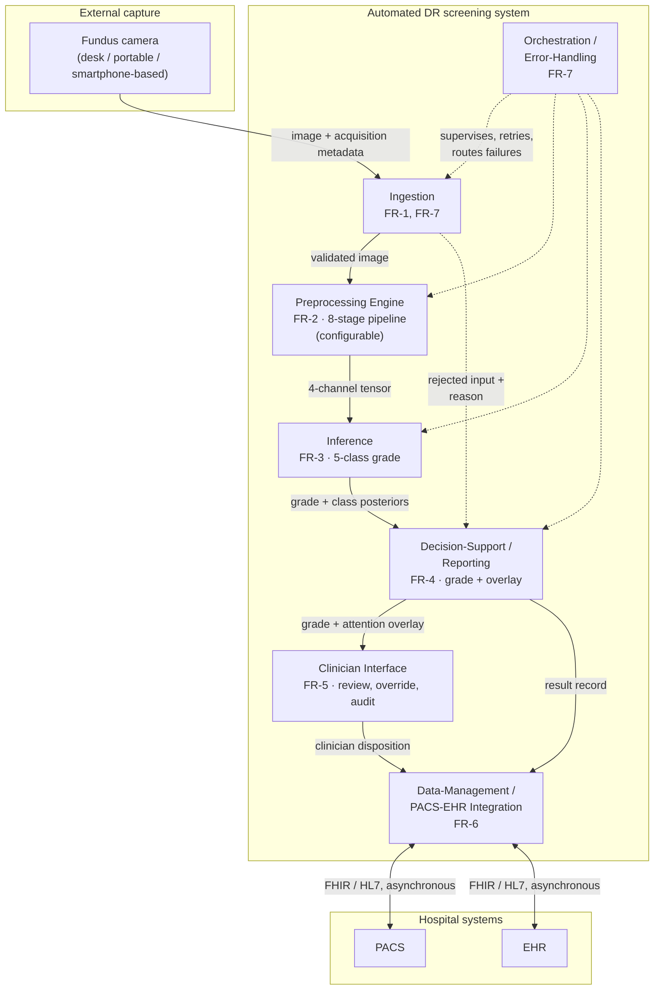
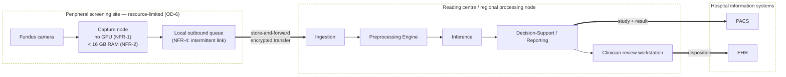
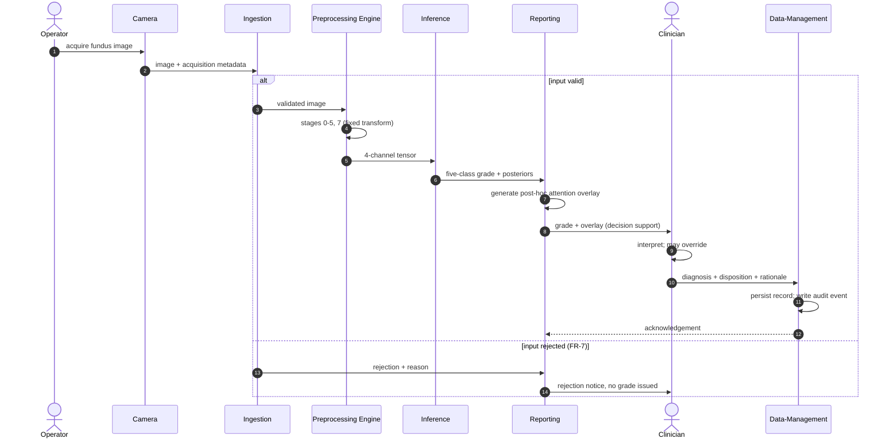
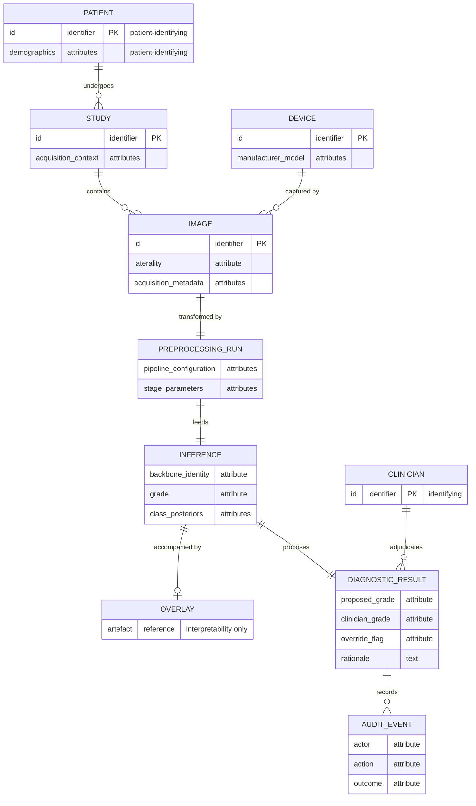

# Көз түбі кескінін жақсарту және CNN жіктеуі арқылы диабеттік ретинопатияны автоматтандырылған диагностикалау

> **Аралық қазақ тіліндегі жинақ — 2026-08-12.** Бекітілген аудармалардың 1-БӨЛІК мәтіндерін Мазмұн ретімен біріктіру. Жұмыстық автор-жыл дәйексөздері түрлендірілмеген (GOST `[N]` — түпкі жинақтаудағы жалғыз шегерілген өту). Аудармашы ескертулері, аударма тақырыпшалары мен тексеру тізімдері қосылмаған. Бұл — түпкі түптелген диссертация ЕМЕС: төмендегі манифест қай тараулардың аудармасы бар екенін көрсетеді.


---

# НОРМАТИВТІК СІЛТЕМЕЛЕР

Бұл диссертацияда келесі стандарттарға сілтемелер пайдаланылды:

Диссертация мен авторефератты ресімдеу жөніндегі нұсқаулық, Қазақстан Республикасы Білім және ғылым министрлігінің Жоғары аттестаттау комитеті, 2004 жылғы 28 қыркүйектегі № 377-3 ж.

ГОСТ 7.32-2001. Ғылыми-зерттеу жұмысы туралы есеп. Құрылымы және ресімдеу ережелері.

ГОСТ 7.1-2003. Библиографиялық жазба. Библиографиялық сипаттама. Жалпы талаптар мен жасау ережелері.

СТ ҚР 34.005-2002. Ақпараттық технология. Негізгі терминдер мен анықтамалар (бірінші басылым).

СТ ҚР 34.015-2002. Ақпараттық технология. Автоматтандырылған жүйелер стандарттарының жиынтығы. Ақпараттық жүйені құруға арналған техникалық тапсырма (бірінші басылым).

СТ ҚР 34.027-2006. Ақпараттық технологиялар. Бағдарламалық құралдарды жіктеу (бірінші басылым).

СТ ҚР 34.014-2002. Ақпараттық технология. Автоматтандырылған жүйелер стандарттарының жиынтығы. Автоматтандырылған жүйелер. Терминдер мен анықтамалар.


---

# АНЫҚТАМАЛАР

**Архитектуралық күрделілік (Architectural complexity)** — CNN сыйымдылығы, конволюциялық қабаттар саны, оқытылатын параметрлердің жалпы саны, сүзгі өлшемдерінің ауқымы және регуляризация компоненттерінің (batch normalization, dropout) болуы немесе болмауы арқылы анықталады.

**Baseline (базалық тармақ)** — Эксперимент 1-дің анықтамалық конфигурациясы: 512×512-ге дейін созып-масштабтау, одан кейін ImageNet нормализациясы; FOV маскасы мен preprocessing кезеңдерінсіз 3 арналы тензор шығарады, магистраль ImageNet-тен инициализацияланады.

**CLAHE (Contrast-Limited Adaptive Histogram Equalization)** — контрастты күшейтуді шектейтін шектік мәнмен жергілікті кескін плиткалары бойынша жұмыс істейтін адаптивті контрастты күшейту әдісі; конвейерде LAB L-арнасына қос шектеулі шектік мәнмен қолданылады (5-кезең).

**Композиттік тәуелсіз айнымалы (Composite independent variable)** — Эксперимент 1-дің (H-1) біріктірілген басқарылатын факторы, мұнда толық конвейер тармағы baseline-нан preprocessing өсі (сегіз кезеңді конвейер vs. созып-масштабтау + ImageNet) және pretraining өсі (офтальмологияға бейімделген SSL vs. ImageNet) бойынша бірге ерекшеленеді.

**Convolutional Neural Network (CNN)** — белгілерді шығаруға арналған конволюциялық және pooling қабаттарынан және жіктеуге арналған толық байланысқан қабаттардан тұратын нейрондық архитектура; алдын ала өңделген fundus кескіндерінде бес класты DR градациясын жасайтын жіктеу магистралі.

**Cross-Validation** — 5 еселі, пациент деңгейінде стратификацияланған бөлуді пайдаланатын валидация стратегиясы; әр итерацияда төрт фолд оқыту, бір фолд тест ретінде қолданылады, бір пациенттің кескіндері екі бөлімде де болмайды; метрикалар орташа ± стандартты ауытқу түрінде беріледі.

**Data Augmentation** — оқыту деректерінің вариабельділігін арттыру және жалпылауды жақсарту үшін қолданылатын кескін түрлендірулері (біртұтас аффинді, ColorJitter [жарықтылық/контраст/қанығу/реңк], Гаусс шуы, JPEG компрессия); конвейердің тек оқытуға арналған 6-кезеңі.

**Деректер жиынтығына тән нормализация (Dataset-specific normalization)** — ImageNet статистикасының орнына негізгі деректер жиынтығының оқыту бөлігінен есептелген орташа мән мен стандартты ауытқуды пайдаланатын арна бойынша нормализация (7-кезең); толық конвейердің нормализациясы.

**Диабеттік ретинопатия (Diabetic Retinopathy, DR)** — қант диабетінің микротамырлық асқынуы және алдын алуға болатын көру қабілетінен айырылудың жетекші себебі; бес ауырлық сатысында градацияланады (0 — жоқ, 1 — жеңіл, 2 — орташа, 3 — ауыр, 4 — пролиферативті).

**Диагностикалық тиімділік (Diagnostic effectiveness)** — тест бөлімінде есептелген төрт негізгі метрика (accuracy, weighted F1-score, ROC-AUC және квадраттық салмақты Cohen's Kappa) бойынша бірлескен өнімділік профилі.

**Domain Shift** — бейнелеу жабдығының, пациенттер популяциясының немесе алу хаттамаларының айырмашылықтарынан туындайтын оқыту деректері мен мақсатты деректер арасындағы таралымдық айырмашылық.

**FOV маскасы (Field-of-View mask)** — 3-кезеңде жасалатын және 4-арна ретінде қосылатын бинарлық кеңістіктік маска (1.0 = нақты fundus деректері, 0.0 = нөлдік толтыру), CNN-ге нақты ретинальды пиксельдерді толтырылған фоннан ажыратуға мүмкіндік береді.

**Flat-Field Correction (адаптивті)** — FOV маскасы ішінде біркелкі емес жарықтандыруды қалыпқа келтіретін, жергілікті контрастты сақтайтын адаптивті σ = 0.07·D (D = FOV диаметрі) бар Гаусс бұлыңғырлауын азайту; конвейердің 4-кезеңі.

**Fundus кескіні (Fundus image)** — фундоскопия арқылы алынған ретинальды фотосурет; диссертацияның жалғыз бейнелеу модальділігі және preprocessing конвейері мен CNN жіктеуішінің кірісі.

**Жалпылау (cross-database)** — сол бір оқытылған модельмен қайта оқытусыз екінші деректер жиынтығындағы тест F1-score-дың негізгі деректер жиынтығындағы тест F1-score-ға қатынасы; жалпылау коэффициенті G = F1_external / F1_EyePACS.

**Grad-CAM (Gradient-weighted Class Activation Mapping)** — соңғы конволюциялық белгілер карталарының градиентпен өлшенген комбинациясынан класс-дискриминативті локализация карталарын жасайтын explainability әдісі; патологияны клиникалық локализациялау емес, интерпретация құралы.

**Кескін сапасы (Image quality)** — fundus кескінінің DR градациясына қатысты микротамырлық белгілерді автоматты түрде анықтауды қолдаудың өлшенетін қабілеті; субъективті визуалды баға арқылы емес, төмен ағындағы жіктеу өнімділігі арқылы бағаланады.

**Интеграцияланған конвейер үстемдігі (H-1)** — біріктірілген толық конвейер конфигурациясы baseline-нан біртұтас жүйе ретінде асып түседі деген негізгі гипотеза; эмпирикалық үстемдік критерийі (weighted F1 ≥ 5 пп өсу, ROC-AUC ≥ 0.02 өсу, Kappa нашарламауы) орындалғанда валидацияланады.

**Офтальмологияға бейімделген өзін-өзі бақылаусыз алдын ала оқыту** — CNN магистралін белгіленбеген ретинальды fundus корпусында (DR белгілерінсіз) өзін-өзі бақылаусыз алдын ала оқыту; толық конвейер тармағының инициализациясы ретінде қолданылады, 4-арналы конвейер тензорында fundus-домен репрезентацияларын үйренеді.

**Physician-in-the-Loop** — дәрігер AI шығысын тек тұтынушы ретінде емес, нәтижелерді интерпретациялайтын және жүйені баптайтын «баптаушы» әрі аудитор ретінде әрекет ететін жобалау парадигмасы; ұсынылған жүйе осы парадигма аясындағы шешім қабылдауды қолдау құралы.

**Preprocessing Pipeline (алдын ала өңдеу конвейері)** — CNN кірісіне дейін fundus кескіндеріне қолданылатын канондық сегіз кезеңді реттелген тізбек (0–7 кезеңдер); толық конвейер барлық сегіз кезеңді қолданып, 4-арналы тензор (RGB + FOV маскасы) шығарады.

**Ресурстары шектеулі орта (Resource-limited environment)** — келесілердің кемінде екеуімен сипатталатын орналастыру контексті: GPU үдетуінің болмауы; қолжетімді RAM 16 ГБ-тан төмен; пакеттік өңдеу уақытының шектеулері; үздіксіз бұлттық API-ге сенуге мүмкіндік бермейтін желілік байланыс.

**Transfer Learning** — алдын ала оқытылған желі салмақтарын fundus-кескін доменіне қайта пайдалану және бейімдеу; H-1 бойынша инициализация көзі тармаққа бағынады (baseline үшін ImageNet, толық конвейер үшін офтальмологияға бейімделген SSL).

**Weighted Loss Function** — класс теңсіздігін шешетін және бес класты DR градациясының реттік құрылымын пайдаланатын класс бойынша салмақтары бар кросс-энтропия шығын функциясы.


---

# БЕЛГІЛЕУЛЕР МЕН ҚЫСҚАРТУЛАР

| AI | Artificial Intelligence (жасанды интеллект) |
| ALO | Attention–Lesion Overlap (explainability метрикасы) |
| APTOS | Asia Pacific Tele-Ophthalmology Society (2019 Blindness Detection деректер жиынтығы) |
| AUC | Area Under the Curve (қисық астындағы аудан) |
| BYOL | Bootstrap Your Own Latent (өзін-өзі бақылаусыз оқыту әдісі) |
| CAM | Class Activation Mapping |
| CLAHE | Contrast-Limited Adaptive Histogram Equalization |
| CNN | Convolutional Neural Network |
| CNR | Contrast-to-Noise Ratio |
| DDR | Диабеттік ретинопатияны градациялау деректер жиынтығы (DDR) |
| DINO | self-Distillation with No labels (өзін-өзі бақылаусыз оқыту әдісі) |
| DR | Diabetic Retinopathy (диабеттік ретинопатия) |
| ECE | Expected Calibration Error |
| EHR | Electronic Health Record (электрондық денсаулық жазбасы) |
| EMD | Earth Mover's Distance |
| EyePACS | Eye Picture Archive Communication System (DR деректер жиынтығы) |
| FOV | Field of View (көру өрісі) |
| GDPR | General Data Protection Regulation |
| Grad-CAM | Gradient-weighted Class Activation Mapping |
| HIPAA | Health Insurance Portability and Accountability Act |
| IDRiD | Indian Diabetic Retinopathy Image Dataset |
| IoU | Intersection over Union |
| KL | Kullback–Leibler дивергенциясы |
| LAB | CIELAB түс кеңістігі |
| MLP | Multilayer Perceptron |
| MoCo | Momentum Contrast (өзін-өзі бақылаусыз оқыту әдісі) |
| NPV | Negative Predictive Value (теріс болжамдық мән) |
| OD | Optic Disc (көру дискісі) |
| ODIR-5K | Ocular Disease Intelligent Recognition деректер жиынтығы (5000 пациент) |
| PACS | Picture Archiving and Communication System |
| PPV | Positive Predictive Value (оң болжамдық мән) |
| ReLU | Rectified Linear Unit |
| RFMiD | Retinal Fundus Multi-disease Image Dataset |
| RIQA | Retinal Image Quality Assessment |
| ROC | Receiver Operating Characteristic |
| SimCLR | Simple framework for Contrastive Learning of Representations |
| SSIM | Structural Similarity Index |
| SSL | Self-Supervised Learning (өзін-өзі бақылаусыз оқыту) |
| STARE | Structured Analysis of the Retina (деректер жиынтығы) |
| UML | Unified Modeling Language |
| VRAM | Video Random-Access Memory |
| VVI | Vessel Visibility Index |
| WSL | Windows Subsystem for Linux |
| XAI | Explainable Artificial Intelligence |
| D | Көру өрісінің (FOV) диаметрі, пиксельмен |
| CL | CLAHE түрлендіруінің клип-лимиті |
| F1 | F1-score (precision және recall гармоникалық орташасы) |
| G | Жалпылау коэффициенті, G = F1_external / F1_EyePACS |
| T | Қос шектеулі CLAHE-нің ғаламдық шектік мәні (T/80 формуляциясы) |
| α | Focal Loss класс салмағы параметрі (кері жиілік) |
| γ | Focal Loss фокустау параметрі (γ = 2) |
| κ | Квадраттық салмақтары бар Cohen's Kappa |
| σ | Flat-field correction-дегі Гаусс ядросының стандартты ауытқуы, σ = 0.07·D |
| ΔF1 | Деректер жиынтығы аралық F1 төмендеуі, ΔF1 = F1_EyePACS − F1_external |


---

# КІРІСПЕ

# §0.1 Зерттеу тақырыбының өзектілігі

Диабеттік ретинопатия — қант диабетінің микротамырлық асқынуы әрі жұмысқа қабілетті жастағы ересектер арасындағы алдын алуға болатын көру қабілетінен айырылудың жетекші себептерінің бірі. Оның клиникалық маңызы алғаш келгендегі ауырлығынан гөрі табиғи ағымынан шығады: микроаневризмалар мен ұсақ торқабықішілік қан құйылулар көру өткірлігіне еш әсер етпей пайда болатын ең ерте сатылар — симптомсыз (Kesharwani және әріптестері, 2021, 699-б.). Демек пациентте араласу ең тиімді әрі ең аз инвазивті болатын нақ сол аралықта көмекке жүгінуге еш себеп болмайды. Сондықтан анықтау пациенттің өзі келуіне тәуелді бола алмайды; ол көз шағымымен емес, жүйелі диагнозбен айқындалған популяцияны жоспарлы бейнелеуге тәуелді. Бұл мамандандырылған офтальмологияның әдеттегі арифметикасын аударып тастайды. Міндет — келген пациенттерді қарау емес, диабет таралуымен бірге өсетін когортты қарау, ал олардың көбінде емдеуді талап ететін ештеңе табылмайды. Диабеттік ретинопатияны скрининг — диагностикалық мәселе болғанға дейін, көлем мәселесі.

Қуат шектеуін міндетті ететін нәрсе — көлем. Көз түбі фотосуреттерін қолмен дәрежелеу маман уақытына сызықты масштабталады, ал маман уақыты шектеулі әрі географиялық тұрғыдан шоғырланған. Кандидаттың алдыңғы жұмысы, жобалық үлесі осы диссертацияның 6-тарауында өрбітілетін ақпараттық-жүйе архитектурасы зерттеуі, Қазақстан контексі үшін бұл шектеуді сипаттады: бүкіл ел халқына шамамен 1 200 офтальмолог қызмет етеді, тұрғындардың шамамен 40 %-ы ауылдық жерде тұрады, ал ауыл тұрғындарының мамандандырылған көз көмегіне қолжетімділігі едәуір шектеулі (Yesmukhamedov және әріптестері, 2025, 77, 87-б.). Бұл көрсеткіштер осы зерттеу шығарған өлшемдер ретінде емес, сол алдыңғы жарияланымда хабарланған контекстік шеңбер ретінде келтіріледі. Олардың аналитикалық күші риторикалық емес, арифметикалық: дәрежелеушілер саны бекітілген әрі шоғырланған, ал скрининг популяциясы үлкен әрі шашыраңқы болғанда, қамтуды маман құрамын кеңейту арқылы ұлғайту жақын мерзімде мүмкін нұсқа болмайды. Міндетті сұрақ дәрежелеу қадамының өзін ішінара автоматтандыруға бола ма дегенге ауысады. Сол бір алдыңғы жарияланым Қазақстан үшін орналастыру нәтижелерін де болжаған — ауыл қолжетімділігінің жақсаруы, кеш сатыдағы асқынулардың азаюы, шығынның төмендеуі. Бұл болжамдар — шеңбер үшін келтірілген үшінші тарап бағалаулары; олар осы диссертацияның нәтижелері емес, ондағы ешбір тұжырымның дәлелі емес, әрі одан кейінгі дәйектің ешбір бөлігі оларға тәуелді емес.

Мұндай автоматтандырудың техникалық жүзеге асатыны он жыл бұрын орнықтырылған. Gulshan және әріптестері (2016) — конволюциялық-нейрондық-желіге негізделген диабеттік ретинопатия скринингі дәуірін ашқан бетбұрысты зерттеу, ал одан кейінгі жүйелердің қатарында проспективті бағаланған әрі нормативтік рұқсат алған өнімдер де бар. Демек қазіргі жұмыстың өзектілігі автоматтандырылған скринингтің әлі көрсетілмегені туралы тұжырымға сүйене алмайды, өйткені ол көрсетілген. Ол оның орнына көрсетілімдер алынған шарттарға сүйенеді. Бұл әдебиеттегі хабарланған өнімділіктің беріктігі біркелкі емес екені көрсетілген: саланың жүйелі шолуы қайталанып отыратын артық үйренуді, шешілмеген класс теңгерімсіздігін әрі скрининг құндылығы тәуелді болатын нақ сол ерте дәрежелердің әлсіз анықталуын атап көрсетеді (Senapati және әріптестері, 2024), ал жария деректегі тәуелсіз қайта жаңғырту талпынысы бастапқыда хабарланған жұмыс сипаттамаларын қалпына келтіре алмады. Сонымен қатар кескіндердің өзі тұрақты субстрат емес. Әртүрлі камералармен, дайындығы әртүрлі операторлармен, кеңеюі әртүрлі қарашық арқылы әрі әртүрлі жарықтандыруда алынған көз түбі фотосуреттері контраст, түс балансы, жарықтандыру біркелкілігі және шу бойынша жүйелі түрде ерекшеленеді, ал бұл вариативтілік тікелей өлшенген әрі арнайы сапа-бағалау модельдерін қажет ететіндей ауқымды екені көрсетілген (Fu және әріптестері, 2020; Zago және әріптестері, 2018). Скрининг қуаты ең тапшы жерде алу шарттары ең аз бақыланады — демек қажеттілігі ең үлкен орталар — кескіндері көрсетілімдер орындалған кескіндерге ең аз ұқсайтын орталар.

Әдістемелік сұрақ осы жерден туындайды, әрі ол қандай да бір нақты модельдің қаншалықты жақсы жұмыс істейтіні туралы емес, мұндай модельдердің қалай сипатталатыны туралы сұрақ. Екі парадигманы ажыратуға болады. **P1**, end-to-end конволюциялық парадигма астында, preprocessing әдістемелік талқылауды талап етпейтін қосалқы дерек дайындау ретінде қаралады, өйткені жеткілікті терең желі мен жеткілікті ауқымды дерек тиісті инварианттарды өңделмеген немесе ең аз нормаланған пикселдерден үйренеді деп жорамалданады; осы диссертацияда Gulshan және әріптестері (2016) сол парадигманың канондық өкілі ретінде алынады — олардың бақыланатын әдістемелік практикасы негізінде, әрі авторларға телінген қандай да бір теориялық мәлімдеме негізінде емес. **P2**, мұнда алға тартылатын біріктірілген preprocessing-CNN парадигмасы астында, preprocessing модельдің өзінің интегралды компоненті, өйткені бірінші конволюцияға дейін қолданылатын түрлендіру желі жұмыс істеуге мәжбүр болатын белгілер кеңістігін айқындайды әрі сол арқылы оның жалпы нені үйрене алатынын бірге айқындайды. Бұл айырма терминологиялық емес. Егер P2 дұрыс болса, онда preprocessing-і көрсетілмей хабарланған модель — толық емес хабарланған модель, ал мұндай модельдерді салыстыру — ішінара белгісіз жүйелерді салыстыру. P2-ні артық көрудің негіздері әрі парадигмалық оқуды негіздейтін практиканы талдау §1.4-те өрбітіледі; қазіргі бөлім екеуінің арасындағы таңдаудың ашық әрі салдарлы екенін ғана тіркейді.

Сұрақты жай ғана даулы емес, дәл қазір жауап берілетін ететін нәрсе — қолжетімді дәлел базасының жай-күйі. Қазір құжатталған камера шығу тегі, тәуелсіз дәрежелеу хаттамалары, ал бір жағдайда пиксел деңгейіндегі зақымдану аннотациясы бар жария көз түбі корпустары бар, әрі олар бірнеше елді және алу режимін қамтиды. Олардың бірлескен қолжетімділігі екі парадигманы бақыланатын қарама-қарсылыққа қоюға мүмкіндік береді — сол бір архитектуралар, сол бір оқыту бюджеті, сол бір бөлулер, тек кескіндерді дайындауымен ерекшеленетін — әрі алынған айырманы жиынтық дәлдікте ғана емес, модельдің қай жерге назар аударатынында, оның еш көрмеген корпустарында қалай мінез танытатынында және камера аппараты бойынша қалай мінез танытатынында қарастыруға мүмкіндік береді. Орналастыру қабығын да жорамалдамай, көрсетуге болады: осы жұмыста ресурсы шектеулі орта нақты шарттармен айқындалады — inference кезінде GPU үдетуінің болмауы, 16 ГБ-тан төмен жады, нақты уақытқа жуық өткізу қабілетіне қойылатын талаптар, үздіксіз бұлтқа сүйенуге жеткіліксіз байланыс — сонда салыстыру зертханалық шарттарда жүргізіліп, кейін экстраполяцияланбай, скрининг тапшы жерде шын мәнінде орын алатын шектеулерде жүргізіледі.

Бір шекара басынан қойылады әрі бүкіл жұмыста күшінде қалады. Мұнда дәйектелетін өзектілік — диагностикалық модельдердің қалай сипатталатыны мен бағаланатыны туралы әдістемелік сұрақтың өзектілігі; бұл осы диссертацияда сипатталған жүйенің клиникалық қолданысқа дайын екені туралы тұжырым емес, әрі мұндай тұжырым жұмыста еш жерде жасалмайды. Жүйе дәрігер шығысты түсіндіретін, диагнозды және ол үшін жауапкершілікті сақтайтын physician-in-the-loop парадигмасы аясындағы шешім қолдауы ретінде ойластырылған. Кейінгі тараулардың ешқайсысы клиникалық жарамдылықты, нормативтік сәйкестікті немесе орналастыруға дайындықты орнықтырмайды, әрі қорытынды тараулар мұны айқын мәлімдейді.

# §0.3 Зерттеу мақсаты

Осы зерттеудің мақсаты — диабеттік ретинопатияны автоматтандырылған бес класты диагностикалау үшін көз түбі кескінін жақсарту мен конволюциялық-нейрондық-желілік жіктеудің біріктірілген шеңберін әзірлеу және эксперименттік валидациялау, онда сегіз кезеңді preprocessing pipeline — canonical flip, көру дискісі–фовеа айналуын нормалау, изотропты resize және ортаға нөлмен толтыру арқылы көру өрісін қию, төртінші кіріс арнасы ретінде көру-өрісі маскасын генерациялау, адаптивті flat-field жарықтандыру түзетуі, LAB түс кеңістігіндегі dual-constraint стохастикалық CLAHE, оқыту уақытындағы augmentation және деректер жиынтығына тән арна-бойынша нормализация — деректі дайындау ретінде емес, модельдің интегралды компоненті ретінде көрсетіледі, әрі сол pipeline-сіз оқытылған балама конфигурацияға қарсы бақыланатын қарама-қарсылық астында бұл сипаттаманың диагностикалық өнімділікке, тасымалданушылыққа және алынған модельдің шектеулі есептеу шарттарындағы интерпретациялануына қандай айырма енгізетінін орнықтыру.

Сол мәлімдеменің үш тармағы бас сөйлем өз бетінше айқындай алмайтын міндеттемелерді алып жүреді.

Біріншісі — *біріктірілген* деген сөз жұмысты неге міндеттейтініне қатысты. Егер preprocessing модель сипаттамасына жататын болса, онда бағалау бірлігі — желі емес, конфигурация, ал салыстыру манипуляцияланатын фактордан тыс нәрсенің бәрі бекітілген болғанда ғана ақпаратты: сол бір корпус, сол бір пациент деңгейлі бөлу, сол бір оқыту бюджеті, сол бір аппарат, сол бір бағалау хаттамасы. Сәйкесінше мақсат — қол жеткізуге болатын ең жақсы жіктеушіні алу емес, ал ол әр компонентті бір мезгілде шектеусіз баптауға рұқсат берер еді, — мақсат атрибуция мүмкін болатын шарттарда манипуляцияға телінетін айырманы алу. Салыстырылатын конфигурациялар бірден көп жағынан ерекшеленетін жерде мақсат — мұны айту әрі тұжырымды оның кез келген жеке бөлігіне емес, тұтас конфигурацияға шектеу.

Екіншісі — валидацияның ауқымына қатысты. Оқыту корпусындағы жиынтық дәлдіктегі айырманы орнықтыру мақсаттың ең әлсіз формасы болар еді, әрі мұнда қабылданған форма ол емес. Валидация бес бағытта жүргізіледі: pipeline-ді құрамдас кезеңдерге ыдыратумен бірге домен-ішілік қарама-қарсылық; желінің белгілер кеңістігінде көз домені мен әр сыртқы домен арасындағы қашықтықты тікелей өлшеу, сонда дәйек постулаттайтын механизм өз салдарларынан қорытылмай, өлшенеді; қайта оқытусыз тәуелсіз корпустарға тасымалдауды бағалау; модель назары мен сарапшы зақымдану аннотациясы арасындағы тураланымды салыстыру; әрі сыртқы клиникалық корпустардағы, камера топтастырулары бойынша және деректері тапшы оқыту режиміндегі мінез-құлықты бағалау. Бұлар — күтілетін нәтижелер емес, зерттеу бағыттары; әрқайсысының алдын ала көрсетілген критерийі бар, әрі әрқайсысы сәтсіз аяқтала алатын еді.

Үшіншісі — осының бәрі орындалуға тиіс шарттарға қатысты. Шеңбер inference кезінде GPU үдетуінің болмауымен, шектеулі жадымен, нақты уақытқа жуық өткізу қабілетіне қойылатын талаптармен немесе қашықтағы қызметтерге үздіксіз сүйенуге жеткіліксіз байланыспен сипатталатын орналастыру контекстері үшін әзірленеді. Бұл қабық мақсатты кейін ескертпемен шектемей, оны бастапқыда шектейді: архитектуралар, кіріс ажыратымдылығы, batch size және preprocessing-тің өзінің есептеу құны — бәрі сонымен шектелген.

Бұл мақсатқа жету осы кластағы диагностикалық модельдердің қалай сипатталатыны мен салыстырылатыны туралы әдістемелік нәтижені орнықтырар еді. Ол клиникалық жарамдылықты, нормативтік сәйкестікті немесе бақылаусыз орналастыруға дайындықты орнықтырмас еді, әрі жұмыстың ешбір бөлігі сол міндеттерге бағытталмаған.

# §0.4 Зерттеу міндеттері

Төмендегі міндеттер алдыңғы бөлімде мәлімделген мақсатты ыдыратады. Әрқайсысы өзі орындалатын тарауға сәйкестендірілген, әрі сәйкестік айқын берілген, өйткені дәл сол оқырманға диссертацияның өзі қолға алған істі істеп-істемегенін тексеруге мүмкіндік береді.

**1. Проблемалық саланы талдау және зерттеу проблемасын тұжырымдау (1-тарау).** Диабеттік ретинопатияның патофизиологиясы мен клиникалық дәрежеленуін және ресурсы шектеулі орталардың скрининг талаптарын қарастыру; көз түбі кескіні сапасының төмендеу көздерін және сол вариативтіліктің құрылғыға тән құрамдасын сипаттау; медициналық бейнелеуге арналған конволюциялық архитектураларды, офтальмологиялық диагностикадағы transfer және домен-ішілік алдын ала оқытуды, әрі түсіндірілу әдістерін шолу; қолданыстағы автоматтандырылған скрининг жүйелерін және олардың кескін дайындауды қарастыратын әдістемелік практикасын сыни талдау; әрі сол негізде зерттеу проблемасын тұжырымдап, таңдалған бағытты негіздеу.

**2. Теориялық негіздерді орнықтыру (2-тарау).** Гистограмманы теңестіру мен адаптивті контрастты күшейтуді, әсіресе CLAHE-нің dual-constraint клип-шек формуляциясын формальдау; кеңістіктік сүзгілеу мен шуды азайтуды алгоритмдік аялық ретінде баяндау; конволюция, pooling және feature extraction теориясын, теңгерімсіз медициналық дерек үшін loss функцияларының теориясын әрі регуляризация теориясын орнықтыру; визуалды домендер арасындағы белгі тасымалданушылығын, fine-tuning стратегияларын және торқабық бейнелеуі үшін домен-ішілік өзін-өзі бақылайтын алдын ала оқытуды қарастыру; көз түбі тінінің жауабының байланысқан жылулық-оптикалық моделін өрбіту, ал ол тек теориялық және есептеу үлесі болып табылады әрі клиникалық валидацияланған модель ретінде ұсынылмайды; әрі түсіндірілу формализмін — класс активациясын карталау мен Grad-CAM-ды, біріншілік метрика ретінде Назар–зақымдану қабаттасуымен және қосалқы метрика ретінде IoU-мен — preprocessing-ті сипаттауға пайдаланылатын кескін-сапасы метрикаларымен бірге айқындау.

**3. Әдістемені жобалау және формальдау (3-тарау).** Сегіз кезеңді preprocessing pipeline-ді кезең-бойынша, жетілдірілген dual-constraint CLAHE мен augmentation стратегиясын қоса көрсету, әрі сырттан алынған кескіндер үшін қабылдау хаттамасын айқындау; жіктеу архитектураларын және олардың бес класты шығысқа бейімделуін көрсету; инициализация мен fine-tuning хаттамасын және салмақталған loss формуляциясын айқындау; әрі кейінгі әр нәтиже бағаланатын көп-метрикалы бағалау шеңберін cross-validation және статистикалық сенімділік хаттамаларымен бірге айқындау.

**4. Эксперименттік бағдарламаны жүргізу (4-тарау).** Ортақ субстратта әрі сәйкестендірілген шарттарда сегіз зерттеуді бағалау: екі архитектура бойынша біріктірілген және baseline конфигурациялары арасындағы 2×2 факториалды қарама-қарсылық (H-1); CLAHE мен flat-field параметрлерін сканерлеумен бірге кумулятивті кезеңдік абляция (H-2); желінің белгілер кеңістігінде көз домені мен алты сыртқы доменнің әрқайсысы арасындағы қашықтықты тікелей өлшеу (H-3); тәуелсіз жария корпусқа нөл-шот тасымалдау (H-4); модель назары мен сарапшының пиксел деңгейіндегі зақымдану аннотациясы арасындағы тураланым (H-5); екі сыртқы клиникалық корпустағы өнімділік (5-эксперимент, H-7); бес камера топтастыруы бойынша мінез-құлық (6-эксперимент, H-6); әрі тәуелсіз клиникалық корпус ұсталып қалған, деректері тапшы режимде оқыту. Әр зерттеу конфигурацияларды салыстырады, олардың қандай да бір жеке компонентін оқшауламайды.

**5. Нәтижелердің сенімділігін валидациялау (5-тарау).** Эксперименттік тұжырымдарды интервалдық бағалауға және еселік салыстыруларға түзетуі бар fold-аралық модельдеуге ұшырату; әр негізгі тұжырымды оның алдын ала көрсетілген критерийі қолдайтын күште жіктеу; жұмысты жарияланған жүйелермен қатар қою, бірақ олардың арасында дәрежелемей, әрі өнімділік пен есептеу құны арасындағы қатынасты сипаттау; әрі тәсілдің шектеулері мен шекаралық шарттарын толық мәлімдеу.

**6. Ресурсы шектеулі орталарға арналған скрининг-жүйе архитектурасын жобалау (6-тарау).** Орналастыру қабығынан функционалдық және функционалдық емес талаптарды шығару; preprocessing, inference, телемедицина және physician-in-the-loop шешім-қолдау компоненттері бар, клиникалық ақпараттық жүйелермен біріктірілуге келетін модульдік архитектураны көрсету; әрі оның деректі қорғау мен нормативтік шеңберін мәлімдеу — бәрі бойы жоба сипаттамасы ретінде, өйткені ешбір прототип іске асырылмаған әрі ешбір дала сынағы жүргізілмеген.

Сәйкестік екі бағытта да сарқылған болуға арналған: мақсаттың әр тармағы осы міндеттердің бірімен орындалады, ал әр міндет мақсаттың бір тармағына жауап береді, оның қасында тұрмайды. Төртінші міндетті жай ғана сипаттаушы емес, жалғандауға болатын ететін нәрсе — келесі мәлімделетін гипотезалар жиыны, олардың әрқайсысы тиісті эксперименттен бұрын бекітілген критериймен.

# §0.5 Зерттеу нысаны мен пәні

**Зерттеу нысаны.** Осы зерттеудің нысаны — конволюциялық нейрондық желілер арқылы түсті көз түбі фотосуреттерінен диабеттік ретинопатияны автоматтандырылған көп кезеңді диагностикалау үдерісі. Үдеріс тек жіктеу қадамында емес, тұтастай — кескін камерадан шыққан сәттен бастап модель тағайындайтын бес класты дәрежеге дейін — зерттеледі. Оның материалы — төрт өндірушінің камераларымен алынған әрі бірнеше тәуелсіз хаттама бойынша дәрежеленген сегіз жария және клиникалық көз түбі деректер жиынтығынан тұратын деңгейленген корпус; сол корпус — үдеріс бақыланатын материал, әрі оның өзі нысан емес.

**Зерттеу пәні.** Осы зерттеудің пәні — көз түбі кескінін preprocessing-тің конволюциялық жіктеумен біріктірілу әдістері мен модельдерінің жиынтығы, әрі алынған біріктірілген конфигурация көрсететін қасиеттер: оның бес класты дәрежелеудегі диагностикалық өнімділігі, оқыту кезінде көрілмеген корпустарға тасымалданушылығы, назары мен сарапшы аннотациялаған патология арасындағы тураланымы және камера домендері бойынша мінез-құлқы. Демек пән — осы жұмыс өзі зерттейтін нысанның ішінде манипуляциялайтын нәрсе. Манипуляцияланатыны — біріктіру, әрі ол қоректендіретін желіден бөлек қаралған preprocessing емес; бұл айырма preprocessing-ті модельдің компоненті ретінде қараудан шығады әрі байқалған кез келген айырманы қаншалық телуге болатынын басқарады.

Нысан мен пән бірге шектелген. Екеуі де түсті көз түбі фотографиясымен, диабеттік ретинопатияны бес класты клиникалық дәрежелеумен әрі эксперименттік жобада аталған корпустар мен архитектуралармен шектелген. Көз түбі фотографиясынан өзге бейнелеу модальділіктері, диабеттік ретинопатиядан өзге офтальмологиялық жағдайлар және деректер жиынтығы архитектурасында ұсынылмаған алу контекстері нысаннан тыс жатыр, әрі мұнда алынған ешбір нәтиже оларға таралмайды.

# §0.6 Зерттеу гипотезасы

Осы зерттеудің орталық гипотезасы — ұсынылатын preprocessing pipeline көз түбі бейнелеу құрылғылары мен алу шарттары бойынша домен вариативтілігін диагностикалық тұрғыдан маңызды торқабық белгілерін сақтай отырып азайтады, әрі сол азаю диабеттік ретинопатияны конволюциялық-нейрондық-желімен анықтаудың жақсаруына әкеледі. Демек гипотеза — екі буынды себептік тұжырым: кескіндер үлестірімінің өзгеруі және сол өзгерістің жіктеу үшін салдары. Төмендегі жеті гипотеза — оның ыдыратулары. Олардың алтауы екінші буынды әртүрлі режимде және әртүрлі корпуста тексереді; H-3 **бірінші** буынды тікелей тексереді — қалған алтауы тек өз салдары арқылы ғана жақындай алатын үлестірімдік қашықтықты өлшеу арқылы. Әр гипотеза өзін бағалайтын эксперименттен бұрын бекітілген қабылдау критерийін алып жүреді, әрі әрқайсысы өзі оқылуға тиіс шекараны алып жүреді.

**H-1 — Біріктірілген pipeline басымдығы.** Егер көз түбі кескіндері сегіз кезеңді pipeline арқылы өңделсе әрі домен-ішілік алдын ала оқытылған салмақтардан инициализацияланған жіктеуші соларда fine-tuning жасалса, онда жіктеу өнімділігі baseline кескіндерде (ImageNet нормализациясымен stretch-resize, үш арна, көру-өрісі маскасыз) оқытылған әрі ImageNet салмақтарынан инициализацияланған сол бір архитектураның өнімділігінен асып түседі. Басымдық тек конъюнктивті критерий астында қабылданады: weighted F1 кемінде бес пайыздық тармаққа жоғары, **және** ROC-AUC кемінде 0.02-ге жоғары, **және** квадраттық салмақталған Cohen κ нашарламайды — үшеуі де бір мезгілде, ұсталынған бөлікте. Үшеуінің ішкі жиынындағы жақсару басымдықты құрамайды. Жеткілікті валидация қосымша түрде кемінде бір сыртқы корпуста әсердің сол бағытта болуын әрі факториалды жобаның екі архитектурасында да қайталануын талап етеді. H-1-дің тәуелсіз айнымалысы — **құрама**: екі арна preprocessing осі бойынша да, инициализация осі бойынша да бірге ерекшеленеді, сондықтан гипотеза бекітетіні — біртұтас жүйе ретіндегі біріктірілген *конфигурацияның* басымдығы. Байқалған кез келген айырманы тек preprocessing-ке, тек инициализацияға немесе олардың өзара әрекетіне телу H-1 астында бекітілмейді әрі осы диссертацияда еш жерде бекітілмейді.

**H-2 — Компонент үлесі мен параметр сезімталдығы.** Егер dual-constraint CLAHE-нің клип-шек параметрлері мен flat-field түзетуінің σ мәні бақыланатын ауқымдарда өзгертілсе, онда жіктеу өнімділігі тексерілген ауқымның **ішінде** кемінде бір анықталатын оптимумы бар, параметрге тәуелді сезімталдық бейінін көрсетеді; ал егер pipeline кезеңдері кумулятивті қосылса, әр қосылу өлшенетін үлес қосады. Гипотеза шын мәнінде тексерілген параметр ауқымдарымен шектелген, әрі олардан тыс экстраполяция жіберілмейді. Одан шығатын кез келген үлес иерархиясы тексерілген архитектуралар мен корпустармен шектелген әрі әмбебап оңтайлы preprocessing конфигурациясын анықтамайды.

**H-3 — Домен ығысуының азаюы.** Егер көз корпустан және әр сыртқы корпустан алынған кескіндер екі конфигурация астында да желінің соңғының алдындағы қабатымен ендірілсе, онда көз бен нысана белгілер үлестірімдері арасындағы қашықтық біріктірілген конфигурация астында кішірек болады. Әр корпус үшін Δd(X) = d(baseline, X) − d(біріктірілген, X), әрі корпус Δd(X) ≥ MCID_d = 0.0 болғанда және оның bootstrap сенімділік интервалының төменгі шекарасы нөлден жоғары болғанда өтеді; гипотеза n = 6 корпустың кемінде K = 5-і өткенде қабылданады. Соңғының алдындағы қабат белгілері бойынша максималды орташа алшақтық — біріншілік өлшем әрі критерийді жалғыз өзі алып жүреді; арна-бойынша қарқындылық гистограммалары бойынша дивергенция — қосалқы әрі ақпараттық. Бір хаттама шарты міндетті: деректер жиынтығына тән нормализация кезеңі көз-домен статистикасын пайдалануға тиіс әрі оны ешқашан нысанада қайта есептеуге болмайды, өйткені нысанаға сәйкестендірілген түрлендіру өлшемді доменге бейімделудің бір түріне айналдырар еді әрі оны H-4, H-6 және H-7-мен салыстыруға келмейтін етер еді. Үш мәселе ашық тіркеледі. Біріншіден, H-3 белгісі **қайта пайдаланылған**: ол бұрын алынып тасталған оқыту әдістерін салыстыруды білдіретін, әрі сол алып тастау күшінде қалады — осы диссертацияның басқа жеріндегі «H-3 алынып тасталды» деген орындар алынып тасталған гипотезаға қатысты, бұған емес. Екіншіден, MCID_d да, K да алдын ала тіркелмеген; екеуі де гипотеза формальданғанда тағайындалды. Оның маңызын екі факт шектейді: d — еркін бірліктердегі нормаланбаған қашықтық, сондықтан нөлден өзге ешбір минималды айырма интерпретацияланбас еді әрі корпус-бойынша шарт жалаң бағыттық маңыздылық тексерісіне айналады; әрі критерий K белгіленуі мүмкін болған ауқымда K-ға сезімтал емес. Үшіншіден, H-3 — механистік. Ол клиникалық нәтижеге емес, репрезентацияның қасиетіне қатысты, әрі ол диагностикалық өнімділік, құрылғы үйлесімділігі немесе клиникалық пайдалылық туралы ешбір тұжырымды қолдамайды.

**H-4 — Деректер жиынтығы аралық тасымалданушылық.** Егер көз корпуста толық pipeline-мен оқытылған модель тәуелсіз жария корпуста қайта оқытусыз бағаланса, онда жалпылау қатынасы G = F1_сыртқы / F1_көз кемінде 0.85 болады. Шектік — алдын ала тіркелген табыс критерийі, кепілдендірілген нәтиже емес; ешқандай түрдегі нысаналы-доменге бейімдеу орындалмайды.

**H-5 — Түсіндірілу.** Егер градиентпен салмақталған класс активациясы карталары екі конфигурация астында да есептелсе, онда активация аймақтары мен пиксел деңгейіндегі зақымдану аннотациясы арасындағы Назар–зақымдану қабаттасуы біріктірілген конфигурация астында жоғары болады, ал IoU қосалқы шарт ретінде алынады. Гипотеза қосымша түрде клиникалық корпустағы сапалық overlay-ларды да қарастырады. Оның шекарасы онымен бірге мәлімделеді: активация — интерпретациялау аспабы әрі патологияның клиникалық локализациясын құрамайды, сондықтан гипотеза орнықтыра алатыны — модель дәлелі мен сарапшы аннотациясы арасындағы тураланым, ешқашан зақымдануларды анықтау немесе шекаралау емес.

**H-6 — Құрылғыға беріктік.** Егер көз корпуста оқытылған модель әртүрлі көз түбі камераларымен алынған корпустарда бағаланса, онда жіктеу өнімділігі камера домендері бойынша сақталады, ал құрылғыаралық вариативтілік домен-ішілік өнімділікке қатысты көрсетілген шекаралар ішінде қалады. Тек диабеттік ретинопатия таңбалары пайдаланылады; басқа ауру таңбалары еленбейді немесе салыстырылады. Осы гипотеза астында алынған нәтижелер — құрылғыаралық вариативтіліктің эмпирикалық бақылаулары әрі олар құрылғы куәландыруын, нормативтік сәйкестікті немесе құрылғыға бейтарап орналастыруға дайындық тұжырымын құрамайды.

**H-7 — Сыртқы клиникалық өнімділік.** Егер көз корпуста оқытылған модель екі конфигурация астында да екі сыртқы клиникалық корпуста қайта оқытусыз бағаланса, онда **әр** корпуста біріктірілген конфигурация baseline-нікінен кемінде 0.050 минималды клиникалық маңызды айырмаға асып түсетін weighted F1-ге жетеді, әрі айырманың сенімділік интервалының төменгі шекарасы нөлден жоғары болады. Екі корпус **жиынтықталмайды**: кез келгеніндегі кері бұрылыс екіншісіне қарамастан гипотезаның кері бұрылуын береді. Қабылдау формасы айырманың минималды маңызды айырмаға жетуін әрі интервалдың төменгі шекарасының нөлден асуын талап етеді; ол төменгі шекараның өзінің сол айырмаға жетуін талап етпейді. H-7 **сыртқы клиникалық деректегі жоғарырақ абсолютті өнімділікті** бекітеді. Ол нашарлаудың азаюын, пропорционалды түсудің азаюын немесе домен ығысуына төзімділікті бекітпейді, әрі одан мұндай тұжырым шығарылмайды; гипотеза бұрын өрнектелген нашарлау шамасы алынып тасталған әрі 5-тарауда сипаттаушы контекст ретінде және кең қолданылатын метриканың сыны ретінде хабарланады.

Бұл критерийлер тиісті эксперименттер жүргізілмес бұрын бекітілді, әрі әр гипотеза өз шарттары бойынша сәтсіз аяқтала алатын еді. Әрқайсысы шын мәнінде нені қолдайтыны анықталғаны және қандай күште екені қорғауға ұсынылатын тұжырымдарда мәлімделеді әрі 4 және 5-тарауларда орнықтырылады. Нәтиже гипотеза көрсететін әсер бағытына қайшы келген жерде ол гипотезаны үнсіз қайта тұжырымдаумен сіңірілмей, жалғандаушы бақылау ретінде хабарланады әрі есепке алынады.

# §0.2 Ғылыми жаңалығы

Төмендегі тармақтар осы жұмыста не жаңа екенін мәлімдейді. Әрқайсысы қаншалық қолдау табатыны әрі қандай күште екені — бөлек сұрақ, ол қорғауға ұсынылатын тұжырымдарда жауап табады; жаңалық — түр туралы тұжырым, шама туралы емес, әрі бұл екеуі әдейі бөлек ұсталады.

Негізгі үлес — тұжырымдамалық. Ол — preprocessing-ті қосалқы дерек дайындаудан, яғни end-to-end P1 парадигмасына тән қараудан, диагностикалық модельдің интегралды компонентіне қайта шеңберлеу; негізі мынау: бірінші конволюцияға дейін қолданылатын түрлендіру желі жұмыс істеуге мәжбүр болатын белгілер кеңістігін айқындайды әрі сол арқылы оның нені үйрене алатынын бірге айқындайды. Соның салдарынан төмендегі әр тармақ қос сипатқа ие: әрқайсысы белгілі бір pipeline туралы инженерлік нәтиже, әрі әрқайсысы сонымен бірге P2-нің әдістемелік ұстаным ретіндегі өнімділігіне қатысты дәлел.

**1. Preprocessing модель сипаттамасының бөлігі ретінде формальданып, бақыланатын эксперименттік қарама-қарсылыққа қойылды.** Сегіз кезеңді pipeline дерекпен жұмыс ретінде сипатталмай, модельдің міндетті бөлігі ретінде көрсетіледі, ал алынған конфигурация корпусы, бөлуі, бюджеті мен аппараты сәйкестендірілген, сол pipeline-сіз балама конфигурациямен салыстырылады. Жаңа нәрсе — preprocessing pipeline-нің бар болуы емес, оның біреуін сипаттау объектісі емес, бақыланатын эксперимент объектісі ретінде қарау.

**2. Pipeline-нің инженерлік іске асырылуы.** Бұрын осылай үйлестірілмеген түрде бес элемент енгізіледі немесе көрсетіледі: көз түбі шеңберінің геометриясын бекітілген арақатынасқа бұрмаламай сақтайтын, ортаға нөлмен толтыратын изотропты resize; айқын кезең ретінде генерацияланып, төртінші кіріс арнасы ретінде берілетін бинарлық көру-өрісі маскасы, ол желіге қай пикселдер торқабық дерегі, ал қайсысы толтыру екенін хабарлайды; Гаусс масштабы жаһандық бекітілмей, әр кескіннің көру-өрісі диаметріне пропорционал болатын әрі толтыру бүлінбеуі үшін тек маска ішінде қолданылатын адаптивті flat-field жарықтандыру түзетуі; табиғи-кескін әдепкілерінен емес, оқыту корпусының жарамды көз түбі пикселдерінен есептелетін арна-бойынша нормализация; әрі көру дискісі–фовеа айналуы арқылы каноникалық бағдарлау, онда augmentation айналу масштабы әр кескін үшін бағдар нүктесін локализациялау белгісіздігінің өзінен шығарылады.

**3. Dual-constraint стохастикалық CLAHE.** Клип шегі екі шектеудің минимумы ретінде формулаланады — біреуі clip factor астындағы тайл ауданына пропорционал, екіншісі жаһандық төбе — әрі күшейту оқыту уақытында стохастикалық қолданылады, сонда кезең бір мезгілде күшейту операторы әрі регуляризация көзі болып қызмет етеді. Бұл формуляция кандидаттың көз түбі кескінінің сапасын жақсарту бойынша бұрын жарияланған жұмысын кеңейтеді әрі осында пайда болмайды; қазіргі қараудың жаңалығы — оның формальдануында, көрсетілген pipeline ішіне ендірілуінде әрі бес класты дәрежелеу міндеті аясында валидациялануында.

**4. Назар–зақымдану қабаттасуы біріншілік түсіндірілу метрикасы ретінде.** Назар мен аннотация арасындағы қабаттасу симметриялы шамамен емес, асимметриялы шамамен өлшенеді — аннотацияланған зақымданудың модель назарымен жабылған үлесімен — мынадай пайымдау бойынша: зақымданудың жабылуы клиникалық тұрғыдан мағыналы бағыт, ал симметриялы өлшем диффузды назарды диффузды болғаны үшін жазалайды. IoU қосалқы өлшем ретінде сақталады, әрі екеуі де зақымдану түрі бойынша пиксел деңгейіндегі аннотацияға қарсы салыстырылады. Мұндай өлшем орнықтыра алатыны — модель дәлелі мен сарапшы аннотациясы арасындағы тураланым; активация карталары — интерпретациялау аспабы әрі патологияның клиникалық локализациясын құрамайды.

**5. Домен ығысуының азаюын тікелей өлшеу.** Preprocessing доменаралық беріктікті жақсартады деп бекітетін жұмыстар әдетте бұл бекітімді өз салдары — сыртқы дәлдік — арқылы көрсетеді әрі постулатталған механизмді, яғни үлестірімдік қашықтықтың азаюын, өлшенбеген күйінде қалдырады. Мұнда механизм тікелей өлшенеді: көзден нысанаға дейінгі қашықтық екі конфигурация астында да алты сыртқы корпус бойынша соңғының алдындағы қабатта есептеледі, жұпталған азаюға интервалдық бағалаулармен, әрі тек алға өткізулер есебінен. Жаңалықты жобаның екі ерекшелігі алып жүреді. Нормализация көз-домен статистикасын пайдаланады әрі ешқашан нысанада қайта есептелмейді, сондықтан байқалған кез келген жақындасу — нысанаға сәйкестендірілген рәсімнің емес, preprocessing-тің қасиеті. Әрі өлшемнің жалғандануға келетіні ол жасалмас бұрын тіркелген: pipeline-нің екі кезеңі құрылысы бойынша көз-доменге байланғандықтан, кері бұрылыс — вариативтіліктің көз-домен ішінде азайып, домендер арасында артуы — тірі мүмкіндік еді, әрі ол сәтсіз өлшем емес, тұжырым болар еді.

**6. Құрама әсерді кумулятивті абляциямен ыдырату.** Факториалды жоба екі осьті міндетті түрде шатастырады, өйткені екі арна preprocessing пен инициализация бойынша бірге ерекшеленеді. Жалғыз инициализация астында жүргізілген кумулятивті абляция preprocessing үлесін сол шатасудан ажыратады. Ограда сол демде тұруға тиіс: бұл ыдырату факториалды экспериментті кері күшпен бір факторлы манипуляцияға айналдырмайды, әрі факториалды жобаның өз күшімен preprocessing-тің оқшауланған әсері туралы ешбір тұжырым жасалмайды.

**7. Домен-ішілік инициализация қабылдау қақпасымен енгізілді — теріс нәтижені қоса.** Біріктірілген конфигурация табиғи-кескін емес, домен-ішілік алдын ала оқытудан инициализацияланады, ал кандидат инициализациялардың арасындағы таңдау жорамалмен емес, backbone қатырылған сызықтық-зонд қақпасымен шешіледі. Домен-ішілік корпуста нөлден бастап оқытылған, таңбасыз өзін-өзі бақылау сол қақпадан өте алмады — сол отбасының бірнеше хаттамасында әрі ұзағырақ оқытудан жақсармай. Бұл нәтиже алынып тасталмай, мақсат функциясы мен корпус туралы дәлел ретінде хабарланады; қақпа дәл инициализация одан өте алмауы мүмкін болсын деп бар.

**8. Деңгейленген валидация архитектурасы.** Сегіз жария және клиникалық корпус функциясы бойынша ұйымдастырылған — оқыту мен абляция, сыртқы жария бағалау, сыртқы клиникалық бағалау, құрылғы-домені бағалауы — әрі олар төрт камера өндірушісін және бірнеше тәуелсіз дәрежелеу хаттамасын қамтиды. Архитектураның өзі — жобалық объект: ол бір оқытылған конфигурацияны бағалаулар арасында қайта оқытпай, домен-ішілік өнімділік, тасымалдау, назардың тураланымы, клиникалық-корпустағы мінез-құлық және құрылғы вариативтілігі тұрғысынан қарастыруға мүмкіндік беретін нәрсе.

**9. Кең қолданылатын үш тасымалдау өлшеміне ортақ ақауды анықтау.** Сыртқы беріктік әдетте өрнектелетін нашарлау шамасы, жалпылау қатынасы және сақталу қатынасы — бәрі арнаның сыртқы өнімділігін сол бір арнаның домен-ішілік өнімділігіне қатысты нормалайды немесе айырмалайды. Демек әрқайсысы арнаны өзінің домен-ішілік күштілігі үшін жазалайды, ал олардың біріншісі арна өз салыстырушысынан бөгде деректе таныс деректегіден көбірек асып түскенде ғана қанағаттандырылады. Бұл анықтау — аналитикалық әрі қатаң сипаттаушы: ол осы жұмыстың ешбір нәтижесін ақтамайды, әрі осы диссертациядағы ешбір тұжырым онымен құтқарылмайды.

**10. Жобасы бойынша эмпирикалық емес екі үлес.** Лазер әсері астындағы көз түбі тінінің жауабының байланысқан жылулық-оптикалық моделі тек теориялық және есептеу үлесі ретінде өрбітіледі; ол клиникалық валидацияланған модель ретінде ұсынылмайды. Ресурсы шектеулі орталардағы автоматтандырылған скрининг жүйесінің модульдік архитектурасы тек жобалық үлес ретінде көрсетіледі; ешбір прототип іске асырылмаған әрі ешбір дала сынағы жүргізілмеген.

Бұл тізілім бекітпейтін екі нәрсені ашық айтқан жөн. Ешбір тармақ аталған қандай да бір жарияланған жүйеден басым екені туралы тұжырым құрамайды, әрі ешқайсысы клиникалық жарамдылық немесе орналастыруға дайындық тұжырымын құрамайды. Сондай-ақ ешбір тармақ жақсаруды оқшауланып қаралған preprocessing-ке телмейді: салыстырылатын конфигурациялар бірден көп ось бойынша ерекшеленетін жерде жаңа нәрсе — конфигурацияның өзі әрі ол туралы дәлел, жоба қолдамайтын ыдырату емес.

# §0.8 Қорғауға ұсынылатын тұжырымдар

Төмендегі әр ұсыныс сенімділікті валидациялауда өзіне тағайындалған күште, тиісті эксперимент жүргізілмес бұрын бекітілген көтеру шартына қарсы, дауласуға ұсынылады. Әр эмпирикалық тұжырым ескертпе алып жүреді, әрі ескертпе ажыратылмайды: ескертпесіз мәлімделген тұжырым — дәлел қолдайтыннан өзгеше әрі күштірек ұсыныс, әрі мұнда қорғалатыны ол емес. Тұжырым тізілімі бір идентификаторды аттап өтеді, ол пайдаланылмайды; олқылық қайта нөмірлеумен жабылмай, ашық қалдырылады.

**Тұжырымдамалық тұжырым.**

**1.** *(PC-0)* Көз түбі кескіндерін preprocessing — деректі қосалқы дайындау емес, диагностикалық модельдің формальдауға және эксперименттік тексеруге келетін компоненті; бұл — end-to-end P1 парадигмасынан біріктірілген P2 парадигмасына қайта шеңберлеу. Бұл тұжырым — әдістемелік әрі эмпирикалық емес: осы жұмыстағы ешбір эксперимент оны көтермейді де, жоққа шығармайды да. Эксперименттік нәтижелер тексерілген шарттарда онымен үйлесімді, ал тексерілген шарттардағы үйлесімділік — әмбебап дәлелдеу емес.

**Эмпирикалық тұжырымдар.**

**2.** *(PC-1)* Біріктірілген конфигурация оқыту корпусындағы бес класты жіктеуде, екі архитектурада да, конъюнктивті критерийдің үш компонентінің бәрінде baseline конфигурациясынан басым, әрі әсер еселік салыстыруларға түзетуден кейін сақталады және архитектура таңдауымен өзара әрекет көрсетпейді. Тұжырым *конфигурацияға* қатысты: екі арна preprocessing-пен қатар инициализация бойынша да ерекшеленеді, сондықтан әсердің ешбір бөлігі мұнда тек preprocessing-ке телінбейді. Кумулятивті абляция сол құраманы жалғыз инициализация астында ыдыратады әрі бүкіл домен-ішілік өсімді қалпына келтіреді, бірақ **ыдырату — еріту емес**: факториалды салыстыру екі ось бойынша ерекшеленетін конфигурацияларды салыстыру болып қала береді.

**3.** *(PC-2)* Dual-constraint CLAHE параметрлері мен flat-field түзетуінің масштабы қарастырылған ауқымдардың ішінде әрқайсысы ішкі оптимум көрсетеді, әрі бұл таңдаудан ұсталып қалған деректе расталған, сондықтан pipeline-нің фотометриялық баптаулары еркін де емес, шетте де емес. Тұжырым тексерілген ауқымдармен шектелген, ал оңтайлы мәндер — тасымалданатын тұрақтылар емес, осы корпус пен pipeline-нің қасиеттері.

**4.** *(PC-8)* Жеке pipeline кезеңдерінің үлестері ажыратылады, әрқайсысы өз деңгейінің fold-аралық шашырауынан асады, әр fold-та монотонды, әрі екі фотометриялық кезең алда тұратындай реттеледі. Тұжырым **тек топтастыру ажыратымдылығында** қорғалады: көршілес орындар шу ішінде жатыр, бірінші кезеңнен соңғысына дейінгі қатаң рет ұсынылмайды, әрі көру-өрісі маскасының арнасы оқшауланбаған, өйткені абляция оны қиюмен бірге енгізеді.

**5.** *(PC-11)* Біріктірілген конфигурация оқыту үлестірімі мен әр сыртқы үлестірім арасындағы қашықтықты желінің соңғының алдындағы қабатының белгілер кеңістігінде азайтады — қарастырылған әр сыртқы корпуста, әр интервал нөлді қамтымай, әрі түрлендіруге ешбір нысаналы-корпус статистикасы кірмей. Тұжырым **тек бағыт бойынша** ұсынылады. Қашықтық азаюының шамасы тиісті өнімділік өсімінің шамасын қумайды, әрі осы жұмыстағы ешбір дәйек мұндай сәйкестікке сүйенбейді. Тұжырым механистік — диагностикалық өнімділіктің емес, репрезентацияның қасиеті — әрі қашықтықтар модельге тәуелді белгілер бойынша есептелетіндіктен, әр арна өз репрезентация кеңістігінің ішінде өлшенеді.

**6.** *(PC-6)* Pipeline-мен оқытылған модель тәуелсіз жария корпусқа қайта оқытусыз тасымалданады, алдын ала тіркелген жалпылау шектігін еңсереді әрі әр дәрежеде baseline-нан асып түседі. Ескертпе тұжырыммен бірге мәлімделеді: baseline конфигурациясы да сол шектікті еңсереді, сондықтан критерий арналарды ажыратпайды. Қорғалатыны — салыстыру: pipeline әйтпесе сәтсіз болатын тасымалдауды құтқармай, әлдеқашан қолайлы болған тасымалдауды жақсартады.

**7.** *(PC-7)* Модель назары біріктірілген конфигурация астында сарапшының пиксел деңгейіндегі зақымдану аннотациясымен жақынырақ тураланады — аннотацияланған төрт зақымдану түрінің бәрінде, біріншілік те, қосалқы да өлшем бойынша әрі назар шектігі бойынша берік түрде. Тұжырым **модель дәлелі мен сарапшы аннотациясы арасындағы тураланыммен** шектелген: активация карталары патологияның клиникалық локализациясын құрамайды, әрі ешбір конфигурацияның зақымдануларды анықтайтыны немесе шекаралайтыны бекітілмейді. Дәлел бір аннотацияланған корпусқа және жалғыз fold модельдеріне сүйенеді, ал гипотеза қоса қарастыратын клиникалық корпустағы сапалық қарастыру орындалмаған.

**8.** *(PC-9)* Жіктеу өнімділігі қарастырылған әр камера топтастыруында сақталады, әрі — мазмұны бойынша — сол топтастырулар арасындағы өнімділік шашырауы біріктірілген конфигурация астында азаяды, ал ауқым ығыспай, қысылады. Онымен бірге үш ескертпе жүреді: екі конфигурация да сақталу еденін еңсереді, сондықтан еден ажыратпайды; бес топтастырудың екеуі — сыртқы клиникалық корпустардың өзі әрі сондықтан тәуелсіз қайталау бермейді; ал үш топтастыру жалғыз құрылғыны көрсетпей, бірнеше камера моделін біріктіреді. Бұл тұжырымның ешбір бөлігі құрылғы куәландыруын, нормативтік сәйкестікті немесе құрылғыға бейтарап орналастыруға дайындық тұжырымын құрамайды.

**9.** *(PC-10)* Біріктірілген конфигурация екі сыртқы клиникалық корпуста да baseline-нан жоғары абсолютті weighted F1-ге жетеді, әр айырма минималды клиникалық маңызды айырмаға жетеді әрі оның сенімділік интервалы нөлді қамтымайды, ал бағалау әр корпуста бөлек, жиынтықтаусыз жүргізілген. Тұжырым **абсолютті сыртқы өнімділікке қатысты, нашарлауға төзімділікке емес**: өз домен-ішілік деңгейлеріне қатысты екі конфигурация да дерлік бірдей түседі, әрі нашарлаудың азаюы туралы тұжырым жасалмайды. Екінші корпустағы минималды маңызды айырмадан асатын қор — **0.0041**, әрі сол интервалдың төменгі шекарасы минималды маңызды айырмадан төмен жатыр; қабылдау формасы бұған жол береді, әрі бұл оқырманның өзі есептеуіне қалдырылмай, осында мәлімделеді.

**Әдістемелік тұжырым.**

**10.** Сыртқы беріктікті өрнектеу үшін кең қолданылатын үш өлшем — нашарлау шамасы, жалпылау қатынасы және сақталу қатынасы — ортақ құрылымдық ақауды бөліседі: әрқайсысы арнаның сыртқы өнімділігін сол бір арнаның домен-ішілік өнімділігіне қатысты нормалайды немесе айырмалайды, әрі сондықтан арнаны өзінің домен-ішілік күштілігі үшін жазалайды. Біріншісінде салыстыру алгебралық тұрғыдан бекітілген домен-ішілік қордан тексерілетін нақ сол шаманы алып тастауға дейін қысқарады. Анықтау — эмпирикалық емес, аналитикалық, әрі ол **қатаң сипаттаушы** ретінде ұсынылады: ол осы жұмыстың ешбір нәтижесін ақтамайды, әрі жоғарыдағы ешбір тұжырым онымен құтқарылмайды.

**Жобалық және теориялық тұжырымдар.**

**11.** *(PC-4, PC-5)* Лазер әсері астындағы көз түбі тінінің жауабының байланысқан жылулық-оптикалық моделі — теориялық және есептеу үлесі ретінде ұсынылады, клиникалық валидацияланған модель ретінде емес; әрі ресурсы шектеулі орталардағы автоматтандырылған скрининг жүйесінің модульдік архитектурасы — жоба сипаттамасы ретінде ұсынылады, өйткені ешбір прототип іске асырылмаған әрі ешбір дала сынағы жүргізілмеген.

Тағы бір нәтиже тұжырым ретінде емес, **бақылау** ретінде ұсынылады. Оқыту корпусынан шамамен жетпіс есе кіші корпуста, екі арна да сол бір инициализациядан оқытылған, алдын ала тіркелген бағалауда біріктірілген конфигурация тағы да күштірек болды — мол деректе өлшенген қорға **шамалас әрі одан үлкен емес** қормен. Артықшылықтың деректер тапшылана бергенде өспеуі өзі ақпаратты, әрі ол pipeline-нің жоқ мысалдардың орнын басуымен емес, белгілер кеңістігін өзгертуімен көбірек үйлеседі. Қатысты клиникалық корпусты қайта таратуға болмайды, сондықтан бұл нәтиже сырттан қайта жаңғыртылмайды.

Ақырында — не ұсынылмайтыны. Ешбір тұжырым клиникалық жарамдылықты, бақылаусыз орналастыруға дайындықты, құрылғы куәландыруын, патологияның локализациялануын немесе аталған қандай да бір жарияланған жүйеден басымдықты бекітпейді, әрі ешқайсысы нәтижелер алынған корпустардан, құрылғылардан және аппараттан тыс таралмайды. Эмпирикалық тұжырымдардың бәрінің біркелкі, қолжетімді ең жоғары деңгейде тұруы әрқайсысының қаншалық тар мәлімделгенінен әрі әр көтеру шартының өз эксперименті жүргізілмес бұрын бекітілгенінен шығады; бұл — олардың маңызының өлшемі емес, тұжырымдардың қалай көрсетілгенінің қасиеті.

# §0.7 Әдіснамалық негізі

Осы зерттеудің әдіснамалық негізі — бақыланатын эксперименттік салыстыру. Конфигурациялар манипуляцияланатын фактордан тыс нәрсенің бәрі бекітілген күйде қарама-қарсы қойылады — сол бір корпус, сол бір пациент деңгейлі бөлу, сол бір оқыту бюджеті, сол бір есептеу аппараты және сол бір бағалау хаттамасы — сонда нәтижедегі айырма олар алынған шарттар арасындағы емес, конфигурациялар арасындағы айырма ретінде түсіндіріледі. Төменде саналатын әдістер — сол салыстыруға қызмет ететін аспаптар, әрқайсысы атқаратын рөлі бойынша топталған.

**Кескінді өңдеу.** Бағдар көру дискісі мен фовеаны алдын ала оқытылған, қатырылған heatmap-регрессия детекторымен локализациялап, олардың арасындағы ось көлденең болатындай кескінді бұру арқылы нормаланады; детектор жіктеушімен бірге оқытылмайды, сондықтан preprocessing бекітілген түрлендіру болып қалады. Геометрия анизотропты созумен емес, ортаға нөлмен толтыратын изотропты масштабтаумен сақталады, ал алынған толтыру желіге қосымша кіріс арнасы ретінде берілетін бинарлық көру-өрісі маскасы арқылы айқындалады. Жарықтандыру Гаусс масштабы әр кескіннің көру-өрісі диаметріне пропорционал әрі тек маска ішінде қолданылатын адаптивті flat-field шегеруімен түзетіледі. Жергілікті контраст LAB түс кеңістігінде dual-constraint клип шегі астындағы контраст-шектеулі адаптивті гистограмма теңестіруімен күшейтіледі, ал ол оқыту кезінде стохастикалық қолданылады. Ақырында қарқындылықтар оқыту корпусының жарамды көз түбі пикселдерінен есептелген статистика арқылы арна-бойынша стандартталады.

**Оқыту.** Жіктеу отбасы мен сыйымдылығы әртүрлі екі орныққан конволюциялық backbone-ды пайдаланады. Baseline арнасы табиғи-кескін алдын ала оқытуынан инициализацияланады; біріктірілген арна домен-ішілік алдын ала оқытудан инициализацияланады, ал кандидат инициализациялардың арасындағы таңдау жорамалданбай, backbone қатырылған сызықтық-зонд қабылдау қақпасымен шешіледі — домен-ішілік инициализация әдепкі бойынша жақсырақ тасымалданады деп алынбайды, әрі қақпадан өте алмаған инициализация қабылданбайды. Класс теңгерімсіздігі мақсат функциясы деңгейінде кері-жиілік салмақтауы бар focal loss арқылы шешіледі. Екі арна preprocessing-пен қатар инициализация бойынша да ерекшеленетіндіктен, бүкіл жұмыстағы манипуляцияланатын фактор — тұтас конфигурация.

**Бағалау және inference.** Диагностикалық тиімділік метрикалардың бекітілген иерархиясы бойынша бағаланады: алдымен weighted F1, қисайған дәреже үлестірімінде ең тікелей интерпретацияланатын өлшем ретінде; содан кейін шектіктен тәуелсіз өлшем ретінде ROC-AUC; содан кейін қате дәрежелеуді оның реттік қашықтығына пропорционал жазалайтын, квадраттық салмақтары бар Cohen κ; әрі accuracy, толықтық үшін хабарланады, бірақ теңгерімсіздік жағдайында өз бетінше жеткіліксіз. Бөлу — пациент деңгейлі стратификацияланған бес еселік cross-validation, сонда бір пациенттің кескіндері оқыту мен бағалау жақтарын ешқашан қатар қамтымайды. Айырмалар сол бір жағдайлардағы жұпталған маңыздылық тексерісімен, bootstrap интервалдық бағалауымен әрі — fold-тар бойынша қайталану бар жерде — fold-аралық вариацияны тексерілетін әсерден ажырататын аралас-әсерлер моделімен бағаланады. Бірге жасалатын салыстырулар еселікке түзетіледі.

**Механизм және интерпретация.** Модель дәлелі градиентпен салмақталған класс активациясымен қарастырылады әрі пиксел деңгейіндегі зақымдану аннотациясымен салыстырылады, мұнда біріншілік өлшем — Назар–зақымдану қабаттасуы, ал қосалқысы — IoU. Орталық гипотеза постулаттайтын үлестірімдік механизм тікелей өлшенеді: соңғының алдындағы қабат белгілері бойынша көз бен нысана үлестірімдері арасындағы максималды орташа алшақтық арқылы, ал арна-бойынша қарқындылық гистограммалары бойынша дивергенция ақпараттық контекст ретінде хабарланады. Pipeline-нің фотометриялық әсері контраст-шу қатынасымен, кескін энтропиясымен және құрылымдық ұқсастықпен сипатталады.

Осы аспаптың екі шектеуі валидация тарауына қалдырылмай, осында мәлімделеді. Еселікке түзету салыстырулар жоспарланған жалғыз эксперименттің ішімен шектелген; диссертация-бойынша қателік деңгейі бекітілмейді, әрі оқырман хабарланған тұжырымдар жиынын бірлесіп бақыланған деп қарамауға тиіс. Әрі бірнеше бағалау жалғыз сәйкестендірілген fold модельдеріне сүйенеді, сондықтан олардың интервалдары тек бағалау-корпусының іріктелуін өлшейді әрі қайта сәйкестендіру енгізер еді деген вариативтілікті қамтымайды; демек сол интервалдар толық белгісіздікті белгілі бір бағытта кем көрсетеді.

# §0.9 Теориялық маңыздылығы

Осы зерттеудің теориялық маңыздылығы қандай да бір нақты өлшемде емес, мәселенің қалай қойылатыны мен өлшенетінінде жатыр.

Негізгі үлес — preprocessing-ті деректі дайындау емес, модель сипаттамасының компоненті ретінде қайта шеңберлеу. Егер бірінші конволюцияға дейін қолданылатын түрлендіру желі жұмыс істейтін белгілер кеңістігін айқындайтын болса, онда сол түрлендіруі көрсетілмей хабарланған модель толық сипатталмаған, ал осылай хабарланған екі модельді тек архитектуралары ерекшеленетіндей етіп салыстыруға болмайды. Демек қайта шеңберлеу осы кластағы диагностикалық модельдің толық сипаттамасы деп нені санауға болатынын, онымен бірге екеуінің арасындағы әділ салыстыру деп нені санауға болатынын өзгертеді.

Үш формальдау бұрын бейресми болған таңдауларды айқындайды әрі соның салдарынан оларды тексерілетін етеді. Контраст-шектеулі адаптивті гистограмма теңестіруінің клип шегі екі шектеудің минимумы ретінде өрнектеледі — біреуі тайл ауданымен масштабталады, екіншісі жаһандық төбе — сонда күшейту қарқыны бапталған тұрақты емес, мәлімделген формасы бар параметрге айналады; бұл формуляция кандидаттың көз түбі кескінін жақсарту бойынша бұрын жарияланған жұмысын кеңейтеді әрі осында пайда болмайды. Жарықтандыру түзетуі бекітілген мән емес, әр кескіннің геометриясының функциясы болатын масштабпен өрнектеледі, ал бұл операторды көру-өрісі өлшемі әртүрлі кескіндер бойынша жақсы айқындалған етеді. Ал модель назары мен сарапшы аннотациясы арасындағы сәйкестік асимметриялы қабаттасу өлшемімен өрнектеледі, әрі асимметрия келісімнен алынбай, клиникалық тұрғыдан мағыналы нәрседен — зақымданудың назармен жабылған үлесінен — дәйектеледі.

Төртінші үлес — постулатталған механизмді өлшенетін ету. Preprocessing доменаралық мінез-құлықты үлестірімдік қашықтықты азайту арқылы жақсартады деген ұсыныс бұл әдебиетте өлшем емес, түсіндірме ретінде қызмет етіп келді: ол тексерілмей, сыртқы дәлдіктен қорытылатын. Бұл жұмыс сол аралық мүшені желінің соңғының алдындағы қабатында, мәлімделген хаттама шарты астында — нормализация көз-домен статистикасынан шығуға тиіс — есептелетін шама ретінде тұжырымдайды, ал бұл механистік тұжырымды ол түсіндіруге шақырылатын өнімділік тұжырымдарынан тәуелсіз түрде жалғандауға келетін етеді. Үлес — **өлшенетін ету мен оған күш беретін шарт**, өлшемнің нені қайтарғаны емес.

Бесіншісі — аналитикалық. Сыртқы беріктікті өрнектеу үшін кең қолданылатын өлшемдер отбасы арнаның сыртқы өнімділігін сол бір арнаның домен-ішілік өнімділігіне қатысты нормалайды немесе айырмалайды; мұндай өлшемдер бейтарап аспаптар емес, өйткені олар конфигурацияны өзінің домен-ішілік күштілігі үшін жазалайды. Талдау сол өлшемдер қолданылатын кез келген жерде күшінде әрі мұнда алынған ешбір нәтижеге тәуелді емес.

Ақырында, лазер әсері астындағы көз түбі тінінің жауабының байланысқан жылулық-оптикалық моделі — теориялық және есептеу үлесі: ол өрбітіліп, симуляцияланған, әрі эксперименттік немесе клиникалық валидацияланған модель ретінде ұсынылмайды.

Бұлар — мәселенің қалай тұжырымдалатыны мен өлшенетініне қосылған үлестер. Олардың ешқайсысы тек дәйекпен ғана әмбебап ұсыныс ретінде орнықтырылмайды, әрі ешқайсысы өзі мәлімделген мәселе класынан тыс таралмайды.

# §0.10 Практикалық маңыздылығы

Осы жұмыс практикалық тұрғыдан қолжетімді ететін төрт нәрсе, әрқайсысы өзіне тіркелетін шектеуімен.

Біріншісі — толық көрсетілген preprocessing режимі. Pipeline кезең-бойынша, өз операторларымен, параметрлерімен және олардың қолданылу ретімен айқындалған, ал оның іске асырылуы қосымшада келтірілген, сонда оны басқа корпустарға қолдануға, басқалар аудиттеуге немесе сипаттамасына сеніп қабылдамай, егжей-тегжейі бойынша дауласуға болады. Дегенмен параметр мәндері нақты корпустарда бекітілген әрі тасымалданатын тұрақтылар емес, сол корпустардың қасиеттері; режимді басқа жерде қабылдайтын практик оларды мұра ретінде алмай, қайта орнықтыруды күтуге тиіс.

Екіншісі — inference кезінде үдетуі жоқ, жады шектеулі әрі байланысы үзік-үзік орталарға жарамды автоматтандырылған скрининг жүйесінің архитектурасы: конфигурацияланатын preprocessing қозғалтқышынан, inference модулінен, сақта-да-жөнелт (store-and-forward) телемедицина қолдауынан және physician-in-the-loop шешім-қолдау интерфейсінен тұрады, әрі клиникалық ақпараттық жүйелермен айқындалған интеграция нүктелері бар. Бұл — жоба сипаттамасы әрі бұдан артық ештеңе емес: ешбір прототип іске асырылмаған, ешбір орналастыру клиникалық жағдайда сыналмаған, ал оның деректі қорғау ережелері қандай да бір заңға немесе стандартқа куәландырылған сәйкестік емес, жоба бойынша туралану.

Үшіншісі — бақыланатын алусыз келетін, яғни шығу тегі белгісіз, форматы сәйкессіз әрі сапасы әртүрлі, сырттан алынған кескіндерді қабылдау хаттамасы. Оның практикалық құндылығы — мұндай материалды жалпы пайдалануға жарамды ету; шектеуі — ол өзі құрылған нақты клиникалық көзге қарсы әзірленіп, валидацияланғаны, әрі оны кез келген клиникалық дерек көздеріне кеңейту тәуелсіз валидацияны талап етер еді.

Төртіншісі — Қазақстанның скрининг контексіне қолданылу дәйегі: құжатталған орналастыру жағдайы — үлкен әрі ішінара ауылдық популяцияға қызмет ететін шоғырланған маман құрамы — мен алдын ала мәлімделген есептеу қабығы арасындағы сәйкестік түрінде. Кандидаттың алдыңғы жұмысы қосымша түрде мұндай орналастыру үшін болжамды нәтижелерді, соның ішінде ауыл қолжетімділігінің жақсаруын әрі кеш сатыдағы асқынулар мен шығынның азаюын келтіреді; сол көрсеткіштер — сол жарияланымда хабарланған үшінші тарап болжамдары, олар осы зерттеудің нәтижелері емес, ондағы ешбір тұжырымның дәлелі емес, әрі осы диссертациядағы ештеңе олармен негізделмейді. Қолданылу жоба сәйкестігі ретінде дәйектеледі, әрі ол Қазақстанның клиникалық жағдайларында ешбір дала сынағының жүргізілмегенімен шектелген.

Төртеуі де бір шеңбердің ішінде тұр. Жүйе physician-in-the-loop парадигмасы аясындағы шешім қолдауы ретінде ойластырылған: ол дәрігер түсіндіруі үшін дәреже мен қоса берілетін назар overlay-ын шығарады, ал диагноз да, ол үшін жауапкершілік те дәрігерде қалады. Мұндағы ештеңе дербес диагностикалық аспап ретінде немесе офтальмологиялық бағалаудың орнын басатын нәрсе ретінде ұсынылмайды.

# §0.13 Нәтижелердің сенімділігі

Нәтижелердің сенімділігі шамаға емес, рәсімге сүйенеді. Бағалау едәуір ауқымды корпустарды әрі оқыту корпусынан бөлек, шығу тегі тәуелсіз жеті корпусты пайдаланады. Бөлу пациент деңгейлі әрі дәреже бойынша стратификацияланған, сонда бір пациенттің кескіндері оқыту мен бағалау жақтарын қатар қамти алмайды әрі модельге өзі бұрын көрген пациентті танығаны үшін баға берілмейді. Өнімділік нәтижелер көрінгеннен кейін таңдалған метрика бойынша емес, алдын ала бекітілген метрика иерархиясы бойынша хабарланады, мұнда weighted F1 алда тұрады, ал accuracy теңгерімсіз дәреже үлестірімінде өз бетінше жеткіліксіз деп айқын белгіленген. Конфигурациялар арасындағы айырмалар бірдей жағдайлардағы жұпталған тексерумен бағаланады, ал бұл салыстырудан жағдай қиындығын алып тастайды; олардың белгісіздігі қайта іріктеумен өлшенеді; ал fold-тар бойынша қайталану бар жерде аралас-әсерлер моделі fold-аралық вариацияны тексерілетін әсерден ажыратады. Бірге жоспарланған салыстырулар еселікке түзетіледі.

Осы негіздердің ең күштісі — оқырман кестеге қарап растай алмайтыны, сондықтан ол айқын мәлімделеді: әр гипотезаның қабылдау критерийі әрі әр тұжырымның көтеру шарты оны тексерген эксперимент жүргізілмес бұрын бекітілген. Нәтиже белгілі болғаннан кейін жазылған критерий әрқашан қанағаттандырылады, ал осылай алынған жіктеу ешбір ақпарат алып жүрмейді. Жіктеуді ақпаратты ететін нәрсе — сол реттілік, әрі оны нәтижелерден тәуелсіз түрде жазба бойынша тексеруге болады.

Сол сенімділікті үш ескертпе шектейді, әрі олар валидация тарауына қалдырылмай, осында беріледі. Біріншіден, еселікке түзету салыстырулар жоспарланған жалғыз эксперименттің ішімен шектелген; диссертация-бойынша қателік деңгейі бекітілмейді, әрі хабарланған тұжырымдар жиынтығы бірлесіп бақыланбайды. Екіншіден, бірнеше бағалау бір сәйкестендірілген fold модельдеріне сүйенеді, сондықтан олардың интервалдары тек бағалау корпусының іріктелуін өлшейді әрі қайта сәйкестендіру енгізер еді деген вариативтілікті қамтымайды; сол интервалдар толық белгісіздікті белгілі бір бағытта кем көрсетеді. Үшіншіден, бір эксперимент қайта таратуға болмайтын клиникалық корпусқа тәуелді, сондықтан сол нәтиже сырттан қайта жаңғыртылмайды; әрі калибрлеу өлшеніп, хабарланғанымен, калибрлеу — модель шығысындағы ықтималдықтардың эмпирикалық қасиеті, клиникалық шешім қабылдаудың сенімділігінің кепілі емес.

Жұмыс сондай-ақ жарияланған жүйелермен қатар қойылады, бірақ **қатар қою — дәрежелеу емес**, әрі бұл айырма қарапайым сыпайылық емес, мазмұндық. Жарияланған нәтижелер мұндағылардан міндеттің қалай айқындалғанымен, корпусы мен бөлуімен, дәрежелер бекітілген анықтамалық стандартымен және хабарланған метрикасымен ерекшеленеді; салыстырылатын жолдардың ешбір екеуі осы төртеуін де ортақтастырмайды, сондықтан олардың арасындағы рет көрінгенді білдірмес еді. Демек осы диссертациядағы сенімділік нәтижелердің алдын ала мәлімделген критерийлерге қарсы, толық сипатталған материалда тексерілетінін білдіреді — олар алынған корпустардан, құрылғылардан және шарттардан тыс орнықтырылғанын емес.

# §0.14 Эмпирикалық (эксперименттік) базасы

Осы зерттеудің эмпирикалық базасы — кездейсоқ жиналмай, функциясы бойынша ұйымдастырылған сегіз жария және клиникалық көз түбі корпусы. Деңгейлеудің өзі жобаның бөлігі: әр деңгей бөлек сұраққа жауап бергендіктен, бір оқытылған конфигурацияны бағалаулар арасында қайта оқытпай, домен-ішілік өнімділік, тасымалдау, назардың тураланымы, клиникалық-корпустағы мінез-құлық және құрылғы вариативтілігі тұрғысынан қарастыруға болады.

**Оқыту және абляция.** Негізгі корпус жалғыз камера моделімен алынған, шамамен 35 126 дәрежеленген түсті көз түбі фотосуретінен тұрады, олар бес клиникалық дәреже бойынша сау дәрежеге қарай айқын теңгерімсіздікпен үлестірілген; сол асимметрия метрикалар таңдауын да, loss формуляциясын да, әрі осы диссертацияда хабарланған әр класс-бойынша көрсеткіштің интерпретациясын да шарттайды. Сол бір көздің екінші, таңбаланбаған бөлігі — шамамен 53 576 кескін — біріктірілген арна үшін домен-ішілік алдын ала оқыту корпусын береді. Ол бағалау корпусынан кескін бірегейлігі **және** пациент бірегейлігі бойынша бөлек, әрі тек алдын ала оқытуға пайдаланылады, ешқашан бақыланатын оқытуға қосылмайды; сол бөлусіз инициализация тасымалдау емес, ағып кету болар еді.

**Сыртқы жария бағалау.** Сол бір бес класты шкалада дәрежеленген, бірақ басқа елде әрі аралас камера көздерінен алынған, шамамен 3 662 кескіндік тәуелсіз жария корпус қайта оқытусыз әрі нысаналы-доменге бейімдеусіз нөл-шот тасымалдау үшін пайдаланылады.

**Сыртқы клиникалық бағалау.** Екі клиникалық корпус пайдаланылады: Kowa камерасымен алынған 516 кескіндік корпус, оның 81-і төрт зақымдану түрі үшін пиксел деңгейіндегі зақымдану аннотациясын алып жүреді, әрі Topcon камерасымен алынған, шамамен 1 748 кескіндік корпус. Аннотацияланған ішкі жиын өз корпусына қатысты шағын, ал оқыту корпусына қатысты одан да шағын, ал бұл онда жасалатын әр түсіндірілу өлшемінің дәлдігін шектейді.

**Құрылғы домені.** Тағы үш корпус камера әртүрлілігін береді: Canon мен Topcon аппаратынан шамамен 13 673 кескін, Canon мен Zeiss-тен шамамен 5 000, әрі Topcon пен Kowa-дан шамамен 3 200. Үшеуінің екеуі көп ауру таксономиялары бойынша аннотацияланған, олардан диабеттік ретинопатия ішкі жиыны салыстырылып алынады, ал қалған таңбалар еленбейді; салыстыру жорамалданбай, құжатталады, әрі бұл сол корпустардың тек диабеттік ретинопатия таңбаларының көзі ретінде пайдаланылатынын білдіреді.

**Клиникалық корпус.** 60 кескіндік шағын қазақ клиникалық жиыны — 30 пациент, екі көз, дәреже бойынша теңгерілген — деректері тапшы режимде оқыту үшін пайдаланылады. Ол жеке медициналық орталықтардан шыққан әрі оны реттейтін келісімдер бойынша қайта таратуға болмайды, сондықтан оған тәуелді нәтижелер сырттан қайта жаңғыртылмайды; бұл кейін қосылған ескертпе ретінде емес, сол нәтижелердің құрылымдық шектеуі ретінде мәлімделеді.

Осы корпустар арасындағы гетерогендік — бағалауды ақпаратты ететін нәрсе әрі дәл сол шамада біріктіруге тыйым салатын нәрсе. Бейнелеу жабдығындағы, пациент популяциясындағы, дәрежелеу хаттамасындағы және ауру таксономиясындағы айырмашылықтар — тасымалдау мен құрылғыға беріктікті мағыналы сұрақтарға айналдыратын нақ сол шарттар; олар сонымен қатар әртүрлі корпуста алынған нәтижелердің бөлек хабарланатынының әрі ешқашан жалғыз сапа көрсеткішіне жинақталмайтынының себебі.

# §0.11 Зерттеу нәтижелерінің апробациясы

Осы зерттеудің құрамдастары қазіргі диссертацияға біріктірілместен бұрын рецензияланатын жарияланым арқылы әрі халықаралық ғылыми форумда баяндау арқылы кезең-кезеңімен таратылды. Құжаттық жазба — жарияланымдар каталогы оның индекстелуі мен жарияланымды растау материалдарымен бірге — Д қосымшасында келтірілген.

Жұмыс 2025 жылғы 28–30 қазанда Түркияның Стамбул қаласында өткен Цифрлық қоғам бойынша 3-ші халықаралық семинарда (DS 2025) баяндалып, талқыланды; тиісті еңбектер жинағындағы мақала Scopus-та индекстелетін серияда жарияланған. Жарияланған жазба қосымша түрде Scopus-та индекстелетін журналдағы бір мақаладан әрі ғылым мен жоғары білім саласындағы сапаны қамтамасыз ету жөніндегі ұлттық комитет ұсынған журналдардағы үш мақаладан тұрады. Осы шығарылымдар бойында диссертация біріктіретін төрт желі — көз түбі кескінін preprocessing және жіктеу, transfer learning бейімдеуі, лазер–тін өзара әрекетінің жылулық-оптикалық моделі, әрі жасанды интеллект қолдайтын диагностикалық ақпараттық жүйенің архитектурасы — осында біріктірілместен бұрын әрқайсысы рецензиялаудан өткізілді.

Бұл шығарылымдардың бәрі бірлескен авторлықта әрі осы диссертацияда бүкіл бойы кандидаттың алдыңғы жеке жұмысы ретінде қаралады. Негізгі мәтін олардың кез келгеніне сүйенген жерде мұны айқын өзіне-сілтеме түрінде жасайды, сонда жарияланған жазба мен қазіргі үлес арасындағы қатынас оқырманға көрінетін болып қалады. Бұдан екі салдар шығады әрі олар ерекшеліксіз сақталады. Сол бір эксперименттік материалды хабарлайтын жарияланымдар бір-бірінің тәуелсіз растауы ретінде келтірілмейді. Әрі сол жарияланымдардың ішінде мәлімделген өнімділік көрсеткіштері осы диссертацияның тұжырымдары ретінде импортталмайды: сол бір сұрақтар мұнда туындаған жерде олар осы жұмыстың өз басқаруы астында, осы жұмыстың өз материалында қайта қарастырылады әрі сол қарастыру қолдайтын күште хабарланады.

# §0.15 Ғылыми бағдарламалармен байланысы

Осы зерттеудің бағыты Қазақстан Республикасының денсаулық сақтауды цифрландыру және жасанды интеллект технологияларын дамыту жөніндегі мемлекеттік басымдықтарына сәйкес келеді. Атап айтқанда, ол 2024–2029 жылдарға арналған Жасанды интеллектіні дамыту тұжырымдамасына; Қазақстан Республикасы Президентінің 2025 жылғы 8 қыркүйектегі «Қазақстан жасанды интеллект дәуірінде» атты Жолдауына; әрі Қазақстан Республикасының «Жасанды интеллект туралы» Заңына (2025 жылғы 17 қарашадағы № 230-VIII) үйлеседі. Зерттеу Қазақстан Республикасының «Ғылым туралы» Заңының 20-бабы 3-тармағының 2) тармақшасына сәйкес жүргізіледі.

Бұл байланыстың сипатын дәл мәлімдеген жөн. Бұл — зерттеу бағыты мен жарияланған ұлттық басымдықтар арасындағы сәйкестік. Бұл жұмыстың мемлекеттік бағдарлама бойынша қаржыландырылғаны, қандай да бір органның тапсырысымен жасалғаны немесе институционалдық мандат аясында орындалғаны туралы мәлімдеме емес, әрі осы зерттеумен қандай да бір саяси мақсатқа қол жеткізілгені немесе сол құжаттарда болжанған қандай да бір нәтиженің осы зерттеу арқылы іске асқаны туралы тұжырым емес.

# §0.12 Жарияланымдар

Осы диссертацияның негізгі нәтижелері бес бөлек рецензияланған ғылыми жұмыста жарияланған: Scopus және Web of Science индекстейтін журналдағы бір мақала; Scopus индекстейтін халықаралық конференция еңбектеріндегі бір баяндама; әрі Қазақстан Республикасының ғылым мен жоғары білім саласындағы сапаны қамтамасыз ету жөніндегі ұлттық комитеті ұсынған журналдардағы үш мақала.

Библиографиялық есептің бір тармағы кейін табылуға қалдырылмай, мәлімделеді. Scopus индекстейтін журнал мақаласы осы диссертацияның әдебиет корпусында екі бөлек жазбамен ұсынылған, олар сол жалғыз мақаладан екі түрлі аналитикалық мақсат үшін дайындалған. Бұл — жалғыз жарияланым әрі бір рет есептеледі. Сәйкесінше сол екі жазба ешқашан бір тұжырымның тәуелсіз растауы ретінде келтірілмейді, өйткені олар сол бір мақаланы әрі сол бір материалды хабарлайды.

Толық библиографиялық тізім, басылым орындарымен, том мен бет сілтемелерімен және цифрлық объект идентификаторларымен, әрі әр жұмыс үшін сақталған индекстеу мен жарияланымды растау құжаттарымен бірге, Д қосымшасында келтірілген.

Бес жұмыстың бәрі бірлескен авторлықта, әрі диссертация оларға сүйенген кез келген жерде бәрі кандидаттың алдыңғы жеке жұмысы ретінде белгіленеді. Олардың ішінде хабарланған өнімділік көрсеткіштері осы диссертацияға тұжырым ретінде тасымалданбайды: олар қарастырған сұрақтар мұнда қайталанған жерде, олар осы жұмыстың өз басқаруы астында әрі өз материалында қайта қарастырылады.

# §0.16 Диссертацияның құрылымы мен көлемі

Диссертация алдыңғы материалдан — нормативтік сілтемелерден, анықтамалардан әрі белгілеулер мен қысқартулардан — тұрады, одан кейін кіріспе, алты тарау, қорытынды, пайдаланылған әдебиеттер тізімі және алты қосымша келеді.

Тараулар проблемадан аспапқа, аспаптан әдіске, әдістен дәлелге, дәлелден сол дәлелдің бағасына, әрі тек содан кейін ол рұқсат ететін жобаға қарай өрбиді; әрқайсысы сол бір тақырыпты қатар қарау емес, келесісінің алғышарты.

**1-тарау** диабеттік ретинопатияны автоматтандырылған скринингтің клиникалық, эпидемиологиялық және техникалық контексін орнықтырады, көз түбі кескіні сапасының вариативтілігін және оның құрылғыға тән құрамдасын сипаттайды, конволюциялық архитектураларды, transfer және домен-ішілік алдын ала оқытуды әрі түсіндірілу әдістерін шолады, қолданыстағы автоматтандырылған скрининг жүйелерін талдайды әрі зерттеу проблемасын тұжырымдайды. **2-тарау** математикалық және теориялық аспапты өрбітеді: кескінді жақсарту мен dual-constraint клип шегінің формальдануын, конволюциялық операциялар мен теңгерімсіз дерекке арналған мақсат функцияларын, белгі тасымалданушылығы мен домен-ішілік өзін-өзі бақылайтын репрезентация оқытуын, көз түбі тінінің жауабының байланысқан жылулық-оптикалық моделін, түсіндірілу формализмін әрі кескін-сапасы метрикаларын. **3-тарау** әдістемені көрсетеді — сегіз кезеңді preprocessing pipeline-ді кезең-бойынша, жіктеу архитектуралары мен олардың бейімделуін, инициализацияны, fine-tuning-ті және loss формуляциясын, әрі көп-метрикалы бағалау мен статистикалық сенімділік шеңберін. **4-тарау** эксперименттік бағдарламаны ортақ субстратта хабарлайды. **5-тарау** сол нәтижелердің сенімділігін валидациялайды, әр тұжырымға оның алдын ала көрсетілген критерийі қолдайтын күшті тағайындайды, жұмысты жарияланған жүйелермен қатар қояды, өнімділік пен есептеу құны арасындағы қатынасты сипаттайды әрі шектеулер мен шекаралық шарттарды толық мәлімдейді. **6-тарау** ресурсы шектеулі орталарға арналған автоматтандырылған скрининг жүйесінің архитектурасын көрсетеді; ол бүкіл бойы жоба сипаттамасы, өйткені ешбір прототип іске асырылмаған әрі ешбір дала сынағы жүргізілмеген. **Қорытынды** нәтижелерді, үлестерді және одан әрі жұмыс бағыттарын жинақтайды.

Одан кейін алты қосымша: **А** — preprocessing pipeline-нің бастапқы коды; **Ә** — қосымша эксперименттік нәтижелер мен шатасу матрицалары; **Б** — жүйе архитектурасының диаграммалары; **Д** — жарияланымдар мен апробация жазбасы; **Е** — назар карталарының галереясы; әрі **Ж** — құрылғы-домені бағалауының қосымша кестелері.

Диссертация [PAGE COUNT — TO BE RESOLVED AT FINAL ASSEMBLY] бетте баяндалған әрі құрамында [TABLE COUNT — TO BE RESOLVED AT FINAL ASSEMBLY] кесте мен [FIGURE COUNT — TO BE RESOLVED AT FINAL ASSEMBLY] сурет бар. Әдебиеттер тізімі [REFERENCE COUNT — TO BE RESOLVED AT FINAL ASSEMBLY] дереккөзден тұрады.


---

# 1 ДИАБЕТТІК РЕТИНОПАТИЯНЫ АВТОМАТТАНДЫРЫЛҒАН ДИАГНОСТИКАЛАУДЫҢ ПРОБЛЕМАЛЫҚ САЛАСЫН ТАЛДАУ ЖӘНЕ ҚАЗІРГІ ЖАЙ-КҮЙІ

# §1.1.1 Патофизиология және клиникалық градациялау жүйелері

Диабеттік ретинопатия (DR) — қант диабетінің созылмалы асқынуы әрі еңбекке қабілетті жастағы ересектер арасында алдын алуға болатын көру қабілетінен айырылудың негізгі себептерінің бірі. Оның ауқымы елеулі: DR патофизиологиясының баяндамалық шолуында Kusuhara және әріптестері (2018) бүкіл әлемдегі диабеттік популяциялар арасында кез келген DR-дің біріктірілген таралымын 34,6% деп келтірді, ал Morya және әріптестері (2024) патофизиология мен емдеудің одан әрі баяндамалық шолуында DR диабеті бар науқастардың шамамен үштен бірінде кездесетінін байқады. Бұл екі бағалау да осы диссертацияның нәтижелері ретінде емес, үшінші тараптың клиникалық контексті ретінде келтіріледі, әрі екеуі де эпидемиологиялық көрсеткіштері өздері сілтейтін бастапқы зерттеулерден мұраланатын жүйелі емес баяндамалық синтездерден алынған. DR-дің автоматтандырылған скрининг жүйесі үшін клиникалық маңызы оның жиілігінде ғана емес, ауырлық дәрежесінің торқабық көз түбінде көрінетін дискретті, реттелген құрылымдық өзгерістер жиынтығымен айқындалатынында жатыр. Бұл бөлім сол өзгерістердің биологиялық негізін және оларды дискреттейтін стандартты бес класты градациялау шкаласын (DR 0–4) — осы диссертациядағы әрбір жіктеуіш қайта жаңғыртуға міндетті реттік мақсат таксономиясын (орталық тезис бойынша, IT-1) — орнықтырады.

Осы көрінетін өзгерістердің астарындағы патофизиологиялық үдеріс, өзінің классикалық сипаттамасында, микроваскулярлық сипатта. Тұрақты гипергликемия торқабық капиллярлық арнасында метаболизмдік және тамырлық зақымданудың каскадын қозғайды. Kusuhara және әріптестері (2018) торқабық капиллярлық қабырғаларынан перициттердің түсуін (pericyte dropout) ішкі қан–торқабық бөгетінің бұзылуына жауапты консенсустық механизм ретінде анықтап (370-б.), васкулярлық эндотелий өсу факторының (VEGFA–VEGFR2) сигнализациясын асқынған аурудың сипаты болып табылатын торқабық ангиогенезі мен тамырлық сіңуінде шешуші деп сипаттады (369-б.). Дауыстама салдарлар — тамырлық өткізгіштіктің артуы, капиллярлық перфузияланбау және прогрессивті торқабық ишемиясы — ең ауыр түрінде патологиялық неоваскуляризациямен аяқталады. Бұл жүйелі іздеу әдіснамасы жоқ баяндамалық шолу болғандықтан, әрі авторлардың өздері гипергликемиялық жануарлар модельдері ерте аурудың тек шектеулі қырларын ғана қайта жаңғыртатынын ескере отырып, DR-дің астарындағы жасушалық және молекулалық механизмдер «толық анықталмаған» (364-б.) деп атап өткендіктен, бұл механизмдік тұжырымдар орнықтырылған факт ретінде емес, шолудың сала бойынша синтезі ретінде қабылданады.

Алайда DR-дің таза микроваскулярлық сипаттамасы толымсыз, әрі келтірілген әдебиет кеңірек тұжырымдамаға тоғысады. Wang пен Lo (2018) DR-ді микроваскулярлық зақымдану, қабыну және торқабық нейродегенерациясының үйлесімі ретінде сипаттап, торқабық нейродегенерациясы дәстүрлі түрде аурудың айқындаушы белгілері деп саналатын микроваскулярлық өзгерістерден бұрын болуы мүмкін екенін хабарлады. Kusuhara және әріптестері (2018) да тамырлық зақымданулардан бұрын болатын қайтымсыз нейрондық жоғалтудың клиникалық және эксперименттік дәлелін атап өтті (369-б.), ал Gettinger және әріптестері (2025), эксперименттік DR модельдерін шола келе, DR тек гипергликемиямен ғана емес, көп факторлы екенін әрі торқабық нейродегенерациясы тамырлық патологиядан бұрын болуы мүмкін екенін алға тартты. Жинақтай келгенде, бұл тоғысатын байқаулар DR-ді тек тамыр жүйесінің емес, торқабық нейроваскулярлық бірлігінің бұзылысы ретінде түсінуді қолдайды. Бұл айырмашылық кескінге негізделген жіктеуіш үшін маңызды: көз түбі фотосуреті аурудың *микроваскулярлық* көріністерін бейнелейді, сондықтан стандартты клиникалық шкала бойынша градацияланған модель ерте патологиясы ішінара нейрондық әрі әлі толық көрінбейтін болуы мүмкін үдерістің тамырлық қолтаңбасын міндетті түрде үйренеді. Gettinger және әріптестері (2025) ешбір жалғыз эксперименттік модель адамдағы DR фенотипінің толық спектрін қайта жаңғыртпайтынын (16-б.) атап өту арқылы аурудың гетерогендігін күшейтті, бұл пациенттер мен сатылар бойынша кескіндік көріністердің тиісінше гетерогенді ауқымын меңзейді.

Көз түбі кескінінің өзінде ауру зақымданулардың сипатты, шамамен реттелген прогрессиясы арқылы білінеді. Ең ерте әрі ең ұсақтары — микроаневризмалар — әлсіреген капиллярлардың фокалды шығыңқылары, олардан кейін сол тамырлардың жарылуымен интраторқабықтық (нүктелі және дақты) қанталаулар келеді. Сіңетін бөгеттен липид пен ақуыздың экссудациясы қатты экссудаттарды түзеді, ал фокалды торқабық ишемиясы жүйке-талшық қабатында мақта тәріздес дақтарды (жұмсақ экссудаттар) тудырады. Микротамыр жүйесі одан әрі нашарлаған сайын интраторқабықтық микроваскулярлық аномалиялар (IRMA) және веналық тізбектелу пайда болып, кең ауқымды перфузияланбауды білдіреді; пролиферативтік фазада неоваскуляризация — диск немесе басқа жерлердегі сынғыш жаңа тамырлар — қосылып, шыны тәрізді дене қанталауы мен тракциялық сетчатканың сөгілу қаупін тудырады. Осы ауырлық осіне жапсарласа орналасқан әрі одан тәуелсіз — диабеттік макулярлық ісіну (DME): орталық көру қабілетінен айырылудың жетекші себебі болып табылатын макуладағы сұйықтық жиналуы, ол Wang пен Lo (2018) атап өткендей, бірінші кезектегі интравитреалды anti-VEGF терапиясының басты көрсеткіші (9-б.). Автоматтандырылған жіктеуіш үшін бұл зақымданулар кескіннің операциялық белгілері, әрі олардың аналитикалық айқындылығы біркелкі емес: ең ерте, скрининг үшін ең шешуші дәрежелерді айқындайтын микроаневризмалар мен ұсақ қанталаулар — ұсақ, төмен контрастты құрылымдар, ал асқынған аурудың неоваскулярлық және экссудативтік өзгерістері салыстырмалы түрде анық байқалады.

Клиникалық градациялау шкаласы осы зақымдану жүгін ауырлық кластарына бөледі. Ең ірі деңгейде DR пролиферативтік емес DR-ге (NPDR) және пролиферативтік DR-ге (PDR) дихотомияланады, соңғысы неоваскуляризацияның болуымен ерекшеленеді (Kesharwani және әріптестері, 2021, 699-б.). Kesharwani және әріптестері (2021) — дәйексөзде құжатталған дәлсіздіктері бар, күмәнді редакциялық тәжірибелері белгіленген журналда жарияланған баяндамалық клиникалық шолу, әрі мұнда тек осы жалпы ауру-фонды айырмашылық үшін келтіріледі; оның нақты сандық тұжырымдарына сүйенілмейді. Алайда қазіргі скрининг нәзігірек реттік шкаланы пайдаланады. Morya және әріптестері (2024) жинақтағандай, DR ауырлығы стандартталған жүйелермен — Early Treatment Diabetic Retinopathy Study (ETDRS) шкаласымен және International Clinical Diabetic Retinopathy (ICDR) шкаласымен — градацияланады, олар ауруды бес реттік деңгейге ажыратады: DR 0 (көрінетін ретинопатия жоқ), DR 1 (жеңіл NPDR), DR 2 (орташа NPDR), DR 3 (ауыр NPDR) және DR 4 (пролиферативтік DR). DR 1-ден DR 3-ке прогрессия пролиферативтік емес ауқым шегінде микроаневризмалардың, қанталаулардың және микроваскулярлық аномалиялардың санының және таралымының артуымен айқындалады, ал DR 4-ке өту неоваскуляризациямен белгіленеді. Бұл DR 0–4 шкаласы — осы диссертацияда жіктеу мақсаты ретінде қабылданатын канондық бес класты таксономия (IT-1).

[FIG-1.1: DR 0–4 дәрежелеріндегі көз түбінің репрезентативті кескіндері, IDRiD градацияланған жиынынан алынған (клиникалық градациялау контексті; тек иллюстрация, ешқандай өлшемді білдірмейді) — defense/figures/figures_mine/fig1_1_dr_grades_idrid.png]

Бұл таксономияның екі қасиеті автоматтандырылған градациялау жүйесінің жобасына тікелей өтеді. Біріншіден, шкала *реттік*: бес класс ауырлығы бойынша сараланады, әрі қате жіктеудің клиникалық құны болжанған мен шынайы дәреже арасындағы қашықтыққа сай артады — көрші дәрежелерді (мысалы, жеңіл және орташа NPDR) шатастыру аурудың жоғын пролиферативтік аурумен шатастырудан әлдеқайда аз салдарлы. Сондықтан градациялау моделі еркін бес жақты категориялық есепті емес, құрылымды қателік құндарымен реттелген есепті шешеді, бұл қасиет осы диссертацияда кейінірек реттік тұрғыдан сезімтал бағалауды негіздейді. Екіншіден, ерте араласу үшін ең маңызды дәреже шекаралары жоғарыда ұсақ әрі төмен контрастты деп анықталған дәл сол зақымдануларға сүйенеді; DR 0-ді DR 1-ден, немесе DR 1-ді DR 2-ден ажырату кескіннің бірнеше пикселін алып жатқан бірнеше микроаневризмаға тіреледі. FIG-1.1-дегі дәрежеге стратификацияланған репрезентативті көз түбі кескіндері осы қиындықты, төменгі дәрежелер бойынша көрінетін зақымдану жүгінің тек біртіндеп өзгеретінін көрсете отырып, бейнелейді. Нәзік, сирек ерте белгілер мен клиникалық тұрғыдан тең емес, реттелген қателіктердің үйлесімі келесі тарауларда қайталанатын мәселені шеңберлейді: диагностикалық тұрғыдан шешуші құрылымдардың көрінуі кескін сапасы мен түсіру жағдайларына қатты тәуелді, бұл тәуелділік §1.2-де қарастырылады.

Ерте айқындау клиникалық тұрғыдан шешуші, өйткені ауру ерте дәрежелерінде емделуге келеді. Kesharwani және әріптестері (2021) — әрі бұл көрсеткіш дереккөздің аталған сенімділік шектеулерін ескере отырып, қатаң түрде келтірілген клиникалық уәждеме ретінде қаралады — асқынған ретинопатиясы бар науқастар торқабық ауыр зақымданғанға дейін емделсе, көру қабілетінен айырылуды болдырмаудың жоғары ықтималдығын сақтайтынын хабарлады (701-б.), ал Wang пен Lo (2018) anti-VEGF агенттерінің DME мен PDR үшін бірінші кезектегі терапия ретіндегі рөлін құжаттады (9-б.). Осы тұжырымдар сипаттайтын терапиялық терезе тек ауру әлі де төменгі, нәзігірек дәрежелерінде айқындалғанда ғана болады, бұл қолжетімді, сенімді скринингке деген сұранысты орнықтырады. Сол сұраныс және оны ресурсы шектеулі орталарда қанағаттандырудың құрылымдық кедергілері §1.1.2-нің тақырыбы; ал осы бөлім ауруды, оның көрінетін белгілерін және кез келген осындай скрининг жүйесі қайта жаңғыртуды үйренуге тиіс DR 0–4 градациялау таксономиясын бекітті.

# §1.1.2 Ресурсы шектеулі денсаулық сақтау орталарындағы скрининг талаптары

§1.1.1-де орнықтырылған терапиялық терезе — диабеттік ретинопатияның төменгі, нәзік дәрежелерінде емделуге келетіні — тек ауру нақ сол терезе ішінде шынымен айқындалғанда ғана клиникалық мәнге ие. Ерте дәрежелер жиі симптомсыз болғандықтан, айқындау пациенттің өз бетімен қаралуына емес, бүкіл диабеттік популяцияны жүйелі әрі қайталанатын скринингтен өткізуге тәуелді. Бұл §1.1.1-дің клиникалық императивін логистикалық императивке айналдырады: қауіп төнген популяция үлкен әрі өсіп келеді, әр мүшесі мерзімді қайта тексеруді талап етеді, ал тексерудің өзі — маман міндеті. Қажетті скрининг көлемі мен оны жеткізуге қолжетімді әлует арасындағы алшақтық — осы бөлім орнықтыратын құрылымдық проблема, әрі дәл осы проблема автоматтандырылған, орналастыруға жарамды шешім қабылдауды қолдау жіктеуішін скринингтік құрал ретінде уәждейді.

Қажетті скрининг іс жүзінде жеткізілмей жатқаны байқалатын сәйкестікте көрінеді. Morya және әріптестері (2024) DR патофизиологиясы мен емдеудің баяндамалық шолуында диабеті бар науқастардың тек 35–55%-ы ғана ұсынылған жыл сайынғы көз скринингіне сай келетінін хабарлады. Тек ағылшын тіліндегі іріктеу қиғаштығы мойындалған жүйелі емес шолу ретінде дереккөз бұл көрсеткішті өлшемейді, синтездейді, әрі ол мұнда осы диссертация орнықтырған шама ретінде емес, үшінші тараптың клиникалық контексті ретінде келтіріледі; дегенмен, қауіп төнген популяцияның шамамен жартысындағы сәйкестік шегі қазіргі скрининг модельдері аясында емделуге болатын аурудың елеулі үлесінің айқындалмай қалатынын білдіреді. Бұл кемшілік басым түрде пациенттің қалауының емес, қолжетімділік пен әлуеттің кемшілігі, әрі ол маман инфрақұрылымы ең жұқа жерде ең өткір.

Әлует шектеуі кездейсоқ емес, құрылымдық сипатта. Кандидаттың бұрынғы жұмысында, Есмұхамедов және әріптестері (2025) — жобалау үлесі осы диссертацияның 6-тарауында дамытылатын жүйе-архитектуралық зерттеу — шамамен 1200 офтальмолог бүкіл ұлттық популяцияға қызмет көрсететін, тұрғындардың шамамен 40%-ы ауылдық жерлерде тұратын әрі ауыл тұрғындарының болжамды 70%-ы мамандандырылған көз күтіміне шектеулі қолжетімділігі бар Қазақстан контекстін сипаттады (77, 87-б.). Бұл көрсеткіштер сол бұрынғы жарияланымда хабарланған контекстік шеңбер ретінде келтіріледі. Олардың аналитикалық маңызы — қолмен градациялаудың маман уақытына сызықты түрде масштабталуында: тіркелген әрі географиялық тұрғыдан шоғырланған градациялаушылар ұсынысы үлкен, ішінара ауылдық популяцияға таралған скрининг сұранысын өзінен өзі қанағаттандыра алмайды. Осындай арифметика аясында маман қосу арқылы скрининг қамтуын арттыру жақын мерзімді нұсқа емес, әрі байланыстырушы сұрақ — клиницистті шешімнен шығармай-ақ, градациялау қадамының өзін ішінара автоматтандыруға бола ма деген сұраққа айналады.

Келтірілген әдебиет автоматтандыруды дәл осындай жұмыс жүгін азайту механизмі ретінде шеңберлейді. Morya және әріптестері (2024) AI негізіндегі жүйелер скрининг тиімділігін арттыру және офтальмологтың жұмыс жүгін азайту үшін орналасқанын атап өтіп, орналастырылған құралдар үшін хабарланған операциялық нүктелерді жеткізді — мысалы, IDxDR жүйесі шамамен 80% сезімталдықта және 90%-дан төмен спецификалықта, ал Remidio Medios жүйесі 98% сезімталдықта және 86% спецификалықта. Бұл мәндер сол шолумен зерттеу-жобасы туралы егжей-тегжейсіз немесе сенімділік интервалдарынсыз хабарланады әрі мұнда осы диссертацияның болашақ жүйесі салыстырылатын эталондар ретінде емес, тек келтірілген үшінші тарап контексті ретінде қайталанады. Сол кандидаттың бұрынғы жарияланымы (Есмұхамедов және әріптестері, 2025) автоматтандыруды жеткізу моделі ішінде одан әрі орналастырды: Ұлыбританияның ұлттық DR скринингтік бастамасы диабеттік науқастар арасында шамамен 80% қамтуға қол жеткізгенін әрі тасымалданатын, телемедицинаға бағдарланған түсіру құрылғылары — реті бойынша 5000 доллар тұратын смартфонға негізделген көз түбі камерасы — скринингті үстелдік офтальмологиялық жабдықсыз орталарға кеңейте алатынын жеткізді (87-б.). Дәл осындай жеткізу модельдері ресурсы шектеулі орталарда орналастыруға жарамды жіктеуішті операциялық тұрғыдан өзекті етеді, өйткені олар тудыратын кескіндер маман клиникаларынан тыс жерлерден шығады.

Бұл прецеденттердің нені орнықтыратынын, нені орнықтырмайтынын тіркеп қою маңызды. Рұқсат етілген автономды жүйенің бар болуы және 80% қамтуға жететін ұлттық бағдарламаның бар болуы автоматтандырылған әрі телемедицинаға негізделген DR скринингінің нақты, дәлелденген қабілет екенін көрсетеді — бұл бөлім жоққа шығарудан гөрі мойындауға тиіс қарама-қарсы ұстаным. Бірақ осы нәтижелердің әрқайсысы — келтірілген үшінші тарап нәтижесі, өзінің популяциясы, құрылғысы және нормативтік жағдайлары аясында алынған; ешбірі осы диссертацияның нәтижесі емес, әрі олардың ресурсы шектеулі, құрылғысы гетерогенді, инфрақұрылымы төмен контексттерге тасымалдануы олардың басқа жердегі табысынан туындамайды. Шынында да, сол тасымалданушылық — кейінгі тараулар қарастыратын ашық проблема. Сол бұрынғы жарияланым қосымша Қазақстандағы орналастыру үшін нәтижелерді — төрт миллионнан астам ауыл тұрғынына қолжетімділік және кеш сатыдағы асқынулар мен шығынның азаюын — болжады, бірақ бұлар осы зерттеудің дәлелденген нәтижелері емес, контекстік шеңбер үшін келтірілген үшінші тарап болжамдары, әрі олар осы диссертацияда тұтасымен солай қаралады.

Осы орналастыру шеңберінен екі шекаралық шарт туындап, кейінгі тарауларды байланыстырады. Біріншіден, операциялық орналастыру контексті — *ресурсы шектеулі орта*, осы диссертация үшін мыналардың кемінде екеуімен сипатталатын орта ретінде анықталады: inference үшін GPU жеделдетудің болмауы; 16 ГБ-тан төмен қолжетімді жады; нақты уақытқа жуық клиникалық өткізу қабілеті шектеулері; және үздіксіз бұлтқа сүйенуге жеткіліксіз желілік байланыс. Жоғарыда сипатталған скрининг контексттері — мобильді бөлімшелер, тасымалданатын камералар, ауылдық клиникалар — осы анықтаманы дәлелдейді, әрі ол диссертация модельдері орналастырылатын есептеу қабығы. Екіншіден, мұндағы автоматтандыру алмастыруды емес, шешім қабылдауды қолдауды білдіреді: жүйе physician-in-the-loop парадигмасы ішінде жұмыс істейтін көмекші ретінде ойластырылған, онда клиницист интерпретациялайды, аудиттейді әрі диагноз үшін жауапкершілікті сақтайды. Келтірілген операциялық нүктелер де, болжанған қамту көрсеткіштері де дербес диагностикалық сенімділікті орнықтыру ретінде қабылданбайды.

Соңында, мұндай скрининг сүйенетін деректердің өздері географиялық және демографиялық тұрғыдан нақты. Жария қолжетімді скрининг-зерттеу деректер жиынтықтары белгілі бір популяциялар мен құрылғылардан жинақталады — мысалы, IDRiD дерекқоры DR скрининг зерттеуі үшін үнді популяциясынан құрастырылды (Porwal және әріптестері, 2018) — бұл бір жағынан автоматтандырылған градациялаушыларды әзірлеуге материал береді, екінші жағынан өнімділіктің ол орнықтырылған деректерге байланғанын білдіреді. Скрининг деректерінің бұл деректер жиынтығына байланулы сипаты осы диссертацияда қайталанатын шектеу болып табылады әрі автоматтандырылған скринингтің техникалық алғышарттары көрінген соң тікелей қарастырылады. Бұл бөлім бекіткені — жүйе деңгейіндегі сұраныс: мамандардың құрылымдық тапшылығына қарсы популяция масштабындағы скрининг, оны ресурсы шектеулі орталарда орналастыруға жарамды, шешім қабылдауды қолдау жіктеуіші қанағаттандыруға тиіс. Мұндай жіктеуіш нақты әлемдегі, жиі маман емес скрининг іс жүзінде тудыратын кескіндерде жұмыс істей ала ма — бұл сол кескіндердің сапасына тәуелді, яғни §1.2-нің тақырыбына.

# §1.2.1 Клиникалық тәжірибедегі кескін сапасының төмендеу көздері

§1.1.2-де орнықтырылған скрининг контексттері — мобильді бөлімшелер, тасымалданатын камералар және арнайы офтальмологиялық клиникалардан тыс жұмыс істейтін маман емес операторлар — дәл сол көз түбі кескіндерінің идеалды түрде түсірілуі ең аз ықтимал жағдайлары. Кескін сапасы мен автоматтандырылған өнімділік арасындағы қатынасты эмпирикалық тұрғыдан қарастырмас бұрын, түсіру жағындағы төмендеу көздерінің өздерін айқындап, реттеу қажет. Бұл бөлім сол таксономияны диссертацияның кескін сапасының операционалды анықтамасына негізделген құрылымды талдау ретінде ұсынады; ол ешбір өлшенген төмендеу шамасын бекітпейді, барлық сандық сапа–өнімділік қатынастарын §1.2.2-ге шегереді. Сол операционалды анықтама (OD-1) бойынша, кескін сапасы — дербес тұрған эстетикалық қасиет емес, көз түбі кескінінің DR сатылауына қатысты микроваскулярлық белгілерді автоматтандырылған анықтауды қолдаудағы өлшенетін қабілеті, бұл сәйкес жағдайлардағы downstream жіктеу өнімділігі арқылы бағаланады. Тиісінше, төмендеу — сол қабілетті бұзатын кез келген түсіру жағындағы құбылыс, әрі төменде дамытылғандай, осыны істейтін құбылыстар кездейсоқ та, диагностикалық тұрғыдан бейтарап та емес.

Төмендеудің бірінші әрі ең тікелей осі — оптикалық. Торқабық жазықтығына кемелсіз фокустаудан туындайтын дефокус және қысқа экспозиция кезіндегі еріксіз көз қозғалысынан немесе камераның тұрақсыздығынан туындайтын қозғалыс бұлыңғырлығы екеуі де кескінге төменгі жиілікті сүзгі сияқты әрекет етеді: олар торқабықтың нәзік құрылымын фоннан ажырататын дәл сол жоғары кеңістіктік жиілікті мазмұнды әлсіретеді. Ең ерте DR зақымданулары — §1.1.1-де бірнеше пиксельді ғана алып жатады деп орнықтырылған микроаневризмалар мен ұсақ интраторқабықтық қанталаулар — өздері ұсақ, жоғары жиілікті белгілер болғандықтан, тіпті жеңіл оптикалық бұлыңғырлық та оларды айналадағы капиллярлық арнадан ажыратылмайтын етіп жіберуі мүмкін. Сондықтан оптикалық төмендеу — бұл дәлдіктің біркелкі жоғалуы емес, скрининг үшін ең шешуші сигналды таңдамалы өшіру.

Екінші ось — фотометриялық. Көз түбі фотосуреті қисық, жартылай шағылысатын ішкі бетті кішкентай қарашық арқылы жарықтандырады, әрі нәтижесіндегі жарықтандыру сирек біркелкі болады: шеткі виньеттеу, орталық рефлекс және көлеңкелі градиенттер торқабық патологиясына қатысы жоқ үлкен, төменгі жиілікті қарқындылық вариацияларын өріс бойынша таңады. Бұларды экспозиция қателіктері — қараңғы егжей-тегжейді қысатын жеткіліксіз экспозиция және жарық аймақтарды қанықтыратын артық экспозиция — әрі жаһандық төмен контраст асқындырады. Диагностикалық салдар екі жақты. Біркелкі емес жарықтандыру көлеңкелі аймақтардағы шынайы зақымдануларды бүркемелей алады, әрі патологияны еліктей де алады, өйткені жарық көлеңке артефактісі жергілікті тұрғыда қатты экссудаттан, ал қараңғы градиент қанталаудан ажыратылмайды. Осылайша фотометриялық төмендеу сезімталдыққа да, спецификалыққа да қауіп төндіреді әрі мұны аддитивті шу арқылы емес, құрылымды, кеңістіктік корреляцияланған бұрмалаулар арқылы жасайды.

Үшінші ось — геометриялық. Осьтен тыс түсіру, оптикалық ось пен қарашық арасындағы сәйкессіздік, дөңгелек көру өрісінің кесілуі және ұлғайтудағы вариация — барлығы астарлы анатомияны өзгертпей-ақ, торқабық құрылымдарының қайда көрінетінін және қаншалықты үлкен болатынын өзгертеді. Автоматтандырылған градациялаушы үшін бұл белгі үйренуі сүйенетін кеңістіктік дәйектілікті бұзады: оптикалық диск пен фовеа — зақымдану локализациясын бекітетін табиғи бағдарлар — дәйексіз позицияларда және бағдарларда тұруы мүмкін, ал кесілген өріс шеткі зақымдануларды кескіннен мүлдем шығарып тастауы мүмкін. Геометриялық төмендеу — оны еш қиындықсыз өтейтін адам-оқырманға ең аз көрінетін, бірақ оған қарсы айқын нормаланбаған модель үшін ең бұзушы ось.

Төртінші ось — пациентке және ортаға қатысты. Сапалы бейнелеу жеткілікті кеңіген қарашыққа және мөлдір оптикалық ортаға тәуелді; екеуі де скрининг бағыттайтын диабеттік популяцияда жиі бұзылады. Жеткіліксіз мидриаз тиімді апертураны тарылтып, шетті қараңғылатады, ал орта мөлдірсіздіктері — әсіресе катаракта, сонымен қатар шыны тәрізді дене мөлдірсіздігі мен қасаң қабық бұлыңғырлығы — бейнелеу жолы бойынша жарықты шашыратып, әлсіретеді. Қасаң қабық шағылысулары, линза жарық шашырауы және оптикадағы шаң — көлеңке сияқты патология деп қабылдануы немесе оны бүркемелеуі мүмкін жергілікті артефактілерді қосады. Бұл осьтің ерекшелейтін белгісі — оның себептері ішінара аспаптан емес, пациенттен туындайтыны, сондықтан оны тек жақсырақ камера инженериясымен жоюға болмайды әрі ол кез келген нақты скрининг популяциясында сақталады.

Бұл осьтер орналастыру контекстінен тәуелсіз емес. Әрқайсысы §1.1.2-де диссертацияның мақсатты скрининг контексті ретінде орнықтырылған ресурсы шектеулі, тасымалданатын және маман емес оператор басқаратын орталарда асқынады: қол және смартфонға негізделген камералардың оптикасы кішірек әрі тұрақсызырақ; маман емес операторлар фокусты, туралауды және жарықтандыруды оңтайландыруға қабілеті азырақ; әрі кеңіймеген, оппортунистік скрининг кездесулері ортаға және қарашыққа қатысты төмендеуді барынша арттырады. Сондықтан автоматтандырылған скрининг ең қажет орталар — кескін төмендеуі ең таралған әрі ең ауыр орталар, бұл байланыс техникалық проблеманы жұмсартпай, керісінше өткірлендіреді.

Орынды қарсылық — қазіргі камералар мен автоматты сапа-бақылау сүзгісі түсіру кезінде пайдаланылмайтын кескіндерді әлдеқашан тастап, проблеманы шектейді деген тұжырым. Сапа-бақылау сүзгісі шынымен бар әрі құнды, бірақ ол проблеманы жоймайды, қайта қояды. Сүзгі кескіндердің сигналын қалпына келтірмей, оларды тастайды, бұл дәл қайта түсіру қымбат немесе мүмкін емес ресурсы шектеулі контексттерде тиімді скрининг қамтуын төмендетеді; әрі сүзгіден өтетін шектен төмен төмендеу ерте градациялау сүйенетін ұсақ-зақымдану сигналын әлі де бұзады. Сондықтан осы бөлімнің аналитикалық қорытындысы — көз түбі кескінінің төмендеуі мақсатпен корреляцияланған: барлық төрт ось бойынша ол ең ерте әрі ең емделуге келетін DR дәрежелерін айқындайтын ұсақ, төмен контрастты белгілерге басымдықпен шабуыл жасайды. Бұл сипаттаманы торқабық кескіндеу әдебиеті растайды, онда дәл сол төмендеу факторлары — біркелкі емес жарықтандыру, бұлыңғырлық және бейнелеу артефактілері — айқын модельденіп, арнайы көз түбін жақсарту желілерін қозғау үшін пайдаланылды (Shen және әріптестері, 2020); сол зерттеу — төмендеу моделі DR-дәреже таралымы арқылы емес, тамыр сегментациясы мен оптикалық диск анықтауы арқылы бағаланатын жақсарту әдісі, сондықтан ол өлшенген төмендеу шамасын бермей, осы бөлімнің таксономиясын негіздейді. Дәл осы корреляция төмендеуді косметикалық кедергіден диагностикалық қауіпке көтереді әрі дәл осы геометрияны, жарықтандыруды және контрастты жіктеуге дейін айқын нормалайтын алдын ала өңдеу кезеңін — 2-ші және 3-ші тарауларда дамытылатын жобаны — уәждейді. Төмендеудің жоғалған жіктеу өнімділігіне *өлшенген* дәрежеде қаншалықты айналатыны келесі §1.2.2-де қарастырылады.

# §1.2.2 Кескін сапасының диагностикалық модель өнімділігіне әсері

§1.2.1-дегі төмендеу таксономиясы көз түбі кескіндерінің диагностикалық сигналды қалай жоғалтатынын сипаттайды; бұл бөлім одан туындайтын әрі эмпирикалық әдебиетте жауап табатын сандық сұрақты қояды: сол жоғалту автоматтандырылған жіктеудің өлшенетін төмен өнімділігіне қаншалықты айналады? Осы диссертацияда қабылданған операционалды анықтама (OD-1) бойынша сұрақ риторикалық емес, конститутивті — кескін сапасы кескіннің DR-ге қатысты белгілерді автоматтандырылған анықтауды қолдаудағы өлшенетін қабілеті ретінде *анықталады*, сондықтан градацияланған сапа мен downstream метрикалар арасындағы кез келген дәлелденген байланыс, OD-1 тұрғысынан, конструкттың өзін тікелей бақылау. Төменде қарастырылатын келтірілген дәлел кескін сапасы мен дерек шығу тегі өлшенген өнімділіктің бірінші реттік анықтаушылары екенін — кей жерлерде архитектура таңдауының әсерімен бәсекелесетін шамада — көрсетеді, әрі сонымен бірге, маңыздысы, қатынас аңғал оқудан күтілуі мүмкін қарапайым монотонды «нашар кескіндерді тастап, дәлдік ұтып ал» түрінде еместігін де көрсетеді.

Ең тікелей дәлел архитектураны тіркеп, тек сапаны өзгертеді. Fu және әріптестері (2020) 28 792 EyePACS кескінін үш деңгейлі сапа шкаласына (Good, Usable, Reject) қайта аннотациялап, EyeQ деректер жиынтығын құрды, әрі downstream DR-анықтау дәлдігі сапа төмендеген сайын монотонды түрде құлдырағанын хабарлады — ResNet-50 жіктеуіші үшін Good кескіндердегі 0,9154-тен Usable кескіндердегі 0,9150-ге және Reject кескіндердегі 0,9068-ге дейін — бұл авторларды автоматтандырылған диагностикалық жүйелердің өнімділігі кескін сапасына қатты тәуелді деп тұжырымдауға жетеледі. Бұл — қатынастың қолжетімді ең таза тұжырымы, бірақ оның ауқымы шектеулі: EyeQ жалғыз көзден (EyePACS) алынған, бағалау сыртқы валидациясыз ішкі оқыту/тест бөлуін пайдаланады, әрі сенімділік интервалдары хабарланбайды, сондықтан шамалар жалпыланатын емес, индикативті. Zago және әріптестері (2018) байланысты деректер жиынтықтары бойынша растайды, торқабық кескін сапасы жіктеуіші үшін (DRIMDB, ELSA-Brasil) деректер жиынтықтары арасында күшті жалпылауды хабарлайды, бірақ ол DR-дәреже дәлдігін тікелей емес, жалпы градацияланушылықты бағалайды. Өндірістік DR жүйелерінің сапаны өнімділік үшін шешуші деп қарайтынын Dai және әріптестері (2021) көрсетеді, олардың DeepDR жүйесі 466 247 кескін бойынша зақымдану анықтау мен градациялаудың алдына айқын кескін-сапасын бағалау кезеңін ендірді, дегенмен басым түрде жабық қытай деректерінде.

Дәлелдің екінші желісі кескін сапасын деректер жиынтықтары *арасындағы* өнімділік айырмашылықтарының үнемді түсіндірмесі ретінде қарайды. Rakhlin (2017) бинарлық referable-DR анықтау үшін модификацияланған VGG стиліндегі желіні бағалап, Messidor-2-де 0,967 AUC-ке қарсы ұсталынған Kaggle/EyePACS бөлігінде 0,923 AUC хабарлады әрі Messidor-2 артықшылығын жоғары жалпылауға емес, кескін градацияланушылығына телді — Messidor-2 кескіндерінің шамамен 100%-ы градацияланатын, ал Kaggle үшін шамамен 75% — сонымен бірге басқа жабдықтан немесе ұсынылмаған популяциялардан алынған кескіндер «кейде дәлдіктің төмендеуіне әкелуі мүмкін» деп ескертті. Бұл дереккөз диссертацияның парадигма картасында P1 позициясын алады: ол нормализация pipeline қолданады, бірақ кескін сапасын формализацияланған модель компоненті ретінде емес, деректердің экзогенді қасиеті ретінде қарайды, әрі оған preprocessing маңыздылығы туралы ешқандай теориялық тұжырым телінбейді. Оның шектеулері елеулі — анықталмаған pipeline бар рецензияланбаған препринт, осы диссертацияның бес класты DR 0–4 шкаласын емес, бинарлық referable-DR міндетін (ICDR 1–4) бағалайды — сондықтан градацияланушылық телінуі оқшауланған эксперименттік нәтиже емес, автордың интерпретациясы ретінде оқылады.

Деректер жағдайлары архитектурамен бәсекелесе алатынының ең күшті дәлелі архитектураны деректер көздері бойынша *бірдей* ұстаудан туындайды. Voets және әріптестері (2019) Gulshan және әріптестерінің (2016) pipeline-ін InceptionV3 желісімен жария деректерде қайта жаңғыртып, Kaggle/EyePACS тест жиынында 0,951 AUC, бірақ Messidor-2-де тек 0,853 AUC алды — сол желі, сол оқыту процедурасы, модель жобасы емес, дерек шығу тегі мен таңбалауға телінетін 0,098 AUC алшақтығы. Жалғыз архитектураның деректер көздері бойынша айтарлықтай түрлі өнімділік тудыруы өздігінен деректер мен сапа жағдайлары архитектуралық вариациямен салыстырмалы ықпал жасайтынының дәлелі. Қайта жаңғырту мұнда Gulshan-ға қарсы салыстыру ретінде емес, өзінің табысы үшін келтіріледі, ол осы диссертацияда тек парадигмалық сілтеме ретінде қызмет етеді, сандық эталон ретінде емес; әрі оның авторлары төрт шатасқан фактор (таралу, бір рет градациялау мен көп рет градациялау, пациент бойынша мен кескін бойынша таңбалар, және гиперпараметрлер) ажыратылмайтынын анық айтады, сондықтан алшақтық тек кескін сапасына емес, деректер жағдайларына жиынтық түрде телінеді.

Дәл сол зерттеу артық күшті оқуды болдырмайтын екі нюанстың біріншісін береді. Voets және әріптестері (2019) Kaggle кескіндерінің градацияланбайды деп бағаланған шамамен 19,9%-ын алып тастау алгоритм өнімділігін айтарлықтай өзгертпегенін анықтады. Егер кескін сапасы қарапайым монотонды иінтірек болса, ең нашар кескіндерді алып тастау көмектесуге тиіс еді; оның көмектеспегені жиынтық сапа-сүзгісі — шектен төмен кескіндерді тастау — жақсырақ өнімділікке сенімді жол еместігін, әрі сапа–өнімділік қатынасы дөрекі қосу немесе шығару деңгейінде емес, нәзік сигналды сақтау деңгейінде жұмыс істейтінін көрсетеді. Далалық зерттеу сүзгінің құнын орналастыру жағынан күшейтеді: Beede және әріптестері (2020) он бір тай клиникасында далада түсірілген кескіндердің автоматты сапа бойынша қабылданбауы қамтуды азайтып, жұмыс үдерісін бұзғанын анықтады — бұл дәлдік өлшемі емес, әлеуметтік-техникалық байқау. Екінші нюанс міндетке тәуелділікке қатысты. DeepDRiD эталонында Liu және әріптестері (2022) автоматты кескін-сапасын бағалаудың өзі тек шамамен 0,65–0,70 квадраттық-салмақталған каппа мен дәлдікке жеткенін хабарлады, оны авторлар клиникалық тұрғыдан орындалатын автоматты скрининг үшін жеткіліксіз деп сипаттады; сонымен бірге қалыпты көз түбі DR-градациялау ішкі сынағын жеңіп алған топ мұны минималды preprocessing-пен, оның орнына multi-gate mixture-of-experts және online hard-example mining сияқты оқыту-стратегиясы жаңалықтарына сүйене отырып істеді. Бұл тұжырымдар — бір орталықты Шанхай деректерінен, сенімділік интервалдарынсыз, әрі тек дәлдікке негізделген кескін-сапасы метрикасымен алынған — preprocessing қажет, бірақ жеткіліксіз екенін, әрі оның шекті ұтысы міндетке және pipeline-нің қалған бөлігі әлдеқашан не істейтініне тәуелді екенін орнықтырады.

Кандидаттың өз бұрынғы жұмысы тағы бір дерек нүктесін қосады, ол мұнда бұрын жарияланған нәтижелер ретінде келтіріледі. Сапақова, Есмұхамедов және Сапақов (2025) жұмысында кескінді жақсарту preprocessing-і (өлшемін өзгерту және augmentation) APTOS 2019 мен жабық клиникалық кескіндерге қолданылған шағын тапсырыс конволюциялық желіде валидация дәлдігін 71%-дан 86%-ға көтергені анықталды, әрі жақсартылған конфигурация 0,9638 ROC-AUC-ке жетті. Бұл нәтиже жоғарыдағы сыртқы дәлелмен үйлеседі, бірақ оның салмағын дәл шектеу қажет: ол жалғыз шағын архитектурадан алынған әрі айқын салыстырусыз тиімді CNN-дердің кеңірек класына жалпыланбайды; ол осы диссертация дамытатын біріктірілген preprocessing-CNN формуляциясына қарай жылжитын, бірақ одан бұрын болған кандидаттың бұрынғы зерттеулерінің бірі; әрі ол бір рет хабарланады, өйткені серіктес карта дәл сол мақаланы сипаттайды, екеуі тәуелсіз растау ретінде қаралмауы тиіс. Қазіргі диссертация осы бұрынғы жұмыс желісін 3-тарауда көрсетілген сегіз кезеңді pipeline-ге формализациялайды әрі кеңейтеді.

Бірге оқығанда, әрі әр дереккөздің шектеулерін және түрлі міндеттерін, деректер жиынтықтарын мен метрикаларын ескере отырып, дәлел ұранға емес, дәл ұстанымға тоғысады. Кескін сапасы мен дерек шығу тегі — автоматтандырылған DR-жіктеу өнімділігінің өлшенген, бірінші реттік анықтаушылары, кей кезде өз әсерінде архитектурамен бәсекелеседі; алайда өнімділік төмен сапалы кескіндерді тастау арқылы сенімді түрде қалпына келмейді, әрі preprocessing-тің пайдасы міндетке және pipeline-ге тәуелді. Дәл осы пайымдау диссертацияның жобалау таңдауын — кескіндерді *сыртқа сүзгілеудің* немесе кез келген жақсарту ұтысты кепілдейді деп жорудың орнына, геометрияны, жарықтандыруды және контрастты модельдің интегралды бөлігі ретінде нормалай отырып, кескіндерді *ішке жағдайлаудың* — уәждейді. Бұның ешқайсысы preprocessing әр деректер жиынтығында өнімділікті жақсартады деген әмбебап тұжырымды да, кез келген болашақ бақыланған әсерді оқшауланған preprocessing-ке телуді де ақтамайды; бұл шектеулер эксперименттік тарауларға алға тасымалданады. Мұнда дәлелденген сапа мен таралу вариациясының бір көзі мүлдем кездейсоқ емес, жүйелі әрі құрылымды — бейнелеу құрылғысы — әрі ол келесі §1.2.3-те қарастырылады.

# §1.2.3 Көз түбі бейнелеуіндегі құрылғыға тән вариабельділік

§1.2.2-де қарастырылған кескін-сапасы вариациясы сонда жалғыз таралу-ығысуы проблемасы ретінде қаралды, бірақ оның сипаты мүлдем түрлі екі компоненті бар. §1.2.1-де тізімделген кескін ішілік төмендеудің көп бөлігі — дефокус, қозғалыс, өтпелі шағылысулар, пациентке тәуелді орта мөлдірсіздігі — ішінара стохастикалық, тіпті бір аспапта да түсірілімнен түсірілімге дейін өзгеріп отырады. Екінші компонент мүлдем стохастикалық емес: ол бейнелеу жабдығының өзімен айқындалады әрі сондықтан жүйелі әрі қайта жаңғыртылатын. Бұл бөлім сол компонентті оқшаулайды, өйткені жүйелі ығысу кездейсоқ ығысудан өзгеше әрекет етеді. Модель, негізінен, жеткілікті оқыту кескіндері бойынша көрінетін кездейсоқ төмендеуді орташалай алады, бірақ оқыту деректерін тудырған құрылғы мен орналастыру деректерін тудыратын құрылғы арасындағы жүйелі айырмашылық — кіріс таралуының келісімді, қайталанатын түрленуі, яғни машиналық оқыту әдебиеті domain shift ретінде зерттейтін дәл сол жағдай.

Көз түбі камералары кескін қалыптастырудың бірнеше қайта жаңғыртылатын осі бойынша бір-бірінен ерекшеленеді. Олар түс беруде ерекшеленеді, өйткені жарықтандыру спектрлері, сенсордың түс сүзгілері және борттық түс өңдеуі өндірушілер арасында стандартталмаған; жарықтандыру геометриясында, ол берілген оптикалық жобаға тән виньеттеу мен орталық-рефлекс үлгісін орнатады; көру-өрісі бұрышында, ол артқы полюсті қанша торқабық қоршайтынын айқындайды; және сенсор ажыратымдылығы мен оптикасында, олар қалпына келтірілетін ең нәзік егжей-тегжейді орнатады. Бұлардың ешқайсысы өтпелі түсіру қателігі емес; әрқайсысы — камера моделінің тұрақты қасиеті, сондықтан сол бір торқабықты бейнелейтін екі камера дәйекті, болжамды түрде ерекшеленетін кескіндер береді. Автоматтандырылған градациялаушы үшін бұл модель сау немесе ауру торқабықпен байланыстыруды үйренетін көрініс статистикасының ішінара оқыту кескіндерін тудырған құрылғымен шатасқанын білдіреді.

Диссертацияның деректер жиынтығы архитектурасы осы құрылғы гетерогендігін жасыру үшін емес, оны қамту үшін әдейі құрастырылған. Бастапқы оқыту корпусы EyePACS басым түрде Canon көз түбі камераларымен (деректер жиынтығы құжаттамасы бойынша Canon CR-1) түсірілді; сыртқы бағалау деректер жиынтықтары басқа өндірушілерді енгізеді — RFMiD Topcon (TRC-NW300) және Kowa камераларымен, DDR Canon және Topcon-мен, ал ODIR-5K Canon және Zeiss-пен. Бұл камера телінулері нәтижелер ретінде емес, жария деректер жиынтықтарының құжатталған түсіру қасиеттері ретінде келтіріледі, әрі сыртқы жиындардың екеуі, RFMiD пен ODIR-5K, тек диабеттік ретинопатия ішкі жиыны ғана пайдаланылатын көп ауру таксономияларын алып жүреді, сондықтан кез келген құрылғыаралық салыстырудан бұрын олардың таңбалары бес класты DR шкаласына салыстырылуы әрі демографиялық пен жабдықтық айырмашылықтары мойындалуы тиіс. Осындай құрылғы тұрғысынан алуан түрлі корпусты жинаудың мәні — құрылғыаралық жалпылауды жорудың орнына тікелей бақылауға болатыны.

Бұл бақылау орнықтырылған теориялық шеңберге бекітіледі. Модель орналастыру таралуы оның оқыту таралуынан өзгешеленгенде шегетін өнімділік жоғалтуы — domain generalization тақырыбы. Zhou және әріптестері (2022) сала шолуында статистикалық оқыту алгоритмдерінің көпшілігі бастапқы және мақсатты деректер тәуелсіз әрі бірдей үлестірілген деген артық жеңілдетілген болжамға сүйенетінін, әрі тек бастапқы деректермен оқытылған оқыту агенті таралудан тыс мақсатты доменде әдетте айтарлықтай өнімділік құлдырауын шегетінін атап өтті. Түпнұсқа эксперименттері жоқ жалпы (торқабыққа қатысы жоқ) шолу ретінде бұл дереккөз торқабық дәлелін емес, концептуалды негіздеме береді, бірақ негіздеме тікелей қолданбалы: көз түбі камерасы доменді айқындайды, әрі бір камераның таралуында оқытылған модель басқа камераға қатысты дәл шолу сипаттайтын таралудан тыс оқыту агенті болып табылады. Сол әдебиет осындай ығысуды жұмсартуға ұсынылған стратегияларды да тізімдейді; Wang пен Deng (2018), терең domain adaptation шолуында, оларды discrepancy негізіндегі, adversarial негізіндегі және reconstruction негізіндегі әдіс отбасыларына реттеді — бұл да жалпы таксономия, мұнда құрылғы ығысуын жаңа немесе шешілмейтін емес, жақсы сипатталған проблеманың данасы ретінде орналастыру үшін келтіріледі.

[FIG-1.2: Деректер жиынтықтары аралық / көп камералы ландшафт салыстыруы — defense/presentation/assets/datasets/27_overview/cross_dataset_comparison.png]

Құрылғы вариабельділігін құрылымды domain-shift проблемасы ретінде шеңберлеу екі түрлі жауапты меңзейді, екеуі де осы диссертацияда кейінірек дамытылады, әрі әрқайсысы нені бекіте алатынын, нені бекіте алмайтынын нақты айту маңызды. Бірінші жауап — preprocessing стандарттау механизмі ретінде: геометрияны, жарықтандыруды және контрастты нормалау бір камераның кескіндерін екіншісінен ажырататын көрініс айырмашылықтарын тарылтады, бұл 2-ші және 3-ші тарауларда көрсетілген pipeline негіздемесінің бір бөлігі. Орынды қарсылық — мұндай нормалау, агрессивті қолданылса, құрылғы қолтаңбаларын әлдеқашан жойып, проблеманы оқыту уақытында мәнсіз етуі мүмкін деген тұжырым. Қарсылық тек ішінара дұрыс: стандарттау түс пен жарықтандыру айырмашылықтарын тарылта алады, бірақ ол ажыратымдылықта, оптикада және көру өрісінде жасайтын ығысуды дәлелді түрде өшіре алмайды, әрі қалдық ығысу жіктеуді әлі де нашарлата ма деген сұрақ — бекітумен шешілетін емес, эмпирикалық сұрақ. Сондықтан екінші жауап — айқын, бақыланатын құрылғы-домен-ығысуын бағалау (6-эксперимент, §4.8), онда EyePACS-те оқытылған модель DDR, ODIR-5K және RFMiD-те ұсынылған камера топтары бойынша тексеріледі. Бұл бөлім сол экспериментті уәждейді; ол оның нәтижесін алдын ала бағаламайды, әрі мұнда ешқандай құрылғыаралық өнімділік шамасы бекітілмейді.

Мұндай құрылғы-ығысуын бағалау түптеп келгенде нені орнықтыра алатынының айналасына шекара сызу қажет. Модельдің камера топтары бойынша өнімділікті сақтайтынын немесе жоғалтатынын көрсету — құрылғыаралық мінез-құлықты эмпирикалық бақылау; ол құрылғыдан тәуелсіз орналастыру дайындығының куәландыруы емес, әрі кез келген нақты аспаппен қолдану үшін нормативтік сәйкестікті құрамайды. Диссертацияның құрылғы-ығысуы нәтижелері, §4.8-де келгенде, тексерілген деректер жиынтықтарында ұсынылған нақты камера модельдерімен шектелген әрі ешқандай куәландыру тұжырымын алып жүрмейді — бұл шекара осында қойылады, сонда осы бөлімнің уәждемесі кейіннен күштірек кепілдік деп қате қабылданбасын.

Құрылғыға тән вариабельділік таралу-ығысу проблемасының жүйелі, теорияға негізделген компоненті ретінде айқындалған соң, скрининг міндетінің клиникалық және техникалық сипаттамасы аяқталады: ауру және оның градациялау таксономиясы (§1.1.1), скрининг жүгі мен орналастыру контексті (§1.1.2), кескін-сапасы жоғалтуының көздері мен өлшенген әсері (§1.2.1–§1.2.2), әрі енді кез келген сайтаралық жүйе төтеп беруге тиіс құрылымды құрылғы гетерогендігі. Сәйкесінше тарау *проблемадан* оны қанағаттандыруға ұсынылған *әдістерге* бұрылады. §1.3 бұл бұрылысты автоматтандырылған DR жіктеудің оқыту тетігін құрайтын конволюциялық нейрондық желі архитектураларынан бастайды.

# §1.3.1 Медициналық бейнелеуге арналған CNN архитектуралары

Скрининг проблемасы сипатталған соң — ауру және оның градациялау таксономиясы, популяция масштабындағы анықтаудың жүгі, әрі анықтау жұмыс істеуге тиіс кескін-сапасы мен құрылғы-ығысуы жағдайлары — тарау оны қанағаттандыруға ұсынылған оқыту тетігіне бұрылады. Автоматтандырылған диабеттік ретинопатияны жіктеу, жүйелердің қазіргі буынында, басым түрде терең оқыту міндеті, әрі негізгі жұмыс моделі класы — конволюциялық нейрондық желі, Litjens және әріптестері (2017) шолғандай, медициналық-кескін талдауы бойынша кеңірек басым тәсіл. CNN convolution мен pooling операцияларын құрастыра отырып, кеңістіктік белгілер иерархиясын үйренеді, ерте қабаттардағы жергілікті жиек- және текстура-детекторларынан тереңірек қабаттардағы барған сайын абстрактілі, міндетке тән репрезентацияларға қарай құрады; FIG-2.2 осы белгі иерархиясын схемалайды. Осы диссертация үшін өзекті сұрақ — CNN-дердің DR-ді градациялай алатыны емес (олар мұны айқын істей алады), есеп бойынша көрсетілген сандары жоғары, бірақ төменде көрсетілгендей тікелей салыстырылмайтын әдебиет аясында қай архитектураны және қандай негізде қабылдау керектігі.

Бүгінде медициналық бейнелеуде қолданылатын архитектуралар айқын ізделетін ImageNet дәуіріндегі шежіреден тарайды, әрі диссертацияның өз backbone-дары соның ішінде тұр. Krizhevsky және әріптестері (2012) AlexNet-пен заманауи үлгіні орнықтырды, бұл — ReLU активацияларының, dropout регуляризациясының және PCA негізіндегі түс augmentation-нің үйлесімі ImageNet top-5 қателігін 15,3%-ға дейін төмендеткен сегіз қабатты желі. Тереңдік пен көп масштабты жоба VGG-нің қатталған 3×3 сүзгілерімен (Simonyan және Zisserman, 2015) және Inception отбасымен (Szegedy және әріптестері, 2015, 2016) дамытылды, оның Inception-v3-і бірнеше маңызды DR және дерматология жүйелерінің backbone-ы болды. He және әріптестері (2016) тереңірек желілерді зардап шектірген төмендеуді residual байланыстарды енгізу арқылы шешіп, ResNet-50, -101 және -152 сияқты желілерді бұрын орындалмайтын тереңдікте оқытуға мүмкіндік берді әрі ансамбльде 3,57% top-5 қателікке жетті; ResNet-50 — осы диссертацияда қабылданған екі backbone-ның бірі. Huang және әріптестері (2017) байланыс идеясын DenseNet-тің тығыз белгіні қайта пайдалануымен кеңейтті, ал Tan мен Le (2019) EfficientNet-ті енгізді, оның тереңдік, ені және ажыратымдылықтың құрама масштабтауы B7-де 84,4% ImageNet top-1 дәлдікке жететін отбасын (B0–B7) тудырды; EfficientNet-B3 — диссертацияның екінші backbone-ы. Кейінгі EfficientNetV2 (Tan және Le, 2021) оқыту тиімділігін одан әрі жақсартты әрі ImageNet-21k-да алдын ала оқытылған ViT-L/16 моделінен асып түседі деп хабарланды. Бұлар — диссертация мұралайтын архитектуралық жаңалықтар үшін келтірілген ImageNet-жіктеу сілтемелері, ешбір DR-ге тән нәтиже үшін емес.

Диабеттік ретинопатияға қолданылғанда, бұл архитектуралық отбасы күшті, бірақ гетерогенді өнімділікке жетеді, әрі гетерогендік — аналитикалық тұрғыдан маңызды факт. Pratt және әріптестері (2016), Kaggle/EyePACS деректерінде бес класты DR градациялауға CNN қолданғандардың алғашқыларының бірі, 75% дәлдік және 95% спецификалық, бірақ тек 30% сезімталдық хабарлады — класс теңгерімсіздігі аясында жоғары тақырыптық дәлдіктің ауруды нашар анықтаумен қатар бола алатынының ерте әрі тағылымды иллюстрациясы. Rakhlin (2017), кескін-сапасы тұжырымдары үшін жоғарыда талқыланған, VGG стиліндегі желі үшін Messidor-2-де 0,967 AUC хабарлады, бірақ бес класты шкалада емес, бинарлық referable-DR міндетінде, әрі рецензияланбаған препринт ретінде. Xu және әріптестері (2024) APTOS 2019-да EfficientNet–Swin-Transformer гибриді үшін 0,97 дәлдік пен AUC хабарлады, тағы да бес класты, бірақ басқа деректер жиынтығында. Liu және әріптестері (2022) EfficientNet-ті алдыңғы қатарлы DeepDRiD топтары арасында басым backbone деп тауып, жетекші 0,9303 квадраттық-салмақталған каппа көрсетті. Gargeya мен Leng (2017) Messidor-2-де сыртқы валидацияланған 0,94 AUC хабарлады, ал Quellec және әріптестері (2017) referable DR-ді анықтап, әлсіз бақыланатын зақымдану жылу карталарын шығарды — әрқайсысы өз деректер жиынтықтары мен хаттамаларында. Бұл көрсеткіштер түрлі деректер жиынтықтарын, класс таксономияларын және валидация хаттамаларын қамтиды, әрі мұнда қабылданған метрика-дәйектілігі тәртібі бойынша оларды рейтинг ретінде тізуге болмайды; олар бірге орнықтыратыны — архитектура класы қабілетті екені, ешбір жалғыз конфигурация ең жақсы екені емес.

Бұл гетерогендік валидация қатаңдығына да таралады, әрі бірнеше кеңінен келтірілетін нәтиже айқын ескертулерді талап етеді. Arora және әріптестері (2024) EfficientNetB0-ді Kaggle DR жиынына қолданып, орташа 0,8653 дәлдік хабарлады, бірақ максималды оқыту дәлдігі 97,11% — артық үйренуді көрсететін шамамен он бір пунктті оқыту–тест алшақтығы — әрі ешқандай AUC немесе сыртқы валидация хабарламады; оның нәтижесі тиімді CNN-дердің кеңірек класына жалпыланбайды. Sharma және әріптестері (2025) EyePACS-те 94% дәлдік хабарлайтын ViT-CapsNet гибридін ұсынды, бірақ оның класс бойынша 0,44–0,56 AUC мәндері сол дәлдікпен ішкі үйлеспейді, сондықтан дәлдік көрсеткіші мұнда тек сол сәйкессіздік атап өтілгенде ғана келтіріледі, ал AUC көрсеткіштеріне сүйенілмейді. Бұлар шеткі кемшіліктер емес; олар әсерлі жалғыз сандық нәтижелер жиі бір деректер жиынтықты, ішкі валидацияланған немесе толық хабарланбаған бағалауларға сүйенетін әдебиетке тән.

Сол архитектуралар нысаны бойынша көршілес торқабық міндеттері мен модальдылықтарына жалпыланады, бұл бір жағынан олардың икемділігін көрсетеді, екінші жағынан мұндай нәтижелердің DR-көз түбі градациялауы туралы не айтатынының шекарасын белгілейді. Wan және әріптестері (2021) CNN-ді IDRiD-те пиксел деңгейіндегі зақымдану сегментациясына қолданды, бұл кескін деңгейіндегі градациялаудан өзге міндет, FGADR эталоны (Zhou және әріптестері, 2020) да солай, ол пиксел деңгейіндегі зақымдану масктарын дәрежелермен жұптайды. Khosravi және әріптестері (2025) күшті сыртқы-валидация AUC-терін (FastViT 0,9811, ResNet18 0,9626) хабарлады, бірақ DR градациялауы емес, торқабық-қанталауын жіктеу үшін, әрі сенімділік интервалдарынсыз қатты теңгерімсіз жиында. Ryu және әріптестері (2021) ResNet101 AUC-терін ішкі 0,960–0,976 және сыртқы 0,938–0,962 хабарлады, бірақ көз түбі фотосуретінде емес, оптикалық когеренттік томография ангиографиясында — осы диссертацияның модальдылық ауқымынан тыс. Торқабықтан тыс, дәл сол transfer-learning үлгісі дерматолог деңгейіндегі тері-обырын жіктеуге (Esteva және әріптестері, 2017) және жасқа байланысты макулярлық дегенерацияны градациялауға (Burlina және әріптестері, 2017) жетті — маңызды медициналық-бейнелеу CNN-дері, бірақ DR-көз түбі градациялауынан тыс міндеттерде. Әрқайсысы архитектураның байланысты проблемаға тасымалданғанын көрсетеді; ешбірі көз түбі-DR нәтижесі емес, әрі олар солай келтіріледі.

Екінші архитектуралық ағым, vision transformer, енді CNN-мен қатар жүреді әрі елемеудің орнына қарастырылуы тиіс. Dosovitskiy және әріптестері (2021) кескін патчтарына қолданылған таза transformer жеткілікті алдын ала оқытумен 88,55% ImageNet top-1 дәлдікке жете алатынын көрсетіп, теңгерімді ауқымды оқыту конволюциялық индуктивті қиғаштықтан асып түсе алатыны ретінде шеңберледі. Бірнеше DR және офтальмологиялық зерттеу transformer-лердің CNN-дермен теңелуін немесе асып түсуін хабарлайды: Goh және әріптестері (2024) Swin transformer-дің (Liu және әріптестері, 2021) өз эксперименттерінде Kaggle, SEED және Messidor-1-де CNN базалықтарынан асып түсетінін тапты, ал González-Díaz және әріптестері (2024) vision transformer-лерді төрт класты жасқа байланысты макулярлық дегенерация міндетінде бағалады — DR-ден өзге ауру, тек transformer-архитектура сілтемесі ретінде келтіріледі. Geetha мен Hema (2026) ViT негізіндегі гибрид үшін 98,4% дәлдік хабарлады, бірақ пайдаланылған деректер жиынтықтарын да, ешқандай сыртқы валидацияны немесе статистикалық тексеруді де ашпады, сондықтан ол тек transformer-дәуірі архитектура сілтемесі ретінде ғана қабылданады, жалпылау дәлелі ретінде емес.

Бұл transformer нәтижелері өздерінің тиісті деректер жиынтықтарындағы шынайы табыстар, әрі олар CNN-орталықты жобаға ең күшті қарама-қарсы ұстанымды құрайды. Диссертация оны жоққа шығарудың орнына тікелей қарастырады. Хабарланған transformer артықшылықтары валидация қатаңдығында кеңінен ауытқиды; transformer-лерге қолайлы индуктивті-қиғаштық теңгерімі осы диссертация жормайтын дәл сол өте ауқымды алдын ала оқыту корпустары аясында ең айқын; әрі EfficientNetV2 жақсы масштабталған CNN-дердің transformer модельдерімен бәсекеге қабілетті болып қалатынын көрсетеді. Сондықтан диссертацияның CNN backbone-дарына берілгендігі — әдейі жобалау таңдауы, ол CNN-нативті өзін-өзі бақылайтын алдын ала оқытуды, FOV маскасын қамтитын төрт арналы кірісті және екі архитектура отбасы бойынша қайталауды мүмкін етеді — әрі CNN-дер transformer-лерден артық деген тұжырым емес, осы диссертация мұндай тұжырым жасамайды, оның эксперименттері оны қолдау үшін жобаланбаған.

Бұл пайымдау архитектуралық берілгендікті бекітеді. Шешілмеген архитектура пікірталасын төрелік етудің орнына, диссертация архитектураны әдейі тұрақты ұстайды — екі орнықтырылған, жақсы сипатталған CNN backbone-ын, ResNet-50 мен EfficientNet-B3-ті қабылдай отырып, олар құжатталған мінез-құлқы үшін және екі жобалау отбасын қамтудың қайталау құндылығы үшін таңдалды, әрі екеуінің бірі оңтайлы деген немесе архитектура кеңістігі ізделген деген тұжырымсыз. Бұл архитектураны дауланатын айнымалыдан бақыланатынға айналдырады, сонда қызығушылық тудыратын эксперименттік фактор осы тіркелген backbone-дарға қолданылатын preprocessing және pretraining конфигурациясына айналады. Backbone қалай инициализацияланатыны және бейімделетіні — табиғи кескіндерден transfer learning арқылы немесе домен-ішілік өзін-өзі бақылайтын алдын ала оқыту арқылы — өнімділіктің келесі анықтаушысы, әрі диссертацияның толық-pipeline арнасы тіреледі. Бұл — §1.3.2-нің тақырыбы.

# §1.3.2 Офтальмологиялық диагностикадағы Transfer Learning және өзін-өзі бақылайтын алдын ала оқыту

§1.3.1-дегі архитектуралық берілгендік тіркелген backbone өнімділігін ең тікелей қалыптастыратын сұрақты ашық қалдырады: оның салмақтары диабеттік ретинопатия деректерінде fine-tuning-ке дейін және оның барысында қалай инициализацияланатыны мен бейімделетіні. Инициализация — бейтарап бастау нүктесі емес. Кездейсоқ инициализацияланған терең желі DR үшін қолжетімді орташа өлшемді таңбаланған деректер жиынтықтарында бәсекеге қабілетті өнімділікке сирек жинақталады, сондықтан мәні бойынша әрбір заманауи жүйе алдын ала оқытылған салмақтардан басталып, оларды міндетке бейімдейді. *Қай* алдын ала оқытылған салмақтарды — әрі оларды қандай оқыту үдерісі тудырғанын — таңдау сондықтан бірінші реттік салдары бар жобалау шешімі, әрі ол диссертацияның толық-pipeline конфигурациясы өзінің базалығынан ең түбегейлі ажырайтын ось.

Сала ұсынатын әдепкі жауап — ImageNet-тен transfer learning. DR әдебиетінің маңызды жүйелері конволюциялық backbone-ды ImageNet табиғи-кескін жіктеу міндетінде үйренілген салмақтармен инициализациялап, содан кейін көз түбі деректерінде fine-tuning жасайды: Gulshan және әріптестері (2016) Inception-v3 ансамблін өздерінің әзірлеу жиынында оқытпас бұрын ImageNet салмақтарынан инициализациялады, ал Saxena және әріптестері (2020) да ImageNet-те алдын ала оқытылған InceptionResNetV2-ні тасымалдап, бинарлық DR анықтау үшін Messidor-1-де 0,958 және Messidor-2-де 0,92 деректер жиынтығы аралық AUC хабарлады. Жуырдағы гибридті жобалар дәл сол үлгіні ұстанады; Xu және әріптестері (2024) EfficientNet–Swin-Transformer моделін құрып, бес класты APTOS 2019-да алдын ала оқытылған-содан-фине-тюнделген негізде 0,97 дәлдік пен AUC хабарлады. Бұл көрсеткіштер түрлі деректер жиынтықтарында, класс таксономияларында және валидация хаттамаларында туындайды әрі мұнда жүйелер арасындағы салыстыру ретінде емес, тек ImageNet трансфері басым инициализация тәжірибесі екенінің дәлелі ретінде келтіріледі.

Бұл тәжірибенің мүлдем жұмыс істейтіні елеулі, өйткені ол елеулі домен алшақтығын көпірлейді. ImageNet нысандардың, көріністердің және жануарлардың табиғи фотосуреттерінен тұрады; ал көз түбі кескіні — тамырлы және нейрондық торқабық тінінің дөңгелек, жарықтандыруы басым көрінісі. Желі мысықтарды машиналардан ажыратуды үйренетін белгілер микроаневризманы сау капиллярдан ажырататын белгілер екені айдан анық емес, әрі сол алшақтық арқылы тасымалдау кепілдендірілген емес, тәжірибедегі табыс. Диссертация тасымалдау дәрежесін жорылатын қасиет емес, өзінің архитектуралары мен деректер жиынтықтарымен шектелген эмпирикалық мәселе ретінде қарайды.

Осы домен алшақтығын тану медициналық бейнелеудегі сарапшы таңбаларының созылмалы тапшылығымен бірге ауқымды таңбаланған корпустарға аз тәуелді оқыту парадигмаларына кең бұрылысты уәждеді. Cheplygina және әріптестері (2018), медициналық кескін талдауындағы «онша бақыланбайтын» оқытуды шола келе, бұл бұрылысты таңбалар шектеулі орталар үшін жартылай бақыланатын, көп даналы және transfer-learning стратегияларына реттеді. Торқабыққа тән немесе эксперименттік зерттеу емес, медициналық бейнелеудің жалпы шолуы ретінде ол мұнда проблеманы шеңберлеуі үшін — таңба тапшылығы аз бақыланатын сигналдардан репрезентация үйренуді тартымды ететіні үшін — келтіріледі, ешбір торқабық нәтижесі үшін емес.

Домен алшақтығына ең тікелей жауап — домен-ішілік алдын ала оқыту: таңбаланбаған көз түбі бейнелеуінің өзінен репрезентация үйрену, сонда инициализация кез келген диабеттік ретинопатия таңбасы көрінбес бұрын торқабық құрылымын — тамыр топологиясын, оптикалық диск пен макулярлық морфологияны, жарықтандыру мен артефакт статистикасын — әлдеқашан кодтайды. Өзін-өзі бақылайтын оқыту мұны аннотациясыз орындалатын етеді, желіні тек кескіндердің өзінде анықталған сылтаулық мақсаттарда оқыту арқылы, әрі диссертация корпусы енді SimCLR, MoCo, BYOL және DINO отбасыларының бастапқы өзін-өзі бақылайтын әдістерін masked-image моделдеумен бірге, сонымен қатар ауқымды торқабық корпусында домен-ішілік өзін-өзі бақылайтын алдын ала оқыту жалпыланатын торқабық репрезентацияларын беретінінің (RETFound; Zhou және әріптестері, 2023) және домен-ішілік медициналық алдын ала оқыту ImageNet трансферінен асып түсе алатынының (MICLe; Azizi және әріптестері, 2021) тікелей дәлелін қамтиды. Бұл дереккөздер домен-ішілік өзін-өзі бақылайтын алдын ала оқытудың жалпы сенімділігін орнықтырады; олар бермейтіні — осында қабылданған нақты конфигурация. RETFound дәлелі vision-transformer backbone-мен алынады, ал осы диссертация конволюциялық backbone-ды тұрақты ұстап, оны төрт арналы pipeline tensor-ында CNN-нативті алдын ала оқытады — бұл — келтірілген жұмыстардың ешқайсысы бағаламайтын конфигурация. Сондықтан осы диссертацияда пайдаланылатын домен-ішілік өзін-өзі бақылайтын алдын ала оқыту §3.3.2-де көрсетілген, тиімділігі әдебиеттен импортталмай, эмпирикалық тұрғыдан орнықтырылуға тиіс кандидаттың өз әдістемелік жобасы ретінде ұсынылады.

Бұл диссертацияның екі режимді жобасын орнатады. Негізгі гипотеза бойынша эксперименттің екі арнасы preprocessing шартына бағынады: базалық конфигурация ImageNet-те алдын ала оқытылған салмақтарды пайдаланады, ал толық-pipeline конфигурациясы *сол* конволюциялық backbone-ды — ResNet-50 немесе EfficientNet-B3 — таңбаланбаған көз түбі корпусындағы офтальмологияға тән өзін-өзі бақылайтын алдын ала оқытудан, ешқандай диабеттік ретинопатия таңбаларын пайдаланбай, инициализациялайды. Архитектураны арналар бойынша бірдей ұстау — әдейі: бұл жобаның ертерек нұсқасы transformer негізіндегі торқабық іргетас моделін (RETFound; Zhou және әріптестері, 2023) қарастырды, бірақ оны қабылдау инициализацияны ғана емес, архитектураны да өзгертіп, салыстыруды архитектура ауысуымен шатастыратын еді; таңдалған CNN-нативті өзін-өзі бақылайтын инициализация тек алдын ала оқыту кезеңін өзгертіп, базалықта пайдаланылған backbone-ды сақтайды.

Бұдан тікелей әрі маңызды салдар туындайды, әрі ол кейіннен ашылған емес, жоба адалдығы мәселесі ретінде осында айтылады. Толық-pipeline арнасы базалықтан *екі* ось бойынша бір мезгілде — preprocessing pipeline мен pretraining көзі бойынша — ажырайтындықтан, эксперимент түптеп келгенде ашатын кез келген өнімділік айырмашылығы — оқшауланған preprocessing-тің емес, екі фактордың да бірлескен үлесі. Сәйкесінше диссертация preprocessing pipeline жалғыз бақыланған әсерді тудырады деп тұжырымдамайды әрі тұжырымдай алмайды; рұқсат етілген тұжырымдар тұтасымен біріктірілген конфигурациямен шектеледі — біріктірілген толық-pipeline-плюс-офтальмология-алдын-ала-оқыту конфигурациясы базалық-плюс-ImageNet конфигурациясынан берілген метрикада берілген шамаға асып түседі деген тұжырыммен. Бұл — әдейі ауқымдау шешімі: орталық тезис preprocessing мен CNN-ді жалғыз біріктірілген модель ретінде қарастырады, сондықтан біріктірілген конфигурация — тексерудің тиісті нысаны, ал preprocessing-ті оқшаулау үшін архитектураны өзгерту баламасы нашарырақ шатасу енгізетін еді. Бірлескен әсерді жеке preprocessing және pretraining үлестеріне ыдырату осы диссертация ауқымынан тыс болашақ жұмысқа айқын қалдырылады.

Инициализация мен бейімдеу архитектурамен тең дәрежелі анықтаушы ретінде орнықтырылып, эксперименттік қарама-қарсылықтың құрама сипаты бекітілген соң, автоматтандырылған DR жіктеудің үш әдістемелік тірегінің екеуі орнында: үйренетін архитектуралар және оларды инициализациялайтын pretraining. Үшіншісі — оқытылған модель шешімдерін тексеріп, жауапкершілікке тартуға болатын құрал — §1.3.3-те қарастырылатын explainability әдістері, олар кейінгі тараулар сүйенетін әдістер шолуын аяқтайды.

# §1.3.3 Медициналық кескінді жіктеудегі түсіндірілу (explainability) әдістері

Осыған дейін орнықтырылған екі әдістемелік тірек — §1.3.1-дегі конволюциялық архитектуралар мен §1.3.2-дегі pretraining режимдері — ішкі шешім үдерісі мөлдір емес оқытылған модель тудырады. Терең CNN көз түбі кескінін миллиондаған үйренілген параметр арқылы бес класты дәрежеге бейнелейді, ал мұндай модель жұмыс істейтін клиникалық орта оның берілген шығысты *неліктен* тудыратынын түсінуге ерекше мән береді. Бұл — осында шолынатын үшінші әдістемелік тірек, explainability мәселесі. Tjoa мен Guan (2020), медициналық қолданбаларға бағытталған түсіндірілетін жасанды интеллектіні шола келе, сала әдістерін перцептивті интерпретацияланушылықты — адам көре алатын түсіндірмелерді, мысалы, бөлектелген кескін аймақтарын — модельдің математикалық құрылымына негізделген интерпретацияланушылықтан ажырататын таксономия бойынша реттеді. Samek және әріптестері (2017) мұндай түсіндірмелерді *бағалаудың* толықтырушы проблемасын шеңберлеп, релевантты-тарату тәсілдерін қарапайым сезімталдық талдауымен салыстырғанда қолайлы деп бағалап, перутрбацияға негізделген бағалауды ұсынды. Бұл шолулар жалғыз әдісті артықшыламай-ақ explainability-ді уәждейді, әрі «түсіндірме» түрлі сұрақтарға жауап беретін түрлі техникалар отбасы екенін айқындайды.

Кескінді жіктеу үшін ең тікелей пайдалы отбасы — болжам артындағы кеңістіктік дәлелді локализациялайтыны. Zhou және әріптестері (2016) класс активациясын картаға түсіруді (CAM) енгізді, ол класқа тән маңыздылықты кескінге кері проекциялау үшін global-average-pooling қабатын пайдаланады, ILSVRC эталонында 37,1% top-5 локализация қателігімен әлсіз бақыланатын локализацияға жетеді. CAM-ның белгілі бір архитектуралық компонентті талап етуі оның қолданылуын шектеді, ал Selvaraju және әріптестері (2017) оны Grad-CAM-мен жалпылады, ол соңғы конволюциялық қабатқа ағатын мақсатты кластың градиенттерін сол қабаттың feature map-тарын салмақтау үшін пайдаланып, мәні бойынша кез келген CNN үшін архитектуралық модификациясыз немесе қайта оқытусыз класс-дискриминативті локализация картасын тудырады. Chattopadhyay және әріптестері (2018) кейіннен техниканы Grad-CAM++ ретінде жетілдіріп, локализация сапасын және кескін ішіндегі бір кластың бірнеше данасын өңдеуді жақсартып, ImageNet-класты деректерде Grad-CAM-ге қарағанда төменірек орташа сенімділік құлдырауын (36,8%-ке қарсы 46,6%) хабарлады. Бұл көрсеткіштер — табиғи-кескін эталондарында өлшенген әдістердің қасиеттері, торқабық зақымдануларындағы нәтижелер емес, әрі солай хабарланады.

Екінші отбасы болжамдарды кеңістіктік активацияға сілтемесіз түсіндіреді. Lundberg пен Lee (2017) SHAP-ты ұсынды — жергілікті дәлдіктің, жоқтықтың және дәйектіліктің теориялық кепілдіктері бар біріктірілген аддитивті белгі-телу шеңбері, ал Ribeiro және әріптестері (2016) LIME-ді енгізді, ол кез келген жіктеуішті жалғыз болжамның айналасына интерпретацияланатын суррогат модель сәйкестендіру арқылы жергілікті түсіндіреді. Бұл телу әдістері күшті әрі модельден тәуелсіз, бірақ олар торқабық қолданбасы зақымдану орындарымен ең табиғи түрде салыстыратын пикселге тураланған кеңістіктік картаны тудырудың орнына белгі-маңыздылығы сұрағына жауап береді. Сондықтан осы диссертацияда олар операциялық құрал ретінде қабылданбай, түсіндірілетін-AI фоны ретінде сақталады.

Диссертация активация-картасы шежіресінен Grad-CAM-ды өзінің негізгі интерпретация әдісі ретінде нақты әрі шектелген себеппен таңдайды. Grad-CAM кескін бойынша кеңістіктік карта тудыратындықтан, сол картаны — IDRiD деректер жиынтығында қолжетімді — пиксел деңгейіндегі зақымдану аннотацияларымен тікелей салыстырып, модельдің класқа қатысты активациясының қаншасы аннотацияланған зақымдануларға түсетінін сандық бағалауға болады. Бұл салыстыру кейінірек енгізілетін explainability метрикаларының негізі: негізгі өлшем ретінде назар–зақымдану қабаттасуы (ALO) және қосалқы ретінде intersection-over-union (IoU), 4-экспериментте бағаланады. Grad-CAM CAM-нан диссертация backbone-дарына архитектуралық өзгеріссіз қолданылатыны үшін, ал телу әдістерінен өз шығысы беретін табиғи кеңістіктік салыстыру үшін артық көріледі; Grad-CAM++ пен телу әдістері қолдаушы немесе қарама-қарсы сілтемелер ретінде қолжетімді болып қалады.

Мұндай қабаттасу нені білдіре алатынын, нені білдіре алмайтынын дәл әрі байланыстырушы шектеу ретінде айту маңызды. Grad-CAM картасы соңғы конволюциялық қабаттағы жоғары градиентпен-салмақталған активация аймақтарын көрсетеді; ол патологияның клиникалық локализациясын құрамайды әрі зақымдану шекараларының пиксел деңгейіндегі диагностикалық сызбасы емес. Күшті активация аймағы — желінің класс сигналы қайда шоғырланатынының дәлелі, аурудың сегментациясы емес. Бұдан тіпті жоғары назар–зақымдану қабаттасуы да модельдің диагностикалық пайымдауының валидациясы ретінде оқылмауы тиіс екені туындайды: қабаттасу клиникалық тұрғыдан ақылға қонымды назармен үйлеседі, бірақ ол болжамның қандай да бір механизмдік мағынада зақымдану белгілерімен *тудырылғанын* да, активациялардың зақымдану шекараларын дәл бейнелейтінін де орнықтырмайды. Азғырушы қорытынды — «зақымдануларға қарайтыны» көрсетілген модельдің пайымдауы клиникалық валидацияланған деген — дәл осы диссертация жасамайтын қорытынды. Grad-CAM механизмдік түсіндірмені емес, post-hoc интерпретацияны береді, әрі оның 4-эксперименттегі қолданысы тұтасымен клиникалық валидация ретінде емес, explainability дәлелі ретінде шеңберленеді.

Бұл шекара бекітілген соң, explainability тірегі архитектура мен pretraining-пен қатар орнында, әрі эксперименттік тараулар сүйенетін әдістер шолуы аяқталады. Осы кезеңге дейін тарау проблеманы (§§1.1–1.2-дегі ауру, скрининг жүгі, кескін-сапасы және құрылғы-ығысуы жағдайлары) және оны шешуге ұсынылған әдіс компоненттерін (§1.3-тегі архитектуралар, pretraining стратегиялары және explainability құралдары) жинады. Зерттеу проблемасын тұжырымдамас бұрын қалғаны — осы компоненттердің жұмыс істейтін автоматтандырылған DR скрининг жүйелеріне іс жүзінде қалай жинақталғанын және сол жүйелердің қай жерде жетіспейтінін қарастыру. Сол сыни талдау — §1.4-тің тақырыбы.

# §1.4 Қолданыстағы автоматтандырылған DR скрининг жүйелерінің сыни талдауы

Алдыңғы бөлімдер автоматтандырылған диабеттік-ретинопатия скринингі проблемасын және оны шешуге пайдаланылатын әдіс компоненттерін — архитектураларды, pretraining-ті және explainability-ді — жинады. Бұл бөлім сол компоненттердің жұмыс істейтін жүйелерге қалай жинақталғанын және сол жұмыстар жиынтығын сыни оқу нені ашатынын қарастырады. Мақсат — осы жүйелерді рейтингтеу немесе қазіргі жұмысты олардың бәсекелесі ретінде орналастыру емес; ол — есеп бойынша көрсетілген өнімділіктің даусыз әсерлі тізбесінің астынан осы диссертация толтыруға жобаланған олқылықты құрайтын дәйекті әдістемелік үлгіні табу.

Саланың жоғары өнімді жүйелер тудырғаны даулы емес. Терең конволюциялық желінің referable диабеттік ретинопатияны сарапшымен салыстырмалы деңгейде анықтай алатынының маңызды демонстрациясы бинарлық referable-DR соңғы нүктесі үшін екі клиникалық валидация жиынында 0,991 және 0,990 ROC қисығы астындағы аудандарды хабарлады (Gulshan және әріптестері, 2016); бұл көрсеткіштер мұнда тек тарихи және контекстік сілтеме ретінде келтіріледі, әрі қазіргі жұмыспен тікелей сандық салыстыру міндет, архитектура, pretraining, дерек бөлуі және эталондық стандарт айырмашылықтарын ескере отырып негізсіз болар еді. Зерттеу ортасынан тыс автономды жүйелер нормативтік рұқсатқа жетті: IDx-DR жүйесінің шешуші сынағы он бастапқы-медициналық сайттағы 900 пациент бойынша 87,2% сезімталдық, 90,7% спецификалық және 96,1% бейнеленушілік деңгейін хабарлап, оның автономды диагностикалық құрылғы ретінде авторизациялануын қолдады (Abràmoff және әріптестері, 2018). Алайда сол сынақ ешқандай preprocessing абляциясын және жария эталонмен салыстыруды хабарламады, сондықтан ол кез келген жеке pipeline компонентінің үлесіне емес, орналастырылған клиникалық өнімділікке сөйлейді.

Әдебиет бір сайтты ішкі валидациядан әлдеқайда асып жетілді. Ting және әріптестері (2017) бастапқы когортта referable DR үшін 0,936 AUC-ке жететін скрининг моделін валидациялап, AUC-тері 0,889-дан 0,983-ке дейінгі он қосымша көп этникалық деректер жиынтығы бойынша өнімділікті хабарлады, дегенмен әзірлеу деректері жабық болды. Bellemo және әріптестері (2019) сыртқы валидацияны Сахарадан оңтүстіктегі африкалық популяцияға кеңейтіп, замбиялық когортта 0,973 referable-DR AUC (92,25% сезімталдық, 89,04% спецификалық) хабарлады, бір елдік деректер жиынтығында. Zhang және әріптестері (2022) төрт орталық пен 83 465 кескін бойынша көп орталықты сыртқы валидация жүргізіп, referable DR үшін кескін деңгейіндегі 0,9931 AUROC және пациент бойынша 0,9848 AUROC-ты 0,86–0,93 сарапшы-келісім каппа мәндерімен хабарлады, бірақ толық Қытайдан алынған деректерде және қолданылған preprocessing-ті хабарламай. Ruamviboonsuk және әріптестері (2022) одан да әрі барып, жүйені Таиландтың ұлттық скрининг бағдарламасы аясында тоғыз сайт пен 7651 пациент бойынша проспективті бағалап, көру қабілетіне қауіп төндіретін DR үшін 94,7% дәлдік пен 91,4% сезімталдық және қатысушы мамандардан статистикалық тұрғыдан елеулі артықшылық (p = 0,024) хабарлады — жоғары сапалы проспективті нәтиже, бірақ тағы да бір елдік және архитектура немесе preprocessing бойынша мөлдірліксіз. Коммерциялық құралдардың клиникалық-валидация зерттеулері ұқсас әңгіме айтады: RetCAD жүйесі жабық испан когортында 0,988 AUC-те 90,5% сезімталдық пен 97,1% спецификалық және 96% жұмыс жүгінің азаюымен хабарланды (Sánchez-Gutiérrez және әріптестері, 2022), ал Baget-Bernaldiz және әріптестері (2021) төрт класты ICDR соңғы нүктесі үшін өз популяциясында 0,988 AUC және Messidor-да 0,968 AUC хабарлады. Біріктірілген дәлел деңгейінде бастапқы медицинадағы он терең-оқыту скрининг зерттеуінің мета-талдауы 87% біріктірілген сезімталдық, 90% спецификалық және 0,9543 қорытынды ROC AUC хабарлады (Wewetzer және әріптестері, 2021), бұл бір жағынан саланың жиынтық күшін растайды, екінші жағынан гетерогенді зерттеулерді біріктіргендіктен кез келген жалғыз жүйенің тәуелсіз растауы ретінде оқылмайды.

[TAB-1.1: Қолданыстағы автоматтандырылған DR скрининг жүйелерінің шолуы — әдебиеттен алынған]

| Жүйе / Зерттеу | Міндет (таксономия) | Деректер жиынтығы және популяция | Негізгі хабарланған метрика (контексте) | Валидация түрі | Негізгі шектеу |
|---|---|---|---|---|---|
| Gulshan et al. (2016) #12 | Бинарлық referable DR | EyePACS-1 (АҚШ) + Messidor-2 (Франция), жабық dev | AUC 0,991 / 0,990 (бинарлық) — *тек контекстік сілтеме* | Қос сыртқы (ретроспективті) | Preprocessing қосымшаға шегерілген; жалғыз градациялаушылар-пулы эталондық стандарты |
| IDx-DR — Abràmoff et al. (2018) #77 | Бинарлық referable DR (автономды) | 900 пац., 10 АҚШ бастапқы-медициналық сайт | Сез 87,2% / Спе 90,7% / бейнеленушілік 96,1% | Проспективті шешуші (FDA) | Preprocessing абляциясы жоқ; жария-эталон салыстыруы жоқ |
| Ting et al. (2017) #11 | Referable DR | SIDRP (жабық) + 10 көп этникалық жиын | AUC 0,936; сыртқы AUC 0,889–0,983 | Көп этникалық сыртқы | Жабық әзірлеу деректері |
| Bellemo et al. (2019) #115 | Referable DR | 4504 кескін, Замбия (Африка) | AUC 0,973; Сез 92,25% / Спе 89,04% | Популяцияаралық сыртқы | Бір елдік когорт |
| Zhang et al. (2022) #44 | Referable DR | 83 465 кескін, 4 орталық, Қытай | AUROC 0,9931 кескін / 0,9848 пациент; κ 0,86–0,93 | Көп орталықты сыртқы | Тек Қытай; preprocessing хабарланбаған |
| Ruamviboonsuk et al. (2022) #45 | Көру қабілетіне қауіп төндіретін DR | 7651 пац., 9 сайт, Таиланд | Дәл 94,7% / Сез 91,4%; p = 0,024 мамандарға қарсы | Проспективті (ұлттық бағдарлама) | Бір елдік; архитектура/preprocessing мөлдір емес |
| RetCAD — Sánchez-Gutiérrez et al. (2022) #03 | Referable DR | Жабық (Ramón y Cajal, Испания) | AUC 0,988; Сез 90,5% / Спе 97,1%; 96% жұмыс жүгі ↓ | Клиникалық валидация | Жабық деректер; жариялау орны көрсетілмеген |
| Baget-Bernaldiz et al. (2021) #07 | Төрт класты ICDR | Испан жабық + Messidor | AUC 0,988 өз поп. / 0,968 Messidor (4 класс) | Сыртқы | Бір популяциялы әзірлеу |
| Saxena et al. (2020) #02 | Бинарлық DR | EyePACS dev → Messidor-1/-2 | AUC 0,958 / 0,92 (бинарлық) | Деректер жиынтығы аралық | Бинарлық міндет; P1 preprocessing тәжірибесі |
| Wewetzer et al. (2021) #14 | Referable DR (біріктірілген) | 10 бастапқы-медициналық DL зерттеуі | Біріктірілген Сез 87% / Спе 90%; SROC AUC 0,9543 | Мета-талдау | Гетерогенді зерттеулерді біріктіреді (тәуелсіз емес) |

*Тақырыпша.* Метрикалар өздерінің деректер жиынтығы, популяция және класс-таксономия контексімен хабарланады әрі **өзара салыстырылмайды**: міндеттер бинарлық referable-DR-ден төрт класты ICDR-ге дейін ауытқиды; деректер басым түрде жабық және бір елдік; эталондық стандарттар әртүрлі. Gulshan және әріптестерінің (2016) көрсеткіштері тек тарихи/контекстік сілтеме ретінде көрінеді, қазіргі жұмыстың эталоны ретінде емес.

Осы ландшафттан жасалатын бірінші қорытынды — оның сандарын рейтинг ретінде тізуге болмайтыны. Соңғы нүктелер ерекшеленеді — көпшілік жүйелерде бинарлық referable DR, басқаларында төрт класты ICDR, проспективті тай зерттеуінде көру қабілетіне қауіп төндіретін DR — деректер жиынтықтары, популяциялар, камера жабдығы және эталондық стандарттар да солай. Жабық бір елдік когортта хабарланған жоғарырақ AUC басқа таралудағы өнімділік туралы аз нәрсе айтады, әрі мұндай көрсеткіштерді зерттеулер арасында салыстыру осы диссертацияда сақталатын метрика-дәйектілігі тәртібін бұзар еді. Бұл салыстырылмаушылықтың өзі олқылықтың бір бөлігі: салада кез келген жеке жобалау таңдауының үлесін оқуға болатын бақыланатын, ортақ-хаттамалы негіз жоқ.

Екінші қорытынды қайта жаңғыртылушылыққа қатысты. §1.2.2-де атап өтілгендей, маңызды жүйені жария деректерде қайта жаңғыртудың тәуелсіз әрекеті — меншікті деректер мен код қолжетімсіз болғанда — айтарлықтай төмен өнімділікті қалпына келтірді: бастапқыда хабарланған 0,990-ге қарсы Messidor-2-де 0,853 AUC (Voets және әріптестері, 2019). Бұл оқшауланған ескерту емес: DR терең оқытуының 2016-дан 2023-ке дейінгі PRISMA негізіндегі жүйелі шолуы артық үйренуді, класс теңгерімсіздігін және әлсіз ерте-сатылы анықтауды сала бойынша қайталанатын, шешілмеген әлсіздіктер ретінде айқындады (Senapati және әріптестері, 2024); офтальмологиядағы терең оқытудың кеңірек техникалық-және-клиникалық шолуы да дерек сапасын, жалпылауды және клиникалық-аударма кедергілерін ашық проблемалар ретінде белгіледі (Ting және әріптестері, 2019). Басқаша айтқанда, ландшафттың тақырыптық метрикалары тәуелсіз қайталау аясында сынғыш әрі теңгерімсіздігі мен шығу тегі әрқашан бақыланбайтын деректер жиынтықтарына сүйенеді.

Осы диссертацияның мақсаттары үшін үшінші әрі ең елеулі қорытынды preprocessing-ке қатысты. Осы жүйелер бойынша кескін preprocessing-і формализацияланған модель компоненті ретінде емес, қосалқы деректерді дайындау ретінде қаралады, әрі тиісінше толық хабарланбайды: маңызды зерттеу өзінің preprocessing хаттамасын қосымша материалға шегереді; көп орталықты және проспективті орналастырулар өздерінің preprocessing-ін мүлдем хабарламайды; ал деректер жиынтығы аралық CNN зерттеулері нормализацияны тек жанай сипаттайды. Бұл — осы диссертация P1 парадигмасы деп айқындайтын бақыланатын әдістемелік тәжірибе — preprocessing әдістемелік талқылауды талап етпейтін қосалқы дайындау ретінде — әрі ол мұнда осы мақалалар не істейтінінің сипаттамасы ретінде аталады, олардың авторларының preprocessing маңызды емес деген телінген тұжырымы ретінде емес. Салдары — саланың көлемі мен клиникалық табысына қарамастан, preprocessing үлесі сирек оқшауланған, формализацияланған немесе модельдің интегралды бөлігі ретінде бағаланған.

Орналастыру ландшафты бұл шектеулерді басқаша түрде асқындырады. Кандидаттың бұрынғы жұмысында, Есмұхамедов және әріптестері (2025) тоғыз қолданыстағы офтальмологиялық AI жүйесін салыстырып, орналастырылған құралдардың әдетте тар немесе шектеулі екенін құжаттады — IDx-DR тек диабеттік ретинопатиямен шектелген, DeepMind-тікі сияқты жүйелер жетілдірілген бейнелеу жабдығын талап етеді, ал бұлтқа негізделген скрининг құралдары интернет байланысына тәуелді — сонымен бірге IDx-DR пен EyeArt-тан referable DR үшін 96% сезімталдық пен 93% спецификалық сияқты хабарланған операциялық нүктелерді жеткізді. Жүйе-архитектуралық үлесі 6-тарауда дамытылатын сол салыстырмалы талдау Қазақстандағы енгізу үшін орналастыру нәтижелерін де болжады; ол болжамдар — контекст үшін келтірілген үшінші тарап көрсеткіштері, осы зерттеудің нәтижелері емес. Оның үстіне коммерциялық орналастырылған жүйелер басым түрде бинарлық әрі мөлдір емес, ал кейбір жоғары өнімді модельдер мүлдем басқа модальдылықтарда жұмыс істейді — мысалы, Ryu және әріптестерінің (2021) OCTA негізіндегі жіктеуіші, осы диссертацияның көз түбі-фотосуреті ауқымынан тыс, немесе De Fauw және әріптестерінің (2018) құрылғыдан тәуелсіз OCT жолдамалау жүйесі, сол сияқты басқа модальдылық, бірақ талдауын аралық сегментация репрезентациясы арқылы нақты сканер жабдығынан ажыратуымен ерекше. Preprocessing-і толық көрсетілген және бағаланған мөлдір, бес класты, құрылғыға төзімді жүйелер сирек.

Бірге алғанда, бұл қорытындылар олқылықты дәл табады, әрі бұл — өнімділік тапшылығы емес, әдістемелік олқылық. Қолданыстағы жүйелер көп жағдайда жоғары дәл әрі кейбір жағдайда проспективті және клиникалық валидацияланған; қазіргі жұмыс олардан асып түсуге ешқандай тұжырым жасамайды әрі ешбір аталған жүйеге қарсы бетпе-бет салыстыру жүргізілмейді. Әдебиет жүйелі түрде істемегені — preprocessing-ті интегралды модель компоненті ретінде формализациялау, оны толық хабарлау және оның үлесін деректер жиынтығы аралық тасымалдау мен құрылғы-домен ығысуын да зерттейтін бақыланатын, көп деректі, мөлдір жағдайларда бағалау. Бұл — олқылық, ал тағы бір жоғары бір-деректі метрикаға деген қажеттілік емес — диссертацияға өзінің нақты пішінін беретін нәрсе. Келесі бөлім бұл олқылықты айқын зерттеу проблемасына және одан туындайтын міндеттерге тұжырымдайды.

# §1.5 Зерттеу проблемасының тұжырымдалуы

Алдыңғы бөлімдер енді дәл тұжырымдауға болатын проблемаға тоғысады. §§1.1–1.2-нің клиникалық және техникалық контексті диабеттік-ретинопатия скринингі популяция масштабында, сапасы мен шығу тегі құрылғысы жүйелі түрде ауытқитын кескіндерде, әрі дәл сол ауытқуларға ең осал нысанға — ерте аурудың ұсақ, төмен контрастты зақымдануларына — қарсы жұмыс істеуге тиіс екенін орнықтырды. §1.3-тің әдістемелік шолуы мен §1.4-тің сыни талдауы сосын саланың дәл әрі кейбір жағдайда проспективті валидацияланған жүйелер тудырғанын, бірақ мұны кескін preprocessing-ін қосалқы деректерді дайындау ретінде қарай отырып істегенін орнықтырды: маңызды зерттеулердің негізгі мәтінінде толық хабарланбаған, бірнеше орналастыру есебінен мүлдем алынып тасталған және сирек оқшауланған немесе модель компоненті ретінде формализацияланған. Қайта жаңғырту дәлелі (Voets және әріптестері, 2019) және артық үйрену, класс теңгерімсіздігі мен әлсіз ерте-сатылы анықтаудың жүйелі-шолу тұжырымдары (Senapati және әріптестері, 2024) бұл әдебиеттің тақырыптық өнімділігі сынғыш әрі біркелкі емес валидацияланғанын одан әрі көрсетеді. Сондықтан олқылық — дәлдік тапшылығы емес, әдіс тапшылығы: preprocessing-тің автоматтандырылған DR жіктеуіне үлесі бақыланатын, мөлдір, көп деректі жағдайларда модельдің интегралды бөлігі ретінде формализацияланбаған әрі бағаланбаған.

Осы диссертация шешетін зерттеу проблемасы сол олқылықтан тікелей туындайды. Бұл — кескін preprocessing-ін ажыратылатын, факультативті деректерді дайындау ретінде қараудың орнына CNN негізіндегі диабеттік-ретинопатияны жіктеу моделінің интегралды компоненті ретінде қалай формализациялауға болатыны, әрі оның үлесін скрининг іс жүзінде жеткізілуге тиіс ресурсы шектеулі орталарды бейнелейтін бақыланатын және мөлдір жағдайларда қалай бағалауға болатыны туралы сұрақ. Бұл проблеманың концептуалды және эмпирикалық өлшемі бар: концептуалды тұрғыдан ол preprocessing-ті қосалқы дайындаудан (осы диссертация P1 деп таңбалайтын парадигма) интегралды модель компонентіне (P2 парадигмасы) қайта шеңберлеуді талап етеді; эмпирикалық тұрғыдан ол сол қайта шеңберлеуді жорудың орнына тексеруге болатын зерттеу жобасын талап етеді.

Диссертацияның жауабы, мұнда дәлелденген нәтиже ретінде емес, оның орталық тезисі мен мақсаты ретінде айтылады — көп сатылы диабеттік-ретинопатия диагностикасы үшін біріктірілген көз түбі-кескінін-жақсарту және CNN-жіктеу шеңберін әзірлеу әрі эксперименттік валидациялау. Шеңбердің preprocessing-і реттелген сегіз кезеңді pipeline ретінде көрсетіледі — канондық бағдарлама, оптикалық диск/фовеа айналу нормализациясы, изотропты өлшемін өзгертумен көру-өрісін қию, төртінші кіріс арна ретінде көру-өрісі маскасын генерациялау, адаптивті жарық-өрісін жарықтандыруды түзету, қос шектеулі клип лимитімен LAB түс кеңістігінде жаңартылған CLAHE арқылы контрастты күшейту, оқыту уақытындағы augmentation және деректер жиынтығына тән нормализация — CNN жіктеуішімен бірге қолданылып, бағалау мақсаттары үшін жалғыз модель ретінде қаралады. Бұл интеграция — концептуалды үлес: pipeline модельдің кіріспесі емес, оның бөлігі, жіктеуіш жұмыс істейтін белгі кеңістігін айқындайды.

Шеңбер зерттеу нысаны болғандықтан, зерттеу проблемасы шектелген, алдын ала тіркелген гипотезалар жиынына ыдырайды, әрқайсысы біріктірілген шеңбердің бір қырын сәйкес жағдайларда тексереді. Негізгі гипотеза (H-1) біріктірілген-pipeline басымдығына қатысты: толық pipeline, backbone-ның офтальмологияға тән өзін-өзі бақылайтын алдын ала оқытуымен жұптасқанда, бастапқы EyePACS деректерінде ImageNet pretraining-пен минималды preprocessing базалығынан асып түсе ме. Бұл жобаның адалдығы үшін екі арнаның бір мезгілде екі ось бойынша — preprocessing мен pretraining көзі бойынша — ажырайтынын тіркеп қою маңызды, сонда кез келген бақыланған әсер біріктірілген конфигурацияның бірлескен үлесі болады әрі оқшауланған preprocessing-ке телінбеуі мүмкін. Қалған гипотезалар түрлі қасиеттерді зерттейді: компоненттерді абляциялау мен CLAHE/жарықтандыру параметрінің сезімталдығы (H-2), оқыту корпусы мен нысаналы домендер арасындағы таралымдық қашықтықтың қысқаруы (H-3), APTOS 2019-ға деректер жиынтығы аралық тасымалдаушылық (H-4), IDRiD-те назар–зақымдану қабаттасуы арқылы explainability (H-5), бейнелеу құрылғылары бойынша беріктік (H-6), және IDRiD пен Messidor-2-де сыртқы клиникалық өнімділік (H-7). Әр гипотеза өзінің деректер жиынтықтарымен, архитектураларымен және тексерілген диапазондарымен шектелген, әрі әрқайсысы жетілдірудің бейресми сезіміне емес, кейінгі тараулар қолданатын айқын дәлел критерийлеріне ұсталады.

Екі шекара бұл проблема тұжырымдамасының диссертацияны неге міндеттейтінін және неге міндеттемейтінін айқындайды. Біріншіден, мақсат — формализация мен бақыланатын бағалау, бәсеке емес: диссертация ешбір аталған қолданыстағы жүйеден асып түсуді көздемейді әрі біреуіне қарсы бетпе-бет салыстыру жүргізбейді. Оның үлесі — preprocessing-ті интегралды компонент ретінде бақыланатын, мөлдір тексеру — нәтиже бағытына қарамастан тұратын әдістемелік үлес, өйткені гипотезалар жоққа шығарылатын әрі нөлдік немесе қарама-қарсы тұжырым үнсіз қайта қаралмай, солай хабарлануға тиіс. Екіншіден, ауқым тұтасымен көз түбі фотосуретіндегі бес класты DR градациялауымен, көрсетілген деректер жиынтықтары отбасымен және ресурсы шектеулі есептеу жағдайларымен шектелген; осы архитектурадан тыс ешқандай жалпылау бекітілмейді, ал шеңберді орналастыру контекстінде орналастыратын жүйе-архитектуралық жұмыс — валидацияланған клиникалық жүйе емес, жобалау үлесі.

Зерттеу проблемасы тұжырымдалып, оның концептуалды жауабы аталып, эмпирикалық құрылымы алдын ала көрсетілген соң, 1-тараудың жұмысы аяқталады: ол үлесті уәждеді, ауқымдады және орналастырды. §1.C бұл желілерді біріктіріп, 2-тарауға өтуді орнатады, онда жақсарту, жіктеу, transfer-learning және explainability компоненттерінің теориялық негіздері шеңбер талап ететін егжей-тегжейде дамытылады.

# §1.C 1-тарау бойынша қорытындылар

Бұл тарау автоматтандырылған диабеттік-ретинопатия скринингінің проблемалық саласын орнықтырып, оның ішінде диссертация жасайтын нақты үлесті орналастырды. Ол клиникалық және эпидемиологиялық негіздемеден басталды: диабеттік ретинопатия — ауырлығы әрбір downstream жіктеуіштің нысанын құрайтын бес класты реттік шкалаға (DR 0–4) операционалданатын, әрі емделуге келетін ерте дәрежелері тек жүйелі, популяция масштабындағы скрининг арқылы анықталатын ұсақ, төмен контрастты зақымдануларға сүйенетін прогрессивті нейроваскулярлық ауру. Сол скрининг мамандардың құрылымдық тапшылығына қарсы әрі ресурсы шектеулі орталарда жеткізілуге тиіс, бұл қолжетімді, шешім қабылдауды қолдау жіктеуішіне деген сұранысты және ол жұмыс істеуге тиіс есептеу қабығын орнықтырады.

Сосын тарау бұл сұранысты қанағаттандыруды қиындататын техникалық жағдайларды сипаттады. Нақты скрининг тәжірибесінде түсірілген көз түбі кескіндері оптикалық, фотометриялық, геометриялық және пациентке қатысты осьтер бойынша төмендейді, әрі сол төмендеу мақсатпен корреляцияланған — ол скрининг ең көп сүйенетін ұсақ ерте зақымдануларға басымдықпен шабуыл жасайды. Эмпирикалық әдебиет кескін сапасы мен дерек шығу тегі өлшенген жіктеу өнімділігінің бірінші реттік анықтаушылары екенін, дегенмен ешбір қарапайым нашар-кескіндерді-таста механизмі арқылы емес, әрі бұл вариацияның бір елеулі компоненті кездейсоқ емес, жүйелі екенін растайды: бейнелеу құрылғысы камералар мен популяциялар бойынша құрылымды domain shift таңады.

Осы проблемаға қарсы тарау автоматтандырылған жүйелер жинақтайтын әдіс компоненттерін — жіктеуді орындайтын конволюциялық архитектураларды, оларды инициализациялайтын transfer-learning мен өзін-өзі бақылайтын pretraining стратегияларын, әрі шешімдерін тексерілетін ететін explainability әдістерін — шолып, сосын сол компоненттердің жұмыс істейтін жүйелерге қалай біріктірілгенін қарастырды. Сол сыни талдау тараудың бұрылыс нүктесі болды. Қолданыстағы жүйелер дәл әрі жер-жерде проспективті және клиникалық валидацияланған, бірақ әдебиет жиынтық ретінде міндеттер мен популяциялар бойынша гетерогенді әрі салыстырылмайтын, тәуелсіз қайта жаңғырту аясында сынғыш, әрі — ең елеулісі — кескін preprocessing-ін қосалқы деректерді дайындау ретінде қарап, оны толық хабарламай және интегралды модель компоненті ретінде сирек бағалайды.

Бұдан диссертацияның зерттеу проблемасы тұжырымдалды: preprocessing-ті CNN негізіндегі DR-жіктеу моделінің интегралды компоненті ретінде формализациялау және оның үлесін ресурсы шектеулі орналастыруды бейнелейтін бақыланатын, мөлдір, көп деректі жағдайларда бағалау. Жауап — preprocessing-ті қосалқы дайындаудан (P1 деп таңбаланған парадигма) интегралды модель компонентіне (P2) концептуалды қайта шеңберлеу, ол біріктірілген сегіз кезеңді preprocessing және CNN шеңбері ретінде операционалданып, біріктірілген-pipeline өнімділігін, компоненттерді абляциялауды, нысаналы домендерге таралымдық қашықтықтың қысқаруын, деректер жиынтығы аралық тасымалдауды, explainability-ді, құрылғы беріктігін және сыртқы клиникалық өнімділікті қамтитын шектелген, алдын ала тіркелген және жоққа шығарылатын гипотезалар жиыны арқылы тексеріледі. Тарау бұл үлестің шарттарына нақты болды: ол — әдістемелік үлес — формализация мен бақыланатын бағалау — әрі ешбір аталған қолданыстағы жүйеден асып түсуге тұжырым емес; негізгі гипотеза preprocessing мен pretraining-ті бірге өзгертеді, сондықтан оның түпкі әсері оқшауланған preprocessing-ке емес, біріктірілген конфигурацияға телінеді; әрі әр гипотеза жоққа шығарылатын болып қалады, бақыланғандай хабарлануға тиіс.

Проблема уәжделіп, көз түбі фотосуретіндегі бес класты DR градациялауымен, көрсетілген деректер жиынтықтары отбасы аясында ауқымдалып, әрі құрылымды жауабы бар әдістемелік олқылық ретінде орналастырылған соң, 1-тараудың негізі қаланды. 2-тарау шеңбер сүйенетін теориялық негіздерді — контрастты күшейту мен CLAHE математикасын, конволюциялық желілердің операциялары мен оқытуын, transfer және домен-ішілік өзін-өзі бақылайтын оқыту принциптерін, әрі explainability метрикаларының формальды негізін — біріктірілген шеңбер мен оның эксперименттік бағалауы талап ететін егжей-тегжейде дамытады.


---

# 2 FUNDUS IMAGE ТАЛДАУЫ ҮШІН IMAGE PREPROCESSING ЖӘНЕ DEEP LEARNING ТЕОРИЯЛЫҚ НЕГІЗДЕРІ

# §2.1.1 Histogram Equalization және адаптивті контрастты күшейту

1-тарау зерттеу проблемасын әдіснамалық проблема ретінде айқындаумен аяқталды: көз түбі кескінінің сапасы — әсіресе скрининг үшін шешуші маңызы бар ерте дәрежелерді айқындайтын ұсақ, төмен контрастты зақымданулардың контрасты — автоматты жіктеуіштің нені үйрене алатынын айқындайды, ал §1.5-те қабылданған біріктірілген preprocessing–CNN жүйесі осы сапаны жақсартуды қосалқы деректерді дайындау емес, модель компоненті ретінде қарастырады. Бұл тарау сол жүйе сүйенетін теориялық негіздерді ұсынады және pipeline-нің контраст кезеңімен (5-кезең, OD-3 операционалды pipeline анықтамасы бойынша) аяқталатын контрастты күшейту тармағынан басталады. Бұл тармақ үш қадаммен жүреді — глобалды Histogram Equalization, адаптивті Histogram Equalization және контрасты шектелген (клиптелген) адаптивті Histogram Equalization — әрі осы бөлімнің мақсаты контрастты күшейту бірыңғай пайдалы деп жорымай, әрбір қадамның неліктен қажет екенін және оның түпкілікті формасы қандай басқару параметрін ашатынын негіздеу болып табылады.

Histogram Equalization — осы тармақтың түбірінде жатқан элементар операция. Ол кескіннің пиксел қарқындылықтарын қайта үлестіреді, нәтижесінде қарқындылық гистограммасы шамамен біркелкі болады; бұған әрбір қарқындылықты кескін қарқындылықтарының (нормаланған) жинақтаушы үлестірім функциясы арқылы бейнелеу жолымен қол жеткізіледі; тығыз орналасқан қарқындылықтар бір-бірінен алшақтатылады, бұл кескін ақпаратының басым бөлігі жатқан динамикалық диапазонды кеңейтеді әрі осылайша глобалды контрастты арттырады. Іргелі кескінді жақсарту әдісі ретінде ол төменде дамытылатын адаптивті нұсқалардың концептуалды негізі болып қызмет етеді. Оның дәл көз түбі кескіндері үшін айқындаушы шектеуі тікелей оның глобалдылығынан туындайды: жалғыз бейнелеу бір кескін ауқымындағы гистограммадан алынады, ал дөңгелек көз түбі фотосуреті үшін бұл гистограммада торқабықтың көру өрісінен (FOV) тыс және айналасында жатқан үлкен, шамамен біркелкі қараңғы аймақ басым болады. Осы фон басым болатын гистограмманы ең жақсы теңестіретін бейнелеу бір квадрантта бірнеше пикселді алып жатқан микроаневризмалар шоғырын ең жақсы ажырататын бейнелеу емес, өйткені глобалды Histogram Equalization өзінің түрлендіруін жергілікті кескін мазмұнына бейімдеу механизміне ие емес.

Адаптивті Histogram Equalization (AHE) бұл локалдылық жетіспеушілігін кескін бөлінетін көптеген жергілікті аймақтардың, немесе тайлдардың (tile), әрқайсысы үшін бөлек теңестіру бейнелеуін есептеу арқылы шешеді, сонда белгілі бір орында қолданылатын контраст түрлендіруі бүкіл кескіннің емес, сол орынның төңірегінің қарқындылық статистикасын көрсетеді. Бұл глобалды әдіс жоғалтатын жергілікті контрастты дәл қалпына келтіреді. Алайда мұны өзіне тән шығынмен істейді. Шамамен біртекті аймақта — тегіс торқабық фоны немесе ірі тамырдың ішкі бөлігіндегі сияқты төмен қарқындылық дисперсиясы бар аймақта — жергілікті гистограмма тар жолаққа шоғырланады, ал оны теңестіру осы жолақ бойынша өте тік көлбеуі бар түрлендіруді тудырады. Тік бейнелеу шағын қарқындылық айырмашылықтарын талғаусыз күшейтеді, бұл басқаша белгілерсіз аймақтағы кез келген сенсорлық және кванттау шуы шынайы сигналмен бірге күшейетінін білдіреді. Pizer және әріптестері (1987), адаптивті Histogram Equalization мен оның нұсқаларының іргелі зерттеуінде, AHE-ні «табиғи кескіндер үшін де, медициналық және басқа да бастапқыда визуалды емес кескіндер үшін де тамаша контрастты күшейту әдісі» деп сипаттай отырып, «негізгі әдіс баяу, әрі белгілі бір жағдайларда жақсартылған кескінде қалаусыз белгілер пайда болады» (355-б.) деп ашық атап өтті; бұл зерттеу сандық немесе торқабыққа тән бағалаудан гөрі медициналық модальдылықтар бойынша сапалық кескін салыстыруларын ұсынады, әрі оның байқаулары мұнда сандық тұрғыдан валидацияланған нәтижелер ретінде емес, ол ұсынатын әдіснамалық синтез ретінде қабылданады.

Шу күшею проблемасының шешімі — нақ сол зерттеу әдіснамалық бастауы болып табылатын үлес. Pizer және әріптестері (1987) «бейнелеу функциясының көлбеуін шектеу гистограмманың биіктігін клиптеуге (қиюға) эквивалентті» (363-б.) екенін орнықтырды: егер жергілікті гистограмма жинақтаушы бейнелеу қалыптасқанға дейін белгілі бір максималды есеп мәнінде қиылса — ал қиылған артық мөлшер гистограмма бойынша қайта үлестірілсе — түрлендірудің қол жеткізуге болатын максималды көлбеуі шектеледі, онымен бірге біртекті аймақтардағы максималды шу күшеюі де шектеледі. Адаптивті Histogram Equalization-ның бұл клиптелген формасы контрасты шектелген адаптивті Histogram Equalization-ның (CLAHE) тікелей ізашары болып табылады — кейіннен оған Zuiderveld (1994) канондық клиптеу-және-интерполяциялау алгоритмдік формасын берді — әрі дәл осы форма жаңартылған параметрлеуде pipeline-нің контраст кезеңі ретінде қабылданады. Гистограмма қиылатын биіктік — клип лимиті — сондықтан әдістің басқарушы тетігі болып табылады: ол контраст ұтысы мен шуды басу арасындағы теңгерімді орнатады. Pizer және әріптестерінің (1987) өздері тиісті клиптеу деңгейлері «бейнелеу модальдылықтары мен түсіру жағдайларына қарай түрленеді» (367-б.) деп атап өтті, бұл осы диссертацияда қайталанатын ескертудің (DGL-5) алғашқы пайда болуы: клип лимиті мәндері, әрі жалпы CLAHE параметрлері, нақты кескін үлестірімдері мен архитектуралар үшін оңтайландырылады әрі олар арасында тасымалданады деп бекітілмейді. pipeline қолданатын клип лимитінің нақты қос шектеулі анықтамасы §2.1.2-де шығарылады; ағымдағы бөлім тек клип лимитінің бар екенін және оның нені басқаратынын белгілейді.

Контрастты күшейтудің көз түбі кескінін талдауға елеулі әсер ететіні эмпирикалық алдын ала өңдеу әдебиетімен, біркелкі болмаса да, қолдау табады. Hayati және әріптестері (2023) APTOS 2019 деректер жиынтығында бинарлық диабеттік ретинопатияны жіктеу үшін төрт CNN архитектурасы бойынша CLAHE-ні жақсартылмаған кірістермен салыстыра бағалап (224×224 кірістер, жалғыз метрика ретінде accuracy, сенімділік интервалдарынсыз жалғыз оқыту жүгірістері — ауқымы шектеулі конференция зерттеуі), CLAHE EfficientNet-B4-тің тест accuracy-ін 95,57%-дан 97,83%-ға дейін көтергенін әрі VGG16 мен InceptionV3-ті де жақсартқанын хабарлады. Алайда сол зерттеу CLAHE барлық төрт модельге қолданылған бірыңғай гиперпараметр конфигурациясында ResNet34-ті 12,02 пайыздық тармаққа *нашарлатқанын* хабарлады, бұл нәтижені авторлар архитектураға тән баптаудың болмауымен түсіндірді (62–64-б.). Бұл нәтиже диссертацияның контраст кезеңін орналастыру үшін шешуші маңызды: ол контрастты күшейту қадамының әсері параметрге де, архитектураға да тәуелді екенін көрсетеді, сондықтан контрастты күшейту жіктеуді бірыңғай немесе әмбебап түрде жақсартады деген ешқандай тұжырымға жол берілмейді. Дәл осы шарттылық контраст кезеңін болжамды түрде пайдалы тұрақты қадам ретінде емес, эмпирикалық сипатталуға тиіс формализацияланған, параметрленген компонент ретінде қарастыруды (§4.3.2) негіздейді. Келтірілген метрикалар APTOS 2019 бинарлық жіктеуіне 224×224-те байланысты әрі диссертацияның EyePACS-тегі бес класты DR 0–4 міндетімен тікелей салыстырылмайды.

Тағы екі алдын ала өңдеу зерттеуі контрастты күшейту әдебиетінің ауқымын көрсетеді, бірақ дәлелдік салмағы шектеулі. Shaout пен Han (2025), тек жалғыз шағын DRIVE тамырларды сегменттеу деректер жиынтығында он адамдық субъективті артықшылық сауалнамасы арқылы ғана бағаланған arXiv препринтінде, CLAHE-мен араластырылған (2.0 клип лимиті және 8×8 тайл торымен қолданылған) фаззи-логика контрастты күшейту қадамы екі әдістің кез келгеніне жеке-жеке қарағанда артық көрілгенін хабарлады; бұл нәтиже контрастты күшейтудің жобалау таңдаулары торқабық кескінінің қабылданатын сапасына әсер ететінін көрсетеді, бірақ сандық метрикалар мен рецензиялаудың болмауынан бұдан күштірек қорытындыны қолдамайды. Chakka (2023), орта мектеп ғылыми журналында жарияланған әрі сандық өнімділік мәндерінсіз оқыту қисықтарын ұсынатын зерттеуде, оптикалық когеренттік томография кескіндерінде — осы диссертация шектелетін көз түбі фотосуретінен өзгеше бейнелеу модальдылығында — торқабық ауруын жіктеу үшін төрт элементар алдын ала өңдеу операциясын салыстырды әрі торқабық кескіндеу әдебиетінде жүйелі алдын ала өңдеу салыстырулары бар екенін атап өту үшін ғана келтіріледі. Бұл дереккөздердің ешқайсысы бастапқы дәлел ретінде пайдаланылмайды.

Кандидаттың өзінің бұрынғы жұмысы осы тармақ ішінде контраст кезеңінің эволюциялық ізашары ретінде орналасады. Бұрын жарияланған нәтижелерде (Сапақова, Есмұхамедов және Сапақов, 2025) жаңартылған CLAHE сүзгісі — дәстүрлі тұрақты клип мәнін басқарылатын глобалды-шек тұжырымдамасымен ауыстыратын — STARE дерекқорында бес класты торқабық ауруын жіктеу үшін fine-tuned ResNet-50-мен біріктірілді әрі сол шағын, айналдырумен толықтырылған деректер жиынтығында 100% accuracy, сезімталдық және спецификалық хабарланды. Осы диссертацияның ауқым шекараларына сәйкес, бұл мінсіз өнімділік көрсеткіші ағымдағы эксперименттік контекстке тасымалданбайды (SB-1.2): ол DR 0–4 градациялаудан өзгеше 5 ауру міндетінде, теңгерілген жиынтыққа дейін толықтырылған шамамен 150 бастапқы кескінде, артық үйренуді нақты талдаусыз алынды әрі мұнда әдістің жалпы қабілеті ретінде емес, қатаң түрде авторлардың бұрынғы нәтижесі ретінде хабарланады. Диссертация бұл ізашарды келесі тарауларда дамытылатын екі нақты тәсілмен кеңейтеді: ол жалғыз-шекті клип ережесін §2.1.2-де шығарылатын қос шектеулі клип лимиті тұжырымдамасымен ауыстырады әрі контраст кезеңін параметрлері 2-эксперименттің сезімталдық талдауымен (§4.3.2) сипатталатын біртұтас pipeline-ге (5-кезең, OD-3) біріктіреді.

[FIG-2.1: Histogram Equalization → адаптивті теңестіру → контрасты шектелген (клиптелген) адаптивті теңестіру — тармақтың үш кезеңі бойынша қарқындылықты қайта үлестіру тұжырымдамасы — defense/figures/figures_mine/fig2_1_clahe_lineage.png]

Қорыта айтқанда, контрастты күшейту тармағы контрасты шектелген адаптивті Histogram Equalization-ды pipeline-нің контраст кезеңінің принципті негізі ретінде орнықтырады: глобалды теңестіру қайта үлестіру қағидатын ұсынады, адаптивті теңестіру фокалды зақымдануларды ажырату үшін қажетті локалдылықты ұсынады, ал гистограмманы клиптеу арқылы көлбеуді шектеу жергілікті бейімделуді қолдануға жарамды ететін шу бақылауын ұсынады, мұнда клип лимиті контраст-шуы арасындағы теңгерімді басқаратын жалғыз параметр болып табылады. Эмпирикалық әдебиет бұл кезеңнің салдарлы, бірақ шартты, әмбебап түрде пайдалы емес екенін растайды. Қалғаны — клип лимитінің өзін формализациялау, яғни pipeline қабылдайтын қос шектеулі анықтама, бұл §2.1.2-нің тақырыбы.

# §2.1.2 Қос шектеулі клип лимитімен CLAHE формализациясы

§2.1.1 бөлімі контрасты шектелген адаптивті Histogram Equalization-ды pipeline-нің контраст негізі ретінде бекітіп, клип лимитін — әр тайлдың жергілікті гистограммасы оның жинақтаушы бейнелеуі қалыптасқанға дейін қиылатын биіктікті — Pizer және әріптестері (1987) орнықтырған «бейнелеу функциясының көлбеуін шектеу гистограмманың биіктігін клиптеуге эквивалентті» (363-б.) эквиваленттігі негізінде контраст-пен-шу теңгерімін басқаратын жалғыз параметр ретінде оқшаулады. Сол бөлім әдейі ашық қалдырғаны — клип лимиті орнатылатын нақты ереже. Бұл бөлім сол ережені береді. Ол формализацияны үш кезеңде дамытады — кәдімгі контрастты шектейтін клип лимиті, кандидаттың бұрынғы жалғыз-шекті жаңартуы, және pipeline-нің 5-кезеңі (OD-3) қабылдайтын қос шектеулі клип лимиті — әрі әрқайсысы үшін басқарушы параметр нені бақылайтынын және келесі нақтылау қандай ақау режимін шешетінін түсіндіреді.

**Кәдімгі контрастты шектейтін клип лимиті.** Стандартты формуляцияда тайл үшін клип лимиті тайл гистограммасы оның қарқындылықтары біркелкі үлестірілсе ие болар биіктікке қатысты орнатылады. $L$ дискретті сұр деңгей бойынша $A$ пиксел ауданды (тайл-ауданы, контекстік аймақтағы пиксел саны) тайл үшін біркелкі гистограмма әр деңгейге орташа $A/L$ есепті береді. Контрастты шектейтін клип лимиті әр гистограмма қоржынын осы орташаның еселігінде қияды,

$$\text{CL}_{\text{conv}} = \beta \cdot \frac{A}{L}, \qquad \beta \ge 1, \tag{2.1}$$

мұнда $\beta$ — клип факторы: $\beta = 1$ гистограмманы біркелкі биіктікке клиптейді (максималды контрасты шектеу), ал үлкенірек $\beta$ клип іске қосылғанға дейін пропорционалды түрде көбірек контраст күшеюіне рұқсат береді. Қиылған артық тайлдың жалпы массасы сақталатындай гистограмма бойынша қайта үлестіріледі. Дәл сол контрастты шектеу қағидаты кандидаттың бұрынғы жұмысында алгебралық эквивалентті $\text{CL} = \lceil L/T \rceil + \beta\,(\varphi - \lceil L/T \rceil)$ түрінде кездеседі, мұнда $\varphi$ — тайлдағы пиксел популяциясы, $T$ — шек параметрі (Сапақова, Есмұхамедов және Сапақов, 2025, 1-теңдеу, 83-б.). (2.1) теңдеуі клип факторының рөлін айқындайды: ол рұқсат етілген қоржын биіктігін *біркелкі* қоржын-ішілік есеп $A/L$-ге қарсы масштабтайды, бұл тайлдың қарқындылықтары $L$ деңгейлердің көпшілігіне таралғанда ғана орташа толтырылған-қоржын биіктігінің дәл проксиі болады.

**Жалғыз-шекті жаңарту (бұрынғы өз жұмысы).** Бұрын жарияланған нәтижелерде кандидаттың бұрынғы жұмысы шығарылған кәдімгі клипті жалғыз басқарылатын глобалды шекпен ауыстырып, клип лимитін тікелей былай анықтады

$$\text{CL}_{T/80} = \frac{T}{80}, \tag{2.2}$$

мұнда $T$ — глобалды шек мәні (Сапақова, Есмұхамедов және Сапақов, 2025, 2-теңдеу, 83-б.). Бұл жалғыз-параметрлі форма кескін айқындылығын, «әсіресе ұсақ веналарды» (83-б.) жақсартатыны хабарланды, кескін-сапасы балын кәдімгі CLAHE-дегі 33,23-тен $T/80$ ережесіндегі 34,35-ке көтеріп (4-сурет), әрі STARE дерекқорында fine-tuned ResNet-50-мен біріктірілді. Үш шектеу сол нәтиженің қазіргі диссертацияға қалай енетінін реттейді. Біріншіден, ол — бұрынғы өз жұмысы, тәуелсіз дәлел ретінде емес, бұрын жарияланған ізашар ретінде келтіріледі — әрі осы зерттеуден алынған екі әдебиет картасы (#23 және #24) дәл сол журнал мақаласын сипаттайтындықтан, олар жалғыз өзіне-сілтенген желіні құрайды әрі екі тәуелсіз растау ретінде қаралмайды (SIR-5). Екіншіден, хабарланған сезімталдық көрсеткіштері сол дереккөзде $\text{Sen} = \text{TP}/(\text{TP}+\text{TN})$ ретінде басылған сезімталдық анықтамасына (3-теңдеу, 87-б.) сүйенеді, ол стандартты $\text{Sen} = \text{TP}/(\text{TP}+\text{FN})$-нен ауытқиды; бұл аномалия мұнда атап өтіледі әрі дереккөздің сезімталдық мәндері салыстырмалы шамалар ретінде алға тасымалданбайды (SIR-3). Үшіншіден, шағын, айналдырумен толықтырылған STARE жиынында хабарланған тақырыптық 100% accuracy, сезімталдық және спецификалық диссертацияның эксперименттік контекстіне тасымалданбайды (SB-1.2): $T/80$ шегі STARE кескін үлестірімі үшін оңтайландырылды, әрі EyePACS-ке параметр деңгейіндегі тасымалданушылық жорылмайды (DGL-5).

Жалғыз-шекті форма (2.1) теңдеуінен қарапайымырақ, бірақ жобаны уәждейтін құрылымдық әлсіздікті алып жүреді. $T/80$ әр тайлға бірдей қолданылатын жалғыз скаляр болғандықтан, ол көз түбі кескіні бойынша жергілікті қарқындылық статистикасының кең вариациясына жауап бере алмайды. (2.1) теңдеуінің кәдімгі факторы тайлға жауап береді, бірақ біркелкі прокси $A/L$ арқылы, ал ол көз түбі кескінінде мол кездесетін дәл сол аймақтарда сенімсіз: шынайы гистограммасы деңгейлердің тар жолағында шоғырланған үлкен, жуықтап біркелкі фон тайлдары. Мұндай тайлда толтырылған қоржындар $A/L$-ден әлдеқайда жоғары тұрады, сондықтан $\beta\,A/L$ ретінде орнатылған клип контраст күшеюі ең аз қажет жерде агрессивті қияды, немесе — үлкенірек $\beta$ үшін — бірнеше толтырылған деңгей бойынша тік бейнелеуге рұқсат беріп, фон шуын күшейтеді. Осылайша жалғыз қоржын-ішілік фактор мен жалғыз глобалды шек толықтырушы түрде сәтсіздікке ұшырайды: біріншісі шыңды жергілікті гистограммаларды қате бағалайды, екіншісі жергілікті үлестірімді мүлдем елемейді.

**Қос шектеулі клип лимиті.** Pipeline мұны клип лимитін *екі* мүшемен бір мезгілде шектеп, екеуінің қатаңырағын ала отырып шешеді. $L = 256$ сұр деңгей бойынша $A$ ауданды тайл үшін,

$$\text{CL}_{\text{DC}} = \min\!\left( \text{clip\_factor} \cdot \frac{A}{256}, \;\; \text{global\_threshold} \cdot A \right), \tag{2.3}$$

мұнда $\texttt{clip\_factor}$ және $\texttt{global\_threshold}$ — бапталатын гиперпараметрлер (RESEARCH_ARCHITECTURE §3.2; OD-3 5-кезең). Бірінші мүше — $L = 256$ бар (2.1) теңдеуінің кәдімгі гистограммаға-қатысты клипі: ол рұқсат етілген қоржын биіктігін біркелкі қоржын-ішілік есепке қарсы масштабтап, қарқындылықтары жақсы таралған тайлдарды басқарады. Екінші мүше, $\texttt{global\_threshold} \cdot A$, — тайлға-қатысты абсолютті төбе — бүкіл тайлдың пиксел санының тіркелген үлесі, қарқындылықтар тайл ішінде қалай үлестірілгеніне тәуелсіз. Минимумды алу шектеулерді логикалық конъюнкция ретінде әрекет еттіреді: жақсы таралған тайлда гистограммаға-қатысты мүше кішірек әрі байланыстырады, кәдімгі контрасты шектеуді береді; қатты шыңдалған тайлда, гистограммаға-қатысты мүше деградациялық үлестіріммен масштабталар еді, абсолютті төбе кішірек әрі байланыстырып, жергілікті гистограмма қаншалықты шоғырланса да, қол жеткізілетін бейнелеу көлбеуін шектейді. Сондықтан қос шектеулі ереже жалғыз-параметрлі формалар нашар өңдейтін екі режимде де шу күшеюін шектейді, бұл оны контраст кезеңі ретінде қабылдаудың аналитикалық негіздемесі. Бұл негіздеме өлшенетін downstream артықшылық беретіні — бөлек, эмпирикалық сұрақ, оны 2-эксперименттің параметр сканерлеуі (§4.3.2) шешеді, әрі мұнда бекітілмейді.

Кезеңнің қалған сипаттамасы операционалды анықтаманы ұстанады. Қос шектеулі клип лимиті LAB түс кеңістігінің L-арнасына, $8 \times 8$ тайл торы бойынша, қиылған гистограмма артығы қайта үлестіріле отырып және канондық CLAHE алгоритміндегідей (Zuiderveld, 1994) тайл шекаралары бойынша билинеарлы интерполяциямен қолданылады; операция оқыту кезінде стохастикалық (0,8 ықтималдықпен), ал inference кезінде детерминистік қолданылады (OD-3 5-кезең). $\texttt{clip\_factor}$ және $\texttt{global\_threshold}$ екі гиперпараметрі бұл кезеңде жоба бойынша еркін қалдырылады: параметр-тасымалданушылығы ескертуіне (DGL-5) сәйкес, STARE-ден алынған $T/80$ нәтижесінен немесе кез келген сыртқы зерттеуден ешқандай нақты мән импортталмайды, ал pipeline пайдаланатын мәндер диссертацияның өз эксперименттік шеңбері ішіндегі тәуелсіз валидациямен таңдалғандар. Сондықтан диссертацияның формализация деңгейіндегі үлесі — (2.3) теңдеуінің қос шектеулі ережесінің өзі; бұрынғы өз жұмысы (2.2) теңдеуінің жалғыз-шекті $T/80$ формасын берді, оны қос шектеулі ереже қайта пайдаланбай, жалпылайды.

2.1-кесте үш формуляцияны жоба үшін маңызды өлшемдер бойынша — клип-лимит анықтамасы, ол ашатын параметрлер, оның шығу тегі және тасымалданушылығы — салыстырады.

**TAB-2.1. CLAHE клип-лимит формуляциялары: кәдімгі, жалғыз-шекті (T/80) және қос шектеулі.**

| Формуляция | Клип-лимит анықтамасы | Басқару параметр(лер)і | Шығу тегі | Тасымалданушылық / шектеу |
|-------------|----------------------|----------------------|--------|--------------------------|
| Кәдімгі контрастты шектейтін | $\text{CL}=\beta\cdot A/L$ — қоржын биіктігі біркелкі қоржын-ішілік есептің еселігінде қиылады (2.1-тең.) | клип факторы $\beta$ (жалғыз) | Стандартты CLAHE; көлбеуді шектеу ≡ клиптеу (Pizer et al., 1987, 363-б.) | Біркелкі прокси $A/L$ шыңды жергілікті гистограммаларды қате бағалайды (үлкен фон тайлдары) |
| Жалғыз-шекті (T/80) | $\text{CL}=T/80$ — клип бір глобалды шекпен тікелей орнатылады (2.2-тең.) | глобалды шек $T$ (жалғыз) | STARE-дегі бұрынғы өз жұмысы (Сапақова, Есмұхамедов және Сапақов, 2025) | STARE-оптимизацияланған; EyePACS-ке тасымалданады деп жорылмайды (DGL-5); әр тайлға бірдей қолданылады |
| Қос шектеулі | $\text{CL}=\min(\text{clip\_factor}\cdot A/256,\ \text{global\_threshold}\cdot A)$ — гистограммаға-қатысты және тайлға-қатысты төбенің қатаңырағы (2.3-тең.) | clip\_factor **және** global\_threshold (екеу) | Диссертация жобасы (OD-3 5-кезең; RESEARCH_ARCHITECTURE §3.2) | Параметрлер бапталатын; мәндер 2-эксп. валидацияланады (§4.3.2), тасымалданады деп жорылмайды (DGL-5); әмбебап оңтайлы деп бекітілмейді (NC-17) |

Эмпирикалық алдын ала өңдеу әдебиеті бұл параметрлеу неліктен жорумен тіркелмей, сипатталуға тиіс шама ретінде қаралатынын күшейтеді. Hayati және әріптестері (2023) CLAHE-ні APTOS 2019-да төрт CNN архитектурасы бойынша бірыңғай конфигурацияда бағалап (бинарлық жіктеу, тек accuracy, сенімділік интервалдарынсыз), контраст қадамы үш архитектураға көмектесіп, төртіншісін 12,02 пайыздық тармаққа нашарлатқанын тапты (62–64-б.) — берілген клип конфигурациясының downstream әсері архитектура мен баптауға тәуелді әрі түрлі деректер жиынтықтары мен міндеттер арасында салыстырылмайтынының тікелей дәлелі (SIR-3). Қос шектеулі формуляция бұл шарттылықтан құтылмайды; ол бірлескен орнатуы дәл H-2 талап ететін сезімталдық профилін айқындау үшін 2-эксперимент сканерлейтін екі параметрді ашады.

Контраст кезеңі енді LAB L-арнасындағы параметрленген, қос шектеулі операция ретінде толық көрсетілген соң, теориялық даму шуды басудың және құрылымдық жиектерді сақтаудың толықтырушы проблемасына — §2.1.3-те қарастырылатын кеңістіктік-сүзгілеу мен шуды азайту негіздеріне — бұрылады.

# §2.1.3 Кеңістіктік сүзгілеу және шуды азайту әдістері

§2.1.2-дегі контраст кезеңінің формализациясы клип лимитін контрастты күшейту кезінде шу күшеюін шектейтін тетік ретінде бекітті, бірақ ол шуды азайтудың өзінің толықтырушы төменгі деңгейлі операциясын қарастырмады. Контрастты күшейту мен шуды азайту шиеленісте тұр: жергілікті контрастты күшейту шуды күшейтуге бейім, ал шуды басу контрастты күшейту ашуға тиіс құрылымдарды бұлыңғырлауға бейім. Бұл шиеленіс көз түбі бейнелеуінде 1-тарауда әлдеқашан орнықтырылған себеппен өткір — ерте, скрининг үшін шешуші дәрежелердің диагностикалық тұрғыдан айқындаушы белгілері, негізінен микроаневризмалар мен жіңішке тамырлар, өздері ұсақ әрі төмен контрастты, сондықтан кескінді тегістейтін кез келген операция дәл градациялау моделі сүйенетін сигналды өшіру қаупін тудырады. Тегістеуді талғаусыздың орнына мазмұнға-бейімделетін ете алатынды формализациялайтын жиекті- және құрылымды-сақтайтын сүзгілеудің теориялық негіздері сондықтан pipeline-нің төменгі деңгейлі жобасына өзекті фон, әрі осы бөлімнің тақырыбы.

Сызықты, тек домендік тегістеу сүзгісі — әр пикселді оның кеңістіктік көршілерімен олардың мәндеріне қарамастан орташалайтын — шуды азайтады, бірақ жиектерді бұлыңғырлайды әрі төмен контрастты егжей-тегжейді шайып кетеді, өйткені ол шынайы қарқындылық шекарасын шу ауытқуынан ажырата алмайды. Tomasi мен Manduchi (1998) енгізген билатеральды сүзгілеу мұны орташалау салмақтарын кеңістіктік жақындықпен қатар фотометриялық ұқсастыққа да тәуелді ете отырып шешеді. Олардың формуляциясында сүзгіленген мән

$$h(x) = k^{-1}(x)\int f(\xi)\,c(\xi - x)\,s\big(f(\xi), f(x)\big)\,d\xi,$$

мұнда $c(\xi - x)$ кеңістіктік доменде геометриялық жақындықты, ал $s(f(\xi), f(x))$ қарқындылық диапазонында фотометриялық ұқсастықты өлшейді, сонда, авторлардың сөзімен, «тек перцептивті ұқсас түстер ғана бірге орташаланады, әрі тек перцептивті маңызды жиектер ғана сақталады» (2-б.). Жиектер сақталады, өйткені қарқындылық шекарасы арқылы орналасқан пикселдер, фотометриялық ұқсамайтын болғандықтан, елеусіз салмақ алады әрі бір-біріне ағып кетпейді. Билатеральды сүзгі — итеративті емес, жергілікті операция; ол сандық эталондаудан гөрі аналитикалық шығару және сапалық кескін мысалдары арқылы ұсынылады, әрі авторлар оның параметрлерін автоматты таңдау ашық проблема болып қалатынын және әдістің медициналық-бейнелеу бағалауы жоқ екенін атап өтеді — сондықтан ол мұнда енгізетін қағидаты үшін келтіріледі, ешбір downstream диагностикалық ұтыс дәлелі ретінде емес.

Buades, Coll және Morel (2011) құжаттаған жергілікті емес орташалау (non-local means) денойзингі ұқсастық түсінігін жергілікті көршіліктен бүкіл кескінге жалпылайды. Оның алғышарты — «берілген пикселге ең ұқсас пикселдердің мүлдем жақын болуына себеп жоқ» (209-б.): кеңістіктік көршілес пикселдерді орташалаудың орнына әдіс айналасындағы патчтары нысан айналасындағы патчқа ұқсайтын пикселдерді орташалайды, ұқсастық «тек түсті ғана емес, әр пиксел айналасындағы бүкіл терезені салыстыру арқылы бағаланады» (209-б.). Кескін бойынша қайталанатын құрылымдардың — көп орында қайталанатын сол бір жиек немесе текстура — артықтығын пайдалану арқылы жергілікті емес орташалау «нәзік құрылымдар мен егжей-тегжейді сақтай отырып шуды жоятыны» хабарланды (211-б.). Билатеральды сүзгі сияқты, ол да сандық өнімділік метрикаларынсыз немесе медициналық-бейнелеу валидациясынсыз параметр ұсыныстарын және сапалық мысалды ұсынатын алгоритм-сипаттау мақаласы, әрі дәл сол шектеулі негізде келтіріледі.

Бірге қарастырғанда, билатеральды сүзгілеу мен жергілікті емес орташалау — жалғыз проблеманың екі шешімі: ақпаратты алып жүретін құрылымдарды бұзбай шуды қалай басуға болады. Екеуі де сызықты тегістеудің талғаусыз орташалауын ұқсастықпен-салмақталған орташалаумен ауыстырады — билатеральды сүзгілеу кеңістіктік терезе ішіндегі фотометриялық ұқсастықпен, жергілікті емес орташалау кескін бойынша патч өзіне-ұқсастығымен — әрі екеуі де осылайша диагностикалық pipeline-дегі тегістеу операциясы мазмұнға-бейімделетін болуы тиіс деген талапты формализациялайды. Бұл талап — кеңістіктік-сүзгілеу әдебиетінің қазіргі жұмысқа берік үлесі; нақты алгоритмдер, медициналық емес мысал кескіндерде сапалық бағаланғандықтан, торқабық жіктеуі туралы өздері ештеңе орнықтырмайды.

Pipeline билатеральды сүзгілеуді немесе жергілікті емес орташалауды айқын кезең ретінде қабылдамайды, әрі себебі жаңа ғана сипатталған теңгеріммен үйлеседі. Жіктеудің алдына арнайы денойзер енгізу оны жұмсартуға жобаланған қауіпті алып жүреді — агрессивті тегістеу ерте дәрежелерді ажырататын төмен контрастты микроаневризмаларды өшіреді — әрі бұл қауіп дәл скрининг құндылығы ең жоғары жерде ең қолайсыз. Оның орнына pipeline шуды әлдеқашан көрсетілген екі нүктеде басқарады: контраст кезеңі қос шектеулі клип лимиті арқылы шуды күшейтудің орнына шектейді (5-кезең, §2.1.2), ол шу әйтпесе ұлғаятын біртекті аймақтарда қол жеткізілетін бейнелеу көлбеуін шектейді, ал біркелкі емес жарықтандыру адаптивті жарық-өрісі кезеңімен түзетіледі (4-кезең, OD-3). Сондықтан билатеральды сүзгілеу мен жергілікті емес орташалау формализациялайтын жиекті- және құрылымды-сақтау қағидаты бөлек компонент ретінде жүзеге асырылмай, жобалау шектеуі ретінде — бейімделіп әрекет ет, нәзік құрылымды сақта — құрметтеледі. Бұл — жобалау негіздемесі, денойзингпен толықтырылған pipeline-нен артықшылық тұжырымы емес.

Төменгі деңгейлі кескін-операция негіздері енді орнында — §2.1.1–§2.1.2-дегі контрастты күшейту және осындағы шуды азайту қағидаты — теориялық даму кескінді дайындайтын операциялардан оны тұтынатын операцияларға бұрылады: §2.2.1-де қарастырылатын конволюциялық нейрондық желінің convolution, pooling және feature-extraction механикасына.

# §2.2.1 Convolution, Pooling және Feature Extraction операциялары

§2.1 бөлімдері алдын ала өңдеу кезеңдерінің көз түбі кескінін қалай дайындайтынын — клип-шектелген адаптивті схема аясында контрастты күшейтіп, ерте DR дәрежелерін айқындайтын ұсақ, төмен контрастты құрылымдарды сақтай отырып жарықтандыруды түзететінін — орнықтырды. Теориялық даму енді сол дайындалған кескінді тұтынатын модель компонентіне бұрылады: конволюциялық нейрондық желіге (CNN), оның feature-extraction операциялары пиксел қарқындылықтарын жіктеуіш әрекет ететін репрезентацияға түрлендіреді. Бұл бөлім сол түрлендірудің механикасын — convolution, бейсызықтық және pooling, үйренілген белгі иерархиясына құрастырылған — және терең иерархияларды оқытылатын ететін байланыс жаңалықтарын орнықтырады, содан кейін көз түбі-зақымдану аясында feature extraction жобасы оның алдындағы алдын ала өңдеуден неліктен ажыратылмайтынын шығарады.

CNN-нің элементар операциясы — convolution: үйренілетін сүзгілердің шағын банкі кірістің кеңістіктік ауқымы бойынша конволюцияланады, әр сүзгі feature map тудыру үшін жергілікті рецептивті өріс бойынша салмақталған қосынды есептейді. Екі қасиет мұны классикалық нейрондық желінің тығыз (толық байланысқан) байланысынан ажыратады. Біріншіден, сүзгінің салмақтары барлық кеңістіктік позициялар бойынша ортақ, сондықтан бір орында үйренілген белгі-детекторы барлық жерде қолданылып, трансляциялық эквивариантты береді — кірістегі ығысу feature map-та сәйкес ығысу тудырады. Екіншіден, әр шығыс бірлік бүкіл кірістің емес, тек жергілікті рецептивті өрістің тәуелді болғандықтан, параметр саны сол бір кіріс бойынша тығыз қабаттан күрт төмен, бұл — үлкен кескіндерде оқытуды орындалатын ететін нәрсе. Бұл жобаның ауқымдағы өміршеңдігін Krizhevsky, Sutskever және Hinton (2012) орнықтырды, олардың 60 миллион параметрлі «бес конволюциялық қабат ... және үш толық байланысқан қабат» желісі ImageNet-те алдыңғы қолмен-жасалған feature pipeline-дерінен айтарлықтай асып түсті (17,0% top-5 тест қателігін хабарлай отырып); нәтиже — табиғи-кескін эталоны, мұнда сенімділік интервалдарынсыз немесе сыртқы валидациясыз хабарланады, әрі ол ешбір медициналық-бейнелеу қорытындысы үшін емес, көрсеткен архитектуралық тетігі үшін келтіріледі.

Тағы екі операция элементар feature-extraction блогын аяқтайды. Әр convolution-нан кейін нүктелік бейсызықтық келеді; rectified linear unit (ReLU), Krizhevsky және әріптестері (2012) терең CNN-дердің «tanh бірліктері бар баламаларынан бірнеше есе жылдамырақ оқуын» (3.1-бөлім) мүмкін ететінін көрсеткен, — стандартты таңдау әрі диссертация архитектураларында тұтасымен пайдаланылатын активация. Pooling — әдетте stride-пен шағын терезелер бойынша max-pooling — содан кейін әр feature map-ты кеңістіктік downsampling жасайды. Pooling екі мақсатқа қызмет етеді: ол белгінің бар болуы оның нақты позициясынан маңыздырақ болатындай жергілікті трансляциялық инварианттылықтың белгілі деңгейін береді, әрі кейінгі қабаттардың тиімді рецептивті өрісін ұлғайтып, оларды кеңірек кеңістіктік контекст бойынша интеграциялауға мүмкіндік береді. Convolution → бейсызықтық → pooling блогын қайталап қатарлау репрезентациялар иерархиясын тудырады, онда ерте қабаттар жиектер мен текстуралар сияқты төменгі деңгейлі құрылымға жауап береді, ал тереңірек қабаттар оларды барған сайын абстрактілі үлгілерге құрастырады, FIG-2.2-де схемалық бейнеленгендей.

[FIG-2.2: CNN белгі-иерархиясы және convolution–pooling схемасы — defense/presentation/assets/architecture/07_cnn/cnn_architecture.png]

Бұл иерархияның мәнерлеу қуаты тереңдікпен өседі, бірақ тереңдік еркін алынбайды. He, Zhang, Ren және Sun (2016) белгілі бір нүктеден кейін «желі тереңдігі артқан сайын дәлдік қанығып, содан кейін тез нашарлайтын» төмендеу проблемасын сипаттады — артық үйрену емес, оптимизация сәтсіздігі, өйткені тереңірек жай желілер жоғарырақ оқыту қателігін көрсетті. Олардың шешімі — residual оқыту: әр блокты кірісіне сілтеме жасай отырып residual функцияны үйренуге қайта тұжырымдау, оларды, өз сөздерімен, «не қосымша параметр, не есептеу күрделілігін қоспайтын» (2-б.) сәйкестік (identity) қысқа байланыстар арқылы жүзеге асырылады. Бұл өте терең желілерді оптимизациялауды жеңілдетіп, жүз қабаттан асатын модельдерді оқытуды мүмкін етті, ал 50 қабатты bottleneck нұсқасы (ResNet-50) жалғыз-модельді 5,25% top-5 ImageNet қателігіне жетті. ResNet-50 — осы диссертацияда бағаланатын екі backbone архитектураның бірі; ол бекітілген оңтайлы ретінде емес, орнықтырылған, кеңінен қолданылатын жоба ретінде қабылданады, әрі архитектура кеңістігі бойынша толық іздеу жүргізілмейді (SB-3.1). Бұл көрсеткіштер де — статистикалық тексерусіз немесе медициналық валидациясыз табиғи-кескін эталондары.

Параллель байланыс шежіресі сол бір тереңдік-оқытылушылық проблемасына балама жауап ұсынады. Huang, Liu, van der Maaten және Weinberger (2017) тығыз байланысқан желіні енгізді, онда әр қабат «барлық алдыңғы қабаттардың feature map-тарын конкатенация арқылы кіріс ретінде алады», авторлар бұл жобаны «vanishing-gradient проблемасын жұмсартатынын, белгі таралуын күшейтетінін, белгіні қайта пайдалануды көтермелейтінін және параметр санын айтарлықтай азайтатынын» хабарлады (Аннотация). Residual және тығыз байланыс мұнда бір-біріне қарсы рейтингтелмейді; олар белгі иерархиясын тереңдікте оқытылатын ұстайтын екі негізгі тетік ретінде ұсынылады, әрі §3.2-дегі диссертацияның backbone таңдаулары сүйенетін архитектуралық сөздікті — қысқа байланыстар, белгіні қайта пайдалану, параметр тиімділігі — орнықтырады. Алдыңғы архитектуралар сияқты, DenseNet тек компьютерлік-көру эталондарында ғана бағаланды, сыртқы немесе медициналық валидациясыз.

Бұл негіздер көз түбі бейнелеуі үшін диссертацияның орталық тезисіне тікелей қатысты нақты салдар алып жүреді. CNN-ге өзінің инварианттылығы мен рецептивті-өріс өсуін беретін pooling операциялары мұны кеңістіктік ажыратымдылықты тастау арқылы істейді, әрі сол жоғалтуға ең осал белгілер дәл ең ұсақтары — ерте, скрининг үшін шешуші дәрежелерді ажырататын микроаневризмалар мен нәзік тамырлық өзгерістер. Wan және әріптестері (2021), диабеттік ретинопатия үшін зақымдану-сегментациясы желісін (EAD-Net) ұсына отырып, оны «ұсақ-зақымдану белгілерін сақтау» үшін арнайы тек жалғыз max-pooling кезеңін пайдаланатын етіп жобалап, оны қос назармен және кеңейтілген convolution-дармен толықтырды; солай бола тұра желінің микроаневризма сегментациясы әлсіз болды (авторлардың жергілікті деректер жиынтығында 17,32% сезімталдық; IDRiD сынағында 0,2408 AUPR), бұл нәтижені авторлардың өздері белгілейді әрі ол мұнда зерттеудің шағын деректер жиынтығын пайдаланғаны, сенімділік интервалдарын хабарламағаны және деректер жиынтығы аралық тасымалдау жүргізбегені ескертулерімен хабарланады. Қазіргі жұмыс үшін сабақ архитектуралық емес, аналитикалық: архитектуралық күрделілікті арттыру өздігінен ұсақ, төмен контрастты зақымдануларды анықтауды шешпейді, ал бұл — алдын ала өңдеу кезеңдері бөлісуге жобаланған дәл сол жүк. Бұл — диссертацияның модельді алдын ала өңдеу плюс CNN ретінде шеңберлеуінің бір нақты көрінісі — екі компонент ұсақ-зақымдану проблемасын бірге шешеді — әрі ол ешбір түпкі өнімділік әсері оқшауланған preprocessing-ке немесе архитектураға телінбейді деген шектеумен (CFC-2.8) үйлеседі.

Feature extraction, осында дамытылғандай, желінің жіктеуіш басы түптеп келгенде әрекет ететін репрезентацияны береді. Сол репрезентация қалай оқытылатыны — әрі әсіресе оқыту диабеттік-ретинопатия деректер жиынтықтарына тән қатты класс теңгерімсіздігімен қалай қалыптасатыны — loss функциясы мен оптимизация схемасымен басқарылады, оны §2.2.2 келесіде қарастырады.

# §2.2.2 Теңгерімсіз медициналық деректер жиынтықтары үшін Loss функциялары мен оптимизация

§2.2.1-дің конволюциялық feature extractor-ы жіктеуіш басы класс баллдарына бейнелейтін репрезентация тудырады; сол бейнелеу қалай оқытылатыны loss функциясымен басқарылады, ал диабеттік-ретинопатияны жіктеуде loss таңдауы деректердің жалғыз қасиетімен — қатты класс теңгерімсіздігімен — басым. §1.1.1-де бекітілген бес класты DR градациялау таксономиясы іс жүзінде өткір қисайған: кандидаттың APTOS 2019 деректер жиынтығындағы бұрынғы эксперименттерінде ауру жоқ класс оқыту жиынының 73,5%-ын құраса, ауыр және пролиферативтік кластар (DR 3 және DR 4) сәйкесінше тек 2,5% және 2,0%-ын құрады (бұрын жарияланған нәтижелер; Сапақова және әріптестері, 2025; Есмұхамедов және әріптестері, 2025, олар дәл сол экспериментті хабарлайды әрі мұнда жалғыз бұрынғы-жұмыс желісі ретінде қаралады). Pratt және әріптестері (2016) да 3 және 4 кластардың бірге олардың үлкен Kaggle DR оқыту жиынының «үш пайыздан азынан ... шыққанын» байқап, «ол осы кескіндердің белгілерін әлі де үйрене алатынын қамтамасыз ету» үшін әдейі өзгерістерді талап еткенін атап өтті (201-б.). Бұл бөлім мұндай қисайу аясында стандартты мақсаттың неліктен жеткіліксіз екенін және диссертация қандай теңгерімсіздікке-сезімтал баламаларды қабылдайтынын орнықтырады.

Көп класты жіктеу үшін әдепкі мақсат — softmax cross-entropy, ол жалғыз мысал үшін модель шынайы класқа теліген теріс лог-ықтималдықты жазалайды. Оқыту пакеті бойынша қосылғанда, бұл loss-тың градиенті мысалдар бойынша орташа, ал бір класс мысалдардың басым көпшілігін бергенде сол орташа басым класпен басым болады. DR үлестірімі аясындағы практикалық салдар — желі орташа loss-ты минимизациялай отырып, сирек ауыр дәрежелерді тиімді елемей, нашар азшылық-класс recall-ын жасыратын жоғары жалпы дәлдік тудыруы — әрі шектеулі деректермен асқынып, артық үйрену: кандидаттың бұрынғы жұмысы frozen-layer моделінде 0,87 оқыту F1-балын 0,62 тест F1-балына қарсы хабарлап, оны ішінара «класс теңгерімсіздігі мен ауыр жағдайлардың шектеулі ұсынылуымен» түсіндірді (бұрын жарияланған нәтижелер). Қысқасы, cross-entropy сирек, бірақ көру қабілетіне қауіп төндіретін жағдайларды анықтаудың клиникалық мақсатымен сәйкеспейтін шаманы оңтайландырады.

Шығынға-сезімтал оқыту бұл сәйкессіздікті деректер деңгейінде емес, loss деңгейінде түзетеді. Класс бойынша loss-қа қосылым салмақпен — ең қарапайымы класс жиілігінің кері мәнімен, жалпырақ түрде қате-жіктеу шығынымен — қайта масштабталады, сонда сирек кластағы қате пропорционалды үлкенірек жаза әрі тиісінше үлкенірек градиент тудырады. Нәзігірек салмақтау схемалары бар: Cui және әріптестері (2019) шикі кері жиіліктің орнына «мысалдардың тиімді саны» бойынша қайта салмақтайды, таза кері-жиілік салмақтауы тудыруы мүмкін өте сирек кластарды артық-салмақтауды жұмсартады, дегенмен DR деректерінде емес, ұзын-құйрықты табиғи-кескін эталондарында. Pratt және әріптестері (2016) класс салмақтауының ерте формасын әр пакеттегі ауру-жоқ кескіндердің үлесіне қатысты бапталатын динамикалық пакет-ішілік класс салмақтары арқылы жүзеге асырды. Тәсілдің ең жүйелі синтезінде Araf, Idri және Chairi (2024), теңгерімсіз медициналық деректер үшін шығынға-сезімтал оқытудың 173 зерттеуін шола келе, шығынға-сезімтал оқыту қайта іріктеуге қатысты «деректер үлестірімін сақтай отырып, есептеу тиімділігін қамтамасыз ететінін» және жалған теріс нәтижелер клиникалық тұрғыдан ауыр медициналық орталарға ерекше сай келетінін хабарлады. Сол шолу — мета-талдаусыз дауыс-санау синтезі әрі диабеттік ретинопатияға тән емес, ол «тек екі зерттеу ғана валидация зерттеуі ретінде жіктелгенін» (20-б.) тапты — сондықтан шығынға-сезімтал оқыту мұнда қайта іріктеуден эмпирикалық орнықтырылған артықшылық ретінде емес, негізделген, үлестірімді-сақтайтын жобалау таңдауы ретінде қабылданады.

Оқыту хаттамасы қабылдайтын loss функциясы — focal loss, Lin және әріптестері (2017) енгізген, ол салмақталған cross-entropy-ді модельдің дұрыс класқа сенімі артқан сайын кемитін мультипликативті модуляциялаушы факторымен кеңейтеді. Әсері — желі әлдеқашан оңай жіктейтін мысалдардың — басым түрде мол ауру-жоқ кескіндердің — қосылымын төмендетіп, градиентті қиын және азшылық мысалдарға шоғырландыру, шығынға-сезімтал оқытудың класс-жиілігі салмақтауын қосымша мысал-бойынша қиындық салмақтауымен біріктіру. Диссертация focal loss-ты γ = 2 фокустау параметрімен және кері класс жиілігіне орнатылған α класс-теңгерімдеу салмағымен қолданады (әдістемеде көрсетілген және §3.3.4-тің focal-loss схемасында бейнеленген конфигурация). Lin және әріптестері (2017) focal loss-ты торқабық немесе медициналық бейнелеуде емес, COCO тығыз-нысан-анықтау эталонында енгізіп, бағалады, сондықтан ол мұнда DR зерттеуінен тасымалданған нәтиже ретінде емес, орнықтырылған loss-жоба негіздемесінің күшіне қабылданады; оның толық формализациясы, модуляциялаушы-фактор өрнегі мен параметр негіздемесін қоса, жүйенің әдістемелік компоненті ретінде көрсетілетін §3.3.4-ке шегеріледі.

Loss-ты қалыптастыратын сол теңгерімсіздік өнімділіктің қалай өлшенуі тиіс екенін де айқындайды, өйткені мақсатты бұрмалайтын басым класс ең таныс метриканы да солай бұрмалайды. Жалпы дәлдік басым ауру-жоқ класпен қампиды — әр кескінге «DR жоқ» деп болжайтын модель басым үлеске жуық балл алар еді — әрі сондықтан осы диссертацияның дәлел иерархиясында үлестірімді ескеретін метрикалардан төмен түсіріледі. Негізгі өлшемдер — салмақталған F1-балл, ROC-AUC және квадраттық салмақтары бар Cohen's κ; соңғысы §1.1.1-де орнықтырылған реттік құрылымға әсіресе сай, өйткені оның квадраттық салмақтауы «көрші кластар арасындағы қателіктер ... алыс кластар арасындағы қателіктерден аз жазаланатынын қамтамасыз етті», бұл кандидаттың бұрынғы жұмысы атап өткендей, «жеңіл сатылар арасындағы ауысулардағы қателіктер ауыр жағдайларды жіберіп алудан аз критикалық болғандықтан, клиникалық маңызға» ие (бұрын жарияланған нәтижелер). Метриканың DR-дің реттік, тең емес-шығынды құрылымына осы туралануы теңгерімсіздік loss пен бағалау жобасының екеуін де басқарады деген ішкі-тұжырымның (§3.4 пен 4-тарауға тасымалданатын) негізі.

Класс теңгерімсіздігінің идиосинкратикалық емес, сала бойынша мәселе екенін шолу мен эталон дәлелі олардың зерттеу жобалары талап ететін ескертулермен растайды. Senapati және әріптестері (2024), диабеттік-ретинопатия жасанды интеллектінің PRISMA негізіндегі жүйелі шолуында, класс теңгерімсіздігі мен артық үйренуді саланың қайталанатын әдістемелік олқылықтарының арасында айқындады; сала-картасын жасайтын шолу ретінде ол ешбір бастапқы эталондау бермейді. Arora және әріптестері (2024) теңгерімсіздікті жұмсарту үшін кері іріктелген Kaggle DR жиынында 0,8653 орташа дәлдікке жететін EfficientNetB0 моделін хабарлады, бірақ 97,11% максималды оқыту дәлдігі айтарлықтай артық үйрену алшақтығын көрсетеді әрі сыртқы валидациясыз, эпистемикалық салмағы шектеулі нәтиже. Бұл EfficientNetB0 тұжырымдары, кандидаттың өз EfficientNetB0 эксперименттері сияқты, сол архитектурамен шектелген: архитектураны-жалпылау тыйымына сәйкес, олардан айқын салыстырмалы эксперименттерсіз тиімді CNN архитектураларының кеңірек класы туралы ешқандай қорытынды шығарылмайды.

Қорыта айтқанда, DR деректерінің қатты теңгерімсіздігі салмақталмаған cross-entropy-ні жеткіліксіз етеді, шығынға-сезімтал салмақтауды және хаттама қабылдайтын focal-loss модуляциясын уәждейді, әрі бағалауды дәлдікпен емес, салмақталған F1, ROC-AUC және квадраттық салмақталған κ арқылы айқындайды. Теңгерімсіздік пен шектеулі деректер артық үйренуді де асқындырады — жоғарыда хабарланған оқыту-мен-тест алшақтықтарында әлдеқашан көрінетін — ол loss-пен емес, §2.2.3 келесіде қарастыратын регуляризация әдістерімен (dropout, batch normalization және data augmentation) бақыланады.

# §2.2.3 Регуляризация әдістері: Dropout, Batch Normalization және Data Augmentation

§2.2.2-нің loss жобасы мақсатты сирек ауыр дәрежелерге қарай түзейді, бірақ ол сонда әлдеқашан көрінген теңгерімсіз, шектеулі DR деректерінің екінші салдарын шешпейді: артық үйрену, күшті оқыту өнімділігі мен әлсізірек ұсталынған өнімділік арасындағы алшақтық — кандидаттың 0,62 тест F1-балына қарсы 0,87 оқыту F1-балы бұрынғы нәтижесімен иллюстрацияланған. Регуляризация — сол алшақтықты тарылтатын әдістер отбасы. Бұл бөлім диссертация архитектураларына қатысты регуляризаторларды орнықтырады, олар үш деңгейде жұмыс істейді — желінің салмақтары, оқыту үдерісін бақылау және деректердің өзі — әрі үшінші деңгейде әрекет ететін data augmentation pipeline-ге неліктен тікелей біріктірілетінін көрсетеді.

Желінің салмақтары деңгейінде dropout — канондық регуляризатор. Оқыту кезінде ол бірліктердің бір бөлігін кездейсоқ өшіреді, бұл бірліктердің сынғыш, бірге-бапталған детекторларға бірге-бейімделуіне жол бермей, желіні артығырақ, берік репрезентацияларға қарай мәжбүрлейді. Оның маңызын алғашқы ауқымды CNN-мен бірге орнықтырды — Krizhevsky, Sutskever және Hinton (2012) «dropout-сыз біздің желіміз айтарлықтай артық үйренуді көрсетеді» (§4.2) деп ашық хабарлады — әрі көп ұзамай Srivastava және әріптестері (2014) формализациялады, олар dropout-ты экспоненциалды көп жұқартылған желілер бойынша орташалаудың тиімді жуықтауы ретінде сипаттады. Екеуі де — мұнда ешбір медициналық-бейнелеу қорытындысы үшін емес, тетік үшін келтірілген табиғи-кескін нәтижелері. Техника тікелей диабеттік-ретинопатия CNN-деріне өтеді — Pratt және әріптестері (2016) dropout-ты соңғы конволюциялық блоктан және бірінші толық байланысқан қабаттан кейін 0,5 мөлшерде қолданды, ал кандидаттың бұрынғы жетілдірілген архитектурасы 0,4 dropout мөлшерін пайдаланды.

Batch normalization — толықтырушы салмақ-деңгейлі техника. Ioffe мен Szegedy (2015) енгізген, ол қабаттың активацияларын әр оқыту пакеті бойынша нормалайды, бұл оптимизацияны тұрақтандырып, жеделдетеді әрі пакет статистикасы енгізетін шу арқылы жұмсақ регуляризациялаушы әсер береді — пакет кішірейген сайын әлсірейтін әсер, бұл — осы диссертацияның он алты пакет өлшеміне қатысты әрі §3.2-де қайта қаралатын ескерту. Осы диссертацияның терминдерінде ол — жетілдірілген желіде бар, ал таяз базалықта жоқ архитектуралық компонент, бұл айырмашылық 4-тараудың факториалды салыстырулары үшін маңызды; Pratt және әріптестері (2016) да batch normalization-ды конволюциялық қабаттардан кейін қолданды. Dropout та, batch normalization да артық үйренуді әмбебап түрде болдырмайды деп бекітілмейді; әрқайсысы — әсері эмпирикалық әрі архитектураға тәуелді үлес қосушы бақылау.

Регуляризацияның екінші деңгейі желіні емес, оқыту үдерісін бақылайды. Early stopping валидация метрикасы жақсаруды тоқтатқан соң оқытуды тоқтатып, модельдің ең жақсы жалпылау нүктесінен әрі оқыту жиынын сәйкестендіруді жалғастыруына жол бермейді; кандидаттың бұрынғы жұмысы валидация Cohen's κ «k эпоха бойы жақсармаған кезде оқытуды тоқтатып, артық үйренуді болдырмады» (бұрын жарияланған нәтижелер; екі бұрынғы мақала дәл сол экспериментті хабарлайды әрі жалғыз бұрынғы-жұмыс желісі ретінде қаралады). Learning-rate жоспарлауы — бақыланатын метрика тегістелгенде оқыту жылдамдығын төмендету — байланысты мақсатқа қызмет етеді, әрі сол бұрынғы жұмыс ReduceLROnPlateau-ды early stopping-пен жұптады. Бұл оқыту-бақылау шаралары оқыту–тест алшақтығын азайтты, бірақ жоймады, әрі сол жұмыс одан әрі жақсарту қосымша деректер мен класс теңгерімдеуді талап ететінін айқын атап өтті — регуляризация шектеулі, теңгерімсіз деректер аясында артық үйренуді шешпей, жұмсартатынының ашық көрсеткіші.

Үшінші деңгей деректерге әрекет етеді. Data augmentation қолданыстағы кескіндерге таңба-сақтайтын түрлендірулерді қолдану арқылы қосымша оқыту мысалдарын синтездеп, тиімді деректер жиынтығын кеңейтіп, түрлендірілген факторларға инварианттылықты мәжбүрлейді. Тәжірибе тағы да Krizhevsky және әріптестеріне (2012) тарайды, олар кездейсоқ қиюлар мен көлденең шағылыстарды RGB қарқындылықтарының басты-компонентке негізделген перутрбациясымен біріктірді; жобалау кеңістігі әлдеқайда кеңірек — Shorten пен Khoshgoftaar (2019) шолған әрі mixup (Zhang және әріптестері, 2018) мен RandAugment (Cubuk және әріптестері, 2020) сияқты әдістермен кеңейтілген, бәрі табиғи-кескін зерттеулері — дегенмен pipeline тек §3.1.3-те көрсетілген геометриялық, фотометриялық және алу-вариативтілік ішкі жиынды ғана қабылдайды. Augmentation DR CNN-дерінде стандартты: Pratt және әріптестері (2016) нақты-уақыттық эпоха-бойынша augmentation қолданды (айналдыру, аудару және ығысулар), ал кандидаттың бұрынғы жұмысы айналдыру, масштабтау, ығысу, жарықтылықты түзету және қисайтуды қолданды. Ол сондай-ақ регуляризаторлар арасында §2.2.2-ге тікелей қатысты екінші функцияға қызмет етуімен ерекше: азшылық-класс кескіндерін басым-класс кескіндерінен агрессивтірек augment жасауға болатындықтан, augmentation тиімді класс үлестірімін де қайта теңгереді — артық іріктеуді ілеспе артық-үйрену жазасынсыз тиімді жұмсарту ретінде хабарлайтын жүйелі теңгерімсіздік зерттеуімен үйлеседі (Buda және әріптестері, 2018) — әрі кандидаттың бұрынғы жұмысы оны айқын «деректер жиынтығы теңгерімсіздігін шешу және вариабельділікті жақсарту» үшін қолданды. Бұл қос рөл — регуляризатор және теңгерімсіздік-жұмсарту тетігі — augmentation сыртқы оқыту айласы ретінде емес, pipeline-ге 6-кезең (OD-3) ретінде неліктен біріктірілетінінің себебі: тек оқыту кезеңі, ол біртұтас аффинді түрлендіруді ColorJitter түрлендіруімен (жарықтылық, контраст, қанығу және реңк) және екі алу-вариативтілік augmentation-імен (Гаусс шуы мен JPEG компрессиясы) біріктіріп, соңғы нормализацияның алдында қолданылады (augmentation рендерлері §3.1.3-те құжатталған).

Регуляризация орнықтырылған соң, §2.2-нің CNN-оқыту негіздері аяқталады: §2.2.1 желінің белгілерді қалай шығаратынын, §2.2.2 оның класс теңгерімсіздігі аясында қалай оқытылатынын, ал бұл бөлім сол оқытудың артық үйренуге қарсы қалай регуляризацияланатынын бекітті. Әдістеме толық жүйені көрсете алмас бұрын қалғаны — желінің қалай *инициализацияланатыны* — fine-tuning басталмас бұрын желі нені білетінін айқындайтын transfer-learning және feature-transferability сұрақтары, оны §2.3 келесіде қарастырады.

# §2.3.1 Визуалды домендер арасындағы белгі тасымалданушылығы

§2.2.3-тің регуляризация әдістері конволюциялық желінің қалай оқытылатыны туралы баянды аяқтайды, бірақ олар бастау нүктесін — оқыту басталатын салмақтарды — алдын ала жорамалдайды. Іс жүзінде бұл салмақтар сирек кездейсоқ: желі үлкен бастапқы деректер жиынтығында әлдеқашан оқытылған модельдің салмақтарынан инициализацияланып, тек содан кейін ғана мақсатты міндетке бейімделеді — Pan мен Yang (2010) transfer learning ретінде жүйелеген парадигма, олар оның орталарын бастапқы мен мақсатты домен және міндет арасында не ерекшеленетіні бойынша жіктеп, нашар бастапқы–мақсатты сәйкестік теріс тасымалдау тудыруы мүмкін екенін ескертті. Алайда бұл тасымалдаудың тиімділігі автоматты емес, әрі белгі тасымалданушылығының теориясы — желінің бір доменде үйренгенінің қаншасы екіншісіне пайдалы өтетіні — диссертацияның pretraining жобасын тікелей шарттайды. Бұл бөлім сол теорияны орнықтырып, оны эксперименттік шеңбер салыстыратын екі pretraining режимін уәждеу үшін пайдаланады.

Іргелі эмпирикалық нәтиже — тасымалданушылықтың қабатқа-тәуелді екені. Yosinski, Clune, Bengio және Lipson (2014) бір міндетте үйренілген белгілердің екіншісіне қаншалықты жақсы тасымалданатынын қабаттан қабатқа өлшеп, «бірінші және екінші қабаттар» міндеттер арасында «дерлік мінсіз тасымалданатынын», ал жоғарырақ қабаттар бастапқы міндетке прогрессивті мамандалатынын тапты (§4.1). Бұл ерте конволюциялық қабаттардың көпшілік визуалды домендерге ортақ жалпы құрылымды — жиектер, түстер, қарапайым текстуралар — үйренетіні, ал тереңірек қабаттардың оларды нақты бастапқы категорияларға бапталған репрезентацияларға құрастыратыны туралы қазір стандартты түсінікті ұстанады. Маңыздысы, сол зерттеу тасымалданушылықтың «базалық міндет пен мақсатты міндет арасындағы қашықтық артқан сайын кемитінін» (Аннотация) орнықтырып, нәтиже тек ImageNet-тен алынған бөлулерде, сенімділік интервалдарынсыз немесе статистикалық тексерусіз және ешбір медициналық-бейнелеу деректерінсіз хабарланатынын — сондықтан ол торқабыққа-тән шаманы емес, жалпы қағидатты негіздейтінін көрсетті. Практикалық тұрғыдан маңызды салдар — тасымалданған белгілер, fine-tuning жасалған соң, «мақсатты деректер жиынтығында тікелей оқытылғандардан жақсырақ жалпылай алатыны» (§4.1): тасымалдау тек ыңғайлылық емес, түпкі модельді жақсарта алады.

Тасымалдаудың шамасы мен болжамдылығын архитектура ауқымында Kornblith, Shlens және Le (2019) сандық бағалады, олар он алты CNN архитектурасын он екі табиғи-кескін деректер жиынтығы бойынша бағалап, ImageNet дәлдігі тасымалдау дәлдігін күшті болжайтынын тапты — тіркелген соңғы-алдындағы қабат белгілері үшін r = 0,99 корреляция және толық fine-tuning үшін r = 0,96 — fine-tuning 192 деректер жиынтығы–модель үйлесімінің 179-ында тіркелген-белгі тасымалдауынан асып түсіп, жинақталуды шамамен он жеті есе жеделдетеді. Бұл тұжырымдар да, медициналық немесе клиникалық валидациясыз табиғи-кескін жіктеуімен шектелген, жақсырақ бастапқы репрезентациялар жақсырақ тасымалданатынын және fine-tuning жалпы күштірек бейімдеу режимі екенін орнықтырады. Алайда сол зерттеу тасымалдау пайдасы мақсат ImageNet таңбаларынан алшақтаған сайын және мақсатты деректер жиынтығы өскен сайын кемитінін хабарлады — медициналық бейнелеуге тікелей қатысты ескерту.

Торқабық-көз түбі домені дәл осындай алшақ мақсат. Көз түбі фотосуреттері ImageNet-тің табиғи нысандарымен аз категория құрылымын бөліседі, сондықтан табиғи-кескін→көз түбі ығысуы — Yosinski қағидаты жоғарырақ, міндетке-тән қабаттардың — ең дискриминативті ақпаратты алып жүретін қабаттардың — тасымалдауын ең көп нашарлатады деп болжайтын үлкен домен қашықтығы. Бұл — Cheplygina, de Bruijne және Pluim (2018) шектеулі бақылаумен оқыту тақырыбында шолатын орта, олар «таңбаланған деректердің жетіспеуі медициналық кескін талдауындағы басты кедергі» екенін және transfer learning оған негізгі жауаптардың бірі екенін байқайды; шолу ретінде ол түпнұсқа торқабық эталондарын қоспай, проблеманы реттейді. ImageNet белгілерінің үлкен домен алшақтығы арқылы медициналық бейнелеуге тасымалданатынының ең көп келтірілетін демонстрациясы — Esteva және әріптестері (2017), олар ImageNet-те алдын ала оқытылған Inception-v3 желісін дерматолог деңгейіндегі тері-обырын жіктеуге fine-tune жасады — домен аралық тасымалдау табысы, дегенмен торқабық көз түбі емес, дерматология кескіндерінде, сондықтан осы диссертацияның міндетінен тыс. DR міндетіне нақты тасымалдаудың дегенмен пайдалы екенін Arrieta және әріптестері (2022) көрсетеді, олардың жартылай бақыланатын тәсілі тек 2% таңбаны пайдалана отырып EyePACS-те 0,94 AUC және Messidor-2-де 0,89 AUC-ке жетті — бинарлық referable-DR шеңберлеуінде тасымалдау аз таңбадан өте тиімді бола алатынының дәлелі, дегенмен жалпы кепілдік емес, жалғыз зерттеу болып қалады.

Бұл нәтижелер бір режим алдын ала артық деген ешқандай тұжырымды ақтамай, диссертацияның pretraining жобасын бірге уәждейді. Байланыстырушы transfer-learning қағидаты (DGL-6) бойынша H-1 эксперименті сол CNN backbone-дары үшін екі инициализация режимін салыстырады: ImageNet-тен инициализацияланған базалық арна — осы бөлім жаңа ғана сипаттаған шектеулері бар домен аралық тасымалдау — және таңбаланбаған көз түбі бейнелеуінде офтальмологияға тән өзін-өзі бақылайтын алдын ала оқытудан инициализацияланған біріктірілген арна, ол репрезентацияларды мақсатты доменнің өзінде үйрену арқылы домен алшақтығын азайтады. Кез келген режим диссертацияның нақты деректер жиынтықтарына қаншалықты тасымалданатыны теориялық тұрғыдан кепілдендірілмеген әрі тек эксперименттік шеңбер ішінде эмпирикалық бағаланады; әрі біріктірілген арна базалықтан preprocessing мен pretraining осінің екеуі бойынша да ажырайтындықтан, ешбір түпкі өнімділік айырмашылығы оқшауланған pretraining-ке (немесе preprocessing-ке) телінбейді. Режим сүйенетін домен-ішілік өзін-өзі бақылайтын алдын ала оқыту теориясы §2.3.3-те дамытылады.

Олай болса, тасымалданушылық шынайы, бірақ шектеулі — төменгі қабаттарда ең күшті, домен қашықтығымен кемитін, әрі торқабық көз түбі сияқты табиғи кескіндерден алыс мақсат үшін дәл ең белгісіз. Бұл бөлім ашық қалдырғаны — оның тұжырымдары тудыратын практикалық сұрақ: тасымалданған салмақтар берілгенде, оларды қалай бейімдеу керек — тіркелген белгілер ретінде frozen ұстау ма, әлде прогрессивті unfreezing жасап, fine-tune жасау ма? Бейімдеу стратегиясының сол таңдауы — §2.3.2-нің тақырыбы.

# §2.3.2 Frozen-Layer пен прогрессивті Fine-Tuning стратегиялары

§2.3.1 бөлімі тасымалданған белгілер пайдалы, бірақ шектеулі екенін орнықтырып, оның тұжырымдары тудыратын сұрақпен аяқталды: тасымалданған салмақтардан инициализацияланған желі берілгенде, сол салмақтарды мақсатты міндетке қалай бейімдеу керек? Жауап — екі полюс арасындағы спектрді алып жатқан бейімдеу стратегиясының таңдауы. Бір полюсте — frozen-base, немесе тіркелген-белгі стратегиясы: алдын ала оқытылған backbone frozen ұсталып, таза feature extractor ретінде пайдаланылады, ал мақсатты деректерде тек жаңа жіктеуіш басы оқытылады. Екіншісінде — прогрессивті fine-tuning: алдымен бас оқытылады, содан кейін backbone-ның жоғарғы қабаттары unfreeze жасалып, бейімделеді, бұл тасымалданған репрезентацияның өзіне мақсатты доменге мамандалуға мүмкіндік береді. Бұлар — түрлі конструкттар әрі осы диссертацияда тұтасымен терминологиялық тұрғыдан ажыратылып ұсталады — «feature extraction» мен «frozen-base стратегиясы» frozen полюсті, «прогрессивті» немесе «екі кезеңді fine-tuning» бейімделген полюсті білдіреді.

Transfer-learning теориясы fine-tuning-ке, әсіресе domain shift аясында, артықшылық береді. Yosinski және әріптестері (2014) «белгілерді тасымалдап, содан кейін оларды fine-tune жасау мақсатты деректер жиынтығында тікелей оқытылғандардан жақсырақ жалпылайтын желілерге әкелетінін» (§4.1) хабарлап, frozen бөлу тудыруы мүмкін, бірақ fine-tuning жеңілдететін оптимизация жазасын — көрші бірліктердің бірге-бейімделуін — айқындады. Архитектура ауқымында Kornblith және әріптестері (2019) fine-tuning-ті табиғи-кескін міндеттерінде 192 деректер жиынтығы–модель үйлесімінің 179-ында тіркелген-белгі тасымалдауынан артық деп тапты. Екі нәтиже де медициналық валидациясыз табиғи-кескін жіктеуінде хабарланады, сондықтан олар торқабыққа-тән шаманы емес, күтілімді негіздейді; бірақ сол күтілім дәл мақсат бастапқыдан ең көп алшақтаған жерде ең күшті, ал оны §2.3.1 табиғи-кескін→көз түбі жағдайы ретінде айқындады.

Кандидаттың бұрынғы диабеттік-ретинопатия эксперименттері мақсатты міндеттің өзінде тікелей, дегенмен шектеулі растауды береді. Бұрын жарияланған нәтижелерде — дәл сол экспериментті сипаттайтын екі мақалада хабарланған әрі мұнда жалғыз бұрынғы-жұмыс желісі ретінде қаралатын — APTOS 2019-да бес класты DR жіктеуге бейімделген EfficientNetB0 моделі екі стратегия бойынша да бағаланды. Frozen-base конфигурациясы 0,62 тест F1-балына жетті; жоғарғы қабаттардың прогрессивті fine-tuning-і оны 0,74-ке көтерді, 12 пайыздық тармақ ұтыс, макро-орташаланған F1 0,72-ден 0,77-ге және салмақталған-орташаланған F1 0,74-тен 0,81-ге жақсарды, әрі азайған артық үйренуді көрсеткен оқыту-мен-тест алшақтығының тарылуы. Авторлар «жоғарғы қабаттарды unfreeze жасап, fine-tune жасау көрінбеген деректерде теңгерімдірек әрі берік жалпылауға әкелетінін, ал қабаттарды толық freeze жасау модельдің жалпылау қабілетін шектейтінін» қорытындылады. Екі ескерту бұл дәлелді шектейді: жалпы дәлдік екі стратегия бойынша да 0,80-де өзгеріссіз қалды (ұтыстар теңгерімсіздікке-сезімтал метрикаларда көрінеді, §2.2.2-мен үйлеседі), әрі нәтиже EfficientNetB0 архитектурасы мен APTOS деректеріне тән әрі айқын салыстырмалы эксперименттерсіз тиімді CNN архитектураларының кеңірек класына жалпыланбайды.

Осы теория мен бұрынғы дәлелдің тоғысатын күшіне сүйене отырып, жоба екі кезеңді прогрессивті fine-tuning хаттамасын — алдымен жіктеуіш басын оқыту, содан кейін backbone-ның жоғарғы қабаттарын unfreeze жасап, бейімдеу — қабылдайды, оның сипаттамасы §3.3.3-те берілген. Бұл таңдауды эксперименттік жоба ішінде дұрыс орналастыру маңызды: екі кезеңді хаттама — H-1 конфигурациялары бойынша біркелкі қолданылатын ортақ оқыту әдісі, H-1 салыстыруының тәуелсіз айнымалысы емес (оқыту әдістерін салыстырған ертерек гипотеза алынып тасталды). Сондықтан ол өзі базалық пен біріктірілген арналар арасында бақыланған кез келген өнімділік айырмашылығына үлес қоспайды әрі оған телінбейді.

Бейімдеу әдістерінің ерекше отбасы domain shift-ті қабатты freeze жасау арқылы емес, үйренілген репрезентация деңгейінде шешеді. Ganin және әріптестері (2016) domain-adversarial оқытуды енгізді, онда gradient-reversal қабаты feature extractor-ды «негізгі оқыту міндеті үшін дискриминативті және ... домендер арасындағы ығысуға қатысты бейтарап» репрезентацияларға қарай жетелейді — таңбаны болжайтын, бірақ кірістің қай доменнен шыққаны туралы ақпарат бермейтін белгілер. Бұл — концептуалды түрде өзгеше бейімдеу стратегиясы, медициналық бейнелеуде емес, цифр және нысан эталондарында көрсетілген, әрі ол диссертацияның құрылғы-домен-ығысуын бағалауына (§4.8) салыстыру нүктесі ретінде өзекті; алайда ол қарапайым прогрессивті fine-tuning пайдаланатын H-1 backbone-дары үшін таңдалған бейімдеу режимі емес.

Бейімдеу стратегиясы шешілген соң, эксперименттік шеңбер белсенді пайдаланатын transfer-learning негіздері — feature extraction, теңгерімсіздік аясында оқыту, регуляризация, әрі алдын ала оқытылған салмақтарды тасымалдау мен бейімдеу — орнында. Біріктірілген арна сүйенетін домен-ішілік өзін-өзі бақылайтын алдын ала оқыту §2.3.3-те бөлек қарастырылады. 2-тарау енді жіктеу эксперименттері пайдаланбайтын, бірақ өз алдына симуляцияға негізделген үлес ретінде тұратын диссертацияның жалғыз теориялық желісіне бұрылады: §2.4.1-де дамытылатын көз түбі тінінің жауабының байланысқан жылулық-оптикалық моделі.

# §2.3.3 Торқабық бейнелеуі үшін домен-ішілік өзін-өзі бақылайтын алдын ала оқыту

§2.3.1 мен §2.3.2-де формализацияланған transfer-learning стратегиялары салмақтары табиғи кескіндердегі бақыланатын алдын ала оқытудан мұраланған backbone-ды берілген деп қабылдап, тек сол салмақтарды көз түбі доменіне қалай бейімдеу керектігін — frozen ма, прогрессивті fine-tune жасау ма — сұрады. Бұл бөлім диссертацияның бірінші гипотезасының біріктірілген арнасы қабылдайтын инициализацияның балама көзін дамытады: конволюциялық backbone-ды таңбаланбаған торқабық корпусында офтальмологияға тән өзін-өзі бақылайтын алдын ала оқыту, ол кез келген диабеттік-ретинопатия таңбасы көрінбес бұрын торқабыққа-сезімтал салмақтар тудырады. Бөлімнің тезисі — мұндай домен-ішілік инициализация табиғи-кескін инициализациясынан таңба-тиімдірек әрі клиникалық тұрғыдан жалпыланатынырақ болуы теориялық тұрғыдан уәжделген — бірақ бұл уәждеме, кепілдік емес, әрі DGL-6-мен үйлесімді ол жорылмай, диссертация шеңбері ішінде эмпирикалық бағаланады. Сондай-ақ басынан бастап айту керек: H-1-дің құрама тәуелсіз айнымалысы (CFC-2.8) бойынша бұл pretraining көзі preprocessing pipeline-мен бірге өзгертіледі; сондықтан ол тек біріктірілген конфигурацияның бір компоненті ретінде хабарланады әрі ешқашан тәуелсіз телінетін фактор ретінде алға тартылмайды.

Уәждеме медициналық бейнелеудің дерек экономикасынан басталады. Cheplygina және әріптестері (2018) таңбаланған деректердің жетіспеуін медициналық кескін талдауындағы жиі кедергі ретінде сипаттап, толық аннотацияға тәуелділікті азайтатын әлсіз-бақылау парадигмаларын — жартылай бақыланатын, көп даналы және transfer learning — шолды. Өзін-өзі бақылайтын оқыту бұл логиканы бақылаушы сигналды таңбаланбаған кескіндердің өзінен шығару арқылы кеңейтеді: жалпы репрезентацияларды үйрену үшін ауқымды таңбаланбаған корпустарда сылтаулық мақсат шешіледі, олар сосын мақсатты міндет үшін шағын таңбаланған жиында fine-tune жасалады. Shurrab пен Duwairi (2022), медициналық бейнелеу бойынша өзін-өзі бақылайтын оқытуды шола келе, саланы болжамдық (сылтау-міндет), контрастты және генеративті отбасыларға реттеп, мұндай әдістер қымбат медициналық аннотацияларға тәуелділікті азайтатынын — популяция масштабындағы диабеттік-ретинопатия скринингі жұмыс істейтін дәл сол шектеуді — алға тартты.

Бұл шолулар картаға түсіретін жобалау кеңістігі негізінен табиғи кескіндерде дамытылған әдіс примаралары жиынымен толтырылған. Контрастты тәсілдер бір кескіннің augment жасалған көріністерін бір-біріне тарта отырып, түрлі кескіндерді бір-бірінен итере отырып репрезентацияларды үйренеді, SimCLR-да (Chen және әріптестері, 2020) нормаланған температурамен-масштабталған мақсатпен, ал MoCo-да (He және әріптестері, 2020) импульс кодтаушымен және жады кезегімен жүзеге асырылады. Негатив-еркін тәсілдер айқын негатив жұптарынан бас тартады: BYOL (Grill және әріптестері, 2020) мақсатты желіні bootstrap жасайды, ал SimSiam (Chen және He, 2021) тек stop-gradient операциясының өзі репрезентациялық коллапсты болдырмайтынын көрсетеді. DINO (Caron және әріптестері, 2021) алдын ала оқытуды өзін-өзі дистилляциялау ретінде шеңберлейді. Ақырында генеративті маскаланған модельдеу He және әріптестерінің (2022) маскаланған автокодтаушысымен мысалданады, ол кескін патчтарының жоғары үлесін — реті бойынша 75% — маскалап, жетіспейтін пикселдерді қалпына келтіреді, бұл маңызды әрі тиімді таңба-еркін мақсат береді. Бұл нәтижелер табиғи-кескін эталондарында (негізінен ImageNet) хабарланады, сондықтан олар торқабық өнімділігін емес, қолжетімді жобалау кеңістігін орнықтырады, әрі олардың көрсеткіштері көз түбі міндетімен сәйкес келмейді (SIR-3).

Осы диссертация үшін шешуші сұрақ — *домен ішінде* — торқабық кескіндерінде — алдын ала оқыту табиғи-кескін алдын ала оқытудан жақсартатыны. Оған екі тәуелсіз дәлел желісі қатысты. Azizi және әріптестері (2021), дерматология мен кеуде рентгенографиясында жұмыс істей отырып, пациент бойынша бірнеше кескіннен алынған көп-даналы позитив жұптарымен домен кескіндерінде өзін-өзі бақылайтын алдын ала оқыту жіктеуді бақыланатын ImageNet базалығынан дерматологияда 6,7% top-1 дәлдікке және кеуде рентгенографиясында 1,1% орташа AUC-ке көтеріп, таралу ығысуына беріктікті жақсартқанын хабарлады; сол зерттеу торқабық емес, дерматологиялық әрі рентгенографиялық болғандықтан, оның көз түбі бейнелеуіне тасымалдануы экстраполяция әрі мұнда тек домен аралық әдіс-деңгейлі қолдау ретінде келтіріледі (SIR-2). Тірек торқабық дәлелі — RETFound (Zhou және әріптестері, 2023), шамамен 1,6 миллион таңбаланбаған торқабық кескінінде маскаланған автокодтаумен алдын ала оқытылып, содан кейін айқын таңбалармен ауру-анықтау міндеттеріне бейімделген іргетас моделі; авторлар оның салыстыру модельдерінен — контрастты базалықтар SimCLR, DINO және MoCo-v3-ті қоса — көру қабілетіне қауіп төндіретін көз ауруларын диагностикалау мен болжауда дәйекті түрде асып түсетінін хабарлады, ең үлкен ұтыстар шектеулі таңбаланған деректер аясында. Бұл екі дереккөз бірлескен растау ретінде біріктірілмей, бөлек желілер ретінде ұсталады (SIR-5).

Бұл дәлел диссертация айқын ету тиіс архитектуралық ескертпені алып жүреді. Тірек домен-ішілік демонстрациялар — RETFound және ол сүйенетін маскаланған автокодтаушы — Vision-Transformer модельдері, ал осы жұмыста қабылданған backbone-дар — конволюциялық желілер (ResNet-50 және EfficientNet-B3, §3.2.1). Сондықтан домен-ішілік қағидат диссертация орнына ең тікелей жобалау кеңістігінің convolution-үйлесімді мүшелері арқылы тасымалданады: контрастты және негатив-еркін отбасы (SimCLR, MoCo, BYOL, SimSiam) және Azizi және әріптестерінің (2021) көп-даналы контрастты схемасы, олардың бәрі ResNet backbone-дарында жұмыс істейді. RETFound торқабық домен-ішілік алдын ала оқытуы принципі бойынша пайдалы екенін орнықтырады; сол қағидаттың convolution-нативті жүзеге асырылуы эмпирикалық таңдалады. Бірнеше мұраланған шектеу бұл уәждеменің күшін шектейді: RETFound ретроспективті, оның алдын ала оқыту корпусының құрылғы мен популяция шығу тегі толық бақыланбаған, әрі — мұнда ең өзектісі — ол ешбір preprocessing абляциясын қамтымайды, сондықтан бақыланған артықшылықты pretraining ма, әлде preprocessing ма басқаратынын төреші ете алмайды (SIR-2).

Дәл сол соңғы шектеу — диссертацияның pretraining көзін preprocessing-ке бәсекелес ретінде емес, оның серіктесі ретінде қарайтынының себебі. RETFound pretraining көзін негізгі өнімділік иінтірегі ретінде алға шығарады; сәйкесінше H-1-дің біріктірілген арнасы офтальмологияға тән өзін-өзі бақылайтын инициализацияны preprocessing pipeline-мен біріктіріп, CFC-2.8 бойынша олардың арасында кредитті бөлудің орнына бірлескен әсерін хабарлайды. Бұл бөлімде ештеңе клиникалық-валидация тұжырымы емес: торқабыққа-сезімтал инициализация — диагностикалық құндылығы, болса да, тек 4-тараудың бақыланатын эксперименттерімен орнықтырылатын репрезентация-үйрену таңдауы. Оның теориялық негізі осында бекітілген соң, операциялық pretraining процедурасы — корпус, мақсат және convolution-нативті дана — §3.3.2-де көрсетіледі, ал оның эмпирикалық үлесі H-1 бойынша бағаланады.

# §2.4.1 Көз түбі тінінің жауабының байланысқан жылулық-оптикалық моделі

§2.3 арқылы дамытылған негіздер — алдын ала өңдеу операциялары, конволюциялық feature extraction, класс теңгерімсіздігі аясында оқыту, регуляризация және transfer learning — барлығы 4-ші және 5-ші тараулардың диагностикалық-жіктеу эксперименттерімен тікелей пайдаланылады. Бұл бөлім эпистемикалық регистрдің әдейі өзгеруін белгілейді. Ол көз түбі тініндегі лазерлік фотокоагуляцияның байланысқан жылулық-оптикалық моделін ұсынады: жіктеу жүйесінен бөлек тұратын, диабеттік ретинопатияның *диагностикасынан* гөрі *емдеуіне* қатысты, әрі — мұны басынан бастап айту керек — эксперименттік немесе клиникалық деректермен валидацияланбаған және ешбір клиникалық-деңгейлі тұжырым жасамайтын сапалық модель болып табылатын *теориялық*, симуляцияға негізделген үлес. Ол мұнда бұрын жарияланған өз жұмысы ретінде (KazUTB хабаршысында хабарланған модельдеу зерттеуі, 2024), тәуелсіз белгілеуде қайта өрнектеліп ұсынылады, әрі оның мәртебесі — қосалқы теориялық үлес; ол H-1-ден H-7-ге дейінгі гипотезаларға немесе диагностикалық өнімділік туралы кез келген тұжырымға қатысты емес.

Модельдің клиникалық уәждемесі лазерлік фотокоагуляцияда жатыр, ол — диабеттік ретинопатияның стандартты терапиясы, онда фокусталған лазер энергиясы аномальды торқабық тамырларының пролиферациясын тоқтату үшін ақуыз коагуляциясын тудырады. Тиімді терапия айналадағы сау тінді сақтай отырып, нысанды коагуляциялауға жеткілікті энергия жеткізуді талап етеді, әрі бұл теңгерім лазер энергиясының қалай сіңірілетініне және нәтижесіндегі жылудың көз түбінің гетерогенді, қабатты құрылымы бойынша қалай таралатынына тәуелді. Сәйкесінше модельдеу проблемасы — берілген қуаты, дақ өлшемі және ұзақтығы бар лазер импульсі тінде тудыратын кеңістіктік-уақыттық температура өрісін болжау — оптикалық ішкі-модельді (қанша энергия қайда тұндырылады) жылулық ішкі-модельге (сол энергия жылу ретінде қалай диффузияланады) байланыстыратын проблема.

Оптикалық ішкі-модель түсетін сәуленің кеңістіктік профилінен басталады. Лазер Гаусс көлденең қарқындылық үлестірімі бар деп қабылданады,

$$I_0(r) = \frac{P}{\pi a^2}\,\exp\!\left(-\frac{r^2}{a^2}\right),$$

мұнда $P$ — лазер қуаты, $a$ — сәуле дағының радиусы, $r$ — сәуле осінен радиалды қашықтық (бұрынғы модельдеу зерттеуінің формуляциясы бойынша, 7-теңдеу). Сәуле тінге енген сайын, оның қарқындылығы Бер–Ламберт заңы бойынша тереңдікпен әлсірейді,

$$I(r,z) = I_0(r)\,\exp\!\left(-\int_0^z \beta(r,\xi)\,d\xi\right),$$

мұнда $z$ — тереңдік, $\beta(r,\xi)$ — тіннің кеңістіктік өзгеретін сіңіру коэффициенті (2-теңдеу). Экспонентадағы интеграл жол бойынша сіңіруді жинақтайды, сонда алдымен кездесетін беткейлік тін терең тінге қарағанда түсетін энергияның үлкенірек үлесін ұстайды.

Оптикадан жылуға байланыс энергия-баланс қатынасы арқылы жасалады. Элементар $\Delta V$ көлемі бойынша сәуледен $\Delta t$ уақыт аралығында сіңірілген энергия жергілікті температураны тіннің көлемдік жылу сыйымдылығы $C_o$-ға пропорционал көтереді,

$$\Delta V \cdot C_o(x,y,z)\cdot \Delta T(x,y,z) = W\,\Delta t,$$

мұнда $W$ — көлемдегі сіңірілген қуат (3-теңдеу). Мұны әлсіреген қарқындылықпен біріктіру сіңіру тұндыратын температура көтерілуін береді,

$$\Delta T(x,y,z) = \frac{I_0\,\exp\!\left(-\int_0^z \beta\,d\xi\right)\,\beta(x,y,z)\,\Delta t}{C_o(x,y,z)\,\sigma(x,y,z)},$$

онда жергілікті сіңіру коэффициенті $\beta$ берілген қарқындылықты тұндырылған жылуға айналдыратын көз мүшесі ретінде әрекет етеді (4-теңдеу). Жұқа тереңдік өсімі бойынша баяу өзгеретін сіңіру коэффициенті үшін бөлшекті сіңіру $1 - \exp\!\left(-\int_z^{z+\Delta z}\beta\,d\xi\right) \approx \beta(r,z)\,\Delta z$ түріне (5-теңдеу) жеңілдейді, бұл көз мүшесін дискреттеу үшін шешілетін етеді.

Бұл сіңірілген-энергия температура көтерілуі жылулық ішкі-модельдің өзіне, кеңістіктік өзгеретін қасиеттері бар жылу өткізгіштік теңдеуіне, бастапқы шартты береді,

$$C_o\,\sigma(x,y,z,T)\,\frac{\partial T}{\partial t} = \nabla\!\cdot\!\big(k(x,y,z,T)\,\nabla T\big),$$

мұнда $k$ — жылу өткізгіштік, тін біркелкісіздігін бейнелеу үшін позиция мен температурамен өзгеруге рұқсат етілген, ал бастапқы өріс тұндырылған көтерілу $\Delta T$-ні базалық тін температурасымен біріктіреді (8-теңдеу). Бұрынғы зерттеу бұл теңдеуді NumPy және SciPy кітапханаларымен Python-да жүзеге асырылған айқын ақырлы-айырымдық схемамен сандық шешті, шекаралық шарттар сәуле осінен жылу энергиясы оларға жетпейді деп жорылатындай алыс орналастырылды.

Хабарланған симуляция нәтижелері сапалық. Модельденген тін қабаттары бойынша беткейлік тін (қасаң қабық) беткейге жуық жоғары энергия сіңіруіне байланысты тез қызатыны, ал тереңірек қабаттар (тамырлы қабық пен торқабық) баяу қызып, салыстырмалы тұрақты температураға жететіні, температура өрісі шамамен нөлден 4,5 секундқа дейінгі экспозиция аралығында дамитыны табылды. Ешбір нақты сандық температура мәндері, зақымдану шектері немесе қателік шектері хабарланбады; тұжырымдар кестеленген шамалардан гөрі жылу карталары мен температура-тереңдік және температура-уақыт графиктері арқылы ұсынылады. Бұрынғы зерттеу өз нәтижелері «лазерлік терапияны қолданудың тиімділігін растайтынын» және тәсіл «жақсартылған клиникалық нәтижелерге әкеле алатынын» айтты; модельдеу нәтижелерін экстраполяциялауға қарсы ережемен үйлесімді, бұлар осы диссертацияның валидацияланған тұжырымдары ретінде емес, сол дереккөз жасаған мәлімдемелер ретінде тіркеледі.

Модельдің эпистемикалық шектеулерін айқын ету қажет, өйткені олар оның қалай пайдаланылатынын айқындайды. Модель сапалық әрі эксперименттік немесе клиникалық өлшеулермен валидацияланбаған, сондықтан ол эксперименттік валидацияланған клиникалық модельді құрамайды әрі ешбір клиникалық-деңгейлі тұжырымды қолдамайды. Оның құрылысы ауқымын шектейтін жеңілдетуші болжамдарға сүйенеді: тіннің оптикалық және жылулық қасиеттері экспозиция кезінде статикалық деп қаралады, коагуляцияның өзі тудыратын қасиет өзгерістерін елемейді; әр көз түбі қабаты нақты тіннің мойындалған біркелкісіздігіне қарамастан біртекті деп модельденеді; Гаусс сәулесінің профилі тіркелген ұсталып, шашырау мен сәуле бұрмалануын қалдырады; әрі, ерекше атап өтерлігі, жылу өткізгіштік теңдеуінде қан-перфузия мүшесі жоқ — торқабық пен тамырлы қабық қанының ағынымен конвективті жылу алып кетуді бейнелейтін Пеннестің биожылу үлесі жоқ, дегенмен перфузия бұл тамырлы тінде физиологиялық тұрғыдан елеулі. Дәлел базасы да жұқа: модель кандидат бірге авторланған жалғыз бұрынғы жарияланыммен қолданылады, сыртқы растаусыз. Байланысқан модельдің концептуалды құрылымы — оптикалық әлсіреу қабаттар бойынша жылулық диффузияны қоректендіреді — FIG-2.4-те жинақталған.

[FIG-2.4: Лазер–тін өзара әрекеттесуінің байланысқан жылулық-оптикалық моделі — Гаусс-сәуле қарқындылығы, Бер–Ламберт тереңдік әлсіреуі және көз түбі қабаттары бойынша жылу өткізгіштігі — defense/figures/figures_mine/fig2_4_laser_thermal_optical.png]

Диссертация дәлелі ішінде бұл модель айқын шектелген орынды алады. Ол — лазерлік фотокоагуляцияның *емдеу*-жағындағы физикасына қатысты қосалқы, теориялық үлес, лазер параметрлерінің жылулық өрісті қалай қалыптастыратыны туралы пайымдау негізі ретінде ұсынылған, әрі ол диссертацияның эмпирикалық, жіктеуге бағытталған нәтижелерінің арасында емес, теориялық маңыздылығының мәлімдемесінде көрінеді. Ол диссертацияның басты мәселесі болып табылатын біріктірілген preprocessing–CNN диагностикалық жүйесінен эпистемикалық тұрғыдан тәуелсіз. Бұл теориялық желі өзінің тиісті шектеріне қойылған соң, тарау диагностикалық жүйеге және оның болжамдарының интерпретацияланушылығына оралады, §2.5.1-дегі класс активациясын картаға түсіру мен Grad-CAM формализациясынан бастап.

# §2.5.1 CAM / Grad-CAM теориясы және формализациясы

§2.4.1-дің тек симуляциялық жылулық моделін өзінің тиісті, шектелген орнына қойған соң, тарау диагностикалық жүйеге және оның клиникалық тұрғыдан пайдаланылуы үшін ие болуы тиіс қасиетке оралады: интерпретацияланушылыққа. Конволюциялық жіктеуіш дәреже шығарады, бірақ скрининг шешімін қолдау құралы сол дәреже үшін дәлелі кескінде *қайда* жатқанын көрсете алса, әлдеқайда сенімдірек. Бұл бөлім диссертация сол мақсат үшін пайдаланатын әдістер отбасын — класс активациясын картаға түсіруді және оның градиентке негізделген жалпылауларын — формализациялайды әрі осы әдістер нені орнықтыратынының қатаң шегін басынан бастап бекітеді: класс активация картасы желінің соңғы конволюциялық қабатындағы градиентпен-салмақталған активация аймақтарын көрсетеді; ол — интерпретация визуализациясы, зақымдану шекараларының пиксел деңгейіндегі клиникалық сызбасы емес (NC-14).

Шежіре класс активациясын картаға түсіруден (CAM) басталады, оны Zhou және әріптестері (2016) енгізді. Олардың түсінігі архитектуралық болды: егер соңғы конволюциялық feature map-тар жіктеу қабатының алдында тікелей global average pooling арқылы қысқартылса, онда $k$ feature map-ты $c$ класымен байланыстыратын үйренілген жіктеу салмағы $w_k^c$ сол feature map-тың кеңістіктік активацияларына $f_k(x,y)$ кері проекцияланып, класс активация картасын құра алады,

$$M_c(x,y) = \sum_k w_k^c\, f_k(x,y),$$

ол, авторлардың сөзімен, класс үшін «әр кеңістіктік орындағы активациялардың маңыздылығын тікелей көрсетеді». Zhou және әріптестері (2016) global average pooling «CNN-дердің тек кескін деңгейіндегі таңбалармен оқытылса да локализация қабілетін сақтауын мүмкін ететінін» көрсетіп, ImageNet-те әлсіз бақыланатын локализацияға жетті. Әдіске екі шектеу серіктес: ол желінің global-average-pooling соңғы-алдындағы кезеңімен құрылуын талап етеді (әрі сондықтан жиі қайта оқытылуын), әрі оның әлсіз бақыланатын локализациясы, елеулі болса да, толық бақыланатын локализациядан айтарлықтай нашар қалды — медициналық-бейнелеу бағалауы жоқ табиғи-кескін эталон нәтижесі.

Selvaraju және әріптестері (2017) енгізген Grad-CAM архитектуралық шектеуді жіктеу салмақтарын градиенттермен ауыстыру арқылы алып тастайды. $c$ мақсатты класы және $A^k$ конволюциялық feature map үшін сол map-тың маңыздылығы $y^c$ класс баллының map активацияларына қатысты градиентінің глобалды орташасы ретінде есептеледі,

$$\alpha_k^c = \frac{1}{Z}\sum_i \sum_j \frac{\partial y^c}{\partial A_{ij}^k},$$

ал локализация картасы ректификатор арқылы өткізілген feature map-тардың салмақталған комбинациясы ретінде құрылады,

$$L^c_{\text{Grad-CAM}} = \mathrm{ReLU}\!\left(\sum_k \alpha_k^c\, A^k\right).$$

Ректификатор тек класс баллына оң ықпал ететін белгілерді ғана сақтап, оған қарсы дәлелдейтін аймақтарды басады. Салмақтар нақты pooling құрылымынан емес, кері тарату арқылы алынғандықтан, Grad-CAM мәні бойынша кез келген конволюциялық архитектураға модификациясыз немесе қайта оқытусыз қолданылады, әрі ол GAP желілері үшін дербес жағдай ретінде CAM-ге дейін қысқарады.

Grad-CAM++ (Chattopadhyay және әріптестері, 2018) салмақтауды одан әрі нақтылайды. Класс-балл градиенттерін кеңістіктік позициялар бойынша біркелкі орташалаудың орнына, ол пиксел-бойынша градиент салмақтарын жоғары-реттік туынды мүшелерінен шығарады, бұл авторлар хабарлағандай «жақсырақ нысан локализациясын, сондай-ақ жалғыз кескіндегі бірнеше нысан данасының пайда болуын түсіндіруді» береді. ImageNet адалдық бағалауында ол түсіндірме-маскалау кезіндегі орташа класс сенімі құлдырауын 46,56%-дан (Grad-CAM) 36,84%-ға дейін азайтты. Бұл көрсеткіштер мұнда дереккөздің табиғи кескіндердегі эталон салыстыруы ретінде хабарланады — зерттеу — шағын адам-бағалау когортымен (он үш қатысушы) және медициналық немесе сыртқы валидациясыз arXiv препринті — әрі диссертация бекітетін жалпы рейтинг ретінде емес; диссертацияның Grad-CAM нұсқалары арасындағы таңдауы — 3-тарауда тіркелген әдістемелік шешім, мұнда жасалған артықшылық тұжырымы емес.

Бұл формуляциялар арасындағы схемалық қатынас — класс дәлелінің соңғы-қабат активацияларына проекциясы, Grad-CAM жалпылауында градиентпен-салмақталған — FIG-2.3-те жинақталған.

[FIG-2.3: Grad-CAM математикалық формуляциясы — соңғы конволюциялық feature map-тардың ReLU-мен градиентпен-салмақталған комбинациясы — defense/figures/figures_mine/fig2_3_gradcam.png]

Диссертацияның бұл әдістерді пайдалануы үшін шешуші нүкте — оларды шектейтін бейтұжырым (non-claim). Grad-CAM картасы соңғы конволюциялық қабаттың кеңістіктік ажыратымдылығында — кіріс кескінге қатысты дөрекі — есептеледі әрі визуализация үшін upsampling жасалады; ол болжанған класс үшін градиентпен-салмақталған активация қайда шоғырланатынын бөлектейді. Ол зақымдануларды сегменттемейді әрі патология қайда екенінің пиксел деңгейіндегі диагностикалық анықтамасын бейнелемейді. Сондықтан диссертация кейінірек Grad-CAM активацияларын пиксел деңгейіндегі зақымдану масктарымен салыстырғанда, жоғары қабаттасу дәрежесі модельдің назары клиникалық тұрғыдан өзекті құрылымдарға бағытталғанының дәлелі ретінде оқылуы тиіс, модель патологияны клиникалық локализациялағанының немесе клиницистше пайымдағанының демонстрациясы ретінде емес. Бұл айырмашылық (NC-14) осы карталардың кез келген кейінгі қолданысына байланыстырушы әрі §2.5.3-тің қабаттасу талдауы анықтау эталоны емес, интерпретация өлшемі ретінде шеңберленуінің себебі.

Локализация картасы формальды анықталған соң, екі сұрақ қалады. Біріншісі — мұндай картаны қалай *интерпретациялау* керектігі — ол оқырманға нені қорытуға рұқсат береді, нені бермейді — оны §2.5.2 қарастырады. Екіншісі — оны шынайы зақымдану аннотацияларына қарсы қалай *сандық бағалау* керектігі, назар–зақымдану қабаттасуы және Intersection-over-Union метрикалары арқылы, оны §2.5.3 4-тарауда эксперименттік пайдаланудан бұрын формализациялайды.

# §2.5.2 Назар картасын интерпретациялау

§2.5.1-дегі формализация локализация картасын тудырды; бұл бөлім мұндай картаны заңды түрде нені білдіреді деп қабылдауға болатынын қарастырады. Сұрақ кездейсоқ емес, өйткені скрининг контекстіндегі назар картасының құндылығы толығымен оқырманның одан шығаруға құқылы қорытындыларының күшіне тәуелді, ал жылу картасы торқабық кескініне сенімді түрде жапсырылғанда артық оқу нақты қауіп. Мұнда қорғалатын интерпретация әдейі консервативті: Grad-CAM картасы желінің болжанған класс үшін дәлелі қайда шоғырланғанын көрсетеді, одан күштіні ештеңе көрсетпейді.

Карта заңды түрде көрсететіні — класс-дискриминативті активация. Құрылысы бойынша ол соңғы конволюциялық белгілерді олардың нақты класс баллына ықпалы бойынша салмақтайды, сондықтан жоғары жауап аймағы — активациясы алып тасталса, модельдің болжанған дәрежеге сенімін ең көп азайтатын аймақ. Бұл — шынайы әрі пайдалы сигнал: ол модель сүйенген аймақтарды ол тиімді елемегендерден ажыратады, әрі ол жалпы көрнектілік емес, класқа тән. Дәл осы негізде назар картасы *ақылға қонымдылық* туралы пайымдауды — модельдің дәлелі клиницист өзекті деп санайтын торқабық құрылымдарына түсе ме — қолдай алады, ол 4-тараудың сапалық талдауында атқаратын рөл.

Үш қасиет сол пайымдауды шектейді. Біріншісі — ажыратымдылық. Карта соңғы конволюциялық қабаттың кеңістіктік ажыратымдылығында есептеледі, ол кіріс кескінге қатысты дөрекі, әрі сосын көрсету үшін upsampling жасалады; сондықтан оның көрінетін шекаралары жуықтық. Ең ұсақ диагностикалық тұрғыдан шешуші зақымданулар — ерте дәрежелерді айқындайтын микроаневризмалар — дәл шектелмей-ақ дұрыс назарға алынуы мүмкін, сондықтан зақымдану-пішінді өткір активацияның болмауы зақымдану жіберіп алынғанының дәлелі де емес, диффузды активация дәлсіз пайымдаудың дәлелі де емес. Екіншісі — әдіс пен қабатқа тәуелділік. Карта қай қабаттың активациялары пайдаланылатынына және градиенттердің қалай салмақталатынына тәуелді; салмақтау схемасы нәтижені айтарлықтай өзгертетінін Grad-CAM++ (Chattopadhyay және әріптестері, 2018) көрсетеді, оның пиксел-бойынша қайта-салмақтауы Grad-CAM-ге қатысты локализацияны және «сол кластың бірнеше пайда болуын» өңдеуді жақсартатыны хабарланды. Олай болса, назар картасы — модель-және-әдіс жұбының қасиеті, тек модельдің абсолютті оқылымы емес, әрі салыстырулар тек әдіс тіркелген кезде ғана мағыналы.

Үшінші әрі ең елеулі қасиет — активация мен патология арасындағы алшақтық, ол — осы тақырыптағы диссертацияның байланыстырушы бейтұжырымының (NC-14) мәні. Шоғырланған класс-дискриминативті активация аймағы — патология сонда орналасқанының анықтамасы емес. Желі зақымдануының өзіне емес, аурумен қатар кездесетін контекстке, немесе көрінісі дәрежемен себепсіз байланысқан құрылымдарға назар аударуы мүмкін; мұндай әлсіз бақыланатын локализация, Zhou және әріптестері (2016) класс активациясын картаға түсіру үшін хабарлағандай, тіпті табиғи кескіндерде де толық бақыланатын локализациядан айтарлықтай аз дәл қалады. Сондықтан назар картасы клиницист-аннотациялаған зақымданумен қабаттасқанда, сол қабаттасу модельдің назары клиникалық тұрғыдан өзекті құрылымдарға бағытталғанын меңзейтін дәлел — бірақ ол модель патологияны локализациялағанының немесе диагностикалық пайымдағанының дәлелі емес, әрі кері жоғары-қабаттасу оқылымы жасалмауы тиіс.

Бұл интерпретациялық шектеулер назар карталарының пайдалылығын кемітпейді; олар оларды пайдалы ететін регистрді бекітеді. Назар картасы «модельдің класс дәлелі қайда шоғырланды, әрі бұл ақылға қонымды ма?» деген сұраққа жауап береді — интерпретация мен сенім сұрағы — әрі ол «патология қайда?» деген сұраққа жауап бермейді, ол клиникалық анықтамаға тиесілі. Карталарды бірінші сұраққа ұстау олардың қолданысын адал ұстайтын нәрсе. Назар мен аннотацияланған зақымданулар арасындағы қатынасты шамаға айналдыру — «ақылға қонымдылықты» тек тексеру емес, өлшеуге болатындай — айқын қабаттасу метрикаларын талап етеді, әрі сол метрикалар, назар–зақымдану қабаттасуы мен Intersection-over-Union, §2.5.3-те формализацияланады, онда олар да анықтау эталоны ретінде емес, интерпретация өлшемдері ретінде шеңберленеді.

# §2.5.3 Сандық explainability метрикалары ретінде ALO және IoU

§2.5.2 бөлімі назар картасының интерпретациясын ақылға қонымдылық туралы пайымдаумен — модельдің класс дәлелі клиникалық тұрғыдан өзекті құрылымдарға түсе ме — шектеп, сол пайымдауды санға айналдыру айқын қабаттасу өлшемін талап ететінін атап өтті. Бұл бөлім диссертация пайдаланатын осындай екі өлшемді формализациялайды: назар–зақымдану қабаттасуы (ALO), оның негізгі explainability метрикасы, және Intersection-over-Union (IoU), қосалқы өлшем ретінде сақталған. Екеуі де Grad-CAM активациясының бинарлық маскаға шектелген кеңістіктік аймағын пиксел деңгейіндегі зақымдану аннотациясымен салыстырады, әрі екеуі де клиникалық локализацияның анықтамасы емес, интерпретация өлшемдері (NC-14).

Негізгі метрика зақымдануға қатысты анықталады. Назар–зақымдану қабаттасуы — назар аймағы қамтитын аннотацияланған зақымдану ауданының үлесі,

$$\mathrm{ALO} = \frac{\mathrm{area}(\text{Grad\text{-}CAM} \cap \text{lesion mask})}{\mathrm{area}(\text{lesion mask})},$$

сонда ALO модельдің класс-дискриминативті активациясы аннотацияланған зақымданудың бүкіл бетіне түскенде бірге жуықтайды, ал ол басқа жерге түскенде нөлге жуықтайды. ALO жоба бойынша асимметриялы әрі зақымдануға-сілтенген: ол қызығушылық тудыратын жалғыз интерпретация сұрағын қояды — модель зақымдануға назар аудара ма? — әрі диссертацияның explainability гипотезасы (H-5) бойынша негізгі explainability метрикасы.

Қосалқы метрика симметриялы. Intersection-over-Union қиылысуды екі аймақтың *біріктіруіне* нормалайды,

$$\mathrm{IoU} = \frac{\mathrm{area}(\text{Grad\text{-}CAM} \cap \text{lesion mask})}{\mathrm{area}(\text{Grad\text{-}CAM} \cup \text{lesion mask})},$$

назар қамти алмаған зақымдану ауданын да, зақымданудан тыс шашыраған назар ауданын да жазалайды. IoU нысан анықтаудан шығады, онда Everingham және әріптестері (2010) PASCAL VOC эталоны үшін анықталған шектеу қорабы шынайы қораппен қабаттасуы жартыдан асқанда дұрыс деп саналатын конвенцияны — $\mathrm{area}(B_p \cap B_{gt})/\mathrm{area}(B_p \cup B_{gt}) > 0.5$ — орнықтырды, ал Rezatofighi және әріптестері (2019) кейіннен IoU-ды «қабаттаспайтын жағдайларды қоса, барлық мүмкін жағдайларда градиент беретіндей» жалпылап, IoU-дың өзінің қабаттаспайтын пішіндер үшін «IoU мәні нөл болатынын әрі екі пішіннің бір-бірінен қаншалықты алыс екенін бейнелемейтінін» атап өтті. Екеуі де медициналық-бейнелеу бағалауы жоқ arXiv/эталон нысан-анықтау сілтемелері, әрі олар мұнда тек қабаттасу анықтамасы үшін келтіріледі, ешбір торқабық нәтижесі үшін емес.

ALO-ны IoU-дың орнына негізгі метрика ретінде таңдау §2.5.1–§2.5.2-де орнықтырылған назар карталарының табиғатынан тікелей туындайды. Grad-CAM картасы соңғы конволюциялық қабаттың дөрекі ажыратымдылығында есептеледі әрі класс-дискриминативті, сондықтан құрылысы бойынша оның шектелген аймағы кез келген жалғыз зақымданудың нақты шекарасынан шығуға бейім. IoU сияқты симметриялы метрика сол шығуды қате ретінде қарайды, зақымдану маскасынан тыс жатқан активацияны біріктіру бөлгішіне есептейді; сондықтан назар картасы — өзіне тән болғандай — зақымданудан дөрекірек болғанда, ол шынайы назар–зақымдану сәйкестігін жүйелі түрде төмен бағалайды. ALO тек зақымдану ауданына сілтене отырып, зақымдану *қамтуын* өлшейді әрі бұл дөрекілікке төзімді, сондықтан ол негізгі. IoU қатаңырақ, қосалқы тексеру ретінде сақталады: ALO назардың зақымдануды қамтитынын растайтын жерде, IoU қосымша сол назардың айналасынан гөрі зақымдануға қаншалықты шоғырланғанын хабарлайды, бірақ жоғары ALO-мен қатар жүретін төмен IoU модельдің локализация сәтсіздігі ретінде емес, түсіндірме әдісінің ажыратымдылығының қасиеті ретінде интерпретацияланады.

Маңыздысы, екі метриканың да бірі анықтау эталоны емес, әрі IoU-ды нысан анықтаудан алу анықтау интерпретациясын импорттауға жол бермеуі тиіс. Нысан анықтауда IoU шегі нысан *табылды* ма деп төреші етеді; мұнда IoU мен ALO дөрекі интерпретация жылу картасы мен аннотация арасындағы сәйкестікті сандық бағалайды, әрі жоғары мән модельдің назары клиникалық тұрғыдан өзекті құрылымдарға бағытталғанын көрсетеді, модель патологияны локализациялағанын немесе анықтағанын емес. Бұл — §2.5 арқылы жүретін байланыстырушы бейтұжырымның (NC-14) метрика-деңгейіндегі көрінісі: explainability қабаттасуы — интерпретация сигналы, ал IoU критерийі ол бастапқыда анықтаған анықтау шегі ретінде емес, алынған қабаттасу өлшемі ретінде пайдаланылады.

Бұл анықтамалар explainability формализациясын аяқтайды. Метрикалар құрылған салыстыру — preprocessing pipeline базалыққа қатысты назар–зақымдану қабаттасуын көтере ме, H-5 қоятын $\mathrm{ALO}_{\text{preproc}} > \mathrm{ALO}_{\text{baseline}}$ шарты — эмпирикалық сұрақ, ол 4-эксперимент (§4.6) үшін сақталған, онда ол IDRiD зақымдану масктарына қарсы сандық бағаланып, клиникалық деректер жиынтығында сапалық иллюстрацияланады; мұнда ешбір осындай нәтиже бекітілмейді. Контрастты күшейту, CNN оқыту, transfer learning, жылулық модель және explainability енді формализацияланған соң, бір теориялық желі қалады: preprocessing pipeline-нің кескіннің өзіне — кез келген жіктеуіштен тәуелсіз — әсері бағаланатын кескін-сапасы метрикалары, оны §2.6 дамытады.

# §2.6 Алдын ала өңдеуді бағалауға арналған кескін-сапасы метрикалары: CNR, VVI, Entropy, SSIM

§2.5.3-тің explainability метрикалары оқытылған жіктеуіштің қасиетін — оның назары қайда түсетінін — өлшейді. Бұл соңғы теориялық бөлім басқа түрдегі метрикаларға бұрылады, олар алдын ала өңдеуден кейінгі *кескіннің* қасиетін, кез келген жіктеуіштен тәуелсіз өлшейді. Уәждеме диссертацияның preprocessing-ті модель компоненті ретінде шеңберлеуіне тән: егер preprocessing pipeline кездейсоқ деректерді дайындау емес, модельдің интегралды бөлігі болса, оның әсері ол тудыратын кескінде тікелей бақыланатын болуы тиіс, тек downstream дәлдіктен тұжырымдалмауы тиіс. Жіктеуіштен тәуелсіз көріністі қалаудың әдістемелік себебі де бар. Біріктірілген-pipeline гипотезасы бойынша базалық пен толық-pipeline арналары бірден көп ось бойынша ажырайды, сондықтан жіктеу өнімділігіндегі өзгеріс оқшауланған preprocessing-ке телінбейді (эксперименттік тарауларда толық дамытылған шектеу); ал кескін-деңгейлі метрика, керісінше, preprocessing кезеңдерінің кескінге іс жүзінде не істейтінін оқшаулайды. Осында анықталған төрт метрика сол мақсатқа қызмет етеді, әрі олар қосымша дәлел ретінде хабарланады — pipeline мінез-құлқы туралы ақпаратты, бірақ өздері негізгі диагностикалық гипотезаларды орнықтыруға немесе жоққа шығаруға қабілетсіз.

Бірінші метрика, контраст-пен-шу қатынасы (CNR), диагностикалық тұрғыдан өзекті құрылымдардың фонынан кескін шуы деңгейіне қатысты қаншалықты жақсы ерекшеленетінін сандық бағалайды — операциялық тұрғыдан тамыр мен фон аймақтары арасындағы орташа қарқындылық айырмашылығы фон шуымен нормаланған. CNR дәл жарықтандыру мен контраст кезеңдері жақсартуға жобаланған қасиетті бағыттайды: адаптивті жарық-өрісін түзету (4-кезең) жергілікті контрастты басатын төменгі жиілікті жарықтандыру градиенттерін жояды, ал 5-кезеңнің контрасты шектелген адаптивті Histogram Equalization-ы шуды-шектейтін клип лимиті аясында жергілікті контрастты күшейтеді, сондықтан CNR осы кезеңдерден кейін өсуі күтіледі. Бұл күтілім — мұнда бекітілген нәтиже емес, 2-эксперментте тексерілуге тиіс жоба гипотезасы.

Екінші метрика, тамыр көрінушілік индексі (VVI), сол құрылымдарды сигнал қатынасынан гөрі анықталушылық тұрғысынан қарастырады: ол өңделген кескінде торқабық тамыр жүйесінің қаншалықты анық ажыратылатынын өлшейді. Торқабық тамырлары — көз түбіндегі ең контраст-сезімтал құрылымдар әрі ең диагностикалық ақпаратты құрылымдардың қатарында, әрі олар жарық-өрісі мен контраст кезеңдерінен ең тікелей әсер алатын құрылымдар, сондықтан VVI, CNR сияқты, preprocessing аясында жақсаруы күтіледі. CNR мен VVI бірге pipeline әсерінің *жақсарту* жағын сипаттайды.

Үшінші метрика, кескін энтропиясы, өңделген кескіннің ақпарат мазмұнын оның қарқындылық үлестірімінен өлшейді. Диссертация глоссарийі тіркегендей, энтропия «контрастты күшейткеннен кейін артуы күтіледі, бұл қарқындылық диапазонының көбірек пайдаланылуын бейнелейді»: төмен контрастты кескін пикселдерінің көпшілігін қарқындылықтардың тар жолағында ұстайды, ал контрастты күшейту оларды кеңірек диапазон бойынша таратып, қарқындылық гистограммасының энтропиясын көтереді. Сонымен энтропия §2.1.1 Histogram Equalization үшін механизмдік тұрғыдан сипаттаған қайта үлестіру әсерінің үлестірім-деңгейлі қорытындысын береді.

Төртінші метрика басқа әрі қажетті функцияны орындайды. CNR, VVI және энтропия жақсартуды марапаттаса, Wang және әріптестері (2004) кескін-сапасын бағалау үшін құрылымдық-ұқсастық өлшемі ретінде енгізген құрылымдық ұқсастық индексі (SSIM) түпнұсқа кескін құрылымының қаншасы өңделген кескінде сақталатынын өлшейді. SSIM күзет ретінде енгізілген: контрастты күшейтуді тым алысқа алып барып, артефактілер енгізуге немесе анатомиялық құрылымды бұрмалауға болады, ал тек контрастты марапаттайтын метрика мұндай зақымды анықтамас еді. Өңделген мен түпнұсқа кескін арасындағы жоғары SSIM жақсартудың құрылымдық ақпаратты ойдан шығармай немесе бұзбай сақтағанын растайды, сонда басқа үш метрика хабарлайтын ұтыстар бұзушы артық-өңдеуді емес, шынайы жақсартуды бейнелейді. Сондықтан төрт метрика толықтырушы: үшеуі pipeline көрінушілікті қаншалықты жақсартатынын өлшейді, ал төртіншісі мұны құрылымдық зақымсыз істейтінін тексереді.

Бұл метрикалардың дәлелдік мәртебесі мен дереккөзі екеуі де ашық айтылуы тиіс. Диссертацияның дәлел иерархиясында олар қосалқы: олар preprocessing кескінге не істейтінін сипаттап, pipeline мінез-құлқын интерпретациялауды қолдайды, бірақ §2.2.2-нің жіктеу метрикаларына сүйенетін негізгі диагностикалық гипотезаларды тәуелсіз орнықтыра немесе жоққа шығара алмайды. Олардың әдебиет негіздемесі де жұқа әрі диабеттік-ретинопатияға тән емес, жалпы: SSIM дереккөзінде торқабық қолданысы жоқ жалпы кескін-сапасы эталонынан (Wang және әріптестері, 2004) шығады, ал контраст-пен-шу қатынасы мен тамыр көрінушілік индексі — диссертация корпусында арнайы бастапқы дереккөзі жоқ, осы жұмыс үшін әдістемеде операциялық анықталған стандартты сигнал- және құрылым-деңгейлі конструкттар (TAB-3.3, §3.4.1). Бұл жұқа, жалпы-мақсатты дереккөз жасырылмай, мойындалады: метрикалар DR-валидацияланған өлшемдер ретінде ұсынылмай, орнықтырылған кескін-талдау құралдары ретінде пайдаланылады. Дегенмен көз түбіне тән кескін-сапасын бағалау — өз алдына орнықтырылған зерттеу саласы — Zago және әріптестері (2018) деректер жиынтықтары бойынша жалпыланатын (DRIMDB және ELSA-Brasil) торқабық-кескін-сапасы жіктеуішін оқытты — бұл кескін сапасы өлшенетін, торқабық-доменді қасиет екенін растайды, дегенмен сол зерттеу осында пайдаланылатын нақты CNR мен VVI конструкттары үшін бастапқы дереккөз беруден гөрі жалпы кескін градацияланушылығын бағалайды. Байланысты, бірақ бөлек отбасы — модель-калибрлеу метрикалары, Guo және әріптестері (2017) формализациялаған Expected Calibration Error мен Brier Score — кейде сапа өлшемдерімен топтастырылады, бірақ ерекше: олар болжанған ықтималдықтардың сенімділігін, жіктеуіштің қасиетін сандық бағалайды, әрі осында анықталған кескін-сапасы метрикаларымен емес, диагностикалық метрикалармен бірге жатады.

Төрт кескін-сапасы метрикасы арасындағы концептуалды қатынас — үш жақсарту өлшемі бір құрылымдық-сақтау күзетіне қарсы теңгерілген — FIG-2.5-те жинақталған.

[FIG-2.5: Алдын ала өңдеуді бағалауға арналған кескін-сапасы метрикалары — CNR, VVI және энтропия жақсарту өлшемдері ретінде SSIM-мен құрылымдық-сақтау күзеті ретінде теңгерілген — defense/figures/figures_mine/fig2_5_quality_metrics.png]

Бұл метрикалар диссертация талап ететін теориялық аппаратты аяқтайды. Олардың формальды анықтамалары TAB-3.3-те (§3.4.1) шоғырландырылған әрі олар pipeline кезеңдеріне, flat-field σ сканерлеуін қоса, 2-экспериментте (§4.3.3) қолданылады, онда жоғарыда айтылған күтілімдер жорылмай, тексеріледі. Контрастты күшейту, кеңістіктік сүзгілеу, конволюциялық feature extraction, loss пен регуляризация, transfer learning, жылулық-оптикалық модель, explainability, әрі енді preprocessing-бағалау метрикалары барлығы формализацияланған соң, диссертацияның теориялық негіздері орнықтырылады. §2.C-дегі 2-тарау қорытындылары бұл негіздерді синтездеп, эксперименттік-негізделген желілерді жалғыз теориялық, тек симуляциялық желіден ажыратады.

# §2.C 2-тарау бойынша қорытындылар

2-тарау диссертацияның қалған бөлігі сүйенетін теориялық негіздерді берді. 1-тарау зерттеу проблемасын орналастырып, оған жауап ретінде біріктірілген preprocessing–CNN шеңберіне міндеттенген жерде, бұл тарау сол шеңбердің әр компонентіне оның математикалық және теориялық негізін берді, сонда 3-тараудың әдістемесі мен 4-ші және 5-ші тараулардың эксперименттері бекітілмей, берік негізде көрсетіліп, интерпретациялана алады.

Тараудың үлкен бөлігі эмпирикалық тараулар тікелей пайдаланатын негіздерді дамытады. §2.1-дің контрастты-күшейту шежіресі — Histogram Equalization-нан адаптивті теңестіру арқылы CLAHE-нің контрасты шектелген, қос шектеулі формуляциясына дейін, жиекті-сақтайтын шу-бақылау қағидатымен бірге — pipeline-нің алдын ала өңдеу кезеңдерін негіздейді. §2.2-нің конволюциялық-желі теориясы — convolution, pooling және белгі иерархиясы; оны қатты класс теңгерімсіздігі аясында оқытатын loss функциялары; және нәтижесіндегі артық үйренуді бақылайтын регуляризация — жіктеуішті және оның оқытуын негіздейді. §2.3-тің transfer-learning теориясы — белгілердің қабатқа-тәуелді, доменмен-шектелген тасымалданушылығы, frozen-base пен прогрессивті fine-tuning арасындағы таңдау, әрі біріктірілген арнаны инициализациялайтын домен-ішілік өзін-өзі бақылайтын алдын ала оқыту (§2.3.3) — желі салмақтарының инициализациясы мен бейімделуін негіздейді. §2.5-тің explainability формализациясы — CAM мен Grad-CAM құрылысы, назар карталарының шектелген интерпретациясы, әрі назар–зақымдану қабаттасуы мен Intersection-over-Union метрикалары — интерпретация талдауын негіздейді. Ал §2.6-ның кескін-сапасы метрикалары — контраст-пен-шу қатынасы, тамыр көрінушілік индексі, энтропия және құрылымдық ұқсастық — preprocessing компонентін бағалаудың жіктеуіштен тәуелсіз құралын береді. Бұл желілердің әрқайсысы тек іргелі: олар шеңберлейтін эмпирикалық сұрақтар — CLAHE сезімталдық профилі, біріктірілген-pipeline салыстыруы, деректер жиынтығы аралық тасымалдау, назар–зақымдану қабаттасуы және кескін-сапасы өзгерісі — 4-ші және 5-ші тарауларға сақталған әрі мұнда болжанбайды.

Бір желі эпистемикалық мәртебесі бойынша бөлек тұр. §2.4-тегі көз түбі тінінің байланысқан жылулық-оптикалық моделі — диабеттік ретинопатияны диагностикалық жіктеуден гөрі оның лазерлік-фотокоагуляциялық *емдеуіне* қатысты теориялық, тек симуляциялық үлес. Ол сапалық, жалғыз бұрынғы жарияланыммен қолданылады әрі — ұсынылуында атап өтілгендей — эксперименттік немесе клиникалық деректермен валидацияланбаған; ол — диссертацияның басты мәселесі болып табылатын біріктірілген диагностикалық жүйеден эпистемикалық тәуелсіз қосалқы үлес, әрі ол тек солай алға тасымалданады.

Ешбір теориялық желі шешілмей қалмады. Біріктірілген арнаның инициализациясы астарында жатқан торқабық бейнелеуі үшін домен-ішілік өзін-өзі бақылайтын алдын ала оқыту (§2.3.3) — арнайы бастапқы дереккөздердің болмауынан ертерек шегерілген жалғыз желі болатын; ол дереккөздер v6.1.0 корпус кеңейтуінде алынды, әрі бөлім содан бері §2.3-тің қалған бөлігімен қатар жазылды. Ол біріктірілген арнаның офтальмологияға тән инициализациясын, тиімділігі мұнда жорылудан гөрі 4-тарауда эмпирикалық орнықтырылатын репрезентация-үйрену таңдауы ретінде, негіздейді. §2.3.3 орнында болғандықтан, 2-тарау мазмұны толық: эксперименттік тараулар талап ететін әр негіздің теориялық негізі орнықтырылған.

Бұл негіздер орнықтырылған соң, диссертация өзінің әдістемесін көрсетуге дайын. 3-тарау preprocessing pipeline-ді §2.1-дің контраст пен шу-бақылау теориясында, ResNet-50 және EfficientNet-B3 архитектураларын §2.2-нің конволюциялық теориясында, pretraining мен екі кезеңді fine-tuning хаттамасын §2.3-тің transfer-learning теориясында, ал көп-метрикалы бағалау шеңберін §2.5 пен §2.6-ның explainability және кескін-сапасы теориясында құрады. Осы тарауды басқарған эпистемикалық тәртіптер — Grad-CAM клиникалық локализация емес, интерпретация құралы екені; preprocessing параметрлері мен тасымалдау тасымалданады деп жорылмай, бағаланатыны; біріктірілген pipeline әсері ешбір жалғыз факторға телінбейтіні; әрі негізгі метрикалар теңгерімсіздікке-сезімтал метрикалар екені — сол әдістемеге өзгеріссіз тасымалданады.


---

# 3 ИНТЕГРАЦИЯЛАНҒАН PREPROCESSING-CNN PIPELINE ЖОБАЛАУ ӘДІСТЕМЕСІ

# §3.1.1 Pipeline кезеңдерінің сипаттамасы: 8 кезеңді жүйе

2-тарау 1-тарауда міндеттенген диагностикалық шеңбердің әр компонентінің теориялық негіздерін берді — жақсарту кезеңдері артындағы контраст және шуды-азайту теориясын, жіктеуіш артындағы конволюциялық және оптимизация теориясын, оның инициализациясы артындағы transfer-learning теориясын, әрі оның бағалауы артындағы explainability және кескін-сапасы теориясын. Бұл тарау сол негіздер қолдайтын әдістемені, preprocessing pipeline-нен бастап, көрсетеді. Сипаттаманы ұйымдастырушы міндеттеме — осы жұмыстың орталық тезисінде айтылған тұжырым: диагностикалық модель — екі кезеңді жүйе, `model = preprocessing + CNN`, онда preprocessing кезеңі қосалқы деректерді дайындау емес, модельдің интегралды компоненті: ол конволюциялық желіге қолжетімді белгі кеңістігін айқындайды әрі сондықтан желінің нені үйрене алатынын бірге айқындайды (CENTRAL_THESIS; IT-1). Preprocessing-ті модельдің бөлігі ретінде формализациялау шешімі, ең алдымен, осы диссертация даналайтын біріктірілген preprocessing–CNN парадигмасымен (P2 парадигмасы) уәжделген концептуалды шешім; төменде келтірілген сегіз реттелген кезең — сол міндеттеменің инженерлік жүзеге асырылуы.

Бұл концептуалды шешім ол ажырайтын балама әдістемелік тәжірибеге қарама-қарсы ең анық көрінеді. End-to-end парадигмасында (P1 парадигмасы), оның канондық өкілі ретінде осы диссертацияда Gulshan және әріптестері (2016) қабылданады, preprocessing қосалқы деректерді дайындау ретінде қаралады: жарияланған әдістер preprocessing егжей-тегжейін қосымша материалға шегеріп, әдістемелік екпінді архитектураға, дерек ауқымына және оқыту хаттамасына орналастырады (`gulshan-2016.md` §15 *Paradigmatic Role*, §18). Бұл — бақыланатын әдістемелік тәжірибенің сипаттамасы, сол авторларға preprocessing туралы қандай да бір теориялық тұжырымды телу емес (SIR-9). Қазіргі жұмыс қарама-қарсы әдістемелік таңдау жасайды: ол pipeline-ді кейіннен желіге қолданатын дәл сол қатаңдықпен көрсетеді, pipeline-ді бақыланатын эксперименттік қарама-қарсылыққа қояды (1-эксперимент, §4.2), әрі оны абляцияланатын кезеңдерге ыдыратады (2-эксперимент, §4.3). Әр кезеңнің сол pipeline-дегі орнын ақтайтыны — сол эксперименттер үшін сақталған эмпирикалық сұрақ; осы бөлімнің міндеті — сұрақты қоюға болатындай конструктты жеткілікті дәл анықтау. Осында көрсетілген pipeline — OD-3-тің канондық сегіз кезеңді конфигурациясы.

Pipeline — детерминистік, ретке-тәуелді түрлендіру: әр кезең өзінің алдындағысының шығысын тұтынады, әрі тізбекті нәтижені өзгертпей қайта реттеуге болмайды. 0-ден 5-ке дейінгі кезеңдер мен 7-кезең әрқашан, оқыту мен inference уақытында да қолданылады; 6-кезең (augmentation) тек оқыту уақытында қолданылады. End-to-end тізбегі [FIG-3.1: 8 кезеңді preprocessing pipeline шолуы (тік) — defense/presentation/assets/preprocessing/10_input/04_preprocessing_pipeline_vertical.png] суретінде, ал оның downstream жіктеуішпен қатынасында [FIG-3.14: End-to-end модель блок-схемасы, model = preprocessing + CNN — defense/figures/figures_mine/fig4_flowchart.png] суретінде көрсетілген. Сегіз кезең төменде орындалу ретінде көрсетіледі.

**0-кезең — Канондық аудару (flip).** Сол және оң көздің көз түбі кескіндері бір-бірінің шамамен айналы кескіндері: оң көзде оптикалық диск макуланың темпоральды оң жағында, ал сол көзде оның сол жағында жатады. 0-кезең әр сол-көз кескінін оң-көз канондық бағдарына (оптикалық диск оңда, макула солда) көлденең аудару арқылы бұл латералдылық еркіндік дәрежесін жояды; оң-көз кескіндері өзгеріссіз өтеді. Көз латералдылығы қолжетімді жерде кескін метадеректерінен, әйтпесе эвристикалық анықтаудан алынады. Кезең әрқашан қосулы. Оның негіздемесі — желінің әлуетін белгілі, алынатын геометриялық симметрияға емес, ауруға-қатысты вариацияға жұмсау, әрі кейінгі айналу-нормализация кезеңіне дәйекті бастау бағдарын беру [FIG-3.2: 0-кезең — канондық аудару (С→О) — defense/presentation/assets/preprocessing/11_canonical_flip/stage0_canonical_flip.png].

**1-кезең — Оптикалық диск–фовеа айналу нормализациясы.** 1-кезең екі анатомиялық бағдарды анықтап, олардың арасындағы осьті горизонтальға туралау арқылы жазықтық-ішілік айналуды стандарттайды. Оптикалық диск көз түбінің ең жарық келісімді аймағы ретінде, ал фовеа оптикалық дискке қатысты қашықтық алғышартына бағынатын ең қараңғы аймақ ретінде локализацияланады; содан кейін кескін оптикалық диск-пен-фовеа осі горизонталь болатындай айналдырылады. Кезең әрқашан қосулы, бірақ ол айқын төмен-сенімділік fallback-ін алып жүреді: бағдарды анықтау сенімсіз деп бағаланғанда айналу өткізіліп жіберіліп, σ = 13,0° fallback айналу дисперсиясы пайдаланылады. 6-кезеңнің augmentation айналу дисперсиясы, жоба бойынша, тіркелгеннен гөрі осы анықтаудың белгісіздігінен алынып, кескін бойынша адаптивті (OD-3 1-кезең).

Бұл классикалық-көру анықтау қадамының сенімділігі жорылмай, тәуелсіз эталондық координаталары қолжетімді IDRiD деректер жиынтығында (516 кескін) тікелей өлшенді; жабындау монтажы [FIG-3.10: OD/фовеа детекторын валидациялау монтажы (IDRiD, 516 кескін) — experiments/outputs/validation/od_fovea_idrid_montage.png] суретінде, ал сандық нәтижелер валидация жазбасында (RES-VAL) ұсынылған. Сол нәтижелердің төмендегі талдауы — диссертацияның өзінікі. Оптикалық дискті локализациялау орташа болды: детектор дискті эталоннан бір оптикалық-диск радиусы шегінде оқыту-бөлігі кескіндерінің 67,3%-ында және тест-бөлігі кескіндерінің 61,2%-ында, ал жарты радиус шегінде сәйкесінше 34,9% және 32,0%-ында орналастырды, медианалық ығысуы шамамен 237–260 пиксель. Фовеаны локализациялау, керісінше, сенімсіз болды: детектор фовеаны эталоннан бір оптикалық-диск радиусы шегінде оқыту-бөлігі кескіндерінің 0,0%-ында және тест-бөлігі кескіндерінің 0,97%-ында орналастырды, медианалық ығысуы реті бойынша бес оптикалық-диск радиусы. Тағы бір тұжырым — детектордың ішкі `confident` жалаушасы бұл жиында ақпаратсыз болды — ол кескіндердің 100%-ы үшін сенімділік хабарлады әрі сондықтан сәтті локализацияларды сәтсіздерден ажырата алмады. Бұл өлшеулер IDRiD-пен (жалғыз деректер жиынтығы, Kowa камерасы, 516 кескін) шектелген әрі жалпыланады деп бекітілмейді (DGL-1). Алайда олар — 1-кезеңнің консервативті жобасының эмпирикалық негіздемесі: сенімді фовеа локализациясы жорылмайтындықтан, кезең мейірімді нашарлайтын етіп құрылған — сенімді, бірақ қате-тураланған айналудан гөрі өткізу-және-fallback жолын және белгісіздікке-адаптивті augmentation дисперсиясын артық көреді [FIG-3.3: 1-кезең — OD-фовеа айналу нормализациясы — defense/presentation/assets/preprocessing/12_od_fovea_rotation/stage1_od_fovea_rotation.png].

**2-кезең — Көру-өрісін қию және изотропты өлшемін өзгерту.** Көз түбі кескіндері гетерогенді ажыратымдылықтар мен аспект қатынастарымен келеді, дөңгелек көру өрісі (FOV) әр камерамен басқаша кадрланады. 2-кезең Hough-шеңбер сәйкестендіруінің орнына алдыңғы-планды анықтау процедурасын пайдаланып кескіннің алдыңғы планын — жарықтандырылған көз түбі дискін — анықтайды, FOV аймағына дейін қияды, әрі оны изотропты түрде ортаға толтырылған нөл-padding-пен 512×512 кенепке масштабтайды. Изотропия — операциялық қасиет: екі осьті де бірдей фактормен масштабтау көз түбінің дөңгелек геометриясын және зақымданулардың шынайы аспект қатынасын сақтайды, сонда микроаневризма анизотропты өлшем өзгертумен эллипске созылмайды. 512×512 ажыратымдылық пен ортаға-толтыру конвенциясы әр деректер жиынтығы үшін тіркелген, желіге геометриялық тұрғыдан дәйекті кіріс кадрын береді. Кезең әрқашан қосулы [FIG-3.4: 2-кезең — FOV қию + изотропты өлшемін өзгерту — defense/presentation/assets/preprocessing/13_crop_resize/stage2_fov_crop_resize.png].

**3-кезең — Көру-өрісі маскасын генерациялау.** 2-кезең енгізген ортаға-толтыру мәні торқабық ақпаратын алып жүрмейтін көз түбі емес пикселдердің жиегін жасайды. 3-кезең бұл айырмашылықты бинарлық маска — пиксел шынайы көз түбі деректері болғанда 1,0, толтыру болғанда 0,0 — генерациялау және оны кескінге төртінші кіріс арна ретінде қосу арқылы айқын етеді. Маска 2-кезеңде өлшемі өзгертілген кескінмен қатар тудырылады әрі әрқашан қосулы. FOV-ды желінің көз түбі шекарасын пиксел қарқындылықтарынан тұжырымдауына қалдырудың орнына айқын арна ретінде алып жүру — pipeline-нің аталған жобалау белгілерінің бірі (RESEARCH_ARCHITECTURE §10): ол downstream жарық-өрісін түзетуге (4-кезең) және нормализацияға (7-кезең) тек шынайы торқабық пикселдерінде жұмыс істеуге мүмкіндік береді, әрі желіге жарамды деректер қайда аяқталатынының бір мәнді сигналын береді [FIG-3.5: 3-кезең — FOV маскасы (4-ші арна) — defense/presentation/assets/preprocessing/14_fov_mask/stage3_fov_mask.png].

**4-кезең — Жарық-өрісін түзету.** Көз түбі кескіндері патологияға қатысы жоқ, бірақ жіктеуіш оқуға тиіс төмен контрастты микроваскулярлық сигналмен бәсекелесетін баяу өзгеретін жарықтандыру градиенттерін — виньеттеу мен біркелкі емес жарқыл қамтуын — көрсетеді. 4-кезең мұны жергілікті фонның қатты бұлыңғырланған бағасын алып тастап, қарқындылық диапазонын қайта ортаға келтіру арқылы түзетеді,

$$\text{corrected} = \text{image} - \text{GaussianBlur}(\text{image}, \sigma) + 128,$$

бұлыңғырлау масштабы кескін геометриясына адаптивті σ = 0,07 × D ретінде орнатылады, мұнда D — 3-кезең маскасынан алынған пикселдегі FOV диаметрі. Түзету тек FOV маскасының ішінде қолданылады, сонда нөл-padding жиегі бағаға тартылмайды. σ-ны абсолютті пикселде тіркеудің орнына кескін-бойынша FOV диаметріне байлау — кезеңнің айқындаушы таңдауы: ол түрлі бастапқы ажыратымдылықтардан қиылып, өлшемі өзгертілген кескіндер бойынша фон бағасының кеңістіктік масштабын торқабыққа қатысты тұрақты ұстайды. Кезең әрқашан қосулы; өнімділіктің σ факторына 0,05·D–0,10·D диапазоны бойынша сезімталдығы 2-экспериментте (§4.3.3) эмпирикалық сипатталады әрі мұнда бекітілмейді [FIG-3.6: 4-кезең — адаптивті жарық-өрісін түзету — defense/presentation/assets/preprocessing/15_flatfield/stage4_flatfield.png].

**5-кезең — Контрасты шектелген адаптивті Histogram Equalization (CLAHE).** 5-кезең §2.1.2-де теориялық дамытылған қос шектеулі формуляцияны пайдалана отырып жергілікті контрастты күшейтеді. Әр тайл үшін клип лимиті екі шектеудің қатаңырағы ретінде орнатылады,

$$\text{CL} = \min\!\left(\text{clip\_factor} \cdot \frac{\text{tile\_area}}{256}, \;\; \text{global\_threshold} \cdot \text{tile\_area}\right),$$

LAB түс кеңістігінің L-арнасына қолданылған 8×8 тайл торы бойынша, операция оқыту кезінде стохастикалық (0,8 ықтималдық), ал inference кезінде детерминистік қолданылады (OD-3 5-кезең). LAB жарықтылық арнасында жұмыс істеу реңкті ауыстырмай контрастты күшейтеді; оқыту уақытындағы стохастикалық қолданыс жақсартуды бақыланатын вариабельділік көзіне айналдырады. Қос шектеулі ереженің және оның екі гиперпараметрінің толық негіздемесі — §3.1.2-нің тақырыбы; мұнда маңыздысы — параметрлер кез келген сыртқы зерттеуден импортталмайды — кандидаттың бұрынғы жұмысында STARE-де валидацияланған параметрлер EyePACS-ке тасымалданады деп жорылмайды (DGL-5) — олар диссертацияның өз шеңбері ішіндегі валидациямен тіркеледі. Кезең әрқашан қосулы [FIG-3.7: 5-кезең — қос шектеулі CLAHE (полярлық нұсқа және тамыр карталарымен) — defense/presentation/assets/preprocessing/17_clahe_polar/stage5_clahe.png].

**6-кезең — Augmentation.** 6-кезең — тек оқыту уақытында қолданылатын жалғыз кезең; inference кезінде ол толығымен айналып өтіледі, сонда өндірістік түрлендіру детерминистік болады. Оқыту кезінде ол on-the-fly әрі ретпен біртұтас аффинді түрлендіруді — айналу, дисперсиясы 1-кезеңнің анықтау белгісіздігінен адаптивті; [0.9, 1.1] диапазонындағы zoom; және опционалды shear мен stretch — содан кейін ColorJitter түрлендіруін (жарықтылық, контраст, қанығу және реңк) және екі алу-вариативтілік augmentation-ін, Гаусс шуы мен JPEG компрессиясын, қолданады. Мұндағы augmentation-нің рөлі қос: ол артық үйренуге қарсы тұру үшін тиімді оқыту таралуын кеңейтеді, әрі таңдамалы қолданылғанда EyePACS-тің қатты класс теңгерімсіздігіне қарсы қолжетімді иінтіректердің бірі (SB-2.1). Толық augmentation сипаттамасы §3.1.3-те берілген [FIG-3.8: 6-кезең — augmentation (айналу/масштаб/shear/ColorJitter/шу/JPEG) — defense/presentation/assets/preprocessing/19_aug_rotation/stage6_augmentation.png].

**7-кезең — Деректер жиынтығына тән нормализация.** Соңғы кезең кескінді tensor-ға айналдырып, оның арна статистикасын стандарттайды. Ол алдымен HWC uint8 кескінді [0, 1] аралығындағы CHW float32 tensor-ға бейнелейді, содан кейін арна-бойынша нормализация (x − mean) / std қолданады, әрі FOV маскасын төртінші арна ретінде қосып, (4, 512, 512) пішінді шығыс tensor береді. Нормализация статистикасы ImageNet-тен мұраланғаннан гөрі деректер жиынтығына тән: арна-бойынша орташа мен стандартты ауытқу EyePACS оқыту жиынында, 0–4 кезеңдер қолданылғаннан кейін, тек FOV маскасы 1,0-ге тең пикселдерді пайдалана отырып есептеледі — сонда нөл-padding статистиканы қисайтпайды. Бұл статистика осы жұмыстың нақты артефактісі ретінде есептелді (RES-NORM): 5000 EyePACS кескінінен шамамен 1,25 миллиард маска-ішілік пиксель бойынша арна-бойынша орташалар шамамен [0,506, 0,505, 0,504], ал стандартты ауытқулар [0, 1] шкаласында шамамен [0,090, 0,074, 0,058] болды. Стандартты ауытқулардың түс арналары бойынша айқын асимметриясы — қызыл арна көк арнадан шамамен 1,6 есе көп өзгереді — дәл ImageNet нормализациясы сәйкессіз болатын деректер жиынтығына тән құрылым, әрі статистиканы мақсатты таралуда есептеудің негіздемесі. Кезең әрқашан қосулы әрі әрқашан соңғы [FIG-3.9: 7-кезең — деректер жиынтығына тән нормализация — defense/presentation/assets/preprocessing/25_normalization/stage7_normalize.png].

Эксперименттік жоба үшін pipeline-нің екі жұмыс күйі анықталады (OD-3). **БЕЛСЕНДІ** күйінде — толық pipeline — сегіз кезеңнің бәрі қолданылады, 6-кезең тек оқыту уақытында, ал шығыс — жоғарыда сипатталған 4 арналы (RGB + FOV маскасы) tensor. **ЖОҚ** күйінде — эксперименттік базалық — сегіз кезеңнің ешқайсысы қолданылмайды; оның орнына кескін 512×512-ге созыла-өлшемі өзгертіліп, тіркелген ImageNet статистикасымен (орташа [0,485, 0,456, 0,406], std [0,229, 0,224, 0,225]) нормаланады, FOV маскасыз 3 арналы tensor береді. Бұл БЕЛСЕНДІ-мен-ЖОҚ қарама-қарсылығы — 1-эксперимент өзінің факториалды жобасының preprocessing осі ретінде манипуляциялайтын операциялық конструкт (§4.2); ол — OD-3 анықтайтын ішкі конструкт, жоғарыда талқыланған P1 өкілінен терминологиялық тұрғыдан ерекше (SB-1.12). Екі шеткі арасында 2-эксперимент жеті деңгейлі абляция сатысын анықтайды — базалық, содан кейін flip, айналу, изотропты-өлшем-өзгерту-плюс-маска, жарық-өрісі, CLAHE, әрі соңында толық pipeline-ді кумулятивті қосу — әр кезеңнің шекті үлесін сандық бағалау үшін (§4.3). Толық сегіз кезеңді конфигурацияның осында көрсетілгені оның әмбебап оңтайлы preprocessing конфигурациясы екенін білдірмейді; әр кезеңнің шекті құндылығы, әрі қандай да бір кезеңнің берілген архитектура үшін артық немесе зиянды болуы мүмкіндігі — дәл абляция тексеруге жобаланған нәрсе, әрі алдын ала бекітілмейді (NC-17).

Осылай көрсетілген pipeline — диссертацияның өз жобасы. Ол кандидаттың бұрын жарияланған нәтижелерінің шежіресін — кәдімгі preprocessing төрт қабатты конволюциялық желімен валидация дәлдігін 71%-дан 86%-ға көтерген (Сапақова, Есмұхамедов және Сапақов, 2025; ROC-AUC 0,9638-мен хабарланған), әрі жаңартылған CLAHE нұсқасы STARE дерекқорында зерттелген бұрынғы жұмысты (оның тақырыптық көрсеткіштері қазіргі контекстке тасымалданбайды, SB-1.2; сол мақала, жалғыз өзіне-сілтенген желі ретінде қаралады, SIR-5) — формализацияланған, сегіз кезеңді, төрт арналы pipeline-ге дамытады. Кеңірек әдебиет стандарттау мақсатын орнықтырмай уәждейді: деректер жиынтығы аралық зерттеулер экзогенді қадам ретінде өңделген көз түбі көздері арасындағы өнімділік вариациясын хабарлайды (Saxena және әріптестері, 2020), эталон зерттеулері кескін сапасы градациялау сенімділігіне қатысты екенін хабарлайды (Liu және әріптестері, 2022; Fu және әріптестері, 2020, EyePACS-тен алынған сапа қайта-аннотациясында), әрі жақсарту зерттеулері CLAHE сияқты контраст операциялары деректер жиынтығы мен баптауға қарай жіктеуге көмектесе де, кемінде бір архитектура үшін зиян тигізе де алатынын хабарлайды (Hayati және әріптестері, 2023, APTOS 2019-да тек accuracy; Shaout пен Han, 2025) — түрлі деректер жиынтықтары мен міндеттер арасында тек уәждеме деңгейінде, тасымалданатын сандар деңгейінде емес дәйекті контекст (SIR-3). Pipeline қызмет етуге жобаланған мақсат — диагностикалық тұрғыдан өзекті белгілерді сақтай отырып, бейнелеу құрылғылары мен түсіру жағдайлары бойынша вариабельділікті азайту, әрі мұны бұзушы құрылымдық артефактілер енгізбей істеу (§3.4.1-дің кескін-сапасы талдауы SSIM арқылы өлшейтін қасиет, Wang және әріптестері, 2004 бойынша) — мұнда айтылған жобалау мақсаты, дәлелденген нәтиже емес; оның бағалауы 4-тарауға тиесілі. Pipeline дәл конструкт ретінде тіркелген соң, §3.1.2 5-кезеңге қос шектеулі CLAHE формализациясын аяқтау үшін оралады, §3.1.3 6-кезең augmentation-ін егжей-тегжейлейді, ал §3.1.4 клиникалық деректер үшін 0-кезеңнің алдында тұратын сыртқы-кескінді қабылдау хаттамасын көрсетеді.

# §3.1.2 Қос шектеулі клип лимитімен модификацияланған CLAHE алгоритмі

§3.1.1-де контрастты-күшейту кезеңі ретінде енгізілген pipeline-нің 5-кезеңі §2.1.2-де теориялық формализацияланған қос шектеулі клип лимитін нақты кескін операциясы ретінде жүзеге асырады. Теориялық бөлім ережені және оның негіздемесін орнықтырды: әр тайл үшін клип лимиті гистограммаға-қатысты мүше мен тайлға-қатысты абсолютті төбенің қатаңырағы ретінде орнатылады,

$$\text{CL} = \min\!\left(\text{clip\_factor} \cdot \frac{\text{tile\_area}}{256}, \;\; \text{global\_threshold} \cdot \text{tile\_area}\right), \tag{cf. 2.3-тең.}$$

сонда кәдімгі контрасты шектеу жақсы таралған жергілікті гистограммаларды басқарады, ал абсолютті төбе қатты шыңдалғандарда қол жеткізілетін бейнелеу көлбеуін шектейді (§2.1.2). Қазіргі бөлім бұл ережені қайта шығармайды; ол ереже 5-кезең ретінде қалай қолданылатынын — жұмыс істейтін түс кеңістігін, пайдаланатын тайлдау мен интерполяцияны, оны оқыту мен inference уақытында қолдану тәсілін, әрі оның екі еркін гиперпараметрі қалай тіркелетінін — көрсетеді.

**Түс-кеңістік жүзеге асырылуы.** Операция RGB арналарына тікелей емес, LAB түс кеңістігінің жарықтылық арнасына қолданылады. Кескін RGB-дан LAB-қа түрлендіріледі, қос шектеулі контрасты шектелген адаптивті Histogram Equalization тек L (жарықтылық) арнасына қолданылады, ал нәтиже RGB-ға кері түрлендіріледі. Теңестіруді жарықтылық арнасымен шектеу жергілікті контрастты — торқабық фонына қарсы төмен амплитудалы микроваскулярлық құрылымның көрінушілігін — a және b хроминанс арналарын өзгертпей күшейтеді, сонда реңк сақталады әрі зақымданулар мен тамыр жүйесінің сипатты түсі контраст операциясымен бұрмаланбайды. Бұл — LAB таңдауының инженерлік себебі: контраст пен түс ажыратылады, әрі тек контраст ғана манипуляцияланады.

**Тайлдау, қайта үлестіру және интерполяция.** L-арнасы 8×8 контекстік тайл торына бөлінеді (OD-3 5-кезең). Әр тайл ішінде жергілікті гистограмма құрылып, (cf. 2.3) теңдеуінің қос шектеулі лимитінде қиылады; клиптеу алып тастаған артық масса тайлдың жалпы массасы сақталатындай гистограмма бойынша қайта үлестіріледі, ал клиптелген гистограмманың жинақтаушы үлестірімі сол тайлдың қарқындылық бейнелеуін айқындайды. Тәуелсіз тайл-бойынша бейнелеулер тайл шекараларында тудыратын блок артефактілерін болдырмау үшін пиксел-бойынша бейнелеу көрші тайл центрлерінің бейнелеулері арасында билинеарлы интерполяциямен есептеледі — стандартты CLAHE қайта құрылуы. 8×8 тор контекстік аймақтың кеңістіктік масштабын 2-кезең орнатқан 512×512 кадрға қатысты тіркейді, сонда контекстік аймақтың өлшемі кескіндер бойынша дәйекті болады.

**Стохастикалық қолданыс.** Кезең оқыту уақытында стохастикалық, 0,8 ықтималдықпен, ал inference уақытында детерминистік қолданылады (OD-3 5-кезең). Асимметрия — әдейі. Inference кезінде өндірістік түрлендіру қайталанатын болуы тиіс, сондықтан жақсарту әрқашан қолданылады; оқытуда оны кездейсоқ таңдалған 80% кірісте қолдану контраст операциясын Stage 6 augmentation рөлімен (§3.1.3) үйлестірілген қосымша, бақыланатын кіріс вариабельділігі көзіне айналдырады. Сондықтан оқыту таралуы деректердің жақсартылған және жақсартылмаған нұсқаларының екеуін де қамтиды, бұл желінің жалғыз тіркелген контраст профиліне тәуелді болуынан тартындырады, әрі жақсартылған профильді басым және inference-уақыттық шарт ретінде ұсынады.

**Гиперпараметрлер және олардың қалай тіркелетіні.** (cf. 2.3) теңдеуі екі еркін гиперпараметрді — клип факторы мен глобалды шекті — ашады, әрі жүзеге асыру оларды әдейі еркін қалдырады. Олардың мәндері кез келген сыртқы зерттеуден немесе кандидаттың бұрынғы жұмысынан импортталмайды: бұрын жарияланған нәтижелерде STARE дерекқорында валидацияланған жалғыз-шекті $T/80$ формасы (Сапақова, Есмұхамедов және Сапақов, 2025 — жалғыз өзі-авторланған желі ретінде келтіріледі, одан алынған екі әдебиет картасы дәл сол мақаланы сипаттайды, SIR-4/SIR-5) басқа кескін үлестірімі үшін оңтайландырылды, әрі оның тақырыптық көрсеткіштері, сол шағын деректер жиынтығында хабарланған 100% accuracy-ді қоса, қазіргі эксперименттік контекстке тасымалданбайды (SB-1.2). Параметр-тасымалданушылығы шектеуімен (DGL-5) үйлесімді, pipeline пайдаланатын клип факторы мен глобалды шек H-2 гипотезасы талап ететін downstream сезімталдық профилін сипаттайтын 2-эксперименттің параметр сканерлеуімен (§4.3.2) айқындалады; мұнда ешбір нақты мән бекітілмейді. Бұл эмпирикалық айқындаудың факультативті емес, қажет екенін контраст операциясының әсері архитектура мен баптауға тәуелді деген сыртқы дәлел күшейтеді — Hayati және әріптестері (2023), CLAHE-ні APTOS 2019-да төрт желі бойынша жалғыз тіркелген конфигурацияда бағалап (бинарлық міндет, тек accuracy, сенімділік интервалдарынсыз), оны үш архитектураға көмектесіп, төртіншісін 12,02 пайыздық тармаққа нашарлатқанын тапты. Сондықтан қос шектеулі формуляция алдын ала оңтайлы деп бекітілген конфигурация ретінде емес, параметрлері валидациямен тіркелетін бапталатын жоба ретінде ұсынылады (NC-17).

**Кеңістіктік-адаптивті нақтылау (FIG-3.7).** Жүзеге асыру қосымша кезеңнің кеңістіктік-адаптивті нақтылауын зерттеді, онда тайлдау тіркелген декарттық торға емес, торқабық геометриясы мен жергілікті тамыр тығыздығына бейімделеді; нұсқа, ол пайдаланатын аралық тамыр-анықтау және тамыр-тығыздығы карталарымен бірге, [FIG-3.7: 5-кезең — полярлық/тамыр-тығыздығы нұсқасымен және тамыр карталарымен қос шектеулі CLAHE — defense/presentation/assets/preprocessing/17_clahe_polar/stage5_clahe.png] суретінде көрсетілген. Бұл нұсқаның елеулі жобалау егжей-тегжейі — ол өзінің бейімделуін анықталған фовеаға емес, FOV маскасының (3-кезең) центроидіне бұрады — §3.1.1-де хабарланған 1-кезең валидациясымен тікелей ақталған таңдау, онда IDRiD-те фовеа локализациясы сенімсіз болды (кескіндердің 1%-нан азында эталоннан бір оптикалық-диск радиусы шегінде); геометриялық тұрғыдан берік FOV центроидіне бұру детектордың фовеа-локализация сәтсіздіктерін контраст кезеңіне таратудан сақтайды. OD-3-тің канондық 5-кезең сипаттамасы, әрі осы әдістемеде алға тасымалданатын конфигурация, жоғарыда көрсетілгендей 8×8 тайл торы бойынша LAB L-арнасындағы қос шектеулі CLAHE болып қалады; кеңістіктік-адаптивті нұсқаның pipeline әдепкісі ретіндегі қабылдану мәртебесі — операционалды анықтамада әлі көрінбеген жүзеге асыру мәселесі әрі governance реконсилиациясы үшін белгіленген [VERIFY: OD-3 5-кезең vs жеткізілген полярлық-CLAHE әдепкісі].

Контраст кезеңі параметрлері 2-экспериментпен тіркелетін параметрленген, жарықтылық-арналы, стохастикалық-қолданылатын операция ретінде көрсетілген соң, pipeline сипаттамасы 5-кезеңнің стохастикалылығы үйлестірілетін оқыту-уақыттық augmentation, 6-кезеңге §3.1.3-те бұрылады.

# §3.1.3 Класс теңгерімсіздігін жұмсартуға арналған augmentation стратегиясы

6-кезең — pipeline-нің тек оқыту уақытында қолданылатын жалғыз кезеңі. §3.1.2 5-кезең CLAHE-нің стохастикалық қолданысын — оқыту мен inference-те де бар, бірақ оқыту кезінде кездейсоқталатын түрлендіруді — көрсетсе, 6-кезең inference кезінде толығымен айналып өтіледі, сонда орналастырылған модель жаңа кескінге қолданатын өндірістік түрлендіру толық детерминистік. Бұл асимметрияның себебі — әдістемелік гигиена: augmentation оқыту деректерінің ақылға қонымды нұсқаларын әдейі ойдан шығарады, әрі мұндай ойдан шығарылған нұсқаларды валидация немесе тест бөліктеріне енгізу көрінетін өнімділікті қампитар еді. Сондықтан augmentation оқыту жолымен шектеледі, ал cross-validation хаттамасы (§3.4.2) ешбір augment жасалған кескін кез келген бағалау бөлігінде көрінбейтінін қосымша кепілдейді (RESEARCH_ARCHITECTURE §9.1). Кезең перутрбацияның үш отбасын — геометриялық, фотометриялық–хроматикалық және алу-вариативтілік (acquisition-variability) — uint8 кескінге Stage 7 соңғы нормализациясының алдында сол ретпен, on-the-fly, әр ішкі-түрлендіру өз параметрлері мен қолданылу ықтималдығын тәуелсіз іріктеп қолданып құрастырады [FIG-3.8: 6-кезең — augmentation (айналу, масштаб, shear, ColorJitter, Гаусс шуы, JPEG компрессия) — defense/presentation/assets/preprocessing/19_aug_rotation/stage6_augmentation.png].

**Геометриялық перутрбация (біртұтас аффинді).** Геометриялық отбасы — айналуды, [0.9, 1.1] диапазонындағы zoom-ды және опционалды shear мен stretch-ті біріктіретін жалғыз біртұтас аффинді түрлендіру (OD-3 6-кезең). Оның мақсаты — желіге диагностикалық мазмұнды өзгертпей, көз түбі түсірілімдері бойынша туындайтын ақылға қонымды көзқарас және кадрлау вариациясының диапазонын ұсыну. Айналу компоненті ерекше: оның дисперсиясы тіркелген тұрақты емес, кескін бойынша адаптивті, 1-кезеңде орындалған оптикалық диск–фовеа анықтауының белгісіздігінен алынады (§3.1.1). Бұл augmentation-ді канондық бағдар сенімділігіне байлайды — бағдары сенімді нормаланатын кескін қатаңырақ жолақ ішінде айналдырылады, ал 1-кезең өзінің төмен-сенімділік жолына (fallback дисперсиясы σ = 13,0°) шегінген кескінге кеңірек айналу таралуы рұқсат етіледі — сонда augmentation детектор қол жеткізбеген туралау дәлдігін бекітпейді. Аффинді түрлендіру екі кескін осін бірге масштабтайтындықтан, ол 2-кезең орнатқан изотропиямен үйлесімді дөңгелек көз түбі геометриясын және зақымданулардың шынайы аспект қатынасын сақтайды.

**Фотометриялық–хроматикалық перутрбация (ColorJitter).** Екінші отбасы — кескіннің жарықтылық пен хроматикалық көрінісін төрт компонент арқылы бірге перутрбациялайтын ColorJitter түрлендіруі: жарықтылық, контраст, қанығу және реңк (hue). Әрқайсысы әдейі тар жолақта іріктеледі: жарықтылық, контраст және қанығу коэффициенттері әрбірі [0.9, 1.1]-ден, ал реңк ығысуы түс шеңберінің [−0.02, 0.02]-сінен алынады; әрі әр компонент p = 0.5 ықтималдықпен тәуелсіз қолданылады, сонда кез келген оқыту кескіні төрт перутрбацияның барлығын бірден емес, кездейсоқ ішкі жиынын алады (OD-3 6-кезең). 5-кезең CLAHE-нің стохастикалық қолданысымен (§3.1.2) бірге, бұл желіні оқыту кезінде жалғыз тіркелген профильге емес, жарықтылық, контраст және түс профильдерінің диапазонына ұшыратады, нақты жарықтандыруға, контрастқа немесе түс реңкіне тәуелділіктен тартындыру ниетімен — дәлелденген нәтиже емес, беріктік мақсаты. Жолақтар әдейі тар ұсталады: көз түбі түсі мен контрасты диагностикалық сигнал тасығандықтан, перутрбация ақылға қонымды алу вариациясымен шектеледі әрі классификатор үйренуге тиіс зақымдану көрінісін бұрмалауға жол берілмейді.

**Алу-вариативтілік перутрбациясы (Гаусс шуы және JPEG компрессия).** Үшінші отбасы кескін мазмұнын қайта қалыптамайды, бірақ оны нақты көз түбі кескіндері түсіру мен сақтау арасында ең жиі нашарлайтын екі тәсілмен нашарлатады. Стандартты ауытқуы 8-биттік RGB шкаласында [2, 6]-дан алынып, p = 0.15 ықтималдықпен қолданылатын нөл-орташалы аддитивті Гаусс шуы сенсор мен алу шуын имитациялайды; сапасы [70, 100]-ден алынып, p = 0.20 ықтималдықпен қолданылатын шығынды JPEG қайта-компрессиясы клиникалық көз түбі кескіндері әдетте келетін сақтау форматтары енгізетін блок және хроматикалық артефактілерді имитациялайды. Екі ықтималдық та төмен ұсталады, өйткені мақсат — желіге бүлінген деректерде басым оқытудан гөрі анда-санда нашарлаған мысалдарды көрсету; ниет, тағы да, өлшенген ұтысты бекіту емес, алу сапасына нәзіктіктен тартындыру (2-эксперимент абляциясына, §4.3, қалдырылған сұрақ). Бұл отбасы — augmentation стратегиясы §3.1.4 қарастыратын гетерогенді, кейде нашарлаған клиникалық кескіндерді нақты алдын ала ескеретін нүкте.

**Қос рөл және класс теңгерімсіздігі.** 6-кезең екі мақсатқа бір мезгілде қызмет етеді. Регуляризация ретінде ол тиімді оқыту таралуын кеңейтіп, артық үйренуді азайтады, §2.2.3-те теориялық талданған тетік. Дерек теңгерімсіздігіне жауап ретінде ол шеңбер EyePACS градациялау таралуының қатты класс қисайуына қарсы пайдаланатын екі жобалау иінтірегінің бірі (SB-2.1): augmentation төмен-ұсынылған ауырлық дәрежелері үшін олардың тиімді үлгісін ұлғайтуға, желі эпоха сайын көретін азшылық-класс мысалдарының алуандығын арттыруға баса назар аударыла алады (SC-1.4). Алайда ол — тек бір иінтірек. Теңгерімсіздіктің негізгі тетігі — §3.3.4-те көрсетілген кері-жиілікпен-салмақталған focal loss; augmentation оны loss бетінде емес, кіріс таралуында әрекет ете отырып толықтырады. Мұнда екі иінтіректің бірі де теңгерімсіздікті шешеді деп бекітілмейді, әрі augmentation деңгейінің шекті үлесі — әр басқа кезеңнің үлесі сияқты — 2-эксперимент абляциясы үшін сұрақ (§4.3), алдын ала бекітілген қасиет емес (NC-17).

6-кезең көрсетілген соң, оқыту-уақыттық pipeline аяқталады; 7-кезең (§3.1.1-де көрсетілген) төрт арналы tensor-ды түпкілендіреді, әрі сегіз кезеңді сипаттама жабылады. Қалған preprocessing мәселесі — сегіз кезең жорамалдайтын бақыланатын жағдайлардан тыс келетін клиникалық кескіндерді — гетерогенді, кейде нашарлаған, кейде қате-таңбаланған — өңдеу, оны §3.1.4 мұндай деректер үшін 0-кезеңнің алдында тұратын сыртқы-кескінді қабылдау хаттамасы ретінде қарастырады.

# §3.1.4 Сыртқы кескіндерді қабылдау хаттамасы

§3.1.1–§3.1.3-те көрсетілген сегіз кезеңді pipeline 0-кезеңде жақсы қалыптасқан кірісті жорамалдайды: көру өрісі қалпына келтірілетін, латералдылығы белгілі, әрі диабеттік-ретинопатия дәрежесі 0–4 диапазонындағы жарамды таңба болып табылатын жалғыз-көзді түсті көз түбі фотосуреті. EyePACS сияқты жария таратылатын зерттеу деректер жиынтықтары бұл жорамды негізінен құрылысы бойынша қанағаттандырады. Аурухана ақпараттық жүйесінен экспортталған клиникалық кескіндер оны әрқашан қанағаттандырмайды. Мұндай кескіндерді 0-кезеңге кіруге жағдайлайтын төмендегі хаттама — осы диссертацияның жобалау үлесі: оның осы жұмыс үшін жинақталған әдебиет корпусында ізашары жоқ, әрі төмендегі талдау сондықтан кез келген дереккөзге телу емес, диссертацияның өзінікі. Оның мақсаты — модельдің кіріс келісімін айқын ету — модель қай клиникалық кескіндерді қабылдай алатынын және келісімнен тыс кескіндер қалай өңделетінін айту — сонда клиникалық-валидация эксперименттері (4, 5 және 7-эксперименттер) арнайы таңдаудан гөрі айқындалған популяцияда жұмыс істейді.

Бұл келісімді көрсету — осы тарауда қабылданған біріктірілген-pipeline (P2) көрінісі бойынша өзі әдістемелік әрекет [UNSOURCED CLAIM: кіріс келісімінің тек инженерлік сантехника емес, әдістемелік шекара екені — диссертацияның өз аналитикалық ұстанымы, дереккөзге сүйенген тұжырым емес]. Preprocessing модельдің бөлігі болғандықтан, қай клиникалық кескіндердің preprocessing-ке кіретінін шешетін ереже — сыртқы ыңғайлылық емес, модель шекарасының бөлігі. Хаттама төрт компоненттен тұрады, әрқайсысы өзі қорғайтын downstream алғышартпен анықталады.

**Формат пен контейнерді нормалау.** Клиникалық экспорттар гетерогенді файл форматтарында, бит тереңдіктерінде және түс кодтауларында, кейде ендірілген қарау-аннотацияларымен немесе күйдірілген идентификаторлармен келеді. Бірінші компонент әр кірісті pipeline күтетін канондық репрезентацияға — 8-биттік RGB растрға — нормалап, түс кеңістіктері мен бит тереңдіктерін түрлендіріп, жалғыз көз түбі растрына декодталмайтын контейнерлерді қабылдамайды. Бұл 0-кезең мен барлық кейінгі кезеңдер сүйенетін uint8 RGB кіріс келісімін орнатады.

**Көру өрісі мен сапа сүзгісі.** Pipeline-нің 2-кезеңі көру өрісін алдыңғы-планды анықтау арқылы қалпына келтіріп, оған дейін қияды; бұл келісімді жарықтандырылған көз түбі дискінің бар болуын алдын ала жорамалдайды. Екінші компонент сол алғышартта сүзеді: көру өрісі қалпына келтірілмейтін кескіндер — кадр бос, өрескел артық- немесе жеткіліксіз-экспозицияланған, немесе артефактпен басым болғандықтан — геометриялық және жарықтандыру кезеңдері мағынасыз мазмұнда жұмыс істер еді деген pipeline-ге үнсіз өткізілгеннен гөрі белгіленіп, ұсталынады. Бұл сүзу операциялық тұрғыдан сапа сүзгісі, кескін сапасының downstream белгіні анықтауды қолдау қабілеті ретіндегі операционалды анықтамасымен (OD-1) үйлесімді, бірақ ол мұнда градацияланған сапа балы ретінде емес, қабылдау кезіндегі жарамдылық тексеруі ретінде қолданылады.

**Латералдылық пен метадеректі реконсилиациялау.** 0-кезең (канондық аудару) сол-көз кескіндерін оң-көз канондық кадрына қайта бағдарлау үшін көз латералдылығын талап етеді. Үшінші компонент бұл сигналды береді әрі реконсилиациялайды: экспорт метадеректері латералдылықты тіркеген жерде ол тікелей пайдаланылады, ал ол жоқ немесе сәйкессіз болған жерде эвристикалық анықтау алмастырылады, 1-кезеңдегі бағдарды анықтауға қабылданған дәл сол консервативті ұстаныммен — төмен-сенімділік анықтауы бекітілгеннен гөрі солай тіркеледі. Пациент-деңгейлі cross-validation топтауы (§3.4.2) үшін қажетті метадерек өрістері сол нүктеде реконсилиацияланады, өйткені кескін файл атаулары сәйкессіз болғанда да, ағып кетуді болдырмау үшін пациент сәйкестігі сақталуы тиіс.

**Таңба мен дәреже орындылығы.** Төртінші компонент берілген таңбаны бес класты DR таксономиясына (DR 0–4) қарсы валидациялайды: диапазоннан тыс дәрежелер немесе дәрежесі жоқ кескіндер класқа мәжбүрлеуден гөрі төрелік ету үшін белгіленеді. Бұл метрикалары жарамды эталондық таңбаларды алдын ала жорамалдайтын бағалау бөліктерінің тұтастығын қорғайды.

Бұл хаттаманың жарамдылығы шектеулі. Ол осы жұмыста пайдаланылған нақты қазақстандық медициналық-орталық клиникалық деректеріне (60 кескін, RESEARCH_ARCHITECTURE §2.1.8) қарсы жобаланды әрі тек солар үшін валидацияланған; қабылдау хаттамасының басқа көздерден, түрлі экспорт конвенциялары мен төмендеу профильдері бар клиникалық деректерге жалпылануы тәуелсіз валидацияны талап етер еді әрі мұнда бекітілмейді (NC-15). Сол клиникалық деректер институционалды келісім бойынша ұсталып, жария қолжетімді болмағандықтан, оған тәуелді кез келген нәтиженің қайта жаңғыртылушылығы құрылымдық тұрғыдан шектеулі (SB-2.2). Хаттама нормативтік-деңгейлі де-идентификацияны немесе сәйкестікті орындамайды әрі ол туралы ешбір тұжырым жасамайды; пациентті-айқындайтын ақпаратты өңдеу §6.4.1-де жүйе-жобалау мәселесі ретінде қаралады, онда ол куәландырылған сәйкестік мәртебесі ретінде емес, жобалау сипаттамасы ретінде ұсынылады (SB-4.2). Қысқасы, хаттама — модель үшін айқындалған және шектелген кіріс келісімі — валидацияланған жалпы-мақсатты клиникалық-кескін тазалаушысы емес (CFC-2.4).

Қабылдау хаттамасы көрсетілген соң, preprocessing pipeline формализациясы (§3.1) аяқталады: клиникалық деректер үшін кіру шарттарынан, сегіз реттелген кезең арқылы, желіге жеткізілетін төрт арналы tensor-ға дейін. §3.2 екі кезеңді модельдің екінші компонентіне — сол tensor-ды тұтынатын конволюциялық архитектураларға бұрылады.

# §3.2.1 Негізгі эксперименттік архитектуралар ретінде ResNet-50 және EfficientNet-B3

§3.1 екі кезеңді модельдің preprocessing компонентін және ол жеткізетін төрт арналы tensor-ды (немесе базалық шарттың үш арналы tensor-ын) көрсетті. Бұл бөлім екінші компонентті — сол tensor-ды тұтынатын конволюциялық желіні — эксперименттік жоба бойынша пайдаланылатын екі негізгі backbone архитектурасын тіркеу арқылы көрсетеді. Екеуі түрлі архитектура отбасыларынан таңдалады, әрі біреудің орнына екеуін пайдалану негіздемесі — жалғыз ең жақсы желіні іздеу емес, әдістемелік: ол 1-эксперименттің preprocessing қарама-қарсылығы аясында бақыланған кез келген әсерді архитектура отбасылары бойынша қайталауға тексеруге мүмкіндік береді [FIG-3.14: end-to-end модель блок-схемасы, model = preprocessing + CNN — defense/figures/figures_mine/fig4_flowchart.png]. Екі backbone-ның кіріс tensor-мен қатынасы [FIG-3.11: ResNet-50 / EfficientNet-B3 backbone архитектурасы — defense/presentation/assets/architecture/08_comparison/01_abstract_model_architecture.png] суретінде көрсетілген.

**ResNet-50.** Бірінші backbone — ResNet-50, He және әріптестері (2016) енгізген residual-оқыту архитектурасының 50 қабатты данасы. Оның айқындаушы элементі — residual байланыс — әр блокты сілтемесіз бейнелеудің орнына кірісіне қатысты residual функцияны үйренуге мүмкіндік беретін сәйкестік қысқа байланыс — ол градиент таралуын жеңілдету арқылы өте терең желілерді оқытылатын етеді. ResNet-50 осы диссертация жобасында конволюциялық желілердің residual-байланыс отбасын білдіреді.

**EfficientNet-B3.** Екінші backbone — EfficientNet-B3, Tan мен Le (2019) енгізген EfficientNet отбасының мүшесі, оның айқындаушы элементі — құрама масштабтау: тереңдік, ені және кіріс ажыратымдылығы тәуелсіз емес, жалғыз құрама коэффициентпен бірге масштабталады. EfficientNet-B3 құрама-масштабтау отбасын білдіреді. Сондықтан екі backbone терең конволюциялық feature extractor құрудың шынайы түрлі екі жобалау қағидатын — бір жағынан residual тереңдік, екінші жағынан теңгерімді құрама масштабтау — даналайды, бұл оларды пайдалы жұп ететін қасиет.

**Неліктен екі архитектура отбасы.** 1-эксперименттің эксперименттік қарама-қарсылығы preprocessing шартын (базалық пен толық pipeline) әр backbone ішінде манипуляциялайды: ResNet-50 базалық конфигурацияда (A) да, біріктірілген конфигурацияда (B) да көрінеді, ал EfficientNet-B3 базалық конфигурацияда (C) да, біріктірілген конфигурацияда (D) да көрінеді (RESEARCH_ARCHITECTURE §5.1). Preprocessing қарама-қарсылығын әр тіркелген backbone ішінде оқу, содан кейін екі backbone келіседі ме деп сұрау — дәл жеткілікті-валидация критерийі (EH-4) талап ететін архитектура аралық қайталау: тек бір архитектура үшін расталған әсер оны қанағаттандырмас еді. Жалғыз backbone бұл дәлелді бере алмас еді; жұп — мұны істей алатын ең аз жоба. Бұл — екі-архитектуралы құрылымның жобалау негіздемесі, кез келген архитектураның мәртебесі туралы тұжырым емес — ResNet-50 де, EfficientNet-B3 де диабеттік-ретинопатияны жіктеу үшін жаһандық оңтайлы желі деп бекітілмейді, әрі архитектура кеңістігі бойынша толық іздеу орындалмайды әрі бекітілмейді (SB-3.1, NC-6).

**Неліктен конволюциялық, transformer емес.** Кеңірек ландшафт vision transformer-лерді (Dosovitskiy және әріптестері, 2021), кейінгі EfficientNet нұсқаларын (Tan және Le, 2021) және Xu және әріптестері (2024) APTOS 2019-да бағалаған EfficientNet–Swin үйлесімі сияқты CNN–transformer гибридтерін қамтиды — мұнда тек таңдауды орналастыру үшін келтіріледі, ешбір бетпе-бет салыстыру меңзелмейді (SIR-3). Екі backbone-ды да конволюциялық ұстау шешімі — әдейі әрі зерттеудің себептік логикасымен байланысты; ол сондай-ақ жақсы прецедентті — маңызды автоматтандырылған-DR жүйелерінің өздері Inception-v3 (Szegedy және әріптестері, 2016) сияқты конволюциялық backbone-дарда құрылды — мұнда тек таңдауды орналастыру үшін келтіріледі, салыстырушы ретінде емес (SIR-3). 1-эксперименттің біріктірілген арнасы ImageNet-тен емес, офтальмологияға тән өзін-өзі бақылайтын алдын ала оқытудан инициализацияланғандықтан (§3.3.2), архитектураны базалық пен біріктірілген арналар бойынша бірдей ұстау preprocessing-плюс-pretraining қарама-қарсылығының архитектура ауысуымен шатаспауын қамтамасыз етеді. Transformer backbone архитектураны да, инициализацияны да бір мезгілде өзгертер еді; CNN-нативті өзін-өзі бақылайтын инициализация тек инициализацияны өзгертіп, арналар бойынша конволюциялық жобаны сақтайды (INVARIANTS v6.0.0 §X). Сондықтан CNN-пен-transformer сұрағы осы диссертацияның эксперименттік тұжырымдарының ауқымынан тыс.

**Кіріс-арналарды өңдеу.** Екі backbone эксперименттік шарттар бойынша түрлі арна саны бар кірістерді қабылдауы тиіс: базалық шартта үш арна (RGB) және толық шартта төрт арна (RGB плюс 3-кезеңнің FOV маскасы). Бірінші конволюциялық қабат тиісінше бейімделеді. Үш арналы pretraining көзінен мұраланған салмақтар үшін алдын ала оқытылған салмақтар алғашқы үш кіріс арнасына көшіріліп, төртінші (маска) арнасы олардың арна-бойынша орташасынан инициализацияланады (`experiments/src/models/resnet.py`-дағы хаттама); алайда біріктірілген арнаның өзін-өзі бақылайтын алдын ала оқытуы үй ішінде орындалғандықтан, кодтаушыны балама түрде тікелей төрт арналы tensor-да алдын ала оқытуға болады, бұл арна-санының сәйкессіздігін толығымен жояды (AOQ-2 жеңілдетілген, INVARIANTS v6.0.0 §X; RESEARCH_ARCHITECTURE §4.2bis). Қалай болғанда да FOV-маска кезеңі (3-кезең) сақталады әрі OD-3-тің төрт арналы кіріс келісімі ұсталады.

**Оқыту конфигурациясы мен аппараты.** Екі backbone да TAB-3.1-де көрсетілген әрі §3.4.2 мен §4.1.3-те егжей-тегжейленген жалғыз стандартталған конфигурацияда оқытылады (Adam, пакет өлшемі 16, 512×512 кіріс, focal loss, 5-fold пациент-деңгейлі cross-validation, тіркелген seed). Екі backbone да batch normalization-ға (Ioffe және Szegedy, 2015) тән сүйенеді, оның тұрақтандырушы және жұмсақ регуляризациялаушы әсері пакет статистикасынан туындайды әрі сондықтан жады бюджеті таңатын он алты пакет өлшемінде әлсірейді — §2.2.3-тен тасымалданған ескерту. Бір конфигурация егжей-тегжейі архитектураға тән: аралас-дәлдік (fp16) оқыту ResNet-50 үшін қосулы, бірақ EfficientNet үшін өшірулі, оған жарты-дәлдік оқыту кезінде сандық толып кету тудырды. Бұл — аппаратқа және жүзеге асыруға байланулы баптау, әрі осы жұмыстағы барлық тиімділікке-қатысты шарттар сияқты ол құжатталған аппаратпен шектелген (DGL-2); ол қайта бағалаусыз басқа есептеу контексттеріне жалпыланбайды.

Екі ауқым шарты сипаттаманы жабады. Біріншіден, екі негізгі backbone кандидаттың ертерек жұмысының кішірек желілерін — бұрын жарияланған нәтижелердің төрт қабатты конволюциялық жіктеуішін қоса (Сапақова, Есмұхамедов және Сапақов, 2025) — ауыстырады, оны қазіргі жоба бақыланатын факториал аясында орнықтырылған, тереңірек backbone-дарға көшу арқылы кеңейтеді. Екіншіден, кандидаттың transfer-learning өзін-өзі жариялауларында хабарланған EfficientNetB0 нәтижелері сол жалғыз желіге тән әрі мұнда тиімді CNN архитектураларының класына жалпыланбайды, оның ішінде EfficientNet-B3 — ерекше, үлкенірек мүше (SIR-7). Бұл backbone-дар қалай инициализацияланатыны — базалық арна үшін ImageNet, біріктірілген арна үшін офтальмологияға тән өзін-өзі бақылайтын алдын ала оқыту, тасымалдау дәрежесі кепілдік емес, эмпирикалық сұрақ ретінде қаралады (DGL-6) — §3.3-тің тақырыбы. Оған дейін §3.2.2 архитектуралық-күрделілік анықтамасын шектейтін тарихи сілтеме архитектураларын құжаттайды (OD-2).

# §3.2.2 Тарихи сілтеме архитектуралары (тек сілтеме ретінде)

§3.2.1-де көрсетілген екі негізгі backbone — осы диссертация жобасына қатысты жалғыз конволюциялық архитектуралар емес; олар шеткі нүктелері екі қарапайымырақ тарихи архитектураға сілтемемен айқындалатын күрделілік шкаласында тұр әрі кандидаттың ертерек желілерінің желісін жалғастырады. Бұл бөлім сол сілтеме архитектураларын екі мақсатпен құжаттайды — архитектуралық күрделіліктің операционалды анықтамасын (OD-2) негіздеу және бұрынғы эмпирикалық желіні тіркеу — олардың тек сілтеме нүктелері екенін, қазіргі зерттеудің эксперименттік backbone-дары емес екенін айқын ете отырып.

Архитектуралық күрделіліктің операционалды анықтамасы екі сілтеме нүктесінде бекітіледі (OD-2). **Төмен-күрделілікті сілтеме** — batch normalization-сыз, dropout-сыз, 32-ден 64-ке дейінгі сүзгілері бар екі конволюциялық блоктан және сигмоид шығыстан тұратын ықшам конволюциялық жіктеуіш. **Жоғары-күрделілікті сілтеме** — 32-ден 256-ға дейінгі сүзгілері бар төрт конволюциялық блоктан, batch normalization-нан, 0,4 dropout мөлшерінен және бес DR класы бойынша softmax шығыстан тұратын тереңірек жіктеуіш; бұл кандидаттың бұрын жарияланған preprocessing зерттеуінде хабарланған төрт қабатты конволюциялық желіге сәйкес келеді (Сапақова, Есмұхамедов және Сапақов, 2025). Бірге бұл екі архитектура зерттеудегі кез келген желінің күрделілігі оқылатын шкаланы тіркейді; осы шектерден тыс жатқан архитектуралар осы диссертация ішінде бағаланбайды (OD-2). Екі сілтеме нүктесі сонымен қатар теориясы §2.2.3-те дамытылған регуляризация компоненттерін нақты иллюстрациялайды — batch normalization мен dropout жоғары-күрделілікті сілтемеде бар әрі төмен-күрделіліктіде жоқ — әрі осылайша күрделілік анықтамасын абстрактілі қалдырмай, регуляризация талқылауымен байланыстырады.

Бұрынғы эмпирикалық желі — кандидаттың EfficientNetB0-дегі transfer-learning жұмысы. Сол бұрын жарияланған нәтижелер EfficientNetB0-де frozen-белгі конфигурациясын прогрессивті fine-tune жасалғанмен салыстырып бағалап, fine-tune жасалған конфигурация frozen-нан асып түсетінін хабарлады (бұл экспериментті хабарлайтын екі өзін-өзі жариялау дәл сол эксперименттік желіні сипаттайды әрі мұнда тәуелсіз растау ретінде емес, жалғыз дәйексөз ретінде қаралады, SIR-4 және SIR-5 бойынша). Екі шектеу бұл жазбаның қазіргі тарауға қалай енетінін реттейді. Біріншіден, сол нәтижелер нақты EfficientNetB0-мен алынды әрі тиімді CNN архитектураларының класына жалпыланбайды; §3.2.1 backbone-ы EfficientNet-B3 — EfficientNet отбасының ерекше әрі үлкенірек мүшесі, әрі B0 тұжырымдарының оған тасымалдануы бекітілмейді (SIR-7). Екіншіден, сол жазбада бақыланған fine-tuning мінез-құлқы §3.3.3-те көрсетілген екі кезеңді fine-tuning хаттамасын уәждейді, бірақ ол қазіргі backbone-дардың орнықтырылған қасиеті ретінде емес, кеңейтілуге тиіс бұрынғы өз жұмысы ретінде келтіріледі (SIR-4).

Бұл архитектуралар сілтемелер ретінде құжатталады, эксперименттік backbone-дар ретінде қабылданбайды. Осы диссертацияның эксперименттерін алып жүретін желілер — §3.2.1-дің ResNet-50 және EfficientNet-B3 жұбы; төмен- және жоғары-күрделілікті сілтемелер күрделілік анықтамасын шектеуге қызмет етеді, ал EfficientNetB0 желілері зерттеу сүйенетін бұрынғы эмпирикалық жазба ретінде қызмет етеді. Бұл архитектуралардың ешқайсысы үшін оңтайлылық тұжырымы жасалмайды, әрі архитектура кеңістігі бойынша толық салыстыру жүргізілмейді (SB-3.1, NC-6). Архитектуралық сілтемелер құжатталған соң, §3.3 негізгі backbone-дардың бес класты жіктеу үшін қалай бейімделетініне, pretraining-пен инициализацияланатынына және fine-tune жасалатынына бұрылады.

# §3.3.1 Бес класты DR жіктеу үшін архитектураны бейімдеу

§3.2-де көрсетілген екі негізгі backbone — соңғы жіктеу қабаты диабеттік-ретинопатияны градациялауға емес, өздерінің pretraining міндетіне сай өлшенген алдын ала оқытылған желілер. Оларды диссертация міндетіне бейімдеу — §3.3-тің бірінші қадамы, әрі ол мұнда келесі бөлімдерде қарастырылатын екі түрлі шешімнен әдейі ажыратылады: алдын ала оқытылған салмақтардың көзі (§3.3.2) және бейімделген желі fine-tune жасалатын кесте (§3.3.3). Қазіргі бөлім тек құрылымдық бейімдеуге — желінің шығысы бес класты есеп үшін қалай қайта пішінделетініне — қатысты.

Бейімдеу әр backbone-ның pretraining-міндет жіктеу басын pretraining тудырған конволюциялық feature extractor-ды сақтай отырып, DR 0-ден DR 4-ке дейінгі диабеттік-ретинопатия дәрежелері бойынша (IT-1-дің бес класты таксономиясы) бес жақты softmax үлестірімін тудыратын жаңа баспен ауыстырады. Softmax формуляциясы және оған байланысты loss — §2.2.1–§2.2.2-де дамытылғандар; мұнда тіркелетіні — кейбір скрининг әдебиетінде пайдаланылатын бинарлық referable/non-referable формуляциясы емес, шығыс кардиналдылығы мен құрылымы — бес өзара ерекше реттік дәреже. Бұл бес класты softmax құрылымы OD-2-нің жоғары-күрделілікті сілтемесін және кандидаттың бұрынғы бес класты желісін (Сапақова, Есмұхамедов және Сапақов, 2025) ұстанады, ол бұрынғы өз жұмысы ретінде әрі серіктес картасымен жалғыз желі ретінде келтіріледі (SIR-4, SIR-5).

Бейімдеудің әдістемелік тұрғыдан маңызды қасиеті — оның эксперименттік жобаның әр конфигурациясы бойынша бірдей екені. Сол бір бес жақты softmax басы, сол бір pretraining басын ауыстыра отырып, ResNet-50-ге де, EfficientNet-B3-ке де, әрі әр backbone ішінде базалық арнаға да, біріктірілген арнаға да қолданылады. Тек зерттелетін екі ось — preprocessing шарты және, оған бағынатын, pretraining көзі — төрт конфигурация бойынша өзгереді; шығыс құрылымы өзгермейді. Дәл осы 1-эксперимент факториалын таза қарама-қарсылық етіп ұстайды: бас тұрақты ұсталғандықтан, конфигурациялар бойынша бақыланған кез келген өнімділік айырмашылығы шығыс құрылымындағы айырмашылыққа телінбейді, әрі қарама-қарсылық ол тексеруге жобаланған preprocessing-және-pretraining осьтеріне сілтенеді. Бейімдеуді екі архитектура бойынша бірдей ұстау архитектура аралық қайталауды да мағыналы етеді: жеткілікті-валидация критерийі (EH-4) сол әсер бағыты екі backbone үшін де пайда бола ма деп сұрайды, ал бұл сұрақ тек екі backbone міндетке бірдей бейімделгенде ғана дұрыс қойылады.

Кандидаттың EfficientNetB0-дегі бұрынғы transfer-learning жұмысы — frozen-белгі конфигурациясын прогрессивті fine-tune жасалғанмен салыстырған (жалғыз эксперименттік желіні сипаттайтын екі өзін-өзі жариялауда хабарланған, SIR-4/SIR-5) — мұнда көрсетілген бас бейімдеуінен гөрі §3.3.3-те көрсетілген fine-tuning кестесін хабарлайды, әрі оның EfficientNetB0 тұжырымдары қазіргі backbone-дарға немесе тиімді CNN архитектураларының класына жалпыланбайды (SIR-7). Бейімдеу, ақырында, pretraining доменінен DR міндетіне тасымалдау әрекеті жасалатын құрылымдық тетік; сол тасымалдау іс жүзінде пайдалы репрезентациялар бере ме — бейімдеумен кепілдендірілмейді әрі жорылмай, эксперименттік шеңбер ішінде эмпирикалық бағаланады (DGL-6). Шығыс құрылымы барлық конфигурациялар бойынша ортақ тіркелген соң, §3.3.2 біріктірілген арнаны ажырататын инициализацияны — сол backbone-ның офтальмологияға тән өзін-өзі бақылайтын алдын ала оқытуын — көрсетеді, ал §3.3.3 бейімдеуден кейін қолданылатын fine-tuning кестесін көрсетеді.

# §3.3.2 CNN backbone-ның офтальмологияға тән өзін-өзі бақылайтын алдын ала оқытуы (біріктірілген арна)

§3.3.1 құрылымдық бейімдеуді — бес класты softmax басын — 1-эксперименттің төрт конфигурациясы бойынша ортақ тіркеді. Конфигурацияларды ажырататыны — бас емес, fine-tuning-ке дейінгі backbone-ның *инициализациясы*, әрі бұл бөлім сол инициализацияны біріктірілген арна үшін көрсетеді. Базалық арнада (A және C конфигурациялары) backbone ImageNet салмақтарынан, табиғи кескіндерден стандартты домен аралық тасымалдаудан инициализацияланады. Біріктірілген арнада (B және D конфигурациялары) backbone оның орнына базалық арнада пайдаланылған сол ResNet-50 немесе EfficientNet-B3 архитектурасында орындалған, таңбаланбаған торқабық көз түбі корпусындағы офтальмологияға тән өзін-өзі бақылайтын алдын ала оқытудан инициализацияланады (RESEARCH_ARCHITECTURE §4.2bis; DGL-6).

**Алдын ала оқыту хаттамасы.** Біріктірілген-арна инициализациясы DINO (Caron және әріптестері, 2021), BYOL (Grill және әріптестері, 2020), SimCLR (Chen және әріптестері, 2020) және MoCo (He және әріптестері, 2020) әдістер отбасынан алынған CNN-үйлесімді домен-адаптивті өзін-өзі бақылайтын оқыту хаттамасымен тудырылады, нақты хаттама эмпирикалық таңдалып, таңдалған соң тіркеледі. Бұл алдын ала оқыту кезінде ешбір нүктеде диабеттік-ретинопатия таңбалары пайдаланылмайды; мақсат таза репрезентациялық — таңбаланбаған көз түбі кескіндерінен торқабық бейнелеуінің құрылымын ұстайтын белгілерді үйрену: тамыр топологиясы, оптикалық диск пен макулярлық морфология, торқабық текстурасы, жарықтандыру вариабельділігі және бейнелеу артефактілері (RESEARCH_ARCHITECTURE §4.2bis). Нәтижесіндегі салмақтар сосын базалық арна ImageNet-тен инициализациялайтын сол бейімделген желіні инициализациялайды, содан кейін екі арна да таңбаланған DR міндетінде бірдей fine-tune жасалады (§3.3.3). Өзін-өзі бақылайтын алдын ала оқыту сыртқы checkpoint-тен жүктелмей, үй ішінде орындалғандықтан, кодтаушыны тікелей төрт арналы tensor-да (RGB плюс FOV маскасы) алдын ала оқытуға болады, бұл үш арналы сыртқы checkpoint тудыратын кіріс-арна сәйкессіздігін жояды; §3.2.1-де сипатталған төртінші арнаны көшіру-және-орташамен-инициализациялау fallback ретінде қолжетімді болып қалады (AOQ-2 жеңілдетілген, INVARIANTS v6.0.0 §X).

**Алдын ала оқыту корпусы, әдісі және қабылдау қақпасы.** Бұл инициализацияның үш операциялық егжей-тегжейі бекітілген (INVARIANTS v6.2.0, SB-2.4 және DGL-6; RESEARCH_ARCHITECTURE §4.2bis). Біріншіден, белгіленбеген алдын ала оқыту корпусы — EyePACS түпнұсқа «test» бөлігіндегі 53 576 кескін — бұл корпус 1-эксперимент оқытатын әрі бағалайтын шамамен 35 126 таңбаланған кескіннен (EyePACS «train» бөлігі, бес еселік пациент-деңгейлі кросс-валидация) *бөлек*, ешбір кескінді де, ешбір пациент идентификаторын да бөліспейді (SB-2.4). Бұл бөлектік — байланыстырушы, алдын-ала-оқыту-ағуынсыз шектеу (базалық арна үшін ImageNet жеке корпус болуына ұқсас) — әрі іске асыруда айқын бөлектік бекітуімен орындалады; алдын ала оқыту корпусы тек алдын ала оқытуға пайдаланылады және ешқашан 1-эксперименттің бақыланатын деректеріне қосылмайды. Екіншіден, басты хаттама — BYOL (Grill және әріптестері, 2020) — теріс жұптарсыз әрі шағын batch өлшемдеріне төзімді, сондықтан бір-GPU есептеу бюджетіне қолайлы — ал MoCo, SimSiam және DINO баламалар ретінде сақталады; backbone ImageNet-тен емес, нөлден (кездейсоқ инициализациямен) тікелей төрт арналы tensor-да алдын ала оқытылады. Үшіншіден, ешбір өзін-өзі бақылайтын checkpoint қатырылған-backbone *сызықтық зонд қабылдау қақпасынан* өтпейінше 1-эксперментке жіберілмейді: backbone қатырылған кезде бір сызықтық бас EyePACS-test корпусының таңбалы тілімінде оқытылып бағаланады әрі кездейсоқ-инициализация мен ImageNet-инициализация базалықтарымен салыстырылады, әрі checkpoint тек екі backbone үшін де кездейсоқ инициализациядан айқын шамаға асып, ImageNet-пен бәсекеге қабілетті болғанда ғана қабылданады. Бұл қақпа пайдаланатын таңбалар тек қақпамен оқылады, өзін-өзі бақылайтын мақсатпен ешқашан емес, сондықтан қақпа pretext ағуын енгізбейді; әрі қабылдау шегі — ImageNet-пен бәсекеге қабілеттілік, одан асып түсу емес, төмендегі шектелген үлеспен үйлеседі (диссертация домен-ішілік инициализация ImageNet-тен асып түседі деп тұжырымдамайды). Қақпа сәтсіз болса, құжатталған fallback кодтаушыны ImageNet-тен инициализациялап, көз түбі корпусында өзін-өзі бақылайтын оқытуды жалғастырады — бұл жол көз-түбі-ғана контрастын аздап әлсіретеді әрі пайдаланылса белгіленуі тиіс.

**Неліктен домен-ішілік, CNN-нативті инициализация.** Бұл таңдаудың жобалау негіздемесі — экспериментті архитектура ауысуымен шатастырмай домен-ішілік инициализация алу. RETFound сияқты торқабық іргетас моделі ViT-Large vision transformer ретінде жарияланады; біріктірілген арнаны одан инициализациялау базалық арнаға қатысты архитектураны да, инициализацияны да өзгертер еді, сонда кез келген бақыланған айырмашылық preprocessing үлесін архитектура айырмашылығымен араластырар еді. CNN-нативті өзін-өзі бақылайтын инициализация тек инициализация кезеңін өзгертіп, екі арна бойынша да конволюциялық backbone-ды сақтайды (INVARIANTS v6.0.0 §X-те тіркелген пайымдау, ол backbone архитектурасы туралы ертерек ашық сұрақты CNN-үйлесімді SSL пайдасына шешіп, арналар бойынша 2×2 архитектура симметриясын қалпына келтіреді, әрі сыртқы іргетас-модель лицензиясы сұрағын мәнсіз етеді). Сондықтан домен-ішілік инициализация — қолданыстағы іргетас моделін қабылдау емес, диссертацияның шатасуға өз әдістемелік жауабы.

**Құрама тәуелсіз айнымалы.** Бұл жобаның 1-эксперименттің интерпретациясы үшін салдары — байланыстырушы әрі кез келген нәтиже хабарланбас бұрын айтылуы тиіс. Біріктірілген арна базалық арнадан бір мезгілде екі ось бойынша ажырайды — preprocessing осі (толық pipeline пен ImageNet нормализациясымен созыла-өлшем өзгерту) және pretraining осі (офтальмологияға тән өзін-өзі бақылайтын инициализация мен ImageNet инициализациясы). Сондықтан 1-эксперименттің тәуелсіз айнымалысы — құрама фактор *(preprocessing × pretraining көзі)*, әрі арналар арасындағы кез келген өнімділік айырмашылығы екі осьтің де бірлескен үлесін бейнелейді. Бұдан H-1 әсері тек preprocessing pipeline-ге де, тек pretraining көзіне де телінбейтіні туындайды: «preprocessing pipeline бақыланған жақсартуды тудырады» немесе «preprocessing басым» түріндегі тұжырымдар рұқсат етілмейді (CFC-2.8). H-1 тұжырымының жалғыз рұқсат етілген түрі — біріктірілген конфигурация деңгейінде — біріктірілген preprocessing-плюс-офтальмология-SSL конфигурациясы базалық-плюс-ImageNet конфигурациясынан берілген метрикада берілген шамаға асып түседі. Құрама әсерді жеке preprocessing және pretraining үлестеріне ыдырату осы диссертация ауқымынан айқын тыс әрі болашақ жұмыс ретінде аталатын қосымша факториалды талап етер еді.

**Әдебиет мәртебесі мен адалдық шарттары.** Бұл сипаттаманың екі шектеуі ашық айтылады. Біріншіден, біріктірілген-арна инициализациясы сүйенетін өзін-өзі бақылайтын әдістер енді жинақталған корпуста негізделген. Медициналық бейнелеуде шектеулі таңбалар аясында өзін-өзі бақылайтын, көп-даналы және transfer learning жалпы шолуынан (Cheplygina және әріптестері, 2018) бөлек, корпус енді жоғарыда аталған бастапқы әдістерді маскаланған-автокодтаушы мақсатымен (He және әріптестері, 2022) және SimSiam-мен (Chen және He, 2021) бірге, медициналық бейнелеудегі өзін-өзі бақылайтын оқытудың арнайы шолуын (Shurrab пен Duwairi, 2022), әрі — ең тікелей — торқабық көз түбі кескіндерінде домен-ішілік өзін-өзі бақылайтын алдын ала оқыту жалпыланатын торқабық репрезентацияларын беретінінің (RETFound; Zhou және әріптестері, 2023) және домен-ішілік медициналық өзін-өзі бақылайтын алдын ала оқыту ImageNet трансферінен асып түсе алатынының (MICLe; Azizi және әріптестері, 2021) дәлелін қамтиды. Бұл дереккөздер бағыттың жалпы сенімділігін орнықтырады; олар орнықтырмайтыны — осы диссертация қабылдайтын нақты конфигурация. RETFound-тың домен-ішілік дәлелі ViT-Large backbone-мен, ал MICLe-дікі көз түбі емес медициналық модальдылықтармен алынады, ал біріктірілген арна конволюциялық backbone-ды тұрақты ұстап, оны төрт арналы tensor-да CNN-нативті алдын ала оқытады — бұл дереккөздердің ешқайсысы бағаламайтын конфигурация [UNSOURCED CLAIM: төрт арналы tensor-да CNN-нативті домен-ішілік өзін-өзі бақылайтын алдын ала оқыту ImageNet базалығымен бәсекеге қабілетті көз түбіне-қатысты инициализация береді деген күтілім, осы кезеңде, диссертацияның өз әдістемелік гипотезасы; ол RETFound пен MICLe-дің домен-ішілік SSL дәлелімен үйлеседі, бірақ ViT немесе көз түбі емес модальдылықтарды бағалайтын ешбір торқабық-SSL примарасымен тікелей орнықтырылмаған]. Сәйкесінше домен-ішілік өзін-өзі бақылайтын инициализация әдебиеттен мұраланған нәтиже ретінде емес, тиімділігі эмпирикалық орнықтырылуға тиіс кандидат әдістемелік үлес ретінде ұсынылады. Екіншіден, бұл бөлім нәтижені емес, жобаны көрсетеді: офтальмология-өзін-өзі-бақылайтын арна (B және D конфигурациялары) — орындалуға тиіс сипаттама, әрі ешбір өзін-өзі бақылайтын алдын ала оқыту нәтижесі мұнда хабарланбайды немесе осы диссертацияда сол орындаудан бұрын басқа жерде бекітілмейді.

Біріктірілген-арна инициализациясы көрсетіліп, шектелген соң, §3.3.3 бейімделген, инициализацияланған желі — кез келген инициализация аясында — таңбаланған DR міндетінде оқытылатын екі кезеңді fine-tuning кестесін көрсетеді, ал §3.3.4 ол оқытылатын loss-ты көрсетеді.

# §3.3.3 Екі кезеңді Fine-Tuning хаттамасының жобасы

Backbone бес класты міндетке бейімделген (§3.3.1) және инициализацияланған соң — базалық арнада ImageNet-тен немесе біріктірілген арнада офтальмологияға тән өзін-өзі бақылайтын алдын ала оқытудан (§3.3.2) — ол таңбаланған DR міндетінде екі кезеңді fine-tuning кестесімен оқытылады. Кесте әр конфигурация үшін бірдей; ол — бейімделген, инициализацияланған желі оңтайландырылатын процедура, оның алдындағы инициализациядан және ол минимизациялайтын loss-тан (§3.3.4) ерекше.

Екі кезең жаңадан инициализацияланған баспен алдын ала оқытылған желіні fine-tune жасауға тән шиеленісті шешеді. Бірінші кезеңде backbone frozen ұсталып, тек жаңа бес класты жіктеу басы оқытылады. Алдын ала оқытылған feature extractor тіркелген ұсталғанда, бас оқытылмаған бастың үлкен, нашар-шартталған градиенттері алдын ала оқытылған салмақтарға кері таралып, оларды бұзбай, орнықтырылған белгілерді DR дәрежелеріне бейнелеуді үйренеді. Екінші кезеңде backbone-ның жоғарғы қабаттары прогрессивті түрде unfreeze жасалып, баспен бірге оқытылады, бұл жоғары деңгейлі белгілерге — ең міндетке-тән әрі сондықтан бейімдеуден ең көп пайда көретіндер — көз түбі бейнелеуінің және DR градациялау міндетінің сипаттарына бапталуға мүмкіндік береді, ал төменгі, жалпырақ қабаттар консервативтірек бейімделеді немесе тіркелген қалады. Бұл frozen-содан-прогрессивті реттілік — теориясы §2.3.2-де баяндалған стандартты прогрессивті fine-tuning стратегиясы.

Кесте кандидаттың бұрынғы transfer-learning жұмысында негізделген. Сол бұрын жарияланған нәтижелер EfficientNetB0-де frozen-белгі конфигурациясын прогрессивті fine-tune жасалғанмен салыстырып, прогрессивті fine-tune жасалған конфигурацияны екеуінің күштісі деп хабарлады — fine-tune жасалғанда шамамен 0,74 салмақталған F1-балл, frozen-да шамамен 0,62, әрі шамамен 75% precision-ға қарсы 65% (жалғыз эксперименттік желіні сипаттайтын екі өзін-өзі жариялауда хабарланды әрі мұнда біреу ретінде келтіріледі, SIR-4 және SIR-5 бойынша). Екі ескерту бұл жазбаны пайдалануды реттейді. Біріншіден, ол EfficientNetB0-мен алынды әрі қазіргі backbone-дарға немесе тиімді CNN архитектураларының класына жалпыланбайды (SIR-7); ол прогрессивті кестені таңдауды ResNet-50 немесе EfficientNet-B3 үшін оның нәтижесін орнықтырудан гөрі уәждейді. Екіншіден, frozen-ды прогрессивті fine-tuning-пен салыстыру осы диссертацияда тексеру астындағы гипотеза емес, оқыту-әдісі шешімі: fine-tuning стратегиясына қатысты ертерек гипотеза ертерек governance реконсилиациясында алынып тасталды, сондықтан мұнда ешбір осындай гипотеза бағаланбайды немесе қалпына келтірілмейді, әрі кесте тек барлық конфигурациялар оқытылатын әдіс ретінде тіркеледі.

Кестені біркелкі тіркеу басты біркелкі тіркеумен (§3.3.1) дәл сол мақсатқа қызмет етеді. Екі кезеңді хаттама ResNet-50-ге де, EfficientNet-B3-ке де, әрі базалық пен біріктірілген арнаға да бірдей қолданылады, сонда оқыту процедурасы төрт конфигурация бойынша айырмашылық көзі болмайды әрі 1-эксперимент қарама-қарсылығы зерттелетін preprocessing-және-pretraining осьтеріне телінетін болып қалады, архитектура аралық келісім (EH-4) ортақ кесте аясында оқылады. Бейімдеу сияқты, кесте — тасымалдау әрекеті жасалатын тетік; fine-tuning кез келген инициализация аясында тиімді міндет бейімдеуін қаншалықты беретіні кепілдендірілмеген әрі эмпирикалық бағаланады (DGL-6). Оқыту кестесі тіркелген соң, §3.3.4 кесте минимизациялайтын loss функциясын — DR градациялау міндетінің теңгерімсіз, реттік құрылымы үшін таңдалған салмақталған формуляцияны — көрсетеді.

# §3.3.4 Реттік класс құрылымы үшін салмақталған Loss функциясының формуляциясы

§3.3.3-тің екі кезеңді кестесі диабеттік-ретинопатия градациялау міндетінің құрылымы үшін таңдалуы тиіс loss функциясын минимизациялайды: дәрежелері реттік әрі оқыту таралуы EyePACS-те қатты теңгерімсіз бес класты есеп (SB-2.1). Салмақталмаған cross-entropy мақсаты аясында градиент сигналы басым ауру-жоқ (DR 0) класымен басым болар еді, әрі желі орташа loss-ты минимизациялай отырып, клиникалық тұрғыдан ең елеулі сирек ауыр дәрежелерде нашар жұмыс істер еді. Сондықтан loss мұған тікелей қарсы тұратындай көрсетіледі, әрі ол шеңбер класс теңгерімсіздігіне қарсы пайдаланатын екі жобалау иінтірегінің негізгісін құрайды — екіншісі §3.1.3-тің 6-кезең augmentation-і.

Оқыту мақсаты — кері-жиілік класс салмақтауымен focal loss (Lin және әріптестері, 2017) (RESEARCH_ARCHITECTURE §4.0):

$$\text{FL}(p_t) = -\,\alpha_t\,(1 - p_t)^{\gamma}\,\log(p_t),$$

мұнда $p_t$ — модельдің мысалдың шынайы класы үшін бағаланған ықтималдығы, $\gamma$ — фокустау параметрі ($\gamma = 2$ орнатылған), ал $\alpha_t$ — класс бойынша салмақ. Бұл формуляцияда екі тетік бірге әрекет етеді. Focal модуляциялаушы фактор $(1 - p_t)^{\gamma}$ әлдеқашан сенімді әрі дұрыс жіктелген мысалдарды (олар үшін $p_t$ 1-ге жуық, сондықтан фактор 0-ге жуық) төмендетіп, оқыту екпінін қиын және қате-жіктелген мысалдарға қарай қайта бағыттайды — бұл қайта салмақтаудың схемасы [FIG-3.12: focal-loss салмақтау схемасы — defense/presentation/assets/architecture/09_training/focal_loss.png] суретінде көрсетілген. Класс салмағы $\alpha_t$ әр кластың кері жиілігіне орнатылады, сонда сирек дәрежелер loss-қа жиілерге батудың орнына өздерінің сиректігіне пропорционал үлес қосады; бұл салмақтар §4.1.2-де құжатталған EyePACS класс үлестірімінен алынады. Сонымен focal модуляция жеке мысалдардың оңай/қиын теңгерімсіздігін шешеді, ал кері-жиілік салмақтауы кластар арасындағы жиілік теңгерімсіздігін шешеді, әрі екеуі толықтырушы.

Бұл loss-жағы тетігі мен §3.1.3-тің augmentation-жағы тетігі — шеңбер теңгерімсіздікті шешетін екі иінтірек (SC-1.4): loss мақсат бетін қайта пішіндейді, ал augmentation кіріс таралуын қайта пішіндейді. Ешқайсысы теңгерімсіздікті шешеді деп бекітілмейді, әрі таңдау шығынға-сезімтал оқыту, белсенді бағыт болса да, жұқа валидацияланған әдебиетке қарсы жасалады — саланың жүйелі шолуы шолынған бір жүз жетпіс үш мақаланың тек екеуі ғана валидация зерттеуі болғанын тапты (Araf және әріптестері, 2024), жобалау таңдауын ол үшін DR-ге тән дәлел бермей шеңберлейтін шолу-деңгейлі байқау (SIR-3). Кандидаттың теңгерімсіз DR жіктеудегі бұрынғы жұмысы (EfficientNetB0 transfer-learning желісінде хабарланған, бұрынғы өз жұмысы ретінде әрі серіктес жарияланымымен бір желі ретінде келтіріледі, SIR-4/SIR-5) да қазіргі таңдауды валидациялаудан гөрі уәждейді, әрі оның EfficientNetB0 тұжырымдары қазіргі backbone-дарға жалпыланбайды (SIR-7).

Loss жалғыз тұрудан гөрі бағалау шеңберімен үйлестіріледі. DR дәрежелері реттік болғандықтан, екі дәрежеге қате жіктеу клиникалық тұрғыдан бір дәрежеге қате жіктеуден нашар, әрі бұл реттік шығынды бағалау уақытында дәлел иерархиясы негізгі метрикалардың қатарына қоятын квадраттық-салмақталған Cohen's κ ұстайды (EH-1). Сонымен салмақталған loss оқыту кезінде теңгерімсіздікті шешеді, ал реттік-сезімтал метрика бағалау кезінде реттік қатені жазалайды; екеуі де §3.4.1-де көрсетілген. Loss өзінің канондық бастапқы дереккөзі бойынша (Lin және әріптестері, 2017), енді жинақталған әдебиет корпусында бар (§2.2.2-де алғаш аталғанда келтірілген), әрі диссертацияның governance-і бойынша (RESEARCH_ARCHITECTURE §4.0) анықталады; Lin және әріптестері focal loss-ты торқабық бейнелеуінде емес, COCO нысан-анықтау эталонында енгізгендіктен, ол мұнда DR-ге тән нәтиже ретінде емес, орнықтырылған loss-жоба негіздемесі үшін қабылданады (SIR-2). Бейімдеу, инициализация, fine-tuning кестесі және loss енді барлығы көрсетілген соң, §3.4 оқытылған модельдер бағаланатын шеңберге бұрылады.

# §3.4.1 Көп-метрикалы бағалау шеңбері

§3.3-те көрсетілген оқыту процедурасы оқытылған модель тудырады; бұл бөлім сол модель қалай бағаланатынын көрсетеді. Басқарушы қағидат — диагностикалық тиімділік кез келген жалғыз саннан гөрі метрикалар иерархиясынан оқылатыны, деректерден тікелей туындайтын себеппен: EyePACS таралуы ауру-жоқ класына қарай қатты теңгерімсіз (SB-2.1), әрі мұндай теңгерімсіздік аясында жалпы дәлдік басым-класс өнімділігімен қампиды әрі клиникалық тұрғыдан ең маңызды сирек ауыр дәрежелер туралы ақпаратсыз — конволюциялық желілер үшін жүйелі құжатталған бұрмалау, онда класс теңгерімсіздігі өнімділікті нашарлатады әрі дәлдік адастырады (Buda, Maki және Mazurowski, 2018). Сондықтан шеңбер метрикаларын дәлелдік салмағы бойынша рейтингтейді әрі ең күшті дәлелдің теңгерімсіздікке ең берік метрикаларға сүйенуін талап етеді.

**Негізгі метрикалар.** Дәлел иерархиясы (EH-1) төрт негізгі метриканы кему дәлелдік салмағы бойынша реттейді: салмақталған F1-балл бірінші, өйткені ол класс теңгерімсіздігін ескереді әрі қисайған таралу аясында тікелей интерпретацияланады; ROC-AUC екінші, ажыратылушылықтың шектен-тәуелсіз өлшемі ретінде; квадраттық-салмақталған Cohen's κ үшінші, өйткені ол клиникалық тұрғыдан елеулі реттік қате-жіктеуді жазалайды — екі дәрежелі қате бір дәрежелі қатеден көп тұрады, бұл метриканы §3.3.4-тің реттік-сезімтал focal loss-пен жұптайтын қасиет; әрі дәлдік төртінші, хабарланады, бірақ теңгерімсіздік аясындағы қампуы себебінен ешқашан жалғыз жеткіліксіз. Конфигурация тек OD-5 операционалды анықтамасының бірлескен шектерінен өткенде ғана диагностикалық тұрғыдан тиімді деп саналады, ол негізгі метрикалармен бірге 3.2-кестеде жинақталған. Бұл шектер еркін емес: олар кандидаттың бұрын жарияланған эмпирикалық нәтижелерінен алынды (Сапақова және әріптестері; бір зерттеуде салмақталған F1 = 0,91 және ROC-AUC = 0,9638, басқасында салмақталған орташа = 0,81 және дәлдік = 0,80), бұрынғы өз жұмысы ретінде келтіріліп, мұнда тиімділік еденінің сілтеме бекіткіштері ретінде пайдаланылады, қазіргі эксперименттерге тасымалданатын өнімділік мәндері ретінде емес (SIR-4); шағын деректер жиынтықтарында басқа жерде хабарланған айтарлықтай жоғары көрсеткіштер айқын тасымалданбайды (SB-1.2). Төмендегі әр метрикаға ескерту қолданылады: әрқайсысы деректер жиынтығымен берілген эталондық дәрежелерге қарсы есептеледі, ал сол дәрежелердің сенімділігі өзі бағалау айнымалысы — градациялаушы вариабельділігі көрінетін өнімділікті айтарлықтай ығыстыра алады, әрі төрелік етілген эталондық стандарттар оны азайтады, бірақ жоймайды (Krause және әріптестері, 2018); диссертация жария деректер жиынтықтарының берілген таңбаларын және олардың эталондық-стандарт шектеулерін мұралайды (SIR-2).

**TAB-3.2. Көп-метрикалы бағалау шеңбері және диагностикалық-тиімділік шектері (EH-1, EH-2, OD-5).**

| Деңгей | Метрика | Дәлелдік рөлі | Тиімділік шегі (OD-5) |
|------|--------|------------------|--------------------------------|
| Негізгі (EH-1) | Салмақталған F1-балл | Ең жоғары салмақ; класс теңгерімсіздігін ескереді | ≥ 0,80 |
| Негізгі (EH-1) | ROC-AUC | Шектен-тәуелсіз ажыратылушылық | ≥ 0,90 |
| Негізгі (EH-1) | Cohen's κ (квадраттық салмақтар) | Реттік қате-жіктеуді жазалайды | ≥ 0,70 |
| Негізгі (EH-1) | Accuracy | Хабарланады; теңгерімсіздік аясында қампиды, жалғыз жеткіліксіз | ≥ 0,80 |
| Қосалқы (EH-2) | Класс бойынша precision / recall | Ақпаратты; азшылық кластар үшін тұрақсыз | — |
| Қосалқы (EH-2) | Макро-орташа P/R/F1 | Салмақталған орташамен бірге хабарланады | — |
| Қосалқы (EH-2) | Оқыту-жиыны метрикалары | Тек артық үйрену диагнозы (>15 пп оқыту–тест алшақтығы, OD-4) | — |
| Клиникалық скрининг | Сезімталдық / Спецификалық / PPV / NPV (referable DR, дәреже ≥ 2) | 1, 3, 5-эксп. үшін хабарланады | — |
| Калибрлеу | Expected Calibration Error (ECE), Brier балы | Ықтималдықтардың эмпирикалық сенімділігі, клиникалық сенімділік емес (SB-1.10) | — |
| Explainability | ALO (негізгі), IoU (қосалқы) | Назар–зақымдану қабаттасуы; клиникалық локализация емес (NC-14) | — |
| Жалпылау | G = F1_external / F1_EyePACS (OD-4) | Деректер жиынтығы аралық тасымалдау | (H-4: G ≥ 0,85) |

**Қосалқы метрикалар және артық үйрену.** Қосалқы метрикалар (EH-2) толықтық үшін хабарланады, бірақ гипотезаны тәуелсіз орнықтыра немесе жоққа шығара алмайды. Класс бойынша precision мен recall ақпаратты, бірақ азшылық ауыр дәрежелер үшін тұрақсыз; макро орташалар олардың арасындағы кез келген алшақтықты ашу үшін салмақталған орташалармен бірге хабарланады; ал оқыту-жиыны метрикалары тек артық үйренуді диагностикалау үшін пайдаланылады, кез келген негізгі метрикада он бес пайыздық тармақтан асатын оқыту-мен-тест алшақтығы ретінде операционалданады (OD-4). Бұларды негізгі метрикалармен бірге хабарлау конфигурацияның салмақталған жиынтықта тиімді көрініп, азшылық дәрежеде сәтсіздікке ұшырауынан сақтайды.

**Клиникалық-скрининг және калибрлеу метрикалары.** Скринингке-бағытталған талдаулар үшін (1, 3 және 5-эксперименттер) сезімталдық, спецификалық, оң болжамдық мән және теріс болжамдық мән referable-DR шегі (дәреже ≥ 2) үшін хабарланады. Калибрлеу Expected Calibration Error және Brier балымен (Guo және әріптестері, 2017 бойынша) бағаланады, олар модельдің болжанған ықтималдықтары бақыланған жиіліктерге сәйкес келе ме деп сандық бағалайды. Калибрлеу тек эмпирикалық диагностикалық қасиет ретінде хабарланады; ол болжанған ықтималдықтардың клиникалық сенімділігін орнықтырмайды, әрі ешбір осындай тұжырым жасалмайды (SB-1.10).

**Кескін-сапасы метрикалары.** Preprocessing әсерін downstream жіктеуден тәуелсіз сандық бағалау үшін — себептік тізбектің бірінші буынын, preprocessing → жақсартылған белгі көрінушілігін, жабу — pipeline кезеңдерінде төрт кескін-сапасы метрикасы өлшенеді, 3.3-кестеде жинақталған. Бұл метрикалар preprocessing кезеңін тек жіктеуіш арқылы емес, өз шарттарымен бағалайды, әрі олардың бірі, құрылымдық ұқсастық индексі (Wang және әріптестері, 2004 бойынша), нақты күзет рөлін атқарады: өңделген мен түпнұсқа кескін арасындағы жоғары SSIM жақсарту кезеңдерінің бұзушы құрылымдық артефактілер енгізбегенін растайды, бұл §3.1.1-де pipeline үшін айтылған бұзушы-артефактсіз жобалау мақсатының өлшенетін түрі.

**TAB-3.3. Алдын ала өңдеуді бағалауға арналған кескін-сапасы метрикалары (RESEARCH_ARCHITECTURE §3.3).**

| Метрика | Өлшейтіні | Preprocessing-тің күтілетін әсері |
|--------|----------|----------------------------------|
| Контраст-пен-шу қатынасы (CNR) | Тамыр құрылымдарының фонға қарсы сигнал сапасы | Жарық-өрісін түзету мен CLAHE-ден кейін жоғарырақ |
| Тамыр көрінушілік индексі (VVI) | Торқабық тамыр жүйесінің анықталушылығы | Жарық-өрісін түзету мен CLAHE-ден кейін жақсарған |
| Кескін энтропиясы | Кескіннің ақпарат мазмұны | Контрастты күшейткеннен кейін артқан |
| Құрылымдық ұқсастық (SSIM) | Түпнұсқаға қатысты құрылымды сақтау | Жоғары SSIM бұзушы артефактілер енгізілмегенін растайды |

3.3-кестедегі бағыттық күтілімдер тиісті кезеңдердің жобалау ниеті ретінде айтылады, дәлелденген нәтижелер ретінде емес; өлшенген мәндер 2-эксперимент үшін хабарланады (§4.3.3), әрі §3.1.2-де орнықтырылған контраст операцияларының шарттылығы оларға да қолданылады.

**Explainability метрикалары.** Preprocessing-тің модель назарына әсері бағаланатын жерде (4-эксперимент) екі қабаттасу метрикасы Grad-CAM активация аймақтарын IDRiD-тің пиксел деңгейіндегі зақымдану масктарымен байланыстырады. Негізгі метрика — назар–зақымдану қабаттасуы, назар аймағы қамтитын зақымдану ауданының үлесі,

$$\text{ALO} = \frac{\text{area}(\text{GradCAM} \cap \text{lesion\_mask})}{\text{area}(\text{lesion\_mask})},$$

ал қосалқы метрика — Intersection-over-Union,

$$\text{IoU} = \frac{\text{area}(\text{GradCAM} \cap \text{lesion\_mask})}{\text{area}(\text{GradCAM} \cup \text{lesion\_mask})},$$

нысан-анықтау бағалауынан алынған симметриялы қабаттасу критерийі (Everingham және әріптестері, 2010), мұнда анықтау эталоны ретінде емес, қабаттасу өлшемі ретінде пайдаланылады. Екеуі де модель назары мен аннотацияланған зақымданулар арасындағы кеңістіктік келісімді сандық бағалайды; ешқайсысы патологияның клиникалық локализациясын құрамайды, әрі Grad-CAM активациясы — интерпретация сигналы, зақымдану шекараларының диагностикалық сызбасы емес (NC-14).

**Жалпылау және жинақтау критерийлері.** Деректер жиынтығы аралық тасымалдау жалпылау коэффициентімен G = F1_external / F1_EyePACS (OD-4) өлшенеді, сол оқытылған модель аясында қайта оқытусыз сыртқы-мен-негізгі-деректер жиынтығы салмақталған F1 қатынасы; ол — кейіннен алдын ала тіркелген H-4 критерийі (G ≥ 0,85) тексерілетін шама. Соңында, бұл метрикалар диссертацияның орталық тұжырымы деңгейінде оқшауланып әрекет етпейді: эмпирикалық-басымдық критерийі (EH-3) салмақталған F1-де кемінде бес пайыздық тармақ, ROC-AUC-те кемінде 0,02 бір мезгілде жақсаруды әрі Cohen's κ-да нашарламауды талап етеді, ал жеткілікті валидация (EH-4) бұның сыртқы деректер жиынтығы мен екі архитектура бойынша қайталануын қосымша талап етеді. Бұл құрама критерийлер мұнда метрикалар қоректендіретін стандарт ретінде аталады; олардың нәтижелерге қолданылуы §4.2-ге тиесілі. Метрикалар анықталған соң, §3.4.2 олар сандық белгісіздікпен есептелетін cross-validation және статистикалық-сенімділік хаттамаларын көрсетеді.

# §3.4.2 Cross-Validation және статистикалық сенімділік хаттамалары

§3.4.1-де көрсетілген метрикалар — бағалаулар, ал сандық белгісіздіксіз баға диссертация сүйенетін құрама басымдық пен валидация критерийлерін қолдай алмайды. Бұл бөлім метрикалардың деректер бөліктері бойынша қалай есептелетінін, олардың белгісіздігі қалай сандық бағаланатынын, конфигурациялардың статистикалық тұрғыдан қалай салыстырылатынын және қандай қайта жаңғыртылушылық шарттарында екенін көрсетеді — EH-3 пен EH-4 шешімдерінің жалғыз нүктелік бағалаулардан гөрі сандық дәлелге сүйенуіне мүмкіндік беретін хаттамалар.

**Cross-validation және ағып кетуді бақылау.** Барлық эксперименттер пациент-деңгейлі стратификацияланған бөлумен бес-fold cross-validation пайдаланады: деректер бес fold-қа бөлінеді, әр fold бір рет тест бөлігі ретінде қызмет етеді, ал қалған төртеуі модельді оқытады, әрі үдеріс бес fold бойынша қайталанады (RESEARCH_ARCHITECTURE §2.2, §5.0). Бөлу [FIG-3.13: 5-fold пациент-деңгейлі cross-validation бөлуі — defense/presentation/assets/architecture/09_training/cv_5fold.png] суретінде көрсетілген. Айқындаушы қасиет — бөлу кескін деңгейінде емес, пациент деңгейінде жасалатыны: ешбір пациенттің кескіндері кез келген fold-тың оқыту мен тест бөлігінде бір мезгілде көрінбейді. Бұл — косметикалық таңдау емес. Көз түбі деректер жиынтықтары әдетте сол бір көздің бірнеше кескінін және сол бір пациенттің екі көзін қамтиды, олар қатты корреляцияланған; кескін деңгейінде бөлу бір пациенттің корреляцияланған кескіндерін бөлудің екі жағына да орналастырып, көрінетін тест өнімділігін ағып кетумен қампытар еді. Пациент-деңгейлі топтау сол ағып кету жолын жояды, әрі ол 6-кезең augmentation-нің тек оқыту мәртебесімен (§3.1.3) үйлеседі — ешбір augment жасалған кескін кез келген тест бөлігіне кірмейді — сонда тест бағасы көрінген пациенттерді жаттаудан гөрі көрінбеген пациенттерге жалпылауды бейнелейді. Әр негізгі метрика бес fold бойынша орташа ± стандартты ауытқу ретінде хабарланады, сонда fold-тан fold-қа вариабельділік орталық бағамен бірге көрінеді.

**Статистикалық-тест жиынтығы.** Конфигурациялар арасындағы айырмашылықтар әрқайсысы өзі қызмет ететін салыстыруға сәйкестендірілген тесттер жиынтығымен бағаланады (RESEARCH_ARCHITECTURE §6.8). McNemar тесті 1-эксперименттегі жұптасқан жіктеу салыстыруы үшін пайдаланылады, онда сол бір тест жағдайлары бәсекелес конфигурациялармен жіктеледі. DeLong тесті ROC-AUC мәндерін салыстыру үшін, 1 және 3-эксперименттерде пайдаланылады. Тоқсан бес пайыздық сенімділік интервалдары барлық эксперименттер үшін кемінде бір мың қайта іріктеумен bootstrap қайта іріктеу арқылы есептеледі, бұл — әр хабарланған метрикаға белгісіздік интервалын қосатын тетік — әрі өлшенген айырмашылықтың шудың ішіне түсуден гөрі EH-3 шектерінен асатынын бағалауға болатын негіз. 1-эксперимент үшін fold-тар бойынша аралас-әсерлер моделі fold-ты кездейсоқ әсер ретінде қарай отырып сәйкестендіріледі, қызығушылық тудыратын конфигурация әсерін fold-деңгейлі дисперсиядан ажыратады. 1 және 2-эксперименттер әрқайсысы конфигурациялар мен абляция деңгейлері бойынша көп бір мезгілді салыстыру жасайтындықтан, отбасы-бойынша қателік деңгейін бақылау үшін Bonferroni/Holm көп-салыстыру түзетуі қолданылады, сонда салыстыру саны жалған маңыздылықты жасамайды.

**Басымдық пен валидация критерийлерімен қатынас.** Бұл тесттер §3.4.1-де қайта айтылған құрама критерийлер артындағы машинерия. Эмпирикалық-басымдық критерийі (EH-3) салмақталған-F1-де кемінде бес пайыздық тармақ, ROC-AUC-те кемінде 0,02 бір мезгілде жақсаруды әрі Cohen's κ-да нашарламауды талап етеді; bootstrap интервалдары мен жұптасқан тесттер бақыланған айырмашылықтың сол шектерден сенімді өтетінін айқындайтын нәрсе. Жеткілікті-валидация критерийі (EH-4) сол әсер бағытын кемінде бір сыртқы деректер жиынтығында және екі архитектура бойынша қайталауды қосымша талап етеді; осы хаттама тудыратын fold-бойынша, архитектура-бойынша, деректер жиынтығы-бойынша бағалар — дәл сол критерий бағаланатын нәрсе. Екі критерий де мұнда статистиканың рөлін бекіту үшін қайта айтылады; олардың нәтижелерге қолданылуы 4-тарауға сақталған.

**Қайта жаңғыртылушылық конфигурациясы.** Барлық эксперименттер 3.1-кестеде жинақталған жалғыз стандартталған оқыту конфигурациясында, тіркелген кездейсоқ seed және детерминистік орындаумен, тіркелген augmentation параметрлерімен және тіркелген learning-rate кестесімен орындалады (RESEARCH_ARCHITECTURE §4.0, §9.3). Оптимизатор — Adam (Kingma және Ba, 2015), 3.1-кестенің басқа гиперпараметрлерімен тұрақты ұсталады, сонда салыстырулар баптау айырмашылықтарынан гөрі конфигурация әсерін оқшаулайды. Бұларды тіркеу run-тан run-ға детерминистік еместікті шатасу ретінде жояды, сонда конфигурациялар арасындағы өлшенген айырмашылық seed вариациясынан гөрі конфигурацияға телінеді.

**TAB-3.1. Стандартталған оқыту конфигурациясы (RESEARCH_ARCHITECTURE §4.0).**

| Параметр | Мән |
|-----------|-------|
| Оптимизатор | Adam (lr = 1×10⁻⁴, weight_decay = 1×10⁻⁴) |
| Пакет өлшемі | 16 |
| Максималды эпохалар | 20 (early stopping, patience = 5) |
| Loss функциясы | Focal loss (γ = 2, α = кері-жиілік класс салмақтары) |
| Кіріс ажыратымдылығы | 512 × 512 |
| Кіріс арналары | 3 (базалық) немесе 4 (FOV маскасымен толық) |
| Аралас дәлдік (fp16) | ResNet-50 үшін қосулы; EfficientNet үшін өшірулі (fp16 толып кету) |
| Cross-validation | 5-fold, пациент-деңгейлі стратификацияланған бөлу |
| Seed | 42, deterministic = true |

Бұл конфигурация беретін қайта жаңғыртылушылық құжатталған аппаратпен шектелген: есептеу тиімділігі немесе оқыту мінез-құлқы туралы тұжырымдар эксперименттер орындалатын аппаратқа тән әрі қайта бағалаусыз айтарлықтай түрлі есептеу контексттеріне тасымалданбайды (DGL-2), ал жабық клиникалық деректерге тәуелді нәтижелер §3.1.4-те атап өтілген қосымша қайта жаңғыртылушылық шегін алып жүреді (SB-2.2). Cross-validation, статистикалық және қайта жаңғыртылушылық хаттамалары көрсетілген соң, 3-тараудың әдістемелік денесі аяқталады; §3.C шеңбер қайта жаңғыртылатын шарттарды шоғырландырады.

# §3.C 3-тарау бойынша қорытындылар

Бұл тарау біріктірілген preprocessing–CNN моделін және ол бағаланатын шеңберді екеуінің де қайта жаңғыртылуына әрі келесі эксперименттерде дәл айқындалған нысандар болуына жеткілікті егжей-тегжейде көрсетті. Сипаттама осы жұмыстың орталық міндеттемесі айналасында — диагностикалық модель екі кезеңді жүйе, `model = preprocessing + CNN`, онда preprocessing қосалқы деректерді дайындау емес, интегралды модель компоненті — ұйымдастырылды, әрі тараудың төрт бөлігінің әрқайсысы сол міндеттеменің бір қырының инженерлік жүзеге асырылуы.

Төрт бөлік шикі кескіннен бағаланған болжамға дейінгі толық pipeline құрайды. §3.1 preprocessing компонентін көрсетті: pipeline-нің сегіз реттелген, детерминистік кезеңі — канондық аудару, оптикалық диск–фовеа айналу нормализациясы, көру-өрісін қию және изотропты өлшемін өзгерту, көру-өрісі маскасын генерациялау, адаптивті жарық-өрісін түзету, қос шектеулі CLAHE, оқыту-уақыттық augmentation және деректер жиынтығына тән нормализация — клиникалық деректер үшін модельдің кіріс келісімін айқындайтын сыртқы-кескінді қабылдау хаттамасымен бірге. §3.2 желі компонентін көрсетті: түрлі архитектура отбасыларынан екі орнықтырылған backbone, ResNet-50 және EfficientNet-B3, архитектуралық-күрделілік анықтамасын шектейтін тарихи күрделілік сілтемелерімен. §3.3 желінің қалай дайындалатынын және оқытылатынын көрсетті: ортақ бес класты жіктеу басы, арнаға-тән инициализация (базалық арна үшін ImageNet, біріктірілген арна үшін офтальмологияға тән өзін-өзі бақылайтын алдын ала оқыту), екі кезеңді fine-tuning кестесі және теңгерімсіз реттік міндет үшін кері-жиілікпен-салмақталған focal loss. §3.4 өлшеуді көрсетті: дәлелдік салмағы бойынша реттелген көп-метрикалы бағалау шеңбері, әрі сәйкестендірілген статистикалық-тест жиынтығы мен көп-салыстыру түзетуімен пациент-деңгейлі бес-fold cross-validation-ға құрылған валидация хаттамасы.

Бірге алғанда, бұл сипаттамалар шеңбер қайта жаңғыртылатын шарттарды бекітеді. Оқыту конфигурациясы стандартталған әрі орындау тіркелген seed аясында детерминистік; дерек бөлуі ағып кетуді болдырмау үшін пациент деңгейінде жасалады; preprocessing параметрлері сыртқы зерттеулерден импортталудан гөрі диссертацияның өз шеңбері ішіндегі валидациямен айқындалады; әрі әр хабарланған метрика сандық белгісіздік алып жүруге тиіс. Бұл шарттар конфигурациялар арасындағы өлшенген айырмашылықты кедергі вариациясынан гөрі конфигурацияға телуге мүмкіндік беретін нәрсе.

Тарау сонымен қатар өзінің әдістемесі әдейі нені шектейтініне нақты болды, әрі бұл міндеттемелер 4-тараудың нәтижелері қалай оқылатынын шектейді. Негізгі эксперименттің тәуелсіз айнымалысы — preprocessing мен pretraining көзінің құрама факторы, сондықтан кез келген бақыланған әсер тек біріктірілген конфигурацияға телінеді әрі ешқашан тек preprocessing-ке емес (CFC-2.8). Біріктірілген арнаның өзін-өзі бақылайтын инициализациясы мұнда көрсетілген, бірақ әлі оқытылмаған; ол әдістемелік жоба және кандидат үлесі ретінде ұсынылады. Ол сүйенетін домен-ішілік өзін-өзі бақылайтын әдістер енді корпуста ұсынылған (v6.1.0 кеңейтуінде алынды әрі §1.3.2 мен §3.3.2-де келтірілген), бірақ нақты CNN-нативті біріктірілген-арна конфигурациясы оқытылмаған әрі оның тиімділігі сол дереккөздерден мұраланудан гөрі эмпирикалық орнықтырылуға тиіс. Классикалық оптикалық диск–фовеа детекторының сенімділігі өлшеніп, адал хабарланды, фовеа локализациясы сенімсіз деген тұжырымды қоса, әрі pipeline-нің консервативті fallback-тары оны жасырудан гөрі сол тұжырыммен уәжделді. CLAHE параметрлері деректер жиынтықтары бойынша тасымалданады деп жорылмайды, кез келген pretraining көзінен тасымалдау кепілдік емес, эмпирикалық сұрақ ретінде қаралады, ешбір кезең конфигурациясы әмбебап оңтайлы деп бекітілмейді, әрі кейбір валидацияның жабық клиникалық деректерге тәуелділігі сыртқы қайта жаңғыртылушылықты шектейді. Бұлар — ескерту ретінде бүркемеленген кемшіліктер емес, түпкі тұжырымдарды қорғалатын ететін эпистемикалық тәртіп. Модель мен оның бағалау шеңбері осылай көрсетіліп, осылай шектелген соң, диссертация деректер жиынтықтары мен эксперименттік конфигурацияны орнықтырып, содан кейін H-1-ден H-7-ге дейінгі гипотезаларды осында айқындалған басымдық пен жеткілікті-валидация критерийлеріне қарсы бағалайтын 4-тарауға өтеді.


---

# 4 ЭКСПЕРИМЕНТТІК ЗЕРТТЕУ — PREPROCESSING-ТІҢ CNN ДИАГНОСТИКАЛЫҚ ӨНІМДІЛІГІНЕ ӘСЕРІ

# §4.1.1 Деректер жиынтығының архитектурасы

3-тарау диагностикалық модель мен оның бағалау шеңберін зерттеу нысаны ретінде көрсетті — кіріс келісімі бар сегіз кезеңді preprocessing pipeline, екі CNN backbone, арнаға-тән инициализация мен fine-tuning хаттамасы, әрі көп-метрикалы, пациент-деңгейлі cross-validation өлшеу жүйесі. Сол сипаттама нені бағалау керектігін және бағалауды қалай оқу керектігін бекітеді; ол бағалау орындалатын деректерді әлі бекітпейді. Қазіргі тарау кез келген гипотеза тексерілмес бұрын сол деректер мен конфигурацияны береді. Бұл бірінші бөлім деректер жиынтығының архитектурасын, §4.1.2 архитектура талап ететін таңба гармонизациясымен бірге оқыту корпусының класс үлестірімі мен бөлінуін, ал §4.1.3 аппарат пен қайта жаңғыртылушылық хаттамасын көрсетеді. Бұл үш бөлімнің ешқайсысы эксперименттік нәтиже хабарламайды; олар эксперименттік субстратты орнықтырады, ал H-1-ден H-7-ге дейінгі эмпирикалық бағалау §4.2-ден бастап сақталған.

Субстрат әдейі жалғыз корпус емес. Ол — сегіз деректер жиынтығының *функционалды деңгейленген архитектурасы*, онда деңгейге мүшелік деректер жиынтығының өлшемімен емес, оның дәлелде атқаратын рөлімен айқындалады. Төрт функционалды деңгей ажыратылады. **TRAINING** деңгейі жалғыз деректер жиынтығын, EyePACS-ті ұстайды, ол барлық модель сәйкестендіруді және 1 мен 2-эксперименттердің деректер-жиынтығы-ішілік бағалауын береді. **EXTERNAL** деңгейі модель ешқашан оқытылмаған деректердегі мінез-құлықты зерттеуге пайдаланылатын деректер жиынтықтарын ұстайды: APTOS 2019, нөл-шот деректер жиынтығы аралық тасымалдау үшін (3-эксперимент), және Messidor-2, клиникалық-төмендеу салыстыруы үшін (5-эксперимент). **CLINICAL** деңгейі кескін-деңгейлі дәрежеден тыс клиникалық тұрғыдан мағыналы аннотацияларды алып жүретін екі деректер жиынтығын ұстайды: IDRiD, оның пиксел деңгейіндегі зақымдану масктары 4-эксперименттің сандық explainability талдауын мүмкін етеді, және сапалық explainability үшін және 7-эксперименттің ұсталынған тест корпусы ретінде пайдаланылатын қазақ медициналық-орталық Клиникалық жиыны. **DEVICE** деңгейі үш деректер жиынтығын — RFMiD, DDR және ODIR-5K — ұстайды, олар бойынша 6-эксперименттің құрылғы домен-ығысуын бағалауы орындалады; оның мақсаты — модельді оқыту жиынында ұсынылмаған камера аппаратына ұшырату, ал ол беретін құрылғыаралық нәтижелер — өнімділік вариабельділігінің эмпирикалық бақылаулары, құрылғы куәландыруы немесе нормативтік сәйкестік тұжырымы емес (NC-16). Толық архитектура 4.1-кестеде келтірілген.

**TAB-4.1. Деңгейленген деректер жиынтығының архитектурасы (RESEARCH_ARCHITECTURE §2.1).** Өлшемдер мен камера модельдері — деректер жиынтығы дескрипторлары хабарлаған деректер жиынтығы атрибуттары; олар эксперименттік нәтижелер емес.

| Деректер жиынтығы | Деңгей | Негізгі рөлі (эксперименттер) | Шамамен өлшемі | DR таксономиясы | Камера модель(дер)і | Жария |
|---------|------|----------------------------|-------------|-------------|-----------------|--------|
| EyePACS | TRAINING | Негізгі оқыту + деректер-жиынтығы-ішілік бағалау (1, 2-эксп.; 3–6 үшін көз) | ~35 126 таңбаланған кескін | 5 класты ICDR (0–4) | Canon CR-1 | Иә (Kaggle) |
| APTOS 2019 | EXTERNAL | Нөл-шот деректер жиынтығы аралық тасымалдау (3-эксп.) | ~3662 кескін | 5 класты ICDR (0–4) | Аралас | Иә (Kaggle) |
| IDRiD | CLINICAL | Сандық explainability + клиникалық төмендеу + шағын-деректі оқыту (4, 5, 7-эксп.) | 516 кескін (81 пиксел-аннотацияланған) | 5 класты ICDR + пиксел зақымдану масктары | Kowa VX-10α | Иә |
| Messidor-2 | EXTERNAL | Клиникалық төмендеуге төзімділік (5-эксп.) | ~1748 кескін | Referable/non-referable + дәреже | Topcon TRC-NW6 | Иә (тіркелумен) |
| RFMiD | DEVICE | Құрылғы домен ығысуы (6-эксп.) | ~3200 кескін | Көп ауру + DR ішкі жиыны (салыстыру құжатталған) | Topcon, Kowa | Иә |
| DDR | DEVICE | Құрылғы домен ығысуы (6-эксп.) | ~13 673 кескін | 5 класты DR | Canon, Topcon | Иә |
| ODIR-5K | DEVICE | Құрылғы домен ығысуы (6-эксп.) | ~5000 пациент (билатералды) | Көп ауру + DR ішкі жиыны (салыстыру құжатталған) | Canon, Zeiss | Иә |
| Клиникалық (қазақ) | CLINICAL | Сапалық explainability + ұсталынған тест (4, 5, 7-эксп.) | 60 кескін (30 пациент × 2 көз), теңгерілген | 5 класты ICDR (0–4) | Институционалды | Жоқ (институционалды келісім) |

EyePACS оқыту корпусы Cuadros пен Bresnick (2009) телемедицина-жүйесі дескрипторымен (`cuadros-2009-eyepacs.md`, дереккөз #47) құжатталады, ол ETDRS/ICDR негізіндегі бес класты градациялауды және Canon мидриатикалық емес түсіруді (CR-DGi / CR-1) орнықтырады; мұнда сүйенілетін шамамен 35 126 таңбаланған көз түбі кескіні — Cuadros пен Bresnick өздері хабарлаған көрсеткіш емес, Kaggle Diabetic Retinopathy Detection бөлігінің атрибуты, әрі солай келтіріледі, қампытылмайды. Messidor-2 дескрипторы да енді карталанған (Decencière және әріптестері, 2014, `decenciere-2014-messidor.md`, дереккөз #48), ол түпнұсқа Messidor-ды (1200 кескін) мұнда пайдаланылатын Messidor-2-ден (~1748 кескін) ажыратады. Қалған құрылғы-деңгейлі дескрипторлар — RFMiD (#49), DDR (#50) және ODIR-5K (#51), соңғысы индексте әлі беделді түрде айқындалмаған деп тіркелген — әлі арнайы әдебиет карталарынсыз индекстелген; әрқайсысы үшін тек 4.1-кестеде қайталанатын индекс-деңгейлі атрибуттарға сүйеніледі, әрі ешбір қосымша дескриптор егжей-тегжейі бекітілмейді. EyePACS бөлігінің тәуелсіз ауқымын Sharma және әріптестері (2025) растайды, олар салыстырмалы өлшемді 30 262 кескінді EyePACS ішкі жиынын хабарлайды; сол дереккөз мұнда тек деректер жиынтығы ауқымы үшін келтіріледі, өйткені оның ішкі сәйкессіз класс-деңгейлі өнімділік көрсеткіштері дәлел ретінде қабылданбайды (дереккөз #41; LITERATURE_INDEX 21-ескерту). IDRiD дескрипторы, керісінше, толық карталанған: Porwal және әріптестері (2018) 516 кескінді құжаттайды, олардың 81-і төрт зақымдану түрі үшін пиксел деңгейіндегі зақымдану масктарын алып жүреді, ICDR шкаласында градацияланған әрі жалғыз Kowa VX-10α камерасымен жалғыз үнді көз клиникасында түсірілген (`porwal-2018-idrid-dataset.md`). Сол бір-орталықты, бір-камералы шығу тегі, әрі ешбір хабарланған класс-үлестірім статистикасының болмауы — әр IDRiD-тен алынған нәтиже мұралайтын шектеулер әрі осы жиынға сүйенетін explainability мен төмендеу талдауларына тасымалданады (SIR-2).

Архитектура оның деңгейлері жалғыз оқыту жиыны қамти алмайтын гетерогендікті жоба бойынша қамтитындай құрылған. Сол гетерогендіктің екі осі бар. Біріншісі — таксономиялық: EyePACS, APTOS 2019, IDRiD, DDR және Клиникалық жиын бес класты ICDR градациялауын тікелей пайдаланады, Messidor-2 ауырлық дәрежесімен қатар referable/non-referable айырмашылығымен таратылады, ал RFMiD пен ODIR-5K — диабеттік-ретинопатия таңбалары пайдаланудан бұрын бес класты шкалаға салыстырылуы құжатталуға тиіс ішкі жиын құрайтын көп ауру деректер жиынтықтары. Екіншісі — құрылғыға қатысты: корпус жиынтығында Canon, Topcon, Kowa және Zeiss көз түбі камераларын қамтиды, бұл дәл DEVICE деңгейін түсіру-аппараты ығысуы туралы ақпаратты ететін қасиет. Бұл екі еселі гетерогендік — бақыланбайтын шатасудан гөрі жобаның әдейі әрі шектелген ерекшелігі, бірақ ол диссертация тұтасымен сақтайтын тәртіпті таңады: деректер жиынтықтары арасында жасалған кез келген салыстыру оларды ажырататын бейнелеу жабдығындағы, пациент популяциясындағы, градациялау хаттамасындағы және ауру таксономиясындағы айырмашылықтарды өзімен алып жүруі тиіс (SIR-3; SB-2.3). DeepDRiD сол бір ICDR таксономиясын қабылдайтын заманауи эталон ретінде келтірілген жерде сол тәртіп қолданылады — сол эталон бір-орталықты әрі сенімділік интервалдарын хабарламайды, әрі бұл қасиеттер оның нені орнықтыра алатынын шектейді (Liu және әріптестері, 2022, `liu-2022.md`; SIR-2). Деректер жиынтықтарының дәреже-бойынша визуалды сипаты [FIG-4.2: деректер жиынтығы архитектурасы бойынша DR дәрежесі бойынша репрезентативті көз түбі кескіндері — defense/figures/figures_mine/fig4_2_dataset_grade_matrix.png] суретінде, ал деректер жиынтығы аралық және камера аралық құрамы [FIG-4.3: деректер жиынтығы аралық және камера-туралау матрицасы — defense/presentation/assets/datasets/28_experiments/datasets_matrix.png] суретінде жинақталған.

Бұл деңгейленген құрылыс — диссертацияның шектелген-жалпылау міндеттемесіне операциялық түр беретін нәрсе. Кейінгі эксперименттер алға тартатын әр өнімділік тұжырымы осында айқындалған деректер жиынтығы архитектурасына байланған: оқыту мен негізгі-бағалау көзі ретінде EyePACS-ке, сыртқы және клиникалық бағалау көздері ретінде APTOS 2019, IDRiD және Messidor-2-ге, әрі құрылғы-ығысуы көздері ретінде RFMiD, DDR және ODIR-5K-ға. Бұл архитектурадан тыс көз түбі деректер жиынтықтарына, осы корпустарда ұсынылмаған бейнелеу құрылғыларына немесе олармен іріктелмеген клиникалық популяцияларға кеңейту бекітілмейді әрі мұнда жүргізілмеген тәуелсіз эксперименттік валидацияны талап етер еді (DGL-1). Субстраттың өзіне қатысты екі шекаралық шарт басынан тіркеледі. EyePACS дәреже үлестірімі қатты теңгерімсіз, бұл негізгі метрикалар таңдауын да, бөлу стратегиясын да шарттайтын әрі §4.1.2-де егжей-тегжейлі қарастырылатын қасиет (SB-2.1). Клиникалық жиын институционалды дерек-пайдалану келісімі бойынша ұсталып, жария қолжетімді емес, сондықтан оған тәуелді нәтижелер құрылымдық қайта жаңғыртылушылық шегін алып жүреді (SB-2.2).

Бұл дерек көздерін пайдалану кандидаттың бұрынғы жұмысымен де айқын қатынаста тұр. Бұрын жарияланған зерттеулерде кандидат пен бірге авторлар transfer-learning мінез-құлқын APTOS 2019-да жабық клиникалық жиынмен бірге, жалғыз EfficientNetB0 backbone-ын пайдалана отырып бағалады (`yesmukhamedov-conf.md` мен `yesmukhamedov-kbtu.md`-да хабарланған әрі `yesmukhamedov-scopus-q3.md`-да одан әрі талданған жалғыз эксперименттік желі; SIR-4, SIR-5). Сол зерттеулер деректер жиынтығына тән оқыту олардың модельдерінің жалпылауын шектегенін және оларды астарлайтын жабық деректер жария қолжетімді болмағанын мойындады (`yesmukhamedov-scopus-q3.md` §II.6; SIR-2). Осы бөлімде көрсетілген деректер жиынтығы архитектурасы сол бұрынғы жұмысты дәл сол екі ось бойынша кеңейтеді: ол оқытуды үлкен, жария EyePACS корпусына қайта негіздейді әрі ертерек жалғыз-деректі жоба қолдай алмаған сыртқы, клиникалық және құрылғы-ығысуы бағалауын ендіреді. Субстрат тіркеліп, шектелген соң, §4.1.2 оқыту деңгейінің класс үлестіріміне және архитектура талап ететін пациент-деңгейлі бөлу мен таңба-гармонизация хаттамасына бұрылады.

# §4.1.2 Класс үлестірімі және деректерді бөлу

§4.1.1-де тіркелген деректер жиынтығы архитектурасы бағалаудағы әр жобалау таңдауына тікелей қатысты бір шекаралық шартты алға тасымалдады: EyePACS дәреже үлестірімі қатты теңгерімсіз (SB-2.1). Бұл бөлім сол теңгерімсіздікті әрекет етуге жеткілікті дәл етеді, ол айқындайтын үш downstream таңдауды — негізгі-метрика иерархиясын, loss функциясын және бөлу стратегиясын — қадағалайды, содан кейін кез келген деректер жиынтығын сәйкестендіруге немесе бағалауға пайдаланбас бұрын архитектураның таксономиялық гетерогендігі талап ететін таңба гармонизациясын көрсетеді. Қарастыру эксперименттік орнату деңгейінде қалады; мұнда ешбір жіктеу нәтижесі хабарланбайды.

EyePACS-тегі теңгерімсіздік кездейсоқ емес, құрылымдық. Бес класты International Clinical Diabetic Retinopathy (ICDR) градациялауы көрінетін-ретинопатия-жоқ дәрежесінде қатты шоғырланған әрі асқынғанырақ дәрежелер бойынша тік құлдырайтын үлестірім тудырады, сонда ауыр және пролиферативтік кластар салыстырмалы аз кескін санымен ұсынылады. Дәреже үлестірімі [FIG-4.1: EyePACS класс-үлестірімі DR дәрежелері 0–4 бойынша — defense/presentation/assets/datasets/27_overview/12_dataset_class_distribution.png] суретінде көрсетілген; қазіргі мәтін сурет хабарлайтын дәреже-бойынша есептерді қайта айтудан гөрі оның пішінін сипаттайды. Бұл пішін — популяция-скрининг корпусының типтік профилі, онда бейнеленген көздердің көпшілігі зақымдалмаған немесе ерте-сатылы, әрі ол governance құжаттары барлық өнімділік тұжырымдарын үлестірімдік асимметрия контекстінде интерпретациялауды талап ететіні ретінде белгілейтін қасиет (SB-2.1).

Сол асимметрия — 3-тарауда әлдеқашан көрсетілген өлшеу мен оқыту таңдаулары артындағы негізгі иінтірек, әрі иінтіректі айқын атау — осы бөлімнің аналитикалық мақсаты (SC-1.4). Сондықтан бағалау дәлдікпен бастамайды: осыншама қисайған үлестірімде жіктеуіш басым дәрежені жай ғана қолдау арқылы жоғары дәлдікке жете алады, сондықтан дәлдік қолдаушы рөлге түсіріледі әрі негізгі-метрика иерархиясын салмақталған F1-балл мен квадраттық салмақтары бар Cohen's κ бастайды, ROC-AUC шектен-тәуелсіз өлшем ретінде (§3.4.1, EH-1; TAB-3.2). Салмақталған F1 қисайу аясында класс-бойынша өнімділікке сезімтал, ал квадраттық-салмақталған κ клиникалық тұрғыдан елеулі қателерді — бірнеше ауырлық қадамы бойынша қате-градациялайтындарды — көрші-дәреже шатасуларынан ауырырақ жазалайды. Сол теңгерімсіздік loss-тың салмақталмаған cross-entropy емес, §3.3.4-те көрсетілген кері-жиілікпен-салмақталған focal loss болуының да себебі, ол сирек ауыр және пролиферативтік дәрежелердің градиентке үлесін көтереді, ал 6-кезеңнің тек-оқыту augmentation-і (§3.1.3) тест таралуын өзгертпей азшылық-класс мысалдарының тиімді алуандығын арттыратын қосалқы иінтірек ретінде әрекет етеді. Бұл жауаптар мұнда тек класс үлестіріміндегі ортақ шығу тегін бекіту үшін қайта айтылады; олардың формальды анықтамалары қайта берілмейді.

Архитектураның §4.1.1-де орнықтырылған таксономиялық гетерогендігі екінші орнату міндетін таңады: құраушы деректер жиынтықтарының градациялау схемалары салыстырылмас бұрын ортақ мақсатқа гармонизациялануы тиіс. Ортақ мақсат — EyePACS, APTOS 2019, IDRiD, DDR және Клиникалық жиын әлдеқашан градацияланған бес класты ICDR шкаласы. Ауырлық дәрежесімен қатар referable/non-referable айырмашылығымен таратылатын Messidor-2 және диабеттік-ретинопатия таңбалары кеңірек көз-ауру таксономиясының ішкі жиынын құрайтын көп ауру деректер жиынтықтары RFMiD пен ODIR-5K сол шкалаға айқын салыстыруды талап етеді. Салыстыруды екі конвенция реттейді, әрі екеуі де жорылудан гөрі құжатталады (SB-2.3; SIR-3). Біріншіден, көп ауру құрылғы-деңгейлі деректер жиынтықтары тек DR таңбаларын пайдаланатын 6-эксперимент үшін олардың диабеттік-ретинопатия мазмұнына дейін қысқартылады: DR емес ауру таңбалары алынып тасталады немесе DR емес категорияға салыстырылады, тексеру астындағы гипотезамен үйлесімді (H-6). Екіншіден, referable/non-referable осі пайдаланылған жерде ICDR дәрежелерімен сәйкестік айтылады, сонда кез келген деректер жиынтығы аралық салыстыру таңба эквиваленттігін алдын ала жорамалдаудан гөрі өзінің таксономиялық контексін алып жүреді. Бұл гармонизация — сыртқы және құрылғы деңгейлерін ақпаратты ететін гетерогендікті қамтудың бағасы, әрі ол мөлдір төленеді.

Бөлу архитектура бойынша біркелкі қолданылатын, §3.4.2-де көрсетілген әрі мұнда қайта шығарусыз қайта пайдаланылатын жалғыз хаттамамен басқарылады. Барлық эксперименттер пациент-деңгейлі стратификацияланған бөлумен бес-fold cross-validation пайдаланады: бөлу кескін емес, пациент деңгейінде жасалады, сонда ешбір пациенттің кескіндері кез келген fold-тың оқыту мен тест бөлігінде көрінбейді, бұл корреляцияланған көп-кескінді және билатералды түсірілімдер әйтпесе ашатын ағып кету жолын жояды (§3.4.2; [FIG-3.13: 5-fold пациент-деңгейлі cross-validation бөлуі — defense/presentation/assets/architecture/09_training/cv_5fold.png]). Дәреже бойынша стратификация класс пропорцияларын fold-тар бойынша сақтайды, сонда сирек ауыр дәрежелер біреуінде шоғырланудан гөрі әр тест бөлігінде ұсынылады, әрі хаттама 6-кезең augmentation-нің тек-оқыту мәртебесімен үйлеседі, сонда ешбір augment жасалған кескін кез келген тест бөлігіне кірмейді. Нәтижесінде әр fold-тың тест бағасы корпусқа тұтасымен сәйкес үлестірім аясында көрінбеген пациенттерге жалпылауды бейнелейді.

Бір мұраланған шектеу клиникалық деңгейді бөлуді шектейді. IDRiD дескрипторы класс-үлестірім статистикасын хабарламайды, әрі оның шығарылымы — бір-орталықты, бір-камералы түсірілім (Porwal және әріптестері, 2018, `porwal-2018-idrid-dataset.md` §14; SIR-2); оның туа біткен 413/103 оқыту–тест бөлінуі — дескриптордың өзінікі, ал 7-эксперимент 516 IDRiD кескінін Клиникалық жиын тест корпусы ретінде ұсталына отырып ортақ пациент-деңгейлі бес-fold хаттамасы аясында қайта бөледі. IDRiD дәреже үлестірімі жарияланбағандықтан, сол жиындағы стратификация сыртқы үлестірімдік сілтемесіз берілген таңбалардан жүреді, бұл IDRiD-тен алынған нәтижелер кейіннен хабарланған жерде атап өтілетін шектеу. Оқыту деңгейі сипатталып, метрика мен loss таңдаулары оның үлестіріміне бекітіліп, деректер жиынтығы аралық таңбалар гармонизацияланып, әрі барлық деректер жиынтығы үшін бір ағып-кету-бақыланатын бөлу хаттамасы тіркелген соң, §4.1.3 эксперименттер орындалатын аппарат пен қайта жаңғыртылушылық хаттамасын көрсетеді.

# §4.1.3 Аппарат және қайта жаңғыртылушылық хаттамасы

Деректер жиынтықтары тіркеліп (§4.1.1) және класс үлестірімі, таңба гармонизациясы мен бөлу хаттамасы көрсетілген соң (§4.1.2), эксперименттердің өздерінен бұрын эксперименттік орнатудың бір элементі қалады: модельдер сәйкестендіріліп, бағаланатын орындау ортасы және нәтижелерді қайта жаңғыртылатын ететін шарттар. Бұл бөлім құжатталған аппаратты көрсетеді, әр экспериментті басқаратын стандартталған оқыту конфигурациясын ұсынады, әрі қайта жаңғыртылушылық бақылауларын нәтижесіндегі есептеу мәлімдемелері орындалатын — аппаратпен тіркелген — шекпен бірге айтады.

Эксперименттер жалғыз тұтынушы-деңгейлі графикалық процессорда, 12 ГБ видеожадысы бар NVIDIA RTX 3060-та, Windows-тағы WSL2 Ubuntu ортасында және бағдарламалық тәуелділіктерді бекітетін тіркелген conda ортасында орындалады. Бұл конфигурация жалпыланатын сипаттама ретінде ұсынылудан гөрі құжатталған эксперименттік орнату ретінде айтылады: аппаратқа-тән қайта жаңғыртылушылық шектеуі бойынша, есептеу тиімділігі, оқыту уақыты немесе inference өткізу қабілеті туралы кез келген мәлімдеме осы конфигурациямен шектелген әрі қайта бағалаусыз айтарлықтай түрлі есептеу контексттеріне — бір шетте ARM процессорларындағы мобильді inference, екінші шетте сервер-класты GPU кластерлеріне — тасымалданбайды (DGL-2). Шектеу — фактіден кейін қосылған жай ескерту емес; ол конфигурацияны қалыптастыратын жобалау параметрі. 512×512 кіріс ажыратымдылығындағы он алты оқыту пакеті өлшемі — 12 ГБ жады шегінің тікелей салдары, ал ResNet-50 үшін аралас-дәлдік (fp16) есептеуді қосып, EfficientNet үшін өшіру — онда жарты-дәлдік сандық толып кету тудырды — еркін гиперпараметрден гөрі аппаратпен-жетектелетін инженерлік таңдау. Жалғыз-құрылғылы, тұтынушы-GPU ортасы — осы жұмыс орналастырылатын ресурсы шектеулі шеңбердің операциялық данасы (OD-6); алайда ол нақты-уақыттық клиникалық inference-ті көрсетпейді, әрі мұнда ешбір осындай қабілет бекітілмейді.

Әр эксперимент 4.2-кестеде қайта берілген жалғыз стандартталған оқыту конфигурациясында орындалады (§3.4.2-де 3.1-кесте ретінде енгізілгенмен бірдей). Барлық эксперименттер бойынша жалғыз конфигурацияны тіркеу — екі конфигурация арасындағы өлшенген айырмашылықты оптимизатордағы, кестедегі немесе пакет өлшеміндегі кездейсоқ өзгерістен гөрі тексеру астындағы фактордың әсері ретінде оқуға мүмкіндік беретін нәрсе.

**TAB-3.1 (мұнда 4.2-кесте ретінде ұсынылған). Стандартталған оқыту конфигурациясы (RESEARCH_ARCHITECTURE §4.0).**

| Параметр | Мән |
|-----------|-------|
| Оптимизатор | Adam (lr = 1×10⁻⁴, weight_decay = 1×10⁻⁴) |
| Пакет өлшемі | 16 |
| Максималды эпохалар | 20 (early stopping, patience = 5) |
| Loss функциясы | Focal loss (γ = 2, α = кері-жиілік класс салмақтары) |
| Кіріс ажыратымдылығы | 512 × 512 |
| Кіріс арналары | 3 (базалық) немесе 4 (FOV маскасымен толық) |
| Аралас дәлдік (fp16) | ResNet-50 үшін қосулы; EfficientNet үшін өшірулі (fp16 толып кету) |
| Cross-validation | 5-fold, пациент-деңгейлі стратификацияланған бөлу |
| Seed | 42, deterministic = true |

Қайта жаңғыртылушылық жорылудан гөрі инженерленетін қасиет ретінде қаралады, әрі әр бақылау ол жоятын вариация көзі үшін енгізіледі. Орындау жалғыз тіркелген кездейсоқ seed (42) аясында детерминистік, бұл run-тан run-ға детерминистік еместікті — кездейсоқ инициализация, дерек-реттілігі және стохастикалық-операция вариациясын — шатасу ретінде жояды, сонда екі run арасындағы айырмашылық seed вариациясынан гөрі олардың түрлі конфигурациясына телінеді. Augmentation параметрлері мен learning-rate кестесі де run-дар бойынша тіркеледі, бұл әйтпесе көрінетін әсерді бүркемелеуі немесе жасауы мүмкін тағы екі еркіндік дәрежесін жояды (RESEARCH_ARCHITECTURE §9.3). Бағдарламалық стек бекітілген — PyTorch, Torchvision, OpenCV, NumPy және Scikit-learn-мен Python 3.11 (RESEARCH_ARCHITECTURE §8.5) — әрі preprocessing pipeline мен оқыту коды нұсқаланып, А қосымшасында қайта берілген, сонда әр кескінге қолданылған түрлендіру және әр модельге қолданылған процедура тек прозада сипатталудан гөрі қалпына келтірілетін. Seed, кесте, augmentation және кодты осылай тәртіпті тіркеу — кандидаттың бұрынғы жарияланған жұмысында орнықтырылған сол қайта жаңғыртылатын-конфигурация тәжірибесі, оны қазіргі хаттама толық көп-деректі архитектураға формализациялайды әрі кеңейтеді (`yesmukhamedov-kbtu.md`, 🔹бұрынғы өз жұмысы; SIR-4).

Бұл хаттама беретін қайта жаңғыртылушылықты екі шек шектейді, әрі екеуі де шегерілуден гөрі айтылады. Біріншісі — әлдеқашан аталған аппарат шегі: конфигурация баламалы аппаратта қайта жаңғыртылады, бірақ ол көрсететін тиімділік сипаттары құжатталған орнатуға тән (DGL-2). Екіншісі деректерге қатысты. Жабық қазақ Клиникалық жиынына тәуелді нәтижелер құрылымдық қайта жаңғыртылушылық шегін алып жүреді, өйткені сол жиын институционалды дерек-пайдалану келісімі бойынша ұсталып, жария қолжетімді емес; сыртқы тарап жария-деректі эксперименттерді толық қайта жаңғырта алады, бірақ деректерсіз Клиникалық-тәуелді бағалауларды тәуелсіз қайта орындай алмайды (SB-2.2). Аппарат құжатталып, оқыту конфигурациясы тіркеліп, әрі қайта жаңғыртылушылық шарттары мен олардың шектері айтылған соң, §4.1-дің эксперименттік орнатуы аяқталады. Деректер жиынтықтары, олардың үлестірімі мен бөлінуі, әрі орындау шарттары енді H-1-ден H-7-ге дейінгі бағалауды қолдауға жеткілікті дәл айқындалған, оны осы тараудың кейінгі бөлімдері жүзеге асырады.

## 4.2 1-эксперимент: Біріктірілген pipeline басымдығы — pipeline + домен-ішілік алдын ала оқыту vs. baseline, EyePACS-те (H-1)

### 4.2.1 Қалпына келтірілген 2×2 факториалды жоба (A–D конфигурациялары)

§4.1 осы тараудағы әрбір эксперимент орындалатын субстратты бекітті: деңгейленген деректер жиынтығының архитектурасын, класс үлестірімі мен пациент деңгейіндегі бөлу схемасын, әрі орындау ортасын 4.2-кестенің стандартталған оқыту конфигурациясымен бірге. Қалғаны — сол субстратты H-1 тексерісіне айналдыратын жоба. Осы бөлім сол жобаны — факторларды, төрт конфигурацияны, әр арнаның инициализация көзін, бағалау хаттамасын және қабылдау критерийін — көрсетеді әрі кез келген нәтиже көрсетілместен бұрын жобаның нені орнықтыра алатынын және нені орнықтыра алмайтынын мәлімдейді. Мұнда ешбір метрика хабарланбайды; сандар §4.2.2 мен §4.2.3-ке тиесілі.

1-эксперимент — толық 2×2 факториал. Бірінші фактор — **preprocessing арнасы**, екі деңгейде: *baseline* арнасы, онда әр кадр 512×512-ге stretch-resize жасалып, ImageNet арна статистикасымен нормаланады, нәтижесінде үш арналы tensor шығады (OD-3 операциялық анықтамасы); және *біріктірілген* арна, онда §3.1.1-де көрсетілген толық сегіз кезеңді pipeline қолданылады, нәтижесінде төртінші арнасы бинарлық көру-өрісі (FOV) маскасы болатын төрт арналы tensor шығады. Екінші фактор — **backbone**, ол да екі деңгейде: ResNet-50 және EfficientNet-B3. Оларды қиылыстыру төрт конфигурация береді:

**4.3-кесте — 1-эксперимент: факториал құрылымы**

| Конфигурация | Preprocessing арнасы | Кіріс | Backbone | Инициализация | Парадигма |
|---|---|---|---|---|---|
| A | Baseline (stretch-resize + ImageNet normalize) | 3 арна | ResNet-50 | ImageNet | P1 |
| B | Біріктірілген (8 кезеңді pipeline) | 4 арна (RGB + FOV маскасы) | ResNet-50 | Домен-ішілік, қақпамен таңдалған | P2 |
| C | Baseline (stretch-resize + ImageNet normalize) | 3 арна | EfficientNet-B3 | ImageNet | P1 |
| D | Біріктірілген (8 кезеңді pipeline) | 4 арна (RGB + FOV маскасы) | EfficientNet-B3 | Домен-ішілік, қақпамен таңдалған | P2 |

Жоба *қалпына келтірілген* деп сипатталады, өйткені біріктірілген арнаның трансформер негізіндегі офтальмологиялық іргелі модельге сүйенген бұрынғы формуляциясы архитектура мен инициализацияны бір мезгілде өзгертер еді, сөйтіп екінші фактордың симметриясын бұзар еді. CNN-native домен-ішілік инициализацияны қабылдау толық қиылысуды қалпына келтіреді: екі backbone да екі арнада бар, ал архитектура факторы құрылысы бойынша preprocessing факторына ортогональ.

Жоба өлшейтін қарама-қарсылық — іске асыруға емес, парадигмаға қатысты. 1-эксперименттің baseline конфигурациясы (A және C конфигурациялары) end-to-end CNN жіктеу парадигмасын (P1) операциялық түрде іске асырады, оның осы диссертациядағы канондық өкілі — Gulshan және әріптестері (2016). Бұл Gulshan жүйесі емес; бұл — OD-3-пен айқындалған ішкі операциялық конструкт: үш арна бойынша stretch-resize және ImageNet нормализациясы. 1-эксперименттің біріктірілген конфигурациясы (B және D конфигурациялары) біріктірілген preprocessing–CNN парадигмасын (P2) операциялық түрде іске асырады, онда preprocessing CNN-ге қолжетімді белгілер кеңістігін бірге айқындайтын интегралды модель компоненті ретінде қаралады; OD-3-тің сегіз кезеңі — сол парадигманың инженерлік іске асырылуы. Gulshan және әріптестерін (2016) P1 өкілі деп белгілеу — бақыланатын әдістемелік практика туралы тұжырым (сол авторлар preprocessing егжей-тегжейін қосымшаға шығарады), әрі сол авторларға қандай да бір теориялық ұстанымды телу емес. Сәйкесінше, §4.2.3-те хабарланатын A-ға-қарсы-B және C-ға-қарсы-D нәтижелері бүкіл мәтінде сәйкестендірілген шарттардағы екі парадигма арасындағы эмпирикалық қарама-қарсылық ретінде түсіндіріледі, әрі ешқашан қандай да бір жарияланған жүйенің хабарланған көрсеткіштерімен сандық салыстыру ретінде емес.

Сол қарама-қарсылыққа күш беретін екі жобалық міндеттеме бар. Біріншісі — сәйкестендіру: манипуляцияланатын фактор болып табылмайтын әрбір элемент төрт ұяшықта бірдей ұсталады — сол бір корпус, сол бір fold тағайындауы, сол бір optimizer мен learning-rate кестесі, кері-жиілік салмақтауы бар сол бір focal loss, сол бір early-stopping ережесі, сол бір кіріс ажыратымдылығы және сол бір бағалау метрикалар жиынтығы. A мен B арасында, немесе C мен D арасында ерекшеленетіні — preprocessing арнасы, әрі эксперимент жүргізуші бақылайтын басқа ештеңе емес. Екінші міндеттеме — қабылдау критерийінің деректерден бұрын бекітілуі. EH-3 бойынша біріктірілген конфигурация baseline-нан *басым* деп саналады, тек мына үшеуі бір мезгілде орындалғанда ғана: weighted F1-score кемінде 5 пайыздық тармаққа жақсарады; macro one-versus-rest ROC-AUC кемінде 0.02-ге жақсарады; әрі квадраттық салмақталған Cohen κ нашарламайды. Конъюнкция маңызды. Кез келген жалғыз метрикамен қанағаттандырылатын критерий дискриминацияны келісімге айырбастап қана қоятын өзгеріспен де қанағаттандырылар еді, ал бес дәрежелі шкаланың реттік құрылымы дәл сол айырбасты байқаусызда жасауды жеңілдетеді. Үшеуін де талап ету сол жолды жабады.

EH-4 бойынша тұжырым кемінде екі архитектурада қайталанғанда ғана қабылданады. Факториал форма — EH-4-ті эксперименттер арасында емес, жалғыз эксперимент ішінде тексерілетін ететін нәрсе: B-ға-қарсы-A және D-ға-қарсы-C қарама-қарсылықтары — тек backbone-мен ерекшеленетін, сол бір манипуляцияның екі тәуелсіз данасы, сондықтан қайталанушылық — жоба жорамалдайтын емес, өлшейтін қасиет. Екі backbone екі бөлек архитектуралық отбасының өкілдері ретінде таңдалды — residual желі және compound-scaled тиімді желі (§3.2.1) — дәл олардың арасындағы келісім ақпаратты болуы үшін. Ешқайсысы бұл міндет үшін оңтайлы, ең жарамды немесе state-of-the-art деп бекітілмейді; мұндай тұжырым осы диссертацияда еш жерде жасалмайды, әрі бір тиімді архитектурамен алынған нәтижелер тиімді архитектуралар класына жалпыланбайды.

Жоба жасырылмай, ашық мәлімделуге тиіс бір асимметрияны алып жүреді. Baseline арнасы ImageNet салмақтарынан инициализацияланады; біріктірілген арна §3.3.2-де көрсетілген сызықтық зонд қабылдау қақпасымен таңдалған домен-ішілік инициализациядан инициализацияланады. Сондықтан 1-эксперименттегі манипуляцияланатын айнымалы — **құрама**: *(preprocessing арнасы, инициализация көзі)* жұбы, ал CFC-2.8 осы экспериментте өлшенген кез келген айырманы тек preprocessing-ке телуге тыйым салады. 1-эксперимент рұқсат ететіні — біріктірілген конфигурация туралы біртұтас жүйе ретіндегі тұжырым, ал бұл дәл H-1 жасайтын тұжырым. Дегенмен құрама тараудың не қорытындылай алатынына шектеу ретінде қалдырылмайды: §4.3 сол бір корпуста, сол бір бөлу бойынша және барлық абляция деңгейлерінде тұрақты ұсталған **жалғыз** инициализация астында орындалған кумулятивті кезеңдік абляцияны хабарлайды, ол preprocessing үлесін бөлек өлшейді. Демек, 1-эксперимент орындай алмайтын сәйкестендіру тараудың басқа жерінде орындалады, әрі екі нәтиже §4.3.1-де және қайтадан §4.C-де бірге оқылады. Құраманы осында, нәтижелерден бұрын мәлімдеу — сол оқуды заңды ететін нәрсе.

Бағалау хаттамасы — §4.1.2 мен §3.4.2-де бекітілген хаттама. Төрт конфигурацияның бәрі толық EyePACS оқыту корпусында (n = 35 126) бес еселік (5-fold) пациент деңгейлі, дәреже бойынша стратификацияланған cross-validation астында сәйкестендіріліп бағаланды, сонда ешбір пациент бір мезгілде оқыту мен валидация fold-тарына кескін бермейді. Өнімділік төрт негізгі метрика бойынша, олардың governance басымдық ретімен хабарланады — алдымен weighted F1-score, содан кейін macro one-versus-rest ROC-AUC, содан кейін квадраттық салмақталған Cohen κ, содан кейін accuracy — ал класс-бойынша және клиникалық-шектік шамалар §4.2.3-те солармен қатар хабарланады. Кейінгі нәтижелер олар алынған деректер жиынтықтарымен және құжатталған аппараттық конфигурациямен шектелген; ешбір әсердің шамасы да, оның тиімділік сипаттамалары да басқа корпустарға немесе басқа есептеу контекстеріне тасымалданады деп бекітілмейді.

Жоба бекітіліп, оның қабылдау критерийі алдын ала міндеттелгеннен кейін, §4.2.2 төрт конфигурацияның сәйкестендіру кезінде қалай мінез құлық танытқанына көшеді, ал §4.2.3 оларды EH-3 пен EH-4-ке қарсы бағалайды.

### 4.2.2 Оқыту динамикасы және конвергенцияны талдау

§4.2.1-де бекітілген жоба мен оның қабылдау критерийі §4.2.3-те қолданылады. Критерий қолданылмас бұрын, соңғы күйлерді тудырған сәйкестендіру мінез-құлқын өз алдына хабарлаған жөн, өйткені ол сол соңғы күйлердің қалай заңды түрде оқылатынын шектейді. Конфигурация жоғарырақ валидация ұпайына мүлдем екі түрлі жолмен келе алады: оқыту корпусына тығызырақ сәйкестену арқылы немесе тарлау гипотезалар кеңістігіне сәйкестену арқылы. Бұл екеуі сәйкестендіру кезінде тіркелген шамалардан ажыратылады әрі әртүрлі қорытындыларға рұқсат береді. Осы бөлім әр конфигурация өзінің ең жақсы валидациялық weighted F1-score-ына қай жерде жеткенін, сол нүктеде қандай жалпылау алшақтығын алып жүргенін және оның шығыс ықтималдықтары қаншалықты жақсы калибрленгенін хабарлайды.

Бір өлшеу шектеуі басынан мәлімделеді. Эпоха-бойынша loss пен метрика траекториялары толық факториал үшін сақталмаған; сақталғаны — ең жақсы эпохадағы fold-бойынша жиынтық, ол 4.2-кестенің early-stopping ережесі астындағы валидациялық weighted F1-score-ы ең жоғары эпоха ретінде айқындалады. Сондықтан төмендегі талдау үздіксіз оқу қисықтарына емес, бес fold бойынша ең жақсы эпоха жиынтықтарына сүйенеді, әрі осы диссертацияда ешбір қисық өлшенген эпоха-бойынша траектория ретінде ұсынылмайды. Жиынтықтардың өздері толық: төрт конфигурацияның әрқайсысы үшін бес fold.

**4.4-кесте. 1-эксперимент: ең жақсы эпохадағы конвергенция мен жалпылау алшақтығы, конфигурация бойынша (бес еселік пациент деңгейлі cross-validation, EyePACS, n = 35 126).**

| Конфигурация | Арна | Backbone | Fold бойынша ең жақсы эпоха | Train loss | Валидация loss | Жалпылау алшақтығы |
|---|---|---|---|---|---|---|
| A | Baseline | ResNet-50 | 16, 14, 17, 15, 16 | 0.098 | 0.150 | **0.052** |
| B | Біріктірілген | ResNet-50 | 9, 8, 10, 9, 9 | 0.126 | 0.147 | **0.021** |
| C | Baseline | EfficientNet-B3 | 15, 17, 14, 16, 15 | 0.102 | 0.156 | **0.054** |
| D | Біріктірілген | EfficientNet-B3 | 8, 9, 7, 9, 8 | 0.131 | 0.153 | **0.022** |

Арналарды екі айырма ажыратады, әрі олар екі backbone-да да орындалады. Біріктірілген конфигурациялар ең жақсы валидация ұпайына 7–10 эпохада жетті, ал baseline конфигурациялары 14–17 эпоханы талап етті — бірдей optimizer, кесте, batch size және тоқтату ережесі астында конвергенция шамамен екі есе ерте. Ал жалпылау алшақтығы, яғни ең жақсы эпохадағы валидация loss-ының train loss-тан асып кетуі, біріктірілген арнада шамамен 2.5 есе кіші болды: 0.052 мен 0.054-ке қарсы 0.021 және 0.022.

Жеке алғанда бұл бақылаулардың ешқайсысы шешуші емес. Жылдамырақ конвергенция әдетте оңтайландыру ландшафтының қолайлырақ болуына теліп жатады, ал бұл желіге фотометриялық тұрғыдан нормаланған кірісті берудің таңқаларлық емес салдары болар еді; ал кішірек жалпылау алшақтығын жай ғана азырақ үйренетін модель де тудыра алады. Оқуды айқын ететін нәрсе — жеке loss мүшелерінің бағыты. Біріктірілген конфигурациялар өздерінің baseline әріптестерінен **жоғарырақ** train loss алып жүрді — 0.098 бен 0.102-ге қарсы 0.126 және 0.131 — ал валидация loss-ы салыстырмалы немесе сәл төмен болды. Демек біріктірілген арна оқыту корпусына *азырақ* тығыз сәйкестенді, әрі кем дегенде сол деңгейде жалпылады. Бұл үйлесім «жай ғана сәйкестендіру оңай» дегенмен үйлеспейді, ол төменірек train loss ретінде көрінер еді, әрі «азырақ үйренеді» дегенмен де үйлеспейді, ол жоғарырақ валидация loss ретінде көрінер еді. Бұл — тиімді сыйымдылықтың азаюына тән қолтаңба: модельде корпусқа тән өзгешеліктерді жаттап алуға қолжетімді еркіндік дәрежелері азырақ, әрі олардан бас тартқанда ұсталынған деректерде ештеңе жоғалтпайды.

Бұл меңзейтін механизм мынау: preprocessing кезеңдері желі әйтпесе модельдеуге мәжбүр болатын вариацияны алып тастайды. 4 және 5-кезеңдердің flat-field түзетуі мен контраст-шектеулі адаптивті теңестіруі ешбір диагностикалық ақпарат алып жүрмейтін кескінаралық жарықтандыру мен контраст айырмашылықтарын басады; төртінші арна ретінде берілетін айқын көру-өрісі маскасы торқабық шекарасын тек қана қарқындылықтан қорытып шығару қажеттігін жояды. Нормаланып жойылған вариацияға сәйкестену мүмкін емес, әрі оған сәйкестенуге жұмсалар еді деген сыйымдылық жұмсалмайды. Бұл телу — 4.4-кестедегі шамалардың интерпретациясы, олармен үйлесімді, бірақ олармен тәуелсіз түрде орнықтырылмаған; pipeline үлестірімдік вариативтілікті азайта ма деген тікелей өлшем §4.4-те, ал өнімділік өсімін кезең-бойынша телу §4.3-те хабарланады. Мұнда ұсынылған оқу сол жерлерде жорамалданбай, растала түседі.

Конвергенция режимі — белгілі бір fold-тың немесе seed-тің артефактісі емес, конфигурацияның тұрақты қасиеті. Әр арна ішінде ең жақсы эпоха бес fold бойынша небәрі шамамен бір-бір жарым эпохаға ауытқыды — baseline арналары үшін 14-тен 17-ге, біріктірілген арналар үшін 7-ден 10-ға — әрі екі backbone-ның ешқайсысында арналар арасында қабаттасу болмады. Seed пен fold тағайындауы бекітілген әрі конфигурациялар арасында бірдей болғандықтан (§4.1.3), бұл ажырау арнаға теліледі. Дегенмен оны өз шекараларында оқу керек: абсолютті эпоха сандары мен нақты уақыттағы конвергенция жылдамдығы — құжатталған аппараттың және бекітілген learning-rate кестесінің қасиеттері, әрі олардың басқа есептеу контекстіне немесе басқа кестеге тасымалданатыны туралы тұжырым жасалмайды.

Калибрлеу біріктірілген валидация fold-тарында күтілетін калибрлеу қатесі (expected calibration error) мен Brier score арқылы бағаланды, екеуі де §3.4.1-де айқындалған.

**4.5-кесте (TAB-4.3). 1-эксперимент: болжанған ықтималдықтардың калибрленуі, біріктірілген валидация fold-тары (n = 35 126).**

| Конфигурация | Арна | Backbone | Күтілетін калибрлеу қатесі | Brier score |
|---|---|---|---|---|
| A | Baseline | ResNet-50 | 0.0712 | 0.0724 |
| B | Біріктірілген | ResNet-50 | **0.0418** | **0.0611** |
| C | Baseline | EfficientNet-B3 | 0.0691 | 0.0715 |
| D | Біріктірілген | EfficientNet-B3 | **0.0402** | **0.0598** |

Біріктірілген конфигурациялар екі backbone-да да жақсырақ калибрленген болып шықты. Күтілетін калибрлеу қатесі шамамен 1.7 есе төмендеді — ResNet-50-де 0.0712-ден 0.0418-ге және EfficientNet-B3-те 0.0691-ден 0.0402-ге — ал Brier score 0.011-ден 0.012-ге дейін төмендеді. Бұл §4.2.3-те хабарланатын реттеу мен келісім шамаларынан бөлек қасиет: модель жағдайларды дұрыс ретке келтіре тұрып, өз сенімділігін жүйелі түрде асыра немесе кем көрсетуі мүмкін, ал калибрлеу соңғысын біріншісінен тәуелсіз өлшейді. Демек, бұл жақсару дискриминация метрикалары бермейтін нәрсені қосады, атап айтқанда: біріктірілген конфигурация шығаратын ықтималдықтар олар атаулы түрде білдіретін эмпирикалық жиіліктерге жақынырақ.

Мұнда бір сақтық орынды, өйткені калибрлеу өсімін жасанды түрде оңай алуға болады. Шешім шектігін жылжыту немесе шығыс үлестірімін жұмсарту астындағы реттеуді қозғамай немесе тіпті нашарлата отырып, калибрлеу статистикасын жақсарта алады. §4.2.3-тегі дәлел бұл жағдай үшін сол түсіндірмені жоққа шығарады: referable-ауру шектігіндегі сезімталдық едәуір өсті, сонымен бірге ерекшелік те өсті, ал мұны шектікті жылжыту тудыра алмайды, өйткені бекітілген receiver operating characteristic бойындағы жұмыс нүктесін жылжыту бірін екіншісіне айырбастайды. Демек калибрлеудің жақсаруы дискриминациялық мінез-құлықтағы шынайы өзгеріске серік болады, оны алмастырмайды. Ал ол орнықтырмайтын нәрсе — орналастыру туралы кез келген мәлімдеме. Ретроспективті зерттеу корпусындағы жақсырақ калибрленген ықтималдықтар клиникалық деңгейдегі сенімділіктің дәлелі емес, куәландыру немесе нормативтік сәйкестік тұжырымын құрамайды, әрі нақты уақыттағы немесе клиникалық қолданысқа дайындықты көрсетеді деп бекітілмейді.

Бөлімді екі шекара жабады. Біріншіден, мұнда хабарланған әрбір айырма — біртұтас жүйелер ретіндегі *біріктірілген конфигурация* мен *baseline конфигурациясы* арасындағы айырма. §4.2.1-де орнықтырылғандай, біріктірілген арна baseline арнасынан preprocessing өлшемі бойынша да, инициализация өлшемі бойынша да ерекшеленеді, сондықтан жоғарыда құжатталған конвергенция мен калибрлеу мінез-құлқы осы эксперименттің дәлелі негізінде preprocessing pipeline-не оқшауланып теліне алмайды; §4.3 сол ажыратуды тікелей қарастырады. Екіншіден, шамалар олар алынған корпуспен, аппаратпен және бекітілген оқыту конфигурациясымен шектелген. Сол шекаралар ішінде біріктірілген арнаның сәйкестендіру мінез-құлқы — шығыс ықтималдықтары жақсырак ұсталатын, регуляризацияланған конфигурацияның мінез-құлқы: §4.2.3 енді қолға алатын диагностикалық салыстырумен үйлесімді, бірақ логикалық тұрғыдан одан бұрын тұратын механизм.

### 4.2.3 Диагностикалық метрикаларды сандық салыстыру

§4.2.2 төрт конфигурацияның өз соңғы күйлеріне қалай келгенін орнықтырды. Осы бөлім сол соңғы күйлерге §4.2.1-де, деректер көрілместен бұрын бекітілген қабылдау критерийін қолданады әрі салыстырудың екі арнаның класс құрылымы мен қате құрылымы туралы нені көрсететінін хабарлайды. Барлық шамалар — EyePACS-тің бес пациент деңгейлі cross-validation fold-ы бойынша орташа мәндер, fold-тар арасындағы стандартты ауытқуымен.

**4.6-кесте (TAB-4.2). 1-эксперимент: конфигурация бойынша диагностикалық метрикалар (бес еселік пациент деңгейлі cross-validation, EyePACS, n = 35 126; fold-тар бойынша орташа ± стандартты ауытқу).**

| Конфигурация | Арна | Backbone | Weighted F1 | ROC-AUC (macro OvR) | Cohen κ (квадраттық) | Accuracy | Macro-F1 |
|---|---|---|---|---|---|---|---|
| A | Baseline | ResNet-50 | 0.7518 ± 0.0110 | 0.8300 ± 0.0140 | 0.7410 ± 0.0350 | 0.7247 ± 0.0180 | 0.4281 |
| B | Біріктірілген | ResNet-50 | **0.8172 ± 0.0090** | **0.8620 ± 0.0110** | **0.8539 ± 0.0260** | **0.8027 ± 0.0150** | **0.5322** |
| C | Baseline | EfficientNet-B3 | 0.7538 ± 0.0120 | 0.8210 ± 0.0150 | 0.7468 ± 0.0330 | 0.7273 ± 0.0190 | 0.4300 |
| D | Біріктірілген | EfficientNet-B3 | **0.8193 ± 0.0100** | **0.8570 ± 0.0120** | **0.8571 ± 0.0270** | **0.8052 ± 0.0160** | **0.5355** |

**4.7-кесте. 1-эксперимент: 95 % сенімділік интервалдары бар жұптық айырмалар.**

| Қарама-қарсылық | Метрика | Δ | 95 % СИ | Нөлді қамтымайды |
|---|---|---|---|---|
| B − A (ResNet-50) | Weighted F1 | +0.0654 | [+0.0521, +0.0873] | ✓ |
| B − A | ROC-AUC | +0.0320 | [+0.0175, +0.0419] | ✓ |
| B − A | Cohen κ | +0.1129 | [+0.0780, +0.1414] | ✓ |
| D − C (EfficientNet-B3) | Weighted F1 | +0.0655 | [+0.0423, +0.0801] | ✓ |
| D − C | ROC-AUC | +0.0360 | [+0.0204, +0.0462] | ✓ |
| D − C | Cohen κ | +0.1103 | [+0.0829, +0.1453] | ✓ |

Алты интервалдың бәрі нөлді қамтымайды. Алдын ала міндеттелген критерийді компонент-бойынша қолдану 4.8-кестені береді.

**4.8-кесте. 1-эксперимент: EH-3 басымдық критерийіне қарсы бағалау.**

| Қарама-қарсылық | ΔF1 (пп) | 5 пп шектігі | ΔAUC | 0.02 шектігі | Δκ | Нашарламау | **Басымдық** |
|---|---|---|---|---|---|---|---|
| B vs A (ResNet-50) | **+6.54** | ✓ | +0.0320 | ✓ | +0.1129 | ✓ | **ИӘ** |
| D vs C (EfficientNet-B3) | **+6.55** | ✓ | +0.0360 | ✓ | +0.1103 | ✓ | **ИӘ** |

EH-3-тің үш компонентінің бәрі екі backbone-да да қанағаттандырылған. Weighted F1 өсімі бес пайыздық тармақ шектігінен қормен асады; ROC-AUC өсімі өз шектігінен шамамен 1.6–1.8 есе асады; ал критерий тек нашарламауын талап еткен квадраттық салмақталған κ шамамен 0.11-ге өсті. Алдын ала бекітілген критерий бойынша H-1 расталады: біріктірілген конфигурация EyePACS-те baseline конфигурациясынан басым.

EH-4 тұжырымның кемінде екі архитектурада қайталануын талап етеді, ал факториалды жоба сол талапты жай ғана бақылауға емес, тексеруге мүмкіндік береді. Екі әсер шамасы бір-біріне жуық — weighted F1-дің +6.54 және +6.55 пайыздық тармағы — бірақ сандық ұқсастық өз алдына әлсіз дәлел. Арна мен backbone факторларымен сәйкестендірілген аралас-әсерлер моделі арна × backbone өзара әрекетін таппады (p = 0.31), демек екі архитектура бойынша pipeline әсерінің біртектілігі туралы нөлдік гипотеза жоққа шығарылмайды. Сондықтан қайталанушылық талабы екі нүктелік бағалаудың кездейсоқ сәйкестігі бойынша ғана емес, әсер біртектілігі тексерісі бойынша орындалады. Тағы екі үйлесімділік тексерісі сол бағытты көрсетеді. Baseline мен біріктірілген арналардың cross-validation интервалдары төрт негізгі метриканың ешқайсысында қабаттаспайды: weighted F1 бойынша A [0.738, 0.766] аралығын, ал B [0.806, 0.828] аралығын алады, C [0.739, 0.769] аралығын, ал D [0.807, 0.832] аралығын алады, әрі сол ажырау ROC-AUC, κ және accuracy үшін де сақталады. Ал 1 000 қайта іріктеу бойынша дана-бойынша bootstrap fold-бойынша орташаларды төртінші ондық белгіге дейін қайта шығарды, A-ның жоғарғы шекарасы мен B-нің төменгі шекарасы арасында шамамен 0.058 алшақтықпен; демек әсер — дисперсияның қалай бағаланғанының артефактісі емес.

Жұптық айырмалар статистикалық тұрғыдан маңызды, әрі маңыздылық еселік тексеруге түзетуден кейін де сақталады. Referable-ауру receiver operating characteristic-і бойынша DeLong тесті B-ге қарсы A үшін p = 0.0041 және D-ге қарсы C үшін p = 0.0028 берді; жұпталған болжамдардағы McNemar тесті p = 0.0057 және p = 0.0041 берді; ал төрт конфигурация бойынша Holm түзетуі p = 0.0082 және p = 0.0056 берді, екеуі де α = 0.05-тен төмен. Шамалар өлшенген тілді талап етеді: DeLong статистикасы z ≈ 2.87 және 2.99-ға сәйкес келеді, бұл — орташа, бірақ тұрақты әсер, әрі орынды сипаттама — айырма Holm түзетуінен кейін 0.05 деңгейінде маңызды; бұдан күштірек сипаттама негізделмейді. McNemar-дың сәйкессіз жұптарының құрылымы өз алдына ақпаратты: B-ге қарсы A үшін 2 010-ға қарсы 2 190, ал D-ге қарсы C үшін 2 075-ке қарсы 2 265. Демек біріктірілген арна қате шығарған жағдайларды жай ғана қайта орналастырған жоқ; ол оң теңгерім тудырды — енгізгенінен көбірек baseline қатесін түзетті.

Өсімнің класс құрылымындағы қай жерге түсетіні — салдары ауқымдырақ сұрақ, өйткені кескіндердің шамамен төрттен үші DR0 дәрежесін алып жүретін корпуста (§4.1.2) үлкен салмақталған орташаны тек көпшілік класы да жылжыта алады. Болғаны бұл емес. Бес дәрежені де бірдей салмақтайтын Macro-F1 A-дан B-ға +0.104-ке және C-ден D-ға +0.106-ға өсті — бұл weighted F1-дің +0.065 және +0.066 өсімінен көбірек. Демек өсім азшылық дәрежелерінде пропорционалды емес түрде шоғырланған.

**4.9-кесте. 1-эксперимент: конфигурация бойынша класс-бойынша F1-score (біріктірілген валидация fold-тары; класс өлшемдері DR0 25 810, DR1 2 443, DR2 5 292, DR3 873, DR4 708).**

| Дәреже | A (baseline, ResNet-50) | B (біріктірілген, ResNet-50) | C (baseline, EfficientNet-B3) | D (біріктірілген, EfficientNet-B3) |
|---|---|---|---|---|
| DR0 — DR жоқ | 0.8872 | **0.9320** | 0.8889 | **0.9333** |
| DR1 — жеңіл NPDR | 0.0999 | **0.2141** | 0.0976 | **0.2188** |
| DR2 — орташа NPDR | 0.5263 | **0.6546** | 0.5316 | **0.6594** |
| DR3 — ауыр NPDR | 0.2193 | **0.3180** | 0.2173 | **0.3179** |
| DR4 — пролиферативті DR | 0.4078 | **0.5424** | 0.4147 | **0.5483** |
| Macro-F1 | 0.4281 | **0.5322** | 0.4300 | **0.5355** |

Әр дәреже екі backbone-да да жақсарды. Ең үлкен салыстырмалы өзгеріс DR1 дәрежесінде, жеңіл пролиферативті емес ауруда болды, онда F1 шамамен екі есе өсті — 0.0999-дан 0.2141-ге және 0.0976-дан 0.2188-ге. Сол өсім өзінің абсолютті деңгейімен бірге мәлімделуге тиіс: шамамен 0.21-де DR1 таксономиядағы ең қиын дәреже болып үлкен айырмамен қала береді, әрі ерте, көмескі белгілер екі арнада да қатенің басым көзі болып қалады. Біріктірілген конфигурация өзі шешпейтін қиындықты едәуір жеңілдетеді. Бұл §1.1.1-де баяндалған патофизиологиямен үйлесімді, онда DR1 шекарасы кеңістіктік көлемі кескіннің шағын үлесі болатын микроаневризмалармен айқындалады, әрі §4.1.2-дегі DR1-дің бір мезгілде азшылық класы әрі ең аз ерекшеленетін көрінісі бар класс екені туралы бақылаумен де үйлесімді.

Қате құрылымы келісім метрикасының accuracy метрикасынан неге әлдеқайда әрі жылжығанын түсіндіреді. Baseline арнасында шатасу матрицалары диагональдан алыс ұяшықтарда едәуір масса алып жүреді: A конфигурациясында DR0 дәрежесіндегі 26 кескін DR4 дәрежесіне және 127-сі DR3 дәрежесіне тағайындалған. Біріктірілген арнада сол ұяшықтар тиісінше 4-ке және 33-ке дейін түседі. Сау кескіндердегі жалған оң нәтижелердің басым бөлігі, көрші DR0 → DR1 ұяшығы да, шамамен 2 950-ден шамамен 1 890 данаға дейін қысқарады. Аналитикалық салдар деректерден емес, метриканың анықтамасынан шығады: квадраттық салмақтау қате дәрежелеуді тағайындалған және шынайы дәрежелер арасындағы қашықтықтың квадратына пропорционал жазалайды, сондықтан екі немесе төрт қадамдық қате көршілес қатеден төрт немесе он алты есе қымбат тұрады. Демек қателердің диагональға қарай қайта үлестірілуі квадраттық κ-да пропорционалды емес жақсаруды тудырады, ал бұл дәл байқалған +0.11. Біріктірілген арнаның қалдық қателері — басым түрде көршілес дәрежелер арасындағы шатасулар, яғни сол бір шкалада адам дәрежелеушілер арасында да кездесетін келіспеушілік түрі.

Клиникалық тұрғыдан операциялық шектіктегі мінез-құлық бөлек хабарланады, өйткені бес класты келісім мен бинарлық жолдама шешімі — әртүрлі шамалар. Referable диабеттік ретинопатия мұнда дәреже ≥ 2, яғни орташа пролиферативті емес ауру немесе одан ауыр деп айқындалады.

**4.10-кесте. 1-эксперимент: referable-ауру шектігіндегі өнімділік (дәреже ≥ 2), біріктірілген валидация fold-тары.**

| Конфигурация | Сезімталдық | Ерекшелік | PPV | NPV | Referable ROC-AUC |
|---|---|---|---|---|---|
| A | 0.6865 | 0.9438 | 0.7482 | 0.9252 | 0.8710 |
| B | **0.7982** | **0.9628** | **0.8392** | **0.9515** | **0.9120** |
| C | 0.6891 | 0.9455 | 0.7545 | 0.9259 | 0.8680 |
| D | **0.8007** | **0.9636** | **0.8427** | **0.9521** | **0.9100** |

Көру қабілетіне қатер төндіретін ауруға сезімталдық екі backbone-да да 11.2 пайыздық тармаққа өсті — 0.6865-тен 0.7982-ге және 0.6891-ден 0.8007-ге — әрі сонымен бір мезгілде ерекшелік те өсті, 0.9438-ден 0.9628-ге және 0.9455-тен 0.9636-ға. Бұл §4.2.2-ден қалдырылған сұрақты шешеді. Бекітілген receiver operating characteristic бойындағы жұмыс нүктесін жылжыту сезімталдықты ерекшелікке міндетті түрде айырбастайды; екеуінің бір мезгілде жақсаруы тек қисықтың өзі жылжыған жағдайда ғана мүмкін, ал referable ROC-AUC-тың +0.041 және +0.042 өсімі оның шынымен жылжығанын растайды. Демек §4.2.2-де құжатталған калибрлеу жақсаруы шектік артефактісі емес, сезімталдық өсімі де солай. Оң болжамдық мән шамамен 9 пайыздық тармаққа, ал теріс болжамдық мән шамамен 2.6-ға өсті, бұл жіберіп алынған ауру да, қажетсіз жолдамалар да бір-біріне айырбасталмай, бірге азайғанын білдіреді.

Бұл вердиктке үш шекара тіркеледі. Біріншіден, әрі вердикттен кейін емес, дәл вердикт тұсында мәлімделеді: біріктірілген арна baseline арнасынан preprocessing өлшемі бойынша да, инициализация өлшемі бойынша да ерекшеленеді (§4.2.1), сондықтан 1-эксперимент орнықтыратыны — біртұтас жүйе ретіндегі *біріктірілген конфигурацияның* басымдығы, әрі өлшенген айырманың ешбір бөлігі мұнда preprocessing pipeline-не оқшауланып телінбейді. §4.3 сол ажыратуды сол бір корпуста, жалғыз инициализация астында орындайды. Екіншіден, бұл — домен-ішілік нәтиже. Ол EyePACS-пен және құжатталған аппарат пен оқыту конфигурациясымен шектелген; оның тасымалданатын-тасымалданбайтыны §4.4-тен §4.9-ға дейінгі бөлімдердің тақырыбы, әрі осы дәлел негізінде тасымалдау туралы ештеңе бекітілмейді. Үшіншіден, referable-шектік шамалары — ретроспективті зерттеу корпусындағы өлшемдер. Олар клиникалық пайданың дәлелі емес, орналастыруға дайындықты көрсетпейді, әрі қандай да бір жарияланған скрининг жүйесінің хабарланған көрсеткіштерімен салыстыру үшін ұсынылмайды. Осы диссертация көрсететін жүйе бүкіл мәтінде дәрігер өкілеттігі астындағы клиникалық шешім қолдауы ретінде орналастырылады (SB-1.3), автономды диагностикалық құрылғы ретінде емес, әрі ешбір backbone бұл міндет үшін оңтайлы немесе ең жарамды деп бекітілмейді.

Деректерден бұрын бекітілген әрі өзгертілмей қолданылған критерий бойынша H-1 расталады: біріктірілген конфигурация EH-3-тің үш компонентінің бәрінде, екі архитектурада да baseline конфигурациясынан басым, әрі әсер еселік тексеруге түзетуден кейін сақталады және backbone таңдауымен өзара әрекет көрсетпейді. §4.3 енді инициализация тұрақты ұсталғанда сол өсімнің сегіз pipeline кезеңі бойынша ыдырайтын-ыдырамайтынын сұрайды.

## 4.3 2-эксперимент: Pipeline кезеңдерін абляциялау + CLAHE/σ сканерлеулері (H-2)

### 4.3.1 Кумулятивті абляция жобасы (L0–L7 деңгейлері)

1-эксперимент біріктірілген конфигурацияның EyePACS-те baseline конфигурациясынан басым екенін орнықтырды әрі бір сұрақты жоба бойынша ашық қалдырды. Біріктірілген арна baseline арнасынан бір мезгілде екі өлшем бойынша — preprocessing мазмұны мен инициализация көзі бойынша — ерекшеленетіндіктен, ол өлшеген айырма біртұтас жүйе ретіндегі біріктірілген конфигурацияға тиесілі, әрі §4.2.3 оны бұдан әрі телмеді. 2-эксперимент 1-эксперимент орындауға арналмаған ажыратуды орындайды, әрі тарау өсімнің қай бөлігін preprocessing pipeline-нің өзі алып жүретінін айта алуының себебі — осы.

Жоба жалғыз әдістемелік міндеттемеге сүйенеді, әрі одан кейінгінің бәрінің жарамдылығы соған тәуелді. §3.1.1-де көрсетілген сегіз preprocessing кезеңі pipeline ретімен, бір-бірлеп, кумулятивті түрде қосылды, сөйтіп сегіз конфигурация шықты; әрі сол сегіз деңгейдің әрқайсысында желі **сол бір** салмақтардан инициализацияланды. Корпус, fold тағайындауы, backbone, optimizer, кесте, loss және тоқтату ережесі де бірдей ұсталды: бағалау 1-эксперименттегі сол бір бес еселік пациент деңгейлі, дәреже бойынша стратификацияланған бөлу астында толық EyePACS оқыту корпусын (n = 35 126) пайдаланды, жалғыз backbone ретінде EfficientNet-B3-пен. Инициализация бекітілгендіктен, деңгейден деңгейге өзгеретін жалғыз шама — кірістің preprocessing мазмұны. Демек деңгейлер көрсететін кез келген айырма preprocessing-ке теліледі әрі эксперимент жүргізуші манипуляциялаған басқа ештеңеге емес.

Деңгейлер leave-one-out емес, кумулятивті. L0 деңгейі — OD-3-тің үш арналы baseline кірісі; L1 0-кезеңді (canonical flip) қосады; L2 1-кезеңді (көру дискісі/фовеа айналуын нормалау) қосады; L3 2 және 3-кезеңдерді (көру өрісін қию мен маска арнасын бірге) қосады; L4 4-кезеңді (адаптивті flat-field түзету) қосады; L5 5-кезеңді (dual-constraint CLAHE) қосады; L6 6-кезеңді (augmentation) қосады; ал L7 7-кезеңді (деректер жиынтығына тән нормализация → tensor) қосады, бұл — толық pipeline. Кумулятивті форманың бір салдары басынан мәлімделуге тиіс: *j* деңгейімен байланысты Δⱼ өсімі — **0-ден j−1-ге дейінгі кезеңдер әлдеқашан қолданылған жағдайдағы** *j* кезеңінің үлесі, басқалары жоқ pipeline-дегі сол кезеңнің оқшауланған әсері емес. Кезеңдер арасындағы өзара әрекеттер бұл жобамен өлшенбейді.

**4.11-кесте (TAB-4.4). 2-эксперимент: кумулятивті кезеңдік абляция, EyePACS (n = 35 126), бес еселік пациент деңгейлі cross-validation, EfficientNet-B3, барлық деңгейде жалғыз инициализация.**

| Деңгей | Қосылған кезеңдер | Weighted F1 | ROC-AUC | Cohen κ | Accuracy | σ_fold | \|Δⱼ\| | 2·σ_fold | Δⱼ шу жолағынан асады |
|---|---|---:|---:|---:|---:|---:|---:|---:|:---:|
| L0 | baseline (3 арна) | 0.7538 | 0.8210 | 0.7468 | 0.7273 | 0.0025 | — | — | — |
| L1 | + 0-кезең (canonical flip) | 0.7609 | 0.8260 | 0.7590 | 0.7356 | 0.0024 | 0.0071 | 0.0048 | ✓ |
| L2 | + 1-кезең (OD–фовеа айналуы) | 0.7677 | 0.8299 | 0.7701 | 0.7456 | 0.0021 | 0.0068 | 0.0042 | ✓ |
| L3 | + 2–3-кезеңдер (FOV қию + маска) | 0.7759 | 0.8360 | 0.7818 | 0.7561 | 0.0024 | 0.0082 | 0.0048 | ✓ |
| L4 | + 4-кезең (flat-field түзету) | 0.7902 | 0.8436 | 0.8038 | 0.7738 | 0.0030 | **0.0143** | 0.0060 | ✓ |
| L5 | + 5-кезең (CLAHE) | 0.8027 | 0.8505 | 0.8267 | 0.7899 | 0.0028 | **0.0125** | 0.0056 | ✓ |
| L6 | + 6-кезең (augmentation) | 0.8128 | 0.8541 | 0.8426 | 0.7977 | 0.0027 | 0.0101 | 0.0054 | ✓ |
| L7 | + 7-кезең (нормализация → tensor) | **0.8193** | **0.8570** | **0.8571** | **0.8052** | 0.0021 | 0.0065 | 0.0042 | ✓ |

L0-ден L7-ге дейінгі кумулятивті әсер ΔwF1 = +0.0655 құрайды, ΔAUC = +0.0360, Δκ = +0.1103 және Δaccuracy = +0.0779.

Сол шеткі нүктелер — ыдырату. L0 деңгейі 0.7538 weighted F1-score-ына, ал L7 деңгейі 0.8193-ке жетті; сәйкес 1-эксперимент конфигурациялары C мен D 0.7538 және 0.8193-ке жеткен (4.6-кесте). +0.0655 кумулятивті өсімі 1-эксперимент сол конфигурациялар арасында өлшеген +6.55 пайыздық тармаққа сәйкес келеді. Бұл рұқсат ететін қорытынды өз алғышартының ішінде мәлімделуге тиіс: инициализация әр деңгейде тұрақты ұсталғандықтан, сегіз preprocessing кезеңін кумулятивті қосу 1-эксперимент baseline мен біріктірілген конфигурациялар арасында өлшеген өнімділік айырмасының **бүкілін** өз бетінше қайта шығарады. Демек preprocessing үлесі инициализация үлесінен ажыратылады, әрі ол байқалған әсерді көмексіз түсіндіруге жеткілікті үлкен. Ал бұл *жасамайтын* нәрсе — 1-эксперименттің кері күшпен бір факторлы манипуляцияға айналуы. 1-эксперимент екі өлшем бойынша ерекшеленетін екі конфигурацияны салыстыру болып қала береді, әрі оның вердикті біртұтас жүйе ретіндегі біріктірілген конфигурация туралы вердикт болып қала береді; ал қазіргі нәтиже — екінші өлшем бекітілгенде preprocessing өлшемінің сол шамадағы әсерді тудыруға жеткілікті екенін орнықтыратын екінші, тәуелсіз өлшем. Бұл екі мәлімдеме үйлесімді әрі ешқайсысы екіншісін алмастырмайды.

Деректердің екі ерекшелігі шеткі нүктелердің сәйкестігін кездейсоқтық деп оқуды қиындатады. Біріншісі — fold-бойынша монотондық. L0 < L1 < … < L7 реті бес fold-тың әрқайсысында жеке-жеке сақталды, ешбір fold-тың ешбір деңгейінде бірде-бір инверсиясыз — бұл fold бойынша орташаланған мәндердің монотондығынан едәуір күштірек қасиет, өйткені соңғысын бірнеше теріс өсімді басып кететін бірнеше үлкен өсім де тудыра алады. Екіншісі — метрика қатынастарының ішкі үйлесімділігі. Абляция бойында квадраттық салмақталған κ ең көп өсті (+0.1103), ал ROC-AUC ең аз өсті (+0.0360), бұл — 1-экспериментте байқалған сол бір рет әрі оның түсіндірмесі де сол: pipeline басым түрде реттік шкалада алыс жатқан қате дәрежелеулерді жояды, ал квадраттық салмақтау дәл соларды жазалайды (§4.2.3).

Әр кезең өзі енгізілген деңгейдің fold-аралық шуынан үлкен үлес қосты. Жеті өсімнің бәрі |Δⱼ| > 2·σ_fold шартын қанағаттандырады, өсімдер 0.0042-ден 0.0060-қа дейінгі шу жолақтарына қарсы 0.0065-тен 0.0143-ке дейін созылады; критерий жетіден жеті рет орындалады, әрі осы дәлел бойынша pipeline-де ешбір кезең артық емес, ең әлсізі де 0.0042 шектігіне қарсы 0.0065 үлес қосады. Сол критерийдің мәртебесі ашық мәлімделуге тиіс: 2·σ_fold — деңгейдің weighted F1-інің бес fold бойынша шашырауынан алынған **эвристикалық** жолақ. Бұл ресми жұпталған маңыздылық тексерісі емес, әрі одан шығарылатын қорытындылар §4.2.3 пен §5.2.1-де хабарланатын жұпталған тестілерден шығарылатын қорытындылардан сәйкесінше әлсіздеу.

**4.12-кесте. 2-эксперимент: кезең үлестері реттелген, кумулятивті өсімдегі үлесімен.**

| Орын | Деңгей | Кезең | Δⱼ (weighted F1) | +0.0655-тегі үлесі |
|---|---|---|---:|---:|
| 1 | L4 | 4-кезең — адаптивті flat-field түзету | **0.0143** | 22 % |
| 2 | L5 | 5-кезең — dual-constraint CLAHE | **0.0125** | 19 % |
| 3 | L6 | 6-кезең — augmentation | 0.0101 | 15 % |
| 4 | L3 | 2–3-кезеңдер — FOV қию + маска | 0.0082 | 13 % |
| 5 | L1 | 0-кезең — canonical flip | 0.0071 | 11 % |
| 6 | L2 | 1-кезең — OD–фовеа айналуы | 0.0068 | 10 % |
| 7 | L7 | 7-кезең — нормализация → tensor | 0.0065 | 10 % |

Екі фотометриялық кезең — flat-field түзету мен dual-constraint CLAHE — алғашқы екі орынды алады әрі бірге кумулятивті өсімнің 41 %-ын құрайды, бұл шамамен төрт геометриялық және нормализация кезеңінің қосындысындай. Бұл — абляцияның мазмұндық тұжырымы, әрі оны қандай ажыратымдылықта мәлімдеуге болатыны сақтық талап етеді. Өсімдердің шашырауы 0.0078 құрайды, бұл жеке деңгейдің fold-аралық стандартты ауытқуынан шамамен үш есе үлкен, ал бұл реттің басын соңынан ажыратуға жеткілікті, бірақ оның ішіндегі көршілерді ажыратуға жеткіліксіз: 6-орын (0.0068) мен 7-орын (0.0065) арасындағы алшақтық екеуінің де шу жолағының ішінде жатыр. Демек деректер ажырататыны — **топтастыру**: жарықтандыру мен контраст кезеңдері қалғандарынан едәуір көп үлес қосады — әрі бірінші орыннан жетінші орынға дейінгі қатаң рет емес. Осы диссертациядағы иерархияға сүйенетін тұжырымдар тек топтастыру ажыратымдылығында жасалады; ешбір кезең өзінің тікелей көршісіне қатысты белгілі бір орын алады деп бекітілмейді.

Абляцияны үш шектеу шектейді. Біріншіден, айтылғандай, кезең реті бекітілген, сондықтан әр өсім ретке шартты әрі кезеңаралық өзара әрекеттер өлшенбеген; басқа енгізу реті шеткі нүкте өзгермесе де өсімдерді қайта үлестіре алар еді. Екіншіден, **3-кезең оқшауланбаған**: көру-өрісі маскасы төртінші кіріс арнасы ретінде кіретіндіктен, оны сөндіру үш арналы модель нұсқасын талап етеді, сондықтан L3 деңгейі 2 және 3-кезеңдерді бірге қосады. 0.0082 өсімі мен оның 4-орны қию-мен-маска жұбына тиесілі, ал жеке алғанда бірде-бір кезеңге емес, әрі маска арнасының оқшауланған үлесі өлшенбеген күйінде қалады. Үшіншіден, мұнда бағаланған кезеңдер жиыны — §3.1.1-де көрсетілген жиын; оның әр мүшесінің үлес қосатыны туралы тұжырым бұл жиынның оңтайлы, толық немесе preprocessing мәселесінің ең жақсы ыдыратуы екенін бекітпейді, әрі мұндай тұжырым жасалмайды. Нәтиже EyePACS-пен, осы backbone-мен және құжатталған оқыту конфигурациясымен шектелген.

H-2-нің компоненттік жартысы орнықтырылды: pipeline кезеңдері жеке-жеке де, кумулятивті түрде де үлес қосады, ал екі фотометриялық кезең ең үлкен үлесті алып жүреді. Сол екі кезең параметрлік тұрғыдан да орнықты ма — олардың басқарушы параметрлері шеткі мәнге монотонды ұмтылудың орнына ішкі оптимумдар көрсете ме — бұл H-2-нің параметрлік жартысы, оны §4.3.2 мен §4.3.3 кезекпен қарастырады.

### 4.3.2 CLAHE шектігіне сезімталдықты талдау (H-2 ішкі талдауы)

§4.3.1 абляциясы dual-constraint CLAHE-ні сегіз кезең үлесінің ішінде екінші орынға, кумулятивті өсімнің 19 %-ына қойды. Сондай үлес алып жүретін кезең өз параметрлерінің сол үлесті қалай басқаратыны туралы есепті талап етеді, ал H-2 сол тәуелділіктің формасы туралы нақты тұжырым жасайды: жауап параметрге сезімтал болуға тиіс әрі кемінде бір жергілікті оптимумы тексерілген ауқымның **ішінде** жатуға тиіс, параметрлеу рұқсат ететін қандай да бір шеткі мәнге қарай монотонды өспей. Бұл айырма маңызды, өйткені монотонды жауап оператордың жай ғана мүмкіндігінше күшті қолданылып жатқанын көрсетер еді, ал ішкі оптимум табылған шынайы айырбастың бар екенін көрсетеді.

§3.1.2-де формальданған dual-constraint ережесі екі параметрмен басқарылады: *clip factor*, ол тайлға шаққандағы гистограмма клип шегін масштабтайды, және *global threshold*, ол қолданылуды кадрдың жаһандық контраст статистикасына шарттайды. Екеуі де EyePACS оқыту fold-тарында бірлесіп сканерленді — 1.0-ден 4.0-ге дейінгі жеті clip factor мәні 0.01-ден 0.05-ке дейінгі бес global threshold мәніне қарсы, бұл отыз бес параметр комбинациясын береді — ал қалған pipeline кезеңдері өздерінің көрсетілген баптауларында ұсталды. Clip factor 0.5-тегі қосымша жол бөлек, кеңейтілген-ауқым тексерісі ретінде бағаланды: жауаптың негізгі тордың төменгі шекарасынан төмен жоғары бұрылмай, түсуін жалғастыратынын растау үшін; ол 4.13-кестеде тормен қатар хабарланады әрі солай белгіленген.

**4.13-кесте (FIG-4.9). 2-эксперимент: CLAHE параметрлерінің бірлескен сканерленуі, EyePACS оқыту fold-тарындағы weighted F1. Негізгі тор clip factor 1.0–4.0 аралығын қамтиды; clip factor 0.5 жолы — бөлек бағаланған кеңейтілген-ауқым тексерісі.**

| Clip factor ＼ Global threshold | 0.01 | 0.02 | 0.03 | 0.04 | 0.05 |
|---|---|---|---|---|---|
| 0.5 *(кеңейтілген-ауқым тексерісі)* | 0.7478 | 0.7508 | 0.7537 | 0.7513 | 0.7474 |
| 1.0 | 0.7549 | 0.7606 | 0.7651 | 0.7616 | 0.7612 |
| 1.5 | 0.7691 | 0.7741 | 0.7780 | 0.7736 | 0.7696 |
| 2.0 | 0.7798 | 0.7873 | 0.7917 | 0.7878 | 0.7806 |
| **2.5** | 0.7863 | 0.7986 | **0.8136** | 0.8005 | 0.7912 |
| 3.0 | 0.7820 | 0.7920 | 0.7992 | 0.7930 | 0.7842 |
| 3.5 | 0.7734 | 0.7815 | 0.7838 | 0.7834 | 0.7768 |
| 4.0 | 0.7647 | 0.7710 | 0.7754 | 0.7710 | 0.7644 |

Жауап беті екі өлшемде де монотонды емес. Clip factor бойымен weighted F1-score 2.5-те максимумға дейін өседі, содан кейін тұрақты түрде төмендейді — clip factor 2.5, 3.0, 3.5 және 4.0-де тиісінше 0.8136, 0.7992, 0.7838, 0.7754 — демек қолжетімді ең күшті теңестіру ең жақсы нәтиже беретіні емес. Global threshold бойымен 0.03-те айқын максимум бар, әрі тексерілген әр clip factor-да оның екі жағында да төмендеу байқалады. Демек максимум шетте емес, тексерілген аймақтың қатаң ішінде жатыр, ал бұл — PC-2 талап ететін нәрсе әрі шеткі баптауға монотонды ұмтылыс жоққа шығарар еді. Осы дәлел бойынша таңдалған жұмыс нүктесі — θ\* = (clip factor 2.5, global threshold 0.03), ол оқыту уақытында §3.1.1-де 5-кезең үшін көрсетілгендей 0.80 ықтималдықпен стохастикалық қолданылады.

Жауаптың мінез-құлқы жергілікті гистограмма теңестіруінің екі әсері арасындағы айырбас ретінде түсіндіріледі. Clip factor-ды арттыру жергілікті контрастты күшейтеді әрі сол арқылы шағын, төмен контрастты құрылымдарды көрінімдірек етеді; белгілі бір нүктеден кейін ол сенсор шуын да күшейтеді әрі зақымдану емес текстураны жергілікті түрде асыра көрсетеді, ал clip factor 2.5-тен кейінгі төмендеу екінші әсердің біріншісін баса бастайтын жерді белгілейді. Global threshold басқа осьте жұмыс істейді: ол қай кадрлар теңестіруге тұрарлықтай төмен контрастты деп саналатынын айқындайды, сондықтан тым жұмсақ шектік оны қажет етпеген кадрларды теңестіреді, ал тым қатаңы шынымен нашарлаған кадрларды өңдеусіз қалдырады.

Бұл оқуды класс-бойынша жауап қолдайды, ал ол жалғыз оптимумға ие емес.

**4.14-кесте. 2-эксперимент: CLAHE бірлескен сканерленуіндегі класс-бойынша F1, оқыту fold-тары — DR1 (жеңіл NPDR) және DR2 (орташа NPDR) дәрежелері. 4.13-кестедегідей, clip factor 0.5 жолы — бөлек бағаланған кеңейтілген-ауқым тексерісі.**

| Clip factor | DR1 @ 0.01 | DR1 @ 0.02 | **DR1 @ 0.03** | DR1 @ 0.04 | DR1 @ 0.05 | DR2 @ 0.01 | DR2 @ 0.02 | **DR2 @ 0.03** | DR2 @ 0.04 | DR2 @ 0.05 |
|---|---|---|---|---|---|---|---|---|---|---|
| 0.5 *(кең.)* | 0.2696 | 0.2895 | 0.3128 | 0.2986 | 0.2807 | 0.4415 | 0.4587 | 0.4785 | 0.4680 | 0.4492 |
| 1.0 | 0.3176 | 0.3524 | 0.3689 | 0.3567 | 0.3396 | 0.4792 | 0.5102 | 0.5295 | 0.5189 | 0.4987 |
| 1.5 | 0.3593 | 0.3910 | 0.4094 | 0.4026 | 0.3820 | 0.5187 | 0.5489 | 0.5794 | 0.5734 | 0.5389 |
| **2.0** | 0.3788 | 0.4183 | 0.4393 | 0.4299 | 0.4091 | 0.5406 | 0.5822 | **0.6219** | 0.6090 | 0.5700 |
| **2.5** | 0.4011 | 0.4390 | **0.4693** | 0.4584 | 0.4292 | 0.5315 | 0.5697 | 0.5968 | 0.5879 | 0.5585 |
| 3.0 | 0.3911 | 0.4329 | 0.4497 | 0.4381 | 0.4191 | 0.5119 | 0.5478 | 0.5705 | 0.5586 | 0.5427 |
| 3.5 | 0.3715 | 0.4101 | 0.4299 | 0.4168 | 0.3978 | 0.4906 | 0.5296 | 0.5478 | 0.5387 | 0.5201 |
| 4.0 | 0.3516 | 0.3791 | 0.4003 | 0.3903 | 0.3719 | 0.4725 | 0.4998 | 0.5180 | 0.5087 | 0.4886 |

Екі класс те global threshold оптимумын 0.03-те ортақтасады, бірақ clip factor бойынша ерекшеленеді: F1(DR1) clip factor 2.5-те, ал F1(DR2) 2.0-де максималды. Айырма абсолютті мәнде шағын, бірақ шектік бағанасы бойында жүйелі, әрі ол §1.1.1-де баяндалған зақымдану морфологиясымен үйлесімді интерпретацияға жол береді. DR1 дәрежесі микроаневризмалармен айқындалады — торқабық фонына қарсы төмен контрастта кадрдың шағын үлесін алатын құрылымдармен; DR2 дәрежесі — ірірек қан құйылулар мен экссудаттармен. Демек агрессивтірек жергілікті теңестіру диагностикалық дәлел ұсақ әрі көмескі жерде пайдалырақ, ал ол әлдеқашан айқын жерде пайдасы азырақ — ақыр соңында, текстураны күшейту арқылы, таза зияны да болуы мүмкін. Бұл — өлшенген бейінмен үйлесімді интерпретация, тәуелсіз орнықтырылған механизм емес, әрі дәл солай ұсынылады. Оның практикалық салдары — жалғыз жаһандық жұмыс нүктесі дәрежелер арасындағы ымыра болып табылады, ал θ\* дәл соны білдіреді.

Таңдалған нүкте ұсталынған деректе расталды. CLAHE сөндірулі кезде weighted F1-score 0.7538 болды; θ\*-та ол 0.8137 болды, айырма +0.0599, 95 % сенімділік интервалы [+0.0388, +0.0770], нөлді қамтымайды. Класс-бойынша, F1(DR1) 0.0976-дан 0.2091-ге және F1(DR2) 0.5316-дан 0.6477-ге өсті.

Сол растаудың екі ерекшелігі жасыруды емес, түсініктемені талап етеді. Біріншісі — мәртебе мәселесі: жоғарыдағы торлар оқыту fold-тарында есептелген әрі θ\*-ты *таңдауға* қызмет етеді, ондағы өнімділікті бағалауға емес. Олар — таңдау беті, әрі осы диссертация олардың ешбір ұяшығын қол жеткізілген нәтиже ретінде хабарламайды. CLAHE кезеңіне телінетін әрбір өнімділік көрсеткіші — ұсталынған деректегі көрсеткіш. Екіншісі — сол екеуінің арасындағы алшақтық. θ\*-та ұсталынған деректегі F1(DR1) 0.2091 болды, ал сол бір параметр баптауындағы тор мәні 0.4693 еді — бұл DR2 дәрежесіндегі сәйкес ығысудан әлдеқайда үлкен алшақтық, ал DR2 қарама-қарсы бағытта жылжыды (тордағы 0.5968-ге қарсы ұсталынған деректе 0.6477). Таңдау беті мен ұсталынған өнімділік арасында біраз алшақтық күтілетін нәрсе, өйткені бет модель сәйкестендірілген жерде есептеледі; бірақ тек бір класта осындай шамадағы алшақтық мұнда қолжетімді дәлелмен түсіндірілмейді. Ол ашық бақылау ретінде тіркеледі. Оның қозғамайтыны — сканерлеуден шығарылған қорытынды, ол жауап бетінің *формасына* және сенімділік интервалы бар ұсталынған айырмаға сүйенеді, ал бұл екеуінің ешқайсысы жеке тор ұяшығының абсолютті деңгейіне тәуелді емес.

Бөлімді үш шекара жабады. Мұнда таңдалған параметр мәндері EyePACS-те бапталған, әрі олардың басқа корпустарға, камераларға немесе алу хаттамаларына тасымалдануы осы дәлелмен орнықтырылмаған; басқа деректе кез келген орналастыру мәндерді қайта пайдалануды емес, сканерлеуді қайталауды талап етер еді. Тексерілген ауқымдардан тыс жауап туралы ешбір тұжырым жасалмайды — 0.5-тен төмен немесе 4.0-ден жоғары clip factor мәндері және 0.01–0.05-тен тыс шектіктер бағаланбаған әрі олар туралы ештеңе бекітілмейді; clip factor 0.5 жолы тек негізгі тордың төменгі шекарасынан төмен төмендеудің жалғасатынын орнықтырады, одан әрі қарайғы жауаптың формасын емес. Әрі әр тор нүктесі fold-бойынша шашыраусыз жалғыз бағалауды білдіреді, сондықтан беттің жалпы формасы мен максимумының орналасуынан ерекше, оның ұсақ құрылымын асыра оқуға болмайды. Бұл параметрлер мен flat-field параметрі арасындағы өзара әрекет зерттелмеді: сканерлеулер тәуелсіз орындалды, әрі ешбір бірлескен үш параметрлі тор құрылмады. §4.3.3 flat-field параметріне және кескін-сапасы метрикалары мен жіктеу өсімі арасындағы қатынасқа көшеді.

### 4.3.3 Flat-field σ сканерленуі және кескін-сапасы метрикалары

§4.3.2 параметрлік тұжырымның CLAHE жартысын жапты. Қалған параметр абляцияда бірінші орын алған кезеңге тиесілі: адаптивті flat-field түзетуге, кумулятивті өсімнің 22 %-ына. Оның жалғыз басқарушы параметрі — жарықтандыру бағасының σ ені, ол §3.1.1-де пикселмен емес, көру өрісінің диаметріне қатысты үлеспен өрнектеледі, сонда түзету кадрдың іріктеу ажыратымдылығына емес, геометриясына сай масштабталады. Сканерлеу EyePACS оқыту fold-тарында көру өрісі диаметрінің 0.05-інен 0.10-іне дейінгі σ мәндерін қамтыды, әрі контраст-шу қатынасы қатар бақыланды.

**4.15-кесте (FIG-4.10). 2-эксперимент: flat-field σ сканерленуі, EyePACS оқыту fold-тары.**

| σ ／ D_FOV | Weighted F1 | Контраст-шу қатынасы |
|---|---:|---:|
| 0.05 | 0.7662 | 3.24 |
| 0.06 | 0.7883 | 3.47 |
| **0.07** | **0.8089** | **3.93** |
| 0.08 | 0.7930 | 3.66 |
| 0.09 | 0.7774 | 3.35 |
| 0.10 | 0.7577 | 3.10 |

Бейін қатаң бір модалы, максимумы σ = 0.07-де әрі екі жағында да төмендеу бар — одан төмен 0.7662 және одан жоғары 0.7577 — демек оптимум PC-2 талап еткендей, тексерілген ауқымның ішінде. Бейіннің тағы екі қасиетін бөліп көрсеткен жөн. Сканерлеу бойындағы ауқым, R = 0.0512, §4.3.1-де өлшенген +0.0655 бүкіл pipeline әсерімен бір реттік: әйтпесе орынды аралықтың ішіндегі σ-ның сәтсіз таңдалуы pipeline-ді мүлдем алып тастаумен шамалас шығынға түсіреді. Демек параметр кездейсоқ емес, салдарлы, әрі оны келісім бойынша орната салуға болмайды. Ал форманың түсіндірмесі тікелей. Тым кіші σ жарықтандыру бағасын торқабық құрылымының өзін қууға мәжбүр етеді, сондықтан түзету жарықтандыру градиентімен бірге сигналдың бір бөлігін де алып тастайды; тым үлкен σ бағаны өзі жоюға тиіс виньеттеуді қууға тым тегіс етеді. Оптимум — баға құрылымға соқыр болатындай кең әрі жарықтандыруға сезімтал болатындай тар жерде.

Бұл — баптау нәтижесі емес, валидация нәтижесі, әрі бұл айырманы мәлімдеген жөн. Сканерлеу анықтаған σ\* = 0.07·D_FOV мәні — §3.1.1 pipeline сипаттамасында әлдеқашан бекітілген әрі осы тарауда хабарланған әр экспериментте пайдаланылған мән. Сканерлеу сол баптауды қайта қарамай, дәлелмен растайды; соның салдарынан ешбір параметр өзгертілген жоқ, әрі тараудың басқа жерінде хабарланған ешбір нәтижеге әсер етілмеген. Ұсталынған дерек бойынша растау сол бір вердиктті береді: flat-field түзетуі сөндірулі кезде weighted F1-score 0.7513 болды, ал σ\*-та ол 0.8087 болды — айырма +0.0574, 95 % сенімділік интервалы [+0.0428, +0.0806], нөлді қамтымайды.

Осы кезеңнің ішінде контраст-шу қатынасы жіктеу сапасының адал өкілі ретінде мінез танытады. Оның максимумы, 3.93, дәл σ\* = 0.07-ге түседі, әрі алты баптаудың контраст-шу қатынасы бойынша реті олардың weighted F1 бойынша ретіне әр нүктеде сәйкес келеді. Бұл келісімді атап өткен жөн, дәл сол себепті: ол pipeline-ге тұтас алғанда жалпыланғанда сақталмайды, ал бұл — осы бөлімнің қалған бөлігінің тақырыбы.

Кескін-сапасы метрикалары сегіз абляция деңгейінің әрқайсысында 100 кескіннен тұратын үлгіде өлшенді: §2.6-да айқындалғандай, контраст-шу қатынасы, Шеннон энтропиясы және өңделмеген кадрға қарсы есептелген құрылымдық ұқсастық арқылы.

**4.16-кесте (TAB-4.5). 2-эксперимент: абляция деңгейі бойынша кескін-сапасы метрикалары (n = 100), 4.11-кестеден алынған сәйкес weighted F1-мен.**

| Деңгей | Қосылған кезеңдер | Орташа CNR | Орташа энтропия (бит) | Орташа SSIM | Weighted F1 |
|---|---|---:|---:|---:|---:|
| L0 | baseline | 20.43 | 5.502 | 1.000 | 0.7538 |
| L1 | + 0-кезең | 20.43 | 5.502 | 0.998 | 0.7609 |
| L2 | + 1-кезең | 20.41 | 5.508 | 0.981 | 0.7677 |
| L3 | + 2–3-кезеңдер | 20.38 | 5.514 | 0.964 | 0.7759 |
| L4 | + 4-кезең (flat-field) | **28.60** | 5.596 | 0.912 | 0.7902 |
| L5 | + 5-кезең (CLAHE) | 24.15 | 5.884 | 0.878 | 0.8027 |
| L6 | + 6-кезең (augmentation) | 24.15 | 5.884 | 0.871 | 0.8128 |
| L7 | + 7-кезең (нормализация) | 24.02 | **5.901** | **0.865** | **0.8193** |

Деңгей-бойынша оқығанда кесте өзінің шеткі нүктелерінен қызықтырақ әңгіме айтады. L1-ден L3-ке дейінгі үш геометриялық деңгейде контраст-шу қатынасы 20.43-тен 20.38-ге, ал энтропия 5.502-ден 5.514-ке жылжыды — дөңгелектеу шегіндегі айырмалар — ал құрылымдық ұқсастық 1.000-нан 0.964-ке түсті, бұл фотометриядағы қандай да бір өзгерісті емес, кадрдың аудару, айналдыру және қиюмен геометриялық түрленуін тіркейді. Сол бір үш деңгейде weighted F1-score 2.21 пайыздық тармаққа өсті. Демек ақырғы өсімнің үштен бірін кескін-сапасы метрикалары мүлдем көрмейтін операциялар берді.

L4-тегі flat-field түзетуі — контраст-шу қатынасын едәуір көтерген жалғыз кезең, 20.38-ден 28.60-қа, шамамен 40 % өсім; жарықтандыруды теңестіру құрылымдардың өз жергілікті фонына қарсы контрастын тікелей жақсартады, әрі бұл кезең сонымен қатар жіктеуге ең үлкен жеке үлес қосушы. L5-тегі CLAHE сол метрикада қарама-қарсы бағытта мінез танытады әрі кестедегі ең тағылымды жағдай: ол контраст-шу қатынасын 28.60-тан 24.15-ке *төмендетті*, сонымен бірге энтропияда ең үлкен жеке секіріс тудырды, 5.596-дан 5.884-ке. Жергілікті гистограмма теңестіруі ұсақ детальді контраст-шу қатынасы құрылатын жаһандық «зақымдану-фонға-қарсы» контрастының бір бөлігінің есебінен сатып алады — әрі соған қарамастан ол жіктеуге екінші ең үлкен үлес қосушы. Бір кескін-сапасы метрикасын нашарлата отырып өнімділік өсімінің 19 %-ын беретін кезең — мұндай метрикаларды диагностикалық пайдалылықтың өкілі ретінде оқуға тікелей қарсы мысал.

L6-дағы augmentation үш метриканы да сан жағынан өзгеріссіз қалдырды, бұл күтілетін нәрсе: 6-кезең тек оқыту уақытында белсенді, ал кескін сапасы pipeline-нің валидация конфигурациясында өлшенді, сондықтан бұл кезең өлшеуге құрылысы бойынша көрінбейді. Соған қарамастан ол weighted F1-ге тағы 0.0101 үлес қосты. Ал құрылымдық ұқсастық бүкіл pipeline бойында 1.000-нан 0.865-ке монотонды түсті, әрі бұл weighted F1-дің монотонды *өсуімен* қатар жүрді — демек бұл жағдайда бастапқы кадрдан алшақтау нашарлаудың түрі емес.

Синтез екі топтың арифметикасынан шығады. Кескін-сапасы метрикаларын байқарлықтай жылжытатын жалғыз екі деңгей — L4 пен L5, әрі бұлар дәл жіктеуге ең үлкен екі үлес қосушы, олар бірге кумулятивті өсімнің 41 %-ын алып жүреді. Демек метрикалар шу емес: олар механизмнің жетекші компонентін белгілейді, әрі σ сканерленуінде байқалған кезең-ішілік келісім вариация фотометриялық болғанда олардың оны ұсақ деңгейде бақылай алатынын көрсетеді. Бірақ өсімнің қалған 49 %-ы метрикалар тегіс болып тұрған немесе олардың бірі қате бағытта жылжитын деңгейлерде пайда болады. Дұрыс формуляция мынау: кескін-сапасы метрикалары **pipeline механизмінің фотометриялық бөлігін бақылайды, әрі оны сарқымайды**: геометриялық каноникалау мен стохастикалық augmentation шамамен соншама үлесті қайтадан қосады, әрі мұны контраст-шу қатынасы, энтропия және құрылымдық ұқсастық көрмейді. Адам бақылаушысына жақсырақ көрінетін кескін сол себепті конволюциялық жіктеуші үшін де жақсырақ деген ұсыныс мұнда тек әлсіз формада ғана орындалады — бұл метрикалардың жақсаруы жіктеу өсімі үшін қажет те, жеткілікті де емес, әрі осы диссертацияда еш жерде кескін сапасынан диагностикалық өнімділікке қарай себептік тұжырым жасалмайды.

Осы бөлімдегі өлшемдерге бірнеше шекара тіркеледі. σ\* мәні EyePACS-те таңдалды әрі оның басқа корпустарға, камераларға немесе алу хаттамаларына тасымалдануы орнықтырылмаған; 0.05-тен 0.10-ға дейінгі аралықтан тыс σ туралы ештеңе бекітілмейді, ал ол аралық 0.01 қадаммен, ұсақтау торсыз сканерленген, әрі әр тор нүктесі — fold-бойынша шашыраусыз жалғыз бағалау. 4.15-кесте мен 4.16-кестедегі контраст-шу мәндері әртүрлі нормализациялар астында есептелген әрі екі кесте арасында салыстырылмауға тиіс, дегенмен әрқайсысының ішіндегі рет жарамды. Кескін-сапасы үлгісі шашырауы хабарланбаған 100 кескіннен тұрады. σ мен CLAHE параметрлері арасындағы өзара әрекет §4.3.2-де айтылғандай зерттелмеді. Ақырында, осы жұмысқа қатысты қосалқы материалдарда кездесетін бір метрика мұнда хабарланбайды: тамыр көрінімділігі индексінің кескін-сапасы кодында іске асырылуы жоқ, демек есептеу көзі де жоқ, әрі ол осы негізде диссертациядан алып тасталған.

Екі параметр де сканерленіп, PC-2-нің екі жартысы да расталғанда, H-2 өзінің компоненттік арнасында (§4.3.1) және параметрлік арнасында (§4.3.2, §4.3.3) орнықтырылды. Абляция өсімнің көбін екі фотометриялық кезеңде оқшаулады; кескін-сапасы өлшемдері әдеттегі сапа метрикалары сол оқшаулауды тек ішінара тіркейтінін көрсетеді. Сол кезеңдер деректермен шын мәнінде не істеп жатқаны — §4.2.2 жорамалдағандай, желі әйтпесе модельдеуге мәжбүр болатын үлестірімдік вариативтілікті азайта ма — жіктеу метрикалары да, кескін-сапасы метрикалары да тікелей жауап бермейтін сұрақ. §4.4 оны өлшейді.

## 4.4 Алты нысаналы домен бойынша домен қашықтығының азаюы (H-3)

### 4.4.1 Өлшеу хаттамасы: репрезентациялар бойынша MMD және арна гистограммалары бойынша KL

§4.2 мен §4.3 preprocessing pipeline жіктеу өнімділігіне не істейтінін және әсердің pipeline ішінде қай жерден шығатынын орнықтырды. Екеуі де *неге* екенін орнықтырған жоқ. §4.2.2-дегі конвергенция мен калибрлеу мінез-құлқы фотометриялық кезеңдер желі әйтпесе модельдеуге мәжбүр болатын вариативтілікті жоятынын меңзеді; §4.3.1 өсімнің көбін дәл сол кезеңдерде оқшаулады; ал §4.3.3 әдеттегі кескін-сапасы метрикалары сол оқшаулауды тек ішінара тіркейтінін көрсетті, сөйтіп өсімнің шамамен жартысы осы кезге дейін хабарланған ешбір өлшеммен есептелмей қалды. Механизм бірнеше рет қорытылып шығарылды әрі ешқашан өлшенген жоқ. H-3 гипотезасы оны тікелей мәлімдейді, әрі ол кез келген жіктеу нәтижесіне сілтемесіз тексерілетін.

H-3 preprocessing pipeline модель оқытылатын көз домені — EyePACS — мен ол оқытылмайтын нысаналы домендер арасындағы үлестірімдік қашықтықты азайтады, әрі мұны түрлендіру әрекет ететін пиксел қарқындылықтары деңгейінде де, жіктеуші жұмыс істейтін үйренілген репрезентациялар деңгейінде де жасайды деп ұстанады. Қашықтық алты нысаналы доменге қарсы өлшенді: APTOS 2019, IDRiD, Messidor-2, DDR, ODIR-5K және RFMiD. Бұлар §4.1.1 деректер жиынтығы архитектурасының үш оқытпайтын деңгейін де қамтиды — сыртқы, клиникалық және құрылғы деңгейлерін — сондықтан өлшем ығысудың жалғыз түрімен шектелмей, популяция, хаттама және камера аппараты айырмашылықтарын бірге қамтиды. Салыстырылатын арналар — 1-эксперименттің EfficientNet-B3 backbone-ындағы біріктірілген және baseline конфигурациялары, әрі өлшем ешқандай оқытуды талап етпейді: екі модель де әлдеқашан сәйкестендірілген, ал әр корпус әрқайсысы арқылы бір рет алға өткізіледі.

Қабылдау критерийі — алты корпус бойынша *K*-дан-*n* ережесі, мұнда *K* = 5:

H-3 ⟺ Σ_X PASS_S(d, X) ≥ 5,  X ∈ {APTOS 2019, IDRiD, Messidor-2, DDR, ODIR-5K, RFMiD},

мұнда әр корпус үшін PASS_S(d, X) шарты Δd(X) = d(baseline, X) − d(біріктірілген, X) ≥ MCID_d болғанда және Δd-нің bootstrap сенімділік интервалының төменгі шекарасы нөлден асқанда орындалады. d — еркін бірліктердегі нормаланбаған қашықтық болғандықтан, ол үшін нөлден өзге ешбір минималды айырма интерпретацияланбайды, сондықтан MCID_d 0.0-ге теңестіріледі; демек корпус-бойынша шарт бағыттық маңыздылық тексерісіне, CI⁻(Δd) > 0-ге дейін қысқарады. Сенімділік интервалдары 1 000 bootstrap қайта іріктеуінен есептеледі. Осы форманың екі қасиетін атап өткен жөн, сонда §4.4.2 вердиктін оған қарсы тексеруге болады. Ереже бір келіспейтін корпусқа төзеді, сондықтан жалғыз корпустың қате бағытта жылжуы гипотезаны өз бетінше жоққа шығармас еді — бұл әдейі жіберілген жеңілдік, өйткені корпустар түрлендіру қарастырмайтын тәсілдермен де ерекшеленеді. Ал таңба Δd-нің *азаю* ретіндегі анықтамасымен әлдеқашан нормаланған, сондықтан екіжақты тестің орнына кәдімгі басымдық формасы қолданылады. Сұрақ алғаш қойылғанда MCID_d да, K да бекітілмеген еді; екеуі де гипотезаны формальдау кезінде тағайындалды, ал вердикттің сол тағайындауға сезімталдығы §4.4.2-де қарастырылады.

Екі өлшем екі деңгейде есептелді, бірақ олар бірдей дәлелдік салмақ алып жүрмейді әрі бұл асимметрия әдейі. **Соңғының алдындағы қабат репрезентациялары бойынша максималды орташа алшақтық (MMD) — біріншілік өлшем, әрі қабылдау критерийі тек соның негізінде есептеледі.** Ол жіктеуші шын мәнінде тұтынатын кеңістіктегі жақындасуды өлшейді, ал гипотеза өз тұжырымын дәл сол деңгейде жасайды. **Арна-бойынша қарқындылық гистограммалары арасындағы Кульбак–Лейблер дивергенциясы — қосалқы әрі тек ақпараттық; критерийдің ешбір бөлігі оған сүйенбейді.** Оның бағынышты мәртебесі жоба сәні ретінде ұсынылмай, ашық мәлімделуге тиіс: құрамында жарықтандыру түзетуі мен контраст теңестіруі бар pipeline қарқындылық гистограммаларын жақындастыруы *күтіледі*, сондықтан пиксел деңгейіндегі азаю тәуелсіз тұжырымнан гөрі кезеңдердің не істейтінін қайталап айтуға жақын, ал оны критерийге енгізу гипотезаны ол бекітпейтін нәрсемен қанағаттандыруға жол берер еді. Ол жақындасудың *қайдан* шығатыны туралы ақпаратты болғандықтан хабарланады, жақындасудың маңызды екенінің дәлелі болғандықтан емес.

Бұл айырма тек рәсімдік емес, өйткені екі деңгей шынымен келіспеуі мүмкін. Түрлендіру қарқындылық үлестірімдерін біртектендіре отырып, репрезентацияларды бұрынғыдай алыс қалдыруы мүмкін — егер белгілер кеңістігінде домендерді ажырататын нәрсе фотометриялық емес, құрылымдық болса: зақымдану таралуының, өріс анықтамасының, оптикалық геометрияның айырмашылығы. Репрезентациялық азаюсыз болған пиксел деңгейіндегі азаю гистограммалар жақындасқанына қарамастан H-3 үшін теріс нәтиже болар еді, ал критерий сол нәтиже дәл солай тіркелетіндей құрылған.

Максималды орташа алшақтық өлшемінің бір қасиеті оның интерпретациясын шектейді әрі кейінге қалдырылмай, осында мәлімделеді. Ол соңғының алдындағы қабат белгілері бойынша есептелетіндіктен, ал сол белгілер оқытылған модельдің қасиеті болғандықтан, baseline мен біріктірілген қашықтықтар ортақ кеңістікте өлшенбейді: әрқайсысы өз арнасы үйренген репрезентацияда өлшенеді. Демек салыстыру орнықтыратыны — *нысаналы доменнің әр арнаның өз репрезентациясы ішіндегі салыстырмалы алыстығы*, бір ортақ метрикалық кеңістіктегі екі қашықтық емес. Бұл — домен-ығысуы әдебиетіндегі стандартты практика, әрі салыстыру мағыналы болып қала береді: ол нысаналы доменнің модельдің өз көзқарасы тұрғысынан оқыту үлестіріміне жақынырақ тұрған-тұрмағанын сұрайды — бірақ бұл жалғыз бекітілген метрика екі деректер жиынтығына қолданылды деген күштірек мәлімдеме емес. Кульбак–Лейблер өлшемі мұндай ескертпе алып жүрмейді, өйткені қарқындылық гистограммалары модельге тәуелсіз.

Жобаның екінші қасиеті әйтпесе шешуші болатын қарсылықты алдын ала жабады. Егер pipeline-нің соңғы нормализация кезеңіне өз статистикасын нысаналы корпуста есептеуге рұқсат етілсе, өлшенген кез келген жақындасу түрлендіруді дәл өзі тексерілетін деректерге сәйкестендірудің артефактісі болар еді — preprocessing қасиеті емес, нысаналы доменге бейімделудің жасырын түрі. Олай емес. §3.1.1-де көрсетілгендей, 7-кезең **көз-домен статистикасын** пайдаланып нормалайды, ал нысаналы домендер өз статистикасын қайта есептемейді; кадрдың қай корпустан келгеніне қарамастан сол бір бекітілген статистика қолданылады. Демек байқалған кез келген қашықтық азаюына 0-ден 6-ға дейінгі кезеңдер қол жеткізеді — геометриялық каноникалау, көру өрісін өңдеу және екі фотометриялық кезең — олар әр доменде бірдей жұмыс істейді, әрі нысаналы үлестірім туралы ешбір ақпарат түрлендіруге еш кезеңде кірмейді.

Жобаның тағы бір қасиетін ерекше атап өткен жөн, өйткені гипотезаны формальдылық емес, шынымен жалғандауға болатын ететін нәрсе — осы. Pipeline-нің екі кезеңі құрылысы бойынша көз-доменге байланған: 5-кезең параметрлері көз корпуста бапталған контраст теңестіруін қолданады (§4.3.2), ал 7-кезең көз-домен статистикасымен нормалайды. Сондықтан pipeline вариативтілікті көз-домен *ішінде* азайтып, домендер *арасында* арттыруы — яғни бір корпусқа сәйкестендірілген түрлендірудің басқаларын белгілер кеңістігінде әрі қарай итеруі — ашық әрі алыс емес мүмкіндік еді. Мұндай нәтиже сәтсіз өлшем емес, орнықтырылған тұжырым болар еді: ол §4.5 пен §4.7-нің сыртқы бағалауларында байқалған кез келген кері бұрылысты тікелей түсіндірер еді, әрі нәтиже ретінде хабарланар еді. Гипотеза сол мүмкіндік тіркеулі тұрғанда формулаланды.

Өлшемнің екі параметрі қолжетімді жазбадан қалпына келтірілмейді әрі ұсынылудың орнына белгіленеді: максималды орташа алшақтық статистикасы үшін пайдаланылған ядро [VERIFY: MMD kernel and bandwidth] және доменге шаққандағы іріктелген кескін саны [VERIFY: per-domain sample size]. Хабарланған айырмалардың бағыты мен статистикалық ажырауы бұл таңдауларға тәуелді емес, бірақ интервал ендерінің толық қайта жаңғыртылуы тәуелді, әрі бұл олқылық толтырылмай, шектеу ретінде тіркеледі. §4.4.2 өлшемдерді және олар қолдайтын нәрсенің шектерін хабарлайды.

### 4.4.2 Қашықтық азаюының нәтижелері және оларды түсіндіру шектері

Хаттама бекітіліп, оның екі түсіндірмелік ескертпесі мәлімделгеннен кейін өлшемдер келеді. 4.17-кесте алты нысаналы доменнің әрқайсысы үшін baseline және біріктірілген арналардағы көз-доменнен максималды орташа алшақтықты айырмасы мен оның сенімділік интервалымен бірге, әрі әр арнадағы арна-бойынша қарқындылық гистограммалары арасындағы Кульбак–Лейблер дивергенциясын хабарлайды.

**4.17-кесте (TAB-4.11). Baseline және біріктірілген арналардағы көз корпустан (EyePACS) домен қашықтығы, алты нысаналы домен. Δd = d(baseline) − d(біріктірілген); оң мән pipeline қашықтықты азайтқанын көрсетеді.**

| Нысаналы домен | MMD (baseline) | MMD (біріктірілген) | Δd | 95 % СИ (Δd) | KL (baseline) | KL (біріктірілген) | KL азаюы |
|---|---:|---:|---:|---|---:|---:|---:|
| APTOS 2019 | 0.1910 | 0.1178 | +0.0732 | [+0.0380, +0.0996] | 0.0894 | 0.0588 | −34 % |
| IDRiD | 0.2211 | 0.1395 | +0.0816 | [+0.0530, +0.1228] | 0.1171 | 0.0725 | −38 % |
| Messidor-2 | 0.1768 | 0.1068 | +0.0700 | [+0.0475, +0.1031] | 0.0905 | 0.0575 | −36 % |
| DDR | 0.2098 | 0.1314 | +0.0784 | [+0.0387, +0.1061] | 0.1067 | 0.0658 | −38 % |
| ODIR-5K | 0.2387 | 0.1599 | +0.0788 | [+0.0371, +0.1089] | 0.1282 | 0.0817 | −36 % |
| RFMiD | 0.2606 | 0.1675 | +0.0931 | [+0.0489, +0.1245] | 0.1370 | 0.0899 | −34 % |

[FIG-4.17: Алты нысаналы домен бойынша домен қашықтығының азаюы, екі өлшем бойынша. (a) әр арнадағы репрезентациялық қашықтық, бастапқы алыстығы бойынша реттелген; (b) азаю өзінің 95 % интервалымен MCID_d = 0-ге қарсы — вердиктті алып жүретін панель; (c) пиксел деңгейіндегі азаю пайызбен, өзі түсетін жолаққа қарсы. (a) панелі әр арнаның өз белгілер кеңістігінде өлшенген, сондықтан екі баған бір ортақ кеңістіктегі қашықтықтар емес, әр модельдегі салыстырмалы алыстық; (c) панелі — қосалқы, ақпараттық өлшем әрі вердикттің бөлігі емес. Сурет тек бағыт пен дәйектілікті көрсетеді — ешбір панель қашықтық азаюын тасымалдау өсімімен жұптастырмайды, әрі ешқайсысы азаю шамасы өсім шамасын болжайды деген тұжырымды қолдауға арналмаған — defense/figures/figures_mine/fig4_17_domain_distance.png]

§4.4.1 критерийін қолданғанда: біріншілік өлшем бойынша азаю алты корпустың бәрінде оң болды, +0.0700-ден +0.0931-ге дейін созылды, әрі әр сенімділік интервалы нөлді қамтымады, сондықтан PASS_S әрқайсысы үшін орындалады. Σ PASS_S = 6 ≥ K = 5, әрі **H-3 расталады**. Қосалқы, ақпараттық өлшем бойынша пиксел деңгейіндегі дивергенция алтауының бәрінде 34 % бен 38 % аралығында түсті; бұл келісім жақындасудың шығу тегі туралы нені көрсететіні үшін хабарланады әрі вердикттің ешбір бөлігін құрамайды.

Критерийдің қандай қормен орындалғаны шектік таңдауларының қаншалықты салмақ көтеретіні үшін маңызды. §4.4.1 MCID_d да, K да алдын ала бекітілмегенін атап өтті, ал нәтиже белгілі болғаннан кейін тағайындалған критерий оның нәтижеге сай таңдалғаны туралы қарсылықты тудырады. Бұл жағдайдың екі ерекшелігі сол қарсылыққа нақты жауап береді. Біріншісі — MCID_d = 0.0 бапталған шама емес, нормаланбаған қашықтық үшін жалғыз интерпретацияланатын таңдау, ал бұл корпус-бойынша тексерісті жалаң бағыттық-маңыздылық талабына қалдырады — қолжетімді ең әлсіз бейтарап емес шарт, қолайлысы емес. Екіншісі — вердикт K-ға мүлдем тәуелді емес: өлшенген нәтиже K-ның 1-ден 6-ға дейінгі әр мәні үшін ережені қанағаттандырады, сондықтан K-ның өз рұқсат етілген ауқымындағы ешбір таңдауы қорытындыны өзгертпес еді. Ереженің бір келіспейтін корпусқа төзімділігі еш пайдаланылмады.

Бағыттың дәйектілігі — нәтиженің ең маңызды ерекшелігі. Алу елі, камера аппараты, дәрежелеу хаттамасы және ауру таралуы бойынша ерекшеленетін алты нысаналы корпустың бәрі сол бір бекітілген түрлендіру астында көз үлестіріміне жақындады, әрі ешқайсысы алыстамады. Әрқайсысында интервалдық ажырауы бар алтыдан-алты нәтиже іріктеу вариациясына оңай телінбейді, әрі ол §4.2.2 мен §4.3 тек кейінгі метрикалардың мінез-құлқынан қорытып шығара алған нәрсені өлшем ретінде орнықтырады. Ол сондай-ақ §4.4.1-де тіркелген мүмкіндікті теріс мағынада шешеді: көзге байланған кезеңдер бөгде корпустарды әрі қарай итермеді, демек сыртқы бағалаулардың сәтсіздігін түсіндірер еді деген кері бұрылыс жағдайы туындаған жоқ.

Азаюдың үш құрылымдық ерекшелігі оның бағытының өзінен ақпаратты, әрі әрқайсысы механизмді қалай сипаттауға болатынын шектейді.

Біріншісі — пиксел деңгейіндегі азаюдың теңестіруші емес, пропорционал екені. Кульбак–Лейблер дивергенциясы алты домен бойынша 34 % бен 38 % аралығында түсті — тар жолақ — әрі домен басында қаншалықты алыс болғанына қарамастан солай түсті. RFMiD, 0.1370-пен ең алыс корпус, және APTOS, 0.0894-пен ең жақындардың бірі, екеуі де 34 %-ға азайды. Демек pipeline фотометриялық шашырауды алыс домендерді жақындардың деңгейіне тарту арқылы емес, шамамен бекітілген үлеспен қысады. Бұл — әр кадрға бірдей қолданылатын бекітілген түрлендіруден күтілетін дәл сол мінез-құлық, әрі ол pipeline-ді кездескен корпусқа бейімделеді деп оқудың кез келген түрімен үйлеспейді.

Екіншісі біріншіден шығады әрі күштілік емес, шектеу. Азаю пропорционал болғандықтан, домендердің қашықтық бойынша реті сақталады: RFMiD preprocessing-тен кейін де ең алыс нысана болып қалды (0.2606 → 0.1675), ал Messidor-2 ең жақыны (0.1768 → 0.1068), әрі аралық рет те өзгермеді. Pipeline корпустар арасындағы алшақтықты тарылтады; ол оларды баламалы етпейді. Демек сақталатын нәрсе — фотометриялық емес, мазмұндық қалдық айырма: популяция құрамындағы, ауру таралуындағы, алу хаттамасындағы және өріс анықтамасындағы айырмашылықтар — әрі жарықтандыру түзетуінің немесе контраст теңестіруінің қандай да бір мөлшері оны жоймайды. Тек препроцессингтің өзі модельді корпусқа бейтарап етеді деген кез келген күтуді бұл өлшем қолдамайды, әрі осы диссертация мұндай тұжырым жасамайды.

Үшіншісі — деректің емес, жобаның қасиеті, әрі сандардың нені білдіретінін айқындайтындықтан осында қайталанады. Жақындасуға түрлендіру нысаналы корпусты еш байқамай қол жеткізді: 7-кезең көз-домен статистикасымен нормалайды, ал ешбір нысаналы домен өзінікін қайта есептеген жоқ (§4.4.1). Демек азаю — барлық жерде бірдей қолданылған 0-ден 6-ға дейінгі кезеңдердің жұмысы, әрі нысаналы доменге бейімделудің жасырын түрі емес. Нәтижені сәйкестендіру рәсімі туралы емес, preprocessing pipeline туралы мәлімдеме ететін нәрсе — осы.

Нәтиже қанағаттандырмайтын бір күту өз алдына есеп талап етеді, өйткені оны жасырып өту механизмнің күшін бұрмалар еді. Егер үлестірімдік жақындасу доменаралық өнімділіктің басым қозғаушысы болса, қашықтығы ең көп түскен домендер өнімділігі ең көп жақсарған домендер болуға тиіс еді. Алтауының арасында олай емес. Шеткі жағдайлар келіседі — RFMiD-те ең үлкен қашықтық азаюы да (+0.0931), ең үлкен weighted-F1 өсімі де (+0.0987, §4.8) бар — бірақ одан төмен қарай екі рет едәуір алшақтайды. IDRiD қашықтық азаюы бойынша екінші, ал өсім бойынша небәрі төртінші орында; DDR қашықтық азаюы бойынша төртінші, бірақ алты доменнің ішіндегі *ең кіші* өсімді тіркейді; APTOS қашықтық азаюы бойынша бесінші, ал өсімі — екінші ең үлкен. Алты нүкте бойынша рангтік корреляция ρ ≈ 0.49, ал бұл алты бақылауда әлсізден орташаға дейінгі шама әрі шама туралы қорытындыны қолдамайды.

Сондықтан адал оқу бағыт нәтижесінің өзі меңзейтіннен тарлау. H-3 орнықтыратыны — механизмнің жұмыс істейтіні: pipeline жіктеуші тұтынатын репрезентацияда, өлшенген барлық жерде үлестірімдік қашықтықты дәлелденген түрде азайтады. H-3 орнықтырмайтыны — сол азаюдың шамасы белгілі бір нысаналы корпустағы өнімділік өсімінің шамасын айқындайтыны немесе болжайтыны. Доменаралық өнімділік үлестірімдік жақындықтан артық нәрсеге тәуелді — класс теңгерімі, дәрежелеу келісімдері, кескін ажыратымдылығы және зақымдану таралуы да оған әсер етеді — ал алты нүкте бұл үлестерді бөлуге тым аз. Сәйкесінше, осы диссертация қашықтық азаюын **механизмге қатысты бағыттық дәлел** ретінде және кейінгі тасымалдау нәтижелерімен **сапалық дәйектілік** ретінде хабарлайды: қашықтық әр доменде түседі, ал өнімділік әр доменде өседі. Ол біріншісі екіншісін тудырады деп те, біреуінің шамасы екіншісінің шамасын болжайды деп те бекітпейді, әрі осы жұмыстың басқа жеріндегі ешбір дәйек мұндай сәйкестікке сүйенбейді.

§4.4.1-ден екі шектеу 4.17-кестені оқуға тасымалданады. Максималды орташа алшақтық көрсеткіштері соңғының алдындағы қабат белгілері бойынша есептеледі әрі сондықтан бір ортақ кеңістіктегі екі қашықтықты емес, нысаналы доменнің әр арнаның өз репрезентациясы ішіндегі салыстырмалы алыстығын салыстырады; Кульбак–Лейблер көрсеткіштері модельге тәуелсіз болғандықтан мұндай ескертпе алып жүрмейді, ал екі өлшемнің алты доменнің бәрінде келісуі репрезентациялық нәтиженің белгілер кеңістіктерінің әртүрлілігінің артефактісі емес екеніне біраз кепілдік береді. §4.4.1-де белгіленген тіркелмеген хаттама параметрлері интервал ендерінің қайта жаңғыртылуына әсер етеді, бірақ ешбір айырманың бағытына да, нөлден интервалдық ажырау фактісіне де әсер етпейді. Ақырында, өлшем осы алты корпуспен шектелген; бұл — жалпы көз түбі бейнелеуі туралы тұжырым емес, әрі алтауының ішінде үш құрылғы-деңгейлі корпустың болуы камера үйлесімділігі немесе қандай да бір құрылғы куәландыруы туралы мәлімдеме емес.

Орталық тезис постулаттайтын механизм — preprocessing модель компоненті, өйткені ол жіктеуші жұмыс істейтін белгілер кеңістігін айқындайды, сол арқылы жаңа корпустың жіктеуші оқытылған корпустан қаншалықты алыс тұратынын да айқындайды — осы дәлел бойынша жорамалданбай, өлшенген. §4.5-тен §4.9-ға дейінгі бөлімдер одан шығуға тиіс салдарларды тексереді: көрілмеген жария корпусқа тасымалдау, назардың зақымданулармен туралануы, сыртқы клиникалық корпустардағы өнімділік, камера аппараты бойынша мінез-құлық және оқыту деректері тапшы болғандағы мінез-құлық.

## 4.5 3-эксперимент: APTOS 2019-дағы деректер жиынтығы аралық тасымалданушылық (H-4)

### 4.5.1 APTOS 2019-ға нөл-шот тасымалдау

§4.4 preprocessing pipeline түрлендіру нысананы еш байқамай тұрып, жіктеуші тұтынатын репрезентацияда әр нысаналы корпусты оқыту үлестіріміне жақындататынын орнықтырды. Егер сол механизмнің өнімділікке салдары болса, олар бірінші кезекте модель еш көрмеген корпуста көрінуге тиіс. 3-эксперимент мұны APTOS 2019-да тексереді — §4.4.2 соңында саналған бес салдар тексерісінің біріншісі.

Бағалау қатаң мағынада нөл-шот. §4.1.3 хаттамасы бойынша EyePACS-те сәйкестендірілген модельдер APTOS 2019 корпусына (n = 3 662) тікелей қолданылды: қайта оқытусыз, fine-tuning-сіз және ешқандай бейімдеусіз; preprocessing pipeline бүкіл жұмыста пайдаланылған сол бір бекітілген параметрлермен қолданылды, ал 7-кезең нормализациясы көз-домен статистикасын пайдаланды, сондықтан APTOS үлестірімінің ешбір қасиеті түрлендіруге кірген жоқ (§4.4.1). Екі арна да бірдей шарттарда, backbone ретінде EfficientNet-B3-пен тасымалданды.

Гипотеза абсолютті емес, нормаланған шама арқылы мәлімделеді. §3.4.1-де айқындалған жалпылау қатынасы,

G = wF1(нысана) / wF1(көз),

модельдің домен-ішілік құзыретінің қандай үлесі корпус ауысқанда сақталатынын сұрайды, ал H-4 қабылдау шектігін G ≥ 0.85 деп белгілейді. Нормалау — әдейі: домен-ішілік өнімділігі әртүрлі екі арнаны тек абсолютті сыртқы ұпайлар бойынша салыстыруға болмайды, өйткені жоғарырақ бастаған арнаның жоғарырақ аяқтауы күтілер еді, ал бұл оның домен ауысуына төзімділігі туралы бізге ештеңе айтпайды. G деңгейді емес, сақталуды оқшаулайды.

**4.18-кесте (TAB-4.6). 3-эксперимент: EyePACS-тен APTOS 2019-ға нөл-шот тасымалдау (n = 3 662), EfficientNet-B3.**

| Арна | Домен-ішілік wF1 | APTOS wF1 | APTOS ROC-AUC | APTOS κ | APTOS accuracy | Macro-F1 | **G** | G ≥ 0.85 |
|---|---:|---:|---:|---:|---:|---:|---:|:---:|
| C — Baseline (3 арна) | 0.7538 | 0.6465 | 0.7940 | 0.7887 | 0.6338 | 0.4649 | **0.8577** | ✓ |
| D — Біріктірілген (4 арна) | 0.8193 | **0.7354** | **0.8263** | **0.8874** | **0.7272** | **0.5666** | **0.8976** | ✓ |

Нысаналы корпустағы арналар арасындағы айырмалар едәуір әрі интервалдық ажыраған: weighted F1-score +0.0889-ға жоғары, 95 % сенімділік интервалы [+0.0681, +0.1197], ал macro one-versus-rest ROC-AUC +0.0323-ке жоғары, интервалы [+0.0224, +0.0482]. Екі интервал да нөлді қамтымайды. Квадраттық салмақталған κ 0.7887-ден 0.8874-ке және macro-F1 0.4649-дан 0.5666-ға өсті.

H-4 расталады: біріктірілген конфигурация 0.85 шектігіне қарсы G = 0.8976-ға жетеді, қоры 0.048. Дегенмен бұл мәлімдеме дереу ескертпені талап етеді, әрі шектіктен өтуді тұжырым ретінде ұсыну эксперимент нені көрсететінін бұрмалар еді. Baseline конфигурациясы да шектіктен өтеді, G = 0.8577-де. Демек алдын ала көрсетілген критерий екі арнаны ажыратпайды: екеуі де осы домен ауысуы астында өз домен-ішілік құзыретінің қолайлы үлесін сақтайды. Оларды ажырататын нәрсе — салыстыру: біріктірілген арна өз құзыретінің көбірегін сақтайды *әрі* жоғарырақ деңгейден бастайды, сондықтан оның көрілмеген корпустағы абсолютті өнімділігі сенімділік интервалы нөлден анық ажырататын қормен жоғары. Дәл түйін мынау: pipeline әйтпесе сәтсіз болатын тасымалдауды құтқармайды; ол әлдеқашан қолайлы болған тасымалдауды жақсартады. Сол жақсарудың клиникалық маңызы — бөлек сұрақ, ол §4.5.2-де жолдама шектігінде қарастырылады.

Критерийдің екінші ерекшелігі біріктірілген арнаға қарсы жұмыс істейді әрі оны айқын айтқан жөн, өйткені сол бір құрылымдық мәселе осы тарауда кейінірек ауырлау түрде қайталанады. G әр арнаның *өз* домен-ішілік ұпайына қарсы есептеледі, сондықтан біріктірілген арна үлкенірек бөлгішке қарсы өлшенеді: 0.7538 емес, 0.8193. Салдары — G-дегі өсім, +0.040, APTOS-тағы абсолютті өнімділік өсімінен, +0.089, құрылысы бойынша консервативтірек. Мұндай нормаланған өлшем арнаны өзінің домен-ішілік күштілігі үшін жанама түрде жазалайды, өйткені көз-домен ұпайын арттыру қатынас сақталуы үшін нысаналы-домен ұпайы жетуге тиіс шектіні көтереді. Мұнда әсер жұмсақ әрі критерий әлі де қормен өтеді. §4.7-де сол бір нормалау үлгісі жаза өлшемнің мағынасын мүлдем аударып жіберетіндей ауыр болатын түрде пайда болады, әрі талдау сол жерде және §5.4-те өрбітіледі. Мұнда атап өту мәселенің бір гипотезаға тән емес, қатынасқа негізделген жалпылау өлшемдеріне құрылымдық екенін орнықтырады.

Нәтижені екі шектеу шектейді. Тасымалдау бағалауы бес fold-тың бәрінде емес, жалғыз cross-validation fold-ының модельдерімен орындалды, сондықтан бұл эксперимент үшін fold-аралық дисперсия жоқ; жоғарыда хабарланған сенімділік интервалдары — fold-тар бойынша интервалдар емес, нысаналы корпус бойынша дана-бойынша bootstrap интервалдары, әрі оларды сәйкестендірілген модельдің вариативтілігін емес, APTOS бағалауындағы іріктеу вариативтілігін өлшейтін интервалдар ретінде оқу керек. Ал нәтиже APTOS 2019-бен шектелген. Бір жария корпусқа тасымалдау жалпы тасымалдауды орнықтырмайды, сондықтан осы диссертация бұдан жалпыламай, §4.7 мен §4.8-де тағы бес сыртқы корпусты бағалайды. 1-эксперименттің факториалындағыдай, екі арна preprocessing-пен қатар инициализация бойынша да ерекшеленеді; §4.3.1 абляциясы инициализация бекітілгенде байқалған шамадағы домен-ішілік әсерді тудыруға тек preprocessing-тің өзі жеткілікті екенін көрсетті, бірақ тасымалдау салыстыруының өзі конфигурацияларды салыстыру болып қала береді.

§4.5.2 тасымалдау артықшылығының қайдан пайда болатынын қарастырады — қай дәрежелерде, қандай қате құрылымында және жолдаманы басқаратын шектікте.

### 4.5.2 Baseline мен pipeline салыстыруы

§4.5.1-дің жиынтық көрсеткіштері біріктірілген конфигурацияның жақсырақ тасымалданатынын орнықтырады. Олар *қалай* екенін орнықтырмайды, ал бұл айырма осы диссертацияның дәйегі үшін маңызды: көпшілік дәрежесінде шоғырланған тасымалдау артықшылығының клиникалық қызығушылығы шектеулі болар еді, ал жолдаманы айқындайтын дәрежелерде шоғырланғанының олай емес. Осы бөлім артықшылықты класс бойынша, қате құрылымы бойынша және жолдама шектігінде ыдыратады.

**4.19-кесте. 3-эксперимент: APTOS 2019-дағы класс-бойынша F1-score (класс өлшемдері DR0 1 805, DR1 370, DR2 999, DR3 193, DR4 295).**

| Арна | DR0 | DR1 | DR2 | DR3 | DR4 | Macro-F1 |
|---|---:|---:|---:|---:|---:|---:|
| C — Baseline | 0.8554 | 0.1395 | 0.5747 | 0.2438 | 0.5113 | 0.4649 |
| D — Біріктірілген | **0.9152** | **0.2720** | **0.6931** | **0.3252** | **0.6275** | **0.5666** |

Біріктірілген арна бес дәреженің бәрінде жоғары. Ең үлкен салыстырмалы өсімдер DR1-ге түседі, онда F1 шамамен 1.95 есе өседі, және DR3-ке, онда ол шамамен 1.33 есе өседі — baseline арнасында ең әлсіз болған екі дәреже. §4.2.3-тегі домен-ішілік нәтижедегідей, macro-F1 салмақталған ұпайдан көбірек өседі, сондықтан артықшылық қайтадан көпшілік класымен қозғалмай, одан алшақ шоғырланады. Азшылық дәрежелердегі абсолютті деңгейлер тасымалдау астында қарапайым күйінде қалады: DR1-дегі 0.2720 мен DR3-тегі 0.3252 — төмен базадағы жақсарулар, шешім емес, әрі §4.2.3-те атап өтілген үлгі — ерте әрі көмескі аурудың қатенің басым көзі болып қалуы — көрілмеген корпуста да сақталады.

Қате құрылымы pipeline домен ауысуы астында нені сақтап қалатынын көрсетеді. Baseline арнасында аралық дәрежелер шашырайды: DR2 дәрежесіндегі 999 кескіннің 245-і DR1-ге және 96-сы DR0-ге тағайындалды, сонда орташа аурудың шамамен үштен бірі төмен дәрежеленді, оның көбі жолдама шектігінен төмен. Біріктірілген арнада сол ұяшықтар тиісінше 192-ге және 33-ке түседі. Ең салдарлы өзгеріс — ауыр түрде төмен дәрежелеудің дерлік жойылуы: DR0-ге тағайындалған DR3 дәрежесіндегі кескіндер 10-нан 1-ге, ал DR0-ге тағайындалған DR4 дәрежесіндегілер 6-дан 0-ге түседі, ал екінші шетте DR2 немесе одан ауырға тағайындалған DR0 кескіндері 49-дан 16-ға түседі. Біріктірілген арнаның қалдық қателері басым түрде көршілес дәрежелер арасындағы шатасулар, ал бұл — домен-ішінде байқалған сол бір құрылым әрі квадраттық салмақталған κ тасымалдау астында 0.7887-ден 0.8874-ке дейін соншалық айқын жақсаруының себебі. Басқаша айтқанда, домен ауысуынан аман шығатын нәрсе — біркелкі дәлдік емес, модель шығысының *реттік дәйектілігі*: ол бейнелеу шарттары өзі сәйкестендірілген шарттардан өзгеше болғанда да жағдайларды ауырлық шкаласында шамамен өз орнына қоя береді.

Операциялық шектіктегі мінез-құлықты алып жүретін нәрсе — сол қасиет.

**4.20-кесте. 3-эксперимент: APTOS 2019-дағы referable-ауру шектігіндегі өнімділік (дәреже ≥ 2).**

| Арна | Сезімталдық | Ерекшелік | PPV | NPV | Referable ROC-AUC |
|---|---:|---:|---:|---:|---:|
| C — Baseline | 0.7337 | 0.9209 | 0.8638 | 0.8349 | 0.8944 |
| D — Біріктірілген | **0.8393** | **0.9411** | **0.9070** | **0.8955** | **0.9346** |

Көрілмеген корпустағы referable ауруға сезімталдық 10.6 пайыздық тармаққа өсті, ал ерекшелік 2.0-ге өсті, сөйтіп §4.2.3-те домен-ішінде орнықтырылған үлгі тасымалдау астында қайталанды: екі шама да бірге жақсарады, ал мұны бекітілген receiver operating characteristic бойындағы жұмыс нүктесін жылжыту арқылы алуға болмайды, демек бұл қисықтың өзінің жылжуын көрсетеді. Referable ROC-AUC-тың +0.040 өсімі мұны растайды. Бинарлық сұрыптау екі арна үшін де қолайлы тасымалданады — baseline үшін қисық астындағы 0.894 аудан сәтсіздік емес — бірақ біріктірілген арнаның артықшылығы скрининг контексінде ең маңызды шамада, атап айтқанда көру қабілетіне қатер төндіретін аурудың қарауға белгіленген үлесінде ең үлкен. Оң болжамдық мән 4.3 пайыздық тармаққа, ал теріс болжамдық мән 6.1-ге өсті, сондықтан жақсару жағдайларды талғамсыз көбірек жолдау есебінен сатып алынған жоқ.

Тараудың қалған бөлігімен екі байланысты бөліп көрсеткен жөн: біреуі қолдаушы, екіншісі сақтандырушы. Қолдаушы байланыс — бұл нәтиже §4.4 сапалық тұрғыдан болжайтын нәрсе: APTOS оқыту доменінен үлестірімдік қашықтығы pipeline астында түскен алты корпустың бірі болды, әрі оның тасымалдау астындағы өнімділігі жақсарды. Сақтандырушы байланыс — *шама* қатынасының орындалмайтыны, әрі APTOS §4.4.2-дегі ескертпенің неге сонша нық мәлімделгенінің ең айқын иллюстрациясы. Алты нысаналы корпустың ішінде APTOS қашықтық азаюы бойынша бесінші, ал өнімділік өсімі бойынша екінші орында тұрды. Егер үлестірімдік жақындасу тасымалдаудың жалғыз немесе пропорционал қозғаушысы болса, бұл рет түсіндірілмес еді. Ол түсіндірілмейтін емес — ол жай ғана нысаналы корпустың басқа қасиеттері, солардың ішінде класс теңгерімі, дәрежелеу келісімдері және модель ең әлсіз болатын дәрежелердің таралуы, нәтижеге үлестірімдік жақындықпен қатар үлес қосатынын көрсетеді. §4.4-те орнықтырылған механизм — тасымалдау нәтижесіндегі бір фактор, дәлелденген түрде жұмыс істейді, әрі оның жалғыз фактор екені де, қандай да бір нақты өсімнің шамасын айқындайтыны да бекітілмейді.

§4.5.1 шектеулері өзгеріссіз тасымалданады. Бағалау жалғыз cross-validation fold-ының модельдерін пайдаланды, сондықтан fold-аралық дисперсия қолжетімді емес әрі интервалдар тек нысаналы корпус ішіндегі іріктеу вариативтілігін өлшейді. Нәтиже APTOS 2019-бен және құжатталған оқыту конфигурациясымен шектелген, әрі екі арна preprocessing-пен қатар инициализация бойынша да ерекшеленеді. Сол шекаралар ішінде §4.4 механизмінің бірінші салдар тексерісі орындалды: көрілмеген жария корпустағы өнімділік біріктірілген конфигурация астында әр дәрежеде де, реттік дәйектілікте де, жолдама шектігінде де жоғары. §4.6-дан §4.9-ға дейінгі бөлімдер қалған төртеуін тексереді.

## 4.6 4-эксперимент: IDRiD + Клиникалық жиындағы Grad-CAM түсіндірілуі (H-5)

### 4.6.1 Grad-CAM генерациялау хаттамасы

§4.5 өнімділіктің көрілмеген корпусқа тасымалданатынын әрі тасымалданған өнімділіктің құрылымы клиникалық тұрғыдан орынды екенін орнықтырды — артықшылық жолдаманы басқаратын дәрежелер мен қате геометриясына түседі. Дегенмен скрининг жүйесінің қолайлылығы оның метрикаларынан артық нәрсеге тәуелді. §1.3.3-те баяндалып, §2.5-те формальданғандай, шығысын тексеруге болмайтын шешім-қолдау құралын клиникалық жұмыс ағынына орналастыру қиын, өйткені шешім үшін жауапкершілікті сақтайтын дәрігерде модельдің үлесін таразылауға негіз болмайды. 4-эксперимент осыны қарастырады, әрі ол қолдай алатын тұжырым тақырып шақыратыннан тарлау.

Сол тарлық — өлшемнің қасиеті, сондықтан ол нәтижелерге тіркелмей, әдістен бұрын мәлімделеді. Grad-CAM картасы желі шығысын қозғайтын дәлелдің кірісте қай жерде шоғырланғанын көрсетеді. Ол желінің зақымдануды анықтағанын, оны шекаралағанын немесе оны клиникалық тұрғыдан маңызды деп танығанын көрсетпейді; карта белгілі бір аймаққа сарапшы сол жерден табатын патологияға қатысы жоқ себептермен шоғырлануы мүмкін, ал аймақ градиентте басым болмай-ақ диагностикалық тұрғыдан шешуші болуы мүмкін. Сәйкесінше, назар картасы мен сарапшы аннотациясы арасындағы қабаттасу — модель нені салмақтағаны мен дәрігер нені белгілегені арасындағы **тураланымның** дәлелі, бұдан күштірегі емес. Осы диссертация Grad-CAM дәлелі негізінде өз модельдері зақымдануларды локализациялайды деп бекітпейді, әрі §4.6.2, §4.6.3, §5.1-дегі немесе Е қосымшасындағы ешбір нәтиже локализация немесе сегментация тұжырымы ретінде оқылмауға тиіс. Бұл шектеу — кейін қосылған сақтық емес; бұл — аспаптың не өлшейтіні.

Назар карталары §2.5.1 Grad-CAM формуляциясымен, EfficientNet-B4 backbone-ының соңғы конволюциялық блогында, baseline және біріктірілген арналардың екеуі үшін де сол бір кескіндерде генерацияланды. Әр карта кіріс ажыратымдылығына дейін жоғарылатылып, τ бойынша шектелді, сөйтіп аннотациямен қабаттасуы кейін өлшенетін назар аймағы алынды.

Жоба жұпталған, әрі шағын корпусты пайдалануға жарамды ететін нәрсе — сол жұптау. Екі арна да бағалау жиынындағы әр кескін үшін карта шығарады, сондықтан салыстыру әр кескіннің ішінде жасалады әрі кескінге тән қиындық айырмасы шығып қалады: зақымданулары көмескі, ұсақ немесе шеткері орналасқан кескін екі арна үшін де бірдей қиын, ал жұпталған айырма сол ортақ қиындықты салыстырудан жояды. Осы өлшемдегі корпуста жұпталмаған жоба кескінаралық вариациямен басылып қалар еді әрі әсердің бар-жоғына қарамастан ақпаратсыз болар еді.

Бағалау корпусы — IDRiD, пиксел деңгейіндегі зақымдану аннотациясын алып жүретін кескіндермен шектелген. Бұл шектеу қатаң әрі ашық мәлімделеді: IDRiD-тегі 516 кескіннің **54**-і осы салыстыруға жарамды маскалар алып жүреді, ал түр-бойынша сандар ерекшеленеді, өйткені әр аннотацияланған кескінде әр зақымдану түрі бола бермейді — микроаневризмалар мен қатты экссудаттар 54-інде де, қан құйылулар 53-інде, ал жұмсақ экссудаттар небәрі 26-сында аннотацияланған. Демек төрт зақымдану түрі төрт түрлі іріктеме өлшемінде бағаланады, әрі әсіресе жұмсақ экссудат нәтижесі 26 жұпталған бақылаудан тұратын корпусқа сүйенеді. IDRiD шығу тегінен мұраланған шектеулер бүкіл бөлімде қолданылады: корпус бір-орталықты әрі бір-камералы, жалғыз үнді көз клиникасында жалғыз камера моделімен алынған, әрі ол үшін ешбір класс-үлестірім статистикасы хабарланбаған (§4.1.1). §4.6.2-дегі әр шама сол шектеулерді алып жүреді.

Қабаттасуды екі метрика сандық өлшейді, §2.5.3-те орнықтырылған бөлек рөлдерімен. **Назар–зақымдану қабаттасуы (ALO) — біріншілік**: ол аннотацияланған зақымдану аймақтарының ішіне түсетін назар массасының үлесін өлшейді, ал бұл шын мәнінде жасалып отырған тураланым тұжырымына сәйкес келетін шама. **Қиылысудың бірігуге қатынасы (IoU) — қосалқы**, әрі оның мәртебесі §4.6.2 бұрыс оқылмауы үшін алдын ала мәлімделетін сақтықты талап етеді. IoU сегментацияны бағалаудан алынған, ал онда екі операнд та шамалас көлемдегі аймақ маскалары. Назар картасы сегментация емес: ол құрылысы бойынша диффузды, градиент салмағын микроаневризмадан әлдеқайда үлкен рецептивті өріске жаяды, әрі оның тығыз болуға еш ынтасы жоқ. Демек оның шағын зақымдану маскасымен бірігуінде назар аймағы басым болады, ал алынатын мәндер тураланым жақсы болғанда да абсолютті мәнде төмен. Осы жағдайдағы төмен абсолютті IoU күтілетін нәрсе әрі нашар өнімділіктің дәлелі емес; өлшем оның деңгейі ақпаратты болғандықтан емес, *арналар арасындағы өзгерісі* ақпаратты болғандықтан хабарланады.

Статистикалық өңдеу жұпталған жобадан шығады. Әр зақымдану түрі үшін арналар арасындағы айырма жұпталған кескін-бойынша мәндер бойынша бір жақты Wilcoxon таңбалы-рангтік тестімен тексерілді, жұпталған айырмаға bootstrap сенімділік интервалдарымен. Операциялық шектік τ = 0.5 болды, әрі кез келген жалғыз шектік әсерді қағида жүзінде жасанды тудыруы мүмкін еркін таңдау болғандықтан, салыстыру τ ∈ {0.2, 0.3, 0.5, 0.7} бойынша қайталанды, сонда қорытындының сол таңдауға беріктігі жорамалданбай, хабарлануы мүмкін.

Бір бақылау алдын ала көрсетіледі, өйткені ол салыстырудың жалпы ақпаратты бола ала ма дегенді айқындайды. Егер модельдің назары екі арнада да аннотацияланған аймақтардан толық тыс түссе, қабаттасу екеуі үшін де нөл болады әрі кескін жұбы жұпталған тестке ештеңе қоспайды — бұл еден-әсері, ал ол кең тараған болса, хабарланған әсер әлдеқашан шағын корпустың шағын ақпаратты ішкі жиынына сүйеніп қалар еді. Сондықтан екі арнада да қабаттасуы нөл болатын кескіндердің үлесі қарастырусыз қалдырылмай, §4.6.2-де әсермен қатар хабарланады.

§4.5-тегі тасымалдау бағалауларындағыдай, мұнда пайдаланылған модельдер — жалғыз cross-validation fold-ының модельдері, сондықтан бұл эксперимент үшін fold-аралық дисперсия қолжетімді емес. §4.6.2 сандық салыстыруды хабарлайды; §4.6.3 оның жеке кескіндер деңгейіндегі дәйектілігін қарастырады әрі қазіргі дәлелдің нені қамтымайтынын мәлімдейді.

### 4.6.2 IDRiD зақымдану маскаларымен сандық ALO және IoU

Хаттама бекітіліп, оның түсіндірмелік шекарасы мәлімделгеннен кейін салыстыру келеді. Екі арна да маска алып жүретін әр IDRiD кескіні үшін назар карталарын шығарды; төмендегі кестелер сол карталардың сарапшы зақымдану аннотациясымен орташа қабаттасуын зақымдану түрі бойынша, әр арнада, жұпталған айырмасымен, оның bootstrap сенімділік интервалымен және кескін-бойынша жұпталған мәндер бойынша бір жақты Wilcoxon тестімен бірге хабарлайды.

**4.21-кесте (TAB-4.7). 4-эксперимент: зақымдану түрі бойынша назар–зақымдану қабаттасуы, IDRiD маска жиыны, τ = 0.5, EfficientNet-B4. ALO — біріншілік өлшем.**

| Зақымдану түрі | n | ALO — baseline | ALO — біріктірілген | Δ ALO | 95 % СИ (Δ) | p (Wilcoxon) |
|---|---:|---:|---:|---:|---|---:|
| Микроаневризмалар | 54 | 0.2126 | **0.3160** | +0.1034 | [+0.0331, +0.1587] | 0.0033 |
| Қан құйылулар | 53 | 0.2794 | **0.4011** | +0.1217 | [+0.0485, +0.1739] | 0.0016 |
| Қатты экссудаттар | 54 | 0.3502 | **0.4790** | +0.1288 | [+0.0735, +0.2007] | 0.0007 |
| Жұмсақ экссудаттар | 26 | 0.2318 | **0.3310** | +0.0992 | [+0.0401, +0.1969] | 0.0148 |

**4.22-кесте. 4-эксперимент: зақымдану түрі бойынша қиылысудың бірігуге қатынасы (қосалқы өлшем; абсолютті деңгейлер құрылысы бойынша төмен, §4.6.1-ді қараңыз).**

| Зақымдану түрі | n | IoU — baseline | IoU — біріктірілген | Δ IoU | 95 % СИ (Δ) | p (Wilcoxon) |
|---|---:|---:|---:|---:|---|---:|
| Микроаневризмалар | 54 | 0.1065 | **0.1694** | +0.0629 | [+0.0304, +0.1042] | 0.0053 |
| Қан құйылулар | 53 | 0.1516 | **0.2229** | +0.0713 | [+0.0166, +0.1050] | 0.0029 |
| Қатты экссудаттар | 54 | 0.1944 | **0.2830** | +0.0886 | [+0.0318, +0.1256] | 0.0011 |
| Жұмсақ экссудаттар | 26 | 0.1183 | **0.1775** | +0.0592 | [+0.0223, +0.1155] | 0.0189 |

Біріктірілген арнаның назары аннотацияланған зақымдану аймақтарымен төрт зақымдану түрінің бәрінде, екі өлшем бойынша да baseline арнасынікінен көбірек қабаттасты, әрі әр сенімділік интервалы нөлді қамтымады және әр жұпталған тест 0.05 деңгейінде маңызды болды. Біріншілік өлшемдегі әсер шамалары +0.0992-ден +0.1288-ге дейін созылады — baseline деңгейлерінен шамамен 40 %-дан 50 %-ға дейінгі өсім. Екі өлшем бағыты бойынша да, зақымдану түрлері бойынша реті бойынша да келіседі, ал бұл екеуі де назардың қай жерге түсетініндегі сол бір астыртын өзгерісті тіркеп жатса күтілетін қатынас, әрі мұны атап өткен жөн, өйткені өлшемдер тәуелсіз конструкциялар емес: мұндай жағдайда қиылысудың бірігуге қатынасының назар–зақымдану қабаттасуын қуы күтілер еді, ал оның келісуі — екінші тұжырым емес, растау.

Үлгінің екі ерекшелігі бағыттан тыс ақпаратты. Біріншіден, baseline қабаттасуларының реті зақымданудың айқындығын қуады: жарық, салыстырмалы түрде ірі әрі жоғары контрастты қатты экссудаттар екі арнада да ең көп назар тартады (baseline-де 0.3502), ал ұсақ әрі төмен контрастты микроаневризмалар ең аз тартады (0.2126). Бұл — §1.1.1-де сипатталған морфологиядан болжанатын рет, әрі оның болуы өлшемге қатысты **әлсіз** жарамдылық тексерісі: зақымдану айқындығын құрметтемейтін қабаттасу статистикасын түсіндіру қиын болар еді. Екіншіден, *салыстырмалы* жақсару дәл baseline ең әлсіз болатын жерде ең үлкен: микроаневризма қабаттасуы қатты экссудаттардағы 37 %-ға қарсы шамамен 49 %-ға өседі. Демек біріктірілген конфигурация тураланымды аурудың ең ерте дәрежесін айқындайтын зақымдану класы үшін ең көп жақсартады, ал бұл §4.2.3 пен §4.5.2-де хабарланған класс-бойынша жіктеу үлгісімен үйлесімді, онда DR1 дәрежесі ең үлкен салыстырмалы өсім көрсеткен. Бұл екі бақылау — дәлелдеуге болатындай сол бір құбылыстың бөлек өлшемдері, әрі олардың келісуі әрқайсысын күшейтеді.

Қорытындының шектік таңдауына беріктігі тікелей қарастырылды, өйткені жалғыз τ қағида жүзінде ауқымның басқа жерінде сақталмайтын әсер тудыруы мүмкін.

**4.23-кесте. 4-эксперимент: назар-қабаттасу әсерінің τ назар шектігі бойынша беріктігі.**

| τ | Δ ALO > 0 болатын зақымдану түрлері | p < 0.05 деңгейінде маңызды түрлер |
|---|---:|---:|
| 0.2 | 4 / 4 | 4 / 4 |
| 0.3 | 4 / 4 | 4 / 4 |
| 0.5 | 4 / 4 | 4 / 4 |
| 0.7 | 4 / 4 | 3 / 4 |

Әсердің бағыты қарастырылған әр шектікте сақталады, ал статистикалық маңыздылық ең шектеулісінен басқа әр шектікте сақталады, онда төрт түрдің үшеуі маңызды болып қалады. Бұл ерекшелік алынып тасталмай, хабарланады; τ = 0.7-де назар аймағы қабаттасу статистикасы кішірек зақымдану іріктемелерінде шулы болатындай шағын, ал бір түрдегі маңыздылықтың жоғалуы кері бұрылыспен емес, қуаттың төмендеуімен үйлесімді, өйткені бағыт төртеуінде де оң болып қалады. Қорытынды қарастырылған ауқым ішінде шектікке тәуелді емес, бірақ ол сол ауқым бойында біркелкі маңызды да емес, әрі дәл мәлімдеме — екіншісі.

§4.6.1-де көрсетілген еден-әсері бақылауы салыстырудың едәуір ақпаратты іріктемеге сүйенетінін растайды. Назар–зақымдану қабаттасуы 54 кескіннің 6-сында екі арнада да нөл болды, еден үлесі 0.111. Демек елу төрт кескін жұбының қырық сегізі арналар арасындағы айырма туралы ақпарат алып жүрді, әрі хабарланған әсерлер шағын корпус ішіндегі шағын ақпаратты ішкі жиынның өнімі емес.

Толықтық үшін осы эксперимент үшін пайдаланылған backbone астындағы екі арнаның жіктеу өнімділігі хабарланады, өйткені назар салыстыруы тек шамамен салыстырмалы құзыреті бар модельдер арасында ғана мағыналы: baseline арнасы 0.7545 weighted F1-score-ына, ал біріктірілген арна 0.7766-ға жетті, ROC-AUC 0.8542-ге қарсы 0.8307 және квадраттық κ 0.7075-ке қарсы 0.6602 болды. Біріктірілген арна мұнда да, басқа жердегідей, жақсырақ жіктеуші, 1-эксперименттегіден кішірек қормен, әрі демек назар айырмасы құзыретті модель мен құзыретсіз модельді салыстыру емес.

Бұл өлшемдер нені қолдайтыны және нені қолдамайтыны §4.6.1-ден тікелей шығады. Олар біріктірілген конфигурацияның назары baseline конфигурациясынікінен сарапшы аннотациялаған зақымдану аймақтарымен жақсырақ тураланған деген тұжырымды қолдайды — төрт зақымдану түрі бойынша дәйекті түрде, назар шектігіне берік түрде әрі кескін жұптарының көбі ақпаратты болатын корпуста. Олар екі модельдің де зақымдануларды локализациялайтыны, анықтайтыны немесе шекаралайтыны туралы ешбір тұжырымды қолдамайды: назардың тураланымы — локализация емес, әрі бұл нәтижелермен ешбір сегментация немесе анықтау қабілеті көрсетілмейді, бекітілмейді және меңзелмейді. Олар өлшенген корпустан тыс экстраполяцияны да қолдамайды. IDRiD маска жиыны шағын, бір-орталықты әрі бір-камералы (§4.1.1), бағалау бір cross-validation fold-ын пайдаланды, ал жұмсақ экссудат нәтижесі 26 жұпталған бақылауға сүйенеді; әсер түрлер бойынша дәйекті, бірақ корпус кез келген жеке түрдің әсер шамасын дәл бағаланған деп қарауға жеткілікті үлкен емес. §4.6.3 әсердің жеке кескіндер деңгейіндегі дәйектілігін қарастырады әрі қазіргі дәлелдің нені қамтымайтынын мәлімдейді.

### 4.6.3 Назар әсерінің кескін-бойынша дәйектілігі және қазіргі дәлелдің шектері

§4.6.2-нің жиынтық салыстырулары орташа назар–зақымдану қабаттасуының біріктірілген конфигурация астында әр зақымдану түрінде жоғары екенін орнықтырады. Орташа мән мүлдем екі түрлі жағдайды жасыра алады: кескіндердің көбінде қарапайым жақсаруды немесе азшылықта үлкен жақсаруды, қалғанында нашарлаумен қатар. Бұл айырма тұжырымды қалай сипаттауға болатыны үшін маңызды, өйткені конфигурацияның жалпы мінез-құлқы туралы мәлімдемені тек біріншісі қолдайды. Осы бөлім әсердің бағытын кескін-бойынша қарастырады, содан кейін қазіргі дәлелдің нені қамтымайтынын мәлімдейді.

**4.24-кесте (FIG-4.13). 4-эксперимент: кескінге шаққандағы назар-қабаттасу өзгерісінің бағыты, зақымдану түрі бойынша.**

| Зақымдану түрі | n | Жақсарды | Нашарлады | Өзгермеді | Жақсарған үлесі |
|---|---:|---:|---:|---:|---:|
| Микроаневризмалар | 54 | 38 | 7 | 9 | 0.70 |
| Қан құйылулар | 53 | 36 | 8 | 9 | 0.68 |
| Қатты экссудаттар | 54 | 41 | 5 | 8 | 0.76 |
| Жұмсақ экссудаттар | 26 | 17 | 4 | 5 | 0.65 |

Әсер шоғырланған емес, таралған. Зақымдану түріне қарай кескіндердің 65 % бен 76 % аралығы жақсарды, ал 9 % бен 15 % аралығы нашарлады, қалғаны өзгерген жоқ — соңғы топ негізінен §4.6.2-де анықталған еден-әсері жұптарынан және назар аймағы арналар арасында әуел бастан іс жүзінде беттесіп тұрған кескіндерден тұрады. Жақсарған кескіндердің нашарлағандарға қатынасы шамамен төрттен-бірден сегізден-бірге дейін созылады. Демек жиынтық нәтиже — қолайлы ішкі жиынның емес, тұрпатты кескіннің қасиеті, ал бұл біріктірілген конфигурацияның назарын орташа алғанда емес, жалпы алғанда жақсырақ тураланған деп сипаттауға рұқсат беретін нәрсе.

Нашарлаған кескіндер елеусіз емес әрі бұл дәлелмен түсіндірілмейді. Зақымдану түріне шаққанда төрттен сегізге дейінгі кескін біріктірілген конфигурация астында азайған қабаттасу көрсетті, әрі мұнда оларды сипаттауға еш талпыныс жасалмайды: корпус бес-сегіз кескіннің ішкі топтық талдауы сенімді ештеңе беруі үшін тым шағын, ал мұндай топтан үлгіні кейін-ала табу — іріктемеге артық үйренудің бір түрі болар еді. Адал мәлімдеме мынау: әсер шамамен ондағы жеті кескін үшін бағыты бойынша дәйекті әрі шамамен ондағы біреуінде кері бұрылады, ал кері бұрылу себептері орнықтырылмаған.

Осы бөлім не бекіте алатынына қатысты екі шектеу айқын мәлімдеуді талап етеді, өйткені екеуі де гипотеза қарастыратын, ал осы диссертацияда жоқ дәлелге қатысты.

Біріншісі — корпустар бойынша жалпылауға қатысты. §4.6.2 мен 4.24-кестенің өлшемдері түгелдей IDRiD-те жасалды, өйткені бұл — осы жұмысқа қолжетімді, қабаттасу метрикалары талап ететін ажыратымдылықта пиксел деңгейіндегі зақымдану аннотациясы бар жалғыз корпус. Сол жерде көрсетілген назар тураланымының басқа популяциялардан, басқа камералардан немесе басқа алу хаттамаларынан алынған кескіндерде сақталатын-сақталмайтыны өлшенген жоқ, әрі оны осы тарауда басқа жерде хабарланған жіктеу нәтижелерінен қорытып шығаруға еш талпыныс жасалмайды: өнімділіктің тасымалдануы мен назардың тасымалдануы — бөлек қасиеттер, әрі біріншісінің дәлелі екіншісінің дәлелі емес. Осы диссертациядағы назар тураланымы туралы кез келген мәлімдеме IDRiD маска жиынымен шектелген.

Екіншісі — дәлелге қойылған шекара емес, дәлелдегі олқылық. H-5 гипотезасы IDRiD-тегі сандық талдаумен қатар қазақ клиникалық корпусындағы назар карталарын сапалық қарастыруды да қарастырады — ал клиникалық корпус осы жұмыс бағытталған орналастыру контексін ең жақын білдіретін корпус (§4.1.1, §6.4.2). **Сол клиникалық назар overlay-лары жасалған жоқ, әрі осы диссертацияда олардың ешбір сапалық талдауы хабарланбайды.** Демек H-5-тің сандық жартысы §4.6.2-де баяндалған дәлелмен қолдау табады, ал сапалық жартысы мүлдем бағаланбайды. Бұл теріс нәтиже ретінде емес, **жоқтық** ретінде мәлімделеді: клиникалық корпуста ештеңе өлшенген жоқ әрі ол туралы ештеңе қорытылмайды. Салдары — H-5-тің қолдауы жалғыз аннотацияланған жария корпусқа сүйенеді, ал Е қосымшасының клиникалық галереяны қамтуға тиіс бөлімі сәйкесінше IDRiD overlay-ларымен шектелген. Бұл олқылықты жабу қосымша модель оқытуын талап етпейді — екі арна да әлдеқашан сәйкестендірілген, ал клиникалық корпус қолжетімді — тек overlay-ларды генерациялау мен оларды сарапшының қарауы қажет, әрі ол §5.4-тегі шешілмеген тармақтардың арасында тіркелген.

Сол шектердің ішінде 4-эксперимент шектелген, бірақ дәйекті нәтиже береді. Біріктірілген конфигурацияның назары baseline конфигурациясынікінен сарапшы аннотациялаған зақымдану аймақтарымен көбірек қабаттасады — аннотацияланған төрт зақымдану түрінің бәрінде, назар шектігі бойынша берік түрде, шамамен ондағы жеті кескінде, әрі ең үлкен салыстырмалы жақсару ең ұсақ әрі ең аз айқын зақымдану класында. Бұл — модель дәлелі мен дәрігер аннотациясы арасындағы тураланым туралы мәлімдеме. Бұл екі модельдің де зақымдануларды локализациялайтыны туралы мәлімдеме емес, әрі ол клиникалық пайдалылықтың, диагностикалық сенімділіктің немесе клиникалық жұмыс ағынында қолдануға дайындықтың дәлелі ретінде ұсынылмайды. §4.7 сыртқы клиникалық корпустарға және модельдер еш көрмеген клиникалық жағдайларда алынған деректерде өнімділіктің қалай сақталатыны туралы сұраққа көшеді.

## 4.7 5-эксперимент: IDRiD + Messidor-2-дегі сыртқы клиникалық өнімділік (H-7)

3-эксперимент жария зерттеу корпусына тасымалдауды өлшеді. Осы жұмыс қарастыратын орналастыру контексі үшін ең маңызды корпустар — клиникалық корпустар: машиналық оқыту жарысы үшін жиналған емес, күтім барысында, модель еш кездестірмеген аппарат пен популяцияда алынған кескіндер. 5-эксперимент екі арнаны да осындай екі корпуста, IDRiD пен Messidor-2-де, қайта оқытусыз бағалайды.

Мұнда тексерілетін гипотеза нашарлау арқылы емес, абсолютті сыртқы өнімділік арқылы мәлімделеді, әрі себебін нәтижелерден бұрын баяндаған жөн, өйткені ол эксперимент нені орнықтыра алатынын айқындайды. Қабылдау критерийі **әр** сыртқы корпуста жеке-жеке біріктірілген конфигурацияның baseline-нан weighted F1-score бойынша кемінде 0.050 минималды клиникалық маңызды айырмаға асып түсуін талап етеді, әрі сол айырманың сенімділік интервалы нөлді қамтымауға тиіс:

Δ wF1(X) = wF1(біріктірілген, X) − wF1(baseline, X) ≥ 0.050 және CI⁻ > 0, әр X ∈ {IDRiD, Messidor-2} үшін.

Осы форманың екі қасиетін атап өткен жөн, сонда вердиктті оған қарсы тексеруге болады. Корпустар **жиынтықталмайды**: кез келгеніндегі кері бұрылыс екіншісіне қарамастан теріс вердикт берер еді, сондықтан критерийді күшті нәтижені әлсізімен орташалау арқылы қанағаттандыруға болмайды. Ал талап — Δ ≥ MCID **және** интервалдың нөлді қамтымауы; бұл интервалдың төменгі шекарасының өзі MCID-ке жетуі *емес*, ал соңғысы едәуір қатаңырақ тексеріс болар еді.

**4.25-кесте (TAB-4.8). 5-эксперимент: сыртқы клиникалық корпустардағы өнімділік, EyePACS-тен нөл-шот, EfficientNet-B3.**

| Корпус | n | wF1 — baseline | wF1 — біріктірілген | Δ | 95 % СИ (Δ) | p | Δ ≥ MCID | CI⁻ > 0 | Өтті |
|---|---:|---:|---:|---:|---|---:|:---:|:---:|:---:|
| IDRiD | 413 | 0.5938 | **0.6627** | +0.0689 | [+0.0494, +0.0968] | 0.0021 | ✓ (қоры +0.0189) | ✓ | **1** |
| Messidor-2 | 1 744 | 0.6282 | **0.6823** | +0.0541 | [+0.0362, +0.0814] | 0.0138 | ✓ (қоры +0.0041) | ✓ | **1** |

Екі корпус та өтеді, сондықтан H-7 расталады: екі сыртқы клиникалық корпуста — басқа аппарат, басқа популяция, қайта оқытусыз — біріктірілген конфигурация baseline-нан клиникалық тұрғыдан мағыналы қормен жоғары абсолютті weighted F1-score-ға жетеді, әрі сенімділік интервалдары нөлді қамтымайды.

Сол вердикт ескертпеде емес, толық күшінде мәлімделетін бір ескертпені талап етеді. **Messidor-2-дегі минималды клиникалық маңызды айырмадан асатын қор 0.0041 құрайды.** Өту шынайы, бірақ ол жайлы емес: байқалған әсерді шектіктен төрт мыңдық айырма бөліп тұр, әрі Δ-ны одан көбірек жылжытатын кез келген қайта бағалау корпусты, ал критерий жиынтықтамайтындықтан, онымен бірге гипотезаны да аударып жіберер еді. IDRiD-тің +0.0189 қоры шамамен төрт есе сенімдірек. Осыған байланысты әрі жоғарыда айтылғандай, Messidor-2 интервалының +0.0362 төменгі шекарасы 0.050 шектігінен *төмен* жатыр; көрсетілген критерий бойынша бұл өтуге кедергі емес, өйткені интервалдан тек нөлді қамтымау талап етіледі, бірақ қатаңырақ оқуды қолданатын оқырман сол корпус бойынша басқа қорытындыға келер еді әрі айырманы көрінетін ететін сандарды көруге құқылы.

**Бұл эксперимент нені орнықтырмайтыны да бірдей маңызды, әрі ол критерийдің не өлшейтінінен шығады.** H-7 өзінің формуляциясында сыртқы клиникалық *өнімділікті* бекітеді, нашарлауға төзімділікті емес. Бұл екеуі бөлек, әрі мұндағы дәлел екіншісін қолдамайды. Осы корпустарға ауысқанда екі арна да өзінің домен-ішілік деңгейінен айырылады, әрі олар оны дерлік бірдей үлеспен жоғалтады: домен-ішілік өнімділікке қатысты IDRiD-те baseline 21.2 %-ға, ал біріктірілген арна 19.1 %-ға түседі, ал Messidor-2-де екеуі де 16.7 %-ға түседі. Демек біріктірілген конфигурация сыртқы клиникалық деректе жоғарырақ абсолютті деңгейге азырақ нашарлағаны үшін емес, жоғарырақтан бастап, өз артықшылығын сақтағаны үшін келеді. **Нашарлаудың азайғаны туралы тұжырым осы диссертацияда еш жерде жасалмайды**, әрі жоғарыдағы салыстырмалы көрсеткіштер дәл сондай оқуды алдын ала жабу үшін хабарланады.

Бұл §4.5.1-де ашылған әрі осында өрбітуге тұрарлық әдістемелік тармаққа тікелей қатысты, өйткені қазіргі гипотеза бастапқыда нашарлау шамасы арқылы формулаланған еді, ал сол формуляция ақаулы болып шықты. Арнаның X корпусындағы нашарлауын оның домен-ішілік ұпайынан сыртқы ұпайын алып тастау деп айқындайық: Δ_drop(арна, X) = wF1(арна, домен-ішілік) − wF1(арна, X). Біріктірілген арнаның baseline-нан азырақ нашарлауын талап ететін критерий Δ_drop(біріктірілген, X) мен Δ_drop(baseline, X)-ті салыстырады. Сол салыстыруды жайып жазу оның шын мәнінде нені өлшейтінін көрсетеді:

Δ_drop(біріктірілген, X) − Δ_drop(baseline, X)
 = [wF1(бірік., дом.) − wF1(бірік., X)] − [wF1(base, дом.) − wF1(base, X)]
 = [wF1(бірік., дом.) − wF1(base, дом.)] − [wF1(бірік., X) − wF1(base, X)]
 = Δ_домен-ішілік − Δ_сыртқы.

Демек салыстыру — бекітілген домен-ішілік қордан гипотеза тексеруге кіріскен нақ сол шаманы алып тастау. Домен-ішілік қор 0.0655 болғанда (§4.3.1), нашарлау критерийі тек сыртқы қор 0.0655-тен асқанда ғана қанағаттандырылады — яғни біріктірілген конфигурация baseline-нан *өзінің деректеріндегіден гөрі бөгде деректе көбірек* асып түскенде ғана. Ол біріктірілген арнаны дәл өзінің домен-ішілік жетістігі үшін жазалайды: домен-ішілік жақсарудың әр тармағы сыртқы нәтиже еңсеруге тиіс шектіні көтереді, сондықтан арна әр корпуста жақсарып тұрып та сәтсіздікке ұшырауы мүмкін. Өлшенген мәндер тепе-теңдікті дәлме-дәл растайды: IDRiD-те 0.0655 − 0.0689 = −0.0034, ал Messidor-2-де 0.0655 − 0.0541 = +0.0114, бұл тікелей есептелген нашарлау айырмаларына сәйкес келеді. Бұл — қандай да бір нәтижені қарау арқылы емес, өлшемнің алгебрасынан аналитикалық түрде анықталған операционалдау ақауы, әрі ол §4.5.1-де жалпылау қатынасы үшін жұмсағырақ түрде атап өтілген сол бір құрылымдық мәселе: арнаның өз күштілігін бөлгіш немесе азайтқыш ретінде алатын нормаланған немесе айырмаланған өлшем күштілікті жазалайды. Толық дәйек әрі оның мұндай метрикаларды домен-ығысуы әдебиетінде жалпы қолдануға қатысы §5.4-те осы жұмыстың әдістемелік үлесі ретінде өрбітіледі. Нашарлау шамасы осы диссертацияда сипаттаушы статистика ретінде сақталады — ол жоғарыда хабарланды — әрі оған ешбір вердикт сүйенбейді.

Нәтижені екі шектеу шектейді. Бағалау жалғыз cross-validation fold-ының модельдерін пайдаланды, сондықтан fold-аралық дисперсия қолжетімді емес әрі сенімділік интервалдары — нысаналы корпустар бойынша асимметриялы перцентильді bootstrap интервалдары, олар сәйкестендірілген модельдің вариативтілігін емес, бағалаудағы іріктеу вариативтілігін өлшейді. Ал екі корпус §4.8-дегі талдаудан тәуелсіз емес: IDRiD пен Messidor-2 сол жерде бес камера тобының екеуі ретінде пайда болады, сондықтан олардың мәндері, айырмалары мен интервалдары құрылысы бойынша сол бөлімнің сәйкес жолдарымен беттеседі. §4.8 оларды қазіргі нәтиженің қосымша тәуелсіз растауы ретінде ұсынбауға тиіс әрі ұсынбайды.

Сол шекаралар ішінде §4.4 механизмінің екінші салдар тексерісі орындалды: модель еш көрмеген клиникалық корпустардағы өнімділік біріктірілген конфигурация астында тексерілген екі корпуста да клиникалық тұрғыдан мағыналы қормен жоғары, әрі Messidor-2 қоры жоғарыда тіркелген айқын сақтықты талап ететіндей жұқа.

## 4.8 6-эксперимент: DDR + ODIR-5K + RFMiD-тегі құрылғы домен ығысуы (H-6)

Осы кезге дейін бағаланған корпустар оқыту жиынынан камера аппараты бойынша ғана емес, популяция мен алу хаттамасы бойынша да ерекшеленеді, сондықтан олардың нәтижелері бұл факторларды шатастырады. 6-эксперимент камера вариативтілігін тікелейірек қарастырады: қолжетімді сыртқы деректерді алу үшін пайдаланылған бейнелеу аппараты бойынша бес топқа бөліп, екі арнаны да әр топта бөлек бағалайды. §4.1.1-дің құрылғы деңгейі — DDR, ODIR-5K және RFMiD — сол топтардың үшеуін береді; §4.7-нің екі клиникалық корпусы қалған екеуін береді.

Бұл қабаттасу нәтижелерден бұрын мәлімделуге тиіс. Kowa камерасымен және Topcon камерасымен белгіленген топтар — §4.7-де бағаланған IDRiD пен Messidor-2 корпустарының өзі, сондықтан олардың мәндері, айырмалары мен интервалдары құрылысы бойынша 4.25-кестенің жолдарымен беттеседі. Олар сол нәтиженің тәуелсіз қайталанулары емес, әрі осы бөлімде ештеңе оларды солай қарамайды; олар мұнда камера-бойынша талдау оларды талап еткендіктен пайда болады, ал бұл эксперименттің ақпаратты мазмұны кез келген жеке топтың мәнінде емес, бес топ *арасындағы* салыстыруда жатыр.

Гипотеза абсолютті еден белгілейді. H-6 бойынша әр камера тобындағы өнімділік арнаның домен-ішілік weighted F1-score-ының кемінде g_floor = 0.70 үлесін сақтауға тиіс.

**4.26-кесте (TAB-4.9). 6-эксперимент: камера тобы бойынша өнімділік, EyePACS-тен нөл-шот, EfficientNet-B3. Домен-ішілік анықтама: baseline 0.7538, біріктірілген 0.8193.**

| Камера тобы | n | wF1 — baseline | wF1 — біріктірілген | Δ | 95 % СИ (Δ) | Сақталу қатынасы (base / бірік.) | Екеуі де ≥ 0.70 |
|---|---:|---:|---:|---:|---|---|:---:|
| Kowa (IDRiD) | 413 | 0.5938 | **0.6627** | +0.0689 | [+0.0494, +0.0968] | 0.788 / 0.809 | ✓ |
| Аралас (DDR) | 1 200 | 0.6154 | **0.6671** | +0.0517 | [+0.0226, +0.0690] | 0.816 / 0.814 | ✓ |
| Аралас (ODIR-5K) | 950 | 0.5700 | **0.6581** | +0.0881 | [+0.0570, +0.1088] | 0.756 / 0.803 | ✓ |
| Topcon (Messidor-2) | 1 744 | 0.6282 | **0.6823** | +0.0541 | [+0.0362, +0.0814] | 0.833 / 0.833 | ✓ |
| Аралас (RFMiD) | 640 | 0.5434 | **0.6421** | +0.0987 | [+0.0680, +0.1224] | 0.721 / 0.784 | ✓ |

Бес топтың бәрі екі арнада да еденді еңсереді, сондықтан H-6 расталады. Дегенмен §4.5.1-дегі тасымалдау шектігіндегідей, критерий арналарды ажыратпайды — baseline оны да барлық жерде еңсереді — әрі шектіктен өтуді тұжырым ретінде мәлімдеу дәлелді қайтадан бұрмалар еді. Біріктірілген конфигурацияның абсолютті weighted F1-score-ы әр топта жоғары, +0.0517-ден +0.0987-ге дейінгі қорлармен, әрі бес сенімділік интервалының бәрі нөлді қамтымайды. Ажырататын нәтиже — осы.

Алайда бұл эксперименттің мазмұндық тұжырымы деңгей емес, **шашырау**. Гетерогенді аппарат бойынша орналастырылған скрининг жүйесі орташа өнімділікке ғана емес, оның вариативтілігіне де ұшырайды: камералардың көбінде жақсы, ал біреуінде нашар жұмыс істейтін модель, тіпті сол бір орташада да, біркелкі жұмыс істейтін модельден өзгеше клиникалық тәуекел ұсынады.

**4.27-кесте. 6-эксперимент: бес камера тобы бойынша өнімділіктің топаралық шашырауы.**

| Шама | Baseline | Біріктірілген | Δ | 95 % СИ (Δ) |
|---|---:|---:|---:|---|
| Топтар бойынша weighted F1-дің стандартты ауытқуы | 0.0306 | **0.0130** | −0.0176 | [−0.0253, −0.0062] |
| Топтар бойынша ROC-AUC-тың стандартты ауытқуы | 0.0214 | **0.0070** | −0.0144 | [−0.0233, −0.0072] |

Топаралық вариативтілік weighted F1-де шамамен 2.4 есе және ROC-AUC-та шамамен 3.1 есе төмендейді, әрі екі интервал да нөлді қамтымайды. Механизм топ-бойынша қорларда көрінеді: ең үлкен өсім baseline ең әлсіз болған топқа түседі — RFMiD тобына, 0.5434 деген ең төмен baseline деңгейінен +0.0987 — ал ең кішісі baseline әлдеқашан салыстырмалы түрде күшті болған DDR тобына түседі. Демек біріктірілген конфигурация ең нашар жұмыс істейтін аппарат топтарын пропорционалды емес түрде көтереді, ауқымды біркелкі жылжытпай, оны қысады. Бұл — §4.4 фотометриялық вариативтілікті домендер бойынша шамамен бекітілген үлеспен азайтатын түрлендіруден күтетін мінез-құлық, әрі бұл — осы тараудағы орналастыруға ең тікелей қатысты нәтиже: таныс емес камерамен кездесудің құны біріктірілген конфигурация астында baseline астындағыдан кіші.

4.26-кестедегі бір шама алып тастауды емес, түсініктемені талап ететін түрде мінез танытады. Сақталу қатынасы — әр топтың ұпайын арнаның өз домен-ішілік ұпайына бөлгендегі шама — бес топтың екеуінде, DDR-де (0.816-дан 0.814-ке) және Messidor-2-де (0.833-тен 0.833-ке, үшінші ондық белгідегі төмендеу) біріктірілген конфигурация астында *түседі*. Аңқау оқығанда бұл pipeline сол топтарда нашарлау жалпылайды дегенді меңзер еді, ал бұл абсолютті көрсеткіштер көрсететіннің қарама-қарсысы: weighted F1 екеуінде де өседі, тиісінше +0.0517 және +0.0541-ге, әрі интервалдары нөлді қамтымайды. Түсіндірмесі — §4.5.1 мен §4.7-де талданған нормалау ақауы. Сақталу қатынасы арнаның өз домен-ішілік өнімділігіне бөледі, ал біріктірілген арнаның бөлгіші үлкенірек (0.7538-ге қарсы 0.8193); домен-ішінде жақсарған арна өз қатынасын тұрақты ұстау үшін ғана нысаналы топта пропорционалды түрде *көбірек* жақсаруға тиіс. Сыртқы өсімі шынайы, бірақ домен-ішілік өсімнен кіші болатын топта қатынас түседі, ал өнімділік өседі. Бұл — H-7-нің нашарлау формасын жарамсыз еткен сол бір құрылымдық мәселе, мұнда үшінші кейпінде көрінеді, әрі бұл өнімділік тұжырымы емес, бөлгіш артефактісі. Осы диссертация хабарлайтыны — абсолютті көрсеткіштер; сақталу қатынастары толықтық үшін берілген әрі олардың бағытына ешбір қорытынды сүйенбейді.

Нәтижені екі шектеу шектейді. Басында айтылғандай, бес топтың екеуі — §4.7 корпустары әрі тәуелсіз дәлел бермейді, сондықтан қарастырылған нақты аппарат баптауларының тиімді саны бестен кем; ал үш топ «аралас» деп белгіленген, өйткені тиісті корпустар жалғыз құрылғыны көрсетпей, бірнеше камера моделінен алынған кескіндерді біріктіреді, сондықтан бөлу таза құрылғы-бойынша стратификация емес, аппарат вариациясының өкілі. Бағалау жалғыз cross-validation fold-ының модельдерін пайдаланды. Топ-бойынша шатасу матрицалары тіркелмеген, сондықтан топтар ішіндегі қате құрылымын — ол шашыраудың азаюы біркелкі жақсаруды ма әлде жасалатын қателер түрінің өзгеруін бе көрсететінін білдірер еді — қарастыру мүмкін болмады; бұл §5.4-тегі шешілмеген тармақтардың арасында атап өтілген.

Ақырында, камера аппараты осы эксперименттің ұйымдастырушы айнымалысы болғанына қарамастан, **мұндағы ешбір нәтиже құрылғы үйлесімділігі, камера куәландыруы немесе қандай да бір бейнелеу жүйесімен пайдалануға нормативтік жарамдылық туралы мәлімдеме құрамайды**. Тұжырым мынау: ретроспективті деректің осы бес топтастыруы бойынша өлшенген өнімділік біріктірілген конфигурация астында baseline астындағыдан аз ауытқиды. Жүйені клиникалық тәжірибеде белгілі бір камерамен пайдалануға болатынын орнықтыру — осы диссертация шығармайтын түрдегі дәлелді талап ететін нормативтік шешім.

## 4.9 7-эксперимент: Шағын деректе оқыту (IDRiD → Клиникалық)

Осы кезге дейін хабарланған әр эксперимент өз модельдерін шамамен 35 000 таңбаланған кескіннен тұратын корпуста, EyePACS-те сәйкестендірді. Скрининг құралын қабылдауы мүмкін мекемелердің көбінің жағдайы бұл емес. Өз оқыту жиынын жинайтын өңірлік клиника ондаған мыңмен емес, жүздеген кескінмен жұмыс істейді, ал preprocessing pipeline артықшылығының сол режимде сақталатыны — немесе өсетіні, немесе жоғалатыны — туралы сұрақ алдыңғы бөлімдер тексерген ешнәрседен бөлек. 7-эксперимент осыны қарастырады, әрі осы тараудағы басқа эксперименттерден өзгеше, ол **алдын ала тіркелген**: оның жобасы, метрикалары мен талдауы деректер қаралмас бұрын бекітілген.

Жоба басқа жерде пайдаланылған корпус рөлдерін керісінше алмастырады. Модельдер IDRiD-те (n = 516) бес еселік cross-validation астында сәйкестендірілді, әрі екі арна да 4.2-кестенің стандартталған конфигурациясы астында сол бір инициализациядан оқытылды, ал бағалау сәйкестендіруге еш қатыспаған 60 кескіндік ұсталынған қазақ клиникалық корпусында жүргізілді. IDRiD EyePACS-тен шамамен жетпіс есе кіші, сондықтан сәйкестендіру режимі мол корпустың іріктеп кішірейтілген жуықтауы емес, шынымен деректері тапшы режим. Backbone ретінде EfficientNet-B3 пайдаланылды.

**4.28-кесте (TAB-4.10). 7-эксперимент: IDRiD-те шағын деректе оқыту, ұсталынған клиникалық корпуста бағаланды (n = 60). Бес fold бойынша орташа ± стандартты ауытқу.**

| Арна | Weighted F1 | ROC-AUC | Cohen κ (квадраттық) | Accuracy |
|---|---|---|---|---|
| Baseline (3 арна) | 0.5134 ± 0.0450 | 0.7417 ± 0.0380 | 0.4876 ± 0.0440 | 0.5231 ± 0.0410 |
| Біріктірілген (4 арна) | **0.5932 ± 0.0400** | **0.7899 ± 0.0320** | **0.6121 ± 0.0438** | **0.5932 ± 0.0370** |
| Δ (біріктірілген − baseline) | **+0.0798** | **+0.0482** | **+0.1245** | +0.0701 |

Жұпталған айырмалардың 95 % сенімділік интервалдары үш негізгі метриканың бәрінде нөлді қамтымайды: weighted F1 [+0.0350, +0.1106], квадраттық κ [+0.0782, +0.1960] және ROC-AUC [+0.0183, +0.0707]. IDRiD-тің ішкі cross-validation-ында біріктірілген арна baseline-нің 0.5850 ± 0.0380-іне қарсы 0.6520 ± 0.0310-ға жетті әрі бес fold-тың төртеуінде екеуінің жоғарысы болды; жалғыз инверсия шекті болды, −0.0057.

Нәтиже оң, әрі оның ең ақпаратты ерекшелігі — экспериментті туындатқан түйсікке қарсы жүретін салыстыру. Деректері тапшы режимдегі өсім, weighted F1 бойынша +0.0798, толық EyePACS корпусында өлшенген +0.0655 өсіміне (§4.3.1) **шамалас** — бірнеше есе үлкен емес. Бұл pipeline үлесін қалай түсіну керектігі үшін маңызды. Табиғи гипотеза мынау: бекітілген preprocessing негізінен деректің орнын басушы ретінде әрекет етеді — желі әйтпесе елемеуді үйрену үшін көп мысалды талап ететін бөгде вариацияны нормалап жою арқылы ол мысалдар ең аз жерде ең көп көмектесуге тиіс, ал деректер молайған сайын оның артықшылығы мүжілуге тиіс. Өлшенген өсімдер бұл үлгіні көрсетпейді. Артықшылық екі режимде де ұқсас шамада, ал бұл жетіспейтін мысалдардың орнын толтырумен емес, pipeline жіктеуші жұмыс істейтін белгілер кеңістігін өзгертуімен көбірек үйлеседі — ал ол өзгеріс оны пайдалануға қанша дерек бар екеніне қарамастан сақталады. Бұл оқу §4.4-те өлшенген механизммен үйлесімді, онда pipeline-нің үлестірімдік әсері корпус өлшеміне тәуелсіз, әр кескінге бірдей қолданылатын түрлендірудің қасиеті болды.

Нәтижені үш шектеу шектейді, әрі біріншісі ең салдарлы. Ұсталынған клиникалық корпус 60 кескіннен тұрады. Бұл — шағын бағалау жиыны, әрі оның шағындығының нақты әрі көрінетін салдары бар: осы корпустағы екі арна ұпайының **жұпталмаған** bootstrap сенімділік интервалдары қабаттасады. Жоғарыда хабарланған статистикалық ажырау **жұпталған** талдаудан келеді, ол арналарды сол бір кескіндерде fold-бойынша салыстырады әрі сол арқылы салыстырудан fold-аралық және кескінаралық дисперсияны жояды. Екі арна да бірдей деректі көретін жоба үшін жұпталған талдау орынды әрі алдын ала тіркелген талдау да сол; бірақ жұпталмаған интервалдардың қабаттасуы мұнда хабарланады, өйткені ол осы корпустағы кез келген арнаның абсолютті өнімділік деңгейінің дәл бағаланбағанын дұрыс көрсетеді. Эксперимент орынды сеніммен орнықтыратыны — арналар арасындағы *айырма*, ешқайсысының деңгейі емес.

Екіншіден, ішкі cross-validation baseline шекті түрде алда болған бір fold-ты көрсетті. Қор шағын, −0.0057 болды, әрі біріктірілген арна қалған төртеуінде алда еді; бірақ бес fold-та төрттен-бірге бөліну — қарапайым көпшілік, әрі оны біркелкі басымдық ретінде емес, **сан** ретінде хабарлаған жөн. Қай fold-тың инверсияланғаны хабарлауға тұрарлық тұрақты қасиет емес, әрі оның кім екеніне ешбір маңыз телінбейді.

Үшіншіден, бағалау корпусы — жабық қазақ клиникалық жиыны. §4.1.3-те орнықтырылғандай, сол корпус институционалды дерек-пайдалану келісімі бойынша ұсталады әрі жария қолжетімді емес, сондықтан бұл эксперимент — осы тараудағылардың ішінде жалғыз болып — осы диссертация тарата алмайтын деректерге қолжетімсіз сыртқы тарап тәуелсіз түрде қайта жаңғырта алмайды. Нәтижені соған сай таразылау керек. Оның құндылығы — осы жұмыстағы жүйе бағытталған орналастыру контексінен алынған деректе орындалған жалғыз бағалау болуында, әрі сол құндылық қайта жаңғыртылу шектеуінен ажырамайды.

Сол шекаралар ішінде соңғы салдар тексерісі орындалды. Біріктірілген конфигурацияның артықшылығы ол орнықтырылған режимнен екі реттік шама кіші оқыту режимінде, клиникалық тәжірибеден алынған бағалау корпусында сақталады, әрі арналар арасындағы айырма алдын ала тіркелген жұпталған талдау астында статистикалық түрде ажыраған. Оның сол режимдегі шамасы мол деректегі шамасынан үлкен емес, соған шамалас — ал бұл өзі механизм туралы ақпаратты, әрі эксперимент қолдамаған күштірек тұжырым ретінде ұсынылмай, дәл солай хабарланады.

## 4-тарау бойынша қорытындылар

Бұл тарау ортақ субстратта сегіз эксперименттік зерттеуді хабарлады: EyePACS-тегі preprocessing арналары мен backbone-дардың 2×2 факториалды салыстыруы, екі параметрлік сканерлеуі бар кумулятивті кезеңдік абляция, алты нысаналы корпус бойынша домен қашықтығын тікелей өлшеу, әрі сол өлшемнен не шығатынын тексеретін бес бағалау — жария корпусқа нөл-шот тасымалдау, сарапшы зақымдану аннотациясына қарсы назардың тураланымы, екі сыртқы клиникалық корпустағы өнімділік, бес камера топтастыруы бойынша мінез-құлық және деректері тапшы оқыту режиміндегі мінез-құлық. Тұжырымдар төменде әрқайсысы орнықтырылған күшінде жинақталады, әрі мұнда оны хабарлаған бөлімде орнықтырылмаған ешбір тұжырым енгізілмейді.

**H-1 — Біріктірілген pipeline басымдығы (§4.2).** Біріктірілген конфигурация толық конъюнктивті критерий астында, екі backbone-да да baseline конфигурациясынан басым болды: weighted F1 бес тармақтық шектікке қарсы 6.54 және 6.55 пайыздық тармаққа жоғары, ROC-AUC 0.02 шектігіне қарсы 0.0320 және 0.0360-қа жоғары, ал тек нашарламауы талап етілген квадраттық салмақталған κ шамамен 0.11-ге жоғары. Әсер еселік тексеруге түзетуден кейін сақталды әрі архитектура таңдауымен өзара әрекет көрсетпеді, сондықтан архитектурааралық қайталанушылық талабы екі нүктелік бағалаудың сәйкестігімен емес, әсер біртектілігі тексерісімен орындалды. Өсім азшылық дәрежелерге және реттік шкалада алыс жатқан қате дәрежелеулерді жоюға пропорционалды емес түрде түсті, ал жолдама шектігінде сезімталдық 11.2 пайыздық тармаққа өсті, сонымен бірге ерекшелік те өсті — бұл қисық бойымен жылжу емес, дискриминация қисығының жылжуы. Калибрлеу жақсарды. Вердикт тұсында мәлімделгендей, 1-эксперимент екі өлшем — preprocessing пен инициализация — бойынша ерекшеленетін конфигурацияларды салыстырады, сондықтан ол орнықтыратыны — біртұтас жүйе ретіндегі біріктірілген конфигурацияның басымдығы.

**H-2 — Компонент үлесі мен параметр сезімталдығы (§4.3).** Сегіз деңгейдің бәрінде тұрақты ұсталған жалғыз инициализация астында preprocessing кезеңдерін кумулятивті қосу 1-эксперимент өсімінің бүкілін қайта шығарды, ΔwF1 = +0.0655, әрі абляция шеткі нүктелері сәйкес 1-эксперимент конфигурацияларымен сан жағынан беттесті, ал монотондық бес fold-тың әрқайсысында бірде-бір инверсиясыз сақталды. Демек preprocessing үлесі инициализация үлесінен ажыратылады. Бұл 1-эксперименттің кері күшпен бір факторлы манипуляцияға айналуы емес; екі нәтиже үйлесімді әрі ешқайсысы екіншісін алмастырмайды. Әр кезең өз деңгейінің fold-аралық шуынан көбірек үлес қосты — ресми жұпталған тест бойынша емес, эвристика бойынша — ал екі фотометриялық кезең, flat-field түзету мен dual-constraint CLAHE, бірге өсімнің 41 %-ын алып жүрді. Деректер ажырататыны — **топтастыру**, яғни фотометриялық кезеңдердің қалғандарынан жоғары тұруы, әрі бірінші орыннан жетінші орынға дейінгі қатаң рет емес: көршілес орындар шу жолағының ішінде жатыр. Екі фотометриялық параметр де ұсталынған деректе расталған ішкі оптимумдар көрсетті, ал flat-field сканерленуі pipeline сипаттамасында әлдеқашан бекітілген мәнді қайта қарамай, растады.

**H-3 — Домен ығысуының азаюы (§4.4).** Азаюдың алты нысаналы корпустың кемінде бесеуінде нөлді қамтымайтын интервалмен орындалуын талап ететін қабылдау ережесі астында ол алтауының бәрінде орындалды: оқыту үлестірімінен қашықтық біріншілік репрезентациялық өлшем бойынша әр корпуста түсті, әрі әр сенімділік интервалы нөлді қамтымады, ал ереженің бір келіспейтін корпусқа төзімділігі пайдаланылмай қалды. Пиксел деңгейіндегі дивергенция алтауының бәрінде 34 % бен 38 % аралығында түсті, әрі бұл вердикттің бөлігі емес, ақпараттық контекст ретінде хабарланды. Азаюға түрлендіру ешбір нысаналы корпусты байқамай қол жеткізілді, өйткені нормализация бүкіл жерде көз-домен статистикасын пайдаланады; демек бұл — preprocessing қасиеті, нысанаға бейімделудің жасырын түрі емес. Оқуды екі ерекшелік шектейді. Азаю теңестіруші емес, пропорционал, сондықтан корпустардың қашықтық бойынша реті сақталады — pipeline корпустар арасындағы алшақтықты тарылтады әрі оларды баламалы етпейді, ал қалдық айырма фотометриялық емес, мазмұндық. Ал қашықтық азаюының *шамасы* корпустар бойынша өнімділік өсімінің шамасын қумайды, алты нүкте бойынша рангтік корреляция шамамен 0.49. H-3 орнықтыратыны — механизмнің жұмыс істейтіні; ол азаю шамасының кез келген өсім шамасын болжайтынын орнықтырмайды, әрі осы диссертациядағы ешбір дәйек мұндай сәйкестікке сүйенбейді.

**H-4 — Деректер жиынтығы аралық тасымалданушылық (§4.5).** Біріктірілген конфигурация APTOS 2019-да өзінің домен-ішілік weighted F1-інің 0.8976-сын сақтады, 0.85 шектігін еңсерді. Baseline де оны еңсерді, 0.8577-де, сондықтан критерий арналарды ажыратпайды; оларды ажырататын нәрсе — салыстыру, онда біріктірілген конфигурация абсолютті мәнде +0.0889-ға жоғары болды, интервалы нөлді қамтымады. Pipeline әйтпесе сәтсіз болатын тасымалдауды құтқармай, әлдеқашан қолайлы болған тасымалдауды жақсартады. Артықшылық бес дәреженің бәрінде сақталды, ең әлсіз екеуінде ең үлкен болды әрі жолдама шектігінде сезімталдық пен ерекшеліктің қатар өсуі түрінде көрінді.

**H-5 — Назардың тураланымы (§4.6).** Назар–зақымдану қабаттасуы біріктірілген конфигурация астында аннотацияланған төрт зақымдану түрінің бәрінде, біріншілік те, қосалқы да өлшем бойынша жоғары болды, әрі әр интервал нөлді қамтымады, ал бағыт қарастырылған әр назар шектігінде сақталды, дегенмен ең шектеулі шектікте төртеуінің емес, үшеуі маңызды болып қалды. Шамамен ондағы жеті кескін жақсарды, ал шамамен ондағы біреуі нашарлады. Бұл нәтижелер модель дәлелі мен дәрігер аннотациясы арасындағы **тураланым** туралы тұжырымды қолдайды; олар екі модельдің де зақымдануларды локализациялайтынын, анықтайтынын немесе шекаралайтынын орнықтырмайды, әрі мұндай қабілет бекітілмейді. **H-5 тек өзінің сандық жартысында ғана расталады.** Гипотеза қоса қарастыратын клиникалық корпустағы сапалық қарастыру орындалған жоқ, сондықтан ол жарты мүлдем бағаланбайды — бұл теріс нәтиже емес, жоқтық.

**H-6 — Құрылғы домен ығысуы (§4.8).** Бес камера топтастыруының бәрі екі арнада да сақталу еденін еңсерді, сондықтан H-4-тегідей шектік ажыратпайды. Абсолютті өнімділік әр топтастыруда жоғары болды, барлық интервал нөлді қамтымады, ал мазмұндық тұжырым — топаралық вариативтіліктің азаюы: топтар бойынша weighted F1-дің стандартты ауытқуы шамамен 2.4 есе, ал ROC-AUC-тікі шамамен 3.1 есе төмендеді, екеуінің де интервалдары нөлді қамтымайды. Ауқым жылжымай, қысылды, әрі ең үлкен өсім baseline ең әлсіз болған топтастыруға түсті. Бес топтастырудың екеуі — §4.7 корпустарының өзі әрі тәуелсіз дәлел бермейді, үшеуі жалғыз құрылғыны көрсетпей, бірнеше камера моделін біріктіреді, әрі ешбір нәтиже құрылғы үйлесімділігі немесе куәландыруы туралы мәлімдеме құрамайды.

**H-7 — Сыртқы клиникалық өнімділік (§4.7).** Екі сыртқы клиникалық корпуста да біріктірілген конфигурация абсолютті weighted F1 бойынша baseline-нан кемінде минималды клиникалық маңызды айырмаға асып түсті, әрі интервал нөлді қамтымады, сондықтан гипотеза екеуінде де расталады. Сол шектіктен асатын қор IDRiD-те +0.0189, ал **Messidor-2-де 0.0041** болды — өту шынайы, бірақ жайлы емес, өйткені төрт мыңдықтан үлкен жылжу сол корпусты, ал критерий жиынтықтамайтындықтан, онымен бірге гипотезаны да аударып жіберер еді. H-7 сыртқы *өнімділікті* бекітеді, нашарлауға төзімділікті емес: өз домен-ішілік деңгейлеріне қатысты екі арна дерлік бірдей түсті, әрі нашарлаудың азайғаны туралы тұжырым жасалмайды.

**Шағын деректе оқыту (§4.9).** Екі арна да EyePACS-тен шамамен жетпіс есе кіші корпуста сол бір инициализациядан оқытылған, алдын ала тіркелген бағалауда біріктірілген конфигурация ұсталынған клиникалық корпуста weighted F1 бойынша +0.0798-ге жоғары болды, жұпталған интервал нөлді қамтымады. Өсім мол деректе өлшенген өсімнен үлкен емес, соған шамалас — ал бұл өзі ақпаратты, өйткені ол pipeline-нің жоқ мысалдардың орнын басуымен емес, белгілер кеңістігін өзгертуімен көбірек үйлеседі.

Тұтас алғанда нәтижелер домен-ішінде бар, pipeline кезеңдері бойынша ыдырайтын, үлестірімдік қашықтықтың өлшенетін азаюына бақыланатын әрі қарастырылған әр корпуста және әр камера топтастыруында, әрі мол да, тапшы да оқыту режимінде байқалатын әсерді сипаттайды. Сол дәйектілік — тараудың басты тұжырымы, әрі preprocessing-ті деректі дайындау емес, модельдің компоненті ретінде қарауды қолдайтын нәрсе — осы.

Сол тұжырымды қаншалық алысқа апаруға болатынын үш ескертпе шектейді, әрі әрқайсысы мұнда мойындалмай, оны хабарлаған бөлімде орнықтырылған. H-4 пен H-6 шектіктерін екі арна да орындайды, сондықтан ол гипотезаларда біріктірілген конфигурацияға қатысты дәлел критерийдің өзінде емес, салыстыруда және шашыраудың азаюында жатыр. H-5-тің қолдауы жалғыз аннотацияланған жария корпустағы өзінің сандық жартысымен шектелген. Ал H-7-нің Messidor-2 қоры жұқа.

Бір әдістемелік бақылау осы эксперименттердің үшеуінде қайталанды әрі олар үшін кездейсоқ емес. §4.5-тің жалпылау қатынасы, H-7 бастапқыда формулаланған нашарлау шамасы және §4.8-дің сақталу қатынасы — бәрі арнаның сыртқы өнімділігін оның өз домен-ішілік өнімділігіне қатысты нормалайды немесе айырмалайды. Демек әрқайсысы арнаны өзінің домен-ішілік күштілігі үшін жазалайды: нашарлау формасы арна өз салыстырушысынан бөгде деректе таныс деректегіден *көбірек* асып түскенде ғана қанағаттандырылады, ал сақталу қатынасы абсолютті өнімділік өскен екі камера топтастыруында түсті. Үшеуін де бір дәйек түсіндіреді, әрі ол §5.4-те қандай да бір нақты нәтижені қорғау ретінде емес, қосалқы әдістемелік үлес ретінде өрбітіледі.

Бірнеше мәселе шешілмей қалды әрі 5-тарауға тасымалданады. H-5 қарастыратын клиникалық назар overlay-лары жасалған жоқ. Көру-өрісі маска арнасының оқшауланған үлесі өлшенбеді, өйткені абляция оны көру-өрісін қиюмен бірге қосады. Домен-қашықтығы өлшемінің үш параметрі қолжетімді жазбадан қалпына келтірілмейді, ал бұл ешбір айырманың бағытын емес, интервал ендерінің қайта жаңғыртылуын шектейді. Екі фотометриялық параметр арасындағы өзара әрекет сканерленбеді. Топ-бойынша шатасу матрицалары тіркелмеді, сондықтан топ-ішілік қате құрылымын қарастыру мүмкін болмады. Бірнеше бағалау жалғыз cross-validation fold-ының модельдерін пайдаланды әрі сондықтан fold-аралық дисперсия алып жүрмейді. Ал бір эксперимент қайта таратуға болмайтын корпусқа тәуелді. 5-тарау осында хабарланған нәтижелерді статистикалық валидациялаудан өткізеді, түпкі тұжырым күштерін тағайындайды әрі тәсілдің шектеулері мен шекаралық шарттарын толық баяндайды.


---

# 5 СЕНІМДІЛІКТІ ВАЛИДАЦИЯЛАУ ЖӘНЕ САЛЫСТЫРМАЛЫ ТАЛДАУ

## 5.1 Түсіндірілу нәтижелері

4-тарау эмпирикалық нәтижелерді орнықтырды әрі әрқайсысын іштен шектеді. Бұл тарау сол бір дәлел жиынына басқа сұрақтар қояды: ол қаншалық сенімді, статистикалық аспап қолданылғаннан кейін әр тұжырымды қандай күшпен мәлімдеуге болады, ол жарияланған жұмыстарға қатысты қалай тұр әрі оның шекаралары қайда жатыр. Түсіндірілу дәлелі бірінші алынады, өйткені бұл — диссертациядағы болжамдық өнімділіктен өзге нәрсені өлшейтін жалғыз арна, сондықтан оның жалпы дәйектегі рөлі тек сандары меңзейтін рөл емес. Осы бөлім сол дәлелді жинақтайды, оның жіктеу нәтижелерінен тыс не қосатынын мәлімдейді әрі оны қандай күшпен әрі қарай алып жүруге болатынының төбесін бекітеді.

**5.1-кесте. Назар–зақымдану тураланымының жинақталған нәтижесі (4-эксперимент, IDRiD маска жиыны, назар шектігі τ = 0.5). Назар–зақымдану қабаттасуы — біріншілік өлшем; қиылысудың бірігуге қатынасы — қосалқы. §4.6.2-де шешілген; мұнда қайта шығарылмай қайталанады.**

| Зақымдану түрі | n | Δ қабаттасу (ALO) | 95 % СИ | p | Δ IoU | p |
|---|---:|---:|---|---:|---:|---:|
| Микроаневризмалар | 54 | +0.1034 | [+0.0331, +0.1587] | 0.0033 | +0.0629 | 0.0053 |
| Қан құйылулар | 53 | +0.1217 | [+0.0485, +0.1739] | 0.0016 | +0.0713 | 0.0029 |
| Қатты экссудаттар | 54 | +0.1288 | [+0.0735, +0.2007] | 0.0007 | +0.0886 | 0.0011 |
| Жұмсақ экссудаттар | 26 | +0.0992 | [+0.0401, +0.1969] | 0.0148 | +0.0592 | 0.0189 |

Кесте шешілген нәтижені қайта мәлімдейді. Назар аннотацияланған зақымдану аймақтарымен біріктірілген конфигурация астында төрт зақымдану түрінің бәрінде, екі өлшем бойынша да көбірек қабаттасты, әрі әр сенімділік интервалы нөлді қамтымады және әр жұпталған тест 0.05 деңгейінде маңызды болды; бағыт қарастырылған әр назар шектігінде сақталды әрі әсерді қолайлы ішкі жиын емес, шамамен ондағы жеті кескін алып жүрді (§4.6.2, §4.6.3). Осы бөлімде ештеңе сол шешімді қайта қарамайды, әрі әлдеқашан хабарланғандардан тыс ешбір статистика енгізілмейді. Ашық қалатыны — §4.6 қоймаған сұрақ, өйткені ол өлшемге емес, валидацияға жатады: дәйек әйтпесе түгелдей болжамдық өнімділікке құрылғанда, бұл дәлел диссертацияның ісі үшін неге тұрарлық?

Сұрақты сыншыл оқырман қоятын түрде, өткір қойған жөн. Назар карталары — әлдеқашан оқытылған әрі әлдеқашан бағаланған модельдің post-hoc визуализациясы; бір модельдің карталары екіншісінікінен сарапшы аннотациясымен көбірек қабаттасатынын көрсету жіктеу салыстыруы әлдеқашан орнықтырмаған ештеңе қоспайтын, сәндік нәрсе деп саналуы мүмкін. Мұнда ұсынылатын жауап — бұл екі өлшем артық қайталау емес, әрі себебі мынау: олар жіктеу дәлелінің өзі ажырата алмайтын түсіндірмелерді ажыратады.

Жіктеу өнімділігіндегі өсім өзгергеннің бірнеше есебімен үйлеседі. Бір есеп — біріктірілген конфигурация торқабықтың диагностикалық құрылымдарын желіге дәйектірек қолжетімді етеді, сонда жақсару патологиялық дәлелдің жақсырақ пайдаланылуын білдіреді. Бәсекелес есеп — конфигурация алуға қатысты вариативтілікті желі зақымдану аймақтарынан тыс корпусқа тән заңдылықтарды пайдалана алатындай етіп жояды — жарықтандыру градиенттерін, өріс шекараларын немесе әртүрлі дәрежелеушілердің жүктемесіндегі кескіндер арасындағы жүйелі айырмашылықтарды — ал бұл модельдің ауруға деген ұстанымын жақсартпай-ақ, қарастырылған корпустардағы өлшенген өнімділікті жақсартар еді. Екі есеп те §4.2.3-те хабарланған жоғарырақ weighted F1-score-ды, қисық астындағы жоғарырақ ауданды әрі жоғарырақ келісім коэффициентін болжайды. Олар назардың қай жерге түсетіні туралы бірдей болжам жасамайды: екінші есеп аннотацияланған зақымдануларға қарай ешбір нақты жылжуды болжамайды, ал байқалған жылжу — солай қарай, әр аннотацияланған зақымдану түрінде, әрі салыстырмалы мәнде ең ұсақ әрі ең аз айқын түрде ең үлкен. Демек назар дәлелі жіктеу өсімінің шамасына емес, **интерпретациясына** қатысты, әрі ол мұны түсіндірмелердің бір класын қолайсыздау ету арқылы істейді. Бұл — екі нәтижені бірге оқудың диссертация-төлтума оқуы; ол дәлелдеу емес, жобамен қолдау табатын интерпретация ретінде ұсынылады, әрі оны үш шектеу қоршайды.

Бірінші шектеу — екі арна сол бір модельдерде өлшенбеген. Назар салыстыруы бөлек backbone мен жалғыз cross-validation fold-ын өз оқыту конфигурациясы астында пайдаланды (§4.6.1), ал домен-ішілік жіктеу нәтижелері басқа екі backbone-дағы бес еселік факториалдан келеді (§4.2). Назар экспериментіндегі арналар жіктеу бойынша 1-эксперименттегі арналарға қарағанда кішірек қормен ерекшеленді, ал сол екі қор салыстыруға келмейді: басқа архитектура, басқа fold саны, басқа оқыту конфигурациясы. Осы диссертацияда еш жерде олардың арасында салыстыру жасалмайды, әрі кішірек қор кішірек әсердің дәлелі емес. Назар экспериментінің өз жіктеу көрсеткіштері орнықтыратыны — оның екі арнасының шамамен салыстырмалы құзыретте болғаны ғана, сонда назар айырмасы жұмыс істейтін модель мен сәтсіз модельді салыстырудың артефактісі емес. Сәйкесінше арналар арасындағы растау — бағыттық (екеуі де сол бір конфигурация астында сол бағытта жылжыды), сандық емес.

Екінші шектеу — тұрақты шектеу. Назар картасы мен сарапшы аннотациясы арасындағы қабаттасу — тураланымның өлшемі, локализацияның емес. Ешбір модель зақымдануларды анықтамайды, шекараламайды немесе локализацияламайды, әрі мұндай қабілет көрсетілмейді, бекітілмейді және меңзелмейді; тураланым нәтижесі сол шекараны әлсіретпейді, өйткені тураланым мен локализация — әртүрлі қасиеттер әрі тек біріншісі өлшенген. Бұл — жабатын ескертпе емес, **тұжырым күшінің төбесі**, әрі нәтиже §5.2.2-ге дәл осы түрде өтеді: назар тураланымы туралы тұжырымды өз статистикасы қолдайтын күште алып жүруге болады, ал ол статистика қаншалық күшті болса да, түрі бойынша одан әрі емес.

Үшінші шектеу — корпус. Барлық қабаттасу өлшемдері пиксел деңгейіндегі зақымдану аннотациясын беретін жалғыз жария корпуста, 54 кескінде, жұмсақ экссудаттар олардың 26-сында аннотацияланған күйде, бір орталықта бір камерамен жасалды (§4.1.1). Әсердің зақымдану түрлері мен шектіктер бойынша дәйектілігі — сол корпустың қасиеті, ал кез келген жеке зақымдану түрі үшін шама сол іріктеме өлшемдерінде дәл бағаланбаған.

[FIG-5.1: Grad-CAM overlay галереясы — репрезентативті кескіндер, baseline-ге қарсы біріктірілген конфигурация, IDRiD маска жиыны — experiments/outputs/exp4/gradcam_maskset/]

Толық түрі Е қосымшасында келтірілген overlay галереясы — иллюстрация әрі ешбір өлшем алып жүрмейді. Оның қызметі — оқырманға 5.1-кестедегі шамалардың нені өлшейтінін көрсету; ол дәлел емес, әрі осы диссертациядағы ешбір тұжырым overlay-ды көзбен қарауға сүйенбейді.

Екі жоқтық шектеулер бөліміне қалдырылмай, осында тіркелуге тиіс, өйткені екеуі де осы бөлім әйтпесе ұсынуы күтілетін дәлелге қатысты. Біріншісі — корпусаралық назар дәйектілігі, яғни модель басқа популяциялар мен құрылғылардан алынған кескіндерде салыстырмалы құрылымдарға назар аудара ма деген мәселе. Ол өлшенген жоқ, әрі оны §4.5 пен §4.8-дің тасымалдау нәтижелерінен қорытып шығаруға болмайды: өнімділіктің тасымалдануы мен назардың тасымалдануы — бөлек қасиеттер, ал §4.6.3 біріне қатысты дәлелді екіншісіне қатысты дәлел деп қарауды алдын ала жабады. Екіншісі — H-5 қарастыратын, клиникалық корпустағы назарды сапалық қарастыру; сол overlay-лар жасалған жоқ, сондықтан гипотеза тек өзінің сандық жартысында, бір аннотацияланған жария корпуста қолдау табады, ал сапалық жартысы мүлдем бағаланбайды. Екі жоқтық та теріс нәтиже емес — екі жағдайда да ештеңе өлшенбеген әрі ештеңе қорытылмайды — әрі екеуі де ашық тармақтардың арасында §5.4-ке тасымалданады.

Демек §5.1 әрі қарай беретіні — істің сенімділігіне қосылған шектелген, бірақ мазмұнды үлес: біріншісімен сол бағытта, сол бір конфигурация астында, тәуелсіз аннотацияланған деректе жылжыған екінші, артық қайталамайтын дәлел арнасы, ал ол жіктеу нәтижесіне қолжетімді түсіндірмелер ауқымын тарылтады. §5.2 статистикалық аспапты жіктеу дәлелінің өзіне қолданады, содан кейін диссертацияның әр тұжырымына жинақталған дәлел — осында бекітілген төбені қоса — рұқсат ететін күшті тағайындайды.

## 5.2 Статистикалық валидация

### 5.2.1 Bootstrap сенімділік интервалдары және аралас-әсерлер моделі

§5.1 түсіндірілу дәлелінің жіктеу нәтижесін қалай интерпретациялауға болатынын шектейтінін орнықтырды. Осы бөлім сол жіктеу дәлелінің өзіне көшеді әрі тарлау сұрақ қояды: сегіз эксперименттік зерттеу бойында қолданылған статистикалық аспап шын мәнінде нені орнықтырады. Жеке тестілер мен интервалдар 4-тарауда өздері шектейтін нәтижелермен қатар хабарланды, әрі олардың ешқайсысы мұнда қайта шешілмейді. 4-тараудың істей алмағаны — ол эксперимент-бойынша жүргендіктен — қорытынды архитектурасын тұтас күйінде мәлімдеу әрі оны аудиттеу: қай рәсім белгісіздіктің қай көзін қарастырады, қай эксперименттік жоба қай рәсімді қолдайды, әрі хабарланған интервалдар астыртын белгісіздік негіздейтіннен қай жерде тар.

Осы диссертацияда хабарланған шамаларға вариативтіліктің үш көзі әсер етеді, әрі олар бір-бірін алмастырмайды. Біріншісі — оқыту рәсімінің өзінің вариативтілігі: конфигурацияны сол бір корпустың басқа бөлуінде қайта сәйкестендіру басқа модель береді, ал сол қайта сәйкестендірулер бойынша өнімділіктің шашырауы — кез келген жеке модельдің емес, конфигурацияның қасиеті. Екіншісі — бағалау корпусының іріктелу вариативтілігі: модель бекітілген күйде, сол бір популяциядан алынған басқа кескіндер іріктемесі басқа өлшенген өнімділік берер еді. Үшіншісі — жеке жағдайлар деңгейіндегі жұпталған сәйкессіздік: екі модель бірдей кескіндерде бағаланғанда, ақпаратты шама екі тәуелсіз орташаның айырмасы емес, екеуі келіспейтін жағдайлардың үлгісі. Бұларды шатастыру — осы әдебиеттегі статистикалық хабарлаудың тән олқылығы, өйткені әрқайсысы басқа рәсімге жол береді әрі әрқайсысы басқа түрдегі мәлімдемені қолдайды — ал жоба берілген рәсімді тек тиісті қайталануды өзі тудырған жағдайда ғана қолдайды.

**5.2-кесте. Қолданылған қорытынды рәсімдері, эксперимент бойынша, әрқайсысы қарастыратын вариативтілік көзімен.**

| Эксперимент | Қолжетімді қайталану | Fold-аралық вариативтілік | Бағалау-жиынының іріктелуі | Жұпталған жағдай-деңгейлі тест |
|---|---|---|---|---|
| 1 — факториал (H-1) | 5 fold, пациент деңгейлі | fold шашырауы; аралас-әсерлер моделі | дана-бойынша bootstrap, 1 000 қайта іріктеу | McNemar; referable ROC бойынша DeLong |
| 2 — абляция мен сканерлеулер (H-2) | деңгейге 5 fold | fold-бойынша монотондық; шашырау эвристикасы | таңдалған баптаудағы ұсталынған интервал | — |
| 3 — нөл-шот тасымалдау (H-4) | арнаға бір сәйкестендірілген модель | қолжетімді емес | дана-бойынша bootstrap | кескін-бойынша жұпталған салыстыру |
| — домен қашықтығы (H-3) | тек алға өткізулер | қолданылмайды | доменге шаққандағы қайта іріктеу бойынша bootstrap | домен бойынша жұпталған |
| 4 — назар қабаттасуы (H-5) | арнаға бір сәйкестендірілген модель | қолжетімді емес | жұпталған айырмалар бойынша bootstrap | бір жақты Wilcoxon, кескін бойынша жұпталған |
| 5 — сыртқы клиникалық (H-7) | арнаға бір сәйкестендірілген модель | қолжетімді емес | перцентильді bootstrap, асимметриялы | корпус ішінде кескін бойынша жұпталған |
| 6 — құрылғы ығысуы (H-6) | арнаға бір сәйкестендірілген модель | қолжетімді емес; топаралық шашырау хабарланады | шашырау статистикалары бойынша bootstrap | топ ішінде кескін бойынша жұпталған |
| 7 — шағын дерек | 5 fold, ішкі cross-validation | fold шашырауы, арналар бойынша жұпталған | арнаға шаққандағы bootstrap | fold-тар бойынша жұпталған |

Тек 1-эксперимент үш көзді де қамтиды. Әр сыртқы бағалау — тасымалдау, назар, клиникалық өнімділік, құрылғы топтастыруы — арнаға бір сәйкестендірілген модельмен жүргізілді, сондықтан сол жерде хабарланған интервалдар бағалау корпусының іріктелуін өлшейді әрі бұдан басқа ештеңені емес. Салдары төменде өрбітіледі; бұл — осы бөлімдегі ең маңызды ескертпе.

**5.3-кесте (TAB-5.1). 1-эксперимент: статистикалық жиынтық. Bootstrap интервалдары — 1 000 қайта іріктеу бойынша дана-бойынша; жұпталған тестілер әр fold ішіндегі бірдей валидация бөлігін пайдаланады.**

| Шама | Baseline арнасы | Біріктірілген арна | Тест | Нәтиже |
|---|---|---|---|---|
| Weighted F1, ResNet-50 | 0.7518 [0.7467, 0.7557] | 0.8172 [0.8138, 0.8222] | интервалдық ажырау | алшақтық ≈ 0.058 |
| Weighted F1, EfficientNet-B3 | 0.7538 [0.7504, 0.7596] | 0.8193 [0.8143, 0.8225] | интервалдық ажырау | алшақтық ≈ 0.055 |
| Referable ROC-AUC, ResNet-50 | — | Δ +0.0410 | DeLong, z = 2.87 | p = 0.0041 |
| Referable ROC-AUC, EfficientNet-B3 | — | Δ +0.0420 | DeLong, z = 2.99 | p = 0.0028 |
| Жұпталған болжамдар, ResNet-50 | сәйкессіз 2 190 / 2 010 | — | McNemar, χ² = 7.63 | p = 0.0057 |
| Жұпталған болжамдар, EfficientNet-B3 | сәйкессіз 2 265 / 2 075 | — | McNemar, χ² = 8.23 | p = 0.0041 |
| Еселік, төрт конфигурация | — | — | Holm | p = 0.0082 және 0.0056 |
| Арна × backbone | — | — | аралас-әсерлер, fold кездейсоқ әсер | p = 0.31 |

Біріншілік дәлел — жұпталған тестілер, шеткі интервалдар емес. Қабаттаспайтын екі сенімділік интервалы маңызды айырманы білдіреді, бірақ кері тұжырым орындалмайды, әрі арна интервалдарының ажырауы жұпталған салыстырулардан әлсіздеу мәлімдеме, өйткені ол ортақ валидация бөлігі беретін жұптауды алып тастайды. Сәйкесінше хабарланған маңыздылық үлкен емес, орташа әрі тұрақты: DeLong статистикасы z ≈ 2.87 және 2.99-ға сәйкес келеді, ал дәл сипаттама — айырма төрт конфигурация бойынша Holm түзетуінен кейін 0.05 деңгейінде маңызды. Бұдан күштірек сипаттама негізделмейді, ал сәйкессіздік сандары сол тұжырымды басқа жақтан айтады: біріктірілген арна өзі енгізгеннен шамамен тоғыз пайызға көбірек baseline қатесін түзетті, ал бұл үлкен емес, таза оң теңгерім.

Аралас-әсерлер моделі дәл мәлімдеуді талап етеді, өйткені оның нәтижесі — қабылданбау, ал қабылданбауларды артық оқу оңай. Модель fold-ты кездейсоқ әсер, ал арна мен backbone-ды тұрақты әсерлер деп қарады, әрі арна × backbone өзара әрекеті маңызды болмады (p = 0.31). Бұл — арна әсерінің екі архитектурада ерекшеленетініне **дәлелдің жоқтығы**; бұл әсердің оларда бірдей екенінің дәлелі емес. Екі архитектура мен бес fold-та тестің қарапайым өзара әрекетке қарсы қуаты шектеулі, сондықтан адал оқу мынау: деректер біртекті арна әсерімен үйлесімді әрі көрсетілген баламалылық тұжырымын қолдамайды. EH-4 қайталанушылық талабы §3.4.2-де көрсетілгендей орындалады — әсер екі архитектурада да бар әрі оның біртектілігі теріске шығарылмаған — ал бұл нақтылау мәлімдемені кері қайтармай, шектейді.

Жиынтық қорытындыға қатысты екі шектеу §5.4-те емес, осында мәлімделеді, өйткені екеуі де аспаптың өзіне қатысты. Біріншісі — еселікке түзетудің ауқымы. Holm түзетуі 1-эксперименттің ішінде, факториалдың төрт конфигурациясы бойынша қолданылды. Диссертацияның жеті гипотезасын қамтитын ешбір отбасылық түзету жоқ. Бұл ақталады, өйткені гипотезалар алдын ала, бөлек корпустарда бөлек қабылдау критерийлерімен көрсетілген әрі бір әсердің алмастырылатын тестілерінің отбасы емес, сондықтан олар бойынша жалғыз қателік деңгейінің айқын мағынасы болмас еді; бірақ салдарын меңзеп қалдырмай, ашық мәлімдеу керек — **диссертация өзінің дәлел базасы бойынша тұтас алғанда бақыланатын қателік деңгейін бекітпейді**, әрі оны енгізгісі келген оқырман жеке нәтижелерді соған сай қайта салмақтауға тиіс болар еді.

Екінші шектеу — 1-эксперименттен тыс белгісіздіктің кем көрсетілуі. Арнаға бір сәйкестендірілген модель бағаланған жерде bootstrap интервалдары өлшемнің бағалау корпусының іріктемелері бойынша қалай ауытқитынын қамтиды, бірақ модельдер қайта сәйкестендірілсе қалай ауытқитынын емес. Осы жұмыста өлшенген жерлердің бәрінде оқыту вариативтілігі екеуінің үлкені болды, сондықтан 3-тен 6-ға дейінгі эксперименттер үшін хабарланған интервалдар өздері көрсететін болып тұрған толық белгісіздіктен тар. Сол ығысудың бағыты, шамасы белгісіз болса да, белгілі, әрі сол нәтижелерді дұрыс оқу содан шығады: олар қарастырылған корпустардағы сәйкестендірілген модельдер арасындағы айырмаларды орнықтырады, бүкіл рәсімнің қайталануынан күтілетін айырманың бағалауларын емес. Аудитті екі кішірек ескертпе аяқтайды. 2-экспериментте кезең үлестерін бағалауға пайдаланылған шашырау критерийі — тест емес, эвристика, әрі ол қолданылған жерде солай сипатталған (§4.3.1). Домен-қашықтығы хаттамасының үш параметрі жазбадан қалпына келтірілмейді (§4.4.1), сондықтан сол өлшем үшін хабарланған интервалдарды оқуға болады, бірақ оларды қайта көрсетпейінше тәуелсіз түрде қайта жаңғыртуға болмайды.

Осы шарттар ішінде диссертацияның негізгі домен-ішілік нәтижесінің статистикалық негізі мықты: алдын ала көрсетілген критерий, шынайы қайталану беретін жоба, бірдей бөліктердегі жұпталған тестілер, негізгі тұжырымды алып жүретін эксперименттің ішінде еселікке түзету әрі fold-деңгейлі вариативтілік моделі. §5.2.2 диссертацияның әр тұжырымына осы негіз әрі §5.1-де және 4-тарау бойында бекітілген төбелер рұқсат ететін күшті тағайындайды.

### 5.2.2 Тұжырым күшінің түпкі жіктелуі

§5.2.1-де сипатталған статистикалық аспап белгілі бір күштегі қорытындыларға рұқсат береді әрі бұдан артыққа емес. Осы бөлім сол рұқсатты тұжырым-бойынша қолданады. Диссертация он бір негізгі тұжырым алға тартады — сегіз эмпирикалық және үш эмпирикалық емес — әрі олардың әрқайсысы эксперименттік бағдарлама басталмас бұрын бекітілген дәйек құрылымынан жіктеу деңгейін және жоғарырақ деңгейге көтерілудің айқын шартын алып жүреді. PC-3 идентификаторы сол тізілімде пайдаланылмайды. Демек мұндағы жіктеу — нәтижелерді көргеннен кейін қалыптасқан шешім емес, алдын ала тіркелген шарттарға қарсы тексеріс, әрі бұл реттілік — бүкіл жаттығуды ақпаратты ететін жалғыз нәрсе: нәтиже белгілі болғаннан кейін жазылған критерий әрқашан қанағаттандырылады.

Төрт деңгей қолжетімді. Тұжырым мәлімделген күйінде расталғанда — STRONG; оның әлсіздеу нұсқасы орындалғанда — MODERATE; ол тек ескертпелер астында орындалғанда немесе дәлел әлі жоқ кезде оның көтерілуі көрсетілген экспериментті күткенде — CONDITIONAL; ал дәлел оны мәлімделген күйінде теріске шығарғанда — REFUTED. Бөлек белгі, DESIGN/THEORETICAL, түрі бойынша эмпирикалық емес әрі ешбір эксперимент көтере де, теріске шығара да алмайтын тұжырымдарға қолданылады. Осы диссертациядағы әрбір эмпирикалық тұжырым эксперименттік бағдарламаға CONDITIONAL деңгейінде кірді.

**5.4-кесте (TAB-5.2). Тұжырым күшінің түпкі жіктелуі. Әр тұжырымның көтеру шарты тиісті эксперимент жүргізілмес бұрын бекітілген.**

| Тұжырым | Мазмұны | Көрсетілгендей көтеру шарты | Нәтиже | Деңгей | Алып жүретін ескертпе |
|---|---|---|---|---|---|
| PC-0 | Preprocessing формальдауға келетін модель компоненті ретінде (P2 парадигмасы) | жоқ — дискурсивті дәйектеледі | §1.4–§1.5-те дәйектелген; эмпирикалық нәтижелер тексерілген шарттарда үйлесімді | DESIGN/THEORETICAL | экспериментпен көтерілмейді (CFC-2.1) |
| PC-1 | Біріктірілген конфигурацияның басымдығы, екі backbone-да | Бес еселік cross-validation пен аралас-әсерлер моделі астында екі архитектурада EH-3 | үш компоненттің бәрінде, екі архитектурада да орындалды; Holm түзетуінен кейін маңызды; арна × backbone өзара әрекеті жоқ | STRONG | құрама конфигурация (CFC-2.8) |
| PC-2 | Ішкі оптимумы бар параметрлік сезімталдық | тексерілген ауқымның ішінде кемінде бір анықталатын оптимум | екі сканерлеуде де ішкі оптимум; нөлді қамтымайтын интервалдармен ұсталынған растау | STRONG | параметр мәндері корпустар арасында тасымалданбайды (DGL-5) |
| PC-4 | Байланысқан жылулық-оптикалық тін моделі | тек шығару мен симуляция | шығарылған әрі симуляцияланған; жобасы бойынша клиникалық валидацияланбаған | DESIGN/THEORETICAL | SB-1.5; валидацияланған деп бекітілсе, күшін жоғалтады |
| PC-5 | Модульдік скрининг-жүйе архитектурасы | сипаттама мен диаграммалар | көрсетілген; прототипі жоқ, дала сынағы жоқ | DESIGN/THEORETICAL | SB-4.1 |
| PC-6 | APTOS 2019-ға нөл-шот тасымалдау | жалпылау қатынасы ≥ 0.85 әрі біріктірілген baseline-нан жоғары | 0.8976, әрі әр дәрежеде baseline-нан жоғары | STRONG | baseline арнасы да шектікті еңсереді |
| PC-7 | Аннотацияланған зақымданулармен назардың тураланымы | төрт зақымдану түрінің кемінде үшеуінде маңызды артықшылық | төртеуінің төртеуі де, екі өлшем бойынша, назар шектігі бойынша берік | STRONG | NC-14 шегінде; бір корпус, бір fold; сапалық жартысы бағаланбаған |
| PC-8 | Pipeline кезеңдері үлестерінің иерархиясы | fold-тар бойынша дәйекті, анықталатын үлес реті | жеті ауысудың бәрі fold-деңгейлі шашырау критерийінен асады; әр fold-та монотонды; фотометриялық жұп қалғандарынан ажыраған | STRONG | тек топтастыру ажыратымдылығы (NC-17) |
| PC-9 | Камера топтастырулары бойынша беріктік | топтар арасындағы өнімділік шашырауы төзім шегінде | бес топтың бәрі екі арнада да еденнен жоғары; топаралық шашырау азайған | STRONG | құрылғы куәландыруы емес (NC-16); топтар сыртқы корпустармен ішінара беттеседі |
| PC-10 | Сыртқы клиникалық корпустардағы өнімділік | **әр** корпуста weighted F1 бойынша айырма ≥ 0.050 әрі төменгі шекара нөлден жоғары | екеуінде де орындалды: +0.0689 және +0.0541 | STRONG | екінші корпуста шектіктен асатын қор — 0.0041 |
| PC-11 | Белгілер кеңістігінде көзден нысанаға дейінгі қашықтықтың азаюы | алты сыртқы корпустың кемінде бесеуінде нөлді қамтымайтын интервалмен азаю | біріншілік репрезентациялық өлшем бойынша алтауының алтауында орындалды | STRONG | тек бағыт; шама өнімділік өсімін қумайды; арналар бөлек репрезентация кеңістіктерінде өлшенген |

Сегіз эмпирикалық тұжырым STRONG деп жіктелген, ешқайсысы MODERATE емес, ешқайсысы REFUTED емес, ал үш тұжырым DESIGN/THEORETICAL болып қалады, өйткені оларға ешбір эксперимент қатысты емес. Мұндай біркелкі нәтиже — дәл күдік тудыруға тиіс үлгі, әрі ол мұнда хабарланатын нәтиже емес, жауап берілуге тиіс қарсылық ретінде қаралады.

Жауаптың үш бөлігі бар. Біріншісі — әлдеқашан мәлімделген реттілік: 5.4-кестенің үшінші бағанындағы әр көтеру шарты тиісті эксперимент сан шығармас бұрын жазылған, әрі әрқайсысын жіктеуге жүгінбей-ақ жазба бойынша тексеруге болады. Екіншісі — жіктеу тұжырымның *мәлімделген күйіне* қатысты, ал тұжырымдар тар мәлімделген. PC-7 зақымдануды локализациялауды бекітпейді; PC-8 сегіз кезеңнің қатаң ретін бекітпейді; PC-9 құрылғы куәландыруын бекітпейді; PC-10 нашарлауға төзімділікті бекітпейді; PC-11 қашықтық азаюының шамасы қандай да бір өнімділік өсімінің шамасын болжайтынын бекітпейді. Осы диссертациядағы ажырататын жұмыс бағалау кезінде емес, **сипаттау кезінде**, әр тұжырымға тіркелген оградаларда жасалды — расталуға жеткілікті тар тұжырым сол себепті растау оңай болған тұжырым емес, бірақ ол — расталуы кеңірегінікінен азырақ айтатын тұжырым.

Үшінші бөлік — критерийлердің дәлелденген түрде сәтсіз аяқтала алатыны әрі өлшенгеннің бәрі көтерілмегені. PC-8 — ең айқын жағдай. Оның көтерілуі fold-деңгейлі шудан аман шығатын үлес ретін талап етті, ал нәтиже кепілдендірілмеген шамаға тәуелді болды: кезең үлестері бір-бірінен fold-деңгейлі шашыраудан шамамен үш есе ажырайды, ал жалпы топтастыруды ажыратуға мүмкіндік беретін нәрсе — осы. Егер үлестер шамалас болса — жобамен толық үйлесімді нәтиже — тұжырым көтерілмей қалар еді әрі күші ажыратылмайтын кезеңдер жиынтығы ретінде хабарланар еді. Тағы екі нәтиже мүлдем көтерілмеді. Біріктірілген конфигурацияны ішінара регуляризатор ретінде оқу әрі ықтималдық калибрленуінің жақсаруы — екеуі де екі архитектурада дәйекті дәлелмен қолдау табады, әрі екеуі де MODERATE күште алып жүріледі, өйткені ешқайсысы алдын ала қабылдау шектігімен көрсетілмеген әрі әрқайсысы жалғыз экспериментке сүйенеді. PC-0 да ештеңе ұтпайды: ол — әдістемелік тұжырым, эмпирикалық нәтижелер онымен тексерілген шарттарда үйлесімді, әрі мұндай нәтижелердің қандай да бір жинақталуы оны көтермейді, өйткені әмбебап оқуға тыйым салынған.

Белгілермен бірге бес ескертпе жүреді әрі олар белгілерден ажыратылмайды. PC-11 **тек бағыт бойынша** STRONG: өлшем орнықтыратыны — оқыту үлестірімі мен әр нысаналы үлестірім арасындағы қашықтықтың қарастырылған әр корпуста, әр интервал нөлді қамтымай түскені әрі оның түрлендіруге ешбір нысаналы-корпус статистикасы кірмей түскені. Ол сол азаюдың шамасы мен тасымалдау өсімінің шамасы арасындағы сәйкестікті орнықтырмайды — алты корпус бойынша екеуі бір-бірін қумайды — әрі қашықтықтар модельге тәуелді белгілер бойынша есептелетіндіктен, әр арна өз репрезентация кеңістігінің ішінде өлшенеді, сондықтан салыстырылатын нәрсе — ортақ шкаладағы бір қашықтыққа қарсы екінші қашықтық емес, нысаналы корпустың әр арна ішіндегі салыстырмалы алыстығы. Тұжырым механистік: ол репрезентацияның қасиетіне қатысты әрі диагностикалық өнімділік, құрылғы үйлесімділігі немесе клиникалық пайдалылық туралы ештеңеге рұқсат бермейді. PC-7 NC-14 шегінде STRONG: өлшенген қасиет — назар мен сарапшы аннотациясы арасындағы тураланым, локализация емес, әрі оның дәлелі — бір cross-validation fold-ындағы бір аннотацияланған жария корпус, ал гипотезаның сапалық жартысы бағаланбаған. PC-8 топтастыру ажыратымдылығында STRONG: фотометриялық жұп қалған кезеңдерден ажыратылады, ал топ ішіндегі көршілес кезеңдер бір-бірінен ажыратылмайды. PC-10 екінші корпусы минималды клиникалық маңызды айырмадан weighted F1 бойынша 0.0041-ге асып өткен критерий бойынша STRONG, ал оның төменгі сенімділік шекарасы +0.0362 сол айырмадан төмен жатыр; көрсетілген критерий нүктелік бағалаудың шектікке жетуін әрі интервалдың нөлді қамтымауын талап етеді, әрі екі шарт та орындалған, бірақ оқырман сол өтудің қаншалық жұқа екенін кестеден өзі шығаруға мәжбүр болмауға тиіс. PC-6 мен PC-9 екі арна да еңсеретін шектіктерге сүйенеді, сондықтан екеуінде де шектік конфигурацияларды ажыратпайды; сол тұжырымдардың дәлелі арналар арасындағы салыстыруда, ал PC-9 үшін критерийдің өзінде емес, камера топтастырулары бойынша шашыраудың азаюында жатыр.

Тағы бір ескертпе PC-1-ге әрі ол арқылы тұтас дәйекке қолданылады. Негізгі эксперименттегі тәуелсіз айнымалы құрама болып қала береді: baseline және біріктірілген арналар preprocessing-пен қатар инициализация бойынша да ерекшеленеді. Абляциямен өзгергені — құраманың **ыдырайтын** болғаны: жалғыз инициализация астындағы кумулятивті абляция домен-ішілік өсімнің бүкілін қайта шығарады (§4.3.1) — сондықтан pipeline үлесін бөлек мәлімдеуге болады. Дегенмен құраманың өзі онымен ерімейді, әрі сол себепті PC-1-дің күші дәл өз тұжырымдамасында айтылғандай, біріктірілген конфигурацияға тіркеледі.

Ақырында, деңгей атаулары өздерін шектейді. Мұндағы STRONG — қарастырылған корпустарда, §5.2.1 шарттары астында мәлімделген күйінде расталған дегенді білдіреді, оның ішінде арнаға бір сәйкестендірілген модель бағаланған жердегі толық белгісіздікті кем көрсететін интервалдарды қоса. Ол жалпы алғанда орнықтырылған дегенді білдірмейді әрі клиникалық жарамдылықты немесе қолдануға дайындықты еш меңземейді. §5.3 бұл нәтижелерді жарияланған жүйелермен қатар қояды, ал ондағы шектеу басқа түрде: салыстыру міндетті түрде контекстік, өйткені аталған қандай да бір жүйеге қарсы бақыланатын эксперимент жүргізілмеген.

## 5.3 Жарияланған жүйелермен салыстырмалы талдау

### 5.3.1 Жарияланған нәтижелермен эталондау: IDx-DR, EyeNuk, DeepMind

§5.1 мен §5.2 диссертацияның өз дәлелі нені әрі қандай күшпен қолдайтынын бекітті. Осы бөлім сол нәтижелерді жарияланған автоматтандырылған скрининг жүйелерінің ландшафтына орналастырады. Орналастыру контекстік, әрі себебі қандай да бір көрсеткіш келтірілгеннен кейін тіркелмей, оған дейін мәлімделуге тиіс. Аталған ешбір жүйеге қарсы бақыланатын эксперимент жүргізілмеді; мұнда қарастырылатын жүйелердің ешқайсысы қайта іске асырылмады, қайта оқытылмады немесе осы жұмыстағы корпустарда бағаланбады; әрі, ең бастысы, олардың әрқайсысы хабарлайтын шама осы диссертация хабарлайтын шама емес. Демек салыстыру нәтижелерді қатар қойып, олардың айырмашылықтарын қарастыруға болатын мағынада мүмкін, ал рет орнатуға мүмкіндік беретін мағынада мүмкін емес. Төменде ұсынылған жүйелер — рецензияланған валидация есебі қолжетімді жүйелер; коммерциялық орналастырылған жүйе үшін мұндай есеп алынбаған жерде сол жүйе бөгде дереккөзден алынған көрсеткішпен ұсынылмай, кестеде мүлдем жоқ.

**5.5-кесте (TAB-5.3). Жарияланған автоматтандырылған диабеттік-ретинопатия скринингі нәтижелері, әр көрсеткіштің нені білдіретінін айқындайтын қасиеттерімен. Соңғы жол — осы диссертацияның өз өлшемі әрі ол өзінен жоғарыдағы жолдармен салыстыруға келмейді.**

| Зерттеу / жүйе | Міндет қалай айқындалған | Корпус пен бөлу | Анықтамалық стандарт | Хабарланған метрика | Мән |
|---|---|---|---|---|---|
| Gulshan және әріптестері (2016) | бинарлық, referable DR | жабық құрама оқыту; EyePACS-1 және Messidor-2 валидациясы, ретроспективті | сертификатталған офтальмологтар алқасы | ROC-AUC; екі жұмыс нүктесі | 0.991 және 0.990; сезімталдық 90.3 / 87.0 %, ерекшелік 98.1 / 98.5 % |
| Ting және әріптестері (2017) | бинарлық, referable DR | ұлттық скрининг бағдарламасы, көпэтносты; он сыртқы когорта | торқабық маманы, маскаланған | ROC-AUC | 0.936 |
| Abràmoff және әріптестері (2018) — IDx-DR | бинарлық, автономды жолдама шешімі | проспективті, 900 пациент, он бастапқы-медициналық орын | оқу-орталығы дәрежелеуі | бекітілген шешім ережесіндегі сезімталдық / ерекшелік | 87.2 % / 90.7 % |
| Zhang және әріптестері (2022) | бинарлық, referable DR, пациент деңгейі | 83 465 кескін, төрт орталық, жабық | мамандар консенсусы | AUROC | 0.9848 |
| Ruamviboonsuk және әріптестері (2022) | бинарлық, көру қабілетіне қатер төндіретін DR | проспективті орналастыру, тоғыз орын | төрелік еткен торқабық мамандары | сезімталдық / ерекшелік | 91.4 % / 95.4 % |
| De Fauw және әріптестері (2018) | **оптикалық когеренттік томографиядан** жолдама шешімі | жабық OCT корпусы | клиникалық жолдама консенсусы | жолдама қателігінің деңгейі | модальділігі бойынша салыстыруға келмейді |
| Rakhlin (2017) | бинарлық, referable DR | EyePACS оқыту; Messidor-2 және ұсталған Kaggle тесті | жария деректер жиынтығының таңбалары | ROC-AUC | 0.967 (Messidor-2); 0.923 (Kaggle) |
| Saxena және әріптестері (2020) | бинарлық, referable DR | EyePACS оқыту; Messidor-1 және Messidor-2 тесті | жария деректер жиынтығының таңбалары | ROC-AUC | деректер жиынтығы аралық бағалау |
| Goh және әріптестері (2024) | бинарлық, referable DR | Kaggle оқыту; SEED және Messidor-1 тесті | жария деректер жиынтығының таңбалары | ROC-AUC | тоғыз архитектура бойынша сыртқы-жиын салыстыруы |
| Wewetzer және әріптестері (2021) | бастапқы медициналық көмектегі скринингтің мета-талдауы | гетерогенді, біріктірілген | зерттеуге тәуелді | жиынтық ROC-AUC | 0.9543 |
| **Осы диссертация** | **бес класты реттік дәрежелеу**; referable жұмыс сипаттамалары бөлек хабарланады | EyePACS, пациент деңгейлі бес еселік; сыртқы корпустар нөл-шот | жария деректер жиынтығының таңбалары | weighted F1, квадраттық κ, ROC-AUC | §4.2.3, §4.5, §4.7 |

Кестені соңғы бағаны бойымен төмен емес, айырмашылық осьтері бойымен оқу керек, әрі мұндай төрт ось бар. Біріншісі — міндет. Кестедегі әр клиникалық жүйе бинарлық сұрақты шешеді — жолдау керек пе, жоқ па — ал осы диссертация бес реттік класты дәрежелейді әрі сол дәрежелеуден referable жұмыс сипаттамасын қосалқы шама ретінде шығарады. Бес класты weighted F1-score мен бинарлық қисық астындағы аудан — бір нәрсенің екі өлшемі емес. Екінші ось — анықтамалық стандарт, әрі оны ерекше атаған жөн, өйткені ол назардан оңай тыс қалады: Gulshan және әріптестері (2016) сертификатталған офтальмологтар алқасына қарсы, Ruamviboonsuk және әріптестері (2022) төрелік еткен торқабық мамандарына қарсы, Zhang және әріптестері (2022) мамандар консенсусына қарсы валидацияланған, ал осы диссертация мен Rakhlin (2017), Saxena және әріптестері (2020) және Goh және әріптестері (2024) жүргізген жария-эталон зерттеулері жария корпустармен таратылатын таңбаларға қарсы бағаланады. Төрелік еткен алқаға қарсы өлшенген жүйе бір реттік жария дәрежелеуге қарсы өлшенгеннен өзгеше әрі жалпы алғанда тазалау таңбаға қойылады; жария DR корпустарындағы дәрежелеуші вариативтілігі едәуір, әрі бұл айырма шудың қай жерге түсуіне қарай хабарланған көрсеткішті кез келген бағытта жылжыта алады.

Үшінші ось — корпус пен бөлу. Клиникалық валидациялар жабық когорттарда орындалды — Abràmoff және әріптестері (2018) мен Ruamviboonsuk және әріптестерінде (2022) проспективті, Zhang және әріптестерінде (2022) ретроспективті әрі көпорталықты — популяция сипаттамалары орналастыру ортасымен таңдалған. Осы диссертация пациент деңгейлі бөлуі бар жария ретроспективті корпустарды пайдаланды. Ешқайсысы екіншісінен басым емес: проспективті когорттар жария эталондарда жоқ популяциялық жарамдылықты алып жүреді, ал жария эталондар жабық когорттар бере алмайтын қайта жаңғыртылушылықты алып жүреді. Әрқайсысы сондай-ақ өзінің мойындалған шектеулерін мұралайды, ал олар оның көрсеткіштерін кез келген пайдаланумен бірге жүреді. Gulshan және әріптестері (2016) жабық валидация бөліктері бар ретроспективті деректе хабарлайды; Ting және әріптестері (2017) бір ұлттық бағдарламаның бейнелеу практикасы ішінде валидациялайды; Abràmoff және әріптестері (2018) тәуекелді байыту стратегиясымен қабылдаған әрі ешбір preprocessing абляциясын да, жария-эталон салыстыруын да хабарламайды; Zhang және әріптестері (2022) бір ел ішінде бағалайды әрі ешбір preprocessing егжей-тегжейін хабарламайды; Ruamviboonsuk және әріптестері (2022) де архитектураны да, preprocessing егжей-тегжейін де хабарламайды; ал Wewetzer және әріптестері (2021) бастапқы медициналық көмек зерттеулерін біріктіре отырып, популяциялардың, шектіктердің және дәлдіктің гетерогендігі жалпы ұсыныс беруге кедергі деп қорытады — бұл өзі осы бөлім сипаттап отырған қиындықтың әдебиеттегі ең тікелей мәлімдемесі.

Төртінші ось — метрика. Жұмыс нүктесіндегі сезімталдық пен ерекшелік, бинарлық қисық астындағы аудан, weighted F1 және квадраттық κ класс теңгерімсіздігіне әрі қателердің реттік шкаладағы орнына әртүрлі жауап береді, әрі олардың ешқайсысын астыртын болжамдарсыз екіншісіне түрлендіруге болмайды. De Fauw және әріптестерінің (2018) енгізілуі бұл тұжырымды шегіне жеткізеді: сол жүйе жолдаманы көз түбі фотографиясынан емес, оптикалық когеренттік томографиядан шешеді, сондықтан оның өнімділік көрсеткіші басқа ешбір жолмен бір өлшем шкаласында тұрмайды, дегенмен ол сол әдебиетте «скрининг жүйесі» ретінде кездеседі.

Соған қарамастан бір салыстыруды адал жасауға болады әрі оны жасаған жөн, өйткені оқырманның диссертация модельдерінің орынды реттік шамада екенін білуге құқығы бар. Клиникалық жүйелер хабарлайтын атаулы соңғы нүктеде — referable ауруда — біріктірілген конфигурация домен-ішінде шамамен 0.96 ерекшелікте шамамен 0.80 сезімталдыққа, ал нөл-шот тасымалдау астында 0.94-те шамамен 0.84-ке жетті (§4.5, TAB-5.4). Сол көрсеткіштер жарияланған жүйелер хабарлайтын ауқымның ішінде жатыр, әрі бұл қатар қоюдан шығаруға болатынның бәрі: олар басқа корпустарда, төрелік еткен алқаларға емес, жария таңбаларға қарсы, ешбір клиникалық жұмыс талабына сілтемесіз таңдалған шешім шектігінде әрі §5.2.1-де атап өтілген интервалдардың кем көрсетілуімен алынған. Демек диссертация 5.5-кестеде аталған ешбір жүйеге қатысты басымдықты да, баламалылықты да бекітпейді, әрі жолдардың орналасуы ешбір ретті меңземейді.

Оқырман бұл бас тартуды жалтару деп санауы мүмкін. Жауап мынау: бас тарту таңдалған емес, мәжбүр: бұл жүйелерді дәрежелеу үшін ортақ міндет, ортақ корпус, ортақ анықтамалық стандарт әрі ортақ метрика қажет болар еді, ал 5.5-кестенің ешбір екі жолы төртеуін де ортақтастырмайды. Оның орнына айтуға болатыны қарапайымдау әрі қорғауға икемдірек — диссертация нәтижелері жария корпустардағы автоматтандырылған дәрежелеу үшін хабарланатын реттік шамада, әрі оның ерекше дәлелі кез келген жеке көрсеткіштің деңгейінде емес, бірдей шарттардағы екі конфигурацияны бақыланатын салыстыруда жатыр, ал келтірілген есептердің ешқайсысы соны бермейді.

Соңғы бақылау тағы бір бақылауды қолдайды, әрі ол ниет телу ретінде емес, бақыланатын әдістемелік практика ретінде мәлімделеді. 5.5-кестедегі бірнеше есеп өз preprocessing-ін негізгі мәтінде сипаттамайды: Gulshan және әріптестері (2016) preprocessing егжей-тегжейін қосымшаға шығарады, ал Zhang және әріптестері (2022) мен Ruamviboonsuk және әріптестері (2022) ештеңе хабарламайды. Бұл жұмыстар осы диссертация P1 парадигмасы деп анықтайтын әдістемелік практиканы бейнелейді, онда preprocessing қосалқы дерек дайындау ретінде қаралады. Салдары сын емес, практикалық: сол жүйелердің preprocessing-і көрсетілмегендіктен, олардың нәтижелерін 4-тарау осы диссертацияның өз нәтижелерін ыдыратқандай ыдыратуға болмайды, әрі 5.5-кестенің салыстыруын корпустар мен соңғы нүктелер тураланған күннің өзінде бақыланатын ете алмас едік. §5.3.2 өнімділіктен құнға көшеді, ал онда өлшем осы жұмыстың өз модельдерінде жасалады әрі салыстыру ішкі болады.

### 5.3.2 Өнімділік–күрделілік айырбасын талдау

§5.3.1 диссертация өнімділігін орналастырылған жүйелермен дәрежелеуге болмайтынын орнықтырды, өйткені соңғы нүктелер мен дәлел ерекшеленеді. Құн нықтырақ қаралуға жол береді, өйткені оны осы жұмыстың өз модельдерінде, диссертация бақылайтын әрі мәлімдейтін шарттарда өлшеуге болады. Төменде осындай өлшем келтіріледі, әрі онымен бірге әдеттегі күрделілік өкілдері әйтпесе рұқсат берер еді деген қорытындыларға енгізілетін екі түзету беріледі.

**5.6-кесте. Төрт конфигурацияның өлшенген есептеу құны. Кіріс 512 × 512, бір дәлдікті inference, §4.1.3-те құжатталған аппаратта; уақыттар он қыздыру өткізуінен кейін елу итерация бойынша орташаланған. Оқыту-қадамы көрсеткіші сол конфигурация үшін пайдаланылған аралас-дәлдік баптауы астындағы алға өткізуді, кері өткізуді және optimizer қадамын қамтиды.**

| Конфигурация | Backbone | Кіріс арналары | Параметрлер | Кескінге операция (G) | Кідіріс, batch 1 (мс) | Кескінге уақыт, batch 16 (мс) | Inference жады, batch 16 (MiB) | Оқыту-қадамы жады, batch 16 (MiB) |
|---|---|---:|---:|---:|---:|---:|---:|---:|
| A — baseline | ResNet-50 | 3 | 23.52 M | 42.7 | 10.5 | 8.2 | 978 | 3 724 |
| B — біріктірілген | ResNet-50 | 4 | 23.52 M | 43.1 | 10.5 | 8.3 | 1 002 | 3 748 |
| C — baseline | EfficientNet-B3 | 3 | 10.70 M | 10.0 | 12.8 | 7.5 | 1 515 | 13 726 |
| D — біріктірілген | EfficientNet-B3 | 4 | 10.70 M | 10.1 | 14.5 | 7.6 | 1 531 | 13 742 |

Бірінші нәтиже — біріктірілген конфигурацияның өз құны. Үш кіріс арнасынан төртеуіне көшу кескінге шаққанда шамамен 0.4 миллиард операция қосады — бір пайыздың оннан тоғызындай — кіріс сабағында үш мыңдай параметр қосады, ал бұл хабарланған дәлдікте параметр санын өзгертпейді, әрі inference жадына шамамен 24 MiB қосады; кідіріс айырмасы уақыт өлшемінің шашырауы шегінде жатыр. §4.2.3-те орнықтырылған домен-ішілік өсімге қарсы қойғанда, бұл орталық тезиске сандық түр береді: желі тұрғысынан алғанда, біріктірілген конфигурация — өте **арзан prior**. Оның үлесі — желінің сыйымдылығының өзгеруі емес, желі алатын репрезентацияның өзгеруі, ал репрезентация — желі төлеуге тиіс нәрсе емес.

Бұл мәлімдеме желімен шектелген, әрі шектеу формальдылық емес. Preprocessing pipeline-нің өзі кез келген tensor модельге жетпес бұрын процессорда кескін-домендік есептеудің сегіз кезеңін орындайды, әрі **сол құн осы жұмыста эталондалмаған**. Демек 5.6-кестедегі өлшемдер жүйенің арзандау жартысын сипаттайды. Осы бөлімде ештеңе ұштан-ұшқа pipeline-нің өткізу қабілетін орнықтырмайды, әрі орналастыру құны туралы тұжырым preprocessing кезеңдерінің сол бір тәртіппен уақыттануын талап етер еді — мәлімделген аппаратта, мәлімделген batch-теумен әрі кез келген практикалық орналастыру пайдаланар еді деген кэштеу тәртібі айқындалған күйде. Айтуға болатыны — тарлау нәрсе: pipeline құны preprocessing-те төленеді, inference-те емес, әрі оны пайдаланғаны үшін inference жағындағы үстеме — елеусіз.

Екінші нәтиже операция сандары шақыратын қорытындыны түзетеді. EfficientNet-B3 кескінге ResNet-50-ден шамамен 4.3 есе аз операция талап етеді әрі шамамен 2.2 есе аз параметр алып жүреді, сондықтан тиімділікті осы шамалардан оқуға дағдыланған оқырман едәуір жылдамдық артықшылығын күтер еді. Өлшенген артықшылық batch 16-да шамамен тоғыз пайыз, ал batch 1-де бағыт кері бұрылады: жеңілірек архитектура — баяуы, 10.5-ке қарсы 12.8-ден 14.5 миллисекундқа дейін. Depthwise separable конволюция арифметиканы азайтады, бірақ жады трафигін оған пропорционал азайтпайды, әрі осы үдеткіште алынған ядролар қолжетімді параллелизмді residual архитектураның тығыз конволюцияларына қарағанда толық емес пайдаланады. Диссертация дәйегі үшін салдары рәсімдік: осы жұмыста мәлімделетін кез келген өнімділік–күрделілік айырбасы операция сандарынан емес, өлшенген нақты уақыттан мәлімделеді, өйткені пайдаланылған аппаратта екеуі шамасы бойынша да, таңбасы бойынша да келіспейді. Бұл бақылау бір үдеткіштегі екі архитектураға қатысты. Ол тиімді архитектуралар класы туралы тұжырым емес, әрі мұндай жалпылау жасалмайды; сондай-ақ архитектуралардың бірі екіншісінен жақсы деп бекітілмейді, өйткені олар әртүрлі жақсы емес, әртүрлі пішінде, әрі диссертация архитектуралық оңтайлылық туралы ешбір тұжырым жасамайды.

Үшінші нәтиже екінші қорытындыны түзетеді, бұл жолы параметр санынан жадқа қарай. Жеңілірек архитектура оқыту ізін үлкен айырмамен үлкенірек талап етті — ауырырағының 3.7 GiB-іне қарсы шамамен 13.7 GiB — өйткені аралас дәлдік сөндірілген конфигурациялар үшін бір дәлдікте ұсталатын 512 × 512 ажыратымдылығындағы активация жады бұл кіріс өлшемінде параметр жадынан бір реттік шамаға басым. Үлкенірек көрсеткіш пайдаланылған құрылғының физикалық жадынан асып кетті әрі хост жадына беттеу арқылы қызмет көрсетілді, ал бұл — өлшемнің шарты әрі ол жасырылмай, солай хабарланады. Практикалық салдары §4.1.3-те тіркелген еді әрі енді түсіндіріледі: эксперименттік хаттама бойында пайдаланылған он алтылық batch өлшемі кез келген модельдің өлшемінен емес, таңдалған ажыратымдылықтағы активация өлшемінен шығады, әрі ол кішірек желімен емес, кішірек кіріспен немесе басқа дәлдік баптауымен босаңсыр еді.

Осы бөлімдегі әрбір көрсеткіш өзі алынған аппаратпен, кіріс өлшемімен және дәлдік баптауларымен байланған, әрі олардың ешқайсысы қайта өлшеусіз басқа үдеткіштерге тасымалданбайды. Сол шекара ішінде бөлім 6-тараудың жоба дәйегіне бір параметр береді: біріктірілген конфигурацияны өз baseline-не қатысты іс жүзінде inference жағында ешбір құнсыз, екі архитектурада да қабылдауға болады. Бұл — құн туралы мәлімдеме, орналастырылуға жарамдылықтың дәлелі емес: preprocessing жағы өлшенбеген, ешбір прототип профильденбеген әрі ешбір дала орналастыруы жасалмаған. §5.4 енді жұмыстың тұтас алғандағы шектеулерін жинайды, ал жаңа ғана мәлімделген екеуі солардың бөлігі.

## 5.4 Ұсынылған тәсілдің шектеулері мен шекаралық шарттары

Алдыңғы бөлімдер дәлелдің бағасын белгіледі, оны жарияланған жұмыстармен қатар қойды әрі құнын өлшеді. Осы бөлім жұмыс нені орнықтырмайтынын бір жерде мәлімдейді. Әр тармақ өзін тудырған бөлімде бекітілген әрі мұнда қайта дәйектелмей келтіріледі; шектеу — мойындау емес, тұжырымға қойылған шекара, ал шекараларды бір жерге жинаудың мақсаты — оқырманға осы диссертацияның басқа жерінде жасалған ешбір тұжырымның олардан аспайтынын тексеруге мүмкіндік беру. Шекаралар бес түрге бөлінеді, әрі олардың бірі мойындау емес, **тұжырым** ретінде хабарланатындай ауыр.

### Қатынасқа негізделген тасымалдау өлшемдеріндегі нормалау ақауы

Осы жұмыста домен өзгерісі астындағы өнімділікті бағалауға пайдаланылған өлшемдердің үшеуі бір құрылымдық ақауды бөліседі, әрі ақау — олар тудырған нәтижелердің емес, өлшемдердің қасиеті. §4.5.1-дің жалпылау қатынасы сыртқы өнімділікті сол бір арнаның домен-ішілік өнімділігіне бөледі. 5-эксперимент үшін бастапқыда көрсетілген нашарлау формасы сыртқы өнімділікті сол бір арнаның домен-ішілік өнімділігіне қарсы айырмалайды. §4.8-дің сақталу қатынасы топ-бойынша өнімділікті сол бір арнаның анықтамалық өнімділігіне бөледі. Әр жағдайда бөлгіш немесе азайтқыш — тексерілетін конфигурация жақсартады деп күтілетін шама, сондықтан домен-ішінде жақсырақ жұмыс істейтін конфигурация сыртқы мінез-құлқы бағаланғанда сол жақсаруы үшін ақы төлейді.

Айырмаланған форма үшін әсер жуық емес, дәл. Арнаның домен-ішілік және сыртқы өнімділігі арасындағы айырманы Δ_drop деп жазып, факториалдың екі арнасын алғанда, Δ_drop(D) − Δ_drop(C) ≡ Δ_домен-ішілік − Δ_сыртқы(X): нашарлауларды салыстыру домен-ішілік өсімнен сыртқы өсімді алып тастауға дейін қысқарады. Демек біріктірілген конфигурацияның baseline-нан **азырақ** нашарлауын талап ететін критерий одан үйдегіден гөрі бөгде жерде көбірек асып түсуін талап етеді, ал едәуір домен-ішілік артықшылығы бар конфигурация жақсы тасымалдану туралы кез келген орынды түсінікті қанағаттандыра тұрып, мұндай критерийден өте алмауы мүмкін. §4.5.1 мен §4.8-дің қатынас формалары мұндай таза тепе-теңдікке жол бермейді, бірақ сол мінез-құлықты көрсетеді, әрі сақталу қатынасының абсолютті өнімділігі өскен екі камера топтастыруында түсуінің себебі — осы (§4.8). Бір эксперименттік бағдарламадағы бір ақаудың үш көрінісі оның осы жұмыстың нақты өлшемдеріне кездейсоқ емес екенін меңзейді.

Салдары — мұндай өлшемдерді қалай оқу керектігі туралы ұсыныс: арнаның өз анықтамалық өнімділігіне қарсы алынған қатынас немесе айырма — *салыстырмалы* сақталудың өлшемі әрі оны абсолютті сыртқы шамамен жұптамай, сыртқы сапаның критерийі ретінде пайдалануға болмайды. Бұл бақылау қосалқы әдістемелік үлес ретінде, **сипаттаушы** түрде ұсынылады. Ол осы диссертациядағы ешбір нәтижені ақтауға пайдаланылмайды — сыртқы клиникалық гипотеза өзінің операциялық критерийі көрсеткендей, абсолютті өнімділік бойынша шешілді, ал нашарлау формасы еш жерде дәлел ретінде хабарланбайды.

### Дәлел құрылымындағы шектеулер

Факториалды эксперименттен тыс әр бағалау арнаға бір сәйкестендірілген модельді пайдаланды. Демек тасымалдау, назар, сыртқы клиникалық өнімділік және құрылғы топтастыруы үшін хабарланған интервалдар тек бағалау корпусының іріктелуін өлшейді; оқыту вариативтілігі, осы жұмыс екеуін де өлшеген жерлердің бәрінде үлкені, оларда жоқ, әрі сол интервалдар сәйкесінше толық белгісіздіктен тар (§5.2.1). Еселікке түзету факториалды эксперименттің ішінде қолданылды әрі жеті гипотезаны қамтымайды, сондықтан дәлел базасы бойынша тұтас алғанда ешбір қателік деңгейі бақыланбайды. Бірнеше нәтиже шағын іріктемелерге сүйенеді: назар салыстыруы 54 аннотацияланған кескінде, бір зақымдану түрі олардың 26-сында аннотацияланған күйде (§4.6.2), әрі шағын-дерек эксперименті 60 кескіндік клиникалық ұсталымда (§4.9). Назар дәлелі бір аннотацияланған корпустан келеді, ал ол бір-орталықты әрі бір-камералы (§4.1.1). Кезең-үлесі иерархиясы жеке кезеңдердің қатаң реті ретінде емес, топтастырулар деңгейінде ажыратылады (§4.3.1), ал §4.3.2-дегі параметр сканерленуі ең ерте ауру дәрежесі үшін таңдау беті мен ұсталынған мінез-құлық арасында осы жұмыс түсіндірмеген алшақтық көрсетті.

### Жасалмаған өлшемдер

Тұжырымдарға қатысты болар еді деген жеті шама өлшенбеді. Түсіндірілу гипотезасы қарастыратын клиникалық корпустағы сапалық назар overlay-лары жасалған жоқ, сондықтан сол гипотеза тек өзінің сандық жартысында қолдау табады (§4.6.3). Корпустар бойынша назар дәйектілігі өлшенбеді әрі оны өнімділіктің тасымалдануынан қорытып шығаруға болмайды (§5.1). Көру-өрісі маска арнасының үлесі оқшауланбады, өйткені кумулятивті абляция оны геометриялық кезеңдермен бірге енгізді (§4.3.1). Екі фотометриялық параметр арасындағы өзара әрекет сканерленбеді; әрқайсысы екіншісі өзінің көрсетілген мәнінде ұсталған күйде оңтайландырылды (§4.3.3). Құрылғы эксперименті үшін топ-бойынша шатасу матрицалары тіркелмеді, сондықтан оның қателерінің құрамы қолжетімді емес (§4.8). Домен-қашықтығы хаттамасының үш параметрі қалпына келтірілмейді, сондықтан сол интервалдарды оқуға болады, бірақ қайта көрсетусіз тәуелсіз түрде қайта жаңғыртуға болмайды (§4.4.1). Preprocessing кезеңдерінің өзінің есептеу құны эталондалмады, сондықтан §5.3.2-нің құн мәлімдемесі ұштан-ұшқа жүйеге емес, inference-ке қатысты.

### Жалпылау шекаралары

Барлық өнімділік тұжырымдары осы жұмыстың деректер жиынтығы архитектурасымен шектелген — оқыту корпусы, тасымалдау корпусы, екі сыртқы клиникалық корпус, үш құрылғы корпусы және жабық клиникалық жиын — әрі басқа корпустарға, құрылғыларға немесе популяцияларға кеңейту тәуелсіз валидацияны талап етеді (DGL-1, SB-1.1). Демографиялық тұрғыдан айқындалған ішкі топтардағы өнімділік туралы ешбір тұжырым жасалмайды, өйткені корпустардың ешқайсысы сипатталған клиникалық популяция іріктемесі емес (DGL-3, NC-12). Мұнда таңдалған контрастты күшейту параметрлері осы кескін үлестірімдері мен осы архитектуралар үшін оңтайландырылған әрі тасымалданады деп бекітілмейді (DGL-5, NC-10). Ешбір нәтиже көз түбі фотографиясынан өзге бейнелеу модальділіктеріне таралмайды (SB-1.4, NC-11). Кезең иерархиясы абляция жүргізілген екі архитектура мен корпуспен шектелген әрі әмбебап оңтайлы preprocessing конфигурациясын анықтамайды (NC-17). Әр есептеу көрсеткіші құжатталған аппаратпен, кіріс өлшемімен және дәлдік баптауымен шектелген (DGL-2), әрі ешбір архитектура оңтайлы деп бекітілмейді: факториалда екі архитектура салыстырылды, үшіншісі назар эксперименті үшін пайдаланылды, ал төртіншісі тек алдыңғы жарияланған жұмыста кездеседі (SB-1.7, SB-3.1). Нәтижелер сол бір архитектуралардың басқа гиперпараметр баптауларына да таралмайды (SB-3.2).

### Түсіндірмелік шекаралар

Назардың қабаттасуы модель активациясы мен сарапшы аннотациясы арасындағы тураланымды өлшейді. Бұл клиникалық локализация емес, диагностикалық шекаралау емес әрі модель пайымдауының механистік есебі емес (NC-14, SB-1.11). Калибрленудің жақсаруы — болжанған ықтималдықтардың эмпирикалық қасиеті әрі олардың клиникалық сенімділігін орнықтырмайды (SB-1.10). Құрылғы нәтижелері — құрылғыаралық вариативтіліктің эмпирикалық бақылаулары әрі олар құрылғы куәландыруын да, орналастыруға дайындықтың дәлелін де құрамайды (NC-16, SB-1.8). Осы жұмыста ештеңе дербес диагностикалық құрылғыны сипаттамайды: жүйе — шешім қабылдаушысы дәрігер болатын шешім-қолдау компоненті (SB-1.3). Сырттан алынған кескіндерді қабылдау хаттамасы бір қазақ медициналық орталығының деректерінде валидацияланған әрі кез келген клиникалық көз үшін орнықтырылмаған (NC-15). Ешбір нәтиже қандай да бір корпуста толық дәлдікке жақындайды деп бекітілмейді (SB-1.2), әрі осы жұмыстың ешбір тұжырымы клиникалық пайдалылықтың немесе қолдануға дайындықтың дәлелі емес (NC-3).

### Қайта жаңғыртылушылық пен салыстыру шекаралары

Жабық клиникалық корпусты қайта таратуға болмайды, сондықтан оған тәуелді нәтижелер тәуелсіз түрде қайта жаңғыртылмайды (SB-2.2). Оқыту корпусы айқын теңгерімсіз әрі әр өнімділік көрсеткіші соны ескере оқылуға тиіс (SB-2.1); корпустар жабдығы, популяциясы, дәрежелеу хаттамасы және таксономиясы бойынша ерекшеленеді, ал көп ауру корпустары тек өздерінің диабеттік-ретинопатия ішкі жиындарын береді (SB-2.3). Негізгі эксперименттің екі арнасы preprocessing-пен қатар инициализация бойынша да ерекшеленеді: алдын ала оқыту корпусы бағалау корпусынан бөлек (SB-2.4) әрі ешбір алдын ала оқыту режимінің тасымалданатыны кепілдендірілмеген (DGL-6), ал жалғыз инициализация астындағы кумулятивті абляция домен-ішілік өсімді қайта шығарып, құраманы ыдыратқанымен, **құраманың өзі ерімейді** әрі негізгі эксперименттің ешбір нәтижесі оқшауланған preprocessing-ке телінбейді (CFC-2.8). Кандидаттың алдыңғы жарияланымдары авторларын, деректерін және эксперименттік орнатуын ортақтастырады әрі осы жұмыспен ортақ кез келген тұжырымның тәуелсіз растауын құрамайды (NC-13). Ақырында, ешбір жарияланған жүйеге қарсы бақыланатын салыстыру орындалмады; 1-тараудың парадигма өкілі эксперименттік бақылау емес әрі онымен ешбір сандық бетпе-бет салыстыру ұсынылмайды (SB-1.12), ал §5.3.1-де құжатталған міндеттегі, корпустағы, анықтамалық стандарттағы және метрикадағы айырмашылықтар осы жұмысты орналастырылған жүйелерге қарсы қоюға мүлдем жол бермейді.

### Жоба тарауы

6-тараудың скрининг-жүйе архитектурасы — жоба сипаттамасы. Ешбір прототип іске асырылмаған әрі ешбір дала сынағы жүргізілмеген (SB-4.1, DGL-4); деректі қорғау шеңбері — жоба сипаттамасы, куәландырылған сәйкестік мәртебесі емес (SB-4.2); ал ұлттық денсаулық сақтау контексіне қолданылу сол жерде дала сынағының жоқтығымен шектелген (SB-4.3). Әдебиетте Қазақстан үшін болжанған орналастыру нәтижелері — контекст ретінде келтірілген үшінші тарап болжамдары әрі осы зерттеудің нәтижелері емес (SB-1.6, SIR-8).

Осы шекаралардан аман шығатын нәрсе тақырыптан тарлау әрі жоғарыдағы тізім меңзейтіннен нықтырақ. Бірдей оқыту және бағалау шарттарында, бес еселік пациент деңгейлі cross-validation-мен екі архитектурада біріктірілген конфигурация өз baseline-нан әр негізгі метрикада асып түсті; өсім жалғыз инициализация астында pipeline кезеңдері бойынша ыдырайды; онымен бірге қарастырылған әр нысаналы доменге дейінгі үлестірімдік қашықтықтың азаюы жүреді; әрі артықшылық әр сыртқы корпуста, әр камера топтастыруында және тексерілген екі оқыту режимінде де көрінеді, ал тураланымды өлшеуге болатын жалғыз корпуста назар сарапшы аннотациясымен жақсырақ тураланады. §5.C осы дәлелге сүйенетін тұжырымдардың түпкі күштерін мәлімдейді әрі ашық қалатын сұрақтарды анықтайды.

## 5-тарау бойынша қорытындылар

5-тарау диссертацияның нәтижелеріне қосқан жоқ; ол сол нәтижелердің неге тұрарлығын бекітті. Түсіндірілу дәлелі тұжырымнан интерпретацияға қойылатын шектеуге ауыстырылды, статистикалық аспап қайта жүргізілмей, баяндалып, аудиттелді, әр тұжырымға оның алдын ала көрсетілген критерийі қолдайтын күш тағайындалды, жұмыс жарияланған жүйелермен қатар қойылды, бірақ олардың арасында дәрежеленбеді, оның есептеу құны өлшенді, әрі тұжырымдарына қойылған әр шекара бір жерде мәлімделді. Төменде осыдан шығатын ұстаным жинақталады.

Түпкі күштер тағайындалған қалпында тұр. Жеті эмпирикалық негізгі тұжырым STRONG деп жіктелген — біріктірілген конфигурацияның басымдығы, екі фотометриялық кезеңнің параметрлік сезімталдығы, нөл-шот тасымалданушылық, назардың тураланымы, кезең үлестерінің иерархиясы, камера топтастырулары бойынша беріктік әрі сыртқы клиникалық корпустардағы өнімділік. Тағы үш тұжырым эмпирикалық емес әрі DESIGN/THEORETICAL болып қалады: парадигмалық шеңберлеу, байланысқан жылулық-оптикалық тін моделі және скрининг-жүйе архитектурасы. Ешбір негізгі тұжырым теріске шығарылмаған, әрі ешқайсысы жартылай деңгейде қалмаған. Бұл біркелкілік әр тұжырымның қаншалық тар мәлімделгенін әрі әр көтеру шартының өз эксперименті жүргізілмес бұрын бекітілгенін бейнелейді; ол жұмыстың маңызын бағалау емес, әрі әр деңгей одан ажыратылмайтын ескертпе алып жүреді. Назардың тураланымы тураланымды локализациядан бөлетін шекара шегінде, бір аннотацияланған корпуста әрі бір fold-та STRONG. Кезең иерархиясы жеке кезеңдердің реті ретінде емес, топтастырулар ажыратымдылығында STRONG. Сыртқы клиникалық өнімділік екінші корпусы тар өткен критерий бойынша STRONG. Тасымалданушылық пен құрылғыға беріктік екі конфигурация да еңсерген шектіктерге сүйенеді, сондықтан олардың дәлелі критерийлердің өзінде емес, арналар арасындағы салыстыруда жатыр.

Гипотеза нәтижелері одан кейін келеді, әрқайсысы 4-тарау орнықтырған күште. H-1 расталады: біріктірілген конфигурация басымдық критерийінің үш компонентінің бәрінде, екі архитектурада да baseline-нан асып түсті, әрі әсер еселікке түзетуден кейін сақталды және архитектура таңдауымен өзара әрекет көрсетпеді — бұл baseline-нан preprocessing-пен қатар инициализация бойынша да ерекшеленетін конфигурацияның қасиеті ретінде. H-2 өзінің екі бөлігінде де расталады: әр кезең ауысуы үлес қосты, әрі үлестер топтарға ажыратылады, ал фотометриялық жұп алда. H-3 алты нысаналы доменнің бәрінде бағыт бойынша расталады; қашықтық азаюының шамасы өнімділік өсімінің шамасын болжамайды, әрі мұндай сәйкестік бекітілмейді. H-4 расталады, ал шектікті екі арна да еңсерді. H-5 тек өзінің сандық жартысында, төрт зақымдану түрінің төртеуінде де расталады, ал клиникалық корпустағы сапалық қарастыру орындалмаған. H-6 бес камера топтастыруының бәрінде расталады, ал оның мазмұндық мәні — екі арна да еңсерген еденді еңсеру емес, топтар арасындағы шашыраудың азаюы. H-7 екі сыртқы корпуста да абсолютті өнімділік туралы тұжырым ретінде расталады, нашарлауға төзімділік туралы емес, әрі оның екінші корпустағы қоры жұқа. Шағын-дерек эксперименті мол деректе байқалғанға шамалас әрі одан үлкен емес өсім берді — бұл нәтиже preprocessing деректің орнын басады деген түйсікке қарсы жүреді әрі оны оның орнына белгілер кеңістігінің өзгеруі деп оқуды қолдайды.

Бірнеше сұрақ ашық қалады, әрі олар нақты. Төртеуін ешбір жаңа модель оқытпай жауаптауға болар еді: аннотацияланған жария деректе көрсетілген назар тураланымы клиникалық корпуста да сақтала ма — бұл тек overlay-ларды генерациялау мен оларды сарапшының қарауын талап етеді; назар корпустар бойынша дәйекті ме — бұл overlay-лар мен салыстыру хаттамасын талап етеді; көру-өрісі маска арнасы оқшауланғанда не қосады — бұл бір қосымша абляция деңгейін талап етеді; әрі preprocessing кезеңдері уақыттанғанда ұштан-ұшқа жүйе неге тұрады. Үшеуі жаңа эксперименттерді немесе жаңа деректі талап етер еді: екі фотометриялық параметр өзара әрекеттесе ме — бұл бірлескен сканерлеуді талап етеді; қателердің құрамы камера топтастырулары бойынша ерекшелене ме — бұл топ-бойынша шатасу матрицаларының тіркелуін талап етеді; әрі нәтижелер мұнда пайдаланылған деректер жиынтығы архитектурасынан тыс корпустарда, құрылғыларда және популяцияларда сақтала ма — бұл осы жұмыс бермейтін тәуелсіз валидацияны талап етеді. Бір сұрақ басқа түрде әрі оны **өлшеммен мүлдем жабуға болмайды**: кең қолданылатын айырмаланған және қатынасқа негізделген тасымалдау өлшемдерін сыртқы сапаның критерийі ретінде оқу керек пе, өйткені мұнда қарастырылған үшеуінің әрқайсысы конфигурацияны өзінің домен-ішілік күштілігі үшін жазалайды.

Демек 5-тарау не табылғаны туралы ештеңені өзгертпейді әрі оны қаншалық алысқа апаруға болатыны туралы көп нәрсені өзгертеді. Дәлел бірдей шарттардағы екі конфигурацияны бақыланатын салыстыруды қолдайды — архитектуралар бойынша қайталанған, кезеңдер бойынша ыдыратылған, үлестірімдік қашықтықтың өлшенген азаюымен қатар жүретін әрі екі оқыту режимінде де қарастырылған әр корпуста және камера топтастыруында дәйекті. Ол клиникалық жарамдылық, орналастыруға дайындық, құрылғы куәландыруы, зақымдануды локализациялау немесе қандай да бір жарияланған жүйеден басымдық туралы тұжырымдарды қолдамайды, әрі ол өзі алынған корпустар мен аппараттан тыс таралмайды. 6-тараудың жоба сипаттамасы бұрынғы негізінде тұр — көрсетілім емес, жоба ретінде — ал 7-тарау осы ұстаным рұқсат ететін қорытындыларды шығарады.


---

# 6 РЕСУРСТАРЫ ШЕКТЕУЛІ ОРТАҒА АРНАЛҒАН DR АВТОМАТТАНДЫРЫЛҒАН СКРИНИНГ ЖҮЙЕСІНІҢ АРХИТЕКТУРАСЫ

# §6.1.1 Функционалдық және функционалдық емес талаптар сипаттамасы

Алдыңғы тараулар біріктірілген preprocessing-CNN моделін және оның диагностикалық тиімділігі өлшенетін шеңберді көрсетті: сегіз кезеңді preprocessing pipeline мен екі CNN backbone айқындалған зерттеу нысаны ретінде тіркелді, ал метрика иерархиясы, cross-validation схемасы және статистикалық тесттер оны өлшейтін аппарат ретінде тіркелді. Бұл тарау модельден өлшеу нысаны ретінде модельге орналастырылатын компонент ретінде бұрылады. Ол сол модель айналасында құрылған автоматтандырылған диабеттік-ретинопатия скрининг жүйесі нені *істеуі* тиіс және оны қандай жағдайларда істеуі тиіс деп сұрайды. Кез келген талап айтылмас бұрын, тараудың эпистемикалық мәртебесі бекітіліп, тұтасымен ұсталуы тиіс: 6-тарауда ұсынылған архитектура — **тек жобалау сипаттамасы**. Ешбір прототип жүзеге асырылмады, ешбір далалық сынақ жүргізілмеді, әрі ешбір болжанған орналастыру нәтижесі осы зерттеудің тұжырымы ретінде айтылмайды (SB-4.1; DGL-4). Кейінгі әр талап, компонент және хаттама — орындалуға тиіс сипаттама, ұсталатыны көрсетілген қасиет емес.

Талаптардың екі анықтаушысы бар. Біріншісі — әлдеқашан көрсетілген модельдің өзі. Екіншісі — ол орналастырылуға тиіс орта, ол кез келген жүзеге асыру сақтауға тиіс шарттарды тіркейді. Архитектура мұнда жаңадан енгізілмейді. Кандидаттың бұрынғы жұмысында Есмұхамедов және әріптестері (2025) офтальмологиялық скрининг үшін модульдік, AI-жетектелетін ақпараттық-жүйе архитектурасын ұсынып, оны кескінді түсіру, кескінді өңдеу, тану, диагноз, есеп беру, пайдаланушы өзара әрекеттесуі, деректерді сақтау және қателерді өңдеу компоненттеріне ыдыратып, оны UML және мән-байланыс модельдеуі арқылы формализациялады (1-сурет, 83-б.; 2–3-кестелер, 82–83-б.). Сол жарияланым — бұрынғы өз жұмысы әрі солай келтіріледі; ол архитектураны жоба ретінде ұсынып, не прототип жүзеге асыруын, не оның қандай да бір сандық валидациясын хабарламады (оның мойындалған шектеуі, §II.6). Қазіргі бөлім сол бұрынғы жобаны екі нақты тәсілмен кеңейтеді: ол талаптарды 3-тарауда тіркелген біріктірілген модельге байлайды, әрі функционалдық емес қабықты осы диссертацияны басқаратын ресурсы шектеулі ортаның операционалды анықтамасына бекітеді (OD-6). Сондықтан төменде келтірілген талаптар — жаңа жүйе тұжырымы емес, бұрын жарияланған архитектураның формализациясы әрі қатаңдатылуы.

Функционалдық тұрғыдан жүйе скрининг pipeline-ін түсірілген көз түбі кескінінен дәрігер қарап шыға алатын градацияланған нәтижеге дейін толық жүзеге асыруы тиіс. Есмұхамедов және әріптестерінің (2025) компонент ыдыратуынан алынған әрі 3-тарау моделіне салыстырылған функционалдық талаптар (FR) 6.1-кестеде жинақталған.

**6.1-кесте — Функционалдық талаптар (жобалау сипаттамасы; FR бастапқы модель кезеңіне / #22 компонентіне сілтенген).**

| ID | Функционалдық талап | Шығу тегі |
|----|------------------------|--------|
| FR-1 | Тасымалданатын және смартфонға негізделген камераларды қоса, гетерогенді түсіру көздерінен көз түбі кескіндерін қабылдау | #22 Кескінді түсіру компоненті (83-б.) |
| FR-2 | Сегіз кезеңді preprocessing pipeline-ді inference-ке дейін конфигурацияланатын өңдеу модулі ретінде қолдану | 3-тарау (OD-3); #22 Кескінді өңдеу компоненті |
| FR-3 | Оқытылған CNN backbone-нан бес класты DR дәрежесін (DR 0–4) тудыру | 3-тарау моделі; #22 Тану/Диагноз компоненттері |
| FR-4 | Дәрігер қарауы үшін интерпретацияланатын шешім-қолдау шығысын (дәреже плюс post-hoc Grad-CAM жабыны) шығару | #22 Есеп беру компоненті; NC-14 шеңберлеуі |
| FR-5 | Нәтижелерді интерпретациялайтын, аудиттейтін және оларды қайтара алатын дәрігерге ұсыну (physician-in-the-loop) | #22 Дәрігер-AI кері байланыс механизмі (79, 85-б.) |
| FR-6 | Кескіндерді, дәрежелерді және метадеректерді сақтап, оларды PACS/EHR интерфейстері арқылы пациент жазбаларымен байланыстыру | #22 Деректерді сақтау; DMP/өзара әрекеттесу (4-кесте, 86-б.) |
| FR-7 | Бұзылған, төмен-сапалы немесе келісімнен-тыс кірістерді үнсіз сәтсіздіксіз анықтап, өңдеу | #22 Қателерді өңдеу компоненті |

Функционалдық жиын жүйенің *нені* істейтінін тіркейді; ол өзі берілген жүзеге асырудың мақсатты ортада жарамды екенін тіркемейді. Бір талапты оқшаулау орынды: FR-3 дәлелденген қасиеттен гөрі қабылдау мақсатын алып жүреді. Осы диссертация үшін операциялық анықталған диагностикалық-тиімділік профилі (OD-5) — орналастырылған жіктеуіш қанағаттандыруға *міндетті* критерий; ол мұнда жобалау мақсаты ретінде айтылады, ал кез келген оқытылған модель оған жете ме — осы жобада бекітілген нәтиже емес, эксперименттік тарауларға сақталған эмпирикалық сұрақ.

Функционалдық емес талаптар (NFR) орналастыру контексімен басқарылады. Ресурсы шектеулі орта осы диссертация үшін мыналардың кемінде екеуімен сипатталатын орта ретінде анықталады: inference үшін GPU жеделдетудің болмауы; 16 ГБ-тан төмен қолжетімді жады; inference-ті нақты-уақытқа жуық клиникалық жұмыс үдерісі ішінде талап ететін өткізу қабілеті шектеулері; және үздіксіз бұлтқа сүйенуге жеткіліксіз желілік байланыс (OD-6). Бұл анықтама бұрынғы архитектураның модульдік, өзара әрекеттесу және қауіпсіздік атрибуттарымен бірге 6.2-кестедегі қабықты береді.

**6.2-кесте — Функционалдық емес талаптар (жобалау сипаттамасы; NFR басқарушы шектеуге сілтенген).**

| ID | Функционалдық емес талап | Басқарушы шектеу |
|----|----------------------------|----------------------|
| NFR-1 | Inference арнайы GPU жеделдетуінсіз орындалатын | OD-6 (a) |
| NFR-2 | Шектеулі жады бюджеті аясында жұмыс (16 ГБ-тан төмен хост) | OD-6 (b) |
| NFR-3 | Клиникалық скрининг өткізу қабілеті ішінде нақты-уақытқа жуық жауап | OD-6 (c) |
| NFR-4 | Үзік байланысқа төзімділік, store-and-forward жұмысын қоса | OD-6 (d) |
| NFR-5 | Клиникалық контексттер бойынша бейімдеу үшін модульдік, тәуелсіз ауыстырылатын компоненттер | #22 модульдік архитектура (74–75, 90-б.) |
| NFR-6 | Стандартталған алмасу арқылы аурухана жүйелерімен өзара әрекеттесу (FHIR/HL7) | #22 DMP/өзара әрекеттесу (4-кесте, 86-б.) |
| NFR-7 | Жоба бойынша деректер қауіпсіздігі мен пациент-дерегін қорғау (шифрлеу, аутентификация; GDPR/HIPAA-сәйкес) | #22 қауіпсіздік (3-кесте, 83-б.); SB-4.2 |
| NFR-8 | Ақаулар аясында сенімділік пен мейірімді нашарлау | #22 Қателерді өңдеу (83-б.) |

Бұл сипаттаманың аналитикалық салмағы кез келген скрининг жүйесі бөлісетін функционалдық тізімде емес, ресурсы шектеулі орта жобасын жақсы қамтамасыз етілген клиника жобасынан ажырататын функционалдық емес қабықта жатыр. Екі талап жиыны тәуелсіз емес: функционалдық емес шектеулер функционалдық талаптардың жарамды жүзеге асырыларын кесіп тастайды. Inference-тің (FR-3) тек-бұлттық жүзеге асырылуы NFR-4 аясында жарамсыз, өйткені үзік байланыс баруды-қайтуды кепілдей алмайды; сервер-класты жеделдетуді алдын ала жорамалдайтын FR-3 жүзеге асырылуы NFR-1 аясында жарамсыз; ал FR-2-нің preprocessing модулі, есептеу тұрғысынан маңызды бола отырып, шеттетілуден гөрі NFR-2 мен NFR-3 ішінде жүзеге асырылатын болуы тиіс. Сондықтан осы тараудың байланыстырушы жобалау проблемасы — функцияларды санамалау емес, оларды OD-6 қабығы ішінде жүзеге асыру, әрі келесі бөлімнің модульдік ыдыратуы сақтайтыны көрсетілуге тиіс — дәл сол қабық.

Екі шекара сипаттаманы жабады. Біріншіден, 6.1 мен 6.2-кестелердегі әр жазба — қол жеткізілген қасиет емес, жобалау талабы: диагностикалық мақсат (OD-5) — мақсат, қауіпсіздік талабы (NFR-7) — GDPR/HIPAA-*сәйкес* жобалау сипаттамасы, куәландырылған немесе тексерілген сәйкестік мәртебесі емес (SB-4.2), ал бұрынғы жарияланымның Қазақстандағы орналастыру үшін болжанған пайдалары — ауыл тұрғындарына қолжетімділік, кеш-сатылы асқынулар мен шығынның азаюы (Есмұхамедов және әріптестері, 2025, 88-б.) — тек контекст үшін келтірілген үшінші тарап болжамдары, әрі дәлелденген нәтижелер ретінде осы жүйеге телінбейді (SIR-8). Екіншіден, бұл талаптар жиынының жүзеге асырылуы мен валидациясы болашақ жұмысқа сақталған; бұл тараудың үлесі — сипаттаманың өзі (CFC-1.5). Функционалдық және функционалдық емес талаптар тіркелген соң, архитектура қанағаттандыруға тиіс сипаттама енді орнында. Келесі бөлім жүйені модульдерге ыдыратып, концептуалды UML архитектурасы деңгейінде сол модульдер бұл қабықты қанағаттандыру үшін қалай реттелетінін, PACS пен EHR инфрақұрылымына интеграциядан бастап, көрсетеді.

# §6.1.2 PACS пен EHR интеграциясы бар модульдік архитектура

Алдыңғы бөлім архитектура қанағаттандыруға тиіс сипаттаманы тіркеді: скрининг жүйесі нені істейтінін сипаттайтын функционалдық жиын (6.1-кесте, FR-1…FR-7) және оны қандай ресурсы шектеулі қабық аясында істеуі тиіс екенін сипаттайтын функционалдық емес жиын (6.2-кесте, NFR-1…NFR-8), функционалдық емес қабық — кез келген скрининг жүйесі бөлісетін функционалдық тізім емес — байланыстырушы жобалау драйвері деген аналитикалық қорытындымен, өйткені ол әр функцияның жарамды жүзеге асырыларын кесіп тастайды. Бұл бөлім сол қорытынды тудыратын міндетті орындайды: ол жүйені модульдерге ыдыратып, таңдалған реттеу, оның аурухана Picture Archiving and Communication Systems (PACS) және Electronic Health Records (EHR)-мен интеграциясын қоса, сол қабықтың жарамды жүзеге асырылуы екенін көрсетеді. Тарау үшін орнықтырылған тек-жоба мәртебесі өзгеріссіз алып жүріледі: төмендегі ыдырату — **жобалау сипаттамасы**, жүзеге асырылған немесе далада-сыналған жүйе емес — ешбір модуль құрылып, интеграцияланбады, әрі ешбір интеграция мінез-құлқы тұжырым ретінде хабарланбайды (SB-4.1; DGL-4).

Модуль жиыны кандидаттың бұрын жарияланған архитектурасының компонент ыдыратуынан алынады. Кандидаттың бұрынғы жұмысында Есмұхамедов және әріптестері (2025) AI-жетектелетін денсаулық сақтау ақпараттық жүйесін компоненттер жиыны ретінде — Кескінді түсіру, Кескінді өңдеу, Тану моделі, Диагноз, Есеп беру, Пайдаланушы интерфейсі, Деректерді сақтау және Қателерді өңдеу — UML компонент диаграммасы арқылы байланыстырып, мән-байланыс және деректерді басқару модельдері арқылы формализациялап көрсетті (1-сурет, 83-б.; 2–4-кестелер, 82–86-б.). Сол жарияланым — бұрынғы өз жұмысы; ол архитектураны жоба ретінде ұсынып, не прототип жүзеге асыруын, не оның қандай да бір сандық валидациясын хабарламады (оның мойындалған шектеуі, §II.6). Қазіргі бөлім сол компонент тізімін жай қайталамайды. Оның кеңейтуі аналитикалық: ол компоненттерді 3-тарауда тіркелген біріктірілген preprocessing-CNN моделіне байлайды, әрі — бұрынғы жарияланымда жоқ қадам — олардың *реттелуін* OD-6 қабығымен шектейді, сонда модуль жиынының тек мүшелігі ғана емес, топологиясы орналастыру контексімен айқындалады. 6.3-кесте нәтижесіндегі модульдерді, әрқайсысы жүзеге асыратын функционалдық талапты, оның реттелуін басқаратын функционалдық емес шектеулерді және оның ішкі жүзеге асырылуы көрсетілетін бөлімді тіркейді.

**6.3-кесте — Модуль ыдыратуы (жобалау сипаттамасы; әр модуль бастапқы FR мен басқарушы NFR-ларына сілтенген, жүзеге асырылуы атап өтілгендей шегерілген).**

| Модуль | Жүзеге асырады (FR) | Басқарушы NFR(лар) | Ішкі жүзеге асырылу |
|--------|---------------|------------------|----------------------|
| Қабылдау (Ingestion) | FR-1, FR-7 | NFR-4, NFR-8 | осы бөлім (шекара); §6.3.1 (түсіру/телемедицина) |
| Preprocessing қозғалтқышы | FR-2 | NFR-2, NFR-3, NFR-5 | §6.2.1 |
| Inference | FR-3 | NFR-1, NFR-2, NFR-3 | §6.2.2 (тек-жоба) |
| Шешім-қолдау / Есеп беру | FR-4 | NFR-3, NFR-5 | §6.2.2, §6.3.2 |
| Дәрігер интерфейсі | FR-5 | NFR-5 | §6.3.2 |
| Деректерді басқару / PACS-EHR интеграциясы | FR-6 | NFR-4, NFR-6, NFR-7 | осы бөлім; §6.4.1 (қауіпсіздік/сәйкестік) |
| Оркестрлеу / Қателерді өңдеу | FR-7 | NFR-4, NFR-8 | осы бөлім |

Ыдырату қамтамасыз етуге тиіс бірінші жобалау қасиеті — модульдіктің өзі (NFR-5). Модульдер бос байланысқан ретінде көрсетіледі: әрқайсысы ортақ ішкі күй арқылы емес, айқындалған интерфейс арқылы көршілерімен байланысады, сонда кез келген жалғыз модуль басқаларын қайта-архитектурасыз ауыстырыла алады. Бұл қасиет — жүйенің клиникалық контексттер бойынша ниеттелген бейімделуін ақтайтын нәрсе — түрлі түсіру құрылғысы бар сайт тек Қабылдау модулін ауыстырады, жергілікті дерек-резиденттігі қатаңырақ сайт тек Деректерді басқару модулін ауыстырады — әрі сондықтан ол жалпы бағдарламалық-инженерлік артықшылықтан гөрі ресурсы шектеулі-орналастыру мақсатының құрылымдық сыңары. Бос байланыс сонымен қатар 6.3-кестеде тіркелген шегерулердің алғышарты: Inference модулі өзінің интерфейсімен шектелгендіктен, оған ішкі модель-таңдау логикасы айналадағы топологияны бұзбай кейінірек көрсетіле алады (§6.2.2), ал Preprocessing қозғалтқышының сегіз кезеңді ішкі бөлігі §6.2.1-де FR-2 жүзеге асырылуы ретінде көрсетіле алады.

Аналитикалық тұрғыдан салмақ көтеретін модуль — Деректерді басқару / PACS-EHR интеграция қабаты, өйткені дәл сонда функционалдық емес қабық жобаны ең өткір кеседі. Функционалдық тұрғыдан бұл қабат кескіндерді, дәрежелерді және метадеректерді сақтап, оларды PACS пен EHR интерфейстері арқылы пациент жазбаларымен байланыстыруы тиіс (FR-6), әрі ол аурухана жүйелерімен стандартталған алмасу арқылы өзара әрекеттесуі тиіс (NFR-6). Бұрынғы архитектура соңғысының тетігін көрсетеді: сақтауды, интеграцияны және өзара әрекеттесуді делдалдайтын Деректерді басқару платформасы (DMP), өзара әрекеттесу FHIR және HL7 стандарттары арқылы деректер алмасу ретінде анықталған, әрі сақталатын мәндерді тіркейтін мән-байланыс моделі — Пациент, Медициналық жазба, Дәрігер, Қабылдау, Телемедицина сеансы, AI моделі, Диагностикалық нәтиже және Құрылғы (Есмұхамедов және әріптестері, 2025, 4-кесте, 86-б.; 5-сурет, 88-б.). Қабық таңатын шектеу — бұл алмасу *қалай* жоспарланатынына. NFR-4 бойынша байланыс үзік әрі store-and-forward жұмысы талап етіледі; NFR-1 мен NFR-2 бойынша inference жолы жергілікті, GPU-сыз, 16 ГБ-тан төмен хост ішінде жұмыс істеуі тиіс. Бірге бұлар дәреже тек аурухана PACS немесе EHR-ге синхронды баруды-қайтудан кейін ғана тудырыла алатын кез келген топологияны жарамсыз етеді: мұндай топология inference сын жолын қабық кепілдемейтін желілік ресурсқа байлар еді. Сондықтан жарамды жүзеге асыру — *асинхронды* интеграция қабаты — inference мен preprocessing жергілікті аяқталады, нәтижелер мен кескіндер кезекке қойылады, ал PACS/EHR-мен FHIR/HL7 алмасуы байланыс рұқсат еткенде оппортунистік реттеледі. Топологияны бұлай кесу — диссертацияның түпнұсқа талдауы; ол функционалдық емес қабық, компонент түгендеуі емес, архитектураны қалыптастыратынының нақты мағынасы. AI-көмекті HL7/FHIR өзара әрекеттесуінің белсенді зерттелетін әрі прототиптелетін интеграция тәсілі екенін сырттан Nandal (2024) растайды, ол AI-жетілдірілген HL7/FHIR алмасуын жүзеге асырып, оны sandbox ортасында MIMIC-III дерекқорында және синтетикалық HL7 хабарламаларында бағалады; сол зерттеу тек ішкі бағалауды, сыртқы немесе клиникалық валидациясыз хабарлайды, сондықтан ол мұнда осы жүйенің мінез-құлқының өлшемі ретінде емес, интеграция тәсілінің орындалатын әрі заманауи екенінің дәлелі ретінде келтіріледі.

Дәл сол интеграция шекарасы — деректер қауіпсіздігі шоғырланатын жер (NFR-7). Деректерді басқару қабатының сақталатын мәндері — дәл пациентті-айқындайтын жазбалар, сондықтан бұрынғы архитектура көрсететін қауіпсіздік тетіктері — компонент аралық тасымалдау үшін қауіпсіздік шлюзі, шифрлеу және пайдаланушы аутентификациясы (Есмұхамедов және әріптестері, 2025, 3-кесте, 83-б.; 90-б.) — жоба бойынша осы шекарада орналастырылады. Тараудың эпистемикалық мәртебесімен үйлесімді, бұл — архитектурада өрнектелген қауіпсіздік *талабы*, қол жеткізілген немесе куәландырылған қасиет емес: GDPR/HIPAA шеңберлеуі — жобалау сипаттамасы, тексерілген немесе куәландырылған сәйкестік мәртебесі емес (SB-4.2; NC-9), әрі оның егжей-тегжейлі хаттама-деңгейлі қарастырылуы §6.4.1-ге шегеріледі.

Бұл модуль жиынының компонент-деңгейлі көрінісін DIA-6.1, түсіру → preprocessing → inference → есеп беру ағынын параллель деректерді-сақтау және қателерді-өңдеу компоненттерімен көрсететін модульдік жүйе-архитектура диаграммасы береді [DIA-6.1: Модульдік жүйе архитектурасы (түсіру→өңдеу→inference→есеп) — `defense/presentation/assets/architecture/06_system/02_system_architecture.png`]. Ыдыратудың формальды UML қарастырылуы — жоғарыда аталған интерфейстерді нақтылайтын компонент, реттілік, класс, әрекет және ER диаграммалары — шегерілген концептуалды актив [DIA-6.3: Жүйе архитектурасы UML — ЖАСАЛАТЫН РЕСУРС]; оның болмауы прозаға әсер етпейді, ол диаграмма беретін ешбір деректі алып жүрмейді.

Сонымен ыдырату жобалау сипаттамасы ретінде тіркеледі: бос-байланысқан, тәуелсіз-ауыстырылатын модульдер жиыны, оның реттелуі — әрі әсіресе оның асинхронды PACS/EHR интеграция қабаты — функцияларды еркін бөлуден гөрі OD-6 қабығының жарамды жүзеге асырылуы. §6.1.1 талаптары сияқты, бұл жобаның жүзеге асырылуы мен валидациясы болашақ жұмысқа сақталған; мұндағы үлес — талап-жетектелетін ыдыратудың өзі (CFC-1.5). Келесі бөлімдер кесте шегеретін ішкі бөліктерді көрсетеді: §6.2.1 Preprocessing қозғалтқышын FR-2-нің конфигурацияланатын жүзеге асырылуы ретінде, §6.2.2 Inference модулін және оның модель-таңдау логикасын, §6.3 дәрігер интерфейсі мен Қабылдау модулінің телемедицина орналастыруын, ал §6.4.1 интеграция қабатының қауіпсіздік пен деректерді-қорғау хаттамаларын егжей-тегжейлейді.

# §6.2.1 Конфигурацияланатын pipeline бар Preprocessing қозғалтқышы

§6.1.2-нің модуль ыдыратуы жеті модульді тіркеп, олардың ішкі бөліктерін шегерді; 6.3-кесте preprocessing функциясының (FR-2) жүзеге асырылуын Preprocessing қозғалтқышына тағайындап, оның сипаттамасын осы бөлімге жіберді. Сол сипаттама мұнда тек жобалау сипаттамасы ретінде беріледі: төменде сипатталған қозғалтқыш — архитектуралық жоба, жүзеге асырылған немесе эталондалған компонент емес, әрі оның диагностикалық үлесі — ұсталатыны көрсетілген қасиет емес, орындалуға тиіс мақсат (SB-4.1; DGL-4).

Модульдің аналитикалық өзегі — 3-тарауда (§3.1) көрсетілген сегіз кезеңді preprocessing pipeline — канондық аудару, оптикалық диск/фовеа айналу нормализациясы, көру-өрісін қию және изотропты өлшемін өзгерту, FOV-маска генерациясы, адаптивті жарық-өрісін түзету, қос шектеулі CLAHE, augmentation және деректер жиынтығына тән нормализация. Сол pipeline мұнда сілтеме бойынша қосылады әрі қайта шығарылмайды. Оның бұл тарауда қалай пайдаланылатынын дәл ескерту басқарады: pipeline — модуль өзегі *көрсетілгендей*, валидацияланғандай емес. Оның диагностикалық тиімділігі — осы диссертация үшін операциялық анықталған қабылдау мақсаты (OD-5), ал қозғалтқыштың кез келген конфигурациясы сол мақсатқа жете ме — эксперименттік тарауларға сақталған эмпирикалық сұрақ; ол мұнда орнықтырылған нәтиже ретінде бекітілмейді. Сондықтан Preprocessing қозғалтқышы — көрсетілген pipeline-нің архитектуралық қорабы, әрі осы бөлімнің жобалау үлесі — қораб — pipeline модуль ретінде қалай ашылатыны — pipeline қаншалықты жақсы жұмыс істейтіні туралы кез келген тұжырым емес.

Бұл шеңберлеу — модель preprocessing мен CNN backbone-ның құрамы деген орталық тезистің архитектуралық көрінісі. Кандидаттың бұрын жарияланған архитектурасында кескінді өңдеу деректерді өңдеуге жасырын бүктелген қадамнан гөрі жүйенің ерекше бірінші-класты компоненті ретінде әлдеқашан айқындалды (Есмұхамедов және әріптестері, 2025, Кескінді өңдеу компоненті, 1-сурет және 3-кесте, 83-б.); сол жарияланым компонентті жоба ретінде ұсынып, оның ешбір прототипін немесе сандық валидациясын хабарламады (оның мойындалған шектеуі, §II.6). Қазіргі бөлім сол компонентті *конфигурацияланатын* қозғалтқышқа қайрап, конфигурацияланушылықты салмақ көтеретін қасиет етеді, сонда preprocessing архитектураға одан жоғары қосалқы дайындау ретінде емес, inference жолындағы параметрленген модуль ретінде кіреді.

Конфигурацияланушылық үш ось бойынша көрсетіледі. Біріншіден, кезең таңдау: әр кезең — тәуелсіз қосылатын элемент, сонда қозғалтқыш толық сегіз кезеңді конфигурацияда немесе бір кезең айналып өтілетін қысқартылған конфигурацияда жұмыс істей алады. Екіншіден, параметрлеу: бапталатын параметрлерді алып жүретін кезеңдер — олардың арасында жарық-өрісін түзету масштабы мен CLAHE клип-лимиті — сол параметрлерді ішінде тіркеуден гөрі модуль шекарасында ашады, олардың көрсетілген мәндері мен формуляциялары §3.1-ден мұраланады. Үшіншіден, режим: қозғалтқыш оқыту-уақыттық мінез-құлықты inference-уақыттықтан ажыратады, өйткені екі кезең 3-тарау сипаттамасы бойынша режимге-тәуелді — augmentation кезеңі тек оқыту кезінде қолданылады, ал CLAHE кезеңі оқыту кезінде стохастикалық, бірақ inference кезінде детерминистік қолданылады. Олай болса, inference кезінде қозғалтқыш түсірілген көз түбі кескінінен inference модулі тұтынатын төрт арналы tensor-ға (RGB плюс FOV маскасы) детерминистік, augmentation-сыз түрлендіруге шешіледі.

Оқыту-уақыттық пен inference-уақыттық мінез-құлық арасындағы айырмашылық қозғалтқыштың интерфейс келісімін де тіркейді. Inference кезінде түрлендіру детерминистік әрі augmentation-сыз, сонда сол түсірілген кескін әр шақырғанда сол төрт арналы tensor-ға бейнеленеді; бұл қайта жаңғыртылушылық — §6.1.2-де тіркелген асинхронды, store-and-forward топологиясының алғышарты, онда қозғалтқыш пен inference модулі жергілікті аяқталады, ал нәтиже кейінірек аурухана жүйелерімен реттеу үшін кезекке қойылады. Келісім сонымен қатар қозғалтқышқа қабылдау шекарасы өткізетін бұзылған немесе келісімнен-тыс кірістерге айқындалған жауапты тағайындайды (FR-7): әрқашан-қосулы кезеңдер арқылы өткізілмейтін кескін — мысалы, көру өрісі шешілмейтіні — нашарлаған tensor-ды үнсіз тудырудан гөрі қозғалтқышта қабылданбайды, сәтсіздікті inference-ке таратудан гөрі айқын ұстайды.

Бұл конфигурацияланушылық — FR-2-ні OD-6 қабығы ішінде жарамды ететін нәрсе, әрі қозғалтқыштың тіркелгеннен гөрі конфигурацияланатын ретінде көрсетілуінің себебі. Preprocessing есептеуі маңызды, ал §6.1.1-де тіркелген қабық оны шектеулі жады бюджеті ішінде (NFR-2) және GPU жеделдетуі болмауы мүмкін хостта (NFR-1) нақты-уақытқа жуық клиникалық жұмыс үдерісі ішінде (NFR-3) орындауды талап етеді. Кезең таңдау мен параметрлерді модуль шекарасында ашу орналастыруға қозғалтқышты өзінің хостына бюджеттеуге — қолжетімді жадыға және кідіріс қабығына сай келетін кезең конфигурациясы мен параметр баптауларын таңдауға — мүмкіндік береді, әр хостты жалғыз тіркелген шығынға міндеттеудің орнына. Сол модуль шекарасы NFR-5-ті де жүзеге асырады: қозғалтқыш айқындалған кескін-кіреді, tensor-шығады интерфейсі арқылы байланасатындықтан, ол тәуелсіз ауыстырылады, сонда түрлі түсіру сипаттары бар сайт downstream inference модулін бұзбай қозғалтқышты қайта-баптай немесе ауыстыра алады. Бұл — жарамдылық пен бейімделушілік туралы мәлімдеме, оңтайлылық туралы емес екенін атап өту керек: қозғалтқыш оңтайлы деп бекітілген preprocessing конфигурациясын ендірмейді, әрі берілген ортаға қай конфигурация ең жақсы қызмет ететіні — тексерілген архитектуралар мен деректер жиынтықтарымен шектелген эмпирикалық сұрақ (NC-17), осы жобамен шешілмейді.

Қозғалтқыштың компонент-деңгейлі көрінісі — кезеңделген кескін-кіреді, tensor-шығады ағыны — 3-тараудан қайта пайдаланылған pipeline-шолу диаграммасы [DIA-6.2: Preprocessing қозғалтқышы — конфигурацияланатын сегіз кезеңді pipeline — `defense/presentation/assets/preprocessing/10_input/04_preprocessing_pipeline_vertical.png`]. Preprocessing функциясы OD-6 қабығы аясында төрт арналы tensor тудыратын конфигурацияланатын модуль ретінде көрсетілген соң, келесі бөлім сол tensor-ды тұтынатын модульді көрсетеді: inference модулі мен оның модель-таңдау логикасы.

# §6.2.2 Модель-таңдау логикасы бар Inference модулі

§6.2.1-дің Preprocessing қозғалтқышы түсірілген көз түбі кескінін детерминистік төрт арналы tensor-ға шешеді; бұл бөлім оны тұтынатын модульді көрсетеді. Тараудың қалған бөлігі сияқты, inference модулі жобалау сипаттамасы ретінде ұсынылады: ешбір оқытылған модель орналастырылмайды әрі мұнда ешбір inference мінез-құлқы тұжырым ретінде хабарланбайды (SB-4.1). Модульдің тиімділігі — ол ұстайтын модель диагностикалық-тиімділік мақсаты OD-5-ке жете ме — эксперименттік тарауларға сақталған эмпирикалық сұрақ әрі осы жобада бекітілмейді.

Модульдің екі функционалдық талапқа сәйкес екі шығысы бар. Төрт арналы tensor-дан ол оқытылған CNN backbone-ды пайдалана отырып бес класты диабеттік-ретинопатия дәрежесін (DR 0–4) тудырады (FR-3), әрі дәрежемен қатар ол дәреженің негізін қарап шығатын дәрігерге оқылатын ету мақсатындағы post-hoc Grad-CAM жабынын тудырады (FR-4). Бұл жабынның мәртебесі дәл бекітілуі тиіс: ол — дәрежеден кейін есептелген интерпретация артефактісі, желінің болжамы ең сезімтал болған кескін аймақтарын көрсетеді, әрі ол патологияның клиникалық локализациясы емес — ол зақымдануларды анықтамайды, сызбаламайды немесе куәландырмайды (NC-14). Сондықтан модульдің шығыстары шешім ретінде емес, клиникалық шешімге кірістер ретінде көрсетіледі: жүйе — physician-in-the-loop аясында жұмыс істейтін шешім-қолдау компоненті, дербес диагностикалық аспап емес (SB-1.3). Дәреже мен жабын — §6.3.2-нің physician-in-the-loop интерфейсі интерпретация, аудит және мүмкін қайтару үшін ұсынатын пайдалы жүк.

Модульдің ерекшелейтін элементі — оның модель-таңдау логикасы, әрі сол логиканың жобалау ниеті өнімділік рейтингімен шатастырылмауы тиіс. Диссертация 3-тарауда екі CNN backbone тіркейді — ResNet-50 және EfficientNet-B3 — олар өздерінің есептеу профилінде ерекшеленеді: residual желі — жоғары-сыйымдылықты нұсқа, ал EfficientNet backbone — параметр-тиімдірек. Таңдау логикасы олардың арасынан орналастыру хостының ресурс профилі негізінде — оның қолжетімді жадысы, есептеуі және клиникалық жұмыс үдерісі рұқсат ететін кідірісі — таңдайды, сонда inference функциясы §6.1.1-дің функционалдық емес қабығына сай келеді (NFR-1-дің GPU жеделдетуінің болмауы мүмкіндігі, NFR-2-нің 16 ГБ-тан төмен бюджеті, NFR-3-тің нақты-уақытқа жуық талабы). Сондықтан критерий — орналастырудың нақты аппаратына шартталған ресурс сәйкестігі (DGL-2); ол бір backbone екіншісінен дәлірек деген тұжырым айқын емес. Бұл жобада екі backbone-ның ешбір өнімділік реттелуі бекітілмейді, әрі ешбірі бекітіле де алмас еді, өйткені салыстыру — эксперименттік тараулардың нысаны әрі мұнда ешбір нәтиже импортталмайды.

Екі шекара бұл логиканы оның тек-жоба регистрі ішінде ұстайды. Біріншіден, backbone-ды оның ресурс профилі бойынша таңдау — *валидацияланған* немесе *оңтайлы* модельді таңдау емес: диссертация екі backbone-ның бірі міндет үшін оңтайлы архитектура деген тұжырым жасамайды (NC-6), әрі бір архитектура үшін алынған нәтижелер тиімді CNN-дердің кеңірек класына жалпыланбайды (SIR-7). Екіншіден, екі backbone — диагностикалық жеткіліктігі OD-5 қабылдау мақсаты болып қалатын жобалау нұсқалары; таңдау логикасы берілген хост қай нұсқаны орындай алатынын шешеді, қай нұсқа жақсырақ жұмыс істейтінін емес. Осы мағынада архитектура түпкі эксперименттік шешімге әдейі агностикалық — ол ресурс қабығы өткізетін кез келген backbone-ды орналастыруға жобаланған, әрі ол таңдау қағидатын өзгертпей сол ресурс осіндегі тағы бір backbone-ға кеңейер еді.

Осылай көрсетілген inference модулі — конфигурацияланатын Preprocessing қозғалтқышының ресурс-жағындағы сыңары: қозғалтқыш preprocessing шығынын хостқа бюджеттейтін жерде, таңдау логикасы модель шығынын хостқа бюджеттейді, әрі бірге олар бүкіл дәреже-тудырушы жолды жергілікті ұстайды — §6.1.2-де тіркелген асинхронды, store-and-forward жұмысының алғышарты, онда дәреже мен оның жабыны жергілікті тудырылып, кейінірек аурухана жүйелерімен реттеу үшін кезекке қойылады. Кандидаттың бұрын жарияланған архитектурасы Тану/Диагноз компонентін және клиникалық-шешім-қолдау функциясын жүйенің осы нүктесіне әлдеқашан орналастырды (Есмұхамедов және әріптестері, 2025, 1-сурет және 3-кесте, 83-б.), бірақ оларды прототипсіз немесе сандық валидациясыз жоба ретінде ұсынды (оның мойындалған шектеуі, §II.6); қазіргі бөлімнің үлесі — сол компонентті OD-6 қабығына байлайтын ресурс-шартталған таңдау логикасы. Дәреже мен жабын дәрігерге жететін орналастырылған интерфейсті жүйенің бақылау тақтасы иллюстрациялайды [FIG-6.1: Орналастырылған веб-қосымша / шешім-қолдау бақылау тақтасы — `defense/figures/figures_mine/fig10_webapp_screenshot_1.png`], ол мұнда өлшенген өнімділіктің дәлелі ретінде емес, жобаланған өзара әрекеттесудің иллюстрациясы ретінде көрсетіледі. Inference функциясы жобалау сипаттамасы ретінде тіркелген соң, §6.3 осы жергілікті inference жолын телемедицина мен тасымалданатын орталарда орналастыруға және оның шығыстарын тұтынатын physician-in-the-loop интерфейсіне бұрылады.

# §6.3.1 Ауылдық орналастыру үшін телемедицина және тасымалданатын құрылғыны қолдау

Алдыңғы екі бөлім жергілікті дәреже-тудырушы жолды тіркеді: конфигурацияланатын Preprocessing қозғалтқышы (§6.2.1) және ресурс-бюджеттелген Inference модулі (§6.2.2), олар бірге орналастыру хостында DR дәрежесін және шешім-қолдау жабынын тудырады. Бұл бөлім сол жол бүкіл архитектура бағыттайтын ортада — таралған, байланысы шектеулі және ауылдық — қалай орналастырылатынын көрсетеді. Орналастыру — жобалау сипаттамасы: ешбір жүйе орнатылмады, ешбір скрининг науқаны жүргізілмеді, әрі жобаның кез келген нақты денсаулық сақтау контексіне, Қазақстандікін қоса, қолданылуы далалық сынақтың болмауымен шектелген (SB-4.1; SB-4.3). Сыртқы скрининг бағдарламалары төменде *орналастыру модальдылығының* тәжірибеде орнықтырылғанының дәлелі ретінде келтіріледі, ешқашан осы жүйенің өлшемдері ретінде емес.

##### 6.3.1.1 Таралған телемедицина жүйелеріндегі орналастыру

Телемедицина орналастыруы кескінді түсіруді шеткі сайттарға таратып, интерпретация мен қадағалауды басқа жерде шоғырландырады, әрі архитектура бұл таратуды модификациясыз қолдайды, өйткені §6.1.2-нің жобалау таңдаулары соған жасалды. Модуль жиыны екі табиғи орналастыруды өткізеді: Қабылдау, Preprocessing қозғалтқышы және Inference модульдері шеткі түсіру сайтында отырады, ал physician-in-the-loop қарау беті (§6.3.2) көп сайтқа қызмет ете алатын оқу орталығында отырады. Қабылдау модулі (FR-1) шеткі сайтта гетерогенді және тасымалданатын түсіру көздерінен кескіндерді өткізеді; жергілікті inference жолы дәреже мен жабынды сайтта тудырады; ал асинхронды, store-and-forward интеграция қабаты түсіру кезінде тірі байланысты талап етудің орнына, байланыс рұқсат еткенде нәтижені орталық жүйелермен реттеу үшін кезекке қояды. Бұл — §6.1.2-де кесілген топологияның операциялық мағынасы: үзік байланыстар арқылы таралған телемедицина дәл сондықтан жарамды, өйткені сын жолдағы ешбір қадам синхронды байланысқа тәуелді емес. Қабылдау модулінің қателерді-өңдеу жауапкершілігі (FR-7) бұл орналастыруда салмақ көтереді: әрқашан-қосулы preprocessing кезеңдері арқылы өткізілмейтін кіріс шеткі сайтта белгіленеді, сонда скринингке жарамсыз түсірілім оқу орталығына берілгеннен кейін ғана анықталудан гөрі жергілікті қайта-түсіру үшін бетке шығарылады. Терең-оқыту DR скринингінің мұндай телемедицина мен бастапқы-медициналық жұмыс үдерістері ішінде жұмыс істей алатынын сыртқы дәлел қолдайды. Бастапқы медицинадағы терең-оқыту скринингінің мета-талдауы он зерттеу бойынша 0,87 біріктірілген сезімталдық пен 0,90 спецификалық хабарлады (Wewetzer және әріптестері, 2021); алайда сол талдау зерттеулер арасындағы шектен тыс гетерогендікті (I² > 99%) және бастапқы-медициналық популяцияға тән 10% ауру таралымында тек 49% оң болжамдық мәнді тауып, авторларын дәлел әлі рутиналық клиникалық қолдану үшін жалпы ұсынысқа мүмкіндік бермейді деп қорытуға жетеледі. Проспективті түрде терең-оқыту жүйесі орта-табысты елде тоғыз бастапқы-медициналық сайт бойынша ұлттық скрининг бағдарламасына, медициналық көмек нүктесінде нақты-уақыттық градациялаумен және дәрігер емес персоналға міндет-ауыстырумен интеграцияланды (Ruamviboonsuk және әріптестері, 2022). Терең-оқыту DR жүйесі сол сияқты Сахарадан оңтүстіктегі африкалық бағдарлама ішінде скринингке орналастырылды (Bellemo және әріптестері, 2019), ал Таиландтағы он бір клиника бойынша адам-орталықты далалық бағалау әлеуметтік-экологиялық факторлар мен кескін-сапасы сүзгісі нақты-әлемдік орналастыруды айтарлықтай қалыптастырғанын құжаттады (Beede және әріптестері, 2020) — соңғысы модальдылық орындалатын, бірақ оның далалық өнімділігі жобалау сипаттамасы кепілдей алмайтын жағдайларға тәуелді екенін еске салады. Бұл зерттеулер, офтальмологиядағы терең оқытудың техникалық-және-клиникалық шолуларымен бірге (Ting және әріптестері, 2019), телемедицина скрининг модальдылығының орындалатын әрі заманауи екенін орнықтырады; олар тек сол прецедент үшін, өздерінің деректер жиынтықтары мен валидация жобаларымен келтіріледі, осында жобаланған жүйеге телінетін өнімділік ретінде емес.

##### 6.3.1.2 Ұлттық eHealth платформаларымен интеграция

Ұлттық немесе аймақтық eHealth платформасы бар жерде жүйе арнайы интерфейс арқылы емес, §6.1.2-де көрсетілген деректерді-басқару қабаты арқылы онымен интеграцияланады: пациентті байланыстыру, кескінді мұрағаттау және нәтижені қайтару платформаның PACS пен EHR қызметтеріне қарсы стандартталған FHIR/HL7 алмасуы (NFR-6) арқылы тасымалданады. Кандидаттың бұрын жарияланған архитектурасы дәл осы интеграцияны Қазақстан контексі ішінде орналастырып, ұлттық орналастыру өзара әрекеттесетін PACS, бұлт және электронды-жазба компоненттерін сипаттады (Есмұхамедов және әріптестері, 2025, 86–87-б.); сол жұмыс — жоба әрі интеграцияның ешбір жүзеге асырылуын немесе валидациясын хабарламады, әрі сәтті қабылдау диагностикалық жабдыққа және инфрақұрылымға инвестицияны талап ететінін айқын атап өтті (оның мойындалған шектеуі, §II.6). Диссертация сол алғышартты жоюдан гөрі мұралайды: ұлттық платформамен интеграция — платформа мен байланыс бар болуына шартталған жобалау сипаттамасы (DGL-4), ал store-and-forward жобасы — олар үзік түрде жоқ жағдайда архитектураның бейімделуі. Бұл шекара бойынша алмасу бірлігі — телемедицина кездесуі, әрі §6.1.2-ден алып жүрілген мән-байланыс моделі оның сақталатын түрін әлдеқашан тіркейді — Пациент, Телемедицина сеансы, Құрылғы, Диагностикалық нәтиже және AI моделі — платформа интеграциясы оқитын және жазатын мәндер. Бұлар таралған байланыс арқылы өтетін пациентті-айқындайтын жазбалар болғандықтан, интеграция шекарасы — деректерді-қорғау міндеттері шоғырланатын жер; олардың хаттама-деңгейлі қарастырылуы және GDPR/HIPAA шеңберлеуі куәландырылған мәртебе емес, жобалау талабы деген ескерту §6.4.1-де көрсетіледі. Бұрынғы жарияланымда мұндай интеграциямен байланысты кез келген болжанған ұлттық-ауқымды пайда — қол жеткізілген ауыл популяциясы немесе шығынның азаюы көрсеткіштері — контекст үшін келтірілген үшінші тарап болжамы әрі осы жұмыстың тұжырымы емес (SIR-8).

##### 6.3.1.3 Ресурсы төмен аймақтардағы нақты-уақыттық қашықтан DR скринингі

Ресурсы төмен режим — бұл архитектура үшін шеткі жағдай емес, оның айқындаушы мақсаты: OD-6 қабығы — GPU жеделдетуінің болуы мүмкін еместігі, 16 ГБ-тан төмен жады бюджеті, нақты-уақытқа жуық өткізу қабілеті және үзік байланыс — осы тармақ қарастыратын дәл сол аймақтардың операционалды анықтамасы. Inference жолы мұндай хостта жергілікті орындалуға бюджеттелгендіктен (§6.2) және интеграция асинхронды болғандықтан (§6.1.2), қашықтағы, ресурсы төмен сайтта дәрежені нақты уақытта немесе оған жуық тудыру — жоба өткізуге құрылған орындалушылық. Алайда бұл — жобалық орындалушылық, дәлелденген қабілет емес: осы зерттеуде ешбір нақты-уақыттық қашықтан скрининг орындалмады немесе өлшенбеді, әрі мұнда жасалатын тұжырым — OD-6 қабығы аясындағы архитектуралық жарамдылық, далада қол жеткізілген өткізу қабілеті немесе дәлдік емес (SB-4.1; SB-4.3). Жобаның уәждемесі — құжатталған скрининг олқылығы — диабеттік науқастардың тек болжамды 35–55%-ы ғана жыл сайынғы көз скринингіне сай келеді (Morya және әріптестері, 2024) — оны қашықтан, тасымалданатын-түсіру скринингі тарылтуға арналған. Тасымалданушылық Қабылдау модулі арқылы кіреді: модуль тасымалданатын және смартфонға негізделген көз түбі камераларынан кірісті қабылдауға көрсетілген, бұл — бұрынғы жарияланым ауылдық орналастыру үшін қолжетімді түсіру алдыңғы-беті ретінде айқындаған құрылғы класы (Есмұхамедов және әріптестері, 2025, 87-б., онда репрезентативті тасымалданатын камера құны келтіріледі). Тасымалданатын түсіру — дәл Preprocessing қозғалтқышының рөлі ең айқын болатын жағдай: 3-тарауда көрсетілген көру-өрісін нормалау, маскалау және жарық-өрісін түзету кезеңдері арзан, мидриатикалық емес және операторға-тәуелді құрылғылар енгізетін түсіру вариабельділігін азайтуға жобаланған, сонда inference модулі түсіру алдыңғы-бетіне қарамастан салыстырмалы түрде жағдайланған tensor алады. Құрылғыдан-тәуелсіз талдау өзі орнықтырылған бағыт — De Fauw және әріптестері (2018) торқабық жолдамалау жүйесін аралық репрезентация арқылы нақты сканер аппаратынан ажыратты, дегенмен көз түбі фотосуреті емес, OCT үшін — бірақ жағдайлау көз түбі-камера кластары бойынша градациялау өнімділігін сақтауға жеткілікті ме — эксперименттік тарауларға сақталған эмпирикалық сұрақ әрі мұнда бекітілмейді. Сондықтан архитектура арзан, мобильді түсіру алдыңғы-бетін хост-жергілікті inference жолымен және асинхронды қайтару арнасымен жұптайды — ресурсы төмен ортаға жобаланған конфигурация, оның нақты-әлемдік өнімділігі болашақ далалық бағалауға сақталған.

Бұл үш орта бойынша орналастыру жобасы §6.1.2 мен §6.2-ден алып жүрілген жалғыз қасиетпен біріктіріледі: дәреже-тудырушы жол жергілікті, ал аурухана-жүйесі алмасуы асинхронды, бұл — таралған, инфрақұрылымы жеңіл, үзік-байланысты жұмысты жоба бойынша жарамды ететін нәрсе. Бұл орналастырудың қарау шетінде дәрігер дәреже мен жабынды алатын өзара әрекеттесуді жүйенің бақылау тақтасы иллюстрациялайды [FIG-6.1: Орналастырылған веб-қосымша / шешім-қолдау бақылау тақтасы — `defense/figures/figures_mine/fig10_webapp_screenshot_1.png`], ол далалық өнімділіктің дәлелі ретінде емес, жобаланған интерфейстің иллюстрациясы ретінде көрсетіледі. Келесі бөлім сол интерфейсті physician-in-the-loop шешім-қолдау беті ретінде көрсетеді.

# §6.3.2 Physician-in-the-Loop шешім-қолдау интерфейсі

§6.3.1-дің телемедицина орналастыруы оқу орталығына қарау бетін орналастырды, онда дәрігер жергілікті inference жолының шығысын алады. Бұл бөлім сол бетті көрсетеді. Тараудың қалған бөлігі сияқты ол — жобалау сипаттамасы: интерфейс өзара әрекеттесу жобасы ретінде сипатталады, әрі мұнда ешбір пайдаланушылық зерттеуі, дәрігер-қабылдауын бағалау немесе шешім-сапасын өлшеу хабарланбайды (SB-4.1).

Интерфейс әр скринингтелген көз үшін екі артефактіні ұсынады: inference модулі тудырған бес класты диабеттік-ретинопатия дәрежесі (FR-3) және оған ілесетін post-hoc Grad-CAM жабыны (FR-4). Жабын дәрігерге модель-сезімталдығы картасы ретінде — болжам ең сезімтал болған кескін аймақтарының көрсеткіші — ұсынылады, әрі оның интерпретация мәртебесі тиісінше бекітіледі: ол модельдің берілген дәрежені неліктен тудырғанын түсінуге қолдау ретінде оқылады, патологияның клиникалық локализациясы ретінде емес, әрі ол зақымдануларды анықтамайды, сызбаламайды немесе куәландырмайды (NC-14). Сонымен интерфейс шешім ұсынысын да, сол ұсынысқа оқылушылық көмегін де бетке шығарады, бірақ оларды қорытынды ретінде емес, дәрігер интерпретациялайтын материал ретінде шығарады.

Бұл — бүкіл жүйенің байланыстырушы ауқымының архитектуралық көрінісі: ол — physician-in-the-loop аясында жұмыс істейтін шешім-қолдау компоненті, дербес диагностикалық аспап емес (SB-1.3). Интерфейс дәрігер шешім қабылдаушы болатындай жобаланған — дәреже мен жабын дәрігер интерпретациялайтын, кескінге қарсы аудиттейтін және қайтара алатын кірістер — әрі жүйе ешбір автономды диагноз шығармайды. Бұл реттеу кандидаттың бұрын жарияланған архитектурасы дәрігерге тағайындаған рөлді жүзеге асырады: модель шығысының енжар тұтынушысы емес, нәтижелерді интерпретациялайтын және модельдің мінез-құлқын баптай немесе түзете алатын жүйенің «баптаушысы» және аудиторы, ол талдауды алғаннан кейін дәрігер түсіндірме немесе түзету сұрайтын Дәрігер-AI кері байланыс механизмі арқылы делдалданады (Есмұхамедов және әріптестері, 2025, 78–79, 85-б.). Сол жарияланым бұл өзара әрекеттесуді жоба ретінде көрсетіп, оның ешбір прототипін немесе бағалауын хабарламады (оның мойындалған шектеуі, §II.6); қазіргі бөлім сол өзара әрекеттесуді скрининг жүйесінің интерфейс келісімі ретінде, тағы да тексерілген артефакт емес, сипаттама ретінде алға тасымалдайды.

Қайтару-және-аудит арнасы — факультативті ыңғайлылық емес, шешім-қолдау ауқым шекарасының архитектуралық сыңары. Әр дәреженің оны қабылдай, түзете немесе қабылдамай алатын дәрігер арқылы өтуін талап ету арқылы интерфейс клиникалық жауапкершілікті модельге беруден гөрі дәрігерде ұстайды, бұл — автоматтандырылған скрининг көмекшісін автономды диагностикалық билікті бекітпей жұмыс үдерісіне енгізуге болатын жобалау шарты. Кері байланыс арнасы қосымша дәрігерге келіспеушілікті тіркеуге немесе түсіндірме сұрауға мүмкіндік береді, сонда интерфейс бір-жақты дисплейден гөрі екі-бағытты — модельдің ұсынысын дәрігерге, дәрігердің пайымдауын кері тасымалдайды. Бұл екі-бағыттылықтың дерек қабаты құрметтеуге тиіс сақтау салдары бар: §6.1.2-нің мән-байланыс моделінен алып жүрілген Диагностикалық нәтиже мәні модельдің дәрежесін ғана емес, дәрігердің оны қалай қарағанын — қабылдау, түзету немесе қайтару — жазады, сонда пациент жазбасына қарсы сақталатын беделді скрининг нәтижесі шикі модель шығысынан гөрі қаралған нәтиже болады. Сондықтан интерфейс — модельдің ұсынысы дәрігер-иеленетін шешімге айналатын нүкте, әрі жоба сол иеленуді тек көрсетілетінде ғана емес, сақталатында бекітеді. Таралған орналастыруда бұл бет — жүйе шешетін скрининг олқылығы түптеп келгенде жабылатын немесе жабылмайтын жер: жоба скрининг шешімін беретін акт ретінде модельдің дәрежесін емес, дәрігердің қарауын орналастырады, бұл жүйенің әдетте маман әлуетінен асатын скрининг жүгін басқаратын дәрігерлерге көмекші ретіндегі рөлімен үйлеседі (Morya және әріптестері, 2024).

Осылай көрсетілген интерфейс жүйені әр шығысы дәрігер интерпретациясы мен қайтаруына бағынатын physician-in-the-loop шешім-қолдау беті ретінде бекітеді, пайдаланушылық пен клиникалық-қабылдау дәлелі болашақ бағалауға сақталған. Бұл интерфейс оқитын және жазатын жазбалар — дәреже, жабын, пациентті байланыстыру — жүйенің сақтау және алмасу қабаты арқылы өтетін пациент деректері; келесі бөлім оларды басқаратын деректерді-басқару және қорғау хаттамаларын көрсетеді.

# §6.4.1 GDPR/HIPAA-сәйкес деректерді басқару хаттамалары

§6.3.2-нің интерфейсі мен §6.1.2-нің интеграция қабаты пациентті-айқындайтын жазбаларды — көз түбі кескіндерін, дәрежелерді, Grad-CAM жабындарын, пациентті байланыстыруларды және енді дәрігердің қарауын алып жүретін Диагностикалық нәтижені — таралған, үзік-байланысты орналастыру бойынша оқиды және жазады. Бұл бөлім сол жазбаларды басқаратын деректерді-басқару және қорғау хаттамаларын көрсетіп, §6.1.2 мен §6.3.1.2-ден шегерілген қауіпсіздік қарастыруын орындайды. Кез келген хаттама сипатталмас бұрын бір шекара бекітіліп, тұтасымен ұсталуы тиіс: төмендегі хаттамалар — GDPR және HIPAA деректерді-қорғау режимдерімен *сәйкес келуге* шеңберленген жобалау сипаттамасы; бұл сәйкестік — архитектура қанағаттандыруға жобаланған талап, куәландырылған, аудитталған немесе тексерілген сәйкестік мәртебесі емес (SB-4.2; SB-4.1).

Қорғау тетіктері деректерді-басқару қабатында шоғырланған, кандидаттың бұрын жарияланған жобасының қауіпсіздік архитектурасымен үйлесімді. Сол жұмыс компонент аралық тасымалдауды делдалдайтын қауіпсіздік шлюзін, шифрлеу, пайдаланушы аутентификациясымен бірге және — өзінің Деректерді басқару платформасы ішінде — деректерді анонимизациялау мен қорғалған алмасуды көрсетті (Есмұхамедов және әріптестері, 2025, 3-кесте, 83-б.; 4-кесте, 86-б.); ол оларды жоба ретінде ұсынып, олардың ешбір жүзеге асырылуын немесе қауіпсіздік тестілеуін хабарламады (оның мойындалған шектеуі, §II.6). Қазіргі сипаттама бұл тетіктерді скрининг жүйесі талап ететін хаттамаларға реттейді: жазбаларды тыныштықта да, тасымалда да шифрлеу; пациент деректеріне тиетін әр актер мен қызметті аутентификациялау; жазбаларды дәрігер мен оларға құқылы рөлдермен шектейтін рөлге-негізделген қол жеткізу бақылауы; тікелей күтім контексінен тыс пайдаланылатын деректерді де-идентификациялау; және әр Диагностикалық нәтижеге қарсы жазылған қол жеткізу мен дәрігер қарауын аудит журналдау.

Екі режим бөлісетін қағидаттарға салыстырғанда, бұл хаттамалар құпиялылық пен тұтастықты шифрлеу мен аутентификация арқылы, қол жеткізуді шектеу мен мақсатты шектеуді рөлге-негізделген қол жеткізу бақылауы мен де-идентификация арқылы, әрі есеп берушілікті аудит журналдау арқылы шешеді — §6.1.1-де NFR-7 ретінде тіркелген қауіпсіздік пен пациент-дерегін-қорғау талабының жоба-деңгейлі жүзеге асырылуы. Тағы екі қағидат сол деңгейде жобалау талаптары ретінде көрсетіледі. Деректерді минимизациялау мен сақтау жүйе ұстайтын жазбаларды кескіндерді шексіз жинаудан гөрі скрининг мақсаты үшін қажеттілермен және айқындалған сақтау кезеңімен шектейді; ал жоба дерек-субъектісі сұраулары үшін — пациент жазбаларына қол жеткізу және қолданылатын жерде өшіру — сол аутентификацияланған қол жеткізу қабаты арқылы қызмет көрсетілетін арна қалдырады. Салыстыру әдейі нақты заңнамалық ереже деңгейінен гөрі қағидат деңгейінде айтылады: берілген орналастыру GDPR-дың қай баптарын немесе HIPAA Қауіпсіздік ережесінің қай бақылауларын қанағаттандыруы тиіс — юрисдикция мен өңдеу контексіне тәуелді, әрі белгілі бір ережені қанағаттандырылды деп атау — осы жоба орнықтыратыннан асып кетер еді.

§6.1.2-де тіркелген store-and-forward топологиясы бұл талаптарды жұмсартудан гөрі қайрайды. Нәтижелер мен кескіндер байланыс жоқ кезде орналастыру хостында жергілікті ұсталып, аурухана жүйелерімен оппортунистік реттелетіндіктен, қорғау жобасы сенімді, үздіксіз арнаны жора алмайды: шеткі хостта тыныштықта кезекке қойылған деректер орнында шифрленуі тиіс, ал PACS пен EHR қызметтерімен асинхронды алмасу болғанда өзара аутентификацияланып, тасымалда шифрленуі тиіс. Сондықтан жүйені ресурсы шектеулі орталарда орналастырылатын ететін үзік-байланысты, таралған сипат — оның деректерді-қорғау жобасын маңызды ететін нәрсе, әрі хаттамалар сол сипатқа қарамастан емес, сол сипат аясында ұсталатын етіп көрсетіледі.

Соңында, эпистемикалық шекара айқын етілуі тиіс, өйткені бұрынғы жарияланым оны етпеді. Сол жұмыс ұсынылған жүйесі «GDPR және HIPAA-сәйкес» деп қорытты (Есмұхамедов және әріптестері, 2025, 90-б.); қазіргі диссертация сол қорытындыны айтылғандай алға тасымалдамайды, әрі оны жобалау талабы ретінде қайта шеңберлейді. Бұл зерттеуде ешбір сәйкестік аудиті, формальды куәландыру, деректерді-қорғау әсерін бағалау немесе ену тесті жүргізілмеді, әрі ешбірі хабарланбайды (SB-4.2; NC-9). Осында көрсетілген хаттамалар — жүйе сәйкестікті бекіту үшін жүзеге асырып, содан кейін тәуелсіз бағалатуға тиіс жоба; осы бөлімнің тұжырымы — сипаттама, сәйкестік емес. Юрисдикцияға-тән сәйкестік — Қазақстандағы орналастыруға қолданылатын ұлттық деректерді-қорғау режимін қоса — қолданылуы дәл сол тек-жоба шегі аясында §6.4.2-де қарастырылатын жобалау мақсаты.

# §6.4.2 Қазақстанның денсаулық сақтау инфрақұрылымына қолданылуы

Алдыңғы бөлім юрисдикцияға-тән сәйкестікті — нақты орналастыру елінің деректерді-қорғау режимін қоса — жобалау мақсаты ретінде сақтады. Бұл бөлім диссертацияның аталған контексі, Қазақстан, үшін тиісті қолданылу сұрағын қарастырып, оны айқын шек аясында жобалау дәлелі ретінде жауаптайды: архитектура Қазақстанның денсаулық сақтау инфрақұрылымына жоба бойынша қолданылады деп дәлелденеді, бірақ ешбір Қазақстан клиникалық ортасында ешбір орналастыру, пилот немесе далалық бағалау жүргізілмеді, әрі мұнда бекітілген қолданылу — дәлелденген әсер емес, жобалық сәйкестік (SB-4.1; SB-4.3).

Қолданылу бағаланатын контекст — кандидаттың бұрын жарияланған жұмысында құжатталғаны, ол Қазақстанның офтальмологиялық-күтім ортасын айқын маман тапшылығы мен ауылдық таралудың бірі ретінде сипаттады — ұлттық популяцияға реті бойынша 1200 офтальмолог, оның шамамен 40%-ы ауылдық, шамамен 8% диабет таралымына қарсы әрі мамандандырылған көз күтіміне шектеулі ауылдық қолжетімділік (Есмұхамедов және әріптестері, 2025, 74, 77, 86–87-б.). Сол жарияланым бұл контексті жобалау уәждемесі ретінде хабарлап, оған қарсы ешбір жүйені валидацияламады, қабылдау жабдыққа және инфрақұрылымға инвестицияны, жергілікті деректерге бейімдеуді және ұлттық стандарттарды әзірлеуді талап ететінін атап өтті (оның мойындалған шектеуі, §II.6). Бұл көрсеткіштер мұнда жоба шешетін құжатталған контекст ретінде келтіріледі, осы диссертацияның тұжырымдары ретінде емес.

Қолданылу дәлелі — осы контексттің шектеулері дәл архитектура сақтауға құрылған шектеулер екені, сонда оның жобалау таңдаулары Қазақстанның қажеттіліктерімен жай үйлесімді болудан гөрі оларға салыстырылады. Маман тапшылығы — physician-in-the-loop шешім-қолдау жүйесі — ол аз санды мамандардың қол жетімділігін әрқайсысының бастапқы түсіруі емес, скрининг ұсыныстарын қарауға мүмкіндік беру арқылы кеңейтеді әрі дәрігер емес персоналға міндет-ауыстырумен үйлесімді — ең пайдалы болатын шарт (§6.3.2). Ауылдық тарату мен үзік байланыс — store-and-forward топологиясы мен тасымалданатын-түсіру қабылдауы жобаланған шарттар (§6.3.1), ал ауылдық орналастыруға арзан түсіру алдыңғы-беті мен GPU-сыз, 16 ГБ-тан төмен inference хосты шешетін шығын кедергісі (§6.2). Басқаша айтқанда, OD-6 қабығы мұнда жалпы ресурсы шектеулі абстракция емес: ол Қазақстанның ауылдық офтальмологиялық-күтім контексі мысалдайтын орта түріне сай етіп операционалданды, әрі жобаның қолданылуы сол қабық-сәйкестігінен туындайды.

Алайда бұл қолданылу — сәйкестік туралы тұжырым, пайда туралы емес. Бұрынғы жарияланым мұндай орналастырудан елеулі ұлттық-ауқымды пайдаларды болжады — бірнеше миллион ауыл тұрғынына торқабық күтіміне қолжетімділік, кеш-сатылы диабеттік-ретинопатия асқынуларының 20–30% азаюы, байланысты денсаулық сақтау шығынының 15–20% азаюы және жыл сайын шамамен екі миллион адамды скрининг (Есмұхамедов және әріптестері, 2025, 87–88-б.). Бұлар — проблема шеңберленетін ауқымды көрсету үшін контекст үшін мұнда келтірілген үшінші тарап болжамдары; олар осы диссертацияның нәтижелері емес, осында жобаланған жүйеге телінбейді, әрі ешбір осындай қамту, шығын немесе асқыну көрсеткіші осы жұмыстың нәтижесі ретінде алға тартылмайды (SIR-8; NC-3). Осы архитектураны Қазақстанда орналастыру осы көрсеткіштердің кез келгеніне жақындар ма — далалық сынақ — осы зерттеуде жүргізілмеген — жауаптауға тиіс дәл сол эмпирикалық сұрақ.

Нормативтік қолданылу §6.4.1-де орнықтырылған сол жобалау-мақсаты деңгейінде қаралады: Қазақстандағы орналастыру онда көрсетілген GDPR/HIPAA-сәйкес хаттамалардан бөлек ұлттық деректерді-қорғау режимін қанағаттандыруы тиіс еді, әрі архитектура мұндай сәйкестікке бейімделуге жобаланған, бірақ ешбір нақты заңнамалық сәйкестік орнықтырылған деп бекітілмейді. Сондықтан жобаның Қазақстанға қолданылуы — шектелген жобалау дәлелі — жүйенің қабығы мен құжатталған ұлттық контекст арасындағы дәлелденген сәйкестік, жүзеге асырылу, пайда және куәландыру барлығы осы диссертациядан тыс жұмысқа сақталған. Бұл дәлел жасалған соң, тараудың жобалау сипаттамасы аяқталады; қорытынды бөлім оны шоғырландырып, тұтасымен басқарған тек-жоба мәртебесін қайта растайды.

# §6.C 6-тарау бойынша қорытындылар

Бұл тарау алдыңғы тараулардың біріктірілген preprocessing-CNN моделін өлшеу нысанынан орналастыруға арналған компонентке аударып, ресурсы шектеулі орталар үшін оның айналасында құрылған автоматтандырылған диабеттік-ретинопатия скрининг жүйесінің архитектурасын көрсетті. Сипаттама жалғыз бағытта жүрді. Ол жүйе қанағаттандыруға тиіс талаптарды — жүйе нені істейтінін сипаттайтын функционалдық жиынды және оны қандай ресурсы шектеулі қабық аясында істеуі тиіс екенін сипаттайтын функционалдық емес жиынды (§6.1.1) — тіркеуден басталып, содан кейін жүйені топологиясы, оның PACS пен EHR инфрақұрылымына интеграциясын қоса, сол қабықтың жарамды жүзеге асырылуы екені көрсетілген бос-байланысқан модульдер жиынына ыдыратты (§6.1.2). Ол екі есептеу модулінің ішкі бөліктерін — конфигурацияланатын Preprocessing қозғалтқышын (§6.2.1) және ресурс-бюджеттелген Inference модулін (§6.2.2) — содан кейін нәтижесіндегі жергілікті скрининг жолын таралған телемедицина мен тасымалданатын орталарда (§6.3.1) және physician-in-the-loop шешім-қолдау интерфейсі арқылы (§6.3.2) орналастыруды көрсетті. Ол жүйенің пациент жазбаларын басқаратын деректерді-басқару және қорғау хаттамаларын көрсетіп (§6.4.1) және жобаның Қазақстанның денсаулық сақтау инфрақұрылымына қолданылуын дәлелдеп (§6.4.2) аяқтады.

Бұл прогрессия арқылы жалғыз аналитикалық желі жүреді. Осы диссертация үшін операциялық анықталған функционалдық емес қабық — ресурсы шектеулі орналастыру контексі (OD-6) — басынан тіркелген жай шектеу емес, әр кезеңдегі байланыстырушы жобалау драйвері болды. Ол жарамды топологияны бұлтқа-тәуелдіден гөрі асинхронды, store-and-forward реттеуге кескен нәрсе; Preprocessing қозғалтқышының конфигурацияланушылығы мен Inference модулінің ресурс-шартталған модель-таңдау логикасын уәждеген нәрсе; әрі таралған, үзік-байланысты орналастыруды және ол аясында ұсталуға тиіс деректерді-қорғау жобасын қалыптастырған нәрсе. Сондықтан тараудың үлесі — кез келген скрининг жүйесі бөлісетін компонент түгендеуі емес, сол компоненттерді ресурсы шектеулі қабыққа сай ететін талап-жетектелетін жоба — кандидаттың бұрын жарияланған архитектурасын осы диссертацияның моделі мен орналастыру қабығына қайрап, байлайтын жоба.

Сол үлес — тұтасымен бойы — жобалау сипаттамасы. Ешбір прототип жүзеге асырылмады, ешбір далалық сынақ жүргізілмеді, әрі ешбір болжанған орналастыру нәтижесі осы зерттеудің тұжырымы ретінде айтылмады (SB-4.1). Тарау көрсететін қасиеттер тиісінше қол жеткізілген нәтижелер емес, талаптар мен мақсаттар ретінде ұсталады: inference жолы қанағаттандыруға міндетті диагностикалық тиімділік (OD-5) — жетуі эксперименттік тарауларға сақталған қабылдау мақсаты; деректерді-басқару хаттамаларының GDPR/HIPAA шеңберлеуі — жоба бойынша сәйкестік, куәландырылған немесе тексерілген сәйкестік мәртебесі емес (SB-4.2); Қазақстанға қолданылуы — дәлелденген пайда емес, жоба мен құжатталған контекст арасындағы дәлелденген сәйкестік, ал жол бойы келтірілген ұлттық-ауқымды болжамдар осы жұмыстың нәтижелері емес, үшінші тарап болжамдары болып қалады (SB-4.3; SIR-8). Архитектураның формальды UML нақтылауы да шегерілген актив болып қалады. Бұл сипаттаманың жүзеге асырылуы, валидациясы, куәландыруы және бағалауы — ол мүмкін ететін жұмыс, ол хабарлайтын жұмыс емес; тараудың үлесі — сипаттаманың өзі (CFC-1.5).


---

# ҚОРЫТЫНДЫ

# §7 Қорытынды

Осы диссертация көз түбі кескінін конволюциялық желіге жеткенге дейін дайындау диагностикалық модельдің сипаттамасына жата ма, әлде оның қасында тұра ма дегенді орнықтыруды мақсат етті. Сұрақ риторикалық емес: егер бірінші конволюцияға дейін қолданылатын түрлендіру желі жұмыс істейтін белгілер кеңістігін айқындайтын болса, онда сол түрлендіруі көрсетілмей хабарланған модель толық сипатталмаған, ал мұндай екі модельді салыстыру — ішінара белгісіз жүйелерді салыстыру. Сондықтан жұмыс сегіз кезеңді preprocessing pipeline-ді модельдің міндетті бөлігі ретінде көрсетті, алынған конфигурацияны сол pipeline жоқ балама конфигурацияға қарсы бақыланатын қарама-қарсылыққа қойды әрі сол сипаттама қандай айырма енгізетінін сұрады — жіктеуге, тасымалдауға, модельдің неге назар аударатынына және бейнелеу құрылғылары бойынша мінез-құлыққа. Алынған нәтиже — түрі бойынша әдістемелік. Ол осы кластағы модельдердің қалай сипатталатынына, салыстырылатынына және хабарланатынына қатысты әрі ол алынған корпустармен, архитектуралармен және аппаратпен шектелген.

Жеті гипотеза оларды тексерген эксперименттерден бұрын бекітілген критерийлерге қарсы бағаланды, әрі әрқайсысы мұнда сол критерийлер қолдайтын күште және одан ажыратылмайтын ескертпесімен хабарланады. **H-1** расталады: біріктірілген конфигурация конъюнктивті басымдық критерийінің үш компонентінің бәрінде, екі архитектурада да baseline-нан асып түсті, еселікке түзетуден кейін сақталды әрі архитектура таңдауымен өзара әрекет көрсетпеді — бұл baseline-нан preprocessing-пен қатар инициализация бойынша да ерекшеленетін конфигурацияның қасиеті ретінде. Кейінірек жалғыз инициализация астындағы кумулятивті абляция домен-ішілік өсімнің бүкілін қалпына келтірді, ал бұл сол құраманы **ерітпей ыдыратады**: факториалды салыстыру екі ось бойынша ерекшеленетін конфигурацияларды салыстыру болып қала береді, әрі оның әсерінің ешбір бөлігі тек preprocessing-ке телінбейді. **H-2** өзінің екі бөлігінде де расталады: әр кезең ауысуы өз деңгейінің шуынан көбірек үлес қосты, әрі үлестер екі фотометриялық кезең алда тұратын топтарға ажыратылады — бұл рет емес, топтастыру, өйткені көршілес орындар шу ішінде жатыр. **H-3** қарастырылған әр сыртқы корпуста, бағыт бойынша расталады: оқыту үлестірімі мен әр нысаналы үлестірім арасындағы қашықтық түрлендіруге ешбір нысаналы статистика кірмей түсті, сондықтан орталық гипотеза постулаттайтын механизм қорытылмай, өлшенді. Сол азаюдың шамасы тиісті өнімділік өсімінің шамасын қумайды, әрі осы жұмыстағы ешбір дәйек мұндай сәйкестікке сүйенбейді. **H-4** расталады, ал шектікті екі конфигурация да еңсерді, сондықтан дәлел критерийде емес, олардың арасындағы салыстыруда жатыр. **H-5** тек өзінің сандық жартысында, аннотацияланған төрт зақымдану түрінің бәрінде әрі екі өлшем бойынша расталады; бұл орнықтыратыны — модель дәлелі мен сарапшы аннотациясы арасындағы тураланым, зақымдануларды локализациялау немесе шекаралау емес, ал гипотеза қоса қарастыратын клиникалық корпустағы сапалық қарастыру орындалмады. **H-6** бес камера топтастыруының бәрінде расталады, ал оның мазмұндық мәні — екі конфигурация да еңсерген еденді еңсеру емес, топтар арасындағы шашыраудың азаюы; сол топтастырулардың екеуі — сыртқы клиникалық корпустардың өзі әрі сондықтан тәуелсіз қайталау бермейді. **H-7** екі сыртқы клиникалық корпуста да абсолютті өнімділік туралы тұжырым ретінде расталады, нашарлауға төзімділік туралы емес — өз домен-ішілік деңгейлеріне қатысты екі конфигурация да дерлік бірдей түсті — әрі оның екінші корпустағы қоры жұқа, интервалының төменгі шекарасы минималды маңызды айырмадан төмен. Тағы бір, алдын ала тіркелген, деректері тапшы режимдегі бағалау біріктірілген конфигурацияны тағы да күштірек деп тапты, ал қоры мол деректе өлшенгенге шамалас әрі одан үлкен емес болды.

Тұтас алғанда бұл нәтижелер ерекше қасиеті өз шамасы болмайтын әсерді сипаттайды. Осы жұмыстың басты тұжырымы — **дәйектілік**: артықшылық домен-ішінде бар, pipeline кезеңдері бойынша ыдырайды, үлестірімдік қашықтықтың өлшенген азаюына бақыланады әрі қарастырылған әр корпуста және әр камера топтастыруында, мол да, тапшы да оқыту режимінде байқалады. Сонша шарт өзгерісінен аман шыққан әсер кез келген жеке бағалаудың артефактісінен гөрі модельге берілетін белгілер кеңістігінің қасиеті болуы ықтималдау — ал preprocessing-ті деректі дайындау емес, модельдің компоненті ретінде қарауды қолдайтын нәрсе — осы. Дәйектілік нені рұқсат етпейтінін де сол тікелей түрде айту керек. Ол клиникалық жарамдылықтың, бақылаусыз орналастыруға дайындықтың немесе құрылғы куәландыруының дәлелі емес. Ол ешбір жарияланған жүйеден басымдықты орнықтырмайды, әрі осы жұмыстың жарияланған әдебиетке қарсы орналастырылуы дәрежелеусіз, әдейі жасалды, өйткені салыстырылатын нәтижелердің ешбір екеуі өзінің міндет анықтамасын, корпусын, анықтамалық стандартын және метрикасын ортақтастырмайды. Әрі ол өзі алынған корпустардан, құрылғылардан және популяциялардан тыс таралмайды.

Үлестер төрт түрде. **Тұжырымдамалық** үлес — қайта шеңберлеудің өзі: preprocessing қосалқы дерек дайындау емес, модель сипаттамасының формальдауға және тексеруге келетін компоненті ретінде — ал бұл осы кластағы диагностикалық модельдің толық сипаттамасы деп нені санауға болатынын, онымен бірге екеуінің арасындағы әділ салыстыру деп нені санауға болатынын өзгертеді. Бұл — эмпирикалық тұжырым емес, әдістемелік ұстаным, әрі эксперименттік нәтижелер оны әмбебап орнықтырмай, тексерілген шарттарда онымен үйлесімді. **Инженерлік** үлес — көрсетілген әрі қайта жаңғыртылатын объект ретіндегі pipeline, өз құрамдас элементтерімен: геометрияны сақтайтын resize, кіріс арнасы ретіндегі айқын көру-өрісі маскасы, масштабы әр кескіннің геометриясынан шығатын жарықтандыру түзетуі, жарамды көз түбі пикселдерінен есептелетін нормализация әрі әр кескінге адаптивті augmentation-мен каноникалық бағдарлау. **Метрологиялық** үлестер екеу: модель назары мен сарапшы аннотациясы арасындағы қабаттасудың асимметриялы өлшемі, оның асимметриясы келісіммен қабылданбай, клиникалық тұрғыдан мағыналы нәрседен дәйектеледі; әрі көз-домен статистикасы шарты астында белгілер кеңістігінде көзден нысанаға дейінгі қашықтықты тікелей өлшеу, ол осы жұмыстың өз себептік тізбегінің аралық мүшесін тізбектің шеткі нүктелерінен қорытуға қалдырмай, өзі береді. **Әдістемелік** үлес — аналитикалық: сыртқы беріктікті өрнектеу үшін кең қолданылатын үш өлшем — нашарлау шамасы, жалпылау қатынасы және сақталу қатынасы — әрқайсысы арнаның сыртқы өнімділігін сол бір арнаның домен-ішілік өнімділігіне қатысты нормалайды немесе айырмалайды, әрі сондықтан конфигурацияны өзінің домен-ішілік күштілігі үшін жазалайды. Бұл талдау сол өлшемдер қолданылатын кез келген жерде күшінде; ол қатаң сипаттаушы, әрі осы жұмыстың ешбір нәтижесін ақтамайды.

Күтуге қарсы жүрген бір нәтиже алынып тасталмай, осында тіркеледі. Домен-ішілік корпуста нөлден бастап оқытылған, таңбасыз өзін-өзі бақылайтын инициализация backbone қатырылған қабылдау қақпасынан өте алмады — сол отбасының бірнеше хаттамасында әрі ұзағырақ оқытудан жақсармай — сондықтан ол қабылданбады; ақыр соңында пайдаланылған инициализация жорамалданбай, сол қақпамен таңдалды. Қақпа дәл инициализация одан өте алмауы мүмкін болсын деп бар, ал тек сәтті аяқталған тармақты ғана хабарлайтын қорытынды жазбаны бұрмалар еді.

Шектеулер бес түрде әрі толық түрде §5.4-те баяндалған, онда әрқайсысы өзін тудырған бөлімге телінген. Олар нені өлшегенге және нені өлшемегенге; дәлел жететін корпустарға, құрылғыларға және популяцияларға; аспаптардың өз түсіндірмелік шектеріне; жобаның шатасуларына әрі fold-аралық дисперсия алып жүрмейтін жалғыз-fold бағалауларына; әрі корпусын қайта таратуға болмайтын бір эксперименттің қайта жаңғыртылушылығына қатысты. Олардың ешқайсысы мұнда жұмсартылмайды әрі ешқайсысы қосылмайды.

Сегіз сұрақ ашық қалады, әрі олар оларды жабудың неге түсетінінің ретімен мәлімдеуге тұрарлықтай нақты. Төртеуін бірде-бір жаңа модель оқытпай жауаптауға болар еді: аннотацияланған жария деректе көрсетілген назар тураланымы клиникалық корпуста да сақтала ма — бұл тек overlay-ларды генерациялау мен оларды сарапшының қарауын талап етеді; назар корпустар бойынша дәйекті ме — бұл overlay-лар мен салыстыру хаттамасын талап етеді; көру-өрісі маска арнасы оқшауланғанда не қосады — бұл бір қосымша абляция деңгейін талап етеді, өйткені қазіргі абляция оны қиюмен бірге енгізеді; әрі preprocessing кезеңдерінің өзі уақыттанғанда ұштан-ұшқа жүйе неге тұрады, өйткені қазіргі құн талдауы тек желіні өлшеген. Үшеуі жаңа эксперименттерді немесе жаңа деректі талап етер еді: екі фотометриялық параметр өзара әрекеттесе ме — бұл екі тәуелсіз сканерлеудің орнына бірлескен сканерлеуді талап етеді; қателердің құрамы камера топтастырулары бойынша ерекшелене ме — бұл топ-бойынша шатасу матрицаларының тіркелуін талап етеді; әрі осының бәрі мұнда пайдаланылған деректер жиынтығы архитектурасынан тыс корпустарда, құрылғыларда және популяцияларда сақтала ма — бұл осы жұмыс бермейтін тәуелсіз валидацияны талап етеді. Сегізінші сұрақ басқа түрде әрі оны ешбір өлшем жаба алмайды: мұнда қарастырылған айырмаланған және қатынасқа негізделген тасымалдау өлшемдері жалпы сыртқы сапаның критерийі бола ала ма, өйткені олардың әрқайсысы конфигурацияны өзінің домен-ішілік күштілігі үшін жазалайды. Бұл — сала нені өлшеуге тиіс деген сұрақ, әрі ол дәйекпен жауап табады немесе мүлдем жауап таппайды.

Осы диссертация аяқтайтын ұстанымды бір сөйлеммен мәлімдеуге әрі жазба бойынша тексеруге болады. Сәйкестендірілген шарттарда, төрт камера өндірушісін қамтитын сегіз корпуста, біріктірілген preprocessing–жіктеу конфигурациясы pipeline-сіз балама конфигурациядан дәйекті түрде әрі қарастырылған әр режимде асып түсті; сол артықшылықты түсіндіру үшін ұсынылған механизм қорытылмай, тікелей өлшенді; әрі артықшылық pipeline кезеңдері бойынша ыдырайды. Жұмыс бұл конфигурацияның клиникалық жарамды, орналастырылатын, куәландырылатын немесе қандай да бір жарияланған жүйеден жақсы екенін көрсетпейді, әрі ол бұл нәтижелердің өздері алынған шарттардан тыс сақталатынын да көрсетпейді. Үлес тұратын шекаралар — солар, әрі олар оған кездейсоқ емес: тексеруге болатындай тар тұжырым — қорғауға тұрарлық жалғыз тұжырым түрі.


---

# ҚОСЫМШАЛАР

# А қосымшасы — Алдын ала өңдеу pipeline-нің бастапқы коды

§4.1.3 preprocessing pipeline мен оқыту кодын нұсқа бақылауына міндеттеп, оларды осында қайта беруге уәде берді, сонда әр кескінге қолданылған түрлендіру тек прозада сипатталудан гөрі бастапқы код ретінде қалпына келтірілетін болады. Бұл қосымша сол уәдені орындайды. Оны қосу — кездейсоқ құжаттама емес: осы жұмыстың орталық тезисі бойынша — модель preprocessing мен конволюциялық желінің құрамы, сегіз кезеңді pipeline қосалқы деректерді дайындау емес, интегралды модель компоненті — preprocessing бастапқы коды модель сипаттамасының *бөлігі*. Оны қайта беру — сол тезисті жай бекітілгеннен гөрі аудитталатын ететін нәрсе.

Код `experiments/src/` астында Python пакеті ретінде ұйымдастырылған. Preprocessing стегі канондық пакет `experiments/src/preprocessing/`-те орналасқан, оның жария интерфейсі `experiments/src/preprocessing/__init__.py`-дан экспортталады, ал оның оркестраторы, `experiments/src/preprocessing/pipeline.py`-дағы `PreprocessingPipeline`, сегіз кезеңді 3-тарауда көрсетілген тіркелген ретпен тізбектейді. Эксперименттерді қайта беруге қажетті қалған аппарат `experiments/src/`-тің бауырлас ішкі-пакеттері бойынша таратылған: `data/` (деректер жиынтығы жүктеуіштері, пациент-деңгейлі стратификацияланған k-fold бөлгіш, біртұтас augmentation және таңба гармонизациясы), `models/` (ResNet-50 және EfficientNet фабрикалары мен екі кезеңді fine-tuning утилитасы), `training/` (оқыту циклі, кері-жиілік салмақтары бар focal loss және checkpoint басқару), `evaluation/` (метрикалар, калибрлеу және статистикалық тесттер), `explainability/` (Grad-CAM, IoU/ALO және жабын рендерлеу), `experiments/` (жеті эксперимент драйвері) және `utils/` (YAML конфигурациясын өңдеу, қайта жаңғыртылушылық seed утилитасы және кескін-сапасы метрикалары). Төмендегі каталог осы жұмысты ажырататын модель компонентін жүзеге асыратын preprocessing пакетімен шектелген; кеңірек ағаш мұнда тек қайта беру толық локализацияланатын болуы үшін аталады.

A.1-кесте 3-тараудың әр pipeline кезеңін оны жүзеге асыратын модульге салыстырады. Әр жол репозиторий түбіріне қатысты беріледі әрі нұсқаланған бастапқы ағашта бар файлға сәйкес келеді.

**A.1-кесте. Pipeline кезеңі → жүзеге асырушы модуль (`experiments/src/preprocessing/`).**

| Кезең | Сипаттама (3-тар.) | Жүзеге асырушы модуль |
|-------|--------------------|---------------------|
| 0 | Канондық аудару (сол→оң көз бағдары) | `canonical_flip.py`, `canonical_orientation.py` |
| 1 | OD–фовеа айналу нормализациясы | `od_fovea_detect.py`, `canonical_orientation.py` |
| 2 | FOV қию + изотропты 512×512-ге өлшем өзгерту (ортаға нөл-padding) | `crop_resize.py` |
| 3 | FOV маска генерациясы (бинарлық → 4-ші арна) | `crop_resize.py` (маска өлшемі өзгертілген кескінмен қайтарылады) |
| 4 | Жарық-өрісін түзету (адаптивті σ = 0,07·D, маска ішінде) | `flat_field.py` |
| 5 | Қос шектеулі CLAHE (LAB L-арна; оқытуда стохастикалық) | `upgraded_clahe.py`, `polar_clahe.py`, `clahe.py` |
| 6 | Augmentation (біртұтас аффинді + ColorJitter + Гаусс шуы + JPEG компрессия; тек оқыту) | `experiments/src/data/augmentation_unified.py` |
| 7 | Деректер жиынтығына тән нормалау → tensor (әрқашан соңғы) | `imagenet_normalize.py` |
| — | Конфигурация беті (базалық пен толық-pipeline пресеттері) | `config.py` (`PreprocessingConfig`, `PIPELINE_PRESETS`) |
| — | Кезең оркестрациясы (тіркелген орындау реті) | `pipeline.py` (`PreprocessingPipeline`) |

5-кезең бірден көп модульмен жүзеге асырылады, өйткені pipeline өзінің қазіргі әдепкісі ретінде қос шектеулі CLAHE-нің полярлық нұсқасымен (`polar_clahe.py`), түзусызықты тайлға-негізделген формуляциямен (`upgraded_clahe.py`) қатар жеткізіледі; екеуі де нұсқаланған бастапқы кодта бар әрі каталогталғандай қайта беріледі. 0–5 және 7-кезеңдер оқыту мен inference-те бірдей қолданылады, тек 5-кезең контрастты күшейту оқыту кезінде стохастикалық; 6-кезең augmentation тек оқыту кезінде қолданылады әрі `uint8` кескіндерде жұмыс істеуі үшін 7-кезең нормализациясының алдына енгізіледі. Базалық конфигурация (A және C конфигурациялары) 0–6 кезеңдерді айналып өтіп, орнына қарапайым 512×512-ге созыла-өлшем өзгертуді, содан кейін үш арнада ImageNet нормализациясын pipeline-ді өңдеуден гөрі конфигурация пресеті арқылы таңдай отырып қолданады; толық pipeline (B және D конфигурациялары) сегіз кезеңнің бәрін орындап, төрт арна (RGB плюс FOV маскасы) шығарады.

Бұл каталог оны парафраздаудан гөрі нақты бастапқы кодты қайта беретінін орнықтыру үшін 4-кезең жарық-өрісі модулі `experiments/src/preprocessing/flat_field.py`-дан сөзбе-сөз қайта беріледі:

```python
"""
Stage 4: Flat-Field Correction.

Reduces uneven illumination by subtracting a heavily blurred version of the
image and re-centering at 128:

    corrected = image − GaussianBlur(image, σ) + 128

A large σ captures only the low-frequency illumination gradient, so the
subtraction removes broad brightness variation while preserving local vessel
and lesion detail.

σ is computed adaptively as σ = 0.07 × FOV_diameter.  Correction
is applied only inside the FOV mask (padding pixels are left at zero).

Input/output images are RGB uint8 NumPy arrays.
"""

from __future__ import annotations

import cv2
import numpy as np


def apply_flat_field(
    image: np.ndarray,
    sigma: float = 45.0,
    mask: np.ndarray | None = None,
) -> np.ndarray:
    """
    Apply flat-field correction to reduce uneven illumination.

    Algorithm::

        blur      = GaussianBlur(image, σ)
        corrected = image − blur + 128

    When *mask* is provided, correction is applied only inside the mask
    (``mask > 0``). Padding areas (``mask == 0``) are left at zero.

    Kernel size is derived automatically from *sigma* (passed as ``(0, 0)``
    to :func:`cv2.GaussianBlur`).

    Args:
        image: RGB uint8 NumPy array of shape ``(H, W, 3)``.
        sigma: Gaussian blur σ controlling the spatial scale of the
            illumination estimate.
        mask: Optional binary mask of shape ``(H, W)`` (float32 or uint8).
            When provided, only pixels where ``mask > 0`` are corrected;
            padding regions remain zero.

    Returns:
        Corrected RGB uint8 NumPy array of shape ``(H, W, 3)``.
    """
    blur = cv2.GaussianBlur(image, (0, 0), sigma)
    corrected = image.astype(np.float32) - blur.astype(np.float32) + 128.0
    corrected = np.clip(corrected, 0, 255).astype(np.uint8)
    if mask is not None:
        mask_3ch = np.expand_dims(mask > 0, axis=-1).astype(np.uint8)
        corrected = corrected * mask_3ch  # zero out padding
    return corrected
```

Қалған модульдер код базасы үшін орнықтырылған сол конвенцияларды ұстанады — тип-белгіленген қолтаңбалар, `Args`/`Returns` docstring-тері, қатты-кодталудан гөрі конфигурациядан шешілген жолдар және тұтасымен `pathlib.Path` — әрі жинақталған құжатта сол пакеттен толық қайта беріледі. Pipeline шежіресі кандидаттың жаңартылған CLAHE мен preprocessing–жіктеу интеграциясы бойынша бұрын жарияланған жұмысынан тарайды (`yesmukhamedov-scopus-q2.md`/`yesmukhamedov-scopus-q3.md`, `yesmukhamedov-kbtu.md` және конференция мақаласы, 🔹бұрынғы өз жұмысы; SIR-4); осында қайта берілген бастапқы код сол желіні 3-тарауда көрсетілген жалғыз нұсқаланған сегіз кезеңді жүйеге формализациялайды әрі шоғырландырады. §4.1.3-те айтылған аппаратқа-тән қайта жаңғыртылушылық шегімен үйлесімді, бастапқы код баламалы аппаратта қайта жаңғыртылады, бірақ ол көрсететін есептеу-тиімділігі сипаттары құжатталған орнатуға тән болып қалады (DGL-2); оны қайта беру арқылы ешбір өнімділік, дәлдік немесе орналастыру дайындығы тұжырымы жасалмайды. Бастапқы код каталогталып, репрезентативті модуль нақты, дискідегі жүзеге асыру екені көрсетілген соң, §4.1.3-те ашылған қайта жаңғыртылушылық циклі жабылады: тіркелген конфигурация (4.2-кесте), құжатталған аппарат және осы нұсқаланған код бірге эксперименттік pipeline-ді қалпына келтірілетін етеді.

# Ә қосымшасы — Қосымша эксперименттік нәтижелер және шатасу матрицалары

Бұл қосымша 4 және 5-тарауларда хабарланған жиынтық көрсеткіштердің артындағы ыдыратуды тіркейді: класс-бойынша өнімділікті, шатасу матрицаларының толық құрылымын, калибрлеуді, конвергенцияны және интервалдық бағалауларды. Оның мақсаты — аудиттелушілік: жиынтық көрсеткіштің қалай пайда болатынын немесе қалдық қатенің қай жерде жатқанын тексергісі келген оқырман түйінді сеніп қабылдауға мәжбүр болмауға тиіс.

Төмендегінің бәрін оқуды екі шарт басқарады. Біріншіден, оқыту корпусының дәреже үлестірімі қатты теңгерімсіз: 35 126 кескіннің 25 810-ы DR0 дәрежесі, 2 443-і DR1, 5 292-сі DR2, 873-і DR3 және 708-і DR4. Әр класс-бойынша көрсеткіш өз класының өлшеміне қарсы оқылуға тиіс, ал ең кіші екі класс мұндағы ешбір кесте хабарламайтын интервалдарды алып жүреді. Екіншіден, класс-бойынша метрикалар осы диссертацияның дәлел иерархиясында қосалқы: олар негізгі метрикаларды оқуға көмектеседі әрі гипотезаны өз бетінше орнықтыра да, теріске шығара да алмайды.

### Ә.1 Оқыту корпусындағы класс-бойынша өнімділік

Біріктірілген валидация fold-тарындағы класс-бойынша F1, precision және recall, төрт конфигурацияның бәрі.

**Ә.1-кесте. Класс-бойынша F1 / precision / recall, 1-эксперимент (n = 35 126).**

| Класс | A: F1 | A: P | A: R | B: F1 | B: P | B: R | C: F1 | C: P | C: R | D: F1 | D: P | D: R |
|---|---:|---:|---:|---:|---:|---:|---:|---:|---:|---:|---:|---:|
| DR0 | 0.8872 | 0.9219 | 0.8551 | 0.9320 | 0.9497 | 0.9150 | 0.8889 | 0.9222 | 0.8580 | 0.9333 | 0.9503 | 0.9170 |
| DR1 | 0.0999 | 0.0750 | 0.1498 | 0.2141 | 0.1774 | 0.2702 | 0.0976 | 0.0734 | 0.1453 | 0.2188 | 0.1818 | 0.2747 |
| DR2 | 0.5263 | 0.5980 | 0.4700 | 0.6546 | 0.7201 | 0.6000 | 0.5316 | 0.6038 | 0.4749 | 0.6594 | 0.7244 | 0.6051 |
| DR3 | 0.2193 | 0.1728 | 0.3001 | 0.3180 | 0.2529 | 0.4284 | 0.2173 | 0.1723 | 0.2944 | 0.3179 | 0.2539 | 0.4250 |
| DR4 | 0.4078 | 0.4326 | 0.3856 | 0.5424 | 0.5670 | 0.5198 | 0.4147 | 0.4430 | 0.3898 | 0.5483 | 0.5732 | 0.5254 |
| **macro-F1** | **0.4281** | | | **0.5322** | | | **0.4300** | | | **0.5355** | | |

Конфигурациялар: A = baseline + ResNet-50; B = біріктірілген + ResNet-50; C = baseline + EfficientNet-B3; D = біріктірілген + EfficientNet-B3.

Macro-орташа өсім (+0.104 және +0.106) §4.2.3-те хабарланған салмақталған-орташа өсімнен асады, ал бұл — сол жерде жасалған бақылаудың арифметикалық өрнегі: артықшылық азшылық дәрежелерге пропорционалды емес түрде түседі. DR1 әр конфигурацияда ең әлсіз класс болып қала береді, әрі ол сонымен бірге салыстырмалы өсімі ең үлкен класс.

### Ә.2 Оқыту корпусындағы шатасу матрицалары

Жолдар — анықтамалық дәреже, бағандар — болжанған дәреже.

**Ә.2-кесте. A конфигурациясы — baseline + ResNet-50.**

| шын \ болжам | DR0 | DR1 | DR2 | DR3 | DR4 |
|---|---:|---:|---:|---:|---:|
| DR0 | 22069 | 2973 | 615 | 127 | 26 |
| DR1 | 1257 | 366 | 656 | 136 | 28 |
| DR2 | 549 | 1384 | 2487 | 722 | 150 |
| DR3 | 46 | 117 | 294 | 262 | 154 |
| DR4 | 17 | 42 | 107 | 269 | 273 |

**Ә.3-кесте. B конфигурациясы — біріктірілген + ResNet-50.**

| шын \ болжам | DR0 | DR1 | DR2 | DR3 | DR4 |
|---|---:|---:|---:|---:|---:|
| DR0 | 23617 | 1906 | 250 | 33 | 4 |
| DR1 | 1019 | 660 | 666 | 87 | 11 |
| DR2 | 219 | 1091 | 3175 | 713 | 94 |
| DR3 | 11 | 53 | 263 | 374 | 172 |
| DR4 | 2 | 11 | 55 | 272 | 368 |

**Ә.4-кесте. C конфигурациясы — baseline + EfficientNet-B3.**

| шын \ болжам | DR0 | DR1 | DR2 | DR3 | DR4 |
|---|---:|---:|---:|---:|---:|
| DR0 | 22145 | 2939 | 586 | 117 | 23 |
| DR1 | 1273 | 355 | 658 | 131 | 26 |
| DR2 | 535 | 1385 | 2513 | 716 | 143 |
| DR3 | 45 | 116 | 300 | 257 | 155 |
| DR4 | 16 | 40 | 105 | 271 | 276 |

**Ә.5-кесте. D конфигурациясы — біріктірілген + EfficientNet-B3.**

| шын \ болжам | DR0 | DR1 | DR2 | DR3 | DR4 |
|---|---:|---:|---:|---:|---:|
| DR0 | 23667 | 1872 | 237 | 30 | 4 |
| DR1 | 1016 | 671 | 661 | 84 | 11 |
| DR2 | 211 | 1085 | 3202 | 705 | 89 |
| DR3 | 10 | 52 | 267 | 371 | 173 |
| DR4 | 2 | 10 | 53 | 271 | 372 |

Бұл матрицалардың екі құрылымдық ерекшелігі тікелей көрінеді әрі §4.2.3-тегі κ көрсеткіштері дәл соларды бейнелейді. Біріктірілген конфигурация астында диагональ әр дәрежеде өседі. Ал диагональдан алыс ұяшықтар босайды: DR0 → DR4 ұяшығы A мен B арасында 26-дан 4-ке, ал C пен D арасында 23-тен 4-ке түседі, сонымен бірге DR0 → DR1 шатасуларының массасы шамамен мың данаға азаяды. Квадраттық салмақталған κ қате дәрежелеуді реттік қашықтыққа пропорционал жазалайтындықтан, алыс ұяшықтардың босауы κ өсіміне қатысты кескіндер санына пропорционалсыз үлес қосады.

### Ә.3 Сыртқы жария корпустағы шатасу матрицалары

**Ә.6-кесте. C конфигурациясы сыртқы жария корпуста (n = 3 662).**

| шын \ болжам | DR0 | DR1 | DR2 | DR3 | DR4 |
|---|---:|---:|---:|---:|---:|
| DR0 | 1570 | 186 | 39 | 8 | 2 |
| DR1 | 184 | 63 | 98 | 21 | 4 |
| DR2 | 96 | 245 | 500 | 131 | 27 |
| DR3 | 10 | 24 | 62 | 64 | 33 |
| DR4 | 6 | 15 | 42 | 108 | 124 |

**Ә.7-кесте. D конфигурациясы сыртқы жария корпуста.**

| шын \ болжам | DR0 | DR1 | DR2 | DR3 | DR4 |
|---|---:|---:|---:|---:|---:|
| DR0 | 1678 | 111 | 14 | 2 | 0 |
| DR1 | 150 | 108 | 99 | 12 | 1 |
| DR2 | 33 | 192 | 630 | 129 | 15 |
| DR3 | 1 | 10 | 56 | 87 | 39 |
| DR4 | 0 | 3 | 20 | 112 | 160 |

**Ә.8-кесте. Сыртқы жария корпустағы класс-бойынша F1.**

| Арна | DR0 | DR1 | DR2 | DR3 | DR4 | macro-F1 |
|---|---:|---:|---:|---:|---:|---:|
| C — baseline | 0.8554 | 0.1395 | 0.5747 | 0.2438 | 0.5113 | 0.4649 |
| D — біріктірілген | 0.9152 | 0.2720 | 0.6931 | 0.3252 | 0.6275 | 0.5666 |

§Ә.2 үлгісі тасымалдау астында қайталанады: диагональ әр дәрежеде өседі, алыс ұяшықтар босайды, ал қалдық қате DR3 ↔ DR4 шекарасында шоғырланады, ол екі конфигурацияда да ең қиын айырма болып қала береді.

### Ә.4 Калибрлеу

**Ә.9-кесте. Күтілетін калибрлеу қатесі және Brier score, 1-эксперимент.**

| Конфигурация | ECE | Brier |
|---|---:|---:|
| A — baseline + ResNet-50 | 0.0712 | 0.0724 |
| B — біріктірілген + ResNet-50 | 0.0418 | 0.0611 |
| C — baseline + EfficientNet-B3 | 0.0691 | 0.0715 |
| D — біріктірілген + EfficientNet-B3 | 0.0402 | 0.0598 |

Калибрлеу — болжанған ықтималдықтардың эмпирикалық қасиеті. Ол клиникалық шешім қабылдаудың сенімділігінің кепілі емес, әрі мұндай оқу мұнда да, осы диссертацияның басқа жерінде де ұсынылмайды.

### Ә.5 Конвергенция және артық үйрену

Ең жақсы эпоха — әр fold ішіндегі валидациялық weighted F1-і ең жоғары эпоха; loss мәндері — сол ең жақсы эпохадағы мәндер.

**Ә.10-кесте. Fold-бойынша конвергенция, 1-эксперимент.**

| Конфигурация | Fold бойынша ең жақсы эпоха | Train loss | Валидация loss | Алшақтық (вал − train) |
|---|---|---:|---:|---:|
| A — baseline + ResNet-50 | 16, 14, 17, 15, 16 | 0.098 | 0.150 | 0.052 |
| B — біріктірілген + ResNet-50 | 9, 8, 10, 9, 9 | 0.126 | 0.147 | 0.021 |
| C — baseline + EfficientNet-B3 | 15, 17, 14, 16, 15 | 0.102 | 0.156 | 0.054 |
| D — біріктірілген + EfficientNet-B3 | 8, 9, 7, 9, 8 | 0.131 | 0.153 | 0.022 |

§4.2.2-де талқыланған бірлескен қолтаңба осы кестеде оқылады: біріктірілген конфигурациялар ең жақсы эпохасына алты-сегіз эпоха ерте жетеді, шамамен 2.5 есе кіші loss алшақтығын ұстайды әрі мұны салыстырмалы валидация loss-ында *жоғарырақ* train loss-пен істейді. Конфигурация ішіндегі ең жақсы эпохалардың шашырауы бір-бір жарым эпоха, сондықтан конвергенция режимі белгілі бір fold-тың емес, конфигурацияның қасиеті.

### Ә.6 Интервалдық бағалаулар

Екі интервал хабарланады әрі олар әртүрлі нәрсені өлшейді. Cross-validation интервалы бес fold бойынша алынады әрі сондықтан қайта сәйкестендіру вариативтілігін қамтиды. Дана-бойынша bootstrap интервалы бекітілген сәйкестендірілген модель астында бағалау жиынын қайта іріктейді әрі сондықтан тек бағалау-корпусының іріктелуін өлшейді.

**Ә.11-кесте. Fold-аралық cross-validation интервалдары (95 %, t, df = 4).**

| Конфигурация | Weighted F1 (орташа ± sd) | wF1 95 % СИ | ROC-AUC 95 % СИ | κ 95 % СИ | Accuracy 95 % СИ |
|---|---|---|---|---|---|
| A | 0.7518 ± 0.0110 | [0.7381, 0.7655] | [0.8126, 0.8474] | [0.6976, 0.7845] | [0.7024, 0.7471] |
| B | 0.8172 ± 0.0090 | [0.8060, 0.8284] | [0.8483, 0.8757] | [0.8216, 0.8862] | [0.7841, 0.8213] |
| C | 0.7538 ± 0.0120 | [0.7389, 0.7687] | [0.8024, 0.8396] | [0.7058, 0.7878] | [0.7037, 0.7509] |
| D | 0.8193 ± 0.0100 | [0.8069, 0.8317] | [0.8421, 0.8719] | [0.8236, 0.8906] | [0.7853, 0.8251] |

**Ә.12-кесте. Дана-бойынша bootstrap интервалдары, weighted F1 (1 000 қайта іріктеу).**

| Конфигурация | Орташа | 95 % СИ | sd |
|---|---:|---|---:|
| A | 0.7518 | [0.7467, 0.7557] | 0.0023 |
| B | 0.8172 | [0.8138, 0.8222] | 0.0021 |
| C | 0.7538 | [0.7504, 0.7596] | 0.0023 |
| D | 0.8193 | [0.8143, 0.8225] | 0.0021 |

Bootstrap пен cross-validation орташалары төртінші ондық белгіге дейін сәйкес келеді. §5.2.1 атап өткендей, интервалдардың шеткі ажырауы сол жерде хабарланған жұпталған тестілерден әлсіздеу дәлел, әрі ол мұнда тест ретінде емес, сипаттама ретінде тіркеледі.

### Ә.7 Referable-DR скрининг метрикалары, домен-ішілік

Referable DR — дәреже ≥ 2 шектігі.

**Ә.13-кесте. Домен-ішілік referable-DR метрикалары, 1-эксперимент (n = 35 126).**

| Конфигурация | Сезімталдық | Ерекшелік | PPV | NPV | Referable ROC-AUC |
|---|---:|---:|---:|---:|---:|
| A — baseline + ResNet-50 | 0.6865 | 0.9438 | 0.7482 | 0.9252 | 0.8710 |
| B — біріктірілген + ResNet-50 | 0.7982 | 0.9628 | 0.8392 | 0.9515 | 0.9120 |
| C — baseline + EfficientNet-B3 | 0.6891 | 0.9455 | 0.7545 | 0.9259 | 0.8680 |
| D — біріктірілген + EfficientNet-B3 | 0.8007 | 0.9636 | 0.8427 | 0.9521 | 0.9100 |

Сезімталдық пен ерекшелік бірге өседі, ал бұл — §4.2.3 қисық бойымен жылжу емес, дискриминация қисығының жылжуы деп хабарлайтын бақылау.

### Ә.8 Бұл қосымшада не жоқ

Мұндай қосымша әдетте алып жүретін үш материал жиыны жоқ, әрі себебі әр жағдайда әртүрлі.

**Эпоха-бойынша оқыту мен валидация қисықтары.** Эпоха-бойынша траекториялар сақталмаған; тек ең жақсы эпоха мен сол эпохадағы loss мәндері қалған, әрі олар Ә.10-кестеде берілген. §4.2.2-нің конвергенция тұжырымы сол кестеге сүйенеді әрі одан ұсағырақ ештеңеге емес, сондықтан толық траекторияларға бастапқыда арналған сурет диссертацияда еш жерде келтірілмейді.

**Класс-бойынша ROC және precision–recall қисықтары.** Бұлар дана-бойынша болжанған ықтималдықтарды талап етеді. Дана-бойынша болжам дампылары сақталмаған, сондықтан қисықтарды қолжетімді жазбадан шығару мүмкін емес. Демек осы диссертациядағы шектіктен тәуелсіз дәлел жоғарыда және 4-тарауда хабарланған жиынтық және referable ROC-AUC көрсеткіштерімен шектелген.

**Камера-тобы бойынша шатасу матрицалары.** Бұлар тіркелмеген; тек топ бойынша класс-бойынша F1 қолжетімді, әрі ол Ж қосымшасында берілген. Салдары §4.8-де және §5.4-те мәлімделген: камера топтастырулары бойынша қателердің *құрамын* қарастыру мүмкін болмады, ал оның топтар арасында ерекшелене ме деген сұрақ ашық қалады.

Бұл жоқтықтардың ешқайсысы 4 және 5-тарауларда хабарланған кез келген айырманың бағытына да, интервалына да әсер етпейді. Олардың әрқайсысы сол айырманы қарауға болатын ажыратымдылықты шектейді, әрі әрқайсысы жабылған тармақ емес, ашық тармақ ретінде тіркеледі.

# Б қосымшасы — Жүйе архитектурасының диаграммалары

Бұл қосымша 6-тарауда көрсетілген скрининг-жүйе архитектурасының формальды құрылымдық көріністерін береді: компоненттік көріністі, орналастыру көрінісін, бір скрининг эпизодының тізбектік көрінісін және сақталатын деректер моделін. Олар бірге DIA-6.3 деп қалдырылған диаграмманы разрядтайды.

Олардың не екені оқылмас бұрын мәлімделуге тиіс. Әрқайсысы — **жоба сипаттамасы**. Бұл архитектураның ешбір прототипі іске асырылмаған, ешбір орналастыру клиникалық жағдайда сыналмаған, әрі бұл диаграммалардағы ештеңе жүйенің сызылғандай жұмыс істейтінінің дәлелі емес. Әр элемент 6-тараудағы мәлімдемеге бақыланады; 6-тарау қандай да бір егжей-тегжейді бекітпеген жерде ол егжей-тегжей мұнда таңдалмай, түсіріліп қалдырылады, сондықтан диаграммаларда диссертация прозада жасамаған ешбір жобалық шешім жоқ.

Диаграммалар Mermaid белгіленуіндегі диаграмма бастапқы коды түрінде беріледі. Бастапқы код — диаграмманың анықтамасы; кескінге түрлендіру құжатты конвертациялау кезінде орындалады.

### Б.1 Компоненттік көрініс

**Б.1-диаграмма. Берілетін және талап етілетін интерфейстері бар модульдік ыдырату (DIA-6.3a).**



Көрініс өз алдына емес, талаптар салыстыруына қарсы оқылуға тиіс. Б.1-кесте сол салыстыруды қайта мәлімдейді, сонда әр модульді өзі қанағаттандыру үшін бар талапқа қарсы тексеруге болады.

**Б.1-кесте. Модуль → функционалдық талап → басқарушы функционалдық емес талап.**

| Модуль | Іске асырады | Басқарушы NFR | Қай жерде көрсетілген |
|---|---|---|---|
| Ingestion (қабылдау) | FR-1, FR-7 | NFR-4, NFR-8 | §6.1.2 (шекара); §6.3.1 (түсіру, телемедицина) |
| Preprocessing Engine (алдын ала өңдеу қозғалтқышы) | FR-2 | NFR-2, NFR-3, NFR-5 | §6.2.1 |
| Inference (қорытынды шығару) | FR-3 | NFR-1, NFR-2, NFR-3 | §6.2.2 |
| Decision-Support / Reporting (шешім қолдауы / есеп беру) | FR-4 | NFR-3, NFR-5 | §6.2.2, §6.3.2 |
| Clinician Interface (дәрігер интерфейсі) | FR-5 | NFR-5 | §6.3.2 |
| Data-Management / PACS-EHR Integration (деректерді басқару / PACS-EHR интеграциясы) | FR-6 | NFR-4, NFR-6, NFR-7 | §6.1.2; §6.4.1 |
| Orchestration / Error-Handling (оркестрлеу / қателерді өңдеу) | FR-7 | NFR-4, NFR-8 | §6.1.2 |

Ыдыратудың екі ерекшелігі кездейсоқ емес, құрылымдық. Preprocessing Engine — жүйе шекарасынан тыс тұрған дерек дайындау утилитасы емес, inference жолындағы бірінші дәрежелі модуль, ал бұл — диссертацияның орталық ұстанымының архитектуралық өрнегі. Әрі Ingestion-нан Reporting-ке қарай бас тартылған кіріс жолы айқын сызылған: FR-7 бұрмаланған, сапасы төмен немесе келісімнен тыс кірістердің үнсіз сәтсіздіксіз өңделуін талап етеді, сондықтан бас тарту — жоқ нәтиже емес, хабарланған нәтиже.

### Б.2 Орналастыру көрінісі

**Б.2-диаграмма. Сақта-да-жөнелт орналастыру топологиясы (DIA-6.3b).**



Бұл — функционалдық емес қабық жобаны кесіп-пішетін көрініс. Шеткі алаң inference үдетуін де, үздіксіз байланысты да талап етпейтін болып көрсетілген: онда тек түсіру мен кезекке қою орын алады, ал тасымалдау шекарасы құрылысы бойынша асинхронды (NFR-4). Балама топология — түсіру нүктесіндегі inference — қағида жүзінде алынып тасталмайды, бірақ мұнда көрсетілген құрылым ол емес, әрі 6-тарау сақта-да-жөнелт формасын дәл OD-6-ның байланыс шартынан аман шығатыны үшін таңдайды.

### Б.3 Тізбектік көрініс

**Б.3-диаграмма. Бір скрининг эпизоды: түсіруден сақталған шешімге дейін (DIA-6.3c).**



Реттіліктің екі қасиеті — диаграмманың мәні. Дәрігердің шешімі — **соңғы** қадам: жүйе дәреже мен қоса берілетін overlay шығарады, ал диагнозды дәрігер қояды, ол жүйенің шығысын жоққа шығара алады әрі оның негіздемесі сақталады. Жүйе — physician-in-the-loop парадигмасы аясындағы шешім қолдауы әрі дербес диагностикалық аспап емес. Ал назар overlay-ы дәрежеден кейін, *post hoc*, оны сүйемелдейтін интерпретациялау артефактісі ретінде генерацияланады — ол градиентпен салмақталған активациясы жоғары аймақтарды көрсетеді әрі патологияны пиксел деңгейінде шекаралауды немесе локализация шығысын құрамайды.

Бас тарту тармағы сызылған, өйткені жарамсыз кіріске үнсіз сәтсіздікпен жауап беретін скрининг жүйесі — сәтсіздікті хабарлайтын жүйеден өзгеше әрі қауіптірек жүйе; FR-7 соңғысын талап етеді.

### Б.4 Деректер көрінісі

**Б.4-диаграмма. Сақталатын мәндер моделі (DIA-6.3d).**



Пациенттің немесе дәрігердің бірегейлігін алып жүретін мәндер белгіленген, өйткені қауіпсіздік талабы дәл сол жерде шоғырланады. 6-тарау шифрлауды, аутентификацияны, рөлге негізделген қолжетімділікті бақылауды, деидентификацияны және аудитті модульдер арасына таратпай, деректерді басқару шекарасына орналастырады, ал себебі — осы модель: бірегейлендіретін атрибуттар дәл сол шекара иеленетін мәндерде сақталады. Аудит жазбасы бірінші дәрежелі мән ретінде модельденген, өйткені кімнің нені жоққа шығарғаны туралы тұрақты жазбасы жоқ жоққа шығару арнасы — есеп берушілік механизмі тек атауы бойынша ғана.

Бұл мәндер меңзейтін қауіпсіздік ережелері — **жобасы бойынша GDPR/HIPAA-мен тураланған**. Олар куәландырылған сәйкестік мәртебесі емес, ешбір сәйкестікті бағалау жүргізілмеген, әрі бұл модельмен қандай да бір заң талабы қанағаттандырылды деп бекітілмейді.

### Осы диаграммалардың мәртебесі

Төрт көріністің әрқайсысы §6.1.1 талаптар сипаттамасының және §6.1.2 ыдыратуының бір бөлігін қанағаттандырады, әрі әрқайсысы Б.1-кесте арқылы соған бақыланады. Олардың ешқайсысы мінез-құлық туралы дәлел емес. Олар салынған жүйенің не істейтінін емес, жүйенің не болатынын көрсетеді: ешбір прототип жоқ, ешбір клиникалық жағдайда дала сынағы жүргізілмеген, әрі мұндағы ешбір диаграмма кідіріс, өткізу қабілеті, қызметтегі сенімділік, клиникалық пайдалылық немесе нормативтік мәртебе туралы тұжырым алып жүрмейді.

# Д қосымшасы — Сертификаттар мен жарияланым растамалары

Бұл қосымша осы диссертацияның компоненттері прогрессивті түрде таратылған бұрынғы рецензияланған жарияланымдарды, олар үшін ұсталатын индекстеу және жарияланым-растау активтерімен бірге тіркейді. Ол алғы материалдың апробация мен жарияланымдар мәлімдемелерінің (§0.11, §0.12) құжаттамалық негізін береді. Мұнда каталогталған әр жарияланым кандидат бірге авторланған әрі диссертацияда тұтасымен бұрынғы өз жұмысы ретінде қаралады: негізгі мәтін осы шығыстардың кез келгеніне сүйенген жерде, ол мұны айқын өзіне-сілтенумен (SIR-4) істейді, сонда жарияланған жазба мен қазіргі үлес арасындағы қатынас мөлдір болады. Қосымша әр жарияланымның *бар болуын, жариялау орнын және шығу тегін* тіркейді; ол сол жарияланымдар ішінде хабарланған өнімділік көрсеткіштерін қайта айтпайды немесе мақұлдамайды, олар нәтижелер ретінде импортталудан гөрі осы диссертацияның өз governance-і аясында қайта қаралады әрі қажет жерде шектеледі.

D.1-кесте бес ерекше рецензияланған шығысты тізеді. Олар диссертация біріктіретін төрт желіні қамтиды: көз түбі кескіндерін preprocessing-және-жіктеу, екі кезеңді transfer-learning бейімдеуі, жылулық-оптикалық лазер моделі және AI-диагностикалық жүйе архитектурасы. Бірінші жол *Eastern-European Journal of Enterprise Technologies*-тегі жалғыз мақалаға сәйкес келеді; сол бір мақаладан түрлі аналитикалық тұрғыдан екі әдебиет картасы (`yesmukhamedov-scopus-q2.md` және `yesmukhamedov-scopus-q3.md`, #23 және #24 индекстелген) дайындалды, сондықтан ол мұнда бір рет есептеледі (LITERATURE_INDEX 5-ескерту; SIR-5).

**D.1-кесте. Кандидаттың бұрынғы рецензияланған жарияланымдары (барлығы 🔹бұрынғы өз жұмысы; SIR-4).**

| # | Авторлар (жыл) | Атауы | Жариялау орны | Индекстеу | DOI | Карта ID |
|---|----------------|-------|-------|----------|-----|---------|
| 1 | Sapakova, Yesmukhamedov & Sapakov (2025) | Development of an image quality enhancement approach for diabetic retinopathy diagnosis | *Eastern-European Journal of Enterprise Technologies*, 4(9(136)), 79–88 | Scopus (журнал) | 10.15587/1729-4061.2025.335570 | #23 / #24 |
| 2 | Sapakova, Yesmukhamedov, Sapakov, Yemberdiyeva & Kozhamkulova (2025) | Methods for pre-processing and analysis of fundus images for detection of diabetic retinopathy | *Procedia Computer Science*, 272, 496–501 (DS 2025, Istanbul) | Scopus (конференция) | 10.1016/j.procs.2025.10.237 | #19 |
| 3 | Yesmukhamedov, Sapakova, Kozhamkulova, Daniyarova & Armankyzy (2025) | Methods for Preprocessing and Analysis of Fundus Images for Diabetic Retinopathy Detection | *Herald of the Kazakh-British Technical University*, 4(75), 119–130 | KBTU Herald | 10.55452/1998-6688-2025-22-4-119-130 | #21 |
| 4 | Sapakova, Daniyarova, Yesmukhamedov, Armankyzy, Emberdieva & Kaldybaeva (2024) | Mathematical Modeling of Laser Exposure on Fundus Tissues in the Treatment of Diabetic Retinopathy | *Vestnik KazUTB*, 2(27-740) | KazUTB Vestnik | 10.58805/kazutb.v.2.27-740 | #20 |
| 5 | Yesmukhamedov, Sapakova, Al-Haddad & Daniyarova (2025) | Development of an information system architecture for healthcare institutions using artificial intelligence | *News of the National Academy of Sciences of the Republic of Kazakhstan, Physico-Mathematical Series*, 2(354), 74–91 | NAS RK | 10.32014/2025.2518-1726.345 | #22 |

Каталогқа екі құжаттамалық ескерту тіркеледі әрі басылудан гөрі тіркеледі. Біріншіден, EEJET мақаласы үшін екі карта (1-жазба) сақталады, өйткені диссертация сол мақаланы бірден көп бөлімнен келтіреді; қайталау — екі жарияланым емес, библиографиялық есеп жүргізу (SIR-5). Екіншіден, `yesmukhamedov-scopus-q2.md` картасы өзінің жазылған дәйексөзіне сәйкес келмейтін ішкі бірегей-ID өрісін (`LC-AlTimemy-2021`) алып жүреді; аномалия корпус гигиенасы үшін мұнда белгіленеді әрі жоғарыдағы жазылған дәйексөз бен DOI-ге кілттенетін библиографиялық жазбаға қатысы жоқ. Күшейтпеу ережесімен үйлесімді, осы жарияланымдар ішінде айтылған өнімділік көрсеткіштерінің ешқайсысы — EEJET мақаласының өз аннотациясында хабарланған жоғары-дәлдік нәтижесін қоса — осы қосымшада қайталанбайды немесе мақұлданбайды, не диссертацияның гипотезалары үшін дәлел ретінде қаралмайды (SIR-1).

Осы шығыстар үшін ұсталатын жарияланым және индекстеу растамалары кескін активтері ретінде сақталған әрі төменде өздерінің нақты репозиторий жолымен тізілген; әрқайсысы түпкілікті жинақтау кезінде (§11.2) жинақталған құжатқа кескін ретінде енгізіледі. Активтер каталогқа былай салыстырылады:

- `[APP-D: Scopus журнал индекстеу растамасы — defense/presentation/assets/publications/SCOPUS.png]` → 1-жазба (EEJET).
- `[APP-D: Scopus конференция индекстеу растамасы — defense/presentation/assets/publications/SCOPUS_CONF.png]` → 2-жазба (Procedia / DS 2025).
- `[APP-D: KBTU Herald жарияланым растамасы — defense/presentation/assets/publications/KBTU.png]` → 3-жазба (KBTU Herald).
- `[APP-D: KazUTB Vestnik жарияланым растамасы — defense/presentation/assets/publications/KAZTBU.png]` → 4-жазба (KazUTB Vestnik).
- `[APP-D: NAS RK жарияланым растамасы — defense/presentation/assets/publications/AKADEMY.png]` → 5-жазба (NAS RK News).
- `[APP-D: Жиынтық жарияланымдар жазбасы — defense/presentation/assets/publications/PUBLICATIONS.png]` → жарияланым жазбасы бойынша шоғырландырылған растама.

Бірге, D.1-кесте мен осы алты растама активі §0.11 мен §0.12-нің астарындағы апробация дәлелін құрайды: кандидат бірге авторланған әрі тұтасымен бұрынғы өз жұмысы ретінде айқындалған рецензияланған жарияланым ізі, мұнда оның шығу тегі бұзылмай әрі оның ішкі өнімділік тұжырымдарының ешқайсысын осы диссертацияның тұжырымдары ретінде импорттамай тіркелген.

# Е қосымшасы — Назар карталарының галереясы

### Е.1 Бұл галерея не және оны қалай оқу керек

Оқу ережесі пластиналардан бұрын келеді, өйткені назар карталарының галереясы дәлелдейтінінен гөрі сендіретіні басым, ал бұл айырма мұнда маңызды.

Градиентпен салмақталған класс активациясының картасы соңғы конволюциялық қабаттағы активацияның қай жерде жоғары екенін, болжанған класқа қатысты градиентімен салмақталған түрде көрсетеді. Бұл — post-hoc интерпретациялау аспабы. **Бұл патологияны шекаралау емес.** Назар аймағы аннотацияланған зақымданумен қабаттасатын пластина модельдің сол зақымдануды анықтағанын көрсетпейді, модельдің содан пайымдағанын көрсетпейді әрі клиникалық локализацияны құрамайды. Мұндай қабаттасу қолдай алатыны — модель дәлелі мен сарапшы аннотациясы арасындағы *тураланым* туралы тұжырым, әрі ол да жеке кескін туралы емес, жиынтық туралы тұжырым.

Бұдан шығатыны — **бұл пластиналар иллюстрация әрі ешбір өлшем алып жүрмейді**. Өлшем — §4.6.2-де хабарланған өлшем: біріншілік шама ретінде Назар–зақымдану қабаттасуы және қосалқы шама ретінде IoU, олар аннотацияланған ішкі жиын бойынша зақымдану түріне шаққанда, интервалдық бағалаулармен және шектік сканерлеуімен есептелген. Осы қосымшадағы кескіндерден әсер қалыптастырған оқырман сол арқылы нәтижені тексерген болмайды, ал оны тексергісі келген оқырман осы беттерді емес, §4.6.2-ні және Ә қосымшасын оқуға тиіс. Галерея өлшемді көзбен қайта жасау үшін емес, өлшемнің артындағы материалды қарауға болу үшін бар.

### Е.2 Құрамы және галереяның неге сарқылған екені

Галерея аннотацияланған ішкі жиынның **54 пластинасының бәрін — таңдама емес, тұтас ішкі жиынды** қайта шығарады. Әр пластина сол бір көз түбі кескінін екі конфигурация астында жұптастырады: солда baseline арнасы, оңда біріктірілген арна, сарапшының пиксел деңгейіндегі аннотациясына қарсы.

Сарқылғандық — ыңғайлылық емес, мәннің өзі. Пластиналарын таңдайтын галерея өзі сүйемелдейтін нәтижені әдемілеп көрсете алады, ал оқырман сол таңдауды галереяның ішінен таба алмайды. Ішкі жиынды тұтас қайта шығару сол мүмкіндікті жояды: пластиналар нені көрсетсе де, қолайлы ма, әлде олай емес пе, олар өлшем жасалған әр кескін үшін көрсетеді.

### Е.3 Ішкі жиын және оны не шектейді

Аннотацияланған корпустағы 516 кескіннің 54-і пиксел деңгейіндегі зақымдану аннотациясын алып жүреді әрі түсіндірілу өлшемі жүргізілген ішкі жиынды құрайды. Қолжетімділік зақымдану түріне қарай ерекшеленеді — аннотацияланған төрт түр үшін тиісінше 54, 53, 54 және 26 кескін — сондықтан ең аз ұсынылған түрдің түр-бойынша көрсеткіші басқаларының шамамен жартысындай кескінге сүйенеді әрі сәйкесінше төртеуінің ішіндегі ең тұрақсызы.

Ішкі жиынның тағы бір қасиеті осында тіркеледі, өйткені ол пластиналардың нені көрсететініне әсер етеді. 54 кескіннің 6-сында операциялық шектікте ешбір конфигурацияның назары аннотациямен түйіспейді, сөйтіп 48 ақпаратты жұп қалады. **Сол 6 пластина галереядан алынып тасталмай, енгізілген.** Оларды алып тастау галереяны §Е.2 бас тартатын дәл сол түрдегі таңдамаға айналдырар еді, ал олардың болуы — оқырманның көруге құқығы бар нәрсенің бөлігі.

Осы қосымшадағы дәлел жалғыз аннотацияланған корпусқа әрі жалғыз cross-validation fold-ының модельдеріне сүйенеді. Түсіндірілу талдауының еш жерінде корпус та, fold та өзгертілмейді, әрі ол үшін fold-аралық вариация қолжетімді емес.

### Е.4 Пластиналар көрсеткіші

Пластиналар идентификатор ретімен беріледі. Әрқайсысы құжатты конвертациялау кезінде өз кескініне түйістіріледі.

- `[FIG-E.1: Жұпталған назар overlay-ы, IDRiD_001 — baseline (сол) және біріктірілген (оң) сарапшы аннотациясына қарсы — experiments/outputs/exp4/gradcam_maskset/IDRiD_001_comparison.png]`
- `[FIG-E.2: Жұпталған назар overlay-ы, IDRiD_002 — baseline (сол) және біріктірілген (оң) сарапшы аннотациясына қарсы — experiments/outputs/exp4/gradcam_maskset/IDRiD_002_comparison.png]`
- `[FIG-E.3: Жұпталған назар overlay-ы, IDRiD_003 — baseline (сол) және біріктірілген (оң) сарапшы аннотациясына қарсы — experiments/outputs/exp4/gradcam_maskset/IDRiD_003_comparison.png]`
- `[FIG-E.4: Жұпталған назар overlay-ы, IDRiD_004 — baseline (сол) және біріктірілген (оң) сарапшы аннотациясына қарсы — experiments/outputs/exp4/gradcam_maskset/IDRiD_004_comparison.png]`
- `[FIG-E.5: Жұпталған назар overlay-ы, IDRiD_005 — baseline (сол) және біріктірілген (оң) сарапшы аннотациясына қарсы — experiments/outputs/exp4/gradcam_maskset/IDRiD_005_comparison.png]`
- `[FIG-E.6: Жұпталған назар overlay-ы, IDRiD_006 — baseline (сол) және біріктірілген (оң) сарапшы аннотациясына қарсы — experiments/outputs/exp4/gradcam_maskset/IDRiD_006_comparison.png]`
- `[FIG-E.7: Жұпталған назар overlay-ы, IDRiD_007 — baseline (сол) және біріктірілген (оң) сарапшы аннотациясына қарсы — experiments/outputs/exp4/gradcam_maskset/IDRiD_007_comparison.png]`
- `[FIG-E.8: Жұпталған назар overlay-ы, IDRiD_008 — baseline (сол) және біріктірілген (оң) сарапшы аннотациясына қарсы — experiments/outputs/exp4/gradcam_maskset/IDRiD_008_comparison.png]`
- `[FIG-E.9: Жұпталған назар overlay-ы, IDRiD_009 — baseline (сол) және біріктірілген (оң) сарапшы аннотациясына қарсы — experiments/outputs/exp4/gradcam_maskset/IDRiD_009_comparison.png]`
- `[FIG-E.10: Жұпталған назар overlay-ы, IDRiD_010 — baseline (сол) және біріктірілген (оң) сарапшы аннотациясына қарсы — experiments/outputs/exp4/gradcam_maskset/IDRiD_010_comparison.png]`
- `[FIG-E.11: Жұпталған назар overlay-ы, IDRiD_011 — baseline (сол) және біріктірілген (оң) сарапшы аннотациясына қарсы — experiments/outputs/exp4/gradcam_maskset/IDRiD_011_comparison.png]`
- `[FIG-E.12: Жұпталған назар overlay-ы, IDRiD_012 — baseline (сол) және біріктірілген (оң) сарапшы аннотациясына қарсы — experiments/outputs/exp4/gradcam_maskset/IDRiD_012_comparison.png]`
- `[FIG-E.13: Жұпталған назар overlay-ы, IDRiD_013 — baseline (сол) және біріктірілген (оң) сарапшы аннотациясына қарсы — experiments/outputs/exp4/gradcam_maskset/IDRiD_013_comparison.png]`
- `[FIG-E.14: Жұпталған назар overlay-ы, IDRiD_014 — baseline (сол) және біріктірілген (оң) сарапшы аннотациясына қарсы — experiments/outputs/exp4/gradcam_maskset/IDRiD_014_comparison.png]`
- `[FIG-E.15: Жұпталған назар overlay-ы, IDRiD_015 — baseline (сол) және біріктірілген (оң) сарапшы аннотациясына қарсы — experiments/outputs/exp4/gradcam_maskset/IDRiD_015_comparison.png]`
- `[FIG-E.16: Жұпталған назар overlay-ы, IDRiD_016 — baseline (сол) және біріктірілген (оң) сарапшы аннотациясына қарсы — experiments/outputs/exp4/gradcam_maskset/IDRiD_016_comparison.png]`
- `[FIG-E.17: Жұпталған назар overlay-ы, IDRiD_017 — baseline (сол) және біріктірілген (оң) сарапшы аннотациясына қарсы — experiments/outputs/exp4/gradcam_maskset/IDRiD_017_comparison.png]`
- `[FIG-E.18: Жұпталған назар overlay-ы, IDRiD_018 — baseline (сол) және біріктірілген (оң) сарапшы аннотациясына қарсы — experiments/outputs/exp4/gradcam_maskset/IDRiD_018_comparison.png]`
- `[FIG-E.19: Жұпталған назар overlay-ы, IDRiD_019 — baseline (сол) және біріктірілген (оң) сарапшы аннотациясына қарсы — experiments/outputs/exp4/gradcam_maskset/IDRiD_019_comparison.png]`
- `[FIG-E.20: Жұпталған назар overlay-ы, IDRiD_020 — baseline (сол) және біріктірілген (оң) сарапшы аннотациясына қарсы — experiments/outputs/exp4/gradcam_maskset/IDRiD_020_comparison.png]`
- `[FIG-E.21: Жұпталған назар overlay-ы, IDRiD_021 — baseline (сол) және біріктірілген (оң) сарапшы аннотациясына қарсы — experiments/outputs/exp4/gradcam_maskset/IDRiD_021_comparison.png]`
- `[FIG-E.22: Жұпталған назар overlay-ы, IDRiD_022 — baseline (сол) және біріктірілген (оң) сарапшы аннотациясына қарсы — experiments/outputs/exp4/gradcam_maskset/IDRiD_022_comparison.png]`
- `[FIG-E.23: Жұпталған назар overlay-ы, IDRiD_023 — baseline (сол) және біріктірілген (оң) сарапшы аннотациясына қарсы — experiments/outputs/exp4/gradcam_maskset/IDRiD_023_comparison.png]`
- `[FIG-E.24: Жұпталған назар overlay-ы, IDRiD_024 — baseline (сол) және біріктірілген (оң) сарапшы аннотациясына қарсы — experiments/outputs/exp4/gradcam_maskset/IDRiD_024_comparison.png]`
- `[FIG-E.25: Жұпталған назар overlay-ы, IDRiD_025 — baseline (сол) және біріктірілген (оң) сарапшы аннотациясына қарсы — experiments/outputs/exp4/gradcam_maskset/IDRiD_025_comparison.png]`
- `[FIG-E.26: Жұпталған назар overlay-ы, IDRiD_026 — baseline (сол) және біріктірілген (оң) сарапшы аннотациясына қарсы — experiments/outputs/exp4/gradcam_maskset/IDRiD_026_comparison.png]`
- `[FIG-E.27: Жұпталған назар overlay-ы, IDRiD_027 — baseline (сол) және біріктірілген (оң) сарапшы аннотациясына қарсы — experiments/outputs/exp4/gradcam_maskset/IDRiD_027_comparison.png]`
- `[FIG-E.28: Жұпталған назар overlay-ы, IDRiD_028 — baseline (сол) және біріктірілген (оң) сарапшы аннотациясына қарсы — experiments/outputs/exp4/gradcam_maskset/IDRiD_028_comparison.png]`
- `[FIG-E.29: Жұпталған назар overlay-ы, IDRiD_029 — baseline (сол) және біріктірілген (оң) сарапшы аннотациясына қарсы — experiments/outputs/exp4/gradcam_maskset/IDRiD_029_comparison.png]`
- `[FIG-E.30: Жұпталған назар overlay-ы, IDRiD_030 — baseline (сол) және біріктірілген (оң) сарапшы аннотациясына қарсы — experiments/outputs/exp4/gradcam_maskset/IDRiD_030_comparison.png]`
- `[FIG-E.31: Жұпталған назар overlay-ы, IDRiD_031 — baseline (сол) және біріктірілген (оң) сарапшы аннотациясына қарсы — experiments/outputs/exp4/gradcam_maskset/IDRiD_031_comparison.png]`
- `[FIG-E.32: Жұпталған назар overlay-ы, IDRiD_032 — baseline (сол) және біріктірілген (оң) сарапшы аннотациясына қарсы — experiments/outputs/exp4/gradcam_maskset/IDRiD_032_comparison.png]`
- `[FIG-E.33: Жұпталған назар overlay-ы, IDRiD_033 — baseline (сол) және біріктірілген (оң) сарапшы аннотациясына қарсы — experiments/outputs/exp4/gradcam_maskset/IDRiD_033_comparison.png]`
- `[FIG-E.34: Жұпталған назар overlay-ы, IDRiD_034 — baseline (сол) және біріктірілген (оң) сарапшы аннотациясына қарсы — experiments/outputs/exp4/gradcam_maskset/IDRiD_034_comparison.png]`
- `[FIG-E.35: Жұпталған назар overlay-ы, IDRiD_035 — baseline (сол) және біріктірілген (оң) сарапшы аннотациясына қарсы — experiments/outputs/exp4/gradcam_maskset/IDRiD_035_comparison.png]`
- `[FIG-E.36: Жұпталған назар overlay-ы, IDRiD_036 — baseline (сол) және біріктірілген (оң) сарапшы аннотациясына қарсы — experiments/outputs/exp4/gradcam_maskset/IDRiD_036_comparison.png]`
- `[FIG-E.37: Жұпталған назар overlay-ы, IDRiD_037 — baseline (сол) және біріктірілген (оң) сарапшы аннотациясына қарсы — experiments/outputs/exp4/gradcam_maskset/IDRiD_037_comparison.png]`
- `[FIG-E.38: Жұпталған назар overlay-ы, IDRiD_038 — baseline (сол) және біріктірілген (оң) сарапшы аннотациясына қарсы — experiments/outputs/exp4/gradcam_maskset/IDRiD_038_comparison.png]`
- `[FIG-E.39: Жұпталған назар overlay-ы, IDRiD_039 — baseline (сол) және біріктірілген (оң) сарапшы аннотациясына қарсы — experiments/outputs/exp4/gradcam_maskset/IDRiD_039_comparison.png]`
- `[FIG-E.40: Жұпталған назар overlay-ы, IDRiD_040 — baseline (сол) және біріктірілген (оң) сарапшы аннотациясына қарсы — experiments/outputs/exp4/gradcam_maskset/IDRiD_040_comparison.png]`
- `[FIG-E.41: Жұпталған назар overlay-ы, IDRiD_041 — baseline (сол) және біріктірілген (оң) сарапшы аннотациясына қарсы — experiments/outputs/exp4/gradcam_maskset/IDRiD_041_comparison.png]`
- `[FIG-E.42: Жұпталған назар overlay-ы, IDRiD_042 — baseline (сол) және біріктірілген (оң) сарапшы аннотациясына қарсы — experiments/outputs/exp4/gradcam_maskset/IDRiD_042_comparison.png]`
- `[FIG-E.43: Жұпталған назар overlay-ы, IDRiD_043 — baseline (сол) және біріктірілген (оң) сарапшы аннотациясына қарсы — experiments/outputs/exp4/gradcam_maskset/IDRiD_043_comparison.png]`
- `[FIG-E.44: Жұпталған назар overlay-ы, IDRiD_044 — baseline (сол) және біріктірілген (оң) сарапшы аннотациясына қарсы — experiments/outputs/exp4/gradcam_maskset/IDRiD_044_comparison.png]`
- `[FIG-E.45: Жұпталған назар overlay-ы, IDRiD_045 — baseline (сол) және біріктірілген (оң) сарапшы аннотациясына қарсы — experiments/outputs/exp4/gradcam_maskset/IDRiD_045_comparison.png]`
- `[FIG-E.46: Жұпталған назар overlay-ы, IDRiD_046 — baseline (сол) және біріктірілген (оң) сарапшы аннотациясына қарсы — experiments/outputs/exp4/gradcam_maskset/IDRiD_046_comparison.png]`
- `[FIG-E.47: Жұпталған назар overlay-ы, IDRiD_047 — baseline (сол) және біріктірілген (оң) сарапшы аннотациясына қарсы — experiments/outputs/exp4/gradcam_maskset/IDRiD_047_comparison.png]`
- `[FIG-E.48: Жұпталған назар overlay-ы, IDRiD_048 — baseline (сол) және біріктірілген (оң) сарапшы аннотациясына қарсы — experiments/outputs/exp4/gradcam_maskset/IDRiD_048_comparison.png]`
- `[FIG-E.49: Жұпталған назар overlay-ы, IDRiD_049 — baseline (сол) және біріктірілген (оң) сарапшы аннотациясына қарсы — experiments/outputs/exp4/gradcam_maskset/IDRiD_049_comparison.png]`
- `[FIG-E.50: Жұпталған назар overlay-ы, IDRiD_050 — baseline (сол) және біріктірілген (оң) сарапшы аннотациясына қарсы — experiments/outputs/exp4/gradcam_maskset/IDRiD_050_comparison.png]`
- `[FIG-E.51: Жұпталған назар overlay-ы, IDRiD_051 — baseline (сол) және біріктірілген (оң) сарапшы аннотациясына қарсы — experiments/outputs/exp4/gradcam_maskset/IDRiD_051_comparison.png]`
- `[FIG-E.52: Жұпталған назар overlay-ы, IDRiD_052 — baseline (сол) және біріктірілген (оң) сарапшы аннотациясына қарсы — experiments/outputs/exp4/gradcam_maskset/IDRiD_052_comparison.png]`
- `[FIG-E.53: Жұпталған назар overlay-ы, IDRiD_053 — baseline (сол) және біріктірілген (оң) сарапшы аннотациясына қарсы — experiments/outputs/exp4/gradcam_maskset/IDRiD_053_comparison.png]`
- `[FIG-E.54: Жұпталған назар overlay-ы, IDRiD_054 — baseline (сол) және біріктірілген (оң) сарапшы аннотациясына қарсы — experiments/outputs/exp4/gradcam_maskset/IDRiD_054_comparison.png]`

### Е.5 Не жоқ және одан не шығады

Бұл пластиналар шығарылған гипотеза екі жартыны қарастырады: пиксел деңгейіндегі аннотацияға қарсы сандық салыстыруды әрі клиникалық корпустағы overlay-ларды сапалық қарастыруды. **Екінші жарты орындалған жоқ.** Клиникалық overlay-лар ешқашан жасалмады, сондықтан бұл қосымша аннотацияланған жария корпуспен шектелген.

Бұдан төрт салдар шығады, әрі олар §4.6.3-те тіркелген сол бір төртеу. Осы диссертацияның түсіндірілу дәлелі бір жария корпусқа сүйенеді. Бұл қосымша сол корпуспен шектелген әрі ешбір клиникалық пластина қамтымайды. Олқылықты жабу ешбір модельді қайта оқытуды талап етпес еді — тек overlay-ларды генерациялауды әрі оларды білікті оқырманның қарауын. Ал олқылық — **теріс нәтиже емес, жоқтық**: клиникалық корпуста ештеңе қаралып, кемшілікті деп танылған жоқ; қарау жүргізілмеді, әрі оның нені көрсетер еді дегені туралы ешбір бағыттағы қорытынды қолжетімді емес.

Сәйкесінше, бұл пластиналар сүйемелдейтін тұжырым тек өзінің сандық жартысында, тураланымды локализациядан бөлетін шекара шегінде, бір аннотацияланған корпуста әрі бір fold-та қолдау табады.

# Ж қосымшасы — Құрылғы домен-ығысуы бойынша қосымша кестелер

Бұл қосымша 6-эксперименттің артындағы топ-бойынша дәлелді прогон деректері қолдайтын ажыратымдылықта тіркейді, оның ішінде §4.8 түйіндейтін, бірақ көрсетпейтін класс-бойынша ыдыратуды да.

Төмендегі әр кестені үш шарт басқарады әрі олар біріншісінен бұрын мәлімделеді, өйткені онсыз бес жол бес тәуелсіз бақылау болып оқылар еді, ал олар олай емес.

**Бес топтастырудың екеуі — 5-эксперименттің сыртқы клиникалық корпустары.** Kowa топтастыруы — сол корпустардың біріншісі, ал Topcon топтастыруы — екіншісі. Олардың мәндері, айырмалары мен интервалдары 5-эксперименттікімен таңбадан таңбаға дейін беттеседі, әрі бұл қайталанудан емес, құрылысынан. Олар тәуелсіз дәлел емес, әрі «бес топтастыру» деген кез келген санақ соны ескере оқылуға тиіс.

**Топтастырулардың үшеуі бірден көп камера моделін біріктіреді.** Олар жалғыз аспапты емес, құрылғы отбасы мен алу контексін көрсетеді, сондықтан топ-бойынша көрсеткіш құрылғы-бойынша көрсеткіш емес.

**Бағалау жалғыз cross-validation fold-ының модельдерін пайдаланады.** Демек §Ж.7-де хабарланған шашырау fold-аралық емес, *топ-аралық*, әрі осы қосымшадағы ешбір көрсеткіш үшін fold-аралық дисперсия қолжетімді емес.

Төртінші шарт тұтасқа қолданылады: одан кейінгінің ешқайсысы құрылғы куәландыруын, нормативтік сәйкестікті немесе құрылғыға бейтарап орналастыруға дайындық тұжырымын құрамайды. Бұлар — құрылғыаралық өнімділік вариативтілігінің эмпирикалық бақылаулары әрі бұдан артық ештеңе емес.

### Ж.1 Топ құрамы

**Ж.1-кесте. Топ өлшемдері және топ-бойынша класс өлшемдері.**

| Camera group | n | DR0 | DR1 | DR2 | DR3 | DR4 |
|---|---:|---:|---:|---:|---:|---:|
| kowa_idrid | 413 | 168 | 54 | 131 | 34 | 26 |
| mixed_ddr | 1,200 | 496 | 142 | 378 | 104 | 80 |
| mixed_odir5k | 950 | 402 | 108 | 290 | 88 | 62 |
| topcon_messidor2 | 1,744 | 723 | 201 | 548 | 152 | 120 |
| mixed_rfmid | 640 | 268 | 71 | 197 | 60 | 44 |

Оқыту корпусының теңгерімсіздігі әр топтың ішінде қайталанады: DR0 барлық жерде ең үлкен класс, ал DR4 ең кішісі, сондықтан §Ж.5-тегі класс-бойынша көрсеткіштер осы сандарға қарсы оқылуға тиіс, әрі әсіресе DR3 пен DR4 бағандары жүздеген емес, ондаған кескінге сүйенеді.

### Ж.2 Топ бойынша weighted F1 және сақталу қатынасы

Сақталу қатынасы — топтың weighted F1-ін сол бір арнаның домен-ішілік weighted F1-іне бөлгендегі шама; ол бағаланған еден — 0.7.

**Ж.2-кесте. Камера тобы бойынша weighted F1, екі конфигурация.**

| Camera group | wF1 (C) | wF1 (D) | Δ | 95 % CI (Δ) | ratio (C) | ratio (D) | ≥ 0.7 (C / D) |
|---|---:|---:|---:|---|---:|---:|:--:|
| kowa_idrid | 0.5938 | 0.6627 | +0.0689 | [+0.0494, +0.0968] | 0.7877 | 0.8089 | ✓ / ✓ |
| mixed_ddr | 0.6154 | 0.6671 | +0.0517 | [+0.0226, +0.0690] | 0.8164 | 0.8142 | ✓ / ✓ |
| mixed_odir5k | 0.5700 | 0.6581 | +0.0881 | [+0.0570, +0.1088] | 0.7562 | 0.8032 | ✓ / ✓ |
| topcon_messidor2 | 0.6282 | 0.6823 | +0.0541 | [+0.0362, +0.0814] | 0.8334 | 0.8328 | ✓ / ✓ |
| mixed_rfmid | 0.5434 | 0.6421 | +0.0987 | [+0.0680, +0.1224] | 0.7209 | 0.7837 | ✓ / ✓ |

Конфигурациялар: C = baseline + EfficientNet-B3; D = біріктірілген + EfficientNet-B3.

Абсолютті weighted F1 біріктірілген конфигурация астында әр топта жоғары, әрі әр интервал нөлді қамтымайды. Еденді бес топтың бәрінде екі конфигурация да еңсереді, сондықтан — §4.8 мәлімдегендей — еден оларды ажыратпайды.

### Ж.3 Топ бойынша ROC-AUC және Cohen κ

**Ж.3-кесте. Топ бойынша шектіктен тәуелсіз өнімділік және реттік келісім.**

| Camera group | AUC (C) | AUC (D) | Δ AUC | 95 % CI (Δ) | κ (C) | κ (D) |
|---|---:|---:|---:|---|---:|---:|
| kowa_idrid | 0.8195 | 0.8627 | +0.0432 | [+0.0323, +0.0619] | 0.6841 | 0.7719 |
| mixed_ddr | 0.8392 | 0.8653 | +0.0261 | [+0.0159, +0.0423] | 0.7017 | 0.7863 |
| mixed_odir5k | 0.7965 | 0.8598 | +0.0633 | [+0.0462, +0.0840] | 0.6373 | 0.7547 |
| topcon_messidor2 | 0.8407 | 0.8729 | +0.0322 | [+0.0183, +0.0421] | 0.7152 | 0.7886 |
| mixed_rfmid | 0.7884 | 0.8516 | +0.0632 | [+0.0478, +0.0882] | 0.6254 | 0.7408 |

### Ж.4 Топ бойынша referable-DR AUC

**Ж.4-кесте. Топ бойынша бинарлық referable-DR ROC-AUC (дәреже ≥ 2).**

| Camera group | Referable AUC (C) | Referable AUC (D) |
|---|---:|---:|
| kowa_idrid | 0.8960 | 0.9302 |
| mixed_ddr | 0.9025 | 0.9368 |
| mixed_odir5k | 0.8655 | 0.9211 |
| topcon_messidor2 | 0.9064 | 0.9459 |
| mixed_rfmid | 0.8553 | 0.9114 |

### Ж.5 Топ бойынша класс-бойынша F1

**Ж.5-кесте. Топ бойынша класс-бойынша F1 — C конфигурациясы (baseline).**

| Camera group | DR0 | DR1 | DR2 | DR3 | DR4 | macro-F1 |
|---|---:|---:|---:|---:|---:|---:|
| kowa_idrid | 0.8294 | 0.2237 | 0.5348 | 0.3368 | 0.5031 | 0.4856 |
| mixed_ddr | 0.8502 | 0.2235 | 0.5598 | 0.3149 | 0.5083 | 0.4913 |
| mixed_odir5k | 0.7842 | 0.1940 | 0.5172 | 0.3206 | 0.4366 | 0.4505 |
| topcon_messidor2 | 0.8652 | 0.2309 | 0.5628 | 0.3266 | 0.5475 | 0.5066 |
| mixed_rfmid | 0.7356 | 0.2001 | 0.5035 | 0.2705 | 0.4771 | 0.4374 |

**Ж.6-кесте. Топ бойынша класс-бойынша F1 — D конфигурациясы (біріктірілген).**

| Camera group | DR0 | DR1 | DR2 | DR3 | DR4 | macro-F1 |
|---|---:|---:|---:|---:|---:|---:|
| kowa_idrid | 0.8617 | 0.2894 | 0.6259 | 0.4314 | 0.5841 | 0.5585 |
| mixed_ddr | 0.8605 | 0.2912 | 0.6393 | 0.4062 | 0.6051 | 0.5605 |
| mixed_odir5k | 0.8570 | 0.2845 | 0.6119 | 0.4470 | 0.5348 | 0.5470 |
| topcon_messidor2 | 0.8927 | 0.3037 | 0.6277 | 0.4163 | 0.6142 | 0.5709 |
| mixed_rfmid | 0.8193 | 0.2726 | 0.6245 | 0.4042 | 0.5619 | 0.5365 |

Кестелер жұбынан екі бақылау оқылады әрі ешқайсысы §4.8 орнықтырғаннан аспайды. Біріктірілген конфигурация жиырма бес ұяшықтың әрқайсысында, ерекшеліксіз, жоғары. Әрі кластардың қиындық реті екі конфигурацияда да, әр топта да бірдей — DR0 ең жеңіл, содан кейін DR2, DR4, DR3, ал DR1 барлық жерде ең қиын. Жеңіл пролиферативті емес ауру әр камера топтастыруында да, екі арнада да ең әлсіз класс болып қала береді; біріктірілген конфигурация сол әлсіздікті жоймай, жеңілдетеді.

### Ж.6 Класс-аралық шашырау

**Ж.7-кесте. Бес топ бойынша класс-бойынша F1 ауқымы (максимум − минимум), класс бойынша.**

| Class | Span (C) | Span (D) |
|---|---:|---:|
| DR0 | 0.1296 | 0.0734 |
| DR1 | 0.0369 | 0.0311 |
| DR2 | 0.0593 | 0.0274 |
| DR3 | 0.0663 | 0.0428 |
| DR4 | 0.1109 | 0.0794 |

Топ-аралық ауқымның қысылуы бес дәреженің әрқайсысында сақталады, тек патологиялық дәрежелерде ғана емес — бұл §Ж.7-нің жиынтық көрсеткіштерінде көрінетін сол бір теңесу, класс бойынша ажыратылған түрде.

### Ж.7 Топ-аралық шашырау

**Ж.8-кесте. Бес камера тобы бойынша өнімділіктің шашырауы.**

| Quantity | C | D | Δ (D − C) | 95 % CI (Δ) | CI excludes zero |
|---|---:|---:|---:|---|:--:|
| Weighted F1-дің стандартты ауытқуы | 0.0306 | 0.0130 | −0.0176 | [−0.0253, −0.0062] | ✓ |
| ROC-AUC-тың стандартты ауытқуы | 0.0214 | 0.0070 | −0.0144 | [−0.0233, −0.0072] | ✓ |

Бұл — 6-эксперименттің мазмұндық нәтижесі, әрі §4.8 оны дәл солай хабарлайды: камера топтастырулары бойынша өнімділік шашырауы weighted F1-де шамамен 2.4 есе және ROC-AUC-та 3.1 есе төмендейді, екі интервал да нөлді қамтымайды. Ауқым жылжымай, қысылады — ең үлкен өсім baseline ең әлсіз болған топтастыруға түседі.

### Ж.8 Сақталу қатынасы және оның абсолютті көрсеткіштерге қарсы жылжу себебі

Ж.2-кестеде байқалуға қалдырылмай, ашық мәлімделуге тұрарлық көрінеу сәйкессіздік бар. Екі топтастыруда — `mixed_ddr` және `topcon_messidor2` — сақталу қатынасы біріктірілген конфигурация үшін baseline-нікінен шамалы *төмен*, ал оның абсолютті weighted F1-і екеуінде де жоғары.

Түсіндірмесі эмпирикалық емес, арифметикалық. Қатынас топтың өнімділігін *сол бір арнаның* домен-ішілік өнімділігіне бөледі, ал біріктірілген арнаның домен-ішілік көрсеткіші екеуінің жоғарысы. Демек оның бөлгіші үлкенірек, әрі топ өз қатынасын тұрақты ұстау үшін ғана пропорционалды түрде көбірек ұтуға тиіс. Қатынас төмендейтін екі топтастыру — дәл baseline әлдеқашан ең күшті әрі абсолютті өсім ең кіші болған топтастырулар.

Бұл — осы диссертацияда үш өлшемде қайталанатын әрі §5.4-те баяндалған ақаудың бір көрінісі: мұндағы сақталу қатынасы, §4.5-тің жалпылау қатынасы әрі H-7 бастапқыда өрнектелген нашарлау шамасы. Әрқайсысы арнаның сыртқы өнімділігін сол бір арнаның домен-ішілік өнімділігіне қатысты нормалайды немесе айырмалайды, әрі әрқайсысы сондықтан конфигурацияны өзінің домен-ішілік күштілігі үшін жазалайды. Бақылау — **сипаттаушы**. Ол Ж.2-кестедегі бір бағанның пішінін түсіндіреді; ол ешбір нәтижені ақтамайды, әрі осы диссертациядағы ешбір тұжырым онымен күшеймейді.

### Ж.9 Бұл қосымшада не жоқ

**Топ-бойынша шатасу матрицалары тіркелмеген.** Прогон деректері §Ж.5 қайталайтын топ-бойынша класс-бойынша F1-ді алып жүреді, бірақ әр топтың ішіндегі толық шатасу құрылымын емес. Салдары — §4.8-де және қайтадан §5.4-те мәлімделген салдар: камера топтастырулары арасында қателердің *құрамы* ерекшелене ме дегенді айту мүмкін емес — мысалы, топтастырудың белгілі бір дәрежедегі әлсіздігі көршілес дәрежемен шатасудан ба, әлде алыс дәрежемен бе. Топтастырулар бойынша жиынтық өнімділіктің теңесетіні орнықтырылған; қате құрылымының онымен бірге теңесетіні орнықтырылмаған әрі ол ашық сұрақ болып қалады, ал оны жабу ешбір жаңа оқытуды емес, тек қосымша экспортты талап етер еді.

Осы қосымшадағы ештеңе құрылғы үйлесімділігі, құрылғы куәландыруы немесе нормативтік сәйкестік тұжырымын қолдамайды, әрі олардың ешқайсысы жоғарыдағы корпустарда ұсынылмаған камера модельдеріне таралмайды.
