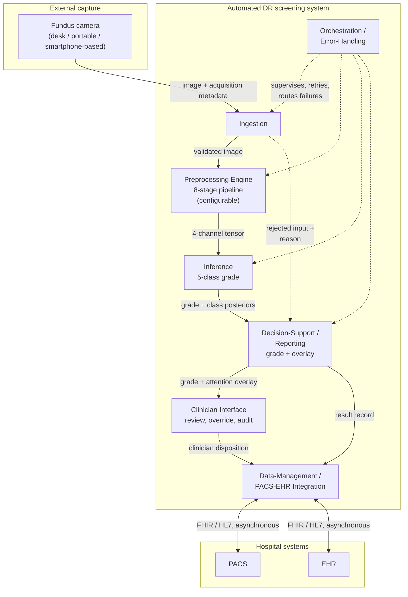
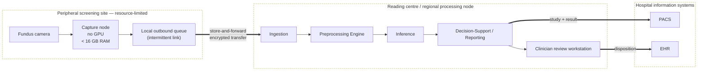
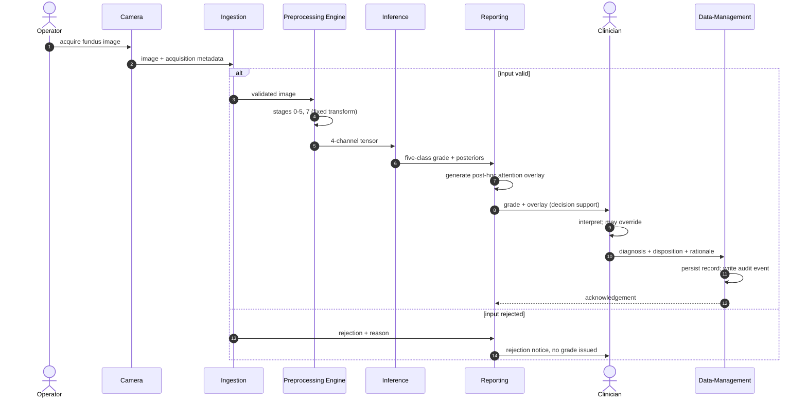
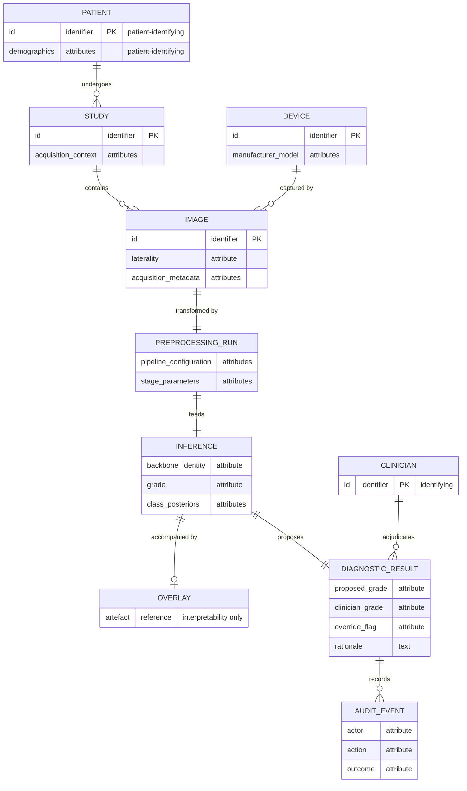

> Ported from the superseded appendices, re-lettered, with the provenance banner,
> section signs and internal codes removed and cross-references renumbered to the
> four-chapter body. Transcription content is unchanged. Provenance: `outline/REWRITE_MAP.md`.

# Appendix C — System architecture diagrams

---

## PART 1: SECTION TEXT

This appendix gives the formal structural views of the screening-system architecture described in chapter 4: a component view, a deployment view, a sequence view of one screening episode, and the persisted data model. Together they discharge the system-architecture diagram reserved there.

What they are should be stated before they are read. Each is a **design specification**, and the design is realised only in part. A working demonstrator exists and performs inference on submitted images, and Table C.1 marks which of the modules drawn here it realises. Everything else on these pages is specified rather than built.

No deployment of this architecture was tested in a clinical setting, and nothing in these diagrams is evidence that the system performs as drawn. Every element is traceable to a statement in chapter 4; where that chapter does not fix a detail, the detail is omitted here rather than chosen, so the diagrams contain no design decision that the dissertation has not made in prose.

The diagrams are given as diagram source in Mermaid notation. The source is the definition of the diagram; rendering to an image is performed during document conversion.

### C.1 Component view

**Diagram C.1. Module decomposition with provided and required interfaces.**

The view is to be read against Table C.1 rather than on its own. The table names what each module does and says whether the demonstrator realises it, so that no reader takes a drawn box for a built one.

**Table C.1. Module, function, and whether the demonstrator realises it.**

| Module | Function | In the demonstrator | Described in |
|---|---|---|---|
| Ingestion | Validates a submitted image and rejects input outside the contract | Built | section 4.2 |
| Preprocessing Engine | Applies the eight stages and exposes the state after each | Built | section 4.2 |
| Inference | Loads a checkpoint and grades at the level of the patient | Built | section 4.2 |
| Decision-Support / Reporting | Returns the grade with an attention overlay | Built | sections 4.2 and 4.3 |
| Clinician Interface | Review, recorded verdict, landmark correction | Built | section 4.3 |
| Data-Management | Persists a per-case record | Built as a local case store; the links to hospital imaging and record systems are specification | sections 4.3 and 4.4 |
| Orchestration / Error-Handling | Routes failures and verifies the pipeline at startup | Built | section 4.2 |
| Identity and access control | Per-user identity, roles, access logging | Specification | section 4.4 |

Two features of the decomposition are structural rather than incidental. The Preprocessing Engine is a first-class module on the inference path, not a data-preparation utility outside the system boundary, which is the architectural expression of the dissertation's central position. And the rejected-input path from Ingestion to Reporting is drawn explicitly, because malformed, low-quality or out-of-contract input must be handled without silent failure, so a rejection is a reported outcome rather than an absent result.

### C.2 Deployment view

**Diagram C.2. Store-and-forward deployment topology.**

This is the view in which the deployment envelope prunes the design. The peripheral site is specified to require neither inference acceleration nor a continuous link: capture and queueing are all that occur there, and the transfer boundary is asynchronous by construction. Inference at the point of capture is not excluded in principle, but it is not the arrangement specified here, and the store-and-forward form is chosen because it is the one that survives intermittent connectivity.

What the demonstrator realises of this view is the separation and not the topology. Its client is a static bundle holding no model, and its service runs where an accelerator is available, so the machine an operator sits at need not be the machine that computes. The peripheral queue and both links to hospital systems are drawn here and are not built.

### C.3 Sequence view

**Diagram C.3. One screening episode, capture to persisted disposition.**

Two properties of the ordering are the point of the diagram. The clinician's disposition is the **terminal** step: the system produces a grade and an accompanying overlay, and the diagnosis is made by the clinician, who may override the system's output and whose rationale is persisted. The system is decision support within a physician-in-the-loop paradigm and is not a standalone diagnostic instrument. And the attention overlay is generated *post hoc*, after the grade, as an interpretability artefact accompanying it — it indicates regions of high gradient-weighted activation and does not constitute a pixel-level delineation of pathology or a localisation output.

The rejection branch is drawn because a screening system that fails silently on unusable input is a different and more dangerous system than one that reports the failure. The demonstrator behaves in the second way, applying the ingestion protocol of chapter 2.

### C.4 Data view

**Diagram C.4. Persisted entity model.**

The entities that carry patient or clinician identity are marked, because that is where the security requirement concentrates. The design places encryption, authentication, role-based access control, de-identification and audit at the data-management boundary rather than distributing them across the modules, and this model is the reason: the identifying attributes are persisted in exactly the entities that boundary owns. The audit record is modelled as a first-class entity, since an override channel without a durable record of who overrode what is an accountability mechanism only in name.

The security provisions these entities imply are **GDPR/HIPAA-aligned by design**. They are not a certified compliance status, no conformity assessment was performed, and no statute is asserted to be satisfied by this model.

### Status of these diagrams

Each of the four views elaborates the decomposition of section 4.1, and each is traceable to it through Table C.1. None of them is evidence about behaviour. The demonstrator shows that the modules marked as built can be built and what they do in operation; it shows nothing about how well they do it. No field testing was conducted in any clinical setting, and no diagram here carries a claim about latency, throughput, reliability in service, clinical utility or regulatory status.

---
