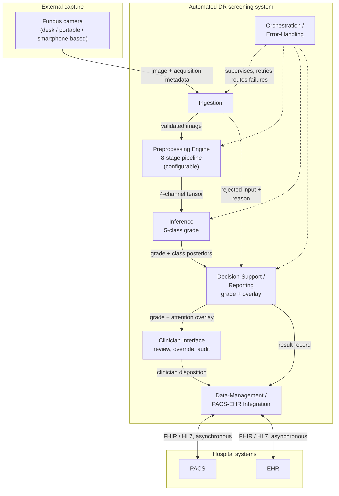
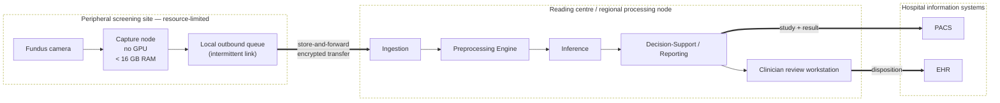
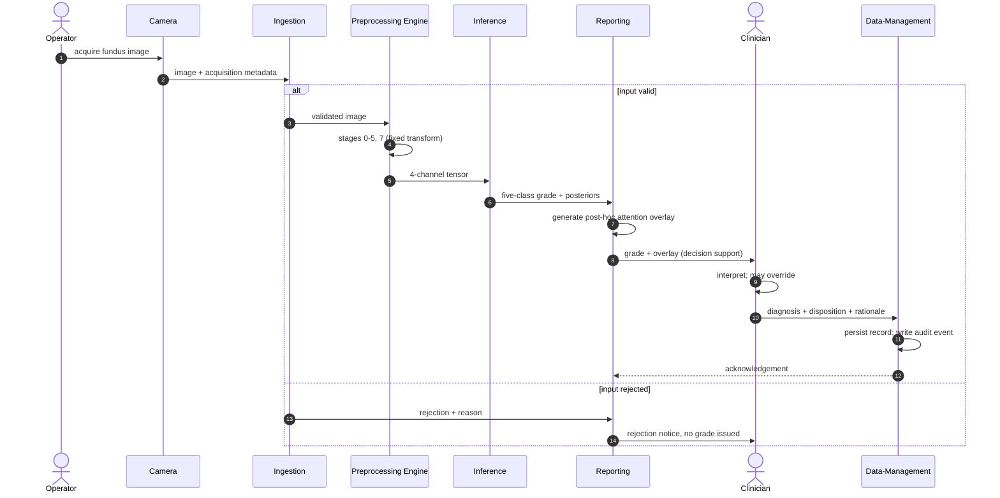
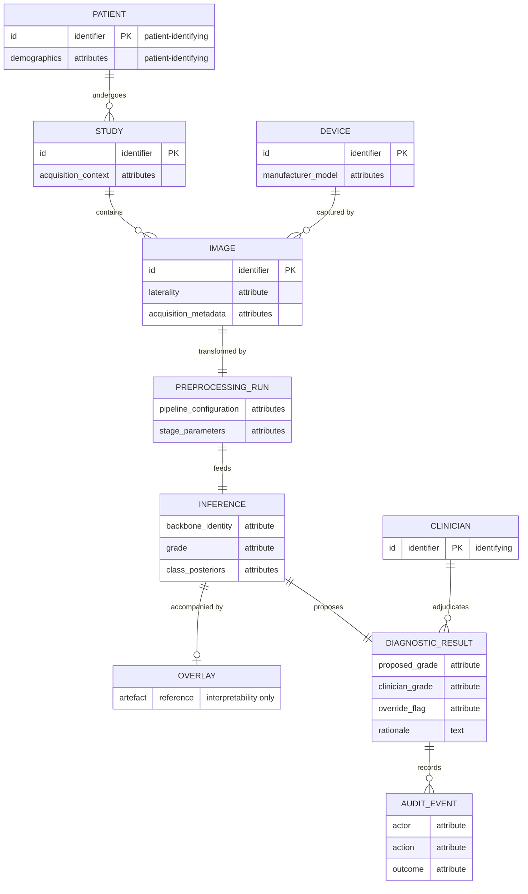

> Жергілікті модель (Qwen) жасаған қазақша аударма. Бастапқы мәтін: `chapters/06-appendices/drafts/C-draft.md`. Терминология: `translation/termbase.tsv`.

## 1-БӨЛІК: БӨЛІМ МӘТІНІ

Бұл қосымшаның екі бөлімі бар. Біріншісі 4-тарауда сипатталған скрининг жүйесінің архитектурасының формальды құрылымдық көріністерін береді: компоненттік көрініс, орналастыру көрінісі, бір скрининг эпизодының реттілік көрінісі және сақталатын деректер моделі. Олар бірлесіп сол жерде уәде етілген жүйе архитектурасының сызбасын орындайды. Екіншісі жұмыс істейтін демонстратордың жұмыс істеп тұрғанын көрсетеді. Осылайша, Б.1-кесте құрылған деп белгілеген модульдер кестеде айтылғандай іс-әрекет жасап жатқанын көруге болады.

Олардың не екендігін оқу алдында айту қажет. Әрқайсысы – **жоба спецификациясы**, ал жоба тек ішінара іске асырылды. Жұмыс істейтін демонстратор бар және жіберілген кескіндерде инференс орындайды, ал Б.1-кесте мұнда суреттелген модульдердің қайсыларын оның іске асыратынын белгілейді. Бұл беттердегі қалғанының бәрі құрылмаған, тек спецификацияланған.

Бұл архитектура клиникалық ортада тексерілмеген және осы сызбалардағы ештеңе жүйенің сызбадағыдай жұмыс істейтінінің дәлелі емес. Әрбір элемент 4-тараудағы тұжырымға сәйкес келеді. Сол тарау детальды бекітпеген жағдайда, деталь мұнда таңдалмай, өткізіп жіберіледі. Демек, сызбаларда диссертацияда мәтін түрінде жасалмаған ешқандай жоба шешімі жоқ.

Сызбалар Mermaid нотациясындағы сызбаның бастапқы коды ретінде берілген. Бастапқы код – сызбаның анықтамасы; кескінге түрлендіру құжатты түрлендіру кезінде орындалады.

### Б.1 Компоненттік көрініс

**Б.1-диаграмма – Берілетін және талап етілетін интерфейстері бар модульдік ыдырату.**

Бұл көріністі Б.1-кестемен бірге оқу керек, өз бетінше емес. Кесте әр модульдің не істейтінін атап, демонстратордың оны жүзеге асыратынын айтады, осылайша ешбір оқырман сызылған тіктөртбұрышты құрылған деп қабылдамайды.

**Б.1-кесте – Модуль, функция және демонстратордағы жүзеге асырылуы.**

| Модуль | Функция | Демонстраторда | Сипатталған |
|---|---|---|---|
| Қабылдау | Жіберілген кескінді тексеріп, шарттан тыс кірісті қабылдамайды | Құрылды | 4.2-бөлім |
| Алдын ала өңдеу қозғалтқышы | Сегіз кезеңді қолданып, әр кезеңнен кейінгі күйді ашады | Құрылды | 4.2-бөлім |
| Инференс | Чекпоинтты жүктеп, пациент деңгейінде дәреже береді | Құрылды | 4.2-бөлім |
| Шешім қабылдауды қолдау / Есеп беру | Назар қабаттамасымен қатар дәрежені қайтарады | Құрылды | 4.2 және 4.3-бөлімдер |
| Дәрігер интерфейсі | Қарау, тіркелген вердикт, бағдарлық нүктелерді түзету | Құрылды | 4.3-бөлім |
| Деректерді басқару | Іске қатысты жазбаны сақтайды | Жергілікті іс қоймасы ретінде құрылды; аурухана кескіндеу және жазба жүйелерімен байланыстар – спецификация | 4.3 және 4.4-бөлімдер |
| Оркестрация / Қателерді өңдеу | Қателерді бағыттап, іске қосылғанда конвейерді тексереді | Құрылды | 4.2-бөлім |
| Пайдаланушыны сәйкестендіру және қолжетімділікті бақылау | Әр пайдаланушыны сәйкестендіру, рөлдер, қолжетімділік журналы | Спецификация | 4.4-бөлім |

Ыдыратудың екі ерекшелігі құрылымдық, кездейсоқ емес. Алдын ала өңдеу қозғалтқышы – инференс жолындағы бірінші деңгейлі модуль, жүйе шекарасының сыртындағы деректерді дайындау құралы емес; бұл – диссертацияның орталық тұжырымының архитектуралық көрінісі. Қабылдаудан Есеп беруге дейінгі қабылданбаған кіріс жолы анық сызылған. Бұзылған, сапасы төмен немесе шарттан тыс кіріс үнсіз сәтсіздікке ұшырамай өңделуі тиіс болғандықтан, қабылдамау – жоқ нәтиже емес, хабарланатын нәтиже.

### Б.2 Орналастыру көрінісі

**Б.2-диаграмма – Сақтау және жіберу (store-and-forward) орналастыру топологиясы.**

Бұл – орналастыру шеңбері жобаны қысқартатын көрініс. Перифериялық сайт инференс үдеткішін де, үздіксіз байланысты да талап етпейтіндей етіп спецификацияланған: онда тек түсіру және кезекке қою орын алады, ал жеткізу шекарасы құрылымы бойынша асинхронды. Түсіру нүктесіндегі инференс принцип жүзінде жоққа шығарылмайды, бірақ ол мұнда спецификацияланған құрылым емес, ал сақтау және жіберу (store-and-forward) схемасы үзілмелі байланыста сақталатыны үшін таңдалған.

Демонстратор бұл көріністің топологиясын емес, бөлінісін ғана жүзеге асырады. Оның клиенті модель ұстамайтын статикалық жинақ болғандықтан әрі сервис үдеткіш бар жерде жұмыс істейтіндіктен, оператор отырған машина есептеу жүргізетін машина болуға міндетті емес. Перифериялық кезек пен аурухана жүйелеріне арналған екі байланыс мұнда сызылған, бірақ құрылмаған.

### Б.3 Реттілік көрінісі

**Б.3-диаграмма – Бір скрининг эпизоды, түсіруден сақталған шешімге дейін.**

Реттіліктің екі қасиеті диаграмманың мәнін ашады. Дәрігердің шешімі – **соңғы** қадам: жүйе дәреже мен оған қоса назар қабаттамасын береді, ал диагнозды дәрігер қояды. Ол жүйенің шығысын өзгертуі (қабылдамауы) мүмкін, ал оның негіздемесі сақталады. Жүйе – «дәрігер контурда» парадигмасындағы шешім қабылдауды қолдау құралы, ол дербес диагностикалық құрал емес. Назар қабаттамасы дәрежеден кейін, *post hoc* түрінде оны сүйемелдейтін интерпретацияланушылық артефактісі ретінде генерацияланады. Ол градиентпен салмақталған активацияның жоғары аймақтарын көрсетеді, бірақ патологияның пиксель деңгейіндегі шекаралауы немесе локализациялау шығысы болып табылмайды.

Қабылдамау тармағы сызылған, өйткені пайдалануға жарамсыз кірісте үнсіз сәтсіздікке ұшырайтын скрининг жүйесі, сәтсіздікті хабарлайтын жүйеден өзгеше әрі қауіптірек жүйе. Демонстратор екінші жолмен әрекет етеді, ол үшін 2-тараудағы қабылдау хаттамасы қолданылады.

### Б.4 Деректер көрінісі

**Б.4-диаграмма – Сақталатын нысандар (entity) моделі.**

Пациенттің немесе дәрігердің жеке басын анықтайтын деректерді жеткізетін нысандар белгіленген, себебі қауіпсіздік талабы осы жерде шоғырланады. Жоба шифрлауды, аутентификацияны, рөлге негізделген қол жеткізуді бақылауды, деперсонализацияны және аудитті деректерді басқару шекарасына орналастырады, оларды модульдер арасында таратпайды, ал осы модель – оның себебі: идентификациялық атрибуттар дәл сол шекараның иесі болған нысандарда сақталады. Аудит жазбасы бірінші деңгейлі нысан ретінде модельденеді, өйткені кім нені өзгерткені туралы тұрақты жазбасы жоқ өзгерту (override) арнасы тек атауы бойынша жауапкершілік механизмі ғана.

Осы нысандар білдіретін қауіпсіздік шаралары **жоба бойынша GDPR/HIPAA-ға сәйкес**. Олар сертификатталған сәйкестік мәртебесі емес, сәйкестікті бағалау жүргізілмеген және бұл модельмен ешбір заңнаманың орындалғаны туралы тұжырым жасалмаған.

### Б.5 Жұмыс істеп тұрған демонстратор

Келесі үш сурет жоба емес, демонстраторға қатысты. Олар мұнда, өйткені Б.1-кесте жеті модуль құрылғанын көрсетеді, ал оны тек мәлімдейтін кестенің құны оны іс жүзінде орындап тұрған жүйеден төмен. Әрқайсысы 4.3-бөлімде сипатталған клиенттің, 4.2-бөлімдегі инференс сервисін басқаратын түсірілімі.

**[FIG-C.1: Жіберу көрінісі, пациенттің екі көзі бағалауға қабылданған және олардың астында алдын ала өңдеу кезеңдері ашық көрсетілген – defense/figures/1.png]**

Б.1-сурет Б.1-кестедегі "Қабылдау" және "Алдын ала өңдеу қозғалтқышы" жолдарының жұмыс істеп тұрғанын көрсетеді. Екі кескін бір пациент ретінде, оң және сол көз ретінде жіберіледі, ал олардың астындағы панель таңдалған көз үшін конвейердің кезеңдерін кезең-кезеңімен көрсетіп, әр кезеңнің қандай арналар беретінін атап көрсетеді. Демек, трансформация жасырын емес, тексеруге жарамды, бұл диссертацияның архитектуралық позициясы интерфейске енгізілген: алдын ала өңдеу модельдің бөлігі болып табылады және осы ретінде көрсетіледі, деректерді дайындау ретінде жасырылмайды.

**[FIG-C.2: Нәтиже көрінісі, пациент деңгейіндегі дәреже, бес дәреже бойынша апостериорлық ықтималдықтар, көзге арналған болжамдар және қарау басқаруы – defense/figures/2.png]**

Б.2-сурет "Инференс" және "Шешім қабылдауды қолдау" жолдарын көрсетеді. Жүйе пациент деңгейінде бес кластық дәрежені, барлық бес дәреже бойынша апостериорлық ықтималдықтарды, жолдама беру туралы шешімді және оның астындағы көзге арналған болжамдарды қайтарады. Визуализация панелі өз шектеуін көрсетеді – интерпретацияланушылық дәлелдері, клиникалық зақымдану локализациясы емес – және бұл түсірілімде қабаттама қолжетімсіз екенін хабарлайды, назар картасы чекпоинттен тек сервис оны жасай алған жағдайда ғана генерацияланады. Келесі басқару элементтері болжамға шешім қабылдауды дәрігерге береді, бұл Б.3-диаграммадағы «дәрігер контурда» ретінің жүзеге асырылған түрі.

**[FIG-C.3: Тіркелген шешімнен кейінгі көрініс, сақталған іс, қайта белгілеу буфері және істер қоймасынан оқылған жалпы көрсеткіштер – defense/figures/3.png]**

Б.3-сурет «Дәрігер интерфейсі» және «Деректерді басқару» жолдарын көрсетеді. Вердикт сервердегі іс бойынша сақталады және қайта оқыту үшін экспортталатын қайта белгілеу буферіне қосылады, ал төмендегі жалпы көрсеткіштер браузер сессиясынан емес, істер қоймасынан оқылды. Бұл Б.4-диаграммасындағы аудит арнасының құрылған түріндегі көрінісі: жергілікті істер қоймасы, ал ауруханалық бейнелеу және жазба жүйелерімен байланыстар әлі спецификация күйінде.

### Бұл көріністердің мәртебесі

Төрт диаграмманың әрқайсысы 4.1-бөлімдегі ыдыратуды толықтырады және Б.1-кесте арқылы оған сәйкес келеді. Олардың ешқайсысы мінез-құлық туралы дәлел емес. Үш сурет құрылған деп белгіленген модульдердің бар екенін және олардың жұмыс кезінде не істейтінін ғана анықтайды, одан бөлек ештеңе: бұл өлшеу емес, олардан кідіріс, өткізу қабілеті немесе сенімділік көрсеткіші оқылмайды, ал оларда көрінетін іс саны нақты пайдаланудан емес, дамыту сессиясынан алынған. Ешбір клиникалық ортада далалық сынақ жүргізілмеді және бұл қосымшада қызметтегі сенімділік, клиникалық пайдалылық немесе нормативтік мәртебе туралы ешқандай тұжырым жоқ.
