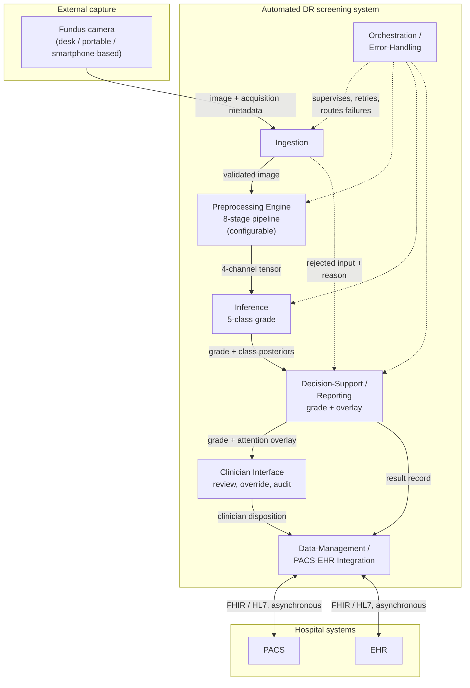
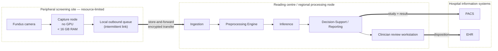
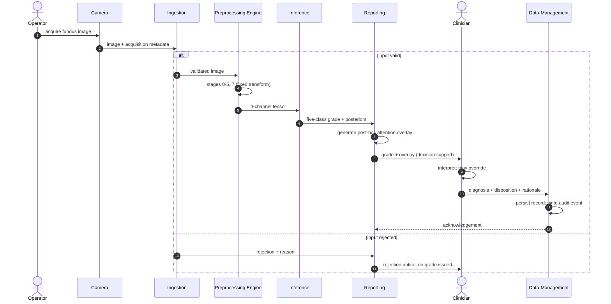
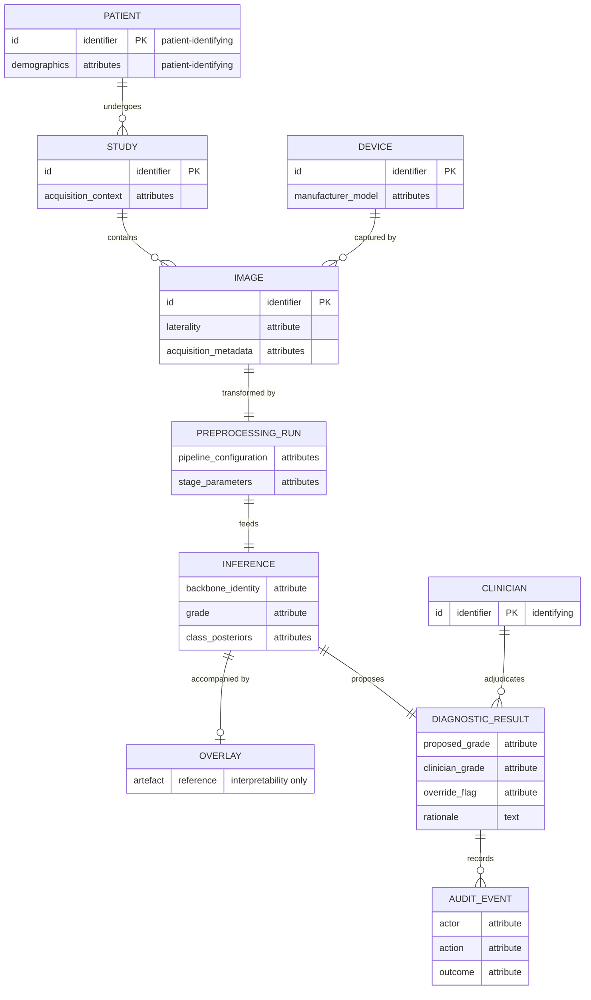

> Перевод на русский язык выполнен локальной моделью (Qwen). Исходный текст: `chapters/06-appendices/drafts/C-draft.md`. Терминология: `translation/termbase.tsv`.

## ЧАСТЬ 1: ТЕКСТ РАЗДЕЛА

В данном приложении представлены две части. Первая содержит формальные структурные представления архитектуры системы скрининга, описанной в главе 4: представление компонентов, представление развёртывания, представление последовательности одного эпизода скрининга и модель сохраняемых данных. Совместно они выполняют роль диаграммы архитектуры системы, зарезервированной в той главе. Вторая часть демонстрирует действующий демонстратор в работе, что позволяет увидеть, как модули, отмеченные в таблице C.1 как созданные, выполняют те функции, которые указаны в таблице.

Прежде чем читать диаграммы, необходимо определить их статус. Каждая из них является **проектной спецификацией**, и реализация проекта выполнена лишь частично. Действующий демонстратор существует и выполняет инференс на загруженных изображениях, а таблица C.1 указывает, какие из изображённых здесь модулей он реализует. Всё остальное на этих страницах специфицировано, но не построено.

Ни одно развёртывание данной архитектуры не тестировалось в клинических условиях, и ничто в этих диаграммах не является свидетельством того, что система работает так, как изображено. Каждый элемент прослеживается до утверждения в главе 4; если в той главе деталь не зафиксирована, она здесь опущена, а не выбрана, поэтому диаграммы не содержат проектных решений, которые диссертация не приняла в тексте.

Диаграммы представлены в виде исходного кода в нотации Mermaid. Исходный код является определением диаграммы; рендеринг в изображение выполняется при конвертации документа.

### C.1 Представление компонентов

**Диаграмма C.1 – Декомпозиция модулей с предоставленными и требуемыми интерфейсами.**

Вид следует читать в сопоставлении с таблицей C.1, а не изолированно. В таблице указано, что выполняет каждый модуль, и реализован ли он в демонстраторе, чтобы читатель не принимал нарисованный блок за построенный.

**Таблица C.1 – Модуль, функция и реализация в демонстраторе.**

| Модуль | Функция | В демонстраторе | Описано в |
|---|---|---|---|
| Ingestion | Валидирует отправленное изображение и отклоняет входные данные вне контракта | Построен | раздел 4.2 |
| Preprocessing Engine | Применяет восемь этапов и предоставляет состояние после каждого | Построен | раздел 4.2 |
| Inference | Загружает контрольную точку и выполняет градацию на уровне пациента | Построен | раздел 4.2 |
| Decision-Support / Reporting | Возвращает градацию с наложением карты внимания | Построен | разделы 4.2 и 4.3 |
| Clinician Interface | Просмотр, зафиксированное решение, корректировка опорных точек | Построен | раздел 4.3 |
| Data-Management | Сохраняет запись для каждого случая | Построен как локальное хранилище случаев; ссылки на системы визуализации и записи больницы являются спецификацией | разделы 4.3 и 4.4 |
| Orchestration / Error-Handling | Маршрутизирует сбои и проверяет конвейер при запуске | Построен | раздел 4.2 |
| Identity and access control | Идентичность пользователя, роли, журнал доступа | Спецификация | раздел 4.4 |

Две особенности декомпозиции являются структурными, а не случайными. Модуль предобработки является модулем первого класса на пути инференса, а не утилитой подготовки данных за пределами системы, что является архитектурным выражением центральной позиции диссертации. И путь отклонённого входа от Ingestion к Reporting нарисован явно, поскольку некорректный, низкокачественный или внеконтрактный вход должен обрабатываться без молчаливого сбоя, поэтому отклонение является сообщённым результатом, а не отсутствием результата.

### C.2 Вид развёртывания

**Рисунок C.2 – Топология развёртывания store-and-forward.**

Это вид, в котором охват развёртывания обрезает проект. Для периферийного узла специфицировано, что ему не требуются ни ускорение инференса, ни непрерывное соединение: там происходят только захват и постановка в очередь, а граница передачи по построению асинхронна. Инференс в точке захвата не исключён в принципе, но это не та конфигурация, которая специфицирована здесь; форма store-and-forward выбрана потому, что она сохраняется при прерывистой связности.

Демонстратор реализует в этом виде разделение, а не топологию. Его клиент представляет собой статический пакет, не содержащий модели, а его сервис работает там, где доступно ускорение, поэтому машина, за которой сидит оператор, не обязана быть машиной, выполняющей вычисления. Периферийная очередь и оба канала связи с больничными системами показаны здесь, но не построены.

### C.3 Вид последовательности

**Рисунок C.3 – Один эпизод скрининга: от захвата до сохранённого результата.**

Две характеристики последовательности являются смыслом диаграммы. Решение врача представляет собой **терминальный** шаг: система формирует градацию и сопутствующее наложение карты внимания, а диагноз ставит врач, который может отменить вывод системы и чьи обоснования сохраняются. Система является поддержкой принятия решений в парадигме «врач в контуре принятия решений» и не является автономным диагностическим инструментом. Кроме того, наложение карты внимания генерируется *post hoc*, после определения градации, как артефакт интерпретируемости, сопровождающий её. Оно указывает области с высокой градиентно-взвешенной активацией и не представляет собой пиксельного выделения патологии или вывода локализации.

Ветка отклонения изображена, потому что система скрининга, которая молча терпит неудачу при непригодном входе, является другой и более опасной системой, чем та, которая сообщает об ошибке. Демонстратор работает по второму варианту, применяя протокол приёма данных из главы 2.

### C.4 Вид данных

**Диаграмма C.4 – Модель сохраняемых сущностей.**

Сущности, несущие идентификаторы пациента или клинициста, отмечены, поскольку именно здесь концентрируется требование безопасности. В проекте шифрование, аутентификация, управление доступом на основе ролей, деидентификация и аудит размещены на границе управления данными, а не распределены по модулям, и эта модель является причиной такого решения: идентифицирующие атрибуты сохраняются именно в тех сущностях, которыми владеет эта граница. Запись аудита смоделирована как первоклассная сущность, поскольку канал переопределения без устойчивой записи о том, кто и что переопределил, является механизмом подотчётности лишь по названию.

Положения безопасности, подразумеваемые этими сущностями, **соответствуют GDPR/HIPAA по замыслу**. Это не статус сертифицированного соответствия, оценка соответствия не проводилась, и не утверждается, что какая-либо норма закона удовлетворяется этой моделью.

### C.5 Демонстратор в работе

Три последующих рисунка изображают демонстратор, а не проект. Они приведены здесь, потому что таблица C.1 помечает семь модулей как построенные, и таблица, утверждающая это, стоит меньше, чем система, выполняющая это. Каждый из них является снимком клиента, описанного в разделе 4.3, управляющего сервисом инференса из раздела 4.2.

**[FIG-C.1: Вид отправки, с двумя глазами пациента, принятыми для градации, и этапами предобработки, отображёнными под ними – defense/figures/1.png]**

Рисунок C.1 показывает строки «Приём данных» и «Модуль предобработки» из таблицы C.1 в работе. Два изображения отправляются как один пациент, правый и левый глаз, а панель под ними проходит по этапам конвейера для выбранного глаза, называя каналы, которые даёт каждый этап. Таким образом, преобразование является проверяемым, а не неявным, что является архитектурной позицией данной диссертации, перенесённой в интерфейс: предобработка является частью модели и показана как таковая, а не скрыта как подготовка данных.

**[FIG-C.2: Вид результата, с градацией на уровне пациента, апостериорным распределением по пяти степеням, предсказаниями по каждому глазу и элементами управления просмотром – defense/figures/2.png]**

Рисунок C.2 показывает строки «Инференс» и «Поддержка принятия решений». Система возвращает градацию пяти классов на уровне пациента, с апостериорным распределением по всем пяти степеням, определением о необходимости направления к специалисту и предсказаниями по каждому глазу под ним. Панель визуализации указывает своё собственное ограничение – данные интерпретируемости, а не клиническая локализация очага – и в этом снимке сообщает об отсутствии доступного наложения, карта внимания генерируется из контрольной точки только тогда, когда сервис может её создать. Последующие элементы управления предоставляют вердикт по предсказанию клиницисту, что является порядком «врач в контуре принятия решений» с диаграммы C.3 в его реализованной форме.

**[РИСУНОК C.3: Вид после записи вердикта, с сохранённым случаем, буфером перемаркировки и суммами, прочитанными из хранилища случаев – defense/figures/3.png]**

Рисунок C.3 показывает строки «Интерфейс клинициста» и «Управление данными». Вердикт сохраняется на сервере для данного случая и добавляется в буфер перемаркировки, который можно экспортировать для дообучения, а суммы внизу читаются из хранилища случаев, а не из сессии браузера. Это канал аудита Диаграммы C.4 в той форме, в которой он был создан: локальное хранилище случаев, при этом ссылки на системы визуализации и ведения записей больницы остаются на уровне спецификации.

### Статус этих видов

Каждая из четырёх диаграмм детализирует декомпозицию раздела 4.1, и каждая прослеживается до неё через таблицу C.1. Ни одна из них не является свидетельством о поведении. Три рисунка устанавливают, что модули, отмеченные как созданные, существуют и что они делают в работе, и ничего сверх того: это не измерение, из них нельзя извлечь показатели задержки, пропускной способности или надёжности, а видимые в них количества случаев относятся к сессии разработки, а не к использованию. Полевые испытания в любой клинической среде не проводились, и ничто в этом приложении не содержит утверждений о надёжности в эксплуатации, клинической полезности или регуляторном статусе.
