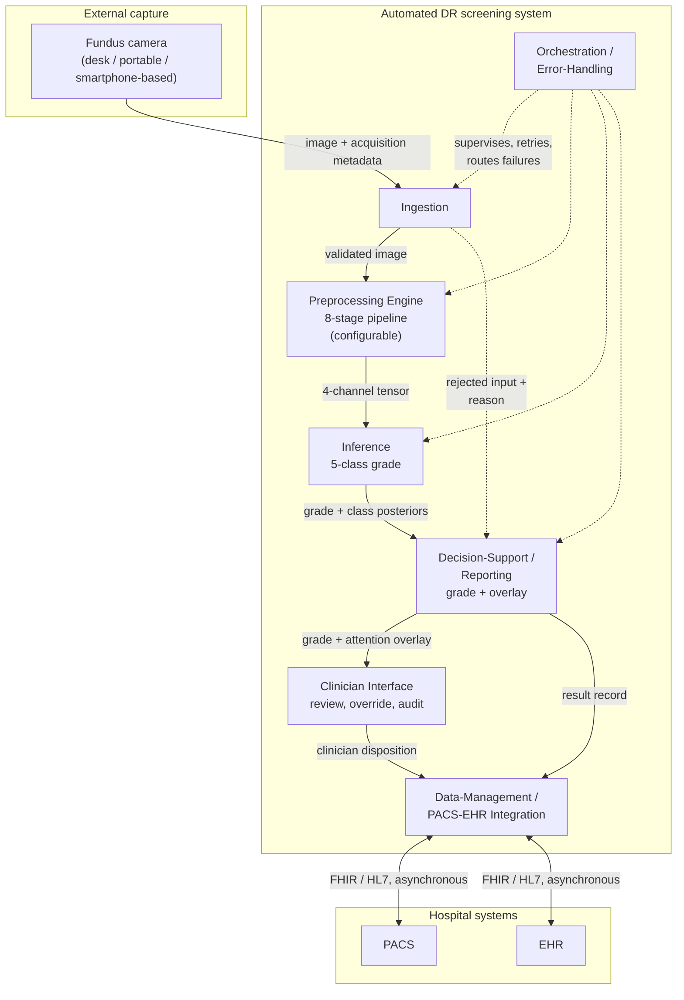
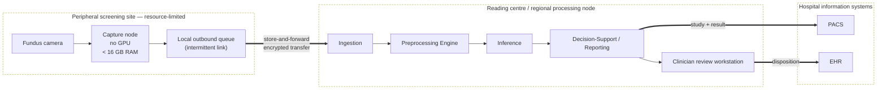
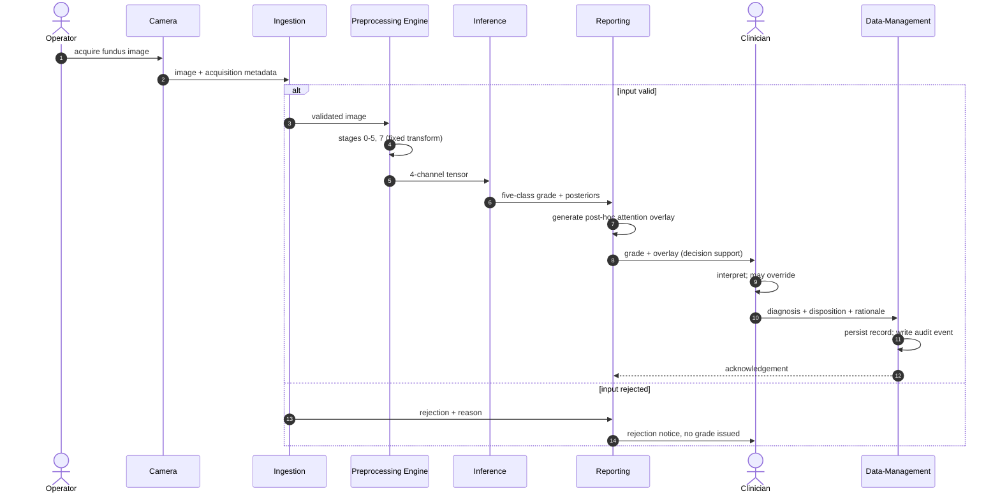
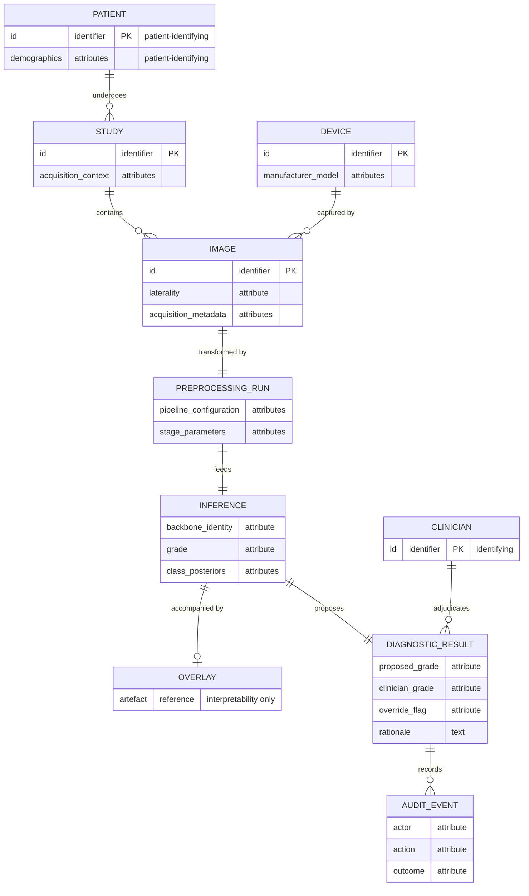

> Қазақ тіліндегі аударма. Бастапқы мәтін: `drafts/C-draft.md` (кеңестің өлшенген нормаларына сай
> қайта жазылған төртбөлімді том). Аудару бақылауы: `glossary/GLOSSARY_KZ.md`, қосымша әріптеуі –
> `outline/TABLE_OF_CONTENTS_KZ.md` (А, Ә, Б, В, Г). Mermaid диаграммаларының бастапқы коды
> бұрынғы қазақ басылымындағы конвенция бойынша ағылшынша қалдырылды.

---

## 1-БӨЛІК: БӨЛІМ МӘТІНІ

# Б қосымшасы – Жүйе архитектурасының диаграммалары

Бұл қосымша 4-тарауда сипатталған скрининг жүйесі архитектурасының формальды құрылымдық
көріністерін береді: компоненттік көрініс, орналастыру көрінісі, бір скрининг эпизодының реттілік
көрінісі және сақталатын деректер моделі. Олар бірге сонда белгіленген жүйе архитектурасының
диаграммасын береді.

Оларды оқымас бұрын не екенін айту қажет. Әрқайсысы – **жобалық айқындама**, ал жоба тек ішінара
іске асқан. Жұмыс істейтін демонстратор бар әрі жіберілген кескіндерде инференс орындайды, ал
Б.1-кесте мұнда сызылған модульдердің қайсысын іске асыратынын белгілейді. Бұл беттердегі қалғанның
бәрі құрылған емес, айқындалған.

Бұл архитектураны клиникалық жағдайда орналастыру сынағы жүргізілген жоқ, әрі бұл диаграммалардағы
ештеңе жүйенің сызылғандай жұмыс істейтінінің дәлелі емес. Әр элемент 4-тараудағы тұжырымға барып
тіреледі; сол тарау қандай да бір егжей-тегжейді бекітпеген жерде ол мұнда таңдалмай, түсіріледі,
сондықтан диаграммаларда диссертация прозада қабылдамаған ешбір жобалық шешім жоқ.

Диаграммалар Mermaid жазбасындағы диаграмма коды түрінде беріледі. Код – диаграмманың анықтамасы;
кескінге рендерлеу құжатты түрлендіру кезінде орындалады.

### Б.1 Компоненттік көрініс

**Б.1-диаграмма – Берілетін және талап етілетін интерфейстері бар модульдік ыдырату.**

Бұл көріністі жеке-дара емес, Б.1-кестемен қатар оқу қажет. Кесте әр модульдің не істейтінін
атайды әрі демонстратор оны іске асыра ма, жоқ па дегенді айтады, сонда бірде-бір оқырман сызылған
тіктөртбұрышты құрылған деп қабылдамайды.

**Б.1-кесте – Модуль, оның қызметі және демонстратордың оны іске асыратын-асырмайтыны.**

| Модуль | Қызметі | Демонстраторда | Сипатталған жері |
|---|---|---|---|
| Қабылдау (Ingestion) | Жіберілген кескінді тексереді әрі келісімшарттан тыс кірісті қабылдамайды | Құрылған | 4.2-бөлім |
| Алдын ала өңдеу қозғалтқышы | Сегіз кезеңді қолданады әрі әрқайсысынан кейінгі күйді ашады | Құрылған | 4.2-бөлім |
| Инференс | Чекпойнтты жүктейді әрі пациент деңгейінде дәрежелейді | Құрылған | 4.2-бөлім |
| Шешімді қолдау / есеп беру | Дәрежені назар қабаттамасымен бірге қайтарады | Құрылған | 4.2 және 4.3-бөлімдер |
| Дәрігер интерфейсі | Қарау, тіркелетін вердикт, бағдарлық нүктені түзету | Құрылған | 4.3-бөлім |
| Деректерді басқару | Іс бойынша жазбаны сақтайды | Жергілікті істер қоймасы ретінде құрылған; ауруханалық бейнелеу және жазба жүйелерімен байланыс – айқындама | 4.3 және 4.4-бөлімдер |
| Оркестрлеу / қателерді өңдеу | Сәтсіздіктерді бағыттайды әрі іске қосылғанда конвейерді тексереді | Құрылған | 4.2-бөлім |
| Тұлғалық және қатынасты бақылау | Пайдаланушы бойынша тұлғалық, рөлдер, қатынасты журналдау | Айқындама | 4.4-бөлім |

Ыдыратудың екі белгісі кездейсоқ емес, құрылымдық. Алдын ала өңдеу қозғалтқышы – жүйе шекарасынан
тыс тұрған деректерді дайындау утилитасы емес, инференс жолындағы толыққанды модуль, ал бұл –
диссертацияның орталық ұстанымының архитектуралық көрінісі. Әрі Қабылдаудан Есеп беруге кететін
қабылданбаған кіріс жолы айқын сызылған, себебі бұзылған, сапасы төмен немесе келісімшарттан тыс
кіріс үнсіз сәтсіздіксіз өңделуге тиіс, сондықтан қабылдамау – жоқ нәтиже емес, хабарланатын
қорытынды.

### Б.2 Орналастыру көрінісі

**Б.2-диаграмма – Сақта-да-жөнелт орналастыру топологиясы.**

Орналастыру қоршауы жобаны кесіп-пішетін көрініс – осы. Шеткері алаңға инференсті жеделдету де,
үздіксіз байланыс та талап етілмейтіндей айқындалған: онда тек түсіру мен кезекке қою жүреді, ал
беріліс шекарасы құрылысы бойынша асинхронды. Түсіру нүктесінде инференс жүргізу қағидат жүзінде
шеттетілмейді, бірақ мұнда айқындалған шешім ол емес, ал сақта-да-жөнелт пішіні байланыстың
үзілмелілігінен аман шығатыны үшін таңдалған.

Демонстратор бұл көріністен іске асыратыны – топология емес, бөліну. Оның клиенті – модель
ұстамайтын статикалық жинақ, ал сервисі жеделдеткіш бар жерде жүреді, сондықтан оператор отыратын
машина есептеу жүргізетін машина болуға міндетті емес. Шеткері кезек пен ауруханалық жүйелерге
кететін екі байланыс та мұнда сызылған әрі құрылмаған.

### Б.3 Реттілік көрінісі

**Б.3-диаграмма – Бір скрининг эпизоды, түсіруден сақталған шешімге дейін.**

Реттіліктің екі қасиеті – диаграмманың мәні. Дәрігердің шешімі – **терминалдық** қадам: жүйе дәреже
мен оны сүйемелдейтін қабаттаманы шығарады, ал диагнозды дәрігер қояды; ол жүйенің шығысын жоққа
шығара алады, ал оның негіздемесі сақталады. Жүйе – дәрігер циклда тұратын парадигмадағы шешім
қабылдауды қолдау, дербес диагностикалық аспап емес. Әрі назар қабаттамасы дәрежеден кейін, *post
hoc* түрде, оны сүйемелдейтін түсіндірілімділік артефактісі ретінде жасалады. Ол градиентпен
салмақталған активацияның жоғары аймақтарын көрсетеді әрі патологияны пиксель деңгейінде шектеп
сызу да, локализация шығысы да емес.

Қабылдамау тармағы сол себепті сызылған: жарамсыз кірісте үнсіз сәтсіздікке ұшырайтын скрининг
жүйесі – сәтсіздікті хабарлайтын жүйеден өзге әрі қауіптірек жүйе. Демонстратор екінші жолмен
әрекет етіп, 2-тараудың қабылдау хаттамасын қолданады.

### Б.4 Деректер көрінісі

**Б.4-диаграмма – Сақталатын мәндер моделі.**

Пациенттің немесе дәрігердің тұлғалығын алып жүретін мәндер белгіленген, себебі қауіпсіздік талабы
дәл сол жерде шоғырланады. Жоба шифрлеуді, аутентификацияны, рөлге негізделген қатынасты бақылауды,
деперсонализацияны және аудитті модульдер арасына таратпай, деректерді басқару шекарасына қояды, ал
бұл модель – соның себебі: сәйкестендіретін атрибуттар дәл сол шекара иеленетін мәндерде сақталады.
Аудит жазбасы толыққанды мән ретінде модельденген, себебі кім нені жоққа шығарғанының тұрақты
жазбасы жоқ жоққа шығару арнасы – жауапкершілік тетігі тек аты жөнінде ғана болып қалады.

Осы мәндер мегзейтін қауіпсіздік шаралары **жобасы бойынша GDPR/HIPAA-ға үйлестірілген**. Олар –
сертификатталған сәйкестік мәртебесі емес, ешқандай сәйкестікті бағалау жүргізілген жоқ, әрі бұл
модельмен қандай да бір заң талабы қанағаттандырылады деп бекітілмейді.

### Осы диаграммалардың мәртебесі

Төрт көріністің әрқайсысы 4.1-бөлімдегі ыдыратуды тарқатады, әрі әрқайсысы Б.1-кесте арқылы соған
барып тіреледі. Олардың бірде-бірі мінез-құлық туралы дәлел емес. Демонстратор құрылған деп
белгіленген модульдерді құруға болатынын әрі олардың жұмыс кезінде не істейтінін көрсетеді; оларды
қаншалықты жақсы істейтіні туралы ештеңе көрсетпейді. Ешбір клиникалық жағдайда далалық сынақ
жүргізілген жоқ, әрі мұндағы бірде-бір диаграмма кідіріс, өткізу қабілеті, қызметтегі сенімділік,
клиникалық пайдалылық немесе нормативтік мәртебе туралы тұжырым алып жүрмейді.

---

### Аудармашы ескертуі

Бастапқы черновиктегі **«PART 3: COMPLIANCE CHECKLIST»** governance аудиті ретінде
`drafts/C-draft.md` файлында қалады да, аудармаға енбейді. Ағылшын басылымындағы **Appendix C**
қазақ басылымында **Б қосымшасы**, ішкі нөмірлеу де соған сай (C.1 → Б.1). **Mermaid
диаграммаларының бастапқы коды аударылмайды** – бұрынғы қазақ басылымының конвенциясы
(`chapters/_superseded/08-appendices/translations/C-translation.md`): диаграмма коды рендерлеу
кірісі болып табылады әрі белгі атаулары код идентификаторларымен байланған. `PACS`, `EHR`,
`FHIR`, `HL7`, `GDPR`, `HIPAA` глоссарийдің А бөліміне сай ағылшынша қалдырылды.
