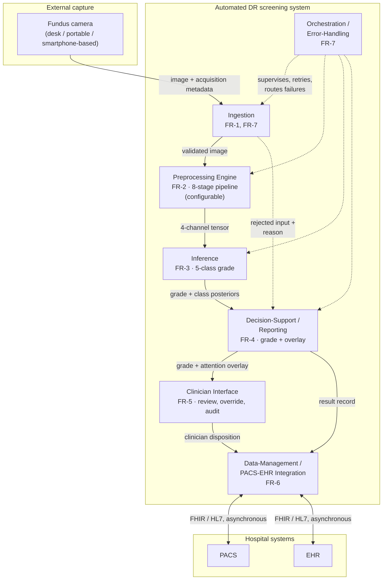
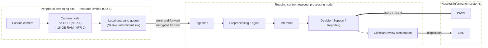
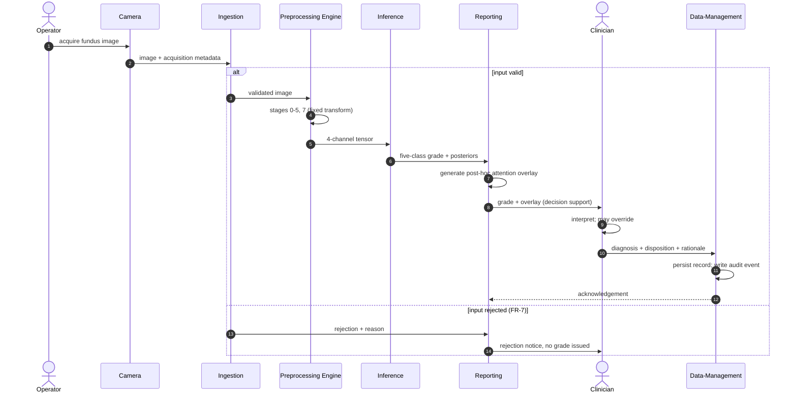
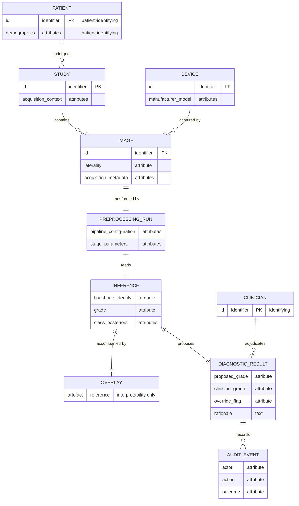

# Appendix C — System Architecture UML Diagrams

> Draft generated per `prompts/writing-session-system-prompt.md` v6.0.0 · Brief: `briefs/C-brief.md` · Binding reference: INVARIANTS.md v7.0.0 · Sources: Chapter 6 throughout — Tables 6.1 (FR-1…FR-7), 6.2 (NFR-1…NFR-8) and 6.3 (module decomposition), with §6.2.1, §6.2.2, §6.3.1, §6.3.2 and §6.4.1. **This appendix discharges DIA-6.3.** Diagrams are given as source; rendering is a conversion-time step.

---

## PART 1: SECTION TEXT

This appendix gives the formal structural views of the screening-system architecture specified in Chapter 6: a component view, a deployment view, a sequence view of one screening episode, and the persisted data model. Together they discharge the system-architecture diagram reserved in Chapter 6.

What they are should be stated before they are read. Each is a **design specification**. No prototype of this architecture was implemented, no deployment was tested in a clinical setting, and nothing in these diagrams is evidence that the system performs as drawn. Every element is traceable to a statement in Chapter 6; where Chapter 6 does not fix a detail, the detail is omitted here rather than chosen, so the diagrams contain no design decision that the dissertation has not made in prose.

The diagrams are given as diagram source in Mermaid notation. The source is the definition of the diagram; rendering to an image is performed during document conversion.

### C.1 Component view

**Diagram C.1. Module decomposition with provided and required interfaces.**

The view is to be read against the requirement mapping rather than on its own. Table C.1 restates that mapping so that each module can be checked against the requirement it exists to satisfy.

**Table C.1. Module → functional requirement → governing non-functional requirement.**

| Module | Realises | Governing NFR | Specified in |
|---|---|---|---|
| Ingestion | FR-1, FR-7 | NFR-4, NFR-8 | §6.1.2 (boundary); §6.3.1 (capture, telemedicine) |
| Preprocessing Engine | FR-2 | NFR-2, NFR-3, NFR-5 | §6.2.1 |
| Inference | FR-3 | NFR-1, NFR-2, NFR-3 | §6.2.2 |
| Decision-Support / Reporting | FR-4 | NFR-3, NFR-5 | §6.2.2, §6.3.2 |
| Clinician Interface | FR-5 | NFR-5 | §6.3.2 |
| Data-Management / PACS-EHR Integration | FR-6 | NFR-4, NFR-6, NFR-7 | §6.1.2; §6.4.1 |
| Orchestration / Error-Handling | FR-7 | NFR-4, NFR-8 | §6.1.2 |

Two features of the decomposition are structural rather than incidental. The Preprocessing Engine is a first-class module on the inference path, not a data-preparation utility outside the system boundary — which is the architectural expression of the dissertation's central position. And the rejected-input path from Ingestion to Reporting is drawn explicitly: FR-7 requires that malformed, low-quality or out-of-contract inputs be handled without silent failure, so a rejection is a reported outcome rather than an absent result.

### C.2 Deployment view

**Diagram C.2. Store-and-forward deployment topology.**

This is the view in which the non-functional envelope prunes the design. The peripheral site is specified to require neither inference acceleration nor a continuous link: capture and queueing are all that occur there, and the transfer boundary is asynchronous by construction (NFR-4). The alternative topology — inference at the point of capture — is not excluded in principle, but it is not the arrangement specified here, and Chapter 6 selects the store-and-forward form precisely because it is the one that survives the connectivity condition of OD-6.

### C.3 Sequence view

**Diagram C.3. One screening episode, capture to persisted disposition.**

Two properties of the ordering are the point of the diagram. The clinician's disposition is the **terminal** step: the system produces a grade and an accompanying overlay, and the diagnosis is made by the clinician, who may override the system's output and whose rationale is persisted. The system is decision support within a physician-in-the-loop paradigm and is not a standalone diagnostic instrument. And the attention overlay is generated *post hoc*, after the grade, as an interpretability artefact accompanying it — it indicates regions of high gradient-weighted activation and does not constitute a pixel-level delineation of pathology or a localisation output.

The rejection branch is drawn because a screening system that fails silently on unusable input is a different and more dangerous system than one that reports the failure; FR-7 requires the latter.

### C.4 Data view

**Diagram C.4. Persisted entity model.**

The entities that carry patient or clinician identity are marked, because that is where the security requirement concentrates. Chapter 6 places encryption, authentication, role-based access control, de-identification and audit at the data-management boundary rather than distributing them across the modules, and this model is the reason: the identifying attributes are persisted in exactly the entities that boundary owns. The audit record is modelled as a first-class entity, since an override channel without a durable record of who overrode what is an accountability mechanism only in name.

The security provisions these entities imply are **GDPR/HIPAA-aligned by design**. They are not a certified compliance status, no conformity assessment was performed, and no statute is asserted to be satisfied by this model.

### Status of these diagrams

Each of the four views satisfies a part of the requirement specification of §6.1.1 and the decomposition of §6.1.2, and each is traceable to it through Table C.1. None of them is evidence about behaviour. They specify what the system would be, not what a built system does: no prototype exists, no field testing was conducted in any clinical setting, and no diagram here carries a claim about latency, throughput, reliability in service, clinical utility or regulatory status.

---

## PART 3: COMPLIANCE CHECKLIST

**DIA-6.3 discharged** — ✅ Four views supplied (component, deployment, sequence, data), given as diagram source. §6.1.2's deferred UML placeholder now has its asset.

**Nothing invented; everything traceable to Chapter 6** — ✅ The seven modules and their FR/NFR mapping are Table 6.3's; FR-1…FR-7 and NFR-1…NFR-8 are Tables 6.1 and 6.2; the asynchronous PACS/EHR boundary, the store-and-forward topology, the physician-in-the-loop terminal step, the override-and-audit channel and the concentration of security at the data-management boundary are §6.1.2, §6.3.1, §6.3.2 and §6.4.1 respectively. Table C.1 makes the traceability checkable rather than asserted.

**SB-4.1 (design specification only)** — ✅ Stated twice, at the opening (*"No prototype of this architecture was implemented, no deployment was tested in a clinical setting"*) and in the closing status paragraph (*"They specify what the system would be, not what a built system does"*).

**SB-4.2 / NC-9 (aligned, not certified)** — ✅ Attached where security appears, in §C.4: *"They are not a certified compliance status, no conformity assessment was performed, and no statute is asserted to be satisfied by this model."*

**SB-4.3** — ✅ Carried by the closing paragraph: no field testing in any clinical setting.

**SB-1.3 (decision support, physician-in-the-loop)** — ✅ In the §C.3 reading note: *"the diagnosis is made by the clinician, who may override the system's output… The system is decision support within a physician-in-the-loop paradigm and is not a standalone diagnostic instrument."* The sequence diagram places the clinician's disposition as the terminal step.

**NC-14 (overlay is interpretability, not localisation)** — ✅ At the overlay's only substantive mention: *"it indicates regions of high gradient-weighted activation and does not constitute a pixel-level delineation of pathology or a localisation output."* The data model marks the overlay entity *"interpretability only"*.

**NC-3 / CFC-2.3 / CFC-2.4** — ✅ Satisfied (absent). No deployment outcome, no clinical utility and no regulatory status is claimed; the closing paragraph denies all four explicitly.

**OD-3 / OD-6** — ✅ Used, not re-derived. OD-3 supplies the pipeline the Preprocessing Engine realises (stages 0–5 and 7 at inference, stage 6 being train-only, which is why the sequence shows the inference-time subset). OD-6 supplies the constraints annotated on the peripheral node and is the stated reason for the store-and-forward form.

**PC-5 at its assigned level** — ✅ The architecture is presented as DESIGN/THEORETICAL throughout; no experiment bears on it and none is invoked.

**No metric value** — ✅ Satisfied. The appendix contains no performance figure, no latency and no throughput number. The measured computational cost of the configurations belongs to §5.3.2 and is deliberately not restated here.

**CFC-2.8** — ⚪ Not applicable. No experimental result is cited; the Preprocessing Engine appears as a module, not as a factor in a comparison.

**Rule 16** — ✅ Satisfied (absent). No run identity, artifact path or process history. The `PREPROCESSING_RUN` entity is a persisted domain object of the designed system, not a reference to this dissertation's own experimental runs.

### Word count

Prose ≈ 900 words excluding diagram source and Table C.1; four diagrams.
