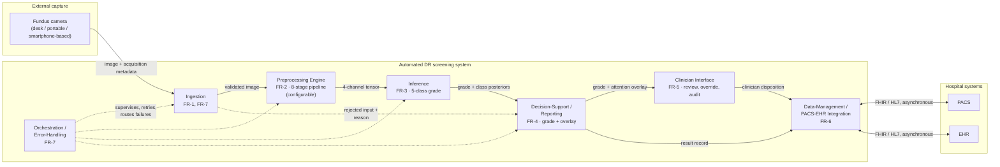
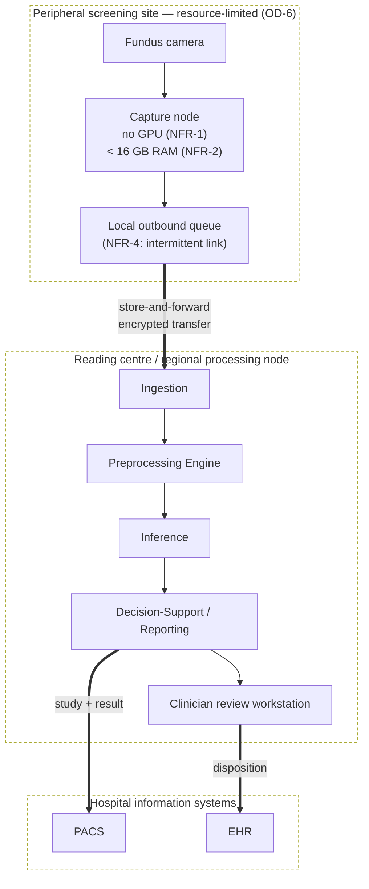
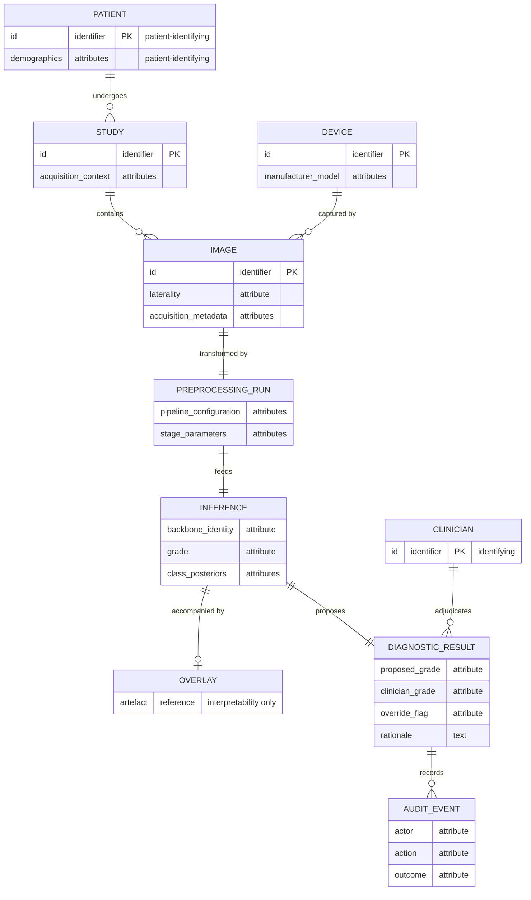

# Б қосымшасы — Жүйе архитектурасының диаграммалары

> Қазақ тіліндегі аударма. Бастапқы мәтін: `drafts/C-draft.md`. Аудару бақылауы: `glossary/GLOSSARY_KZ.md`, `prompts/translation-directive.md` v6.0.0. **Mermaid бастапқы коды әдейі дәлме-дәл сақталған**: қосымшаның өзі айтқандай, бастапқы код — диаграмманың анықтамасы, ал оның түйін белгілері техникалық терминдер мен басқару кодтары (FR-*, NFR-*, PACS, EHR), оларды аудару директивасы ағылшын түрінде қалдырады; бірдей бастапқы код екі тілдік нұсқаның да бірдей суретті рендерлеуін кепілдейді. **Конверсия талабы: төрт mermaid фенсі конвертация кезінде рендерленуге тиіс.** SB-4.1 (жоба сипаттамасы, прототип жоқ) кіріспеде және жабатын бөлімде, SB-4.2/NC-9 (GDPR/HIPAA — куәландырылған сәйкестік емес) §Б.4-те, NC-14 (overlay локализация емес) §Б.3-те, SB-1.3 (дәрігердің шешімі — соңғы қадам) сол жерде.

---

## 1-БӨЛІК: БӨЛІМ МӘТІНІ

Бұл қосымша 6-тарауда көрсетілген скрининг-жүйе архитектурасының формальды құрылымдық көріністерін береді: компоненттік көріністі, орналастыру көрінісін, бір скрининг эпизодының тізбектік көрінісін және сақталатын деректер моделін. Олар бірге DIA-6.3 деп қалдырылған диаграмманы разрядтайды.

Олардың не екені оқылмас бұрын мәлімделуге тиіс. Әрқайсысы — **жоба сипаттамасы**. Бұл архитектураның ешбір прототипі іске асырылмаған, ешбір орналастыру клиникалық жағдайда сыналмаған, әрі бұл диаграммалардағы ештеңе жүйенің сызылғандай жұмыс істейтінінің дәлелі емес. Әр элемент 6-тараудағы мәлімдемеге бақыланады; 6-тарау қандай да бір егжей-тегжейді бекітпеген жерде ол егжей-тегжей мұнда таңдалмай, түсіріліп қалдырылады, сондықтан диаграммаларда диссертация прозада жасамаған ешбір жобалық шешім жоқ.

Диаграммалар Mermaid белгіленуіндегі диаграмма бастапқы коды түрінде беріледі. Бастапқы код — диаграмманың анықтамасы; кескінге түрлендіру құжатты конвертациялау кезінде орындалады.

### Б.1 Компоненттік көрініс

**Б.1-диаграмма. Берілетін және талап етілетін интерфейстері бар модульдік ыдырату (DIA-6.3a).**



Көрініс өз алдына емес, талаптар салыстыруына қарсы оқылуға тиіс. Б.1-кесте сол салыстыруды қайта мәлімдейді, сонда әр модульді өзі қанағаттандыру үшін бар талапқа қарсы тексеруге болады.

**Б.1-кесте. Модуль → функционалдық талап → басқарушы функционалдық емес талап.**

| Модуль | Іске асырады | Басқарушы NFR | Қай жерде көрсетілген |
|---|---|---|---|
| Ingestion (қабылдау) | FR-1, FR-7 | NFR-4, NFR-8 | §6.1.2 (шекара); §6.3.1 (түсіру, телемедицина) |
| Preprocessing Engine (алдын ала өңдеу қозғалтқышы) | FR-2 | NFR-2, NFR-3, NFR-5 | §6.2.1 |
| Inference (қорытынды шығару) | FR-3 | NFR-1, NFR-2, NFR-3 | §6.2.2 |
| Decision-Support / Reporting (шешім қолдауы / есеп беру) | FR-4 | NFR-3, NFR-5 | §6.2.2, §6.3.2 |
| Clinician Interface (дәрігер интерфейсі) | FR-5 | NFR-5 | §6.3.2 |
| Data-Management / PACS-EHR Integration (деректерді басқару / PACS-EHR интеграциясы) | FR-6 | NFR-4, NFR-6, NFR-7 | §6.1.2; §6.4.1 |
| Orchestration / Error-Handling (оркестрлеу / қателерді өңдеу) | FR-7 | NFR-4, NFR-8 | §6.1.2 |

Ыдыратудың екі ерекшелігі кездейсоқ емес, құрылымдық. Preprocessing Engine — жүйе шекарасынан тыс тұрған дерек дайындау утилитасы емес, inference жолындағы бірінші дәрежелі модуль, ал бұл — диссертацияның орталық ұстанымының архитектуралық өрнегі. Әрі Ingestion-нан Reporting-ке қарай бас тартылған кіріс жолы айқын сызылған: FR-7 бұрмаланған, сапасы төмен немесе келісімнен тыс кірістердің үнсіз сәтсіздіксіз өңделуін талап етеді, сондықтан бас тарту — жоқ нәтиже емес, хабарланған нәтиже.

### Б.2 Орналастыру көрінісі

**Б.2-диаграмма. Сақта-да-жөнелт орналастыру топологиясы (DIA-6.3b).**



Бұл — функционалдық емес қабық жобаны кесіп-пішетін көрініс. Шеткі алаң inference үдетуін де, үздіксіз байланысты да талап етпейтін болып көрсетілген: онда тек түсіру мен кезекке қою орын алады, ал тасымалдау шекарасы құрылысы бойынша асинхронды (NFR-4). Балама топология — түсіру нүктесіндегі inference — қағида жүзінде алынып тасталмайды, бірақ мұнда көрсетілген құрылым ол емес, әрі 6-тарау сақта-да-жөнелт формасын дәл OD-6-ның байланыс шартынан аман шығатыны үшін таңдайды.

### Б.3 Тізбектік көрініс

**Б.3-диаграмма. Бір скрининг эпизоды: түсіруден сақталған шешімге дейін (DIA-6.3c).**

```mermaid
sequenceDiagram
  autonumber
  actor OP as Operator
  participant CAM as Camera
  participant ING as Ingestion
  participant PRE as Preprocessing Engine
  participant INF as Inference
  participant REP as Reporting
  actor CLIN as Clinician
  participant DM as Data-Management

  OP->>CAM: acquire fundus image
  CAM->>ING: image + acquisition metadata
  alt input valid
    ING->>PRE: validated image
    PRE->>PRE: stages 0-5, 7 (fixed transform)
    PRE->>INF: 4-channel tensor
    INF->>REP: five-class grade + posteriors
    REP->>REP: generate post-hoc attention overlay
    REP->>CLIN: grade + overlay (decision support)
    CLIN->>CLIN: interpret; may override
    CLIN->>DM: diagnosis + disposition + rationale
    DM->>DM: persist record; write audit event
    DM-->>REP: acknowledgement
  else input rejected (FR-7)
    ING->>REP: rejection + reason
    REP->>CLIN: rejection notice, no grade issued
  end
```

Реттіліктің екі қасиеті — диаграмманың мәні. Дәрігердің шешімі — **соңғы** қадам: жүйе дәреже мен қоса берілетін overlay шығарады, ал диагнозды дәрігер қояды, ол жүйенің шығысын жоққа шығара алады әрі оның негіздемесі сақталады. Жүйе — physician-in-the-loop парадигмасы аясындағы шешім қолдауы әрі дербес диагностикалық аспап емес. Ал назар overlay-ы дәрежеден кейін, *post hoc*, оны сүйемелдейтін интерпретациялау артефактісі ретінде генерацияланады — ол градиентпен салмақталған активациясы жоғары аймақтарды көрсетеді әрі патологияны пиксел деңгейінде шекаралауды немесе локализация шығысын құрамайды.

Бас тарту тармағы сызылған, өйткені жарамсыз кіріске үнсіз сәтсіздікпен жауап беретін скрининг жүйесі — сәтсіздікті хабарлайтын жүйеден өзгеше әрі қауіптірек жүйе; FR-7 соңғысын талап етеді.

### Б.4 Деректер көрінісі

**Б.4-диаграмма. Сақталатын мәндер моделі (DIA-6.3d).**



Пациенттің немесе дәрігердің бірегейлігін алып жүретін мәндер белгіленген, өйткені қауіпсіздік талабы дәл сол жерде шоғырланады. 6-тарау шифрлауды, аутентификацияны, рөлге негізделген қолжетімділікті бақылауды, деидентификацияны және аудитті модульдер арасына таратпай, деректерді басқару шекарасына орналастырады, ал себебі — осы модель: бірегейлендіретін атрибуттар дәл сол шекара иеленетін мәндерде сақталады. Аудит жазбасы бірінші дәрежелі мән ретінде модельденген, өйткені кімнің нені жоққа шығарғаны туралы тұрақты жазбасы жоқ жоққа шығару арнасы — есеп берушілік механизмі тек атауы бойынша ғана.

Бұл мәндер меңзейтін қауіпсіздік ережелері — **жобасы бойынша GDPR/HIPAA-мен тураланған**. Олар куәландырылған сәйкестік мәртебесі емес, ешбір сәйкестікті бағалау жүргізілмеген, әрі бұл модельмен қандай да бір заң талабы қанағаттандырылды деп бекітілмейді.

### Осы диаграммалардың мәртебесі

Төрт көріністің әрқайсысы §6.1.1 талаптар сипаттамасының және §6.1.2 ыдыратуының бір бөлігін қанағаттандырады, әрі әрқайсысы Б.1-кесте арқылы соған бақыланады. Олардың ешқайсысы мінез-құлық туралы дәлел емес. Олар салынған жүйенің не істейтінін емес, жүйенің не болатынын көрсетеді: ешбір прототип жоқ, ешбір клиникалық жағдайда дала сынағы жүргізілмеген, әрі мұндағы ешбір диаграмма кідіріс, өткізу қабілеті, қызметтегі сенімділік, клиникалық пайдалылық немесе нормативтік мәртебе туралы тұжырым алып жүрмейді.

## 2-БӨЛІК: ТЕРМИН ҚОЛДАНЫСЫ ЕСЕБІ

| Ағылшын термині | Қолданылған қазақша форма | GLOSSARY_KZ сілтемесі | Алғаш қолданылған жері |
|---|---|---|---|
| Preprocessing Engine | Preprocessing Engine (алдын ала өңдеу қозғалтқышы) | B-бөлім | Б.1-кесте |
| Inference | inference (аударылмайды) | A/B-бөлім | Б.1-кесте |
| Physician-in-the-Loop | physician-in-the-loop | B-бөлім | §Б.3 |
| Attention Map / Overlay | назар overlay-ы | B-бөлім | §Б.3 |
| PACS / EHR | PACS / EHR (аударылмайды) | A-бөлім | Б.1-кесте |
| Store-and-Forward | сақта-да-жөнелт | B-бөлім | §Б.2 |
| Data Management | деректерді басқару | B-бөлім | §Б.4 |

### Аудармашы ескертуі

**Төрт mermaid блогының бастапқы коды бір таңбаға дейін өзгертілмей қалдырылды** әрі бұл машинамен расталды. Себебі үшеу: (1) қосымшаның өзі бастапқы кодты «диаграмманың анықтамасы» деп атайды, сондықтан оны өзгерту диаграмманы өзгерту болар еді; (2) түйін белгілері техникалық терминдер мен басқару кодтары (FR-1…FR-7, NFR-1…NFR-8, PACS, EHR, Preprocessing Engine), ал аудару директивасы оларды ағылшын түрінде қалдырады; (3) бірдей бастапқы код екі тілдік нұсқаның да бірдей суретті рендерлеуін кепілдейді. Б.1-кестеде модуль атаулары ағылшын түрінде сақталып, жақша ішінде қазақша түсіндірмесі берілді — сонда диаграммамен сәйкестік бұзылмайды. Аудармада төрт шекара сақталды: SB-4.1 («жоба сипаттамасы», прототип те, дала сынағы да жоқ) кіріспеде және жабатын бөлімде; NC-14 — overlay «пиксел деңгейінде шекаралауды немесе локализация шығысын құрамайды»; SB-1.3 — дәрігердің шешімі **соңғы** қадам әрі жүйе дербес аспап емес; SB-4.2/NC-9 — GDPR/HIPAA «жобасы бойынша тураланған», куәландырылған сәйкестік емес. FR-7 бойынша бас тарту тармағының неге сызылғаны да («үнсіз сәтсіздік — қауіптірек жүйе») қалдырылды.
